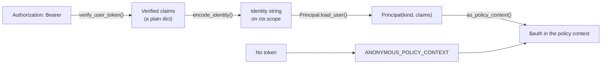

Every [policy](/policies/overview) decides against a **context**, and the most important part of that context is `auth`: everything the engine knows about the caller from their access token, resolved once by `Principal.as_policy_context()` and handed to every condition unchanged. This page is the field-by-field reference for `$auth` — what each path holds, where it comes from, whether it's decided before or after a record is fetched, and a realistic policy for each one. Read [policies overview](/policies/overview) and [shorthands](/policies/shorthands) first if you haven't; this page assumes you already know what a condition and a shorthand are.

<Note>
Everything on this page describes the **user** identity context — a signed-in caller, or the anonymous placeholder. `$credential` (the API key) and `$record`/`$input`/`$request` are separate parts of the same context, covered in the [context reference](/policies/context). This page is only about `$auth`.
</Note>

## Where `$auth` comes from

Sillo puts an authenticated caller on `ctx.user` as a `Principal` — built from the **verified claims** of the access token, nothing more. When a policy is evaluated, `policy_auth(ctx.user)` calls `Principal.as_policy_context()` if there's a `Principal`, or returns a fixed anonymous shape otherwise:



Nothing here calls Akountz, the database, or any other service. Every field on `$auth` was already inside the JWT the moment it arrived — that's the entire point of putting roles, permissions, org and assurance level into the token at sign-in ([tokens and sessions →](/auth/tokens-and-sessions)) rather than looking them up per request. A policy evaluation never waits on identity I/O.

## The complete field reference

| Path | Type | Signed-in value | Anonymous value | Source claim | Decided without `$record`? |
| --- | --- | --- | --- | --- | --- |
| `$auth.authenticated` | boolean | `true` | `false` | — (computed) | Yes |
| `$auth.kind` | string | `"user"` (or `"operator"`, `"service"`) | `"anonymous"` | — (computed from `Principal.kind`) | Yes |
| `$auth.user_id` | string | the user's id, as a string | `null` | `sub` | Yes |
| `$auth.email` | string \| null | the user's email | `null` | `email` | Yes |
| `$auth.roles` | array of string | environment roles | `[]` | `roles` | Yes |
| `$auth.permissions` | array of string | environment permissions | `[]` | `perms` | Yes |
| `$auth.org` | string \| null | scoped organization slug | `null` | `org` | Yes |
| `$auth.org_role` | string \| null | role in that organization | `null` | `org_role` | Yes |
| `$auth.aal` | string \| null | `"aal1"` or `"aal2"` | `null` | `aal` | Yes |
| `$auth.session_id` | string \| null | the token family | `null` | `sid` | Yes |
| `$auth.claims` | object | the full verified claims | `{}` | — (the whole payload) | Yes (only leaf reads on it are `$deferred` the same as any other path) |
| `$auth.claims.app` | object | admin-controlled `app_metadata` | not present | `app` | Yes |
| `$auth.claims.meta` | object | user-editable `user_metadata` | not present | `meta` | Yes |

Every path above is resolved from the token alone, so a policy that reads only these paths is **fully decided before any row is fetched** — for a `list` operation that means the whole request is either unrestricted or refused with no SQL at all, before [pushdown](/policies/pushdown) even has anything to plan. It's only once a condition mixes in `$record` or `$input` that anything becomes per-row.

## Field by field

### `$auth.authenticated`

`true` for any request carrying a verified, non-expired token for this project environment; `false` for anonymous requests, including ones made with only an API key.

```json
{ "eq": ["$auth.authenticated", true] }
```

This is exactly the built-in `authenticated` shorthand and built-in policy — see [shorthands: authenticated](/policies/shorthands#authenticated). Use `{"authenticated": false}` for the inverse: gate a route so only anonymous callers can reach it (a sign-up-style endpoint you don't want an already-signed-in user hitting by accident).

<Note>
A request using a **secret key** with no bearer token has `authenticated: false` too — `authenticated` is about a *person*, not about how privileged the request is. Secret keys bypass every policy before any condition is evaluated at all ([policies overview §Secret keys bypass policies](/policies/overview#secret-keys-bypass-policies)), so this distinction rarely matters in practice, but it explains why `{"authenticated": true}` alone is never a check for "is this the platform itself."
</Note>

### `$auth.kind`

One of four values: `"user"` (a project's end user signed in with a token), `"operator"` (a Studio user acting through the Platform API), `"service"` (one Pawabase service calling another), or `"anonymous"`.

```json
{ "eq": ["$auth.kind", "user"] }
```

```json
{ "any": [ { "eq": ["$auth.kind", "operator"] }, { "eq": ["$auth.kind", "service"] } ] }
```

The second example is exactly what `{"service": true}` expands to — see [shorthands: service](/policies/shorthands#service). Use `kind` directly instead of `service` when you want to distinguish `operator` from `service` specifically (for example, an audit-trail policy that treats Studio-driven changes differently from machine-to-machine ones), which `service` alone can't express since it treats both as one bucket.

### `$auth.user_id`

The signed-in user's id, always as a **string** — even though the underlying database column is an integer. Comparisons in the engine normalise both sides (`_norm()` in the policy engine turns ints into strings before comparing), so `{"eq": ["$record.owner_id", "$auth.user_id"]}` works whether `owner_id` arrives from the database as `8` or from a token as `"8"`.

```json
{ "eq": ["$record.author_id", "$auth.user_id"] }
```

This is precisely what `{"owner": "author_id"}` expands to, wrapped with an `authenticated` check so an anonymous caller (`user_id: null`) never accidentally "owns" a row whose column happens to be `null` — see [shorthands: owner](/policies/shorthands#owner).

**Ten realistic examples using `user_id` beyond plain ownership:**

```json
// A user editing their own comment, but not after it's been marked resolved
{ "all": [
  { "eq": ["$record.author_id", "$auth.user_id"] },
  { "ne": ["$record.status", "resolved"] }
] }
```

```json
// A user reading either their own order, or one they're the delivery driver for
{ "any": [
  { "eq": ["$record.customer_id", "$auth.user_id"] },
  { "eq": ["$record.driver_id", "$auth.user_id"] }
] }
```

### `$auth.email`

The verified claim, always the value at token-issue time (Akountz copies `user.email` into the token; a subsequent `PATCH /auth/v1/user` email change doesn't retroactively rewrite tokens already issued).

```json
{ "ends_with": ["$auth.email", "@acme-staff.example"] }
```

Domain-based rules like this are a convenient stand-in for "is this an internal account" **before** you've built out proper roles, but they're fragile — anyone who can register with that domain gets the policy's trust. Prefer [roles](/auth/roles-and-permissions) for anything that matters; reach for an email comparison only for low-stakes conveniences (defaulting a support ticket's category based on the reporter's domain, say).

```json
// Restrict a beta feature route to a fixed allowlist held in project data, not the policy itself
{ "in": ["$auth.email", ["ada@example.com", "bob@example.com"]] }
```

Hard-coding emails into a policy works for a handful of testers; for anything that grows, model it as data (a resource, or `app_metadata`) instead of editing the policy every time.

### `$auth.roles`

Environment roles — see [roles and permissions →](/auth/roles-and-permissions) for how they're defined and assigned. Almost always read through the `role` shorthand rather than directly:

```json
{ "contains": ["$auth.roles", "editor"] }
```

```json
// { "role": ["editor", "admin"] } expands to exactly this
{ "any": [
  { "contains": ["$auth.roles", "editor"] },
  { "contains": ["$auth.roles", "admin"] }
] }
```

Reading `$auth.roles` directly (rather than via the shorthand) is useful when you need something the shorthand doesn't offer — counting roles, or checking that the caller holds **none** of a list:

```json
// Refuse anyone who holds the "suspended" role, regardless of what else they hold
{ "not": { "contains": ["$auth.roles", "suspended"] } }
```

```json
// A caller with more than one staff role gets the escalated queue (illustrative — arrays
// don't have a length operator, so this counts by checking each membership explicitly)
{ "all": [
  { "contains": ["$auth.roles", "teacher"] },
  { "contains": ["$auth.roles", "form_tutor"] }
] }
```

### `$auth.permissions`

Same shape as `roles`, resolved from the caller's roles' permissions plus any granted directly ([roles and permissions →](/auth/roles-and-permissions#permissions)). Use the `permission` shorthand for the normal case (which also handles the `*` wildcard):

```json
{ "permission": ["finance.read", "finance.export"] }
```

Reading it directly is useful for `any`-of-permissions logic, since the shorthand's list form means **all**:

```json
// Any one of several equivalent permissions unlocks the route
{ "any": [
  { "contains": ["$auth.permissions", "reports.publish"] },
  { "contains": ["$auth.permissions", "reports.admin"] },
  { "contains": ["$auth.permissions", "*"] }
] }
```

### `$auth.org` and `$auth.org_role`

Covered in full in [organizations →](/auth/organizations#organizations-in-policies). In summary: `org` is the slug the current session is scoped to (or `null`), `org_role` is the caller's membership role in it (`owner`/`admin`/`member`/`viewer`, or `null`). There's no shorthand for either — compare them directly:

```json
// Tenant isolation
{ "eq": ["$record.store_id", "$auth.org"] }
```

```json
// Tenant isolation + a role floor
{ "all": [
  { "eq": ["$record.store_id", "$auth.org"] },
  { "in": ["$auth.org_role", ["owner", "admin"]] }
] }
```

```json
// Org owner only — transferring ownership, deleting the tenant's data
{ "eq": ["$auth.org_role", "owner"] }
```

```json
// Combine an environment role with an org role: platform staff always in,
// otherwise the caller must be an org admin of the record's own tenant
{ "any": [
  { "role": "platform_admin" },
  { "all": [
    { "eq": ["$record.store_id", "$auth.org"] },
    { "in": ["$auth.org_role", ["owner", "admin"]] }
  ] }
] }
```

This last shape is exactly the commerce blueprint's pattern: `platform_admin` is an environment role checked with `role`, store-level access is an org role checked with a comparison, and both can gate the same resource.

### `$auth.aal`

The authentication assurance level: `"aal1"` for a plain sign-in, `"aal2"` once the session has passed an MFA challenge. Full mechanics, including exactly why MFA-enrolled users always get `aal2`, are in [MFA →](/auth/mfa).

```json
{ "eq": ["$auth.aal", "aal2"] }
```

That's the `aal` shorthand and, combined with `authenticated`, the built-in `mfa` policy:

```json
{ "all": [ { "authenticated": true }, { "aal": "aal2" } ] }
```

```json
// Refunds: an org manager, with a second factor
{ "all": [
  { "eq": ["$record.store_id", "$auth.org"] },
  { "in": ["$auth.org_role", ["owner", "admin"]] },
  { "aal": "aal2" }
] }
```

```json
// A spending cap that only needs 2FA above a threshold
{ "any": [
  { "lte": ["$input.amount_minor", 500000] },
  { "aal": "aal2" }
] }
```

### `$auth.session_id`

The Sillo token family (`sid` claim) — the same value `session_id` in a `/auth/v1/token` response and the `id` field in `GET /auth/v1/sessions`. Rarely used inside a policy condition itself (it's an opaque id with nothing to compare it to in most records), but it shows up in **audit and Python policies** that need to correlate a request back to a specific session:

```python
@policy("not_this_session", description="Anything except the caller's current session")
async def not_this_session(context):
    target = (context.get("record") or {}).get("session_id")
    return target is not None and target != context["auth"].get("session_id")
```

Useful for building "sign out this session" UI where the list of sessions itself is a resource-backed view and you want to visually distinguish, or restrict actions on, the current one.

### `$auth.claims`

The full verified claims dict — everything that was actually inside the JWT, including fields no other `$auth` path surfaces individually (`sub`, `aud`, `iss`, `prj`, `env`, `jti`, `iat`, `exp`, `typ`). Reach for `$auth.claims.<x>` when you need a raw claim the higher-level paths don't expose:

```json
// Refuse tokens from a foreign project namespace (defence in depth; the gateway
// and verify_user_token() already enforce this, but a policy can double-check)
{ "eq": ["$auth.claims.iss", "pawabase:akountz:acme"] }
```

In practice you'll reach for `$auth.claims.app` and `$auth.claims.meta` far more than the raw envelope — see below.

### `$auth.claims.app` — administrator-controlled, safe for policies

`app` (`app_metadata`) is data **only an administrator, a service key, or Studio can write** — see `AdminUserUpdate.app_metadata` in the [admin API](/auth/managing-users#updating-a-user) and the model docstring: *"Data only the application (service keys, Studio) may edit."* Because an ordinary user token can never modify it, it's safe to build access decisions on:

```json
// Feature-flagged by an administrator, not by the user themself
{ "eq": ["$auth.claims.app.plan", "pro"] }
```

```json
// A department id an admin assigned, used to scope a resource by department
{ "eq": ["$record.department_id", "$auth.claims.app.department_id"] }
```

```json
// A hard cap an operator set per account, checked against the request
{ "lte": ["$input.seats", "$auth.claims.app.max_seats"] }
```

This is exactly the pattern the [Python policies example](/policies/overview#in-python) in the policies overview uses for `same_department`, reading `department_id` from `claims.app` specifically — not `claims.meta` — because only that field is trustworthy for an access decision.

### `$auth.claims.meta` — user-editable, never for access decisions

`meta` (`user_metadata`) is data the **user themself can edit** through `PATCH /auth/v1/user`'s `data` field, merged straight into `user.user_metadata`. It's for profile data — a display preference, an avatar crop, an onboarding-completed flag — never for anything a policy uses to grant access.

<Warning>
**Never use `$auth.claims.meta` in an access decision.** Because the user can set it themselves through a normal, unprivileged request, a policy like `{"eq": ["$auth.claims.meta.role", "admin"]}` is not a permission check at all — it's a door any signed-in user can open by sending `{"data": {"role": "admin"}}` to `PATCH /auth/v1/user`. If you need administrator-controlled data in a policy, put it in `app_metadata` (`$auth.claims.app`) instead, which only an admin, a service key or Studio can write. This is the single most important distinction on this page — get it wrong and every "role" you store there is a self-assigned one.
</Warning>

Legitimate, non-access uses of `meta` in a policy are rarer but real — reflecting a user's own stated preference back into a decision that doesn't grant anything sensitive:

```json
// Show a "beta" banner condition — cosmetic, not an access boundary
{ "eq": ["$auth.claims.meta.opted_into_beta", true] }
```

```json
// A support route that reads the user's own stated locale to pick a template —
// still fine, because nothing here grants or denies access, only shapes a response
{ "eq": ["$auth.claims.meta.locale", "$record.locale"] }
```

If you're ever unsure whether a given field belongs in `app` or `meta`, ask: *could the user themself set this value to get more access?* If yes, it must be `app`.

## `$auth` for the anonymous caller

Every field is present, just empty or `null` — there's no missing-key surprise to guard against:

```json
{
  "authenticated": false,
  "kind": "anonymous",
  "user_id": null,
  "email": null,
  "roles": [],
  "permissions": [],
  "org": null,
  "org_role": null,
  "aal": null,
  "session_id": null,
  "claims": {}
}
```

This means a condition like `{"contains": ["$auth.roles", "admin"]}` is safely `false` for anonymous callers rather than erroring, and `{"eq": ["$record.owner_id", "$auth.user_id"]}` is safely `false` rather than matching a row whose `owner_id` happens to be `null` (because `_compare`'s `eq` uses `_norm()`, and `None == None` would actually be `true` — which is exactly why `owner` always ANDs in `authenticated` first; see the warning in [shorthands: owner](/policies/shorthands#owner) and don't skip that half if you write the comparison by hand).

<Warning>
If you write your own `eq` comparison against `$auth.user_id` **without** first checking `$auth.authenticated`, an anonymous caller (`user_id: null`) will match any record whose comparison column is also `null`. Always pair a raw `user_id` comparison with `{"authenticated": true}`, the way the `owner` shorthand does automatically — or just use `owner`.
</Warning>

## `$auth.claims` vs the token payload: what's actually on the wire

For completeness, here's a full access token's claims next to the `$auth` context they produce, so you can see exactly which claim feeds which path:

<CodeGroup>
```json Token claims (verify_user_token result)
{
  "sub": "8",
  "aud": "authenticated",
  "iss": "pawabase:akountz:acme",
  "prj": "acme",
  "env": "production",
  "sid": "f3d9c2a1e8b74d0f",
  "jti": "01933a…",
  "iat": 1798533542,
  "exp": 1798534442,
  "typ": "access",
  "aal": "aal2",
  "email": "ada@acme.example",
  "roles": ["editor"],
  "perms": ["posts.write"],
  "org": "acme-inc",
  "org_role": "owner",
  "meta": { "locale": "en-NG" },
  "app": { "plan": "pro", "department_id": 4 }
}
```
```json Resulting $auth
{
  "authenticated": true,
  "kind": "user",
  "user_id": "8",
  "email": "ada@acme.example",
  "roles": ["editor"],
  "permissions": ["posts.write"],
  "org": "acme-inc",
  "org_role": "owner",
  "aal": "aal2",
  "session_id": "f3d9c2a1e8b74d0f",
  "claims": { "...every claim on the left, unchanged...": "..." }
}
```
</CodeGroup>

Everything on the right is derived from claims already on the left — nothing is fetched fresh. That's the whole reason a policy check never needs to call Akountz.

## `$auth` versus `$credential`: don't confuse the two

A common mistake is reaching for `$auth` to answer a question that's actually about the **API key**, or vice versa. They're separate parts of the context, populated from separate things:

| | `$auth` | `$credential` |
| --- | --- | --- |
| Populated from | the **Bearer token** (or absence of one) | the **`apikey` header**, resolved by the gateway |
| Answers | "who is this person?" | "what can this specific key do?" |
| Present on every request? | Always (anonymous shape if no token) | Always (an API key is required to reach the platform at all) |
| Relevant fields | `authenticated`, `user_id`, `roles`, `permissions`, `org`, `aal`, … | `role` (`publishable`/`secret`), `is_service`, `scopes`, `key_id` |
| Bypasses policies? | Never, by itself | Yes, when `is_service` is true (a secret key or operator) |

```json
// Correct: a user permission check
{ "permission": "reports.publish" }
```

```json
// Correct: a key scope check (for partner/machine integrations)
{ "scope": "partner:orders" }
```

```json
// Wrong: this checks the caller's *permission*, not whether the key that carried
// the request has any particular scope — usually not what "requires a scoped key" means
{ "eq": ["$auth.permissions", ["partner:orders"]] }
```

See the [context reference](/policies/context) for `$credential`'s full field list; this page stays scoped to `$auth`.

## Testing a policy against `$auth` fields

The fastest way to see exactly what `$auth` looks like for a given token, without writing a policy at all, is to decode the token and compare it to the table above — every field on `$auth` traces to a named claim. In development, Studio's Observability page shows the resolved policy context (including `auth`) for each request it records, which is the quickest way to confirm a field is what you expect before debugging the policy logic itself. See [debugging policies →](/policies/debugging).

## Common mistakes

<AccordionGroup>
  <Accordion title="Using $auth.claims.meta for anything access-related">
    Covered at length above — it's user-writable. If a check ever needs to be trustworthy, it belongs in `$auth.claims.app`, `$auth.roles`, `$auth.permissions`, or a record field, never `$auth.claims.meta`.
  </Accordion>
  <Accordion title="Assuming $auth.org_role means the same thing as $auth.roles">
    They're unrelated vocabularies from unrelated systems: `roles` is environment-wide RBAC from Akountz; `org_role` is the caller's membership role in whichever organization the token happens to be scoped to right now, and is `null` for an unscoped token. See [organizations](/auth/organizations#the-model-in-one-paragraph).
  </Accordion>
  <Accordion title="Comparing $auth.user_id to a numeric literal">
    `$auth.user_id` is always a string. `{"eq": ["$auth.user_id", 8]}` still works because the engine's `_norm()` stringifies both sides before comparing — but writing `"8"` is clearer and matches what you'll see if you print the context for debugging.
  </Accordion>
  <Accordion title="Forgetting aal never downgrades within a session">
    A session that reached `aal2` keeps it on every refresh until the user signs out and back in without MFA — there's no automatic step-down after some idle period. If a sensitive action needs a **fresh** MFA confirmation rather than merely "MFA happened at some point this session," that's not something `$auth.aal` alone can express; you'd need a custom, time-boxed challenge of your own. See [MFA →](/auth/mfa#why-mfa-users-always-get-aal2).
  </Accordion>
  <Accordion title="Expecting $auth to include roles or claims from another project or environment">
    A token is only ever valid for the exact project and environment it was minted for — `verify_user_token()` checks `prj`/`env` and refuses a mismatch before a `Principal` is even built. There's no cross-environment `$auth` state to accidentally leak.
  </Accordion>
</AccordionGroup>

## FAQ

<AccordionGroup>
  <Accordion title="Can $auth include fields my project doesn't use, like org, even if I never call the orgs API?">
    Yes — every field in the table is always present with its empty/null default. Organizations, MFA and permissions are opt-in **features**, not opt-in **context shapes**; a project that never creates an organization simply always sees `org: null`.
  </Accordion>
  <Accordion title="Is $auth available to Python policies the same way?">
    Yes, identically — a Python policy receives the same `context` dict, so `context["auth"]["org_role"]` or `context["auth"]["claims"]["app"]` work exactly as shown here. See [Python policies →](/policies/python-policies).
  </Accordion>
  <Accordion title="Can a flow read $auth outside of a policy.check block?">
    A flow triggered by an HTTP route or a direct invocation has the same context available; consult the [context reference](/policies/context) for exactly which entry points expose which context sections, since some (an event subscription, a schedule) have no caller and therefore no meaningful `$auth`.
  </Accordion>
  <Accordion title="Why isn't there an $auth.name or $auth.avatar_url?">
    The token only carries what policies plausibly need to make access decisions with — identity, roles, permissions, org, assurance level. Profile fields like name and avatar live on the user record and are returned by `GET /auth/v1/user`, not copied into every access token's claims.
  </Accordion>
  <Accordion title="Does $auth ever contain a password or secret?">
    Never. The claims are exactly what `issue_user_token()` puts in, and nothing there is a secret — see [security model →](/auth/security-model) for what a token can and can't do if it leaks.
  </Accordion>
</AccordionGroup>

## Next

<CardGroup cols={2}>
  <Card title="Organizations" icon="building" href="/auth/organizations">The full org and org_role reference, with a worked multi-tenant example.</Card>
  <Card title="MFA" icon="shield-check" href="/auth/mfa">Everything about aal1/aal2 and enrolling a second factor.</Card>
  <Card title="Roles and permissions" icon="users" href="/auth/roles-and-permissions">Defining what $auth.roles and $auth.permissions actually contain.</Card>
  <Card title="Context reference" icon="brackets" href="/policies/context">Every path, per entry point — $auth, $credential, $record, $input, $request and more.</Card>
</CardGroup>
