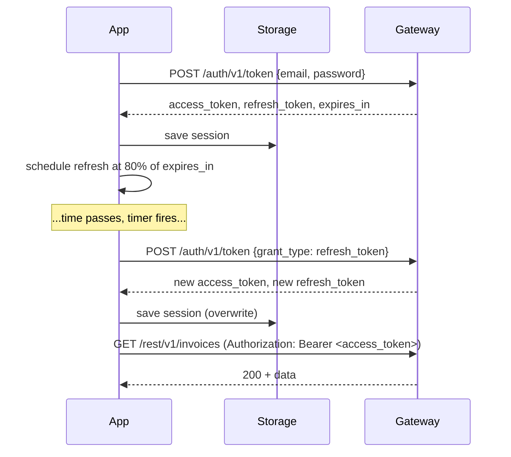

Every Pawabase client — a React app, a mobile app, a server-side script — talks to the same gateway with the same two headers: `apikey` for the project environment, and `Authorization: Bearer <access_token>` once a user is signed in. This page is the reference implementation for the part every client has to get right: where tokens live, how they're attached, when they're refreshed, and what happens the instant a request comes back `401`. It closes with the pattern used across the repo's own example frontends, so you're not inventing this from scratch.

<CardGroup cols={3}>
  <Card title="Two headers, always" icon="key">`apikey` identifies the project environment; `Authorization: Bearer` identifies the caller. Neither is optional once you're past anonymous browsing.</Card>
  <Card title="Refresh ahead of expiry" icon="refresh-cw">Don't wait for a 401 to refresh — a short access-token TTL means near-constant silent refreshing is normal and expected.</Card>
  <Card title="One client, one queue" icon="list-checks">Concurrent requests during a refresh must share one in-flight refresh, not each fire their own.</Card>
</CardGroup>

## The two headers, precisely

```
apikey: <publishable key for this project environment>
Authorization: Bearer <access_token>
```

| Header | What it identifies | Present on |
| --- | --- | --- |
| `apikey` | The **project environment** and the **credential's role** (publishable vs secret) | Every request, including anonymous ones |
| `Authorization: Bearer` | The **signed-in user**, if any | Only requests made after sign-in |

<Warning>
`apikey` in a browser or mobile app must always be the **publishable** key. A secret key bypasses every [policy](/policies/overview#secret-keys-bypass-policies) — if one ends up in client code, every access rule in your project is irrelevant for anyone who extracts it from the bundle. There is no client-side use case for a secret key; see [security model →](/auth/security-model#credential-roles) for exactly what each key role can do.
</Warning>

The gateway itself is documented in [request lifecycle →](/concepts/request-lifecycle) — this page only covers what a client does on its side of that boundary.

## What a session response gives you

Every route that produces a session — `/auth/v1/signup`, `/auth/v1/token` (all three grant types once complete), the OAuth callback fragment — returns the same shape:

```json
{
  "access_token": "eyJhbGciOi…",
  "refresh_token": "eyJhbGciOi…",
  "token_type": "bearer",
  "expires_in": 900,
  "expires_at": 1798534442,
  "session_id": "f3d9c2a1e8b74d0f",
  "org": null,
  "org_role": null,
  "user": { "id": "8", "email": "ada@example.com", "…": "…" }
}
```

| Field | Use it for |
| --- | --- |
| `access_token` | The `Authorization: Bearer` value on every subsequent request |
| `refresh_token` | Exchanged for a new pair once the access token is near expiry |
| `expires_in` | Seconds from **now** — the number to schedule a refresh timer from |
| `expires_at` | Absolute Unix timestamp — the number to compare against on app resume, safer than trusting a timer survived a background/suspend cycle |
| `session_id` | Matches an entry in `GET /auth/v1/sessions`, useful for "sign out this device" UI |
| `org`, `org_role` | Whether this session is scoped to an [organization](/auth/organizations), and the caller's role in it |
| `user` | Enough to render a signed-in UI immediately, without a follow-up `GET /auth/v1/user` |

Store all of it, not just `access_token` — `expires_at` in particular is what makes proactive refresh possible without guessing.

## Where to store tokens

<Tabs>
  <Tab title="Web (SPA)">
    The realistic options, in order of preference for most products:

    | Storage | Survives reload | XSS-exposed | CSRF-exposed | Notes |
    | --- | --- | --- | --- | --- |
    | In-memory (a JS variable / store) | No | No | No | Safest against theft; requires a silent refresh on every page load |
    | `localStorage` | Yes | Yes | No | Simplest; any script running on the page can read it |
    | `httpOnly` cookie, set by your own server | Yes | No | Yes (mitigate with `SameSite`) | Requires a server component in front of the gateway to set the cookie; Akountz itself doesn't set cookies for API tokens |

    Most Pawabase frontends — including the example blueprints in this repo — keep the access token **in memory** and the refresh token in `localStorage` (or, on a platform with it, a more restrictive storage API), refreshing once on load to re-establish the in-memory access token. This bounds the blast radius of a stray XSS to whatever's live in memory at that instant, while still surviving a page reload.

    <Warning>
    Akountz does not set any cookies itself for the token API — `access_token`/`refresh_token` are returned in the JSON body, and where they end up stored is entirely your client's decision. If you want `httpOnly` cookie storage, you need a thin server-side layer of your own between the browser and the gateway that receives the JSON response and re-issues it as a cookie; Pawabase doesn't do this for you.
    </Warning>
  </Tab>
  <Tab title="Mobile (React Native, Flutter, native)">
    Use the platform's secure storage primitive, never plain key-value storage:

    | Platform | API |
    | --- | --- |
    | iOS | Keychain |
    | Android | EncryptedSharedPreferences / the Android Keystore |
    | React Native | `react-native-keychain` or `expo-secure-store` |
    | Flutter | `flutter_secure_storage` |

    Store both tokens; there's no in-memory-only option on mobile the way there is for a web SPA, since the app can be backgrounded and killed at any time and needs to resume without forcing a fresh sign-in.
  </Tab>
  <Tab title="Server-to-server">
    A backend integration acting on its own behalf (not on behalf of a browsing user) almost never needs a **user** token at all — reach for a secret key with [scopes](/concepts/credentials#scopes) instead, which needs no storage strategy beyond an environment variable and rotation discipline. If the integration genuinely needs to act as a specific end user (a service account), store its refresh token the same way you'd store any long-lived server secret: an environment variable or secrets manager, never checked into source control.
  </Tab>
</Tabs>

## Attaching the token

<CodeGroup>
```javascript fetch wrapper
const GATEWAY = "https://gw.acme.example";
const PUBLISHABLE_KEY = "pk_live_…";

async function api(path, { token, ...init } = {}) {
  const res = await fetch(`${GATEWAY}${path}`, {
    ...init,
    headers: {
      apikey: PUBLISHABLE_KEY,
      ...(token ? { Authorization: `Bearer ${token}` } : {}),
      ...(init.body ? { "content-type": "application/json" } : {}),
      ...init.headers,
    },
  });
  return res;
}
```
```python requests (server-side / script client)
import requests

GATEWAY = "https://gw.acme.example"
PUBLISHABLE_KEY = "pk_live_..."

def api(path, token=None, **kwargs):
    headers = {"apikey": PUBLISHABLE_KEY, **kwargs.pop("headers", {})}
    if token:
        headers["Authorization"] = f"Bearer {token}"
    return requests.request(kwargs.pop("method", "GET"), f"{GATEWAY}{path}", headers=headers, **kwargs)
```
```swift URLSession (iOS)
var request = URLRequest(url: URL(string: "\(gateway)\(path)")!)
request.setValue(publishableKey, forHTTPHeaderField: "apikey")
if let token = accessToken {
    request.setValue("Bearer \(token)", forHTTPHeaderField: "Authorization")
}
```
</CodeGroup>

Build this once, centrally, and route every request through it. The single most common client bug in a Pawabase integration is a request built by hand somewhere that forgets one of the two headers — usually `apikey` on an otherwise-anonymous request, which fails with a gateway-level `401` before the request ever reaches a service.

## Signing in and establishing a session

```javascript
async function signIn(email, password) {
  const res = await api("/auth/v1/token", {
    method: "POST",
    body: JSON.stringify({ email, password }),
  });
  const body = await res.json();
  if (!res.ok) throw new AuthError(body.detail, res.status);
  if (body.mfa_required) {
    return { needsMfa: true, mfaToken: body.mfa_token, factors: body.factors };
  }
  saveSession(body);
  return { session: body };
}

async function completeMfa(mfaToken, code) {
  const res = await api("/auth/v1/token", {
    method: "POST",
    body: JSON.stringify({ grant_type: "mfa", mfa_token: mfaToken, code }),
  });
  const body = await res.json();
  if (!res.ok) throw new AuthError(body.detail, res.status);
  saveSession(body);
  return body;
}
```

A client that never checks `body.mfa_required` will treat a challenge response as a failed sign-in (there's no `access_token` to find) instead of routing to a code-entry screen — see [MFA: signing in once MFA is enabled →](/auth/mfa#signing-in-once-mfa-is-enabled) for the exact response shape to branch on.

## Refreshing before you're forced to

Access tokens are short-lived by default (commonly 15 minutes — see [token lifetimes](/auth/security-model#token-lifetimes)), so a client that only refreshes reactively, on a `401`, will refresh constantly and add a failed-then-retried round trip to a noticeable fraction of requests. The better pattern: **schedule a refresh ahead of expiry**, so the access token in memory is (almost) never actually expired when a request needs it.

```javascript
class SessionManager {
  #session = null;
  #refreshTimer = null;
  #refreshing = null; // a shared in-flight Promise, so concurrent callers don't each refresh

  async load() {
    const stored = await secureStorage.get("session");
    if (!stored) return;
    if (stored.expires_at * 1000 < Date.now()) {
      await this.#refresh(stored.refresh_token);
    } else {
      this.#session = stored;
      this.#scheduleRefresh();
    }
  }

  set(session) {
    this.#session = session;
    secureStorage.set("session", session);
    this.#scheduleRefresh();
  }

  #scheduleRefresh() {
    clearTimeout(this.#refreshTimer);
    // Refresh at 80% of the token's lifetime, never less than 10s from now.
    const delay = Math.max((this.#session.expires_in * 1000) * 0.8, 10_000);
    this.#refreshTimer = setTimeout(() => this.#refresh(this.#session.refresh_token), delay);
  }

  async #refresh(refreshToken) {
    // Share one in-flight refresh across every caller.
    if (this.#refreshing) return this.#refreshing;
    this.#refreshing = (async () => {
      const res = await api("/auth/v1/token", {
        method: "POST",
        body: JSON.stringify({ grant_type: "refresh_token", refresh_token: refreshToken }),
      });
      if (!res.ok) {
        this.#session = null;
        await secureStorage.remove("session");
        throw new SessionExpiredError();
      }
      const body = await res.json();
      this.#session = body;
      await secureStorage.set("session", body);
      this.#scheduleRefresh();
      return body;
    })();
    try {
      return await this.#refreshing;
    } finally {
      this.#refreshing = null;
    }
  }

  get accessToken() {
    return this.#session?.access_token ?? null;
  }

  async validToken() {
    if (!this.#session) return null;
    if (this.#session.expires_at * 1000 < Date.now() + 5_000) {
      await this.#refresh(this.#session.refresh_token);
    }
    return this.#session.access_token;
  }
}
```

Three things this handles that a naive implementation misses:

1. **Refreshing at 80% of lifetime, not 100%** — leaves headroom for clock skew and slow networks, so a request almost never races an about-to-expire token.
2. **One shared in-flight refresh** — without `#refreshing` as a shared promise, five components mounting at once after an app resume would each fire their own refresh call, and [refresh rotation](/auth/security-model#refresh-token-rotation) means only the *first* one to land actually succeeds; the rest look like reuse and can trip theft detection, revoking the whole session family. This is the single most important piece of client-side session code to get right.
3. **`validToken()` as the thing every request actually calls** — rather than reading `accessToken` directly, so a request made right as the timer is about to fire still gets a fresh token instead of a nearly-expired one.

<Warning>
Never let two independent code paths in the same client call `grant_type=refresh_token` concurrently with the same refresh token. Refresh tokens are **single-use** — the first exchange rotates and consumes it; a second, concurrent exchange with the same (now-consumed) token is treated as **reuse**, which [revokes the whole session family](/auth/security-model#refresh-token-rotation) as a theft-detection measure, signing the user out everywhere unexpectedly. Route every refresh through one queued function, as above.
</Warning>

## Handling a 401

Even with proactive refresh, a `401` can still happen — the access token expired despite the schedule (the device slept through the timer), or the session was revoked server-side (an operator disabled the account, or the user signed out on another device with `scope: "global"`). The client's job is to distinguish "just needs a refresh" from "genuinely signed out."

```javascript
async function authedFetch(path, init = {}) {
  const token = await session.validToken();
  let res = await api(path, { ...init, token });
  if (res.status === 401) {
    try {
      const refreshed = await session.forceRefresh();
      res = await api(path, { ...init, token: refreshed.access_token });
    } catch (e) {
      if (e instanceof SessionExpiredError) {
        redirectToSignIn();
        throw e;
      }
      throw e;
    }
  }
  return res;
}
```

| Response | Meaning | Client action |
| --- | --- | --- |
| `401 Authentication required` (no token sent) | Route needs a signed-in caller and none was attached | Attach the token — usually a client bug, not a runtime state to recover from |
| `401` from `/auth/v1/token` refresh grant, `"invalid refresh token"` | The refresh token is expired, already used, or revoked | Clear the stored session, send the user to sign-in |
| `401` from `/auth/v1/token` refresh grant, `"the session was revoked"` | An operator or the user themself revoked this session explicitly | Same: clear and re-authenticate — this is not retryable |
| `403 policy 'x' refused` | The signed-in caller is valid but not allowed to do this | **Not** a session problem — don't refresh or sign out; show a permission error |
| `403 This API key lacks the '...' scope` | The `apikey` itself is under-scoped | A configuration problem, not a per-request one — fix the key, not the session |
| `429 too many failed attempts` | [Lockout](/auth/passwords#lockout) after repeated failures | Show a "try again later" message; don't retry immediately |

<Tip>
Only retry on `401`. A `403` means the request was correctly authenticated and correctly refused — retrying with a fresh token changes nothing, because the problem isn't the token's freshness, it's what the caller is allowed to do. Treating every non-2xx as "refresh and retry" masks real permission errors as transient ones and can retry-loop indefinitely against a `403` that will never become a `200`.
</Tip>

## Signing out

```javascript
async function signOut(scope = "local") {
  await authedFetch("/auth/v1/logout", { method: "POST", body: JSON.stringify({ scope }) });
  await secureStorage.remove("session");
  session.clear();
}
```

`scope` is `"local"` (just this session — the default), `"global"` (every session for the account), or `"others"` (every session except the current one — a "sign out my other devices" button). See [tokens and sessions →](/auth/tokens-and-sessions#signing-out) for the full mechanics of each scope. Always clear local storage **after** the request succeeds where possible, but clear it unconditionally on a network failure too — a client that fails to sign out locally because the network request timed out has produced a confusing, half-signed-out UI.

## The full sign-in-to-authenticated-request flow



## Org-scoped clients

If your product has a "switch organization" picker, model it as a **re-sign-in with `org`**, not a client-side filter on an otherwise-unscoped session — the whole point of [organization-scoped tokens](/auth/organizations#org-scoped-sign-in-the-core-mechanic) is that the server, not the client, decides what a scoped caller can see.

```javascript
async function switchOrganization(slug) {
  const res = await api("/auth/v1/token", {
    method: "POST",
    body: JSON.stringify({
      grant_type: "refresh_token",
      refresh_token: session.refreshToken,
      org: slug,
    }),
  });
  if (!res.ok) {
    const { detail } = await res.json();
    throw new Error(detail); // "you are not a member of that organization"
  }
  session.set(await res.json());
}
```

Refresh with `org` set is preferable to a fresh password sign-in for a switch, since the user is already authenticated and switching organizations shouldn't ask them to re-enter credentials. Omit `org` on *ordinary* refreshes (as the session manager above does) so routine token rotation never accidentally drops or changes the current scope — see [organizations: refresh — keeping, switching, or leaving](/auth/organizations#refresh-keeping-switching-or-leaving-the-organization) for exactly why an explicit `null` and an omitted field mean different things.

## Full worked example: React with a context provider

```javascript
// AuthProvider.jsx
import { createContext, useContext, useEffect, useState, useCallback } from "react";

const AuthContext = createContext(null);
const sessionManager = new SessionManager(); // as defined above

export function AuthProvider({ children }) {
  const [user, setUser] = useState(null);
  const [ready, setReady] = useState(false);

  useEffect(() => {
    sessionManager.load().then(() => {
      setUser(sessionManager.session?.user ?? null);
      setReady(true);
    });
  }, []);

  const signIn = useCallback(async (email, password) => {
    const result = await signInRequest(email, password); // as defined earlier in this page
    if (result.session) setUser(result.session.user);
    return result;
  }, []);

  const signOut = useCallback(async (scope = "local") => {
    await signOutRequest(scope);
    setUser(null);
  }, []);

  const request = useCallback((path, init) => authedFetch(path, init), []);

  if (!ready) return <SplashScreen />;
  return (
    <AuthContext.Provider value={{ user, signIn, signOut, request }}>
      {children}
    </AuthContext.Provider>
  );
}

export const useAuth = () => useContext(AuthContext);
```

```javascript
// Anywhere in the app
function InvoiceList() {
  const { request } = useAuth();
  const [invoices, setInvoices] = useState([]);
  useEffect(() => {
    request("/rest/v1/invoices").then((r) => r.json()).then((d) => setInvoices(d.data));
  }, [request]);
  return <ul>{invoices.map((i) => <li key={i.id}>{i.invoice_no}</li>)}</ul>;
}
```

The shape here — a single `SessionManager`, a thin context around it, every component going through `request()` rather than raw `fetch` — is the same pattern the repo's own example frontends (the school-portal and commerce dashboard blueprints) follow, adapted per framework. If you're integrating a different framework, keep the same three pieces separate: **token storage and refresh scheduling** (framework-agnostic), **a thin authenticated-fetch wrapper**, and **UI state** (`user`, `ready`) derived from the first two.

## Full worked example: a simple server-side client (Python)

For a backend script or worker that needs to act **as a specific user** (rare — prefer a scoped secret key when acting as the platform itself), the same refresh discipline applies, just without a UI to drive it:

```python
import time
import requests

class PawabaseSession:
    def __init__(self, gateway, publishable_key):
        self.gateway = gateway
        self.headers = {"apikey": publishable_key}
        self._session = None

    def sign_in(self, email, password):
        res = requests.post(f"{self.gateway}/auth/v1/token", headers=self.headers,
                             json={"email": email, "password": password})
        res.raise_for_status()
        self._session = res.json()

    def _ensure_fresh(self):
        if self._session["expires_at"] - 10 < time.time():
            res = requests.post(f"{self.gateway}/auth/v1/token", headers=self.headers,
                                 json={"grant_type": "refresh_token",
                                       "refresh_token": self._session["refresh_token"]})
            res.raise_for_status()
            self._session = res.json()

    def request(self, method, path, **kwargs):
        self._ensure_fresh()
        headers = {**self.headers, "Authorization": f"Bearer {self._session['access_token']}",
                   **kwargs.pop("headers", {})}
        return requests.request(method, f"{self.gateway}{path}", headers=headers, **kwargs)
```

## Common mistakes

<AccordionGroup>
  <Accordion title="Shipping a secret key in client code">
    Bypasses every policy for anyone who extracts it from the bundle. Use a publishable key; see [security model →](/auth/security-model#credential-roles).
  </Accordion>
  <Accordion title="Refreshing reactively only, on every 401">
    Works, but adds a failed-then-retried round trip to routine requests as the access token nears expiry. Schedule refreshes proactively, as shown above.
  </Accordion>
  <Accordion title="Letting concurrent requests each trigger their own refresh">
    Refresh tokens are single-use; a second, concurrent exchange looks like reuse and can revoke the whole session. Share one in-flight refresh across the whole client.
  </Accordion>
  <Accordion title="Treating every non-2xx as a sign-out condition">
    A 403 means the request succeeded in identifying the caller and correctly refused the action — it's a permission error, not a session error. Only 401 (and specific refresh-grant failures) should trigger re-authentication.
  </Accordion>
  <Accordion title="Sending 'org': null on a routine refresh by accident">
    Omitting `org` keeps the session's current organization; explicitly sending `null` leaves it. A client that always serialises every known field (including a null `org` it isn't actually trying to change) will silently drop the user's organization scope on every refresh. See [organizations: refresh](/auth/organizations#refresh-keeping-switching-or-leaving-the-organization).
  </Accordion>
  <Accordion title="Storing only the access token and re-deriving expires_at with client math">
    Trust the server's `expires_at`/`expires_in` rather than assuming the token's lifetime — it can change per environment (see [token lifetimes](/auth/security-model#token-lifetimes)), and a hard-coded assumption in the client silently goes stale if an operator changes it.
  </Accordion>
</AccordionGroup>

## Troubleshooting

| Symptom | Likely cause | Fix |
| --- | --- | --- |
| Random sign-outs under load / multiple tabs | Concurrent refreshes racing each other, tripping reuse detection | Route every refresh through one shared in-flight promise (or a cross-tab lock, e.g. a `BroadcastChannel`/`localStorage` mutex, for multi-tab apps) |
| Every request 401s even right after sign-in | `apikey` header missing or wrong, so the gateway never resolves a project environment | Confirm the header is present on the *authenticated* fetch path too, not just the anonymous one |
| A refresh succeeds but the org scope silently disappears | `"org": null` sent unintentionally on a routine refresh | Omit `org` unless you're deliberately switching or leaving |
| `403 policy '...' refused` handled as a sign-out | Confusing 403 with 401 | Only 401 should trigger refresh/reauth; show a permission message for 403 |
| Session appears to expire much sooner than expected | Comparing `expires_in` (seconds-from-issue) against wall-clock time incorrectly, or clock skew on the device | Use `expires_at` (absolute) rather than doing your own arithmetic on `expires_in` |
| App resumes from background with a stale access token | The refresh timer didn't survive backgrounding/suspension | Check `expires_at` against `Date.now()` on resume (as `SessionManager.load()` does above) rather than relying solely on a `setTimeout` |

## FAQ

<AccordionGroup>
  <Accordion title="Can I decode the access token client-side to read roles or org before making a request?">
    Yes — it's a standard JWT and the claims aren't encrypted, only signed, so any base64 JSON decoder can read `roles`, `org`, `org_role`, `aal`, etc. for UI purposes (showing/hiding a nav item). Never treat this as the access control itself — the server-side policy is what actually enforces it; client-side reads of the token are for UX only. See [security model →](/auth/security-model#what-a-compromised-token-cant-do).
  </Accordion>
  <Accordion title="Should I validate the token's signature client-side?">
    No need, and you don't have the key to do it correctly anyway — the signing secret is derived per environment specifically so services can verify without asking Akountz, and a client should never possess it. Trust the server's responses; only decode (not verify) client-side for display purposes.
  </Accordion>
  <Accordion title="What's the right way to handle 'remember me'?">
    There's no separate remember-me flag — a signed-in session's refresh token is already long-lived (commonly 30 days) by default. "Remember me" in most Pawabase clients just means choosing to persist the refresh token in durable storage (`localStorage`, Keychain) versus an ephemeral, in-memory-only session that's lost on tab close — a client-side storage decision, not a server-side grant type.
  </Accordion>
  <Accordion title="How do I show a 'signed in on 3 devices' UI?">
    `GET /auth/v1/sessions` returns every active session with device metadata (`ip`, `user_agent`, `created_at`) and marks which one is `current`. Build the device list from that, and offer per-session or "sign out everywhere" actions using `DELETE /auth/v1/sessions/{id}` or `POST /auth/v1/logout {"scope": "global"}`. See [tokens and sessions →](/auth/tokens-and-sessions).
  </Accordion>
  <Accordion title="Does the gateway support CORS for browser clients out of the box?">
    Yes, configured per project environment — see [request lifecycle →](/concepts/request-lifecycle) for how the gateway applies CORS before a request reaches any service. Nothing client-specific is needed beyond ensuring your app's origin is in the environment's allowlist.
  </Accordion>
</AccordionGroup>

## Next

<CardGroup cols={2}>
  <Card title="Security model" icon="lock" href="/auth/security-model">What a stolen access or refresh token can and can't do.</Card>
  <Card title="Tokens and sessions" icon="key-round" href="/auth/tokens-and-sessions">The full session lifecycle: issuing, refreshing, listing and revoking.</Card>
  <Card title="Organizations" icon="building" href="/auth/organizations">Org-scoped sign-in from the client's point of view.</Card>
  <Card title="MFA" icon="shield-check" href="/auth/mfa">Branching a sign-in flow on mfa_required.</Card>
</CardGroup>
