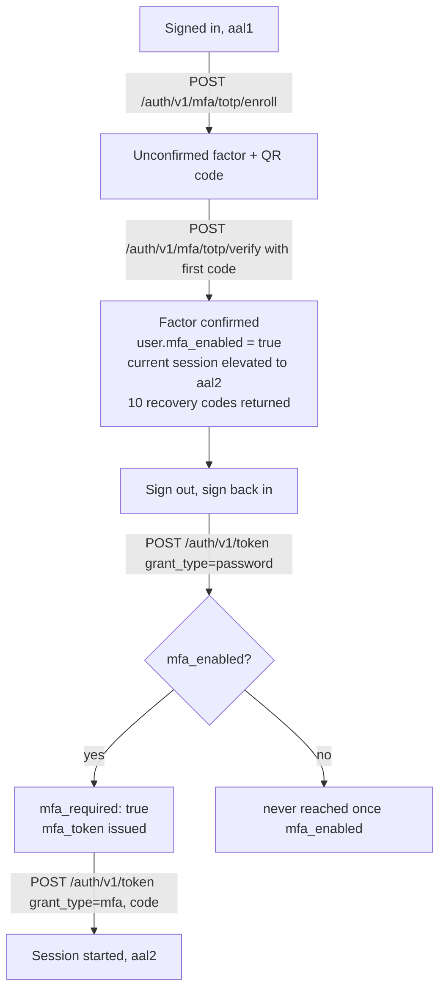

Passwords leak. Multi-factor authentication (MFA) is the standard answer: a second, independent proof — a time-based one-time code from an authenticator app — required before a sensitive action proceeds. Pawabase implements this as **TOTP** (RFC 6238, the same standard behind Google Authenticator, Authy and 1Password's authenticator fields), with single-use **recovery codes** for when the device is unavailable, and an **assurance level** claim (`aal1`/`aal2`) baked into every access token so policies can gate specific actions on it without any extra plumbing.

This page covers the whole lifecycle end to end: enrolling a factor, confirming it, signing in through an MFA challenge, what `aal2` actually means and how long it lasts, and how to write policies — refunds, role changes, deletions — that require it.

<CardGroup cols={3}>
  <Card title="TOTP, not SMS" icon="qr-code">A standard authenticator app scans a QR code (or types a secret) once; codes are generated offline, nothing is sent over SMS or email.</Card>
  <Card title="aal travels in the token" icon="badge-check">`aal1` or `aal2` is a claim on the access token itself — `{"aal": "aal2"}` in a policy needs no extra lookup.</Card>
  <Card title="Recovery codes as a safety net" icon="key-round">10 single-use codes are issued on enrolment, so losing the device doesn't lock the account out.</Card>
</CardGroup>

## The lifecycle at a glance



Two distinct moments produce an `aal2` session: **confirming enrolment** (which elevates the session you were already signed in with, so you don't have to sign out and back in just to prove you set MFA up correctly) and **completing a challenge on a later sign-in** (which is how `aal2` is reached from a cold start, every time, once a user has enrolled).

## Enrolling TOTP

Enrolment is three requests: start it, scan the QR code (or type the secret) into an authenticator app, confirm with the code the app now shows.

<Steps>
  <Step title="Start enrolment">
    Requires an already-signed-in user (any `aal`) and an environment with MFA turned on.
    ```bash
    curl -X POST "$GW/auth/v1/mfa/totp/enroll" \
      -H "apikey: $PUBLISHABLE_KEY" \
      -H "Authorization: Bearer $ACCESS_TOKEN"
    ```
    ```json
    {
      "factor_id": "12",
      "secret": "JBSWY3DPEHPK3PXP",
      "otpauth_uri": "otpauth://totp/Acme%20Inc:ada%40example.com?secret=JBSWY3DPEHPK3PXP&issuer=Acme%20Inc"
    }
    ```
    Render `otpauth_uri` as a QR code (any QR library takes a URI directly) for the common case, and show `secret` as text underneath for anyone who has to type it into their app manually. The factor isn't active yet — `mfa_enabled` on the user is still `false` — until it's confirmed.
    <Note>
    Starting enrolment again before confirming replaces the pending factor: `MfaFactor.filter(user=user, confirmed_at=None).delete()` runs first, so retrying after a QR code failed to scan is safe and doesn't leave orphaned unconfirmed factors behind.
    </Note>
  </Step>
  <Step title="Confirm with the first code">
    ```bash
    curl -X POST "$GW/auth/v1/mfa/totp/verify" \
      -H "apikey: $PUBLISHABLE_KEY" \
      -H "Authorization: Bearer $ACCESS_TOKEN" \
      -H "content-type: application/json" \
      -d '{"code": "482913"}'
    ```
    ```json
    {
      "enabled": true,
      "recovery_codes": [
        "3f9a2-8b1c7", "9e4d1-0a6f3", "c72b8-e1d94", "5a0f6-3c8e2", "1d9b4-7f2a0",
        "8c3e5-9b1d7", "0f4a6-2e8c9", "b6d1e-4a7f3", "e9c2a-6f0b5", "2a7d9-1e4c8"
      ]
    }
    ```
    A `400 the code is not valid` means either a mistyped code or one whose 30-second window has already passed — retry with the app's current code. On success: the factor is marked confirmed, every other unconfirmed factor on the account is deleted, `user.mfa_enabled` becomes `true`, and **10 fresh recovery codes** are generated and returned **once** — they're stored only as SHA-256 hashes, so this is the only response that will ever show them in plain text. Tell the user to save them somewhere durable immediately.
  </Step>
  <Step title="The current session is elevated automatically">
    Confirming enrolment also calls `elevate()` on the session that made the confirming request, setting its `aal` to `aal2` directly — no separate challenge needed. This means the same browser tab that just finished enrolling can immediately use `aal2`-gated features without signing out and back in. Other sessions for the same user (a different device, a different browser) are unaffected and stay at whatever `aal` they already had until they go through a fresh sign-in.
  </Step>
</Steps>

<Tip>
Show the recovery codes in a modal the user has to explicitly dismiss (or better, download as a file) before continuing — there is no "show me my recovery codes again" for the same batch. If they're lost, the user has to [replace them](#replacing-recovery-codes) with a fresh authenticator code, or an administrator has to [reset MFA entirely](#administrator-mfa-reset) and have them re-enrol.
</Tip>

## Signing in once MFA is enabled

Once `user.mfa_enabled` is `true` (and the environment has MFA turned on), a password sign-in **never** returns a session directly — it always stops at a challenge:

<Steps>
  <Step title="Password step returns a challenge, not a session">
    ```bash
    curl -X POST "$GW/auth/v1/token" \
      -H "apikey: $PUBLISHABLE_KEY" -H "content-type: application/json" \
      -d '{"email": "ada@example.com", "password": "correct-horse-1"}'
    ```
    ```json
    {
      "mfa_required": true,
      "mfa_token": "ImltZm[…redacted signed token…]",
      "factors": ["totp", "recovery_code"]
    }
    ```
    Notice there's no `access_token` in this response at all — `mfa_required: true` is the whole signal your client needs to switch to a "enter your code" screen. `mfa_token` is a short-lived, single-use, signed token (built the same way [magic links](/auth/magic-links) are) that carries the pending sign-in forward; it is **not** a bearer token and can't be used as `Authorization: Bearer …` anywhere.
  </Step>
  <Step title="Complete the challenge with a TOTP or recovery code">
    ```bash
    curl -X POST "$GW/auth/v1/token" \
      -H "apikey: $PUBLISHABLE_KEY" -H "content-type: application/json" \
      -d '{"grant_type": "mfa", "mfa_token": "'"$MFA_TOKEN"'", "code": "719284"}'
    ```
    ```json
    {
      "access_token": "eyJhbGciOi…",
      "refresh_token": "eyJhbGciOi…",
      "token_type": "bearer",
      "expires_in": 900,
      "expires_at": 1798534442,
      "session_id": "a91f…",
      "org": null,
      "org_role": null,
      "user": { "id": "8", "email": "ada@example.com", "…": "…" },
      "mfa_method": "totp"
    }
    ```
    `code` accepts either a 6-digit TOTP code **or** a recovery code in its `xxxxx-xxxxx` form — `mfa.verify()` tries TOTP first, then falls back to a recovery code lookup. The response carries the usual session fields (see [tokens and sessions](/auth/tokens-and-sessions)) plus `mfa_method`, telling your client which one was actually used, useful for nudging a user who's burning through recovery codes to re-pair their authenticator app.
  </Step>
  <Step title="A wrong code fails, and counts against lockout">
    ```json
    // 400
    { "detail": "the code is not valid" }
    ```
    A failed MFA attempt runs through the same `record_failure()` lockout counter as a wrong password — enough consecutive failures locks the **account**, not just the challenge, for the configured lockout window. See [passwords →](/auth/passwords#lockout) for the exact thresholds.
  </Step>
</Steps>

### Organization-scoped sign-in through MFA

The `org` you asked for at the password step survives into the challenge automatically — you don't repeat it on the `mfa` grant. Requesting an organization you're not a member of is refused at the **password** step, before a challenge is even issued, so a non-member never gets as far as entering a code:

```bash
# Password step, scoped to an org
curl -X POST "$GW/auth/v1/token" -H "apikey: $PK" -H "content-type: application/json" \
  -d '{"email": "ada@example.com", "password": "…", "org": "acme-inc"}'
# → { "mfa_required": true, "mfa_token": "…", "factors": [...] }
# (org membership was already validated here — a non-member gets 403 immediately)

# MFA step — org carries through with no need to send it again
curl -X POST "$GW/auth/v1/token" -H "apikey: $PK" -H "content-type: application/json" \
  -d '{"grant_type": "mfa", "mfa_token": "'"$MFA_TOKEN"'", "code": "719284"}'
# → { "access_token": "…", "org": "acme-inc", "org_role": "owner", "…": "…" }
```

The org is carried inside the (signed, server-held) MFA challenge itself — `links.issue(..., data={"method": "password", "org": body.org})` — so there's no way for a client to swap organizations mid-challenge even if it wanted to. See [organizations →](/auth/organizations) for the full sign-in/refresh org model.

## What `aal1` and `aal2` mean

`aal` (authentication assurance level) is a single claim on every access token, and it only ever takes one of two values in Pawabase today:

| Value | Means | Set when |
| --- | --- | --- |
| `aal1` | The caller proved one factor: a password, a magic link, or a social sign-in | The default for `start_session()`, used by every sign-in path that doesn't go through an MFA challenge |
| `aal2` | The caller proved a second factor | Only ever set by `start_session(..., aal="aal2")` after a successful `grant_type=mfa` challenge, or by `elevate()` right after confirming enrolment |

`aal` is stored on the **session** (`SessionInfo.aal`), not recomputed per request — `refresh_session()` reads `info.aal` and passes it straight through to the newly minted access token, so **a session that reached `aal2` keeps `aal2` on every refresh for its whole lifetime**, without needing to challenge again. It never silently downgrades based on time passed. The only way a caller's *current* session drops back to `aal1` is signing out and signing back in through a path that doesn't invoke MFA — which, as the next section explains, isn't actually available to a user who has MFA enabled.

## Why MFA-enrolled users always get `aal2`

This is worth being precise about, because it's the single fact every `{"aal": "aal2"}` policy depends on.

Look again at the password grant in `routes/auth.py`:

```python
if user.mfa_enabled and config.mfa_enabled:
    await require_membership(config, user, body.org)
    challenge = await links.issue(
        akountz, config, "mfa", user=user, data={"method": "password", "org": body.org}
    )
    return {"mfa_required": True, "mfa_token": challenge, "factors": ["totp", "recovery_code"]}
return await start_session(akountz, config, user, method="password", ctx=ctx, org=body.org)
```

Once `user.mfa_enabled` is `true`, the password grant **never** falls through to `start_session()` — it always returns a challenge instead. The only way from there to an actual session is completing that challenge, and completing it is the one code path that calls `start_session(..., aal="aal2", ...)` explicitly. There is no route, grant type, or code path that hands an MFA-enrolled user an `aal1` session from a cold sign-in. Put simply:

> **For a user with MFA enabled, "signed in" and "aal2" are the same fact.** Every session that user holds, from any device, was minted with `aal2` at the moment it was created — because the only way to create one was to pass the challenge.

The same is true of the OAuth/social sign-in path in `routes/security.py`: if `user.mfa_enabled and config.mfa_enabled`, the callback issues an MFA challenge (`payload = {"mfa_required": "true", "mfa_token": challenge}`) instead of starting a session directly, exactly mirroring the password flow.

<Note>
Refresh doesn't re-derive `aal` from anything about the current request — it reads whatever `aal` the session was **created** with. So a policy checking `{"aal": "aal2"}` is really asking *"did this session's original sign-in involve a second factor?"*, not *"did the caller just now enter a code."* If you need a fresh, time-boxed re-confirmation for one specific high-stakes action (wiring a large payment, say) rather than "MFA happened at some point," that's a separate re-auth flow you'd build yourself — Pawabase's `aal` claim doesn't expire independently of the session.
</Note>

## Gating sensitive actions with `{"aal": "aal2"}`

Because `aal` is already on the token, gating an action behind MFA costs nothing extra at request time — it's one more shorthand in the policy, exactly like [`role`](/policies/shorthands#role) or [`owner`](/policies/shorthands#owner). See [shorthands: aal](/policies/shorthands#aal) for the shorthand's exact expansion and the built-in `mfa` policy it backs.

<CodeGroup>
```json Refunds
{ "all": [
  { "eq": ["$record.store_id", "$auth.org"] },
  { "in": ["$auth.org_role", ["owner", "admin"]] },
  { "aal": "aal2" }
] }
```
```json Role changes
{ "all": [
  { "role": "admin" },
  { "aal": "aal2" }
] }
```
```json Deleting an account
["mfa", "owner:user_id"]
```
```json A spending cap that only needs 2FA above a threshold
{ "any": [
  { "lte": ["$input.amount_minor", 500000] },
  { "aal": "aal2" }
] }
```
</CodeGroup>

Attach it exactly like any other policy reference:

```json
"operations": {
  "delete": { "enabled": true, "policy": ["mfa", "role:admin"] }
}
```

```bash
# Refund route from the commerce blueprint: needs an aal2 token
curl -X POST "$GW/orders/482/refunds" \
  -H "apikey: $PUBLISHABLE_KEY" -H "Authorization: Bearer $AAL1_TOKEN" \
  -H "content-type: application/json" -d '{"amount_minor": 350000, "reason": "damaged"}'
# → 403 policy 'mfa' refused

curl -X POST "$GW/orders/482/refunds" \
  -H "apikey: $PUBLISHABLE_KEY" -H "Authorization: Bearer $AAL2_TOKEN" \
  -H "content-type: application/json" -d '{"amount_minor": 350000, "reason": "damaged"}'
# → 200
```

The commerce blueprint's own README states this plainly for its refund route: *"Refunds need MFA. The refund route requires an `aal2` token: enrol TOTP, then sign in with the code."* — a direct, real-world instance of exactly this pattern.

<Warning>
`{"aal": "aal2"}` refuses **any** caller whose session isn't `aal2` — including one who simply never enrolled in MFA at all, whose token's `aal` is `aal1` by default. Pair an `aal2`-gated route with a UI that clearly explains "you need to turn on two-factor authentication to do this" and links to enrolment, rather than a bare 403. There's no partial credit for "has MFA available but didn't use it this sign-in" — as established above, that state can't actually occur once enrolled.
</Warning>

## Disabling MFA

```bash
curl -X POST "$GW/auth/v1/mfa/disable" \
  -H "apikey: $PUBLISHABLE_KEY" -H "Authorization: Bearer $ACCESS_TOKEN" \
  -H "content-type: application/json" -d '{"code": "719284"}'
```

```json
{ "enabled": false }
```

Requires a **current, valid** TOTP or recovery code — you can't turn MFA off with just a password, which would defeat its purpose. If `user.mfa_enabled` is already `false`, this is a harmless no-op that returns `{"enabled": false}` without requiring a code. Disabling deletes every `MfaFactor` and `RecoveryCode` row for the account (`app/mfa.py`'s `disable()`), so re-enabling later means enrolling from scratch with a brand-new secret and a brand-new set of recovery codes.

## Replacing recovery codes

```bash
curl -X POST "$GW/auth/v1/mfa/recovery-codes" \
  -H "apikey: $PUBLISHABLE_KEY" -H "Authorization: Bearer $ACCESS_TOKEN" \
  -H "content-type: application/json" -d '{"code": "719284"}'
```

```json
{ "recovery_codes": ["…", "…", "…", "…", "…", "…", "…", "…", "…", "…"] }
```

This requires the code to specifically be a **current TOTP code** — `await mfa.verify(akountz, user, body.code) != "totp"` is refused, so a recovery code itself can't be used to mint a fresh batch (which would let one leaked recovery code regenerate infinite others). Generating a new batch **invalidates every previous recovery code immediately**, even unused ones — there's exactly one live batch of 10 at a time.

## Checking MFA status

```bash
curl "$GW/auth/v1/mfa" -H "apikey: $PUBLISHABLE_KEY" -H "Authorization: Bearer $ACCESS_TOKEN"
```

```json
{ "enabled": true, "aal": "aal2", "recovery_codes_remaining": 7 }
```

Useful for an account-settings screen: show an "enrol" call to action if `enabled` is `false`, and surface a low-recovery-codes warning once `recovery_codes_remaining` drops toward zero (each successful recovery-code sign-in consumes one — see [MFA test flow](#a-complete-round-trip-example) below).

## How TOTP verification actually works

Worth understanding if you're debugging a "valid code rejected" report:

- **Secrets are encrypted at rest.** `MfaFactor.secret_ciphertext` is sealed with the platform's secret box (`akountz.box.seal(secret)`), opened only in-memory to check a code.
- **A ±1 time-step window.** A code is accepted if it matches the current 30-second step, the previous one, or the next one — a small allowance for clock drift between the server and the user's phone.
- **Each accepted step is single-use.** `factor.last_used_step` records the highest step number ever accepted; a code from a step at or before that is rejected even if it's mathematically correct, which stops someone who saw a code over your shoulder from replaying it within its own 30-second window.
- **Confirming enrolment consumes a step**, so the very first code you type to confirm enrolment can't then be reused to complete a sign-in challenge a few seconds later — you'll need the *next* code the app shows. (This is exactly why the [MFA test flow](#a-complete-round-trip-example) below falls back to a recovery code rather than re-using the confirmation code.)

## A complete round-trip example

Putting the whole lifecycle together, exactly as exercised by the project's own test suite:

```bash
# 1. Sign up
SIGNUP=$(curl -s -X POST "$GW/auth/v1/signup" -H "apikey: $PK" -H "content-type: application/json" \
  -d '{"email": "ada@example.com", "password": "correct-horse-1"}')
TOKEN=$(echo "$SIGNUP" | jq -r .access_token)

# 2. Enrol
ENROLLED=$(curl -s -X POST "$GW/auth/v1/mfa/totp/enroll" -H "apikey: $PK" -H "Authorization: Bearer $TOKEN")
SECRET=$(echo "$ENROLLED" | jq -r .secret)

# 3. Confirm with the app's current code (generated locally from $SECRET)
CONFIRMED=$(curl -s -X POST "$GW/auth/v1/mfa/totp/verify" -H "apikey: $PK" -H "Authorization: Bearer $TOKEN" \
  -H "content-type: application/json" -d "{\"code\": \"$(totp_now "$SECRET")\"}")
# → { "enabled": true, "recovery_codes": [ 10 codes ] }
FIRST_RECOVERY_CODE=$(echo "$CONFIRMED" | jq -r .recovery_codes[0])

# 4. Sign in again — this time it's a challenge, not a session
CHALLENGE=$(curl -s -X POST "$GW/auth/v1/token" -H "apikey: $PK" -H "content-type: application/json" \
  -d '{"email": "ada@example.com", "password": "correct-horse-1"}')
# → { "mfa_required": true, "mfa_token": "…", "factors": ["totp", "recovery_code"] }
MFA_TOKEN=$(echo "$CHALLENGE" | jq -r .mfa_token)

# 5. The TOTP step used at confirmation was already consumed, so use a recovery code instead
DONE=$(curl -s -X POST "$GW/auth/v1/token" -H "apikey: $PK" -H "content-type: application/json" \
  -d "{\"grant_type\": \"mfa\", \"mfa_token\": \"$MFA_TOKEN\", \"code\": \"$FIRST_RECOVERY_CODE\"}")
# → 200, mfa_method: "recovery_code", token claims: aal: "aal2"

# 6. That same recovery code is now burned — reusing it fails
curl -s -X POST "$GW/auth/v1/token" -H "apikey: $PK" -H "content-type: application/json" \
  -d "{\"grant_type\": \"mfa\", \"mfa_token\": \"$MFA_TOKEN\", \"code\": \"$FIRST_RECOVERY_CODE\"}"
# → 400 the code is not valid (mfa_token itself is also single-use by this point)
```

## In JavaScript

```javascript
async function completeMfaChallenge(mfaToken, code) {
  const res = await fetch(`${GATEWAY}/auth/v1/token`, {
    method: "POST",
    headers: { apikey: PUBLISHABLE_KEY, "content-type": "application/json" },
    body: JSON.stringify({ grant_type: "mfa", mfa_token: mfaToken, code }),
  });
  if (!res.ok) {
    const { detail } = await res.json();
    throw new Error(detail || "the code is not valid");
  }
  const session = await res.json();
  storeSession(session); // access_token, refresh_token, expires_at
  return session;
}

async function signIn(email, password) {
  const res = await fetch(`${GATEWAY}/auth/v1/token`, {
    method: "POST",
    headers: { apikey: PUBLISHABLE_KEY, "content-type": "application/json" },
    body: JSON.stringify({ email, password }),
  });
  const body = await res.json();
  if (body.mfa_required) {
    return { mfaToken: body.mfa_token, factors: body.factors };
  }
  storeSession(body);
  return { session: body };
}
```

See [client integration →](/auth/client-integration) for how this fits into a full sign-in flow, token storage and refresh.

## Administrator MFA reset

An operator (service credential) can force a user's MFA off entirely — for account-recovery support tickets where a user has lost both their device and every recovery code:

```bash
curl -X POST "$STUDIO/admin/v1/projects/acme/envs/production/users/8/mfa/reset" \
  -H "Authorization: Bearer $SERVICE_TOKEN"
```

```json
{ "mfa_enabled": false }
```

This deletes all factors and recovery codes the same way self-service `disable` does. See [managing users →](/auth/managing-users#resetting-a-users-mfa) for the full administrative surface, including why this route exists separately from the self-service one (no code is required, since the whole point is that the user can't produce one).

## Environment configuration

Whether MFA is offered at all is an environment setting, visible from the public settings endpoint:

```bash
curl "$GW/auth/v1/settings" -H "apikey: $PUBLISHABLE_KEY"
```

```json
{
  "signup_enabled": true,
  "email_verification_required": true,
  "magic_link_enabled": true,
  "mfa_enabled": true,
  "providers": ["google"],
  "password_policy": { "kind": "standard", "min_length": 8 }
}
```

If `mfa_enabled` is `false` for the environment, `POST /auth/v1/mfa/totp/enroll` refuses with `403 MFA is disabled for this project`, even for a user who otherwise has `mfa_enabled` set on their own record — the environment flag is a hard gate above the per-user one. Configuring it is covered in [configuration →](/auth/configuration).

## Common mistakes

<AccordionGroup>
  <Accordion title="Treating mfa_token like an access token">
    `mfa_token` from a challenge response is not a bearer token — it can't be sent as `Authorization: Bearer <mfa_token>` anywhere. It's a single-purpose, single-use, short-lived pointer back to the pending sign-in, consumed by the `grant_type=mfa` request and nothing else.
  </Accordion>
  <Accordion title="Reusing the confirmation code to sign in">
    The code used to confirm enrolment consumes that TOTP time step. A sign-in attempted moments later with the *same* displayed code fails — the app needs to advance to its next code (or you use a recovery code), exactly as shown in the round-trip example above.
  </Accordion>
  <Accordion title="Expecting {\"aal\": \"aal2\"} to expire on its own">
    It doesn't. `aal` is fixed for the life of the session (until sign-out) — see [what aal1 and aal2 mean](#what-aal1-and-aal2-mean). Don't build a UI that assumes a user will be asked to re-enter a code after some idle period; that's not something the platform does automatically.
  </Accordion>
  <Accordion title="Assuming disabling MFA is instant across other devices">
    Disabling MFA deletes the factors and recovery codes, but it doesn't touch any session's `aal` claim retroactively — an already-issued `aal2` token stays `aal2` in its own claims until it expires or the session is refreshed. What changes immediately is that a *new* sign-in will no longer be challenged.
  </Accordion>
  <Accordion title="Building a custom step-up flow instead of using aal">
    It's tempting to add your own "confirm your password again" middleware for sensitive routes. If MFA is already available, `{"aal": "aal2"}` gets you the same protection for free, uniformly across REST, custom routes, flows and functions, with no extra code in your handlers.
  </Accordion>
</AccordionGroup>

## Troubleshooting

| Symptom | Likely cause | Fix |
| --- | --- | --- |
| `400 the code is not valid` on confirm | Clock drift beyond the ±1 step window, or a typo | Check the device's clock; retry with the current code |
| `400 the code is not valid` on a sign-in challenge, right after enrolling | The confirmation code's time step was already consumed | Wait for the app's next code, or use a recovery code |
| `403 MFA is disabled for this project` on enroll | The environment's `mfa_enabled` setting is off | Turn it on in [configuration](/auth/configuration), or check `GET /auth/v1/settings` |
| A policy with `{"aal": "aal2"}` always refuses a user you know enrolled | The **session** they're using predates enrolment and was never refreshed through a challenge | Have them sign out and sign back in — the new session will be `aal2` by construction |
| `POST /auth/v1/mfa/disable` refuses with a valid-looking code | The code is a recovery code but was already used, or is a TOTP code from an expired step | Use a fresh TOTP code, or a still-unused recovery code |
| Recovery codes ran out | Each is single-use, 10 issued at enrolment | Regenerate with `POST /auth/v1/mfa/recovery-codes` (requires a current TOTP code) |
| A user is completely locked out (device lost, no recovery codes) | No self-service path exists for this by design | An administrator resets MFA: [managing users →](/auth/managing-users#resetting-a-users-mfa) |

## FAQ

<AccordionGroup>
  <Accordion title="Can a user have more than one TOTP factor (two devices)?">
    No — confirming a new enrolment deletes every other factor on the account (`MfaFactor.filter(user=user).exclude(id=factor.id).delete()`). If they need MFA on two devices, they scan the same `otpauth_uri`/secret into both apps during the same enrolment; either device's code will then work.
  </Accordion>
  <Accordion title="Is SMS or email-based MFA supported?">
    No. Only TOTP (authenticator apps) and recovery codes exist as second factors. Building an SMS-based factor would require a project-level integration of your own.
  </Accordion>
  <Accordion title="Does MFA apply to service credentials or Studio operators?">
    No — `aal` is a property of a **user** access token. Secret keys and operator credentials bypass policies entirely regardless of `aal` ([policies overview: secret keys bypass policies](/policies/overview#secret-keys-bypass-policies)), so an `{"aal": "aal2"}` policy never blocks or requires anything of a service credential.
  </Accordion>
  <Accordion title="What happens if MFA is required but the user never enrolled?">
    They sign in normally — the challenge only appears once `user.mfa_enabled` is `true`. If your product wants to **require** enrolment (not just offer it), that's a product-level check of your own (redirect to an enrolment screen after sign-in if `GET /auth/v1/mfa` shows `enabled: false`), not something the environment's `mfa_enabled` setting enforces by itself; that setting only controls whether MFA is *available*.
  </Accordion>
  <Accordion title="Can a policy require a specific factor, like TOTP but not a recovery code?">
    No — `aal` doesn't distinguish which factor was used to reach `aal2`, only that one was. `mfa_method` in the token response tells your client which one, for UI purposes, but it isn't carried into the token's claims for a policy to read.
  </Accordion>
  <Accordion title="Does refreshing a session require MFA again?">
    Never. Refresh only rotates the token pair; it never re-challenges, and it carries the session's existing `aal` forward unchanged. See [security model →](/auth/security-model) for the full refresh-rotation mechanics.
  </Accordion>
</AccordionGroup>

## Next

<CardGroup cols={2}>
  <Card title="Auth in policies" icon="list-tree" href="/auth/auth-in-policies">Every $auth field, including aal, with realistic examples.</Card>
  <Card title="Shorthands" icon="zap" href="/policies/shorthands">The aal shorthand and the built-in mfa policy, precisely.</Card>
  <Card title="Managing users" icon="users-cog" href="/auth/managing-users">Resetting a user's MFA as an operator.</Card>
  <Card title="Security model" icon="lock" href="/auth/security-model">Token signing, TTLs, and what a compromised access token can and can't do.</Card>
</CardGroup>
