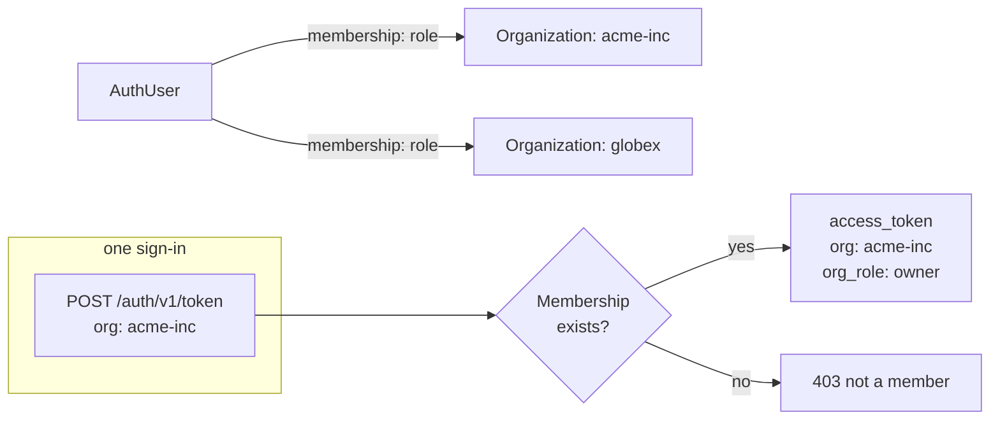

Most backends that serve more than one customer eventually need the same thing: a way to say "this row belongs to *this* company," and a way to check, on every request, "is the caller a member of that company, and with what role?" Pawabase builds this in as **organizations**. An organization is a tenant — a company, a team, a store, a clinic — that a user can belong to with a role, and that a user's access token can be **scoped to**, so that a single sign-in carries both *who* the caller is and *which tenant* they're acting for.

This page is the complete reference for that feature: what an organization is, how membership works, how a token becomes org-scoped, how that scope survives a refresh or switches to another organization, and — the part that actually matters day to day — how to write policies that use `$auth.org` and `$auth.org_role` to key every row in a multi-tenant resource. It ends with a full worked example: building a SaaS backend where every row belongs to exactly one organization, modelled directly on the pattern used in the [commerce blueprint](https://github.com/pawabase/pawabase/tree/main/examples/blueprints/commerce).

<CardGroup cols={3}>
  <Card title="Organizations are data" icon="database">Rows in Akountz's own tables (`akz_organizations`, `akz_memberships`), created and managed through ordinary authenticated requests — no separate admin step.</Card>
  <Card title="Membership has a role" icon="user-check">`owner`, `admin`, `member` or `viewer`, checked by policies as `$auth.org_role`, completely independent of environment roles.</Card>
  <Card title="Tokens are scoped, not accounts" icon="key-round">The same user can sign in scoped to one organization, another, or none. Nothing about the account itself is tenant-specific.</Card>
</CardGroup>

## The model in one paragraph

A **user** belongs to zero or more **organizations**, each membership carrying one **role** from a fixed set: `owner`, `admin`, `member`, `viewer`. When that user signs in, refreshes, or completes an MFA challenge, they can ask for the resulting **access token** to be scoped to one of their organizations by slug. If they're a member, the token gets two extra claims — `org` (the slug) and `org_role` (their role in it) — read straight from the `Membership` row at the moment the token is minted. If they're not a member, the request for that scope is refused outright. Everything downstream — REST resources, custom routes, flows, storage, realtime — sees `$auth.org` and `$auth.org_role` in the [policy context](/policies/context) and can build tenancy rules on them exactly the way it builds ownership rules on `$auth.user_id`.



<Tip>
Organizations are **not** the same thing as [environment roles](/auth/roles-and-permissions). Roles (`editor`, `admin`, `support_agent`, …) live on the user directly and answer "what kind of user is this, platform-wide." `org_role` lives on the *membership* and answers "what can this user do **inside this one tenant**." A user can be an environment `admin` and an org `viewer` at the same time, and policies that mix the two ([auth-in-policies →](/auth/auth-in-policies)) are common and intentional.
</Tip>

## Why organizations exist

Without this feature, every multi-tenant Pawabase project has to invent the same thing by hand: a `companies` table, a `company_id` foreign key on the user, a way to switch which company a session acts for, and a way to check role-within-company in policies — none of which composes cleanly with the token-based identity the rest of the platform already relies on. Akountz's organizations give you:

- a **membership model** (`Organization`, `Membership`, `Team`, `TeamMember`, `Invitation`) that's already there in every environment, with a REST-ish API under `/auth/v1/orgs`;
- **org-scoped tokens**, so `$auth.org` and `$auth.org_role` are available to every policy without a database lookup, the same way `$auth.roles` already is;
- a **role vocabulary** (`owner`, `admin`, `member`, `viewer`) that's fixed and small enough to write policies against directly, with well-defined guardrails (an organization always keeps at least one owner);
- **invitations by email**, so bringing a teammate into a tenant doesn't require you to build your own invite flow;
- **teams**, a lightweight second level of grouping inside an organization, for when "everyone in the org" is too broad.

None of this replaces your own resources. `Organization` rows aren't meant to hold your business data — they're the tenancy anchor. Your `stores`, `projects`, `invoices`, whatever your domain calls the tenant-owned thing, carry a `store_id`/`org_id`/`account_id` column that holds the organization's **slug**, and your policies compare that column to `$auth.org`.

## Creating and managing organizations

Organizations live under `/auth/v1/orgs`, and every route in this section requires a signed-in user — there is no separate "admin" path for creating one. Anyone can create an organization; the creator automatically becomes its `owner`.

### Create an organization

<CodeGroup>
```bash curl
curl -X POST "$GW/auth/v1/orgs" \
  -H "apikey: $PUBLISHABLE_KEY" \
  -H "Authorization: Bearer $ACCESS_TOKEN" \
  -H "content-type: application/json" \
  -d '{
    "slug": "acme-inc",
    "name": "Acme Inc",
    "metadata": { "plan": "trial" }
  }'
```
```javascript fetch
const res = await fetch(`${GATEWAY}/auth/v1/orgs`, {
  method: "POST",
  headers: {
    apikey: PUBLISHABLE_KEY,
    Authorization: `Bearer ${accessToken}`,
    "content-type": "application/json",
  },
  body: JSON.stringify({
    slug: "acme-inc",
    name: "Acme Inc",
    metadata: { plan: "trial" },
  }),
});
const org = await res.json();
```
</CodeGroup>

`slug` must match `^[a-z0-9][a-z0-9-]{1,62}$` — lowercase, digits and hyphens, 2–63 characters. `metadata` is an arbitrary JSON object for whatever your product needs to hang off the tenant (a plan name, a billing customer id, feature flags). The response is `201 Created`:

```json
{
  "id": 14,
  "slug": "acme-inc",
  "name": "Acme Inc",
  "metadata": { "plan": "trial" },
  "role": "owner",
  "created_at": "2026-09-28T09:14:02.118Z"
}
```

<Note>
Slugs are unique **per project environment**, not globally. `acme-inc` in `development` and `acme-inc` in `production` are different rows and can have different members — which is exactly what you want when you promote a project and re-seed its data. Slugs are not unique across your whole install; two different customers of two different Pawabase projects can each have an organization called `acme-inc` without conflict, because organizations are always scoped by `project` and `env` under the hood.
</Note>

### List the organizations you belong to

```bash
curl "$GW/auth/v1/orgs" \
  -H "apikey: $PUBLISHABLE_KEY" \
  -H "Authorization: Bearer $ACCESS_TOKEN"
```

```json
{
  "data": [
    { "id": 14, "slug": "acme-inc", "name": "Acme Inc", "metadata": {"plan": "trial"}, "role": "owner", "created_at": "2026-09-28T09:14:02.118Z" },
    { "id": 15, "slug": "globex", "name": "Globex", "metadata": {}, "role": "member", "created_at": "2026-09-20T15:02:11.004Z" }
  ]
}
```

This is the list a "switch organization" menu in a dashboard is built from: for each row, `role` tells you what to show, and `slug` is what you pass back as `org` on the next sign-in or refresh.

### Get, update, delete

```bash
# One organization, with counts
curl "$GW/auth/v1/orgs/acme-inc" -H "apikey: $PUBLISHABLE_KEY" -H "Authorization: Bearer $ACCESS_TOKEN"
# → { "id":14, "slug":"acme-inc", ..., "role":"owner", "members": 3, "teams": 1 }

# Rename it or replace its metadata (owner or admin only)
curl -X PATCH "$GW/auth/v1/orgs/acme-inc" \
  -H "apikey: $PUBLISHABLE_KEY" -H "Authorization: Bearer $ACCESS_TOKEN" \
  -H "content-type: application/json" -d '{"name": "Acme Incorporated"}'

# Delete it (owners only) — cascades memberships, teams and invitations
curl -X DELETE "$GW/auth/v1/orgs/acme-inc" \
  -H "apikey: $PUBLISHABLE_KEY" -H "Authorization: Bearer $ACCESS_TOKEN"
```

`GET /auth/v1/orgs/{slug}` and every other per-organization route resolve the organization **and** require that the caller is a member; a non-member gets `404 no such organization`, not `403`, so membership itself isn't leaked. Update and delete additionally require a role: `PATCH` needs `owner` or `admin`, `DELETE` needs `owner`.

<Warning>
Deleting an organization is immediate and cascades: every `Membership`, `Team`, `TeamMember` and `Invitation` row for it is removed along with the organization itself. Rows in **your own** resources that merely reference the slug (`store_id`, `org_id`, …) are not touched — Akountz has no idea those tables exist. Decide in your own schema what happens to tenant-owned data when a tenant is deleted (usually: don't expose deletion in the UI, or run a flow that archives the data first).
</Warning>

## Membership roles

Every membership has exactly one role, from a fixed list:

| Role | Typical meaning | Who can assign it |
| --- | --- | --- |
| `owner` | Full control, including deleting the organization and transferring or removing other owners | Owners only |
| `admin` | Manages members, invitations and teams; usually equivalent to `owner` for your own data | Owners and admins |
| `member` | The default for an accepted invitation; can use the product for this tenant | Owners and admins |
| `viewer` | Read-only participant | Owners and admins |

These four names are fixed — `ORG_ROLES = ("owner", "admin", "member", "viewer")` — and every membership route validates against exactly that list (`422` otherwise). You don't define your own org roles the way you define [environment roles](/auth/roles-and-permissions); what you *do* control is what each org role is allowed to do **in your policies**. The commerce blueprint, for example, treats `member` as "store operator" and `admin`+ as "store manager" purely by writing policies that check `$auth.org_role` — the role names stay generic, the meaning is yours.

<Tip>
Think of org roles the way you'd think of a fixed enum column, not a permissions system. If four tiers genuinely aren't enough for one organization's internal structure, model that with [teams](#teams) or with your own resource (a `store_permissions` table with an `owner_field`), not by asking for a fifth org role — there isn't one.
</Tip>

### Two safety rules an organization always keeps

The membership routes enforce two invariants so an organization can never end up unmanageable:

1. **At least one owner, always.** `PUT /orgs/{slug}/members/{user_id}` refuses to demote the organization's last owner (`409 an organization keeps at least one owner`), and `DELETE /orgs/{slug}/members/{user_id}` refuses to remove them for the same reason.
2. **Only owners touch ownership.** Granting or revoking the `owner` role — either by promoting someone to it or demoting an existing owner — requires the caller to already be an `owner`. An `admin` can manage everyone else, but can't create or remove owners (`403 only owners can grant or remove ownership`).

### List, change and remove members

```bash
# Members (any member can see the roster)
curl "$GW/auth/v1/orgs/acme-inc/members" -H "apikey: $PUBLISHABLE_KEY" -H "Authorization: Bearer $ACCESS_TOKEN"
```

```json
{
  "data": [
    { "user_id": "8", "email": "ada@example.com", "name": "Ada", "role": "owner" },
    { "user_id": "9", "email": "bob@example.com", "name": "Bob", "role": "viewer" }
  ]
}
```

```bash
# Change a member's role (owner/admin only)
curl -X PUT "$GW/auth/v1/orgs/acme-inc/members/9" \
  -H "apikey: $PUBLISHABLE_KEY" -H "Authorization: Bearer $ACCESS_TOKEN" \
  -H "content-type: application/json" -d '{"role": "admin"}'
# → { "user_id": "9", "role": "admin" }

# Remove a member (owner/admin only) — or leave yourself, no role check needed
curl -X DELETE "$GW/auth/v1/orgs/acme-inc/members/9" \
  -H "apikey: $PUBLISHABLE_KEY" -H "Authorization: Bearer $ACCESS_TOKEN"
```

`DELETE /orgs/{slug}/members/{user_id}` has a deliberate exception: a user can always remove **themselves** ("leave this organization"), regardless of their role, as long as they're not the organization's last owner. Removing anyone else needs `owner` or `admin`.

<Warning>
Changing someone's role does **not** retroactively touch tokens they already hold. `_response()` in `sessions.py` reads `org_role` **at issue time** from the current `Membership` row, so the change takes effect the moment that member's session is next refreshed — see [Role changes and refresh](#role-changes-and-refresh) below. If you need it to apply immediately, revoke their sessions ([managing users →](/auth/managing-users)).
</Warning>

### Teams

Teams are an optional, lighter grouping *inside* an organization — useful when "every member" is too broad but you don't want to invent a second role tier. A team has no role of its own; it's just a named subset of members.

```bash
# Create a team (owner/admin only)
curl -X POST "$GW/auth/v1/orgs/acme-inc/teams" \
  -H "apikey: $PUBLISHABLE_KEY" -H "Authorization: Bearer $ACCESS_TOKEN" \
  -H "content-type: application/json" -d '{"slug": "core", "name": "Core"}'

# Add/remove a member (owner/admin only)
curl -X PUT "$GW/auth/v1/orgs/acme-inc/teams/core/members/9" \
  -H "apikey: $PUBLISHABLE_KEY" -H "Authorization: Bearer $ACCESS_TOKEN"
curl -X DELETE "$GW/auth/v1/orgs/acme-inc/teams/core/members/9" \
  -H "apikey: $PUBLISHABLE_KEY" -H "Authorization: Bearer $ACCESS_TOKEN"

# List teams, with member counts
curl "$GW/auth/v1/orgs/acme-inc/teams" -H "apikey: $PUBLISHABLE_KEY" -H "Authorization: Bearer $ACCESS_TOKEN"
```

<Note>
Team membership is **not** carried in the access token the way `org`/`org_role` are — there's no `$auth.team` in the policy context. If a policy needs to know "is this caller on the `core` team," check it against the record with a Python policy or denormalise a team marker onto the relevant rows; teams are a management convenience in Akountz, not another claim the engine adds automatically. Most projects don't need this and get everything they need from `org_role`.
</Note>

## Invitations

Bringing someone into an organization by email, rather than asking them to already have an account, is a first-class flow.

<Steps>
  <Step title="An admin invites">
    ```bash
    curl -X POST "$GW/auth/v1/orgs/acme-inc/invitations" \
      -H "apikey: $PUBLISHABLE_KEY" -H "Authorization: Bearer $OWNER_TOKEN" \
      -H "content-type: application/json" \
      -d '{"email": "bob@example.com", "role": "viewer", "redirect_to": "https://app.acme-inc.example.com/accept"}'
    ```
    `201 Created`:
    ```json
    { "id": 41, "email": "bob@example.com", "role": "viewer", "expires_at": "2026-10-05T09:14:02.118Z" }
    ```
    An email goes out through the environment's configured mail template (`invite`), carrying a signed, single-use link built the same way [magic links](/auth/magic-links) and [password recovery](/auth/password-recovery) links are, valid for **7 days**. If the invited address already belongs to the organization, the request is refused with `409 already a member`.
  </Step>
  <Step title="List or revoke pending invitations">
    ```bash
    curl "$GW/auth/v1/orgs/acme-inc/invitations" -H "apikey: $PUBLISHABLE_KEY" -H "Authorization: Bearer $OWNER_TOKEN"
    curl -X DELETE "$GW/auth/v1/orgs/acme-inc/invitations/41" -H "apikey: $PUBLISHABLE_KEY" -H "Authorization: Bearer $OWNER_TOKEN"
    ```
    Only pending invitations (not yet accepted, not yet revoked, not yet expired) are listed. Both routes need `owner` or `admin`.
  </Step>
  <Step title="The invitee signs in or signs up, then accepts">
    Accepting requires being **signed in as the invited address**. If they don't have an account yet, they sign up first (with that same email), then:
    ```bash
    curl -X POST "$GW/auth/v1/invitations/accept" \
      -H "apikey: $PUBLISHABLE_KEY" -H "Authorization: Bearer $BOB_TOKEN" \
      -H "content-type: application/json" -d '{"token": "<the token from the link>"}'
    ```
    ```json
    { "id": 15, "slug": "acme-inc", "name": "Acme Inc", "metadata": {}, "role": "viewer", "created_at": "…" }
    ```
    Accepting **upserts** the membership: if Bob was already a member somehow, his role becomes the invited role rather than erroring. The invitation is marked accepted and can't be replayed. If the token belongs to a different address than the one currently signed in, the request is refused with `403 this invitation was sent to another address` — that's why the flow is "sign in as the invited address, then accept," not "click the link while signed in as anyone."
  </Step>
</Steps>

<Warning>
An invitation link, like a magic link, carries **no password**. It grants membership when accepted by the address it was sent to, but the account itself still needs a way to sign in — a password set at sign-up, a social login, or a later [magic link](/auth/magic-links). Don't build a flow that treats "accepted the invite" as "is now authenticated forever"; the access token from `accept` is whatever the caller already had (`$BOB_TOKEN`), not a new elevated one.
</Warning>

## Org-scoped sign-in: the core mechanic

This is the part that makes organizations actually useful for a policy engine: **the access token itself carries the organization and the caller's role in it**, so a policy never has to look membership up. Every grant that produces a session — password, MFA completion, and refresh — accepts an optional `org` field.

### Signing in scoped to an organization

```bash
curl -X POST "$GW/auth/v1/token" \
  -H "apikey: $PUBLISHABLE_KEY" \
  -H "content-type: application/json" \
  -d '{"email": "ada@example.com", "password": "correct-horse-1", "org": "acme-inc"}'
```

```json
{
  "access_token": "eyJhbGciOi…",
  "refresh_token": "eyJhbGciOi…",
  "token_type": "bearer",
  "expires_in": 900,
  "expires_at": 1798534442,
  "session_id": "f3d9…",
  "org": "acme-inc",
  "org_role": "owner",
  "user": { "id": "8", "email": "ada@example.com", "…": "…" }
}
```

The `access_token`'s claims carry the same two fields, so any service that verifies the token — never just Akountz — has them without a call back:

```json
{
  "sub": "8", "aud": "authenticated", "iss": "pawabase:akountz:acme",
  "prj": "acme", "env": "production", "sid": "f3d9…", "jti": "…",
  "typ": "access", "aal": "aal1",
  "email": "ada@example.com", "roles": ["editor"], "perms": ["posts.write"],
  "org": "acme-inc", "org_role": "owner"
}
```

### What happens if you're not a member

Requesting a scope you don't have is refused **before** any session is created — you don't get an unscoped token as a fallback, the whole request fails:

```bash
curl -X POST "$GW/auth/v1/token" \
  -H "apikey: $PUBLISHABLE_KEY" -H "content-type: application/json" \
  -d '{"email": "bob@example.com", "password": "correct-horse-1", "org": "acme-inc"}'
```
```json
// 403
{ "detail": "you are not a member of that organization" }
```

This is `require_membership()` in `app/sessions.py`: it looks up the `Organization` and `Membership` rows for the requested slug and raises `403` if either is missing, **before** `start_session` runs. The same check happens on the MFA path — an MFA challenge for a user signing in with `org` validates membership up front too, so a user who isn't a member of the org they named finds out at the password step, not after solving the TOTP challenge.

### Signing in without an organization

`org` is entirely optional. Omit it, or send `null`, and the resulting token simply has `"org": null, "org_role": null` — a perfectly normal, unscoped session. This is the right default for any user who isn't acting for a tenant right now (browsing their own account settings, switching between multiple organizations from a picker, or a product that has non-tenant users at all).

## Refresh: keeping, switching, or leaving the organization

A refresh normally just rotates the token pair and keeps everything else the same — including which organization the session is scoped to. `TokenRequest.org` on the refresh grant is deliberately three-valued, using Pydantic's `model_fields_set` to distinguish "the field wasn't sent" from "the field was sent as `null`":

| What you send | Result |
| --- | --- |
| `org` **omitted** from the body entirely | Keeps the session's current organization, whatever it was |
| `"org": "another-slug"` | **Switches** the session to that organization — re-validated as a real membership |
| `"org": null` | **Leaves** every organization; the refreshed token is unscoped |

<CodeGroup>
```bash Keep (omit org)
curl -X POST "$GW/auth/v1/token" \
  -H "apikey: $PK" -H "content-type: application/json" \
  -d '{"grant_type": "refresh_token", "refresh_token": "'$REFRESH'"}'
# → org stays "acme-inc"
```
```bash Switch
curl -X POST "$GW/auth/v1/token" \
  -H "apikey: $PK" -H "content-type: application/json" \
  -d '{"grant_type": "refresh_token", "refresh_token": "'$REFRESH'", "org": "globex"}'
# → org becomes "globex", org_role recomputed for globex
```
```bash Leave
curl -X POST "$GW/auth/v1/token" \
  -H "apikey: $PK" -H "content-type: application/json" \
  -d '{"grant_type": "refresh_token", "refresh_token": "'$REFRESH'", "org": null}'
# → org becomes null
```
</CodeGroup>

Internally this is the `KEEP` sentinel in `app/sessions.py`: `refresh_session(..., org=KEEP)` is the default, and the route only overrides it when `"org"` was actually present in the submitted JSON (`"org" in body.model_fields_set`). A switch runs through `require_membership()` exactly like a fresh sign-in, so switching to an organization you don't belong to is refused with `403`, and the **previous** organization the session held is simply discarded — the new value is written onto the `SessionInfo` row (`info.org = active`) and used from then on, including by the next refresh that omits `org`.

<Warning>
There's no "one client credential, many organizations at once." A session is scoped to **at most one** organization; if your UI needs Ada acting for `acme-inc` and `globex` in two open tabs at the same time, that's two separate sign-ins producing two separate token pairs (or one sign-in kept unscoped, plus a second, scoped, sign-in for the tab that needs it). Don't try to smuggle a second organization into a single token — `org` is a single value, not a list.
</Warning>

### Role changes and refresh

Because `org_role` is read from the `Membership` row **at the moment a token is minted** — in `_response()`, right before `_access_token()` is called — a role change made through `PUT /orgs/{slug}/members/{user_id}` doesn't retroactively change tokens already issued. It takes effect the next time that session refreshes:

```bash
# Owner promotes Bob from viewer to admin
curl -X PUT "$GW/auth/v1/orgs/acme-inc/members/9" \
  -H "apikey: $PK" -H "Authorization: Bearer $OWNER_TOKEN" \
  -H "content-type: application/json" -d '{"role": "admin"}'

# Bob's *existing* access token still says org_role: "viewer" until it expires.
# His next refresh mints one with org_role: "admin".
curl -X POST "$GW/auth/v1/token" \
  -H "apikey: $PK" -H "content-type: application/json" \
  -d '{"grant_type": "refresh_token", "refresh_token": "'$BOB_REFRESH'"}'
# → org_role: "admin"
```

Given the default [access token TTL](/auth/security-model#token-lifetimes) is short (15 minutes on a typical environment), this is rarely a practical problem — but if a demotion is security-sensitive (removing someone's access immediately, say after an incident), don't rely on the TTL to expire their privilege. [Revoke their sessions](/auth/managing-users#ending-sessions) instead, which invalidates the refresh token too and forces a fresh sign-in.

### If you leave or are removed

Being removed from an organization doesn't revoke any session by itself. A member who's removed keeps whatever access token they already hold until it expires (typically minutes), but their **next refresh** — or any fresh sign-in — that names that organization is refused with `403`, because `require_membership()` no longer finds a `Membership` row. If the removal needs to take effect immediately, revoke the session.

## Organizations in policies

Every user access token's claims — `org`, `org_role` — flow straight into the [policy context](/policies/context) through `Principal.as_policy_context()`:

```json
{
  "auth": {
    "authenticated": true,
    "kind": "user",
    "user_id": "8",
    "email": "ada@example.com",
    "roles": ["editor"],
    "permissions": ["posts.write"],
    "org": "acme-inc",
    "org_role": "owner",
    "aal": "aal1",
    "session_id": "f3d9…",
    "claims": { "…": "…" }
  }
}
```

There is **no** `org` shorthand the way there's a `role` or `owner` shorthand — see the note in [shorthands: does role check organization roles?](/policies/shorthands#faq). You write org-tenancy rules as plain comparisons over `$auth.org` and `$auth.org_role`, and because these are direct `eq`/`in` comparisons against record fields, they push down into SQL exactly like `owner` does.

### The two rules almost every multi-tenant resource needs

```json
// tenant_row: the caller belongs to the row's organization
{ "eq": ["$record.store_id", "$auth.org"] }
```

```json
// tenant_manager: belongs to it, and at least an admin there
{ "all": [
  { "eq": ["$record.store_id", "$auth.org"] },
  { "in": ["$auth.org_role", ["owner", "admin"]] }
] }
```

Both are AND-ed equalities/`in`s against a record field and a token value, so [pushdown](/policies/pushdown) turns the first straight into `WHERE store_id = 'acme-inc'` and the second into `WHERE store_id = 'acme-inc' AND org_role IN (...)` — except `org_role` isn't a record column, it comes from the token, so only the `store_id` half is pushed into SQL and the `org_role` half is a fast in-memory residual check, still with no extra database round trip.

<Note>
`$auth.org` is `null` for an unscoped token. `{"eq": ["$record.store_id", "$auth.org"]}` is therefore automatically `false` for anyone signed in without an organization — exactly right, since `store_id` should never actually be `null` on a real row. There's no accidental "unscoped users see everything" hole here as long as your resource always sets `store_id`.
</Note>

For the complete reference of every `$auth` field a policy can read — not just the org ones — see [auth in policies →](/auth/auth-in-policies).

## Full worked example: a SaaS backend with per-organization data

This walks through building a small project-tracking SaaS — every board, every card belongs to one organization — using nothing but resources, an org-scoped `owner_field`-free tenancy pattern, and the two rules above. It mirrors how the [commerce blueprint](https://github.com/pawabase/pawabase/tree/main/examples/blueprints/commerce) keys every store-owned row (`orders`, `customers`, `tickets`, …) to `store_id` and checks `org_role` on the mutating routes.

<Steps>
  <Step title="Design the resources">
    Two resources, both carrying the tenant on every row:
    ```json
    {
      "name": "boards",
      "fields": [
        { "name": "title", "type": "string", "required": true, "max_length": 120 },
        { "name": "org_id", "type": "string", "required": true, "max_length": 63 }
      ]
    }
    ```
    ```json
    {
      "name": "cards",
      "fields": [
        { "name": "board_id", "type": "integer", "required": true },
        { "name": "title", "type": "string", "required": true, "max_length": 200 },
        { "name": "done", "type": "boolean", "default": false },
        { "name": "org_id", "type": "string", "required": true, "max_length": 63 }
      ]
    }
    ```
    `org_id` holds the organization's **slug**. There's no foreign key to an `Organization` row in your own database — Akountz owns that table in its own service, so your schema just stores the slug as a plain string, the same way it would store any other tenant identifier.
  </Step>
  <Step title="Write the two tenancy policies">
    ```json
    // member_of_org
    { "eq": ["$record.org_id", "$auth.org"] }
    ```
    ```json
    // manager_of_org
    { "all": [
      { "eq": ["$record.org_id", "$auth.org"] },
      { "in": ["$auth.org_role", ["owner", "admin"]] }
    ] }
    ```
  </Step>
  <Step title="Attach them, and handle create specially">
    Reads use `member_of_org`; destructive writes use `manager_of_org`; ordinary writes (adding a card, checking it off) use `member_of_org` too. `create` can't use either policy as-is — there's no `$record` yet on create for the *organization* rule to check (record here is the row being **inserted**, which already has `org_id` set from the input by the time the policy runs, so it works the same way `owner` does on create):
    ```json
    "operations": {
      "list":   { "enabled": true, "policy": "member_of_org" },
      "get":    { "enabled": true, "policy": "member_of_org" },
      "create": { "enabled": true, "policy": { "all": [
        { "authenticated": true },
        { "eq": ["$input.org_id", "$auth.org"] }
      ] } },
      "update": { "enabled": true, "policy": "member_of_org" },
      "delete": { "enabled": true, "policy": "manager_of_org" }
    }
    ```
    The `create` rule checks `$input.org_id` (what the client is trying to set) rather than `$record.org_id`, and requires it to equal the caller's current `$auth.org` — so a card can only ever be created inside the organization the caller is currently scoped to. This is the org-tenancy equivalent of an [owner field](/policies/shorthands#owner-and-owner-fields): instead of the server silently overwriting a column, the check refuses any attempt to write a mismatched tenant id. (If you'd rather the server set it automatically and ignore whatever the client sends, do that in a `before_create` [transformer](/data/transformers) and drop back to `member_of_org`-shaped checks everywhere.)
  </Step>
  <Step title="Sign in scoped, then use the API like normal REST">
    ```bash
    # Ada signs in for Acme Inc
    TOKEN=$(curl -s -X POST "$GW/auth/v1/token" -H "apikey: $PK" -H "content-type: application/json" \
      -d '{"email": "ada@acme.example", "password": "…", "org": "acme-inc"}' | jq -r .access_token)

    # Creates a board — org_id must match her current org
    curl -X POST "$GW/rest/v1/boards" -H "apikey: $PK" -H "Authorization: Bearer $TOKEN" \
      -H "content-type: application/json" -d '{"title": "Q4 roadmap", "org_id": "acme-inc"}'

    # Lists boards — automatically WHERE org_id = 'acme-inc', no client-side filter needed
    curl "$GW/rest/v1/boards" -H "apikey: $PK" -H "Authorization: Bearer $TOKEN"
    ```
    A colleague at Globex, signed in scoped to `globex`, gets an entirely different, correctly paginated list from the exact same endpoint — the policy plans a different `WHERE` clause per caller, not a filter applied after the fact. See [pushdown →](/policies/pushdown) for why that distinction matters for pagination and totals.
  </Step>
  <Step title="Test the tenant boundary">
    ```bash
    # Bob (globex) tries to read Acme's board directly by id
    curl "$GW/rest/v1/boards/1" -H "apikey: $PK" -H "Authorization: Bearer $BOB_TOKEN"
    # → 404, not 403: existence isn't revealed across tenants, same as any other read policy

    # Ada, scoped to acme-inc, but only a "member" (not admin/owner), tries to delete a board
    curl -X DELETE "$GW/rest/v1/boards/1" -H "apikey: $PK" -H "Authorization: Bearer $ADA_TOKEN"
    # → 403 policy 'manager_of_org' refused
    ```
  </Step>
</Steps>

<Tip>
Notice what you *didn't* have to write: no membership lookup in a policy, no join to a memberships table, no per-request call to Akountz to ask "is this caller in this org." The token already carried `org` and `org_role` by the time the policy ran, because Akountz validated membership once, at sign-in. This is the same trade-off roles and permissions make — see [the mental model, §4](/concepts/mental-model#4-policies-decide-everywhere) — applied to tenancy.
</Tip>

## The commerce blueprint's pattern, in short

The [commerce blueprint](https://github.com/pawabase/pawabase/tree/main/examples/blueprints/commerce) is a complete, larger worked example of exactly this shape, worth reading directly if you're building something similar:

- **a store is an organization** — every store-owned row (`orders`, `customers`, `tickets`, `products`, …) carries `store_id`, the org slug;
- merchants and staff sign in with `org` to act for a store; the blueprint's own README puts it plainly: *"Merchant tokens are org-scoped. Sign in with `org` to act for a store. The token carries `org` and `org_role`, and every merchant policy checks them. Switching store means requesting a new token with another `org`."*
- org roles map onto store roles directly: `member` and above can operate day-to-day routes (`POST /orders/{id}/fulfil`), `admin` and above can cancel orders and issue refunds, `owner` is unrestricted;
- creating a new store (`POST /merchant/stores`) is available to **any** signed-in user and creates the organization, the store row and its defaults together — the same "create an org, become its owner" pattern shown above;
- a *platform-wide* `platform_admin` [environment role](/auth/roles-and-permissions) (not an org role) exists separately, for staff who manage every store — proof that environment roles and org roles are meant to be combined, not chosen between.

## Common mistakes

<AccordionGroup>
  <Accordion title="Checking $auth.roles instead of $auth.org_role for tenant permissions">
    `$auth.roles` holds **environment** roles (`editor`, `support_agent`, …), assigned by Akountz's RBAC and identical no matter which organization the token is scoped to. `$auth.org_role` holds the caller's role **in the currently scoped organization**. A policy that means "an admin of this tenant" and checks `{"role": "admin"}` is checking the wrong thing entirely — it'll admit any environment-wide admin regardless of tenant, and refuse a legitimate tenant admin who happens not to hold that environment role. Use `{"in": ["$auth.org_role", ["owner", "admin"]]}`.
  </Accordion>
  <Accordion title="Forgetting the create-time check and trusting owner_field-style magic">
    There's no built-in shorthand that auto-populates a tenant column the way an `owner_field` auto-populates the caller's id on create. If your `create` policy is just `member_of_org` (which needs `$record.org_id`, and on create the record *is* the new row, already carrying whatever `org_id` the client sent), a malicious client can set `org_id` to someone else's tenant as long as the policy only checks equality against the record — because the record's `org_id` came from the client. Always compare `$input.org_id` to `$auth.org` on create, as shown above, or set the column from a trusted source in a transformer.
  </Accordion>
  <Accordion title="Assuming a role change applies immediately">
    It applies on the member's next refresh (or next fresh sign-in), not the instant you call `PUT /orgs/{slug}/members/{user_id}`. For anything sensitive, pair a demotion with revoking sessions. See [role changes and refresh](#role-changes-and-refresh).
  </Accordion>
  <Accordion title="Trying to put more than one organization in a single token">
    `org` is one value. A user who needs simultaneous access to two tenants in one UI session needs two token pairs (two sign-ins, or one unscoped plus one scoped), not one token with a list.
  </Accordion>
  <Accordion title="Building your own membership table when Akountz already has one">
    It's tempting to add a `store_members` resource of your own so you can `expand` it in REST responses. You usually don't need to: `GET /auth/v1/orgs/{slug}/members` already gives you the roster, and the token already gives every request the caller's own membership. Reach for your own table only when you need to **join** membership into a REST list response (e.g. "show me all cards with the assignee's org role") — Akountz's membership rows aren't queryable through the data API, only through its own `/auth/v1/orgs/*` routes.
  </Accordion>
  <Accordion title="Using an organization slug as a secret">
    Slugs are not secrets — they show up in URLs, invitation emails and `GET /orgs` listings for every member. Don't rely on "nobody will guess the slug" for anything; membership, not slug-secrecy, is the access boundary, and it's enforced by `require_membership()` on every scoped sign-in.
  </Accordion>
</AccordionGroup>

## Troubleshooting

| Symptom | Likely cause | Fix |
| --- | --- | --- |
| `403 you are not a member of that organization` on sign-in | The account isn't in the `Membership` table for that slug, in that environment | Check `GET /auth/v1/orgs` for that user; invite them if they're missing |
| Token has `"org": null` even though you sent `org` | The membership check failed silently in your client code, or you signed in without checking the response for `mfa_required` first | Read `_response()`'s note: `org_role` is looked up and if it's `None`, `org` is also forced to `None` — this only happens if membership genuinely doesn't exist, so re-check the slug and the account |
| A demoted admin can still do admin things | Their token was issued before the demotion and hasn't refreshed yet | Expected — see [role changes and refresh](#role-changes-and-refresh); revoke sessions for immediacy |
| `{"eq": ["$record.store_id", "$auth.org"]}` refuses everyone, even the right org | `$auth.org` is `null` because the token wasn't requested with `org` | Confirm the client sent `org` on sign-in/refresh and check the decoded token's `org` claim |
| A refresh unexpectedly drops the organization | The client is sending `"org": null` explicitly rather than omitting the field | Omit `org` entirely from the refresh body to keep the current scope; sending `null` always means "leave" |
| Two teammates with the same org role see different data | Tenancy is correct; the difference is something else — another policy, a record filter, ownership on top of tenancy | Check whether the resource also has an `owner_field`/`owner` rule layered on top of the tenancy rule |

## FAQ

<AccordionGroup>
  <Accordion title="Can a user be a member of the same organization twice, with different roles?">
    No — `Membership` is `unique_together` on `(organization, user)`. A user has exactly one role per organization at a time; changing it overwrites the existing row rather than adding a second one.
  </Accordion>
  <Accordion title="Is there an org-level equivalent of environment permissions()?">
    No. Org roles are the four fixed names; there's no per-organization custom permission list the way [roles have a `permissions` array](/auth/roles-and-permissions). If you need finer-grained, per-tenant capabilities, model them as your own data (a `permissions` JSON column on a `store_settings` resource, checked with `$record`/`$input` comparisons) rather than trying to extend `org_role`.
  </Accordion>
  <Accordion title="Can an anonymous (no-token) request read organization-scoped data?">
    Only if a policy explicitly allows it — most tenancy policies start from `{"eq": [...]}` against `$auth.org`, and an anonymous caller's `$auth.org` is `null`, so unless your resource's own `org_id` is also sometimes `null` (which it shouldn't be), anonymous requests fail that comparison automatically. If you want a public, read-only view of one tenant's data (a storefront, a public status page), write a **separate** policy for it rather than loosening the tenancy rule itself — see how the commerce blueprint splits `readable_post`-style storefront reads from merchant-only reads.
  </Accordion>
  <Accordion title="Does deleting a user remove their memberships?">
    Yes — `Membership.user` is a foreign key with `on_delete=CASCADE`, so deleting (or [soft-deleting](/auth/managing-users#deleting-a-user)) the `AuthUser` row removes their membership rows along with it. If that leaves an organization with zero owners, nothing automatically promotes another member — handle that in your own operational process, or check for it before deleting an owner's account.
  </Accordion>
  <Accordion title="Can I promote a member to owner without already being an owner myself?">
    No. `PUT /orgs/{slug}/members/{user_id}` explicitly requires the caller to already hold `owner` when the target role **or** the member's current role is `owner`. An `admin` can freely move people between `admin`, `member` and `viewer`, but ownership changes are owner-only.
  </Accordion>
  <Accordion title="What happens to pending invitations if the organization is deleted?">
    They're deleted along with it — `Invitation.organization` cascades the same way `Membership` does.
  </Accordion>
  <Accordion title="Can I see which organization a REST request was scoped to, from inside a flow?">
    Yes. A flow triggered from an HTTP route sees the same policy context every other entry point sees, so `$auth.org` and `$auth.org_role` are available in `policy.check` blocks and anywhere else the flow reads `$auth`. See [auth in policies →](/auth/auth-in-policies) for the full list of fields and where each one is available.
  </Accordion>
  <Accordion title="Does Studio show organizations?">
    Yes — Studio's Auth section lists organizations, their members and pending invitations for the environment you're viewing, and an operator (a service credential) can manage them without being a member, the same way operators manage users. See [managing users →](/auth/managing-users).
  </Accordion>
</AccordionGroup>

## Next

<CardGroup cols={2}>
  <Card title="Auth in policies" icon="list-tree" href="/auth/auth-in-policies">Every `$auth` field, including `org` and `org_role`, in one reference.</Card>
  <Card title="Roles and permissions" icon="users" href="/auth/roles-and-permissions">Environment-wide RBAC, independent of organizations.</Card>
  <Card title="Shorthands" icon="zap" href="/policies/shorthands">`role`, `owner`, `permission`, `aal` — and why there's no `org` shorthand.</Card>
  <Card title="MFA" icon="shield-check" href="/auth/mfa">Gating sensitive org actions like refunds and ownership transfer behind `aal2`.</Card>
</CardGroup>
