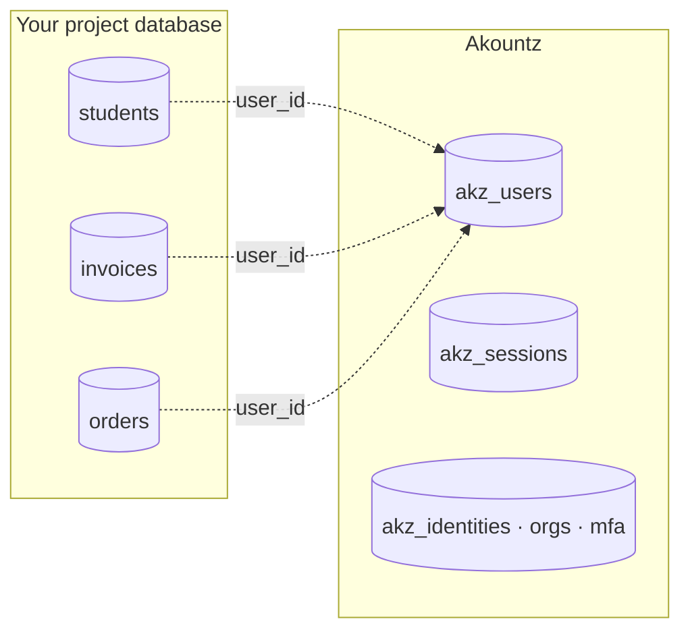
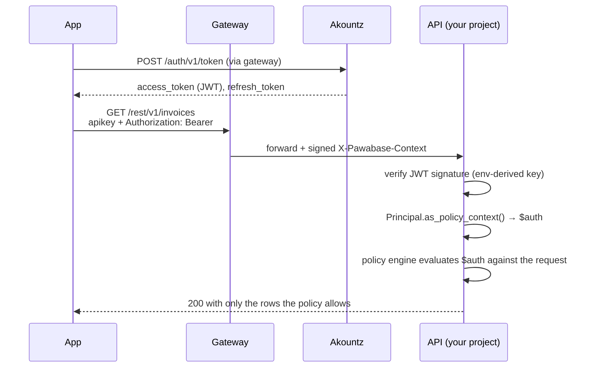
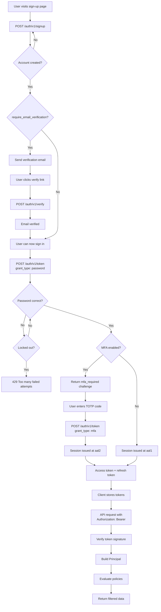
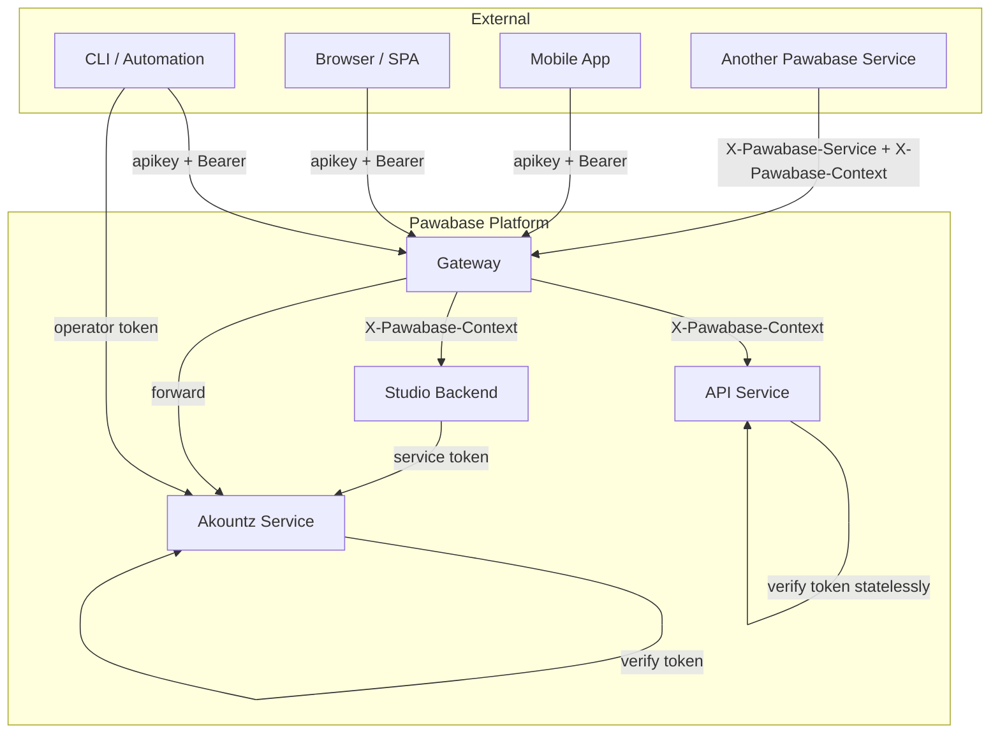

Every Pawabase project needs an answer to "who is this?" before it can answer "may they do that?" The first question is **authentication**, and Pawabase answers it with a dedicated service, **Akountz**, that every project shares. The second question is **authorization**, and it's answered by [policies](/policies/overview), which read the token Akountz issued directly, with no separate "auth rules" system to keep in sync.

This page is the map of the whole auth model: where users live, how sign-in works, what a token contains, how organizations and MFA fit in, and how the pieces you'll read about on the following pages — [configuration](/auth/configuration), [passwords](/auth/passwords), [tokens and sessions](/auth/tokens-and-sessions), [email verification](/auth/email-verification), [password recovery](/auth/password-recovery), [magic links](/auth/magic-links) and [social login](/auth/social-login) — connect to each other.

<CardGroup cols={3}>
  <Card title="One system per project" icon="building">Users belong to a project environment, not to a global Pawabase account directory.</Card>
  <Card title="Stateless tokens" icon="key-round">A short-lived access token and a rotating refresh token; every service verifies them without calling Akountz.</Card>
  <Card title="Policies read tokens directly" icon="shield-check">No separate rules DSL. `$auth.roles`, `$auth.org`, `$auth.aal` are the token's own claims.</Card>
</CardGroup>

## Where users live

Akountz is a Pawabase service, deployed once per installation, that owns exactly one thing: the `akz_users` table and everything attached to it (sessions, MFA factors, linked identities, organizations, login history). It is **not** part of your project's own database. Your `students`, `invoices` or `todos` tables never contain a row for "the user" — they reference a user id that Akountz is the source of truth for.



<Note>
Read the code and you'll find the exact mechanism: `AuthUser` (in `services/akountz/database/models/users.py`) carries `project` and `env` columns and a **unique-together constraint on `(project, env, email)`**. That's the whole scoping story — not a separate database per project, one shared users table partitioned by project and environment.
</Note>

### One auth system per project, not per environment

This is worth stating precisely, because it's easy to get backwards. A **project** (say `acme`) has several **environments** (`development`, `staging`, `production`), and each environment has its **own, separate pool of users**. `ada@example.com` signing up in `acme/development` and `ada@example.com` signing up in `acme/production` are two different accounts with two different passwords, two different id numbers, and two different sets of sessions — the unique constraint is `(project, env, email)`, not `(project, email)`.

That's deliberate: development shouldn't be able to sign in as a production user (or vice versa), and staging data shouldn't leak real customers' credentials. It also means:

- **Promoting** an environment (copying resources, policies, flows) does **not** copy users. Environments start with an empty `akz_users` table and you seed them separately (or let real sign-ups populate `production`).
- A **project** *is* the auth boundary in the sense that means something to your product: `acme`'s users and `initech`'s users can never collide, never share a token, and are never visible to each other's policies, no matter what environment they're in.
- Within one project, `development` and `production` are two more of these boundaries. A user token minted in `development` fails everywhere else, including `staging` — see [why below](#tokens-are-bound-to-one-environment).

<Tip>
If your product genuinely wants one identity across environments (uncommon, but it happens for internal tools), the usual approach is to treat `production` as the single source of truth and have your own script call the [signup endpoint](/auth/passwords#sign-up) against `development`/`staging` with the same emails, rather than trying to share the underlying table — that sharing isn't something the platform does for you.
</Tip>

### The `akz_users` table in depth

The `AuthUser` model in `services/akountz/database/models/users.py` is the central data structure for all identity information. It extends Sillo's `UserBaseModel`, which provides the foundational fields for authentication: email, password hashing, session management, and role assignment. The `AuthUser` adds Pawabase-specific fields on top:

| Field | Type | Description |
| --- | --- | --- |
| `project` | UUID | The project this user belongs to. |
| `env` | string | The environment (`development`, `staging`, `production`). |
| `email` | string | Normalized to lowercase. Unique per `(project, env)`. |
| `username` | string | Auto-generated or user-provided. Unique per `(project, env)`. |
| `password_hash` | string | The bcrypt/PBKDF2 hash from `passlib`. Never stored in plaintext. |
| `email_verified_at` | datetime or null | When the email was verified. `None` means unverified. |
| `disabled_at` | datetime or null | When the account was disabled by an admin. `None` means active. |
| `mfa_secret` | string or null | The TOTP secret for MFA enrollment. |
| `mfa_enabled` | boolean | Whether MFA is enabled on this account. |
| `failed_logins` | integer | Counter for consecutive failed sign-in attempts. |
| `locked_until` | datetime or null | When the lockout expires. `None` means not locked. |
| `last_sign_in_at` | datetime or null | When the user last successfully signed in. |
| `last_sign_in_ip` | string or null | The IP address of the last sign-in. |
| `user_metadata` | JSON | User-editable metadata. Appears in `$auth.claims.meta`. |
| `app_metadata` | JSON | Admin-only metadata. Appears in `$auth.claims.app`. |
| `roles` | array of strings | Role names assigned to the user. |

The `AuthUser` row is created by the `create_account` function in `app/accounts.py`. This function is called from the sign-up endpoint, the magic link endpoint, the social login callback, and the admin API — every path that creates a new user goes through this single function, ensuring consistent behavior regardless of how the account was created.

```python
async def create_account(
    config: AuthConfig,
    *,
    email: str,
    password: str | None,
    username: str | None = None,
    name: str = "",
    user_metadata: dict | None = None,
    default_roles: list[str] | None = None,
) -> AuthUser:
    # Normalize email
    email = normalise_email(email)

    # Check for duplicate
    existing = await AuthUser.get_by_email(config.project, config.env, email)
    if existing:
        raise HTTPException(status_code=409, detail="an account with this email already exists")

    # Generate username if not provided
    if username is None:
        username = generate_username(email)

    # Create the user
    user = AuthUser(
        project_id=config.project_id,
        env_id=config.env_id,
        email=email,
        username=username,
        name=name,
        user_metadata=user_metadata or {},
        app_metadata={},
    )

    # Set password or unusable password
    if password:
        user.set_password(password)
    else:
        user.set_unusable_password()

    # Assign default roles
    if default_roles:
        for role_name in default_roles:
            await rbac.assign_role(user, role_name)

    await user.save()
    await emit_event("user.created", {"user_id": str(user.id), "email": user.email, "method": "password"})

    return user
```

The `create_account` function is the single source of truth for account creation. Every other code path that needs to create a user calls this function, which ensures that:
1. Email normalization happens consistently.
2. Duplicate detection works consistently.
3. Password hashing happens consistently.
4. Default role assignment happens consistently.
5. The `user.created` event is emitted consistently.

## The shape of a sign-in

A password sign-in is one request to `POST /auth/v1/token`. Reaching Akountz always goes through the [gateway](/concepts/architecture), the same way every other Pawabase call does, so the request needs a project API key (`apikey` header) identifying which project/environment, and returns an **access token** and a **refresh token**:

<CodeGroup>
```bash cURL
curl -X POST "https://gw.pawabase.app/auth/v1/token" \
  -H "apikey: $PAWABASE_PUBLISHABLE_KEY" \
  -H "content-type: application/json" \
  -d '{
    "grant_type": "password",
    "email": "chioma.nwosu@example.com",
    "password": "correct-horse-battery-staple"
  }'
```
```javascript JavaScript
const res = await fetch("https://gw.pawabase.app/auth/v1/token", {
  method: "POST",
  headers: {
    apikey: PAWABASE_PUBLISHABLE_KEY,
    "content-type": "application/json",
  },
  body: JSON.stringify({
    grant_type: "password",
    email: "chioma.nwosu@example.com",
    password: "correct-horse-battery-staple",
  }),
});
const session = await res.json();
```
```python Python
import httpx

response = httpx.post(
    "https://gw.pawabase.app/auth/v1/token",
    headers={"apikey": PAWABASE_PUBLISHABLE_KEY},
    json={
        "grant_type": "password",
        "email": "chioma.nwosu@example.com",
        "password": "correct-horse-battery-staple",
    },
)
session = response.json()
```
</CodeGroup>

```json 200 OK
{
  "access_token": "eyJhbGciOiJIUzI1NiIs...",
  "refresh_token": "eyJhbGciOiJIUzI1NiIs...",
  "token_type": "bearer",
  "expires_in": 900,
  "expires_at": 1759071845,
  "session_id": "f3f0c2f8b0f6c4a1a6f9c1d3f2a6e9b7",
  "org": null,
  "org_role": null,
  "user": {
    "id": "8",
    "email": "chioma.nwosu@example.com",
    "username": "chioma",
    "name": "Chioma Nwosu",
    "roles": ["guardian"],
    "...": "..."
  }
}
```

From here, every request the app makes sends `Authorization: Bearer <access_token>` alongside the same `apikey`. Every full walkthrough of the request/response shapes, error codes, password policy enforcement and the update-profile endpoint lives on [Passwords →](/auth/passwords).

### The `apikey` header

The `apikey` header is how Akountz knows which project and environment the request is for. It's a publishable key (`pk_...`) that identifies the project and environment without granting admin access. The key is validated on every request by the gateway before the request reaches Akountz.

The `apikey` is distinct from the access token — the `apikey` identifies the project/environment, while the access token identifies the user and their permissions. Both are required: the `apikey` tells Akountz which tenant's user directory to search, and the access token tells the downstream services what that user can do.

### The `grant_type` parameter

The `grant_type` parameter determines what kind of sign-in is happening:

| `grant_type` | Description | Required fields |
| --- | --- | --- |
| `"password"` | Password sign-in. | `email`, `password`. |
| `"refresh_token"` | Token refresh. | `refresh_token`. |
| `"magic_link"` | Passwordless sign-in via email link. | `token` (the magic link token). |
| `"social"` | Social login (Google, GitHub, etc.). | `provider`, `code`. |
| `"mfa"` | MFA completion after initial sign-in. | `mfa_token`, `code`. |

Each grant type follows the same path through Akountz: validate credentials → check lockout → verify identity → check MFA if required → issue tokens. The specific validation logic differs by grant type, but the output shape is always the same.

### Understanding the response fields

Every sign-in response includes the following fields:

- **`access_token`**: A JWT that can be used to authenticate API requests. Valid for `access_ttl` seconds (default 900). The `Authorization: Bearer <access_token>` header sends this to your API.
- **`refresh_token`**: An opaque string (`rft_...` prefix) that can be used to obtain a new access token without re-entering credentials. Valid for `refresh_ttl` seconds (default 2,592,000 / 30 days). Each refresh rotates the token.
- **`token_type`**: Always `"bearer"`. Indicates the token type for the `Authorization` header.
- **`expires_in`**: The number of seconds until the access token expires. Used by the SDK to know when to refresh.
- **`expires_at`**: A Unix timestamp of when the access token expires. Provides an absolute expiration time.
- **`session_id`**: The unique identifier for this session. Used for session management, revocation, and audit logging.
- **`org`**: The organization slug if the session is org-scoped. `null` for global sessions.
- **`org_role`**: The user's role within the organization. `null` if no organization is specified.
- **`user`**: A serialized `User` object containing the user's identity information.

## From token to `$auth`

This is the part that most distinguishes Pawabase from a typical "auth service + separate rules engine" setup. When a service (the API, the gateway, Angula for realtime) receives a request with `Authorization: Bearer <token>`, it:

1. verifies the JWT's signature against a key **derived deterministically from the project and environment** (so a token can't even be checked against the wrong environment's key, let alone accepted by it);
2. turns the verified claims into a `Principal` object (`packages/kit/pawabase_kit/principal.py`), Sillo's authenticated-user abstraction;
3. exposes `Principal.as_policy_context()` as `$auth` in every [policy](/policies/overview) evaluated for that request.

No lookup, no cache warm, no second call to Akountz. The claims *are* the identity, because they were only ever produced by Akountz's own signing key.



Here is exactly what a policy sees, straight from `Principal.as_policy_context()`:

```python packages/kit/pawabase_kit/principal.py
def as_policy_context(self) -> dict[str, Any]:
    """What policies see under ``auth``."""
    return {
        "authenticated": True,
        "kind": self.kind,
        "user_id": self.identity,
        "email": self.email,
        "roles": self.roles,
        "permissions": self.permissions,
        "org": self.org,
        "org_role": self.claims.get("org_role"),
        "aal": self.claims.get("aal"),
        "session_id": self.claims.get("sid"),
        "claims": self.claims,
    }
```

And in a policy, that's just:

```json
{ "all": [
  { "authenticated": true },
  { "eq": ["$auth.org_role", "admin"] },
  { "eq": ["$record.organization_id", "$auth.org"] }
] }
```

There is no second place this data comes from. `$auth.roles` is not "whatever the rules engine looked up" — it's the literal `roles` claim inside the JWT the caller presented, put there by Akountz at sign-in time from `rbac.roles_of(user)`. If you want to know what a caller can do, read the token; there's nothing else to check.

[Full context reference →](/policies/context) · [What auth looks like in policies →](/auth/auth-in-policies)

## Tokens are bound to one environment

Every access token is signed with `derive_env_secret(master, project, env)` — an HMAC of `"pawabase:user-token:{project}:{env}"` under the platform's master secret. That derivation is one-way and deterministic, which buys two properties at once:

- **No per-environment key management.** Akountz doesn't store a table of environment signing keys; any service that has the platform master secret can derive the right key for any environment on the fly.
- **A token literally cannot cross environments.** Even if you handed an attacker a valid `acme/development` access token, verifying it against `acme/production`'s derived key fails — not because of an environment field check (though there is one, `claims["prj"]`/`claims["env"]` are also checked), but because the signature itself was never made with that key.

```python packages/kit/pawabase_kit/tokens.py
def verify_user_token(token: str, master: str, *, project: str, env: str) -> dict[str, Any]:
    """Verify a user access token for *project*/*env*. Raises :class:`TokenInvalid`."""
    claims = _decode(token, derive_env_secret(master, project, env), audience=USER_AUDIENCE)
    if claims.get("typ") != "access":
        raise TokenInvalid("not an access token")
    if claims.get("prj") != project or claims.get("env") != env:
        raise TokenInvalid("token belongs to another environment")
    return claims
```

This environment-bound signing has a practical consequence for multi-environment deployments: you can run `development`, `staging`, and `production` on the same infrastructure without worrying about token cross-contamination. A token minted in `development` is cryptographically incapable of being verified by `production`'s services, even if both environments share the same database schema and the same platform master secret.

The `derive_env_secret` function uses HMAC-SHA256 with the platform master secret as the key and a domain-specific string (`"pawabase:user-token:{project}:{env}"`) as the message. This construction ensures that:
1. The function is deterministic — the same `(master, project, env)` triple always produces the same key.
2. The function is one-way — given a derived key, you cannot recover the master secret.
3. The function is domain-separated — the `"pawabase:user-token:"` prefix ensures that user tokens are derived differently from any other purpose (e.g., service key tokens use a different domain string).

### What happens if a token crosses environments

If a `development` token is presented to `production`'s services, the verification fails at the signature check. The `verify_user_token` function in `packages/kit/pawabase_kit/tokens.py` first derives the `production` key, then attempts to decode and verify the token with that key. Since the token was signed with the `development` key, the HMAC verification fails and a `TokenInvalid` exception is raised.

```python
try:
    claims = verify_user_token(token, master, project="acme", env="production")
except TokenInvalid as e:
    # Token belongs to a different environment — reject it
    log_security_event("cross_env_token_rejected", {"token": token[:8], "error": str(e)})
```

This is logged as a security event because cross-environment token presentation could indicate an attack attempt. The security team can set up alerts for repeated `cross_env_token_rejected` events.

### The `claims["prj"]` and `claims["env"]` checks

Beyond the signature verification, the access token's payload also contains `prj` and `env` claims that are checked independently. This provides defense-in-depth: even if a token's signature were somehow valid for the wrong environment (which is cryptographically impossible but defended against anyway), the claims check would still reject it.

```python
if claims.get("prj") != project or claims.get("env") != env:
    raise TokenInvalid("token belongs to another environment")
```

These claims are set during token issuance in `build_token_payload` in `routes/auth.py`:

```python
def build_token_payload(
    config: AuthConfig,
    *,
    sub: str,
    org: str | None,
    session_id: str,
    aal: str = "aal1",
    role_names: list[str],
    user_metadata: dict | None,
    app_metadata: dict | None,
) -> dict:
    now = int(time.time())
    return {
        "iss": config.issuer,
        "sub": sub,
        "aud": config.audience,
        "iat": now,
        "exp": now + config.access_token_ttl,
        "jti": str(uuid4()),
        "org": org,
        "session_id": session_id,
        "aal": aal,
        "roles": role_names,
        "user": user_metadata or {},
        "app": app_metadata or {},
        "prj": config.project,
        "env": config.env,
    }
```

## Sign-in scoped to an organization

Pawabase's Akountz ships **organizations** — teams a user can belong to with a role (`owner`, `admin`, `member`, `viewer`) — as a first-class part of the token, not a bolt-on your project's database has to model. When a sign-in or refresh names an `org`, and the user is a member, the resulting access token carries `org` (the slug) and `org_role` (their role in it) as top-level claims, right alongside `roles` and `permissions`:

```bash
curl -X POST "https://gw.pawabase.app/auth/v1/token" \
  -H "apikey: $PAWABASE_PUBLISHABLE_KEY" -H "content-type: application/json" \
  -d '{"grant_type":"password","email":"chioma@example.com","password":"...","org":"acme-hq"}'
```

```json
{
  "access_token": "...",
  "org": "acme-hq",
  "org_role": "admin",
  "...": "..."
}
```

That's exactly what powers multi-tenant policies like the `org_role` example above — no join to a separate memberships table inside your policy, because the membership was already resolved once, at token-issue time, and baked into the claim. A refresh can switch organizations, leave the current one, or (the default) keep it unchanged; see [the KEEP sentinel](/auth/tokens-and-sessions#switching-or-clearing-the-organization-on-refresh) for the exact mechanics. Organization membership, invitations and roles are covered in depth on [Organizations →](/auth/organizations).

<Warning>
Naming an `org` the user isn't a member of doesn't silently issue a token without it — it's a `403`. See [Passwords → error responses](/auth/passwords#error-responses) for the exact shape.
</Warning>

### Organization switching during refresh

When a user is a member of multiple organizations, they can switch between them during a token refresh. The `refresh_token` endpoint accepts an optional `org` parameter:

- If `org` is provided and the user is a member, the new tokens carry the new organization context.
- If `org` is `null`, the new tokens have no organization context (global scope).
- If `org` is omitted, the existing organization is preserved.

```json
{
  "grant_type": "refresh_token",
  "refresh_token": "rft_8f2c...",
  "org": "acme-west"
}
```

The server validates membership in the requested organization before issuing tokens. If the user is not a member, the refresh fails with `403 you are not a member of that organization`. This means the user cannot escalate their organization scope — they must be a member of the requested organization to scope their tokens to it.

### The `org` claim in policies

In policy expressions, the `org` claim is available as `$auth.org`:

```rego
allow {
    input.method == "GET"
    input.org_id == $auth.org
}
```

This allows policies to enforce that users can only access resources within their organization. When `$auth.org` is `null`, the session has no organization scope, and organization-scoped resources are inaccessible.

## MFA and assurance levels

Every access token carries an `aal` claim (**authentication assurance level**): `aal1` for an ordinary sign-in, `aal2` once the caller has also passed a second factor. This isn't a separate "is MFA on" flag your policies have to look up elsewhere — `$auth.aal` is right there in the same context as everything else:

```json
{ "all": [
  { "authenticated": true },
  { "eq": ["$auth.aal", "aal2"] }
] }
```

or the built-in shorthand:

```json
"policy": "mfa"
```

When a project has `mfa_enabled` and a user has enrolled a TOTP factor, `POST /auth/v1/token` doesn't return a session directly — it returns an `mfa_required` challenge that must be completed with a second request (`grant_type: "mfa"`) before a session (now at `aal2`) is issued. The full flow, TOTP enrolment, recovery codes and elevating an already-open session, are documented in [MFA →](/auth/mfa); this overview only needs you to know that `aal` exists and where it lives.

### AAL and policy enforcement

The `aal` claim enables fine-grained policy enforcement. For example:

- **Read-only operations**: Allow any AAL level (`$auth.aal` is `"aal1"` or `"aal2"`).
- **Write operations**: Require `"aal2"` — the user must have completed MFA.
- **Delete operations**: Require `"aal2"` AND a specific organization context.

```rego
# Require MFA for all write operations
allow {
    input.method == "POST" or input.method == "PUT" or input.method == "DELETE"
    $auth.aal == "aal2"
}
```

This means that even if an attacker steals a session token from a password-only sign-in (`aal1`), they cannot perform sensitive operations that require MFA. The token is valid for reading but not for writing — a significant security boundary that limits the damage of token theft.

### MFA enrollment flow

When a user enrolls in MFA, the following happens:

1. The user requests enrollment through the SDK (`supabase.auth.mfa.enroll()`).
2. Akountz generates a TOTP secret and returns it as a QR code.
3. The user scans the QR code with an authenticator app (Google Authenticator, Authy, etc.).
4. The user verifies enrollment by entering a code from the app.
5. Akountz stores the TOTP secret and sets `mfa_enabled = true` on the `AuthUser` row.
6. Recovery codes are generated and returned to the user.

After enrollment, all sign-in methods (password, magic link, social login) require MFA verification before a session is issued. The session is created with `aal: "aal2"`.

### MFA and session elevation

A user who signed in with password-only (`aal1`) can elevate their session to `aal2` by completing an MFA challenge. This is done by sending a `grant_type: "mfa"` request with the TOTP code:

```json
{
  "grant_type": "mfa",
  "session_id": "f3f0c2f8…",
  "code": "123456"
}
```

If the TOTP code is valid, a new session is issued with `aal: "aal2"`. The old session remains valid but still has `aal1` — elevation creates a new session rather than modifying the existing one.

## Compared with Supabase Auth and Firebase Auth

<Tabs>
  <Tab title="Supabase Auth">
    Supabase issues a JWT too, and its Postgres RLS reads `auth.uid()` and `auth.jwt()` from it — conceptually close to Pawabase. The differences are in scope and where identity is checked:

    | | Supabase Auth | Pawabase / Akountz |
    | --- | --- | --- |
    | Where users live | One `auth.users` table per Supabase project | Per **project environment** (`(project, env, email)`), so dev/staging/prod never share accounts |
    | Where "rules" read identity | Postgres RLS reads `auth.jwt()`/`auth.uid()` inside SQL | [Policies](/policies/overview) read `$auth.*` — the same JSON condition language used for routes, functions, flows, buckets and realtime channels, not only tables |
    | Organizations | Not built in; commonly modelled by hand with a `memberships` table plus custom RLS | Built into Akountz: membership resolved once at token-issue time, exposed as `$auth.org` / `$auth.org_role` |
    | MFA | Supported, tracked via `aal1`/`aal2` on the session | Supported, tracked via the token's own `aal` claim — same idea, same names, visible directly to every policy without a lookup |
    | Token scope | One key/signing setup per Supabase project | A **derived** key per project *environment*: a token from `dev` cannot even be checked against `prod`'s key |
  </Tab>
  <Tab title="Firebase Auth">
    Firebase Authentication issues ID tokens verified against Google's public keys, and Firestore/RTDB Security Rules read `request.auth.uid` and custom claims.

    | | Firebase Auth | Pawabase / Akountz |
    | --- | --- | --- |
    | Custom claims | Set from a privileged server SDK call (`setCustomUserClaims`), then must be refreshed client-side before they appear in a new ID token | Roles and permissions are read from your database at every sign-in/refresh (`rbac.roles_of(user)`) and minted straight into the token — no separate claims-setting step to remember |
    | Rules language | A dedicated Security Rules DSL, evaluated per read/write, decoupled from your application code | [Policies](/policies/overview) are JSON conditions evaluated by the *same* engine across resources, custom routes, functions, flows, storage and realtime — one vocabulary everywhere |
    | Queries vs. rules | A query that *could* violate a rule is rejected outright; clients must shape queries to match the rules | Policies are **pushed down into SQL** where possible, so the platform filters for you rather than requiring the client to pre-constrain the query — see [pushdown](/policies/pushdown) |
    | Password hashing | Managed by Google, opaque to you | `passlib`-backed (bcrypt by default, falling back to `pbkdf2_sha256`), inspectable in `services/akountz` — see [Passwords → hashing](/auth/passwords#password-hashing) |
    | Organizations/tenancy | Firebase has a separate, paid "multi-tenancy" product for this | Built into every Akountz deployment, no separate product |
  </Tab>
</Tabs>

<Note>
The single biggest practical difference from both: in Pawabase, **the token you already have is the only place identity claims live.** There is no "check the rules dashboard to see what a role can do" step, because roles, permissions, organization and assurance level are values printed inside the JWT the moment you decode it. `jwt.io` shows you the same thing your policies see.
</Note>

### Why this matters for your application

The difference between Pawabase's approach and Supabase/Firebase isn't academic — it has practical consequences for how you build your application:

**With Supabase Auth**: You write RLS policies that read `auth.jwt()`. Your policies are database-specific and only protect your Postgres tables. If you want to protect an API route, you need a separate authorization layer (middleware, a custom function, etc.). If you want to protect a realtime channel, you need yet another mechanism.

**With Pawabase**: You write policies in the same JSON format for every resource — tables, routes, functions, flows, buckets, realtime channels. The `$auth` context is the same everywhere because it comes from the same token, verified the same way, by the same engine. There is one vocabulary for authorization across the entire platform.

**With Firebase Auth**: You write Security Rules that are specific to Firestore and RTDB. Custom claims are set from a privileged server SDK and must be refreshed client-side. Your security model is fragmented across different Firebase products, each with its own rules language and evaluation context.

**With Pawabase**: The token is the single source of truth for identity. Claims are minted at sign-in time and verified locally on every request. There is no client-side refresh of claims needed because they're already in the token — and the token is verified locally, without a network call to Akountz on every request.

## What each page covers

<CardGroup cols={2}>
  <Card title="Configuration" icon="settings" href="/auth/configuration">Every field under an environment's `auth` block: `signup_enabled`, `password_policy`, `access_ttl`, `mfa_enabled`, `emails` and the rest, with defaults.</Card>
  <Card title="Passwords" icon="lock" href="/auth/passwords">Sign-up, the password grant, policy enforcement, hashing, updating a profile.</Card>
  <Card title="Tokens and sessions" icon="key-round" href="/auth/tokens-and-sessions">Claims, rotation, theft detection, revocation, operator sessions vs. project-user sessions.</Card>
  <Card title="Email verification" icon="mail-check" href="/auth/email-verification">The verify flow, `require_email_verification` gating, resending.</Card>
  <Card title="Password recovery" icon="key" href="/auth/password-recovery">The reset flow, link TTLs, the keyless recovery page.</Card>
  <Card title="Magic links" icon="wand-2" href="/auth/magic-links">Passwordless sign-in, `magic_link_enabled`, account creation on first use.</Card>
  <Card title="Social login" icon="chrome" href="/auth/social-login">Which OAuth providers ship, how the callback works, adding a generic provider.</Card>
  <Card title="Organizations" icon="building-2" href="/auth/organizations">Membership, invitations, teams and roles.</Card>
  <Card title="Roles and permissions" icon="key-round" href="/auth/roles-and-permissions">Role assignment, the RBAC system, default roles.</Card>
  <Card title="MFA" icon="shield-check" href="/auth/mfa">TOTP enrollment, recovery codes, admin reset, AAL enforcement.</Card>
  <Card title="Managing users" icon="users" href="/auth/managing-users">Admin API, session management, disabling and deleting accounts.</Card>
  <Card title="Auth in policies" icon="shield" href="/auth/auth-in-policies">`$auth` in policy expressions, `require_aal`, `has_permission`.</Card>
  <Card title="Client integration" icon="code" href="/auth/client-integration">SDK usage, token handling, CORS, error patterns.</Card>
  <Card title="Security model" icon="shield-check" href="/auth/security-model">Threat model, credential hygiene, production checklist.</Card>
</CardGroup>

## The complete authentication flow

To understand how all the pieces fit together, here is the complete authentication flow from account creation to API access:



### Key decision points in the flow

There are several critical decision points where the flow can branch:

1. **Account creation**: If `signup_enabled` is `false`, the flow stops at step B. If the email is already registered, a `409` is returned.
2. **Email verification**: If `require_email_verification` is `true`, the flow branches at step D — the user must verify their email before signing in.
3. **Password verification**: If the password is incorrect, the flow moves to step L. If the account is locked, a `429` is returned. If the password is correct, the flow continues.
4. **MFA requirement**: If the user has `mfa_enabled` and the environment has `mfa_enabled`, the flow branches at step N — the user must complete an MFA challenge before getting a session.
5. **Organization scoping**: If an `org` is specified in the sign-in request, the session is scoped to that organization. The `org` and `org_role` claims are set in the token.

### What each step costs

From a performance perspective, the authentication flow involves several network operations:

- **Sign-up**: One database insert, one event emit. No external service calls (unless verification is required).
- **Verification**: One email send, one database update. The verification link lookup is a database read.
- **Sign-in**: One database lookup (the AuthUser row), one password verification (CPU-bound), one event emit, one session insert, two token mints. If MFA is required, an additional token mint.
- **Token refresh**: One database lookup (the SessionInfo row), one token mint, one session update. If rotation is enabled, one additional session update.
- **API request**: One token decode (CPU-bound), one Principal construction, one policy evaluation. No database reads, no network calls to Akountz.

The critical insight is that **API requests never call Akountz**. Token verification is entirely local — it only needs the platform master secret (to derive the environment key) and the token itself. This is what makes Pawabase services horizontally scalable: adding more API service instances requires no shared session store, no token cache, and no coordination between instances.

## Architecture summary

The entire auth system is composed of four services working together, each with a single responsibility:



- The **gateway** resolves API keys, enforces CORS and rate limits, signs the platform context, and strips credentials from forwarded requests.
- **Akountz** owns all identity data: sign-up, sign-in, token issuance, session management, MFA, organizations, and recovery. It also serves as the token verification endpoint for other services.
- **API services** (your project's backend) verify tokens statelessly using the derived per-environment key, build `Principal` objects, and evaluate policies.
- **Studio** acts on behalf of operators, minting service tokens that name the operator for privileged administrative operations.

Every component is stateless with respect to token verification — no service needs to query Akountz to validate a token. This is what makes the system horizontally scalable: adding more API service instances requires no shared session store, no token cache, and no coordination between instances.

### The gateway's role in authentication

The gateway is the first line of defense in the authentication system. Before any request reaches Akountz or any API service, the gateway:

1. **Resolves the API key**: Extracts the `apikey` header and resolves it to a `(project, env)` pair. This determines which tenant's user directory to use.
2. **Validates CORS**: Checks the `Origin` header against the configured `cors_origins`. Rejects cross-origin requests that aren't explicitly allowed.
3. **Applies rate limiting**: Enforces per-IP and per-endpoint rate limits on authentication endpoints.
4. **Strips client-supplied context headers**: Removes any `x-pawabase-*` headers from the request to prevent client spoofing of the context.
5. **Signs the platform context**: Creates a signed `X-Pawabase-Context` header that downstream services can verify to ensure the request came through the gateway.

The gateway's context signing uses the same HMAC-based approach as token signing. Each service that receives a forwarded request verifies the context header's signature before trusting any of the forwarded headers.

### The platform context header

The `X-Pawabase-Context` header contains:

| Field | Description |
| --- | --- |
| `project` | The project identifier. |
| `env` | The environment identifier. |
| `apikey` | The resolved API key identifier. |
| `timestamp` | When the gateway processed the request. |
| `signature` | HMAC of the above fields, signed with the platform secret. |

This header is verified by each downstream service before processing the request. If the signature verification fails, the request is rejected as a potential spoofing attempt.

## The `_platform` environment

The platform environment (`_platform` / `_platform`) that Studio operators sign into has its own hard-coded configuration that is *not* editable through the project-level auth settings.

The `_platform` environment is special because:
1. It's used by Studio operators to sign in to the Pawabase administration dashboard.
2. Its configuration is hard-coded in `platform_config()` rather than fetched from the API.
3. Its settings are deliberately stricter than a typical project: `signup_enabled: false`, `password_policy: "strict"`, `password_min_length: 10`, `access_ttl: 3600`, `magic_link_enabled: false`.
4. The longer `access_ttl` (1 hour) reflects the fact that operator sessions are typically longer-lived browser sessions managed by Studio.

Operators sign in through Studio's browser session, not through the project-facing endpoints, which is why `signup_enabled` and `magic_link_enabled` are `false` by default and the access token lifetime is longer (1 hour).

The `_platform` environment is configured separately via environment variables (`PAWABASE_ADMIN_EMAIL`, `PAWABASE_ADMIN_PASSWORD`) at platform startup. It has its own independent user pool and signing key derivation — an operator's token in `_platform` cannot be used against any project environment and vice versa.

### Operator vs. project user tokens

An **operator** is simply a user of the reserved `_platform` project/environment — the people who sign in to Studio. Project users and operators can never present each other's tokens to each other's services: an operator token verified against `acme/production`'s derived key fails, just like any other cross-environment token would.

The key difference is that operators bypass policies entirely — their `role` resolves to `"operator"`, making `is_service` true. They don't have a mechanism to mint a token *as* a specific project user. Support flows that need to act as a user go through your own product layer built on the admin read/manage primitives — see [managing users →](/auth/managing-users#common-mistakes).

## Security properties of the auth system

The Pawabase auth system provides several security properties by design:

### Defense in depth

Multiple overlapping security layers protect every sign-in:
1. **Rate limiting**: Per-IP rate limiting on all authentication endpoints (30 requests per 60 seconds on `/auth/v1/token`).
2. **Account lockout**: Per-account lockout after `lockout_threshold` failed attempts (default 10) within `lockout_minutes` (default 15).
3. **Password policy**: Configurable password strength requirements enforced on sign-up and password change.
4. **Token rotation**: Refresh tokens are rotated on every use, limiting the window of exposure for stolen tokens.
5. **Theft detection**: If a rotated token is presented again, all sessions for the user are revoked.
6. **Session revocation**: Sessions can be individually or collectively revoked at any time.
7. **Environment-bound tokens**: Tokens are signed with an environment-specific key and cannot be used across environments.

### Zero trust

Every request is authenticated and authorized independently:
1. **No implicit trust based on IP**: Even requests from known IPs must present valid tokens.
2. **No session cookies**: Authentication is entirely token-based. There are no session cookies to steal or forge.
3. **No caching of identity**: The `Principal` is constructed from the token on every request — there is no cached identity that could become stale.
4. **No cross-environment trust**: A token from one environment is cryptographically incapable of being verified by another environment's services.

### Least privilege

Access is granted on a need-to-have basis:
1. **Service keys have only the permissions they need**: Each service key is configured with a specific set of permissions. Read-only service keys cannot perform administrative operations.
2. **Tokens carry only the claims needed**: The access token contains only the claims required for the user's current session context (roles, org, AAL).
3. **Default roles are minimal**: New accounts receive only the `default_roles` configured in the environment, which should be minimal by default.
4. **Org-scoped roles are isolated**: A role assigned in one organization doesn't apply to another organization.

## Common mistakes

<AccordionGroup>
  <Accordion title="Assuming users are shared across environments">
    They are not. The unique constraint is `(project, env, email)`, so `ada@example.com` in `acme/development` and `ada@example.com` in `acme/production` are completely different accounts with different passwords and different id numbers.
  </Accordion>
  <Accordion title="Assuming tokens can be used across environments">
    They cannot. Every token is signed with a key derived from `(project, env)`. A token from `acme/development` is cryptographically incapable of being verified by `acme/production`.
  </Accordion>
  <Accordion title="Not configuring `site_url` in production">
    Without `site_url`, the `redirect_allowed` check accepts any absolute URL as a redirect target. This can be exploited for open redirect vulnerabilities. Always configure `site_url` in production and only add specific origins to `redirect_urls`.
  </Accordion>
  <Accordion title="Using `basic` password policy in production">
    This provides almost no protection against brute-force attacks. Use `strict` with a minimum length of 12 characters in production.
  </Accordion>
  <Accordion title="Not enabling email verification in production">
    Without email verification, accounts can be created with any email address and cannot be recovered through email-based mechanisms. Always enable `require_email_verification` in production.
  </Accordion>
  <Accordion title="Storing refresh tokens in localStorage">
    This is vulnerable to XSS attacks. The SDK should use httpOnly cookies or secure storage. Never store tokens in localStorage or sessionStorage.
  </Accordion>
  <Accordion title="Exposing service keys in client-side code">
    Service keys have full admin access — exposing them in client-side code gives anyone who can inspect the page full control over all user accounts. Always use service keys from backend servers.
  </Accordion>
  <Accordion title="Assuming password changes revoke sessions">
    They don't. A password change updates the hash but does not invalidate existing access tokens. Use `POST .../sessions/revoke` if immediate revocation is needed.
  </Accordion>
  <Accordion title="Ignoring the `session.theft_detected` event">
    This event indicates that a token was used after it was already rotated. Ignoring it means an attacker may have indefinite access to the user's account.
  </Accordion>
  <Accordion title="Assuming MFA bypasses the lockout">
    Recovery codes bypass the lockout, but TOTP codes do not. A failed TOTP attempt increments `failed_logins` just like a failed password attempt.
  </Accordion>
  <Accordion title="Not handling the `403 aal2 authentication required` error on refresh">
    When `require_aal` blocks a refresh, the client must redirect the user to re-authenticate with MFA. Ignoring this error leads to infinite refresh loops.
  </Accordion>
  <Accordion title="Using the same service key across multiple environments">
    If a key is compromised in `development`, it's also compromised in `production`. Use separate keys for each environment.
  </Accordion>
</AccordionGroup>

## FAQ

<AccordionGroup>
  <Accordion title="Can I share one user pool across two projects?">
    Not through the platform's data model — the unique constraint is `(project, env, email)`, so accounts are always scoped to exactly one project environment. If two products genuinely need shared identity, the usual pattern is to treat one project as the identity source of truth and mirror sign-ups into the other via its own signup endpoint, or front both with your own identity provider and use [social login](/auth/social-login) into each.
  </Accordion>
  <Accordion title="Do I need to call Akountz to check a token on every request?">
    No. Verification is entirely local: `verify_user_token` only needs the platform master secret (to derive the environment key) and the token itself. That's why Pawabase services can check identity on every request without adding a network hop to Akountz.
  </Accordion>
  <Accordion title="What's the difference between a 'user' and an 'operator'?">
    Both are rows in `akz_users`, and both get JWTs from the same token machinery. An **operator** is simply a user of the reserved `_platform` project/environment — the people who sign in to Studio. Project users and operators can never present each other's tokens to each other's services: an operator token verified against `acme/production`'s derived key fails, just like any other cross-environment token would. See [Tokens and sessions → operator sessions](/auth/tokens-and-sessions#operator-sessions-vs-project-user-sessions).
  </Accordion>
  <Accordion title="Is Akountz optional?">
    If your project genuinely has no concept of end users (a purely public read-only API, for instance), you can simply never call `/auth/v1/*` — nothing requires it. The moment any policy references `$auth`, though, those routes assume Akountz-issued tokens; there's no alternate identity provider wired into policy evaluation.
  </Accordion>
  <Accordion title="Where does 'anonymous' come from in a policy?">
    When there's no bearer token (or it failed to verify), `$auth` is `ANONYMOUS_POLICY_CONTEXT` — `authenticated: false`, everything else `null`/empty. See `packages/kit/pawabase_kit/principal.py`.
  </Accordion>
  <Accordion title="How does the gateway fit in?">
    Every request passes through the gateway first, which resolves the API key into a signed `X-Pawabase-Context` header. The gateway handles CORS, rate limiting, key revocation checks, and stripping any client-supplied `x-pawabase-*` headers before forwarding. Services then verify the context header and the bearer token independently. See [client integration →](/auth/client-integration) and [security model →](/auth/security-model).
  </Accordion>
  <Accordion title="What happens when an environment's config changes?">
    Akountz caches the auth configuration for `config_ttl` seconds (default 10). Changes to `signup_enabled`, `password_policy`, `mfa_enabled`, and other fields take effect within that window. The `_platform` environment is configured separately via environment variables, not through the API. See [configuration →](/auth/configuration#loading-and-caching).
  </Accordion>
  <Accordion title="Can operators act on behalf of project users?">
    Operators authenticate against the `_platform` project and bypass policies entirely (their `role` resolves to `"operator"`, making `is_service` true). They don't have a mechanism to mint a token *as* a specific project user. Support flows that need to act as a user go through your own product layer built on the admin read/manage primitives — see [managing users →](/auth/managing-users#common-mistakes).
  </Accordion>
  <Accordion title="How many tokens does a user have at once?">
    Every successful sign-in creates a new session (token family). A user can have multiple active sessions simultaneously — from different devices, or via different grant types (password on one device, magic link on another). `GET /auth/v1/sessions` lists all of them, and any can be individually revoked or revoked all at once. See [tokens and sessions → listing sessions](/auth/tokens-and-sessions#listing-sessions).
  </Accordion>
  <Accordion title="Are email addresses case-sensitive?">
    No. Akountz normalizes all email addresses to lowercase via `normalise_email` before any lookup, comparison, or storage. This means `ADA@Example.com` and `ada@example.com` are the same account. The normalization is applied consistently across signup, sign-in, recovery, magic links, and social login callbacks.
  </Accordion>
  <Accordion title="What's the maximum number of environments per project?">
    There's no hard limit — each environment is just a `project`/`env` pair in the database, and Akountz serves every combination from the same tables. In practice, most projects use three (`development`, `staging`, `production`). Each environment has its own completely independent auth configuration, user pool, and signing key derivation.
  </Accordion>
  <Accordion title="Can I change the password policy retroactively?">
    Changing `password_policy` from `"basic"` to `"strict"` does not require existing users to change their passwords immediately. The new policy only applies to `check_password_policy` calls — during sign-up and password change. Existing passwords remain valid until the user changes them.
  </Accordion>
  <Accordion title="Can I use custom claims in the token?">
    Not directly through the standard configuration. The token claims are determined by `build_token_payload` in `routes/auth.py`. If you need custom claims, you can extend the `AuthUser` model or modify `build_token_payload` in your project's customization layer.
  </Accordion>
  <Accordion title="How does the SDK handle token refresh automatically?">
    The SDK tracks the `expires_in` value from the token response and automatically sends a refresh request before the token expires. If the refresh succeeds, the SDK updates the stored tokens. If the refresh fails, the SDK clears the stored tokens and emits a `signedOut` event. See [client integration →](/auth/client-integration) for details.
  </Accordion>
  <Accordion title="Can I have multiple active sessions for the same user?">
    Yes — every successful sign-in creates a new session. A user can have multiple active sessions simultaneously from different devices. Each session has its own `session_id`, access token, and refresh token. All sessions are listed through `GET /auth/v1/sessions` and can be individually revoked.
  </Accordion>
  <Accordion title="What is the `session_id` used for?">
    The `session_id` is the unique identifier for a token family. It's used for session management (listing, revoking), audit logging, and as the `jti` claim in the access token. It's also the primary key for the `SessionInfo` row in the database.
  </Accordion>
  <Accordion title="How does passwordless auth (magic links) affect the AAL?">
    Magic link sign-ins produce `"aal1"` sessions because they are single-factor authentication (possession of the email). If MFA is enabled and the user has MFA enrolled, the magic link flow triggers an MFA challenge before issuing a session, resulting in `"aal2"`.
  </Accordion>
</AccordionGroup>

## Further reading

- [Configuration →](/auth/configuration) — Every field under an environment's `auth` block.
- [Passwords →](/auth/passwords) — Sign-up, the password grant, policy enforcement, hashing.
- [Tokens and sessions →](/auth/tokens-and-sessions) — Claims, rotation, theft detection, revocation.
- [Email verification →](/auth/email-verification) — The verify flow, templates, resending.
- [Password recovery →](/auth/password-recovery) — The reset flow, link TTLs, the keyless recovery page.
- [Magic links →](/auth/magic-links) — Passwordless sign-in, account creation on first use.
- [Social login →](/auth/social-login) — OAuth/OIDC provider integration, account linking.
- [Organizations →](/auth/organizations) — Membership, invitations, teams, roles.
- [Roles and permissions →](/auth/roles-and-permissions) — The RBAC system, default roles.
- [MFA →](/auth/mfa) — TOTP enrollment, recovery codes, admin reset, AAL enforcement.
- [Managing users →](/auth/managing-users) — Admin API, session management, account lifecycle.
- [Auth in policies →](/auth/auth-in-policies) — `$auth` in policy expressions, `require_aal`.
- [Client integration →](/auth/client-integration) — SDK usage, token handling, CORS.
- [Security model →](/auth/security-model) — Threat model, credential hygiene, production checklist.
