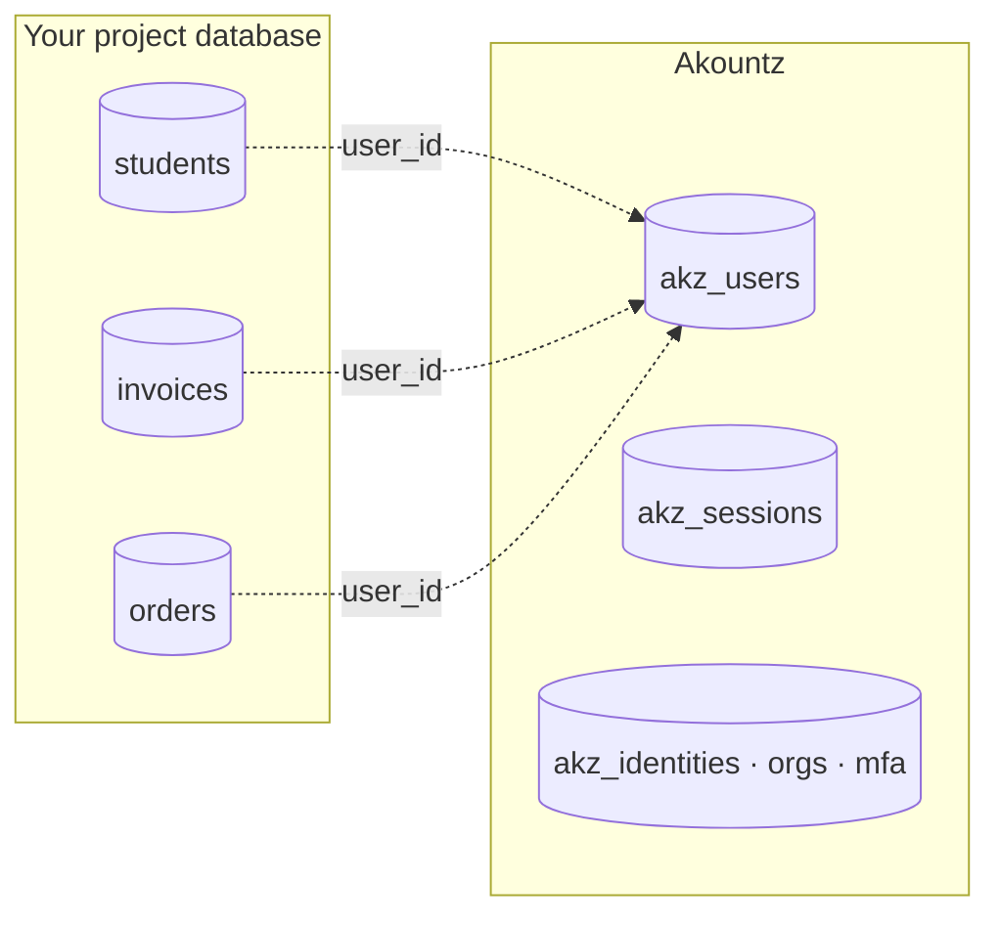
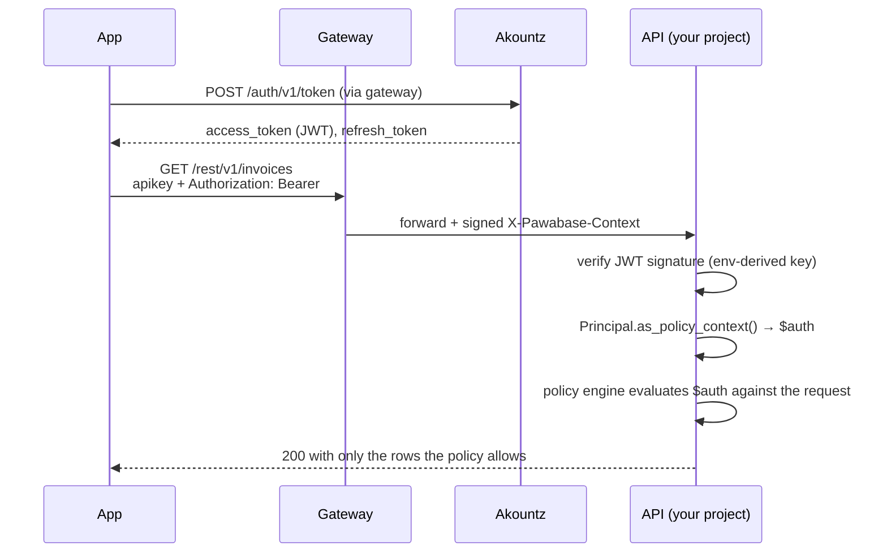

Every Pawabase project needs an answer to "who is this?" before it can answer "may they do that?" The first question is **authentication**, and Pawabase answers it with a dedicated service, **Akountz**, that every project shares. The second question is **authorization**, and it's answered by [policies](/policies/overview), which read the token Akountz issued directly, with no separate "auth rules" system to keep in sync.

This page is the map of the whole auth model: where users live, how sign-in works, what a token contains, how organizations and MFA fit in, and how the pieces you'll read about on the following pages — [configuration](/auth/configuration), [passwords](/auth/passwords), [tokens and sessions](/auth/tokens-and-sessions), [email verification](/auth/email-verification), [password recovery](/auth/password-recovery), [magic links](/auth/magic-links) and [social login](/auth/social-login) — connect to each other.

<CardGroup cols={3}>
  <Card title="One system per project" icon="building">Users belong to a project environment, not to a global Pawabase account directory.</Card>
  <Card title="Stateless tokens" icon="key-round">A short-lived access token and a rotating refresh token; every service verifies them without calling Akountz.</Card>
  <Card title="Policies read tokens directly" icon="shield-check">No separate rules DSL. `$auth.roles`, `$auth.org`, `$auth.aal` are the token's own claims.</Card>
</CardGroup>

## Where users live

Akountz is a Pawabase service, deployed once per installation, that owns exactly one thing: the `akz_users` table and everything attached to it (sessions, MFA factors, linked identities, organizations, login history). It is **not** part of your project's own database. Your `students`, `invoices` or `todos` tables never contain a row for "the user" — they reference a user id that Akountz is the source of truth for.



<Note>
Read the code and you'll find the exact mechanism: `AuthUser` (in `services/akountz/database/models/users.py`) carries `project` and `env` columns and a **unique-together constraint on `(project, env, email)`**. That's the whole scoping story — not a separate database per project, one shared users table partitioned by project and environment.
</Note>

### One auth system per project, not per environment

This is worth stating precisely, because it's easy to get backwards. A **project** (say `acme`) has several **environments** (`development`, `staging`, `production`), and each environment has its **own, separate pool of users**. `ada@example.com` signing up in `acme/development` and `ada@example.com` signing up in `acme/production` are two different accounts with two different passwords, two different id numbers, and two different sets of sessions — the unique constraint is `(project, env, email)`, not `(project, email)`.

That's deliberate: development shouldn't be able to sign in as a production user (or vice versa), and staging data shouldn't leak real customers' credentials. It also means:

- **Promoting** an environment (copying resources, policies, flows) does **not** copy users. Environments start with an empty `akz_users` table and you seed them separately (or let real sign-ups populate `production`).
- A **project** *is* the auth boundary in the sense that means something to your product: `acme`'s users and `initech`'s users can never collide, never share a token, and are never visible to each other's policies, no matter what environment they're in.
- Within one project, `development` and `production` are two more of these boundaries. A user token minted in `development` fails everywhere else, including `staging` — see [why below](#tokens-are-bound-to-one-environment).

<Tip>
If your product genuinely wants one identity across environments (uncommon, but it happens for internal tools), the usual approach is to treat `production` as the single source of truth and have your own script call the [signup endpoint](/auth/passwords#sign-up) against `development`/`staging` with the same emails, rather than trying to share the underlying table — that sharing isn't something the platform does for you.
</Tip>

## The shape of a sign-in

A password sign-in is one request to `POST /auth/v1/token`. Reaching Akountz always goes through the [gateway](/concepts/architecture), the same way every other Pawabase call does, so the request needs a project API key (`apikey` header) identifying which project/environment, and returns an **access token** and a **refresh token**:

<CodeGroup>
```bash cURL
curl -X POST "https://gw.pawabase.app/auth/v1/token" \
  -H "apikey: $PAWABASE_PUBLISHABLE_KEY" \
  -H "content-type: application/json" \
  -d '{
    "grant_type": "password",
    "email": "chioma.nwosu@example.com",
    "password": "correct-horse-battery-staple"
  }'
```
```javascript JavaScript
const res = await fetch("https://gw.pawabase.app/auth/v1/token", {
  method: "POST",
  headers: {
    apikey: PAWABASE_PUBLISHABLE_KEY,
    "content-type": "application/json",
  },
  body: JSON.stringify({
    grant_type: "password",
    email: "chioma.nwosu@example.com",
    password: "correct-horse-battery-staple",
  }),
});
const session = await res.json();
```
```python Python
import httpx

response = httpx.post(
    "https://gw.pawabase.app/auth/v1/token",
    headers={"apikey": PAWABASE_PUBLISHABLE_KEY},
    json={
        "grant_type": "password",
        "email": "chioma.nwosu@example.com",
        "password": "correct-horse-battery-staple",
    },
)
session = response.json()
```
</CodeGroup>

```json 200 OK
{
  "access_token": "eyJhbGciOiJIUzI1NiIs...",
  "refresh_token": "eyJhbGciOiJIUzI1NiIs...",
  "token_type": "bearer",
  "expires_in": 900,
  "expires_at": 1759071845,
  "session_id": "f3f0c2f8b0f6c4a1a6f9c1d3f2a6e9b7",
  "org": null,
  "org_role": null,
  "user": {
    "id": "8",
    "email": "chioma.nwosu@example.com",
    "username": "chioma",
    "name": "Chioma Nwosu",
    "roles": ["guardian"],
    "...": "..."
  }
}
```

From here, every request the app makes sends `Authorization: Bearer <access_token>` alongside the same `apikey`. Every full walkthrough of the request/response shapes, error codes, password policy enforcement and the update-profile endpoint lives on [Passwords →](/auth/passwords).

## From token to `$auth`

This is the part that most distinguishes Pawabase from a typical "auth service + separate rules engine" setup. When a service (the API, the gateway, Angula for realtime) receives a request with `Authorization: Bearer <token>`, it:

1. verifies the JWT's signature against a key **derived deterministically from the project and environment** (so a token can't even be checked against the wrong environment's key, let alone accepted by it);
2. turns the verified claims into a `Principal` object (`packages/kit/pawabase_kit/principal.py`), Sillo's authenticated-user abstraction;
3. exposes `Principal.as_policy_context()` as `$auth` in every [policy](/policies/overview) evaluated for that request.

No lookup, no cache warm, no second call to Akountz. The claims *are* the identity, because they were only ever produced by Akountz's own signing key.



Here is exactly what a policy sees, straight from `Principal.as_policy_context()`:

```python packages/kit/pawabase_kit/principal.py
def as_policy_context(self) -> dict[str, Any]:
    """What policies see under ``auth``."""
    return {
        "authenticated": True,
        "kind": self.kind,
        "user_id": self.identity,
        "email": self.email,
        "roles": self.roles,
        "permissions": self.permissions,
        "org": self.org,
        "org_role": self.claims.get("org_role"),
        "aal": self.claims.get("aal"),
        "session_id": self.claims.get("sid"),
        "claims": self.claims,
    }
```

And in a policy, that's just:

```json
{ "all": [
  { "authenticated": true },
  { "eq": ["$auth.org_role", "admin"] },
  { "eq": ["$record.organization_id", "$auth.org"] }
] }
```

There is no second place this data comes from. `$auth.roles` is not "whatever the rules engine looked up" — it's the literal `roles` claim inside the JWT the caller presented, put there by Akountz at sign-in time from `rbac.roles_of(user)`. If you want to know what a caller can do, read the token; there's nothing else to check.

[Full context reference →](/policies/context) · [What auth looks like in policies →](/auth/auth-in-policies)

## Tokens are bound to one environment

Every access token is signed with `derive_env_secret(master, project, env)` — an HMAC of `"pawabase:user-token:{project}:{env}"` under the platform's master secret. That derivation is one-way and deterministic, which buys two properties at once:

- **No per-environment key management.** Akountz doesn't store a table of environment signing keys; any service that has the platform master secret can derive the right key for any environment on the fly.
- **A token literally cannot cross environments.** Even if you handed an attacker a valid `acme/development` access token, verifying it against `acme/production`'s derived key fails — not because of an environment field check (though there is one, `claims["prj"]`/`claims["env"]` are also checked), but because the signature itself was never made with that key.

```python packages/kit/pawabase_kit/tokens.py
def verify_user_token(token: str, master: str, *, project: str, env: str) -> dict[str, Any]:
    """Verify a user access token for *project*/*env*. Raises :class:`TokenInvalid`."""
    claims = _decode(token, derive_env_secret(master, project, env), audience=USER_AUDIENCE)
    if claims.get("typ") != "access":
        raise TokenInvalid("not an access token")
    if claims.get("prj") != project or claims.get("env") != env:
        raise TokenInvalid("token belongs to another environment")
    return claims
```

## Sign-in scoped to an organization

Pawabase's Akountz ships **organizations** — teams a user can belong to with a role (`owner`, `admin`, `member`, `viewer`) — as a first-class part of the token, not a bolt-on your project's database has to model. When a sign-in or refresh names an `org`, and the user is a member, the resulting access token carries `org` (the slug) and `org_role` (their role in it) as top-level claims, right alongside `roles` and `permissions`:

```bash
curl -X POST "https://gw.pawabase.app/auth/v1/token" \
  -H "apikey: $PAWABASE_PUBLISHABLE_KEY" -H "content-type: application/json" \
  -d '{"grant_type":"password","email":"chioma@example.com","password":"...","org":"acme-hq"}'
```

```json
{
  "access_token": "...",
  "org": "acme-hq",
  "org_role": "admin",
  "...": "..."
}
```

That's exactly what powers multi-tenant policies like the `org_role` example above — no join to a separate memberships table inside your policy, because the membership was already resolved once, at token-issue time, and baked into the claim. A refresh can switch organizations, leave the current one, or (the default) keep it unchanged; see [the KEEP sentinel](/auth/tokens-and-sessions#switching-or-clearing-the-organization-on-refresh) for the exact mechanics. Organization membership, invitations and roles are covered in depth on [Organizations →](/auth/organizations).

<Warning>
Naming an `org` the user isn't a member of doesn't silently issue a token without it — it's a `403`. See [Passwords → error responses](/auth/passwords#error-responses) for the exact shape.
</Warning>

## MFA and assurance levels

Every access token carries an `aal` claim (**authentication assurance level**): `aal1` for an ordinary sign-in, `aal2` once the caller has also passed a second factor. This isn't a separate "is MFA on" flag your policies have to look up elsewhere — `$auth.aal` is right there in the same context as everything else:

```json
{ "all": [
  { "authenticated": true },
  { "eq": ["$auth.aal", "aal2"] }
] }
```

or the built-in shorthand:

```json
"policy": "mfa"
```

When a project has `mfa_enabled` and a user has enrolled a TOTP factor, `POST /auth/v1/token` doesn't return a session directly — it returns an `mfa_required` challenge that must be completed with a second request (`grant_type: "mfa"`) before a session (now at `aal2`) is issued. The full flow, TOTP enrolment, recovery codes and elevating an already-open session, are documented in [MFA →](/auth/mfa); this overview only needs you to know that `aal` exists and where it lives.

## Compared with Supabase Auth and Firebase Auth

<Tabs>
  <Tab title="Supabase Auth">
    Supabase issues a JWT too, and its Postgres RLS reads `auth.uid()` and `auth.jwt()` from it — conceptually close to Pawabase. The differences are in scope and where identity is checked:

    | | Supabase Auth | Pawabase / Akountz |
    | --- | --- | --- |
    | Where users live | One `auth.users` table per Supabase project | Per **project environment** (`(project, env, email)`), so dev/staging/prod never share accounts |
    | Where "rules" read identity | Postgres RLS reads `auth.jwt()`/`auth.uid()` inside SQL | [Policies](/policies/overview) read `$auth.*` — the same JSON condition language used for routes, functions, flows, buckets and realtime channels, not only tables |
    | Organizations | Not built in; commonly modelled by hand with a `memberships` table plus custom RLS | Built into Akountz: membership resolved once at token-issue time, exposed as `$auth.org` / `$auth.org_role` |
    | MFA | Supported, tracked via `aal1`/`aal2` on the session | Supported, tracked via the token's own `aal` claim — same idea, same names, visible directly to every policy without a lookup |
    | Token scope | One key/signing setup per Supabase project | A **derived** key per project *environment*: a token from `dev` cannot even be checked against `prod`'s key |
  </Tab>
  <Tab title="Firebase Auth">
    Firebase Authentication issues ID tokens verified against Google's public keys, and Firestore/RTDB Security Rules read `request.auth.uid` and custom claims.

    | | Firebase Auth | Pawabase / Akountz |
    | --- | --- | --- |
    | Custom claims | Set from a privileged server SDK call (`setCustomUserClaims`), then must be refreshed client-side before they appear in a new ID token | Roles and permissions are read from your database at every sign-in/refresh (`rbac.roles_of(user)`) and minted straight into the token — no separate claims-setting step to remember |
    | Rules language | A dedicated Security Rules DSL, evaluated per read/write, decoupled from your application code | [Policies](/policies/overview) are JSON conditions evaluated by the *same* engine across resources, custom routes, functions, flows, storage and realtime — one vocabulary everywhere |
    | Queries vs. rules | A query that *could* violate a rule is rejected outright; clients must shape queries to match the rules | Policies are **pushed down into SQL** where possible, so the platform filters for you rather than requiring the client to pre-constrain the query — see [pushdown](/policies/pushdown) |
    | Password hashing | Managed by Google, opaque to you | `passlib`-backed (bcrypt by default, falling back to `pbkdf2_sha256`), inspectable in `services/akountz` — see [Passwords → hashing](/auth/passwords#password-hashing) |
    | Organizations/tenancy | Firebase has a separate, paid "multi-tenancy" product for this | Built into every Akountz deployment, no separate product |
  </Tab>
</Tabs>

<Note>
The single biggest practical difference from both: in Pawabase, **the token you already have is the only place identity claims live.** There is no "check the rules dashboard to see what a role can do" step, because roles, permissions, organization and assurance level are values printed inside the JWT the moment you decode it. `jwt.io` shows you the same thing your policies see.
</Note>

## What each page covers

<CardGroup cols={2}>
  <Card title="Configuration" icon="settings" href="/auth/configuration">Every field under an environment's `auth` block: `signup_enabled`, `password_policy`, `access_ttl`, `mfa_enabled`, `emails` and the rest, with defaults.</Card>
  <Card title="Passwords" icon="lock" href="/auth/passwords">Sign-up, the password grant, policy enforcement, hashing, updating a profile.</Card>
  <Card title="Tokens and sessions" icon="key-round" href="/auth/tokens-and-sessions">Claims, rotation, theft detection, revocation, operator sessions vs. project-user sessions.</Card>
  <Card title="Email verification" icon="mail-check" href="/auth/email-verification">The verify flow, `require_email_verification` gating, resending.</Card>
  <Card title="Password recovery" icon="key" href="/auth/password-recovery">The reset flow, link TTLs, the keyless recovery page.</Card>
  <Card title="Magic links" icon="wand-2" href="/auth/magic-links">Passwordless sign-in, `magic_link_enabled`, account creation on first use.</Card>
  <Card title="Social login" icon="chrome" href="/auth/social-login">Which OAuth providers ship, how the callback works, adding a generic provider.</Card>
  <Card title="Organizations" icon="building-2" href="/auth/organizations">Membership, invitations, teams and roles.</Card>
</CardGroup>

## FAQ

<AccordionGroup>
  <Accordion title="Can I share one user pool across two projects?">
    Not through the platform's data model — the unique constraint is `(project, env, email)`, so accounts are always scoped to exactly one project environment. If two products genuinely need shared identity, the usual pattern is to treat one project as the identity source of truth and mirror sign-ups into the other via its own signup endpoint, or front both with your own identity provider and use [social login](/auth/social-login) into each.
  </Accordion>
  <Accordion title="Do I need to call Akountz to check a token on every request?">
    No. Verification is entirely local: `verify_user_token` only needs the platform master secret (to derive the environment key) and the token itself. That's why Pawabase services can check identity on every request without adding a network hop to Akountz.
  </Accordion>
  <Accordion title="What's the difference between a 'user' and an 'operator'?">
    Both are rows in `akz_users`, and both get JWTs from the same token machinery. An **operator** is simply a user of the reserved `_platform` project/environment — the people who sign in to Studio. Project users and operators can never present each other's tokens to each other's services: an operator token verified against `acme/production`'s derived key fails, just like any other cross-environment token would. See [Tokens and sessions → operator sessions](/auth/tokens-and-sessions#operator-sessions-vs-project-user-sessions).
  </Accordion>
  <Accordion title="Is Akountz optional?">
    If your project genuinely has no concept of end users (a purely public read-only API, for instance), you can simply never call `/auth/v1/*` — nothing requires it. The moment any policy references `$auth`, though, those routes assume Akountz-issued tokens; there's no alternate identity provider wired into policy evaluation.
  </Accordion>
  <Accordion title="Where does 'anonymous' come from in a policy?">
    When there's no bearer token (or it failed to verify), `$auth` is `ANONYMOUS_POLICY_CONTEXT` — `authenticated: false`, everything else `null`/empty. See `packages/kit/pawabase_kit/principal.py`.
  </Accordion>
</AccordionGroup>
