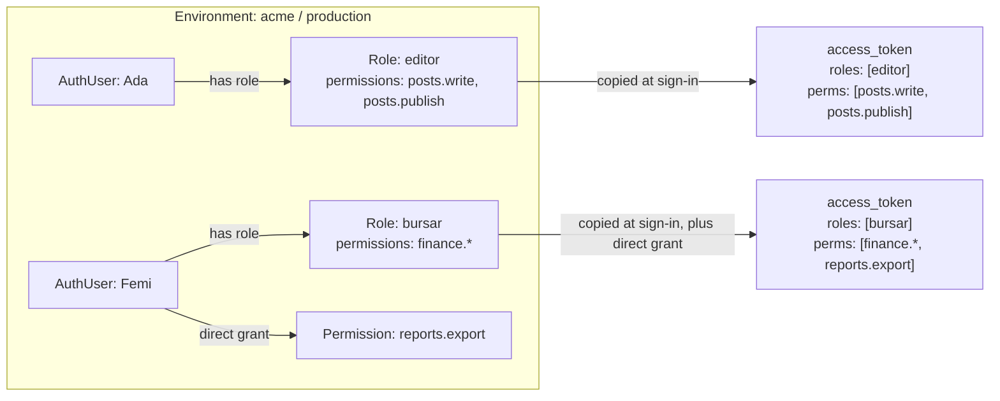
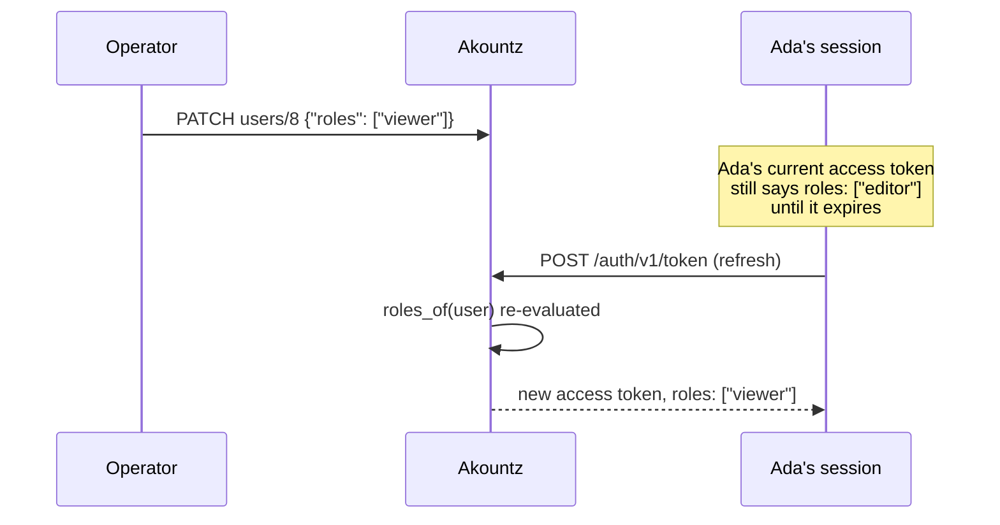

Every Pawabase project environment has its own small RBAC (role-based access control) system, built on Sillo's permission primitives and scoped so that `acme/development` and `acme/production` never share a role or a permission by accident. A **role** is a named group (`editor`, `bursar`, `support_agent`); a **permission** is a string capability (`posts.write`, `finance.export`); a role carries a list of permissions; a user carries zero or more roles, plus optionally permissions granted directly. Both lists are copied into every access token at sign-in, so a policy checking `{"role": "editor"}` or `{"permission": "posts.write"}` never touches the database — it's a lookup in an array that was already inside the JWT.

This page explains how roles and permissions are defined, assigned and revoked, how they end up on the token, and how the `role` and `permission` shorthands use them — cross-referencing [shorthands](/policies/shorthands) rather than repeating its expansion tables, since that page is the canonical reference for exactly what each shorthand evaluates to.

<CardGroup cols={3}>
  <Card title="Per environment" icon="layers">Roles and permissions are scoped to one project environment; `acme/development`'s `editor` and `acme/production`'s `editor` are entirely separate rows.</Card>
  <Card title="On the token, not looked up" icon="zap">`roles` and `perms` are claims, copied in at sign-in — a policy check costs nothing beyond an array lookup.</Card>
  <Card title="Roles group permissions" icon="git-merge">A role is a name plus a list of permissions; a user's effective permissions are the union of their roles' permissions and anything granted directly.</Card>
</CardGroup>

## The model



A **role** is a Sillo `Group`, stored with a name prefixed by its project and environment (`acme/production/editor`) so that Akountz — which serves every project's environments from one database — never lets one environment's `editor` leak permissions into another's. A **permission** is a Sillo `Permission`, prefixed the same way. Neither prefix is ever visible outside `app/rbac.py`: every route strips it before returning a name, and every route that accepts a name adds it back before storing.

```python services/akountz/app/rbac.py (excerpt)
def scoped(project: str, env: str, name: str) -> str:
    return f"{project}/{env}/{name}"

def _strip(project: str, env: str, names: list[str]) -> list[str]:
    prefix = f"{project}/{env}/"
    return sorted({name[len(prefix):] for name in names if name.startswith(prefix)})
```

<Note>
You will never see the `acme/production/` prefix anywhere in an API response or a token claim — it's purely an internal storage detail so Akountz's single set of database tables can serve every environment of every project without collision. `$auth.roles` in a policy is always plain names: `["editor"]`, never `["acme/production/editor"]`.
</Note>

## Defining a role

Roles are managed through the admin API, which every route in this section requires a **service credential** for (`auth=SERVICE_ONLY`) — Studio calls these on an operator's behalf; end users never call them directly.

```bash
curl -X PUT "$STUDIO/admin/v1/projects/acme/envs/production/roles" \
  -H "Authorization: Bearer $SERVICE_TOKEN" \
  -H "content-type: application/json" \
  -d '{
    "name": "bursar",
    "description": "Manages fees, invoices and payments",
    "permissions": ["finance.read", "finance.write", "finance.export"]
  }'
```

```json
{
  "name": "bursar",
  "description": "Manages fees, invoices and payments",
  "permissions": ["finance.export", "finance.read", "finance.write"],
  "members": 0
}
```

`PUT` is idempotent: calling it again with a different `permissions` list **replaces** the role's permission set — anything not in the new list is removed (`define_role()` computes `current - wanted` and calls `group.remove_permissions()` on the difference), and anything new is defined on the fly if it didn't already exist as a `Permission` row. There's no separate "create permission" step; permissions come into existence the first time a role (or a direct grant) references them.

```bash
# List every role and every permission that exists in this environment
curl "$STUDIO/admin/v1/projects/acme/envs/production/roles" -H "Authorization: Bearer $SERVICE_TOKEN"
```

```json
{
  "data": [
    { "name": "bursar", "description": "Manages fees, invoices and payments", "permissions": ["finance.export", "finance.read", "finance.write"], "members": 1 },
    { "name": "editor", "description": "", "permissions": ["posts.publish", "posts.write"], "members": 3 }
  ],
  "permissions": ["finance.export", "finance.read", "finance.write", "posts.publish", "posts.write"]
}
```

`permissions` in this response is the **flat, deduplicated list of every permission that exists anywhere in the environment**, across all roles — useful for building a permission picker in an admin UI, so you're never typing a permission name from scratch and risking a typo that silently creates a new, unused permission.

```bash
# Delete a role — members simply lose it; nothing about their account is deleted
curl -X DELETE "$STUDIO/admin/v1/projects/acme/envs/production/roles/bursar" \
  -H "Authorization: Bearer $SERVICE_TOKEN"
```

`404 no such role` if it doesn't exist. Deleting a role removes every `UserGroup` membership row for it first, then the role itself — any user who held it simply has one fewer role on their next token, with no other side effect.

<Warning>
Deleting a role doesn't retroactively change **already-issued** tokens, for the same reason described throughout this section: roles and permissions are copied into the token at sign-in, not re-checked live. A user holding a token minted while they had the `bursar` role keeps `bursar` in that token's `roles` claim until it expires or they refresh — see [when a role change takes effect](#when-a-role-change-takes-effect).
</Warning>

## Assigning and revoking roles on a user

Two ways to do this: through `PATCH .../users/{user_id}` with a full `roles` list (the usual path from a Studio "edit user" screen), or by creating the user with roles already set.

<Tabs>
  <Tab title="Set roles on an existing user">
    ```bash
    curl -X PATCH "$STUDIO/admin/v1/projects/acme/envs/production/users/8" \
      -H "Authorization: Bearer $SERVICE_TOKEN" \
      -H "content-type: application/json" \
      -d '{"roles": ["editor", "bursar"]}'
    ```
    This **replaces** the user's whole role set: `update()` in `routes/admin.py` diffs the submitted list against the current one and assigns what's new, revokes what's missing —
    ```python
    current = set(await rbac.roles_of(user))
    for role in set(body.roles) - current:
        await rbac.assign_role(user, role)
    for role in current - set(body.roles):
        await rbac.revoke_role(user, role)
    ```
    Send the **complete** list you want the user to end up with, not just the role you're adding — sending `{"roles": ["bursar"]}` for a user who currently holds `["editor", "bursar"]` **removes** `editor`.
  </Tab>
  <Tab title="Set roles at creation">
    ```bash
    curl -X POST "$STUDIO/admin/v1/projects/acme/envs/production/users" \
      -H "Authorization: Bearer $SERVICE_TOKEN" \
      -H "content-type: application/json" \
      -d '{"email": "femi@acme.example", "password": "…", "roles": ["bursar"]}'
    ```
    Roles named here that don't exist yet as `Group` rows are created automatically by `assign_role()`, with no description and no permissions — worth naming roles deliberately before assigning them this way, or following up with a `PUT .../roles` call to give the new role a description and permission list.
  </Tab>
</Tabs>

If assigning a role should never silently create an unfamiliar, empty one (a common source of "why does this user have a role with no permissions attached" confusion), define every role explicitly with `PUT .../roles` first, and only ever assign roles your admin UI already knows about.

## Granting permissions directly

Sometimes a single user needs a capability that doesn't belong on a whole role — a one-off export permission for someone covering for the bursar this week, say. Permissions can be granted straight to a user, independent of any role:

```bash
curl -X POST "$STUDIO/admin/v1/projects/acme/envs/production/users/8/permissions" \
  -H "Authorization: Bearer $SERVICE_TOKEN" \
  -H "content-type: application/json" \
  -d '{"permissions": ["finance.export"]}'
```

```json
{ "permissions": ["finance.export", "posts.publish", "posts.write"] }
```

The response is the user's **full effective permission list** — roles' permissions plus direct grants, merged and deduplicated — not just what was just granted, so it's a convenient way to confirm the change landed. Revoke the same way:

```bash
curl -X DELETE "$STUDIO/admin/v1/projects/acme/envs/production/users/8/permissions" \
  -H "Authorization: Bearer $SERVICE_TOKEN" \
  -H "content-type: application/json" \
  -d '{"permissions": ["finance.export"]}'
```

`DELETE` with a body is unusual in REST but deliberate here — it lets you revoke several permissions in one call, symmetric with the grant endpoint. Revoking a permission that was only ever granted through a role (never directly) does nothing to the role itself; `rbac.revoke()` only removes **direct** grants (`Permission.revoke(user, ...)`), it never touches `UserGroup` rows. To take a permission away that a role grants, edit the role, or remove the role from that specific user (which, again, removes every permission the role grants them, not just one).

## How roles and permissions resolve

`permissions_of()` computes the user's **effective** permission set as the union of two sources:

```python services/akountz/app/rbac.py
async def permissions_of(user: AuthUser) -> list[str]:
    direct = await Permission.of(user)
    via_groups: list[str] = []
    for group in await Group.of_user(user):
        via_groups.extend(await group.get_permissions())
    return _strip(user.project, user.env, [*direct, *via_groups])
```

| Source | Example | Removed by |
| --- | --- | --- |
| Direct grant | `POST .../users/{id}/permissions` | `DELETE .../users/{id}/permissions` with the same name |
| Via a role | Listed in `PUT .../roles`'s `permissions` | Removing the role from the user, or editing the role to drop the permission |

There's no distinction visible to a policy between "has this permission because of a role" and "has this permission because it was granted directly" — `$auth.permissions` is the flattened union either way. Design your roles so this doesn't matter: a permission should mean the same thing regardless of how the caller came to have it.

## What lands on the token

At sign-in, `_access_token()` in `app/sessions.py` calls `rbac.roles_of(user)` and `rbac.permissions_of(user)` and puts the results straight onto the JWT as `roles` and `perms`:

```python services/akountz/app/sessions.py (excerpt)
return issue_user_token(
    akountz.settings.jwt_master_secret,
    project=config.project, env=config.env, user_id=str(user.id),
    …,
    roles=await rbac.roles_of(user),
    permissions=await rbac.permissions_of(user),
    …,
)
```

```json
{
  "sub": "8", "…": "…",
  "roles": ["editor", "bursar"],
  "perms": ["finance.export", "finance.read", "finance.write", "posts.publish", "posts.write"]
}
```

`Principal.as_policy_context()` then exposes these as `$auth.roles` and `$auth.permissions` in every policy — see [auth in policies →](/auth/auth-in-policies#authrolesand-authpermissions) for the full field reference. Nothing about this involves a database round trip once the token is minted: a policy check is an in-memory array lookup against claims the caller is already carrying.

## When a role change takes effect

This is the detail that catches people out, and it's the same mechanism [organization role changes](/auth/organizations#role-changes-and-refresh) use: **roles and permissions are read at token-issue time, not re-checked on every request.** Changing a user's roles through the admin API doesn't touch any token they already hold.



The project's own test suite exercises exactly this: after `PATCH .../users/{id}` sets `roles: ["editor"]`, a **fresh sign-in** (`POST /auth/v1/token`) is what shows the change in the decoded token's `roles` claim — the test doesn't check an existing token, it mints a new one. Because access tokens are short-lived by default (see [token lifetimes](/auth/security-model#token-lifetimes)), this is rarely a practical problem for routine role changes. For anything where immediacy matters — removing a compromised or terminated staff member's access — don't wait for expiry: [revoke their sessions](/auth/managing-users#ending-sessions), which invalidates the refresh token too and forces re-authentication from scratch.

<Tip>
This same rule is why `PATCH .../users/{id} {"disabled": true}` in `routes/admin.py` explicitly calls `revoke_all(user)` as part of disabling an account, rather than relying on the account being unusable at next sign-in alone — disabling is meant to be immediate, so it pairs the flag with an explicit session revocation. Follow that pattern for your own security-sensitive role changes.
</Tip>

## Roles vs permissions: which to check

Both `role` and `permission` are policy shorthands — see [shorthands: role vs permission](/policies/shorthands#role-vs-permission) for the precise trade-off. The short version, restated for this page's context:

| | Check with `role` | Check with `permission` |
| --- | --- | --- |
| Meaning | "is this kind of staff member" | "can do this specific thing" |
| Grows well when | The org chart is small and stable | New roles get added often, and should inherit existing capabilities automatically |
| Policy changes needed when a new role appears | Every policy that should admit the new role needs editing | None — grant the permission to the new role and every policy that checks it already admits it |
| List semantics | A list means **any** of the roles | A list means **all** of the permissions |

```json
// role: simple, reads naturally, needs editing if a new equivalent role appears later
{ "role": ["admin", "principal", "bursar"] }
```

```json
// permission: a new role ("assistant_bursar") that's granted finance.read
// is admitted automatically, no policy edit required
{ "permission": "finance.read" }
```

A practical rule of thumb: start with `role` for anything small (a handful of staff types that rarely change), and move to `permission` the moment you catch yourself editing the same list of roles across several policies every time you add a new kind of staff member.

## Naming conventions

There's no enforced schema for permission names beyond what a Sillo `Permission` allows as a string, but a `resource.action` convention keeps a growing permission list legible and lets a `*` wildcard mean something predictable:

| Convention | Example |
| --- | --- |
| `resource.read` / `resource.write` | `finance.read`, `finance.write` |
| `resource.specific_action` | `posts.publish`, `reports.export` |
| `resource.*` (a **stored**, literal string — not a real wildcard, see below) | `finance.*` |
| `*` (the one wildcard the engine actually understands) | grant sparingly, usually only to `admin` |

<Warning>
Only the literal permission `*` is treated as a wildcard **by the `permission` shorthand**. Storing `finance.*` as a permission on a role does **not** make `{"permission": "finance.read"}` pass for members of that role — `finance.*` and `finance.read` are two entirely distinct strings as far as the engine's `contains` check is concerned. If you want a role to hold "everything under finance," either grant every specific permission explicitly, or check the literal `finance.*` string in policies that are meant to recognise it (`{"any": [{"permission": "finance.read"}, {"permission": "finance.*"}]}`), matching the pattern [shorthands](/policies/shorthands#permission) documents for exactly this trap.
</Warning>

## A worked design: a school's RBAC

Five roles, showing how role and permission checks combine in practice — the same structure the [policies overview's worked example](/policies/overview#designing-a-policy-set) uses, filled in with the specific admin calls that create it.

<Steps>
  <Step title="Define the roles">
    ```bash
    for role in \
      'admin|Full platform access|*' \
      'principal|School leadership|students.*,reports.publish,finance.read' \
      'bursar|Finance office|finance.*' \
      'teacher|Teaching staff|students.read,report_cards.write' \
      'librarian|Library desk|library.*'
    do
      IFS='|' read -r name desc perms <<< "$role"
      curl -s -X PUT "$STUDIO/admin/v1/projects/school/envs/production/roles" \
        -H "Authorization: Bearer $SERVICE_TOKEN" -H "content-type: application/json" \
        -d "$(jq -n --arg n "$name" --arg d "$desc" --arg p "$perms" \
          '{name: $n, description: $d, permissions: ($p | split(","))}')"
    done
    ```
    Note `admin`'s single permission is the literal string `"*"` — the actual wildcard, not `platform.*` — so `{"permission": "anything.at.all"}` passes for it via the `permission` shorthand's own wildcard handling, not because of any naming convention.
  </Step>
  <Step title="Assign roles as staff are onboarded">
    ```bash
    curl -X POST "$STUDIO/admin/v1/projects/school/envs/production/users" \
      -H "Authorization: Bearer $SERVICE_TOKEN" -H "content-type: application/json" \
      -d '{"email": "grace@school.example", "roles": ["teacher"]}'
    ```
  </Step>
  <Step title="Write policies against roles for coarse gates, permissions for shared capabilities">
    ```json
    // staff (role-only, cheap, used everywhere staff-vs-family matters)
    { "role": ["admin", "principal", "bursar", "teacher", "librarian"] }
    ```
    ```json
    // finance_staff (permission-based, so a future "assistant_bursar" role just needs the permission)
    { "permission": "finance.read" }
    ```
    ```json
    // report_publisher (a specific action, held by exactly two roles today)
    { "any": [ { "role": "admin" }, { "permission": "reports.publish" } ] }
    ```
  </Step>
  <Step title="Confirm with a real token">
    ```bash
    TOKEN=$(curl -s -X POST "$GW/auth/v1/token" -H "apikey: $PK" -H "content-type: application/json" \
      -d '{"email": "grace@school.example", "password": "…"}' | jq -r .access_token)
    curl "$GW/rest/v1/report_cards" -H "apikey: $PK" -H "Authorization: Bearer $TOKEN"
    ```
  </Step>
</Steps>

## Checking a user's roles and permissions

```bash
# As the user themself, from their own token
curl "$GW/auth/v1/user" -H "apikey: $PK" -H "Authorization: Bearer $TOKEN"
```

The `/auth/v1/user` response doesn't itself list `roles`/`perms` (those are token claims, not user-record fields returned by `user_view()`) — decode the access token directly to see them, or use the admin surface:

```bash
# As an operator, looking a user up directly
curl "$STUDIO/admin/v1/projects/acme/envs/production/users/8" -H "Authorization: Bearer $SERVICE_TOKEN"
```

```json
{
  "id": "8", "email": "ada@example.com", "…": "…",
  "sessions": [ { "id": "f3d9…", "aal": "aal1", "…": "…" } ]
}
```

<Note>
The admin "one user" response doesn't include a `roles` array directly either — roles and permissions are queried per environment (`GET .../roles`, which lists roles **with their member counts**, not per-member) rather than denormalised onto every user response. To see one specific user's roles, decode a token they've signed in with, or query `GET .../roles` and check which roles' member counts include them (Studio's UI does the equivalent by cross-referencing the two).
</Note>

## Roles and permissions are per environment

A role created in `development` does not exist in `production`, even with the same name — they are entirely separate `Group` rows, and `list_roles()` filters strictly by the `project/env/` prefix. This is deliberate and matches every other kind of [definition](/concepts/definitions-as-data) in Pawabase: your access model is designed and tested in `development`, then re-created (usually via the same admin API calls, scripted or exported) in `production` — there's no automatic copy of RBAC between environments the way [resources and policies are promoted](/operate/environments-and-promotion), because roles are **identity** data (who exists, what they're allowed to do to real, live user accounts) rather than **schema** data, and mixing the two would risk carrying a development-only test role into production, or worse, real production role assignments into a shared development database.

```bash
# The same query, two environments — two independent answers
curl "$STUDIO/admin/v1/projects/acme/envs/development/roles" -H "Authorization: Bearer $SERVICE_TOKEN"
curl "$STUDIO/admin/v1/projects/acme/envs/production/roles" -H "Authorization: Bearer $SERVICE_TOKEN"
```

If you want the same RBAC shape in both, script the `PUT .../roles` calls and run the script against each environment — treat it the same way you'd treat seeding any other environment-specific data.

## Roles and permissions versus organization roles

It bears repeating, because the two systems look similar and are checked with similarly-shaped policy fragments: **environment roles** (this page) are a property of the **user**, identical no matter which [organization](/auth/organizations) their token happens to be scoped to. **Organization roles** (`owner`/`admin`/`member`/`viewer`) are a property of the **membership**, and only exist inside an org-scoped token as `$auth.org_role`. They're checked differently — `role`/`permission` shorthands for the former, a plain `in`/`eq` comparison against `$auth.org_role` for the latter, because org roles have no shorthand of their own. See [organizations: environment roles are not organization roles](/auth/organizations#the-model-in-one-paragraph) and the direct comparison in [shorthands' FAQ](/policies/shorthands#faq).

```json
// Uses BOTH systems together: platform staff always get in (environment role),
// otherwise the caller must manage the record's own tenant (organization role)
{ "any": [
  { "role": "platform_admin" },
  { "all": [
    { "eq": ["$record.store_id", "$auth.org"] },
    { "in": ["$auth.org_role", ["owner", "admin"]] }
  ] }
] }
```

## Compared with Supabase and Firebase

<Tabs>
  <Tab title="Supabase">
    Supabase has no built-in role or permission system beyond Postgres roles (which are database-level, not application-level) and whatever custom claims you attach to a JWT yourself via a Postgres function or an Edge Function hook. Modelling "editor" and "bursar" the way this page describes means building your own roles/permissions tables and your own claim-injection logic.

    | | Supabase | Pawabase |
    | --- | --- | --- |
    | Role storage | Your own table, or Postgres roles | Built in, per environment, via the admin API |
    | On the JWT | Only if you write a custom claims hook | Always: `roles` and `perms` on every access token |
    | Permission model | None built in | Roles carry a `permissions` array; grant directly too |
  </Tab>
  <Tab title="Firebase">
    Firebase's answer is **custom claims**, set by a privileged server call (`admin.auth().setCustomUserClaims(uid, {admin: true})`) and read in Security Rules as `request.auth.token.admin`. There's no concept of a *role* grouping several claims, or a permission that several roles share — every claim is a one-off boolean or value you invent and manage yourself.

    | | Firebase | Pawabase |
    | --- | --- | --- |
    | Roles | Custom claims, one flag per capability, self-managed | Named roles with a permission list, managed through one admin API |
    | Reuse across capabilities | None — each claim stands alone | A permission can be granted by multiple roles, or directly |
    | Where it's set | A server call to the Admin SDK, per user, per claim | `PUT .../roles` once, `PATCH .../users/{id}` to assign |
  </Tab>
</Tabs>

In both comparisons, the practical difference is the same: Pawabase's RBAC is a first-class, per-environment feature with its own API, rather than something every project reinvents on top of a lower-level claims mechanism.

## Common mistakes

<AccordionGroup>
  <Accordion title="Sending a partial roles list on PATCH and losing roles">
    `PATCH .../users/{id} {"roles": [...]}` replaces the whole set. Fetch the user's current roles first if you're only adding one, and send the union.
  </Accordion>
  <Accordion title="Assuming finance.* is a wildcard">
    It's a literal permission string. Only the bare `*` is special-cased by the `permission` shorthand. See the warning under [naming conventions](#naming-conventions).
  </Accordion>
  <Accordion title="Expecting a role edit to update issued tokens">
    It doesn't, by design — see [when a role change takes effect](#when-a-role-change-takes-effect). Pair security-sensitive changes with a session revocation.
  </Accordion>
  <Accordion title="Creating roles implicitly by typo">
    `assign_role()` creates a role on the fly if the name doesn't exist. A typo in an admin script (`"editro"` instead of `"editor"`) silently creates a new, empty, unintended role rather than erroring. Define roles explicitly with `PUT .../roles` and keep assignment scripts working from a fixed, reviewed list of names.
  </Accordion>
  <Accordion title="Confusing environment roles with organization roles">
    They're different systems with different shorthands. See [Roles and permissions versus organization roles](#roles-and-permissions-versus-organization-roles).
  </Accordion>
  <Accordion title="Granting * to a role 'just for now'">
    A role holding `*` bypasses every `permission` check the same way a service credential bypasses every policy. It's appropriate for a genuine `admin` role and rarely appropriate anywhere else — grant the specific permissions a role actually needs instead.
  </Accordion>
</AccordionGroup>

## Troubleshooting

| Symptom | Likely cause | Fix |
| --- | --- | --- |
| `{"role": "editor"}` refuses a user you just made an editor | Their current token predates the change | Sign in again, or refresh; revoke sessions for immediate effect |
| `{"permission": "finance.read"}` refuses a bursar with `finance.*` | Only literal `*` is a wildcard | Grant `finance.read` explicitly, or check `finance.*` too |
| A role appears with permissions you didn't set | It was created implicitly by `assign_role()` on a typo, or by an old `PUT` that hasn't been re-applied | `GET .../roles` to inspect it; `PUT` to fix its permission list, or `DELETE` and recreate |
| `GET .../roles` shows a role from a different project | It shouldn't — each is scoped by project **and** environment via the storage prefix; double-check the path you called | File this as a bug if it genuinely happens — the prefix check is unconditional |
| Granting a permission with `POST .../permissions` doesn't show up in `$auth.permissions` | The caller's token predates the grant | Sign in again, or refresh |
| Deleting a role doesn't remove a permission from affected users | Some of them also hold the permission via another role, or a direct grant | Check `permissions_of()`'s two sources: role membership and direct grants |

## FAQ

<AccordionGroup>
  <Accordion title="Is there a limit on how many roles a user can hold?">
    No hard limit in the platform. Practically, keep it small — a handful of roles per user keeps `$auth.roles` easy to reason about in policies and in Studio's UI.
  </Accordion>
  <Accordion title="Can a role's permission list be empty?">
    Yes — a role with no permissions is still a valid grouping for `{"role": "..."}` checks, useful when you only ever intend to check the role name itself and never delegate through permissions.
  </Accordion>
  <Accordion title="Do roles support any hierarchy, like 'admin implies editor'?">
    No built-in inheritance. Model overlap by granting shared permissions to both roles, or by having a policy check `{"any": [{"role": "admin"}, {"role": "editor"}]}` explicitly. There's no "admin automatically passes any editor check."
  </Accordion>
  <Accordion title="Can I rename a role?">
    Not directly — `PUT .../roles` creates or replaces by name; there's no rename operation, since the name is also the identity used in every existing policy reference (`role:editor`). Create the new name, migrate users and policies to it, then delete the old one.
  </Accordion>
  <Accordion title="Is there an audit log of role and permission changes?">
    Akountz emits `user.updated` events (with a `changed` list) for user-record updates; role and permission changes specifically go through the admin routes rather than the emitted-event trail directly — check Studio's Observability for admin API call history in your environment, or wire your own audit flow off the emitted events if you need a durable record.
  </Accordion>
  <Accordion title="Can a Python policy check something roles and permissions can't express, like 'has held this role for 90 days'?">
    Yes — write a [Python policy](/policies/python-policies) that reads `context["auth"]["roles"]` for the coarse check and looks up whatever additional fact (a role-assignment timestamp you track yourself, since Akountz doesn't record one) it needs from your own data.
  </Accordion>
</AccordionGroup>

## Next

<CardGroup cols={2}>
  <Card title="Auth in policies" icon="list-tree" href="/auth/auth-in-policies">The complete $auth field reference, including roles and permissions.</Card>
  <Card title="Shorthands" icon="zap" href="/policies/shorthands">The exact expansion of role and permission, with a worked clinic example.</Card>
  <Card title="Organizations" icon="building" href="/auth/organizations">The separate, per-tenant role system: org_role.</Card>
  <Card title="Managing users" icon="users-cog" href="/auth/managing-users">Where role assignment fits into the operator's full user-management toolkit.</Card>
</CardGroup>
