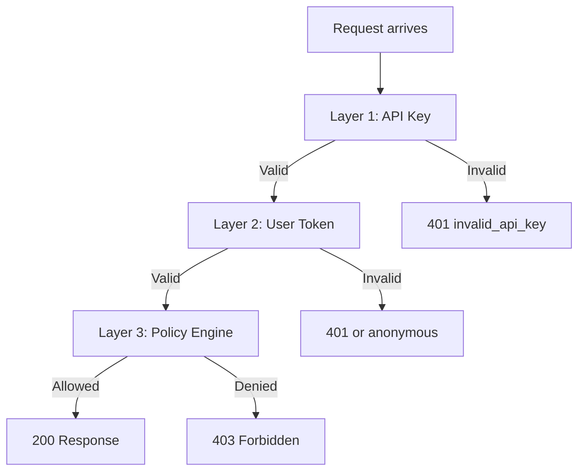

Pawabase's authentication security is not a single mechanism — it is a **defense-in-depth architecture** where every layer is independent and every failure is bounded. This page explains the security model in full: how signing keys are derived, how brute-force attacks are mitigated, how token theft is detected, how credentials are isolated by environment, and what happens when a layer fails.

<CardGroup cols={3}>
  <Card title="Bounded blast radius" icon="shield">A compromised key for `acme/development` cannot touch `acme/production` — the keys are derived differently.</Card>
  <Card title="Independent layers" icon="layers">The API key layer, the token layer, and the policy layer each fail independently and safely.</Card>
  <Card title="No single point of failure" icon="blocks">Compromising the master secret alone is not enough — each environment derives its own signing key.</Card>
</CardGroup>

## The per-environment signing key derivation

The most important security property of the entire authentication system is that **a token from one environment cannot be used in another**. This is not enforced by convention or configuration — it is enforced by the mathematics of the key derivation.

Every environment's user tokens are signed with a key derived deterministically from the platform master secret and the `project:env` pair:

```python
def derive_env_secret(master: str, project: str, env: str) -> str:
    """The signing key for one project environment's user tokens."""
    message = f"pawabase:user-token:{project}:{env}".encode()
    return hmac.new(master.encode(), message, hashlib.sha256).hexdigest()
```

This has three security properties:

1. **One-way**: Given a derived key, it is computationally infeasible to recover the master secret or derive the key for any other environment. HMAC-SHA256 is a pseudorandom function — the output reveals nothing about the input.
2. **Deterministic**: Every service can independently compute the correct key for any environment, without storing or exchanging per-environment keys. This means verification is fully local — no network call to Akountz on every request.
3. **Environment-isolated**: The key for `acme/development` is a completely different pseudorandom string from the key for `acme/production`. A token signed with one cannot be verified with the other — the signature check fails at the HMAC verification stage.

```python
def verify_user_token(token: str, master: str, *, project: str, env: str) -> dict[str, Any]:
    """Verify a user access token for *project*/*env*. Raises :class:`TokenInvalid`."""
    claims = _decode(token, derive_env_secret(master, project, env), audience=USER_AUDIENCE)
    if claims.get("typ") != "access":
        raise TokenInvalid("not an access token")
    if claims.get("prj") != project or claims.get("env") != env:
        raise TokenInvalid("token belongs to another environment")
    return claims
```

Note that the environment check is **doubled**: the signature verification itself fails (because the wrong key is used), *and* the `prj`/`env` claims are checked independently. This means even if a theoretical weakness in HMAC-SHA256 ever emerged, the claim-level check would still reject cross-environment tokens.

<Warning>
This means the **platform master secret** is the root of trust for the entire authentication system. If the master secret is compromised, every environment's tokens can be forged. The master secret must be protected with the same rigor as a root CA private key — hardware security modules, restricted access, and audit logging for every use. It is never stored in the application codebase; it is injected through environment variables or a secrets manager.
</Warning>

## Credential isolation: the three-layer model

Every request to a Pawabase backend passes through three independent security layers, each of which can fail without affecting the others:



### Layer 1: API key resolution (the gateway)

The gateway resolves the API key — hashes it, looks it up, checks revocation and expiry, enforces CORS, builds a `PlatformContext`, and strips the raw key. This layer answers **"which project, which environment, what baseline privilege?"**

The API key layer is **completely independent** of the user token layer. A request with a valid API key but an expired user token still has its environment context intact. The `PlatformContext` (project, env, role, key_id, scopes) is fully resolved before the user token is even inspected.

```python
# The gateway's key resolver flow:
# 1. Locate raw key (apikey header, x-api-key, or ?apikey=)
# 2. Hash and look up (SHA-256, ProjectKey row)
# 3. Check revocation and expiry
# 4. Build PlatformContext
# 5. Enforce CORS for publishable keys
# 6. Strip raw key, sign context → X-Pawabase-Context
```

### Layer 2: User token verification (every service)

Each service verifies the user token independently, using the derived per-environment key. This layer answers **"which person, with what identity claims, within the environment the API key selected?"**

The verification is stateless — every service does it on every request without calling Akountz. The `ProjectUserBackend.authenticate` method:

```python
async def authenticate(self, ctx) -> AuthResult:
    token = _bearer(ctx.headers)
    context = ctx.scope.get(SCOPE_KEY)
    if not token or context is None:
        return _FAIL
    try:
        claims = verify_user_token(token, self.master_secret, project=context.project, env=context.env)
    except TokenInvalid:
        return _FAIL
    return AuthResult(success=True, identity=encode_identity("user", claims), scope="user")
```

The `context.project` and `context.env` come from the **already-resolved API key** — not from anything the token itself claims. This is critical: even if an attacker crafts a token with `"prj": "acme", "env": "production"` in its payload, the verification still fails if the API key is for `acme/development`, because the derived key used to check the signature is different.

### Layer 3: Policy engine (the authorization gate)

The policy engine evaluates every request against the policies configured for the resource. It sees the full `auth` context (claims, roles, permissions, org, AAL) and the `credential` context (project, env, role, scopes). It is the only layer that makes an authorization decision.

The policy engine is the last stop. Nothing upstream of it makes an authorization decision — the gateway's checks are about the key and the environment, not about what the caller may *do*.

## Brute-force protection

Two independent layers of brute-force protection exist:

### Per-IP rate limiting

Every authentication endpoint is wrapped with `rate_limit_middleware`:

| Endpoint | Limit | Window | Middleware key |
| --- | --- | --- | --- |
| `POST /auth/v1/token` | 30 requests | 60 seconds | `"akz:auth"` |
| `POST /auth/v1/verify/request`, `/recover`, `/magic-link` | 10 requests | 60 seconds | `"akz:links"` |
| `POST /auth/v1/mfa/totp/verify`, `/mfa/disable`, `/mfa/recovery-codes` | 10 requests | 60 seconds | `"akz:mfa"` |

Rate limiting is enforced at the gateway level using a Redis-backed sliding window. A client that exceeds the limit receives `429 too many failed attempts; try again later`.

### Per-account lockout

After `lockout_threshold` (default 10) failed password attempts within `lockout_minutes` (default 15) minutes, the account is locked:

```python
async def record_failure(user: AuthUser, threshold: int, minutes: int) -> None:
    user.failed_logins += 1
    if user.failed_logins >= threshold:
        user.locked_until = datetime.now(UTC) + timedelta(minutes=minutes)
        user.failed_logins = 0
    await user.save(update_fields=["failed_logins", "locked_until"])
```

Lockout applies per-environment — a user locked out in `acme/development` is not locked in `acme/production`. A successful sign-in resets both counters to 0.

**Lockout does not block recovery**: a locked-out user can still request a recovery link and reset their password. The `/recover` endpoint does not check `is_locked`. Recovery codes also bypass the lockout check — a locked-out user with MFA recovery codes can still sign in.

<Note>
The lockout threshold and duration are configured per environment via `AkountzSettings` (`lockout_threshold: int = 10`, `lockout_minutes: int = 15`). These can be adjusted for environments with higher traffic — a development environment might use a higher threshold to avoid locking out developers who mistype their password repeatedly.
</Note>

## Token theft detection

The rotating refresh token mechanism provides automatic theft detection:

1. Every refresh token is part of a **token family** tracked by Sillo's `JWTToken` rows.
2. When a refresh token is used, `refresh_token_pair` rotates the family — issuing a new access token and a new refresh token, and marking the old refresh token as consumed.
3. If the *same* refresh token is used twice (because an attacker intercepted it and the legitimate client already refreshed), `refresh_token_pair` raises a `ValueError` containing `"theft"`.
4. Akountz handles this by revoking the **entire token family** and emitting a `session.reuse_detected` event.

```python
try:
    pair = await user.refresh_token_pair(refresh_token, akountz.refresh_secret(config.project, config.env))
except ValueError as exc:
    if "theft" in str(exc):
        row = await JWTToken.filter(token_jti=claims.get("jti") or "").first()
        if row is not None:
            await SessionInfo.filter(family=row.token_family).update(revoked_at=datetime.now(UTC))
        await akountz.emit(config.project, config.env, "session.reuse_detected", ...)
    raise HTTPException(status_code=401, detail="invalid refresh token") from exc
```

This means:
- An attacker who intercepts a refresh token has a very narrow window — the legitimate client will refresh first, and when the attacker tries to use the stolen token, the entire session is revoked.
- The theft detection is automatic — no manual intervention is required.
- The `session.reuse_detected` event allows monitoring systems to alert on potential compromise.

## Compromise scenarios and bounded blast radius

### Scenario 1: A publishable key is leaked

A publishable key (`pb_pk_…`) is designed to be public. It can only do what `publishable`-role actions allow, and only within its environment. CORS enforcement adds another layer — the key only works from allowed origins.

**Bounded exposure**: The attacker can read public data and perform publishable-scoped operations from an allowed origin. They cannot access secret data, bypass policies, or act in other environments.

### Scenario 2: A secret key is leaked

A secret key (`pb_sk_…`) bypasses all policies — it is equivalent to root access to that environment. This is the most dangerous credential leak scenario.

**Bounded exposure**: The attacker has full access to *one* environment only. They cannot access other environments, and they cannot bypass the gateway's rate limiting. The response is immediate: revoke the key and rotate (see [Configuration → rotating a leaked secret key](/auth/configuration#rotating-a-leaked-secret-key-a-runbook)).

### Scenario 3: An access token is leaked

An access token is valid for `access_ttl` seconds (default 15 minutes). After expiry, it cannot be used. The refresh token is not a bearer token — it can only be submitted to the refresh endpoint and is rotating.

**Bounded exposure**: The attacker has at most 15 minutes of access. After that, the token expires naturally. If the refresh token was also leaked, the attacker can refresh until the refresh token's TTL expires — but rotation means the legitimate client will detect the theft and revoke the family.

### Scenario 4: The platform master secret is compromised

This is the most catastrophic scenario. The master secret is the root from which every environment's signing key is derived. With it, an attacker can forge valid tokens for any project, any environment, any user.

**Response**: The only effective mitigation is to rotate the master secret and re-issue all tokens. This requires a platform-wide operation — every service must be updated with the new secret, and every user must re-authenticate. This is why the master secret is never stored in code, never logged, and is only available through the platform's secrets management system.

## Session security

### Session data at rest

`SessionInfo` rows store `ip`, `user_agent`, `org`, `aal`, `method`, `last_refreshed_at`, and `revoked_at`. This metadata is used for:

- **Session listing**: `GET /auth/v1/sessions` shows the user all active sessions with device information.
- **Theft detection**: `SessionInfo` rows are updated when theft is detected — `revoked_at` is set on the entire family.
- **Audit**: Session metadata is included in the admin events API and audit logs.

### Session metadata is never in the token

The access token's claims (`prj`, `env`, `sid`, `jti`, `sub`, `roles`, etc.) are the *only* data a service can trust. Session metadata like `ip`, `user_agent`, and `method` are stored in the database and never encoded in the token. This means a service cannot learn the user's IP or device from the token alone — it must query the session info separately if needed.

## Cryptographic details

### Token encoding

All tokens are JWTs encoded with `sillo.helpers.jwt`. The encoding uses the HMAC-SHA256 algorithm (`HS256`), with the derived per-environment secret for user tokens and the installation master secret for service and context tokens.

### Token identifiers

Every token has a unique `jti` (JWT ID), which maps to a `JWTToken` row in Sillo's token tracking system. The `jti` is generated with `secrets.token_hex(8)` — a cryptographically random 16-byte hex string. This means:

- Token IDs are unpredictable — an attacker cannot guess a valid `jti`.
- Token IDs are unique — the probability of collision is negligible.
- Token IDs are tracked — every token in a family is linked to its `jti`, enabling precise revocation.

### One-time tokens

Verification, recovery, magic-link, and invitation tokens are signed with Sillo's `URLSafeTimedSerializer` and backed by `OneTimeToken` rows. The token string itself is a signed payload containing the row `id`. Verification checks:

1. The signature is valid (using the per-project, per-environment serializer secret).
2. The `max_age` has not expired (lifetimes vary by purpose: 24h for verify, 1h for recovery, 15min for magic, 10min for link, 5min for MFA).
3. The corresponding `OneTimeToken` row exists, has not been used (`used_at is None`), and has not expired (`expires_at > now`).
4. On consumption, `used_at` is set atomically — concurrent requests are handled by the database update returning 0 rows affected.

```python
row = await OneTimeToken.filter(id=row.id, used_at=None).update(used_at=datetime.now(UTC))
if not updated:  # a concurrent request used it first
    raise invalid
```

## Defense summary

| Threat | Mitigation | Layer |
| --- | --- | --- |
| Cross-environment token replay | Per-environment derived signing keys | Cryptographic |
| Token theft | Rotating refresh tokens + theft detection | Token lifecycle |
| Brute-force password guessing | Per-IP rate limiting + per-account lockout | Rate limiting |
| Credential enumeration | Identical error responses for unknown/wrong credentials | Error handling |
| Secret key leak | Revocation + rotation; scoping limits exposure | Key management |
| MFA bypass | Recovery codes as fallback; admin MFA reset | MFA |
| Identity takeover via social login | `email_verified` requirement for account matching | Social login |
| Session fixation | New session ID on every sign-in and refresh | Session management |
| Master secret compromise | Per-environment key derivation limits blast radius; rotation procedure | Cryptographic |
| CSRF on social login | State parameter + PKCE via `sillo-oauth` | OAuth protocol |
| One-time token reuse | Single-use rows with atomic `used_at` update | Token lifecycle |
| Locked account recovery | Recovery links bypass lockout; admin can re-enable | Account recovery |

<Note>
No single defense is sufficient on its own — the security model works because the layers are independent. If rate limiting fails, the per-account lockout still protects. If the lockout is misconfigured, the short access token lifetime still bounds exposure. If a token is stolen, rotation and theft detection still catch it. Defense-in-depth is not a theoretical ideal — it is the operational reality of the system.
</Note>
