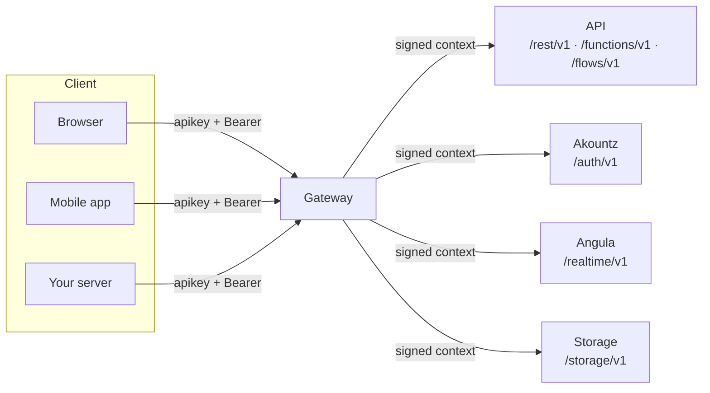

Every client of a Pawabase project, whether it's a React app, a Flutter build, a cron job or another company's server, talks to exactly one address: **the gateway**. This page is the complete picture of that conversation: what URL you call, which credential you send, how CORS and rate limits apply, and the one rule that keeps a browser bundle safe to ship.

<CardGroup cols={3}>
  <Card title="One address" icon="signpost">The gateway is the only host a client ever calls. It resolves your key and forwards to the right internal service.</Card>
  <Card title="Two kinds of key" icon="key">A **publishable** key identifies your project in a client. A **secret** key bypasses every policy and never leaves a server.</Card>
  <Card title="Policies do the rest" icon="shield-check">Once the gateway has resolved who's calling, [policies](/policies/overview) decide what they can see and do.</Card>
</CardGroup>

## The gateway

A Pawabase installation runs several internal services — the compiled data API, Akountz (identity), Angula (realtime), a storage layer — but a client never talks to any of them directly. It talks to the **gateway**, which is the only host reachable from outside:



In local development the gateway is usually `http://localhost:8080`; in production it's the domain your installation issues for the project (for example `https://api.yourapp.com` if you've put a custom domain in front of it, or the platform's default gateway host). Everywhere in this documentation, `$GW` stands for that base URL. `/internal` and `/admin` paths exist on the internal services but are never reachable through the gateway — there is no way for a client to accidentally reach them.

Every request that reaches the gateway goes through the same four steps, in order, before it's forwarded anywhere:

<Steps>
  <Step title="Resolve the key">
    The gateway reads `apikey`, `x-api-key`, or `?apikey=` from the query string (used for browser navigations and WebSockets, where a custom header isn't available) and turns it into a **platform context**: which project, which environment, which role (`publishable` or `secret`), which scopes.
  </Step>
  <Step title="Enforce CORS for publishable keys">
    If the key is `publishable` and the environment has an allowed-origins list configured, the request's `Origin` header must be on it or the gateway answers `403 origin_not_allowed` before your backend ever sees the request. Secret keys aren't browser credentials, so this check doesn't apply to them.
  </Step>
  <Step title="Enforce the rate limit">
    Requests are rate-limited per key (or per client IP, for requests with no key) with a sliding window. A request over the limit gets `429 rate_limit_exceeded` with a `Retry-After` header and a `retry_after` field, both in seconds.
  </Step>
  <Step title="Strip and forward">
    The gateway removes `apikey`, `x-api-key`, and anything starting with `x-pawabase-` from the outgoing request — a client cannot inject its own platform context — then adds a short-lived, signed `X-Pawabase-Context` header the internal service trusts, plus `X-Forwarded-For`, `X-Forwarded-Proto`, `X-Forwarded-Host` and `X-Request-ID`. Only then is the request streamed to the right internal service.
  </Step>
</Steps>

<Note>
This means a client-visible error like `missing_api_key`, `invalid_api_key`, `origin_not_allowed` or `rate_limit_exceeded` always comes from the gateway itself, before your resources, policies or flows run at all. See [Errors](/clients/errors) for the full table.
</Note>

## The two kinds of API key

Every environment has exactly two live API keys: **publishable** and **secret**. They authenticate the same way (the `apikey` header) but mean opposite things to every policy in your project.

<Tabs>
  <Tab title="Publishable key">
    - Meant to be embedded in a browser bundle, a mobile app binary, or any client you don't fully control.
    - Identifies the request as coming from an **anonymous or ordinary caller**. Every [policy](/policies/overview) you've written runs normally against it.
    - Subject to the environment's CORS allow-list when used from a browser.
    - Can be scoped, but is almost always used unscoped: the point of a publishable key is that policies, not the key, do the restricting.
    - Rotating or revoking it doesn't touch your secret key.
  </Tab>
  <Tab title="Secret key">
    - Meant for your own servers, background jobs, and CI — anything you control end to end.
    - Is a **service credential**: the policy engine allows every request made with it before evaluating anything (`Decision(allowed=True, policy="service", reason="service credential bypasses policies")`). It reads and writes as if no policy existed.
    - Can be [scoped](/concepts/credentials#scopes) down (for example `resource:read` only) if a particular server integration should have limited power, but an unscoped secret key has full access to the project environment.
    - **Must never reach a browser, a mobile app binary, a public repository, or a client-side log.** If one does, treat it as compromised: rotate it immediately from Studio's API keys page.
  </Tab>
</Tabs>

<Warning>
There is no server-side check that stops a secret key from being used in a browser request — the gateway can't tell where a valid key came from. The boundary is entirely about what you ship. If a secret key is present in JavaScript that reaches a browser, in a mobile app's decompiled binary, or in a public git history, every policy in the project is irrelevant for as long as that key is valid.
</Warning>

Both keys are visible once, at creation time, in Studio (**Build → API keys**) or through the Platform API. Keep the secret key in a server-side secret manager or environment variable that never gets bundled; keep the publishable key wherever is convenient for your client build, since it is designed to be public.

## What's safe to ship in a browser bundle

<CardGroup cols={2}>
  <Card title="Safe" icon="circle-check">
    - The **publishable** key.
    - The gateway URL.
    - A user's own **access token**, held in memory or a cookie your client set — not the token of another user.
  </Card>
  <Card title="Never" icon="circle-x">
    - The **secret** key, in any form: hardcoded, in an `.env` file bundled by the build tool, in a source map, in a mobile app's assets.
    - A refresh token in `localStorage` on a site with any risk of XSS (see [security notes](#tokens-and-storage) below).
    - Another user's token, ever.
  </Card>
</CardGroup>

A publishable key leaking is a non-event: it's meant to be public, and the worst it can do is let someone call your API as an anonymous or ordinary signed-in caller, which your policies already have to handle correctly. A secret key leaking bypasses your entire access-control layer.

## Anonymous key, or a user access token — which do you send?

Pawabase requests carry **up to two credentials**, and they answer different questions:

| Header | Answers | Who sets it |
| --- | --- | --- |
| `apikey` (or `x-api-key`, or `?apikey=`) | *Which project and environment is this?* Also carries the key's role (`publishable`/`secret`) and scopes. | Your client, once, from config — the same value for every user of your app. |
| `Authorization: Bearer <access_token>` | *Who, specifically, is calling?* | Set per request, after the user signs in, from the token Akountz issued them. |

<Note>
`apikey` is **always required** — every gateway route needs it to resolve a project environment, even fully public, anonymous reads. `Authorization` is **only required when a policy needs to know who's calling** — for example `owner:user_id`, `authenticated`, or a role check. A `GET /rest/v1/posts` guarded by `{"eq": ["$record.status", "published"]}` needs no bearer token at all; a `GET /rest/v1/orders` guarded by `owner:user_id` does.
</Note>

```http
GET /rest/v1/invoices/44?expand=student HTTP/1.1
Host: api.yourapp.com
apikey: pk_live_9f2c3d1a...
Authorization: Bearer eyJhbGciOi...
```

Getting a user access token is a normal REST call to Akountz through the same gateway — see [REST conventions → authentication](/clients/rest-conventions#authentication) for the exact request and response shapes, and the language guides for working code. In short:

```bash
curl -X POST "$GW/auth/v1/token?grant_type=password" \
  -H "apikey: $PUBLISHABLE_KEY" -H "content-type: application/json" \
  -d '{"email": "ada@example.com", "password": "correct horse battery staple"}'
```

returns:

```json
{
  "access_token": "eyJhbGciOi...",
  "refresh_token": "8f2c9e...",
  "token_type": "bearer",
  "expires_in": 3600,
  "expires_at": 1780000000,
  "session_id": "549136e9-...",
  "org": null,
  "org_role": null,
  "user": { "id": "8", "email": "ada@example.com", "name": "Ada Lovelace", "…": "…" }
}
```

The `access_token` is what you send as `Authorization: Bearer …` on subsequent requests. It's short-lived (`expires_in` seconds, typically one hour); the `refresh_token` is long-lived and is exchanged for a new pair when the access token expires — see [token refresh](/clients/rest-conventions#refreshing-a-token) and each language guide's auth-aware fetch wrapper.

## Tokens and storage

A few practical rules that every client guide on this site follows:

<AccordionGroup>
  <Accordion title="Where should the access token live?">
    In memory (a module-level variable, a React context, a mobile app's in-memory session object) is the safest place for the short-lived access token: it disappears on reload, which is fine because you refresh it from the refresh token anyway. If you need it to survive a page reload in a browser app, an in-memory store hydrated from an httpOnly cookie your own backend set is stronger than `localStorage`, but the language guides also show the plain `localStorage` approach because many Pawabase clients are pure SPAs with no backend of their own — just be aware of the trade-off: anything in `localStorage` is readable by any script that runs on your page, including a successful XSS payload.
  </Accordion>
  <Accordion title="Where should the refresh token live?">
    Same trade-off, longer consequence: a stolen refresh token is valid until it's revoked or expires (often days or weeks), not until the next hour. If your app has any server component, prefer setting it as an httpOnly, `Secure`, `SameSite=Lax` cookie from your own domain rather than handing it to client JavaScript at all.
  </Accordion>
  <Accordion title="What happens on sign-out?">
    Call `POST /auth/v1/logout` with `{"scope": "local"}` (this session), `"others"` (every session but this one) or `"global"` (all of them), then discard whatever you stored locally. The endpoint requires the bearer token it's revoking.
  </Accordion>
  <Accordion title="Do I need to refresh the token myself?">
    Yes — there's no background refresh built into the gateway. Every client guide on this site (JavaScript, React, Python, mobile) includes a wrapper that catches a `401` from an expired access token, exchanges the refresh token for a new pair, and retries the original request once. See [Refreshing a token](/clients/rest-conventions#refreshing-a-token).
  </Accordion>
</AccordionGroup>

## CORS

CORS only applies to **publishable** keys used from a browser (`Origin` header present); secret keys are never used from a browser and aren't checked against it.

Each environment can carry an allowed-origins list, set in Studio under the key's settings. If the list is empty, the gateway doesn't restrict origins for that key — useful in early development, worth tightening before you ship. If the list is non-empty and the request's `Origin` isn't on it, the gateway answers before your backend is reached:

```json
{ "error": "origin_not_allowed", "message": "https://evil.example may not use this key." }
```

with status `403`. There is nothing to configure client-side; the browser sends `Origin` automatically, and the gateway's response headers make the preflight succeed or fail. If your local dev server runs on an unusual port, add it to the allow-list rather than disabling the check.

## Server-to-server calls

A backend you control — a Node service, a Python worker, a scheduled job — calling Pawabase is a client like any other, just usually with the **secret** key, no `Authorization` header (the secret key already has full access), and no CORS to worry about (no browser, no `Origin`). The [Python guide](/clients/python) and the [REST conventions](/clients/rest-conventions) page use this shape throughout; it's the same HTTP surface as a browser, with a different key.

<Warning>
If a server integration should have *limited* power rather than full access, give it a secret key with [scopes](/concepts/credentials#scopes) narrowed to what it needs (for example `resource:read` only), or issue it a publishable key plus a dedicated service-account user whose role your policies recognise, rather than routing everything through an unscoped secret key.
</Warning>

## Realtime connections

Angula's WebSocket endpoint is reached the same way: `wss://<gateway host>/realtime/v1/socket?apikey=<publishable key>&token=<access token>` (the key goes in the query string because browsers can't set custom headers on a WebSocket handshake). The gateway proxies the upgraded connection to Angula exactly as it proxies HTTP, applying the same key resolution and forwarding a signed context. See [WebSocket protocol](/clients/mobile#realtime-over-websocket) for the full message protocol (`subscribe`, `publish`, `presence`, `history`, `auth`) with wire examples — it's identical across web, mobile and server clients, so it's documented once there rather than duplicated per platform.

## The official TypeScript client

`@pawabase/client` is the first-party client for JavaScript and TypeScript: typed records, a managed session, storage, functions, flows and realtime, with safe retries and typed errors. See [JavaScript and TypeScript](/clients/javascript).

There is no first-party SDK for other languages yet. [Python](/clients/python) and [mobile](/clients/mobile) call the REST API directly with the HTTP client your platform already has (`requests`, `httpx`, `URLSession`, `OkHttp`), and each guide shows a small wrapper you own. Pawabase's surface is plain REST and JSON, so this works well.

## Choosing where to read next

<CardGroup cols={2}>
  <Card title="REST conventions" icon="list" href="/clients/rest-conventions">Every resource operation, the exact filter/sort/pagination/expand syntax, and the response envelopes.</Card>
  <Card title="Errors" icon="triangle-alert" href="/clients/errors">The full status code table and a recommended client-side error-handling pattern.</Card>
  <Card title="JavaScript" icon="code" href="/clients/javascript">`fetch`, a typed wrapper, and token refresh for browsers and Node.</Card>
  <Card title="React" icon="atom" href="/clients/react">A data-fetching hook and an auth-aware context.</Card>
  <Card title="Python" icon="terminal" href="/clients/python">`requests` and `httpx`, sync and async, for scripts and servers.</Card>
  <Card title="Mobile" icon="smartphone" href="/clients/mobile">iOS, Android and cross-platform HTTP clients, plus the realtime WebSocket protocol.</Card>
</CardGroup>

## FAQ

<AccordionGroup>
  <Accordion title="My request works with the secret key but 403s with the publishable key. Why?">
    This is almost always correct behaviour, not a bug. The publishable key is subject to your policies; the secret key bypasses them. If an operation should be reachable anonymously or by ordinary signed-in users, check the resource operation's `policy` (or the route's) rather than switching your client to the secret key. See [From decision to HTTP response](/policies/overview#from-decision-to-http-response).
  </Accordion>
  <Accordion title="Can I call the internal services (API, Akountz, Angula) directly, bypassing the gateway?">
    Not from outside the installation's network — `/internal` and `/admin` paths are excluded from the gateway's route table, and the internal services otherwise trust only the signed `X-Pawabase-Context` header the gateway issues, which a client cannot forge without the installation's internal secret. Always go through the gateway.
  </Accordion>
  <Accordion title="Do I need a different key per environment?">
    Yes. Each environment (development, staging, production, …) has its own publishable and secret key pair, and a token issued for one environment is signed with that environment's key material — it will not authenticate against another. Point your client's environment variables at the right pair for each deploy target.
  </Accordion>
  <Accordion title="What if my client has no concept of 'a server' at all — a static site?">
    Use the publishable key and design your policies so everything a static site does anonymously or as a signed-in user is something you're comfortable exposing. That's the normal shape for a Pawabase client; see the [policies overview](/policies/overview) for how lists stay correct without a server in between.
  </Accordion>
</AccordionGroup>
