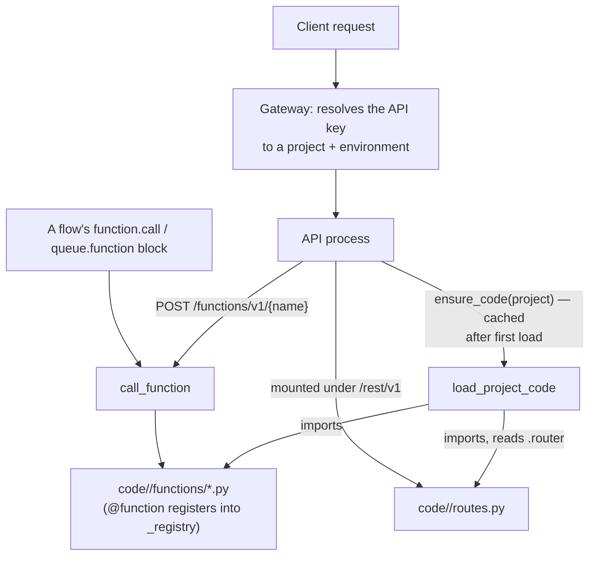

<Note>
This section is for a team that deploys real Python code alongside their Pawabase environment, not just Studio configuration. If your team only works in Studio, you don't need any of this — the built-in [blocks](/flows/platform-blocks) and [resource blocks](/flows/resource-blocks), together with [custom routes](/data/custom-routes) for non-CRUD HTTP endpoints, cover everything Studio's no-code surface can express.
</Note>

Pawabase gives you two code-based mechanisms, both discovered the same way:

<CardGroup cols={2}>
  <Card title="Functions" icon="function" href="/code/functions">Plain async Python callables. Invoked over HTTP, inline from a flow with `function.call`, or as a background job with `queue.function`.</Card>
  <Card title="Extension routes" icon="route" href="/code/extension-routes">A real Sillo `Router` your project exports. Full framework access — middleware, path parameters, request models — mounted straight into the environment's compiled app.</Card>
</CardGroup>

Both are reached through the same interface every flow block already uses:

<Card title="Runtime" icon="cpu" href="/code/runtime">The `Runtime` protocol — resources, cache, events, storage, mail, secrets, and more — is what `ctx.runtime` gives a Function and what `run.runtime` gives a block. There is nothing else to import to reach the platform; `Runtime` is the entire surface.</Card>

## The mental model: a directory, not a package

The single most important thing to understand about Functions and Extension Routes is that **they are not installed Python packages**. There is no `pip install`, no `pyproject.toml` entry point, and no "platform virtual environment" to add a dependency to. A project's code is a plain directory of `.py` files that the API process reads directly off its local filesystem:

```
code/
  acme/                     # one directory per project, named by its ref
    functions/
      billing.py            # @function("charge-order") ...
      shipping.py           # @function("calculate-rates") ...
    routes.py                # router = Router(prefix="/billing")  (plain Sillo)
    policies.py               # @policy("same-team") ...
    transformers.py            # @transformer("public-order") ...
```

This layout, and the module docstring it comes from, is the actual source of truth — it's the opening comment of `pawabase_kit/functions.py`, the module that does the loading:

```python
"""Python functions and extension routes: the escape hatch.

A project's code lives in a directory the API mounts, one folder per project::

    code/
      acme/
        functions/
          billing.py      # @function("charge-order") …
        routes.py         # router = Router(prefix="/billing") (plain Sillo)
        policies.py       # @policy("same-team") …
        transformers.py   # @transformer("public-order") …
"""
```

`code` is a setting (`code_path` on the API's configuration, defaulting to the literal string `"code"`), resolved relative to wherever the API process runs. Getting that directory onto the same filesystem or container as the API process — via a Docker image layer, a mounted volume, a `git` checkout, whatever your deployment pipeline already does — is infrastructure your team owns; Pawabase itself has no packaging or publishing step for it. There is nothing to build, version-pin, or upload to a package index. You write a `.py` file under `code/<project>/`, and it is Python source the API imports directly.

This is a deliberate, narrower design than "install a package into the platform." The one thing in Pawabase that genuinely does work through installed packages and entry points is **custom blocks** — see [Custom blocks](/flows/custom-blocks) — which are meant to be distributed and reused across many different Pawabase deployments, the way a PyPI package is. Functions and Extension Routes are the opposite case: code that belongs to *one project*, lives with that project's other code, and is deployed exactly the way the rest of your project's code is.

<Warning>
Older material (and some earlier drafts of this documentation) described Functions and Extension Routes as being registered through `pawabase.functions` and `pawabase.routes` Python entry-point groups, discovered via `importlib.metadata.entry_points()` the same way custom blocks are. **This was never accurate.** There is no such loading code anywhere in the platform. The only entry-point group that exists is `pawabase.blocks`, used exclusively for custom blocks (`pawabase_kit/flows/registry.py`). Functions and Extension Routes are loaded directly off disk by `load_project_code()`, described below — never through entry points, never through `pip install`.
</Warning>

## The real loading mechanism: `load_project_code()`

Everything under `code/<project>/` is imported by one function, `load_project_code()`, in `pawabase_kit/functions.py`:

```python
def load_project_code(root: str | Path, project: str) -> ProjectCode:
    """Import ``<root>/<project>``: functions, policies, transformers and routes.

    Import errors are collected and reported, not raised: one broken module in
    one project must not stop the API from serving every other project.
    """
    result = ProjectCode(project=project)
    base = Path(root) / project
    if not base.is_dir():
        return result
    token = _loading_project.set(project)
    try:
        files = sorted((base / "functions").glob("*.py")) if (base / "functions").is_dir() else []
        files += [
            base / name
            for name in ("policies.py", "transformers.py", "routes.py")
            if (base / name).is_file()
        ]
        for path in files:
            if path.name.startswith("_"):
                continue
            module_name = (
                f"pawabase_code.{project}.{path.parent.name}.{path.stem}"
                if path.parent != base
                else f"pawabase_code.{project}.{path.stem}"
            )
            try:
                module = _import_file(module_name, path)
                result.modules.append(module_name)
                if path.name == "routes.py":
                    result.router = getattr(module, "router", None)
            except Exception as exc:
                logger.exception("could not load %s", path)
                result.errors.append(f"{path.relative_to(base)}: {type(exc).__name__}: {exc}")
    finally:
        _loading_project.reset(token)
    return result
```

Walking through exactly what happens, in order:

1. **The project's directory is located**: `<code_path>/<project>`. If it doesn't exist, loading is a no-op — `ProjectCode` comes back empty, with no error. A project with no code directory at all is completely normal; not every project uses Functions or Extension Routes.
2. **Every `.py` file under `functions/` is collected**, sorted by filename, plus `policies.py`, `transformers.py`, and `routes.py` at the top level of the project's directory — each only if it actually exists. Files starting with `_` (an `__init__.py`, a `_helpers.py`) are skipped; they're for the other files to import, not for the loader to import directly.
3. **A context variable, `_loading_project`, is set to the project's ref** before anything is imported. This is how the `@function` decorator (and `@policy`, `@transformer`) knows, at decoration time, which project a function belongs to — it reads `_loading_project.get()` from inside the decorator, with no argument passed explicitly.
4. **Each file is imported with `importlib.util.spec_from_file_location`**, not a normal `import` statement — this is what lets the loader import a file from an arbitrary path on disk rather than from something already on `sys.path`. The module is registered in `sys.modules` under a synthetic name like `pawabase_code.acme.functions.billing`, so two different projects can each have their own `billing.py` without colliding.
5. **`routes.py` is special-cased**: after importing it, the loader looks for a module-level attribute named `router` and, if present, stores it as `ProjectCode.router`. Anything else the file defines is ignored by the loader (though still importable by other files in the same project, since the module is registered in `sys.modules`).
6. **Import errors are caught per file, not raised**. A typo in `billing.py` logs the exception and appends a string to `result.errors` — it does not stop `shipping.py` from loading, and it does not stop the project's environment from serving everything else. This isolation is deliberate: one broken module in one project must never take down the API for every other project it's serving.

The return value, `ProjectCode`, is a small dataclass recording what happened:

```python
@dataclass(slots=True)
class ProjectCode:
    """What loading one project's code directory produced."""

    project: str
    modules: list[str] = field(default_factory=list)
    router: Any = None
    errors: list[str] = field(default_factory=list)
```

There is no class called `FunctionRegistry` anywhere in the platform. What actually holds registered functions is a private module-level dictionary in `pawabase_kit/functions.py`:

```python
_registry: dict[tuple[str, str], FunctionSpec] = {}
```

keyed by `(project, name)` tuples. `@function(...)` writes into this dict at import time (i.e., the moment `load_project_code()` executes the file containing the decorator); `get_function(project, name)` and `list_functions(project)` are the only supported ways to read from it. Treat the dictionary itself as a private implementation detail — the public interface is the `@function` decorator to write, and `get_function` / `list_functions` to read.

## When new or changed code becomes active

This is the one question every fabricated version of this documentation got wrong or contradicted itself on. The real answer has two parts, and they're both precise and verifiable.

**Loading is lazy and cached, per process, per project.** Nothing scans `code/` at process boot. The API's `Platform.ensure_code(project)` is what actually triggers loading, and it does so the first time anything asks for that project's environment state — `platform.state(project, env)`, `platform.state_for(...)`, and so on all call it:

```python
def ensure_code(self, project: str) -> ProjectCode:
    """Load ``<code_path>/<project>`` once: functions, policies, routes."""
    loaded = self.code.get(project)
    if loaded is None:
        loaded = self.code[project] = load_project_code(self.settings.code_path, project)
        if loaded.errors:
            logger.warning("project %s code errors: %s", project, loaded.errors)
    return loaded
```

Once a project's code has been loaded into `self.code[project]` for this process, it stays there — every subsequent call to `ensure_code` for that project is a dictionary lookup, not a re-import. **There is no automatic file-watching and no hot-reload.** Editing `billing.py` on disk does nothing to a process that already loaded that project's code.

**Two things make new or edited code active:**

- **Restarting the API process.** A fresh process has an empty `self.code` cache, so the next request for that project re-runs `load_project_code()` and picks up whatever is on disk at that moment. This is the unconditional way to pick up a change.
- **Calling the reload endpoint, without a restart.** The platform exposes a real, operator-gated endpoint for exactly this:

  ```
  POST /platform/v1/projects/{ref}/code/reload
  ```

  which calls `Platform.reload_code(ref)`:

  ```python
  def reload_code(self, project: str) -> ProjectCode:
      self.code.pop(project, None)
      self.envs.forget(project)
      return self.ensure_code(project)
  ```

  This drops the cached `ProjectCode` for that project *and* forgets its compiled environment state, then immediately reloads code from disk and returns what was found — including `modules` (what imported successfully), `errors` (what didn't), and whether a `routes.py` router was picked up. The route requires the platform's `OPERATOR` policy gate (Studio acting on an operator's behalf, a CLI operator, or another internal service) — an ordinary project API key cannot trigger it.

So: **new or changed code becomes active either on the next process restart, or immediately, without a restart, via an explicit `POST .../code/reload` call.** There is no third path — no polling, no filesystem watcher, no "the next request notices the mtime changed." If you deploy a code change and don't restart the API or call the reload endpoint, the running process keeps serving the old code indefinitely.

<Tip>
In practice: your deployment pipeline should call the reload endpoint (or restart the API) as the last step of shipping a code change, the same way you'd restart any long-running Python process after deploying new source. If you're not sure whether a change is live, `POST .../code/reload` is safe to call defensively — it's idempotent, and its response tells you exactly what loaded and what didn't.
</Tip>

## The real import path

There is no top-level `pawabase` package. Only `pawabase_kit` exists, and the pieces you need for Functions live at:

```python
from pawabase_kit.functions import function, FunctionContext
```

`from pawabase import function, FunctionContext` — which appears in some older material — will raise `ModuleNotFoundError` immediately; there is nothing installed under that name.

Extension routes need only Sillo itself, not `pawabase_kit`, for the router object:

```python
from sillo import Router, HttpContext
```

See [Functions](/code/functions) and [Extension routes](/code/extension-routes) for the full, verified interface of each.

## `pawabase call` — no such CLI exists

Some earlier material asserted a `pawabase call <function> --input '...'` command-line tool for invoking a function manually. A direct search of this codebase found no CLI entry point, no `argparse`/`click` subcommand, and no reference to a `call` verb anywhere outside that documentation itself. **Do not rely on a `pawabase call` command — it does not exist in this platform.**

The confirmed way to invoke a function manually (from a terminal, a script, Postman, anywhere outside a flow) is the plain HTTP route every function gets automatically:

```bash
curl -X POST https://<your-environment>/functions/v1/charge-order \
  -H "Authorization: Bearer <api-key>" \
  -H "Content-Type: application/json" \
  -d '{"order_id": "ord_123"}'
```

This is documented in full in [Functions → Calling a function over HTTP](/code/functions#calling-a-function-over-http).

## How a request reaches your code



Two independent paths reach your code once it's loaded: the platform's own compiled routes for Functions (`/functions/v1/<name>`) and flow blocks (`function.call`, `queue.function`) both resolve through `get_function()` into the same `_registry`; and a project's `routes.py` router is mounted directly into the environment's compiled Sillo app, reachable under `/rest/v1` at whatever prefix the router itself declares.

## Choosing between Functions, Extension Routes, and Flows

A quick orientation — see [Flows or code](/code/flows-or-code) for the full decision guide:

| Reach for | When |
| --- | --- |
| **A flow** | The logic is a sequence of steps with branches you want visible as a graph, and everything it needs is expressible with built-in or custom blocks |
| **A Function** | One step is genuinely an algorithm — a pricing formula, a parser, a call to a third-party SDK — called from a flow, from another function, or directly over HTTP |
| **An Extension Route** | The endpoint itself needs full Sillo framework access — a request shape or response shape a flow's block model can't produce, or logic that has nothing to do with a flow at all |
| **A custom block** (see [Custom blocks](/flows/custom-blocks)) | The same operation should appear as a first-class node in Studio's palette, reusable across many flows and, if you want, many Pawabase deployments |

## Next

<CardGroup cols={2}>
  <Card title="Functions" icon="function" href="/code/functions">The `@function` decorator, `FunctionContext`, input validation, and the three ways to call one.</Card>
  <Card title="Extension routes" icon="route" href="/code/extension-routes">Writing `routes.py`, the real Sillo `Router` API, and how it's mounted.</Card>
  <Card title="Runtime" icon="cpu" href="/code/runtime">The full capability protocol behind `ctx.runtime` and `run.runtime`.</Card>
  <Card title="Flows or code" icon="git-branch" href="/code/flows-or-code">A worked decision guide, not a comparison table.</Card>
</CardGroup>
