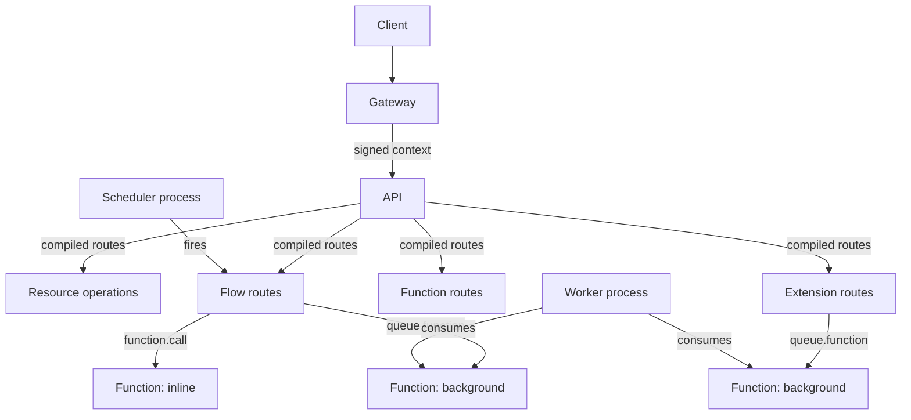

Pawabase gives you three ways to run custom logic: **flows** (graphs of blocks), **routes** (Python handlers on Sillo routers), and **functions** (Python code called inline or as background jobs). This section covers the third option and how it fits with the other two.

<CardGroup cols={3}>
  <Card title="Functions" icon="function">Python code that runs inline via `function.call` or as a background job via `queue.function`.</Card>
  <Card title="Runtime" icon="cpu">The `Runtime` protocol every block and function uses to reach platform capabilities.</Card>
  <Card title="Extension routes" icon="route">Custom HTTP routes that bypass the flow engine entirely, for full framework access.</Card>
</CardGroup>

## When to reach for code

Flows handle the *shape* of most backend logic — trigger → validate → branch → write → notify → respond. But some problems are genuinely algorithms: a pricing formula, a parser, a fussy SDK integration, a numerical computation. For those, a Python function is the right tool.

| Reach for | Why |
| --- | --- |
| **Flows** | Multi-step automation with clear branches, visible as a graph |
| **Functions** | Genuinely algorithmic logic that reads as code better than as a chain of blocks |
| **Routes** | Logic that needs full Sillo framework access — middleware, custom headers, streaming responses |

<Tip>
The sweet spot: a flow handles the orchestration, and calls out to a function with `function.call` for the one step that is genuinely an algorithm. This is exactly how `submit_review` in the commerce blueprint works — plain blocks for everything except the one SQL check that reads more naturally as SQL than as a resource call chain.
</Tip>

## How functions are discovered

Functions live in `code/<project>/functions/` and are registered through the `pawabase.functions` entry point group. The API discovers them at startup via `importlib.metadata.entry_points()`, so adding a new function package to your project's dependencies makes it available immediately — no restart required.

Each function is a Python callable decorated with `@function(...)`. The decorator records the function's name, input schema, and description — which Studio and the platform API use to present it to callers.

The discovery mechanism lives in `packages/kit/pawabase_kit/functions.py`. The `_registry` dictionary maps `(project, name)` tuples to `FunctionSpec` objects. The `function()` decorator populates this registry at import time, and `get_function()` and `list_functions()` resolve visibility — a project sees its own functions first, then shared (`"*"`) functions.

```python
# packages/kit/pawabase_kit/functions.py
_registry: dict[tuple[str, str], FunctionSpec] = {}

def function(name: str, *, description: str = "", policy: Any = "authenticated", ...) -> Callable:
    def decorator(handler):
        project = _loading_project.get()
        _registry[(project, name)] = FunctionSpec(name=name, handler=handler, project=project, ...)
        return handler
    return decorator
```

### The registry in detail

The registry is a module-level dictionary keyed by `(project, name)` tuples. When a module containing `@function` decorators is imported, each decorator call immediately registers the handler. The `_loading_project` context variable tracks which project is currently being loaded, so the decorator knows where to file the function.

```python
def load_project_code(root: str | Path, project: str) -> ProjectCode:
    """Import `<root>/<project>`: functions, policies, transformers and routes."""
    result = ProjectCode(project=project)
    base = Path(root) / project
    if not base.is_dir():
        return result
    token = _loading_project.set(project)
    try:
        files = sorted((base / "functions").glob("*.py")) if (base / "functions").is_dir() else []
        files += [
            base / name
            for name in ("policies.py", "transformers.py", "routes.py")
            if (base / name).is_file()
        ]
        for path in files:
            if path.name.startswith("_"):
                continue
            module_name = (
                f"pawabase_code.{project}.{path.parent.name}.{path.stem}"
                if path.parent != base
                else f"pawabase_code.{project}.{path.stem}"
            )
            try:
                module = _import_file(module_name, path)
                result.modules.append(module_name)
                if path.name == "routes.py":
                    result.router = getattr(module, "router", None)
            except Exception as exc:
                logger.exception("could not load %s", path)
                result.errors.append(f"{path.relative_to(base)}: {type(exc).__name__}: {exc}")
    finally:
        _loading_project.reset(token)
    return result
```

This means every `.py` file in `code/<project>/functions/` is imported, and every `@function` decorator inside those files registers its handler. The `routes.py` file is special — it exports a `router` object that becomes the project's extension route mount. Similarly, `policies.py` and `transformers.py` are imported for their side effects (registering `@policy` and `@transformer` decorators).

### Why entry points matter

Beyond the project's own code directory, Pawabase supports packages installed in the virtual environment that register through the `pawabase.functions` entry point group. This is how third-party extensions add functions without touching the project's code directory. The `importlib.metadata.entry_points()` call returns all registered entry points, and each one is loaded and invoked. This is the same mechanism that registers built-in blocks through the `pawabase.blocks` entry point.

```toml
# pyproject.toml of an extension package
[project.entry-points."pawabase.functions"]
pricing = "my_package.functions:pricing"
analytics = "my_package.functions:track_event"
```

When the API starts and the registry is populated, functions from every installed package are available. New functions added to a package are picked up on the next API restart (or on the next request if the registry is refreshed via `importlib.metadata` lookup).

## Calling a function

Two ways: inline, synchronously, from within a flow or another function; or as a background job, dispatched with `queue.function`.

<CardGroup cols={2}>
  <Card title="Inline call" icon="link">`function.call` — synchronous, returns the result immediately. Use when the flow needs the output before continuing.</Card>
  <Card title="Background call" icon="clock">`queue.function` — dispatches the function as a job and returns `{"job_id": "..."}`. Use when you do not need the result right now.</Card>
</CardGroup>

### The inline path

When a flow's `function.call` block runs, it invokes `Runtime.call_function(name, input)`. The `ApiRuntime` implementation looks up the function in the registry and calls it in-process, with a depth limit of 8 to prevent infinite recursion.

The `call_function` method on `ApiRuntime` does the following:

1. **Resolves the function**: Calls `get_function(project, name)` to find the handler. The lookup checks the project-specific registry first, then falls back to shared (`"*"`) functions. If no function is found, raises `NotAvailable`.
2. **Constructs the context**: Creates a `FunctionContext` with the current input, the caller's auth context, the project and environment, the runtime instance, and the trigger type.
3. **Invokes the handler**: Calls `handler(ctx)` and awaits the result. The handler is an async function, so the await is non-blocking.
4. **Depth tracking**: Increments a call depth counter. If the depth exceeds 8, raises a `FlowError` with code `too_deep`.

<Warning>
The depth limit of 8 is not arbitrary — it prevents a misbehaving function from creating an infinite call chain that consumes worker memory. Each level adds a `FunctionContext` and its associated state to the call stack.
</Warning>

### The background path

`queue.function` dispatches a `RunFunctionJob` through Sillo's work queue. The job is picked up by a worker process (`python -m app.worker`), which deserializes the payload, resolves the function by name, and executes it. This path is asynchronous — the flow continues without waiting for the result.

The worker's `build_worker()` function in `services/api/app/worker.py` creates a `QueueWorker` over the platform queues:

```python
# services/api/app/worker.py
def build_worker(
    platform: Platform, *, queues: list[str] | None = None,
    concurrency: int = 4, sleep: float = 1.0
) -> QueueWorker:
    import app.jobs  # noqa: F401  (every job class must be importable by name)
    queues = queues or worker_queues()
    manager = ConnectionManager()
    for name in queues:
        manager.add(name, platform.queue)
    return QueueWorker(
        manager, PayloadSerializer(), RecordFailedJobRepository(),
        options=WorkerOptions(concurrency=concurrency, queues=queues, sleep=sleep, timeout=300.0),
    )
```

The `worker_queues()` function returns the union of platform-defined queues and any additional queues listed in the `PAWABASE_WORKER_QUEUES` environment variable.

### The worker lifecycle

When the worker process starts (`python -m app.worker`), it follows this sequence:

<Steps>
<Step title="Initialize database">Initializes the database connection via `DatabaseManager` and registers all model modules from `MODEL_MODULES`. Calls `database.init()` to create tables and run migrations.</Step>
<Step title="Create platform">Creates the `Platform` instance from settings. This provides access to queues, state compilation, and the event bus.</Step>
<Step title="Attach event processor">Attaches the `EventProcessor` to consume platform events.</Step>
<Step title="Start platform">Calls `platform.start()`. This initializes all internal services the platform depends on.</Step>
<Step title="Build worker">Calls `build_worker()` to create the `QueueWorker` with the configured queues, concurrency, and sleep interval.</Step>
<Step title="Register signals">Registers signal handlers for SIGINT and SIGTERM that set the stop event and call `worker.stop()`.</Step>
<Step title="Start heartbeat">Creates an asyncio task that writes `WorkerHeartbeat` records to the database every 10 seconds.</Step>
<Step title="Run worker loop">Calls `await worker.run()`. The worker consumes messages from all configured queues, deserializes payloads, and dispatches to job handlers.</Step>
<Step title="Shutdown">On stop, sets the stop event, awaits the heartbeat task, calls `platform.stop()`, and shuts down the database connection.</Step>
</Steps>

The heartbeat writes to `WorkerHeartbeat` with the worker name, queues, concurrency, processed job count, and status. The status is `"paused"` when `worker._paused` is True and `"running"` otherwise. When the worker stops, a final update sets `status="stopped"`.

```python
# services/api/app/worker.py
async def heartbeat(name: str, queues: list[str], worker: QueueWorker, stop: asyncio.Event) -> None:
    from database.models import WorkerHeartbeat
    started = datetime.now(UTC)
    while not stop.is_set():
        await upsert(
            WorkerHeartbeat,
            name=name,
            defaults={
                "queues": queues,
                "started_at": started,
                "last_seen": datetime.now(UTC),
                "processed": worker._jobs_processed,
                "concurrency": worker.options.concurrency,
                "status": "paused" if worker._paused else "running",
            },
        )
        try:
            await asyncio.wait_for(stop.wait(), timeout=10)
        except TimeoutError:
            pass
    await WorkerHeartbeat.filter(name=name).update(status="stopped", last_seen=datetime.now(UTC))
```

## The FunctionContext

Every function receives a `FunctionContext` as its first argument. This object is defined in `pawabase_kit/functions.py` and provides everything the function needs:

```python
@dataclass(slots=True)
class FunctionContext:
    input: Any                              # The invocation payload
    auth: Mapping[str, Any]                 # The caller's policy context
    project: str                            # Which project
    env: str                                # Which environment
    runtime: Any                            # Platform capabilities
    trigger: str = "http"                   # http, flow, job, schedule, event, webhook
    request: Mapping[str, Any] | None = None  # For HTTP triggers
    logs: list[dict[str, Any]] = field(default_factory=list)

    def log(self, message: str, **data: Any) -> None:
        self.logs.append({"message": message, **data})
```

### Understanding each field

**`input`** is the invocation payload. For an inline `function.call`, this is the `input` field from the block's configuration. For a background `queue.function`, this is the payload dispatched with the job. For an HTTP trigger, this is the parsed request body. The type is `Any` because functions can receive anything — a dict, a list, a string, a number.

**`auth`** is the caller's policy context. This is the same object that a policy condition sees under `$auth`. It contains `authenticated` (bool), `kind` (`"user"`, `"anonymous"`, `"service"`), `user_id`, `email`, `roles`, `permissions`, `org`, `aal`, and `session_id`. Functions can use this to implement authorization logic directly.

**`project`** and **`env`** identify the environment the function runs in. These come from the platform context resolved by the gateway. They are essential for multi-tenant setups where the same function code runs across multiple projects and environments with different data.

**`runtime`** is the `Runtime` protocol implementation. This is the most important field — it is the bridge between the function and the platform's actual services. Through `ctx.runtime`, a function can read and write resources, query the database, emit events, send mail, store files, call other functions, and access secrets.

**`trigger`** tells the function how it was invoked. Valid values are `"http"`, `"flow"`, `"job"`, `"schedule"`, `"event"`, and `"webhook"`.

**`request`** is populated for HTTP triggers and contains `params`, `query`, and `body`. This gives extension-route-style access to the raw request data even when the function is invoked from within a flow.

**`logs`** accumulates log entries. Functions can call `ctx.log("message", key=value)` to add structured log entries that appear in Studio's Observability.

### The render method

`ctx.render()` renders templates against the current state. This is the same template engine used by flow blocks — strings containing `{{ path }}` expressions are resolved against `input`, `auth`, `vars`, `steps`, and other state values.

```python
@function("greet")
async def greet(ctx: FunctionContext, name: str) -> str:
    rendered = await ctx.render("Hello {{ input.name }}, your role is {{ auth.role }}", {
        "input": {"name": name}
    })
    return rendered
```

The `render` method delegates to `pawabase_kit.templating.render()`, which handles nested objects, lists, and dictionaries. A string that is entirely one template (`"{{ input.items }}"`) returns the value itself, not its text representation, so lists and dicts pass through unchanged.

## Function timeout and error handling

Each function has a `timeout` (default 30 seconds) that controls how long an invocation may run before being cancelled. The timeout is declared in the `@function` decorator.

When a function raises, the error propagates back to the caller differently depending on the calling path:

<AccordionGroup>
<Accordion title="Timeout behaviour">An inline `function.call` that exceeds its timeout raises a `FlowError` with code `timeout` and status `504`. The flow's error handling takes over — if the block has an `error` edge, it follows it; otherwise the run fails. A background `queue.function` that times out is recorded as a failed job in the `RecordFailedJobRepository`. The worker's `WorkerOptions.timeout` (default 300 seconds) controls how long the worker waits for a job to complete.</Accordion>
<Accordion title="Depth limit on recursive calls">`call_function` is depth-limited to 8 levels. A function that calls another function that calls another, and so on beyond 8 levels, raises a `FlowError`. This prevents infinite recursion from crashing the worker.</Accordion>
<Accordion title="Error visibility">Errors in inline calls surface immediately to the flow's error handling (the `error` edge of the calling block). Errors in background jobs are visible in Studio's failed-job inspection and the worker's heartbeat statistics.</Accordion>
<Accordion title="Partial failures in transactions">A function that calls `ctx.runtime.db_transaction` participates in an atomic operation. If any step in the transaction fails, all writes are rolled back.</Accordion>
</AccordionGroup>

## The Runtime protocol

Every function's `ctx.runtime` implements the `Runtime` protocol defined in `pawabase_kit/flows/runtime.py`. This protocol is the single source of truth for what a function can do. It declares one async method per platform capability:

```python
class Runtime(Protocol):
    # Data operations
    async def resource_list(self, resource, *, filters=None, sort=None, limit=50, offset=0) -> dict: ...
    async def resource_get(self, resource, record_id) -> dict | None: ...
    async def resource_create(self, resource, data) -> dict: ...
    async def resource_update(self, resource, record_id, data) -> dict | None: ...
    async def resource_delete(self, resource, record_id) -> bool: ...
    async def db_query(self, sql, params=None) -> list[dict]: ...
    async def db_transaction(self, operations) -> list: ...

    # Cache
    async def cache_get(self, key) -> Any: ...
    async def cache_set(self, key, value, ttl=None, tags=None) -> None: ...
    async def cache_delete(self, key) -> bool: ...
    async def cache_invalidate(self, tags) -> int: ...

    # Events, queues, realtime
    async def emit(self, name, payload) -> str: ...
    async def dispatch_flow(self, flow, input, *, delay=0, queue=None) -> str: ...
    async def dispatch_function(self, function, input, *, delay=0, queue=None) -> str: ...
    async def publish(self, channel, event, payload) -> dict: ...

    # Storage, mail, outbound
    async def storage_put(self, bucket, key, content, content_type="") -> dict: ...
    async def storage_read(self, bucket, key) -> str: ...
    async def storage_signed_url(self, bucket, key, method="GET", expires_in=300) -> str: ...
    async def storage_delete(self, bucket, key) -> bool: ...
    async def send_mail(self, to, subject, *, text=None, html=None, template=None, data=None) -> dict: ...
    async def http_request(self, method, url, *, headers=None, params=None, body=None, timeout=30, retries=0) -> dict: ...
    async def webhook_send(self, event, payload) -> dict: ...

    # Platform
    async def secret(self, name) -> str | None: ...
    async def call_function(self, name, input) -> Any: ...
    async def identity_user(self, user_id) -> dict | None: ...
    async def check_policy(self, ref, context) -> bool: ...
    async def log(self, level, message, data=None) -> None: ...
    async def metric(self, name, value=1.0, tags=None) -> None: ...
```

This protocol is the same one every flow block uses. The difference is that a block calls `run.runtime.<method>()` where `run` is a `FlowRun`, while a function calls `ctx.runtime.<method>()` where `ctx` is a `FunctionContext`. Under the hood, both resolve to the same `ApiRuntime` instance in the API process.

## Implementation: BaseRuntime

`BaseRuntime` in `pawabase_kit/flows/runtime.py` provides a fallback via `__getattr__`. If a runtime does not implement a capability, `__getattr__` returns an async function that raises `NotAvailable`:

```python
class BaseRuntime:
    def __getattr__(self, name: str) -> Any:
        if name.startswith("_"):
            raise AttributeError(name)
        async def missing(*args: Any, **kwargs: Any) -> Any:
            raise NotAvailable(f"{name} is not available in this runtime")
        return missing

    async def stream(self) -> AsyncIterator[bytes]:
        raise NotAvailable("stream")
        yield b""
```

This means:

- A block or function using a missing capability fails with a clear message naming exactly what is missing
- Custom blocks and functions that assume capabilities not provided by a lightweight host get a descriptive error rather than an `AttributeError`
- Test doubles only need to implement the methods they actually test

## Implementation: ApiRuntime

In the API, `ApiRuntime` implements every method by calling into Sillo's capabilities:

- `resource_*` → the environment's `Store` via `state.store(resource)`
- `db_query` / `db_transaction` → the environment's SQL source, with `is_read_only` enforcement on `db_query`
- `cache_*` → `sillo.cache` (namespaced with `user:` prefix)
- `emit` → the platform event bus
- `dispatch_flow` / `dispatch_function` → `sillo.work.queue` via `RunFlowJob` / `RunFunctionJob`
- `publish` → Angula
- `storage_*` → `sillo.storage` (service credential)
- `send_mail` → `sillo.mail` (dispatched as `SendMailJob`)
- `http_request` → Sillo's HTTP client with retry
- `webhook_send` → outbound webhook delivery queue
- `secret` → the environment's secret store
- `call_function` → in-process function call (depth-limited to 8)
- `identity_user` → Akountz
- `check_policy` → the policy engine
- `log` / `metric` → structured logging / metrics store

The `ApiRuntime` is instantiated per request and stored in the platform state. Every flow run and every function invocation gets the same `ApiRuntime` instance for its environment.

## Writing a function

A function is a Python module in `code/<project>/functions/` containing one or more callables decorated with `@function(...)`.

```python
# code/myproject/functions/pricing.py
from pawabase import function, FunctionContext
from decimal import Decimal

@function(
    "calculate_price",
    description="Compute the final price for an order",
    policy="authenticated",
    input_fields=[
        {"name": "items", "type": "json", "required": True},
        {"name": "discount_code", "type": "string", "required": False},
    ],
    timeout=60.0,
)
async def calculate_price(
    ctx: FunctionContext,
    items: list[dict],
    discount_code: str | None = None
) -> dict:
    """Calculate the final price after applying discounts."""
    subtotal = sum(Decimal(str(item["price"])) for item in items)
    discount = await _lookup_discount(ctx, discount_code) if discount_code else Decimal("0")
    total = subtotal - discount
    ctx.log("pricing.calculated", subtotal=float(subtotal), total=float(total))
    return {"subtotal": float(subtotal), "discount": float(discount), "total": float(total)}

async def _lookup_discount(ctx, code):
    """Look up a discount from the database."""
    result = await ctx.runtime.db_query(
        "SELECT amount FROM discounts WHERE code = ? AND active = 1",
        [code]
    )
    return Decimal(str(result[0]["amount"])) if result else Decimal("0")
```

### The `@function` decorator parameters

<AccordionGroup>
<Accordion title="name">The string identifier for the function. Used by flows (`"function.call"` blocks), schedules, and the platform API. Must be unique within a project.</Accordion>
<Accordion title="description">A human-readable description shown in Studio and the platform API. Defaults to the function's docstring if not provided.</Accordion>
<Accordion title="policy">The policy that gates HTTP invocations of this function via `/functions/v1/<name>`. Defaults to `"authenticated"`. Can be a built-in policy name, an inline condition, or a Python policy registered with `@policy`.</Accordion>
<Accordion title="input_fields">Optional field definitions that validate the input before the function runs. Uses the same schema format as resource fields.</Accordion>
<Accordion title="timeout">Seconds before the invocation is cancelled. Defaults to 30.0. Applies to both inline and background invocations.</Accordion>
</AccordionGroup>

## Registering functions

Functions are discovered through the `pawabase.functions` entry point group in `pyproject.toml`:

```toml
[project.entry-points."pawabase.functions"]
pricing = "code.myproject.functions.pricing:calculate_price"
analytics = "code.myproject.functions.analytics:track_event"
```

The platform's `FunctionRegistry` loads all registered functions at startup. New functions added to a package are picked up without restarting the API.

### Entry point format

Each entry point value is a Python import path followed by a colon and the callable name. The callable must be an async function. If a non-async callable is registered, the platform raises `TypeError`:

```python
if not inspect.iscoroutinefunction(handler):
    raise TypeError(f"function {name!r} must be async")
```

### Shared vs project-specific functions

Functions registered under `"*"` as the project name are shared across all projects. The `list_functions()` function returns a sorted list of all functions visible to a project, with the project's own functions listed first.

## Function execution flow

When a function is invoked, the following sequence occurs:

<Steps>
<Step title="Resolve the function">`get_function(project, name)` looks up the handler in the registry.</Step>
<Step title="Validate input">If `input_fields` are declared, `validate_payload()` compiles them into a Pydantic model and validates the input. A `ValidationError` is raised if validation fails.</Step>
<Step title="Construct the context">A `FunctionContext` is created with the input, auth, project, env, runtime, trigger, and request.</Step>
<Step title="Bind the context">`bind_context(ctx)` sets the context as a context variable.</Step>
<Step title="Invoke the handler">The handler is called with `ctx` as the first argument and awaited.</Step>
<Step title="Reset the context">`reset_context(token)` restores the previous context.</Step>
<Step title="Return the result">The handler's return value is passed back to the caller.</Step>
</Steps>

## Functions in the platform architecture

Functions are one of three code-based mechanisms in Pawabase:



Notice that functions are reachable through three paths:

1. **Direct HTTP**: Via `/functions/v1/<name>` routes, gated by the function's `policy`
2. **Inline from flows**: Via `function.call` blocks, which call `Runtime.call_function`
3. **Background from flows**: Via `queue.function` blocks, which dispatch a `RunFunctionJob`

## Common patterns

<AccordionGroup>
<Accordion title="Pricing calculation">A flow collects items and a discount code, then calls a pricing function. The function's return value is available immediately as `steps.price.output`.</Accordion>
<Accordion title="Data parsing and transformation">A flow receives a CSV upload, calls a parsing function, then writes the parsed records.</Accordion>
<Accordion title="Third-party SDK integration">A function wraps a third-party SDK that has no flow block equivalent.</Accordion>
<Accordion title="Numerical computation">A function performs computation that would be awkward in a flow: machine learning inference, statistical analysis, data normalization.</Accordion>
<Accordion title="Event processing">A function subscribed to an event processes each event individually.</Accordion>
<Accordion title="Batch processing">A function that processes a large batch of items by reading them from a resource, transforming each one, and writing the results back.</Accordion>
<Accordion title="Cache management">A function that warms the cache by pre-computing expensive queries and storing them with `ctx.runtime.cache_set()`.</Accordion>
<Accordion title="Scheduled calculations">A function called by a schedule that computes daily aggregates and stores them for dashboards.</Accordion>
<Accordion title="Webhook processing">A function that processes an inbound webhook, validates the signature, transforms the payload, and emits a platform event.</Accordion>
</AccordionGroup>

## Testing functions

Because functions depend on the `Runtime` protocol, they are trivially testable. A test creates a `FakeRuntime` that implements only the methods the function uses, constructs a `FunctionContext`, and calls the handler:

```python
class FakeRuntime:
    async def db_query(self, sql, params=None):
        return [{"amount": "10.00"}]
    async def cache_get(self, key):
        return None
    async def secret(self, name):
        return "test-secret"

async def test_calculate_price():
    ctx = FunctionContext(
        input={"items": [{"price": 100}], "discount_code": None},
        auth={"authenticated": True, "user_id": "1"},
        project="test", env="test",
        runtime=FakeRuntime(), trigger="http"
    )
    result = await calculate_price(ctx)
    assert result["total"] == 100.0
```

The `FakeRuntime` inherits from `BaseRuntime`, so any unimplemented method raises a clear `NotAvailable` error rather than an `AttributeError`.

## Performance considerations

Functions run in the same process as the API (for inline calls) or in the worker process (for background jobs). Several performance considerations apply:

<AccordionGroup>
<Accordion title="Inline calls block the flow">A `function.call` waits for the function to complete before the flow continues. Keep inline functions fast — under 200ms is ideal.</Accordion>
<Accordion title="Background calls are fire-and-forget">Use `queue.function` when the result is not needed immediately.</Accordion>
<Accordion title="The depth limit protects memory">Each nested `call_function` adds a `FunctionContext` to the call stack. The limit of 8 prevents runaway recursion.</Accordion>
<Accordion title="Input validation has a cost">If `input_fields` are declared, `validate_payload()` compiles a Pydantic model on the first call and caches it.</Accordion>
<Accordion title="Database queries are the bottleneck">`db_query` and `resource_*` calls go through the environment's `Store`, which applies policy pushdown.</Accordion>
<Accordion title="Serialization overhead">Background jobs serialize the input payload before dispatching and deserialize it in the worker. Keep job inputs compact.</Accordion>
<Accordion title="Memory per invocation">Each function invocation creates a `FunctionContext`, builds a trace, and accumulates logs.</Accordion>
</AccordionGroup>

## Summary

Functions are Pawabase's escape hatch for genuine algorithms. They are Python callables decorated with `@function`, registered through entry points, and callable inline or as background jobs. They receive a `FunctionContext` with full access to the `Runtime` protocol — the same interface every flow block uses. Functions are discoverable through `importlib.metadata.entry_points()`, testable with `FakeRuntime`, and governed by a depth limit and timeout to prevent runaway execution. They sit alongside flows and extension routes as one of three code-based mechanisms in the platform, each serving a different layer of the application.

See also: [Runtime](/code/runtime) for the full protocol, [Extension routes](/code/extension-routes) for HTTP-only access, and [Flows or code](/code/flows-or-code) for the decision framework.

