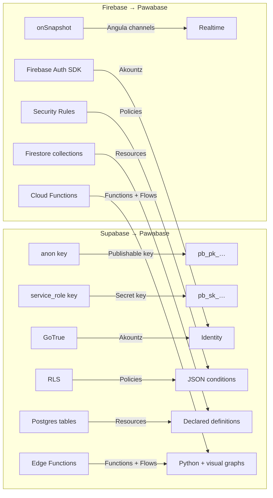
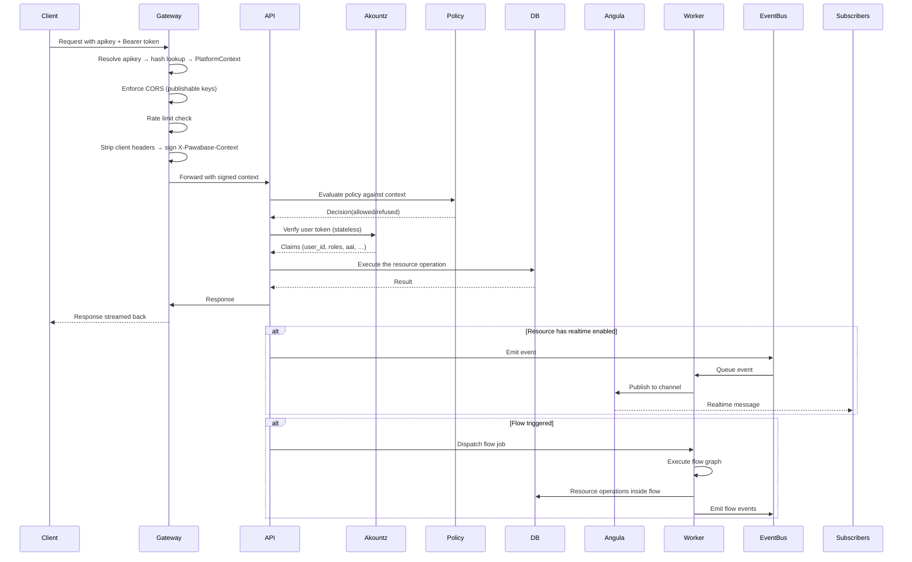
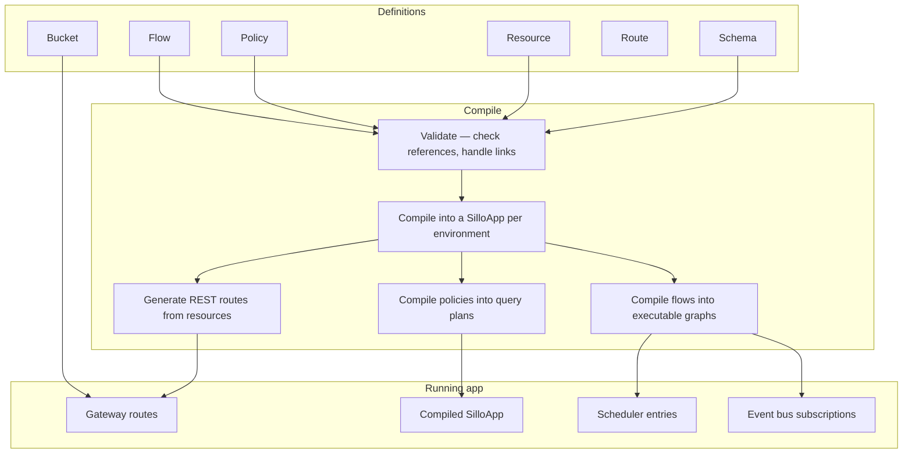

People who already know Supabase or Firebase don't need to learn a completely new vocabulary — but they do need to know where the familiar terms have different meanings, and where Pawabase has concepts that don't exist on the other platforms at all. This page is a term-by-term translation, organized by subsystem, with the architectural differences that actually matter called out.

<CardGroup cols={3}>
  <Card title="Translation" icon="languages">If you know X in Supabase or Firebase, it's called Y here.</Card>
  <Card title="Differences" icon="scale">Where the familiar term means something subtly or radically different.</Card>
  <Card title="Unique" icon="star">Pawabase concepts with no equivalent on the other platforms.</Card>
</CardGroup>

## The big three concepts

Before diving into subsystem-by-subsystem translation, there are three Pawabase concepts that reshape how everything else works. If you internalize nothing else, understand these.

**Definitions are data.** In Pawabase, every piece of configuration — resources, policies, flows, mail templates, functions, storage buckets — is a JSON definition stored in the platform's own database. This is not a metaphor: it's a literal JSON document with a schema. In Supabase, definitions are a mix of SQL DDL (tables, RLS policies), Edge Function files, and configuration files. In Firebase, definitions are spread across the Firebase Console and CLI configuration files with no single source of truth. Because Pawabase's definitions are data, they can be exported, imported, diffed, versioned, and validated as JSON — see [Blueprints](/compare/overview#blueprints-exporting-a-whole-backend) for the consequences.

**Each environment compiles into an app.** An environment (development, production) is not just a database — it's a compiled, running application. When you save a flow, resource, policy, or function, the environment's compiled state updates. The next request uses the new compiled app immediately. There is no deploy step, no restart, no code push. Supabase compiles PostgREST routes from your schema (but you still deploy Edge Functions separately). Firebase compiles and deploys functions and hosting configurations, but the Firestore schema is live immediately. Pawabase's compilation is more comprehensive because it encompasses *every* definition kind into a single running app.

**One policy engine for everything.** Pawabase's policies — JSON conditions — guard resources, custom routes, functions, flows, storage buckets, and realtime channels with the same vocabulary. Supabase uses RLS for tables and `storage.objects` policies for storage, plus whatever route guards you write yourself. Firebase uses Security Rules for Firestore and Storage, but they're a different syntax and operate on different models. See [Access control](/compare/overview#access-control) for the full comparison, including the honest trade-off that Pawabase's policies run in the application layer and therefore don't protect direct database connections the way Postgres RLS does.

## Authentication vocabulary

| Supabase | Firebase | Pawabase |
| --- | --- | --- |
| `anon` key | Firebase Auth SDK | **Publishable key** (`pb_pk_…`) — one per environment |
| `service_role` key | Firebase Admin SDK | **Secret key** (`pb_sk_…`) — one per environment |
| GoTrue | Firebase Auth | **Akountz** — identity service per project environment |
| `auth.users` table | `auth` collection | Per-environment user tables in the platform's Postgres, isolated by `project:env` |
| Row-Level Security (RLS) | Firebase Security Rules | **Policies** — JSON conditions evaluated by a unified engine |
| JWT (signed with project secret) | Custom token | **Access token** + **refresh token** pair, signed with a per-environment derived key |
| Magic link | Magic link | Same concept, issued by Akountz |
| OAuth providers | OAuth providers | Same, configured per environment |
| MFA | Phone auth / MFA | TOTP MFA with configurable enforcement |
| `auth.uid` | `request.auth.uid` | `$auth.user_id`, `$auth.email`, `$auth.roles`, `$auth.permissions`, `$auth.aal` |

### Where the terms diverge

**"Anon key" vs "publishable key."** Supabase's `anon` key is a single JWT per project. Pawabase's publishable key is a prefixed string (`pb_pk_…`) verified by hash lookup, scoped per *environment* (not per project), and revocable individually with `revoked_at`. More importantly, a publishable key can be scoped with [scopes](/concepts/credentials#scopes) — something Supabase's `anon` key cannot do.

**"Service role" vs "secret key."** Supabase's `service_role` key bypasses RLS but can't be scoped — it's all-or-nothing. Pawabase's secret key bypasses policies but *can* be scoped (`resource:read`, `resource:write`, `resource:*`), giving you fine-grained control over what a backend integration can do. See [Scopes](#scopes) below.

**"RLS" vs "policies."** Supabase's RLS lives inside Postgres and protects against direct database connections. Pawabase's policies live in the application layer and cover more surfaces (resources, routes, functions, flows, storage, realtime), but don't protect against direct database connections. Both are legitimate designs — they optimize for different things. See [Access control — RLS vs policies](/compare/overview#access-control).

<AccordionGroup>
  <Accordion title="Can a publishable key have scopes?">
    Yes. Scopes narrow what an entry point will consider, even for publishable keys. A publishable key scoped to `resource:read` can only list and get records — it can't create, update, or delete. Scoping is opt-in: a publishable key without scopes has its full privilege level. See [Scopes](/concepts/credentials#scopes) for the complete logic.
  </Accordion>
  <Accordion title="How does per-environment signing work?">
    Every project environment has its own derived signing key (effectively `HMAC(master_secret, "project:env")`). A token minted for `development` is verified against the `development` derived key, not the `production` one. There is no code path where a development token can be replayed in production. See [Per-environment signing keys](/concepts/credentials#per-environment-signing-keys).
  </Accordion>
</AccordionGroup>

## Database vocabulary

| Supabase | Firebase | Pawabase |
| --- | --- | --- |
| PostgreSQL tables | Firestore collections | **Resources** — declared with fields, types, constraints |
| `CREATE TABLE` DDL | Schemaless documents | Resource definition JSON |
| Row-level security | Firestore Security Rules | **Policies** — JSON conditions |
| `SELECT * FROM table` | `db.collection('table').get()` | `GET /rest/v1/<resource>?filter[<field>]=<value>` |
| `JOIN` via SQL | Not possible — denormalize | `?expand=<relation>` — relation joins in one request |
| `postgrest` auto-exposure | Firestore SDK queries | **Opt-in operations** — enable list/get/create/update/delete individually |
| Migrations via SQL files | No schema concept | Built-in migration system, definitions versioned per environment |
| Raw SQL via `sql` edge function | Not applicable | `db.query` block in flows (read-only enforced) |

### Where the terms diverge

**"Tables" vs "resources."** Supabase's tables are raw Postgres tables — they exist in the database whether or not you want them exposed. Pawabase's resources are *declarations*: they say "I want an API for this concept, with these fields, these operations enabled, and these policies." A resource can point at an existing Postgres table by setting `table` and `primary_key`, but the resource itself is a Pawabase definition, not a database object. You declare only the columns the API should see, not the full schema.

**"Schemaless" vs "fields with types."** Firestore's schemaless model means there's no server-enforced structure — a document can have `name: "Ada"` on one write and `name: 42` on the next. Pawabase resources declare fields with types (`string`, `integer`, `number`, `boolean`, `date`, `email`, …), validation constraints (`required`, `minimum`, `maximum`, `pattern`, `enum`), and relations. The server enforces them before a record is written.

<Tip>
If you're migrating from Firestore, the shift to typed resources with validation is the biggest conceptual change. You're giving up the flexibility of schemaless documents in exchange for server-enforced data quality and the ability to query relations with `?expand=`. For many applications, this is a net win — the validation you'd otherwise write client-side is handled by the platform.
</Tip>

## Realtime vocabulary

| Supabase | Firebase | Pawabase |
| --- | --- | --- |
| Postgres Changes (WAL-based) | `onSnapshot` listeners | **Angula channels** — named, policy-gated |
| Presence | Presence | Presence with replayable history |
| Broadcast | — | Broadcast (via Angula) |
| `REALTIME_LISTEN` | `onSnapshot` | `subscribe` action on a WebSocket |
| RLS on the underlying table | Same Security Rules as reads | Channel policies (`subscribe`/`publish`) |

### Where the terms diverge

**"Postgres Changes" vs "Angula channels."** Supabase's realtime is tied directly to Postgres's write-ahead log — every row-level change on a table is automatically streamed. Pawabase's realtime is an explicit concept: you subscribe to `resource:<name>` or a channel you define, and a resource only broadcasts when it's configured with `realtime: true`. This is more deliberate — you opt into which resources emit realtime events — but less automatic than Supabase's WAL-based approach.

**"onSnapshot" vs "subscribe."** Firestore's realtime is implicit in every live query: attach a listener, get updates for as long as it's mounted. Pawabase requires an explicit `subscribe` action on a WebSocket connection to a named channel. The trade-off is that Pawabase's channels can have their own policies (`subscribe` and `publish` permissions), whereas Firestore listeners inherit the caller's Security Rules.

## Storage vocabulary

| Supabase | Firebase | Pawabase |
| --- | --- | --- |
| Storage API | Cloud Storage | **Buckets** with `read_policy`/`write_policy` |
| `storage.objects` RLS policies | Cloud Storage Security Rules | **Policies** — same JSON engine, sees `$object` |
| S3-compatible | Google Cloud Storage | S3-compatible backends (your choice) |
| Pre-signed URLs | Download URLs | `/storage/v1/signed/*` — pre-signed URLs |

### Where the terms diverge

**"storage.objects" vs "bucket policies."** Supabase's storage access control is RLS on `storage.objects` rows — it's SQL, the same language as table policies but conceptually separate. Pawabase's storage policies are the same JSON condition language as everything else, and they can reference the same `$object` variable (key, segments, action) a resource policy can reference. The practical difference: Pawabase's storage policies can be more expressive about *who* can access a specific object path, using the same vocabulary your application developers already know from writing resource policies.

## Functions and automation vocabulary

| Supabase | Firebase | Pawabase |
| --- | --- | --- |
| Edge Functions (TypeScript/Deno) | Cloud Functions (Node/Python/Go) | **Functions** (Python) + **Flows** (visual graphs) |
| `supabase functions deploy` | `firebase deploy --only functions` | Save definition — no deploy, compiled app updates instantly |
| Database triggers | Firestore event triggers (`onCreate`, `onUpdate`, `onDelete`) | **Resource triggers** (`trigger.resource`), event triggers, schedule triggers, HTTP triggers |
| Manual invocation | Callable functions | `trigger.manual` (Studio Run panel) or `queue.function` |
| Logging via Stackdriver | Cloud Logging | `flow_runs` with full traces + `log.write` block |

### Where the terms diverge

**"Edge Functions" vs "flows."** Supabase's automation is code-only — every piece of server-side logic is a TypeScript function you write, deploy, and maintain. Pawabase gives you *two* mechanisms: visual flows (JSON node graphs you build in Studio, editable by non-engineers) and Python functions (for the part that genuinely needs code). A flow handles the shape of an operation — trigger → validate → branch → write → notify — while calling a function with `function.call` for the one algorithmic step.

**"Database triggers" vs "resource triggers."** Supabase's triggers fire on Postgres events (insert, update, delete). Pawabase's `trigger.resource` fires on the five resource operations (list, get, create, update, delete) — and you can configure which operations trigger the flow. A flow triggered by `resource.create` only fires on creates, not updates or deletes.

## The blueprint concept (unique to Pawabase)

There is no equivalent of Pawabase's **blueprint** on Supabase or Firebase. A blueprint exports an entire backend — every definition kind, environment roles, non-sensitive settings, and optional sample rows — as a single JSON document that can only create a *new* project.

| Supabase | Firebase | Pawabase |
| --- | --- | --- |
| SQL migration files + manual RLS/function redeploy | Three separate `firebase deploy --only …` targets | **One JSON document** (`blueprint.json`) |
| No single-file equivalent | No "spin up a new project from this" primitive | Export → import → new project, fully validated |
| Secrets and config must be set up separately | Same | Never carries secrets — API keys, OAuth credentials, and infrastructure settings are excluded |

<Note>
Blueprints are a Pawabase→Pawabase mechanism, not an import tool for Supabase or Firebase data. A migration from Supabase or Firebase still means designing the target resources and policies by hand — the blueprint just makes the *target* easy to instantiate once you've designed it. See [Migrate from Supabase](/migrate/from-supabase) and [Migrate from Firebase](/migrate/from-firebase) for practical migration guides.
</Note>

## Environment vocabulary

| Supabase | Firebase | Pawabase |
| --- | --- | --- |
| Project | Firebase project | **Project** |
| No native equivalent for environments | No native equivalent | **Environment** (development, staging, production, …) — each has its own database, API keys, auth users, and definitions |
| `supabase db reset` | `firebase emulators:start` | Point an environment at a different database via `database_url` |
| Promotions are manual | Promotions are manual | **Built-in promotion** — copy definitions between environments |

### Where the terms diverge

**"Project" vs "project + environment."** Supabase is fundamentally project-centric: an `auth.users` table lives at the project level, not per environment. Firebase is similar — a Firebase project has a single set of services. Pawabase is **environment-centric**: each environment within a project has its own complete database, its own API keys, its own set of auth users, its own definitions, and its own compiled app. `acme/development` and `acme/production` have entirely separate users even though they share a project reference. A token issued for `development` is signed with the `development` environment's key material and will not authenticate against `production`.

This is the single most important vocabulary difference for anyone migrating from Supabase or Firebase. The per-environment isolation means you can develop and test definitions safely without affecting production, and promotion is a well-defined copy operation rather than a manual process.

## Concept map summary



## The complete data flow: from request to response

Understanding how a request moves through Pawabase's concepts reinforces why each concept exists. Here's the full flow:



Every concept maps to a step in this flow. The gateway resolves credentials. The policy engine makes access decisions. Akountz verifies identity. The API executes resource operations. The worker runs flows and dispatches events. Angula handles realtime. Each service has a single, well-defined role in the chain.

## Definitions: the complete taxonomy

Pawabase has several definition kinds, each stored as JSON and managed per environment:

| Definition kind | What it declares | Where it's used |
| --- | --- | --- |
| **Schema** | Field types, validation rules, transformers | Resource API surface |
| **Resource** | Name, fields, operations, policies, relations | REST endpoints, realtime, storage |
| **Policy** | JSON conditions, named and referenced | Resources, routes, functions, flows, buckets, channels |
| **Flow** | Graph of blocks, nodes, edges, triggers | Automation, HTTP triggers, events, schedules |
| **Function** | Python code, triggered by `function.call` or `queue.function` | Inline computation, background jobs |
| **Route** | Custom HTTP route with a Python handler | Full framework access |
| **Storage bucket** | Name, backend, read/write policies, S3 config | Object storage |
| **Mail template** | Subject, body, variables, SMTP settings | Email delivery |
| **Webhook** | URL, events, signing secret | Outbound notifications |
| **Subscription** | Channel, event filter, delivery target | Realtime subscriptions |
| **Schedule** | Cron expression, interval, target flow | Timed automation |
| **Role** | Name, description, permissions | User authorization |
| **Key** | Role, scopes, environment, expiry | API authentication |

All definitions are versioned per environment. Saving any definition increments the environment's version. The compiled app picks up changes on the next request — no deploy, no restart.

## The compilation pipeline

When you save definitions, they're compiled into a running app through this pipeline:



The compilation step is critical because it's where validation happens. `validate_flow` catches unknown blocks, dangling edges, and missing triggers. The platform validates every definition with the exact same request models and validators the API itself enforces. An invalid definition can't be saved — it fails validation before it ever reaches a running app.

## Events: the complete taxonomy

Every write operation in Pawabase emits an event on the platform's event bus. Here's the complete taxonomy:

| Event type | Triggered by | Payload shape |
| --- | --- | --- |
| `resource.created` | A record is created via `resource.create` | `{ resource: name, record: { … } }` |
| `resource.updated` | A record is updated via `resource.update` | `{ resource: name, record: { … } }` |
| `resource.deleted` | A record is deleted via `resource.delete` | `{ resource: name, id: string }` |
| `user.signed_up` | A new user account is created | `{ user_id, email }` |
| `user.signed_in` | A user signs in | `{ user_id, email, session_id }` |
| `user.email_verified` | Email verification completes | `{ user_id }` |
| `trigger.http.<path>` | An HTTP request matches a flow's trigger | `{ params, body, query, auth }` |
| `trigger.event.<name>` | An event matching a pattern is published | `{ event, payload }` |
| `trigger.schedule.<flow>` | A cron or interval fires | `{ schedule, flow }` |
| `scheduler.fired.<flow>` | A scheduled flow executes | `{ flow, input }` |
| `flow.run.<name>` | A flow is manually triggered from Studio | `{ flow, input, as_user }` |

Events are the glue between components. A resource write emits `order.paid`, which triggers a flow via `trigger.event`, which emits another event via `event.emit`, which sends a realtime notification via `realtime.publish`. Everything is connected through the event bus, and every event is durable — queued, retried, and delivered even if the consumer is temporarily unavailable.

## The Runtime protocol in detail

Every block's `run()` receives a `Runtime` interface. This protocol is the boundary between the flow engine and the platform's capabilities. Here's the complete interface:

```python
class Runtime(Protocol):
    # Resource operations
    async def resource_list(self, resource, *, filters=None, sort=None, limit=50, offset=0) -> dict: ...
    async def resource_get(self, resource, record_id) -> dict | None: ...
    async def resource_create(self, resource, data) -> dict: ...
    async def resource_update(self, resource, record_id, data) -> dict | None: ...
    async def resource_delete(self, resource, record_id) -> bool: ...
    # Database
    async def db_query(self, sql, params=None) -> list[dict]: ...
    async def db_transaction(self, operations) -> list: ...
    # Cache
    async def cache_get(self, key) -> Any: ...
    async def cache_set(self, key, value, ttl=None, tags=None) -> None: ...
    # Events and queues
    async def emit(self, name, payload) -> str: ...
    async def dispatch_flow(self, flow, input, *, delay=0, queue=None) -> str: ...
    async def publish(self, channel, event, payload) -> dict: ...
    # Storage and mail
    async def storage_put(self, bucket, key, content, content_type="") -> dict: ...
    async def storage_get(self, bucket, key) -> bytes: ...
    async def storage_signed_url(self, bucket, key, action="read") -> dict: ...
    async def storage_delete(self, bucket, key) -> bool: ...
    async def send_mail(self, to, subject, *, text=None, html=None, template=None, data=None) -> dict: ...
    # Outbound HTTP
    async def http_request(self, method, url, *, headers=None, json=None, timeout=None) -> dict: ...
    # Platform
    async def secret(self, name) -> str | None: ...
    async def call_function(self, name, input) -> Any: ...
    async def identity_user(self, user_id) -> dict | None: ...
    async def check_policy(self, ref, context) -> bool: ...
    # Observability
    async def log(self, level, message, data=None) -> None: ...
    async def metric(self, name, value=1.0, tags=None) -> None: ...
```

The `Runtime` protocol is the reason Pawabase's blocks are testable without infrastructure. A test provides a fake `Runtime` that returns deterministic values, and the block code runs identically to how it runs against the real `ApiRuntime`. This split is why a flow behaves identically whether it's exercised by an integration test, run by hand in Studio, or serving live traffic.

## Promotion: copying definitions between environments

Promotion copies definitions from one environment to another. It's not a deployment — it's a copy operation that preserves the definition's JSON structure:

1. **Selection** — choose which definitions to promote (resources, flows, policies, functions, etc.)
2. **Validation** — every definition is re-validated against the target environment's schema. References to resources, policies, or secrets that don't exist in the target environment are caught and reported.
3. **Copy** — the `definition` JSON is copied verbatim into the target environment's database.
4. **Compilation** — the target environment's compiled app is rebuilt with the new definitions.
5. **Activation** — the next request to the target environment uses the new compiled app.

Promotion order matters. Policies must be promoted before the resources and buckets that reference them. Schemas and flows must be promoted before the routes that use them. The validation step catches most ordering problems, but you'll save time by promoting in dependency order manually.

## State management within flows

Flows maintain a `run.state` dictionary that every block can read and write. The state has several namespaces:

| Namespace | Set by | Read as |
| --- | --- | --- |
| `input` | The trigger | `{{ input.params.xxx }}`, `{{ input.body.xxx }}` |
| `auth` | The caller's policy context | `{{ auth.user_id }}`, `{{ auth.roles }}`, `{{ auth.aal }}` |
| `steps.<id>.output` | Each completed block | `{{ steps.load.output.id }}` |
| `vars.<name>` | `control.set` blocks | `{{ vars.greeting }}` |
| `secrets.<name>` | `secret.get` blocks | `{{ secrets.api_key }}` |

Every block sees the same `run.state` dictionary — there's no per-block sandbox. A block early in the graph can write to `vars` and a block much later can read it. Every finished step's output stays addressable by `steps.<id>.output` for the rest of the run.

## Further reading

- [Overview](/compare/overview) — the full three-way comparison with architecture, database, access control, and pricing
- [Feature matrix](/compare/feature-matrix) — every feature, row by row
- [Compare with Supabase](/compare/supabase) — deep dive into Postgres+RLS vs resources+policies
- [Compare with Firebase](/compare/firebase) — deep dive into Firestore's document model vs Pawabase's relational one
- [When not to use Pawabase](/compare/when-not-to-use-pawabase) — the limitations stated plainly
- [Credentials: keys and tokens](/concepts/credentials) — the full credential taxonomy
- [Policies overview](/policies/overview) — the policy engine in exhaustive detail
- [Flows overview](/flows/overview) — the complete flow engine documentation
- [Architecture](/concepts/architecture) — the seven processes and how they connect
