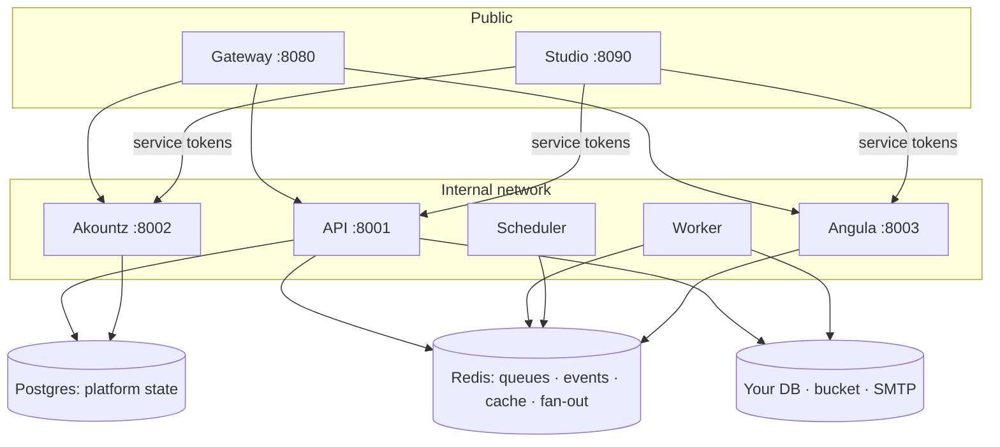
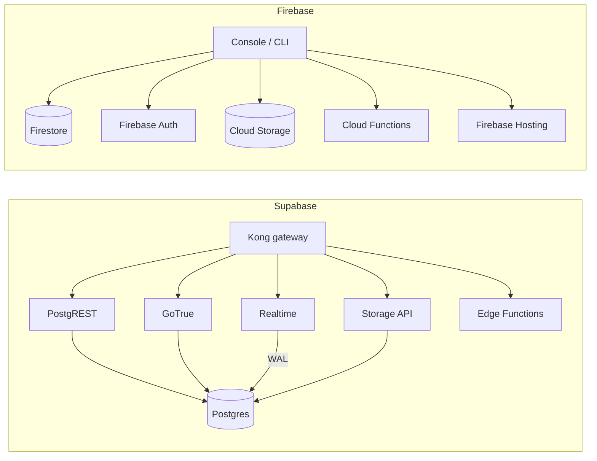
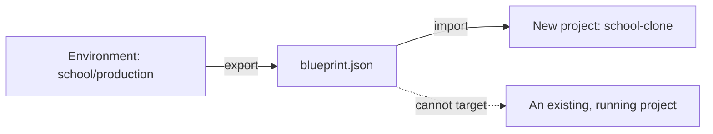
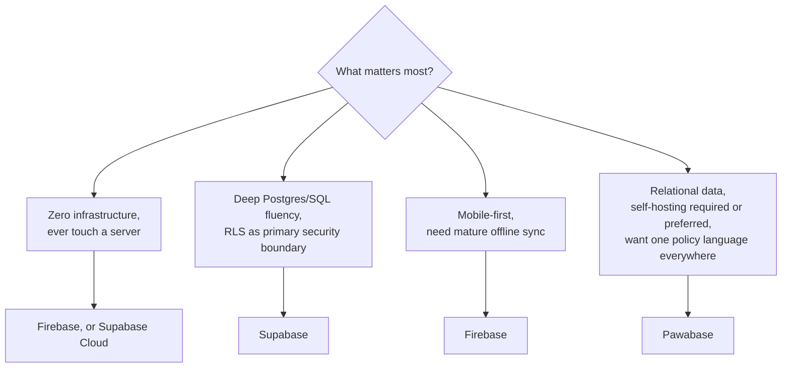

People usually arrive at this page from one of two directions: they know Supabase or Firebase well and want to know what's different about Pawabase before investing time in it, or they've already started building on Pawabase and want the vocabulary to explain it to a teammate who knows one of the other two. This section is written for both.

<Note>
This is a comparison written by the team that builds Pawabase. We've tried hard to keep every claim about Supabase and Firebase accurate as of their current, widely-documented behavior, and every claim about Pawabase traceable to the rest of these docs or to the platform's source. Where Pawabase is worse, smaller, or simply doesn't do something yet, we say so directly — see [When not to use Pawabase](/compare/when-not-to-use-pawabase) for the unvarnished version. If you spot something stale, it's worth double-checking against Supabase's or Firebase's own current docs, since both platforms evolve quickly.
</Note>

## The short version

All three are "backend as a service" platforms in the loose sense: you get a database, authentication, file storage, realtime updates, and a place to run server-side logic, without hand-rolling a REST API from scratch. Past that, they make almost opposite bets.

<CardGroup cols={3}>
  <Card title="Pawabase" icon="server">
    Self-hosted. Your own Postgres, MySQL or SQLite. One policy engine — JSON conditions, not SQL or a rules DSL — guards every entry point: resources, routes, functions, flows, storage, realtime. Whole backends export and import as one JSON document.
  </Card>
  <Card title="Supabase" icon="bolt">
    Postgres-native. Row Level Security is the security boundary, enforced by the database itself. PostgREST auto-generates a REST API from your schema. Managed cloud with a generous free tier, or self-host the full stack yourself.
  </Card>
  <Card title="Firebase" icon="flame">
    Fully managed by Google, no self-hosting option at all. Firestore's schemaless document model trades joins for denormalization. Security Rules are evaluated per-document, and rules also shape which queries a client is allowed to run.
  </Card>
</CardGroup>

If you remember only three things about how Pawabase differs, make them these:

1. **One policy language for everything, evaluated at the app layer.** Supabase's RLS lives in Postgres and only protects things that go through Postgres. Firebase's Security Rules only protect Firestore/Storage/RTDB reads and writes. Pawabase's policies guard resources, custom routes, functions, flows, storage buckets, and realtime channels with the same JSON condition language — but because they run in the application layer rather than inside the database, a direct database connection with valid credentials bypasses them, which Postgres RLS does not allow. That trade is explained in full in [Compared with Supabase and Firebase](/policies/overview#compared-with-supabase-and-firebase) and revisited honestly in [When not to use Pawabase](/compare/when-not-to-use-pawabase).
2. **You bring your own database, and it doesn't have to be Postgres.** Pawabase supports Postgres, MySQL, and SQLite per environment, and works against tables it didn't create. Supabase is Postgres-only by design (RLS is a Postgres feature, so the floor can't move). Firebase has no relational option and no self-hosting at all.
3. **A whole backend is one exportable JSON document.** Pawabase's [blueprints](#blueprints-exporting-a-whole-backend) let you export every definition in a project — schemas, policies, resources, flows, routes, buckets, subscriptions, webhooks, schedules, roles — as a single file that can only be used to start a *new* project. Neither Supabase nor Firebase has a real equivalent.

And the trade-offs that go the other way, stated plainly up front rather than buried at the bottom of the page: Pawabase has no managed hosting tier, no native mobile SDKs yet, a materially smaller ecosystem and community than either competitor, and is a younger, less battle-tested platform. If any of those are disqualifying for your project today, [When not to use Pawabase](/compare/when-not-to-use-pawabase) is worth reading before you invest more time here.

## The three-way comparison table

This is the same table you'll find condensed further in [Feature matrix](/compare/feature-matrix); this version has one row per major subsystem, with the detail expanded below it.

| Dimension | Pawabase | Supabase | Firebase |
| --- | --- | --- | --- |
| Underlying database | Postgres, MySQL, or SQLite — your choice, per environment | Postgres only | Firestore (NoSQL documents) or Realtime Database (JSON tree) |
| Data model | Relational: fields, types, relations, joins via `?expand=` | Relational: raw SQL tables, PostgREST embeds | Document/NoSQL: collections, subcollections, denormalized |
| Schema | Declared per resource (fields, types, constraints); opt-in API surface | Raw Postgres DDL; PostgREST exposes by default, opt-out via RLS | Schemaless; no server-enforced structure |
| Access control | Policies: JSON conditions, one engine, every entry point, app-layer | Row Level Security: SQL policies, Postgres-only, DB-layer | Security Rules: custom DSL, per-document, also constrains queries |
| Auth service | Akountz — per-project-environment user pools, OAuth/OIDC, MFA, orgs | GoTrue — project-wide `auth.users`, OAuth, MFA | Firebase Auth — project-wide, huge provider list |
| Storage | Buckets with `read_policy`/`write_policy`, S3-compatible backends | Storage API, `storage.objects` RLS-style policies, S3-compatible | Cloud Storage, GCS-backed, own Security Rules |
| Realtime | Angula — policy-gated channels, presence, replayable history | Postgres Changes (WAL-based), Presence, Broadcast | Firestore `onSnapshot` listeners, RTDB listeners |
| Server-side logic | Visual flows (JSON graphs) **and** Python functions | Edge Functions — Deno/TypeScript only | Cloud Functions — Node/Python/Go only |
| Whole-backend export | Blueprints — one JSON document, new-project-only | No single-file equivalent; migrations + manual RLS/function redeploy | No equivalent; three separate `firebase deploy --only …` targets |
| Self-hosting | Required — no managed cloud offering yet | Optional — official docker-compose stack, or managed cloud | Not available at all |
| Managed hosting | None today | Yes, generous free tier + usage-based paid tiers | Yes, usage-based "Blaze" plan only |
| Pricing shape | Your own infrastructure cost; no platform fee | Free tier, then usage-based (DB size, bandwidth, MAUs, storage, invocations) | Usage-based (reads/writes/deletes, bandwidth, GB-months, invocations) |
| Mobile SDKs | None native yet; REST API + JS client (React Native-usable) + Python client | Official JS/Dart/Swift/Kotlin/Python SDKs | Official SDKs for essentially every platform |
| Ecosystem maturity | New, small team, docs actively being completed | Large, VC-backed, years in production, big community | Google-scale, over a decade in production |
| Offline sync | None built in | Partial, via client libraries | Firestore offline persistence is mature and widely used |

<Tip>
Every row above is expanded into its own section below, with code-shape examples so you can see what the difference actually looks like rather than take our word for the abstract claim.
</Tip>

## Architecture, side by side

Pawabase runs as a small set of cooperating services from one Docker image and one shared Python library (referred to internally as "the kit"):



Seven processes: **Gateway** (the only public door — resolves API keys, applies CORS and rate limits, strips anything that could impersonate the platform, contains no business logic), **API** (owns every project, environment, definition kind, compiled per-environment app, storage, functions, flows, events, webhooks, keys, secrets, mail and docs), **Worker** (runs the async queues — events, webhooks, flows, functions, mail — horizontally scalable), **Scheduler** (reconciles cron/interval jobs; run exactly one, since two double-fire every schedule), **Akountz** (identity: users, passwords, tokens, sessions, MFA, OAuth/OIDC, organizations, roles and permissions, isolated *per project environment*), **Angula** (realtime channels, presence, replayable history), and **Studio** (the control-plane app, which never touches a database directly — it calls the other services through a service-token bridge). Full detail: [Architecture](/concepts/architecture).

Supabase's stack is a similar idea with a different center of gravity — Postgres itself is the hub, and everything else is a service that reads from or writes to it:

- **PostgREST** turns your Postgres schema directly into a REST API. This is an *opt-out* model: create a table, and every column and row is reachable over the API the moment PostgREST notices it, until you add Row Level Security.
- **GoTrue** is the auth service, backed by an `auth.users` table in the same Postgres instance.
- **Realtime** listens to Postgres's write-ahead log (logical replication) and turns row-level changes into a websocket stream, alongside separate Presence and Broadcast primitives.
- **Storage API** is S3-backed, secured with `storage.objects` policies that are themselves RLS.
- **Edge Functions** run on Deno Deploy infrastructure, written in TypeScript, deployed with the Supabase CLI.
- **Kong** is the API gateway in front of all of it.

Self-hosting the whole thing means running Supabase's official docker-compose stack — around ten containers (`postgres`, `gotrue`, `postgrest`, `realtime`, `storage-api`, `imgproxy`, `kong`, `studio`, `meta`, `edge-runtime`) — versus Pawabase's seven processes from one image. Some Supabase Cloud features (certain observability dashboards, some auth provider integrations) are cloud-only or need extra wiring when self-hosted.

Firebase has no architecture diagram to draw at all in the self-hosting sense, because there is nothing to host. Firestore, Auth, Storage, Functions, and Hosting are Google-managed services behind the Firebase Console and CLI. You configure them; you never see or operate the machines they run on.



This difference matters practically: with Pawabase or self-hosted Supabase, you're operating real infrastructure — backups, TLS, scaling, upgrades are your job (see [self-hosting requirements](/self-hosting/requirements)). With Firebase, or Supabase Cloud, that operational surface disappears, at the cost of running on someone else's infrastructure under someone else's pricing and someone else's incident timeline.

## Database and data model

This is the deepest structural difference between the three platforms, and it's worth being precise rather than hand-wavy about it.

**Pawabase** keeps your application data in a database *you* configure — Postgres, MySQL, or SQLite, chosen per environment via a `database_url` (the password lives in [Secrets](/operate/secrets), never inlined). The platform's own Postgres instance only stores your project's *definitions* — the resources, policies, flows, and so on — never your application rows. A resource can point at a table Pawabase didn't create:

```json
{
  "name": "invoices",
  "table": null,
  "primary_key": "id",
  "id_type": "integer",
  "fields": [
    { "name": "invoice_no", "type": "string", "required": true, "pattern": "^INV-[A-Za-z0-9]+$" },
    { "name": "student_id", "type": "integer", "required": true },
    { "name": "amount", "type": "number", "required": true, "minimum": 0 },
    { "name": "status", "type": "string", "enum": ["issued", "partially_paid", "paid", "overdue", "void"], "default": "issued" }
  ],
  "operations": {
    "list":   { "enabled": true, "policy": "family_access" },
    "get":    { "enabled": true, "policy": "family_access" },
    "create": { "enabled": true, "policy": "finance_staff" },
    "update": { "enabled": true, "policy": "finance_staff" },
    "delete": { "enabled": true, "policy": "school_admin" }
  },
  "relations": [{ "name": "payments", "type": "has_many", "resource": "payments", "field": "invoice_id" }]
}
```

Notice that **nothing is exposed until you enable it.** Every one of the five possible operations (`list`, `get`, `create`, `update`, `delete`) is switched on individually, and each carries its own policy. An operation you never enable simply doesn't exist as a route and never appears in the generated API docs. This is an **opt-in** model.

**Supabase** is Postgres, full stop — which is both its strength (you get every Postgres feature: extensions, `EXPLAIN`, foreign keys enforced by the database itself, stored procedures, full SQL) and the source of its most infamous failure mode. PostgREST inspects your schema and exposes every table and column it finds, over REST, immediately — an **opt-out** model. A table is world-readable and world-writable the moment it exists, until you run `ALTER TABLE … ENABLE ROW LEVEL SECURITY` and add policies. Forgetting that step is a well-known category of real Supabase security incidents, not a hypothetical.

**Firestore** removes schema from the equation almost entirely. Collections hold documents; documents hold arbitrary JSON-ish fields; there's no `CREATE TABLE`, no column types enforced by the server beyond what your Security Rules happen to assert on write, and — critically — **no joins**. A `posts` collection with a `comments` subcollection can't be queried "post with author name and comment count" in one round trip the way a relational join can; you either issue multiple reads client-side or you denormalize the author's name onto every post and comment at write time, and now you own keeping those copies in sync whenever the author's name changes.

Pawabase resources model relations directly — `belongs_to` and `has_many` — and fetch related data with a query parameter rather than a second round trip:

```bash
# a post plus its author and its comments, one request
curl "$GW/rest/v1/posts/42?expand=author,comments" -H "apikey: $PK"
```

This is a genuinely different data model from Firestore's, not a rename of the same idea — see [Firebase → data model](/compare/firebase#data-model-the-part-that-actually-differs) for a full worked example modeling the same blog both ways, including what each approach costs you.

<Tabs>
  <Tab title="Pawabase">
    Postgres, MySQL, or SQLite, your choice per environment. Existing schemas work: set `table` and `primary_key` to match, declare only the columns the API should see. `db.query` blocks inside flows write portable SQL across all three dialects.
  </Tab>
  <Tab title="Supabase">
    Postgres only, by hard architectural requirement — Row Level Security *is* a Postgres feature, so the floor can't move to another engine without losing the entire security model built on top of it.
  </Tab>
  <Tab title="Firebase">
    Firestore (document) or Realtime Database (JSON tree). No relational option at all. No self-hosting, so no choice of underlying infrastructure either.
  </Tab>
</Tabs>

## Access control

Covered in exhaustive, worked-example detail in [policies/overview.mdx's comparison section](/policies/overview#compared-with-supabase-and-firebase) and in [Compare with Supabase](/compare/supabase#access-control-rls-vs-policies) and [Compare with Firebase](/compare/firebase#access-control-security-rules-vs-policies). The short version, reproduced faithfully here:

**Pawabase policies** are JSON conditions, stored as named definitions, referenced from resources, custom routes, functions, flows, storage buckets, and realtime channels — one engine, one vocabulary, everywhere:

```json
{
  "name": "own_rows",
  "description": "Signed-in users see their own rows",
  "condition": {
    "all": [
      { "authenticated": true },
      { "eq": ["$record.user_id", "$auth.user_id"] }
    ]
  }
}
```

On `list` requests, Pawabase **plans** the policy into the query rather than filtering results afterward: anything that doesn't depend on the row (roles, authentication, scopes) is checked before any SQL runs; AND-ed equalities between a record field and a known value become a SQL `WHERE` clause; anything left over is checked per row as it's read. The practical effect is that a paginated list is *correct* — the right rows, the right total — not "20 rows, 3 of which turned out to be visible."

**Supabase's Row Level Security** is SQL, evaluated inside Postgres itself:

```sql
create policy "own rows" on notes for select
  using (auth.uid() = user_id);
```

This is extremely powerful for a team that thinks fluently in SQL, and it has one property Pawabase's app-layer policies genuinely don't: **it protects the database even from a direct, non-API connection.** If an attacker gets valid Postgres credentials and connects with `psql`, RLS still applies. Pawabase's policy engine runs in the application layer — a direct database connection with valid credentials bypasses it entirely. This is an honest, important trade-off, discussed at length in [When not to use Pawabase](/compare/when-not-to-use-pawabase#policies-are-enforced-in-the-app-layer-not-the-database).

**Firebase Security Rules** are a custom DSL evaluated per document:

```js
match /notes/{id} {
  allow read, update, delete: if request.auth != null && request.auth.uid == resource.data.userId;
  allow create: if request.auth != null;
}
```

The rule that trips people up moving *away* from Firebase: Security Rules aren't a filter applied after a query runs — they're a gate the *query itself* must satisfy. A Firestore query that *could* return a document the caller isn't allowed to read is rejected outright, so client code has to be written defensively, constraining its own queries to match the rules. Pawabase (and Postgres RLS with an appropriately-written policy) instead lets you write the natural query and returns only what's permitted.

| | Pawabase policies | Supabase RLS | Firebase Security Rules |
| --- | --- | --- | --- |
| Language | JSON conditions (+ Python escape hatch) | SQL | Custom rules DSL |
| Evaluated | App layer, per request | Inside Postgres, per row | Per document, including at query time |
| Protects direct DB access | No | Yes | N/A (no direct DB access exists) |
| Query behavior on partial access | Rows filtered/pushed down, list stays correct | Rows filtered by Postgres itself | Query **rejected** if it could violate the rule |
| Databases it works with | Postgres, MySQL, SQLite | Postgres only | N/A |
| Scope | Resources, routes, functions, flows, buckets, channels | Tables, and storage via `storage.objects` | Firestore/RTDB reads & writes, Storage |
| Reuse | Named, referenced anywhere | Copy per table/command, or SQL functions | Functions inside the rules file |

## Storage

All three offer object storage with policy-gated reads and writes, on an S3-compatible or S3-backed store.

| | Pawabase | Supabase | Firebase |
| --- | --- | --- | --- |
| Backend | S3-compatible (your choice) | S3-compatible, managed or self-hosted | Google Cloud Storage |
| Access control | `read_policy` / `write_policy` per bucket, same policy engine, sees `$object` (key/segments/action) | `storage.objects` RLS policies | Cloud Storage Security Rules |
| Public path | `/storage/v1/*` | Storage API | Firebase SDK / GCS |

The meaningful difference is the same one as everywhere else in this table: Pawabase's storage policies are written in the same JSON condition language as everything else and can reference the same roles, ownership fields, and scopes a resource policy can. Supabase's storage policies are RLS, so they're SQL, and they live alongside your table policies conceptually but are a slightly different surface (`storage.objects` rows) to reason about. Firebase's storage rules are a third DSL, separate from Firestore's rules syntax in small but real ways.

## Realtime

| | Pawabase (Angula) | Supabase Realtime | Firebase |
| --- | --- | --- | --- |
| Model | Named channels, pub/sub, presence, replayable history | Postgres Changes (WAL-based change feed) + separate Presence + Broadcast primitives | `onSnapshot` listeners per query/document (Firestore), or RTDB listeners |
| Governed by | Same policy engine (`subscribe`/`publish` per channel) | RLS on the underlying table | Same Security Rules as reads |
| Triggered by | Resource writes (`realtime: true` + events), or explicit publish | Row-level Postgres changes | Any write matching the listener's query/document |
| Scaling | Multiple Angula instances share state via Redis pub/sub | Managed by Supabase, or self-hosted alongside Postgres | Fully managed |

Angula's channels are an explicit concept — you subscribe to `resource:<name>` or a channel you define — whereas Firestore's realtime is implicit in every live query: attach a listener, get updates for as long as it's mounted. Supabase's Postgres Changes is closer to Pawabase's model in spirit (a stream of row-level changes) but is tied directly to Postgres's write-ahead log, alongside separate Presence and Broadcast APIs that don't share a security model with your table's RLS.

## Automation: flows, functions, Edge Functions, Cloud Functions

This is where Pawabase's offering is structurally different from both alternatives, because it's actually two things, not one.

**Pawabase** gives you a **visual flow engine** — flows are JSON node graphs, built with Studio's visual editor, versioned as definitions like everything else, triggered by an HTTP call (`/flows/v1/<name>`), a schedule, or an event. Flow nodes include `trigger.http`, `trigger.schedule`, `policy.check` (an access decision inside the flow itself), and `db.query` (portable read-only SQL, dialect-adapted). **Separately**, Pawabase supports plain Python functions for logic a visual graph can't express cleanly:

```python
from pawabase_core.functions import function

@function("send_receipt", policy="finance_staff")
async def send_receipt(ctx):
    ...
```

**Supabase Edge Functions** are one thing: TypeScript running on Deno, deployed with the CLI (`supabase functions deploy`). There's no visual builder — every piece of automation is hand-written code. **Firebase Cloud Functions** are the same shape: Node.js, Python, or Go, deployed with `firebase deploy --only functions`, triggered by Firestore writes (`onCreate`/`onUpdate`/`onDelete`/`onWrite`) or HTTP calls, again with no visual builder.

The practical consequence: a non-engineer on a Pawabase team can build a real automation ("when an invoice goes overdue, email the guardian and post a note to the finance channel") entirely in Studio's visual editor, with policy checks and database reads built from blocks, and reach for Python only when the flow's block vocabulary genuinely runs out. On Supabase and Firebase, every piece of server-side automation is a code change, a deploy, and a review, no matter how small.

## Blueprints: exporting a whole backend

This is worth its own heading because it's the single feature with the clearest "nothing else does this" claim in this whole comparison.

A **blueprint** exports an entire Pawabase backend — every definition kind (schemas, transformers, policies, resources, mail templates, flows, routes, buckets, subscriptions, webhooks, inbound hooks, schedules), the environment's roles and permissions, the non-sensitive parts of auth and environment settings, and optionally up to 5,000 sample rows per resource — as **one JSON document** (`"format": "pawabase.blueprint"`, versioned).



Two properties make this safe to hand around rather than merely convenient:

1. **It can only create a new project.** There is no endpoint that applies a blueprint to an already-running project, so sharing a blueprint can never silently overwrite someone's live definitions or data.
2. **It never carries secrets.** No API keys, no webhook or inbound-hook signing secrets, no OAuth provider credentials, no infrastructure (database/storage/mail) settings, no users, no sessions.

Importing a blueprint re-validates every single definition with the exact same request models and validators the Platform API itself enforces, in dependency order — policies before the resources and buckets that reference them, schemas and flows before the routes that use them — so a hand-edited or malformed blueprint can't sneak past validation that a normal API call would catch.

Neither competitor has a real equivalent. Recreating a Supabase project from another one means running SQL migration files, hand-copying RLS policy definitions, redeploying Edge Function code, and reconfiguring storage buckets — four separate tools, four separate artifacts, no single source of truth. Recreating a Firebase project means three separate `firebase deploy --only firestore:rules`, `--only firestore:indexes`, and `--only functions` commands, and there is no "spin up a brand-new project from this" primitive at all — you're reconstructing configuration by hand in the console or CLI, project by project.

<Tip>
If you run an agency, a franchise product, or anything where "stand up a new customer's backend that looks like this template" is a recurring task, blueprints are worth evaluating Pawabase for on their own. See [migrate/from-supabase](/migrate/from-supabase) and [migrate/from-firebase](/migrate/from-firebase) for what a first migration looks like in practice — note blueprints themselves are a Pawabase→Pawabase mechanism, not an import tool for Supabase or Firebase data; a migration still means designing the target resources and policies by hand.
</Tip>

## Self-hosting and operations

| | Pawabase | Supabase | Firebase |
| --- | --- | --- | --- |
| Can self-host | Required — it's the only option today | Yes, official docker-compose | No, never |
| Can use a managed cloud | No, not yet | Yes, generous free tier + usage-based paid | Yes, the only option |
| What you operate if self-hosted | 7 processes, 1 image, your Postgres/MySQL/SQLite, Redis, S3-compatible storage | ~10 containers (postgres, gotrue, postgrest, realtime, storage-api, imgproxy, kong, studio, meta, edge-runtime) | N/A |
| Backups, TLS, scaling, upgrades | Your responsibility — see [self-hosting docs](/self-hosting/requirements) | Your responsibility if self-hosted; handled for you on Cloud | Handled for you, always |

This is a real, two-sided trade-off. Self-hosting means you decide where your data lives, you can point Pawabase at a database you already run, and there's no vendor who can raise prices or change terms of service on your production data. It also means backups, TLS certificate renewal, scaling the worker pool, patching, and disaster recovery are your team's job, every time, starting on day one. If "no infrastructure to think about, ever" is the actual requirement, Firebase — or Supabase Cloud — will get you there in a way Pawabase currently cannot. See the dedicated, unflinching treatment of this in [When not to use Pawabase](/compare/when-not-to-use-pawabase).

## Pricing model

The three platforms don't just charge differently — they put the *risk* in different places.

**Pawabase** has no platform fee: the docs describe an open-source, self-hosted positioning, so your cost is whatever infrastructure you provision (Postgres/MySQL instance, Redis, S3-compatible storage, compute for the seven processes). That cost is predictable in the sense that it scales with decisions *you* make about instance sizes, not with usage spikes you don't control — but you're the one sizing it, and you're the one paying for headroom you don't end up using.

**Supabase** offers a genuinely generous free tier on its managed cloud, then usage-based billing across several dimensions at once — database size, egress bandwidth, monthly active users, storage gigabytes, Edge Function invocations. Self-hosting removes the platform fee entirely, in exchange for taking on the ~10-container operational surface above.

**Firebase** is pay-as-you-go on the "Blaze" plan, billed per Firestore read/write/delete, bandwidth, storage GB-months, and function invocations/GB-seconds. The well-documented community pain point here is that a single bad query pattern (an unindexed Firestore query fanning out reads) or a bug in a Cloud Function that triggers itself can turn into a bill spike measured in multiples overnight, with no self-hosting escape hatch to fall back to while you fix it.

## Ecosystem and maturity — the honest section

We'd rather state this plainly here than have you discover it three weeks into a migration.

Pawabase is a new, small platform: a small team, a codebase and docs that are still being actively written (this page is part of that effort), few public production case studies at scale, no plugin or extension marketplace, no third-party integrations directory, and — as of today — **no native iOS or Android SDK**. Mobile apps talk to Pawabase over its REST API directly, or through the JavaScript client (which works from React Native), or the Python client for server-side mobile backends. See [clients/mobile](/clients/mobile) for the current state.

Supabase is VC-backed, has a large and active community, official client SDKs in JavaScript, Dart, Swift, Kotlin and Python, a large template/starter-project ecosystem, an integrations marketplace, and years of production use at real scale.

Firebase is Google-scale: official SDKs for essentially every platform that exists (iOS, Android, Web, Unity, Flutter, C++, Node), over a decade in production, and an enormous base of community knowledge, Stack Overflow answers, and third-party tutorials.

None of that is a reason to avoid Pawabase if its actual technical shape — self-hosted, relational, one policy engine, blueprint portability — fits what you're building better than the alternatives. It is a reason to go in with accurate expectations about support surface, hiring pool familiarity, and how much you'll be the one debugging an edge case rather than finding it already answered on a forum.

## Which should you pick?



<Steps>
  <Step title="You want zero operational surface, full stop">
    Firebase, or Supabase's managed cloud. Both remove backups, scaling, patching and TLS from your team's job list entirely. Pawabase can't offer that today — it's self-hosted only.
  </Step>
  <Step title="Your team already thinks fluently in SQL and wants RLS as the primary security boundary, including protecting direct database connections">
    Supabase. Its RLS-in-Postgres model is a genuinely stronger guarantee against a compromised application server or a leaked database credential than an app-layer policy engine, because the database enforces the rule itself regardless of who's connecting.
  </Step>
  <Step title="You're building a mobile-first app that leans on offline sync">
    Firebase. Firestore's offline persistence and sync is mature, heavily used in production, and has no equivalent in Pawabase today.
  </Step>
  <Step title="Your data is naturally relational, you want (or need) to self-host, and you want one access-control language across your whole backend instead of stitching together RLS + a rules file + hand-rolled route guards">
    Pawabase. This is the shape it's built for.
  </Step>
  <Step title="You're not sure yet">
    Read [Feature matrix](/compare/feature-matrix) for the exhaustive row-by-row comparison, [Concept map](/compare/concept-map) if you already know one of the others and want the vocabulary translation, and [When not to use Pawabase](/compare/when-not-to-use-pawabase) for the limitations stated without any spin.
  </Step>
</Steps>

## FAQ

<AccordionGroup>
  <Accordion title="Is Pawabase a Supabase or Firebase clone?">
    No — the resource/policy/flow model, the multi-database support, and the whole-backend blueprint mechanism aren't present in either platform. It's closer to say Pawabase asked the same question ("how do we let people describe a backend instead of hand-building one") and arrived at a different architecture: definitions as data, compiled per environment, with one policy engine instead of a database-specific security feature or a NoSQL-specific rules DSL.
  </Accordion>
  <Accordion title="Can I use Postgres with Pawabase the same way I would with Supabase?">
    Yes for the database itself — Pawabase can point at a Postgres instance, including one with an existing schema. What's different is the security model: you'd write Pawabase policies instead of (or as well as) RLS, and you'd get Pawabase's opt-in resource/operation model on top of the tables rather than PostgREST's opt-out exposure. See [Use your own database](/data/your-database).
  </Accordion>
  <Accordion title="Does Pawabase support Postgres extensions like pgvector or PostGIS?">
    Since Pawabase resources sit on top of a real Postgres database when you choose Postgres, extension-backed columns and queries work at the database level. There's no first-class Pawabase abstraction for, say, vector similarity search the way some platforms bolt one on — you'd reach for a Python function or a flow's `db.query` block to run that SQL directly.
  </Accordion>
  <Accordion title="Is there a managed Pawabase Cloud coming?">
    Not as of this writing. Today, Pawabase is self-hosted only. If a managed offering matters to your timeline, plan around Supabase Cloud or Firebase for now and revisit later, or watch the [self-hosting](/self-hosting/requirements) docs for changes.
  </Accordion>
  <Accordion title="Why would I choose an app-layer policy engine over database-layer RLS?">
    Because it covers more than the database: the same policy guards a custom route, a function, a flow, a storage bucket, and a realtime channel, with one vocabulary, rather than RLS (database only) plus separate route guards plus separate storage rules plus a separate realtime authorization story. The cost is that RLS's strongest guarantee — protecting even a raw database connection with stolen credentials — doesn't carry over. Both are legitimate designs; they optimize for different things.
  </Accordion>
  <Accordion title="Can I migrate incrementally, or is it all-or-nothing?">
    Both migration guides ([from Supabase](/migrate/from-supabase), [from Firebase](/migrate/from-firebase)) describe a phased approach — schema and data first, then access control, then automation, then client code — and both discuss running the old and new systems side by side during a transition window. It doesn't have to be a single cutover.
  </Accordion>
  <Accordion title="What about GraphQL?">
    Pawabase's primary API surface is REST (`/rest/v1/*`), generated from your resource definitions with full OpenAPI documentation. This comparison doesn't cover GraphQL specifically since it isn't the primary interface on any of the three platforms by default (Supabase offers it as an add-on via `pg_graphql`; Firebase doesn't offer it natively either).
  </Accordion>
  <Accordion title="Is Pawabase open source?">
    See the project's [index](/index) and [quickstart](/quickstart) pages for the current licensing and source-availability position; this comparison focuses on architecture and features rather than restating licensing terms that are best read from their primary source.
  </Accordion>
  <Accordion title="Does Pawabase have row-level security like Postgres RLS, just implemented differently?">
    It has policies that achieve a similar *outcome* on list queries — the pushdown mechanism described above means a list endpoint returns exactly the rows a caller may see, with a correct total, rather than an unfiltered page. It does not have the same *guarantee*: RLS is enforced by Postgres itself for any connection, while Pawabase's policies are enforced by the application layer for requests that go through it.
  </Accordion>
  <Accordion title="What happens to my existing Postgres database if I adopt Pawabase?">
    Nothing, unless you point Pawabase at it. Pawabase resources can be defined against existing tables (set `table` and `primary_key` to match), and you can declare only the columns you want the API to see. You are not required to let Pawabase own or migrate your schema.
  </Accordion>
  <Accordion title="How do I decide between reading this page, the feature matrix, or the concept map first?">
    This page for the big picture and the "why," [Feature matrix](/compare/feature-matrix) if you already know roughly what you want and just need a checklist, [Concept map](/compare/concept-map) if you already know Supabase or Firebase well and want the vocabulary translated term-for-term.
  </Accordion>
</AccordionGroup>

## Next

<CardGroup cols={2}>
  <Card title="Compare with Supabase" icon="bolt" href="/compare/supabase">A deep dive: Postgres+RLS vs resources+policies, with worked policy pairs.</Card>
  <Card title="Compare with Firebase" icon="flame" href="/compare/firebase">A deep dive: Firestore's document model vs Pawabase's relational one.</Card>
  <Card title="Feature matrix" icon="table" href="/compare/feature-matrix">Every feature, row by row, honestly scored.</Card>
  <Card title="Concept map" icon="map" href="/compare/concept-map">If you know X in Supabase or Firebase, it's called Y here.</Card>
  <Card title="When not to use Pawabase" icon="triangle-alert" href="/compare/when-not-to-use-pawabase">The limitations, stated plainly, and what to use instead.</Card>
  <Card title="Migrate from Supabase" icon="arrow-right-left" href="/migrate/from-supabase">A practical, phased migration guide.</Card>
  <Card title="Migrate from Firebase" icon="arrow-right-left" href="/migrate/from-firebase">A practical, phased migration guide.</Card>
  <Card title="Policies" icon="shield-check" href="/policies/overview">The access-control engine this whole comparison keeps referencing.</Card>
</CardGroup>
