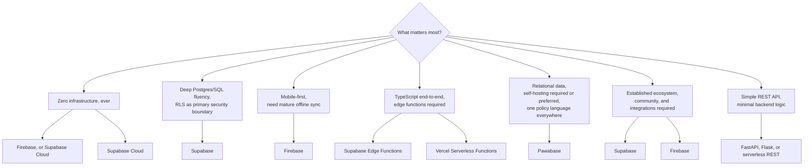

Pawabase is not the right fit for every project. This page is the unvarnished version of the comparison — the limitations stated plainly, the trade-offs called out honestly, and what to reach for instead. If you're considering Pawabase, read this before you invest significant time. If you've already started building and you're hitting a wall, this might explain why.

<CardGroup cols={3}>
  <Card title="Honest" icon="scale">Every limitation below is stated without spin. No marketing language.</Card>
  <Card title="Alternatives" icon="arrow-right-left">What to use instead when Pawabase doesn't fit.</Card>
  <Card title="Evolving" icon="rotate">Pawabase is actively developing — some "missing" features may arrive.</Card>
</CardGroup>

<Note>
Pawabase is a young platform with a small team, a codebase and docs that are still being actively written, and a materially smaller ecosystem and community than either Supabase or Firebase. This page covers the limitations that are structural or near-term, not temporary gaps that the team plans to close with the next release. If you're on the fence, also read [Overview](/compare/overview) for the big picture, [Concept map](/compare/concept-map) for the vocabulary translation, and [Feature matrix](/compare/feature-matrix) for the complete feature listing.
</Note>

## You need offline-first mobile with local data persistence

Pawabase provides realtime synchronization over WebSocket, but it doesn't include an offline-first client SDK with local caching, conflict resolution, and background sync the way Firestore does. If your mobile app must work fully offline and sync when connectivity returns — a field service app, a health tracking app, a notebook that must work on an airplane — Pawabase cannot do this today.

**Use instead:** Firebase Firestore, which has mature offline persistence and sync built into its SDKs, or a dedicated offline-first framework like WatermelonDB or RxDB. Supabase offers partial offline sync via client libraries, but it's less mature than Firestore's.

<Warning>
This is the single most common reason someone arrives at this page and leaves without building on Pawabase. If your project is mobile-first and offline-capable is a requirement rather than a nice-to-have, Firebase's Firestore is the pragmatic choice. Pawabase's realtime is real-time over an active connection — it does not replace offline persistence.
</Warning>

## You want a document database

Pawabase uses a relational database — Postgres, MySQL, or SQLite, chosen per environment via that environment's `database_url` (SQLite is the default if you don't configure one, which makes it easy to start without provisioning anything, but the engine is a configuration choice in every environment, not a fixed SQLite-in-dev/Postgres-in-prod split). If your data model is deeply nested, schema-less, or requires flexible document storage without joins, Pawabase's relational model adds friction regardless of which of the three engines you point it at. You'd need to define fields with types, declare relations, and work within a relational paradigm that may not match your mental model.

**Use instead:** MongoDB Atlas, Firebase Firestore, or Couchbase. These platforms are designed for schemaless document storage and don't require you to define a schema up front.

<AccordionGroup>
  <Accordion title="But what if my data is mostly relational but I need some flexibility?">
    Pawabase resources can define fields with `type: "json"` or `type: "string"` for unstructured data. You're not forced into rigid typing for every field — the schema is declarative and you can make fields optional with no default. The trade-off is that you're still in a relational model with relations declared and queries structured around tables, not documents.
  </Accordion>
  <Accordion title="What about a hybrid approach?">
    Pawabase supports Postgres, which means you can use Postgres JSONB columns alongside typed resource fields. You can write raw SQL via `db.query` in flows for complex document-like queries. But the primary API surface — resources, REST endpoints, policy engine — is relational by design.
  </Accordion>
</AccordionGroup>

## You need a TypeScript-first serverless platform

Pawabase's functions are Python-only. If your team writes TypeScript exclusively and wants edge functions that deploy alongside a frontend framework (Next.js, SvelteKit, etc.), Pawabase cannot accommodate that today. Supabase Edge Functions run TypeScript/Deno, and Vercel Serverless Functions run TypeScript — both deploy to edge infrastructure with your frontend.

**Use instead:** Supabase Edge Functions, Vercel Serverless Functions, or AWS Lambda@Edge. If your stack is TypeScript end-to-end, Pawabase's Python-only functions create a language boundary your team would have to cross for every piece of server-side logic.

<Note>
This doesn't mean Pawabase can't work with a TypeScript frontend. The REST API is language-agnostic — you can call it from any client with `fetch`. The limitation is specifically about server-side functions: Pawabase doesn't offer a TypeScript runtime for backend logic. If your backend logic lives in a separate service (a Node.js API server you already run), you can call Pawabase's REST API from there without issue.
</Note>

## You want a fully managed platform with zero infrastructure

Pawabase can be self-hosted, but if you want a completely managed backend where you never think about infrastructure, scaling, or deployment — and you're okay with vendor lock-in — Firebase or Supabase provide that experience with less operational overhead. Pawabase is self-hosted only as of this writing, with no managed cloud offering planned.

**Use instead:** Firebase for a fully managed, Google-scale backend, or Supabase Cloud for a managed Postgres-based backend with a generous free tier.

<Warning>
This is not a minor limitation — it's a fundamental architectural choice. Pawabase's self-hosted-only model means you're responsible for backups, TLS certificate renewal, scaling the worker pool, patching, and disaster recovery. On day one. Forever. If your team doesn't want to operate infrastructure, Pawabase will consume more of your team's time than either competitor. The trade-off is that self-hosting means you decide where your data lives, there's no vendor who can raise prices or change terms of service on your production data, and you can point Pawabase at a database you already run.
</Warning>

## You need a simple REST API with minimal backend logic

If you just need CRUD endpoints with basic validation and no automation, flows, or event-driven logic, Pawabase is overkill. A simple API framework (FastAPI, Flask, or even a serverless REST API) will be faster to build and easier to maintain for a simple CRUD app. Pawabase's full platform — seven processes, policy engine, flows, Akountz, Angula — is a significant investment in infrastructure complexity for a simple API.

**Use instead:** FastAPI, Flask, Hono, or a serverless REST API (AWS API Gateway + Lambda, Cloudflare Workers, Vercel Serverless Functions). If you just need a REST API, you don't need a backend-as-a-service platform.

<Tip>
The threshold for Pawabase being "worth it" is when you have at least a few pieces of backend automation (something that happens on a schedule, reacts to events, or chains multiple operations together) or when you have a non-engineer stakeholder who needs to configure backend behavior without reading code. Below that threshold, a simpler framework is the right tool.
</Tip>

## Policies are enforced in the application layer, not the database

This is the most honest, most important caveat on this page — it's also the one most likely to surprise someone who's used Supabase.

Pawabase's policies run in the application layer (the API service), not inside the database. This means a direct database connection with valid credentials bypasses them entirely. Supabase's RLS lives inside Postgres and protects against this exact scenario. If you're building a system where a compromised database credential is a realistic threat model, Pawabase's policies do not provide the same guarantee as RLS.

**Use instead:** Supabase, if the "what if someone gets direct database access?" scenario is your primary security concern. Supabase's RLS-in-Postgres is a genuinely stronger guarantee in this specific dimension.

<AccordionGroup>
  <Accordion title="Does this mean Pawabase is less secure than Supabase?">
    Not necessarily — it means they make different trade-offs. Pawabase's policies cover more surfaces (resources, routes, functions, flows, storage, realtime) with a single vocabulary, which reduces the chance of a misconfiguration that leaves an endpoint unprotected. Supabase's RLS protects the database at the cost of requiring separate authorization for everything else. Both approaches have failure modes; the question is which failure mode you're more concerned about.
  </Accordion>
  <Accordion title="Can I mitigate this in Pawabase?">
    You can: restrict database access to only the Pawabase services (no direct client connections), use network-level controls (firewall rules, VPC isolation), and monitor for unusual database access patterns. But none of these are as strong as RLS, which is enforced at the database engine level regardless of network configuration.
  </Accordion>
  <Accordion title="Is this a deal-breaker for my project?">
    For most applications, the answer is no. The application-layer model works fine when you control the infrastructure and the database is only accessible through the gateway — which is the intended deployment. It becomes a concern when you have regulated data, external auditors who require database-level access control, or a threat model that includes database credential leakage. If that describes your situation, Supabase is the safer choice.
  </Accordion>
</AccordionGroup>

## Your team is committed to a specific ecosystem

If your team has deep investment in a specific cloud ecosystem, switching to Pawabase means leaving that ecosystem behind — along with its managed services, integrations, and tooling.

- **Google Cloud** → Firebase: tight integration with BigQuery, Cloud Functions, Cloud Storage, and Google's identity providers. Pawabase can't replicate this integration.
- **Vercel/Next.js** → Supabase + Vercel Edge Functions: the Vercel-Supabase integration is mature and well-documented. Pawabase has no equivalent.
- **AWS** → DynamoDB + Lambda + Cognito: the AWS ecosystem offers managed services with deep integration that Pawabase can't match.
- **Azure** → Azure Functions + Cosmos DB + Azure AD: same principle.

**Use instead:** Whatever your team's ecosystem already provides. Pawabase is vendor-neutral and open-source, but "vendor-neutral" means it doesn't integrate tightly with *any* vendor's ecosystem. You get portability at the cost of deep integration.

<Note>
This isn't a reason to avoid Pawabase if its actual technical shape fits your needs better than the alternatives. It is a reason to go in with accurate expectations about integration surface, hiring pool familiarity, and how much you'll be the one debugging an edge case rather than finding it already answered on a forum.
</Note>

## You need a mature ecosystem and community

Pawabase is a new, small platform: a small team, a codebase and docs that are still being actively written, few public production case studies at scale, no plugin or extension marketplace, no third-party integrations directory, and — as of today — no native iOS or Android SDK. Mobile apps talk to Pawabase over its REST API directly, or through the JavaScript client (which works from React Native), or the Python client for server-side mobile backends.

Supabase has a large and active community, official client SDKs in JavaScript, Dart, Swift, Kotlin and Python, a large template/starter-project ecosystem, an integrations marketplace, and years of production use at real scale. Firebase is Google-scale: official SDKs for essentially every platform, over a decade in production, and an enormous base of community knowledge.

**Use instead:** Supabase or Firebase if you need to hire developers who already know the platform, find Stack Overflow answers for your specific problem, or use pre-built integrations that don't require custom work.

<Warning>
This means more of your team's time may be spent debugging edge cases or implementing workarounds for features that are straightforward on more mature platforms. It also means the documentation — including this page — is still being completed and may have gaps. Read the docs carefully and file issues when something is unclear.
</Warning>

## You need mature offline sync

As noted in the first section, Pawabase has no offline-first client SDK. This bears repeating because it's the most common deal-breaker. Supabase offers partial offline sync via its client libraries, and Firebase's Firestore offline persistence is mature and widely used. Pawabase has none of this — realtime works over an active connection, and that's it.

**Use instead:** Firebase Firestore for the most mature offline-first experience, or Supabase for partial offline sync.

## You need real-time multiplayer game state

Pawabase's realtime system is designed for chat, notifications, and collaborative data — not for high-frequency game state synchronization where sub-millisecond latency and deterministic state reconciliation matter. The WebSocket protocol is sound, but the infrastructure (Angula, Redis pub/sub) isn't tuned for the kinds of throughput and latency requirements a real-time multiplayer game demands.

**Use instead:** A dedicated game server framework (Agones, Colyseus, Nakama) or a platform purpose-built for real-time multiplayer.

## You have strict compliance requirements Pawabase doesn't support

If you need HIPAA, SOC 2, or GDPR-specific compliance guarantees that require a certified managed service, verify that Pawabase's self-hosted deployment meets your requirements before committing. Pawabase is open-source and self-hosted, which means you *can* achieve compliance — you're responsible for the implementation — but there's no third-party certification to lean on, unlike some managed platforms that offer compliance attestations out of the box.

**Use instead:** A managed platform with compliance certifications if you need them pre-verified. Self-hosting Pawabase gives you the data sovereignty to achieve compliance, but you must build and audit the controls yourself.

<Note>
The absence of a pre-built compliance certification doesn't mean Pawabase can't be compliant — it means you can't point to a certificate and call it done. For teams with existing compliance infrastructure and the ability to self-audit, Pawabase's self-hosted model can actually be *easier* to make compliant than a managed service, because you control every layer.
</Note>

## Summary: the decision framework

<Steps>
  <Step title="You want zero operational surface, full stop">
    Firebase, or Supabase's managed cloud. Both remove backups, scaling, patching and TLS from your team's job list entirely. Pawabase can't offer that today — it's self-hosted only.
  </Step>
  <Step title="Your team already thinks fluently in SQL and wants RLS as the primary security boundary, including protecting direct database connections">
    Supabase. Its RLS-in-Postgres model is a genuinely stronger guarantee against a compromised application server or a leaked database credential than an app-layer policy engine, because the database enforces the rule itself regardless of who's connecting.
  </Step>
  <Step title="You're building a mobile-first app that leans on offline sync">
    Firebase. Firestore's offline persistence and sync is mature, heavily used in production, and has no equivalent in Pawabase today.
  </Step>
  <Step title="Your team writes TypeScript end-to-end and needs edge functions">
    Supabase Edge Functions, Vercel Serverless Functions, or AWS Lambda@Edge. Pawabase's functions are Python-only.
  </Step>
  <Step title="You need an established ecosystem, community, and integrations">
    Supabase or Firebase. Both have mature communities, official SDKs for every major platform, and extensive third-party integration directories.
  </Step>
  <Step title="Your data is naturally relational, you want (or need) to self-host, and you want one access-control language across your whole backend instead of stitching together RLS + a rules file + hand-rolled route guards">
    Pawabase. This is the shape it's built for.
  </Step>
</Steps>

## What's coming

Pawabase is actively developing. Some of the limitations listed above may be addressed in future releases:

- **Mobile SDKs** — the team has noted the absence of native mobile SDKs and it's on the roadmap, but there's no timeline to share. The REST API and JavaScript client are usable from React Native in the interim.
- **Managed hosting** — not planned as of this writing, but the team has discussed it. Don't plan around it.
- **Offline sync** — no announced timeline. The realtime WebSocket protocol is the current strategy for live data.
- **TypeScript functions** — no announced timeline. Python is the primary runtime.
- **GraphQL** — not the primary interface on Pawabase, and not planned as a first-class feature. The REST API is the primary surface, with full OpenAPI documentation generated per environment.

Check the project's [index](/index) and [quickstart](/quickstart) pages for the current status, and follow the project's development to see when (or if) these features ship.

## FAQ

<AccordionGroup>
  <Accordion title="Is Pawabase a Supabase or Firebase clone?">
    No. The resource/policy/flow model, the multi-database support, and the whole-backend blueprint mechanism aren't present in either platform. Pawabase asked the same question ("how do we let people describe a backend instead of hand-building one") and arrived at a different architecture: definitions as data, compiled per environment, with one policy engine instead of a database-specific security feature or a NoSQL-specific rules DSL.
  </Accordion>
  <Accordion title="Can I use Postgres with Pawabase the same way I would with Supabase?">
    Yes for the database itself — Pawabase can point at a Postgres instance, including one with an existing schema. What's different is the security model: you'd write Pawabase policies instead of (or as well as) RLS, and you'd get Pawabase's opt-in resource/operation model on top of the tables rather than PostgREST's opt-out exposure.
  </Accordion>
  <Accordion title="Is there a managed Pawabase Cloud coming?">
    Not as of this writing. Today, Pawabase is self-hosted only. If a managed offering matters to your timeline, plan around Supabase Cloud or Firebase for now and revisit later, or watch the [self-hosting docs](/self-hosting/requirements) for changes.
  </Accordion>
  <Accordion title="Can I migrate incrementally, or is it all-or-nothing?">
    Both migration guides ([from Supabase](/migrate/from-supabase), [from Firebase](/migrate/from-firebase)) describe a phased approach — schema and data first, then access control, then automation, then client code — and both discuss running the old and new systems side by side during a transition window. It doesn't have to be a single cutover.
  </Accordion>
  <Accordion title="What about GraphQL?">
    Pawabase's primary API surface is REST (`/rest/v1/*`), generated from your resource definitions with full OpenAPI documentation. This comparison doesn't cover GraphQL specifically since it isn't the primary interface on any of the three platforms by default.
  </Accordion>
  <Accordion title="Does Pawabase have row-level security like Postgres RLS?">
    It has policies that achieve a similar *outcome* on list queries — the pushdown mechanism means a list endpoint returns exactly the rows a caller may see, with a correct total. It does not have the same *guarantee*: RLS is enforced by Postgres itself for any connection, while Pawabase's policies are enforced by the application layer for requests that go through it.
  </Accordion>
  <Accordion title="What happens to my existing Postgres database if I adopt Pawabase?">
    Nothing, unless you point Pawabase at it. Pawabase resources can be defined against existing tables (set `table` and `primary_key` to match), and you can declare only the columns you want the API to see. You are not required to let Pawabase own or migrate your schema.
  </Accordion>
</AccordionGroup>

## Next

- [Overview](/compare/overview) — the big picture with the complete three-way comparison
- [Concept map](/compare/concept-map) — vocabulary translation if you know Supabase or Firebase
- [Feature matrix](/compare/feature-matrix) — every feature, row by row
- [Compare with Supabase](/compare/supabase) — deep dive into Postgres+RLS vs resources+policies
- [Compare with Firebase](/compare/firebase) — deep dive into Firestore's document model
- [Migrate from Supabase](/migrate/from-supabase) — a practical, phased migration guide
- [Migrate from Firebase](/migrate/from-firebase) — a practical, phased migration guide
