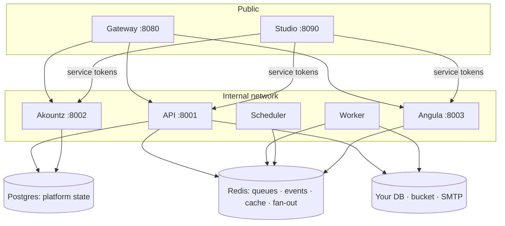

Pawabase is a small set of services with sharp boundaries. They share one Docker image and one library (the **kit**) but run as separate processes that talk over HTTP with audience-bound service tokens.

## The services

<AccordionGroup>
  <Accordion title="Gateway: the only door" icon="door-open">
    Routes the public paths to their upstreams, resolves API keys (cached), enforces allowed origins for publishable keys, applies rate limits (Sillo's limiter, per key or client address), strips `x-pawabase-*` headers and the raw key, adds the signed context and a request id, and streams HTTP and WebSockets through. It contains **no business logic**. `/internal` and `/admin` paths are unreachable from outside.
  </Accordion>
  <Accordion title="API: projects and the data plane" icon="database">
    Owns projects, environments, every definition kind, the compiled per-environment apps, storage, functions, flows, events, webhooks, keys, secrets, mail and docs. It's the configuration authority other services ask about an environment.
  </Accordion>
  <Accordion title="Worker: everything asynchronous" icon="cog">
    The API image running Sillo `QueueWorker`s for the `events`, `webhooks`, `flows`, `functions`, `mail` and `default` queues. Scale it horizontally.
  </Accordion>
  <Accordion title="Scheduler: time" icon="clock">
    Runs Sillo's `SchedulerManager`, reconciling schedule definitions and flows with `trigger.schedule` nodes into cron/interval jobs. **Run exactly one**: two schedulers fire every schedule twice.
  </Accordion>
  <Accordion title="Akountz: identity" icon="fingerprint">
    Users, passwords, tokens, sessions, verification, recovery, magic links, OAuth/OIDC, TOTP MFA and recovery codes, organizations, teams, invitations, roles, permissions and sign-in history, per project environment.
  </Accordion>
  <Accordion title="Angula: realtime" icon="radio">
    Channels on `sillo-wire` rooms with bounded per-peer queues, replayable history and presence. Multiple instances share publications through Redis pub/sub.
  </Accordion>
  <Accordion title="Studio: the control plane" icon="layout-dashboard">
    A Sillo + Inertia + React app. It never touches databases directly; it calls the other services' management endpoints with service tokens through its **bridge** (`/studio/api/<service>/…`).
  </Accordion>
</AccordionGroup>

## Public surface

The gateway presents one origin so internal topology never leaks into client code:

| Public path | Upstream | Purpose |
| --- | --- | --- |
| `/auth/v1/*` | Akountz | Sign-up, tokens, sessions, MFA, OAuth, orgs |
| `/rest/v1/*` | API | Resources, custom routes, extension routes |
| `/storage/v1/*` | API | Objects, listings, signed URLs |
| `/functions/v1/*` | API | Direct function invocation |
| `/flows/v1/*` | API | Direct flow invocation |
| `/hooks/v1/*` | API | Inbound webhooks |
| `/realtime/v1/*` | Angula | Socket and HTTP publish/presence/history |
| `/docs/v1/*` | API | Public Atlas docs (when enabled) |
| `/platform/v1/*` | API | Management plane |

## Trust between services

Three kinds of credential move through the system, each verified by a Sillo `AuthenticationBackend` from the kit:

| Credential | Issued by | Carried as | Verified by |
| --- | --- | --- | --- |
| Platform context | Gateway | `X-Pawabase-Context` (short-lived JWT, internal secret) | `ContextBackend` |
| User access token | Akountz | `Authorization: Bearer` (per-environment derived key) | `ProjectUserBackend` |
| Service token | Any service | `Authorization` on internal calls (audience-bound) | `ServiceBackend` |

Every hop carries Sillo's request id, so a single request can be followed across services in [Observability](/operate/observability).

## Built on Sillo

Pawabase follows **Sillo first**: if Sillo ships the primitive, Pawabase uses it.

| Capability | Sillo primitive |
| --- | --- |
| Routing, validation, DI | `SilloApp`, `Router`, `request_model`/`response_model`, `Depend` |
| Per-environment APIs | A compiled `SilloApp` per environment |
| Docs | Sillo OpenAPI + Atlas |
| Users, passwords, tokens | `sillo.users`, `sillo.auth.jwt_auth` |
| API keys | `sillo.auth.apikey` |
| Roles & permissions | `sillo.permissions` |
| OAuth / OIDC | `sillo-oauth` |
| Database & migrations | `sillo.record` |
| Events | `sillo.events.EventEmitter` |
| Queues & workers | `sillo.work.queue` |
| Scheduling | `sillo.work.scheduler` |
| Cache | `sillo.cache` |
| Storage | `sillo.storage` |
| Mail | `sillo.mail` |
| Rate limits, CORS | `sillo.security` |
| Realtime | `sillo-wire` |
| Studio | `sillo-inertia` |

Pawabase adds code only where Sillo stops: the **policy engine**, the **flow engine and blocks**, the **schema compiler**, **transformers**, TOTP, job tracking, and streaming proxying in the gateway.
