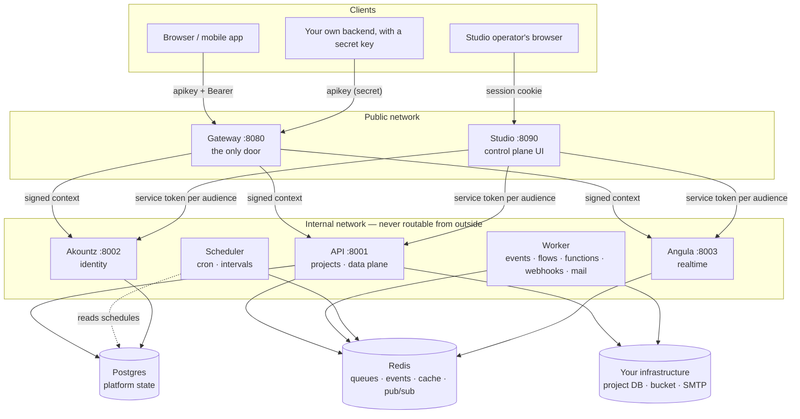
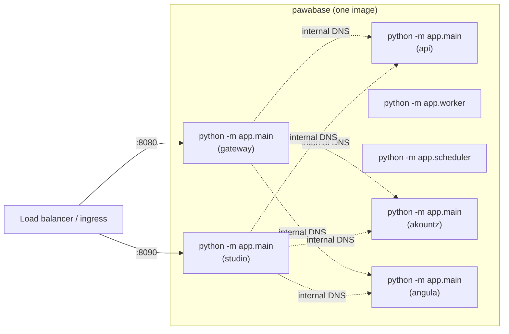
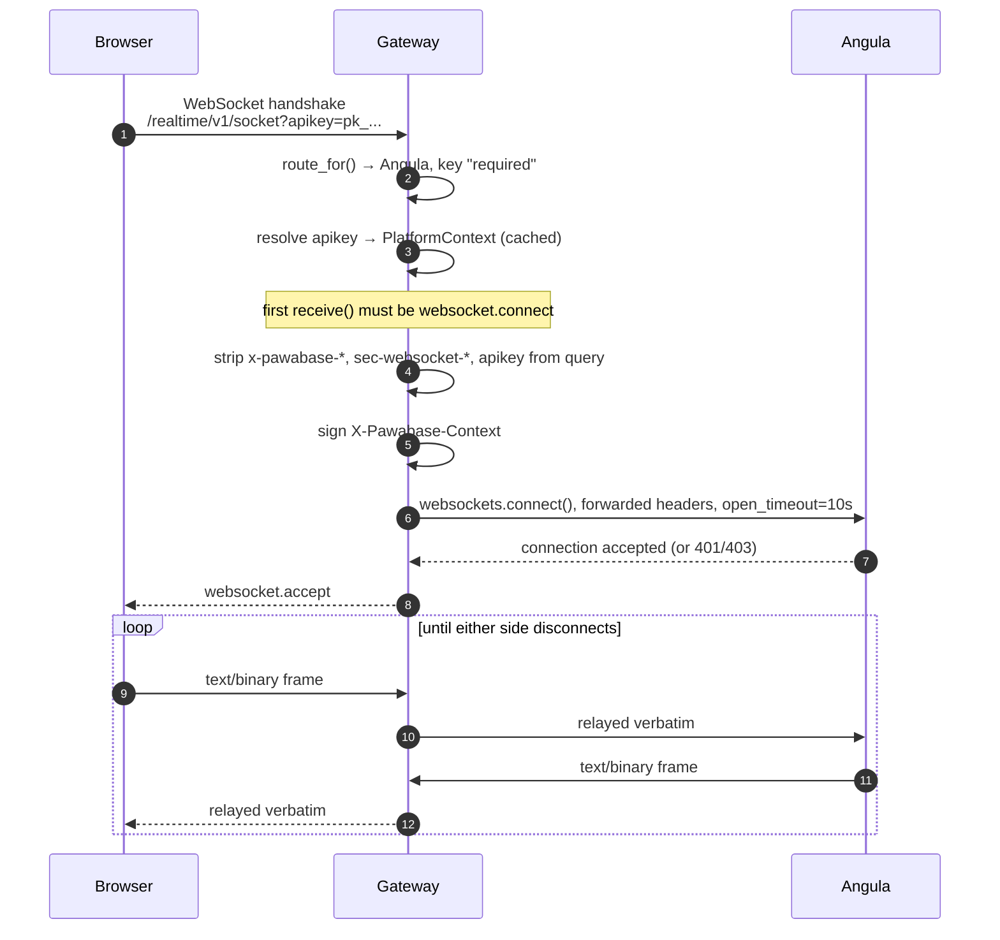
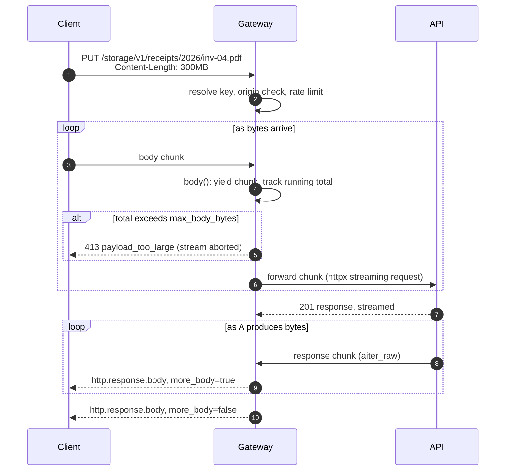

Pawabase is a small set of services with sharp boundaries. They share one Docker image and one library (the **kit**, `pawabase_kit`) but run as separate processes that talk over HTTP with audience-bound service tokens. No service reaches into another service's database, and no service trusts a header a client could have set — every internal call carries a credential the receiving service verifies itself.

This page is the systems map. It explains what each of the seven processes does, what it deliberately refuses to do, how a request actually moves through them (including the parts that don't look like ordinary request/response — WebSockets and large bodies), how the three kinds of internal credential are minted and checked, how the processes are meant to be deployed, and where Pawabase's own code begins once Sillo's primitives run out. If you're looking for *why* the platform is shaped this way rather than *how* it's wired, start with [The mental model](/concepts/mental-model) instead — this page assumes you already buy the shape and want the wiring.

<CardGroup cols={3}>
  <Card title="One origin" icon="door-open">Everything a client touches goes through the gateway. Internal hostnames, ports and even which service answers a path are never visible to a browser or an app.</Card>
  <Card title="One image" icon="box">Gateway, API, worker, scheduler, Akountz, Angula and Studio are the same container with a different entrypoint and environment variables. There's one thing to build and one thing to patch.</Card>
  <Card title="Sillo underneath" icon="layers">Routing, validation, auth, queues, scheduling, storage, mail, rate limits and realtime are Sillo. Pawabase adds the platform layer on top: projects, policies, flows, and the compiler that turns definitions into a running API.</Card>
</CardGroup>

## Topology, logically

This is the shape that matters when you're reasoning about a request: who calls whom, and over what. It doesn't say anything about how many machines or containers any of this runs on — that's the [deployment diagram](#topology-as-deployed) below.



A few things that are easy to miss on a first read of this diagram:

- **The arrow direction is the trust direction, not just the data flow.** The gateway and Studio issue credentials that the internal services verify; the internal services never issue anything upward.
- **Akountz owns its own tables in the platform Postgres**, separate from the API's project/environment/definition tables, but the same physical database in a typical install. They don't share a schema and never query each other's tables directly — everything Akountz knows that the API needs (roles, permissions, an `own_rows`-style `user_id`) travels inside a signed user token, not a join.
- **"Your infrastructure" is per project, per environment**, not a single shared thing. Each environment's compiled app connects to whatever database, storage bucket and SMTP relay that environment's settings name — commonly your own Postgres, S3-compatible bucket and mail provider. The API and worker are the only processes that ever touch it; Akountz, Angula, Studio and the gateway do not.
- **Angula never touches Postgres.** Its channel state, presence and replay history live in `sillo-wire`'s Redis-backed structures. If you run Angula without Redis it still works for a single instance, but presence and history won't survive a restart and multiple instances won't see each other's publications.

## Topology, as deployed

The logical diagram doesn't tell you how many *processes* actually exist, because "the worker" and "the scheduler" aren't separate images — they're the API's own code, started with a different entrypoint (or, in development, folded into the API process itself). Here is the same system drawn as running processes, which is the diagram you want when you're writing a `docker-compose.yml`, a Kubernetes manifest, or a Procfile:



Seven entrypoints, one `Dockerfile`. `e3` and `e4` (worker and scheduler) have no listening port at all — they poll Redis and Postgres respectively and never accept a connection. Everything else binds a port and answers HTTP (and, for the gateway and Angula, WebSockets too).

<Note>
In development, `sillo dev` (or the equivalent single-process launcher in the starter kit) typically runs the API with `inline_worker` and `inline_scheduler` turned on, so you see five things running instead of seven. That's a convenience for a laptop, not a different architecture — see [One image, many processes](#one-image-many-processes) for exactly what changes.
</Note>

---

## The services

Each subsection below answers the same five questions, because they're the ones you actually need answered when something's slow, down, or behaving strangely in production: what does it own, what does it deliberately never do, how do you scale it, what happens to the rest of the system when it's unreachable, and where's the code that proves it.

### Gateway — the only door

<Tabs>
  <Tab title="Role">
    The gateway is the single public entry point on port **8080**. Every request a browser, mobile app, or server integration makes goes through it; nothing else in the system is meant to be reachable from outside your network. It resolves the caller's API key, decides whether the call is even allowed to happen (origin, rate limit, body size), and if so hands it to the right internal service with a **signed context** the service can trust — then gets out of the way and streams the response back byte for byte.

    The gateway is deliberately thin. It has **no business logic**: it doesn't know what a "resource" or a "flow" is, doesn't touch a database, and doesn't decide who can read what. That's the API's, Akountz's and Angula's job. The gateway's only decisions are about *whether a request may proceed at all*, not about what it means.
  </Tab>
  <Tab title="Owns / never does">
    | Owns | Never does |
    | --- | --- |
    | The public route table (`/auth/v1`, `/rest/v1`, `/storage/v1`, …) | Evaluate a policy |
    | API key resolution and its cache | Read or write a project's data |
    | Per-key and per-IP rate limiting | Know what a resource, flow or schema is |
    | CORS/origin enforcement for publishable keys | Persist anything beyond its key cache |
    | Stripping headers a client could use to impersonate the platform | Trust a client-supplied `x-pawabase-*` header |
    | Signing the internal `X-Pawabase-Context` header | Terminate or transform WebSocket frames |
    | Streaming request and response bodies without fully buffering them | Retry a failed upstream call on the caller's behalf |
  </Tab>
  <Tab title="Scaling">
    Stateless and horizontally scalable without limit — run as many gateway replicas as you like behind a load balancer. Its only shared state is the key-resolution cache, which is safe to have cold or inconsistent per replica for a few seconds (each replica just re-resolves a key against the API's key-lookup endpoint on a cache miss). The rate limiter's backend (Redis in production, in-memory `"memory"` for a single instance or tests) is what actually needs to be shared for rate limits to be *correct* across replicas; with the in-memory backend, each replica enforces its own limit independently, which is fine for development and wrong for a multi-replica production deployment.
  </Tab>
  <Tab title="If it's unreachable">
    <Warning>
    Total outage from the outside. Nothing a browser, mobile app or external server sends can reach the API, Akountz or Angula, because they're not exposed directly. Studio, if deployed behind its own ingress, keeps working for operators — but any Studio feature that itself goes through the public origin (the embedded API docs' "try it" panel, for one) breaks too, since it's aimed at the gateway's public URL by design.
    </Warning>
  </Tab>
</Tabs>

<Accordion title="Source: services/gateway/app/proxy.py">
The whole gateway is essentially one class, `GatewayProxy`, an ASGI middleware. Its module docstring is worth reading in full — it's the shortest accurate description of what "proxy" means here:

```python services/gateway/app/proxy.py
"""Forwarding requests and WebSockets to the internal services.

For every proxied request the gateway:

1. finds the upstream from the route table (``/internal`` and ``/admin`` are
   never reachable from outside);
2. resolves the API key (``apikey`` or ``x-api-key`` header, or ``?apikey=`` for
   browser navigations and WebSockets) into a platform context;
3. enforces the environment's allowed origins for publishable keys, and the
   rate limit (Sillo's limiter, per key or client address);
4. removes anything a client could use to impersonate the platform
   (``x-pawabase-*`` headers) and the raw key itself;
5. adds the signed ``X-Pawabase-Context``, ``X-Request-ID`` and forwarding
   headers, and streams the request and the response through.

Streaming uses ``httpx`` directly: a proxy passes raw bytes and headers,
which Sillo's ``HTTPClient`` (a JSON client) is not built for.
"""
```

Both HTTP and WebSocket walkthroughs later on this page trace exactly this code.
</Accordion>

### API — projects and the data plane

<Tabs>
  <Tab title="Role">
    The API, on port **8001**, is the configuration authority. It owns projects, environments, and every definition kind (schemas, resources, routes, policies, transformers, flows, functions, storage buckets, mail templates, webhooks, subscriptions, schedules, keys and secrets). It compiles each environment's definitions into a real, running Sillo application — the "data plane" — and serves that compiled app's traffic under `/rest/v1`, `/storage/v1`, `/functions/v1`, `/flows/v1` and `/hooks/v1`. It also serves the **management plane** under `/platform/v1`, which is what Studio's bridge and any direct operator automation actually calls.

    Put differently: there are two APIs living in the same process. The **management API** (`/platform/v1`) is fixed — it's Pawabase's own Sillo application, with routes for creating projects, editing definitions, listing users, and so on. The **data API** (`/rest/v1` and friends) is *generated per environment* from whatever's currently defined for that environment, and is a different compiled `SilloApp` object for every `(project, env)` pair the API has recently served.
  </Tab>
  <Tab title="Owns / never does">
    | Owns | Never does |
    | --- | --- |
    | The platform Postgres tables: projects, environments, definitions, keys, secrets, jobs, audit log | Terminate a public connection directly (it's not exposed) |
    | Compiling and caching per-environment `SilloApp`s | Verify a client's raw API key (the gateway already resolved it) |
    | The event bus's emission side (`sillo.events.EventEmitter`) | Run a queued job itself (that's the worker) |
    | Storage, functions, flows and webhook *definitions* and their direct-invocation endpoints | Fire a schedule (that's the scheduler) |
    | OpenAPI/Atlas docs generation per environment | Manage user accounts, sessions or MFA (that's Akountz) |
  </Tab>
  <Tab title="Scaling">
    Horizontally scalable: it's stateless per request beyond its compiled-app cache, which is a pure function of the environment's definitions (any replica can rebuild it). Compiling an environment isn't free — it involves reading every definition and constructing routes, validation models and policy plans — so replicas that see traffic for many different environments will each pay that cost independently the first time they see a given environment. Bootstrap can also fold the **worker** and **scheduler** into this same process (`inline_worker`, `inline_scheduler` in `ApiSettings`); see [One image, many processes](#one-image-many-processes) for when that's appropriate and when it isn't.
  </Tab>
  <Tab title="If it's unreachable">
    <Warning>
    Everything that isn't identity or realtime stops. `/rest/v1`, `/storage/v1`, `/functions/v1`, `/flows/v1` and `/hooks/v1` all 502 at the gateway. Akountz keeps issuing and verifying tokens (sign-in still works), and Angula keeps relaying realtime traffic for channels that don't depend on the API — but any flow, function, resource write, or webhook delivery is unavailable. Studio degrades to whatever pages don't need `/platform/v1` (essentially none of them — the project list itself is a platform call).
    </Warning>
  </Tab>
</Tabs>

<Accordion title="Source: services/api/app/bootstrap.py — assembly order">
The bootstrap module's docstring explains something that matters if you're ever debugging *which middleware saw a request first*: Sillo builds middleware inside-out, so the last thing registered is the first thing that runs.

```python services/api/app/bootstrap.py
"""Assembling the API application. Start reading here.

Order matters, because Sillo builds middleware inside-out (the last registered
runs first):

1. ``create_service`` builds the ``SilloApp`` with its auth backends, then the
   platform-context middleware and telemetry (request ids) around it.
2. Record (the platform database) and the data-plane dispatcher are installed
   before that outer plumbing. The dispatcher therefore runs inside the context
   and telemetry middleware, and every ``/rest/v1`` request is traced and
   attributed to its project.
3. Routers are mounted most-specific first.
"""
```

Concretely, `create_app` builds the service like this:

```python services/api/app/bootstrap.py
app = create_service(
    "api",
    settings,
    title="Pawabase API",
    description="The Pawabase platform API: projects, resources, flows, events, jobs, storage and the management plane.",
    backends=[
        OperatorBackend(settings.jwt_master_secret),
        ProjectUserBackend(settings.jwt_master_secret),
    ],
    inner=[DataPlaneDispatcher(platform)],
    installables=[Record(database_config(settings), tuple(MODEL_MODULES))],
)
```

`inner=[DataPlaneDispatcher(platform)]` is the important part: the dispatcher is threaded in as middleware that runs *inside* `create_service`'s own context/telemetry middleware (which `create_service` adds automatically — see [Trust between services](#trust-between-services)), so by the time the dispatcher sees a request, the platform context is already verified and a request id already assigned.

`create_app` also decides, at startup, whether this process also runs an inline worker and/or an inline scheduler:

```python services/api/app/bootstrap.py
@app.on_startup
async def start_platform() -> None:
    await platform.start()
    rollup.start()
    from app.events import EventProcessor

    if settings.inline_worker:
        EventProcessor(platform).attach()
        from app.worker import start_inline_worker

        app.state["inline_worker"] = start_inline_worker(platform)
    if settings.inline_scheduler:
        from app.scheduler import PlatformScheduler

        scheduler = PlatformScheduler(platform)
        app.state["inline_scheduler"] = scheduler
        await scheduler.start()
```
</Accordion>

### The dispatcher: `/rest/v1` inside the API process

This deserves its own callout because it's the piece that makes "one API process serves every project's every environment" work at all, and it's easy to misread as a router when it's actually a full ASGI hand-off to a *different, independently-compiled application*.

`DataPlaneDispatcher` (`app/dispatch.py`) sits inside the context and telemetry middleware described above. For any path under `/rest/v1`, it:

1. reads the verified `PlatformContext` the gateway signed (project, env, role, key id, scopes) — if there isn't one, it answers `401 missing_api_key` itself, before the compiled app is even touched;
2. asks the `Platform` object for that environment's `state`, which raises a clean `401`/`404`-shaped `HTTPException` if the project or environment doesn't exist (`unknown_environment`);
3. calls `state.compiled()`, which returns the cached compiled `SilloApp` for that environment or builds and caches it;
4. rewrites the ASGI scope so the compiled app sees the request as if it were mounted at its own root — `path` has the `/rest/v1` prefix stripped, and `root_path` gains it, which is exactly how Sillo expects a mounted sub-application to be invoked;
5. calls the compiled app with that rewritten scope, and once it returns, copies a fixed set of scope keys back onto the *outer* scope — `user`, `auth`, `auth_scheme`, `route`, `pawabase.policy`, `pawabase.plan` — so telemetry and the outer request log can record what the inner app decided (which route matched, which policy ran, how the list query was planned) without the inner app needing to know telemetry exists.

```python services/api/app/dispatch.py
FORWARDED_KEYS = ("user", "auth", "auth_scheme", "route", "pawabase.policy", "pawabase.plan")
```

That last step is why a request id can follow a `/rest/v1` call all the way down into *which policy refused it*, in [Observability](/operate/observability) — the compiled app's decision leaks back out through the scope, not through logging conventions every route has to remember to follow.

### Worker — everything asynchronous

<Tabs>
  <Tab title="Role">
    The worker is the API's own code (same image, same `Platform` object, same job classes) running as `python -m app.worker` instead of an HTTP server. It runs Sillo `QueueWorker`s over the platform's queues — `events`, `webhooks`, `flows`, `functions`, `mail` and `default` — plus anything you add via `PAWABASE_WORKER_QUEUES`. It's where every asynchronous consequence of a request actually executes: an event fan-out, a flow triggered by `trigger.event` or `trigger.schedule`, an outbound webhook delivery and its retries, a queued function invocation, an outbound email.
  </Tab>
  <Tab title="Owns / never does">
    | Owns | Never does |
    | --- | --- |
    | Consuming and executing jobs on its queues | Accept an inbound HTTP request (it has no listening port) |
    | Retrying and eventually dead-lettering failed jobs (`RecordFailedJobRepository`) | Decide *when* a schedule fires (that's the scheduler; the worker just runs what it queues) |
    | Its own heartbeat row, so Studio can show it as running | Compile an environment (it reuses the API's `Platform`, which does) |
    | Concurrency (`WorkerOptions.concurrency`, default 4 for the standalone process, 2 for an inline worker) | Serve `/rest/v1` traffic |
  </Tab>
  <Tab title="Scaling">
    Scale it horizontally without ceremony — every replica is a fully independent consumer of the same queues, and Sillo's queue semantics handle multiple consumers safely. More replicas (or higher `concurrency` per replica, via `PAWABASE_WORKER_CONCURRENCY`) means more jobs processed in parallel. There's no coordination needed between worker replicas the way there is for the scheduler.
  </Tab>
  <Tab title="If it's unreachable">
    <Warning>
    Nothing crashes, but everything asynchronous backs up. Events still get emitted and queued, webhooks still get scheduled, flows triggered by an event or a schedule still get enqueued — they simply sit in Redis until a worker comes back and drains them. Direct, synchronous paths (a plain resource read/write, a directly-invoked flow or function under `/flows/v1`/`/functions/v1`) are unaffected, because those execute inline in the API process, not on a queue.
    </Warning>
  </Tab>
</Tabs>

<Accordion title="Source: services/api/app/worker.py — inline vs. standalone">
The same `build_worker` function backs both deployment shapes; only the surrounding lifecycle differs.

```python services/api/app/worker.py
def build_worker(
    platform: Platform, *, queues: list[str] | None = None, concurrency: int = 4, sleep: float = 1.0
) -> QueueWorker:
    import app.jobs  # noqa: F401  (every job class must be importable by name)

    queues = queues or worker_queues()
    manager = ConnectionManager()
    for name in queues:
        manager.add(name, platform.queue)
    return QueueWorker(
        manager,
        PayloadSerializer(),
        RecordFailedJobRepository(),
        options=WorkerOptions(concurrency=concurrency, queues=queues, sleep=sleep, timeout=300.0),
    )
```

`import app.jobs` right before building it isn't decorative — every job class has to be *importable by name* for the deserializer to reconstruct a queued payload back into a runnable job, so this import has to happen before the worker starts pulling messages, in every process that might run one (inline or standalone).

The standalone process additionally beats a heartbeat into `WorkerHeartbeat` every 10 seconds while running, and marks itself `stopped` on shutdown — this is exactly the table Studio's `/studio/status` endpoint reads to light up the Worker row (see [Studio](#studio-the-control-plane) below). An `InlineWorker` running inside the API process has *no heartbeat at all* — Studio's status check treats an in-process worker as alive purely from the fact that it's still running (`_recent()` in `services/studio/routes/__init__.py` special-cases workers with no `last_seen`: they count as up only while `worker.get("alive")` is true, which the API's own `/workers` endpoint reports from process state, not a stale row).
</Accordion>

### Scheduler — time, and only time

<Tabs>
  <Tab title="Role">
    The scheduler is `python -m app.scheduler`: another API-process entrypoint, this time running Sillo's `SchedulerManager`. Its only job is deciding *when* something should happen. It reconciles two sources of desired schedules every 15 seconds — standalone `Schedule` definitions (Studio's **Schedules** section) and any flow that has a `trigger.schedule` node with a `cron` or `every` config — against what it currently has registered in memory, adding new ones, re-registering changed ones, and dropping removed ones.
  </Tab>
  <Tab title="Owns / never does">
    | Owns | Never does |
    | --- | --- |
    | The single source of truth for *when* a schedule or scheduled flow fires | Execute the flow, function or event itself — it only queues or emits it |
    | Its own in-memory job table, reconciled from Postgres every `RECONCILE_SECONDS` (15s) | Retry a failed firing (that's the queued job's own retry policy, once it's in the worker's hands) |
    | `Schedule.last_run_at`, `last_status`, `run_count` bookkeeping | Hold open any client connection — it has no listening port either |
  </Tab>
  <Tab title="Scaling">
    <Warning>
    **Run exactly one.** Sillo's scheduler keeps its registered jobs in memory; it isn't a distributed lock or a leader-elected singleton. Two scheduler processes — two standalone processes, or one standalone plus `inline_scheduler=true` on an API replica, or two API replicas both with `inline_scheduler=true` — will each independently decide "it's time" and each independently queue or emit the same job. For a `trigger.schedule` flow that sends a daily digest email, that means two identical emails; for a schedule that charges a subscription, that means two identical charges. This is the one process in the whole topology that does **not** scale horizontally, ever.
    </Warning>
    A firing itself is cheap and safe to duplicate-avoid on the *consumption* side (the worker), because a firing doesn't do work directly — it enqueues a `RunFlowJob`/`RunFunctionJob` or emits an event, and that queued unit of work is what survives a scheduler restart. The danger is strictly about **two schedulers each producing that unit of work independently**, not about the worker processing it twice.
  </Tab>
  <Tab title="If it's unreachable">
    <Note>
    Nothing time-sensitive fires. Everything else in the system is unaffected — no request path depends on the scheduler being up, because it never handles a request. The failure mode is silent: schedules simply stop firing until the process comes back, with no error surfaced to a client anywhere. This is exactly why Studio's status page and [Observability](/operate/observability) both surface scheduler heartbeats explicitly — there's no other signal that it's missing.
    </Note>
  </Tab>
</Tabs>

<Accordion title="Source: services/api/app/scheduler.py — reconciliation, not a cron table">
The module docstring states the "run exactly one" rule directly, and explains *why* firing is decoupled from execution:

```python services/api/app/scheduler.py
"""The scheduler process: ``python -m app.scheduler``.

Runs Sillo's :class:`~sillo.work.scheduler.SchedulerManager`. Schedules live in
the database (Studio edits them, and flows can carry ``trigger.schedule``
nodes), so the process reconciles its registered jobs with the database every
few seconds: new schedules are added, changed ones re-registered, removed ones
dropped.

A firing decides *when*; the work itself is queued (a flow or function job) or
published (an event), so it survives a scheduler restart.

Run exactly one scheduler. Sillo's scheduler keeps its schedule in memory, and
two of them would each fire every job.
"""
```

`fire()` is the entire blast radius of a schedule tick — it dispatches a `RunFlowJob`/`RunFunctionJob` onto the worker's queues, or emits an event onto the bus, and records the outcome back onto the `Schedule` row if this was a standalone schedule (a flow's own `trigger.schedule` node has no row to update):

```python services/api/app/scheduler.py
elif spec["target_type"] == "event":
    await platform.bus.emit(
        spec["target"],
        project=project,
        env=env,
        payload=spec.get("payload"),
        actor="scheduler",
    )
    status = "emitted"
```
</Accordion>

### Akountz — identity

<Tabs>
  <Tab title="Role">
    Akountz, on port **8002**, is where a person becomes a user. It owns accounts, password hashing and verification, session and access-token issuance and revocation, email verification, password recovery, magic links, OAuth/OIDC sign-in, TOTP MFA and recovery codes, organizations, teams, invitations, and the roles/permissions that go into every user token — all of it scoped **per project environment**, so `acme/development` and `acme/production` have entirely separate users even though they share a project reference.

    It's also where the very first **platform operator** comes from: on startup, if `admin_email`/`admin_password` are set and no operator exists yet for the reserved `_platform` project, Akountz creates one directly and grants it the built-in `admin` role with `permissions=["*"]`.
  </Tab>
  <Tab title="Owns / never does">
    | Owns | Never does |
    | --- | --- |
    | Password hashes, session and token issuance/revocation, MFA secrets | Know what a "resource" or "policy" is — that's the API's vocabulary |
    | Roles, permissions, organizations, teams, invitations | Store project data of any kind |
    | The per-environment derived signing key for user access tokens | Talk to a project's own configured database, storage or SMTP |
    | The `_platform` project's operator accounts (Studio sign-in) | Decide access to a `/rest/v1` resource (policies do that, in the API, using claims Akountz put in the token) |
  </Tab>
  <Tab title="Scaling">
    Stateless per request beyond its own Postgres tables; scale it horizontally like the API. Its per-environment token signing key is *derived* (an HMAC of the master secret with the project and environment baked in), not stored, so any replica can verify or issue a token for any environment without a lookup or a shared cache.
  </Tab>
  <Tab title="If it's unreachable">
    <Warning>
    No one can sign in, sign up, verify an email, reset a password, or complete OAuth. Existing, unexpired access tokens keep working everywhere else, because the API and Angula verify them locally against the derived per-environment key — they don't call Akountz to check a token. Studio itself can't authenticate operators (its own sign-in goes through Akountz), so a Studio outage of this kind looks like "no one can log into Studio," even though the API and Angula are otherwise healthy.
    </Warning>
  </Tab>
</Tabs>

<Accordion title="Source: services/akountz/app/bootstrap.py — the first operator">
```python services/akountz/app/bootstrap.py
async def ensure_operator(akountz: Akountz) -> None:
    """Create the first platform operator from settings, once."""
    from app import rbac
    from app.accounts import create_account
    from app.environment import platform_config
    from database.models import AuthUser

    settings = akountz.settings
    if not settings.admin_email or not settings.admin_password:
        return
    if await AuthUser.filter(project=PLATFORM_PROJECT, env=PLATFORM_ENV).exists():
        return
    config = platform_config(akountz)
    user = await create_account(
        config,
        email=settings.admin_email,
        password=settings.admin_password,
        name="Administrator",
        verified=True,
    )
    await rbac.define_role(
        PLATFORM_PROJECT, PLATFORM_ENV, "admin",
        description="Full control of the platform", permissions=["*"],
    )
    await rbac.assign_role(user, "admin")
```
This only ever runs once — the `AuthUser.filter(...).exists()` guard means it's safe to leave `admin_email`/`admin_password` set across restarts; it won't recreate or reset the account if one already exists for `_platform`. Rotate the operator's password through Studio (or Akountz's own account-recovery flow) afterwards, the same as any other user.
</Accordion>

### Angula — realtime

<Tabs>
  <Tab title="Role">
    Angula, on port **8003**, is `sillo-wire` given a Pawabase identity. It manages channels ("rooms"), bounded per-peer message queues so one slow client can't back up the whole hub, replayable history for reconnecting clients, and presence (who's currently subscribed to a channel). Multiple Angula instances share publications with each other over Redis pub/sub, so a message published against one instance reaches subscribers connected to any other instance.
  </Tab>
  <Tab title="Owns / never does">
    | Owns | Never does |
    | --- | --- |
    | Open WebSocket connections and their channel subscriptions | Persist anything in Postgres |
    | Presence state and bounded replay history (Redis-backed, via `sillo-wire`) | Decide *what* to broadcast — the API's resources and flows decide that and publish through it |
    | Per-peer send queues and backpressure | Retry a message to a peer that's gone; a disconnected peer just misses it (replay history covers reconnects, not guaranteed delivery) |
    | A background prune loop (every 30 seconds) that disconnects peers `sillo-wire`'s hub has aged out | Run channel policies itself outside the credential it was handed — a service-role connection bypasses them entirely, by design |
  </Tab>
  <Tab title="Scaling">
    Horizontally scalable, and this is the one service where horizontal scaling changes *behavior* in a way worth understanding: with Redis pub/sub wired up, publishing to a channel on instance A is delivered to a subscriber connected to instance B. Without Redis (a single instance, or Redis misconfigured), realtime still works but only within one instance's own connections — fine for development, wrong for a multi-replica production deployment, in the same way the gateway's in-memory rate limiter is.
  </Tab>
  <Tab title="If it's unreachable">
    <Warning>
    Realtime stops: no new WebSocket connections, `/realtime/v1/*` 502s at the gateway, and any resource configured to broadcast on write silently has nothing to broadcast to (the write itself still succeeds — broadcasting is a side effect, not a dependency, the same way an outbound webhook failing doesn't roll back the write that triggered it). Everything under `/rest/v1`, `/auth/v1`, `/storage/v1`, `/functions/v1` and `/flows/v1` is completely unaffected.
    </Warning>
  </Tab>
</Tabs>

<Accordion title="Source: services/angula/app/bootstrap.py — pruning idle peers">
```python services/angula/app/bootstrap.py
async def prune() -> None:
    # sillo-wire leaves pruning cadence to the application.
    while True:
        await asyncio.sleep(PRUNE_SECONDS)
        for peer in await realtime.hub.prune():
            connection = realtime.connections.get(str(peer.id))
            if connection is not None:
                await realtime.disconnect(connection)
```
`sillo-wire` gives Angula the hub primitive but deliberately doesn't decide the pruning interval for you — that's an application concern, because how aggressively you want to reap idle peers depends on your own connection patterns. Angula's own choice is 30 seconds (`PRUNE_SECONDS`).
</Accordion>

### Studio — the control plane

<Tabs>
  <Tab title="Role">
    Studio, on port **8090**, is a Sillo + Inertia + React application — server-rendered navigation, client-rendered interactivity, no separate SPA build to deploy or version alongside an API. It's how a human designs a project: schemas, resources, policies, flows, functions, storage buckets, users, keys, secrets, schedules, and everything else definitions cover. It never touches a database directly. Every action a page takes, after the page itself has loaded, goes through Studio's own JSON **bridge** at `/studio/api/<target>/<path>`, which forwards the call to the real management endpoint on the API, Akountz or Angula with a **service token naming the signed-in operator**. The browser only ever talks to Studio's own origin; it never holds a credential the API, Akountz or Angula would accept directly.
  </Tab>
  <Tab title="Owns / never does">
    | Owns | Never does |
    | --- | --- |
    | Operator sign-in (sessions, CSRF) | Verify a project user's own access token — that's Akountz's and the API's job |
    | The Inertia page tree and the built React front end | Store project data, definitions, or platform state itself |
    | The bridge's `BRIDGE` table (`platform`, `auth`, `realtime`, `telemetry` → service + path prefix) | Let a bridge call escape its assigned path prefix (path-traversal segments like `..` are rejected before the call is made) |
    | The realtime console's WebSocket relay and its short-lived ticket issuance | Cache or persist anything the other services own; a Studio restart loses nothing but open sessions and the realtime console's live connections |
  </Tab>
  <Tab title="Scaling">
    Stateless beyond signed cookies (session + CSRF), so it scales horizontally the same way the gateway does, as long as sessions are signed with the same `session_secret`/`internal_secret` across replicas — otherwise a session minted by one replica won't verify on another.
  </Tab>
  <Tab title="If it's unreachable">
    <Note>
    Nothing a project's own users or clients do is affected — Studio isn't in the request path for `/auth/v1`, `/rest/v1`, `/storage/v1`, `/functions/v1`, `/flows/v1` or `/realtime/v1` at all. It's purely an operator tool. The practical impact is that no one can view or change definitions, users, keys or observability data through the UI until it's back; the platform API it drives (`/platform/v1`) is still reachable directly, with an operator bearer token, for anyone who needs to script around a Studio outage.
    </Note>
  </Tab>
</Tabs>

<Accordion title="Source: services/studio/app/bootstrap.py — three audience-bound clients">
```python services/studio/app/bootstrap.py
clients = clients or {
    "api": ServiceClient(
        settings.api_url,
        secret=settings.internal_secret,
        issuer="studio",
        audience="api",
        # Creating a project from a blueprint builds every environment in one call.
        timeout=120.0,
    ),
    "akountz": ServiceClient(
        settings.akountz_url,
        secret=settings.internal_secret,
        issuer="studio",
        audience="akountz",
    ),
    "angula": ServiceClient(
        settings.angula_url, secret=settings.internal_secret, issuer="studio", audience="angula"
    ),
}
```
Three separate `ServiceClient`s, not one generic HTTP client reused three ways — each is permanently addressed to one audience, so a token minted for `api` literally cannot be replayed against `akountz` (see [Trust between services](#trust-between-services)). Note the API client's generous 120-second timeout: building a project from a blueprint compiles every one of its environments in a single call, and that's slower than the sub-second calls the other two clients typically make.

Middleware order here matters in the opposite way you might expect from reading top to bottom:

```python services/studio/app/bootstrap.py
# Middleware added later runs first: sessions must exist before CSRF and
# Inertia look at the request.
inertia.middleware(app)
app.use(CSRFMiddleware(...))
app.use(SessionMiddleware(...))
```
Registration order is Inertia, then CSRF, then session — but because Sillo wraps middleware inside-out, the *execution* order per request is session → CSRF → Inertia → route handler. A session has to exist before CSRF can check its double-submit cookie, and CSRF has to pass before Inertia (and the route it's rendering) ever sees the request.
</Accordion>

---

## Two requests, followed all the way through

The [request lifecycle page](/concepts/request-lifecycle) walks a plain JSON `POST` end to end. Two request shapes behave differently enough at the gateway that they're worth their own walkthroughs: a **WebSocket** connection, which isn't request/response at all, and a **streaming** request/response, where the body is too large (or too slow) to buffer.

### A WebSocket connection, gateway to Angula

Say a browser opens `wss://your-app.example.com/realtime/v1/socket?apikey=pk_live_...` to subscribe to a channel. Here's everything that happens before the first message is relayed:



The parts that aren't obvious from the diagram:

1. **The key travels as a query parameter, not a header**, because a browser's native `WebSocket` constructor can't set custom headers on the handshake. The gateway's key resolver already accepts `?apikey=` for exactly this reason (it's the same resolver plain HTTP navigations use).
2. **The gateway waits for the first ASGI message and requires it to be `websocket.connect`** before doing anything else; anything else at that point is treated as a no-op close.
3. **If key resolution failed**, the gateway still completes the ASGI handshake far enough to send `websocket.close` with code `4001` and the error reason (`missing_api_key`, `invalid_api_key`, …) — a custom, application-level close code, not a rejected HTTP upgrade, so client libraries that only inspect close codes can distinguish "you're not allowed" from "the network died."
4. **Outgoing headers to Angula are filtered twice**: once through the same hop-by-hop/`x-pawabase-*`/`apikey` stripping every proxied request gets, and then again to drop anything starting with `sec-websocket` — those are handshake-specific and the `websockets` client library (used to make the *upstream* connection) sets its own.
5. **If Angula refuses the connection** — say, because the signed context names an environment that doesn't exist, or because a channel-level policy this context can't satisfy is checked at connect time — the gateway maps a `401`/`403` upstream response to close code `4003` ("upstream refused the connection"); anything else unreachable-shaped becomes `1011` (an internal-error close).
6. **Once accepted, the gateway is a pure relay.** Two `asyncio` tasks pump frames in each direction (`client_to_remote`, `remote_to_client`); the moment either side disconnects, the other task is cancelled and the remaining connection is closed with whatever close code the far side gave, or `1000` if none was given. The gateway never inspects, buffers, or interprets a single frame's contents.

<Tip>
Studio's own **Realtime console** is a second, structurally different WebSocket path worth knowing about: instead of going through the public gateway with a project API key, an operator's browser opens a socket straight to Studio (`/studio/ws/realtime`), authenticated by a short-lived signed **ticket** (fetched first over a normal, session-checked HTTP call, because Sillo's session middleware doesn't run on WebSocket scopes at all). Studio then relays that connection to Angula itself, using a **service**-role `PlatformContext` — which bypasses every channel policy, the same way a secret key bypasses resource policies. It's an operator's tool for watching, subscribing to, and publishing on *any* channel in an environment, not a demonstration of how an end user connects.
</Tip>

### A streaming request/response, gateway to API

Now say a client uploads a 300 MB file to `/storage/v1/<bucket>/<key>`, or downloads a large export from `/rest/v1/reports/export`. The gateway never holds the whole body in memory in either direction — this is the reason it uses `httpx` directly instead of Sillo's own `HTTPClient`, which is built around JSON payloads and isn't meant for this.



What makes this safe and correct, concretely:

- **The request body is an async generator, not a buffer.** `_body(receive)` pulls ASGI `http.request` messages as they arrive and `yield`s each chunk immediately, tracking a running total against `settings.max_body_bytes` (default 100 MB per [the request lifecycle page](/concepts/request-lifecycle)). Exceeding it raises inside the generator, which `_forward` catches as a plain `ValueError` and turns into `413 payload_too_large` — the client's upload is cut off rather than the gateway quietly buffering hundreds of megabytes to reject it only at the end.
- **The request is only actually built as a body when the method needs one.** `GET`, `HEAD`, `OPTIONS` and bodyless `DELETE` requests pass `content=None`; this avoids opening a body-reading generator (and thus committing to consume ASGI `receive()` messages) for requests that never send one.
- **The upstream call itself streams**: `await client.send(request, stream=True)` doesn't wait for the full upstream response before returning — headers come back immediately, and the body is read lazily.
- **The response is relayed with `response.aiter_raw()`**, chunk by chunk, as `more_body: True` frames, finishing with an empty `more_body: False` frame. `aiter_raw()` specifically — the *raw*, still-possibly-compressed bytes — which is also why the gateway strips the upstream's `content-encoding` header from what it forwards to the client: `httpx` may have already handled transport-level decompression internally depending on configuration, and forwarding a `content-encoding` header that no longer matches the bytes actually being sent would corrupt the response for the client. `content-length` is dropped for the same class of reason — the gateway doesn't know the final length up front when it's relaying chunks, so it lets the transport (chunked transfer encoding) describe framing instead.
- **Timeouts and unreachable upstreams degrade predictably**: `httpx.TimeoutException` becomes `504 upstream_timeout`, `httpx.TransportError` (the upstream refused the connection, DNS failed, etc.) becomes `502 upstream_unavailable`, both tagged with which `service` was involved so it's visible in logs and [Observability](/operate/observability) without guessing.
- **The response is always closed**, success or failure, in a `finally` block — a client that disconnects mid-download doesn't leak the upstream connection.

<Warning>
None of this is specific to `/storage/v1` — it's the same `_forward` code path for every proxied HTTP request, including a perfectly ordinary small `/rest/v1` call. Large or slow bodies are simply the case where it matters that this is how it works, rather than a special mode the gateway switches into.
</Warning>

---

## Public surface

The gateway presents one origin so internal topology never leaks into client code. Every path below is under whatever origin you point your DNS at — `https://api.your-app.example.com`, say — and every path *not* listed, along with anything starting `/internal/` or `/admin/`, is unreachable from outside no matter what a client sends; `route_for()` in the gateway's route table checks the blocked prefixes before it checks anything else.

| Public path prefix | Upstream | Key required? | Purpose |
| --- | --- | --- | --- |
| `/auth/v1/authorize/*`, `/auth/v1/callback/*`, `/auth/v1/links/*` | Akountz | No | OAuth/OIDC redirects, provider callbacks, magic-link and verification-email landing pages — browser navigations that carry no key, with the environment named in the path itself |
| `/auth/v1/*` (everything else) | Akountz | Yes | Sign-up, password grant, token refresh, MFA challenge/verify, sessions, organizations |
| `/rest/v1/*` | API | Yes | Resources, custom routes, extension routes — the compiled per-environment data API |
| `/storage/v1/signed/*` | API | No | Consuming a pre-signed URL — the signature itself is the credential |
| `/storage/v1/*` (everything else) | API | Yes | Object upload/download, listings, generating signed URLs |
| `/functions/v1/*` | API | Yes | Direct function invocation |
| `/flows/v1/*` | API | Yes | Direct flow invocation |
| `/hooks/v1/*` | API | No | Inbound webhooks from third parties, which don't carry a Pawabase key at all — the hook's own signature/secret is what authenticates it |
| `/docs/v1/*` | API | No | Public Atlas API reference, only while an environment has `public_docs` on |
| `/realtime/v1/*` | Angula | Yes | Socket handshake and HTTP publish/presence/history |
| `/platform/v1/*` | API | No | Management plane — it authenticates operators itself with bearer tokens (`OperatorBackend`), so it doesn't need a project API key at all |

<Note>
"Key required" here means the gateway's own key-resolution step. A `"No"` doesn't mean *unauthenticated* — it means the gateway doesn't gate the path on a project API key before forwarding it, because the upstream authenticates the request a different way (a webhook signature, a pre-signed URL's own signature, an operator bearer token, or a path that names its environment directly for a browser navigation that can't carry a header). The `Upstream` route table actually recognizes a third mode, `optional` — resolved when present but not required — though nothing in the current route table uses it yet.
</Note>

### Worked requests per prefix

<Tabs>
  <Tab title="Auth">
    ```bash
    # Sign up a new user in acme/production
    curl -X POST "$GW/auth/v1/signup" \
      -H "apikey: $PUBLISHABLE_KEY" -H "content-type: application/json" \
      -d '{"email": "ada@example.com", "password": "correct horse battery staple"}'

    # Password grant
    curl -X POST "$GW/auth/v1/token" \
      -H "apikey: $PUBLISHABLE_KEY" -H "content-type: application/json" \
      -d '{"grant_type": "password", "email": "ada@example.com", "password": "..."}'
    ```
  </Tab>
  <Tab title="REST">
    ```bash
    # List, filtered and paginated by whatever the caller's policy allows
    curl "$GW/rest/v1/invoices?page=2&page_size=20" \
      -H "apikey: $PUBLISHABLE_KEY" -H "Authorization: Bearer $USER_TOKEN"

    # Write, with a secret key (bypasses policies — server-side only)
    curl -X POST "$GW/rest/v1/invoices" \
      -H "apikey: $SECRET_KEY" -H "content-type: application/json" \
      -d '{"student_id": 12, "amount": 210000}'
    ```
  </Tab>
  <Tab title="Storage">
    ```bash
    # Upload, streamed through the gateway (see the walkthrough above)
    curl -X PUT "$GW/storage/v1/receipts/2026/inv-04.pdf" \
      -H "apikey: $SECRET_KEY" --data-binary @inv-04.pdf

    # Consume a signed URL — no apikey header at all
    curl "$GW/storage/v1/signed/receipts/2026/inv-04.pdf?token=..."
    ```
  </Tab>
  <Tab title="Functions & flows">
    ```bash
    curl -X POST "$GW/functions/v1/send-welcome-email" \
      -H "apikey: $PUBLISHABLE_KEY" -H "Authorization: Bearer $USER_TOKEN" \
      -H "content-type: application/json" -d '{"user_id": "8"}'

    curl -X POST "$GW/flows/v1/onboard-guardian" \
      -H "apikey: $PUBLISHABLE_KEY" -H "content-type: application/json" \
      -d '{"guardian_email": "chioma.nwosu@example.com"}'
    ```
  </Tab>
  <Tab title="Realtime">
    ```js
    const socket = new WebSocket(
      `wss://your-app.example.com/realtime/v1/socket?apikey=${publishableKey}`
    );
    socket.onopen = () => socket.send(JSON.stringify({ type: "subscribe", channel: "finance" }));
    ```
    ```bash
    # Server-side publish (secret key)
    curl -X POST "$GW/realtime/v1/publish" \
      -H "apikey: $SECRET_KEY" -H "content-type: application/json" \
      -d '{"channel": "finance", "event": "invoice.paid", "payload": {"id": 44}}'
    ```
  </Tab>
  <Tab title="Platform & hooks">
    ```bash
    # Management plane — an operator bearer token, no project apikey at all
    curl "$GW/platform/v1/projects" -H "Authorization: Bearer $OPERATOR_TOKEN"

    # Inbound webhook from a third party — its own signature authenticates it
    curl -X POST "$GW/hooks/v1/stripe" \
      -H "stripe-signature: t=...,v1=..." -H "content-type: application/json" -d '{...}'
    ```
  </Tab>
</Tabs>

---

## Trust between services

Three kinds of credential move through the system. Only two of them are verified by a genuine Sillo `AuthenticationBackend` the way you'd usually think of authentication — the platform context is verified earlier, by plain ASGI middleware, before any backend runs at all.

| Credential | Issued by | Carried as | Verified by |
| --- | --- | --- | --- |
| Platform context | Gateway (or Studio, for its own internal relays) | `X-Pawabase-Context` header — a short-lived JWT signed with the shared **internal secret** | `ContextMiddleware` — ASGI middleware, runs before every auth backend and binds a contextvar every service can read with `current_context()` |
| User access token | Akountz | `Authorization: Bearer <token>` — a JWT signed with a **per-environment derived key** | `ProjectUserBackend` (and `OperatorBackend`, the same mechanism scoped to the reserved `_platform` project, for calling the management plane directly without Studio) |
| Service token | Any service, minted per outgoing call | `X-Pawabase-Service` header — a short-lived JWT **addressed to one audience** | `ServiceBackend` |

Every hop carries Sillo's request id (`X-Request-ID`), so a single request can be followed across services in [Observability](/operate/observability).

### Platform context: what the gateway asserts

The context is a compact, signed statement of *which project, which environment, and with what role* a request is being made — it's what lets `DataPlaneDispatcher` answer "which compiled app handles this?" without the API re-resolving the key itself.

```python packages/kit/pawabase_kit/context.py
@dataclass(frozen=True, slots=True)
class PlatformContext:
    project: str
    env: str
    role: str = "anon"       # "anon", "service", or "operator"
    key_id: str | None = None
    scopes: tuple[str, ...] = field(default_factory=tuple)

    @property
    def is_service(self) -> bool:
        """Whether this credential bypasses policies."""
        return self.role in ("service", "operator")
```

`ContextMiddleware` verifies the header's signature (dropping it silently, rather than rejecting the request, if it's missing or invalid — public routes still need to work with no context at all) and binds the result both onto the ASGI scope (`scope["pawabase.context"]`) and onto a `contextvars.ContextVar`, which is how code that isn't holding an `HttpContext` directly — a flow step, a background job — still reaches `current_context()`.

A context token is intentionally short-lived (issued with `ttl=60` seconds by default) and re-minted for every request it accompanies; nothing holds onto one and replays it later.

### User access tokens: environment-scoped by construction

A user access token isn't just checked against a database — its very **signature** depends on the project and environment it belongs to. Akountz derives a distinct signing key per environment:

```python packages/kit/pawabase_kit/tokens.py
def derive_env_secret(master: str, project: str, env: str) -> str:
    """The signing key for one project environment's user tokens.

    Deterministic, so every service can verify without asking Akountz, and
    independent per environment, so compromising one key exposes one environment.
    """
    message = f"pawabase:user-token:{project}:{env}".encode()
    return hmac.new(master.encode(), message, hashlib.sha256).hexdigest()
```

This is why a token minted for `acme/development` fails verification against `acme/production` even with a technically-valid signature under some other key — it's signed with a completely different key, derived deterministically from the same master secret but with a different project/env baked into the HMAC input. `ProjectUserBackend.authenticate` reads the environment to verify against not from the token itself, but from the request's already-verified `PlatformContext`:

```python packages/kit/pawabase_kit/auth.py
async def authenticate(self, ctx) -> AuthResult:
    token = _bearer(ctx.headers)
    context = ctx.scope.get(SCOPE_KEY)
    if not token or context is None:
        return _FAIL
    claims = verify_user_token(
        token, self.master_secret, project=context.project, env=context.env
    )
    ...
```

So even a token that *would* verify against some environment fails outright if it doesn't match the environment the platform context (from the gateway's resolved API key) says this request belongs to — a stolen production token presented against a staging key, or vice versa, is rejected before Akountz's own claims are even inspected.

A user token carries `roles`, `perms`, `org`/`org_role`, `aal` (authentication assurance level — `aal2` once MFA has been completed), a user-editable `meta` block, and an administrator-only `app` block — the fields policies read as `$auth.roles`, `$auth.aal`, and so on, in the [policy context](/policies/overview#what-a-policy-can-see). Its default lifetime is 15 minutes (`ttl=900`); refresh flows mint a new one rather than extending an old one's life.

### Service tokens: addressed, short-lived, re-minted per call

A service token is how the internal services call each other's management endpoints, and how Studio's bridge acts *as* an operator without the browser ever holding a credential Akountz, the API or Angula would accept.

```python packages/kit/pawabase_kit/tokens.py
def issue_service_token(
    secret: str, *, issuer: str, audience: str,
    subject: str | None = None, claims: dict[str, Any] | None = None, ttl: int = 60,
) -> str:
    now = int(time.time())
    payload: dict[str, Any] = {
        SERVICE_ISSUER_CLAIM: issuer,          # "svc": who's calling
        "aud": f"pawabase:{audience}",         # who it's addressed to
        "iat": now, "exp": now + ttl,
        "jti": secrets.token_hex(8),
        "typ": "service",
    }
    if subject is not None:
        payload["sub"] = subject               # an operator id, if acting on their behalf
    if claims:
        payload.update(claims)                 # e.g. the operator's roles
    return sillo_jwt.encode(payload, secret)
```

The `aud` claim is what makes a token **addressed**: `verify_service_token` requires the exact audience it's checking against, so a token minted with `audience="angula"` fails verification at the API even though both share the same signing secret and the same `ServiceBackend` implementation. Every `ServiceClient` (Studio's three, and the gateway's implicit trust in its own context-signing) mints a **fresh token for every outgoing call** with a 60-second default `ttl` — nothing is cached or reused, so there's no long-lived internal credential sitting anywhere waiting to be leaked.

On the receiving end, `ServiceBackend` distinguishes two kinds of caller from the same header, by whether the token carries a `sub`:

```python packages/kit/pawabase_kit/auth.py
async def authenticate(self, ctx) -> AuthResult:
    token = ctx.headers.get(SERVICE_HEADER)   # "x-pawabase-service"
    if not token:
        return _FAIL
    claims = verify_service_token(token, self.secret, audience=self.audience)
    kind = "operator" if claims.get("sub") else "service"
    if kind == "service":
        claims.setdefault("roles", ["admin"])
    return AuthResult(success=True, identity=encode_identity(kind, claims), scope=kind)
```

A token with a `sub` (an operator id) identifies *that specific operator acting through the bridge* — the callee can apply that operator's own roles and permissions rather than treating the call as unconditionally privileged. A token with no `sub` is the platform calling as itself, and defaults to full (`admin`) rights on the callee, the same trust a secret key gets against policies.

<Warning>
Every service — gateway included, indirectly, through its role in signing contexts — shares one **internal secret** (`internal_secret`) across the whole installation. It signs platform contexts, service tokens, and (unless a separate `session_secret` is configured) even derives Studio's session-signing key. Treat it exactly like a database root password: it's what lets any process impersonate any other process to any other process. Rotating it means restarting every service at once — there's no dual-key rollover built in — so plan a maintenance window rather than rotating it casually.
</Warning>

### Worked example: an operator action reaching Akountz through the bridge

Say an operator, signed into Studio, clicks **Revoke session** on a user in the **Users** section. Here's the full credential chain, end to end:

```mermaid
sequenceDiagram
  autonumber
  participant Op as Operator's browser
  participant St as Studio
  participant Ak as Akountz
  Op->>St: DELETE /studio/api/auth/users/8/sessions/549136e9<br/>cookie: pawabase_studio<br/>X-XSRF-TOKEN
  St->>St: SessionMiddleware: who is this? (operator id)
  St->>St: CSRFMiddleware: double-submit cookie matches header
  St->>St: bridge(): target="auth" → BRIDGE["auth"] = (akountz, "/admin/v1/")
  St->>St: reject if path contains ".." (path-traversal guard)
  St->>St: issue_service_token(secret, issuer="studio",<br/>audience="akountz", subject=operator.id, claims={roles: operator.roles})
  St->>Ak: DELETE /admin/v1/users/8/sessions/549136e9<br/>X-Pawabase-Service: <token>
  Ak->>Ak: ServiceBackend.authenticate(): verify aud="pawabase:akountz"
  Ak->>Ak: claims.sub present → kind="operator"; apply operator's own roles
  Ak->>Ak: revoke session 549136e9
  Ak-->>St: 204
  St-->>Op: 204 (Inertia re-renders the sessions list)
```

The operator's browser never sees `admin_v1`, never sees Akountz's hostname, and never holds anything Akountz would accept directly — the session cookie authenticates the operator *to Studio*, and it's Studio's own `ServiceClient` that turns "this operator, doing this thing" into a token Akountz can verify on its own, addressed specifically to it.

---

## One image, many processes

All seven entrypoints — gateway, API, worker, scheduler, Akountz, Angula, Studio — are the same Docker image and the same `pawabase_kit` library, differing only in which module's `main()` the container command runs and which environment variables it's given. This has real consequences for how you're allowed to deploy it.

<Steps>
  <Step title="One artifact to build and patch">
    A dependency upgrade, a security patch, or a Sillo version bump touches one image. There's no matrix of "the gateway is on kit 1.4 but the worker is still on 1.2" to reason about, because there's exactly one build.
  </Step>
  <Step title="Choose a process topology per environment">
    Nothing about the image forces a particular number of running processes. The same image can run as seven separate containers/pods, as fewer containers each running multiple entrypoints under a process supervisor, or — for local development — as one process with the worker and scheduler folded inline.
  </Step>
  <Step title="Inline options exist for exactly one reason: fewer moving parts on a laptop">
    `ApiSettings.inline_worker` and `ApiSettings.inline_scheduler` fold the worker and/or scheduler into the API process's own event loop. `create_app`'s startup hook checks both independently:
    ```python services/api/app/bootstrap.py
    if settings.inline_worker:
        EventProcessor(platform).attach()
        app.state["inline_worker"] = start_inline_worker(platform)
    if settings.inline_scheduler:
        scheduler = PlatformScheduler(platform)
        app.state["inline_scheduler"] = scheduler
        await scheduler.start()
    ```
    An inline worker runs with lower concurrency (2, versus the standalone default of 4) and no heartbeat row — Studio's status check treats it as up purely from live process state, not a stale table row it forgot to clean up.
  </Step>
  <Step title="Never run more than one scheduler, inline or standalone">
    This is the one rule the flexible topology doesn't bend on. If any API replica has `inline_scheduler=true`, that replica **is** a scheduler for every purpose the standalone process would be — running two API replicas both with `inline_scheduler=true` is exactly as wrong as running two standalone `python -m app.scheduler` processes. Production topologies should run the scheduler as its own single-replica deployment (a Kubernetes `Deployment` pinned to `replicas: 1`, or equivalent) and leave `inline_scheduler` off everywhere else.
  </Step>
  <Step title="Worker and gateway scale independently of everything else">
    Because they're separate processes even when sharing the image, you can run three gateway replicas, six worker replicas, two API replicas, and one scheduler, all from the same build, tuned to your actual traffic shape rather than a fixed ratio.
  </Step>
</Steps>

<Tabs>
  <Tab title="Single container (development)">
    ```bash
    # One process, everything inline except Akountz, Angula and the gateway
    PAWABASE_INLINE_WORKER=true PAWABASE_INLINE_SCHEDULER=true \
      python -m app.main   # api, with worker + scheduler folded in
    python -m app.main     # akountz, separate process, different settings/port
    python -m app.main     # angula, separate process, different settings/port
    python -m app.main     # gateway, separate process, different settings/port
    python -m app.main     # studio, separate process, different settings/port
    ```
    Five processes instead of seven — still real service boundaries and real internal HTTP calls between them, just fewer things to start by hand. The `sillo dev`-style launcher in the starter kit typically drives exactly this shape.
  </Tab>
  <Tab title="Split services (production)">
    ```yaml
    # docker-compose.yml (excerpt) — same image, seven services
    services:
      gateway:  { image: pawabase, command: ["python", "-m", "app.main"], environment: { PAWABASE_SERVICE: gateway } }
      api:      { image: pawabase, command: ["python", "-m", "app.main"], environment: { PAWABASE_SERVICE: api, PAWABASE_INLINE_WORKER: "false", PAWABASE_INLINE_SCHEDULER: "false" }, deploy: { replicas: 3 } }
      worker:   { image: pawabase, command: ["python", "-m", "app.worker"], deploy: { replicas: 6 } }
      scheduler:{ image: pawabase, command: ["python", "-m", "app.scheduler"], deploy: { replicas: 1 } }
      akountz:  { image: pawabase, command: ["python", "-m", "app.main"], environment: { PAWABASE_SERVICE: akountz }, deploy: { replicas: 2 } }
      angula:   { image: pawabase, command: ["python", "-m", "app.main"], environment: { PAWABASE_SERVICE: angula }, deploy: { replicas: 2 } }
      studio:   { image: pawabase, command: ["python", "-m", "app.main"], environment: { PAWABASE_SERVICE: studio } }
    ```
    Every service reads `internal_secret`, database and Redis connection strings from the same environment convention; only `PAWABASE_SERVICE` (or the equivalent settings selector your entrypoint uses) and replica counts differ. `deploy: { replicas: 1 }` on the scheduler isn't a suggestion.
  </Tab>
</Tabs>

<Warning>
Nothing in the image or the framework *enforces* "run exactly one scheduler" at runtime — there's no leader election, no distributed lock, no startup check that refuses to boot a second one. It's an operational discipline your deployment topology has to uphold, the same way "don't point two migration runners at the same database at once" is a discipline rather than something the tooling stops you from doing.
</Warning>

---

## Built on Sillo

Pawabase follows **Sillo first**: if Sillo ships the primitive, Pawabase uses it rather than reimplementing it. This is the same discipline you can see directly in the code above — `create_service` builds on `SilloApp`, `AuthenticationBackend`, and Sillo's own middleware ordering rules; the worker and scheduler are `sillo.work.queue.QueueWorker` and `sillo.work.scheduler.SchedulerManager` with Pawabase's own job classes and reconciliation logic layered on top, not new queue or cron engines.

| Capability | Sillo primitive | Where you saw it on this page |
| --- | --- | --- |
| Routing, validation, DI | `SilloApp`, `Router`, `request_model`/`response_model`, `Depend` | Every service's `register_routes` |
| Per-environment APIs | A compiled `SilloApp` per environment | `DataPlaneDispatcher`, `state.compiled()` |
| Docs | Sillo OpenAPI + Atlas | Studio's embedded API docs, `/docs/v1` |
| Users, passwords, tokens | `sillo.users`, `sillo.auth.jwt_auth` | Akountz's account and session handling |
| API keys | `sillo.auth.apikey` | The gateway's `KeyResolver` |
| Roles & permissions | `sillo.permissions` | User token claims, policy `role`/`permission` conditions |
| OAuth / OIDC | `sillo-oauth` | Akountz's `/auth/v1/authorize`, `/auth/v1/callback` |
| Database & migrations | `sillo.record` | `Record(database_config(settings), MODEL_MODULES)` in every service's `installables` |
| Events | `sillo.events.EventEmitter` | The API's event bus, `platform.bus.emit(...)` |
| Queues & workers | `sillo.work.queue` | `QueueWorker`, `ConnectionManager`, `WorkerOptions` |
| Scheduling | `sillo.work.scheduler` | `SchedulerManager`, `CronTrigger`, `IntervalTrigger` |
| Cache | `sillo.cache` | Compiled-app and key-resolution caching |
| Storage | `sillo.storage` | `/storage/v1` |
| Mail | `sillo.mail` | The `mail` queue, mail templates |
| Rate limits, CORS | `sillo.security` | `RateLimitMiddleware` in the gateway, `CSRFMiddleware` in Studio |
| Realtime | `sillo-wire` | Angula's hub, presence, replay history |
| Studio's UI layer | `sillo-inertia` | `Inertia`, `vite_react`, `render`/`redirect`/`back` |

### What Pawabase adds beyond Sillo

Sillo stops at "here's a well-built API framework with auth, a database layer, queues, scheduling and realtime primitives." Pawabase adds the layer that turns those primitives into a **platform** — the part that lets a project be *defined as data* and reasoned about without reading code.

<AccordionGroup>
  <Accordion title="The policy engine" icon="shield-check">
    Sillo's `auth` module gets you an authenticated request; it has no opinion on "may this specific caller do this specific thing to this specific row." That's the policy engine: JSON conditions, evaluated against a context (auth, request, record, input), that plan themselves into SQL `WHERE` clauses where they can and fall back to per-row checks where they can't — the same engine behind every resource, route, function, flow, bucket and channel decision in the system. See [Policies](/policies/overview) for the complete picture, including why lists are planned rather than filtered after the fact.
  </Accordion>
  <Accordion title="The flow engine and blocks" icon="git-branch">
    Sillo has no concept of a visually-composed, trigger-driven pipeline. Flows are Pawabase's own runtime: a graph of typed blocks (`trigger.*`, `policy.check`, data operations, integrations) compiled and executed by the platform with service-level rights, independent of whatever resource policies might otherwise apply to the same data.
  </Accordion>
  <Accordion title="The schema compiler" icon="cpu">
    Turning a stored resource definition — fields, types, constraints, an owner field, operation policies — into an actual, validating, documented Sillo route (`request_model`, `response_model`, the OpenAPI shape, the policy plan) is Pawabase's compiler. This is the code `state.compiled()` runs, cached per environment, and it's what makes editing a resource in Studio take effect on the next request with no restart.
  </Accordion>
  <Accordion title="Transformers" icon="wand-sparkles">
    Shaping what a resource operation returns — renaming fields, omitting sensitive ones, computing derived values — without hand-writing a serializer for every resource. Transformers are data too, the same way policies and resources are, and (as the [policies page's common mistakes](/policies/overview#common-mistakes) notes) they shape output, not access; they're deliberately not a substitute for a policy.
  </Accordion>
  <Accordion title="TOTP" icon="key-round">
    Akountz's MFA support — TOTP secret provisioning, verification, and recovery codes — is Pawabase code sitting on top of Sillo's session and token primitives, not a Sillo feature. It's what lets a user token carry `aal2` after a second factor, which policies can then require with the built-in `mfa` shorthand.
  </Accordion>
  <Accordion title="Job tracking" icon="list-checks">
    Sillo's `QueueWorker` runs jobs; it doesn't give you a `WorkerHeartbeat` table, per-job status history, or a failed-job repository with the retry bookkeeping Studio's **Jobs** section reads. That accounting layer — `RecordFailedJobRepository`, the heartbeat rows both the worker and the scheduler write every 10 seconds — is Pawabase's, built on Sillo's `sillo.record` for the storage.
  </Accordion>
  <Accordion title="Streaming proxying in the gateway" icon="waypoints">
    Sillo's own `HTTPClient` is a JSON-oriented client; it isn't designed to relay arbitrary-sized bodies and raw headers between an inbound and an outbound ASGI connection with backpressure. The gateway's `httpx`-based streaming forward — everything covered in the [streaming walkthrough](#a-streaming-requestresponse-gateway-to-api) above — is Pawabase-specific plumbing built directly on `httpx` and raw ASGI, alongside Sillo's own `RateLimitMiddleware` for the parts that *are* general-purpose.
  </Accordion>
</AccordionGroup>

---

## Troubleshooting & FAQ

<AccordionGroup>
  <Accordion title="Why did my request time out at the gateway but succeed against the API directly?">
    The gateway applies its own `upstream_timeout` (from `GatewaySettings`) independently of whatever timeout the API itself is configured with, and it's watching the *whole* round trip including connection setup, not just the API's own handler time. A slow compile of a rarely-hit environment's `SilloApp` (the first request after a definition change, or after a long idle period evicts the cache), a cold database connection pool, or plain network latency between the gateway and the API can each individually exceed the gateway's window while the API, given more time (or hit a second time, once its cache is warm), answers fine. Check the gateway's `504 upstream_timeout` body — it names the `service` involved — and compare `upstream_timeout` against how long the same request takes calling the API's internal address directly.
  </Accordion>
  <Accordion title="Can I run Akountz and Angula in the same process as the API?">
    Not as shipped — each is its own `SilloApp` built by its own `create_app`, with its own settings, its own `Record` installable pointed at its own tables, and its own port. There's no supported "mount Akountz's routes inside the API's app" mode analogous to `inline_worker`/`inline_scheduler`. The inline options exist specifically for the worker and scheduler because those aren't HTTP servers with their own route trees — they're background loops that happen to reuse the API's `Platform` object. Akountz and Angula are full services with their own identity and their own listening port; keep them separate processes even in a minimal development setup.
  </Accordion>
  <Accordion title="What happens if I run two schedulers?">
    Both independently reconcile the same `Schedule` rows and the same flows' `trigger.schedule` nodes against their own in-memory job table, and both independently decide when a cron expression or interval has elapsed. Every firing — a queued flow run, a queued function run, an emitted event — happens **twice**, once from each scheduler, with no deduplication anywhere in the path. For an idempotent action (recomputing a cached report) this is wasteful but harmless; for a non-idempotent one (charging a card, sending a digest email, incrementing a counter) it's a correctness bug in production. See [Scheduler → Scaling](#scheduler-time-and-only-time) — this is the one process in the topology where "just add a replica" is actively wrong.
  </Accordion>
  <Accordion title="Why does a token issued in staging fail in production?">
    By construction. User access tokens are signed with a key `derive_env_secret(master, project, env)` derives deterministically from the project *and* environment — `acme/staging` and `acme/production` get different signing keys from the same master secret, and `ProjectUserBackend` verifies against the environment named by the request's own platform context, not anything the token itself claims. A token minted for one environment cryptographically cannot verify against another, on purpose — it's the mechanism, not a misconfiguration, and it's the same reason a leaked staging token is worthless against production.
  </Accordion>
  <Accordion title="Why did my WebSocket close immediately with code 4001?">
    `4001` is the gateway's own application-level close code for a failed key resolution at connect time — the same failure an HTTP request to `/realtime/v1/*` would answer with `401` for. Check that `?apikey=` is present on the connection URL (browsers can't set the `apikey` header on a native WebSocket handshake) and that the key is valid and unrevoked for the environment you're targeting. `4003` means the key resolved fine but Angula itself refused the connection (a `401`/`403` from upstream) — a policy or environment-level check, not a gateway-level one.
  </Accordion>
  <Accordion title="Can the worker and the API disagree about a schema or policy?">
    Not for long, and not silently. Both read the same `Platform`/environment `state`, compiled from the same stored definitions in the same Postgres tables — the worker isn't running a separately-deployed copy of your resource or flow definitions, it's running the identical `Platform` object type the API uses, against the same database, usually (in the inline case, literally the same process). A standalone worker and a standalone API each cache a *compiled* environment independently, so there's a brief window right after a definition change where one has refreshed its cache and the other hasn't — on the order of the cache's own invalidation delay, not an ongoing drift.
  </Accordion>
  <Accordion title="Why does Studio show a service as 'unknown' instead of 'up' or 'down'?">
    `"unknown"` specifically means the API is reachable (so Studio could ask about workers) but no worker or scheduler heartbeat matching that kind has been seen recently enough to count — see `_recent()` in `services/studio/routes/__init__.py`, which treats a heartbeat older than 10 minutes as stale for a standalone process. It's distinct from `"down"` (a heartbeat exists and says it stopped, or existed recently and went silent) and usually means either the process has never been started in this environment, or the heartbeat table itself hasn't been reached (an inline worker with `alive=false` reported, for instance).
  </Accordion>
  <Accordion title="Does a Studio outage affect my project's end users?">
    No, structurally — Studio isn't in the request path for anything under `/auth/v1`, `/rest/v1`, `/storage/v1`, `/functions/v1`, `/flows/v1` or `/realtime/v1`. It only mediates operator actions (creating a project, editing a resource, viewing observability data) through its bridge to `/platform/v1` and the other services' internal endpoints. An operator scripting directly against `/platform/v1` with a bearer token from Akountz's `OperatorBackend` can do everything Studio's UI does, without Studio running at all — that's exactly the escape hatch `OperatorBackend` exists for.
  </Accordion>
  <Accordion title="Why did a service call fail with 'not a service token' or an audience mismatch, even though the internal secret is definitely correct?">
    Service tokens are signed with the shared internal secret but *addressed* to one audience via the `aud` claim (`pawabase:<audience>`), and `verify_service_token` requires an exact match. This surfaces most often after a copy-paste of a `ServiceClient` construction with the wrong `audience=` argument, or a manual internal call built by hand without going through a `ServiceClient` at all. Check that the audience matches the *receiving* service's own name exactly (`api`, `akountz`, `angula`, or `studio`) — the secret being right is necessary but not sufficient.
  </Accordion>
</AccordionGroup>

## Next steps

<CardGroup cols={2}>
  <Card title="The mental model" icon="brain" href="/concepts/mental-model">Why the platform is shaped this way — definitions as data, one engine per concern.</Card>
  <Card title="The life of a request" icon="route" href="/concepts/request-lifecycle">One `POST` followed end to end, with every failure mode and status code along the way.</Card>
  <Card title="Credentials" icon="key" href="/concepts/credentials">Publishable vs. secret keys, scopes, and how a client should actually hold them.</Card>
  <Card title="Projects and environments" icon="folder-tree" href="/concepts/projects-and-environments">What an environment is, how promotion works, and what's per-environment vs. per-project.</Card>
  <Card title="Studio" icon="layout-dashboard" href="/concepts/studio">What the control plane is for, beyond the bridge mechanics covered here.</Card>
  <Card title="Observability" icon="activity" href="/operate/observability">Following one request id across every service it touched.</Card>
  <Card title="Definitions as data" icon="file-json" href="/concepts/definitions-as-data">Why everything on this page — resources, policies, flows — is stored, versioned data rather than code.</Card>
  <Card title="Glossary" icon="book-marked" href="/concepts/glossary">Every term on this page, defined in one place.</Card>
</CardGroup>
