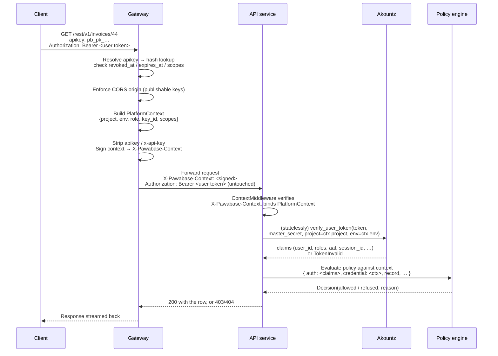

Every request that reaches a Pawabase backend answers two questions separately, and it is worth holding them apart from the very first line of this page because almost every credential bug traces back to conflating them:

1. **Which project environment, with which privileges?** Answered by the **API key** (`apikey` / `x-api-key`, or `?apikey=` where headers can't be set). The gateway resolves this into a signed platform context before your request ever reaches a service.
2. **Which person, if any, is calling?** Answered by the **user access token** (`Authorization: Bearer …`), verified independently, and only meaningful *within* the environment the API key already selected.

A request can have an API key with no user token (an anonymous visitor), a user token with no meaningfully-restrictive key (a secret key acting on a user's behalf), or, in the overwhelming majority of real traffic, both together. Neither one substitutes for the other, and neither one is optional in the way you might expect if you've used platforms that fold "who" and "what environment" into a single token. Pawabase keeps them apart because they answer different questions, are issued by different systems (the gateway's key resolver for the first, Akountz for the second), have different lifetimes, and — most importantly — fail independently and safely: an expired user token still leaves the API key's environment scoping intact, and a revoked API key stops a request before a user token is even inspected.

This page is the complete reference for every kind of credential in the system: what it proves, where it is issued, how it is carried on the wire, how it is verified, whether it bypasses policies, and where it must never be allowed to appear. If you've read [Policies](/policies/overview), you've already seen the `credential` and `auth` sections of the policy context in passing; this page is where those sections are defined in full, with the source-level mechanics behind them.

<CardGroup cols={3}>
  <Card title="Two independent checks" icon="check-double">The API key decides the environment and baseline privilege. The user token, if present, decides identity — and only within that environment.</Card>
  <Card title="Service credentials bypass policies" icon="shield-off">Secret keys and operator/service credentials are trusted by construction. Nothing about them is evaluated by the policy engine.</Card>
  <Card title="Everything is verified statelessly" icon="signature">Keys are hashed and looked up once at the gateway; tokens are signed and verified by every service without a database round trip.</Card>
</CardGroup>

## The full taxonomy

Before diving into any one credential in depth, here is every kind that exists in the system, side by side. Treat this table as the index for the rest of the page — every row links to its own section below.

| Credential | What it proves | Issued by | Carried as | Verified by | Bypasses policies | Must never appear |
| --- | --- | --- | --- | --- | --- | --- |
| [No user token, publishable key](#anonymous-access) | Nothing about identity; only that the caller has a valid publishable key for this environment | — (absence of a token) | — | — (there is nothing to verify) | No | — |
| [Publishable key](#api-keys) | The caller is entitled to touch this project environment at the `publishable` privilege level | Studio / Platform API, at key creation | `apikey` or `x-api-key` header, or `?apikey=` | The gateway's key resolver (hash lookup + expiry/revocation check) | No | Nowhere it's *secret* — it's designed to be public, but still shouldn't leak across environments |
| [Secret key](#api-keys) | The caller is trusted as the backend itself for this project environment | Studio / Platform API, at key creation | `apikey` or `x-api-key` header, or `?apikey=` | The gateway's key resolver | **Yes** | Browsers, mobile app bundles, client-side JavaScript, public repositories, logs |
| [User access token](#user-access-tokens) | A specific signed-in person, with roles, permissions, org and MFA level, in one specific project environment | Akountz, via `POST /auth/v1/token` | `Authorization: Bearer <token>` | Every service, statelessly, via `ProjectUserBackend` | No | URLs, logs, long-term client storage without rotation |
| [Refresh token](#refreshing-and-revocation) | The right to mint a new access token for the same session, without re-authenticating | Akountz, alongside the access token | Request body of `POST /auth/v1/token/refresh` (never a header) | Akountz only — no other service ever sees it | N/A (it never authorizes a resource request directly) | Anywhere but Akountz's refresh call and secure client storage |
| [Operator session](#operators) | A signed-in Studio operator, carried as an HTTP-only cookie | Akountz, for the reserved `_platform` project, on Studio sign-in | Secure, HTTP-only session cookie | Studio's backend, then relayed to services as a service token | **Yes** (operator actions act with service rights) | Anywhere outside the browser/Studio session — it is not a bearer token and isn't meant to be copied |
| [Operator token](#operators) | A platform operator authenticating directly against a service, bypassing Studio's browser session | Akountz, `POST /auth/v1/token` against `_platform` | `Authorization: Bearer <token>` | `OperatorBackend`, which pins `project=_platform`, `env=_platform` | **Yes** | Client apps of *your* project — this is a platform-operator credential, not a project-user credential |
| [Service token](#service-tokens) | One Pawabase service calling another, optionally on behalf of an operator | The calling service, minted for a specific destination audience | `X-Pawabase-Service` header | `ServiceBackend`, which checks the token's audience against the receiving service's name | **Yes** | Anywhere outside internal service-to-service calls; it is meaningless (and rejected) outside the platform's own network |
| [Signed platform context](#how-the-pieces-fit-together) | Which project, environment, role, key id and scopes the gateway already resolved | The gateway, from the resolved API key | `X-Pawabase-Context` header, internal only | `ContextMiddleware` on every internal service | N/A — it's the *substrate* other checks build on | Outside the trusted network between gateway and services; the gateway strips any client-supplied `x-pawabase-*` header before forwarding |

<Note>
Two rows say "Bypasses policies: Yes" for different reasons. A **secret key** bypasses policies because its `role` is `service` in the resolved `PlatformContext`. An **operator or service credential** bypasses policies because `PlatformContext.is_service` is `True` whenever `role` is `"service"` **or** `"operator"` — both are treated as service-grade trust by the same single property. They are not the same credential, but the policy engine cannot and does not distinguish them: both simply skip the check.
</Note>

## Anonymous access

"Anonymous" doesn't mean *no API key* — the gateway requires a valid `apikey` on essentially every routed path, and a request with no key at all is rejected with `401 missing_api_key` before it reaches any service. "Anonymous" means *no user access token*: a publishable key, on its own, describing a visitor nobody has identified yet.

This is the normal, expected state for a public-facing app before sign-in: browsing a catalogue, loading a sign-up form, or reading anything a policy has explicitly opened to the public. In the policy context this shows up as:

```json
{
  "authenticated": false,
  "kind": "anon"
}
```

and any policy built around `{"authenticated": true}` — or the `authenticated` built-in — refuses it outright. Anonymous access is never a *privilege escalation* risk in itself: it can only ever reach what a policy, or a resource's public defaults, deliberately allow. It becomes a problem only when an operation's policy is more permissive than intended, which is exactly what the [common mistakes](/policies/overview#common-mistakes) section of the policies page warns about.

## API keys

Every request that reaches a project's data plane carries exactly one API key, and that key's **role** sets the ceiling on what the request can do before any user identity or policy is considered.

| Role | Prefix | Where it lives | What policies see | What the gateway enforces |
| --- | --- | --- | --- | --- |
| **Publishable** | `pb_pk_…` | Browsers, mobile apps, anything public | `credential.role = "publishable"`, `is_service = false`: every policy applies | Allowed-origins / CORS check on the `Origin` header |
| **Secret** | `pb_sk_…` | Servers, CI, scripts you control | `credential.role = "secret"`, `is_service = true`: **policies are bypassed** | No origin restriction — secret keys aren't expected to come from a browser at all |

Send the key as the `apikey` header, or `x-api-key` if that's more natural for your HTTP client or proxy layer — the gateway checks both, in that order, before falling back to the query string. For browser navigations and WebSocket connections, which can't always set custom headers, `?apikey=` works too; the gateway strips it from the query string before the request (or the WebSocket upgrade) is forwarded, so it never reaches your services or shows up in upstream access logs.

<Warning>
A secret key is equivalent to root access to that environment's data. It bypasses every policy you've written, exactly like an operator session. Never ship it in a client bundle, commit it to a repository, put it in a URL, or log it verbatim. If one leaks, [revoke it and rotate](#rotating-a-leaked-secret-key-a-runbook) immediately — a leaked secret key is not a "rotate when convenient" situation.
</Warning>

### How the gateway resolves a key

The gateway's key resolver is the only place in the system that ever sees a plaintext API key. Here's what it does with one, in order:

<Steps>
  <Step title="Locate the raw key">
    Checks the `apikey` header, then `x-api-key`, then the `apikey` query parameter (used for browser navigations and WebSocket upgrades, where custom headers aren't available). The first one found wins.
  </Step>
  <Step title="Hash and look up">
    The raw key is never stored — the resolver hashes it (SHA-256, via `sillo.auth.apikey.hash_api_key`) and looks up a `ProjectKey` row by `key_hash`. A key that doesn't match any hash is rejected with `invalid_api_key`.
  </Step>
  <Step title="Check revocation and expiry">
    A row with `revoked_at` set, or `expires_at` in the past, is treated the same as an unknown key: `invalid_api_key`. There is no partial-trust state for a revoked or expired key.
  </Step>
  <Step title="Build a PlatformContext">
    The resolved `project`, `env`, `role` (`publishable` keys resolve to the `anon` role internally, `secret` keys to `service`), `key_id` and `scopes` become a `PlatformContext`.
  </Step>
  <Step title="Enforce CORS for publishable keys">
    If the resolved role is `anon` and the environment has `cors_origins` configured, the request's `Origin` header must be in that list or the gateway refuses it with `403 origin_not_allowed` — before the request is proxied anywhere.
  </Step>
  <Step title="Strip the raw key and sign the context">
    The `apikey` / `x-api-key` header (and the `apikey` query parameter) are removed from what's forwarded. In their place, the gateway signs the resolved context and adds it as `X-Pawabase-Context`, an internal-only header no client can forge — any `x-pawabase-*` header a client sent is stripped first.
  </Step>
</Steps>

<Note>
Nothing downstream of the gateway ever sees a raw API key. Internal services trust `X-Pawabase-Context` because it's a signed token they verify themselves; they never re-run the hash lookup. That's what makes verification statelessly fast everywhere except the one hop where the key is actually resolved.
</Note>

### Scopes

A key — publishable or secret — can be limited to **scopes**, an optional JSON list stored on the `ProjectKey` row. This is a *separate* mechanism from policies: it's enforced by the entry point before a policy ever runs, and it applies even to secret keys, which is the one place a secret key's power can be deliberately narrowed.

The rule that decides whether a key's scopes permit a given scope string is short enough to read directly — this is `PlatformContext.allows_scope`, unchanged from the kit:

```python
def allows_scope(self, scope: str) -> bool:
    """Whether the key's scopes permit *scope* (``resource:read`` etc.)."""
    if not self.scopes:
        return True
    family = scope.split(":", 1)[0]
    return scope in self.scopes or f"{family}:*" in self.scopes or "*" in self.scopes
```

Three things follow directly from that logic, and they're worth internalizing because they're easy to get backwards:

1. **An empty scopes list means unrestricted**, not "no access." A key created without specifying scopes can do everything its role allows. Scoping is opt-in, not a default lockdown.
2. **Scopes are checked by family, not just exact match.** A scope like `resource:write` is granted if the key's list contains `resource:write` verbatim, `resource:*` (the whole family), or `*` (everything, any family).
3. **The family is everything before the first colon.** `reports:export` and `reports:schedule` are both in the `reports` family; a key scoped to `reports:*` gets both without either needing to be listed individually.

| Scope | Allows |
| --- | --- |
| `resource:read` | Resource `list` and `get` |
| `resource:write` | Resource `create`, `update`, `delete` |
| `routes:invoke` | Custom routes |
| `storage:read` / `storage:write` | Bucket reads / bucket writes |
| `resource:*` | Every scope in the `resource` family |
| `*` | Every scope, any family — equivalent to no scoping at all |

A request whose key lacks the scope its operation needs is refused with `403 This API key lacks the 'resource:write' scope` — before any policy is evaluated, and before the request even reaches a table or route handler. This is deliberate: scope checks are cheap, key-level, and don't need the record or the caller's identity, so they run first.

<Tip>
Policies can *additionally* check scopes with the `scope` condition — `{"scope": "reports:export"}` passes when the resolved key carries that scope (directly, by family wildcard, or globally). This lets you combine "the key is allowed to do this at all" (the gateway's job) with "and this particular record permits it" (the policy's job) in a single rule when that's useful. See [Policies → the condition language](/policies/conditions) for the full list of condition shapes.
</Tip>

#### Worked example: a scoped secret key for a CI import job

Suppose a nightly job imports a CSV of new students into a school's `students` and `guardians` tables, and nothing else. Rather than handing the job a fully unrestricted secret key — which could also delete payment records, invoke every custom route, and read every bucket — scope it down:

<Tabs>
  <Tab title="In Studio">
    <Steps>
      <Step title="Open API keys">**Build → Settings → API keys → New key**, on the `production` environment.</Step>
      <Step title="Choose Secret">Select **Secret**, name it `ci-student-import`.</Step>
      <Step title="Add scopes">Add `resource:write` and `resource:read` only. Leave `routes:invoke`, `storage:*` and everything else unchecked.</Step>
      <Step title="Set an expiry (optional but recommended)">A CI credential rarely needs to outlive the pipeline that uses it forever — set `expires_at` a year out and put a calendar reminder to rotate.</Step>
      <Step title="Copy it once">The plaintext is shown exactly once. Paste it into your CI secret store (GitHub Actions secrets, a vault, etc.) immediately — Pawabase never shows it again, only its `prefix` for identification.</Step>
    </Steps>
  </Tab>
  <Tab title="With the Platform API">
    ```bash
    curl -X POST "$STUDIO/studio/api/platform/projects/school/envs/production/keys" \
      -H "content-type: application/json" -H "X-XSRF-TOKEN: $XSRF" -b cookies.txt \
      -d '{
        "name": "ci-student-import",
        "role": "secret",
        "scopes": ["resource:read", "resource:write"],
        "expires_at": "2027-09-28T00:00:00Z"
      }'
    ```
    The response includes the plaintext key exactly once, under a field the CLI and Studio both warn you to copy immediately.
  </Tab>
</Tabs>

With this key, the import job can `POST /rest/v1/students` and `PATCH /rest/v1/guardians/:id`, but a call to `POST /flows/v1/send-refund` or `GET /storage/v1/buckets/report-cards/…` fails with the scope error before it does anything — even though the key is `secret` and would otherwise bypass every policy. Scoping a secret key is the single best tool for giving an integration real but *bounded* power.

<Note>
Scopes narrow what an entry point will even consider; they do not grant anything a role doesn't already have. A `publishable` key scoped to `resource:write` still can't bypass a resource's policies — policies still run for publishable-key requests exactly as if no scope had been set. Scoping only ever *removes* capability, never adds it.
</Note>

### Origins

For publishable keys, the gateway enforces the environment's allowed origins (`cors_origins` in environment settings) against the `Origin` header, so a publishable key copied out of your app's network tab into someone else's website fails its CORS preflight rather than quietly working from anywhere. This check happens at the gateway, before the request reaches any service, and it applies only to the `anon` role — secret keys aren't expected to arrive with a browser `Origin` header at all, so there's nothing to check.

Origins matter more than they might first appear to, because a publishable key is *intentionally* public — it ships in your JavaScript bundle, your mobile app, your `.env.local` — so the only thing standing between "this key works on my site" and "this key works on any site that copies my JS bundle" is the origin allow-list. Keep it tight: list your actual app origins (`https://app.example.com`, `http://localhost:3000` for local dev), not a wildcard, unless the environment is genuinely meant to be embeddable anywhere. See [rate limits and CORS](/operate/rate-limits-and-cors) for how to configure the list per environment.

## User access tokens

A user access token answers "which person is calling, with what roles, and how recently did they prove it." It is issued by Akountz, Pawabase's built-in identity service, and it is meaningful only *inside* the project environment it was issued for — a token minted in `development` is not a valid token in `production`, even for the same user, even if somehow replayed with a perfectly intact signature.

### Issuance

```bash Sign in and receive tokens
curl -X POST "$GW/auth/v1/token" \
  -H "apikey: $PUBLISHABLE_KEY" -H "content-type: application/json" \
  -d '{ "grant_type": "password", "email": "chioma@example.com", "password": "•••" }'
```

```json 200 OK
{
  "access_token": "eyJhbGciOi…",
  "refresh_token": "rft_8f2c…",
  "token_type": "bearer",
  "expires_in": 900,
  "user": { "id": "8", "email": "chioma@example.com", "roles": ["guardian"] }
}
```

Every grant type Akountz supports (password, magic link, social login, refresh) ends up at the same shape: a short-lived **access token** and a longer-lived **refresh token**, both scoped to the project and environment the calling API key belonged to. See [Authentication → overview](/auth/overview) for the full set of grant types and providers.

### Lifetimes

| Token | Default lifetime | Setting | Carried as |
| --- | --- | --- | --- |
| Access token | **15 minutes** | `access_ttl` in environment `auth` settings | `Authorization: Bearer <token>` on every request |
| Refresh token | **30 days** | `refresh_ttl` in environment `auth` settings | Request body of the refresh call only |

Both are configurable per environment — a mobile app that expects long offline periods might extend the refresh lifetime; a banking-grade environment might shorten the access token's lifetime instead of relying on refresh-token rotation alone. The access token's short default lifetime is the primary defense against a leaked token: fifteen minutes of exposure is a very different incident than thirty days.

<Tip>
15 minutes feels aggressive until you remember that access tokens are meant to be refreshed silently in the background by your client SDK, not re-typed by a human. If your app is prompting users to sign in again every 15 minutes, the refresh flow isn't wired up — see [Tokens and sessions](/auth/tokens-and-sessions) for the client-side pattern.
</Tip>

### Per-environment signing keys

This is the property that makes "a dev token replayed against production" structurally impossible rather than merely discouraged by convention. Every project environment has its own signing key, conceptually derived from a single master secret and the `project:env` pair the token belongs to — something like `HMAC(master_secret, "<project>:<env>")`. The master secret never leaves the identity service; what each service actually holds is effectively the *derived* key for the environments it's configured to serve.

Verification makes this concrete. `ProjectUserBackend.authenticate` doesn't just check a signature against a single, global key — it calls:

```python
claims = verify_user_token(
    token, self.master_secret, project=context.project, env=context.env
)
```

`context.project` and `context.env` come from the **already-resolved API key**, not from anything the token itself claims. So the verification isn't "is this signature valid," it's "is this signature valid *for the project and environment the API key just told us we're in*." A token signed correctly for `school:development` will fail verification the instant it's presented alongside an API key for `school:production` — not because the signature is malformed, but because the derived key used to check it is different. There is no code path where a development token can be replayed in production, no matter how the token itself is transmitted or how long its signature stays valid.

<Warning>
This means the API key and the user token are not independent axes in the way they might look — the API key's environment is load-bearing input to how the user token gets verified. A common integration mistake is hard-coding a user token for testing while pointing the API key at a different environment; the failure looks like "the token is invalid" when the real cause is "the token is for the wrong environment," which is a much clearer signal once you know to look for it.
</Warning>

### Claims and AAL

A verified access token carries everything downstream services need to answer "who is this and how much do we trust it," without a database round trip:

```json Access token claims (conceptual shape)
{
  "sub": "8",
  "email": "chioma.nwosu@example.com",
  "roles": ["guardian"],
  "permissions": ["family.read"],
  "org": null,
  "aal": "aal1",
  "session_id": "549136e9…",
  "iat": 1790611200,
  "exp": 1790612100
}
```

**AAL** (Authenticator Assurance Level) records how strongly the session proved its identity: `aal1` for password/magic-link/social sign-in alone, `aal2` once the session has also completed an MFA challenge. Policies can gate sensitive operations on `aal2` directly — the built-in `mfa` policy, or a condition like `{"eq": ["$auth.aal", "aal2"]}` — without your application code tracking MFA state separately. See [MFA](/auth/mfa) for how a session moves from `aal1` to `aal2` and how long that elevation persists.

**`session_id`** ties every access token issued from the same sign-in (and its subsequent refreshes) back to one logical session, which is what makes [targeted revocation](#refreshing-and-revocation) — "sign this session out everywhere" without touching the user's other devices — possible.

What a policy actually sees, in the full `auth` section of the policy context, is documented in [Policies → what a policy can see](/policies/overview#what-a-policy-can-see):

```json
{
  "authenticated": true, "kind": "user", "user_id": "8", "email": "chioma@example.com",
  "roles": ["guardian"], "permissions": ["family.read"], "org": null,
  "aal": "aal1", "session_id": "549136e9…", "claims": { "...": "..." }
}
```

### Refreshing and revocation

The refresh token exists so a client doesn't have to re-collect a password (or re-run a social login flow) every 15 minutes. It's deliberately **rotating**: every use of a refresh token issues a new access token *and* a new refresh token, and the one just used stops working.

```bash Refresh
curl -X POST "$GW/auth/v1/token/refresh" \
  -H "apikey: $PUBLISHABLE_KEY" -H "content-type: application/json" \
  -d '{ "refresh_token": "rft_8f2c…" }'
```

Rotation matters for a specific threat: if a refresh token is intercepted or copied off a device, using the *old* copy after the legitimate client has already refreshed produces a reuse signal Akountz can act on (typically: treat it as a compromise indicator and revoke the whole session). A refresh token is never sent as a header and never accepted anywhere but the refresh endpoint — it isn't a general-purpose credential, only a narrow "mint me a new access token" capability.

**Sign-out** revokes the session: the refresh token stops working immediately, and — because verification is stateless — any access token still technically unexpired from that session keeps working only until it naturally expires (at most 15 minutes later, by default). This is the practical reason the access token's lifetime matters even when refresh is working perfectly: it bounds how long a "signed out but the client still has an old access token in memory" window can last. See [Tokens and sessions → revocation](/auth/tokens-and-sessions) for the full mechanics, including per-session revocation versus signing out every session for a user.

## Operators

People using Studio — the people who define resources, write policies, manage environments and read audit logs — are **operators**: Akountz users, but of a special, reserved project rather than one of yours. `pawabase_kit.settings` defines this as `PLATFORM_PROJECT` / `PLATFORM_ENV`, conventionally `_platform`. Operators are not project users; they don't appear in your `roles-and-permissions` model, and a policy written for your app's `guardian` or `admin` role never matches an operator, because an operator's credential doesn't go through the policy engine at all.

### Bootstrapping the first operator

Before any operator exists, Studio needs one to sign in with. The first operator is created from environment variables at startup:

```bash .env (platform, not project)
PAWABASE_ADMIN_EMAIL=you@example.com
PAWABASE_ADMIN_PASSWORD=•••
```

This bootstraps a single `_platform` operator account so you can sign in to Studio for the first time and create every other operator (and their roles) from inside the UI. Treat these two variables with the same care as a secret key — they're the root of every other operator credential.

### Two ways an operator authenticates

<Tabs>
  <Tab title="Studio session (cookie)">
    When someone signs in to Studio in a browser, Akountz issues the same kind of access/refresh token pair described above — but for the `_platform` project — and Studio holds it as a **Secure, HTTP-only session cookie**, never exposing the raw token to page JavaScript. Every action the operator takes in Studio (editing a resource, writing a policy, rotating a key) goes through Studio's own backend, which relays it to the relevant service as a [service token](#service-tokens) that names the operator.

    This is the path almost every operator uses, and it's the one built for a browser: no bearer token to manage, CSRF protection via the `X-XSRF-TOKEN` header you'll see throughout this documentation's Platform API examples, and a session that expires and refreshes the same way a project user's would.
  </Tab>
  <Tab title="Operator token (bearer)">
    For direct automation against the Platform API — a CI pipeline that provisions environments, a script that promotes definitions — signing in through a browser isn't practical. `OperatorBackend` accepts a bearer token minted the same way a project user's token is, except pinned to `project=_platform, env=_platform`:

    ```bash
    curl -X POST "$GW/auth/v1/token" \
      -H "apikey: $PLATFORM_PUBLISHABLE_KEY" -H "content-type: application/json" \
      -d '{ "grant_type": "password", "email": "ci-bot@example.com", "password": "•••" }'
    ```
    ```bash
    curl "$STUDIO/studio/api/platform/projects" \
      -H "Authorization: Bearer $OPERATOR_TOKEN"
    ```

    This is a **platform-operator** credential, not a project-user credential — it authenticates against `_platform`, never against one of your own projects, and it must never be confused with (or substituted for) a project user's bearer token in your app's own API calls.
  </Tab>
</Tabs>

### Operators bypass policies

`PlatformContext.is_service` is `True` whenever `role` is `"service"` or `"operator"` — the same property a secret key relies on. Practically: when Studio's bridge relays an operator's action to a service, that service sees a service-grade credential and skips the policy engine entirely, exactly as described in [Policies → secret keys bypass policies](/policies/overview#secret-keys-bypass-policies). This is what lets an operator with the right platform-level role edit *any* project's data through Studio's admin views (Studio's own authorization model governs what an operator can reach — see [Studio](/concepts/studio) — but once a request reaches a project's data plane, it isn't re-checked against that project's own policies).

<Note>
This is symmetric with secret keys for a reason: both represent "the platform itself," not "a user of your app." An operator managing a school project's `students` table through Studio's data browser is doing the same kind of privileged, policy-free operation as a secret-keyed backfill script — just through a UI instead of `curl`.
</Note>

## Service tokens

Pawabase is several services (gateway, API, Akountz, Studio's backend, and others) rather than one monolith, and they call each other constantly: Studio's backend asking the API to save a policy, the API asking Akountz to verify a token, a flow's HTTP step calling back into the platform. These inter-service calls carry their own credential — the **service token** — distinct from anything a client of your app ever sees.

```text
X-Pawabase-Service: eyJhbGciOi…
```

`ServiceBackend.authenticate` verifies the token against the calling service's declared secret *and* checks its **audience**:

```python
claims = verify_service_token(token, self.secret, audience=self.audience)
```

The audience binds a service token to exactly one destination: a token minted for Angula (an internal service) cannot be replayed against Akountz, even by another internal caller, because the audience embedded in the token won't match the name Akountz's `ServiceBackend` was configured with. This is the same principle as OAuth's `aud` claim, applied to the platform's own internal calls.

A service token's claims determine what kind of caller it represents on the other end:

- If the claims carry a `sub` (a user id) — meaning the token was minted **on behalf of an operator** — the resulting identity is `kind = "operator"`. This is exactly the mechanism behind Studio's browser-session-to-service-token bridge described above: when an operator clicks "save policy" in Studio, Studio's backend mints a service token that names *that operator* and forwards it to the API, so the API's audit log still records the individual operator who made the change, not just "Studio."
- If there's no `sub`, the identity is `kind = "service"`, and it's granted an `admin` role by default (`claims.setdefault("roles", ["admin"])`) — this is the platform calling itself with no specific human behind the action, such as a scheduled internal job.

Either way, `ServiceBackend`-authenticated requests are service-grade: `is_service` is `True`, policies don't run, and this is by design — internal plumbing shouldn't be modeled as "a user" any more than a secret key should.

<Warning>
Service tokens are meaningless (and rejected) outside the platform's own trusted network. They're never issued to, or accepted from, anything a client of your app controls. If you're building an integration that needs elevated access, the answer is always a [scoped secret key](#worked-example-a-scoped-secret-key-for-a-ci-import-job), never a service token — service tokens aren't a credential type your project's own code ever mints or verifies.
</Warning>

## How the pieces fit together

Every piece described above — the gateway's key resolution, the signed internal context, the user token's environment-bound verification, and the policy engine's view of both — happens on a single request, in a fixed order. This sequence is worth seeing end to end:



A few things to notice in that diagram, because they explain behavior you'll otherwise have to reverse-engineer from error messages:

- **Token verification isn't literally a network call to Akountz** on every request — it's stateless, using the derived per-environment key, so the sequence above shows it as a logical step, not a round trip. Akountz is authoritative for *issuing* and *revoking* tokens; verifying them is something every service does on its own.
- **The API key is fully resolved before the user token is even looked at.** If the API key is invalid, revoked, or fails its scope/origin checks, the request never reaches a point where the user token would matter.
- **The policy engine is the last stop**, and it's the only piece that ever sees `auth` and `credential` together. Nothing upstream of it makes an authorization decision — the gateway's checks are about the key and the environment, not about what the caller may *do*.

## Combinations

The table below extends the summary from the top of this page with every practically distinct case you'll encounter, including the failure modes.

| `apikey` | `Authorization` | Who is calling | Result | Typical use / cause |
| --- | --- | --- | --- | --- |
| publishable | none | Anonymous visitor | Reaches policies as `authenticated: false` | Public catalogue, sign-up, sign-in form |
| publishable | valid user token | A signed-in person | Reaches policies as `authenticated: true` with full claims | Every ordinary app screen |
| publishable | expired user token | — | `401` from the bearer check; treated as no identity for that request unless a route allows anonymous access | Client didn't refresh in time; SDK should retry with the refresh token |
| publishable | user token for a different environment | — | `401` — the signature won't verify against this environment's derived key | Dev token accidentally used against a prod-pointed API key |
| secret | none | Your server, as the service | `is_service: true`, policies bypassed entirely | Admin jobs, imports, back-office tooling, scheduled tasks |
| secret | valid user token | Your server acting *for* a user | Still `is_service: true` — policies are still bypassed, but `auth` reflects the real user for logging/business logic | Server-side rendering with the user's identity attached to writes (e.g. an `author_id` you set explicitly) |
| revoked key (any role) | any | — | `401 invalid_api_key` from the gateway, before any service is reached | Key was rotated or revoked; caller still has the old plaintext |
| key past `expires_at` | any | — | `401 invalid_api_key` — treated identically to revoked | A time-boxed key (e.g. a CI key with a one-year expiry) outlived its window |
| valid key, missing required scope | any | — | `403 This API key lacks the '…' scope`, before any policy runs | A scoped secret key used for an operation outside its scope list |
| publishable key, `Origin` not allowed | any | — | `403 origin_not_allowed` at the gateway | Key copied to an unauthorized site, or `cors_origins` misconfigured |
| operator session/token | (n/a — operator, not a project user) | A Studio operator | `is_service: true` via `role = "operator"` | Studio itself, or direct Platform API automation |
| service token | (n/a — internal) | Another Pawabase service, possibly for an operator | `is_service: true` via `role = "service"` or `"operator"` | Studio's bridge, internal platform calls |

<Tip>
When you're debugging "why did this request behave unexpectedly," this table plus the [`404` vs `403` guidance](/policies/overview#from-decision-to-http-response) in the policies page will resolve the overwhelming majority of cases. Check the API key's validity and scopes first — it fails fastest and its errors are the least ambiguous — then the user token's environment and expiry, then the policy itself.
</Tip>

## Credential lifecycle

### Creating a key

Keys are created per environment, with a role and optional scopes and expiry, from Studio or the Platform API — see the [worked CI example](#worked-example-a-scoped-secret-key-for-a-ci-import-job) above for both paths. The plaintext is generated once, shown once, and never stored — only its SHA-256 hash (`key_hash`) and its display `prefix` persist, which is why a lost key can't be "looked up again," only revoked and replaced.

### What Pawabase tracks per key

The `ProjectKey` model backs every operational view of a key in Studio:

| Field | What it's for |
| --- | --- |
| `role` | `publishable` or `secret` — sets the policy-bypass ceiling |
| `prefix` | The first characters of the key, shown in Studio so you can identify *which* key is which without ever seeing the rest of it again |
| `key_hash` | SHA-256 of the plaintext, via `sillo.auth.apikey.hash_api_key` — the only thing actually stored |
| `scopes` | The JSON list described above; empty means unrestricted within the role |
| `expires_at` | Optional hard cutoff; `null` means the key doesn't expire on its own |
| `revoked_at` | Set the moment a key is revoked; from then on it behaves exactly like an unknown key |
| `last_used_at` | Updated on successful resolution — the fastest way to tell whether a key is actually in use before you revoke it |
| `use_count` | A running total of successful resolutions — useful for spotting a key that's being hit far more (or less) than you expect |

<Tip>
Before revoking a key you're not sure is still in use, check `last_used_at` and `use_count` in Studio first. A key with recent, heavy use that you revoke unannounced is an outage; a key untouched for months is a safe cleanup.
</Tip>

### Rotating a leaked secret key: a runbook

A leaked secret key is a "drop everything" situation, because it bypasses policies exactly as thoroughly as an operator would. Here is the sequence to follow, in order:

<Steps>
  <Step title="Revoke the leaked key immediately">
    In Studio: **Build → Settings → API keys**, find the key by its `prefix`, and revoke it. Or via the Platform API:
    ```bash
    curl -X DELETE "$STUDIO/studio/api/platform/projects/school/envs/production/keys/$KEY_ID" \
      -H "X-XSRF-TOKEN: $XSRF" -b cookies.txt
    ```
    Revocation is immediate and checked on the gateway's key-resolution path (`revoked_at`), so the very next request using the leaked key fails with `401 invalid_api_key` — there's no propagation delay to wait out.
  </Step>
  <Step title="Create a replacement key with the same or tighter scopes">
    Don't just recreate an unrestricted secret key out of habit — this is a natural moment to add scopes if the integration's actual needs are narrower than "everything." See [Scopes](#scopes) above.
  </Step>
  <Step title="Update every place the old key was configured">
    CI secrets, server environment variables, any scheduled job's configuration. Grep your infrastructure-as-code and deployment configs for the key's `prefix` (never the plaintext, which you shouldn't have retained) to make sure nothing still references the old one.
  </Step>
  <Step title="Check `last_used_at` and audit logs for the window of exposure">
    Studio's [audit log](/operate/audit-log) records writes made through the Platform API and, where applicable, data-plane activity tied to a key. Look specifically for activity between when the key leaked and when you revoked it — that's your actual blast radius, not a guess.
  </Step>
  <Step title="Assess whether any data written during the exposure window needs remediation">
    Because a secret key bypasses every policy, anything written with it could include rows a normal user could never have created (wrong owner, wrong status, bypassed validation your policies would otherwise have enforced). Reconcile against what your application logic expects.
  </Step>
  <Step title="If the leak came from a client bundle, treat it as a design defect, not a one-off mistake">
    A secret key should structurally never be reachable from a place a browser or app bundle can read it. If one ended up there, find out how — a build script including the wrong `.env` file, a server-rendered page echoing a config object, a debug endpoint — and fix the pattern, not just this one key. See [Security guidance](#security-guidance) below.
  </Step>
</Steps>

### Revoking without a leak

Not every revocation is an incident. Rotating keys on a schedule, offboarding a contractor's CI access, or retiring an integration you no longer use are all routine — the mechanism is identical (`revoked_at` is set, the key stops resolving immediately), the only difference is urgency.

## Security guidance

<AccordionGroup>
  <Accordion title="Never ship a secret key client-side">
    This is the single rule that matters most on this entire page. A secret key in a browser bundle, a mobile app binary, a public repository, or a client-visible config object is not "slightly risky" — it is functionally equivalent to publishing root credentials to your data. Anyone who extracts it bypasses every policy you've written, with no rate-limit-by-user to slow them down (only the gateway's key-based rate limit applies, and it's shared across every caller of that one key). If you need client-side elevated behavior, use a [publishable key plus a service-account user](#can-a-publishable-key-have-scopes) whose roles your policies recognise, or move the operation server-side.
  </Accordion>
  <Accordion title="Keep secret keys out of your environment variable history">
    `.env` files committed by accident, shell history with `export PAWABASE_KEY=pb_sk_…`, or CI logs that echo environment variables during debugging are common leak vectors that have nothing to do with the application code itself. Use your platform's secret manager (or Pawabase's own [Secrets](/operate/secrets), which encrypts values at rest and references them as `secret://NAME` from environment `infra`/`auth` config) rather than plaintext `.env` files wherever you can.
  </Accordion>
  <Accordion title="Scope integrations to least privilege">
    Every third-party integration, cron job, or CI pipeline that needs a secret key should get one scoped to exactly what it does — see the [CI import example](#worked-example-a-scoped-secret-key-for-a-ci-import-job). An unscoped secret key handed to a low-stakes nightly script is unnecessary exposure: if that script's environment is compromised, the blast radius should be "can write students and guardians," not "can do anything, including reading every bucket and invoking every route."
  </Accordion>
  <Accordion title="Treat origins as a real security control, not paperwork">
    For publishable keys, `cors_origins` is the only thing preventing your key from working on a copy of your site hosted somewhere else. List actual origins, review the list when you add new frontends, and don't leave a wildcard in production out of convenience. See [rate limits and CORS](/operate/rate-limits-and-cors).
  </Accordion>
  <Accordion title="Prefer headers over the ?apikey= query parameter where you have a choice">
    `?apikey=` exists because browser navigations and WebSocket upgrades genuinely can't set custom headers in every situation — it's a necessity, not a recommendation. Query strings tend to end up in server access logs, browser history, and `Referer` headers on outbound links in ways request headers don't. Use the `apikey` header whenever your client can set one, and reserve `?apikey=` for the cases that require it.
  </Accordion>
  <Accordion title="Rotate on a schedule, not only on suspicion">
    A key with no `expires_at` and years of continuous use is a key nobody remembers exists. Setting a deliberate expiry — even a generous one — forces a periodic "does this still need to exist, and at this scope" review, which catches over-privileged and orphaned integrations long before they'd otherwise be noticed.
  </Accordion>
  <Accordion title="If you suspect (but aren't certain) a key has leaked, act as if it has">
    The cost of rotating a key that turned out to be fine is minutes of coordination. The cost of not rotating one that actually leaked is unbounded. Follow the [runbook above](#rotating-a-leaked-secret-key-a-runbook) on suspicion, not only on confirmation.
  </Accordion>
</AccordionGroup>

## Reconciling `role` across this documentation

You may notice the resolved `PlatformContext.role` in the kit is one of exactly three literal values — `"anon"`, `"service"`, `"operator"` — while the [policies page's example context](/policies/overview#what-a-policy-can-see) shows `credential.role` as `"publishable"`. Both are correct, describing the same underlying concept from two different layers, and it's worth being precise about the relationship rather than picking one and pretending the other doesn't exist:

- **`PlatformContext.role`**, as defined in `pawabase_kit.context`, is the internal, three-valued role used for the `is_service` decision: `anon` for a publishable key with no elevated rights, `service` for a secret key, `operator` for a platform operator. This is what the code checks.
- **The `credential.role` a policy actually sees**, as documented on the policies page, is presented using the same vocabulary as the key's stored `role` on the `ProjectKey` model — `publishable` or `secret` — because that's the language you used when you created the key in Studio, and it's more legible in a policy condition than the internal `anon`/`service` distinction.

In practice: a `publishable` key resolves internally to `role = "anon"`; a `secret` key resolves to `role = "service"`. Operators and service tokens don't have a `ProjectKey` at all — there's no "publishable operator" — so they only ever appear as `operator` or `service` in both places. Where documentation elsewhere shows `credential.role` values like `"publishable"` or `"secret"`, treat that as the key's own role terminology surfaced into the context; where this page and the kit's own docstrings talk about `"anon"` / `"service"` / `"operator"`, that's the same information expressed as the three-way distinction the `is_service` property actually branches on. If you're writing a Python policy and need to be certain which surface you're looking at, check `is_service` directly rather than string-matching `role` — it's the property the rest of the system relies on, and it's stable across both vocabularies:

```python
context["credential"]["is_service"]  # True for both secret keys and operator/service credentials
```

<Note>
This isn't a discrepancy to "fix" — the two vocabularies serve different audiences deliberately: `anon`/`service`/`operator` is precise, internal, and exhaustive; `publishable`/`secret` is what you typed when you made the key. If a future page shows a value this section doesn't account for, treat `is_service` as the ground truth for behavior and this section's mapping as the best current explanation of the terms, not an authoritative enumeration.
</Note>

## Compared with other platforms

<Tabs>
  <Tab title="Supabase">
    Supabase issues an `anon` key and a `service_role` key per project, both JWTs signed with the project's JWT secret, and a separate user-issued JWT from GoTrue for signed-in users. The `anon` key is meant to be public and is paired with Postgres RLS; the `service_role` key bypasses RLS entirely, much like a Pawabase secret key bypasses policies.

    | | Supabase | Pawabase |
    | --- | --- | --- |
    | Public key | `anon` key (JWT, one per project) | Publishable key (`pb_pk_…`, one per **environment**, hash-verified) |
    | Privileged key | `service_role` key (JWT, bypasses RLS) | Secret key (`pb_sk_…`, bypasses policies, revocable and scopable individually) |
    | Per-key scoping | Not built in — `service_role` is all-or-nothing | Scopes (`resource:read`, `resource:*`, …) narrow even a secret key |
    | User identity | Separate GoTrue JWT, verified against the project's JWT secret | Separate Akountz token, verified against a **per-environment** derived key |
    | Revocation | Rotating the project's JWT secret invalidates *all* keys and tokens at once | Individual keys revoke independently (`revoked_at`); tokens revoke per session |
    A meaningful structural difference: Supabase's `anon`/`service_role` keys are usually one pair *per project*, so "per-environment" isolation is something you build yourself (separate projects). Pawabase's keys and their signing are environment-scoped from the start, and revoking one key never affects any other.
  </Tab>
  <Tab title="Firebase">
    Firebase's web API key is not a secrets boundary at all — Google's own documentation is explicit that it identifies your Firebase project to Google's servers and isn't meant to be kept secret; the real access control is Firebase Security Rules plus Firebase Auth's ID tokens. Privileged server access instead goes through the separate **Admin SDK**, authenticated with a service account credential (a JSON key file) that bypasses Security Rules entirely.

    | | Firebase | Pawabase |
    | --- | --- | --- |
    | Client-side key | Web API key — identifies the project, not a privilege boundary | Publishable key — a real privilege boundary; policies still apply, scoped and revocable |
    | Server-side privileged access | Admin SDK service account (JSON key file), bypasses Security Rules | Secret key, bypasses policies, hash-verified and individually revocable |
    | Environments | Typically separate Firebase projects per stage | Environments within one project, each with its own keys and signing |
    | User identity | Firebase Auth ID token, verified against the project's public keys | Akountz access token, verified against a per-environment derived key |
    The practical takeaway is similar even though the shapes differ: in both systems there's a "safe to expose to a browser" credential and a "root access, never expose it" credential, and confusing the two is the most common real-world security incident in both ecosystems.
  </Tab>
</Tabs>

## Troubleshooting and FAQ

<AccordionGroup>
  <Accordion title="Why did my token work in staging but fail in production?">
    User tokens are verified against a key derived from the master secret **and** the project/environment pair the API key already resolved (`HMAC(master_secret, "<project>:<env>")`, conceptually). A token minted while signed in through staging's publishable key is not valid against production's, even for the same user, even with an identical-looking signature algorithm — the derived verification key itself is different. This is intentional: it's what makes a staging token structurally incapable of being replayed in production. Sign in again against the production API key to get a token that's actually valid there.
  </Accordion>
  <Accordion title="Why is ?apikey= allowed when headers are safer?">
    Because some transports genuinely can't set custom headers: a browser's top-level navigation to a file download, or a WebSocket upgrade handshake in some client environments. `?apikey=` exists to cover those cases, not as a general recommendation — the gateway strips it from the query string before forwarding, so it never reaches your services, but it can still end up in server access logs or browser history before that point. Prefer the `apikey` header whenever your client is capable of setting one.
  </Accordion>
  <Accordion title="Can a publishable key have scopes?">
    Yes — scopes apply to either role. A publishable key's scopes narrow what it can do at the gateway/entry-point level, on top of whatever policies still apply (policies always apply to publishable-key requests regardless of scope). This is less commonly needed than scoping a secret key, since policies are usually the right tool for restricting a publishable key's *data* access, but it's available if you want a publishable key that, say, can never invoke custom routes at all.
  </Accordion>
  <Accordion title="What does is_service actually gate?">
    Exactly one thing, directly: whether the policy engine is consulted at all. `PlatformContext.is_service` is `True` for `role in ("service", "operator")` — secret keys, operator sessions/tokens, and service tokens. When it's `True`, the policy engine returns an automatic `Decision(allowed=True, reason="service credential bypasses policies")` without evaluating the condition. It does **not** bypass scope checks (which are a separate, entry-point-level mechanism) or CORS/origin checks (which only apply to `anon`-role requests in the first place).
  </Accordion>
  <Accordion title="How do I give a server integration limited power without a full secret key?">
    Two options, depending on what "limited" means for your case. If the limitation is about *which operations* the integration can perform (only writing to certain resources, never invoking routes), use a [scoped secret key](#scopes) — scopes apply even to secret keys and are checked before any policy. If the limitation is about *whose data* it can touch — the same kind of restriction a real user would face — give it a publishable key plus a dedicated service-account user whose roles your policies already recognise, so it goes through the same policy checks as any other signed-in caller.
  </Accordion>
  <Accordion title="Does revoking a key affect user tokens issued while it was valid?">
    No — they're independent lifecycles. Revoking an API key stops *that key* from resolving on future requests; it has no effect on user access or refresh tokens, which are verified against the per-environment derived key, not against any particular API key's existence. To end a user's access, revoke their session (sign them out) rather than an API key.
  </Accordion>
  <Accordion title="My request gets 404 instead of 401/403 — is that a credential problem?">
    Usually not directly — a `404` on a record that exists almost always means a **read policy** hid it from this particular caller, which is a policy-level decision, not a credential-resolution failure. See [Policies → from decision to HTTP response](/policies/overview#from-decision-to-http-response) for the full status-code table. If you suspect the credential itself (expired token, wrong environment), you'll normally see a `401` first — a `404` means the credential resolved fine and the policy engine made the call.
  </Accordion>
  <Accordion title="Can an operator token be used against my project's own API, the way a project user's token can?">
    No. `OperatorBackend` pins verification to `project=_platform, env=_platform` — it will never successfully verify against one of your project's environments, and `ProjectUserBackend` will never accept an operator token either, since it verifies against whatever project/environment the API key resolved to (never `_platform`, unless that literally is the project you're calling). The two backends are registered together on services that need both, but a given token only ever satisfies one of them.
  </Accordion>
  <Accordion title="What happens if I send both an expired API key and a valid user token?">
    The API key is resolved first, and an expired (or revoked) key fails with `401 invalid_api_key` before the user token is inspected at all. A valid user token cannot compensate for an invalid API key — the two checks are sequential, not alternatives.
  </Accordion>
  <Accordion title="Is there a way to see which key made a given request, after the fact?">
    Yes, within what's tracked: `last_used_at` and `use_count` on the `ProjectKey` row tell you a key is active and roughly how often, and Studio's [audit log](/operate/audit-log) records Platform API writes by actor. For data-plane request-level tracing (which key served which specific request), see [Observability](/operate/observability) and the request id (`X-Request-ID`) the gateway attaches to every proxied call.
  </Accordion>
</AccordionGroup>

## Next steps

<CardGroup cols={2}>
  <Card title="Request lifecycle" icon="route" href="/concepts/request-lifecycle">Follow one request from the gateway through to a response, credential resolution included.</Card>
  <Card title="Policies" icon="shield-check" href="/policies/overview">How `auth` and `credential` are evaluated against a condition, and how decisions become HTTP responses.</Card>
  <Card title="Architecture" icon="sitemap" href="/concepts/architecture">Where the gateway, API, Akountz and Studio sit relative to each other.</Card>
  <Card title="Projects and environments" icon="layers" href="/concepts/projects-and-environments">Why keys, tokens and signing are all scoped per environment.</Card>
  <Card title="Tokens and sessions" icon="fingerprint" href="/auth/tokens-and-sessions">The client-side refresh pattern, session revocation and AAL in depth.</Card>
  <Card title="API keys (operate)" icon="key-round" href="/operate/api-keys">Creating, rotating and revoking keys from Studio and the Platform API.</Card>
  <Card title="Rate limits and CORS" icon="gauge" href="/operate/rate-limits-and-cors">Configuring `cors_origins` and the gateway's per-key rate limiting.</Card>
  <Card title="Glossary" icon="book-open" href="/concepts/glossary">Short definitions for every term this page uses in depth.</Card>
</CardGroup>
