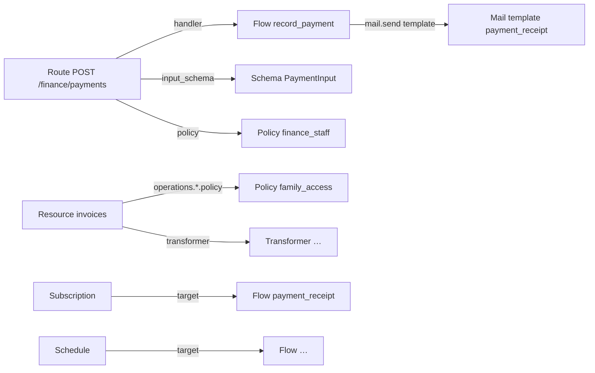

Everything you build in Pawabase, except project Python code, is a **definition**: a JSON document stored per environment. This page is the map of all of them.

## The twelve kinds

| Kind | Keyed by | Compiles into / drives | Docs |
| --- | --- | --- | --- |
| Resource | `name` | REST routes, a table, events, realtime | [Resources](/data/resources) |
| Schema | `name` | Pydantic models, OpenAPI components | [Schemas](/data/schemas) |
| Transformer | `name` | Response shaping | [Transformers](/data/transformers) |
| Policy | `name` | Access decisions everywhere | [Policies](/policies/overview) |
| Route | `id` (method + path) | Custom endpoints | [Custom routes](/data/custom-routes) |
| Flow | `name` | Workflows and their triggers | [Flows](/flows/overview) |
| Bucket | `name` | Storage buckets and their policies | [Buckets](/storage/buckets) |
| Mail template | `name` | Emails sent by flows, functions, Akountz | [Mail templates](/mail/templates) |
| Event subscription | `name` | Event fan-out | [Subscriptions](/events/subscriptions) |
| Webhook | `name` | Signed outbound deliveries | [Outbound webhooks](/webhooks/outbound) |
| Inbound hook | `slug` | Verified public receivers | [Inbound hooks](/webhooks/inbound) |
| Schedule | `name` | Cron/interval triggers | [Schedules](/jobs/schedules) |

## References between definitions

Definitions refer to each other **by name**:



Names are therefore **fixed once created**: Studio disables renaming, and the Platform API treats a new name as a new definition. To rename, create the new one, repoint references, delete the old one.

## Validation before storage

The API validates each definition before saving it: field specs compile, conditions parse, flow graphs have a trigger and no dangling edges, transformer steps are known, cron and intervals are valid, webhook URLs are `http(s)`. Resource names can't shadow reserved paths (`docs`, `openapi.json`, `rpc`, `health`, `internal`, `platform`), and custom routes can't shadow a resource's own routes.

Problems that only appear at compile time (a policy referenced but deleted, for example) are listed under **Overview → Definitions with problems**.

## Versioning and liveness

Each write increments the environment version. The next request recompiles as needed; other services refresh cached config within seconds. There's no deploy step and no restart.

## Managing definitions as code

Because definitions are JSON over a REST API, you can keep them in Git and apply them from CI:

```python
import httpx

BASE = "https://studio.example.com/studio/api/platform/projects/school/envs/staging"

def upsert(client, kind, body, key="name"):
    r = client.put(f"{BASE}/{kind}/{body[key]}", json=body)
    if r.status_code == 404:
        r = client.post(f"{BASE}/{kind}", json=body)
    r.raise_for_status()
```

The [school tutorial](/school/overview) was built exactly this way: 23 resources, 11 policies and 19 flows from a script, all visible and editable in Studio afterwards.

<Tip>
For moving definitions between environments of the same installation, [promotion](/operate/environments-and-promotion) is simpler and safer than scripting.
</Tip>
