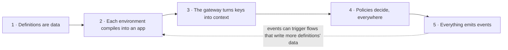
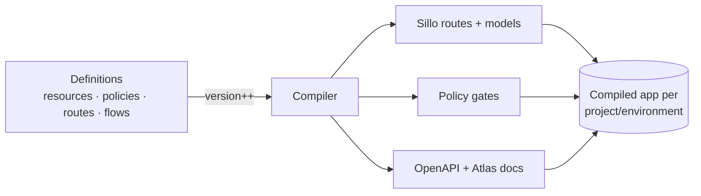
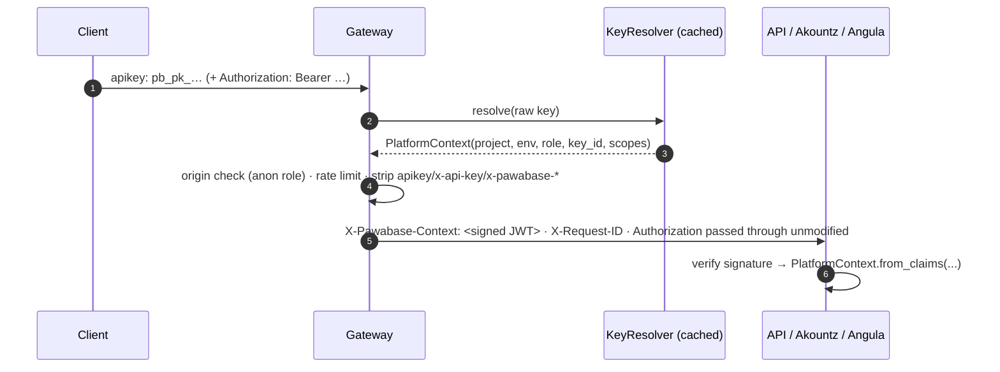
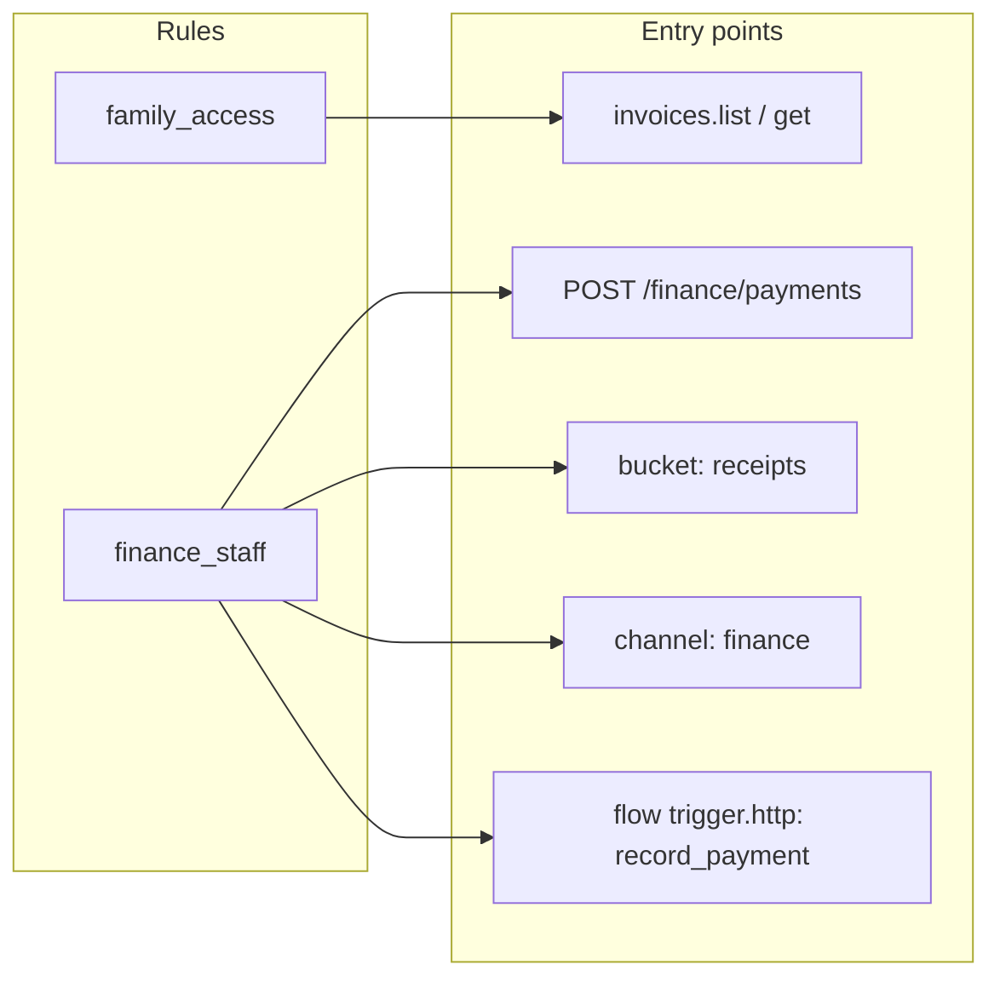
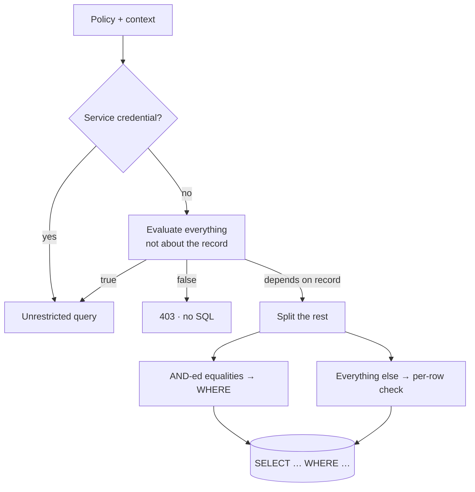
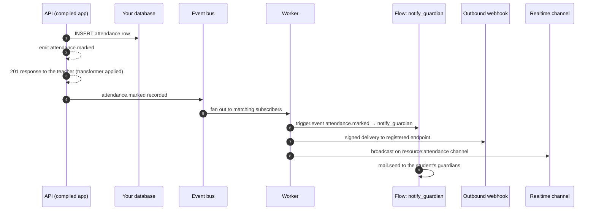
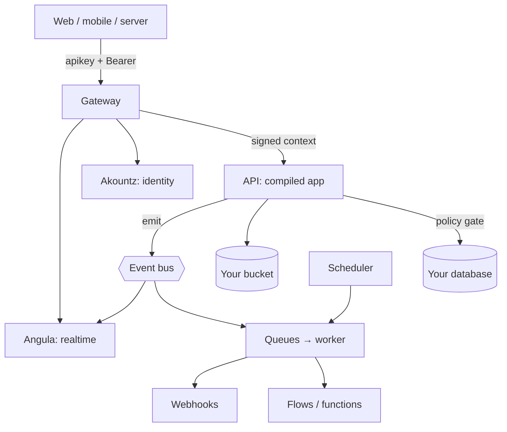

Pawabase is easiest to understand as **a compiler for backends**. You don't write request handlers, register routes, or wire up middleware by hand. You describe the backend as data — resources, policies, routes, flows, buckets, mail templates, subscriptions, webhooks, inbound hooks and schedules — and Pawabase compiles that description into a live application for each environment of your project.

This page is the front door to everything else in these docs. Almost every feature you'll meet later is a consequence of one of five ideas below. If you read only one page before building, read this one; if something ever surprises you, come back here and ask which of the five ideas explains it.

<CardGroup cols={3}>
  <Card title="Data, not code" icon="file-json">Resources, policies, routes and flows are JSON documents, not Python you write and deploy.</Card>
  <Card title="Compiled, not interpreted at request time" icon="cpu">A real Sillo application is generated per environment; requests hit generated routes and models, not a generic dispatcher walking your JSON.</Card>
  <Card title="One engine, everywhere" icon="shield-check">The same policy engine, the same event bus, and the same signed context apply to resources, routes, functions, flows, storage and realtime alike.</Card>
</CardGroup>

## Why a compiler, not a framework

Most backend tools give you one of two starting points. A framework like Express, Django or Rails hands you a router and expects you to write the handler for every endpoint: validation, access control, the database call, the response shape, all as code you own and re-run every time your app boots. A backend-as-a-service like Supabase or Firebase gives you a database (or a document store) and a thin, mostly-fixed API in front of it: you configure a few knobs, but the shape of the API is mostly out of your hands, and access control is usually a separate rules language layered over the database rather than a first-class part of your model.

Pawabase sits deliberately between these. It looks like a framework in that you get real routes, real generated request and response models, and real OpenAPI docs — nothing is "generic REST over a JSON blob." It looks like a backend-as-a-service in that you never write a `def create_todo(request):` handler, never wire up a router, and never redeploy to change validation rules. The mechanism that makes both true at once is **compilation**: your definitions are the source, and the compiler's output is an ordinary Sillo application, indistinguishable at request time from one a person wrote by hand.

<Tabs>
  <Tab title="vs. a typical imperative backend">
    | | Express / Django / Rails-style backend | Pawabase |
    | --- | --- | --- |
    | Source of truth | Code: routes, models, handlers, migrations | Data: definitions, versioned per environment |
    | Adding a field | Edit a model, write a migration, edit the handler, edit the serializer, redeploy | Edit the resource definition; the environment recompiles on the next request |
    | Access control | `if` statements scattered across handlers, or a separate authorization library | One policy engine, referenced by name from every entry point |
    | Validation | Hand-written or a serializer library, kept in sync with the model by hand | Generated Pydantic models from the same field specs that define the table |
    | Docs | Hand-maintained, or generated from annotations that can drift from the code | Generated from the same compiled routes and models that serve traffic |
    | Promoting a change to another environment | A deploy: build, ship, restart, hope nothing else changed | A copy of JSON documents; [promotion](/operate/environments-and-promotion) |
    | Multi-tenant environments | Usually one deployment per tenant, or manual tenant-scoping code everywhere | One project, many environments, each with its own compiled app, database and keys |
    You still write Python where it earns its place — [functions](/code/overview), [Python policies](/policies/python-policies), and an [extension router](/data/custom-routes#extension-routes) for anything genuinely custom — but the 80% of a backend that's CRUD, validation, access rules and glue is data, not code you maintain.
  </Tab>
  <Tab title="vs. Supabase / Firebase">
    Supabase and Firebase are also declarative in places — Supabase generates a REST API from your Postgres schema, and both have rules languages for access control — but the declarative surface is narrower and the pieces don't share one vocabulary.
    | | Supabase / Firebase | Pawabase |
    | --- | --- | --- |
    | What's declarative | The database schema (Supabase) or the document shape (Firebase), plus a separate rules file | Resources, schemas, transformers, policies, routes, flows, buckets, mail templates, subscriptions, webhooks, inbound hooks, schedules — twelve kinds, one system |
    | Access control | SQL `CREATE POLICY` (Supabase RLS) or a custom rules DSL (Firebase), evaluated only at the database/document layer | One JSON condition language, referenced from resources, routes, functions, flows, buckets and realtime channels alike |
    | Server-side logic | Edge/Cloud Functions: separate deploys, separate runtime | [Flows](/flows/overview) (no-deploy, graphs of blocks) and [functions](/code/overview) (deployed with your project code), both under the same policy and event model |
    | Response shaping | Usually whatever the ORM/driver returns, or hand-written in a function | [Transformers](/data/transformers): declarative omit/pick/set/rename/case, versioned like everything else |
    | Multi-environment story | Separate projects, manually kept in sync | [Environments](/concepts/projects-and-environments) of one project, with [promotion](/operate/environments-and-promotion) between them |
    The detailed comparisons live at [Policies vs. Supabase & Firebase](/policies/overview#compared-with-supabase-and-firebase) and the dedicated `/compare` pages; the short version is that Pawabase tries to make *everything* about your backend — not just the schema — describable as reviewable, versioned, promotable data.
  </Tab>
</Tabs>

<Note>
"Compiler" is not a metaphor here — it's the literal mechanism. `services/api/app/bootstrap.py` wires a `DataPlaneDispatcher` into the API process; that dispatcher looks up the calling environment, asks the platform for its compiled Sillo application (compiling it if the definitions changed since the last request), and hands the request to that real application. There is no interpreter walking your JSON at request time — the JSON was already turned into routes, Pydantic models and policy gates the moment (or, more precisely, the request) after you last saved a definition.
</Note>

### What "compiled" buys you concretely

It's easy to nod along with "definitions compile into an app" as an architectural detail and miss why it matters day to day. Each of these is a direct, practical consequence:

<AccordionGroup>
  <Accordion title="Validation errors happen before any of your logic runs">
    Because the request model is generated Pydantic, not a hand-rolled check inside a handler, a malformed body is rejected with a field-by-field `422` before a hook, a policy, or a query has had any chance to run. You never have to reason about "what state is the database in if validation fails halfway through," because there is no halfway — validation is a hard gate in front of everything else.
  </Accordion>
  <Accordion title="Your OpenAPI docs cannot drift from your API">
    Hand-maintained docs (or docs generated from separately-written annotations) can describe a field that no longer exists, or omit one that was added last week. Because Atlas renders the same compiled routes and models that serve traffic, there is no second source to keep in sync — drift is structurally impossible, not just discouraged.
  </Accordion>
  <Accordion title="A rule written once is enforced identically everywhere it's referenced">
    A policy named `finance_staff` is the same Python callable whether it's guarding `invoices.create`, a custom `/finance/payments` route, or the `finance` realtime channel. There's no risk of the resource version and the route version of "who counts as finance staff" quietly diverging, because there's only one compiled implementation, referenced three times.
  </Accordion>
  <Accordion title="Promotion is copying data, not re-running a build pipeline">
    Because the artifact that matters (the compiled app) is *derived* from data rather than checked into source control and built by CI, moving a feature from `staging` to `production` is copying JSON documents — see [Promotion](/operate/environments-and-promotion) — not a deploy with its own failure modes (a broken build, a missing environment variable, a half-applied migration).
  </Accordion>
  <Accordion title="You can answer 'what will happen' without running the request">
    Because compiling is deterministic and total — every enabled operation on every resource always produces a route, every route always has a policy gate — you can read a resource definition and know exactly which endpoints exist and what guards them, the same way you can read a function signature and know its arity without calling it.
  </Accordion>
</AccordionGroup>

## The five ideas, and how they compose



Read top to bottom, they're roughly the order a request experiences them: your definitions became a compiled app (1 → 2) before the request arrived; the request carried a key that the gateway turned into a context (3); the compiled route asked a policy whether the context may proceed (4); and whatever happened next was recorded as an event and fanned out (5). Read bottom to top, they're roughly the order you *design* a backend: decide what happens (5, in your head), decide who may make it happen (4), understand what identity looks like to your rules (3), understand what a request actually becomes (2), and write it all down as data (1).

---

## 1. Definitions are data

Resources, schemas, transformers, policies, routes, flows, buckets, mail templates, event subscriptions, webhooks, inbound hooks and schedules are all **definitions**: JSON documents stored per environment, versioned, editable in Studio or through the Platform API, and copyable between environments. That's twelve kinds in total — the exact list, with what each one compiles into, is the map at [Definitions as data](/concepts/definitions-as-data).

### A fuller resource definition

The 97-line version of this page showed a minimal `todos` resource. Here's a more realistic one — an `invoices` resource for a school billing system, with relations, computed defaults, and hooks — to show how much a single definition actually carries:

```json code/school/definitions/resources/invoices.json
{
  "name": "invoices",
  "table": "invoices",
  "fields": [
    { "name": "invoice_no", "type": "string", "required": true, "unique": true, "max_length": 20 },
    { "name": "student_id", "type": "integer", "required": true },
    { "name": "amount", "type": "integer", "required": true, "minimum": 0 },
    { "name": "balance", "type": "integer", "required": true, "minimum": 0 },
    { "name": "status", "type": "string", "enum": ["draft", "issued", "paid", "void"], "default": "draft" },
    { "name": "guardian_user_ids", "type": "array", "items": "string", "default": [] },
    { "name": "created_by", "type": "string", "read_only": true }
  ],
  "owner_field": null,
  "relations": [
    { "name": "student", "type": "belongs_to", "resource": "students", "field": "student_id" },
    { "name": "payments", "type": "has_many", "resource": "payments", "field": "invoice_id" }
  ],
  "operations": {
    "list":   { "enabled": true, "policy": "family_access" },
    "get":    { "enabled": true, "policy": "family_access" },
    "create": { "enabled": true, "policy": "finance_staff" },
    "update": { "enabled": true, "policy": "finance_staff" },
    "delete": { "enabled": true, "policy": "school_admin" }
  },
  "transformer": "invoice_view",
  "events": true,
  "realtime": false,
  "hooks": {
    "before_create": ["stamp_created_by"],
    "after_update": ["recalc_student_balance"]
  }
}
```

Every one of those top-level keys is meaningful to the compiler in step 2, not decoration: `fields` become both the database columns and the generated Pydantic models; `relations` become `?expand=student` support; `operations.*.policy` become policy gates; `transformer` becomes response shaping; `events` and `realtime` become emitted `invoices.*` events and a broadcast channel; `hooks` become extra steps the compiled handler runs around the database write. Nothing here is prose describing behavior — it *is* the behavior, in the same sense that a SQL `CREATE TABLE` *is* a table rather than a description of one.

<Tip>
Studio's resource builder writes exactly this JSON. Fields, relations, operations and the transformer picker are forms over this document; the **JSON** tab shows precisely what will be stored, the same way it does for [policies](/policies/overview#defining-policies).
</Tip>

### Walking through what changes when you add a field

Say you add `due_date` (a `date` field) to `invoices` in Studio, or with `PUT .../resources/invoices`. Here is everything that becomes true, in order, without you touching anything else:

<Steps>
  <Step title="Validation">
    The request model for `POST` and `PATCH /rest/v1/invoices` grows a `due_date` field with whatever constraints you gave it. A request that used to be valid without `due_date` still is, unless you marked it `required`; a request that sends an invalid date now fails with `422` before any SQL runs.
  </Step>
  <Step title="Storage">
    The underlying table gains a `due_date` column. Depending on your database and how the change is applied, this is either an automatic, additive migration or one you review and apply — see [Migrations](/data/migrations) for exactly which changes are safe to apply live.
  </Step>
  <Step title="Response shape">
    `GET /rest/v1/invoices/44` now includes `due_date`, unless your `invoice_view` transformer explicitly omits it — transformers act on whatever fields exist, so a field you don't mention in the transformer is included by default.
  </Step>
  <Step title="OpenAPI and Atlas">
    The generated OpenAPI schema for `Invoice` gains the property, and Atlas — the rendered docs UI — reflects it on the next load. You never edited a docs file.
  </Step>
  <Step title="Policies, transformers and flows that reference the field">
    Anything written as `$record.due_date` (a policy condition, a flow's template `{{ record.due_date }}`) starts resolving to a real value instead of `null`. Nothing needs to be "connected" — those references were always valid JSON paths, they just pointed at nothing before the field existed.
  </Step>
  <Step title="Version bump">
    The environment's version counter increments. That's the signal every other service uses to know a recompile is needed — see idea 2.
  </Step>
</Steps>

No code was written, no service was restarted, and nothing was deployed. That's the practical payoff of "definitions are data": the distance between deciding you need a field and that field being validated, stored, documented and usable in policies is one save.

### Debugging with this idea: "why doesn't my field show up?"

When a field, an operation, or a whole resource behaves unexpectedly, the first three questions to ask are about the *definition*, not the request:

<AccordionGroup>
  <Accordion title="The field isn't in the response">
    Check the resource's `transformer` first — an `omit` or `pick` step is almost always the reason a field that exists in the table doesn't reach the client. If there's no transformer, check whether the field is `write_only`. [Transformers →](/data/transformers)
  </Accordion>
  <Accordion title="The field can't be set on create">
    Check `read_only` on the field spec, and check whether it's the resource's `owner_field` — owner fields are always set by the server, and anything the client sends for that field is overwritten. [Defining resources →](/data/defining-resources)
  </Accordion>
  <Accordion title="422 on a request that used to work">
    Someone tightened a constraint (`required`, `max_length`, a new `enum`) on the field. Diff the resource definition's history in Studio's Observability, or check the environment's version history if you promote from Git.
  </Accordion>
  <Accordion title="The resource exists but 404s entirely">
    Either the resource's name collides with a reserved path (`docs`, `openapi.json`, `rpc`, `health`, `internal`, `platform` — see [Definitions as data](/concepts/definitions-as-data#validation-before-storage)), or you're pointed at the wrong environment. Confirm with the resource's `name` in Studio's environment picker matches the `apikey` you're using — see idea 3.
  </Accordion>
</AccordionGroup>

The habit worth building is: **before you suspect a bug in the platform, read the definition.** In a system where behavior *is* data, almost every surprise traces back to one field of one JSON document.

---

## 2. Each environment compiles into an app

When a definition changes, the environment's **version** increments, and the API recompiles that environment into a real Sillo application the next time it's needed:

- every enabled resource operation becomes a route with **generated Pydantic request and response models**, built from the resource's field specs;
- every custom route becomes a route whose handler runs a flow or a Python function;
- your project's own Python router, if you have one (an [extension route](/data/custom-routes#extension-routes)), is mounted alongside the generated routes;
- a policy gate, resolved from the operation's or route's `policy` reference, is attached to every route;
- Sillo generates the OpenAPI document from the same routes and models, and Atlas renders it.

So validation, docs and routing aren't approximations of your definitions; they *are* your definitions, compiled. This is the same relationship a compiled binary has to its source: you don't get "roughly what the source describes," you get exactly what it describes, translated into a form a machine can execute quickly.



### How this actually happens inside the API process

`services/api/app/bootstrap.py` is the file to read first if you want to see the mechanism rather than take it on faith. It builds the API's `SilloApp` with `create_service`, which wires up authentication backends (`OperatorBackend`, `ProjectUserBackend`) and, around everything, the platform-context and telemetry middleware. Critically, it installs a `DataPlaneDispatcher` as an **inner** middleware — inside the context and telemetry layer, not outside it:

```python services/api/app/bootstrap.py
app = create_service(
    "api",
    settings,
    title="Pawabase API",
    backends=[OperatorBackend(settings.jwt_master_secret), ProjectUserBackend(settings.jwt_master_secret)],
    inner=[DataPlaneDispatcher(platform)],
    installables=[Record(database_config(settings), tuple(MODEL_MODULES))],
)
```

`DataPlaneDispatcher` is the compiler's front door at request time. Every request under `/rest/v1` is intercepted before Sillo's own routers see it:

```python services/api/app/dispatch.py
async def __call__(self, scope, receive, send):
    path = scope.get("path", "")
    if scope["type"] != "http" or not (path == REST_PREFIX or path.startswith(REST_PREFIX + "/")):
        await self.app(scope, receive, send)   # not /rest/v1 → the platform's own routers
        return
    context = scope.get(SCOPE_KEY)
    if context is None:
        await _send_json(send, 401, {"error": "missing_api_key", ...})
        return
    state = await self.platform.state_for(context)   # which project/environment
    compiled = await state.compiled()                # the compiled app, building it if stale
    ...
    await compiled(inner, receive, send)              # hand off, with /rest/v1 moved into root_path
```

Three things worth internalizing from this:

1. **The context has to exist before the dispatcher can even look up which environment to compile.** If `scope[SCOPE_KEY]` is missing — no `X-Pawabase-Context` header verified upstream — the request never reaches your resources at all; it's refused with `401 missing_api_key` inside the API process itself, before the compiler is even asked a question. This is why idea 3 (the gateway turning keys into context) has to precede idea 2 in the request's actual timeline, even though this page presents "compiles into an app" second.
2. **Compilation is per environment, and it's lazy and cached.** `state.compiled()` returns a cached compiled app when the environment's version hasn't changed since the last compile, and rebuilds it when it has. You never "trigger a build" — the first request after a save pays the (small) cost of recompiling, and every request after that reuses the result until the next change.
3. **The compiled app is a real Sillo application, called like any mounted one.** The dispatcher moves `/rest/v1` into `root_path` and calls `compiled(inner, receive, send)` directly — this is ASGI, the same protocol Sillo uses everywhere else. There is no second dispatch layer, no interpreter re-parsing your resource JSON per request; the JSON was already turned into Python objects (routes, Pydantic models, policy callables) during compilation.

After the compiled app finishes, the dispatcher copies a short list of keys back onto the outer scope — `user`, `auth`, `auth_scheme`, `route`, `pawabase.policy`, `pawabase.plan` — so the outer telemetry middleware can record which route, which policy, and which query plan actually handled the request. That's the mechanism behind Studio's Observability page knowing, for every request, exactly which resource operation and which policy ran.

### What "compiles into" means for each definition kind

| Definition kind | What compiling it produces |
| --- | --- |
| Resource | A `list`/`get`/`create`/`update`/`delete` route per enabled operation, generated Pydantic request/response models from the fields, a policy gate per operation, event emission wiring, an optional realtime broadcast |
| Schema | A reusable Pydantic model other resources, routes and flows can reference, and an OpenAPI component |
| Transformer | A response-shaping step attached to the resources or routes that reference it |
| Policy | A callable the engine evaluates against a context wherever it's referenced — not a route by itself |
| Route | One route, whose handler invokes a flow or a registered function |
| Flow | A callable graph, plus — depending on its trigger — a route (`trigger.http`), an event listener (`trigger.event`/`trigger.resource`), a scheduled job (`trigger.schedule`), or a webhook-invoked handler |
| Bucket | Storage endpoints under `/storage/v1` scoped to that bucket, with its read/write policies attached |
| Mail template | A renderable template flows and functions can call through `mail.send` |
| Event subscription | An entry in the fan-out table the event processor consults after every emitted event |
| Webhook | A signed delivery target the event processor queues to alongside subscriptions |
| Inbound hook | A public, verified route under `/hooks/v1` that turns a third party's webhook into an event or a flow run |
| Schedule | A cron/interval job registered with the scheduler process |

### Debugging with this idea: reading a stack trace

Because the compiled app is real Python objects generated from your JSON, an error in the compiled app is diagnosable the same way an error in hand-written Sillo code would be — with one extra step: work out *which definition* produced the code that's failing.

<Steps>
  <Step title="Find the route">
    Error responses and Observability entries carry the route or operation name (`invoices.create`, `POST /finance/payments`). That name maps directly to a resource's `name` plus operation, or a route's `id`.
  </Step>
  <Step title="Check the version the request ran against">
    If a bug was fixed by editing a definition but the error persists, confirm the environment actually recompiled — the version should have incremented. A version that hasn't moved after a save usually means the write failed validation; check the response of the save itself.
  </Step>
  <Step title="Separate compile-time from run-time problems">
    A `422` almost always means the *generated model* rejected the input — a field spec problem, fixable by editing the resource. A `500` inside a hook or a flow means the *code that ran* raised — fixable in the hook's Python or the flow's blocks, not in the field specs.
  </Step>
  <Step title="Look at Definitions with problems">
    Some errors only surface at compile time: a policy referenced by a resource that was since deleted, a transformer step naming a field that no longer exists. Studio's **Overview → Definitions with problems** page lists these without you needing to trigger a request first.
  </Step>
</Steps>

<Warning>
A definition that fails validation is refused at save time — see [Definitions as data → Validation before storage](/concepts/definitions-as-data#validation-before-storage) — so the environment can never be left with the *previous* good compile and a *newer*, broken definition floating in between. Either the save succeeds and the version increments, or it's rejected and nothing changes. There is no "half-compiled" state to debug.
</Warning>

---

## 3. The gateway turns keys into context

Clients only ever talk to the **gateway**. It's the only public entry point — `/internal` and `/admin` paths are unreachable from outside — and for every request it:

1. finds the upstream from the route table (`/rest/v1` → API, `/auth/v1` → Akountz, `/realtime/v1` → Angula, and so on — the full [public surface table](/concepts/architecture#public-surface));
2. resolves the API key (`apikey` header, `x-api-key` header, or `?apikey=` for browser navigations and WebSockets that can't set headers) into a **platform context**, using a cached resolver so this doesn't cost a database round trip on every request;
3. for publishable keys, enforces the environment's allowed origins, and applies the rate limit (Sillo's limiter, keyed by the resolved key id when there is one, otherwise by client address);
4. strips anything a client could use to impersonate the platform — the raw key itself, and any header starting with `x-pawabase-`;
5. adds the signed `X-Pawabase-Context` header and a request id, and streams the request and the response through to the upstream service.

Internal services **trust the signature**, never a raw key. A service reading `X-Pawabase-Context` doesn't re-resolve anything; it verifies the JWT with the shared internal secret and reconstructs the context from its claims. This is the whole reason the gateway exists as a separate process: every other service can assume identity has already been established, the same way a properly designed system assumes a request that reached an internal network has already passed a firewall.



### What's actually inside a `PlatformContext`

This is the object every downstream decision is built on. Its real shape, from `packages/kit/pawabase_kit/context.py`:

```python packages/kit/pawabase_kit/context.py
@dataclass(frozen=True, slots=True)
class PlatformContext:
    project: str
    env: str
    role: str = "anon"                       # "anon" | "service" | "operator"
    key_id: str | None = None
    scopes: tuple[str, ...] = ()

    @property
    def is_service(self) -> bool:
        return self.role in ("service", "operator")

    def allows_scope(self, scope: str) -> bool:
        if not self.scopes:
            return True
        family = scope.split(":", 1)[0]
        return scope in self.scopes or f"{family}:*" in self.scopes or "*" in self.scopes
```

Four fields, and every one of them earns its place:

| Field | Answers | Example |
| --- | --- | --- |
| `project` | Which project | `"school"` |
| `env` | Which environment of that project | `"production"` |
| `role` | `anon` (a publishable key or none), `service` (a secret key), or `operator` (a Studio session) | `"anon"` |
| `key_id` | Which specific API key, for auditing and per-key rate limits | `"k_9f2…"` |
| `scopes` | Whether the key is limited to specific operation families | `("resource:read",)` or `()` for unrestricted |

`is_service` is `True` for both `service` (secret keys) and `operator` (Studio) roles — both bypass policies, for the same underlying reason: a secret key is your own server acting with full trust, and an operator is a person who has already authenticated into the platform's own control plane. This is the field the policy engine checks first, before evaluating any condition at all — see idea 4.

<Note>
This `role` vocabulary (`anon`/`service`/`operator`) is the *internal* one, carried on the signed context. When that same information reaches a **policy condition** as `credential.role`, it's expressed in the vocabulary [Credentials](/concepts/credentials) documents for policy authors — publishable keys evaluate every policy, secret keys and operator sessions bypass them. The two vocabularies describe the same distinction (does this credential bypass policies, yes or no) from two different vantage points: the platform's internal context, and the condition language you write policies in.
</Note>

### A bigger context example, end to end

Put together, here's what a real, signed-in request looks like by the time a resource operation's policy runs — this combines the platform context the gateway produced with the user identity Akountz issued, exactly as a policy condition sees it (this is the same shape documented in full at [Policies → What a policy can see](/policies/overview#what-a-policy-can-see)):

```json
{
  "auth": {
    "authenticated": true,
    "kind": "user",
    "user_id": "8",
    "email": "chioma.nwosu@example.com",
    "roles": ["guardian"],
    "permissions": ["family.read"],
    "org": null,
    "aal": "aal1",
    "session_id": "549136e9…"
  },
  "credential": { "role": "publishable", "is_service": false, "scopes": [], "key_id": "k_9f2…" },
  "request": { "method": "GET", "path": "/rest/v1/invoices/44", "ip": "102.89.3.17", "params": { "id": "44" }, "query": {} },
  "project": "school",
  "env": "production",
  "record": { "id": 44, "invoice_no": "INV-202600001", "student_id": 12, "amount": 210000, "balance": 0, "status": "paid", "guardian_user_ids": ["8"] },
  "input": null
}
```

Notice the two identities travel on genuinely different rails: `credential` came from the **API key** the gateway resolved (idea 3, this section); `auth` came from a **user access token** verified separately by `ProjectUserBackend`, signed with a key derived for *that environment only* so a token minted in `development` can never be replayed against `production`. A request can have a valid `credential` and no `auth` at all — an anonymous visitor with a publishable key — or, for a server acting on a user's behalf, a `service` credential *and* a forwarded user token. [Credentials →](/concepts/credentials) covers every combination.

### Tracing one key resolution step by step

<Steps>
  <Step title="The client sends a key">
    `apikey: pb_pk_9f2c…` on the request. The gateway's `_key()` helper checks the `apikey` header, then `x-api-key`, then a `?apikey=` query parameter — in that order — so the same code path serves fetch calls, `` tags, and WebSocket upgrades alike.
  </Step>
  <Step title="The resolver looks it up">
    `KeyResolver.resolve(raw)` either hits a cache or asks the API which project, environment, role and scopes that key carries. An unknown or revoked key raises `KeyRejected`; an unreachable API raises `ServiceError`. Both turn into clean HTTP errors (`401 invalid_api_key` or `503 key_service_unavailable`) — the client never sees an exception traceback.
  </Step>
  <Step title="Origin and rate limit are checked against the resolved context">
    Only `anon`-role contexts are origin-checked — a secret key isn't expected to live in a browser, so CORS doesn't apply to it the same way. The rate limiter's key function prefers the resolved `key_id`; only when there's no context at all does it fall back to the client's IP address.
  </Step>
  <Step title="Headers are rewritten">
    `apikey` and `x-api-key` are deleted. Any header starting with `x-pawabase-` sent by the client is also deleted — this is what stops a malicious client from simply setting `X-Pawabase-Context` to a forged value; whatever it sends under that name never survives the gateway.
  </Step>
  <Step title="The signed context is attached">
    `issue_context_token(internal_secret, context)` signs the `PlatformContext` as a short-lived JWT and sets it as `X-Pawabase-Context`. `X-Forwarded-For/Proto/Host` and `X-Request-ID` are added the same way any reverse proxy would.
  </Step>
  <Step title="The request is streamed to the upstream">
    The gateway proxies with `httpx`, streaming both directions rather than buffering, which is why file uploads and long responses work through it without the gateway needing to hold the whole body in memory.
  </Step>
</Steps>

### Debugging with this idea: "who does the platform think I am?"

<AccordionGroup>
  <Accordion title="401 missing_api_key">
    No `apikey`/`x-api-key` header and no `?apikey=` query param reached the gateway, or the request skipped the gateway entirely (calling an internal service's port directly, which should never happen from a client).
  </Accordion>
  <Accordion title="401 invalid_api_key">
    The key doesn't resolve — wrong project/environment, revoked, or simply mistyped. Confirm the key's prefix (`pb_pk_…` vs `pb_sk_…`) matches what you intended to send, and that it belongs to the environment you think you're calling.
  </Accordion>
  <Accordion title="403 origin_not_allowed">
    A publishable key was used from an origin not in that environment's allowed origins. Either add the origin in environment settings, or confirm you're not accidentally using a key from a different environment (each environment has its own origin allowlist). See [Rate limits and CORS](/operate/rate-limits-and-cors).
  </Accordion>
  <Accordion title="A policy behaves as if the caller is anonymous, despite a Bearer token">
    Check that the `Authorization` header actually reached the gateway (not stripped by a client library or an intermediate proxy), and that the token was issued for the **same environment** — a token from `development` won't verify against `production`'s derived key, and an invalid token is treated as *no* token, not an error, unless it's malformed enough to be rejected outright.
  </Accordion>
  <Accordion title="Everything works locally but the deployed gateway 502s">
    A `502 upstream_unavailable` means the gateway couldn't reach the internal service at all — a networking or process-health problem, not a context or policy problem. A `504 upstream_timeout` means it reached it but the response took too long. Neither is about identity; check the upstream service's own health first.
  </Accordion>
</AccordionGroup>

---

## 4. Policies decide, everywhere

A policy is a small JSON condition over a context. The **same engine** guards resource operations, custom routes, direct flow invocations, functions, storage buckets and realtime channels — one vocabulary, evaluated identically no matter which of those six entry points is asking. The full page on this is [Policies](/policies/overview); this section focuses on how the idea fits into the bigger picture rather than repeating the condition language in full.

| Context | What it holds |
| --- | --- |
| `auth` | Who is calling: `user_id`, `email`, `roles`, `permissions`, `org`, `aal`, `kind` |
| `credential` | Which key: `role` (`publishable`/`secret`), `is_service`, `scopes` |
| `record` | The row being read or written |
| `input` | The submitted body |
| `request` | Method, path, IP, params, query |
| `project`, `env` | Where |

### Why "everywhere" is the important word

The alternative most systems settle for is access control that lives near the code it protects: a check inside a route handler, a different check inside a background job that writes the same table, and no check at all inside the script someone wrote to backfill data last quarter. Each of those is individually reasonable and collectively a liability — the rule "guardians can only see their own family's invoices" ends up expressed three different ways, and the day someone adds a fourth entry point (a websocket subscription, say) is the day it's most likely to be forgotten.

Pawabase collapses this by making the policy the *only* place a rule is expressed, and making every entry point a **reference** to a named policy rather than an inline check:



Change who counts as finance staff once, and every one of those five entry points enforces the new definition on its very next request — no redeploy, and no risk that one of the five was missed, because there's only one place the rule was ever written.

### From decision to response, and what "planned" means for lists

The engine's output is a **decision** — allowed or refused, with the policy's name and a reason. What happens to that decision differs by entry point (a resource refusal on `get` returns `404` to avoid revealing a row exists; a route or flow refusal returns `403` with the reason) — the complete table is at [Policies → From decision to HTTP response](/policies/overview#from-decision-to-http-response).

The detail worth internalizing here, because it explains a lot of behavior that would otherwise look like magic, is that **list policies aren't applied to results — they're planned into the query**:



This is why `GET /rest/v1/invoices` for a guardian returns a full page of *their family's* invoices with a correct `total`, rather than a page of 20 rows quietly missing rows a naive post-filter would have dropped. The mechanism — equalities becoming SQL `WHERE` clauses, everything else becoming a per-row residual — is documented in depth at [Pushdown](/policies/pushdown), and it's a direct consequence of idea 2: because the compiled app generates a real query against your real database, the policy has something concrete to be planned *into*, rather than a generic result set to be filtered *after*.

### Debugging with this idea: "why was I refused, or shown the wrong rows?"

<Steps>
  <Step title="Read the reason on the response">
    A `403` body carries the policy's name (`policy 'finance_staff' refused`). That's the single fastest way to know which rule to inspect — you don't have to guess between the five or six policies a resource might reference across its operations.
  </Step>
  <Step title="Reproduce with a secret key">
    If a `404` on a record you know exists turns into a `200` with a secret key, the record was never missing — a read policy is hiding it from the credential you were using. This is the standard test to distinguish "doesn't exist" from "you can't see it."
  </Step>
  <Step title="Check whether the condition depends on the record">
    If a list returns fewer rows than expected, check whether the policy's record-dependent part is an `all` (pushed into `WHERE`, so it narrows correctly) or an `any` across record fields (can't be pushed down on huge tables — see [Designing for pushdown](/policies/pushdown#designing-for-pushdown)).
  </Step>
  <Step title="Confirm which credential actually reached the policy">
    Because `is_service` short-circuits the whole engine, a secret key anywhere in the chain (including a server calling on a user's behalf) means the policy never ran at all. If access looks "too permissive," check whether a secret key leaked into a place it shouldn't be — a client bundle, a log line, a public repo.
  </Step>
</Steps>

<Tip>
Studio's Observability page records the policy name used for every request, not just refusals — so "which policy actually decided this" is always one click away, without needing to reproduce the request yourself.
</Tip>

---

## 5. Everything emits events

Resource writes, auth activity and your own flows emit **events** (`invoices.created`, `user.created`, `attendance.marked`). The event processor records each one, then fans it out to whatever is subscribed: flows, functions, realtime channels, and signed outbound webhooks, all through durable queues with retries. The full reference is [Events](/events/overview); this section is about how the idea fits with the other four.

### A worked fan-out

Take one write — a teacher marking a student present — and follow it past the response:



Two things are worth noticing. First, **the response to the teacher does not wait for any of this** — the event is recorded synchronously (so nothing is silently dropped even if the worker is momentarily behind), but the flow run, the webhook delivery and the realtime broadcast all happen after the `201` has already gone back, through the worker's queues. Second, **every one of those downstream consumers is itself governed by the earlier ideas**: the `notify_guardian` flow is a definition (idea 1) that was compiled into a triggerable graph (idea 2); if it has an HTTP trigger as well, that trigger has its own policy (idea 4); and the mail it sends is itself just a `mail.send` block referencing a mail template, another definition.

### Where events come from

| Source | Examples | Controlled by |
| --- | --- | --- |
| Resource writes | `invoices.created`, `invoices.updated`, `invoices.deleted` | The resource's `events: true/false` setting |
| Auth activity | `user.created`, `user.signed_in`, `user.mfa_enrolled` | Always on, emitted by Akountz |
| Flows | Any `event.emit` block, with a name and payload you choose | Explicit, inside the flow graph |
| Inbound hooks | A verified third-party webhook turned into an event of your naming | The inbound hook definition |
| Schedules | A scheduled flow run can itself emit further events | The flow it triggers |

### What consumes an event

| Consumer | Definition kind | What it does with the event |
| --- | --- | --- |
| Flow | Flow with `trigger.event` or `trigger.resource` | Runs the graph with the event as its trigger data |
| Function | Registered `@function`, subscribed via an event subscription | Runs your Python with the event as an argument |
| Realtime channel | Implied by a resource's `realtime: true`, or explicit in a flow | Broadcasts to connected clients on that channel |
| Outbound webhook | Webhook definition matching the event | A signed HTTP delivery to a third party, queued with retries |

### Debugging with this idea: "my flow never ran" / "the webhook never fired"

<AccordionGroup>
  <Accordion title="Check the event was actually emitted">
    Resource events are on by default but can be turned off per resource (`"events": false`). If you don't see the event at all in Observability's events log, start there rather than in the flow.
  </Accordion>
  <Accordion title="Check the subscription's condition, not just its event name">
    A subscription can filter on the event payload (`condition` in the same JSON language policies use). An event that matches the name but not the condition is recorded and simply doesn't fan out to that consumer — this is intentional filtering, not a failure.
  </Accordion>
  <Accordion title="Check the worker is actually running">
    Flows, functions and webhooks all run off queues consumed by worker processes (`events`, `webhooks`, `flows`, `functions`, `mail`, `default`). If events are recorded but nothing downstream ever completes, the worker — not the event bus — is usually where to look.
  </Accordion>
  <Accordion title="A webhook delivery failed silently">
    It didn't — deliveries are retried and recorded with their HTTP status and response body. Check the webhook's delivery log rather than assuming failure means nothing happened; a `200` from your endpoint that arrives after a very long delay is still a completed, logged delivery.
  </Accordion>
</AccordionGroup>

---

## Putting it together



<Tip>
When something surprises you, ask three questions: **which definition** produced this route, **which context** reached the policy, and **which event** was emitted. Studio's Observability and Events & runs pages answer all three.
</Tip>

---

## One story, all five ideas: adding `attendance`

The best way to see the five ideas as one system rather than five separate features is to walk through a single, ordinary change end to end. Suppose the school project already has `students`, `invoices` and a `family_access` policy (as shown earlier), and now needs to record daily attendance, notify a guardian when a student is marked absent, and let a third-party SMS provider be told about it.

<Steps>
  <Step title="Write the resource definition (idea 1)">
    ```json code/school/definitions/resources/attendance.json
    {
      "name": "attendance",
      "table": "attendance",
      "fields": [
        { "name": "student_id", "type": "integer", "required": true },
        { "name": "date", "type": "date", "required": true },
        { "name": "status", "type": "string", "enum": ["present", "absent", "late"], "required": true },
        { "name": "marked_by", "type": "string", "read_only": true },
        { "name": "guardian_user_ids", "type": "array", "items": "string", "default": [] }
      ],
      "owner_field": null,
      "operations": {
        "list":   { "enabled": true, "policy": "family_access" },
        "get":    { "enabled": true, "policy": "family_access" },
        "create": { "enabled": true, "policy": "teaching_staff" },
        "update": { "enabled": true, "policy": "teaching_staff" },
        "delete": { "enabled": true, "policy": "school_admin" }
      },
      "events": true,
      "hooks": { "before_create": ["stamp_marked_by"] }
    }
    ```
    Saving this is the entire "define the feature" step. The environment's version increments immediately.
  </Step>
  <Step title="The environment recompiles (idea 2)">
    On the next request to anything under `/rest/v1`, `DataPlaneDispatcher` notices the version has moved, and `state.compiled()` rebuilds the app: `attendance.list/get/create/update/delete` routes now exist, with generated `AttendanceCreate`/`AttendanceUpdate`/`Attendance` Pydantic models built from the field specs above, a `teaching_staff` policy gate on `create`/`update`, a `family_access` gate on `list`/`get`, and `attendance.*` events wired to the resource's writes. Atlas now documents five new endpoints without anyone touching a docs file.
  </Step>
  <Step title="A teacher's request becomes a context (idea 3)">
    A teacher's app sends `POST /rest/v1/attendance` with `apikey: pb_pk_…` and `Authorization: Bearer <teacher token>`. The gateway resolves the key to `PlatformContext(project="school", env="production", role="anon", scopes=())`, confirms the app's origin is allowed, and forwards a signed `X-Pawabase-Context` alongside the untouched `Authorization` header. The API verifies both independently: the context's signature, and the teacher's token against `school`/`production`'s derived signing key.
  </Step>
  <Step title="The policy decides (idea 4)">
    `teaching_staff` — a role-only policy like `{"role": ["teacher", "admin"]}` — is evaluated against a context whose `auth.roles` includes `"teacher"`. It passes. Because `create` builds the `record` from the new data, `attendance.before_create` runs the `stamp_marked_by` hook, setting `marked_by` to the teacher's `user_id` before the row is written — the same pattern as an owner field, but expressed as a hook because `marked_by` isn't the resource's primary ownership column.
  </Step>
  <Step title="The write happens and an event is emitted (idea 5)">
    The row is inserted. `attendance.created` is recorded with the full row as its payload. The teacher's `201` response goes back immediately — nothing downstream has run yet.
  </Step>
  <Step title="The event fans out">
    Three things are subscribed to `attendance.created` with a condition of `{"eq": ["$event.status", "absent"]}`:
    - a **flow** `notify_guardian_absent`, triggered via `trigger.event`, which looks up `guardian_user_ids` and sends a mail through a `mail.send` block referencing an `absence_notice` mail template (another definition);
    - an **outbound webhook** pointed at the school's SMS provider, delivered with a signature the provider verifies against a shared secret, retried on failure;
    - the `resource:attendance` **realtime channel**, if the resource's `realtime` flag is on, so a front-office dashboard updates live.
    All three run off the worker's queues, in parallel, independently retryable, none blocking the teacher's original request.
  </Step>
  <Step title="Trace it in Observability">
    Studio's Observability page shows, for the original request: the route (`attendance.create`), the policy (`teaching_staff`, allowed), and the event it emitted (`attendance.created`). The Events & runs page shows the same event's fan-out: the flow run (succeeded, with its `mail.send` step's result), the webhook delivery (status code and latency), and the realtime broadcast (recipient count). One request id threads through all of it, because the gateway assigns it at the very first hop and every internal call carries it forward.
  </Step>
</Steps>

This is the whole platform in miniature: a JSON document became routes and models; a key became a signed identity; a policy decided; a write became an event; the event became mail, an SMS, and a live dashboard update — and not one line of handler code was written for any of it. The only Python in the entire story is the `stamp_marked_by` hook, and even that runs inside the compiled app's generated handler, not instead of it.

---

## Common misconceptions

<AccordionGroup>
  <Accordion title={\"Definitions are just configuration for a generic API.\""}
    They're the source the compiler builds from, not settings a fixed API reads at request time. The practical difference: a generic-API-plus-config system still has to interpret your config on every request (slower, and any bug in the interpreter affects every backend built on it). Pawabase compiles once per environment version and serves plain generated routes after that — see idea 2's walk through `DataPlaneDispatcher`.
  </Accordion>
  <Accordion title={\"Policies are the same thing as validation.\""}
    Validation (generated from field specs) decides whether a request is *well-formed*; it runs first and doesn't know who's asking. Policies decide whether *this caller* may do *this thing to this data*; they run after validation and see the full context. A request can be perfectly valid and still refused, or invalid and never reach a policy at all.
  </Accordion>
  <Accordion title={\"A transformer controls who can see a field.\""}
    A transformer shapes what a *successful, already-authorized* response looks like. It has no opinion on authorization — a field a transformer omits from the response is still fully readable by a flow, a function, or anyone who can update the underlying row. Use policies (or `write_only`/`read_only` field flags) for access; use transformers for shape.
  </Accordion>
  <Accordion title={\"Environments are just a label, like a git branch.\""}
    Each environment has its own database, its own compiled app, its own keys and secrets, and its own user base — it's closer to a separate deployment than a branch. What makes it cheap to have many is that promoting *definitions* between them is a data copy, not a redeploy. [Projects and environments →](/concepts/projects-and-environments)
  </Accordion>
  <Accordion title={\"The gateway does authorization.\""}
    The gateway resolves *which* credential is calling (idea 3) and does coarse checks (origin, rate limit) — it has no idea what a `family_access` policy means or what an `invoices` row looks like. Authorization is entirely idea 4's job, evaluated inside the compiled app, close to the data it's protecting.
  </Accordion>
  <Accordion title={\"Events are just logs.\""}
    An emitted event is actively consumed — it's the trigger mechanism for flows, the payload for webhooks, and the message for realtime broadcasts. Observability's event log is a side effect of this (every event happens to be recorded), not the point of the mechanism.
  </Accordion>
  <Accordion title={\"Flows are a replacement for writing code.\""}
    Flows replace the *glue* code that used to live in request handlers and background jobs — the "when X happens, do Y, Z and notify W" logic. They don't replace [functions](/code/overview) for genuinely custom computation, or an [extension route](/data/custom-routes#extension-routes) for something that doesn't fit the resource/route/flow shape at all. Reach for a function when a flow's blocks can't express what you need; reach for an extension route when even a function's single-request shape doesn't fit.
  </Accordion>
  <Accordion title={\"Secret keys are just 'admin mode' publishable keys.\""}
    A secret key doesn't unlock more *rules* — it skips the rule engine entirely (`is_service` short-circuits idea 4 before any condition is evaluated). That's a stronger and more dangerous property than "more permissions," which is why it must never reach a browser. See [Credentials → Warning](/concepts/credentials).
  </Accordion>
</AccordionGroup>

## FAQ

<AccordionGroup>
  <Accordion title="Do I ever write request handlers?">
    Rarely, and when you do, they're small. A [function](/code/overview) is the closest thing to a handler — an `async def` you register with `@function(policy=...)` — used for logic that's easier as code than as flow blocks (calling a third-party SDK, doing real number-crunching). Most CRUD, validation, access control and orchestration never needs one.
  </Accordion>
  <Accordion title="What actually causes a recompile, and does it cost anything noticeable?">
    Any successful write to any definition in an environment increments that environment's version. The next request that needs the compiled app (any `/rest/v1` request) triggers a rebuild if the cached compile is stale; every request after that reuses it. In practice this is fast enough that you don't design around it — it's not a "build step" in the CI sense, it's closer to how a JIT compiles a hot function the first time it's called.
  </Accordion>
  <Accordion title="Can two environments of the same project have different compiled apps?">
    Yes, always — each environment has its own definitions, its own version counter, and its own compiled app, even though they usually start out identical right after a [promotion](/operate/environments-and-promotion). It's entirely possible (if usually undesirable) for `staging` and `production` to diverge if you edit one directly instead of promoting.
  </Accordion>
  <Accordion title="Is the compiled app cached forever, or does it expire?">
    It's cached until the version changes, with no separate expiry — there's nothing to "warm up" again on a schedule. Restarting the API process simply starts with an empty cache and compiles on first use, exactly like a cold cache after a deploy of any other kind of server.
  </Accordion>
  <Accordion title="Where does project Python code fit into 'definitions are data'?">
    Project code — hooks, Python policies, functions, extension routers — is the deliberate escape hatch, not a contradiction of the model. It's registered by name and *referenced* from definitions (`"hooks": {"before_create": ["stamp_marked_by"]}`, `"policy": "same_department"`) the same way a stored policy or a flow is referenced. The reference is data; what it points to can be code when JSON genuinely can't express the logic.
  </Accordion>
  <Accordion title="Why does a user token get verified separately from the platform context, instead of the gateway just deciding who's calling?">
    Because they answer genuinely different questions with different trust boundaries. The platform context says which *project, environment and credential* — resolved once, by the gateway, from a key. The user token says which *person* — issued by Akountz, verified independently by each service, signed per-environment so it can never be replayed across environments. Collapsing them would mean a compromised key could impersonate a specific user, or a leaked token from one environment could work in another.
  </Accordion>
  <Accordion title="If everything is data, how do I keep track of changes over time, like I would with git for code?">
    Definitions are versioned per environment (the version counter) and every write is attributable in Observability. For a git-like history and review workflow, teams typically keep definitions as JSON files in a repository and apply them via the Platform API from CI — exactly the pattern shown at [Definitions as data → Managing definitions as code](/concepts/definitions-as-data#managing-definitions-as-code) — which gives you diffs, pull requests and rollbacks on top of the platform's own versioning.
  </Accordion>
  <Accordion title="Does 'everything emits events' mean every single write causes visible side effects, even ones I don't want?">
    No — event emission is opt-in per resource (`"events": true/false`, on by default) and fan-out is opt-in per subscriber (you create the subscription or webhook; nothing consumes an event you haven't wired up). An event with no subscribers is simply recorded and goes nowhere.
  </Accordion>
  <Accordion title="Is there a performance cost to routing everything through a policy engine instead of hand-written checks?">
    For single-row operations, a JSON condition evaluates in-process against an already-assembled context — comparable to the hand-written `if` it replaces. For lists, the pushdown mechanism (idea 4) exists specifically so the cost is the same as a hand-written `WHERE` clause, not a linear scan with a per-row Python callback. The cases that *are* more expensive than hand-written code are the ones pushdown can't help — large tables filtered by an `any` across record fields — and those are called out explicitly as a design smell in [Pushdown → Designing for pushdown](/policies/pushdown#designing-for-pushdown).
  </Accordion>
  <Accordion title="How is this different from just using an ORM with generated CRUD routes, which several frameworks already do?">
    Generated CRUD-from-ORM tools usually stop at resources: you still hand-write custom endpoints, access control, background jobs and webhook handling yourself, in code, outside whatever generated the CRUD routes. Pawabase extends the same "generate it from a declaration" idea to routes, flows, storage, mail, subscriptions, webhooks, inbound hooks and schedules — twelve kinds sharing one policy engine and one event bus — so the declarative surface doesn't stop at the table boundary.
  </Accordion>
</AccordionGroup>

## Next steps

<CardGroup cols={2}>
  <Card title="Architecture" icon="network" href="/concepts/architecture">The seven processes, the public surface, and how services trust each other.</Card>
  <Card title="Definitions as data" icon="braces" href="/concepts/definitions-as-data">The twelve definition kinds, how they reference each other, and managing them as code.</Card>
  <Card title="The life of a request" icon="route" href="/concepts/request-lifecycle">One `POST` followed end to end, step by step, with every failure mode.</Card>
  <Card title="Credentials: keys and tokens" icon="key" href="/concepts/credentials">Publishable vs. secret keys, scopes, user tokens, and operator sessions.</Card>
  <Card title="Policies" icon="shield-check" href="/policies/overview">The complete condition language, enforcement points, and pushdown.</Card>
  <Card title="Projects and environments" icon="layers" href="/concepts/projects-and-environments">Isolation, promotion, and why environments aren't branches.</Card>
  <Card title="Studio" icon="layout-dashboard" href="/concepts/studio">The control plane every definition in this page was edited through.</Card>
  <Card title="Glossary" icon="book-a" href="/concepts/glossary">Every term on this page, defined in one line.</Card>
</CardGroup>
