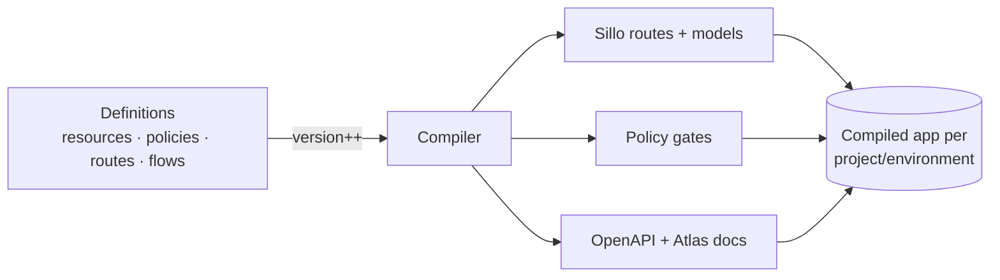
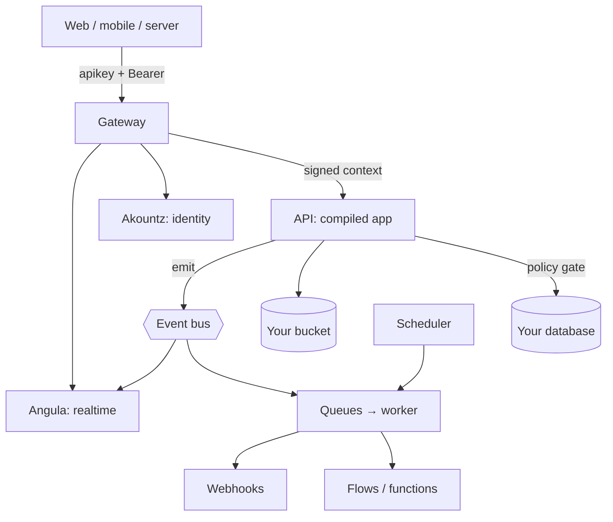

Pawabase is easiest to understand as **a compiler for backends**. You don't write request handlers; you describe the backend as data, and Pawabase compiles it into a live application for each environment. Five ideas explain almost everything.

## 1. Definitions are data

Resources, schemas, transformers, policies, routes, flows, buckets, mail templates, event subscriptions, webhooks, inbound hooks and schedules are all **definitions**: JSON documents stored per environment, versioned, editable in Studio or through the Platform API, and copyable between environments.

```json
{
  "name": "todos",
  "fields": [{ "name": "title", "type": "string", "required": true, "max_length": 200 }],
  "owner_field": "owner_id",
  "operations": {
    "list": { "enabled": true, "policy": "owner" },
    "create": { "enabled": true, "policy": "authenticated" }
  }
}
```

Because definitions are data, Studio can render real forms for them, the platform can validate them before saving, and [promotion](/operate/environments-and-promotion) is a copy, not a deploy.

## 2. Each environment compiles into an app

When a definition changes, the environment's **version** increments and the API recompiles that environment into a real Sillo application:

- every enabled resource operation becomes a route with **generated Pydantic request and response models**;
- every custom route becomes a route whose handler runs a flow or a Python function;
- your project's Python router, if any, is mounted;
- a policy gate is attached to every route;
- Sillo generates the OpenAPI document, and Atlas renders it.

So validation, docs and routing aren't approximations of your definitions; they *are* your definitions, compiled.



## 3. The gateway turns keys into context

Clients only ever talk to the **gateway**. It resolves the `apikey` to a project environment, applies CORS and rate limits, strips anything that could impersonate the platform, and forwards a short-lived **signed context** (`X-Pawabase-Context`: project, environment, key id, role, scopes). Internal services trust that signature, never a raw key.

User identity travels separately as `Authorization: Bearer <token>`, signed with a key derived for **that environment only**, so a token can't cross environments.

[Credentials →](/concepts/credentials) · [Request lifecycle →](/concepts/request-lifecycle)

## 4. Policies decide, everywhere

A policy is a small JSON condition over a context:

| Context | What it holds |
| --- | --- |
| `auth` | Who is calling: `user_id`, `email`, `roles`, `permissions`, `org`, `aal`, `kind` |
| `credential` | Which key: `role` (`publishable`/`secret`), `is_service`, `scopes` |
| `record` | The row being read or written |
| `input` | The submitted body |
| `request` | Method, path, IP, params, query |
| `project`, `env` | Where |

The same engine guards resource operations, custom routes, functions, flows' HTTP triggers, storage buckets and realtime channels. On list requests, conditions on record fields are **pushed down into SQL**. [Policies →](/policies/overview)

## 5. Everything emits events

Resource writes, auth activity and your own flows emit **events** (`todos.created`, `user.created`, `invoice.paid`). The event processor records each one, then fans it out to subscriptions: flows, functions, realtime channels and signed outbound webhooks, through durable queues with retries. [Events →](/events/overview)

## Putting it together



<Tip>
When something surprises you, ask three questions: **which definition** produced this route, **which context** reached the policy, and **which event** was emitted. Studio's Observability and Events & runs pages answer all three.
</Tip>
