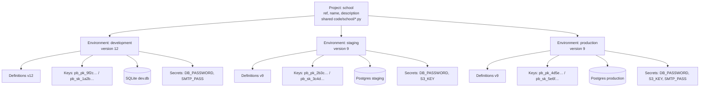
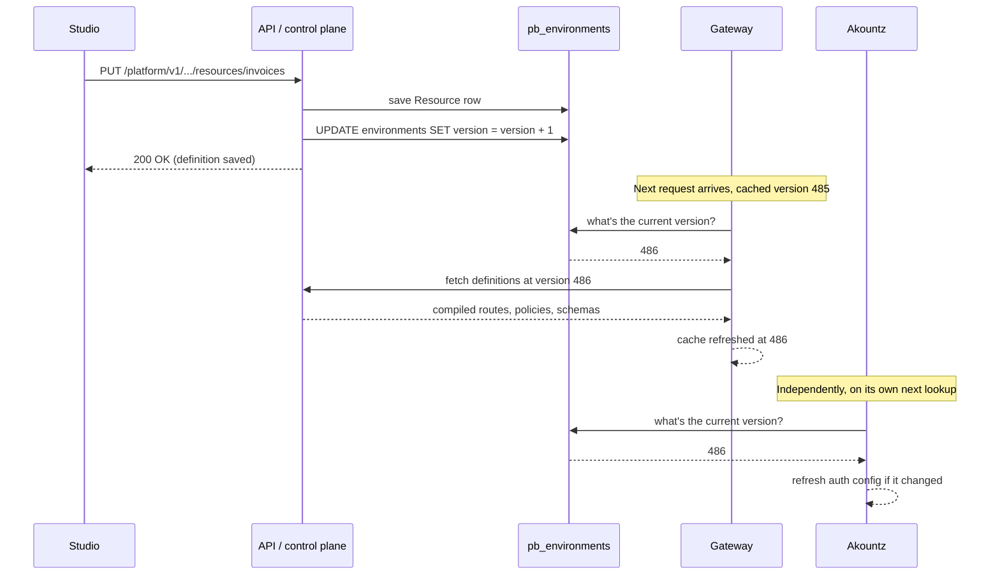
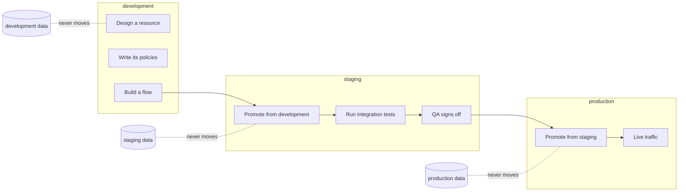
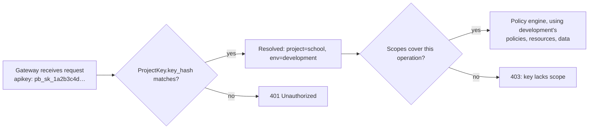

Every backend you build on Pawabase lives inside exactly one **project**, and every project is split into one or more **environments**. This single idea — one project, many isolated environments — is the organizing structure for everything else in the platform: the resources you define, the policies that guard them, the keys that unlock them, the data your users create, and the audit trail that records who changed what. Understanding it well pays off immediately, because almost every mistake people make in their first week (a key that "doesn't work", a user who "disappeared", data that "went missing" after a promotion) traces back to a wrong assumption about what a project shares and what an environment keeps to itself.

This page is the complete reference for that structure. It covers:

<CardGroup cols={3}>
  <Card title="Projects" icon="folder">
    What a project is, its `ref`, and what's shared across every environment inside it.
  </Card>
  <Card title="Environments" icon="layers">
    What's isolated per `(project, environment)` pair, down to the exact database table.
  </Card>
  <Card title="Promotion & blueprints" icon="git-branch">
    Moving definitions between environments, and exporting a whole system to start a new one.
  </Card>
</CardGroup>

If you've used other backend platforms, the closest analogues are a Supabase "project" (roughly a Pawabase environment, since Supabase doesn't nest environments inside a project the same way) or a Firebase "project" with multiple "sites". Pawabase's two-level structure — project, then environment — exists specifically so that `development`, `staging` and `production` can share the same design (the same resources, the same policies, the same flows) while never sharing the same rows, the same keys, or the same signing secret.

## Projects

A **project** is one application backend: a school management system, a marketplace, a SaaS product, an internal tool. It corresponds to one codebase, one Studio sidebar, one set of resources and flows — the thing you'd call "the app" if someone asked what you're building.

Every project has three identifying pieces of data, stored on the `pb_projects` table:

| Field | Type | Notes |
| --- | --- | --- |
| `ref` | `CharField(63)`, unique, indexed | Lower-case, stable, URL-safe. Used in gateway paths, in code directories (`code/<ref>/`), and as the project segment of every Platform API URL. |
| `name` | `CharField(200)` | The display name shown in Studio and audit logs. Editable at any time. |
| `description` | `TextField` | Free text, defaults to empty. Editable at any time. |
| `created_by` | `CharField(255)`, nullable | The operator who created the project, for the audit trail. |

The `ref` is the one field that matters structurally. It appears in:

- gateway paths for some deployments (`https://api.example.com/<ref>/rest/v1/...`, depending on your routing mode);
- the Platform API URL for every operation on the project (`/platform/v1/projects/<ref>/...`);
- the project's Python code directory (`code/<ref>/functions.py`, `code/<ref>/policies.py`, `code/<ref>/transformers.py`, `code/<ref>/routes.py`);
- audit entries, which record `project=<ref>` on every change.

Because so much keys off it, `ref` is effectively permanent once traffic depends on it. See [Can I rename a project ref?](#can-i-rename-a-project-ref) in the FAQ below for what to do if you need to.

<Note>
Creating a project is an **operator** action — it uses the Platform API with an operator session (the same credential Studio uses), not a publishable or secret key. Regular API keys belong to *environments*, not to the project itself, because there's nothing at the project level for an application to call: applications talk to one environment at a time. See [Credentials](/concepts/credentials) for the full breakdown of operator sessions versus API keys.
</Note>

### Creating a project

The minimal request creates a project with the platform's two default environments:

```bash Create a project with default environments
curl -X POST "$STUDIO/studio/api/platform/projects" \
  -H "content-type: application/json" -H "X-XSRF-TOKEN: $XSRF" -b cookies.txt \
  -d '{
    "ref": "school",
    "name": "School Management System"
  }'
```

If you don't pass `environments`, the platform creates exactly two: `development` and `production` (that's the server-side default, `DEFAULT_ENVIRONMENTS = ["development", "production"]`). Most teams want a `staging` in between, so in practice you'll usually pass the list explicitly:

```bash Create a project with three environments
curl -X POST "$STUDIO/studio/api/platform/projects" \
  -H "content-type: application/json" -H "X-XSRF-TOKEN: $XSRF" -b cookies.txt \
  -d '{
    "ref": "school",
    "name": "School Management System",
    "description": "Fees, attendance, report cards and guardian communication.",
    "environments": ["development", "staging", "production"]
  }'
```

<Tip>
The **first environment in the list becomes the default** (`is_default = true`). "Default" only affects which environment Studio opens to when you pick a project and which one some UI shortcuts assume — it has no effect on isolation, promotion or keys. Put whichever environment you work in day to day first; for most teams that's `development`.
</Tip>

## Designing your environment topology

Before creating a project, it's worth deciding how many environments you actually want and what each one is for. There's no wrong number, but a few shapes come up repeatedly.

<Steps>
  <Step title="Start with the smallest set that separates 'safe to break' from 'real users'">
    Even a solo project benefits from at least two environments: one you experiment in freely, one real users depend on. That's the platform default (`development` + `production`) for a reason — it's the minimum viable topology, not a toy.
  </Step>
  <Step title="Add staging once more than one person touches the system">
    The moment a second developer, a QA process, or an external integrator needs to see "what's about to ship" without seeing "what's currently half-built in development", add `staging`. It becomes the [promotion](#promotion) target everyone reviews before `production`.
  </Step>
  <Step title="Add specialised environments only when they solve a real problem">
    A `demo` environment with curated sample data, a `qa` environment a separate testing team owns, a `sandbox` for destructive experiments that shouldn't interrupt `development` — each is a `POST /projects/{ref}/envs` away, and each costs nothing to have sitting idle. Don't create them speculatively; create them when a concrete workflow needs one.
  </Step>
  <Step title="Treat preview environments as disposable, not part of the topology">
    `preview-142`-style environments (see [Preview and ephemeral environments](#preview-and-ephemeral-environments)) shouldn't appear in your mental model of "the environments this project has" the way `staging` does — they're created and destroyed by automation, and a project with zero open PRs should have zero preview environments.
  </Step>
</Steps>

<Tabs>
  <Tab title="Solo project / side project">
    `development`, `production`. Skip `staging` until there's a second person or a paying customer who'd notice a bad deploy.
  </Tab>
  <Tab title="Small team shipping regularly">
    `development`, `staging`, `production`, plus preview environments per pull request. This is the shape most of this page's examples use.
  </Tab>
  <Tab title="Agency or platform serving multiple clients">
    One **project per client** (so `acme`, `globex`, `initech` are separate projects, each with their own `development`/`staging`/`production`), sharing a common design via a [blueprint](#blueprints) exported once and imported for each new client. This keeps each client's data, keys and secrets fully isolated from every other client's — nothing about the platform's isolation model is per-project-and-shared-database; it's per-project-and-per-environment, all the way down.
  </Tab>
  <Tab title="Regulated or compliance-sensitive systems">
    `development`, `staging`, `production`, plus a long-lived `qa` environment a compliance or audit team controls independently of engineering, so their sign-off environment isn't something engineers can casually promote over. Combine with tight [scopes](/concepts/credentials#scopes) on `qa`'s keys and close attention to [the audit log](#reading-the-audit-trail) for that environment.
  </Tab>
</Tabs>

## A full worked example: creating a project

Let's walk through the entire lifecycle of creating a project, end to end, so the shape of every response is concrete rather than abstract.

<Steps>
  <Step title="Send the create request">
    ```bash
    curl -X POST "$STUDIO/studio/api/platform/projects" \
      -H "content-type: application/json" -H "X-XSRF-TOKEN: $XSRF" -b cookies.txt \
      -d '{
        "ref": "school",
        "name": "School Management System",
        "description": "Fees, attendance, report cards and guardian communication.",
        "environments": ["development", "staging", "production"]
      }'
    ```
  </Step>
  <Step title="Read the response carefully">
    ```json 201 Created
    {
      "id": 14,
      "ref": "school",
      "name": "School Management System",
      "description": "Fees, attendance, report cards and guardian communication.",
      "created_by": "amara@school.example",
      "environments": ["development", "staging", "production"],
      "keys": {
        "development": {
          "publishable": "pb_pk_9f2c1a7e4b3d8f0a1c2e3d4f5a6b7c8d",
          "secret":      "pb_sk_1a2b3c4d5e6f7a8b9c0d1e2f3a4b5c6d"
        },
        "staging": {
          "publishable": "pb_pk_2b3c4d5e6f7a8b9c0d1e2f3a4b5c6d7e",
          "secret":      "pb_sk_3c4d5e6f7a8b9c0d1e2f3a4b5c6d7e8f"
        },
        "production": {
          "publishable": "pb_pk_4d5e6f7a8b9c0d1e2f3a4b5c6d7e8f9a",
          "secret":      "pb_sk_5e6f7a8b9c0d1e2f3a4b5c6d7e8f9a0b"
        }
      },
      "blueprint": null
    }
    ```
    Three things about this response only ever happen once:

    - **The secret keys are shown in full, exactly once, in this response.** After this, the API only ever returns a masked `prefix` (the first 14 characters, e.g. `pb_sk_1a2b3c4d`). There is no "show key" button anywhere, in Studio or the API, because the plaintext is never stored — only a SHA-256 hash (`ProjectKey.key_hash`) is kept. If you lose a key, you revoke it and create a new one.
    - **Every environment gets its own pair of keys automatically.** `development`'s publishable key is a different string from `staging`'s, which is different again from `production`'s. A key minted for one environment is meaningless against another — the gateway resolves the key to `(project, environment)` and everything downstream (policies, resources, the signing key) is scoped to that pair.
    - **`blueprint` is `null`** because this request didn't include one. See [Blueprints](#blueprints) below for what changes when it does.
  </Step>
  <Step title="Store the keys immediately">
    Put the secret keys in your secrets manager or `.env` files right away — `pb_sk_…` for server-side code, `pb_pk_…` for anything that ships to a browser or app. If you close this response without copying them, [create new keys](/operate/api-keys) rather than trying to recover the old ones.
  </Step>
  <Step title="Confirm the project exists">
    ```bash
    curl "$STUDIO/studio/api/platform/projects/school" \
      -H "X-XSRF-TOKEN: $XSRF" -b cookies.txt
    ```
    ```json 200 OK
    {
      "id": 14,
      "ref": "school",
      "name": "School Management System",
      "description": "Fees, attendance, report cards and guardian communication.",
      "created_by": "amara@school.example",
      "environments": [
        { "id": 41, "project": "school", "name": "development", "is_default": true,  "infra": {}, "auth": {}, "settings": { "public_docs": false }, "version": 1 },
        { "id": 42, "project": "school", "name": "staging",     "is_default": false, "infra": {}, "auth": {}, "settings": { "public_docs": false }, "version": 1 },
        { "id": 43, "project": "school", "name": "production",  "is_default": false, "infra": {}, "auth": {}, "settings": { "public_docs": false }, "version": 1 }
      ]
    }
    ```
    Notice each environment starts at `version: 1` with empty `infra` and `auth` — no database is configured yet, and no auth provider is enabled. `settings` starts with `public_docs: false`, so the OpenAPI docs aren't public by default. You'll configure infrastructure next (see [Infrastructure per environment](#infrastructure-per-environment)).
  </Step>
</Steps>

<Warning>
A `409 Conflict` (`project 'school' already exists`) means the `ref` is taken. Refs are unique across the whole installation, not per organization, so pick something specific rather than a generic word if you're on a shared Pawabase instance.
</Warning>

### Creating a project in different tools

<Tabs>
  <Tab title="curl / Platform API">
    ```bash
    curl -X POST "$STUDIO/studio/api/platform/projects" \
      -H "content-type: application/json" -H "X-XSRF-TOKEN: $XSRF" -b cookies.txt \
      -d '{ "ref": "school", "name": "School Management System",
            "environments": ["development", "staging", "production"] }'
    ```
  </Tab>
  <Tab title="Python (httpx)">
    ```python
    import httpx

    client = httpx.Client(base_url="https://studio.example.com/studio/api/platform",
                           cookies={"session": SESSION_COOKIE},
                           headers={"X-XSRF-TOKEN": XSRF_TOKEN})

    response = client.post("/projects", json={
        "ref": "school",
        "name": "School Management System",
        "description": "Fees, attendance, report cards and guardian communication.",
        "environments": ["development", "staging", "production"],
    })
    response.raise_for_status()
    created_project = response.json()
    dev_keys = created_project["keys"]["development"]
    print("development secret key:", dev_keys["secret"])
    ```
  </Tab>
  <Tab title="Studio">
    <Steps>
      <Step title="Open the project switcher">Click the project name in the top-left corner, then **New project**.</Step>
      <Step title="Fill in ref, name, description">Studio validates the `ref` pattern as you type and warns before you can submit an invalid one.</Step>
      <Step title="Choose the starting environments">A checkbox list defaults to `development` and `production`; add `staging` or any others before submitting — environments can also be added later, this step is only a convenience.</Step>
      <Step title="Copy the keys from the confirmation screen">Studio shows the same one-time key reveal the API response carries, with a copy-to-clipboard button per key. Closing this screen without copying means creating new keys afterward.</Step>
    </Steps>
  </Tab>
</Tabs>

## Environments

An **environment** is a fully isolated stage of a project — `development`, `staging`, `production`, or a short-lived `preview-142`. The model backing it, `Environment`, lives on the `pb_environments` table:

| Field | Type | Notes |
| --- | --- | --- |
| `id` | `IntField`, primary key | |
| `project` | FK → `Project`, `on_delete=CASCADE` | Deleting a project deletes every one of its environments. |
| `name` | `CharField(63)` | Unique **within the project** (`unique_together = (("project", "name"),)`), so `school/staging` and `billing/staging` are unrelated. |
| `is_default` | `BooleanField`, default `false` | Exactly one environment per project should carry this; see below. |
| `infra` | JSON, default `{}` | Database, storage, mail, Redis. `secret://NAME` references inside, never raw credentials. |
| `auth` | JSON, default `{}` | Akountz configuration: token lifetimes, password rules, enabled providers, redirect URLs. |
| `settings` | JSON, default `{}` | CORS origins, whether the OpenAPI docs are public, rate limits — everything that isn't infra or auth. |
| `version` | `IntField`, default `1` | Bumped on every definition change. See [Versions](#versions). |

Everything the platform stores that isn't the project's shared code is keyed by the pair `(project, environment)` — not by project alone. That's the whole isolation model in one sentence, and it's worth internalizing before you touch infrastructure settings or write your first policy, because it explains *why* a `development` user token is rejected in `production`, why copying `staging`'s database URL into `production`'s settings would point two environments at the same rows, and why deleting an environment is scoped and irreversible only for that one environment.



Notice that `staging` and `production` in this diagram sit at the *same* definitions version (9) — that's the signature of a recent promotion — while `development` has moved ahead to 12 because someone kept iterating after promoting.

### What "isolated" and "shared" mean precisely

<CardGroup cols={2}>
  <Card title="Isolated per environment" icon="lock">
    Definitions and their version number · API keys · secrets · the token signing key · resource data (its own `database_url`) · storage (its own driver/bucket) · mail settings · auth settings and users · queues and event history · realtime rooms · the audit trail's `env` column
  </Card>
  <Card title="Shared by the project" icon="share-2">
    The name, reference and description · project code under `code/<ref>/` (functions, policies written in Python, transformers, custom routes), loaded once and available to every environment
  </Card>
</CardGroup>

<Note>
"Code is shared, data is not" is the single sentence to remember. Your Python functions, the transformer logic, custom route handlers — all of that is one set of files, loaded for whichever environment is handling the request. But every *definition* stored as JSON (resources, policies, schemas, flows, routes, buckets, mail templates, subscriptions, webhooks, inbound hooks, schedules — the [twelve kinds](/concepts/definitions-as-data)) is a separate row per environment, and every *row of your application's data* lives in that environment's own database.
</Note>

### The precise isolation table

The table above is a quick summary; here is the same information traced to the actual models and stores, so there's no ambiguity about a specific piece of data.

| What | Scope | Backing model / store | Notes |
| --- | --- | --- | --- |
| Project `ref`, `name`, `description` | Project | `Project` (`pb_projects`) | One row per project, shared by every environment. |
| Project Python code (functions, Python policies, transformers, custom route handlers) | Project | Filesystem under `code/<ref>/` | Loaded once per project; the same module serves every environment's requests, reading `ctx.env` to branch if it needs to. |
| Environment `infra`, `auth`, `settings`, `version` | Environment | `Environment` (`pb_environments`) | One row per `(project, name)`. |
| Resources, schemas, transformers, policies, routes, flows, buckets, mail templates, subscriptions, webhooks, inbound hooks, schedules | Environment | Each kind's own table, foreign-keyed to `Environment` | The [twelve definition kinds](#definitions-are-environment-scoped-too); see the dedicated table below. |
| API keys (publishable and secret) | Environment | `ProjectKey` (`pb_project_keys`), FK → `Environment` | A key minted in `staging` doesn't exist in `production`'s key table at all. |
| Secrets (`secret://NAME` values) | Environment | `Secret` (`pb_secrets`), FK → `Environment`, `unique_together(environment, name)` | The same `NAME` (e.g. `DB_PASSWORD`) can exist in two environments with two different ciphertexts, or exist in one and not the other. |
| The token signing key | Environment | Derived, not stored as a row | `HMAC(master_key, "<project>:<env>")` — see [Why signing keys are per environment](#why-signing-keys-are-derived-per-environment). |
| Application data (resource rows) | Environment | The environment's own `database_url` | A completely separate database (or at minimum a separate schema/namespace) per environment; see [Infrastructure per environment](#infrastructure-per-environment). |
| Users and sessions (Akountz) | Environment | Tables in the environment's own database | Signing up in `development` creates a row nowhere `staging` or `production` can see. |
| Storage objects | Environment | The environment's own storage driver/bucket | `development` can point at local disk while `production` points at S3; they never share a bucket by default. |
| Queues and event history | Environment | The environment's own database/broker | Background jobs and the events an environment has processed are not visible from another environment. |
| Realtime rooms | Environment | In-memory / broker state scoped to `(project, env)` | A client subscribed against `staging`'s publishable key never receives `production` broadcasts. |
| Audit entries | Installation-wide table, but tagged | `AuditEntry` (`pb_audit`) | Every entry carries `project` and `env` columns (both nullable, both populated for project/environment-scoped actions), so the trail is queryable per environment even though the table itself isn't partitioned. |

### Why signing keys are derived per environment

<Note>
Users are per environment. A user who signs up in `development` doesn't exist in `production`, and a `development` access token is rejected by `production` because the signing keys differ: `HMAC(master_key, "<project>:<env>")`.
</Note>

This is worth expanding, because it's the mechanism, not just the policy, that makes cross-environment tokens impossible — it isn't merely that the platform *chooses* to reject them, it's that they don't verify. Each `(project, environment)` pair derives its own HMAC signing key from one master key and the pair's identity string. Two consequences follow directly:

1. **A `development` token presented to `production` fails signature verification**, the same way a token signed by a different service entirely would. There's no environment check to bypass — the token is cryptographically meaningless outside the environment that issued it.
2. **Rotating the master key (a break-glass operation) invalidates every token in every environment of every project at once.** It's a last resort, not a per-environment action — see [security](/operate/security) for when that's appropriate.

### Definitions are environment-scoped too

The [twelve definition kinds](/concepts/definitions-as-data) — everything you build in Studio short of raw Python — are stored per environment, each on its own table, each foreign-keyed (directly or through a parent) to the owning `Environment`:

| Kind | Keyed by | Kept in the environment's own table |
| --- | --- | --- |
| Schema | `name` | Yes |
| Transformer | `name` | Yes |
| Policy | `name` | Yes |
| Resource | `name` | Yes |
| Route | `id` (method + path) | Yes |
| Flow | `name` | Yes |
| Bucket | `name` | Yes |
| Mail template | `name` | Yes |
| Event subscription | `name` | Yes |
| Webhook | `name` | Yes |
| Inbound hook | `slug` | Yes |
| Schedule | `name` | Yes |

A resource named `invoices` in `development` and a resource named `invoices` in `production` are two entirely separate rows that happen to share a name, in the same way `staging` and `billing` project both having an environment called `staging` doesn't make those two `staging`s related. [Promotion](#promotion) is precisely the operation of copying one environment's definition rows into another's, matched by name.

### The default environment

`is_default` marks the environment Studio opens to first for a given project, and the one some shorthand tooling assumes when you don't specify one explicitly. It carries **no** isolation meaning — a non-default environment is exactly as isolated, exactly as production-capable, as the default one. Changing which environment is the default is a `PATCH` that sets `is_default: true` on the target; the server then clears the flag on every sibling environment in the same transaction (`Environment.filter(project_id=...).update(is_default=False)` followed by setting the new one), so there's never a moment with two defaults or zero defaults.

```bash Change which environment is default
curl -X PATCH "$STUDIO/studio/api/platform/projects/school/envs/staging" \
  -H "content-type: application/json" -H "X-XSRF-TOKEN: $XSRF" -b cookies.txt \
  -d '{ "is_default": true }'
```

## Why environments are isolated

It's worth stating the rationale plainly, because the isolation model shapes several decisions you'll make later (how many environments to run, whether to share a database "just for now", how to handle PR previews).

<AccordionGroup>
  <Accordion title="Blast radius">
    A bug in a flow, a policy typo that opens up a resource, a runaway background job — all of these are contained to the one environment they ran in. If `development` gets thoroughly broken while you're experimenting, `production` traffic is unaffected: different database, different keys, different signing key, different everything except the shared Python code (and even that, guarded by [promotion](#promotion) not touching it automatically — Python code is deployed by you, on your own schedule).
  </Accordion>
  <Accordion title="Safe experimentation with real shapes">
    Because `staging` uses the same resource/policy/flow *definitions* as `production` (once promoted), you test against the real shape of your API — the same validation, the same access rules, the same flow logic — without touching real data or real users. This is a meaningfully stronger guarantee than "a copy of the code" gives you in frameworks where configuration and business logic live in the same repository as ad-hoc environment branches.
  </Accordion>
  <Accordion title="Compliance and least privilege">
    Production secrets (payment provider keys, SMTP credentials for real customer email, the production database password) never need to exist anywhere near a developer's laptop. `development`'s secrets are a different keyring entirely, encrypted separately, and a developer with full access to `development`'s `Secret` rows has zero access to `production`'s.
  </Accordion>
  <Accordion title="Auditable promotion instead of silent drift">
    Because the boundary between environments is a deliberate, logged action (`environment.promoted` in the audit trail, with `from`, `to` and which kinds were `copied`), "what's actually running in production" is always answerable by looking at the last promotion, rather than by diffing a deploy branch against a moving target.
  </Accordion>
</AccordionGroup>

## Creating more environments

Beyond the environments a project starts with, you can create as many as you need — most commonly for short-lived previews, but also for things like a `demo` environment with curated sample data, or a `qa` environment a testing team owns separately from `staging`.

```bash Create a fourth environment
curl -X POST "$STUDIO/studio/api/platform/projects/school/envs" \
  -H "content-type: application/json" -H "X-XSRF-TOKEN: $XSRF" -b cookies.txt \
  -d '{ "name": "qa", "copy_from": "staging" }'
```

```json 201 Created
{
  "id": 57,
  "project": "school",
  "name": "qa",
  "is_default": false,
  "infra": {},
  "auth": {},
  "settings": { "public_docs": false },
  "version": 1,
  "keys": {
    "publishable": "pb_pk_7a8b9c0d1e2f3a4b5c6d7e8f9a0b1c2d",
    "secret": "pb_sk_8b9c0d1e2f3a4b5c6d7e8f9a0b1c2d3e"
  },
  "copied": {
    "schemas": 4, "transformers": 2, "policies": 11, "resources": 23,
    "mail-templates": 3, "flows": 19, "routes": 6, "buckets": 2,
    "subscriptions": 5, "webhooks": 1, "inbound-hooks": 0, "schedules": 2
  }
}
```

Four things happen in this one call, in this order:

1. A new `Environment` row is created (`name` must match `NAME_PATTERN`; `is_default` starts `false`).
2. A fresh publishable and secret key pair is minted for it, shown once, exactly as at project creation.
3. Because `copy_from: "staging"` was given, every definition in `staging` is copied into `qa`, matched and counted per kind (`copied`).
4. `environment.created` is recorded in the audit trail (`target: "qa"`).

<Warning>
`copy_from` copies **definitions only** — the counts you see in `copied`. It never copies `infra`, `auth`, `settings`, keys, secrets, data, or users. The new environment starts with empty infrastructure (no `database_url`, no storage, no mail) exactly like a brand-new environment created without `copy_from`, so a freshly copied `qa` environment can't actually serve requests until you configure its infrastructure — see the next section.
</Warning>

If you omit `copy_from`, the environment is created completely empty — no definitions either, a truly blank slate:

```bash Create a completely empty environment
curl -X POST "$STUDIO/studio/api/platform/projects/school/envs" \
  -H "content-type: application/json" -H "X-XSRF-TOKEN: $XSRF" -b cookies.txt \
  -d '{ "name": "sandbox" }'
```

### Deleting an environment

```bash
curl -X DELETE "$STUDIO/studio/api/platform/projects/school/envs/preview-42" \
  -H "X-XSRF-TOKEN: $XSRF" -b cookies.txt
```

Deleting an environment is irreversible: it cascades to every definition, key, and secret row scoped to it (`Environment` is a normal `ForeignKeyField(..., on_delete=CASCADE)` target throughout), and the application data in its own database is untouched by the platform (deleting the environment record doesn't drop the database itself — see the note below).

<Warning>
A project always keeps **at least one** environment. Deleting the last remaining environment on a project returns `409 Conflict` (`a project keeps at least one environment`). To fully retire a project, delete the project itself, which cascades to all of its environments at once.
</Warning>

<Note>
Deleting an `Environment` row removes the platform's *record* of that environment — its definitions, keys and secrets. It does not reach into the external database, storage bucket, or mail provider referenced by `infra` and delete anything there; that infrastructure is yours to provision and yours to tear down. This matters most for [preview environments](#preview-and-ephemeral-environments): if a preview's database was provisioned specifically for it, clean that database up as part of the same automation that calls `DELETE .../envs/preview-42`.
</Note>

## Preview and ephemeral environments

The `copy_from` + delete pair exists specifically to make short-lived environments cheap. A common pattern is one environment per open pull request, created when the PR opens and destroyed when it merges or closes.

<Steps>
  <Step title="Name the preview after the PR">
    A predictable naming convention lets your CI script compute the environment name without looking anything up: `preview-142` for PR #142, or `pr-142-add-invoicing` if you want the name to also be self-descriptive in Studio's environment list. Names must match `NAME_PATTERN` (lower-case, digits and hyphens), and must be unique within the project.
  </Step>
  <Step title="Create it from staging when the PR opens">
    ```bash
    curl -X POST "$STUDIO/studio/api/platform/projects/school/envs" \
      -H "content-type: application/json" -H "X-XSRF-TOKEN: $XSRF" -b cookies.txt \
      -d '{ "name": "preview-142", "copy_from": "staging" }'
    ```
    This gives the preview the exact set of resources, policies and flows currently on `staging` — the same baseline every reviewer expects — plus its own fresh keys.
  </Step>
  <Step title="Point its infrastructure at something disposable">
    Most teams give preview environments a small, disposable Postgres database (a branch database if your provider supports branching, or a database created and dropped by CI) rather than sharing `staging`'s. See [Infrastructure per environment](#infrastructure-per-environment) for the settings call. Sharing `staging`'s database defeats the purpose — two PRs previewing at once would corrupt each other's test data.
  </Step>
  <Step title="Hand the keys to your preview deploy">
    The publishable/secret pair from step 2's response goes into the preview deployment's environment variables (e.g. a Vercel/Netlify preview deploy, or a namespaced Kubernetes deployment) — never committed to the repository.
  </Step>
  <Step title="Delete it when the PR closes">
    ```bash
    curl -X DELETE "$STUDIO/studio/api/platform/projects/school/envs/preview-142" \
      -H "X-XSRF-TOKEN: $XSRF" -b cookies.txt
    ```
    Wire this into the same CI workflow that tears down the preview deploy, so previews don't accumulate. A project with forty stale `preview-*` environments is harmless functionally, but it clutters Studio's environment picker and the audit log.
  </Step>
</Steps>

<Tip>
Preview environments are also useful for demos: `demo-acme-corp`, seeded via [a blueprint's sample data](#exporting-and-importing-sample-data) or a one-off seed flow, handed to a prospect with a time-boxed publishable key, then deleted after the call.
</Tip>

## Infrastructure per environment

Each environment points at its own infrastructure under **Settings → Infrastructure** in Studio, or directly via `PATCH /projects/{ref}/envs/{env}`. The three sections — `infra`, `auth`, `settings` — are merged shallowly on update: keys you send replace the existing value, keys you omit are left alone, and a key sent as `null` is removed.

```json A typical production infra block
{
  "database_url": "postgres://app:secret://DB_PASSWORD@db.internal:5432/school",
  "storage": {
    "driver": "s3",
    "bucket": "school-prod",
    "region": "eu-west-1",
    "access_key": "secret://S3_KEY",
    "secret_key": "secret://S3_SECRET"
  },
  "mail": {
    "host": "smtp.postmarkapp.com",
    "port": 587,
    "username": "secret://SMTP_USER",
    "password": "secret://SMTP_PASS",
    "from": "School <no-reply@school.example>"
  }
}
```

Values written as `secret://NAME` are resolved from that environment's encrypted [secrets](/operate/secrets) at the moment they're used, and are **never** returned by the API — `GET`ting an environment shows you the `secret://NAME` reference, not the value behind it. Setting a secret is a separate call that never echoes the value back:

```bash Set the secret a reference points at
curl -X PUT "$STUDIO/studio/api/platform/projects/school/envs/production/secrets/DB_PASSWORD" \
  -H "content-type: application/json" -H "X-XSRF-TOKEN: $XSRF" -b cookies.txt \
  -d '{ "value": "correct horse battery staple", "description": "Production Postgres app user password" }'
```

```json 200 OK
{ "name": "DB_PASSWORD", "reference": "secret://DB_PASSWORD" }
```

Secret names are `UPPER_SNAKE_CASE` (`^[A-Z][A-Z0-9_]{0,127}$`) — lower-case or hyphenated names are refused with `422`. Full reference: [environment settings](/reference/environment-settings) and [secrets](/operate/secrets).

### Worked example: dev on SQLite, staging and production on Postgres

A common, deliberately asymmetric setup:

<Tabs>
  <Tab title="development">
    ```bash
    curl -X PATCH "$STUDIO/studio/api/platform/projects/school/envs/development" \
      -H "content-type: application/json" -H "X-XSRF-TOKEN: $XSRF" -b cookies.txt \
      -d '{ "infra": { "database_url": "sqlite:///./dev.db" } }'
    ```
    No `secret://` reference needed — there's no password to protect for a local SQLite file. Storage and mail can be left unset entirely; Pawabase falls back to safe local defaults for development (local disk storage, and mail that logs instead of sends, depending on your deployment's dev defaults — see [environment settings](/reference/environment-settings) for exact fallback behavior).
  </Tab>
  <Tab title="staging">
    ```bash
    curl -X PATCH "$STUDIO/studio/api/platform/projects/school/envs/staging" \
      -H "content-type: application/json" -H "X-XSRF-TOKEN: $XSRF" -b cookies.txt \
      -d '{
        "infra": {
          "database_url": "postgres://app:secret://DB_PASSWORD@db.internal:5432/school_staging",
          "storage": { "driver": "s3", "bucket": "school-staging", "region": "eu-west-1",
                       "access_key": "secret://S3_KEY", "secret_key": "secret://S3_SECRET" }
        }
      }'
    ```
    A right-sized Postgres, and a separate S3 bucket from production so a staging bug that lists or deletes objects can't touch real files.
  </Tab>
  <Tab title="production">
    ```bash
    curl -X PATCH "$STUDIO/studio/api/platform/projects/school/envs/production" \
      -H "content-type: application/json" -H "X-XSRF-TOKEN: $XSRF" -b cookies.txt \
      -d '{
        "infra": {
          "database_url": "postgres://app:secret://DB_PASSWORD@db.internal:5432/school_prod",
          "storage": { "driver": "s3", "bucket": "school-prod", "region": "eu-west-1",
                       "access_key": "secret://S3_KEY", "secret_key": "secret://S3_SECRET" },
          "mail": { "host": "smtp.postmarkapp.com", "port": 587,
                    "username": "secret://SMTP_USER", "password": "secret://SMTP_PASS",
                    "from": "School <no-reply@school.example>" }
        }
      }'
    ```
    Notice `staging` and `production` reuse the secret *name* `DB_PASSWORD`, but because secrets are stored per environment (`unique_together(environment, name)`), these are two different `Secret` rows with two different ciphertexts and, almost certainly, two different actual passwords.
  </Tab>
</Tabs>

### What happens when infrastructure is missing or wrong

Because `infra` starts empty on a brand-new environment, and because `PATCH` only merges the keys you send, it's possible to have an environment whose `database_url` is unset, or whose `storage` block references a `secret://` name that was never set. Two situations to know:

<Tabs>
  <Tab title="Missing database_url">
    Requests that need the database (resource operations, most flows, Akountz) fail at the point they try to reach it, generally with a clear connection/configuration error rather than a silent no-op. A brand-new environment created with `copy_from` has real *definitions* (resources, policies) but no working data layer until you configure `infra.database_url` — this is why the [preview environment](#preview-and-ephemeral-environments) workflow explicitly calls out setting infrastructure as its own step, separate from copying definitions.
  </Tab>
  <Tab title="A secret:// reference that doesn't resolve">
    If `infra` names `secret://S3_SECRET` but no `Secret` row named `S3_SECRET` exists in that environment, resolution fails when the value is actually needed (e.g. the first storage operation), not at the moment you saved the `infra` block — saving `infra` doesn't validate that every reference resolves, because you may deliberately set the reference before setting the secret (or vice versa). Treat "I set the infra block" and "I set the secrets it references" as two steps of one checklist, and verify with a real request (upload a test file, send a test email) after both are done rather than assuming success from a `200` on the `PATCH`.
  </Tab>
</Tabs>

<Tip>
Studio's environment overview surfaces obviously-missing infrastructure (no database configured at all) as a warning, but it can't detect a *wrong* password or a *typo'd* bucket name — those only surface when something tries to use them. Smoke-test new infrastructure with a real request before pointing real traffic at it.
</Tip>

## A typical setup

| Environment | Database | Keys used by | Purpose |
| --- | --- | --- | --- |
| `development` | SQLite default, or a local Postgres | Your laptop | Designing resources, flows, policies |
| `staging` | A copy-sized Postgres | CI, QA, preview deploys | Promotion target, integration tests |
| `production` | Your production Postgres, S3, SMTP | Your real apps | Live traffic |

Design in `development`, [promote](#promotion) definitions to `staging`, verify, promote to `production`. Data, keys and secrets never move — only the shape of your API does.

<CardGroup cols={3}>
  <Card title="development" icon="hammer">
    Fast iteration. Disposable data. Okay to break. Usually the `is_default` environment.
  </Card>
  <Card title="staging" icon="flask-conical">
    A faithful rehearsal of production's definitions, on data that doesn't matter, reachable by CI and by human QA.
  </Card>
  <Card title="production" icon="rocket">
    The environment your real users' tokens are signed against. Infrastructure changes here deserve the most caution and the tightest secret hygiene.
  </Card>
</CardGroup>

## Versions

Every definition change — saving a resource, updating a policy, adding a flow node, deleting a route — increments the owning environment's `version` counter by exactly one (`Environment.version`, `IntField(default=1)`). This one integer is how the rest of the platform knows, cheaply, whether anything changed since it last looked.

### What depends on the version counter

<Tabs>
  <Tab title="The compiled app">
    Resources, routes and flows aren't interpreted from raw JSON on every request — they're compiled once into an in-memory representation (route table, validators, policy trees) and reused. That compiled form is cached against the version it was built from. A request arrives, the runtime checks "is my cached version still current?", and if the environment's `version` has moved on, it recompiles before serving the request. If it hasn't moved, it serves immediately from cache.
  </Tab>
  <Tab title="Cached configuration in other services">
    Pawabase runs as several services (the API/control-plane, the gateway, Akountz for auth, and others depending on your deployment), each of which caches the environment's configuration — its resources, policies, auth settings — locally for speed rather than hitting the database on every request. Each of those caches is keyed the same way: by `(project, env, version)`. When a service's cached version falls behind, it refreshes.
  </Tab>
  <Tab title="The OpenAPI document">
    The `/docs` and `/openapi.json` endpoints reflect exactly the resources, schemas and routes defined as of the environment's current version. Generating it is itself gated on the version, so the documentation and the enforced behavior can never disagree — there's no separate "regenerate docs" step to forget.
  </Tab>
</Tabs>

### A definition save, traced through the system



Two properties fall out of this design, and both are deliberate:

- **There's no deploy step.** A definition change is live on the very next request that hits a service whose cache is stale, typically within seconds, because services check the version cheaply and only pay the cost of a full refresh when it's actually moved.
- **Services refresh independently, on their own schedule.** The gateway and Akountz don't need to be told to refresh by the API — each one notices its cached version is behind the next time it checks, which means a save can be "live" for the gateway a moment before or after it's live for Akountz. In practice this window is small, but it's why a definition change and an auth-settings change made in the same breath aren't guaranteed to become visible in the exact same millisecond across every service.

Studio's project overview page shows the current version directly (`definitions version 486`), which is the fastest way to answer "did my last save actually take?" without re-reading the definition itself.

<Note>
Version numbers are **per environment**, not per project and not global. `development` reaching version 900 after months of iteration says nothing about `staging`'s version — after a promotion, `staging`'s counter simply continues from wherever it already was; promotion does not attempt to make version numbers match across environments; the numbers can and usually will diverge immediately after being equal.
</Note>

## Promotion

**Promotion** is the operation of copying one environment's *definitions* into another, matched by name — the mechanism behind "design in development, promote to staging, promote to production" from [A typical setup](#a-typical-setup) above.

```bash Promote staging's definitions to production
curl -X POST "$STUDIO/studio/api/platform/projects/school/envs/staging/promote" \
  -H "content-type: application/json" -H "X-XSRF-TOKEN: $XSRF" -b cookies.txt \
  -d '{ "to": "production" }'
```

```json 200 OK
{
  "from": "staging",
  "to": "production",
  "copied": {
    "schemas": 4, "transformers": 2, "policies": 11, "resources": 23,
    "mail-templates": 3, "flows": 19, "routes": 6, "buckets": 2,
    "subscriptions": 5, "webhooks": 1, "inbound-hooks": 0, "schedules": 2
  }
}
```

### What gets copied, and what never moves

<CardGroup cols={2}>
  <Card title="Copied" icon="copy">
    Every definition kind: schemas, transformers, policies, resources, routes, flows, buckets, mail templates, event subscriptions, webhooks, inbound hooks, schedules — matched by name (or `id` for routes) between the source and target environment.
  </Card>
  <Card title="Never moved" icon="shield-off">
    Application data (rows in your resources), users and sessions, API keys, secrets, infrastructure settings (`infra`), auth settings (`auth`), and non-definition environment `settings`. The target environment's own infrastructure, secrets and data are completely untouched by a promotion.
  </Card>
</CardGroup>

<Warning>
Promotion **overwrites** matching definitions in the target by name. If `production` already has a `resources/invoices` definition and `staging` also has one, promoting replaces `production`'s with `staging`'s. This is the intended behavior — promotion is how you *ship* a change — but it means promotion is not a merge: if someone hand-edited a definition directly in `production` (which policies, budget and discipline should generally discourage), that edit is lost on the next promotion from `staging`. Prefer making every change in `development`/`staging` first and treating `production`'s definitions as a promotion target, not a place to hand-author changes.
</Warning>

### Promoting only some kinds

`include` restricts promotion to specific definition kinds, by their path (the same paths used in the [definitions API](/concepts/definitions-as-data) and shown in the `copied` counts above: `schemas`, `transformers`, `policies`, `resources`, `routes`, `flows`, `buckets`, `mail-templates`, `subscriptions`, `webhooks`, `inbound-hooks`, `schedules`):

```bash Promote only policies and resources
curl -X POST "$STUDIO/studio/api/platform/projects/school/envs/staging/promote" \
  -H "content-type: application/json" -H "X-XSRF-TOKEN: $XSRF" -b cookies.txt \
  -d '{ "to": "production", "include": ["policies", "resources"] }'
```

```json 200 OK
{ "from": "staging", "to": "production", "copied": { "policies": 11, "resources": 23 } }
```

This is useful for a hotfix: you fixed one policy in `staging` and want it in `production` immediately, without also shipping half-finished flow changes that happen to also be sitting in `staging` at the moment.

### The typical dev → staging → production flow



<Steps>
  <Step title="Design and iterate in development">
    Build the resource, write its policies, wire up the flow. Break things freely — `development`'s data and keys are isolated, and nothing here is visible to `staging` or `production` until you promote.
  </Step>
  <Step title="Promote to staging">
    ```bash
    curl -X POST "$STUDIO/studio/api/platform/projects/school/envs/development/promote" \
      -H "content-type: application/json" -H "X-XSRF-TOKEN: $XSRF" -b cookies.txt \
      -d '{ "to": "staging" }'
    ```
  </Step>
  <Step title="Verify against staging's own keys and data">
    Run integration tests, or exercise the API by hand, using `staging`'s publishable/secret keys — never `development`'s, since the definitions you're checking are the ones now live *in* `staging`.
  </Step>
  <Step title="Promote to production once satisfied">
    ```bash
    curl -X POST "$STUDIO/studio/api/platform/projects/school/envs/staging/promote" \
      -H "content-type: application/json" -H "X-XSRF-TOKEN: $XSRF" -b cookies.txt \
      -d '{ "to": "production" }'
    ```
    The response's `copied` counts should match what you expect to have changed — a surprising count (far more or far fewer kinds than you touched) is worth investigating before assuming the promotion is correct.
  </Step>
</Steps>

<Tip>
Nothing stops you from promoting `production → staging` if you need `staging` to catch up after a `production` hotfix, or from promoting sideways between two non-linear environments (`qa → staging`). Promotion just needs a source and target environment on the same project; it has no notion of a fixed pipeline order.
</Tip>

### What happens to running flows and in-flight requests when you promote

Promotion updates the target environment's definition rows and bumps its `version`, exactly like any other definition save — see [Versions](#versions) for how that propagates. A few consequences follow:

- **In-flight requests already being served by the old, cached compiled app finish against the definitions they started with.** There's no mid-request switch.
- **A flow run that's already executing continues to completion using the flow graph it started with**; a *new* invocation of that flow, arriving after the promotion is live, uses the promoted version. There's no forced cancellation of running flow instances as part of promotion.
- **Scheduled jobs and event subscriptions pick up the promoted definitions on their next trigger**, the same way any other cached configuration refreshes — not instantly and synchronously with the promotion call itself, but within the same short window every other service refreshes in.

## Promoting safely

Promotion is a single API call, but "single call" doesn't mean "no checklist" — it overwrites the target's matching definitions, so a careless promotion is a fast way to ship a half-finished change.

<Steps>
  <Step title="Know what changed before you promote">
    Compare what you've touched in the source environment against what's likely to be copied. If you only meant to ship a policy fix, use [`include`](#promoting-only-some-kinds) rather than promoting everything sitting in `staging`, some of which might be unfinished work from someone else on the team.
  </Step>
  <Step title="Promote to staging first, always">
    Even for a hotfix, promote `development → staging` before `staging → production`, unless `staging` is down entirely. Skipping straight to `production` throws away the one rehearsal step the platform gives you for free.
  </Step>
  <Step title="Verify against the target's own keys, not the source's">
    After promoting to `staging`, test with `staging`'s keys. A test run using `development`'s keys against `development`'s data tells you nothing about whether the *promoted* definitions behave correctly against `staging`'s actual data and infrastructure.
  </Step>
  <Step title="Check the copied counts match your expectation">
    The `copied` object in the promotion response is your confirmation receipt. If you touched one policy and the response shows `"resources": 23` also copied, someone else's in-progress resource changes just shipped alongside yours — worth a conversation before promoting further.
  </Step>
  <Step title="Promote to production during a low-traffic window if the change is structural">
    A version bump is live within seconds (see [Versions](#versions)), with no downtime by design, but a resource shape change or a policy tightening can still surprise clients mid-session. Structural changes (renamed fields, tightened policies, removed operations) deserve the same care you'd give a schema migration on any platform, even though the mechanism here is instantaneous.
  </Step>
</Steps>

### Promotion from CI

Because promotion is one authenticated `POST`, it drops cleanly into a deploy pipeline. A common pattern: merging to `main` promotes `development → staging` automatically, and a tagged release promotes `staging → production` with a manual approval gate.

```yaml A GitHub Actions job that promotes on merge to main
name: Promote to staging
on:
  push:
    branches: [main]

jobs:
  promote:
    runs-on: ubuntu-latest
    steps:
      - name: Promote development to staging
        run: |
          curl -sf -X POST "$STUDIO_URL/studio/api/platform/projects/school/envs/development/promote" \
            -H "content-type: application/json" \
            -H "Authorization: Bearer ${{ secrets.PAWABASE_OPERATOR_TOKEN }}" \
            -d '{ "to": "staging" }'
        env:
          STUDIO_URL: ${{ vars.STUDIO_URL }}
```

```yaml A manually-approved promotion to production, triggered by a release tag
name: Promote to production
on:
  release:
    types: [published]

jobs:
  promote:
    runs-on: ubuntu-latest
    environment: production   # GitHub Environment with required reviewers
    steps:
      - name: Promote staging to production
        run: |
          curl -sf -X POST "$STUDIO_URL/studio/api/platform/projects/school/envs/staging/promote" \
            -H "content-type: application/json" \
            -H "Authorization: Bearer ${{ secrets.PAWABASE_OPERATOR_TOKEN }}" \
            -d '{ "to": "production" }'
        env:
          STUDIO_URL: ${{ vars.STUDIO_URL }}
```

<Warning>
An operator token used in CI is exactly as powerful as a human operator's session — it can promote, delete environments, and read secrets' masked previews. Store it as a proper CI secret, scope the GitHub Environment's required reviewers on the production job, and rotate the token the same way you'd rotate any other operator credential. See [security](/operate/security) for operator credential hygiene.
</Warning>

## Blueprints

A **blueprint** is a project's design — every definition, plus a few non-sensitive settings — exported as one JSON document, for the purpose of *creating a new project* from it. It's how you share a whole backend: a starter kit, a reference implementation, a client's system you're duplicating for a new customer, or simply a backup of your definitions independent of the database.

<Warning>
A blueprint can only be used to **create a new project**. There is no endpoint that applies a blueprint to an existing, running project — sharing a system this way can never overwrite anyone's live definitions or data. If you're moving definitions between environments *of the same project*, that's [promotion](#promotion), not a blueprint.
</Warning>

### What a blueprint carries, and what it never carries

<CardGroup cols={2}>
  <Card title="Carried" icon="package">
    Every definition (schemas, transformers, policies, resources, mail templates, flows, routes, buckets, subscriptions, webhooks, inbound hooks, schedules) · the environment's roles and their permissions (from Akountz) · the non-sensitive parts of auth settings and environment settings · optionally, sample data: up to `max_rows` records per resource.
  </Card>
  <Card title="Never carried" icon="shield-off">
    API keys · secrets · webhook and inbound-hook signing secrets · OAuth provider credentials · infrastructure (database, storage, mail) settings · users and sessions.
  </Card>
</CardGroup>

This split is deliberate and mechanical, not just documented policy: when a definition is serialized into a blueprint, its `secret` field (the field that would carry a webhook's signing secret, for instance) is explicitly skipped — "signing secrets stay with the environment that made them" is a comment directly in the export code. There is no configuration flag that makes a blueprint carry secrets; it structurally cannot.

Of the auth settings, only a specific allow-list travels: `signup_enabled`, `require_email_verification`, `password_policy`, `password_min_length`, `access_ttl`, `refresh_ttl`, `magic_link_enabled`, `mfa_enabled`, `default_roles`, `emails`. Everything else about auth — provider credentials, redirect URLs, the site URL — belongs to the *deployment*, not to the *system* being shared, so it's left out. Similarly, of environment `settings`, `cors_origins` is deliberately skipped for the same reason: CORS origins describe where a particular deployment's frontend lives, not something the design of the backend should dictate for a new one.

### The document's shape

```json A blueprint document (abbreviated)
{
  "format": "pawabase.blueprint",
  "version": 1,
  "name": "School Management System",
  "description": "Fees, attendance, report cards and guardian communication.",
  "exported_at": "2026-09-20T10:03:41Z",
  "source": { "project": "school", "environment": "staging" },
  "definitions": {
    "policies": [ { "name": "finance_staff", "condition": { "role": ["admin", "bursar"] } } ],
    "resources": [ { "name": "invoices", "fields": { "...": "..." }, "operations": { "...": "..." } } ],
    "flows": [ { "name": "send_invoice_reminder", "...": "..." } ]
  },
  "roles": [
    { "name": "admin", "permissions": ["*"] },
    { "name": "bursar", "permissions": ["finance.read", "finance.write"] }
  ],
  "auth": { "signup_enabled": true, "require_email_verification": true, "access_ttl": 900 },
  "settings": {},
  "data": {}
}
```

Definitions are grouped under `definitions` by kind, each a list of bodies in the same shape their create request takes. On **import**, they're applied in a fixed dependency order — schemas and transformers and policies first, then resources and mail templates, then flows, then routes, then buckets, subscriptions, webhooks, inbound hooks, and finally schedules — so that by the time a resource references a policy, or a route references a flow, the thing it references already exists.

<Note>
Extra top-level keys in a hand-edited blueprint are ignored rather than rejected, which makes it safe to annotate a blueprint file with your own metadata (a comment on where it came from, a version-control note) without breaking import.
</Note>

### Importing validates exactly like the Platform API does

<Tip>
Because a blueprint is just data, and importing it runs every definition through the same request models and validators the Platform API itself uses — in the same dependency order — a hand-edited or even maliciously modified blueprint can't store anything the API would otherwise refuse. An invalid flow graph, a policy with an unknown operator, a resource name that shadows a reserved path: all rejected exactly as if you'd `POST`ed them one at a time.
</Tip>

If any definition in the blueprint fails validation during import, the whole project creation is rolled back — the project row itself is deleted rather than left half-built, and the error tells you exactly which definition and what was wrong:

```json 422 Unprocessable Entity
{
  "message": "the blueprint could not be applied",
  "where": "resources.invoices",
  "problem": "policy 'finance_staff' is referenced but not defined earlier in the blueprint"
}
```

There's a practical ceiling too: a blueprint can carry at most 5,000 definitions in total and at most 5,000 sample rows per resource — generous for a real system's design, but a guard against a runaway or adversarial document.

### Worked example: exporting one project, creating another from it

<Steps>
  <Step title="Export staging's definitions as a blueprint">
    ```bash
    curl "$STUDIO/studio/api/platform/projects/school/envs/staging/blueprint" \
      -H "X-XSRF-TOKEN: $XSRF" -b cookies.txt \
      -o school-blueprint.json
    ```
    This is a `GET`, not a `POST` — exporting doesn't change anything in `staging`. The response is the full JSON document shown above, saved to a local file.
  </Step>
  <Step title="Optionally include sample data">
    ```bash
    curl "$STUDIO/studio/api/platform/projects/school/envs/staging/blueprint?data=true&max_rows=50" \
      -H "X-XSRF-TOKEN: $XSRF" -b cookies.txt \
      -o school-blueprint-with-data.json
    ```
    `data=true` includes up to `max_rows` (default 200 when omitted, here capped explicitly at 50) records per resource under the `data` key — handy for demo or starter-kit blueprints, but think about what you're sharing: sample data is still real rows, and while it never includes users or secrets, it could include whatever your resources store. Review before sharing a blueprint outside your team.
  </Step>
  <Step title="Create a new project from the blueprint">
    ```bash
    curl -X POST "$STUDIO/studio/api/platform/projects" \
      -H "content-type: application/json" -H "X-XSRF-TOKEN: $XSRF" -b cookies.txt \
      -d '{
        "ref": "riverside-academy",
        "name": "Riverside Academy",
        "environments": ["development", "staging", "production"],
        "blueprint": '"$(cat school-blueprint.json)"'
      }'
    ```
    Note `blueprint` is passed as a field on the **same** `POST /projects` call used for an ordinary project creation — "creating from a blueprint" is not a different endpoint, it's the same one with an extra field. The blueprint is applied to **every environment listed**, not just the default one, so `riverside-academy/development`, `riverside-academy/staging` and `riverside-academy/production` all start out with the same 23 resources, 11 policies and 19 flows `school` had.
  </Step>
  <Step title="Read the response's blueprint report">
    ```json 201 Created
    {
      "id": 15,
      "ref": "riverside-academy",
      "name": "Riverside Academy",
      "environments": ["development", "staging", "production"],
      "keys": { "development": { "...": "..." }, "staging": { "...": "..." }, "production": { "...": "..." } },
      "blueprint": {
        "format": "pawabase.blueprint",
        "source": { "project": "school", "environment": "staging" },
        "definitions": { "policies": 11, "resources": 23, "flows": 19, "...": "..." },
        "roles": 4,
        "data": {}
      }
    }
    ```
    If a definition had failed validation, you'd get a `422` with `where`/`problem` as shown above, and no project would exist at all — Riverside Academy either comes into being fully formed or not at all.
  </Step>
  <Step title="Configure the new project's infrastructure and secrets">
    A blueprint deliberately leaves `infra`, `auth` provider credentials, keys and secrets untouched — those belong to *this* deployment, not to the design you imported. [Configure infrastructure](#infrastructure-per-environment) for `riverside-academy` exactly as you would for any brand-new project.
  </Step>
</Steps>

### Blueprints versus promotion, at a glance

| | Promotion | Blueprint |
| --- | --- | --- |
| Moves definitions between | Two environments of the **same** project | Export from any environment; import only into a **brand-new** project |
| Can target a running system | Yes — that's its purpose | No — creation only, never applies to an existing project |
| Carries roles/permissions | No (roles are Akountz-level, not part of a promotion) | Yes |
| Carries sample data | No | Optionally, up to `max_rows` per resource |
| Carries secrets, keys, infra | Never | Never |
| Typical use | Shipping a change from `staging` to `production` | Starting a new project from an existing design; sharing a system |

## Keys, scopes and environments

API keys are covered in full in [Credentials](/concepts/credentials); the part specific to this page is that **every key belongs to exactly one environment**, and that ownership is structural, not a permission check that could theoretically be bypassed:



The lookup resolves a key to a `(project, environment)` pair via `ProjectKey.environment`, a direct foreign key — there's no separate "which environment is this key allowed to talk to" list to misconfigure, because a key simply *belongs* to one row. This is why, unlike some platforms where a single API credential can be pointed at different backends by changing a base URL, a Pawabase key and its environment are inseparable: to talk to a different environment you need a different key, full stop.

### Minting environment-scoped, purpose-scoped keys

Because scopes ([full reference](/concepts/credentials#scopes)) apply per key, you can mint several keys for the same environment with different privileges — useful when you want a CI pipeline to have `resource:write` in `staging` without also handing it the ability to invoke arbitrary custom routes:

```bash A CI-only key limited to resource writes in staging
curl -X POST "$STUDIO/studio/api/platform/projects/school/envs/staging/keys" \
  -H "content-type: application/json" -H "X-XSRF-TOKEN: $XSRF" -b cookies.txt \
  -d '{ "name": "CI seed script", "role": "secret", "scopes": ["resource:write", "resource:read"] }'
```

```json 201 Created
{
  "id": "5f2b1c4a-9e3d-4a7b-8c1f-2d3e4f5a6b7c",
  "name": "CI seed script",
  "role": "secret",
  "prefix": "pb_sk_6f7a8b9c",
  "scopes": ["resource:write", "resource:read"],
  "expires_at": null,
  "revoked_at": null,
  "active": true,
  "key": "pb_sk_6f7a8b9c0d1e2f3a4b5c6d7e8f9a0b1c"
}
```

Give it an `expires_at` if the key is for a time-boxed purpose (a migration script that runs once, a contractor's temporary access):

```bash A key that expires in 24 hours
curl -X POST "$STUDIO/studio/api/platform/projects/school/envs/staging/keys" \
  -H "content-type: application/json" -H "X-XSRF-TOKEN: $XSRF" -b cookies.txt \
  -d '{ "name": "one-off migration", "role": "secret", "expires_at": "2026-09-29T10:00:00Z" }'
```

Revoking is immediate and irreversible (there's no "unrevoke"):

```bash
curl -X POST "$STUDIO/studio/api/platform/projects/school/envs/staging/keys/5f2b1c4a-9e3d-4a7b-8c1f-2d3e4f5a6b7c/revoke" \
  -H "X-XSRF-TOKEN: $XSRF" -b cookies.txt
```

<Tip>
Because keys are environment-scoped, rotating `production`'s secret key never requires touching `staging`'s or `development`'s — rotate one environment's key without any of the others noticing. This is one of the concrete, everyday payoffs of the isolation model, not just a security abstraction.
</Tip>

## Reading the audit trail

Every mutating Platform API call — creating a project, promoting an environment, revoking a key, setting a secret — writes one `AuditEntry` row. The schema is intentionally simple and installation-wide (`pb_audit`, ordered newest-first), but every entry that's project- or environment-scoped carries enough to filter precisely:

| Column | Example |
| --- | --- |
| `actor` | `amara@school.example` |
| `action` | `environment.promoted` |
| `project` | `school` |
| `env` | `production` |
| `target` | `production` |
| `details` | `{ "from": "staging", "copied": { "policies": 11, "resources": 23 } }` |

Actions you'll see for the operations on this page: `project.created`, `project.updated`, `project.deleted`, `project.blueprint_exported`, `code.reloaded`, `environment.created`, `environment.updated` (with `details.sections` naming which of `infra`/`auth`/`settings` changed), `environment.promoted`, `environment.deleted`, `key.created`, `key.revoked`, `secret.set`, `secret.deleted`.

```bash A recent history of what happened to production
curl "$STUDIO/studio/api/platform/audit?project=school&env=production&limit=20" \
  -H "X-XSRF-TOKEN: $XSRF" -b cookies.txt
```

```json Example entries, newest first
{
  "data": [
    { "id": 9021, "actor": "amara@school.example", "action": "environment.promoted",
      "project": "school", "env": "production", "target": "production",
      "details": { "from": "staging", "copied": { "policies": 11, "resources": 23 } } },
    { "id": 9018, "actor": "amara@school.example", "action": "secret.set",
      "project": "school", "env": "production", "target": "SMTP_PASS", "details": {} },
    { "id": 9012, "actor": "ci-bot@school.example", "action": "key.created",
      "project": "school", "env": "production", "target": "8f2c…", "details": { "role": "secret" } }
  ]
}
```

<Note>
`details` never contains a secret's value or a key's plaintext — `secret.set`'s `details` is empty precisely because the value itself must never be written anywhere queryable, including the audit trail. The audit log answers *who changed what and when*, never *what the value was*.
</Note>

Full reference, including filtering and retention: [the audit log](/operate/audit-log).

## Compared with single-tier platforms

Not every backend platform separates "project" from "environment" the way Pawabase does. It's worth understanding the difference if you're coming from one that doesn't, because the migration isn't just a naming change — it changes how you think about isolation.

<Tabs>
  <Tab title="Supabase">
    A Supabase **project** is the unit most comparable to a single Pawabase **environment**: it has one Postgres database, one set of API keys, one auth configuration. Supabase doesn't nest environments inside a project — teams that want `staging`/`production` separation typically create two entirely separate Supabase projects and replicate schema/RLS policy changes between them by hand or with their own migration tooling (Supabase CLI migrations, or third-party sync scripts).

    | | Supabase | Pawabase |
    | --- | --- | --- |
    | Unit with its own database and keys | Project | Environment |
    | Unit with a name, shared code | *(no equivalent — each project stands alone)* | Project |
    | Moving schema/config between stages | Manual migration files, or custom scripts, across separate projects | Built-in [promotion](#promotion) between environments of the same project |
    | Starting a new, similarly-shaped project | Duplicate SQL migrations and RLS by hand | [Blueprint](#blueprints) export/import |

    The practical upshot: in Supabase, "promoting" is something you build yourself with SQL migrations; in Pawabase it's a single API call because environments are already a first-class part of one project.
  </Tab>
  <Tab title="Firebase">
    Firebase's rough equivalent is a **Firebase project**, and larger teams commonly run one Firebase project per stage (`myapp-dev`, `myapp-staging`, `myapp-prod`), tied together only by convention and the Firebase CLI's `.firebaserc` project aliases. Security rules, Cloud Functions and Firestore indexes are deployed to each project independently via `firebase deploy --project=<alias>`.

    | | Firebase | Pawabase |
    | --- | --- | --- |
    | Unit with its own database and keys | A Firebase project (`myapp-prod`) | Environment |
    | Grouping stages together | `.firebaserc` aliases, a convention | Project, structurally |
    | Moving rules/functions between stages | `firebase deploy --project=X`, redeploying the same source | [Promotion](#promotion), copying stored definitions |
    | Starting a new, similarly-shaped project | Clone the repository, reconfigure `.firebaserc` | [Blueprint](#blueprints) |

    Firebase's model works well when "environment" and "deployable unit" are the same thing you push code to. Pawabase's definitions aren't deployed as code artifacts at all — they're rows in a database, which is exactly why promotion and blueprints can exist as API calls rather than CI pipelines you build yourself.
  </Tab>
</Tabs>

<Tip>
Neither comparison is a criticism of the other platforms — both are reasonable designs for how they intend backends to be shipped. The reason to know the difference is purely practical: if you're used to "spin up a whole new Supabase/Firebase project per stage", the equivalent Pawabase action is usually "add an environment to the project you already have", not "create a new project".
</Tip>

## Common mistakes

<AccordionGroup>
  <Accordion title="Assuming an environment's keys work on another environment">
    They don't, by construction — `ProjectKey` rows are foreign-keyed to one `Environment`. A `403`/`401` that only happens against one environment and not another is very often simply the wrong key pasted into the wrong `.env` file. Double-check the `pb_pk_…`/`pb_sk_…` value against the environment you meant to call.
  </Accordion>
  <Accordion title="Pointing two environments at the same database_url to 'save costs'">
    This silently defeats isolation: a `staging` migration or a bad flow run can corrupt `production`'s rows, and users created through one environment's Akountz become visible (and, worse, authenticatable with the *other* environment's signing key rejected but the *row* still there) to the other. See [Can two environments share a database?](#can-two-environments-share-a-database) below.
  </Accordion>
  <Accordion title="Hand-editing definitions directly in production">
    It works, but the next promotion from `staging` silently overwrites the hand-edit, because promotion isn't a merge — see the [promotion warning](#what-gets-copied-and-what-never-moves) above. Make the change upstream instead.
  </Accordion>
  <Accordion title="Expecting copy_from to configure infrastructure">
    `copy_from` copies **definitions only**. A newly created environment — even one copied from a fully-configured `production` — starts with empty `infra`, `auth` and no secrets. See [What happens when infrastructure is missing](#what-happens-when-infrastructure-is-missing-or-wrong).
  </Accordion>
  <Accordion title="Trying to apply a blueprint to an existing project">
    There's no such endpoint. A blueprint's `POST /projects` field only works at creation. To bring one project's definitions into another *existing* project, you'd need to script it against the definitions API directly (see [definitions as code](/concepts/definitions-as-data#managing-definitions-as-code)), matching names by hand.
  </Accordion>
  <Accordion title="Forgetting that preview environments need their own infrastructure">
    `copy_from` gives a preview environment the right definitions but not a database. If your CI script only calls `POST .../envs` and skips the infra step, the preview looks created but every resource request fails until infrastructure is configured.
  </Accordion>
</AccordionGroup>

## Troubleshooting and FAQ

<AccordionGroup>
  <Accordion title="Can I rename a project ref?">
    Not through the API as it stands — `ref` has no update endpoint (`ProjectUpdate` only accepts `name` and `description`), and it's baked into gateway paths, code directories and every audit entry that's ever referenced the project. If you truly need a new `ref`, the practical path is: export a [blueprint](#blueprints) from each environment you want to keep, create a new project with the desired `ref`, import the blueprints into it, reconfigure infrastructure and secrets, cut traffic over, then delete the old project once you're confident. This is a deliberate, planned migration, not a quick fix — budget time for it.
  </Accordion>
  <Accordion title="Do users carry across environments?">
    No. Users and sessions live in each environment's own database, are created through that environment's own Akountz configuration, and are signed with that environment's own derived key. A user who exists in `staging` does not exist in `production` — they'd need to sign up again, or you'd need to migrate the underlying rows yourself (outside the platform's promotion/blueprint mechanisms, which both deliberately exclude users).
  </Accordion>
  <Accordion title="What happens to running flows when I promote?">
    In-flight flow runs finish against the definitions they started with; new invocations after the promotion use the promoted version. See [What happens to running flows and in-flight requests when you promote](#what-happens-to-running-flows-and-in-flight-requests-when-you-promote).
  </Accordion>
  <Accordion title="Can two environments share a database?">
    Nothing in the schema technically prevents pointing two `infra.database_url` values at the same connection string, but it's strongly discouraged: application data, and critically Akountz's user tables, would become shared between environments whose keys, policies and signing keys are still treated as independent by the platform. You'd get the worst of both — the operational risk of shared data, without the platform actually treating the environments as merged (a `development` token still won't verify against `production`'s derived key, even though the underlying user row is now visible to both). Give every environment, including previews, its own database.
  </Accordion>
  <Accordion title="How do I audit who changed an environment's settings?">
    Every mutating Platform API call writes an `AuditEntry` row (`pb_audit`): `actor` (who), `action` (e.g. `environment.updated`, `project.blueprint_exported`, `key.revoked`, `secret.set`), `target`, `project`, `env`, and a `details` JSON blob with action-specific context (for `environment.updated`, which `sections` — `infra`/`auth`/`settings` — changed; for a promotion, `from` and `copied`). See [the audit log](/operate/audit-log) for how to query it.
  </Accordion>
  <Accordion title="Why was my secret key shown only once — can I retrieve it later?">
    No, by design. Only a SHA-256 hash of the key is ever stored (`ProjectKey.key_hash`), so there is nothing to retrieve — the plaintext genuinely doesn't exist anywhere in the platform after the response that created it. If it's lost, [create a new key](/operate/api-keys) and update whatever was using the old one; revoke the old one once the new one is deployed.
  </Accordion>
  <Accordion title="What's the difference between deleting an environment and deleting a project?">
    Deleting an environment removes that one environment's definitions, keys and secrets, and requires at least one environment to remain on the project. Deleting a project removes the project row and cascades to *every* environment at once — there's no "at least one project must remain" constraint, but there's also no undo, so it's worth exporting a [blueprint](#blueprints) first if there's any chance you'll want the design back.
  </Accordion>
  <Accordion title="Can I have more than three environments?">
    Yes — nothing limits a project to `development`/`staging`/`production`. Some teams add `qa`, `demo`, or a `sandbox` for exploring destructive changes safely alongside `development`. Preview environments (`preview-142`) are meant to be created and deleted freely and don't count against any practical limit.
  </Accordion>
  <Accordion title="Does public_docs default to on or off?">
    Off. New environments are created with `settings: { "public_docs": false }`, so the OpenAPI docs and `/docs` UI aren't publicly reachable until you explicitly enable them for an environment — a deliberate default for environments (like `production`) where you may not want your API's full shape browsable by anyone with the URL.
  </Accordion>
  <Accordion title="Is the default environment special for isolation purposes?">
    No. `is_default` only affects which environment Studio and some tooling assume when none is specified; it has zero bearing on data isolation, key scoping, or promotion behavior. A non-default environment (like `production`, in a project where `development` is default) is exactly as isolated and exactly as capable as the default one.
  </Accordion>
</AccordionGroup>

## Glossary quick reference

| Term | Meaning |
| --- | --- |
| **Project** | One application backend: a `ref`, a `name`, shared Python code, and one or more environments. |
| **Environment** | A fully isolated stage of a project (`development`, `staging`, `production`, `preview-142`), keyed by `(project, name)`. |
| **`ref`** | The project's stable, URL-safe identifier. Effectively permanent once traffic depends on it. |
| **`is_default`** | Which environment Studio opens to first for a project; carries no isolation meaning. |
| **`version`** | The environment's definition-change counter; what compiled apps and other services' caches key off. |
| **Definition** | Any of the twelve kinds of JSON-stored configuration (resources, policies, flows, etc.), always environment-scoped. |
| **Promotion** | Copying definitions, matched by name, from one environment to another of the *same* project. |
| **Blueprint** | A whole project's design (definitions + roles + safe settings, optionally sample data) exported as JSON, usable only to create a *new* project. |
| **`copy_from`** | The environment-creation option that seeds the new environment's definitions from an existing one — definitions only, never infra, secrets or data. |
| **Secret** | An encrypted, per-environment value referenced from `infra`/`auth` as `secret://NAME`, never returned by the API once set. |

## Next steps

<CardGroup cols={2}>
  <Card title="Credentials" icon="key" href="/concepts/credentials">Publishable keys, secret keys, scopes, user tokens and operator sessions — what proves what, and how policies see each one.</Card>
  <Card title="Definitions as data" icon="braces" href="/concepts/definitions-as-data">The twelve definition kinds in depth: how they reference each other, validation, and managing them as code.</Card>
  <Card title="Architecture" icon="network" href="/concepts/architecture">How the services (API, gateway, Akountz and friends) fit together and communicate.</Card>
  <Card title="Studio" icon="layout-dashboard" href="/concepts/studio">The operator UI: where projects, environments, keys and secrets are managed visually.</Card>
  <Card title="Environments and promotion (operations)" icon="git-branch" href="/operate/environments-and-promotion">The day-to-day operator's guide to running promotions safely.</Card>
  <Card title="Glossary" icon="book-open" href="/concepts/glossary">Every Pawabase term, defined once.</Card>
</CardGroup>
