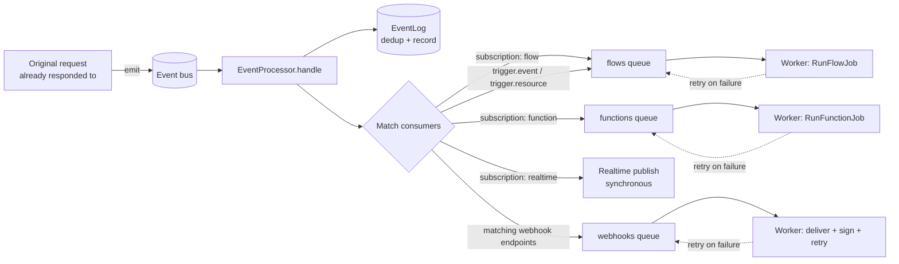
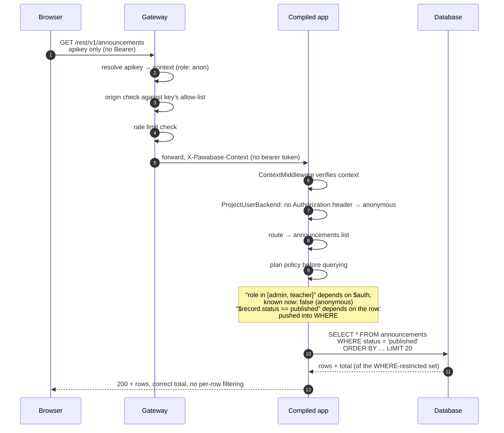
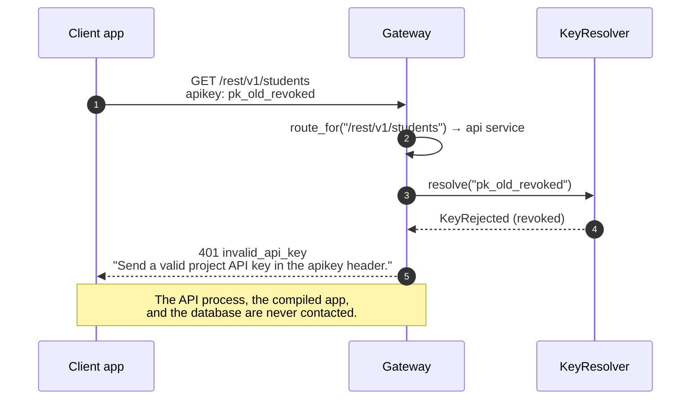
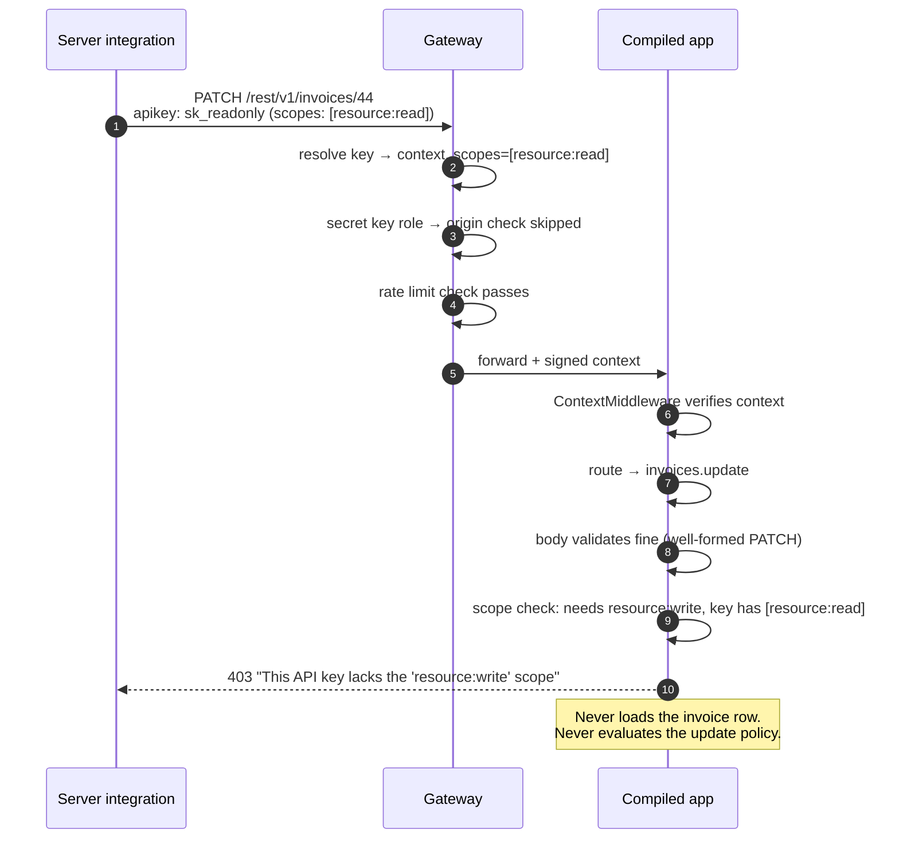
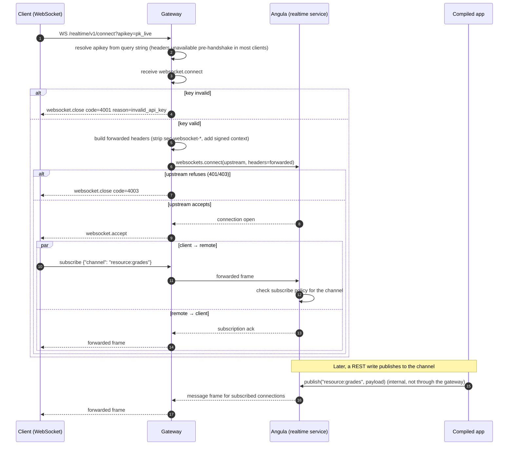

Understanding the order of operations explains most error codes and most surprises. Every request into a Pawabase project — a REST call, a custom route, a function, a flow trigger, or a websocket connection — passes through the same small number of stages, in the same order, every time. Once you can name the stages, you can look at any status code and know exactly which one produced it.

This page is the deep trace. It follows five real requests end to end, byte by byte where it matters, grounded directly in the gateway and API source: the request that succeeds, the request that fails at the gateway before the API ever sees it, the request that fails a scope check, the request refused by a policy (with the anonymous-vs-signed-in nuance that changes the status code), and a realtime publish over a websocket. It then opens up the gateway and the API's middleware stack in detail, explains exactly how a compiled app is invoked and how its request metadata gets back out to Observability, and closes with a full ordered checklist and a troubleshooting playbook you can use while debugging.

<Tip>
This page assumes you already know **what** policies are and how pushdown works. For that, start with [Policies](/policies/overview) and [Pushdown](/policies/pushdown). This page is about **when** each mechanism runs relative to everything else, and what the gateway and dispatcher do around it.
</Tip>

## The cast

Six things participate in every request, whether it succeeds or fails partway through:

<CardGroup cols={3}>
  <Card title="Gateway" icon="door-open">The single public entry point. Resolves API keys, enforces origins and rate limits, strips anything a client shouldn't control, and forwards a signed context.</Card>
  <Card title="API process" icon="server">Runs the platform's own routes (projects, flows, storage, the management plane) *and* dispatches `/rest/v1/*` into your compiled app.</Card>
  <Card title="Compiled app" icon="cube">A Sillo application generated from your project's definitions: one resource router per resource, one route per custom route, validation models, policies wired in.</Card>
  <Card title="Your database" icon="database">Postgres, MySQL or SQLite — whichever you connected. The compiled app talks to it directly; the gateway and API process never see raw SQL.</Card>
  <Card title="Event bus" icon="tower-broadcast">An in-process bus in development, a durable Redis-backed backlog in production. Every platform event passes through it exactly once.</Card>
  <Card title="Worker" icon="cog">Consumes queued jobs — flow runs, function runs, webhook deliveries, mail — with retries, independent of the request that triggered them.</Card>
</CardGroup>

## A first trace: `POST /rest/v1/grades`

Here is a teacher's browser submitting a grade. This is the request the rest of the framework's docs assume you've seen once, so we trace it in full before doing three more.

```mermaid
sequenceDiagram
  autonumber
  participant B as Browser
  participant G as Gateway
  participant CM as ContextMiddleware
  participant TE as Telemetry
  participant DD as DataPlaneDispatcher
  participant CA as Compiled app
  participant D as Your database
  participant E as Event bus
  participant W as Worker
  B->>G: POST /rest/v1/grades<br/>apikey + Bearer <token>
  G->>G: route_for("/rest/v1/grades") → api service
  G->>G: resolve apikey → platform context (cached)
  G->>G: origin check (publishable keys only)
  G->>G: rate limit check (per key or IP)
  G->>G: strip hop-by-hop + apikey headers
  G->>CA: forward + X-Pawabase-Context, X-Request-ID
  Note over G,CA: single hop from the browser's point of view;<br/>internally the request enters the API process here
  CM->>CM: verify X-Pawabase-Context signature
  TE->>TE: assign/propagate request id, start span
  DD->>DD: look up environment's compiled app<br/>rewrite /rest/v1 into root_path
  DD->>CA: forward with rewritten scope
  CA->>CA: ProjectUserBackend verifies bearer token
  CA->>CA: route match → grades.create
  CA->>CA: validate body against generated Pydantic model
  CA->>CA: scope check → resource:write
  CA->>CA: set owner field · run create policy
  CA->>D: INSERT
  CA->>E: emit grades.created
  CA-->>DD: 201 + record (transformer applied)
  DD-->>G: response, plus forwarded scope keys
  G-->>B: 201 Created
  E->>W: fan out to consumers
  W->>W: flows · functions · webhooks · realtime
```

The rest of this page expands every one of those steps. Keep this diagram as the map; the sections below are the territory.

## 1. The gateway

The gateway is the only thing the outside world can reach. `/internal` and `/admin` upstreams are never routed from outside it — there is no way to skip the gateway and hit an internal service directly, because the route table simply has no public entry for them.

For every proxied HTTP request, in order:

<Steps>
  <Step title="Resolve the upstream">
    `route_for(path)` maps the request path to a service (`api`, `akountz`, `angula`, …). If nothing matches, the gateway falls through to its own app — usually a `404` — without touching the key resolver or the rate limiter at all. This matters: a typo'd path fails fast and cheaply, before any credential work happens.
  </Step>
  <Step title="Resolve the API key">
    The key is read from, in order: the `apikey` header, the `x-api-key` header, or an `apikey` query parameter (kept for browser navigations and WebSocket connections, which can't always set custom headers). The first one found wins; the others are ignored.

    If the route requires a key (`mode == "required"`) and none was found, the response is `401 missing_api_key` immediately — the resolver is never even called.
  </Step>
  <Step title="Resolve the context">
    A key that was found is handed to `KeyResolver.resolve()`, which turns it into a platform **context** (project, environment, role, key id) plus key info (scopes, CORS origins). This is cached, so it does not hit a database on every request. Two things can go wrong here and both are distinguishable in the gateway's own code:
    - `KeyRejected` — the key doesn't exist, is revoked, or is expired → `401 invalid_api_key`.
    - `ServiceError` — the service that resolves keys is unreachable → `503 key_service_unavailable`.
  </Step>
  <Step title="Check the origin">
    If the resolved context is an **anonymous/publishable** role (`context.role == "anon"`) and the key has configured CORS origins, the `Origin` header must be one of them. A mismatch is `403 origin_not_allowed`. Secret-keyed and other non-anon roles skip this check entirely — origin restriction is a browser-facing publishable-key concern, not a general access control.
  </Step>
  <Step title="Check the rate limit">
    `RateLimitMiddleware` runs next, keyed either by the resolved API key (`key:<key_id>`) or, if there was no key context at all, by the client's forwarded IP (`ip:<address>`) — see [Gateway in depth](#gateway-in-depth) for exactly how that key is derived. A limit breach is `429 rate_limit_exceeded` with a `Retry-After` header.
  </Step>
  <Step title="Strip and forward">
    Hop-by-hop headers, the raw `apikey`/`x-api-key`, and anything already named `x-pawabase-*` are removed — a client cannot inject its own context header and have the gateway pass it through. The gateway then adds `X-Forwarded-For`, `X-Forwarded-Proto`, `X-Forwarded-Host`, a request id, and — if a context was resolved — the signed `X-Pawabase-Context` header, and streams the request to the upstream service.
  </Step>
</Steps>

Here is the full picture as a table, matching what actually happens in `GatewayProxy._http`:

| Check | Order | Failure | Status |
| --- | --- | --- | --- |
| Route known | 1st | No matching upstream | `404` (falls through to gateway's own app) |
| API key present (if route requires one) | 2nd | Header/query missing | `401 missing_api_key` |
| API key valid | 3rd | Revoked, unknown or malformed | `401 invalid_api_key` |
| Key resolver reachable | 3rd | Resolver service down | `503 key_service_unavailable` |
| Origin allowed (publishable keys only) | 4th | Origin not in the key's allow-list | `403 origin_not_allowed` |
| Rate limit | 5th | Over the configured limit | `429 rate_limit_exceeded` |
| Body size (streamed, checked as it arrives) | during forwarding | Exceeds `max_body_bytes` | `413 payload_too_large` |
| Upstream reachable | during forwarding | Connection refused/DNS failure | `502 upstream_unavailable` |
| Upstream responds in time | during forwarding | Exceeds `upstream_timeout` | `504 upstream_timeout` |

<Note>
Body size is enforced while the body is being *streamed* to the upstream, not by buffering it first and measuring. See [Streaming without buffering](#streaming-without-buffering) for why that matters for large uploads.
</Note>

## 2. Authentication

By the time a request leaves the gateway it carries a **signed** `X-Pawabase-Context` header (if a key was resolved) — the gateway itself never re-validates it on the way out, because it just issued it. Inside the API process, `ContextMiddleware` (from `pawabase_kit.auth`) verifies that signature again, independently, against the service's own copy of the internal secret. This is a deliberate second check: the context header crossed a process boundary, and the API process does not trust it just because it arrived on an internal network — it verifies the signature itself.

A context that fails verification is **dropped, not rejected** — `ContextMiddleware` sets `scope[SCOPE_KEY] = None` and lets the request continue, so that routes which don't need a project context (health checks, public platform routes) keep working even with a garbled header. Routes that *do* need a context call `require_context()`, which is where the actual `401` for a missing/invalid context is raised.

If the request also carries a bearer token (`Authorization: Bearer <token>`), `ProjectUserBackend.authenticate()` verifies it — but only once the context is known, because the token's signature is checked **against the environment named in the context** (`project=context.project, env=context.env`). A token that's perfectly valid for one environment is rejected for another, even if nothing else about it looks wrong. This is what makes it safe to reuse the same Akountz project across a development and a production environment without a leaked development token working in production.

| Situation | Result |
| --- | --- |
| No `X-Pawabase-Context` header (never had a key, or the gateway didn't attach one) | Request continues as anonymous for routes that allow it; `401` from `require_context()` for routes that don't |
| Context header present but its signature fails to verify | Same as above — dropped, treated as no context |
| Context valid, no bearer token | Caller is **anonymous** with the resolved API key's role — a normal, expected state, not an error |
| Context valid, bearer token present and valid for that project/env | Caller is a signed-in **user**, with claims decoded into `$auth` |
| Context valid, bearer token present but invalid, expired, or for the wrong project/env | `401` — an explicit rejection, different from "no token at all" |

<Warning>
"No token" and "bad token" are different outcomes on purpose. A missing token means *try again as anonymous, or don't try*. A present-but-invalid token means *something is wrong with this credential* — most often a token from the wrong environment, or an access token that expired and wasn't refreshed. If you're chasing an intermittent `401`, check which of these two your client is actually producing.
</Warning>

## 3. Routing and validation

Inside the compiled app, `POST /rest/v1/grades` — by now rewritten to just `/grades` with `/rest/v1` moved into `root_path` (see [Inside the compiled app](#inside-the-compiled-app)) — matches the `grades.create` operation. Two things happen here, in order, and both happen **before any policy or SQL runs**:

1. **Route resolution.** The compiled app's router was generated from your resource and route definitions at compile time (see [Definitions as data](/concepts/definitions-as-data)). Custom routes and resource routes live in the same router; [Inside the compiled app](#most-specific-first) covers exactly how a collision between a custom route and a resource's generated route is resolved.
2. **Body validation.** The request body is validated against a Pydantic model generated from the resource's field definitions: types, `required`, `min_length`/`max_length` on strings, `minimum`/`maximum` on numbers, `pattern`, enumerated allowed values, and which fields are `read_only` (rejected if present in a write body) or `write_only`. A body that fails any of these gets `422 Unprocessable Entity` with a field-by-field `detail` list — one entry per offending field, naming the field path and the rule it broke.

Validation failing here means the request never reaches your database driver, never acquires a connection, and never runs a single line of policy logic. This ordering is why a `422` is cheap to produce under load, and why you should not rely on a policy to reject malformed input — malformed input never gets that far.

<Tip>
If you need cross-field validation that the generated model can't express (e.g. "end_date must be after start_date"), that's a job for a [Python transformer's `before_write` hook](/data/transformers) or a policy that inspects `$input`, not for the field schema. The field schema only knows about one field at a time.
</Tip>

## 4. Scopes, owner field, policy

Once the body is structurally valid, three checks run in a fixed order, and each one can end the request before the next runs:

<Steps>
  <Step title="Scope check">
    If the resolved API key is **scoped** (see [Credentials → scopes](/concepts/credentials#scopes)), it must carry the scope the operation needs — `resource:write` for a create, `resource:read` for a read, and so on. A key without the needed scope is refused with `403` and the message `This API key lacks the '<scope>' scope`. Unscoped keys (the default for keys created without an explicit scope list) skip this check entirely; scoping is opt-in per key, not a mandatory ceiling.
  </Step>
  <Step title="Owner field">
    If the resource declares an **owner field** (commonly `user_id` or `author_id`), it is set to the caller's user id on `create`, **unconditionally overriding anything the client sent in the body**. This is why owner fields are safe against a client trying to write a row on someone else's behalf: whatever value they submit for that field is discarded before the policy even runs. If the caller is anonymous — no signed-in user — and the resource has an owner field, the request is refused with `401`, because there is no user id to assign.
  </Step>
  <Step title="Policy">
    The operation's policy runs last, with `record` set to the row being acted on and `input` set to the submitted body. For `create`, `record` is the **new** row, already carrying the owner field the previous step set — so a policy can reason about who the row will belong to, not just who's asking. A `false` decision here is `403`, carrying the policy's name and reason (`policy 'teaching_staff' refused`).
  </Step>
</Steps>

For `get`, `update` and `delete` the order is different in one important way: **the existing row is loaded from the database first**, and the policy sees it as `record` before deciding whether the caller may act on it. That load-before-decide ordering is what produces the `404`-vs-`403` distinction covered in [Policies → From decision to HTTP response](/policies/overview#from-decision-to-http-response):

- a row that doesn't exist at all → `404`;
- a row that exists but the read policy refuses it → **also `404`**, so a probing client can't tell "doesn't exist" from "exists but you can't see it";
- an `update`/`delete` refused for a **signed-in** caller who *can* read the row (so its existence is already known to them) → `403`, with the policy's reason;
- the same refusal for an **anonymous** caller → `404`, because anonymity means existence hasn't been established as knowable to them either.

For `list`, none of this per-row loading happens — the policy is **planned into SQL** before the query runs at all, which is a big enough topic to deserve its own page. The short version, faithfully recapped from [Policies → Lists are planned, not filtered after the fact](/policies/overview#lists-are-planned-not-filtered-after-the-fact):

1. Everything that doesn't depend on the row (roles, authentication, scopes) is evaluated immediately — `true` runs the query unrestricted, `false` refuses with no SQL at all.
2. AND-ed equalities between a record field and a known value become `WHERE` clauses.
3. Anything left over becomes a per-row residual check.

That's why `GET /rest/v1/notes` for a signed-in user returns a full page of *their* notes with a correct `total`, not a page of 20 rows with 14 silently dropped after the fact. See the [pushdown trace](#trace-b-an-anonymous-list-with-pushdown) below for a concrete example, and [Pushdown in depth →](/policies/pushdown) for the mechanism.

## 5. The write and its side effects

Once the policy allows the operation, the compiled app performs the actual database work. For our `POST /rest/v1/grades` example, that's an `INSERT`. Immediately afterward, still inside the same request:

- **Cache invalidation.** Any cache entries tagged with the `grades` resource are invalidated, so a subsequent read (even one served from a cache) reflects the write.
- **Event emission.** `grades.created` is emitted onto the platform event bus, if the resource has events enabled (the default). This is a fire-and-forget publish from the compiled app's point of view — the request does **not** wait for consumers.
- **Realtime broadcast.** If broadcasting is on for the resource, `resource:grades` is published to the realtime channel immediately, so connected clients see the change without waiting for the event bus's consumer fan-out.
- **Response shaping.** The row is passed through the resource's transformer (read-only/write-only field stripping, computed fields, renames) and returned as the response body.

The request's HTTP response is sent back to the caller **at this point** — the event bus fan-out described in the next section happens entirely after the response has already left the API process. A slow flow or a webhook endpoint that's down does not make the original `POST` slower.

## 6. After the response

This is the part of the lifecycle most debugging guides skip, and it's grounded directly in `app/events.py` and `app/worker.py`.

### The event processor

`EventProcessor` subscribes to the platform's event bus (`platform.bus.subscribe(self.handle)`) once, at startup, in `create_app`'s `on_startup` hook (see [Context and telemetry middleware order](#context-and-telemetry-middleware-order) for where that sits relative to everything else). For every event it receives, in order:

1. **Deduplicate.** It checks whether an `EventLog` row already exists for that event's id. The bus offers **at-least-once** delivery, so the same event can arrive twice; this check makes the processor idempotent against that.
2. **Record.** It writes an `EventLog` row — project, env, event name, source, actor, payload, the **same request id** the original request carried, and when it occurred. This is what Observability's event inspector reads.
3. **Route to consumers.** It computes every consumer that should see this event:
   - **Subscriptions** whose `event` glob-matches the event name (`fnmatch.fnmatchcase`) and whose `condition` (evaluated against `{"event": event.to_dict()}`) is true.
   - **Flows** with a `trigger.event` node whose `event` glob matches, a `trigger.resource` node whose `resource` and change (`created`/`updated`/`deleted`, parsed off the tail of the event name) matches, or a `trigger.realtime` node whose `channel` matches (for `realtime.message` events specifically).
   - **Outbound webhook endpoints** whose configured `events` list matches the event name.
4. **Dispatch, not execute.** Each match is *queued*, not run inline: a flow becomes a `RunFlowJob` on the `flows` queue, a function becomes a `RunFunctionJob` on the `functions` queue, a realtime-subscription target is published directly (this one **is** synchronous, since publishing is itself just a bus operation), and matching webhook endpoints become deliveries queued via `queue_deliveries` on the `webhooks` queue.
5. **Record the outcome.** Each attempt (queued successfully, or failed to even enqueue) is appended to the `EventLog` row's `consumers` list, so you can see in Observability not just that an event fired, but every consumer it fanned out to and whether each dispatch succeeded.



### The queues

The worker (`app/worker.py`) runs Sillo `QueueWorker`s over a fixed set of platform queues, `PLATFORM_QUEUES = ["events", "webhooks", "flows", "functions", "mail", "default"]`, plus anything you add via `PAWABASE_WORKER_QUEUES`. Each queue corresponds to a job class with a `queue` class attribute set to match: `RunFlowJob.queue = "flows"`, `RunFunctionJob.queue = "functions"`, webhook delivery jobs run on `"webhooks"`, and outbound mail jobs run on `"mail"`.

| Queue | What runs there | Triggered by |
| --- | --- | --- |
| `flows` | `RunFlowJob` — one flow execution | `trigger.event`, `trigger.resource`, `trigger.realtime` nodes; event subscriptions targeting a flow |
| `functions` | `RunFunctionJob` — one function invocation | Event subscriptions targeting a function |
| `webhooks` | Signed HTTP deliveries to outbound endpoints, with retry/backoff | Any event matching a webhook endpoint's `events` list |
| `mail` | Outbound email jobs | Flow/function `send_mail` actions, platform notifications |
| `events` | The event bus's own durable backlog (production) | Every `platform.bus.publish` call |
| `default` | Anything queued without naming a queue | Fallback |

In a single-process development setup, `settings.inline_worker` makes the API process itself run a small `InlineWorker` (concurrency 2) inside `on_startup`, so flows and webhooks fire without a separate worker process. In production you run `python -m app.worker` as its own process (or several, for throughput), and it reports a heartbeat row (`WorkerHeartbeat`) every 10 seconds so Studio's Workers panel can show it as live.

### Retries

Job failures are recorded through `RecordFailedJobRepository` and retried according to the queue worker's policy rather than being dropped. A webhook endpoint that's down for five minutes does not lose the events sent to it during that window — the delivery job stays queued and retries with backoff until it succeeds or exhausts its retry budget, at which point it's visible in Studio as a failed job you can inspect and manually replay.

<Tip>
Because every hop — the original request, the event, the flow run, the webhook delivery — carries the **same request id**, Observability can render the whole chain as one trace even though most of it happened well after the original HTTP response was sent. If you're trying to explain "why did this webhook fire twice," start from the request id, not the webhook log.
</Tip>

---

## Trace A: an anonymous GET list, with policy pushdown

Not every request is a signed-in write. Here's `GET /rest/v1/announcements` from an anonymous visitor to a school's public site, where the `announcements` resource has this policy on `list`:

```json
{
  "name": "published_or_staff",
  "condition": {
    "any": [
      { "eq": ["$record.status", "published"] },
      { "role": ["admin", "teacher"] }
    ]
  }
}
```



What makes this trace worth tracing: the `any` condition has one branch that's decidable immediately (`role in […]`, false for an anonymous caller) and one branch that mentions `$record` and becomes a `WHERE status = 'published'` clause. Because the *entire* `any` reduces to a single pushable clause, pagination and `total` are both exact — there's no over-fetch-then-filter step, and no risk of returning a short page because rows were dropped after the database already counted them. If the policy instead had an unpushable residual (e.g. an `OR` on two different record fields where the pushdown planner can't express both branches as one predicate set), the compiled app would fall back to fetching a superset and filtering it per-row — still correct, just less efficient at scale. See [Pushdown → designing for pushdown](/policies/pushdown#designing-for-pushdown).

## Trace B: rejected at the gateway — a bad or revoked API key

The next two traces are about requests that never make it to your resource logic at all. First, an app shipping a key that's been revoked (rotated after a leak, say):



This is the cheapest possible rejection in the whole system: it happens before the rate limiter runs, before any origin check, before any upstream connection is opened. If you're seeing a spike of `401 invalid_api_key` in gateway metrics but nothing in API-level Observability, this is almost always the explanation — the requests aren't reaching the API process to be logged there at all. Check the gateway's own logs/metrics, not the API's.

<Warning>
The gateway distinguishes `missing_api_key` (no key sent at all) from `invalid_api_key` (a key was sent but the resolver rejected it) in its JSON error body, even though both are `401`. If you're building a client, surface the `error` field, not just the status code — "you forgot to configure a key" and "your key was revoked" need different fixes.
</Warning>

## Trace C: rejected for a missing scope — 403 before policy ever runs

Second, a server integration holding a secret key that was deliberately scoped down to `resource:read` only, attempting a write:



The key thing this trace demonstrates: **scope failure happens before the row is even loaded**, let alone before any policy sees it. A `403` with the scope message means the credential itself is the problem — no policy is involved, and changing the policy will not fix it. Compare this with Trace D below, where the row *is* loaded and a policy *is* the reason.

## Trace D: refused by policy — anonymous vs. signed-in

This is the trace that makes the `404`-vs-`403` distinction concrete instead of abstract. Same resource, same row, same policy — two different callers.

`report_cards` has this policy on `get`:

```json
{
  "name": "report_access",
  "condition": {
    "any": [
      { "role": ["admin", "teacher"] },
      { "all": [
          { "eq": ["$record.published", true] },
          { "owner": "student_user_id" }
      ]}
    ]
  }
}
```

Report card `#91` belongs to a different student and hasn't been published yet.

<Tabs>
  <Tab title="Anonymous caller">
    ```mermaid
    sequenceDiagram
      autonumber
      participant B as Anonymous browser
      participant CA as Compiled app
      participant D as Database
      B->>CA: GET /rest/v1/report_cards/91 (no Bearer)
      CA->>D: SELECT * FROM report_cards WHERE id = 91
      D-->>CA: row found (unpublished, belongs to someone else)
      CA->>CA: policy: role check false (no $auth) · owner check false (no $auth.user_id)
      CA-->>B: 404 Not found
    ```
    An anonymous caller has no basis for the record's existence to be established as *knowable to them*, so the response is indistinguishable from "id 91 doesn't exist."
  </Tab>
  <Tab title="Signed-in caller (wrong student)">
    ```mermaid
    sequenceDiagram
      autonumber
      participant U as Signed-in student (id 12)
      participant CA as Compiled app
      participant D as Database
      U->>CA: GET /rest/v1/report_cards/91<br/>Bearer <token for user 12>
      CA->>D: SELECT * FROM report_cards WHERE id = 91
      D-->>CA: row found (student_user_id = 47, unpublished)
      CA->>CA: policy: role false · owner false (12 != 47) · published false
      CA-->>U: 404 Not found
    ```
    Still `404` — a signed-in caller who has no relationship to this specific row gets the same "not found" as an anonymous one. Being signed in doesn't by itself entitle you to know a row exists.
  </Tab>
  <Tab title="Signed-in caller (the right student, unpublished)">
    ```mermaid
    sequenceDiagram
      autonumber
      participant U as Signed-in student (id 47)
      participant CA as Compiled app
      participant D as Database
      U->>CA: GET /rest/v1/report_cards/91<br/>Bearer <token for user 47>
      CA->>D: SELECT * FROM report_cards WHERE id = 91
      D-->>CA: row found (student_user_id = 47, unpublished)
      CA->>CA: policy: role false · owner TRUE · published false → all() false
      CA-->>U: 403 policy 'report_access' refused
    ```
    This is the interesting case: the caller *does* own the record (the `owner` clause is true), so its existence is already knowable to them — they can see their own name on it elsewhere in the app. The policy still refuses because it isn't published yet, and because existence isn't in question for this caller, the honest answer is `403`, not a misleading `404`.
  </Tab>
</Tabs>

This is exactly the rule from [Policies → From decision to HTTP response](/policies/overview#from-decision-to-http-response): refusal is `404` for an anonymous caller (or any caller for whom the record's existence isn't otherwise established) and `403` for a signed-in caller the record is already about. Don't re-derive this per resource — it's enforced uniformly by the same engine for every `get`/`update`/`delete`.

## Trace E: a realtime publish through the gateway to Angula

Not every request is REST. Here's a websocket client subscribing to a channel and receiving a publish, which exercises the gateway's `_websocket` path — structurally different from the HTTP path, because there is no single request/response to forward, just a bidirectional byte stream to proxy for the life of the connection.



A few details worth calling out, straight from `GatewayProxy._websocket`:

- The API key for a websocket almost always arrives as `?apikey=` on the connect URL, because many websocket clients can't set arbitrary headers during the handshake — this is the same `_key()` resolution order as HTTP (`apikey` header, `x-api-key` header, then query), it just usually resolves via the third option here.
- `sec-websocket-*` headers are stripped from the forwarded set before connecting upstream — those are specific to the *client's* handshake with the gateway and are meaningless (and would conflict) on the gateway's own outbound handshake to Angula.
- A refusal upstream (`401`/`403` surfaced as an HTTP status during the handshake) becomes close code `4003`; anything else unexpected becomes `1011` (server error). A refusal *before* even attempting to connect upstream (bad key at the gateway) is `4001`.
- Once connected, the gateway runs two concurrent tasks — `client_to_remote` and `remote_to_client` — and tears the whole connection down the moment either side finishes, which is what makes a client disconnect immediately close the upstream half too, rather than leaking a dangling connection.
- The actual `publish` from a REST write (step 5 in the very first trace on this page) doesn't go through the gateway a second time — it's an internal call from the compiled app straight to the realtime service. The gateway is only in the path for the *client's* connection, not for internal service-to-service traffic.

---

## Gateway in depth

The gateway's whole job is to be a careful, minimal proxy — it should change as little as possible about a request while removing exactly the things a client should never control. Everything here is grounded directly in `services/gateway/app/proxy.py`.

### The stripped headers

Two disjoint sets of headers are removed before forwarding:

```python
HOP_BY_HOP = {
    "connection", "keep-alive", "proxy-authenticate", "proxy-authorization",
    "te", "trailers", "transfer-encoding", "upgrade", "host", "content-length",
}
STRIPPED_REQUEST = {"apikey", "x-api-key"}
```

- **`HOP_BY_HOP`** are headers that are meaningful only for *this specific TCP hop*, not for the request as a whole — the classic HTTP/1.1 hop-by-hop set (`connection`, `te`, `trailers`, `upgrade`, …), plus two the gateway adds deliberately: `host` (the upstream has its own idea of its host, and forwarding the client's would be wrong) and `content-length` (the gateway is about to re-stream the body, possibly re-chunking it, so any length it forwards has to be recomputed by the HTTP client library, not carried over verbatim from the client — forwarding a stale `content-length` would desynchronize the upstream's framing).
- **`STRIPPED_REQUEST`** removes the raw API key headers. The compiled app never sees `apikey` or `x-api-key` — it only ever sees the already-verified, signed `X-Pawabase-Context`. This means even if something downstream logged every header it received, the raw key would never appear in those logs.
- Anything starting with `x-pawabase-` is also stripped from the *inbound* request before the gateway adds its own — this is what stops a client from forging `X-Pawabase-Context` directly and skipping key resolution altogether. The gateway is the only thing allowed to set that header, and it only does so after resolving a real key.

On the **response** side, the same `HOP_BY_HOP` set is stripped again (except `content-length`, which is fine to pass back since the response isn't being re-chunked), plus `content-encoding` — the gateway's HTTP client (`httpx`) already transparently decodes compressed upstream responses, so forwarding a stale `content-encoding` header would tell the browser to decompress bytes that are already decompressed.

### How the rate limit key is derived

```python
def _limit_key(ctx: HttpContext) -> str:
    key_id = ctx.scope.get(KEY_SCOPE)
    if key_id:
        return f"key:{key_id}"
    forwarded = ctx.headers.get("x-forwarded-for")
    client = ctx.scope.get("client")
    return "ip:" + (forwarded.split(",")[0].strip() if forwarded else (client[0] if client else "unknown"))
```

If a key was resolved, the rate limit bucket is `key:<key_id>` — every request using the same API key shares one bucket, regardless of which IP it comes from. This is almost always what you want: a mobile app's users share a publishable key but each should reasonably get their own budget in principle, though in practice the *key* is what's rate-limited here, not the end user, so a single popular key can be a shared budget across many users. If no key was resolved at all (the route allows anonymous, keyless traffic), the bucket falls back to `ip:<address>` — the first hop of `X-Forwarded-For` if present, otherwise the ASGI `client` tuple.

The limit itself comes from `RateLimitConfig(limit=settings.rate_limit, window=settings.rate_window, namespace="gw", …)` — a default of 600 requests per 60-second window per key or client, configurable per deployment. A breach returns:

```
HTTP/1.1 429 Too Many Requests
Content-Type: application/json
Retry-After: 12

{"error": "rate_limit_exceeded", "retry_after": 12}
```

`Retry-After` is always at least `1` (`max(int(result.retry_after), 1)`), so a client that blindly retries after the stated delay never busy-loops on a zero or negative value.

### Streaming without buffering

The gateway forwards request bodies as an async iterator (`_body(receive)`), not as a buffered `bytes` object. It reads ASGI `http.request` messages as they arrive, accumulates a running total, and raises as soon as that total exceeds `settings.max_body_bytes` — which surfaces to the client as `413 payload_too_large`. The important property this gives you: a 500 MB upload against a 100 MB limit is rejected as soon as the 100-MB mark is crossed, not after the whole 500 MB has been received and buffered in memory first. The same streaming discipline applies to the **response**: `response.aiter_raw()` is forwarded chunk by chunk with `more_body: True` until the upstream closes, so a large export or a long-lived server-sent-events response doesn't sit fully buffered in the gateway process either.

<Note>
Because the body limit is checked on the way *in*, a request that's rejected for size never reaches the upstream at all — the gateway raises `ValueError("body too large")` from within `_body()`, which `_forward()` catches and turns into `413` before `client.send()` is even awaited further.
</Note>

### Streaming and reusable upstream connections

The gateway holds one `httpx.AsyncClient` per upstream service (`self.clients[service]`), reused across requests rather than opened fresh each time — this is what keeps proxied latency low under load, since connection setup (and TLS, for services behind it) isn't repeated per request. `stream=True` on `client.send()` is what enables the chunked forwarding described above; without it, `httpx` would buffer the full upstream response before returning.

---

## Context and telemetry middleware order

This section is grounded directly in `services/api/app/bootstrap.py`'s module docstring, which is worth reading verbatim because the ordering it describes is easy to get backwards when reasoning about it informally:

> Sillo builds middleware inside-out (the last registered runs first). `create_service` builds the `SilloApp` with its auth backends, then the platform-context middleware and telemetry (request ids) around it. Record (the platform database) and the data-plane dispatcher are installed *before* that outer plumbing — the dispatcher therefore runs *inside* the context and telemetry middleware, and every `/rest/v1` request is traced and attributed to its project.

Unpacked, the effective call order for an incoming request is:

```
Telemetry (assigns/propagates request id, starts a span)
  → ContextMiddleware (verifies X-Pawabase-Context, binds it to scope)
    → auth backends (ProjectUserBackend / OperatorBackend, if the route needs auth)
      → Record (database session/connection setup)
        → DataPlaneDispatcher (only for /rest/v1/*; everything else falls through to the platform's own routers)
          → the compiled app
```

Each layer is registered as "inner" relative to the ones around it, and Sillo wraps them so that construction order and *execution* order are reversed — the piece registered last ends up as the **outermost** wrapper, so it's the first thing that sees a request and the last thing that sees a response. `create_service`'s own auth/context/telemetry plumbing is added around everything else, which is exactly why it runs first: it has to, because the dispatcher needs a verified context and an assigned request id before it can do anything useful.

### Why this order, specifically

- **Telemetry outermost** means a request id exists before *anything* else runs, including a context verification failure. Every response — even a `401` from a bad context — carries a request id you can search for in Observability. If telemetry ran inside the dispatcher instead, a request that failed context verification would never get an id at all, and the earliest failures would be the hardest ones to trace.
- **Context before the dispatcher** means `DataPlaneDispatcher` can assume `scope.get(SCOPE_KEY)` is either a verified context object or `None` — it never has to verify a signature itself, just check for presence (`if context is None: 401 missing_api_key`). Verification logic lives in exactly one place (`ContextMiddleware`), not duplicated in every downstream consumer of the context.
- **Record (database plumbing) before the dispatcher** means a database connection/session is already set up by the time your compiled app's handlers run, without the dispatcher needing to know anything about how the platform's own database is configured.

### Thought experiment: what if the order were swapped?

Suppose, hypothetically, `DataPlaneDispatcher` ran **outside** `ContextMiddleware` instead of inside it — i.e., the dispatcher saw the raw request before context verification. Two things would break:

1. **The dispatcher couldn't tell a missing context from an unverified one.** Right now, `scope.get(SCOPE_KEY) is None` cleanly means "no valid context reached this point" — either no header was sent, or one was sent but failed signature verification (`ContextMiddleware` sets it to `None` either way). If the dispatcher ran first, it would need to inspect and verify the raw header itself to make that same distinction, duplicating logic that already exists one layer up.
2. **Every `/rest/v1` request would be dispatched into a compiled app before we know it's trustworthy.** The whole point of resolving `platform.state_for(context)` is to look up *which* environment's compiled app to call — and if `context` might be forged (because it hasn't been verified yet), an attacker could potentially address an environment they have no key for, simply by crafting a plausible-looking but unsigned context header. Running context verification first is what makes `state_for()` safe to trust.

And suppose telemetry ran **inside** the dispatcher instead of outside everything: any failure in context verification, key-service unavailability, or even a crash before the dispatcher is reached would produce a response with no request id — exactly the failures you'd most want to be able to search for later, gone from the trace.

## Inside the compiled app

Once `DataPlaneDispatcher` decides a request is dispatchable — `scope[SCOPE_KEY]` is a verified context — it does three things, straight from `app/dispatch.py`:

<Steps>
  <Step title="Look up the compiled app">
    `await self.platform.state_for(context)` resolves the environment's `EnvironmentState`, and `await state.compiled()` gets (or builds, and caches) the actual Sillo application generated from that environment's current definitions — resources, routes, policies, everything. An unknown project/environment raises `HTTPException`, which the dispatcher turns into `unknown_environment` with the exception's own status code (rather than hardcoding one), so a `404` for a truly nonexistent environment and a `410`-style response for a deliberately retired one (if your platform models it that way) both come through correctly.
  </Step>
  <Step title="Rewrite the path into root_path">
    ```python
    inner = dict(scope)
    rest = path[len(REST_PREFIX):] or "/"
    inner["path"] = rest
    inner["raw_path"] = rest.encode()
    inner["root_path"] = scope.get("root_path", "") + REST_PREFIX
    ```
    `/rest/v1/grades` becomes `path = "/grades"` with `root_path = "/rest/v1"` (plus whatever root_path already existed, for nested mounting). This is exactly how Sillo expects a *mounted* application to be invoked — the compiled app's own router only ever sees paths relative to its own mount point, so it can be compiled once and mounted at `/rest/v1` for every environment without knowing that prefix exists. The compiled app itself has no idea it's being served under `/rest/v1` at all.
  </Step>
  <Step title="Forward scope keys back out">
    ```python
    FORWARDED_KEYS = ("user", "auth", "auth_scheme", "route", "pawabase.policy", "pawabase.plan")
    ...
    finally:
        for key in FORWARDED_KEYS:
            if key in inner:
                scope[key] = inner[key]
    ```
    After the compiled app finishes handling the request (success *or* failure — this is in a `finally`), the dispatcher copies specific keys back from the compiled app's inner scope onto the **outer** scope: which user was resolved, their auth details, the auth scheme used, which route matched, which policy decided the outcome, and — for lists — the query plan that pushdown produced. This is the *only* channel by which the outer request (the one telemetry is watching) learns anything about what happened inside the compiled app, since the compiled app is otherwise a black box to the dispatcher.
  </Step>
</Steps>

### Why the forwarded keys matter for Observability

Telemetry wraps the *entire* request, including the dispatcher and everything inside it — but telemetry itself has no visibility into the compiled app's internals; it just sees a scope dict and a status code. The `FORWARDED_KEYS` copy-back is what lets a telemetry span attach `pawabase.policy: "own_rows"` or `route: "grades.create"` to its recorded span **after the fact**, once the compiled app has decided those things. Without this forwarding step, Observability would be able to tell you a request happened and how long it took, but not *which policy decided it* or *which route matched* — exactly the two facts you need most when debugging a `403` or a `404`.

### Most specific first {#most-specific-first}

Per `bootstrap.py`'s docstring, routers are mounted most-specific-first. Concretely: if a project defines both a resource `reports` (giving it the generated routes `GET/POST /reports`, `GET/PATCH/DELETE /reports/{id}`, …) *and* a custom route `POST /reports/publish-all`, the custom route has to be registered **before** the resource's own `/reports/{id}`-shaped routes, or `{id}` would greedily match the literal segment `publish-all` and route the request to `reports.get` with `id = "publish-all"` instead of to your custom handler.

```mermaid
flowchart TB
  REQ["POST /rest/v1/reports/publish-all"] --> Q{Router match order}
  Q -->|checked first: custom route| CUSTOM["POST /reports/publish-all<br/>(your handler)"]
  Q -.->|checked second: resource route<br/>would otherwise match {id}=publish-all| RES["POST /reports/{id}<br/>(reports.update — WRONG)"]
  CUSTOM --> OK[Correct: reaches your handler]
```

This is why the compiler orders generated routers the way it does, and why you should be deliberate about custom-route paths that could collide with a resource's own id-shaped routes — put custom routes under a segment a numeric or UUID id could never match (`/reports/publish-all` rather than something that looks like it could be an id), or rely on the most-specific-first ordering but verify it with a quick request in development rather than assuming.

---

## The full ordered checklist

Everything above, collapsed into one reference list. Use this while debugging — find the step your request must be failing at, and you've narrowed the search to one section of this page.

<AccordionGroup>
  <Accordion title="1–6: Gateway">
    1. Route resolved from the path (`route_for`) — unmatched paths fall through, usually ending in `404`.
    2. API key extracted from `apikey` header, then `x-api-key` header, then `?apikey=` query param.
    3. Key resolved to a platform context (cached) — `KeyRejected` → `401`, resolver unreachable → `503`.
    4. Origin checked against the key's allow-list, for anonymous/publishable roles only.
    5. Rate limit checked, keyed by `key:<id>` or `ip:<address>`.
    6. Headers stripped (hop-by-hop, raw key headers, any `x-pawabase-*`); `X-Pawabase-Context`, `X-Request-ID`, `X-Forwarded-*` added.
  </Accordion>
  <Accordion title="7–8: Streamed forward">
    7. Body streamed to the upstream as it arrives; exceeding `max_body_bytes` aborts with `413` mid-stream.
    8. Upstream connection failures become `502`; upstream timeouts become `504`.
  </Accordion>
  <Accordion title="9–11: API process outer middleware">
    9. Telemetry assigns/propagates the request id and opens a span — this is the outermost layer, so it runs even on requests that fail every later step.
    10. `ContextMiddleware` verifies the `X-Pawabase-Context` signature; failure means the context is dropped (set to `None`), not rejected outright.
    11. Auth backends run if the matched route needs them — `ProjectUserBackend` verifies a bearer token against the context's project/env.
  </Accordion>
  <Accordion title="12–13: Dispatch into the compiled app">
    12. `DataPlaneDispatcher` checks `scope[SCOPE_KEY]` is present (else `401 missing_api_key`), resolves the environment's compiled app, and rewrites `/rest/v1/...` into `root_path`.
    13. The compiled app runs; on completion (success or failure), specific scope keys (`user`, `auth`, `auth_scheme`, `route`, `pawabase.policy`, `pawabase.plan`) are copied back to the outer scope for telemetry.
  </Accordion>
  <Accordion title="14–16: Inside the compiled app — routing and validation">
    14. Router match — most-specific routes (custom routes) are checked before generic resource-id routes.
    15. Body validated against the generated Pydantic model — type, length, range, pattern, allowed values, read-only rejection. Failure is `422` with per-field detail.
    16. For `get`/`update`/`delete`, the existing row is loaded from the database before any policy decision.
  </Accordion>
  <Accordion title="17–19: Access control">
    17. Scope check against the resolved API key's scopes (if scoped) — failure is `403`, before the owner field or policy run.
    18. Owner field set to the caller's user id on `create`, overriding client input — anonymous caller with an owner-field resource is `401`.
    19. Policy evaluated with `record`/`input` in context — refusal is `403` for signed-in callers who could otherwise know the row exists, `404` otherwise. Lists are planned into SQL instead of checked per-row.
  </Accordion>
  <Accordion title="20–23: Write, response, and after">
    20. The database operation executes (`INSERT`/`UPDATE`/`DELETE`/`SELECT`).
    21. Cache entries tagged with the resource are invalidated; an event is emitted; a realtime broadcast is published if enabled — all fire-and-forget from the request's perspective.
    22. The row is passed through the resource's transformer and returned — **the HTTP response is sent here**, before any queued consumer runs.
    23. `EventProcessor` (subscribed at startup) receives the event, deduplicates it, records an `EventLog` row, matches consumers (subscriptions, flow triggers, webhook endpoints), and queues jobs for each — none of this blocks the original request, all of it shares the original request id.
  </Accordion>
</AccordionGroup>

---

## Troubleshooting playbook

A refusal or an error almost always tells you which stage produced it, if you know what to look for. This expands the single Tip from the top of the framework's docs into a full reference.

<AccordionGroup>
  <Accordion title="401 missing_api_key">
    **Origin:** the gateway, before key resolution even runs — no `apikey`/`x-api-key` header and no `?apikey=` query param were found on a route that requires one. **Fix:** confirm the client is actually attaching the key; check for a proxy or CDN in front of the gateway stripping custom headers.
  </Accordion>
  <Accordion title="401 invalid_api_key">
    **Origin:** the gateway's `KeyResolver.resolve()` raised `KeyRejected` — the key doesn't exist, was revoked, or expired. **Fix:** check the key's status in Studio → API keys; a recently rotated key needs the new value redeployed to every caller of the old one.
  </Accordion>
  <Accordion title="401 (from require_context, inside the API)">
    **Origin:** the context header either wasn't attached (shouldn't happen if the gateway is doing its job) or failed signature verification inside `ContextMiddleware` — most often because the gateway's and the API's internal secrets are out of sync across a deploy. **Fix:** check that `internal_secret` matches between the gateway and API service configuration.
  </Accordion>
  <Accordion title="401 on a bearer token that looks fine">
    **Origin:** `ProjectUserBackend.authenticate()` — the token verified against the **wrong** project/env, or it's expired. Tokens are checked against `context.project`/`context.env`, not just their own signature. **Fix:** confirm the client's API key and the user's session both point at the same environment; a development-environment key paired with a production-issued token fails here even though both are individually valid.
  </Accordion>
  <Accordion title="403 origin_not_allowed">
    **Origin:** the gateway's origin check, publishable keys only. The request's `Origin` header isn't in the key's configured CORS allow-list. **Fix:** add the origin in Studio → API keys → CORS, or check you're not calling from a preview/staging domain that isn't listed.
  </Accordion>
  <Accordion title="403 'This API key lacks the ... scope'">
    **Origin:** the compiled app's scope check, immediately after routing/validation, before the owner field or the policy run. **Fix:** either the key needs the missing scope added, or the client is calling an operation it was deliberately never meant to perform with that key — check which is intended before widening scopes.
  </Accordion>
  <Accordion title="403 policy '<name>' refused">
    **Origin:** the operation's policy, evaluated after the owner field is set (`create`) or after the row is loaded (`get`/`update`/`delete`). Only reachable for a caller who could otherwise know the record exists — anonymous callers or ones with no relationship to the row get `404` for the same refusal instead. **Fix:** the policy name in the message tells you exactly which rule to inspect; check the actual `record`/`auth` values against the condition, ideally by testing the same request with a secret key first to confirm the row and your assumptions about it are right.
  </Accordion>
  <Accordion title="404 on a record you're confident exists">
    **Origin:** almost always a `get`/`update`/`delete` read policy hiding the row — refusal for a caller who isn't established as already knowing the row exists renders as `404`, not `403`. **Fix:** retry the same request with a secret key (which bypasses policies entirely); if it's found, the policy was the cause. See [Policies → secret keys bypass policies](/policies/overview#secret-keys-bypass-policies).
  </Accordion>
  <Accordion title="422 with a field detail list">
    **Origin:** body validation against the generated Pydantic model, before any policy or SQL runs. **Fix:** read the `detail` array — each entry names the field and the rule it broke (`min_length`, `pattern`, an enum value not in the allowed set, a `read_only` field present in the write). This never depends on who's calling or what's in the database.
  </Accordion>
  <Accordion title="429 rate_limit_exceeded">
    **Origin:** the gateway's `RateLimitMiddleware`, keyed by `key:<id>` (if a key resolved) or `ip:<address>` (if not). **Fix:** respect the `Retry-After` header; if this fires under normal usage rather than abuse, the key's traffic genuinely exceeds the default 600/60s and needs a higher configured limit, or the client should share fewer requests per key (e.g. batch reads).
  </Accordion>
  <Accordion title="413 payload_too_large">
    **Origin:** the gateway's streamed body-size check, mid-transfer, against `max_body_bytes` (default 100 MB). **Fix:** for legitimately large uploads, use [Storage](/storage/overview)'s direct-to-bucket upload flow instead of routing large binaries through `/rest/v1`.
  </Accordion>
  <Accordion title="502 upstream_unavailable">
    **Origin:** the gateway's `httpx.TransportError` handler — it couldn't open a connection to the upstream service at all (DNS failure, connection refused, service down). **Fix:** check the named service (`service` field in the JSON body) is actually running and reachable from the gateway's network.
  </Accordion>
  <Accordion title="503 key_service_unavailable">
    **Origin:** the gateway's key resolver couldn't reach whatever backs it (a `ServiceError` from resolving the key). **Fix:** this is an infrastructure problem, not a client problem — check the key-resolution dependency's health; retries with backoff are appropriate here since it's transient by nature.
  </Accordion>
  <Accordion title="504 upstream_timeout">
    **Origin:** the gateway's `httpx.TimeoutException` handler — the upstream didn't respond within `upstream_timeout`. **Fix:** if this is consistent for one operation, look for a slow query or an unindexed policy residual doing per-row filtering on a large table (see [Pushdown → designing for pushdown](/policies/pushdown#designing-for-pushdown)); if it's intermittent, check upstream resource pressure.
  </Accordion>
  <Accordion title="A 200 with fewer rows than expected on a list">
    **Origin:** not an error at all — this is pushdown/residual filtering working correctly. If the policy has an unpushable residual, rows are fetched and then filtered per-row, which can make a page shorter than the requested `limit` even though more rows exist further in the underlying query. **Fix:** this is expected; if it's surprising, check whether the list policy can be restructured into an AND-ed equality that pushes fully into `WHERE`. Not a bug to "fix" by loosening the policy.
  </Accordion>
</AccordionGroup>

<Tip>
Debugging a refusal? Check the status first: `401` is identity or key, `403` is scope or policy (for a caller who could know the row exists), `404` on a known id is usually a read policy hiding the row from a caller who couldn't otherwise know it exists, `422` is the body, `429` is the rate limiter, and anything `5xx` is the gateway talking about the upstream connection itself rather than about your request's content.
</Tip>

## Next steps

<CardGroup cols={2}>
  <Card title="Credentials" icon="key" href="/concepts/credentials">API keys, scopes, roles, and how the gateway resolves a raw key into a context.</Card>
  <Card title="Policies" icon="shield-check" href="/policies/overview">The full policy engine: conditions, shorthands, pushdown, and enforcement points beyond REST.</Card>
  <Card title="Architecture" icon="sitemap" href="/concepts/architecture">How the gateway, API, compiled apps and platform services fit together as a system.</Card>
  <Card title="Definitions as data" icon="file-json" href="/concepts/definitions-as-data">How resources, routes and policies become the compiled app this page traces requests through.</Card>
  <Card title="The mental model" icon="brain" href="/concepts/mental-model">The handful of ideas — projects, environments, definitions — everything else on this page assumes.</Card>
  <Card title="Glossary" icon="book-open" href="/concepts/glossary">Every term used on this page, defined in one place.</Card>
</CardGroup>
