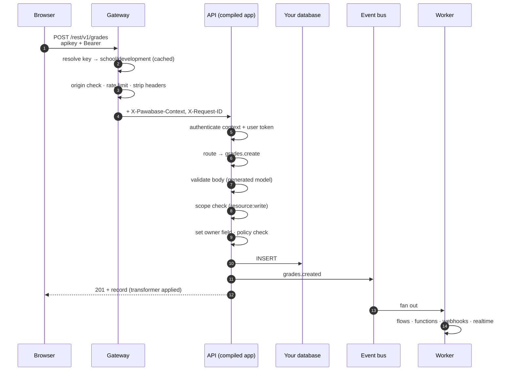

Understanding the order of operations explains most error codes and most surprises. Here is `POST /rest/v1/grades` from a teacher's browser, end to end.

## 1. Gateway

| Check | Failure |
| --- | --- |
| Known public path | `404` |
| API key present and valid, not revoked or expired | `401` *Send a valid project API key in the apikey header.* |
| Origin allowed (publishable keys) | CORS preflight fails in the browser |
| Rate limit (default 600 requests / 60 s per key or client) | `429` with `x-ratelimit-*` headers |
| Body size (default 100 MB) | `413` |

The gateway removes `apikey`, `x-api-key` and any `x-pawabase-*` header, then adds the signed `X-Pawabase-Context` and a request id.

## 2. Authentication

The API verifies the context signature and, if present, the user token against the environment's derived key. An invalid or expired token is a `401`; a missing token is simply *anonymous*.

## 3. Routing and validation

The compiled app matches `POST /rest/v1/grades` to `grades.create`. Its request model was generated from the resource's fields: types, `required`, `min_length`/`max_length`, `minimum`/`maximum`, `pattern`, allowed values, read-only fields. Invalid bodies get `422` with a field-by-field `detail` list **before any policy or SQL runs**.

## 4. Scopes, owner field, policy

1. If the key is scoped, it must carry `resource:write` → otherwise `403`.
2. If the resource has an **owner field**, it's set to the caller's user id, overriding anything the client sent. Anonymous callers get `401`.
3. The operation's policy runs with `record` = the new data and `input` = the body. Refusal is `403` with the policy's reason.

For `get`, `update` and `delete`, the existing row is loaded first and the policy sees it as `record`. A row the caller can't read answers `404`, not `403`, so existence isn't leaked. For `list`, the policy is [planned](/policies/pushdown) into SQL before the query runs.

## 5. The write and its side effects

After the `INSERT`:

- cache entries tagged with the resource are invalidated;
- `grades.created` is emitted if the resource has events on (the default);
- `resource:grades` is published to realtime if broadcasting is on;
- the response is shaped by the resource's transformer and returned.

## 6. After the response

The event processor records the event and fans it out through the queues: flows triggered by `trigger.resource` or `trigger.event`, [subscriptions](/events/subscriptions), and [outbound webhooks](/webhooks/outbound). The worker runs them with retries. Each hop carries the same request id, so **Observability** can show the whole story.

<Tip>
Debugging a refusal? Check the status first: `401` is identity or key, `403` is scope or policy, `404` on a known id is usually a read policy hiding the row, `422` is the body.
</Tip>
