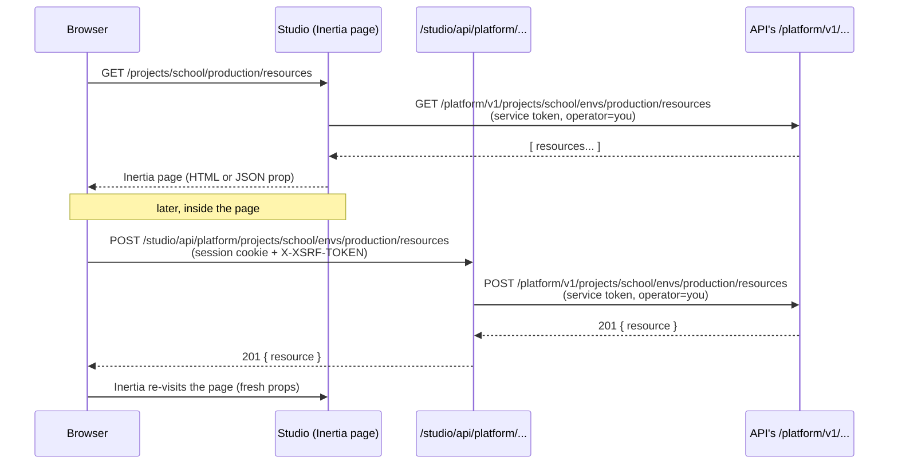

Studio is where you design, run and inspect your backends. It runs at port **8090** and is built with Sillo, `sillo-inertia` and React — the same stack you'd use for a project's own app, which is a deliberate choice: Studio is not a separate product with its own conventions, it's an ordinary Pawabase server-rendered app that happens to manage the platform.

Studio never touches a database directly. It has no Postgres connection string, no Redis client, no direct line to any service's storage. Every screen calls the services' management APIs through Studio's own bridge, over HTTP, the same way a script or a CI job would. That single fact explains almost everything else on this page: why Studio can crash and restart without corrupting anything, why "what Studio does" and "what the Platform API does" are the same list, and why an operator with a terminal and `curl` can do anything an operator with a mouse can do.

This page covers the whole surface: how a click becomes a request, every section in the sidebar with a worked example, the generic editor that all ten definition kinds share, the session and CSRF machinery that keeps operator cookies safe, how asset versioning keeps an open tab from running stale code after an upgrade, and the precise line between an "operator" and a "project user."

<CardGroup cols={3}>
  <Card title="A thin UI" icon="layout-dashboard">Studio renders forms and tables. The Platform API holds the truth; Studio never stores anything of its own except a session.</Card>
  <Card title="Everything is scriptable" icon="terminal">Every Studio action is one call to `/studio/api/platform/...` you can also make yourself, or directly against the Platform API.</Card>
  <Card title="One audit trail" icon="scroll-text">Whether a change came from Studio or from a script using an operator token, it lands in the same [audit log](/operate/audit-log).</Card>
</CardGroup>

## Studio is a backend-for-frontend, not a database client

It's worth being precise about what "Studio calls the management API" actually means in request terms, because it shapes how you should think about debugging, scripting and trusting the tool.

When you open a page in Studio — say, the Resources list for `school` / `production` — the sequence is:

1. Your browser requests `/projects/school/production/resources`. Sillo resolves the request, `signed_in` reads your session cookie and looks up the operator, and the route handler calls the Platform API's `GET /platform/v1/projects/school/envs/production/...` endpoints **from the server**, using a short-lived service token that names you as the operator.
2. Inertia wraps the result as page props and returns a full HTML document (first visit) or a JSON payload (client-side navigation) to the same component, `Env/Definitions`.
3. React renders the table. No further trust decision has to be made by the browser: it already has exactly the rows the Platform API decided you may see.

Everything **after** that first load — opening the editor, saving a form, clicking "Use example," deleting a policy — goes through a second, narrower path: an `XHR`/`fetch` call from the browser straight to `/studio/api/<bridge>/<path>`, which Studio forwards to the right service. The browser still never gets a token any backend service would accept; it only ever holds the Studio session cookie and a CSRF token.



<Note>
The token that crosses from Studio to the API is not your session cookie forwarded onward — it's a fresh, short-lived **service token** minted per request that carries your operator identity as a claim. The API's `OperatorBackend` (see [Operators vs. project users](#operators-vs-project-users) below) verifies that token and knows exactly who acted, which is what makes every write attributable in the audit log.
</Note>

Three consequences follow directly from this design:

- **Studio has no privileged access path.** It can't do anything to your data that the Platform, Akountz or Angula management APIs don't already expose. If a feature isn't in the API, it isn't in Studio either — the UI is downstream of the API, never the other way around.
- **Nothing Studio does requires a restart or a deploy.** Because writes go through the same versioned-definition machinery any API caller uses, saving a policy in Studio increments the environment version exactly like `PUT` from a script would, and other services pick it up on their next request.
- **Everything Studio does can be replayed.** Since the browser call and the server-to-service call are both ordinary JSON over HTTP, you can watch them in your browser's network tab, copy them as `curl`, and run them from CI. See [Automating what Studio does](#automating-what-studio-does).

## Layout

<Steps>
  <Step title="Sidebar">
    The environment switcher sits at the top: a project picker, then an environment picker (typically `development`, `staging`, `production`, though projects can define others). Below it, every section is grouped into four families — **Build**, **Automate**, **Services**, **Operate** — that roughly track "what you design," "what runs itself," "the built-in services your app talks to," and "what's happening right now."
  </Step>
  <Step title="Top bar">
    Breadcrumbs (`school / production / resources / invoices`) so you always know exactly which project and environment you're editing — the single most important piece of chrome in a tool that can permanently delete production data — plus the light/dark switch and, when `/studio/status` reports a service as down, a status indicator.
  </Step>
  <Step title="Open API docs">
    Every environment gets a generated reference at `/projects/{ref}/{env}/api-docs`, rendered from the same OpenAPI document your gateway would serve at `<gateway>/docs/v1/<ref>/<env>` — except the operator's copy is available **whether or not** the environment has [`public_docs`](/reference/environment-settings) turned on, and its "try it" panel is pointed at the real gateway URL, not at Studio's own origin. That's a deliberate touch: the spec is embedded into the page rather than fetched by URL, specifically so the API-reference viewer doesn't default to treating Studio itself as the server to call.
  </Step>
</Steps>

<Tip>
Because the environment is part of the URL (`/projects/{ref}/{env}/{section}`), every Studio page is linkable and bookmarkable down to the exact project, environment and section. Sharing a link to "the flow editor for the `send_receipt` flow in staging" with a teammate is just sharing a URL.
</Tip>

## Sections at a glance

<Tabs>
  <Tab title="Build">
    | Section | What you do there |
    | --- | --- |
    | Overview | Counts, last-24h activity, infrastructure, connection snippet, problems |
    | Database | Browse tables, describe columns, run read-only SQL |
    | Resources | Define tables, fields, access, relations, behaviour; migrate; browse records |
    | Schemas | Reusable field sets for routes and nested objects |
    | Transformers | Response shaping: omit, pick, set, rename, case |
    | Policies | Named conditions, edited with a rule builder |
    | Routes | Custom endpoints handled by flows or functions |
    | Functions | Python functions loaded from project code; invoke with test input |
  </Tab>
  <Tab title="Automate">
    | Section | What you do there |
    | --- | --- |
    | Flows | The visual editor: blocks, triggers, test runs with traces |
    | Event subscriptions | Route events to flows, functions or realtime channels |
    | Schedules | Cron or interval triggers |
    | Webhooks | Signed outbound deliveries with retries |
    | Inbound hooks | Verified receivers for third-party webhooks |
    | Mail templates | Subjects and bodies with live preview |
  </Tab>
  <Tab title="Services">
    | Section | What you do there |
    | --- | --- |
    | Users & auth | Users, roles, organizations, sign-in events, auth settings |
    | Storage | Buckets and objects; upload, sign, delete |
    | Realtime | Live channels, connections and activity |
  </Tab>
  <Tab title="Operate">
    | Section | What you do there |
    | --- | --- |
    | Jobs & queues | Depths, jobs, failed jobs, workers |
    | Events & runs | Event log, flow runs, webhook deliveries, mail log |
    | Observability | Request log across services, metrics, cache |
    | API keys | Create (shown once), scope, revoke |
    | Secrets | Encrypted values referenced as `secret://NAME` |
    | Settings | Infrastructure and environment settings |
  </Tab>
</Tabs>

The rest of this page walks each of those rows in depth, with a worked example for the ones that benefit from one. But first, a section that explains a detail behind all of them: how Studio decides which backend service a given click actually talks to.

## The bridge

Studio's server exposes exactly one generic proxy route, `/studio/api/{target}/{path:path}`, and every button, form save and table fetch in the app goes through it. `{target}` selects a **bridge**, and each bridge is hard-wired to one backend service and one path prefix on that service:

| Bridge | Target service | Path prefix | Used for |
| --- | --- | --- | --- |
| `platform` | API | `/platform/v1/` | Everything under Build, Automate, Database, Jobs, Events, API keys, Secrets, Settings — the Platform API's own management surface |
| `auth` | Akountz | `/admin/v1/` | Users & auth: listing users, roles, organizations, sign-in events, auth settings |
| `realtime` | Angula | `/internal/v1/realtime/` | The Realtime section: channels, connections, presence, publishing test messages |
| `telemetry` | API | `/internal/v1/telemetry/` | Observability: the cross-service request log and metrics |

<Note>
`platform` and `telemetry` both resolve to the same underlying service (the API), but to two different, non-overlapping path prefixes. They're still modelled as separate bridges because the *purpose* of a call — "manage a definition" versus "read a metric" — is a meaningfully different capability, even when one process happens to serve both.
</Note>

Two things make this narrower than it might look at first glance:

<AccordionGroup>
  <Accordion title="Each bridge is confined to exactly one path prefix">
    The `bridge()` handler resolves `target` to a `(service, prefix)` pair and always calls `prefix + <the rest of the path>` — there's no way for a request to `/studio/api/realtime/...` to reach anything outside `/internal/v1/realtime/` on Angula, no matter what path segment you send it, and the handler also rejects any path segment containing `..` before it ever reaches the client. A bug or a crafted request on the browser side can, at absolute worst, hit *some* endpoint under that one prefix on that one service — never a different service, and never a different prefix on the same service (Akountz's `/admin/v1/` calls can't be reached through the `platform` bridge, for instance, even though both ultimately live behind internal service tokens).
  </Accordion>
  <Accordion title="Every call still requires a signed-in operator and still carries their identity">
    The bridge calls `signed_in(ctx)` before forwarding anything; an unauthenticated request gets a `401` and never reaches a backend service. Once past that check, the operator's identity is threaded into the service token minted for the call, so a request that reaches, say, the API's `/platform/v1/...` handlers arrives indistinguishable — from the API's point of view — from any other operator-attributed call, service token and all. Least privilege here isn't "the browser gets a weaker credential"; it's "the browser can only ever address one narrow slice of one service's surface, and every address it can reach still requires proving who's asking."
  </Accordion>
</AccordionGroup>

This is why the Realtime section can safely give operators a live console over *any* channel in the environment (see [Realtime](#realtime) below) without also exposing, say, Akountz's user-management endpoints through the same code path: the `realtime` bridge's prefix simply doesn't lead there.

One bridge target gets special handling worth calling out: a `POST` to `/studio/api/realtime/{project}/{env}/publish` doesn't forward to `/internal/v1/realtime/{project}/{env}/publish` like the naive prefix rule would suggest. Angula's broadcast endpoint reads the project and environment from the request's **platform context**, not from the URL, so the bridge rewrites the call to `/internal/v1/publish` and attaches a service-role `PlatformContext` built from the path segments instead. It's a small exception, but it's the kind of detail that matters if you're ever trying to replay a Studio network request by hand.

### What each bridge call actually looks like on the wire

Every one of these is something you can watch in your browser's network tab while using Studio normally, or replay yourself with a session cookie and a CSRF token.

<Tabs>
  <Tab title="platform">
    Listing resources for an environment — this is what fires when you open **Build → Resources**:
    ```bash
    curl "$STUDIO/studio/api/platform/projects/school/envs/production/resources" \
      -b cookies.txt -H "X-XSRF-TOKEN: $XSRF"
    ```
    Forwards to `GET /platform/v1/projects/school/envs/production/resources` on the API, with a service token naming the signed-in operator.
  </Tab>
  <Tab title="auth">
    Listing project users — fires when you open **Services → Users & auth**:
    ```bash
    curl "$STUDIO/studio/api/auth/projects/school/envs/production/users" \
      -b cookies.txt -H "X-XSRF-TOKEN: $XSRF"
    ```
    Forwards to `GET /admin/v1/projects/school/envs/production/users` on Akountz.
  </Tab>
  <Tab title="realtime">
    Publishing a test message from the Realtime console:
    ```bash
    curl -X POST "$STUDIO/studio/api/realtime/school/production/publish" \
      -b cookies.txt -H "X-XSRF-TOKEN: $XSRF" -H "content-type: application/json" \
      -d '{"channel": "school:announcements", "event": "test", "payload": {"hello": true}}'
    ```
    Rewritten server-side to `POST /internal/v1/publish` on Angula, with a service-role `PlatformContext` for `school`/`production` attached instead of read from the path.
  </Tab>
  <Tab title="telemetry">
    Fetching the request log for Observability:
    ```bash
    curl "$STUDIO/studio/api/telemetry/projects/school/envs/production/requests?limit=50" \
      -b cookies.txt -H "X-XSRF-TOKEN: $XSRF"
    ```
    Forwards to `GET /internal/v1/telemetry/projects/school/envs/production/requests` — same underlying service as `platform`, disjoint prefix.
  </Tab>
</Tabs>

<Warning>
None of these calls work without a valid `pawabase_studio` session cookie **and** a matching `X-XSRF-TOKEN` header — the bridge checks `signed_in(ctx)` before it forwards anything, and Studio's CSRF middleware rejects a state-changing request whose header doesn't match its cookie. A leaked bridge URL by itself is not a leaked credential.
</Warning>

## Build

### Overview

The landing page for a project (`/projects/{ref}`) and for each environment (`/projects/{ref}/{env}`) is Overview. At the project level it lists every environment with its own quick status; at the environment level it's a dashboard: row counts per resource, a rollup of the last 24 hours of activity (requests, flow runs, jobs, sign-ins — whatever the environment has been doing), the infrastructure the environment is wired to (database engine, storage driver, cache), a ready-to-paste connection snippet for the gateway and an API key, and — importantly — a **Definitions with problems** panel that lists anything that fails to compile: a resource pointing at a policy that no longer exists, a route whose handler flow was deleted, a transformer step referencing an unknown field.

<Steps>
  <Step title="Land on Overview after any environment switch">
    Studio always routes you to `/projects/{ref}/{env}` (the Overview page) first when you change the environment in the sidebar, precisely so a stale problem — a definition broken by yesterday's edit — is the first thing you see, not something you stumble on three clicks later.
  </Step>
  <Step title="Check Definitions with problems before you build">
    If you're about to add a resource that references a policy, glance at this panel first. A red entry here almost always means "this build will 403 or 500 in a surprising place until it's fixed," not something cosmetic.
  </Step>
  <Step title="Copy the connection snippet">
    The snippet on Overview already has the right gateway URL and a real publishable key for the environment filled in — it's meant to be pasted straight into a client SDK's initializer rather than assembled by hand from separate settings screens.
  </Step>
</Steps>

### Database

Database gives you a read path into the environment's actual tables without ever handing you a raw connection string. You can browse tables, see each column's type and constraints (including ones Studio itself didn't create — a table introduced by a migration outside Pawabase still shows up here), and run **read-only** SQL against it.

<Steps>
  <Step title="Open Database → pick a table">
    The table list mirrors your resources, but also shows any table in the database that isn't backed by a resource definition yet — useful right after importing an existing schema.
  </Step>
  <Step title="Describe columns">
    Selecting a table shows its columns, types, nullability and any indexes/foreign keys Pawabase can introspect, which is often the fastest way to confirm a migration actually did what a resource definition asked for.
  </Step>
  <Step title="Run a query">
    The SQL console accepts `SELECT` statements only, for inspection and debugging — it's a window onto the data, not a general-purpose admin console, and it's not where you'd build access rules (that's [Policies](#policies)) or shape a table (that's [Resources](#resources)).
  </Step>
</Steps>

<Warning>
Database is for looking, not for deciding who can see what. A query you can run here as an operator says nothing about what an ordinary API caller with a publishable key can see — that's entirely governed by the policies attached to the corresponding resource.
</Warning>

### Resources

Resources is the busiest screen in Build, because a resource definition is the thing that turns a table into a REST API: it declares fields, which operations (`list`/`get`/`create`/`update`/`delete`) are enabled, the policy guarding each one, relations to other resources, and behaviour like soft deletes or an owner field. Saving a resource here both updates the definition and, if needed, migrates the underlying table.

<Steps>
  <Step title="Build → Resources → New resource">
    Give it a name (`invoices`). Names are fixed once created, the same as every other definition kind — renaming means creating a new one and repointing references.
  </Step>
  <Step title="Add fields with the form">
    Each field gets a type, constraints (required, unique, default), and flags like `read_only` or `write_only`. This is the same form whether the field is a plain column, a relation to another resource, or a JSON blob.
  </Step>
  <Step title="Wire up operations">
    For each of `list`, `get`, `create`, `update`, `delete`, flip it enabled or disabled and pick a policy from a dropdown populated with your project's actual policies — no need to remember exact names, and no way to typo one.
  </Step>
  <Step title="Switch to JSON, then back">
    Click the **JSON** tab to see exactly what will be stored — useful for copying a resource definition into a script, or for pasting one in from another environment. Editing the JSON and switching back to **Form** rebuilds the form from what you typed.
  </Step>
  <Step title="Save">
    Studio calls the same `POST`/`PUT` the Platform API exposes; if the shape is invalid (an unknown field type, a policy that doesn't exist, a name colliding with a reserved path like `docs` or `health`) the save is refused with the same validation message the API would give a script.
  </Step>
</Steps>

<Tip>
Resources → a table's record browser doubles as a lightweight admin panel: you can page through real rows, edit one inline, or delete it, without writing a query. It respects the resource's own field types (a boolean shows a switch, a relation shows a picker), but as an operator action it bypasses the resource's policies the same way any operator or secret-key request does — see [Secret keys bypass policies](/policies/overview#secret-keys-bypass-policies).
</Tip>

Here's roughly what the JSON tab shows for a small, real resource — the same document Studio's form is rendering and the same one you'd `PUT` from a script:

```json invoices.json
{
  "name": "invoices",
  "fields": {
    "id": { "type": "id" },
    "invoice_no": { "type": "string", "required": true, "unique": true },
    "student_id": { "type": "relation", "resource": "students", "required": true },
    "amount": { "type": "integer", "required": true },
    "balance": { "type": "integer", "default": 0 },
    "status": { "type": "string", "enum": ["draft", "sent", "paid"], "default": "draft" },
    "guardian_user_ids": { "type": "array", "items": "string" },
    "created_at": { "type": "datetime", "read_only": true }
  },
  "owner_field": null,
  "operations": {
    "list":   { "enabled": true, "policy": "family_access" },
    "get":    { "enabled": true, "policy": "family_access" },
    "create": { "enabled": true, "policy": "finance_staff" },
    "update": { "enabled": true, "policy": "finance_staff" },
    "delete": { "enabled": true, "policy": "school_admin" }
  },
  "transformer": null,
  "soft_delete": true
}
```

Notice `student_id` is a `relation` field pointing at another resource by name — the picker for `resource` in the form is populated from your project's actual resource list, exactly like a policy picker is populated from your policies.

### Schemas

A schema is a named, reusable set of fields — the same field editor Resources uses, minus the parts specific to a database table (no operations, no relations to migrate). Schemas exist so a custom route's input, a route's output shape, or a nested object inside a resource field doesn't have to redeclare the same fields inline every time it's needed.

<Steps>
  <Step title="Build → Schemas → New schema">
    Name it after what it describes (`PaymentInput`, `Address`), not after where it's used — the same schema is often referenced from several routes.
  </Step>
  <Step title="Add fields">
    Identical field editor to Resources: types, constraints, nested objects, and arrays of another schema.
  </Step>
  <Step title="Reference it">
    Point a custom route's `input_schema` or `output_schema` at it by name, or nest it as a field type inside a resource. Studio's route editor picker lists your schemas by name, so there's no risk of a typo breaking the reference silently.
  </Step>
</Steps>

Because schemas compile into both Pydantic models and OpenAPI components, a well-named schema also makes your generated API docs read cleanly — `PaymentInput` shows up as a real, documented request body rather than an inline blob repeated on every endpoint that happens to need it.

```json PaymentInput.json
{
  "name": "PaymentInput",
  "fields": {
    "invoice_id": { "type": "relation", "resource": "invoices", "required": true },
    "amount": { "type": "integer", "required": true },
    "method": { "type": "string", "enum": ["cash", "transfer", "card"], "required": true },
    "reference": { "type": "string" }
  }
}
```

### Transformers

A transformer reshapes a response after it's been fetched and after policies have already decided what's visible: omit fields, pick only certain ones, set computed values, rename keys, or change case (`snake_case` to `camelCase`, for instance, if your frontend team prefers it). It is explicitly **not** an access-control tool — see the common-mistake callout below.

<Steps>
  <Step title="Build → Transformers → New transformer">
    Name it after what it does to the shape (`hide_internal_fields`, `camel_case_response`) rather than after the resource it happens to be used on first, since transformers are reusable across resources.
  </Step>
  <Step title="Add steps">
    Each step is one operation — `omit`, `pick`, `set`, `rename`, `case` — applied in order. The form shows a live preview against a sample record as you add steps, so you can see the shape change before saving.
  </Step>
  <Step title="Attach it">
    Reference the transformer by name from a resource's `transformer` field, or from a custom route's response handling.
  </Step>
</Steps>

<Warning>
A field a transformer omits is still fully readable by flows, functions and anything else operating on the raw record, and it's still writable by anyone whose policy allows the write. Transformers control what a *response* looks like, not who may read or write a field — use `read_only`/`write_only` on the field itself, or a policy, for that. See [Common mistakes](/policies/overview#common-mistakes) on the Policies page for the fuller version of this distinction.
</Warning>

```json camel_case_response.json
{
  "name": "camel_case_response",
  "steps": [
    { "op": "omit", "fields": ["internal_notes", "cost_basis"] },
    { "op": "rename", "map": { "invoice_no": "invoiceNumber", "student_id": "studentId" } },
    { "op": "case", "style": "camel" }
  ]
}
```

### Policies

Policies get their own [complete page](/policies/overview) because they're the single engine behind every access decision in the platform — resources, routes, functions, flows, storage buckets, realtime channels and event subscriptions all reference the same named, stored conditions. Studio's Policies screen is where most people write them for the first time.

<Steps>
  <Step title="Build → Policies → New policy">
    Name it after **who it admits** — `finance_staff`, `family_access`, `report_publisher` — not after the endpoint it happens to guard first, since the same policy is usually reused across several resources, routes and buckets.
  </Step>
  <Step title="Build the rule with the rule builder">
    Choose **All of**, **Any of** or **None of** as the top-level combinator, then add individual rules from a picker: *is signed in*, *has role*, *has permission*, *owns the record (field)*, *uses a secret key*, *signed in with 2FA*, *key has scope*, *caller kind is*, plus a general *compare values…* (with autocomplete for common context paths like `$auth.user_id` and `$record.owner_id`) and *check a value…* for existence/truthiness checks. **Group** nests another All/Any/None block for compound rules.
  </Step>
  <Step title="Confirm on the JSON tab">
    The **JSON** tab shows exactly the condition object that will be saved — the same shape you'd `PUT` from a script. Both tabs stay in sync as you edit either one.
  </Step>
  <Step title="Save and reuse">
    Once saved, the policy shows up by name in every picker across Studio — a resource's operation policy, a route's policy, a bucket's `read_policy`/`write_policy` — so writing it once really does mean writing it once.
  </Step>
</Steps>

<Frame caption="The policy rule builder: groups of rules joined by All / Any / None.">
  
</Frame>

The [Policies overview](/policies/overview) covers the evaluation context, how list requests get planned into SQL, and a full worked example; this page's job is only to show where that engine lives inside Studio.

### Routes

A custom route is an endpoint that isn't the automatic REST surface a resource produces — a method and path handled by a flow or a function instead, for anything that doesn't map cleanly onto CRUD (`POST /finance/payments`, `POST /report-cards/:id/publish`).

<Steps>
  <Step title="Build → Routes → New route">
    Set the HTTP method and path. Path params (`:id`) are picked up automatically and shown as available context to whatever handles the route.
  </Step>
  <Step title="Pick a handler">
    Point it at a flow or a function, chosen from a picker of your project's existing ones. If neither exists yet, create it first from the Flows or Functions screen — Studio doesn't let a route reference something that doesn't exist.
  </Step>
  <Step title="Attach input/output schemas and a policy">
    Optionally reference a schema for the request body and one for the response shape (both from Schemas), and a policy to guard it (from Policies). Leaving the policy empty defaults to `authenticated`, unlike a resource operation, where an empty policy defaults to service-only — worth remembering when you're moving between the two screens.
  </Step>
  <Step title="Save">
    The route can't shadow a resource's own generated routes or a reserved path (`docs`, `openapi.json`, `rpc`, `health`, `internal`, `platform`); a conflicting path is refused with a message naming the collision.
  </Step>
</Steps>

```json record_payment.json
{
  "id": "POST /finance/payments",
  "method": "POST",
  "path": "/finance/payments",
  "handler": { "kind": "flow", "name": "record_payment" },
  "input_schema": "PaymentInput",
  "policy": "finance_staff"
}
```

### Functions

Functions are Python functions in your project's own code, decorated with `@function` and loaded by the platform at startup — Studio doesn't let you write Python inline, it lets you **invoke** and **inspect** functions that already exist in your codebase.

<Steps>
  <Step title="Build → Functions">
    The list is populated from whatever `@function`-decorated callables your deployed code exposes; there's nothing to create here, only to browse and test.
  </Step>
  <Step title="Open one and fill test input">
    Each function shows its expected input shape (if it declares one) and a JSON editor to provide a test payload.
  </Step>
  <Step title="Invoke and read the result">
    Running it calls the function the same way a route or a direct `/functions/v1/<name>` request would, and shows the return value or the raised error, so you can validate behaviour against real project code and real (or test) data without leaving the browser.
  </Step>
</Steps>

<Tip>
Because a function's policy is set with `@function(policy=...)` in code rather than in a form, changing who may call one means a code change and a deploy — unlike routes, resources and the rest of Build, which are editable live from Studio. This is the one Build screen where the "everything is a definition you can promote" story doesn't fully apply, and it's worth knowing that boundary before you go looking for a policy picker on this page.
</Tip>

## Automate

### Flows

Flows get their own dedicated Inertia component, `Flows/Editor`, rather than sharing the generic definitions editor — because a flow isn't a form of fields, it's a graph. The editor loads the catalog of available blocks (`GET /blocks`) alongside the flow itself, so the canvas always shows exactly the blocks your installation supports.

<Steps>
  <Step title="Automate → Flows → New flow">
    Opening `/projects/{ref}/{env}/flows/new` starts a blank canvas; opening an existing flow's name loads its current graph.
  </Step>
  <Step title="Add a trigger block">
    Every flow starts with exactly one trigger — an HTTP trigger (for routes and direct invocation), an event trigger, or a schedule trigger — which determines what data the flow receives as it starts.
  </Step>
  <Step title="Wire blocks together">
    Drag blocks onto the canvas and connect them: database operations, conditionals, policy checks (`policy.check`), calls to other services, mail sends. Each block's inputs can reference the trigger's data or an earlier block's output.
  </Step>
  <Step title="Run a test with a trace">
    Before saving for real, run the flow against sample input from the editor. The trace shows each block's input and output in order, which is usually the fastest way to find a block that received the wrong shape of data.
  </Step>
  <Step title="Save">
    Saving increments the environment version like any other definition; the flow is live for its trigger (a route call, a matching event, a schedule tick) on the next request.
  </Step>
</Steps>

### Event subscriptions

Event subscriptions route events emitted by the platform (a resource create, a custom `event.emit`, a sign-in) to a target: a flow, a function, or a realtime channel broadcast. They're a definition kind, so they share the generic `Env/Definitions` editor with policies, resources and the rest — the form is a condition (which events match) plus a target picker.

<Steps>
  <Step title="Automate → Event subscriptions → New subscription">
    Name it after what it does (`payment_receipt`, `low_stock_alert`).
  </Step>
  <Step title="Set the condition">
    Match on event type (`resource.invoices.created`) and optionally a further condition over the event payload — the same condition language policies use, evaluated against `$event` rather than `$record`.
  </Step>
  <Step title="Pick a target">
    A flow to run, a function to invoke, or a realtime channel to broadcast the event onto.
  </Step>
</Steps>

Every match is recorded in **Events & runs** under Operate, so a subscription that seems to be silently doing nothing is usually one condition tweak away from showing up in that log.

```json payment_receipt.json
{
  "name": "payment_receipt",
  "condition": {
    "all": [
      { "eq": ["$event.type", "resource.payments.created"] },
      { "eq": ["$event.record.status", "confirmed"] }
    ]
  },
  "target": { "kind": "flow", "name": "send_payment_receipt" }
}
```

### Schedules

A schedule triggers a flow (or function) on a cron expression or a fixed interval, independent of any HTTP request or event. Also a shared-editor definition kind.

<Steps>
  <Step title="Automate → Schedules → New schedule">
    Pick a cron preset (hourly, daily at a time, weekly) from the form, or switch to the JSON tab to hand-write an arbitrary cron expression the presets don't cover.
  </Step>
  <Step title="Point it at a target">
    A flow or function to invoke when the schedule fires; its input is whatever the trigger provides (typically just the fire time).
  </Step>
  <Step title="Watch it run">
    Schedule fires show up as flow runs / function invocations in **Events & runs**, timestamped, so you can confirm a schedule actually fired rather than just trusting the cron math.
  </Step>
</Steps>

```json nightly_overdue_sweep.json
{
  "name": "nightly_overdue_sweep",
  "trigger": { "kind": "cron", "expression": "0 2 * * *", "timezone": "Africa/Lagos" },
  "target": { "kind": "flow", "name": "mark_overdue_invoices" }
}
```

### Webhooks

Outbound webhooks deliver a signed HTTP `POST` to a URL you don't control, with retries on failure — the platform notifying the outside world, as opposed to inbound hooks (below), which receive notifications from it.

<Steps>
  <Step title="Automate → Webhooks → New webhook">
    Set the target URL and which events should trigger a delivery.
  </Step>
  <Step title="Note the signing secret">
    Each webhook has a signing secret used to sign the payload (so the receiver can verify it really came from your Pawabase installation); the receiving code should validate the signature the same way you'd validate any provider's outbound webhook.
  </Step>
  <Step title="Watch deliveries and retries">
    **Events & runs** shows each delivery attempt, its response status, and retry history — the first place to look when a receiving endpoint claims it never got a call.
  </Step>
</Steps>

```json accounting_sync.json
{
  "name": "accounting_sync",
  "url": "https://accounts.example.com/hooks/pawabase",
  "events": ["resource.invoices.created", "resource.payments.created"],
  "retry": { "max_attempts": 5, "backoff": "exponential" }
}
```

### Inbound hooks

An inbound hook is the mirror image: a verified public endpoint that receives webhooks **from** a third party (a payment provider, a shipping partner) and turns them into events or flow triggers inside your environment.

<Steps>
  <Step title="Automate → Inbound hooks → New hook">
    Name it (its `slug` becomes part of the public URL third parties will call), and configure how incoming requests are verified — typically a shared secret or signature scheme matching what the third party sends.
  </Step>
  <Step title="Point it at a flow">
    Verified deliveries are handed to a flow, which decides what to do with the payload — update a resource, emit an event, send mail.
  </Step>
  <Step title="Test with a real delivery">
    Because the endpoint is public once saved, the fastest way to confirm it works is usually to trigger a real test event from the third party's own dashboard and watch it land in **Events & runs**.
  </Step>
</Steps>

```json payment_gateway_callback.json
{
  "slug": "payment-gateway-callback",
  "verification": { "kind": "hmac_sha256", "secret": "secret://PAYMENT_GATEWAY_WEBHOOK_SECRET", "header": "X-Signature" },
  "target": { "kind": "flow", "name": "handle_gateway_callback" }
}
```

The hook above is reachable at `<gateway>/hooks/v1/payment-gateway-callback` once saved — publishing the slug is exactly what makes it a public receiver, so choosing a hard-to-guess slug is worth doing even though the HMAC check is the real security boundary.

### Mail templates

Mail templates hold a subject and body, with placeholders filled from whatever data a flow, function or Akountz sign-in flow passes in when it sends. The generic editor gives them a live preview alongside the form.

<Steps>
  <Step title="Automate → Mail templates → New template">
    Name it after the message (`payment_receipt`, `welcome_email`, `password_reset`).
  </Step>
  <Step title="Write the subject and body">
    Reference placeholders (`{{invoice_no}}`, `{{user.name}}`) the same way you would in any templating syntax; the exact variables available depend on what the sender passes.
  </Step>
  <Step title="Check the live preview">
    The preview panel renders the template against sample data as you type, so a broken placeholder or a formatting mistake is visible before the first real email goes out.
  </Step>
  <Step title="Reference it">
    A flow's `mail.send` block, a function, or Akountz's own auth emails (password reset, verification) point at the template by name.
  </Step>
</Steps>

```json payment_receipt.json
{
  "name": "payment_receipt",
  "subject": "Receipt for {{invoice_no}}",
  "body_html": "<p>Dear {{guardian_name}},</p><p>We've received your payment of {{amount_formatted}} for {{invoice_no}}. Balance remaining: {{balance_formatted}}.</p>",
  "body_text": "Dear {{guardian_name}},\n\nWe've received your payment of {{amount_formatted}} for {{invoice_no}}. Balance remaining: {{balance_formatted}}."
}
```

## Services

### Users & auth

Users & auth is Studio's window onto Akountz, the authentication service — users, roles, organizations, sign-in events and auth settings for the current project and environment. It's the one Services section that goes through the `auth` bridge rather than `platform`, which is why its URL prefix on the wire (`/admin/v1/...`) looks different from everything else in Build and Automate.

<Steps>
  <Step title="Services → Users & auth">
    Browse users, see their roles and organization membership, and their recent sign-in events (useful for confirming whether a support ticket about "I can't log in" is a credentials problem or an MFA problem).
  </Step>
  <Step title="Edit roles">
    Assign or remove roles directly, which take effect on the user's next token issuance — existing tokens carry the claims they were issued with until they expire or are refreshed.
  </Step>
  <Step title="Review auth settings">
    Password policy, MFA requirements, session lifetime and similar environment-wide auth settings live here rather than under general Settings, since they're specifically Akountz's configuration for this environment.
  </Step>
</Steps>

<Note>
Users managed here are **project users** — the people who sign in to *your* app. They are a completely different population from Studio's own operators; see [Operators vs. project users](#operators-vs-project-users) below for the precise distinction.
</Note>

What a role edit actually sends, via the `auth` bridge:

```bash
curl -X PATCH "$STUDIO/studio/api/auth/projects/school/envs/production/users/8/roles" \
  -b cookies.txt -H "X-XSRF-TOKEN: $XSRF" -H "content-type: application/json" \
  -d '{"roles": ["guardian", "pta_member"]}'
```

### Storage

Storage manages buckets (definitions, like resources — name, access policies, public/private) and lets you browse, upload, sign and delete objects inside them.

<Steps>
  <Step title="Services → Storage → New bucket">
    Name it, set whether it's public or requires a policy to read, and set `read_policy`/`write_policy` from the same picker Resources uses.
  </Step>
  <Step title="Browse objects">
    Selecting a bucket lists its objects; you can upload a file directly from the browser, generate a signed URL for temporary access, or delete an object — the same operations a client SDK would perform, done manually for debugging or one-off admin tasks.
  </Step>
</Steps>

```json receipts.json
{
  "name": "receipts",
  "public": false,
  "read_policy": "finance_staff",
  "write_policy": "finance_staff",
  "max_object_size_mb": 10
}
```

Generating a signed URL for a private object from the record browser is the same call a server integration would make to hand a temporary download link to a client:

```bash
curl -X POST "$STUDIO/studio/api/platform/projects/school/envs/production/storage/receipts/objects/2026/09/inv-44.pdf/sign" \
  -b cookies.txt -H "X-XSRF-TOKEN: $XSRF" -H "content-type: application/json" \
  -d '{"expires_in": 900}'
```

### Realtime

Realtime shows live channels, active connections and recent activity on Angula, the realtime service — and, unusually among Services sections, it includes a genuine live console rather than only a request/response view.

<Steps>
  <Step title="Services → Realtime">
    See which channels currently have activity, their connection counts, and recent publishes.
  </Step>
  <Step title="Open the console for a channel">
    The console opens a real WebSocket to Angula's own socket protocol (relayed through Studio's server), letting an operator watch, subscribe to presence on, or publish a test message to **any** channel in the environment — the same reach an Ably control-plane key has over a project's channels.
  </Step>
</Steps>

<Note>
Getting there involves a small but deliberate security detail: Sillo's session middleware only runs on HTTP requests, so a WebSocket handshake alone carries no session cookie to check. Studio's browser code first fetches a short-lived, signed **ticket** over a normal, session-checked HTTP call (`GET /projects/{ref}/{env}/realtime/ticket`), then presents that ticket when it opens the socket. The ticket alone proves an operator asked for this exact project and environment a few seconds earlier; the server-side relay then re-authenticates to Angula with its own short-lived *service*-role token, so the browser's socket connection is never itself the credential Angula trusts.
</Note>

## Operate

### Jobs & queues

Jobs & queues is the operational view of the background-job system: queue depths, individual jobs, failed jobs (with their error and a retry action), and which workers are currently alive.

<Steps>
  <Step title="Operate → Jobs & queues">
    Queue depths tell you at a glance whether jobs are backing up faster than workers can process them.
  </Step>
  <Step title="Inspect a failed job">
    Failed jobs keep their input and the error that failed them, so you can usually diagnose the problem without reproducing it locally, and retry in place once it's fixed.
  </Step>
  <Step title="Check worker health">
    The worker list reflects the same heartbeat data Studio's own status probe uses: a worker not seen recently is treated as stopped rather than left showing "alive" forever on a stale heartbeat.
  </Step>
</Steps>

### Events & runs

Events & runs is the unified log for everything asynchronous: the event log itself, flow runs (with their traces), webhook deliveries (with retry history) and the mail log. It's usually the first place to look when something that should have happened — a receipt email, a webhook delivery, a scheduled flow — apparently didn't.

<Steps>
  <Step title="Operate → Events & runs">
    Filter by kind (event, flow run, webhook delivery, mail) and by time to narrow down what you're chasing.
  </Step>
  <Step title="Open a flow run's trace">
    Same trace view as the Flows editor's test-run feature, but for a real, historical execution — every block's actual input and output, in order.
  </Step>
  <Step title="Check a webhook delivery's attempts">
    Each delivery shows every attempt, its response status, and when the next retry (if any) is scheduled.
  </Step>
</Steps>

### Observability

Observability is the cross-service request log and metrics view, backed by the `telemetry` bridge into the API's `/internal/v1/telemetry/` prefix — request logs, response times, error rates and cache statistics spanning the gateway and every backend service, not just one.

<Steps>
  <Step title="Operate → Observability">
    Browse the request log for the environment: method, path, status, latency, and — for a refused request — the policy name that refused it, which is the fastest way to confirm *why* a `403` happened without reproducing it.
  </Step>
  <Step title="Check metrics">
    Aggregate request rates, error rates and latency percentiles, useful for noticing a regression before a user reports one.
  </Step>
  <Step title="Inspect cache stats">
    Hit/miss rates for whatever caching layer the environment uses, handy when tuning is a live question rather than a one-off setting.
  </Step>
</Steps>

### API keys

API keys is where you create, scope and revoke the publishable and secret keys clients and servers use to call the gateway. It's one of the few Studio screens where the create action deliberately shows something **once**.

<Steps>
  <Step title="Operate → API keys → New key">
    Choose a role (`publishable` or `secret`) and, for finer control, one or more scopes (`resource:read`, `resource:write`, and so on) limiting what the key can do even before any policy runs.
  </Step>
  <Step title="Copy the key immediately">
    The full key value is shown exactly once, right after creation. Studio stores only a fingerprint after that point, the same way most API-key systems work — if you navigate away without copying it, the only recourse is to revoke it and create a new one.
  </Step>
  <Step title="Scope it for the job it actually does">
    A server integration that only ever reads should get `resource:read`, not an unscoped secret key — see [Secret keys bypass policies](/policies/overview#secret-keys-bypass-policies) for why an overscoped secret key is a bigger blast radius than most people expect.
  </Step>
  <Step title="Revoke it later">
    Revoking a key takes effect immediately; any request still using it is refused on its next call, with no propagation delay to wait out.
  </Step>
</Steps>

### Secrets

Secrets store encrypted values — API keys for third parties, signing keys, anything sensitive a flow or function needs — referenced elsewhere as `secret://NAME` rather than pasted inline into a definition.

<Steps>
  <Step title="Operate → Secrets → New secret">
    Name it (`STRIPE_SECRET_KEY`) and paste the value. It's encrypted at rest; Studio doesn't display it again after saving, only its name.
  </Step>
  <Step title="Reference it as secret://NAME">
    Anywhere a definition or flow block needs the value — a webhook signing key, an inbound hook's shared secret, a flow's HTTP-call block — write `secret://STRIPE_SECRET_KEY` instead of the literal value. The platform resolves the reference at the point of use.
  </Step>
  <Step title="Rotate without touching every definition that uses it">
    Because every reference points at the name rather than a copied value, rotating a secret means updating it once here — every flow, webhook and hook that references it picks up the new value on its next run.
  </Step>
</Steps>

### Settings

Settings holds infrastructure configuration (database connection details, storage driver, cache) and environment-level settings (like `public_docs`, mentioned above under [Layout](#layout)) that don't belong to any single definition kind.

<Steps>
  <Step title="Operate → Settings">
    Infrastructure settings are typically set once when an environment is provisioned and rarely touched again; environment settings (feature flags of a sort — `public_docs`, rate limits, and similar) are the ones you're more likely to adjust routinely.
  </Step>
  <Step title="Confirm before changing infrastructure settings">
    Unlike a definition, an infrastructure setting can affect every request the environment serves the moment it's saved — there's no draft state to review first, so it's worth double-checking the environment breadcrumb before saving here more than almost anywhere else in Studio.
  </Step>
</Steps>

## Editors are forms, JSON is one tab away

Ten of Studio's section — every one of `schemas`, `transformers`, `policies`, `resources`, `routes`, `mail-templates`, `subscriptions`, `webhooks`, `inbound-hooks` and `schedules` — are, under the hood, the exact same Inertia component: `Env/Definitions`. The section you're looking at only changes which `kind` prop is passed in; the component reads that and renders the right form, the right pickers, and the right example.

This matters more than it might sound: it means the *experience* of defining a policy, a webhook and a mail template is intentionally the same shape, even though what they configure is completely different. Once you've learned the pattern once — form on the left, JSON tab on the right, **Use example** to prefill, Save at the bottom — you already know how to use nine other screens.

<Tabs>
  <Tab title="The form side">
    Field lists with types and constraints for schema- and resource-like kinds; a rule builder for policies; pickers populated with your project's real policies, flows, functions, schemas, resources and buckets wherever a definition needs to reference another one; cron presets for schedules; a live preview for mail templates and transformers. The form never invents a value you didn't provide or lets you reference something that doesn't exist — every picker is backed by a real list fetched from the Platform API.
  </Tab>
  <Tab title="The JSON tab">
    Shows exactly what's stored — the identical body you'd send with `PUT`/`POST` against the Platform API directly. Editing here and switching back to **Form** rebuilds the form from what you typed; editing the form and switching to **JSON** shows the equivalent document. Neither view is more "real" than the other; they're two renderings of the same JSON.
  </Tab>
</Tabs>

**Use example**, offered on new definitions of every kind, fills the form with a working, realistic example you can adapt rather than build from a blank slate — a policy that checks role membership, a resource with a couple of typed fields and sane operation defaults, a webhook pointed at a placeholder URL with the common event types pre-checked. It's meant to answer "what does a *good* one of these look like?" as much as to save typing.

<Note>
Two Automate kinds — **Flows** and **Storage buckets** — deliberately *don't* share this generic editor. A flow is a graph, not a flat set of fields, so it gets its own visual `Flows/Editor` component with a canvas and a trace viewer. Storage similarly gets its own `Env/Storage` component, because browsing and uploading objects inside a bucket isn't a form-editing task at all. Everything else in `SECTIONS` that isn't a shared-kind definition — `database`, `functions`, `users`, `keys`, `secrets`, `jobs`, `events`, `realtime`, `observability`, `settings` — likewise has its own dedicated component, because each of those is a genuinely different kind of screen (a table browser, a code-invocation console, a live socket relay) rather than a form over a JSON document.
</Note>

The [Definitions as data](/concepts/definitions-as-data) page has the complete reference for how these twelve kinds (ten sharing this editor, plus flows and buckets with their own) validate, version and reference each other; this section's job was only to explain why they all *feel* the same to use.

## Session security

Studio's operator session is protected by two pieces of Sillo middleware stacked in a specific, load-bearing order: `SessionMiddleware` and `CSRFMiddleware`, alongside Inertia's own request handling.

In Sillo, middleware registered later runs **earlier** in the request pipeline — the framework builds the stack inside-out, so the last `app.use(...)` call wraps everything registered before it. Studio's `create_app` registers Inertia's middleware first, then `CSRFMiddleware`, then `SessionMiddleware` last — which means, at request time, `SessionMiddleware` actually runs *first*, then `CSRFMiddleware`, then Inertia. That ordering isn't incidental: sessions must exist before CSRF and Inertia ever look at the request, because both of the later stages need to know who (if anyone) is signed in before they can do their job — Inertia needs it to decide what to render, and the CSRF check needs the session to be established so its double-submit cookie means something for *this* operator's session rather than an anonymous one.

<Steps>
  <Step title="A request arrives">
    `SessionMiddleware` reads the `pawabase_studio` cookie, verifies and decrypts it with the derived session secret, and attaches the session to the request scope.
  </Step>
  <Step title="CSRF is checked">
    `CSRFMiddleware` compares the `XSRF-TOKEN` cookie against the `X-XSRF-TOKEN` request header (the double-submit pattern) for any state-changing method, using a cookie name and header name chosen to match what axios — the HTTP client Inertia uses under the hood — reads and echoes automatically. `/health` and `/internal/*` are exempted, since those aren't browser-originated requests to begin with.
  </Step>
  <Step title="Inertia resolves the page or bridge call">
    With a verified session and a verified CSRF token, Inertia (for a page visit) or the bridge route (for an XHR call) can trust `ctx.scope` and proceed.
  </Step>
</Steps>

Both cookies are configured with `SameSite=Lax`, and `cookie_secure` follows `StudioSettings` — in any deployment reachable over HTTPS (which is to say, essentially every real deployment), cookies are marked `Secure` and refuse to be sent over a plain-HTTP connection.

<Note>
**Session secret derivation.** Studio doesn't require a dedicated session secret to be configured. If `settings.session_secret` isn't set, it falls back to `sha256("studio-session:" + internal_secret)`, deriving a stable secret from the same internal secret Studio already needs (to mint service tokens toward the API, Akountz and Angula). This is a sensible default for getting a working deployment quickly, but it also means that if you don't set `session_secret` explicitly, Studio's session cookies are cryptographically tied to the same secret guarding service-to-service calls. Setting a distinct `session_secret` in production keeps those two concerns — session integrity and service authentication — on independent keys, which is generally the more conservative choice for a deployment you intend to run for a long time.
</Note>

## Asset versioning

Studio's Inertia setup is given a `version`, computed by hashing the frontend build's Vite manifest (`dist/.vite/manifest.json`) with SHA-256 and truncating to twelve hex characters. Inertia uses that version string to detect, on every request, whether the client's currently-loaded bundle is stale relative to what the server is now serving.

Why this matters in practice: an operator who has a Studio tab open in a browser tab for hours (entirely plausible — Studio is the kind of tool people leave open all day) will, after a Studio upgrade replaces the built frontend, make their next Inertia request with the *old* asset version recorded in their client-side state. Inertia detects the mismatch against the new manifest's hash and triggers a full-page reload instead of a client-side navigation, so the operator lands on the current bundle rather than continuing to run JavaScript that no longer matches the server's API shapes.

<Steps>
  <Step title="A build changes">
    Deploying a new Studio frontend regenerates `dist/.vite/manifest.json` with new content, which changes its SHA-256 hash and therefore the twelve-character version string `_asset_version()` returns.
  </Step>
  <Step title="The operator's next request carries the old version">
    Inertia's client library sends back whatever version string it last received in a page load.
  </Step>
  <Step title="The mismatch triggers a hard reload">
    Instead of swapping in new page props over the old JavaScript, Inertia forces a full browser navigation, which fetches the new HTML shell, the new manifest-driven asset URLs, and effectively re-bootstraps the tab onto the current build.
  </Step>
</Steps>

If the manifest file is missing entirely (a from-source dev setup, for instance, where `settings.vite_dev` points at a live Vite dev server instead of a built `dist/`), `_asset_version()` returns `None` and Inertia simply doesn't perform this check — appropriate for a workflow where the frontend is already being hot-reloaded by other means.

## Operators vs. project users

It's easy to conflate "a user who can sign in" with "a user of the platform," but Pawabase keeps these as two entirely separate populations, verified by two different authentication backends, against two different projects.

| | Operators | Project users |
| --- | --- | --- |
| Who they are | People who use Studio, or call the Platform API directly | People who sign in to *your* application |
| Verified by | `OperatorBackend` | `ProjectUserBackend` |
| Token checked against | The reserved `_platform` project and its own environment | The actual project and environment named in the request's platform context |
| Managed in | Akountz, under the `_platform` project (invisible in the regular project list) | Akountz, under your project — visible and editable from Studio's **Users & auth** |
| What a valid token grants | Whatever operator role they hold — access to Studio and/or the Platform API's management endpoints | Whatever a resource's, route's or flow's *policy* grants them, exactly like any other caller |
| Bypasses policies? | Yes — an operator request is a **service credential**, the same category as a secret key; see [Secret keys bypass policies](/policies/overview#secret-keys-bypass-policies) | No — subject to whatever policy guards the operation, same as a publishable-key caller |
| Typical use | Building and operating your backend | Using the backend you built |

<Note>
`OperatorBackend`'s own docstring is explicit about where it's meant to be used: "the management plane when it is called directly (CLI, automation) rather than through Studio." That is, an operator bearer token isn't something Studio's own browser session uses at all — Studio authenticates operators with its session cookie and mints its own short-lived service tokens per bridge call (see [Studio is a backend-for-frontend](#studio-is-a-backend-for-frontend-not-a-database-client)). The `OperatorBackend` path is for a script or CI job that wants to call the Platform API's management endpoints the same way an operator would, without going through Studio's UI at all.
</Note>

Because a token is checked against a *specific* project and environment (`_platform` for operators, the actual project/environment named in the request for project users), an operator's token is never accidentally usable as a project-user token even if both happened to be issued by the same Akountz instance — the projects don't overlap, so the signature check for one context simply never validates against the other.

## Automating what Studio does

Because every Studio action is, underneath the form, an ordinary call to the Platform API (or, for auth and realtime screens, to Akountz's or Angula's management surface), there's no ceiling on what you can script instead of clicking. This is the same idea the [Definitions as data](/concepts/definitions-as-data) page covers under "Managing definitions as code" — Studio is a UI over the API, not a separate system with private capabilities — but it's worth restating here from Studio's side of the relationship.

A minimal example: seeding a new environment's policies from a script, the same way you'd `PUT` a definition from Studio's JSON tab, but for every policy in one pass.

```python seed_policies.py
import httpx

BASE = "https://studio.example.com/studio/api/platform/projects/school/envs/staging"
POLICIES = [
    {"name": "school_admin", "condition": {"role": "admin"}},
    {"name": "teaching_staff", "condition": {"role": ["teacher", "admin"]}},
    {"name": "finance_staff", "condition": {"role": ["bursar", "admin"]}},
]

def upsert_policy(client: httpx.Client, policy: dict) -> None:
    r = client.put(f"{BASE}/policies/{policy['name']}", json=policy)
    if r.status_code == 404:
        r = client.post(f"{BASE}/policies", json=policy)
    r.raise_for_status()

with httpx.Client(cookies={"pawabase_studio": "...", "XSRF-TOKEN": "..."}) as client:
    client.headers["X-XSRF-TOKEN"] = "..."
    for policy in POLICIES:
        upsert_policy(client, policy)
```

<Tip>
Calling `/studio/api/...` this way still requires a signed-in Studio session (the cookie) and a matching CSRF token, because it's the exact same route the browser uses. If you're automating from outside a browser session entirely — CI, a deploy pipeline — it's usually simpler to call the Platform API directly with an operator bearer token via `OperatorBackend` instead of impersonating a browser session against Studio's bridge. Either path lands in the same audit log.
</Tip>

The one thing worth remembering from the sidebar while scripting: Studio's environment switcher isn't just a UI convenience, it's the entire reason `{ref}` and `{env}` show up in every URL and every bridge path. A script has to be just as explicit about which project and environment it's targeting as a person clicking through the sidebar would be — there's no "currently selected environment" on the server side outside of what each request names.

## Troubleshooting and FAQ

<AccordionGroup>
  <Accordion title="Why do I need cookies enabled for Studio, but not for my own app?">
    Studio authenticates operators with a server-side session cookie (`pawabase_studio`) plus a CSRF double-submit cookie (`XSRF-TOKEN`) — that's how an Inertia server-rendered app keeps you signed in across page visits. Your own application, by contrast, typically authenticates API callers with a bearer token (from Akountz) sent in an `Authorization` header, which doesn't require cookies at all. They're simply different authentication mechanisms suited to different kinds of client: Studio is a traditional server-rendered browser app; your API is usually consumed by SDKs and services that carry their own token.
  </Accordion>
  <Accordion title="Can I give someone read-only access to Studio?">
    This isn't something the material grounding this page settles precisely — Studio's operators are Akountz users of the `_platform` project, and Akountz users can hold roles, so a read-only operator role is plausible in principle. If you need this, check the roles and permissions documentation for how operator roles are modelled, or open a support conversation before relying on a role name you haven't confirmed exists.
  </Accordion>
  <Accordion title="Why did my Studio tab go stale after an upgrade?">
    It shouldn't stay stale for long: Studio's Inertia setup versions the frontend by hashing the build's Vite manifest, and a version mismatch after an upgrade triggers an automatic full-page reload on your next navigation rather than continuing to run the old bundle. See [Asset versioning](#asset-versioning) above. If a tab seems to be running old code well after an upgrade, the most likely cause is that the browser hasn't made a request through Inertia since the upgrade (a tab left idle with no navigation) — reloading manually forces the check.
  </Accordion>
  <Accordion title="Is there a CLI equivalent to Studio?">
    Not as a distinct product covered here, but functionally: everything Studio does is a call to the Platform API (or Akountz's/Angula's management endpoints), so any HTTP client — `curl`, `httpx`, a Postman collection — can do the same things a CLI would, using an operator bearer token via `OperatorBackend`. See [Automating what Studio does](#automating-what-studio-does).
  </Accordion>
  <Accordion title="Why does deleting a resource or policy sometimes get refused?">
    Definitions reference each other by name, and the platform validates those references — deleting a policy still attached to a resource's operations, or a flow still targeted by a schedule, typically produces a validation error rather than silently orphaning the reference. Check **Overview → Definitions with problems**, or search Studio for the name you're trying to delete to find what's still pointing at it.
  </Accordion>
  <Accordion title="I see a 404 for a record I know exists — is that a Studio bug?">
    Almost certainly not a bug: a `404` on a record you know exists is the platform's policy engine deliberately not revealing that the row exists to a caller whose read policy refuses it. Studio's Database or Resources record browser, run as an operator, bypasses policies (operator requests are service credentials), so if a row is visible there but a regular API call gets `404`, the read policy on that operation is the reason — see [Policies overview](/policies/overview#from-decision-to-http-response).
  </Accordion>
  <Accordion title="Why do the Realtime console and everything else in Services feel different?">
    Most of Studio is request/response: click, form submits, page re-renders with fresh props. Realtime's console is a genuine live WebSocket relay into Angula's own socket protocol, authenticated with a short-lived ticket rather than the session cookie directly, because Sillo's session middleware doesn't run on WebSocket handshakes. See [Realtime](#realtime) above.
  </Accordion>
  <Accordion title="Do I need to restart anything after saving a definition in Studio?">
    No. Saving any of the ten shared-editor definition kinds, a flow, or a bucket increments the environment's version; the next request that needs it recompiles as needed, and other services pick up the change within seconds through their own configuration refresh. There's no deploy step specific to Studio changes.
  </Accordion>
  <Accordion title="Can different operators see different projects?">
    Operators are Akountz users of the reserved `_platform` project, and what a given operator can do is governed by whatever role or permission model Akountz applies to `_platform` users — the same way project users' access is governed by roles in their own project. This page doesn't cover per-operator project scoping in more detail than that; if you're setting up a team with several operators who should see different subsets of projects, check the roles and permissions documentation for `_platform` specifically.
  </Accordion>
  <Accordion title="Where does the audit log get its entries from?">
    Every write an operator makes — through Studio's bridge or directly against the Platform API with an operator token — carries that operator's identity in the service token used to make the call, which is what lets the receiving service attribute the change and write an audit entry. See [Studio is a backend-for-frontend](#studio-is-a-backend-for-frontend-not-a-database-client) for the mechanics, and the [audit log](/operate/audit-log) page for what's recorded.
  </Accordion>
</AccordionGroup>

## Next steps

<CardGroup cols={2}>
  <Card title="Credentials" icon="key" href="/concepts/credentials">Publishable and secret keys, scopes, and how they differ from operator and project-user tokens.</Card>
  <Card title="Definitions as data" icon="braces" href="/concepts/definitions-as-data">The twelve definition kinds, how they reference each other, and how to manage them as code.</Card>
  <Card title="Architecture" icon="network" href="/concepts/architecture">How Studio, the gateway, the API, Akountz and Angula fit together as services.</Card>
  <Card title="Projects and environments" icon="folder-tree" href="/concepts/projects-and-environments">What a project and an environment actually are, and how promotion moves definitions between them.</Card>
  <Card title="Request lifecycle" icon="route" href="/concepts/request-lifecycle">What happens to a request between the gateway and a response, end to end.</Card>
  <Card title="Glossary" icon="book-open" href="/concepts/glossary">Every term this documentation uses, defined once.</Card>
</CardGroup>
