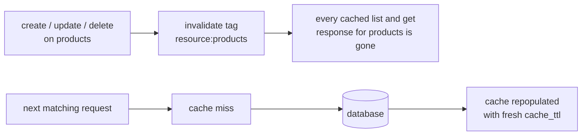

## Overview

Caching in Pawabase is one field: `cache_ttl`, an integer number of seconds, `0` to `86400` (24 hours), defaulting to `0` — off. There is no separate `enabled` toggle, no `max_entries` or eviction policy to configure, and no `?cache=false` bypass query parameter. Setting `cache_ttl` to a positive number turns caching on for that resource's `list` and `get` responses; setting it back to `0` turns it off. That is the entire configuration surface, and this page documents it in full along with the mechanics behind it — how the cache key is built, exactly when entries are invalidated, and when a positive `cache_ttl` is and isn't the right call.

```json
{"name": "products", "cache_ttl": 60}
```

Set it in Studio on the resource's settings, or directly in the definition body under the `cache_ttl` key — it's validated with `ge=0, le=86400`, so a value outside that range is refused with `422` when you save.

## What gets cached

Only `list` and `get` responses on a resource with `cache_ttl > 0`. `create`, `update`, and `delete` are never cached — they always hit the database directly, and a successful write on the resource invalidates its cache (see below) so the very next read reflects it.

Custom routes have their own, separate `cache_ttl` field (only meaningful for `GET` routes) that works on the same mechanism described here but is configured per route rather than per resource — see [Custom routes](/data/custom-routes).

## The cache key

The cache key is built from everything that could change what the response looks like: which resource, which operation, the exact query parameters, and — critically — the caller's identity and role. For `list`:

```
res:<resource-name>:list:<hash of caller identity, role, and sorted query params>
```

For `get`:

```
res:<resource-name>:get:<hash of caller identity, role, id, and expand param>
```

The hash itself is a SHA-256 of a JSON array `[identity, role, ...request-specific parts]`, with `identity` being the authenticated caller's identity string (or the literal string `"anon"` for an unauthenticated request) and `role` coming from the platform context resolved for that request. This is the mechanism, not an implementation detail you need to reproduce — the two things worth internalizing from it:

**A cached read never crosses callers.** Two different users hitting the identical `list` query get two entirely separate cache entries, because their identities differ and both feed the key. There's no scenario where user A's cached response is ever served to user B, even if their queries are byte-for-byte identical.

**Every distinct combination of query parameters is a separate cache entry.** Changing `page`, `per_page`, `sort`, any `filter[...]`, `select`, or `expand` produces a cache miss and a new entry — the platform doesn't try to compute one query's result from another's cached data (there's no partial-result reasoning; it's a pure key-value cache). A resource with highly varied query patterns from its callers will see a correspondingly low cache hit rate even with a generous `cache_ttl`, simply because so few requests share an exact key.

Because role and identity are baked into the key, the total number of distinct cache entries a resource accumulates scales with (distinct query shapes) × (distinct callers) — there's no `max_entries` cap or LRU eviction described above because there doesn't need to be one at the configuration level; the underlying cache store's own expiry (driven by `ttl`) is what reclaims space, not a size-based eviction policy exposed to you.

## TTL: how long an entry lives

`cache_ttl` is the number of seconds an entry is stored for at write time — it is a hard expiry, not a "check freshness" window. A cached `list` response written with `cache_ttl: 60` is returned as-is to any matching request for up to 60 seconds, then the entry is gone and the next matching request falls through to the database and repopulates the cache. There's no background revalidation and no stale-while-revalidate behavior — a request either hits a live, unexpired entry or it does a full database read.

## Invalidation: tag-based, on every write

Every successful write to a resource — `create`, `update`, or `delete`, whether it came through the public REST API, Studio's record editor, a flow, or a function calling the resource store directly — invalidates that resource's cache entirely, immediately, regardless of which specific record changed. This happens through a tag (`resource:<name>`) attached to every cache entry written for that resource; the write's aftermath invalidates everything under that tag in one call, rather than trying to compute which specific cached queries the changed row could have affected.



This is deliberately coarse-grained, not per-record: updating one product invalidates *every* cached `list` and `get` response for the `products` resource, across every caller and every query shape, not just entries that happened to include that one product. The reasoning is that a policy can depend on more than the changed row itself — a caller's cached `list` result could, in principle, be affected by a change to a record their policy evaluates against other data — so the platform doesn't attempt row-level invalidation and instead clears the whole resource's cache on any write to it. For a resource that's written to frequently, this means the effective cache hit rate is bounded by how often *any* record changes, not by how often the specific record a given reader cares about changes.

Invalidation also propagates across API instances: if you run more than one replica of the API, a write on one instance invalidates the tag everywhere, not just locally, so a second replica doesn't keep serving a stale cached response after a write landed on the first.

## Cache and policies

Because the caller's role is part of the cache key, a change to a *caller's own* role or claims (for example, after a token refresh that grants a new role) naturally produces a fresh key on their next request rather than serving a cached response computed under their old role — there is nothing you need to do to handle this; it falls out of the key composition.

What the cache genuinely cannot detect is a policy condition that depends on state *outside* the resource itself — a condition referencing another resource's data, an environment variable, or an external call. Invalidation only fires on writes to the *same* resource. If a policy's outcome can change because of something that happens elsewhere, a cached response can go stale relative to that external change until its `cache_ttl` naturally expires. Keep `cache_ttl` short (or `0`) for a resource whose policy depends on fast-changing external state, since there is no manual invalidation hook and no bypass parameter to force a fresh read for a single request.

## Cache and residual (row-by-row) policies

A `list` response whose `total` came back `null` because of a residual, per-row policy (see [Resources](/data/resources#what-residual-means-for-total)) is cached exactly as returned, `total: null` included — the cache doesn't try to recompute or "fix" the count on the way out. If your client treats a cached `null` total as meaningfully different from a fresh one, it shouldn't; both reflect the same honest limitation.

## Cache and transformers

The cached body is the response **after** the resource's transformer has run — whatever shape `?expand=` and the transformer produce is exactly what's stored and exactly what's replayed to the next matching request. Changing a transformer definition doesn't itself invalidate the cache (it isn't a write to the resource's *data*), so entries cached under the old transformer shape can be served briefly after a transformer change, until either their `cache_ttl` lapses or a genuine write to the resource clears them. If you need a transformer change to take effect immediately for cached reads, the platform's recompilation on definition save (see [Resources → Versioning](/data/resources#versioning-and-compiled-state)) changes what *new* cache keys get populated with, but doesn't retroactively clear entries already sitting in the cache under the previous version.

## When to use it

| Scenario | `cache_ttl` |
| --- | --- |
| A product catalog read far more often than it's written (many shoppers, occasional restock) | A generous value — 60 to 300 |
| A live order-status endpoint that must reflect the latest write immediately | `0` (leave it off) |
| A per-user dashboard summary that's expensive to compute but tolerates a few seconds of staleness | A short value — 5 to 30 |
| A resource whose policy depends on an external service's current state | `0`, or the shortest value that still helps, since invalidation can't track that external change |
| A resource written to constantly relative to how often it's read | Low benefit either way — invalidation on every write means the cache rarely gets to live out its TTL |

## Realistic business scenario: caching a product catalog

A storefront's `products` resource is read on every page load by anonymous shoppers and updated only a handful of times a day by staff restocking or repricing.

```json
{
  "name": "products",
  "operations": {
    "list": {"enabled": true, "policy": "public"},
    "get": {"enabled": true, "policy": "public"},
    "update": {"enabled": true, "policy": "staff"}
  },
  "cache_ttl": 120
}
```

Every anonymous shopper shares the same identity bucket (`"anon"`) in the cache key, so the first shopper to hit `GET /rest/v1/products?filter[active]=is.true` after a cache miss populates the entry for every subsequent shopper issuing the identical query for the next two minutes — a large multiplier on database load reduction for a resource with this read/write ratio. The moment staff runs a `PATCH` to reprice one item, the entire `products` cache is invalidated and the next shopper's request repopulates it, fully fresh, well before the two-minute TTL would otherwise have expired it.

## Troubleshooting

<AccordionGroup>
<Accordion title="I set cache_ttl but responses still seem to hit the database every time">
Check that requests are actually sharing an identical cache key — different callers (even both anonymous, if role resolution differs), or any difference in query parameters (page, filters, sort, select, expand), produce separate entries and therefore separate cache misses.
</Accordion>
<Accordion title="A write doesn't seem to invalidate the cache">
Invalidation fires from the same after_write path every resource write goes through, including Studio's record editor — if a change was made directly through the database console or an external process against the same table, it bypasses this entirely, since the console does not know about resource-level caching.
</Accordion>
<Accordion title="I need to force a fresh read for a single request">
There's no bypass query parameter. Set cache_ttl to 0 to disable caching for the resource entirely, or wait for the TTL to lapse. If you need selective bypass regularly, that's a sign cache_ttl is too high for how fresh this resource needs to be.
</Accordion>
<Accordion title="Two users with identical filters are somehow getting different cached results, as expected, but I want to confirm why">
The cache key includes the caller's identity and role, by design, specifically so cached reads never cross users. This isn't a cache miss bug — it's the intended isolation.
</Accordion>
</AccordionGroup>

## FAQ

<AccordionGroup>
<Accordion title="Is there a way to cache only list or only get, not both?">
No — cache_ttl applies to both operations on the resource together. There's no per-operation cache_ttl.
</Accordion>
<Accordion title="Does caching apply across environments?">
No. Each environment (development, staging, production) has entirely separate compiled state and its own cache; nothing cached in one leaks into another.
</Accordion>
<Accordion title="Can I set a maximum number of cache entries or an eviction policy?">
No such setting exists. Entries expire on their own TTL; there's no size cap or LRU eviction to configure.
</Accordion>
<Accordion title="Does a definition save (not a data write) invalidate the cache?">
Not directly — a resource definition save recompiles routes and models for the new version, but doesn't itself clear already-cached response bodies. A subsequent data write, or the TTL lapsing, is what clears them.
</Accordion>
</AccordionGroup>

<CardGroup cols={2}>
  <Card title="Resources" icon="database" href="/data/resources" />
  <Card title="Resource events" icon="zap" href="/data/resource-events" />
  <Card title="Custom routes" icon="route" href="/data/custom-routes" />
</CardGroup>
