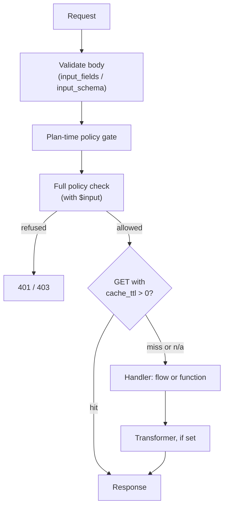

## The mental model

A custom route is an HTTP endpoint you define directly — a method, a path, a policy, and a handler — for anything that doesn't fit the five fixed CRUD operations a [Resource](/data/resources) exposes. Where a Resource is "a client sends a row, the system stores it, the system returns it," a custom route is for "and then": refunding an order and adjusting three other tables, calling a payment provider, aggregating several resources into a dashboard summary, or receiving a third-party webhook.

Like everything else in Pawabase, a custom route is a definition stored per environment. You create and edit it in Studio (or through the platform API directly), it's validated before it's saved, and it compiles into a live route the moment the environment's compiled state refreshes — there is no separate deploy step.

## Anatomy of a route definition

```json
{
  "method": "POST",
  "path": "/orders/{order_id}/refund",
  "name": "Refund an order",
  "description": "Reverses a payment and restores stock.",
  "policy": {"in": ["finance", "$auth.roles"]},
  "input_fields": [
    {"name": "reason", "type": "string", "required": true, "max_length": 200}
  ],
  "input_schema": null,
  "response_schema": null,
  "transformer": null,
  "handler_type": "flow",
  "handler": "refund_order",
  "rate_limit": {"limit": 30, "window": 60},
  "cache_ttl": 0,
  "tags": ["orders"],
  "enabled": true
}
```

| Field | Type | Meaning |
| --- | --- | --- |
| `method` | `"GET" \| "POST" \| "PUT" \| "PATCH" \| "DELETE"` | The HTTP verb. Default `POST` |
| `path` | string | The route path, Sillo syntax — `/orders/{order_id}/refund`. Must match `^(/[A-Za-z0-9_.\-]+|/\{[A-Za-z_][A-Za-z0-9_]*(:path)?\})+$` |
| `policy` | condition or `null` | Same condition language as resource policies. `null` defaults to `authenticated` at compile time |
| `input_fields` | field list or `null` | Inline field definitions compiled into a request model, the same compiler resource `create` bodies use |
| `input_schema` | string or `null` | Name of a reusable stored schema to validate the body against instead of `input_fields` |
| `response_schema` | string or `null` | Name of a reusable stored schema documented (and, when no transformer is set, enforced) as the response shape |
| `transformer` | transformer definition or `null` | Reshapes the handler's result before it's returned — same mechanism as [resource transformers](/data/transformers) |
| `handler_type` | `"flow" \| "function"` | What runs the request — see below |
| `handler` | string | The flow's name or the registered function's name |
| `rate_limit` | `{"limit": int, "window": int}` or `{}` | Per-caller cap, same mechanism as resource `rate_limit` |
| `cache_ttl` | integer, `0`–`86400` | Only meaningful for `GET` routes — see [Caching](/data/caching) |
| `tags` | list of strings | OpenAPI grouping only |
| `enabled` | boolean | A disabled route registers no HTTP route at all, same as a disabled resource operation |

**`handler_type` is exactly two values: `flow` or `function`.** There is no third "schema-only" or documentation-only handler type — every enabled custom route runs a real handler on every request. If you need to describe an endpoint that's actually served by something outside Pawabase entirely (a CDN, another service sitting in front of the gateway), don't model it as a Pawabase custom route at all — there's no built-in way to register a route definition here that intentionally does nothing.

## Path parameters

A path segment in `{curly braces}` becomes a path parameter, available to the handler under `params`:

```
POST /orders/{order_id}/refund
```

```json
{"params": {"order_id": "ord_123"}, "query": {}, "body": {"reason": "customer cancelled"}}
```

A `{param:path}` suffix (the `:path` type annotation Sillo supports in route syntax) lets a single trailing parameter capture the rest of the path, including further slashes — useful for something like a catch-all proxy segment, though this is an advanced, uncommon shape for most custom routes.

## What the handler receives

Regardless of `handler_type`, the shape handed to the handler is the same three-key object:

```json
{
  "params": {"order_id": "ord_123"},
  "query": {"notify": "true"},
  "body": {"reason": "customer cancelled"}
}
```

- `params` — every path parameter, as strings (the route compiler builds the handler's signature to match the path's own parameter names, so there's no coercion beyond what the handler or flow does itself).
- `query` — the full query string as a flat dict.
- `body` — the validated, JSON-serialized request body when `input_fields` or `input_schema` is set (a Pydantic model dumped to JSON); on a route with no input model but a JSON-bearing method (`POST`/`PUT`/`PATCH`), the platform still attempts to parse the raw request body as JSON and passes it through unvalidated; on `GET`, `body` is simply absent from a client's perspective (a `GET` route registers no request model at all).

## Handler types

### Flow handler

`handler_type: "flow"` names a flow by its stored name. The flow receives the request payload as its trigger input:

```json
{"params": {"order_id": "ord_123"}, "query": {}, "body": {"reason": "customer cancelled"}}
```

Inside the flow, these values are reachable the same way any trigger input is — `$input.body.reason`, `$input.params.order_id`. A flow used as a route handler needs an `trigger.http` node; if the flow has more than one HTTP trigger node, the one whose configured `method` and `path` match this specific route wins, falling back to the first HTTP trigger node in the flow if none match exactly, and finally to the flow's default entry point if it has no HTTP trigger node at all. A route pointing at a flow that doesn't exist fails immediately with a 500-level flow error rather than compiling silently.

If the flow ends with an explicit HTTP response step (`response.return`), that step's status, headers, and body become the route's actual HTTP response — letting a flow-backed route return a custom status code (for example, `202 Accepted` for something queued asynchronously) or custom headers. Without an explicit response step, the flow's own final result is JSON-encoded and returned with `200`.

**Example: a flow-handled refund route.**

```json
{
  "method": "POST",
  "path": "/orders/{order_id}/refund",
  "policy": {"in": ["finance", "$auth.roles"]},
  "input_fields": [
    {"name": "reason", "type": "string", "required": true, "max_length": 200},
    {"name": "amount_cents", "type": "integer", "minimum": 0}
  ],
  "handler_type": "flow",
  "handler": "refund_order",
  "rate_limit": {"limit": 30, "window": 60}
}
```

```bash
curl -X POST "$GW/rest/v1/orders/ord_123/refund" \
  -H "apikey: $PK" -H "Authorization: Bearer $TOKEN" -H "Content-Type: application/json" \
  -d '{"reason": "customer cancelled", "amount_cents": 5900}'
```

The `refund_order` flow reads `$input.params.order_id` and `$input.body`, looks up the order, calls the payment provider, updates the order's status, and finishes — its result (or an explicit response step) becomes the HTTP response.

### Function handler

`handler_type: "function"` names a registered Python function. The function is invoked with an **input** shape that folds `params` and `body` together (with `body`'s keys taking precedence when both are present and `body` is itself an object), rather than the three-key `{params, query, body}` object a flow receives — if `body` isn't a JSON object (a list, a scalar, or missing), the function's input falls back to just `params`.

```python
from pawabase_kit.functions import function, FunctionContext

@function("refund_order")
async def refund_order(ctx: FunctionContext, input: dict) -> dict:
    order_id = input["order_id"]        # from params
    reason = input["reason"]            # from body
    # ... perform the refund ...
    return {"refunded": True, "order_id": order_id}
```

Function handlers are a code-deployment concept: the function must be registered in your deployed service (via the `@function` decorator or equivalent) before a route can reference it by name. Studio lets you point a route at a function name, but it cannot create the function itself — that always requires a code change and deploy, unlike a flow, which is entirely Studio-editable.

**Example: a function-handled route.**

```json
{
  "method": "POST",
  "path": "/reports/generate",
  "policy": {"in": ["analyst", "$auth.roles"]},
  "input_fields": [
    {"name": "range_start", "type": "date", "required": true},
    {"name": "range_end", "type": "date", "required": true}
  ],
  "handler_type": "function",
  "handler": "generate_sales_report",
  "cache_ttl": 0
}
```

Use a function handler over a flow when the logic needs a capability flows don't expose directly (a specific library, precise control over concurrency, heavy computation) — otherwise, prefer a flow, since it stays entirely Studio-editable and promotable without a code deploy.

## Route execution order

1. **Path and body validation.** If `input_fields` or `input_schema` is set, the request body is validated against the compiled model before anything else runs — an invalid body never reaches the policy check. This mirrors [Validation](/data/validation)'s ordering for resource operations.
2. **The plan-time policy gate.** Conditions that don't depend on `$input` are decided here, before the body is even read on methods where reading the body happens separately; a caller who could never pass regardless of the body is refused early with `401`/`403`.
3. **The full policy check**, now with `$input` (the validated body) available — a condition referencing the submitted data is evaluated here, once the body is known.
4. **Cache lookup**, only for `GET` routes with `cache_ttl > 0` — a cache hit returns immediately without invoking the handler at all.
5. **The handler runs** — the flow or function.
6. **The transformer**, if set, reshapes the handler's result.
7. **The response** is returned, and if this was a cacheable `GET` that missed, the result is stored for next time.



## Policies on custom routes

Every custom route has a policy — `null` in the stored definition compiles to the platform default (`authenticated`), so an unset policy is never accidentally public. The condition language is identical to resource policies:

```json
{"truthy": "$auth.user_id"}
```

```json
{"in": ["finance", "$auth.roles"]}
```

A condition on a custom route has access to `$auth` (the caller's identity and claims) and, once the body has been validated, `$input` (the validated request body — not `params`/`query`, just the body payload). A route whose policy references `$input` is checked twice under the hood, as described in the execution order above: the parts of the condition that don't touch `$input` are decided before the body is read, and the full condition (with `$input` now populated) is re-evaluated once it is.

## Response shape and response_schema

`response_schema` names a reusable stored schema. When set and the route has no `transformer`, the response is documented (and, through Sillo's `response_model`, enforced) against that schema in the generated OpenAPI document. If a `transformer` is also set, `response_schema` is skipped for enforcement purposes — the transformer's actual output, whatever shape it produces, is what's returned, and the OpenAPI document for that route omits a `response_model` since the two would only ever be able to disagree with each other. Leaving both unset means the handler's raw return value is returned exactly as produced, JSON-encoded, with no documented response shape beyond "some JSON."

## Testing a custom route

```bash
curl -X POST "$GW/rest/v1/orders/ord_123/refund" \
  -H "apikey: $PK" -H "Authorization: Bearer $TOKEN" -H "Content-Type: application/json" \
  -d '{"reason": "customer cancelled"}'
```

Studio's route view shows the compiled OpenAPI entry for the route and lets you try it interactively with your own operator credentials. `GET .../resources/<name>/openapi` and the equivalent environment-wide OpenAPI endpoint reflect exactly what's compiled, which is the fastest way to confirm a route's shape matches what you intended before testing it from a real client.

## Path collisions with resources

A custom route path is refused at save time if it would shadow a resource's own compiled routes — you cannot register a custom route at `/products` or `/products/{id}` if a `products` resource already owns those paths, since the resource's own `list`/`get`/`create`/`update`/`delete` routes take that space. Pick a path that doesn't collide, or nest the custom behavior under a sub-path (`/products/{id}/restock` is fine even though `/products/{id}` is taken, since it's a distinct path).

## Realistic business scenarios

**A batch-import endpoint that validates and creates many records in one call**, backed by a function for full control over partial-failure handling:

```json
{
  "method": "POST",
  "path": "/customers/bulk-import",
  "policy": {"in": ["admin", "$auth.roles"]},
  "input_fields": [
    {"name": "rows", "type": "array", "items": {"type": "object", "fields": [
      {"name": "name", "type": "string", "required": true},
      {"name": "email", "type": "email", "required": true}
    ]}}
  ],
  "handler_type": "function",
  "handler": "bulk_import_customers"
}
```

**A composite dashboard endpoint** aggregating three resources into one response, backed by a flow that fans out to each and assembles the result:

```json
{
  "method": "GET",
  "path": "/dashboard/summary",
  "policy": {"truthy": "$auth.user_id"},
  "handler_type": "flow",
  "handler": "dashboard_summary",
  "cache_ttl": 30
}
```

**An inbound Stripe-style webhook receiver** — though for signature-verified inbound webhooks specifically, an [inbound hook](/webhooks/inbound) is usually the better-fitting primitive than a custom route, since it handles signature verification for you; a custom route is the right tool when you need bespoke request handling a plain inbound hook doesn't offer.

## Troubleshooting

<AccordionGroup>
<Accordion title="Saving a route with handler_type 'schema' fails validation">
That value has never been valid — handler_type is exactly flow or function. If you want a route that only documents a shape with no real handler, that's not a supported configuration; every enabled route must run something.
</Accordion>
<Accordion title="The route returns 404 from the router">
Check enabled: true first — a disabled route registers no HTTP route at all. Then check the path for an exact match, including any {param} segments.
</Accordion>
<Accordion title="Saving a route fails with 'the path would shadow a resource's own routes'">
The path collides with a resource's compiled CRUD routes. Rename the path or nest it under a sub-path the resource doesn't own.
</Accordion>
<Accordion title="A flow-handled route always returns 200 even though the flow raised an error">
Check whether the flow has an explicit response step; without one, only the flow's final result is returned, and a flow-level error should propagate as a genuine failure rather than a 200 — if it isn't, the flow itself may be swallowing the error rather than raising it.
</Accordion>
<Accordion title="My route's $input condition in the policy doesn't seem to see the body on a GET request">
Correct — GET routes never register a request body model, so $input reflects an empty or absent body for GET. Put anything the policy needs to see on a GET into the query string and adjust the condition to inspect $input differently, or reconsider whether this should be a POST.
</Accordion>
</AccordionGroup>

## FAQ

<AccordionGroup>
<Accordion title="Can a custom route call another resource's operations directly?">
Not through the route definition itself — the handler (flow or function) does that work, using the same store or REST access any flow/function has.
</Accordion>
<Accordion title="Is a function handler promotable between environments the same way a flow is?">
The route definition (including which function name it points at) promotes normally. The function's code itself is part of your deployed service, not something promotion moves — it must already exist, under the same name, in the target environment's running service.
</Accordion>
<Accordion title="Can I rate-limit a custom route differently from a resource?">
Yes — rate_limit is set per route, independent of any resource's own rate_limit.
</Accordion>
<Accordion title="Does a custom route support caching on POST?">
cache_ttl is only consulted for GET routes; a POST/PUT/PATCH/DELETE route's cache_ttl, if set, has no effect.
</Accordion>
</AccordionGroup>

<CardGroup cols={2}>
  <Card title="Resources" icon="database" href="/data/resources" />
  <Card title="Validation" icon="badge-check" href="/data/validation" />
  <Card title="Transformers" icon="wand" href="/data/transformers" />
  <Card title="Caching" icon="clock" href="/data/caching" />
</CardGroup>
