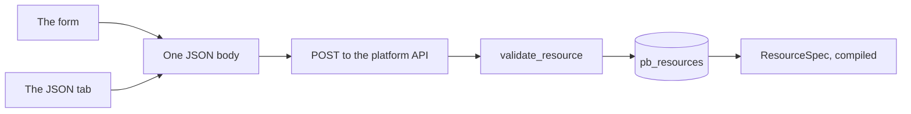
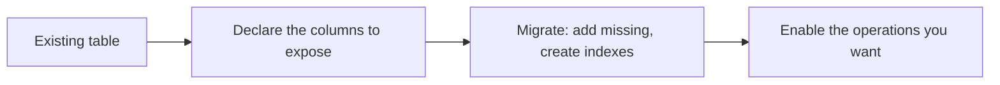
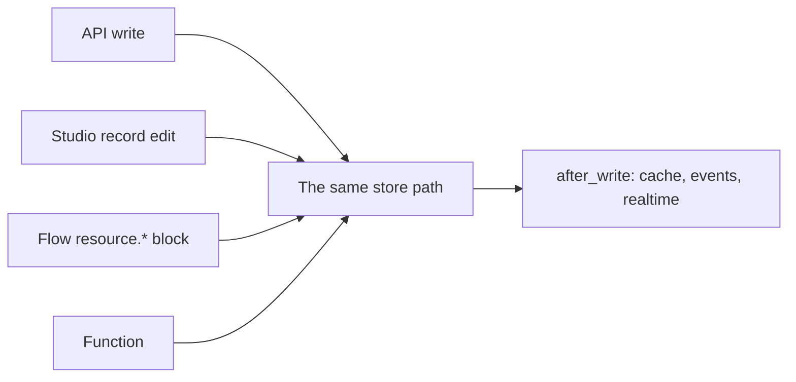
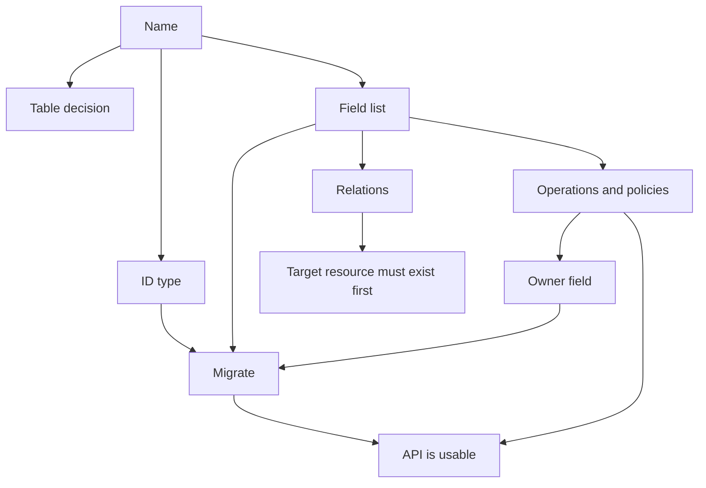

A resource form in Studio is a structured editor over one JSON body. That is the whole mental model, and everything on this page follows from it: what each control writes, what the editor strips, what it carries through untouched, and what the API refuses at save time.

The form is not a friendlier abstraction over something more expressive. It is a projection of the definition, and the **JSON** tab is the same object. When a control seems to be missing something you need, that is usually because the JSON accepts a shape the form does not surface — not the other way round.



## Where the editor lives

**Build → Resources** in the left nav. The list shows **name**, **table** and **description**. The empty state reads **No resources yet** with a **Create the first one**; the button that opens the editor is **New resource**.

The form has six sections, in this order:

| Section | What it decides |
| --- | --- |
| **Details** | Identity: name, table, primary key, id type, description |
| **Fields** | The field list |
| **Access** | Which of the five operations exist, and each one's policy |
| **Relations** | Declared navigations for `?expand=` |
| **Caching & limits** | Response cache lifetime and request throttling |
| **Events & realtime** | Whether changes are published, and where |

<Info>
Older builds label these **Operations** and **Behaviour** rather than **Access** and one combined behaviour section. The settings and their order are the same; only the headings moved.
</Info>

Above the sections sit two controls that belong to no single section, because they describe a row rather than a section of behaviour: **Owner field** and **Timestamps**. Both are covered below.

### What the client checks before it saves

Two guards run in the browser, so you can hit them without a round trip:

| Guard | Message | What it catches |
| --- | --- | --- |
| Name present | The name field is required | An unnamed resource, which has no URL |
| Every field named | "Every field needs a name." | A row with an empty name input, including fields nested inside an `object` |

The field-name guard is recursive. An `object` field whose nested fields include one unnamed entry blocks the save of the whole resource, not just that row — which is the right behaviour, because a nested field without a name cannot be validated, stored or returned.

There is a third, quieter guard: the name input turns its `.invalid` styling when the text does not match `^[A-Za-z_][A-Za-z0-9_]*$`. It does not block the save on its own; the API does that, with a `422`. The styling is there to show you before you leave the page.

## Details, field by field

### Name

The **Name** input is monospace, autofocused while the resource is new, and carries the hint "Served at /rest/v1/`<name>`" — so the consequence of the field is visible while you type it.

Once the resource exists, the input is disabled with a different hint: "The URL segment; fixed once created." That is not a limitation of the form; it reflects a real constraint. Relations, event subscriptions, flow blocks and custom-route policy references all address the resource by name, and those references are resolved by name when the environment compiles. Renaming would silently break every one of them.

The pattern is `^[a-z][a-z0-9_]{0,62}$`. Lower-case letters, digits and underscores, starting with a letter, at most 63 characters.

| Accepted | Refused |
| --- | --- |
| `orders` | `Orders` |
| `invoice_lines` | `invoice-lines` |
| `v2_reports` | `2fa_codes` |
| `a` | `""` |

### Table

**Table** is optional, with the hint "Defaults to the name." Leave it blank and `table` is stored as the resource name — the API applies `body.table or body.name`, so a blank field and a field matching the name produce the same stored value.

Setting it explicitly is what lets a resource expose a table that already exists. The pattern is wider than the name's: `^[A-Za-z_][A-Za-z0-9_]{0,62}$`, so `CustomerOrders`, `_audit` and `legacy_invoices` are all legal table names attached to a lower-case resource name.

The choice deserves a moment's thought, because the name is a contract and the table is an implementation detail:

| | Resource name | Table |
| --- | --- | --- |
| Who sees it | Every client | Nobody outside Studio and the console |
| Changing it later | Not possible in place | One field edit |
| Constrained by | The URL shape | SQL identifier rules |

Rename the resource to match a bad table name you are stuck with, or keep the API name clean and point `table` at the mess. The second is what the separate field is for.

### Primary key

**Primary key** defaults to `id` and takes the wide identifier pattern. It names the column that identifies a record, and it appears in every response, in every `get` and `update` and `delete` path, and in every expansion.

It is included in the `field_map` whether or not you declare it as a field, so it is always filterable, sortable and selectable, and `select` always appends it.

### ID type

A two-way choice, rendered as a segmented control: **Auto-increment** or **UUID**.

| | Auto-increment | UUID |
| --- | --- | --- |
| Stored value | `integer` | `uuid` |
| Assigned by | The database | Python, `uuid.uuid4()`, at create time |
| In JSON | a number | a string |
| A malformed id | `404`, because non-digits are refused | passed through, and simply does not match |
| Good for | Internal ids, cheapest key, stable ordering | Distributed creation, ids in shared URLs, ids you do not want to leak volume through |

The choice is close to irreversible in practice. Migrate creates the column one way or the other and never retypes it, so changing your mind means writing DDL yourself in the Database console and rewriting every id that points at the table.

### Description

**Description** is optional, placeholder "What rows live here?", and it becomes the route summary in OpenAPI. It costs nothing and it is the first thing a new integrator reads.

<Note>
There is no separate "public docs" toggle per resource. Whether the environment's OpenAPI document is served publicly is an environment-level setting; the description is what goes in it either way.
</Note>

## The field editor

The **Fields** section is a list of rows, each row being one field definition. A new row starts as `{name: "", type: "string"}` with the name input focused.

The section's own description is "Compiled to a Pydantic model and published in OpenAPI", followed by a line that changes with the **Timestamps** switch:

| Timestamps | The line reads |
| --- | --- |
| On | "The primary key and created_at / updated_at are added for you." |
| Off | "The primary key is added for you." |

It is a useful line, because it is the one place the form tells you that some things are implicit. The primary key and the timestamp columns exist in the model and in the table without appearing in the field list — and they are still filterable and sortable.

### The anatomy of a row

Every row carries the same controls in the same order:

| Control | What it is | What it does |
| --- | --- | --- |
| Reorder chevrons | Two buttons, up and down | Moves the field in the list; up is disabled on the first row, down on the last |
| Type dot | A coloured glyph with the type's label as its tooltip | A visual summary of the type, colour-coded by family |
| Name input | Monospace, placeholder `field_name` | The field's name. Turns `.invalid` when it does not match the name pattern |
| Type select | A dropdown of the fourteen type labels | The field's type |
| **Required** | A checkbox | Whether the field is required on create |
| **More options** | A disclosure, labelled **Collapse** when open | Reveals the constraint panel |
| Trash | Labelled **Remove field** | Deletes the row from the list |

**Add field** beneath the list appends a row. Reordering and deleting are list operations only — neither changes the database, because nothing reaches the database until you migrate.

<Warning>
Removing a field from the definition does not drop the column. Migrate is additive only: it adds what is missing and never removes anything. A field you delete stops being validated, returned, filterable and sortable — and the data stays, readable from the console.
</Warning>

### The fourteen types

The type dropdown offers exactly these labels. The value stored in the JSON is the lower-case machine key in the first column.

| Value | Label | Glyph | Colour family |
| --- | --- | --- | --- |
| `string` | Text (short) | `Aa` | lavender |
| `text` | Text (long) | `¶` | lavender |
| `integer` | Integer | `12` | sky |
| `number` | Number | `1.5` | sky |
| `boolean` | Yes / no | `✓` | mint |
| `datetime` | Date & time | `⏱` | butter |
| `date` | Date | `D` | butter |
| `uuid` | UUID | `id` | peach |
| `email` | Email | `@` | rose |
| `url` | URL | `↗` | rose |
| `json` | JSON | `{}` | peach |
| `array` | List | `[ ]` | mint |
| `object` | Object | `{ }` | mint |
| `ref` | Schema reference | `→` | peach |

The glyph and its colour are doing real work: a form with forty fields is scannable by dot colour before it is readable by text, and lavender-for-text, sky-for-number, butter-for-time, rose-for-contact-string and peach-for-reference-or-JSON is a grouping you learn once.

Note what is *not* in the list: no array-of-array, no composite, no bigint. `integer` is a `BIGINT` on postgres and mysql and an `INTEGER` on sqlite, so there is nothing to choose.

### Required

The **Required** checkbox writes `required: true`. Its effect is narrower than it looks, and the narrowness is worth internalising before you use it:

| Mode | Effect of `required: true` |
| --- | --- |
| `create` | Enforced — but only if there is no `default` |
| `update` | Ignored; every field is optional in the update model |
| `read` | n/a |

A field that is `required` and has a `default` is not actually required, because a value is always available. A field that is `required` with no default must be supplied on every create.

### More options

Opening **More options** reveals a panel whose contents depend on the field's type. The constraints that mean something for a string do not mean anything for an integer, and showing them all would be noise.

The panel always contains:

| Control | Setting | Notes |
| --- | --- | --- |
| **Description** | `description` | Optional; placeholder "Shown in the API docs" |
| **Default** | `default` | Placeholder "No default" |
| **Example** | `example` | Optional; published in OpenAPI |

Then, by type:

| Type | Additional controls |
| --- | --- |
| `string`, `text`, `email`, `url` | **Min length**, **Max length** |
| `string` only | **Pattern**, hint "A regular expression the value must match", monospace, placeholder `^[a-z0-9-]+$` |
| `integer`, `number` | **Minimum**, **Maximum**, and **Allowed values** |
| `datetime`, `date` | **Minimum**, **Maximum** |
| `ref` | **Schema**, a picker over the environment's schemas |
| `array` | **Item type**, a dropdown of the fourteen types except `array`, plus a schema picker when the item type is `ref` |
| `object` | **Nested fields**, a full field editor for the `fields` key |
| `boolean`, `json`, `uuid` | Nothing beyond the three always-on controls |

**Allowed values** is worth calling out because it is the easiest way to make a field safe: it writes an `enum`, and an `enum` overrides the declared type entirely, compiling the field to a `Literal` of exactly those values. It is available on `string`, `integer` and `number`, and the tag input converts numeric entries to numbers and discards anything unparseable.

<Info>
`max_length` on a `string` is more than a validation rule. With no value given, the compiled model applies a default of 255, and that same number becomes `VARCHAR(255)` on postgres and mysql.
</Info>

### The Default control, by type

The **Default** input is the one control that changes shape four different ways:

| Type | How the default is entered |
| --- | --- |
| `boolean` | A three-way segmented control: **None**, **Yes**, **No**. Choosing None removes the key entirely |
| `integer`, `number` | A number input; blank means no default |
| Everything else | A text input; blank means no default |
| `json`, `array`, `object`, `ref` | Not editable — the panel shows the hint "Set defaults for this type in JSON view." |

That last row is a small but real gap in the form, and the hint tells you exactly where to go. The **JSON** tab is the same body, so a default of `[]` or `{"colour": "black"}` is a two-second edit there and a completely ordinary thing to want.

The three-way boolean control is worth a moment: because **None** removes the key rather than writing `null`, you can distinguish "no default" from "a default of false", and those behave differently. A field with no default and a field with a default of `false` are not the same thing when `nullable` and `required` are also in play.

### What the editor strips, and what it carries

The form is not a lossless round trip of arbitrary JSON, and it is worth knowing exactly where it loses things, because the loss is deliberate in one direction and accidental-looking in the other.

**Stripped.** When a control is cleared, the editor deletes the key rather than writing an empty value. Keys whose value is `undefined`, `""`, `null`, `[]` or `false` are removed from the field definition. That is why clearing **Pattern** removes `pattern` instead of leaving `"pattern": ""`, and why a `[]` from an emptied tag input disappears rather than persisting as an empty enum.

The one consequence worth remembering: `false` is a stripped value, so a boolean switch that turns something *off* removes its key. That is why **Nullable**, **Read only** and **Write only** are stored as absences rather than as explicit `false` values — and why a field that is not nullable simply has no `nullable` key.

**Carried through.** Keys the editor does not know about are passed along untouched. This is the mechanism that keeps `indexed` and `unique` alive through a round trip in the form even though no toggle writes them on that build: you set them in the JSON tab, open the form, edit the field's description, save, and they are still there.

It is also why the JSON tab is the escape hatch rather than a competitor. Anything you can express in the definition, you can set there, and the form will not argue with it.

### Constraints, and which types they apply to

Constraints are not decorative metadata — each one becomes a keyword on the compiled Pydantic field, and only for the types where it means something:

| Constraint | Applies to |
| --- | --- |
| `pattern` | `string`, `text`, `email`, `url` |
| `min_length`, `max_length` | `string`, `text`, `email`, `url` |
| `minimum`, `maximum` | `integer`, `number`, `datetime`, `date` |
| `description` | all, as the model's `description` |
| `example` | all, as `examples` |

Two of these are set for you if you leave them alone:

| Type | Default pattern when you supply none |
| --- | --- |
| `email` | `^[^@\s]+@[^@\s]+\.[^@\s]+$` |
| `url` | `^https?://[^\s]+$` |

Supplying your own `pattern` replaces the default rather than adding to it. So a `url` field with `pattern: "^(ftp|https)://"` accepts ftp URLs; one with `pattern: "^/internal/"` does not — and neither is what the type name suggests, which is a reminder that the type is a starting point and the pattern is the rule.

<Warning>
A `pattern` that will not compile as a regular expression is rejected when you save the definition, not when a request arrives. An uncompilable regex is a `422` at save time, which means you find out while editing rather than in production.
</Warning>

### Nested fields and item types

An `object` field nests a complete field editor under an eyebrow reading **Nested fields**, and that nested editor behaves exactly like the top-level one — same rows, same **More options**, same **Add field** — at one greater depth. Its contents are stored under the `fields` key and compiled into a nested Pydantic model.

An `array` field offers **Item type**, a dropdown of the fourteen types with `array` removed — no arrays of arrays. Choosing `ref` there reveals a schema picker for the item type.

Both nested structures are validated recursively at save time: `array.items` is validated as a single field named `item`, and `object.fields` is validated as a field list. An `object` with an unnamed nested field blocks the save in the browser; an `object` whose nested field has a duplicate name or a bad type is refused by the API.

### `read_only`, `write_only`, and the three models they shape

These two switches are the only lever you have over which keys appear in which direction, and they act on different compiled models:

| Marking | `create` model | `update` model | `read` model |
| --- | --- | --- | --- |
| Neither | Accepted | Accepted | Present |
| `read_only` | **Dropped** | **Dropped** | Present |
| `write_only` | Accepted | Accepted | **Dropped** |

Concretely:

- **`read_only`** is for values the server owns. A denormalised counter, a computed total, a column a background job maintains. Marking it means a client cannot write it even through a policy loose enough to allow the write. It is protection at the model layer, which is the layer that cannot be forgotten.
- **`write_only`** is for values that must never travel back. A password hash, a provider token, an internal risk score. The field is still stored, still validated, still filterable and still indexable — it simply never appears in a response.

The primary key is implicitly `read_only`. That is compiled into the read model as an extra field, which is why sending `id` in a create body neither sets it nor errors — even on a uuid resource where you might reasonably expect to be able to choose your own identifier.

<Warning>
Neither switch is a substitute for a policy. `read_only` stops a client writing a value; it does not stop them reading a row they should not see, and it does not stop a *flow* from writing the value, because flows go through the store rather than through the compiled request model. Use it for shape, not for access.
</Warning>

### Nullable

**Nullable** controls whether an explicit `null` is accepted on create. The default follows from `required`: a field is nullable unless it is required, so marking a required field **Nullable** produces a field that must be present but may be null — a genuinely different constraint from "may be omitted".

On `update`, `read` and `any`, nullable is forced true regardless of what you set, because a partial update can always legitimately omit something and a response can legitimately contain a null column.

That is why a nullable-required combination is the way to express "this column exists, it is always present in a create, and its value may be nothing" — which is a real and common requirement for a nullable foreign key.

## Field naming, and why the regex is what it is

Field names must match `^[A-Za-z_][A-Za-z0-9_]{0,62}$`. Upper-case letters, digits and underscores, starting with a letter or an underscore, at most 63 characters.

The wider rule — compared to the resource name's lower-case-only rule — is not an inconsistency. Field names end up as column names, as keys in your JSON, and as query-parameter fragments in `filter[<field>]` and `sort=`. The column rule is the SQL identifier rule, and `IDENTIFIER = ^[A-Za-z_][A-Za-z0-9_]{0,62}$` is checked on every one of them by `check_identifier()` before it reaches a query.

| Property | Consequence |
| --- | --- |
| No duplicates | Two fields with the same name are refused at save time |
| No unknown types | A `type` outside the fourteen is refused at save time |
| `ref` needs `schema` | A `ref` field with no `schema` is refused at save time |
| Recursive validation | `array.items` and `object.fields` are validated as fields in their own right |
| Patterns compile | An uncompilable `pattern` is refused at save time |

Every one of these is a `422` at save time. None of them can reach a request.

### Naming conventions that pay off

The regex permits upper-case letters in field names, which you should still decline to use. Field names become response keys, and a mixed-case response is a special case in every client you will ever write.

| Prefer | Over | Because |
| --- | --- | --- |
| `created_at` | `createdAt` | Sortable, greppable, and it matches the implicit timestamp columns |
| `customer_id` | `customerId`, `cust_id` | The `_id` suffix is the convention that makes a `belongs_to` relation recognisable at a glance |
| `total_cents` | `total`, `amount` | The unit in the name removes a whole class of currency bug |
| `status` with an `enum` | `status` free-text | An `enum` makes an invalid state unrepresentable |
| `is_archived` | `archived_at` as a boolean | Pick one; both patterns exist and mixing them in one table is worse than either |

The third row is the one with real consequences. `total_cents` is an `integer` that can never hold a fractional amount, and the name says so at every call site.

<Note>
`created_at` and `updated_at` are reserved by convention rather than by the platform. If you declare a field with one of those names explicitly, it participates in the same maintenance the implicit columns get — and you have made a column that cannot be optional. Prefer to let **Timestamps** create them.
</Note>

## Access: which operations exist

The **Access** section is described in the UI as "Which endpoints exist, and who may call each." It opens with a **Which operations are public?** switch — a bulk control that flips all five at once — and then shows one row per operation.

The name of that bulk switch is worth pausing on, because it describes exactly what the switch does. Operations are *public* or they are not served. There is no intermediate state where an endpoint exists and returns `403` to everyone.

### The five rows

Each row carries a switch, the HTTP method colour-coded by verb, the operation name, and — while the switch is on — a **Who may** policy picker.

| Operation | Method | Path | The picker appears |
| --- | --- | --- | --- |
| List | `GET` | `/rest/v1/<name>` | While enabled |
| Get one | `GET` | `/rest/v1/<name>/{id}` | While enabled |
| Create | `POST` | `/rest/v1/<name>` | While enabled |
| Update | `PATCH` | `/rest/v1/<name>/{id}` | While enabled |
| Delete | `DELETE` | `/rest/v1/<name>/{id}` | While enabled |

While a switch is off, the row shows "Off: the endpoint is not served." in place of the picker. That sentence is the answer to the question the bulk switch raises: an operation that is off has no route, no policy evaluation, and no entry in the OpenAPI document.

### What "public" means here, precisely

Two different gates stand between a caller and a row, and the form only configures the second one.

| Gate | Where it is configured | Question it answers |
| --- | --- | --- |
| The API key's scope | The key, in Studio's credentials section | May this *key* read or write at all? |
| The operation's policy | The **Who may** picker on this row | May this *caller* do this, to this row? |

`list` and `get` require the `resource:read` scope; `create`, `update` and `delete` require `resource:write`. A key without the scope gets `403` before the policy is consulted at all.

So "public" in the switch's label means "exposed to callers who get past the key", not "readable by anyone". The two are independent, and the operation's policy is where row-level rules live.

### Choosing the policy per operation

The picker lists the environment's policies, plus an empty state whose label is "Secret keys only". Whatever you choose is validated at save time, so a dangling reference cannot be stored.

An enabled operation with no policy falls back to the default policy `authenticated`. That default is a reasonable starting point and a poor destination: it means any signed-in user passes, which for a resource holding anything commercial is almost never what you want.

| Situation | A sensible choice |
| --- | --- |
| Public catalogue | A policy that checks nothing, or one that checks a role for staff-only data |
| Per-user data | `"owner:<owner_field>"`, with the owner field set |
| Multi-tenant | A policy equating `$record.<tenant>_id` to the caller's tenant |
| Backend-only writes | Leave `create` off and let a flow write |
| Append-only log | `create` on, everything else off |

<Warning>
Because the picker is per operation, the most common design mistake is reachable from right here: enabling all five with one policy and assuming the policy covers everything. `own_rows` on `create` does not stop a caller from creating a row owned by someone else — that is what `owner_field` is for. The two settings solve different halves of the problem, and both are needed.
</Warning>

### Turning an operation on is the only irreversible-feeling moment here

Every other setting on this form can be changed without consequence. Enabling an operation is the one where a wrong policy starts letting data out or letting data in, and the damage is rows rather than configuration.

Two habits reduce the risk. Enable reads before writes, so the read surface is exercised and cached before anything can be created. And give a write operation a policy that is closed by default — a role check, or `authenticated` with an `owner_field` set — rather than one that is open and filtered.

## Relations

The **Relations** section is described as "Include related rows with `?expand=name`." Each relation is a small card:

| Control | Setting | Behaviour |
| --- | --- | --- |
| **Name** | `name` | The key the expanded data appears under, and the name used in `?expand=` |
| **Kind** | `type` | A two-way choice: **Belongs to** or **Has many** |
| **Resource** | `resource` | A picker over the environment's resources; not optional |
| Foreign key picker | `field` | Its label changes with the kind |

The foreign-key label is the useful part. For `belongs_to` it reads **Foreign key here** and offers this resource's own fields. For `has_many` it reads **Foreign key on `<target>`** and offers the *target's* fields — computed from whichever resource you have picked, so picking the target first populates the right list.

That relabelling is the form quietly solving the mistake that relation declarations are most prone to. A `belongs_to` stores the foreign key on this table; a `has_many` stores it on the target's table. The picker offers whichever set of fields the declaration actually needs.

**Add relation** appends a card pre-filled with `{name: "", type: "belongs_to", resource: "", field: ""}`; the trash button labelled **Remove relation** deletes one.

[Relations](/data/relations) covers what the declaration does at request time, including the rules about which resource's policy governs the expanded rows.

<Warning>
The **Resource** picker is not optional and the **Name** and foreign-key pickers must be filled, but none of that is verified against reality. Saving does not check that the named resource exists, or that the named field is a column on either side. A typo saves cleanly and fails the first time somebody writes `?expand=`. The validation checks presence and the `type` value, nothing more.
</Warning>

## Caching & limits

Two controls, both about protecting something other than correctness.

### Cache responses

**Cache responses** is a seconds field with the hint "0 turns caching off. Up to a day (86400 seconds)." The API clamps it to 0–86400.

Setting it above zero makes `get` and `list` cacheable. Two properties of that cache are worth knowing before you turn it on:

**The key includes the caller's identity and the key's role.** A `get` key hashes `[identity, key role, id, expand]`; a `list` key hashes `[identity, role, sorted query params]`. Identity is `user.identity`, or the literal `anon`. So cached reads never cross users, and two different keys with different roles never share an entry.

**Invalidation is coarse.** Every cached entry is tagged `resource:<name>`, and any write to the resource drops the whole tag — whichever field changed, and however small. A one-character edit to one row evicts every cached list and get for that resource.

| `cache_ttl` | Reads | Writes |
| --- | --- | --- |
| `0` | Always go to the database | Unaffected |
| `30`–`300` | Repeated reads served from cache | Any write evicts everything |
| `3600`–`86400` | Reference data effectively free | One write resets the clock for every reader |

That asymmetry is the design: caching is for data that changes rarely and is read often — a currency table, a country list, a published article. It is not for a table where every row changes several times an hour, because there the hit rate collapses and you pay for the misses plus the evictions.

<Note>
Without `PAWABASE_REDIS_URL` set, the cache is in-process, which means each API process keeps its own copy. A multi-process deployment will serve different cache states per process until a write propagates.
</Note>

### Rate limit

**Rate limit** is a switch. Switched on, it reveals two number inputs reading "requests per / seconds", seeded with 60 and 60; the hint is "Per caller, counted across all gateway instances."

```json
"rate_limit": {"limit": 60, "window": 60}
```

The namespace is `rl:<project ref>:<environment>:<resource name>`, so buckets are per resource per environment per project, and the counter is shared across every gateway instance rather than being per-process. Exhaustion is a `429`.

The per-resource granularity is what makes it useful and what makes it easy to underestimate. Ten resources at 60 per minute is 600 requests a minute from one caller, and the client that fans out across all ten is the one you will discover this from.

Validation is one rule: a non-empty `rate_limit` must contain a `limit`. There is no minimum and no relationship enforced between the two numbers, so a window of `0` is accepted and means something no one intended.

<Warning>
A resource's `rate_limit` does not cover custom routes. Routes carry their own `rate_limit` with their own namespace, so an action that fans out to several resources is not bounded by any of them. See [Custom routes](/data/custom-routes).
</Warning>

## Events & realtime

Two switches, both about publishing the same payload to two different places.

| Control | Setting | Default | Destination |
| --- | --- | --- | --- |
| **Emit events on change** | `events` | On | `<name>.created`, `.updated`, `.deleted` |
| **Publish changes to realtime** | `realtime` | Off | The `resource:<name>` channel |

Both fire from the same `after_write` hook and carry the same body:

```json
{"resource": "invoices", "change": "updated", "record": {"id": 44, "status": "sent"}}
```

The payload is delivered with the actor and the request id, so a flow reacting to it can attribute the change and correlate it with the originating request.

```mermaid
flowchart LR
  w["after_write"] --> c["Invalidate resource:&lt;name&gt; tag"]
  c --> e{"events"}
  e -->|on| ev["Event: invoices.updated"]
  e -->|off| rt
  rt{"realtime"} -->|on| ch["Channel: resource:invoices"]
  rt -->|off| end["Done"]
  ev --> rt
```

Two behaviours that catch people out:

**`updated` fires on every write, not every change.** The hook runs after the SQL, so a PATCH that sets a field to the value it already held still emits `updated`. If that event drives expensive work, make the flow's condition check the value it cares about.

**Realtime is best-effort.** A publish failure is logged as a warning and the write stands. Nothing in the response tells you it failed. If a realtime message is load-bearing, drive it from an event and a flow, where there is a run history.

Events are the durable option and realtime is the live one. That is the right order of preference: a flow triggered by `invoices.updated` can be inspected, retried and reasoned about after the fact; a realtime publish that failed is simply gone.

See [Resource events](/data/resource-events) for subscriptions and delivery.

## Owner field and Timestamps

These two sit on the form rather than inside a section, because they describe a row rather than a category of behaviour.

### Owner field

**Owner field** is a picker over the fields you have declared, with an empty option labelled **None**, and the hint "Filled with the caller's user id on create."

It is one setting with three effects, all of them security-relevant:

| When | What happens |
| --- | --- |
| `create` | The column is overwritten with the caller's user id before the policy runs |
| `update` | The key is removed from the patch entirely |
| migrate | An index is created on the column |

The `create` behaviour is the reason it exists. A policy can stop a caller reading someone else's row; it cannot stop them writing a row that claims to belong to someone else, because at create time there is no existing row for a record-level condition to inspect. The owner field closes that at the only point it can be closed — on the way into the database.

The `update` behaviour closes the matching hole on the other side: without it, a caller could PATCH their own row's `user_id` to someone else's and lose their own access while gaining none.

Choose it deliberately rather than by convenience. A field named `user_id` on a document owned by an *account* is a model that will confuse the first person who reads the policy, because "owner" now means two different things in one product.

<Warning>
The owner field is set from the authenticated identity, so a `create` from a caller with no session is a `401` — "Authentication required" — when an `owner_field` is set. Service credentials are exempt. If you set an owner field and then wonder why an unsigned server-to-server call started failing, this is why.
</Warning>

### Timestamps

**Timestamps** maintains `created_at` and `updated_at`. On by default.

Both columns join the `field_map` whether or not you declare them, so `?sort=-created_at` and `?filter[created_at]=gte.2026-01-01` work on any resource with timestamps on and no field called `created_at` anywhere in the definition.

Turn it off for a table with no meaningful notion of when it changed: a lookup table, a configuration table, a pure join table. The costs of leaving it on are small but real — an extra column written on every update, recency sorts that sort a timestamp rather than an integer key, and two columns you have to reason about when a migration goes wrong.

<Warning>
Timestamps are written by the platform, not by the database. Rows inserted by raw SQL in the Database console do not get them, and will sort unpredictably against rows the API created. If a table is written from both paths, that is a problem the switch will not solve.
</Warning>

## The JSON tab, and why it is not a second source of truth

The editor sheet carries a **JSON** tab beside the form. It shows the body the platform stores, and it is the same body the form edits.

Three consequences, in descending order of how often they matter:

**Round-tripping is lossless in the direction that counts.** Keys the form does not know — `indexed`, `unique`, anything a future release adds — are carried through an edit in the form untouched. You can set a constraint in the JSON tab, open the form, change a description, save, and the constraint is still there.

**Clearing a control deletes its key.** Values that are `undefined`, `""`, `null`, `[]` or `false` are removed rather than written. So an emptied pattern disappears from the JSON instead of lingering as `"pattern": ""`.

**The form cannot express everything.** Defaults for `json`, `array`, `object` and `ref` fields are the visible gap — the panel says so and points you here. Anything the form does not surface is available here, and anything you set here survives the next form edit.

<Warning>
Because the JSON tab is editable, it can also hold something the form would never produce: a value that passes validation but that you did not intend. Read the JSON before saving a resource for the first time, and read it again after any hand edit.
</Warning>

## What Studio refuses to save

Everything in this section is a `422` from the platform API, or a browser-side guard that stops the save before the request. None of them can reach a running environment as a broken definition.

| Refused | Message | Where it is caught |
| --- | --- | --- |
| A reserved name | `'health' is reserved` | API |
| A name outside `^[a-z][a-z0-9_]{0,62}$` | Pattern mismatch | API |
| No name at all | The name field is required | Browser |
| An unnamed field, including nested | "Every field needs a name." | Browser |
| A field name outside the identifier pattern | Pattern mismatch | API |
| A duplicate field name | Duplicate name | API |
| An unknown field type | Unknown type | API |
| A `ref` with no `schema` | Missing schema | API |
| An uncompilable `pattern` | Pattern error | API |
| A policy reference that does not resolve | Names the offending path, e.g. `operations.list.policy` | API |
| An inline transformer with a bad step | `transformer: …` | API |
| A relation missing `name`, `resource` or `field` | `relations[0] needs name, resource and field`, with the index | API |
| A relation whose `type` is neither kind | `relations[0].type is belongs_to or has_many` | API |
| A non-empty `rate_limit` with no `limit` | `rate_limit needs a limit` | API |

### What it does *not* check

The absence of these checks is the part to hold on to, because each one is a mistake you can save cleanly and discover later:

| Not checked | Consequence |
| --- | --- |
| That a relation's `resource` exists | `?expand=` fails at request time |
| That a relation's `field` is a real column | The expansion is empty, or the query errors |
| That `table` exists | Migrate creates it, or the first query fails |
| That `owner_field` names a field you declared | It is still written on create; the write fails at the database |
| That a policy is *appropriate*, only that it exists | Every access decision is yours |
| That an enum covers the values your data already holds | New writes are constrained; existing rows are not |
| That a table is empty before a unique index is created | The migration fails |

That last group is the honest summary of what a definition-based platform can validate. It checks that a definition is internally consistent and well-formed. It cannot check that the definition matches your intentions, and it cannot check that your intentions match your data.

## Saving, migrating, and keeping them apart

The two actions are separate on purpose, and the sequence matters more than it usually does because one of them touches production data.

Saving the definition writes a row to the platform database, recompiles the environment's state, and changes nothing about the tables. Running the migration is an operator-only action, audited as `resource.migrated`, and it is the only thing that changes the schema.

| | Saving | Migrating |
| --- | --- | --- |
| Who can do it | Anyone with edit access to the environment | Operators only |
| Touches the platform database | Yes | No |
| Touches your data | No | Yes |
| Audited | As a definition change | As `resource.migrated` |
| Reversible | Yes, by saving again | No |

### Adding a field to a live resource

Because the two steps are separate, there is a window between them and it is worth planning for. Saving a new field compiles a model that references a column the database does not have yet. Requests against the other fields are unaffected; requests that touch the new field fail until migrate runs.

The sequence that avoids surprises:

| Step | What happens | What to watch |
| --- | --- | --- |
| Save with the new field, not `required` | Model compiles; the column does not exist | Clients can still write, and the write fails on the unknown column |
| Migrate | `ALTER TABLE ... ADD COLUMN`, existing rows get `null` | No existing data is rewritten |
| Mark it `required`, if it should be | Create now demands it | Existing rows are unaffected — `required` is enforced on create only |
| Save again | New creates must supply it | Reads are unaffected either way |

The reverse is the operation with no undo in the tool: removing a field from the definition. The column stays, the field stops being exposed, and getting the data back means pointing a field at the same column name again. Nothing is destroyed, but nothing is forgotten either.

<Info>
Changing a field's type, removing it, or renaming it does nothing to the database. Those are manual SQL operations in **Build → Database**, where you can see the live columns, their types and their indexes before you touch them.
</Info>

### Indexed and unique

`indexed` and `unique` are field keys that affect DDL and nothing else. They are not validation rules and they do not change what a request may do.

| Key | Effect at migrate | Effect on requests |
| --- | --- | --- |
| `indexed` | `CREATE INDEX ix_<table>_<column>` | None. It makes filters and sorts on that column cheaper |
| `unique` | `CREATE UNIQUE INDEX`, and `UNIQUE` appended to the column definition | None. The database refuses duplicates |

Two properties worth internalising:

**Index names are derived.** `ix_<table>_<column>`, truncated to 60 characters. `IF NOT EXISTS` is used on sqlite and postgres, but not on mysql.

**Neither exists until you migrate.** Declaring `unique: true` on a field and never running migrate gives you a field that looks protected and is not. The protection is a database object, and it is created by the migration.

What `indexed` is actually for is the same thing it is for in any database: a column you filter or sort on. `customer_id` on an orders table, `status` on a job queue, `slug` on an article. Indexing every column is a real cost in write throughput and storage, and on a small table the planner will ignore the index anyway.

<Note>
If `owner_field` is set, migrate creates an index on it too. That is why owner-scoped list queries do not table-scan even though you never asked for an index on that column.
</Note>

## Choosing the table name against the resource name

These are the two most similar-looking inputs on the form and they do different jobs, so it is worth being explicit about when to diverge.

| | Resource name | Table |
| --- | --- | --- |
| Becomes | The URL `/rest/v1/<name>` | A table in the environment database |
| Pattern | `^[a-z][a-z0-9_]{0,62}$` | `^[A-Za-z_][A-Za-z0-9_]{0,62}$` |
| Fixable later | No | Yes, one field |
| Referenced by | Relations, events, flow blocks, route policies | Nothing outside the definition |

Leave **Table** blank when the table will be created by migrate from this definition — which is the case for almost every resource you will build. The stored value becomes the resource name, and there is one name to hold in your head.

Set **Table** explicitly in three situations:

**The table already exists.** This is the migration path for a database Pawabase did not create: point `table` at the existing table, declare the fields you want to expose, run migrate so indexes are created and anything missing is added, and enable the operations you want. The field list becomes a *view* over that table rather than a claim about all of it — a column present in the database but absent from the field list is invisible to the API.

**The table name cannot be your API name.** A legacy table called `ORDERS_2019`, or one whose name you do not control because it came from another system. The resource can still be called `orders`.

**You want two views of one table.** Two resources with the same `table` and different `fields` produce two different projections, each with its own policies. Occasionally the right answer for a private internal view and a public one. Be aware that they invalidate their cache tags independently, so a write through one is not a write through the other as far as caching is concerned.

<Warning>
A custom route cannot shadow a resource's routes. A route with path `/orders` or `/orders/{id}` is refused with `422` when a resource named `orders` exists, so a table-backed view and a route on the same data need different paths.
</Warning>

## Required, default, and nullable: the interaction

Three controls in the panel combine in ways that are not obvious from any one of them, and getting the combination wrong produces a validation rule you did not intend.

The rule: **a field is required on create only if `required` is true and there is no `default`.**

| `required` | `default` | `nullable` | On create |
| --- | --- | --- | --- |
| No | No | Default (true) | Optional, and `null` is accepted |
| No | Yes | Default (true) | Optional; the default fills it in |
| Yes | No | Default (false) | **Must be present**, and cannot be null |
| Yes | Yes | Default (false) | Optional — the default satisfies it |
| Yes | No | Yes | Must be present, and may be `null` |
| Yes | No | No | Must be present, and cannot be null |

The fifth row is the one to know about. "Present but null" is a genuinely different constraint from "omitted or present", and it is the correct shape for a nullable foreign key on a row that must always reference *something, possibly nothing*.

And all of it stops applying on `update`, where every field is optional and nullable is forced true. A required field is required of a create, never of a patch.

<Warning>
Defaults are applied server-side on every create — REST, a flow's `resource.*` block, Studio's record editor, all of them. They are not a client-side convenience. A field with a default will be populated in the response whether or not the caller mentioned it, and it will be populated for a flow that never thought about the field.
</Warning>

## A complete form, annotated

Here is a full definition with the reasoning attached to each part, so the controls and their consequences can be seen together.

```json
{
  "name": "invoices",
  "description": "Customer invoices. Totals are computed by the issuing flow.",
  "table": null,
  "primary_key": "id",
  "id_type": "integer",
  "fields": [
    {"name": "customer_id", "type": "uuid", "required": true, "indexed": true,
     "description": "The customer this invoice is for."},
    {"name": "status", "type": "string", "enum": ["draft", "issued", "paid", "void"],
     "default": "draft", "description": "Lifecycle state. Set by routes, not by clients."},
    {"name": "total_cents", "type": "integer", "required": true, "minimum": 0,
     "read_only": true, "description": "Computed by the issuing flow."},
    {"name": "due_on", "type": "date", "nullable": true},
    {"name": "internal_note", "type": "text", "write_only": true, "max_length": 2000},
    {"name": "line_items", "type": "array",
     "items": {"type": "object", "fields": [
       {"name": "sku", "type": "string", "required": true, "max_length": 64},
       {"name": "quantity", "type": "integer", "required": true, "minimum": 1}
     ]}}
  ],
  "operations": {
    "list": {"enabled": true, "policy": "own_invoices"},
    "get": {"enabled": true, "policy": "own_invoices"},
    "create": {"enabled": false, "policy": null},
    "update": {"enabled": false, "policy": null},
    "delete": {"enabled": false, "policy": null}
  },
  "relations": [
    {"name": "customer", "resource": "customers", "field": "customer_id", "type": "belongs_to"},
    {"name": "refunds", "resource": "refunds", "field": "invoice_id", "type": "has_many"}
  ],
  "transformer": "invoice_summary",
  "cache_ttl": 0,
  "rate_limit": {},
  "events": true,
  "realtime": true,
  "timestamps": true,
  "owner_field": "user_id",
  "tags": ["billing"]
}
```

| Part | Why it is that way |
| --- | --- |
| `id_type: integer` | Invoices are created in one place, by the issuing flow. A uuid buys nothing and costs a wider key |
| `customer_id` is `uuid`, `indexed` | The foreign key must match the type of the row it points at, and every list filters on it |
| `status` has an `enum` and a default | The five illegal states are unrepresentable, and a draft never needs an explicit status |
| `total_cents` is `required` **and** `read_only` | Required on create — the flow always supplies it — and impossible for a client to set |
| `internal_note` is `write_only` | Staff write it, nobody reads it through the API |
| `line_items` is an `array` of `object` | Nested structure validated as a field list; stored as JSON |
| `create`/`update`/`delete` are off | Every state change goes through a route with a flow behind it |
| `owner_field: user_id` | Drafts created in Studio still need an owner, even though clients cannot create |
| `cache_ttl: 0` | The issuing flow invalidates on every write; a cached read here would be a lie within a second |
| `realtime: true` | A payment screen wants the status change pushed |
| Both relation kinds | `customer_id` is a key here; `invoice_id` is a key on `refunds` |

### What the response looks like

```json
{
  "id": 44,
  "customer_id": "6f1c9a2e-4b7d-4a11-9c33-8e2f5b6d1a90",
  "status": "issued",
  "total_cents": 210000,
  "due_on": "2026-03-01",
  "line_items": [{"sku": "MUG-01", "quantity": 2}],
  "created_at": "2026-02-01T09:14:00+00:00",
  "updated_at": "2026-02-14T16:03:11+00:00"
}
```

`internal_note` is absent because it is `write_only`. `id` and the timestamps are present because they are in the read model whether or not they are in the field list. And because the resource has a transformer named `invoice_summary`, this is in fact the transformer's shape rather than the field list's — the fields above are what the transformer chose to keep.

## Common mistakes, and what each one costs

| Mistake | What happens | Cost |
| --- | --- | --- |
| Enabling `create` on a resource whose invariants live in a flow | Clients write rows the flow never approved | The invariant is unenforceable, and you find out in production |
| Enabling `delete` on anything | One call removes a row, hard | No soft delete, no confirmation, no recovery |
| Using one policy for all five operations | Reads and writes share an access rule | Ownership semantics on a write that has no owner yet |
| Relying on a `create` policy to prevent forged ownership | The row is created with someone else's id | Silent data-integrity bug |
| Declaring `unique` and never migrating | Looks protected, is not | Duplicates, discovered under load |
| Declaring `required` on a live table without a default | New creates must supply it; old rows have null | A window where the table violates its own definition |
| Putting a transformer on a heavily filtered resource | Sort and filter address the pre-transform names | `400`s on queries that look correct |
| Setting `cache_ttl` on a table that changes often | Hit rate collapses, evictions on every write | Slower than no cache |
| Declaring a field you never read or filter | It is in every response, every list, every schema | A contract you cannot take back |
| Expecting `?filter` on a JSON column | Filters cannot reach inside `json`, `array` or `object` | `400`, and no workaround short of a separate resource |

<Note>
The pattern across all of these is the same: the definition is cheap to change and cheap to promote, and every one of these mistakes is a *semantic* mismatch between what the definition says and what the product needs. The form will happily save all of them.
</Note>

## Frequently asked questions

<AccordionGroup>
<Accordion title="Can a resource have no fields at all?">
Yes. The primary key always exists, and so do the timestamp columns unless you turn them off, so an empty field list still migrates into a real table. It is a reasonable starting point for a resource whose shape you have not settled: define the key, migrate, add fields, migrate again.
</Accordion>
<Accordion title="Does reordering fields do anything?">
Only in the definition. Order is preserved in the field list, which is what you read in the JSON and in the generated models, but a column's position in a table has no meaning and no field's position in a response is contractual. Reorder for readability, not for effect.
</Accordion>
<Accordion title="Why did my enum disappear when I cleared Allowed values?">
Because a cleared control deletes its key rather than writing an empty value — an emptied tag input produces `[]`, and `[]` is stripped. The same rule removes an emptied `pattern` and an emptied `min_length`. It is why the JSON does not accumulate empty strings.
</Accordion>
<Accordion title="Can I set a default on a json or array field in the form?">
No — the panel says "Set defaults for this type in JSON view." Use the **JSON** tab. The setting survives subsequent edits in the form, because keys the form does not know are carried through untouched.
</Accordion>
<Accordion title="Is the field name check the same as the resource name check?">
No. Field names use the wider SQL identifier rule `^[A-Za-z_][A-Za-z0-9_]{0,62}$`; resource names are lower-case only, `^[a-z][a-z0-9_]{0,62}$`. The narrower rule on resources exists because the name becomes a URL segment.
</Accordion>
<Accordion title="What does the Name field's disabled state mean?">
That the resource exists. Renaming would break every reference by name — relations, event subscriptions, flow blocks, route policies — so it is prevented rather than supported. Create a new resource and point its `table` at the same table if you need a new URL.
</Accordion>
<Accordion title="Can I rename a field?">
In the definition, yes — but migrate will not rename the column. You get the old column plus a new one, and the new field starts empty. Renaming a column is a manual operation in **Build → Database**.
</Accordion>
<Accordion title="Does saving the definition run the migration?">
No. Saving writes a row to the platform database and recompiles the environment. Migrating is a separate, operator-only action, audited as `resource.migrated`, and it is the only thing that changes the schema.
</Accordion>
</AccordionGroup>

## Where to go next

<CardGroup cols={2}>
  <Card title="Resources" icon="table-properties" href="/data/resources" />
  <Card title="Field types" icon="type" href="/data/field-types" />
  <Card title="Relations" icon="link" href="/data/relations" />
  <Card title="Validation" icon="check" href="/data/validation" />
  <Card title="Migrations" icon="arrow-right" href="/data/migrations" />
  <Card title="Caching" icon="database" href="/data/caching" />
  <Card title="Custom routes" icon="route" href="/data/custom-routes" />
  <Card title="Schemas" icon="code-2" href="/data/schemas" />
  <Card title="Policies" icon="shield-check" href="/policies/overview" />
  <Card title="Transformers" icon="wand" href="/data/transformers" />
</CardGroup>

## Relations on the form, in one place

The **Relations** section was covered above as a UI walkthrough. What follows is the part that matters at request time, kept here so the two are not separated in your head.

A relation is a declared navigation hint, and it does exactly one thing: it powers `?expand=<name>` on `list` and `get`.

| Key | Meaning |
| --- | --- |
| `name` | The key the expanded data appears under, and the name you write in `?expand=` |
| `resource` | The related resource's name |
| `field` | The foreign key column — on *this* resource for `belongs_to`, on the *related* resource for `has_many` |
| `type` | `belongs_to` or `has_many`; defaults to `belongs_to` if omitted |

The rule that catches everyone is in the `field` row, and the form's relabelled picker exists to make it unmissable: **Belongs to** means the foreign key lives here, **Has many** means it lives over there.

```json
{"name": "customer", "resource": "customers", "field": "customer_id", "type": "belongs_to"}
{"name": "refunds",  "resource": "refunds",  "field": "invoice_id", "type": "has_many"}
```

Both can be declared on the same resource, pointing in opposite directions, and that is normal rather than contradictory: one says "these invoices have a customer", the other says "this invoice has refunds".

<Warning>
Validation checks that `name`, `resource` and `field` are present and that `type` is one of the two legal values. It does not check that the named resource exists or that the named field is a column on either side. Both mistakes save cleanly and fail on first use.
</Warning>

## Caching, rate limits, events and realtime, side by side

The four behaviour controls answer different questions and combine freely. This is the whole set in one table.

| Control | Setting | Default | Question it answers |
| --- | --- | --- | --- |
| **Cache responses** | `cache_ttl` | `0` | May repeated reads be skipped? |
| **Rate limit** | `rate_limit` | `{}` | How many requests may one caller make? |
| **Emit events on change** | `events` | `true` | Should a change cause something to happen? |
| **Publish changes to realtime** | `realtime` | `false` | Should a change be pushed to a live screen? |

And the two identity controls above them:

| Control | Setting | Default | Question it answers |
| --- | --- | --- | --- |
| **Owner field** | `owner_field` | `null` | Whose row is this? |
| **Timestamps** | `timestamps` | `true` | When did this change? |

A coherent default for a new resource is events on, realtime off, caching off, no rate limit, timestamps on, and an owner field only if rows genuinely belong to a user. Turning all four performance and publication settings on at once, on a resource that has not been exercised yet, is how you end up debugging a stale read and a duplicate notification at the same time.

## Reading the form as a document

The most useful thing about a definition being data is that you can read it as a document and answer a surprising number of questions without running anything.

**Is this resource public?** Look at `operations`. Any operation with `enabled: true` and no policy is on the default `authenticated` policy, which means every signed-in user in the project.

**Who can write?** Look at `create`, `update` and `delete`. If any of them is on with a policy you cannot summarise in one sentence, that is where to start.

**Does this resource own anything?** Look at `owner_field`. If it is set, clients cannot forge ownership on create and cannot reassign it on update. If it is null and `create` is on, clients choose the owner — which may be exactly right, and is worth confirming deliberately.

**What does this resource expose?** Look at `fields`. Anything without `write_only` is in every response; anything without `read_only` is accepted from clients. A field you added for a one-off flow and never removed is now part of the public contract.

**What happens when a row changes?** Look at `events` and `realtime`. Both off means nothing downstream is told, and any flow you wrote to react to a change will silently never run.

**What is the effective index story?** Look for `indexed`, `unique`, and `owner_field`, and remember that none of them exists in the database until migrate runs.

This is not a substitute for the OpenAPI document, which tells you the same things as compiled artefacts rather than as intentions. But it is faster, it is what is actually stored, and it is the thing you promote.

## Promoting a definition between environments

Promotion copies definitions — resources, schemas, policies and the rest — from one environment to another, and bumps the target's version counter so it recompiles. Saving a definition anywhere bumps that environment's version counter, which is what invalidates and rebuilds the compiled application and decides what is cached.

Two consequences:

| Promotion does | Promotion does not |
| --- | --- |
| Copy the resource definition | Run the migration on the target |
| Copy policies, schemas, flows, routes | Copy data |
| Bump the target's version | Copy credentials, keys, secrets or integrations |

So the sequence for a schema change is always the same shape: promote, then migrate on the target, exactly as you would have migrated on the source. Environments that share a design and differ only in data make this routine; environments that drift apart make it a source of confusing one-sided failures, where the definition exists in production and the column does not.

<Info>
Every save bumps the environment's version. That is not noise — it is the mechanism by which the platform knows to recompile, and it is why a saved definition takes effect without a deploy.
</Info>

## Working with a table you did not create

Not every resource describes a table Pawabase built. If you are exposing a table that already exists — a legacy schema, one imported from another system — the form works the same way with two adjustments in emphasis.

**The field list is a view, not a claim.** Declare the columns you want to expose; the others stay in the database and stay invisible to the API. A column present in the table but absent from the field list cannot be filtered, sorted or selected, and does not appear in responses.

**Migrate becomes additive in a more literal sense.** Because the table exists, migrate does not issue a `CREATE TABLE`; it walks your field list and issues `ALTER TABLE ... ADD COLUMN` for anything missing, then creates the indexes you declared. It will happily add a nullable column to a table that never needed it, which is the failure mode to watch for when copying a field list from somewhere else.



| Concern | New table | Existing table |
| --- | --- | --- |
| Column types | Yours to choose | Already fixed; the field type must match reality or reads will decode oddly |
| Primary key | Created as declared | Must already exist with the name you declared |
| Nullable-ness | From your `required`/`nullable` | Whatever the table says; validation and storage can disagree |
| Adding a field | Additive, safe | Additive, but you have just changed someone's schema |
| Removing a field | Column stays | Column stays, and the data stays |

The one that bites hardest is the last group. On an existing table, `required` is your *validation* claim while nullability is the *database's* fact, and nothing forces them to agree. A field declared `required: true` on a table where the column is nullable will be refused on create by the model — which is correct — but existing rows with nulls are returned without complaint.

## Pre-existing data and enums

An `enum` constrains writes from the moment the definition is saved, and does nothing to rows already in the table. Adding `enum: ["draft", "issued"]` to a `status` column that already contains `pending` produces a resource where every row is readable and only two values are writable, and no error tells you the third exists.

Check the current values before narrowing an enum on a live table. **Build → Database** shows the live column and lets you page through rows, and it is the only place the truth about existing data is visible.

<Warning>
The same applies to `unique`. Declaring `unique: true` and migrating on a table with duplicates does not deduplicate — the `CREATE UNIQUE INDEX` fails, and you find out at migration time rather than at save time. Decide whether to clean the data or to make the index partial before you add the flag.
</Warning>

## Studio's record editor, and why it is not the same as the API

Operators can browse and edit rows without going through the API, and it is worth being clear about how that path differs, because it is a common source of "why did this behave differently".

| | API write | Studio record editor |
| --- | --- | --- |
| Runs the resource's policies | Yes | No — service rights |
| Requires the API key's scope | Yes | No |
| Runs `after_write` | Yes | Yes |
| Emits events | Yes | Yes |
| Publishes realtime | Yes | Yes |
| Invalidates the cache tag | Yes | Yes |
| Validates against the field types | Yes | Yes, field-type aware |

So the *effects* of a Studio edit are identical to an API write, and the *permissions* are not. A row edited by an administrator fires `invoices.updated` at your flows with the operator as the actor.

The editor itself is field-type aware in the same way the API is: a text input for strings, a number input, a boolean select, `date` and `datetime-local` inputs, a textarea for `text`, and a monospace JSON textarea for `object`, `array` and `json` that parses on blur. Columns that exist in the table but not in the field list are still shown, marked as raw — editable, but without type knowledge.



Raw SQL in the Database console is the exception to all of this. It bypasses the store entirely, so no `after_write` runs, no event fires and no realtime message is published. It does invalidate every resource's cache tag, because the console cannot know which resource a table belongs to.

<Warning>
A flow that reacts to `updated` will therefore see writes it did not make, including ones an operator made in Studio. If a flow assumes every change came from a customer, that assumption is wrong, and the actor is the cheapest way to find out.
</Warning>

## Choosing a type

The dropdown offers fourteen options and the difference between several pairs is a decision you will live with. This is the guidance the type list itself cannot give you.

| If the value is… | Choose | Not |
| --- | --- | --- |
| A short label, a code, a slug | `string` | `text` — you get `VARCHAR(255)` and a validation bound for free |
| A paragraph, a description, a body | `text` | `string` — `TEXT` everywhere, no length bound |
| An email address | `email` | `string` — you get the pattern, and the 320-character column |
| A URL a user will click | `url` | `string` — you get the http/https pattern |
| A count, an age, a quantity | `integer` | `number` — no rounding surprises |
| Money in minor units | `integer`, named `*_cents` | `number` — floating point money is a bug you have not written yet |
| A measurement, a rate, a price with decimals | `number` | `integer` — you will lose precision at the boundary |
| A flag | `boolean` | `integer` — `false` and `0` mean different things in a response |
| An instant in time | `datetime` | `date` — a date has no time and no timezone |
| A calendar day | `date` | `datetime` — you will get `00:00:00` and an implied timezone |
| A generated or external identifier | `uuid` | `string` — validation and a native postgres `UUID` column |
| Something with no fixed shape | `json` | `object` — you give up the nested validation |
| An ordered list of one primitive type | `array` | `json` — you get item validation |
| A list of records | `object` inside an `array` | `json` — this is `array` of `object`, validated on both levels |
| A reference to something you describe elsewhere | `ref` | duplicating the shape |

### The pairs that are genuinely close

**`string` and `text`.** Both validate as a Python `str`. The difference is the storage column: `VARCHAR(n)` versus `TEXT`, with `n` defaulting to 255 on a `string`. A `string` will refuse a 300-character value with a `422`. That is usually correct and occasionally surprising, and the fix is `text`, not a bigger `max_length` on a `string`.

**`integer` and `number`.** `integer` decodes with `int()`, `number` with `float()`. Money belongs in an `integer` of minor units with the unit in the field name. A `number` for money accumulates representation error that shows up as an invoice that is one cent off, months later, in a report nobody can reproduce.

**`date` and `datetime`.** A `datetime` on mysql is converted to UTC on the way in and **loses its timezone** on the way out, so it comes back naive. A `date` has no time component at all and no such problem. Choosing `datetime` for a calendar day means storing `00:00:00` and implying a timezone you never had.

**`json` and `object`.** `json` is `Any` — it validates as any JSON value and is stored as JSON. `object` compiles a nested model from a `fields` key, so every nested key is validated, documented and schema-published. Use `object` for a structure you know; use `json` for one you genuinely do not.

**`array` and `object`.** They compose: `array` of `object` gives you a validated list of records, which is the shape most people want for line items, tags with metadata, or a settings block per row. Both are stored as the same JSON column, so the choice is purely about validation depth.

<Warning>
There is no array-of-array. The **Item type** dropdown deliberately excludes `array`. A list of lists is a `json` field, and you lose item validation for it.
</Warning>

### Defaults and validation, side by side

| Type | Validated as | Column on postgres | Column on mysql |
| --- | --- | --- | --- |
| `string` | `str` | `VARCHAR(n)`, n = `max_length` or 255 | same |
| `text` | `str` | `TEXT` | `TEXT` |
| `email` | `str` | `VARCHAR(320)` | `VARCHAR(320)` |
| `url` | `str` | `TEXT` | `TEXT` |
| `integer` | `int` | `BIGINT` | `BIGINT` |
| `number` | `float` | `DOUBLE PRECISION` | `DOUBLE` |
| `boolean` | `bool` | `BOOLEAN` | `BOOLEAN` |
| `datetime` | `datetime` | `TIMESTAMPTZ` | `DATETIME(6)` |
| `date` | `date` | `DATE` | `DATE` |
| `uuid` | `UUID` | `UUID` | `CHAR(36)` |
| `json`, `array`, `object`, `ref` | `Any` | `JSONB` | `JSON` |

All four JSON-shaped types collapse to the same column type. `array`, `object` and `ref` are validated structures in Python that happen to live in a JSON column — which is why filters cannot reach inside them.

## Reading values back out

The decode side has its own dialect differences, and they surface in the JSON your clients receive.

| Type | sqlite | postgres | mysql |
| --- | --- | --- | --- |
| `boolean` | Stored as an integer, decoded with `bool()` | A real boolean | A real boolean |
| `datetime` | ISO-8601 text | Timezone-aware | Converted to UTC, timezone **dropped** |
| `date` | ISO text | A date | A date |
| `uuid` | A string | A real `UUID`, serialized as a string | A string |
| `number` | `float()` | `float()` | A driver `Decimal`, decoded to `float` |
| `json` and friends | `json.loads`, falling back to the raw string if it does not parse | same | same |

The mysql row is the one that surprises people: a `datetime` written with an offset comes back without one. A client that parses timestamps and assumes an offset is present will misread every mysql timestamp. The convention that avoids it entirely is to store UTC and format on the client.

On the way *in*, a naive datetime is assumed to be UTC rather than local, and a trailing `Z` is normalised. So `"2026-03-01T09:00:00"` and `"2026-03-01T09:00:00Z"` mean the same instant.

<Warning>
The fallback on JSON decode is worth knowing about when debugging: a `json` column whose stored text does not parse comes back as the raw string rather than as an error. If a JSON field is suddenly a string in one row and an object in another, that is the fallback firing, and the stored value is the thing to inspect.
</Warning>

## Every control on the form, in one table

A single reference for the whole form, so nothing has to be remembered from the walkthrough above.

| Section | Control | Writes | Default |
| --- | --- | --- | --- |
| Details | **Name** | `name` | — |
| Details | **Table** | `table` | the resource name |
| Details | **Primary key** | `primary_key` | `id` |
| Details | **ID type** | `id_type` | `integer` |
| Details | **Description** | `description` | `""` |
| Fields | Row name | `name` | — |
| Fields | Type select | `type` | `string` |
| Fields | **Required** | `required` | absent |
| Fields | **More options → Description** | `description` | absent |
| Fields | **More options → Default** | `default` | absent |
| Fields | **More options → Example** | `example` | absent |
| Fields | **More options → Min length** | `min_length` | absent |
| Fields | **More options → Max length** | `max_length` | 255 on a `string` |
| Fields | **More options → Pattern** | `pattern` | per-type for `email` and `url` |
| Fields | **More options → Minimum / Maximum** | `minimum`, `maximum` | absent |
| Fields | **More options → Allowed values** | `enum` | absent |
| Fields | **More options → Schema** | `schema` | required for `ref` |
| Fields | **More options → Item type** | `items` | absent, on `array` |
| Fields | **Nested fields** | `fields` | absent, on `object` |
| Fields | **Nullable** | `nullable` | `not required` |
| Fields | **Read only** | `read_only` | absent |
| Fields | **Write only** | `write_only` | absent |
| Access | **Which operations are public?** | flips all five | all off |
| Access | Per-operation switch | `operations.<op>.enabled` | off |
| Access | **Who may** | `operations.<op>.policy` | `authenticated` |
| Relations | **Name** | `name` | — |
| Relations | **Kind** | `type` | `belongs_to` |
| Relations | **Resource** | `resource` | — |
| Relations | Foreign key picker | `field` | — |
| Caching & limits | **Cache responses** | `cache_ttl` | `0` |
| Caching & limits | **Rate limit** and its two inputs | `rate_limit` | `{}`, or 60/60 when switched on |
| Events & realtime | **Emit events on change** | `events` | `true` |
| Events & realtime | **Publish changes to realtime** | `realtime` | `false` |
| — | **Owner field** | `owner_field` | `null` |
| — | **Timestamps** | `timestamps` | `true` |

<Note>
Keys the form does not surface still exist and still work. `indexed` and `unique` are the two you will meet immediately; the general rule is that anything you write in the **JSON** tab survives editing in the form, because unknown keys are carried through untouched.
</Note>

## Two worked shapes

### A resource that clients fully own

For a resource where clients are the only writers and the rows are simple, the definition stays small on purpose.

```json
{
  "name": "notes",
  "description": "Personal notes.",
  "fields": [
    {"name": "title", "type": "string", "required": true, "max_length": 200},
    {"name": "body", "type": "text", "required": true},
    {"name": "pinned", "type": "boolean", "default": false},
    {"name": "tags", "type": "array", "items": {"type": "string", "max_length": 40}, "default": []}
  ],
  "operations": {
    "list": {"enabled": true, "policy": "owner:user_id"},
    "get": {"enabled": true, "policy": "owner:user_id"},
    "create": {"enabled": true, "policy": "authenticated"},
    "update": {"enabled": true, "policy": "owner:user_id"},
    "delete": {"enabled": true, "policy": "owner:user_id"}
  },
  "owner_field": "user_id",
  "cache_ttl": 0,
  "events": true,
  "realtime": false,
  "timestamps": true,
  "tags": ["personal"]
}
```

`owner_field` plus `"owner:user_id"` on all four owner-facing operations is the whole access model. `create` is `authenticated` because ownership is assigned server-side, and there is no record to compare against yet. Everything else is the shorthand for "this row is mine".

`tags` has a default of `[]` set in the JSON tab, because the form cannot express a default for an `array`. `pinned` defaults to `false`, which the form *can* express through the three-way boolean control.

Note what is absent: no `unique`, no `indexed`, because there is nothing to look up except the primary key and the owner column — and the owner column is indexed by migrate automatically because it is the owner field.

### A resource the backend owns

For a resource whose rows are written by flows and read by clients, almost everything about the *shape* is declared and almost everything about *access* is closed.

```json
{
  "name": "invoices",
  "description": "Issued invoices. Read-only to clients.",
  "fields": [
    {"name": "customer_id", "type": "uuid", "required": true, "indexed": true},
    {"name": "status", "type": "string", "enum": ["draft", "issued", "paid", "void"], "default": "draft"},
    {"name": "total_cents", "type": "integer", "required": true, "minimum": 0, "read_only": true},
    {"name": "issued_at", "type": "datetime", "nullable": true},
    {"name": "internal_note", "type": "text", "write_only": true, "max_length": 2000}
  ],
  "operations": {
    "list": {"enabled": true, "policy": "own_invoices"},
    "get": {"enabled": true, "policy": "own_invoices"},
    "create": {"enabled": false, "policy": null},
    "update": {"enabled": false, "policy": null},
    "delete": {"enabled": false, "policy": null}
  },
  "owner_field": "user_id",
  "cache_ttl": 0,
  "rate_limit": {"limit": 120, "window": 60},
  "events": true,
  "realtime": true,
  "timestamps": true
}
```

`total_cents` is `required` and `read_only` together, which reads oddly until you know both models: the create model demands it from whoever creates the row, and drops it from the request body — so a flow supplies it and a client could not even if it tried.

`internal_note` is the mirror image: accepted on writes, never returned.

`rate_limit` is set even though the read side is cheap, because this is the resource a customer-facing screen polls.

`realtime` is on because a status change is exactly the thing a payment screen wants pushed, and `cache_ttl` is `0` because the issuing flow invalidates on every write — a cached read here would be wrong within a second.

<Warning>
The `required` and `read_only` combination is a real and useful pattern, but it is not a security control. A flow's `resource.*` block goes through the store rather than the compiled request model, so a flow can write `internal_note` into a `write_only` field and read it back through the store. Model-level protection applies to HTTP requests.
</Warning>

## When the form is not enough

There are four situations where the answer is the **JSON** tab rather than a control, and knowing they exist saves rediscovering them one at a time.

**Defaults on structured types.** `json`, `array`, `object` and `ref` fields have no default input in the form, and the panel says so. `[]` and `{}` are perfectly ordinary defaults and they go in the JSON.

**`indexed` and `unique`.** These affect DDL and nothing else. On builds where the field panel offers **Indexed** and **Unique** switches for scalar types, they are here; on builds where it does not, they are JSON keys. Either way the effect is the same and it is the same effect: an index created by migrate, and nothing at all until then.

**Anything a future release added.** The form carries unknown keys through untouched, so a definition written by a newer Studio survives an older form intact. That is also why a definition that a colleague edited by hand will not lose its contents when you open it.

**Shape the form deliberately does not model.** A second `tags`-like key, a comment, an experimental field you will remove next week. The form will carry it; it just will not show it.

```json
{
  "name": "notes",
  "fields": [
    {"name": "title", "type": "string", "required": true, "max_length": 200},
    {"name": "tags", "type": "array", "items": {"type": "string", "max_length": 40}, "default": []},
    {"name": "slug", "type": "string", "unique": true},
    {"name": "body", "type": "text", "write_only": true}
  ]
}
```

`default: []` on the array, `unique: true` on the slug, and `write_only` on the body — three different reasons to reach for the tab, in four lines.

## The order things have to happen in

Not a checklist of clicks, but the dependencies between decisions that are easy to discover late.



The dependencies that actually bite:

**The ID type is needed before the first migration,** because migrate creates the key column. Changing it afterwards is manual DDL.

**The field list is needed before migrate,** because that is what migrate acts on. Saving without migrating leaves requests referencing a column that does not exist.

**The owner field must be a declared field,** or at least a column that exists — it is written on create regardless of whether the field list mentions it, and an unknown column is a failed write.

**A relation's target resource must exist before the relation is useful.** It saves either way, but the expansion cannot work until both sides resolve.

**Policies must exist before the operation that references them.** A dangling reference is refused at save time, which is the one class of cross-definition error that is caught for you.

<Note>
Nothing in that diagram requires a deploy, and nothing in it is undone by saving again. The only irreversible-feeling step is the migration, and only because of what it does to data rather than to configuration.
</Note>

## Reading the compiled result

Every resource contributes to one OpenAPI document, and reading it is the fastest way to confirm that the form did what you meant.

| Scope | Endpoint |
| --- | --- |
| The whole environment | `GET .../openapi` |
| One resource | `GET .../resources/<name>/openapi` |

Three things the document settles that the form cannot show you:

**Which paths exist.** An operation that is off contributes no path at all — not a path that refuses, not a path that 404s. If a method is missing from the spec, the switch is off.

**Which fields are visible in each direction.** The `create` model is published for requests, the `read` model for responses. A `write_only` field appears in one and not the other; a `read_only` field in the other. Seeing that once removes the need to reason about `read_only` again.

**Which status codes are real.** Each route registers the responses it can actually produce, so the document tells you that `create` returns `201`, that `delete` returns `204` with no body, and which errors are possible for that specific operation.

<Info>
`create` documents its `201` through the responses mapping rather than through a response model, because a response model is always published under `200`. Same result in the document; a different route to get there.
</Info>

## Why a save can be accepted and still wrong

The API validates that a definition is well-formed. It cannot validate that it matches your intentions, and the gap produces a specific set of outcomes worth recognising.

| What you wrote | Why it saved | What you will see |
| --- | --- | --- |
| A relation pointing at a resource that does not exist | Only presence and the `type` value are checked | `400` on `?expand=` |
| A relation whose `field` is not a column | Same | An expansion that is always empty, or a query error |
| A policy that exists but means the wrong thing | Only the reference is checked | Rows you did not intend to expose |
| An `enum` narrower than the data | Nothing reads the table at save time | Existing rows still readable, only new values writable |
| `unique` on a column with duplicates | The index is created at migrate time | The migration fails |
| `owner_field` naming an undeclared field | The key is a string, not a validated field | Writes fail at the database |
| A transformer name that does not resolve | A name reference is not validated at save time | `TransformerError` on the first read |
| `cache_ttl` on a table written on every request | Nothing about write frequency is known | A cache that never hits and evicts on every write |

Each of those is a decision you made rather than a bug, and each is cheaper to catch by reading the JSON than by watching production.

<Warning>
The most common version of this is a relation. It is the only declaration on the form that names two other objects by name and is not checked against either. Treat the relations array as the part of the definition most worth re-reading after saving.
</Warning>

## What the definition is worth

The reason a resource form is short is that the expensive parts are already built. Everything below is derived from the definition rather than written by you, and each item is something you would otherwise be maintaining by hand.

| Derived from the definition | What you would otherwise write |
| --- | --- |
| The field list | A model class, a serializer, a migration and a schema |
| `required`, enums, lengths, patterns | A validation layer per endpoint |
| `indexed`, `unique` | Index management, and the migrations that create them |
| `owner_field` | Ownership stamping on create and stripping on update |
| `timestamps` | Two columns maintained on every write path |
| Per-operation policies | An authorization check in every handler |
| The five routes, when enabled | A router, and the 404s for the ones you did not want |
| The list envelope, sorting, pagination | A pagination helper, and a `total` |
| `?expand=` | A loader to avoid N+1 |
| Cache keys including identity | A cache layer that does not leak between users |
| `after_write` | Event emission wired into every write path, including the ones you forget |
| The OpenAPI document | Documentation that is wrong by the second sprint |

That list is the case for resources as a concept. The form is not the product; the compilation behind it is.

<Note>
The corollary is that a resource is the wrong place for anything on the right-hand side of that table that is *not* derivable. Business rules, state transitions, cross-row invariants and anything that needs to notify a third party are what [flows](/flows/overview) and [custom routes](/data/custom-routes) are for.
</Note>

## Modelling notes that recur

Some field-design decisions come up in almost every project, and it is worth having an opinion on each before you start rather than after you have a thousand rows.

### Money

An `integer` named `*_cents`, always. The unit in the name is what prevents the bug where one code path treats it as major units. Validation is `minimum: 0` for amounts that cannot be negative, which the API enforces on create and on every patch that mentions it.

There is no decimal field type. A `number` for money accumulates representation error that surfaces as an invoice that is one cent off, months later, in a report nobody can reproduce.

### Identifiers for things you did not create

`uuid` when the id arrives from outside — an import, a webhook, another system — because you do not control the collision space. `string` when the id is opaque and meaningful, like an ISO country code or a Stripe-style reference. `string` with `unique: true` when it is a natural key you look rows up by.

Do not use a `string` for something that is conceptually a uuid and then filter on it expecting the database to validate the format. The column type on postgres is what gives you a native `UUID`; a `string` gives you `TEXT` and whatever pattern you supplied.

### Status fields

An `enum`, always, with a `default`. An `enum` compiles the field to a `Literal` of exactly those values, which makes the illegal states unrepresentable rather than merely discouraged. The `default` means a create does not have to mention it.

The question to ask before writing the list is who may set each value. If the answer is "not the client", then the field should be `read_only` and the transitions belong in routes. A status a client can PATCH is a status whose rules live in every client.

### Free-form content

`text` for a body, with `max_length` if you have a business reason for one. Not `json`, not `object` — those invite filtering you cannot perform and validation you have to write by hand.

For rich content with structure — a document with typed blocks, a settings tree — `json` is honest about the fact that you are storing whatever arrives. The cost is that you cannot filter on it, sort by it, or index any part of it.

<Warning>
Everything inside a `json`, `array` or `object` column is invisible to filtering. There is no partial match, no containment operator and no path syntax. A field you cannot query should not be a field you filter on, and the reverse — a field you need to query on should be a real column.
</Warning>

### Addresses, and the copy-versus-reference decision

A `json` field holding a billing address is right when the address is a snapshot of what was agreed at the time. A separate `addresses` resource referenced by `belongs_to` is right when addresses are shared, edited in one place, or deduplicated.

The snapshot case is more common than people expect and it is the safer default: an invoice that stores the address as it was when issued keeps showing the right thing after the customer moves, without any history table.

### Soft deletes

There is no soft-delete flag in the resource model. `delete` is a hard delete, and it is off by default for exactly this reason.

If you need recoverable deletion, you build it: a `status` field with a `deleted_at`, an operation set where `delete` is off and a route is on, and a policy that refuses to return rows where `deleted_at` is set. The read side then needs that condition on `list` and `get` explicitly, because nothing does it for you.

| Approach | Recoverable | Queryable | Cost |
| --- | --- | --- | --- |
| Hard delete | No | Yes | One field, one operation |
| `deleted_at` plus a route | Yes | Yes | A policy condition on every read, and it must be push-down-friendly |
| A `status` enum | Yes | Yes | Same, plus every read needs `status=active` |

## Where each decision ends up

A compact map from the questions you ask while designing to the place the answer lives. Most resource design difficulty is really the difficulty of knowing which of these eleven settings owns the concern.

| The question | The setting | Where it is on the form |
| --- | --- | --- |
| What is this thing called on the wire? | `name` | **Details → Name** |
| Where does the data live? | `table` | **Details → Table** |
| How is a row identified? | `primary_key`, `id_type` | **Details → Primary key**, **ID type** |
| What is in a row? | `fields` | **Fields** |
| What counts as valid? | `required`, enums, lengths, patterns | **Fields → Required**, **More options** |
| What may never come back? | `write_only` | **Fields → More options → Write only** |
| What may never be set by a client? | `read_only` | **Fields → More options → Read only** |
| Who may do what? | `operations.<op>.policy` | **Access → Who may** |
| Which endpoints exist? | `operations.<op>.enabled` | **Access → the On/Off switch** |
| Whose row is this? | `owner_field` | **Owner field** |
| What may be pulled in with it? | `relations` | **Relations** |
| What happens when it changes? | `events`, `realtime` | **Events & realtime** |
| What is the response shape? | `transformer` | **Transformer** |
| How long may a read be reused? | `cache_ttl` | **Caching & limits → Cache responses** |
| How fast may a caller go? | `rate_limit` | **Caching & limits → Rate limit** |
| How is it documented? | `description`, per-field `description` and `example`, `tags` | **Details**, **Fields → More options** |
| When did it change? | `timestamps` | **Timestamps** |

Two rows in that table are doing more work than the others, and they are the ones people most often try to solve with a setting that does not exist.

**"Who may do what?" is per operation, not per resource.** If your access rule differs between reading a list and reading one row, that is two policies, and the form has two pickers for it.

**"Whose row is this?" is a column, not a policy.** The policy decides who may *see* the row; the owner field decides who the row *belongs to*, and it is enforced on the way in rather than on the way out.

<Note>
The concerns with no setting — business rules, state transitions, anything atomic, anything that notifies a third party — are the ones a resource deliberately does not model. They belong in [flows](/flows/overview), and the entry point for them is a [custom route](/data/custom-routes).
</Note>

## A final reading of one resource

The last thing worth doing with a definition is reading it as a description of a system and asking whether the description is the one you want. Here is the `notes` resource from earlier, re-read:

```json
{
  "name": "notes",
  "operations": {
    "list": {"enabled": true, "policy": "owner:user_id"},
    "get": {"enabled": true, "policy": "owner:user_id"},
    "create": {"enabled": true, "policy": "authenticated"},
    "update": {"enabled": true, "policy": "owner:user_id"},
    "delete": {"enabled": true, "policy": "owner:user_id"}
  },
  "owner_field": "user_id",
  "fields": [
    {"name": "title", "type": "string", "required": true, "max_length": 200},
    {"name": "body", "type": "text", "required": true},
    {"name": "pinned", "type": "boolean", "default": false},
    {"name": "tags", "type": "array", "items": {"type": "string", "max_length": 40}, "default": []}
  ],
  "timestamps": true,
  "events": true
}
```

What that says, read as a whole: a signed-in user can create notes; ownership is assigned by the server, so it cannot be forged; every subsequent operation is scoped to rows that user owns; a title is required and bounded, a body is required and unbounded, pinned defaults to false, tags default to empty; every row records when it changed; every change is published as an event so something downstream can react.

That is a complete access model and a complete storage shape, in eleven lines, with no code. It is also auditable: the next person to ask "who can see a note, and who can delete one?" reads four lines rather than opening a controller.

## Troubleshooting the form

The failures below all present as something refusing to save, or saving and behaving unexpectedly. They are grouped by where they surface.

<AccordionGroup>
<Accordion title="Save is blocked and it says every field needs a name">
One of your field rows has an empty name input. The check is recursive, so the culprit is usually a nested field inside an `object`, several levels down. The primary key and the timestamp columns do not need declaring; everything in the field list does.
</Accordion>
<Accordion title="Save is refused with relations[0] needs name, resource and field">
The index in the message tells you which card is at fault. All three are required and the **Resource** picker is not optional. Note that filling all three in says nothing about whether they are *correct* — that is not checked at all.
</Accordion>
<Accordion title="Save is refused naming operations.list.policy">
The picker should not let you choose a policy that does not exist, so this usually means the resource was created in one environment and the policy you picked was never promoted. Promote the policy, or pick a different one.
</Accordion>
<Accordion title="Save is refused with a pattern error">
The regex does not compile. It is checked at save time rather than at request time, so an invalid pattern never reaches production — but it also means an over-escaped pattern in JSON (`\\d` where you meant `\d`) fails immediately.
</Accordion>
<Accordion title="The API works but the new field is missing from responses">
Two likely causes. The field is `write_only`, so it is accepted and never returned — check the **More options** panel. Or the resource has a transformer, and the transformer chose not to keep that key. A transformer reshapes the response independently of the field list.
</Accordion>
<Accordion title="The API rejects a field I declared as required">
Either the create model dropped it because it is `read_only`, or the constraint failed. A required field that is also `read_only` is one the flow supplies and no client ever can — which is legal and occasionally what you meant.
</Accordion>
<Accordion title="A filter on my field returns 400">
It is not in the `field_map`. The map holds the primary key, the declared fields, the timestamp columns when timestamps are on, and `owner_field`. Anything else is invisible to the API, including columns that exist in the table.
</Accordion>
<Accordion title="The relation saves but the expansion is always empty">
The `type` is the wrong way round for your column. For `belongs_to`, `field` is a column on *this* resource. For `has_many`, it is a column on the *target*. Swapping the kind is usually the fix. A null foreign key also produces `null`, which looks identical from the response.
</Accordion>
<Accordion title="The owner field is not being set">
Check that the caller is actually authenticated — an anonymous create with an `owner_field` set is a `401`, not a silently unowned row. Then check that the field name matches a real column, since it is written on create whether or not you declared it.
</Accordion>
<Accordion title="Caching is not helping">
A cache hit requires a repeat of the same caller, key role, id or query parameters. Identity is part of the key, so two users never share an entry — which means a resource read by many distinct users caches almost nothing. And any write evicts the whole tag.
</Accordion>
<Accordion title="My enum is refusing values that already exist in the table">
Expected. An enum constrains writes from the moment the definition is saved and does nothing to rows already there. Existing rows are still returned with their old values; they just cannot be written back.
</Accordion>
</AccordionGroup>

## Two ways to check your work

**Read the JSON.** Every question about what a resource actually is can be answered from the definition, and it is the thing you promote. If the JSON surprises you, the form will not argue with it.

**Read the OpenAPI.** Every question about what the resource actually *serves* can be answered from the compiled document — which paths exist, which fields are visible in which direction, which status codes are documented. It is the only place that shows the effect of your settings rather than the settings themselves.

| You want to know | Read |
| --- | --- |
| Whether the policy reference resolves | The JSON |
| Whether `create` is really off | The OpenAPI — no path means off |
| Whether a field is in the response | The OpenAPI read model |
| Whether an index exists | **Build → Database**, not the definition |
| Whether a relation points at something real | Neither — you have to try the expansion |

<Warning>
The last row is the standing gap. A relation is the only declaration on the form that names two other objects by name and is checked against neither, so the only verification available is issuing a request with `?expand=` and looking at what comes back.
</Warning>

## The decisions, in the order they become expensive

Ranked by how hard each is to undo, which is not the order they appear on the form.

| Rank | Decision | Undo cost | Why |
| --- | --- | --- | --- |
| 1 | Resource `name` | A new resource, and every reference updated | It is a URL and a reference key; the field is disabled after creation precisely to stop this |
| 2 | `id_type` | Manual DDL, and every id that points at the table | Migrate creates the column one way and never retypes it |
| 3 | `primary_key` | Manual DDL | It is in every response and every expansion |
| 4 | Enabling a write operation | The rows already written | Configuration is free; data is not |
| 5 | The field list | Additive, but the columns you published are a contract | Removing a field hides it without dropping the column |
| 6 | `owner_field` | A backfill | Adding it later leaves existing rows with a null owner, which no `owner` policy matches |
| 7 | `transformer` | A client change, because it alters the response | Cheap in the definition, visible to every consumer |
| 8 | Policies | None | Change them freely while iterating; be careful in production |
| 9 | `cache_ttl`, `rate_limit`, `tags` | None | Performance and documentation settings |

The ordering has a practical consequence. Everything in rows 1–3 should be settled before the first migration, because that is the only moment they are free. Rows 4 and 5 are settled before the first client integrates. Rows 8 and 9 can be tuned indefinitely.

<Note>
The tempting mistake is treating all of these as equally cheap because all of them are one field edit. They are one field edit and different amounts of consequence, and the field editor does not tell you which is which.
</Note>

## The shortest version

If everything above reduces to one habit, it is this: **decide who may do what before deciding what the row contains, and leave the write operations off until something other than a client is ready to write.**

The order in which a resource becomes dangerous is the reverse of the order in which it is easy to build. A field list with no operations serves nothing and breaks nothing. A field list with all five operations on is a public CRUD API whose access model is whatever you happened to pick in the picker. The gap between those two states is where the design decisions are, and the form is at its most helpful while you are still in the first one.

Everything else on this page is detail in service of that: which controls write which keys, what the form refuses, what it silently carries through, and which of your choices survive into the compiled API and which stop at the definition.
