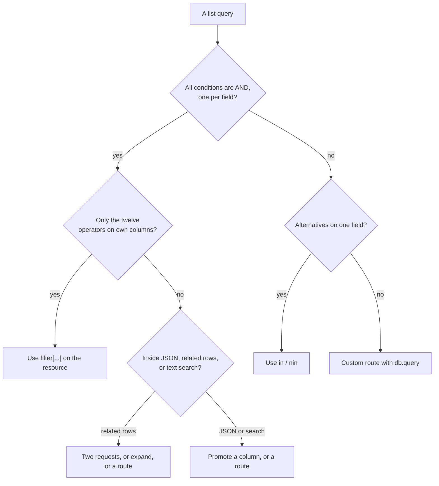

## The mental model: a query string that becomes a `WHERE` clause

A list request, `GET /rest/v1/<resource>`, returns rows. A **filter** is a condition a row must meet to be returned, written in the query string as `filter[<field>]=<operator>.<value>`. Pawabase turns every filter into one condition in the `WHERE` clause of a parameterised SQL query, joins them with `AND`, and runs the query against the environment's database. That is the whole feature, and a large part of knowing how to use it well is knowing what that implies:

| Implication | What it means |
| --- | --- |
| Filters are **conditions on one column each** | There is no filtering on a related row's column, on a computed value or on something inside a JSON field |
| Filters are combined with **AND only** | There is no `OR` between filters and no grouping. A set of alternatives is one `in` filter on one field |
| Each field can be filtered **once** per request | Repeating a field keeps only the last filter, so a range with both ends on the same field cannot be written |
| Values are **converted to the column's type** before they reach SQL | A value that cannot be converted is not reported as a validation error |
| The **policy** adds its own conditions, with `AND` | A caller's filters can only narrow what the policy already allows |
| Filtering happens in the **database** | So it is exact, uses indexes, and `total` reflects it, except where a per-row policy applies |

Everything on this page was run against a Pawabase API on SQLite, with the PostgreSQL and MySQL differences stated where they are known. Where a result is surprising, it is stated as it was observed, with the request that produced it.

<Note>
Sorting and paging are separate parameters, covered on [Sorting and pagination](/data/sorting-pagination). A filter narrows the rows, `sort` orders them, `page` and `per_page` slice them, `select` limits the columns and `expand` attaches related rows. This page is about the first of those, and about how it interacts with the others.
</Note>

## The syntax

```text
GET /rest/v1/products?filter[status]=eq.live&filter[stock]=gte.10&filter[title]=like.mug*
```

Each filter is one query parameter whose **name** is `filter[` followed by a field name and `]`, and whose **value** is an operator, a dot and a value:

| Part | Example | Rule |
| --- | --- | --- |
| The key | `filter[stock]` | `filter[`, a field the resource declares (or its key, a timestamp or its owner field), and `]` |
| The operator | `gte` | One of twelve lowercase names |
| The separator | `.` | The first dot splits the operator from the value |
| The value | `10` | Everything after the first dot, taken literally |

A value with **no recognized operator** before the first dot is read as an equality test on the whole text. `?filter[status]=live` and `?filter[status]=eq.live` mean the same thing. That convenience has one sharp edge. Because only the text before the first dot is treated as an operator, a value that happens to contain a dot is fine (`filter[price]=2.5` is an equality test on `2.5`), and a value that begins with an operator name followed by a dot is taken as that operator. A misspelled operator is not an error: it silently becomes part of the value, which then fails to convert for a number or matches nothing for a text field.

### The twelve operators

| Operator | Meaning | SQL | Value |
| --- | --- | --- | --- |
| `eq` | Equal | `column = value` | One value |
| `neq` | Not equal | `column != value` | One value |
| `gt` | Greater than | `column > value` | One value |
| `gte` | Greater than or equal | `column >= value` | One value |
| `lt` | Less than | `column < value` | One value |
| `lte` | Less than or equal | `column <= value` | One value |
| `like` | Pattern match, case-sensitivity as the database defines it | `column LIKE pattern` | A pattern with wildcards |
| `ilike` | Case-insensitive pattern match | `column ILIKE pattern` on PostgreSQL, `LIKE` elsewhere | A pattern with wildcards |
| `in` | Equal to one of a list | `column IN (…)` | Comma-separated values |
| `nin` | Equal to none of a list | `column NOT IN (…)` | Comma-separated values |
| `is` | Is `null`, `true` or `false` | `IS NULL`, or `= true` / `= false` | `null`, `true` or `false` |
| `isnot` | Is not `null`, `true` or `false` | `IS NOT NULL`, or `!= true` / `!= false` | `null`, `true` or `false` |

Operator names are case-sensitive. `GTE.3` is not the operator `gte`: the whole text `GTE.3` is the value of an equality test, which for an integer field is a conversion failure and a `500`.

### What a request looks like on the wire

The brackets in the key are part of the name, and a client may send them literally or percent-encoded. Both of these were accepted and returned the same rows:

```text
GET /rest/v1/items?filter[qty]=gte.5
GET /rest/v1/items?filter%5Bqty%5D=gte.5
```

Combined with the other list parameters, a request that finds live products with at least ten in stock, newest first, two to a page, returning two columns:

```text
GET /rest/v1/products
    ?filter[status]=eq.live
    &filter[stock]=gte.10
    &sort=-created_at
    &page=2&per_page=2
    &select=title,stock
```

The response is the usual page, with `total` counting the rows that match the filters, not the rows in the table:

```json
{
  "data": [
    {"title": "Item 5", "stock": 12, "id": 5, ...},
    {"title": "Item 4", "stock": 10, "id": 4, ...}
  ],
  "page": 2,
  "per_page": 2,
  "total": 6
}
```

## Operators, one at a time

### `eq` and `neq`: equality

`eq` is the default. It compares the column to the converted value, so it is exact: on SQLite a text comparison is case-sensitive, so `filter[name]=Alpha` found `Alpha` and not `alpha`, while on MySQL the default collations usually make it case-insensitive.

```text
filter[name]=Alpha                 ->  the row whose name is exactly "Alpha"
filter[qty]=3                      ->  qty = 3
filter[price]=2.5                  ->  price = 2.5          (1.50 also matches 1.5, because both convert to 1.5)
filter[note]=eq.                   ->  rows whose note is the empty string
filter[note]=                      ->  the same
```

An empty value on a **text** field is a valid test for the empty string, and it is not the same as `null`: an empty note and an absent note are different rows. On a number or date field an empty value is a conversion failure and a `500`.

`neq` is the negation, with one rule from SQL that surprises people: **a row whose column is `NULL` is not returned by `neq`**. In a resource of seven rows where one `status` was `NULL`, two were `draft` and four `live`:

```text
filter[status]=neq.live    ->  the two drafts. The row with a NULL status is not included
filter[status]=nin.live    ->  the same two
filter[status]=is.null     ->  the one NULL row
```

If "not live" should include rows with no status, a single filter cannot say so, because it would need an `OR`. Give the field a `default` so it is never `NULL`, or fetch with two requests. The same rule applies to `nin`.

### `gt`, `gte`, `lt`, `lte`: comparison

These compare in the column's own order: numerically for numbers, chronologically for dates and, on PostgreSQL and MySQL, timestamps, and alphabetically for text.

```text
filter[qty]=gte.5                         ->  qty >= 5
filter[created_at]=gte.2020-01-01         ->  rows created on or after that day
filter[released]=lt.2026-03-01            ->  a date field, compared as dates
filter[title]=gt.m                        ->  text after "m" in the database's order
```

A comparison with `NULL` is never true, so rows with a `NULL` in the column are never returned by these operators either. Dates and timestamps accept the forms their field type accepts, with one caveat per type that is covered in the type-by-type table below.

<Warning>
**A range on one field cannot be written.** The natural way to ask for "between 2 and 4" is two filters on the same field, and it does not work: a repeated key keeps only the last one.

```text
filter[qty]=gte.2&filter[qty]=lte.4     ->  only qty <= 4 is applied (rows with qty 1, 2, 3, 4)
filter[qty]=gte.2,lte.4                 ->  500: the value "2,lte.4" is not an integer
```

Ranges on **two different fields** are fine (`filter[qty]=gte.2&filter[price]=lte.4` returned the two rows that met both), and a one-sided range on any field is fine. For a two-sided range on a single field, the options are a custom route that builds the query, fetching with one bound and cutting the other client-side, or storing a second copy of the value in another column. See the recipes later on this page.
</Warning>

### `like` and `ilike`: patterns

A pattern is matched against the whole value. Two wildcards work, and they are not the ones SQL uses:

| In the URL | Means | Notes |
| --- | --- | --- |
| `*` | Any run of characters, including none | Converted to `%` before the query. Use this in URLs, since `%` must be percent-encoded as `%25` |
| `%` (sent as `%25`) | Any run of characters | The SQL wildcard, passed through |
| `_` | Exactly one character | Not converted, and not escaped. It is a wildcard |

```text
filter[name]=like.a*         ->  names starting with "a"
filter[name]=like.ap%25      ->  names starting with "ap"        (%25 is a percent sign)
filter[name]=like.%25e       ->  names ending with "e"
filter[name]=like.*pie*      ->  names containing "pie"
filter[note]=like.a_c        ->  "a_c" and "abc": the underscore matched a single character
filter[note]=like.100%25     ->  "100%", but also any note starting with "100"
```

There is **no way to escape** a wildcard. A literal `_` or `%` in the search text will act as a wildcard, so searching for the exact text `a_c` also returns `abc`. That is acceptable for a search box and not for matching an identifier, where `eq` is the right operator.

Case-sensitivity depends on the database. On SQLite `like` was case-insensitive (`like.alpha` matched both `Alpha` and `alpha`), which is how SQLite's `LIKE` behaves by default. On PostgreSQL `like` is case-sensitive and `ilike` is not. On MySQL both follow the column's collation. Pawabase sends `ILIKE` only to PostgreSQL and `LIKE` everywhere else, so `ilike` is the portable choice for a case-insensitive search: it is case-insensitive on every database, either by `ILIKE` or by the case-insensitivity that the others already have.

| Operator | SQLite | PostgreSQL | MySQL |
| --- | --- | --- | --- |
| `like.alpha` | Matches `Alpha` and `alpha` | Matches `alpha` only | Depends on the collation, usually both |
| `ilike.alpha` | Matches both | Matches both | Depends on the collation, usually both |

These operators belong on text columns. On PostgreSQL a `LIKE` on a number or a UUID column is an error, which surfaces as a `500`. SQLite will coerce the number to text, so a filter that works in development can fail in production.

### `in` and `nin`: lists

The value is split on commas, and each piece is converted to the column's type:

```text
filter[id]=in.1,2                 ->  id IN (1, 2)
filter[status]=in.live,draft      ->  either status
filter[qty]=nin.1,2,3             ->  qty not in that list
filter[qty]=in. 1 , 2             ->  works: surrounding spaces are tolerated by the integer conversion
```

Three edge cases fail:

| Request | Result | Why |
| --- | --- | --- |
| `filter[qty]=in.1,2,,3` | `500` | The empty element between the commas is not an integer |
| `filter[qty]=in.` | `500` | An empty list is one empty element |
| `filter[qty]=in.1,x` | `500` | `x` is not an integer |

Because the split is on every comma, **a value that contains a comma cannot be in a list**. A note field holding `a,b` is not found by `in.a,b`, which looks for the two values `a` and `b`. The same text is found by `eq.a,b`, since `eq` takes the rest of the string as one value. For `nin`, as for `neq`, rows with a `NULL` in the column are not returned.

`in` is also how you write an `OR` on a single field. "Live or draft" is `in.live,draft`.

### `is` and `isnot`: null and booleans

These take `null`, `true` or `false`, and they are the only operators that are always right for those three values:

| Request | Meaning |
| --- | --- |
| `filter[released]=is.null` | The column has no value |
| `filter[released]=isnot.null` | The column has a value |
| `filter[active]=is.true` | The boolean column is true |
| `filter[active]=is.false` | The boolean column is false |
| `filter[active]=isnot.true` | Not true: false, and, as in SQL, not `NULL` |

Any other value is a `400`, "is/isnot take null, true or false". The distinction matters most for booleans, because equality on a boolean does not work as it reads:

<Warning>
`filter[active]=false`, `filter[active]=eq.false` and `filter[active]=0` all returned the rows where the field is **true**. A non-empty string is converted to a boolean by its truthiness, and `"false"` and `"0"` are non-empty. Always use `is.true` and `is.false` for booleans. They found the right rows in every run, and `is.null` finds the rows that were never set.
</Warning>

## How values are converted, type by type

A filter value is text, and before it reaches SQL it is converted to the type of the column it is compared with. The conversion is the same one that encodes a value on write, so a filter finds what a write stored. When the conversion fails, the request is a `500`, because the failure happens after the field was accepted and no layer turns it into a `400`.

| Field type | Accepted in a filter | Behavior to know | Fails with `500` when |
| --- | --- | --- | --- |
| `string`, `text`, `email`, `url` | Any text | Compared as text, case as the database defines it | Never, any text converts |
| `integer` | Whole numbers, surrounding spaces tolerated | `filter[qty]=3` is `qty = 3` | `abc`, `1.0`, `1e3`, an empty value |
| `number` | Decimal numbers | `filter[price]=1.50` matches `1.5` | `abc`, an empty value |
| `boolean` | Use `is.true`, `is.false`, `is.null` | `eq.false` returns the **true** rows | Never from `eq`, but it returns the wrong rows |
| `date` | `YYYY-MM-DD` | `gte.2026-03-01` works on every database | A timestamp such as `2026-01-01T00:00:00`, or a non-date |
| `datetime` | ISO 8601 with `Z` or an offset, or a plain date | `gte.2026-03-01` and `gte.2026-03-01T00:00:00Z` both work | A value that is not a timestamp |
| `uuid` | Lowercase, hyphenated | On SQLite, uppercase and hyphen-less forms matched nothing | Never from conversion, but the wrong form finds no rows |
| `json`, `array`, `object`, `ref` | `is.null` and `isnot.null` only | `eq` compares against the JSON-encoded filter text and never matched a stored object | Not applicable |

### Dates and timestamps

A `date` is compared as a date, and a plain date works in a filter on a `datetime` field, where it means the start of that day in UTC:

```text
filter[released]=gte.2026-03-01                    ->  a date field
filter[created_at]=gte.2026-03-01                  ->  a timestamp, from the start of the day
filter[published_at]=gte.2026-03-01T00:00:00Z      ->  the same instant, written out
filter[published_at]=gte.2026-06-01T12:00:00%2B02:00   ->  an offset, with the + sent as %2B
```

The `+` in an offset must be percent-encoded as `%2B`, because an unencoded `+` in a query string is read as a space. The `Z` form avoids the problem.

What a timestamp comparison means depends on the database, and this is where an environment on SQLite and one on PostgreSQL can disagree:

| Database | How `datetime` is stored | What a comparison does |
| --- | --- | --- |
| PostgreSQL | An absolute instant | Chronological, offsets are honored |
| MySQL | UTC, without the zone | Chronological, in UTC |
| SQLite | ISO text, with the offset the writer used | A text comparison, so two instants with different offsets can compare in the wrong order |

Write and filter in UTC and the three agree. A filter value with an offset is converted to the form the column stores, and on SQLite that preserves the offset you typed, so it is compared as text against values that may carry other offsets.

A timestamp value in a filter on a **date** field is the one conversion that does not forgive: `filter[released]=eq.2026-01-01T00:00:00` returned a `500`. Filter a date with a date.

### Booleans, once more

The conversion of a boolean filter is the single most surprising one in this feature, so it earns a table of its own. Rows: one with `active` true, one false, one never set.

| Request | Rows returned |
| --- | --- |
| `filter[active]=true` | The true row |
| `filter[active]=false` | The **true** row |
| `filter[active]=eq.false` | The **true** row |
| `filter[active]=0` | The **true** row |
| `filter[active]=1` | The true row |
| `filter[active]=is.true` | The true row |
| `filter[active]=is.false` | The false row |
| `filter[active]=is.null` | The never-set row |

Only the `is` forms distinguish true from false. If you generate filters from a typed client, make the boolean branch of the generator emit `is.true` and `is.false`, and never `eq`.

### UUIDs

A UUID is stored lowercase and hyphenated, and on SQLite a filter value is compared to that text as written. In testing, the lowercase hyphenated form matched, and the uppercase and hyphen-less forms of the same UUID matched nothing. PostgreSQL stores a real UUID and compares by value, so it would match all three. Normalize UUIDs to lowercase with hyphens in the client, which also makes development and production agree.

### JSON columns

The structured types are one column of serialized text. `is.null` and `isnot.null` work on them, and nothing inside them can be filtered. An equality filter was tried against a row holding exactly the object in the filter, and it matched nothing, because the filter value is encoded as a JSON string and the stored value is a JSON object. See [Field types](/data/field-types) for how to make a nested value queryable.

## Combining filters

### Everything is `AND`

Every filter in the request, plus any the policy adds, must hold for a row to be returned. Five filters on five fields:

```text
filter[qty]=gte.1 & filter[price]=gte.1 & filter[name]=like.a* & filter[status]=eq.live & filter[owner_id]=1
  ->  the three rows that met all five
```

### Alternatives on one field: `in`

There is no `OR` operator and no way to group. The one case that is easy is several acceptable values for a single field, which `in` expresses:

```text
filter[status]=in.live,draft
```

An `OR` across different fields (status is live, or the owner is me) cannot be written as filters. It can be written as a policy (see below), as a custom route that builds the query, or as two requests whose results the client merges.

### Not: `neq` and `nin`

Negation is by operator, and it excludes `NULL` rows, as described. "Anything except these, including unset" needs two requests, or a field that is never `NULL`.

### The same field twice

When a key is repeated, **the last one wins**, and the earlier ones are dropped without an error. That is why a two-sided range on one field does not work. It also means that a client that assembles filters from several sources can silently lose one, so build the set of filters as a map keyed by field before generating the URL, and decide on purpose which one survives.

### Working around the missing range

Four patterns give a two-sided range. They trade convenience for different costs.

| Pattern | How | Cost |
| --- | --- | --- |
| Fetch with one bound, cut client-side | `filter[qty]=gte.2`, then drop rows above 4 | Transfers rows you throw away, and breaks `total` and pagination |
| A second column | Store the same value in another field (`qty_copy`) and filter `gte` on one and `lte` on the other | You keep two columns in step in the code that writes them |
| A custom route | A route and flow that build the query with both bounds | A flow, and its own paging, see [Custom routes](/data/custom-routes) |
| A bucket field | Precompute a coarse bucket (`price_band`) and filter it with `eq` or `in` | A migration and a rule for filling the field |

For dates, the common case is "this month". With a stored `month` text field (`2026-03`) it is one equality filter. For "the last seven days" a one-sided `gte` is enough, since nothing in the future needs excluding. The two-sided case is the rare one, and it is usually a report, which belongs in the **Database** console or in a flow, see [Database console](/data/database-console).

## Writing filters into a URL

A query string has its own rules, and four characters in filter values cause nearly all of the trouble.

| Character | Problem | In a value, write |
| --- | --- | --- |
| `+` | Read as a space | `%2B` |
| `%` | Starts a percent-escape | `%25` |
| `&` | Ends the parameter | `%26` |
| `#` | Starts a fragment, and the rest is dropped | `%23` |
| `,` | Splits the list in `in` and `nin` | Not escapable. Do not put commas in list values |
| `*` | Is a wildcard in `like` | Not escapable. It acts as a wildcard |
| `_` | Is a wildcard in `like` | Not escapable. It acts as a wildcard |
| space | Fine encoded as `%20`, tolerated by integer conversion | `%20` |

The brackets of the key are the one thing that may be left as typed or encoded, and an encoder that percent-encodes them (`%5B` and `%5D`) produces a request the API accepts.

### A helper that gets it right

A builder that holds filters as a map, rejects the operators that do not exist, writes booleans with `is`, and encodes values:

```typescript
type Op = "eq" | "neq" | "gt" | "gte" | "lt" | "lte" | "like" | "ilike" | "in" | "nin" | "is" | "isnot";

export function buildFilters(filters: Record<string, [Op, unknown] | unknown>): string {
  const parts: string[] = [];
  for (const [field, spec] of Object.entries(filters)) {
    let [op, value]: [Op, unknown] = Array.isArray(spec) ? (spec as [Op, unknown]) : ["eq", spec];

    // Booleans must use `is`: `eq.false` returns the true rows.
    if (typeof value === "boolean") {
      op = op === "neq" ? "isnot" : "is";
      value = String(value);
    }
    if (value === null) {
      op = op === "neq" || op === "isnot" ? "isnot" : "is";
      value = "null";
    }
    if (Array.isArray(value)) {
      if (value.some((v) => String(v).includes(","))) throw new Error(`a value in ${field} contains a comma`);
      value = value.join(",");
    }
    if (value instanceof Date) value = value.toISOString();   // UTC, with Z

    parts.push(`filter[${field}]=${encodeURIComponent(`${op}.${value}`)}`);
  }
  return parts.join("&");
}

// buildFilters({ status: ["in", ["live", "draft"]], active: true, qty: ["gte", 10] })
//   -> "filter[status]=in.live%2Cdraft&filter[active]=is.true&filter[qty]=gte.10"
```

Because it takes a map, a field can appear only once, which matches what the server does and removes the silent last-wins surprise. The `encodeURIComponent` of the whole `op.value` text encodes the dot too (it leaves `.` alone, which is correct) and encodes the comma of a list as `%2C`, which the server decodes before splitting. A Python equivalent:

```python
from urllib.parse import quote

OPS = {"eq", "neq", "gt", "gte", "lt", "lte", "like", "ilike", "in", "nin", "is", "isnot"}

def build_filters(filters: dict) -> str:
    parts = []
    for field, spec in filters.items():
        op, value = spec if isinstance(spec, tuple) else ("eq", spec)
        if op not in OPS:
            raise ValueError(f"unknown operator {op!r}")
        if isinstance(value, bool):
            op, value = ("isnot" if op == "neq" else "is"), str(value).lower()
        elif value is None:
            op, value = ("isnot" if op in ("neq", "isnot") else "is"), "null"
        elif isinstance(value, (list, tuple)):
            if any("," in str(v) for v in value):
                raise ValueError(f"a value in {field} contains a comma")
            value = ",".join(str(v) for v in value)
        elif hasattr(value, "isoformat"):
            value = value.isoformat().replace("+00:00", "Z")
        parts.append(f"filter[{field}]={quote(f'{op}.{value}', safe='.')}")
    return "&".join(parts)
```

Both builders validate what the server does not: an operator that is misspelled (which the server would silently read as part of the value) and a comma in a list value (which the server would silently split). They cannot check that a number is a number, since they do not know the field's type. Validate numeric and date inputs before they reach the builder, because the server will turn a bad one into a `500`.

## Filters and policies

A list operation has a policy, and the policy and the caller's filters are applied together. How they combine depends on what the policy asks, and there are three cases.

### A policy that depends only on the caller

`authenticated`, a role check or `service` is decided from the token before any row is read. If it passes, the caller's filters are applied as written. If it fails, the request is refused before the query runs.

### A policy that compares a record field to a known value

`owner` is the common one, and conditions such as `{"eq": ["$record.status", "live"]}` have the same form. Pawabase turns these into **equality filters of its own** and adds them to the query. Two consequences follow, both observed with a list policy of `owner`:

| Caller request | Result |
| --- | --- |
| No filters, signed in as user 1 | Only user 1's rows, with a correct `total` |
| `filter[owner_id]=2` | Zero rows: the policy's `owner_id = 1` and the caller's `owner_id = 2` are both applied |
| `filter[owner_id]=1` | The same rows as with no filter |
| `filter[status]=eq.live` | The caller's live rows only |

A caller cannot widen what a policy allows. The two conditions are `AND`ed, and a filter that contradicts the policy returns nothing and says nothing. Because the work is done in SQL, `total` and paging are correct.

### A policy that needs the row: the residual

A condition that cannot be reduced to an equality (a comparison such as `gt`, an `any` of two different tests) is evaluated against each row after the query. The database cannot apply it, so Pawabase reads a page of rows and discards the ones the policy refuses. That has three effects, each reproduced with a policy `{"gt": ["$record.qty", 2]}` on a resource of seven rows:

```text
GET /rest/v1/bigs                        ->  200  total: null,  rows b3 b4 b5 b6 b7
GET /rest/v1/bigs?per_page=2&page=1      ->  200  total: null,  data: []              (rows 1 and 2 were refused; nothing was left)
GET /rest/v1/bigs?per_page=2&page=2      ->  200  total: null,  rows b3 b4
```

| Effect | Consequence |
| --- | --- |
| `total` is `null` | A per-row policy makes the database count unreliable, so none is reported |
| A page can come back **empty or short** while more rows exist | The page was filled before the policy ran, and some of its rows were removed |
| Paging by "stop at an empty page" stops too early | See [Sorting and pagination](/data/sorting-pagination) |

The same applies to the caller's own filters: they narrow the rows read, and the policy then removes more of them.

<Warning>
**`select` can empty a residual list.** A per-row policy reads the columns of each row, and the row it sees is the row with only the **selected** columns. A request that selects a column list that leaves out what the policy needs sees the policy refuse every row:

```text
GET /rest/v1/bigs?select=title            ->  200  data: []               (the policy needs qty, which was not selected)
GET /rest/v1/bigs?select=title,qty        ->  200  rows b3 b4 b5 b6 b7
GET /rest/v1/mixed?select=title           ->  200  data: []               (the policy reads status and owner_id)
GET /rest/v1/mixed                        ->  200  rows
```

There is no error. If a resource has a policy that reads record fields and the list is empty only when `select` is used, include those fields in `select`, or drop `select`. The fields to include are the ones the policy's conditions name after `$record.`.
</Warning>

### Service credentials

A request made with a secret key bypasses policies, so only the caller's filters apply. A server-side job that lists a resource with a secret key and `filter[owner_id]=2` sees all of user 2's rows, whatever the list policy would have allowed a user.

## How filters meet `select`, `sort`, `expand` and paging

A list request is evaluated in a fixed order, and knowing it explains what each parameter can see.

| Stage | What happens | Sees |
| --- | --- | --- |
| 1. Filters | The caller's filters and the policy's equality filters become the `WHERE` clause | The table's columns |
| 2. Sort | `ORDER BY` the requested fields, or the key if none | The filtered rows |
| 3. Page | `LIMIT` and `OFFSET` from `per_page` and `page` | The sorted rows |
| 4. Count | A second query counts the rows that match the filters | The same `WHERE` |
| 5. Residual policy | A per-row policy removes rows from the page, and `total` becomes `null` | The page's rows, with the selected columns only |
| 6. Expand | Related rows are attached to what is left | The surviving rows |
| 7. Transformer | The response is reshaped | The final rows |

Three practical results follow from the table.

**A filter narrows before the page is cut.** `total` is the number of rows that match the filters, so a "showing 11 to 20 of 51" label is `total` from a filtered request. Counting a filter without fetching rows is a request with `per_page=1`, which was run:

```text
GET /rest/v1/things?filter[qty]=gte.150&per_page=1   ->  total: 51,  data: [one row]
GET /rest/v1/things?filter[qty]=lt.0&per_page=1      ->  total: 0,   data: []
```

**`select` limits the columns that are read.** The filter conditions can still name columns that are not selected, because the filter runs in the database. The one exception is the residual policy, which only sees the selected columns, as shown above. Unselected declared fields come back as `null`, and the key is always included.

**`expand` cannot be used to filter.** Related rows are attached after the filtering and paging, so a filter cannot refer to a column of a related resource, and an expansion never changes which parent rows are returned. To find the posts that have a comment containing a word, find the comments first, then fetch the posts by `in` of their ids.

### Two queries per list

Each list request runs a query for the page and a second query that counts the matching rows with the same filters (the count is skipped only when a per-row policy makes it unreliable). On a large table the count can cost as much as the page, so a client that does not need `total` pays for it anyway. The cost of both is governed by whether the filter can use an index, the next section.

## Filters and indexes

Whether a filter is fast depends on the database's plan for it, and the plan is the database's to choose. These are plans observed on SQLite for a table of 200 rows with `name` and `qty` marked `indexed` and `note` not, using `EXPLAIN QUERY PLAN` in the **Database** console, which allows it as a read-only statement.

| Query | Plan |
| --- | --- |
| `WHERE name = 'item010' ORDER BY id LIMIT 20` | **Search** using the index on `name` |
| `WHERE qty >= 190 ORDER BY id LIMIT 20` | **Scan** of the table in key order |
| `WHERE name LIKE 'item01%' ORDER BY id LIMIT 20` | **Scan** |
| `WHERE name LIKE '%010' ORDER BY id LIMIT 20` | **Scan** |
| `WHERE note = 'n5' ORDER BY id LIMIT 20` | **Scan** (`note` has no index) |
| `SELECT COUNT(*) WHERE qty >= 190` | **Search** using a covering index on `qty` |

Reading it:

- **Equality on an indexed column is a lookup.** This is the case an index is for, and it is what `filter[sku]=A-1` should be.
- **A range filter combined with the default order may still scan.** With no `sort`, results are ordered by the key, and the planner here preferred walking the key in order and stopping at the limit over using the index on `qty`. When the sort is on the filtered column (`sort=qty`), an index on it can serve both. The count query, which has no order, did use the index.
- **A pattern with a leading wildcard cannot use an index**, and in this run neither could the prefix form, since SQLite's `LIKE` optimization needs a particular collation setting. Treat `like` as a scan unless you have checked the plan on your own database.
- **An unindexed column is a scan.** For a small table that is fine. For a table of millions, a filter on an unindexed column is a slow request.

PostgreSQL and MySQL make different choices, and an index that SQLite ignored may be used by them. The way to know is to run `EXPLAIN` on the same statement in the console against the environment's own database. The statement for a filtered list is the one shown above, with the parameters filled in.

| Practice | Why |
| --- | --- |
| Mark `indexed` on fields clients filter by with `eq`, `in` or ranges | The index is created by **Create / migrate table**, see [Migrations](/data/migrations) |
| Mark `unique` for natural keys | A unique field is indexed, and gives you lookup by `eq` |
| Index the **Owner field** | Pawabase does this for you, so `owner` policies are lookups |
| Sort by the filtered column when you filter a range | The index can serve both |
| Prefer `eq` and `in` over `like` for identifiers | They can use an index, and `like` on `_` and `%` is also inexact |
| Avoid `like` with a leading wildcard on large tables | A full scan, whatever the indexes are |
| Do not filter on JSON columns | There is nothing to filter on, and no index to use |

For a real search feature (words, relevance, typos) a `like` is the wrong tool on any database, and there is no full-text operator. Use the database's full-text search from a route or a flow, or an external search service, and keep ids in Pawabase.

## Where to try filters in Studio

Filtering is a property of the data API, and Studio gives you fewer places to try it than you might expect.

| Place | Can you filter there | What it offers |
| --- | --- | --- |
| **API Explorer** | **No.** `filter[...]` is not a declared parameter, so the **Query parameters** card lists only `page`, `per_page`, `sort`, `select` and `expand` | Everything but filters. To test a filter, use a client |
| **Resources**, then a resource, **Records** tab | No. It lists the first twenty records with **Refresh** | Browsing and editing |
| **Database**, then a table | No filter box. It pages through rows fifty at a time with **Prev** and **Next** | Browsing |
| **Database**, **SQL**, the query builder | Yes, as SQL | The builder's **Where** rows, covered below |
| **Observability** | Search by request path and status, not by data | Finding the requests that carried a filter |

Because the Explorer cannot send filters, the quickest way to try one is a command-line request with your project key:

```bash
curl -s "$GATEWAY/rest/v1/products?filter[status]=eq.live&filter[stock]=gte.10&select=title,stock" \
  -H "apikey: $PUBLISHABLE_KEY"
```

### The query builder's `Where` rows

The **SQL** button on **Database** opens a modal with a query builder, whose **Where** section is the nearest thing Studio has to a filter editor. Its rows are `column`, `operator`, `value`, with a choice of **AND** or **OR** between rows after the first, and its operators are `=`, `!=`, `>`, `>=`, `<`, `<=`, `LIKE`, `NOT LIKE`, `IN`, `IS NULL` and `IS NOT NULL`. Each click rewrites the SQL below it. The builder can express an `OR`, which the data API cannot, because it produces SQL and does not go through the filter parser.

| Data API filter | Builder row | SQL |
| --- | --- | --- |
| `filter[status]=eq.live` | `status` `=` `live` | `WHERE "status" = 'live'` |
| `filter[qty]=gte.10` | `qty` `>=` `10` | `WHERE "qty" >= 10` |
| `filter[name]=like.a*` | `name` `LIKE` `a%` | `WHERE "name" LIKE 'a%'` |
| `filter[id]=in.1,2` | `id` `IN` `1, 2` | `WHERE "id" IN (1, 2)` |
| `filter[released]=is.null` | `released` `IS NULL` | `WHERE "released" IS NULL` |
| not expressible | add a second row joined with **OR** | `WHERE "status" = 'live' OR "owner_id" = '1'` |

Use the builder to look at the data a filter would match, to compare counts, and to check a plan with `EXPLAIN`. It queries the table directly, so it ignores the resource's policy, the field definitions and the cache. A result in the builder tells you what the table holds, and a result from the API tells you what a caller sees. See [Database console](/data/database-console).

## What goes wrong, as the API reports it

| Request | Status and body | Cause |
| --- | --- | --- |
| `?filter[nope]=1` | `400` `{"error": "bad_request", "message": "cannot filter on unknown field 'nope'"}` | The field is not declared, and is not the key, a timestamp or the owner field |
| `?filter[status]=is.maybe` | `400`, "is/isnot take null, true or false" | An operand other than the three allowed |
| `?filter[qty]=gte.abc` | `500` plain text | The value cannot be converted to an integer |
| `?filter[qty]=1.0` | `500` | The same, for a whole number written with a fraction |
| `?filter[qty]=in.1,2,,3` | `500` | An empty element in a list |
| `?filter[qty]=GTE.3` | `500` | A misspelled operator, so the value is `GTE.3` |
| `?filter[released]=eq.2026-01-01T00:00:00` | `500` | A timestamp in a date filter |
| `?filter[status]=in.a,b` on a status that contains commas | `200`, no rows | The list splits on commas |
| `?filter[qty]=gte.2&filter[qty]=lte.4` | `200`, only the last applied | A repeated key |
| `?filter[active]=false` | `200`, the **true** rows | A boolean filtered with `eq` |
| `?filter[meta]={"k":1}` | `200`, no rows | A JSON column never matches an equality filter |
| `?select=title` on a resource with a residual policy | `200`, no rows | The policy cannot see the columns it needs |

The first two rows are the only ones that return a `400` with a message. The rest are either a `500` that is really a bad input, or a `200` that is really a wrong answer. A client that checks only for errors misses the second group, which is why the helper functions earlier on this page exist, and why the regression list at the end of the page is worth running.

<Info>
A request that fails with a `500` here leaves a row in **Observability** with the status `500` and the policy that passed (`policy: …` in the request's **notes**), and no error text. Searching the path and filtering on **5xx server error** finds them, and the **Request trace** shows when they started, which is usually enough to tie a burst of them to a deploy of a client that builds filters.
</Info>

## Recipes

Each of these uses only what the filter syntax supports, and the results were checked against a running API.

### A search box

Match a term anywhere in a name, case-insensitively, and show a count:

```text
GET /rest/v1/products?filter[title]=ilike.*mug*&sort=title&per_page=20&select=id,title
```

A search over more than one field (title or description) needs an `OR`, which the filter syntax lacks. Two requests, merged by id in the client, or a route that runs one query. For a table that will grow, replace this with the database's full-text search, as above.

### Status tabs with counts

A tab strip of **All**, **Live**, **Draft** needs a count for each. One request per tab with `per_page=1` returns only `total`:

```text
GET /rest/v1/orders?per_page=1                         ->  total: 214
GET /rest/v1/orders?filter[status]=eq.live&per_page=1  ->  total: 160
GET /rest/v1/orders?filter[status]=eq.draft&per_page=1 ->  total: 54
```

Three small requests are cheaper than one that downloads the rows and counts them. If the field can be `NULL`, the counts for the values do not add up to the whole, since an unset status is in none of the values.

### "My" records, and records for a user

When the list policy is `owner`, the caller already sees only their own rows, and no filter is needed. When a staff caller with a different policy needs one user's rows, filter by the owner field:

```text
GET /rest/v1/tickets?filter[requester_id]=eq.u-1
```

A caller whose policy is `owner` who asks for someone else's rows gets zero rows and no error, as shown earlier. If a UI shows "no results" for that, it is correct, and it is also the signal that the caller does not have access.

### Keyset pagination: next page by key

Offset paging gets slower and less stable as the page number grows. Because the key is filterable and sortable, "the next page" can be "rows after the last one I saw":

```text
GET /rest/v1/things?sort=id&per_page=3                    ->  ids 1, 2, 3     total 200
GET /rest/v1/things?sort=id&per_page=3&filter[id]=gt.3    ->  ids 4, 5, 6     total 197
GET /rest/v1/things?sort=id&per_page=3&filter[id]=gt.6    ->  ids 7, 8, 9     total 194
GET /rest/v1/things?sort=-id&per_page=3&filter[id]=lt.198 ->  ids 197, 196, 195
```

`total` in these responses counts the rows remaining after the key, not the whole table, which is the right meaning for "how many more". The same works for a timestamp key (`filter[created_at]=lt.<last seen>&sort=-created_at`), with the caution that two rows can share a timestamp, which makes the key unstable for ties. The primary key is unique, so it is the safe choice, and it applies to both integer and UUID keys (UUIDs sort as text, which is stable though not chronological).

### New rows since the last poll

A client that polls for changes keeps the highest key it has seen and asks for what is greater:

```text
GET /rest/v1/messages?filter[id]=gt.1042&sort=id&per_page=100
```

This only finds **new** rows. A row that was updated after the client saw it keeps its key, so it is not returned again. For updates, filter on the timestamp (`filter[updated_at]=gt.<last poll>`), and for deletes there is nothing to find, since a deleted row is gone. If you need to react to all three, subscribe to the resource's events or realtime channel instead of polling, see [Resource events](/data/resource-events).

### Exporting everything

A complete export walks the table in key order by keyset, which does not skip or repeat rows when others are being written, as an offset walk can:

```python
import httpx

def export(base, key, resource, page_size=200):
    last = None
    while True:
        params = {"sort": "id", "per_page": page_size}
        if last is not None:
            params["filter[id]"] = f"gt.{last}"
        r = httpx.get(f"{base}/rest/v1/{resource}", params=params, headers={"apikey": key})
        r.raise_for_status()
        rows = r.json()["data"]
        if not rows:
            return
        yield from rows
        last = rows[-1]["id"]
```

Stop on an empty `data`, which is correct here because the filter is on the key and there is no per-row policy. With a per-row policy, an empty page does not mean the end, see [Sorting and pagination](/data/sorting-pagination). Use a secret key from a server for a full export, since a publishable key sees only what its policy allows.

### A date window

Today's new records, the one range that needs one bound only:

```text
GET /rest/v1/orders?filter[created_at]=gte.2026-10-01&sort=-created_at
```

A window with both ends is the two-sided case that cannot be written, and the practical answers are a stored month or day field, a second query bounded by a key rather than a time (find the first key after the start, then use `gt` on that key), or a route. The second is a fair general method: **time ranges are easy to express as key ranges when keys are assigned in time order**, as auto-increment keys are.

## How the filter text is parsed, exactly

The parsing rules are small, and a table of edge cases shows all of them. The resource has an integer `qty`, a number `price` and a text `name`, with rows whose names include `eq.x`, `x`, `.dot` and `a.b`.

| Request | Read as | Result |
| --- | --- | --- |
| `filter[name]=x` | `eq`, value `x` | The row named `x` |
| `filter[name]=eq.x` | `eq`, value `x` | The same |
| `filter[name]=eq.eq.x` | `eq`, value `eq.x` | The row named `eq.x`: only the first dot splits |
| `filter[name]=a.b` | `a` is not an operator, so the whole text is the value | The row named `a.b` |
| `filter[name]=eq.a.b` | `eq`, value `a.b` | The same row |
| `filter[name]=.dot` | An empty operator is not an operator, so the value is `.dot` | The row named `.dot` |
| `filter[name]=eq..dot` | `eq`, value `.dot` | The same row |
| `filter[price]=.5` | The value `.5` | A number field converts it to `0.5` |
| `filter[name]=like.*.*` | `like`, pattern `*.*` | Names containing a dot |
| `filter[name]=in.eq.x,x` | `in`, values `eq.x` and `x` | Both rows |
| `filter[qty]=gt.-1` | `gt`, value `-1` | Every row: negative numbers work |
| `filter[qty]=-1` | `eq`, value `-1` | No rows |
| `filter[qty]=+3` | A `+` becomes a space, the value is ` 3` | Works for an integer, which tolerates the space |
| `filter[qty]=%2B3` | `+3` | Also works: an integer accepts a leading `+` |

The rules, stated: the key must be `filter[` followed by a field name and `]`, and the value is split at its **first** dot. If the text before the dot is one of the twelve lowercase operator names, it is the operator and the rest is the value. Otherwise there is no operator, and the entire text is the value of an equality test. Nothing else is interpreted, which is why a value can contain dots, brackets and operator names freely, as long as it does not begin with an operator and a dot.

A `+` is the odd case. It is a space in a query string, which an integer conversion forgives and a text value does not, so `filter[name]=a+b` searches for `a b`. Encode `+` as `%2B` in every value.

## Finding parents by what their children contain

The data API filters a resource by its own columns. A question about a related table, such as "which live posts have a comment containing `urgent`", is two requests, and the second filters by `in` on the keys the first returned. With `posts` and `comments` related by `post_id`:

```text
GET /rest/v1/comments?filter[text]=ilike.*urgent*&select=post_id&per_page=200
  ->  total 3:  post_id 1, 3, 3

GET /rest/v1/posts?filter[id]=in.1,3&filter[status]=eq.live&select=title
  ->  total 2:  "A", "C"
```

The first request returns a parent key per matching child, so a parent with two matches appears twice (post 3 above). De-duplicate the keys before the second request. The pattern has three limits:

| Limit | Consequence |
| --- | --- |
| `per_page` is at most 200 | More than 200 matching children need paging through the first request before the second can run |
| The second URL carries every key | Many keys can make a URL too long, see above. Chunk the keys |
| Both reads are separate snapshots | A row can change between them. For a report, tolerate it. For anything stricter, use a route with a join |

The reverse direction, loading the children of a known set of parents, is what `?expand=` does in a single request, with its own cap on the number of children, see [Relations](/data/relations).

## Filters inside flows and functions

A flow reads a resource with the `resource.list` block, and its filters are a smaller language than the query string's. They are a map of field to value, and every entry is an **equality**:

```json
{"block": "resource.list",
 "config": {"resource": "posts", "filters": {"status": "live"}, "sort": "-id", "limit": 2}}
```

```json
GET /rest/v1/live-posts

{"data": [{"id": 4, "title": "D", "status": "live", ...}, {"id": 3, "title": "C", "status": "live", ...}],
 "total": 3, "limit": 2, "offset": 0}
```

The block's output has `data`, `total`, `limit` and `offset`, and it is not subject to the resource's policy, because a flow is trusted. The block has no operators and no `in`. For anything but equality, use the `db.query` block with SQL and parameters, as in the range route above, or filter the list in a later `transform.filter` block, which keeps the items that match a policy-style condition. A function does the same through the runtime's `resource_list`, which takes the same equality map. Neither path accepts the `filter[...]` strings that a client sends.

## What is and is not logged

**Observability** records each request with its method, path, status, caller and the notes added along the way. The **path** is recorded **without the query string**. A request to `/rest/v1/items?filter[qty]=gte.abc&sort=id&per_page=5` that returned `500` appears as a row for `/rest/v1/items`, and a search for `filter` in the **Search path** box finds nothing.

| Consequence | What to do |
| --- | --- |
| You cannot find, from Studio, which filter caused a `500` | Reproduce it from the client's own logs, or log the query string in the client |
| You cannot see which filters are used most | Count them in a client or a proxy that records the full URL |
| The **Request trace** cannot show the filters | Use its time and caller to find the client that sent it |

If filters matter to your operations, record them where they are built, not where they are served.

## Documenting filters for your API's readers

The generated API reference lists the query parameters of the list operation as `page`, `per_page`, `sort`, `select` and `expand`, and nothing about `filter[...]`, because filter keys vary by resource and are not declared. A developer who reads only the reference will not learn that filtering exists, or which fields can be filtered and how. The resource's **Description** is the one free-text place that appears in the reference for the list operation, so it is the natural home for a short note:

```json
{
  "name": "products",
  "description": "Items we sell. Filter with filter[field]=op.value: status (eq, in), stock (gte, lte), title (ilike), released (gte, lte, is.null). One filter per field. Use is.true/is.false for booleans.",
  "fields": [ ... ]
}
```

That sentence appears under the **List products** operation in **API Explorer** and on the public docs page, and it costs nothing to keep in step with the definition. Three habits make it useful: name the fields that are indexed (the ones that are safe to filter on at scale), state the one-filter-per-field rule, and say how to filter booleans, since that is the case people get wrong. Anything more detailed belongs in your own client documentation, with the helper functions from this page.

## A gallery of queries

Real shapes you can start from, each using only what the syntax supports. Replace the resource and field names with your own.

| Goal | Query |
| --- | --- |
| Live products | `filter[status]=live` |
| Live or draft | `filter[status]=in.live,draft` |
| Everything but archived, including unset | Not expressible with one filter. Give `status` a default so it is never null, then `filter[status]=neq.archived` |
| In stock | `filter[stock]=gt.0` |
| Low stock | `filter[stock]=lte.5&filter[stock_alert]=is.true` |
| Name starts with a prefix | `filter[title]=ilike.mug*` |
| Name contains a word | `filter[title]=ilike.*mug*` |
| Created today or later | `filter[created_at]=gte.2026-10-01` |
| Never updated since creation | Not expressible. A column to column comparison does not exist |
| Has no owner | `filter[owner_id]=is.null` |
| Has an owner | `filter[owner_id]=isnot.null` |
| A set of ids | `filter[id]=in.4,8,15` |
| Everything except some ids | `filter[id]=nin.4,8,15` |
| Records of one parent | `filter[post_id]=eq.7` |
| An empty text value | `filter[note]=eq.` |
| Published and flagged | `filter[published]=is.true&filter[flagged]=is.true` |
| Price at least ten | `filter[price]=gte.10` |
| Price between ten and twenty | One bound per request, or a route |
| Newest first, page two, two columns | `sort=-created_at&page=2&per_page=20&select=id,title` |
| After the last key I saw | `filter[id]=gt.1042&sort=id&per_page=100` |
| How many match, without rows | Add `per_page=1` and read `total` |

## Choosing a tool for a query

Most list needs fit the filter syntax. When one does not, the question is which tool fits and what it costs.



The diagram's right-hand edges all end in a route or in a change to the data, and that is the shape of the feature. The filter syntax is for the common, indexable, per-column query. Everything past it moves either to SQL, in a route, or to a better data model.

## Text matching beyond ASCII

Case-insensitive matching is where databases differ most, and it matters for any product with users whose names are not plain English. On SQLite, which Pawabase uses by default for development, `like` and `ilike` fold case only for the 26 ASCII letters. For a resource with these names:

| Stored | Request | Matches |
| --- | --- | --- |
| `Ada`, `ada` | `filter[name]=ilike.ada` | Both: ASCII letters fold |
| `Émile`, `émile` | `filter[name]=ilike.émile` | Only `émile`: the accented capital `É` is not folded |
| `Émile`, `émile` | `filter[name]=ilike.%C3%89mile` | Only `Émile` |
| `Ọlá`, `ọlá` | `filter[name]=ilike.ọlá` | Only `ọlá` |
| `Zoë`, `ZOË` | `filter[name]=ilike.zoë` | Only `Zoë`: `Z` folds, `Ë` does not |
| `Zoë` | `filter[name]=eq.zoë` | Nothing, `eq` is case-sensitive |

A search box that must find `Émile` when someone types `emile` or `ÉMILE` cannot rely on `ilike` on SQLite. PostgreSQL's `ILIKE` and MySQL's collations fold accented letters according to the database's locale and collation, which usually gives the expected result and is not the same as SQLite's, so a behavior seen in development may not hold in production, or the reverse. Three ways to be independent of the database:

| Approach | How | Cost |
| --- | --- | --- |
| A normalized column | Store a lowercased, accent-stripped copy (`name_search`) and filter on it with a lowercased, stripped term | A second field you fill in a route or flow, kept in step with the original |
| Search in a route | Use the database's own full-text or collation features in SQL | A route per search, and database-specific SQL |
| An external search service | Index names there, keep ids in Pawabase, and fetch rows with `in` | A second system |

Also keep in mind that the same word can be stored in two Unicode forms, for example `é` as one character and as `e` plus a combining accent, and neither a filter nor an index treats them as equal. Normalize text to one form on the way in.

## Values and field names are never executed

Filter values are bound as parameters, and a field name is checked against the resource's declared fields before it can reach a query, so a filter cannot be used to inject SQL. These attempts were all harmless:

```text
filter[name]=x' OR '1'='1                       ->  200, no rows: the quote is part of the text being compared
filter[name]='; DROP TABLE people; --           ->  200, no rows: the same
filter[name]=in.',                              ->  200, no rows
filter[name" OR "1"="1]=1                       ->  400  {"error": "bad_request", "message": "cannot filter on unknown field 'name\" OR \"1\"=\"1'"}
```

The table was intact afterwards. The same holds for `sort` and `select`, which take field names and are checked in the same way. Two small notes. The `400` echoes the field name that was sent, so a client that renders error messages as HTML should escape it. And the protection belongs to the resource endpoints: the `db.query` block and the **Database** console run the SQL they are given, so values must be bound as parameters there, see the range route above.

## Filters and the cache

When a resource has a cache time set, a list response is cached under a key that includes the caller and the query string, so each distinct request is cached separately. The key is built from the query parameters **sorted by name**, which has a practical effect that was observed:

```text
GET /rest/v1/people?filter[qty]=gte.5               ->  cache miss
GET /rest/v1/people?filter[qty]=gte.5               ->  cache hit
GET /rest/v1/people?filter[qty]=gte.6               ->  cache miss
GET /rest/v1/people?filter[qty]=gte.5&sort=id       ->  cache miss
GET /rest/v1/people?sort=id&filter[qty]=gte.5       ->  cache hit  (the same parameters in another order)
```

Parameter order does not matter, and the value of each does, so a client that builds the same filter set the same way every time gets hits. A client with free-text input produces a new key for every keystroke, each of which is a miss and a stored entry that lives until its time expires or a write clears them all. That is harmless at small scale and wasteful at large scale, so debounce search boxes, and consider whether a search endpoint should be cached at all. Every write to the resource, from any source that goes through Pawabase, clears every cached list for it, whatever filters they had. See [Caching](/data/caching).

## Differences you will meet across databases

The filter syntax is the same everywhere, and the results are not always. This table collects the differences stated on this page.

| Behavior | SQLite | PostgreSQL | MySQL |
| --- | --- | --- | --- |
| `eq` on text | Case-sensitive | Case-sensitive, by collation | Usually case-insensitive |
| `like` | Case-insensitive for ASCII | Case-sensitive | By collation |
| `ilike` | Same as `like` | Case-insensitive, with locale folding | By collation |
| `like` on a number column | Works, the number is read as text | An error, so `500` | Works |
| `datetime` comparison | Text, so offsets can mislead | Chronological | Chronological, in UTC |
| UUID comparison | Text, lowercase hyphenated | Native, form-insensitive | Text |
| Integer filter with a text value that looks numeric | Converted by the application | Converted by the application | Converted by the application |
| `NULL` ordering in `sort` | First on ascending | Last on ascending | First on ascending |
| Unknown column in a filter | `400`, rejected before the query | `400` | `400` |

The last row is the same on all three because the check is made by Pawabase against the definition and not by the database. An older observation worth knowing: on SQLite a filter on a column that exists in the definition but not yet in the table matched nothing and returned `200`, because SQLite reads an unknown quoted name as a string. PostgreSQL and MySQL return an error for the same query, which surfaces as a `500`.

## A review before a filter-driven screen ships

| Question | Why |
| --- | --- |
| Does every number and date control validate before it builds a filter? | A bad value is a `500`, never a friendly message |
| Are booleans sent as `is.true` and `is.false`? | `eq` returns the wrong rows |
| Is each filtered field indexed, or is the table small? | An unindexed filter is a scan |
| Does the screen survive a `null` `total`? | A per-row policy removes it |
| Does it survive an empty page that is not the last? | The same policy |
| Does a search box debounce? | Each keystroke is a cache entry and a query |
| Is a text search acceptable as `ilike` on your database, with your users' alphabets? | ASCII-only folding on SQLite |
| Can a caller learn something they should not by filtering on a hidden field? | Filters read stored columns |
| Is there a range on one field? | It needs a different design |
| Is the filter set in the URL? | Reloads, links and the back button work |

## The SQL that runs

Seeing the statement makes the rules above concrete, and it is the fastest way to explain a surprising result. These are the statements the data layer issued for the requests shown, captured as they were sent to the database, for a resource whose list policy is `owner` and a caller signed in as user `1`. Values are always parameters (`?`), and never part of the SQL text.

```text
GET /rest/v1/products?filter[status]=eq.live&filter[stock]=gte.10&sort=-created_at&page=2&per_page=2&select=title,stock

SELECT "title","stock","id" FROM "products"
  WHERE "status"=? AND "stock">=? AND "owner_id"=?
  ORDER BY "created_at" DESC LIMIT ? OFFSET ?
  params: ['live', 10, '1', 2, 2]

SELECT COUNT(*) "total" FROM "products"
  WHERE "status"=? AND "stock">=? AND "owner_id"=?
  params: ['live', 10, '1']
```

Reading it from the top: the caller's two filters come first, in the order they were sent, and the policy's own condition `"owner_id"=?` is added last, joined with `AND`. The key (`"id"`) was added to the selected columns without being asked for. The sort became `ORDER BY ... DESC`, and the page became `LIMIT 2 OFFSET 2`, from `page=2` and `per_page=2`. A second statement counts the rows with the same `WHERE`, and that count is the response's `total`.

Other operators produce these conditions:

| Request | Condition | Parameters |
| --- | --- | --- |
| `filter[title]=ilike.*mug*` | `"title" LIKE ?` | `'%mug%'` (the `*` became `%`, and `ILIKE` was not used on SQLite) |
| `filter[stock]=in.1,2,3` | `"stock" IN (?,?,?)` | `1, 2, 3`, each converted to an integer |
| `filter[stock]=nin.1,2` | `"stock" NOT IN (?,?)` | `1, 2` |
| `filter[title]=neq.x` | `"title"<>?` | `'x'` |
| `filter[active]=is.true` | `"active"=?` | `1` on SQLite, `true` on the others |
| `filter[released]=is.null` | `"released" IS NULL` | none |

Three things can be read off them. A boolean `is.true` becomes an ordinary equality against the stored form, which is why `is` is right for booleans. A list becomes one placeholder per element, which is why an empty element fails during conversion. And the order of `ORDER BY` is only what `sort` names, with the key as the default, which is why a filter on an indexed column can still scan, as the plans earlier showed.

Because the policy's condition is a plain `AND`, a request can never see the rows the policy excludes, and a filter that contradicts it is an empty result and not an error. The statement is also what you can paste, parameters filled in, into the **Database** console to see the rows and the plan.

## Offering the right operators for each field type

A UI that lets people build filters should offer each field the operators that make sense for its type and nothing else, which keeps users away from the `500` cases. This table is the mapping to use when generating such a UI from a resource's fields.

| Field type | Offer | Value input | Avoid |
| --- | --- | --- | --- |
| `string`, `text` | `eq`, `neq`, `ilike` (contains, starts with), `in`, `is.null` | A text box. Escape nothing, but warn that `_` and `%` act as wildcards | `gt` and `lt` unless sorting by text is meaningful |
| `email`, `url` | `eq`, `ilike`, `is.null` | A text box | Ranges |
| `integer` | `eq`, `neq`, `gt`, `gte`, `lt`, `lte`, `in`, `is.null` | A number input that allows whole numbers only | `like`, a fractional value |
| `number` | `eq`, `gt`, `gte`, `lt`, `lte`, `is.null` | A number input | `eq` for computed floats, which rarely match exactly |
| `boolean` | `is.true`, `is.false`, `is.null` | A three-way toggle | `eq`, which is wrong |
| `date` | `eq`, `gt`, `gte`, `lt`, `lte`, `is.null` | A date picker producing `YYYY-MM-DD` | A time component |
| `datetime` | `gt`, `gte`, `lt`, `lte`, `is.null` | A picker producing UTC with `Z`, or a date | `eq`, which needs the exact instant |
| `uuid` | `eq`, `in`, `is.null` | A text box, lowercased and trimmed | Ranges, `like` |
| `json`, `array`, `object`, `ref` | `is.null`, `isnot.null` | None | Everything else |
| The key | `eq`, `in`, `gt`, `lt` | As for its type | |
| `created_at`, `updated_at` | `gt`, `gte`, `lt`, `lte` | A picker | `eq` |

One filter per field is the rule the UI should enforce too: when a user sets a second condition on a field, either replace the first or explain that a range needs another approach.

### Validating a value before it is sent

The server converts values and fails with `500`, so a client that wants to show a message does the same conversion first. A small validator keyed by field type:

```typescript
type FieldType = "string" | "text" | "email" | "url" | "integer" | "number" | "boolean"
               | "date" | "datetime" | "uuid";

const INTEGER = /^\s*[+-]?\d+\s*$/;
const NUMBER  = /^\s*[+-]?(\d+\.?\d*|\.\d+)([eE][+-]?\d+)?\s*$/;
const DATE    = /^\d{4}-\d{2}-\d{2}$/;
const UUID    = /^[0-9a-f]{8}-[0-9a-f]{4}-[0-9a-f]{4}-[0-9a-f]{4}-[0-9a-f]{12}$/;

/** Returns an error message, or null when the server will be able to convert the value. */
export function checkValue(type: FieldType, op: string, raw: string): string | null {
  if (op === "is" || op === "isnot") {
    return ["null", "true", "false"].includes(raw) ? null : "Use null, true or false.";
  }
  const parts = op === "in" || op === "nin" ? raw.split(",") : [raw];
  if (parts.some((p) => p.trim() === "") && type !== "string" && type !== "text") {
    return "A value is empty.";
  }
  for (const p of parts) {
    switch (type) {
      case "integer":  if (!INTEGER.test(p)) return `"${p}" is not a whole number.`; break;
      case "number":   if (!NUMBER.test(p))  return `"${p}" is not a number.`; break;
      case "date":     if (!DATE.test(p))    return `"${p}" is not a date like 2026-03-01.`; break;
      case "datetime": if (Number.isNaN(Date.parse(p))) return `"${p}" is not a date or timestamp.`; break;
      case "uuid":     if (!UUID.test(p))    return "Use a lowercase UUID with hyphens."; break;
      case "boolean":  return "Use is.true or is.false for booleans.";
    }
  }
  if ((op === "like" || op === "ilike") && ["integer", "number", "boolean", "uuid"].includes(type)) {
    return "Pattern matching is for text fields.";
  }
  return null;
}
```

It rejects the inputs that were `500` in testing (an empty or non-numeric integer, a timestamp for a date, an empty list element) and the boolean `eq` that returns the wrong rows. It does not check the number's range or that a date exists (`2026-02-30` passes the pattern and the database decides). Treat it as a guard against the common mistakes and keep the server's behavior in mind for the rest.

## Filters can read what responses hide

A filter is evaluated in the database against the stored column, and the response is shaped afterward. So a field that a response never shows can still be used in a filter, and the result of the filter tells the caller something about the hidden value. This was tried with a resource whose transformer omits `secret` and `cost`, and whose `cost` field is marked `write_only`:

```text
GET /rest/v1/vault                              ->  rows with label, tier, id and timestamps. No secret, no cost
GET /rest/v1/vault?filter[secret]=like.b*       ->  the row whose secret starts with "b"
GET /rest/v1/vault?filter[secret]=like.bravo-k* ->  the same row: one more character confirmed
GET /rest/v1/vault?filter[secret]=eq.charlie    ->  the row whose secret is exactly "charlie"
GET /rest/v1/vault?filter[cost]=gte.5           ->  the row whose cost is at least 5
GET /rest/v1/vault?filter[cost]=gte.9           ->  the same row
GET /rest/v1/vault?filter[cost]=gt.9            ->  no rows: so the cost is exactly 9
```

A caller who may list the resource can recover a hidden value one character, or one binary decision, at a time. The calls are cheap and the number of them is small, so rate limits slow this down and do not prevent it.

| Hiding mechanism | Stops the value appearing in the response | Stops filtering on it |
| --- | --- | --- |
| Not declaring the field | No: an undeclared column is still returned | Yes, an undeclared field is `400` "cannot filter on unknown field" |
| `write_only` on the field | No, the runtime still returns it | No |
| A transformer's `omit` or `pick` | Yes | **No** |
| `select` chosen by the client | Yes, for that request | **No**, the client can filter on anything |
| A policy that denies the list operation | Yes, the caller gets nothing | Yes, the caller cannot list |

The only reliable controls are the ones that stop the **list operation itself** for callers who must not learn the value, and ones that keep the value out of the table. For a column that a caller must never infer:

- Do not enable `list` on a resource that holds it for callers who should not know it. Filtering applies only to list requests, so a resource with only `get` enabled cannot be probed this way (a caller who has the id can read the record, subject to its policy).
- Use a list policy that limits each caller to rows they own, so a filter can only learn about their own data. Pushed-down policy conditions are applied with `AND` to every filter.
- Store a **hash** of a secret you only need to compare, and compare in a route or a flow with a server credential.
- Put the sensitive columns in a second resource, joined by key, with its own stricter policy and no `list`.

See [Policies](/policies/overview) for list and get conditions, and [Transformers](/data/transformers) for what a transformer does and does not hide.

## A regression list for filters

Each row is a request and the result it produced, on a resource with an integer `qty`, a number `price`, text `name` and `note`, a text `status` that can be `NULL`, and an `owner_id`. Re-run it against your own resource whenever you change a field, because several rows depend on a column's type.

| Request | Result |
| --- | --- |
| `filter[qty]=3` | `qty = 3` |
| `filter[qty]=eq.3` | The same |
| `filter[qty]=gte.5` | `qty >= 5` |
| `filter[qty]=in.1,2` | Rows with qty 1 or 2 |
| `filter[qty]=nin.1,2,3` | Rows with qty outside the list |
| `filter[qty]=in. 1 , 2 ` | Works, spaces tolerated |
| `filter[qty]=in.1,2,,3` | `500` |
| `filter[qty]=in.` | `500` |
| `filter[qty]=gte.abc` | `500` |
| `filter[qty]=1.0` | `500` |
| `filter[qty]=GTE.3` | `500`, the operator is case-sensitive |
| `filter%5Bqty%5D=gte.5` | Works, brackets may be encoded |
| `filter[qty]=gte.2&filter[qty]=lte.4` | Only `lte.4` applies |
| `filter[qty]=gte.2&filter[price]=lte.4` | Both apply |
| `filter[price]=2.5` | `price = 2.5` |
| `filter[price]=1.50` | Matches `1.5` |
| `filter[name]=Apple` | Case-sensitive on SQLite |
| `filter[name]=like.a*` | Names starting with `a` |
| `filter[name]=like.ap%25` | Names starting with `ap` |
| `filter[name]=like.%25e` | Names ending in `e` |
| `filter[name]=ilike.APPLE` | Matches regardless of case |
| `filter[note]=like.a_c` | `_` is a wildcard: matches `abc` as well as `a_c` |
| `filter[note]=like.100%25` | `%` is a wildcard: matches more than `100%` |
| `filter[note]=in.a,b` | Looks for `a` or `b`, not the text `a,b` |
| `filter[note]=eq.a,b` | The text `a,b` |
| `filter[note]=eq.` | Rows whose note is the empty string |
| `filter[status]=neq.live` | Excludes `NULL` rows |
| `filter[status]=nin.live` | Excludes `NULL` rows |
| `filter[status]=is.null` | Only `NULL` rows |
| `filter[status]=isnot.null` | Rows with a status |
| `filter[status]=is.maybe` | `400` |
| `filter[active]=false` | Returns the **true** rows |
| `filter[active]=is.false` | Returns the false rows |
| `filter[released]=gte.2026-03-01` | Works on a date field |
| `filter[released]=eq.2026-01-01T00:00:00` | `500` |
| `filter[created_at]=gte.2026-03-01` | Works, from the start of the day |
| `filter[id]=gte.5` | Works on the key |
| `filter[nope]=1` | `400`, unknown field |
| `filter[meta]={"k":1}` | No rows, a JSON column never matches |
| `filter[meta]=is.null` | Rows where it is unset |
| Five filters on five fields | All applied together |

## Testing filters

Filters are easy to get subtly wrong and hard to see when they are, because the wrong ones return `200`. A small suite that exercises each operator against known rows, and the traps above, is worth keeping:

```python
import os
import httpx
import pytest

BASE = os.environ["PAWABASE_URL"]
KEY = os.environ["PAWABASE_SECRET_KEY"]            # a server key, so policies do not hide rows
HEADERS = {"apikey": KEY, "Content-Type": "application/json"}
URL = f"{BASE}/rest/v1/things"


def names(query: str) -> list[str]:
    r = httpx.get(f"{URL}?{query}&select=name&sort=id&per_page=200", headers=HEADERS)
    assert r.status_code == 200, r.text
    return [row["name"] for row in r.json()["data"]]


@pytest.fixture(scope="module", autouse=True)
def rows():
    created = []
    for i, (name, qty, active) in enumerate([("apple", 1, True), ("apricot", 2, False),
                                              ("banana", 3, None), ("cherry", 4, True)], start=1):
        body = {"name": name, "qty": qty}
        if active is not None:
            body["active"] = active
        created.append(httpx.post(URL, json=body, headers=HEADERS).json()["id"])
    yield created
    for row_id in created:
        httpx.delete(f"{URL}/{row_id}", headers=HEADERS)


def test_comparison():
    assert names("filter[qty]=gte.3") == ["banana", "cherry"]


def test_list_operators():
    assert names("filter[qty]=in.1,4") == ["apple", "cherry"]
    assert names("filter[qty]=nin.1,4") == ["apricot", "banana"]


def test_like_wildcards():
    assert names("filter[name]=like.ap*") == ["apple", "apricot"]


def test_null_rows_are_excluded_by_neq():
    # banana has no active value: neq must not return it.
    assert "banana" not in names("filter[active]=isnot.true")


def test_boolean_filters_use_is():
    assert names("filter[active]=is.true") == ["apple", "cherry"]
    assert names("filter[active]=is.false") == ["apricot"]


def test_a_repeated_field_keeps_only_the_last():
    # Documents the limitation: the lower bound is dropped.
    assert names("filter[qty]=gte.3&filter[qty]=lte.2") == ["apple", "apricot"]


def test_unknown_field_is_a_400():
    r = httpx.get(f"{URL}?filter[nope]=1", headers=HEADERS)
    assert r.status_code == 400
    assert r.json()["error"] == "bad_request"


def test_bad_value_is_a_500_today():
    # Documents a behavior you would prefer to be a 400. If it changes, this fails.
    assert httpx.get(f"{URL}?filter[qty]=gte.abc", headers=HEADERS).status_code == 500
```

The tests named for a limitation document it. When a later version of Pawabase changes the behavior, the test fails, and the failure is the cue to update both the test and your code.

## Designing a resource to be filtered

The questions to ask about a field are about the queries you expect, and the answers affect the definition.

| Question | If yes |
| --- | --- |
| Will clients filter by this field with `eq` or `in`? | Mark it `indexed`, or `unique` if it is a natural key |
| Will clients filter a range on it? | Mark it `indexed`, and plan for one bound per request |
| Will clients need both bounds of a range? | Store a derived field, or provide a route |
| Is the field a boolean that clients filter on? | Tell them to use `is.true` and `is.false`, and give it a `default` so `NULL` does not appear |
| Can the field be `NULL`, and do clients filter with `neq`? | Give it a `default`, or accept that unset rows are excluded |
| Will clients search text? | Use `ilike` with a trailing wildcard, and accept a scan, or move search elsewhere |
| Is the field sensitive? | Make sure no caller who may list can filter on it, see above |
| Does the field hold a list or an object? | It cannot be filtered. Use a related resource |
| Will the resource carry a per-row policy? | Expect `total` to be `null` and empty pages, and see that `select` includes the policy's fields |

A good rule is that every field a UI offers a control for needs either an index or a very small table.

## Coming from Supabase or PostgREST

Pawabase's operator names will look familiar to anyone who has used PostgREST, the engine behind Supabase's REST API, and the resemblance is useful and partial.

| | PostgREST | Pawabase |
| --- | --- | --- |
| Filter syntax | `?status=eq.live` | `?filter[status]=eq.live` |
| Operators | `eq`, `neq`, `gt`, `gte`, `lt`, `lte`, `like`, `ilike`, `in`, `is`, and more | `eq`, `neq`, `gt`, `gte`, `lt`, `lte`, `like`, `ilike`, `in`, `nin`, `is`, `isnot` |
| `in` list | `in.(a,b)` | `in.a,b` |
| Negation | `not.eq.x`, `not.in.(…)` | `neq`, `nin`, `isnot` as separate operators |
| `or` and `and` groups | `or=(a.eq.1,b.eq.2)` | Not available |
| Two bounds on one column | `?age=gte.18&age=lte.65` works | Does not work, only the last applies |
| Pattern wildcard | `*` | `*` and `%` |
| Filtering inside JSON | `col->>key=eq.x`, `cs`, `cd` | Not available |
| Full-text search | `fts`, `plfts` | Not available |
| Related-table filters | `?select=*,posts(*)&posts.status=eq.live` | Not available. Related rows are attached after filtering |
| Row security | Postgres row-level security | A policy per operation, applied to every list |

A migration from Supabase therefore needs three changes to every filtered query: wrap the column in `filter[...]`, change the `in` syntax, and rework any `or`, JSON, full-text or related-table filter, typically into a route. See [Migrating from Supabase](/migrate/from-supabase) and the [concept map](/compare/concept-map).

## When the filters are not enough: a route with a range

The two-sided range is the most common request the filter syntax cannot express. A [custom route](/data/custom-routes) can express it, because a flow can run SQL. This route returns the rows with `qty` between two bounds. It was saved and called as shown.

```json
{
  "name": "between",
  "definition": {
    "nodes": [
      {"id": "start", "data": {"block": "trigger.http",
        "config": {"method": "GET", "path": "/things/between"}}},
      {"id": "q", "data": {"block": "db.query",
        "config": {
          "sql": "SELECT id, name, qty FROM things WHERE qty >= ? AND qty <= ? ORDER BY qty LIMIT 50",
          "params": ["{{ input.query.min }}", "{{ input.query.max }}"]}}},
      {"id": "r", "data": {"block": "response.return",
        "config": {"status": 200, "body": {"data": "{{ steps.q.output }}"}}}}
    ],
    "edges": [
      {"id": "e1", "source": "start", "target": "q"},
      {"id": "e2", "source": "q", "target": "r"}
    ]
  }
}
```

The route is a `GET` at `/things/between`, handler `between`, with the policy you choose. Called with bounds in the query string:

```text
GET /rest/v1/things/between?min=3&max=5     ->  200  {"data": [{"id": 3, ...}, {"id": 4, ...}, {"id": 5, ...}]}
GET /rest/v1/things/between?min=8&max=100   ->  200  rows 8, 9, 10
GET /rest/v1/things/between?min=abc&max=2   ->  200  {"data": []}
GET /rest/v1/things/between?max=2           ->  200  {"data": []}
```

Four things about this recipe matter more than the SQL.

| Point | Detail |
| --- | --- |
| **The flow is trusted** | `db.query` runs as the platform, not as the caller, so the resource's policy does not apply. The route's own policy is the only gate, and a route that returns rows from a table must apply the access rule itself, for example by adding a condition on the owner column with the caller's id |
| **You write the table name** | The SQL names the physical table. In an environment on a database you configured, that is the resource's table as declared. In the shared default PostgreSQL database, Pawabase prefixes table names, see [Your database](/data/your-database), so a query written for one does not run on the other |
| **Query values are strings** | The bounds arrive as text. SQLite compares them numerically against an integer column because of its type affinity. On PostgreSQL a text parameter against a `bigint` column is an error, so convert in the SQL (`CAST(? AS INTEGER)`) or in the flow |
| **Nothing validates the query string** | A missing or non-numeric bound produced an empty result and no error. A route that needs valid inputs has to check them in the flow, with a `validate.schema` block over `input.query` or a `control.if` |

The same pattern gives you `OR`, a search over several columns, a join, a date window with both ends and any aggregate. It is also what you reach for when a list endpoint needs pagination and a `total` that the flow computes itself. The cost is that you have taken over what the resource endpoint gave you for free: the policy, the paging, the field conversion and the response model.

## Building a filtered list in a client

A list screen has controls (a search box, a status menu, a number field) and a table. The part worth getting right is the mapping from controls to a URL, and keeping the URL as the single source of truth so that a reload or a shared link reproduces the view. This hook does that, using the builder from earlier on this page:

```typescript
import { useEffect, useState } from "react";
import { buildFilters } from "./filters";   // the builder above

type View = { search: string; status: string | null; minQty: number | null; page: number };

export function useProducts(base: string, key: string, view: View) {
  const [state, setState] = useState<{ rows: any[]; total: number | null; loading: boolean; error?: string }>(
    { rows: [], total: 0, loading: true },
  );

  useEffect(() => {
    const filters: Record<string, any> = {};
    if (view.search.trim())      filters.title  = ["ilike", `*${view.search.trim()}*`];
    if (view.status)             filters.status = view.status;
    if (view.minQty !== null && Number.isInteger(view.minQty)) filters.stock = ["gte", view.minQty];

    const query = [buildFilters(filters), "sort=-created_at", `page=${view.page}`, "per_page=20"]
      .filter(Boolean).join("&");

    const controller = new AbortController();
    const timer = setTimeout(async () => {          // debounce the search box
      try {
        const res = await fetch(`${base}/rest/v1/products?${query}`, {
          headers: { apikey: key }, signal: controller.signal,
        });
        const body = await res.json();
        if (!res.ok) throw new Error(typeof body === "string" ? body : body.message ?? `Request failed (${res.status})`);
        setState({ rows: body.data, total: body.total, loading: false });
      } catch (e: any) {
        if (e.name !== "AbortError") setState((s) => ({ ...s, loading: false, error: e.message }));
      }
    }, 250);

    return () => { clearTimeout(timer); controller.abort(); };
  }, [base, key, view.search, view.status, view.minQty, view.page]);

  return state;
}
```

Several choices in it follow from the behavior on this page:

| Choice | Reason |
| --- | --- |
| The integer is checked with `Number.isInteger` before it becomes a filter | A non-integer value in a numeric filter is a `500`, so it is kept out of the URL |
| The text filter is `ilike` with wildcards on both sides | Case-insensitive on every database, and a deliberate scan |
| The status is passed as a plain value | An `eq` on a text field is the default, and a menu cannot produce a comma |
| `page` resets to `1` whenever a filter changes (do this where the view is set) | A narrower filter can leave the old page number past the end, which returns an empty page and `total` of the new set |
| The request is aborted when the inputs change | A slow earlier request cannot overwrite a newer result |
| `total` can be `null` | A per-row policy removes it, and the UI must show something other than "of N" |
| The error text accepts a string or an object | Errors from the data API come in both forms |

Show `total` only when it is a number, and handle an empty page that is not the last page when the resource has a per-row policy. Keep the filter state in the URL's query string (`?status=live&q=mug&page=2`), so the view is shareable and the back button works, and build the API query from that state, not the other way around.

## Long lists in a URL

A filter such as `filter[id]=in.1,2,3,…` puts every id in the URL. Servers and proxies limit the length of a request line, commonly to about 8 kilobytes, and a list of a few hundred ids can reach it. A request that is too long is refused before it reaches Pawabase, with a `414` or a `400` from whatever sits in front, and it does not have the shape of the data API's errors. Three ways to stay under the limit:

| Approach | How |
| --- | --- |
| Chunk the ids | Request fifty at a time and merge the results. Each request is small and cacheable |
| Filter by something the rows share | If the ids come from a parent, `filter[parent_id]=eq.7` is shorter and always current |
| Move the lookup into a route | A `POST` route takes the ids in a body, which has a far higher limit, and runs `db.query` with them |

When you chunk, remember that each chunk is a separate page: use `per_page` at least as large as the chunk, or the rows of a chunk can spill onto a second page.

## Troubleshooting filters

| Symptom | Likely cause | What to check |
| --- | --- | --- |
| The filter has no effect | A repeated field, a misspelled operator or an unknown key shape | The URL as sent. Look for the field twice, and `filter[` spelled exactly |
| The list is empty and should not be | A filter contradicts the policy, a `select` hides policy columns, or `neq` met `NULL` | Remove filters one at a time. Check the list policy, and whether `select` includes the fields it reads |
| `500` on a filter that looks right | A value that cannot be converted, an empty list element, or an operator in the wrong case | The value against the field's type. Try the same filter with a valid value |
| A boolean filter returns the wrong rows | `eq`, `true`, `false`, `0` or `1` was used | Switch to `is.true`, `is.false` |
| A text search is case-sensitive in production and not in development | SQLite and PostgreSQL treat `like` differently | Use `ilike` |
| A UUID filter finds nothing | Uppercase or hyphen-less form on SQLite | Lowercase, hyphenated |
| A date filter fails with `500` | A timestamp was given for a date field | A plain date |
| `total` is `null` | A per-row policy applies | Expected. Page by key, or change the policy to one that can be pushed down |
| A later page is empty although more rows exist | A per-row policy removed the rows of that page | Expected. Do not stop at an empty page |
| A filter works in the API and not in the console | The console ignores the field definitions and the policy | Compare the SQL, and check the column's real type |
| A filter on a hidden field returns rows | Filters read stored columns | See the section on what filters can read |

## A debugging session, from a wrong list to the cause

A support report: "the Bigs screen is empty, but the table has rows". The screen calls `GET /rest/v1/bigs?select=title&per_page=20`. This is how the cause is found with only what this page describes.

**The list is empty and the status is `200`, so nothing is refused.** An error would have a status. The first question is whether the table has the rows the screen expects, and the **Database** console answers it:

```sql
SELECT id, title, qty FROM bigs ORDER BY id;
```

```text
7 rows, qty 1 to 7
```

**The same request without `select` returns rows**, which narrows it to the parameter:

```text
GET /rest/v1/bigs                 ->  200  total null, rows b3 b4 b5 b6 b7
GET /rest/v1/bigs?select=title    ->  200  total null, data []
```

Two things stand out. `total` is `null` in both, which means a per-row policy is in effect, and rows 1 and 2 are missing from the first, which means the policy refuses them. The policy under **Resources**, **Access**, is `big`, and its condition under **Policies** is `{"gt": ["$record.qty", 2]}`. It reads `qty`, and the screen selected only `title`.

**The cause: the policy was evaluated on rows that did not contain `qty`.** A comparison against a missing value is false, so every row was refused. Adding the column fixes the screen:

```text
GET /rest/v1/bigs?select=title,qty   ->  200  rows b3 b4 b5 b6 b7
```

The lesson from the session is the order of questions: is it an error or an empty result, does the table have the rows, does removing a parameter change the answer, and does the response carry a `total`. Four checks, none needing access to the server, found a defect that looked like missing data.

## Syntax at a glance

```text
filter[<field>]=<operator>.<value>

operators   eq neq gt gte lt lte  like ilike  in nin  is isnot
bare value  filter[status]=live           means  eq.live
lists       filter[id]=in.1,2,3           comma-separated, no commas inside values
null        filter[x]=is.null | isnot.null
booleans    filter[x]=is.true | is.false  (never eq)
wildcards   * or %25 (any run), _ (one character, cannot be escaped)
dates       filter[d]=gte.2026-03-01      a date for date fields, a date or UTC timestamp for datetime
encoding    + as %2B, % as %25, & as %26, # as %23
one filter per field per request: a repeated key keeps the last
all filters are AND, with the policy's conditions added
bad value  ->  500        unknown field ->  400
```

## Operator reference

<ResponseField name="eq" type="operator">
  `column = value`. The default when no operator is given. Exact, so case-sensitive on SQLite. An empty value on a text field tests for the empty string, and on any other type is a `500`. Never matches `NULL`.
</ResponseField>

<ResponseField name="neq" type="operator">
  `column <> value`. Leaves out rows where the column is `NULL`, as SQL does. For "everything except, including unset", give the field a default.
</ResponseField>

<ResponseField name="gt, gte, lt, lte" type="operators">
  Comparison in the column's own order. Numbers numerically, dates and (outside SQLite) timestamps chronologically, text alphabetically. Never true for `NULL`. One bound per field per request.
</ResponseField>

<ResponseField name="like" type="operator">
  `column LIKE pattern`. `*` and `%` match any run, `_` matches one character and cannot be escaped. Case behavior is the database's. Use it on text columns only: on PostgreSQL a number column is an error.
</ResponseField>

<ResponseField name="ilike" type="operator">
  `ILIKE` on PostgreSQL, `LIKE` elsewhere. The portable case-insensitive match, with the caveat that SQLite folds only ASCII letters.
</ResponseField>

<ResponseField name="in" type="operator">
  `column IN (...)`. Comma-separated values, each converted to the column's type. An empty element is a `500`. A value containing a comma cannot be listed. This is the way to write an `OR` on one field.
</ResponseField>

<ResponseField name="nin" type="operator">
  `column NOT IN (...)`. The same list rules as `in`, and rows where the column is `NULL` are not returned.
</ResponseField>

<ResponseField name="is" type="operator">
  `IS NULL`, or an equality against true or false. Takes only `null`, `true` or `false`, and anything else is a `400`. The correct operator for booleans.
</ResponseField>

<ResponseField name="isnot" type="operator">
  `IS NOT NULL`, or an inequality against true or false. The same three operands. `isnot.true` leaves out `NULL` rows, as `neq` does.
</ResponseField>

## What to remember

- A filter is one condition on one column, written `filter[field]=op.value`. The value is split at the first dot, and an unrecognized operator becomes part of the value.
- Filters are joined with `AND`, a field can appear once, and a repeated field keeps the last filter. Ranges on one field and `OR` across fields cannot be written.
- Booleans are filtered with `is.true` and `is.false`. `eq` on a boolean returns the wrong rows.
- `neq` and `nin` leave out rows where the column is `NULL`.
- `_` and `%` in a `like` pattern are wildcards and cannot be escaped, and case folding is database-specific, ASCII-only on SQLite.
- A value that cannot be converted to the column's type is a `500`, not a `400`. Validate numbers, dates and list elements on the client.
- A policy adds its conditions to every filter. A per-row policy empties pages, nulls `total`, and fails when `select` omits the columns it reads.
- Filters read stored columns, so a hidden field can still be probed by filtering on it.
- Observability does not record the query string.
- For anything the syntax cannot say, use a route with SQL, or change the data model.

## Questions that come up

<AccordionGroup>
  <Accordion title="Can I combine filters with OR?">
    No. Filters are always `AND`ed. Alternatives for one field are an `in` filter. Alternatives across fields need a policy, two requests merged on the client, or a custom route that runs SQL.
  </Accordion>
  <Accordion title="Why does a range on one field not work?">
    A repeated key keeps only the last value, so `gte` and `lte` on the same field cannot both be sent. Use a bound on one field and another on a second field, a derived column, or a route.
  </Accordion>
  <Accordion title="Why did filtering by false return the true rows?">
    The value is converted by truthiness, and the text `false` is truthy. Use `is.false` and `is.true` for booleans.
  </Accordion>
  <Accordion title="How do I match a literal underscore or percent sign?">
    You cannot escape them in `like`. They act as wildcards. For an exact match on text that contains them, use `eq`.
  </Accordion>
  <Accordion title="Can I filter on a related resource's field?">
    No. Related rows are attached after filtering. Find the related rows first, then filter the parent by `in` of the keys, or write a route that joins.
  </Accordion>
  <Accordion title="Can I filter on something inside a JSON field?">
    No. A structured field is one column of text, and only `is.null` and `isnot.null` work on it. Promote the value to a column of its own.
  </Accordion>
  <Accordion title="Is there a way to filter case-insensitively on equality?">
    Not with `eq`. `ilike` with no wildcards (`ilike.Alpha`) is a case-insensitive exact match, but a `unique` field still treats `Alpha` and `alpha` as different on a case-sensitive database.
  </Accordion>
  <Accordion title="Do filters count against the rate limit separately?">
    No. A list request is one request however many filters it has. The limit is per caller and per resource, see [Rate limits and CORS](/operate/rate-limits-and-cors).
  </Accordion>
  <Accordion title="Are filter results cached?">
    Yes, when the resource has a cache time set. The cache key includes the query string, so each distinct set of filters is cached on its own, and every write to the resource clears all of them. See [Caching](/data/caching).
  </Accordion>
  <Accordion title="Can a caller filter on a field the policy does not let them read?">
    The filter is applied to stored values whatever the response shows. A field that is hidden by a transformer or by `write_only` can still be filtered on, which makes it observable. Control access to the list operation, not just to the field.
  </Accordion>
  <Accordion title="Why does select make my list empty?">
    A per-row policy reads the selected columns of each row. If `select` leaves out a column the policy needs, the policy fails for every row. Add the column to `select`.
  </Accordion>
</AccordionGroup>

## Terms used on this page

| Term | Meaning here |
| --- | --- |
| Filter | A `filter[field]=op.value` query parameter that adds a condition to the `WHERE` clause |
| Operator | One of `eq`, `neq`, `gt`, `gte`, `lt`, `lte`, `like`, `ilike`, `in`, `nin`, `is`, `isnot` |
| Pushed down | A policy condition that Pawabase turns into SQL, so the database does the work and `total` is exact |
| Residual | A policy condition that is evaluated per row after the query, which makes `total` `null` and pages unreliable |
| Last wins | The rule that a repeated filter key keeps only the final value |
| Keyset pagination | Paging by "rows after the last key seen" with a filter on the key, instead of by offset |
| Oracle | A way to learn a hidden value from the answers to filters on it |

<CardGroup cols={3}>
  <Card title="Sorting and pagination" icon="sort" href="/data/sorting-pagination">
    Order, page size, `total`, and why a per-row policy makes paging unreliable.
  </Card>
  <Card title="Relations" icon="link" href="/data/relations">
    Attaching related rows with `expand`, and what it cannot filter.
  </Card>
  <Card title="Custom routes" icon="route" href="/data/custom-routes">
    The place for ranges, `OR`, search and anything else the filter syntax cannot say.
  </Card>
</CardGroup>

## A checklist for authors of a filtered API

| Area | Check |
| --- | --- |
| Definition | Every field clients filter by is indexed, or the table is small |
| Definition | Booleans have a default, so `NULL` does not appear as a third state |
| Definition | No sensitive column sits in a resource that callers may list |
| Policy | List policies are pushed down where possible, so `total` and paging stay correct |
| Policy | Any per-row policy is documented, with the fields `select` must include |
| Docs | The resource **Description** names the filterable fields and the one-filter-per-field rule |
| Client | Filters are built from a map, booleans use `is`, and numbers and dates are validated first |
| Client | Empty pages and a `null` `total` are handled |
| Operations | The query string is logged where filters are built, since Studio does not record it |

## Related reading

- [Sorting and pagination](/data/sorting-pagination) for `sort`, `page`, `per_page` and the limits on offset paging.
- [Field types](/data/field-types) for how each type is converted and stored, which decides how it filters.
- [Relations](/data/relations) for `expand`, the cap on children, and the two-step pattern for filtering by related rows.
- [Policies](/policies/overview) and [Pushdown](/policies/pushdown) for how a policy becomes SQL and when it cannot.
- [Custom routes](/data/custom-routes) for the queries the filter syntax cannot express.
- [Database console](/data/database-console) for running a filter's SQL and its plan by hand.
