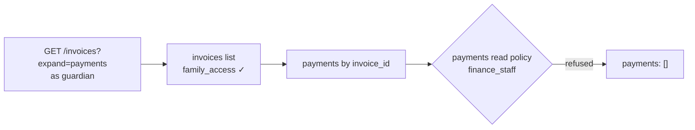

Relations tell the API how resources connect, so clients can fetch related rows in the same request with `?expand=`.

## Declaring relations

```json
"relations": [
  { "name": "class",     "type": "belongs_to", "resource": "classes",       "field": "class_id" },
  { "name": "invoices",  "type": "has_many",   "resource": "invoices",      "field": "student_id" }
]
```

| Type | `field` is | Expands to |
| --- | --- | --- |
| `belongs_to` | the foreign key **on this** resource | one object, or `null` |
| `has_many` | the foreign key **on the related** resource | an array |

Relations don't create database foreign keys or joins. They're resolved by a second, batched query per relation, so they work across any database and never multiply rows.

## Expanding

```bash
GET /rest/v1/students/12?expand=class,invoices
```

```json
{
  "id": 12, "first_name": "Amara", "class_id": 7,
  "class": { "id": 7, "name": "JSS 1A", "grade_level": 7 },
  "invoices": [{ "id": 44, "invoice_no": "INV-202600001", "balance": 0, "status": "paid" }]
}
```

- `expand` takes a comma-separated list of relation names on `list` and `get`.
- On lists, each relation is fetched once for the whole page (`WHERE id IN (…)`), never once per row.
- An unknown relation name returns `400 students has no relation 'x'`.
- Expansion is one level deep; to go further, request the related resource with its own `expand`.

## Expansions respect the related resource's rules

An expansion is a read of another resource, so it answers to **that** resource's rules:

- related rows are filtered by the related resource's **read policy** (its `get` policy, or `list` if `get` is off);
- they're shaped by the related resource's **transformer**;
- if the related resource has no read operation enabled, only secret keys and operators see expanded rows.

So `invoices?expand=payments` returns an empty `payments` array to a guardian when `payments` is restricted to finance staff, while the bursar sees every payment.



<Note>
Hidden `belongs_to` targets come back as `null`, and hidden `has_many` rows are simply absent. The parent row is still returned, because the caller may read it.
</Note>

## Designing relations

- Name `belongs_to` relations after the thing (`class`, `author`) and `has_many` after the plural (`invoices`, `slots`).
- Add a relation in both directions when clients need both views.
- For many-to-many, model the join resource (`student_guardians`) with `belongs_to` on both sides, and `has_many` from each end to the join:

```bash
GET /rest/v1/students/12?expand=guardians          # join rows
GET /rest/v1/student_guardians?filter[student_id]=12&expand=guardian   # with guardian objects
```

## Ordering

Create the related resources **before** adding relations to them; a relation to a missing resource is refused when you save.
