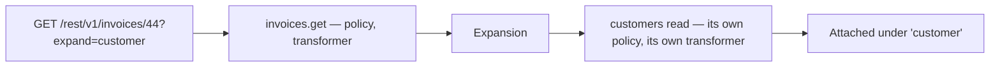
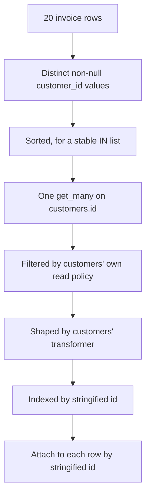
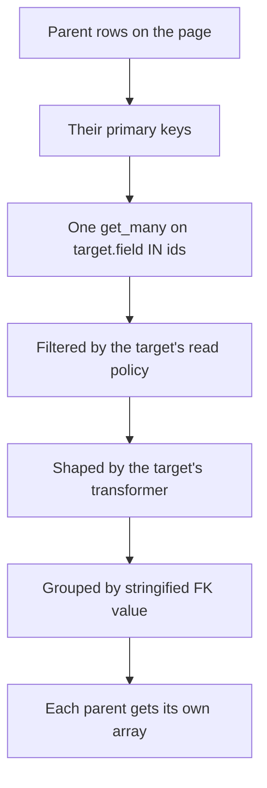
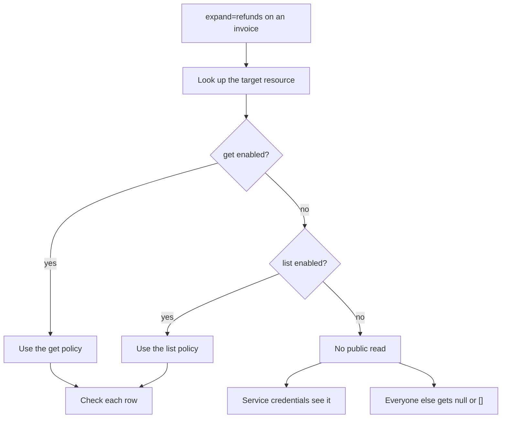
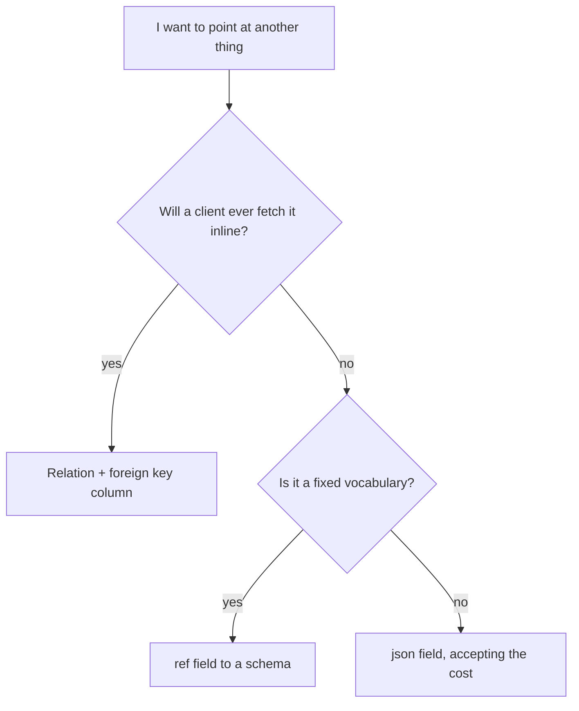
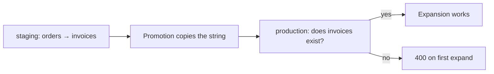
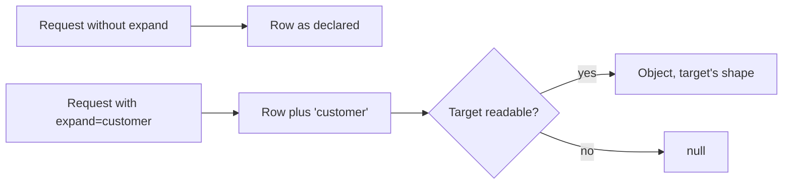
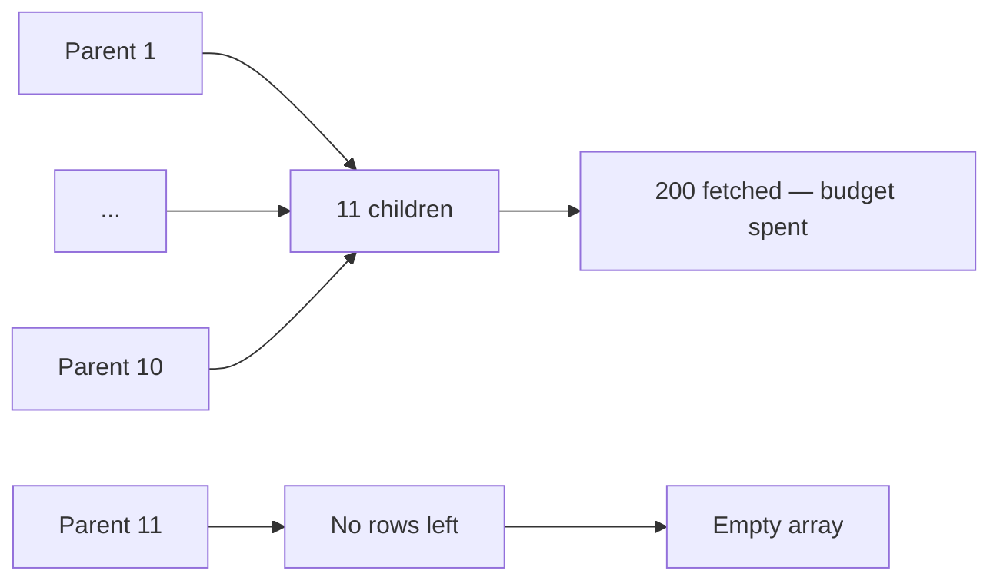

A relation is a declared link from one resource to another, and it does exactly one thing: it powers `?expand=<name>` on `list` and `get`.

It is not a database foreign key constraint. It is not enforced on write. It is not a join, and it does not let you filter one resource by another resource's fields. The best way to hold all of that at once is to think about what expansion actually is: **the platform performing the related resource's own read on your behalf, and attaching the result** — with that read fully subject to the related resource's own policy and its own transformer.



That diagram is the whole page. Everything below is detail about which read happens, what it costs, and what it refuses to do.

<CardGroup cols={3}>
  <Card title="Read-time only" icon="eye">Nothing about a relation affects migrate, validation or the write path. It is a hint about navigation.</Card>
  <Card title="Governed by the target" icon="shield-check">Expanded rows answer to the target resource's own read policy. An expansion must not become a side door.</Card>
  <Card title="Batched, not joined" icon="layers">One extra query per relation for the whole page. No join, no row multiplication, no N+1.</Card>
</CardGroup>

## The declaration

```json
{"name": "customer", "resource": "customers", "field": "customer_id", "type": "belongs_to"}
```

| Key | Meaning |
| --- | --- |
| `name` | The key the expanded data appears under in the response, and the name you write in `?expand=` |
| `resource` | The related resource's name |
| `field` | The foreign key column — on *this* resource for `belongs_to`, on the *related* resource for `has_many` |
| `type` | `belongs_to` or `has_many`; defaults to `belongs_to` if omitted |

<Warning>
Saving a relation validates only that `name`, `resource` and `field` are present and that `type` is one of the two legal values. It does **not** check that `resource` names a resource that exists, or that `field` is a real column on either side. A typo saves cleanly and fails the first time somebody writes `?expand=`.
</Warning>

## `belongs_to`: the key is here

`belongs_to` means *this* resource's table holds the foreign key. An `invoices` resource with a `customer_id` column pointing at `customers.id` declares:

```json
{"name": "customer", "resource": "customers", "field": "customer_id", "type": "belongs_to"}
```

```bash
curl "$GW/rest/v1/invoices/44?expand=customer" \
  -H "apikey: $PK" -H "Authorization: Bearer $TOKEN"
```

```json
{
  "id": 44,
  "customer_id": 12,
  "amount_cents": 210000,
  "status": "overdue",
  "customer": {"id": 12, "name": "Ada Okafor", "email": "ada@example.com"}
}
```

The expanded value replaces nothing — the foreign key stays in the response and the related row is added alongside it under the relation's `name`. That is deliberate: the client can see both the key and the target, which makes it possible to render a link without a second request even when the expansion was refused and came back `null`.

### How the expansion actually runs

On a `list` with `expand=customer`, for a page of twenty invoices:



| Step | What happens |
| --- | --- |
| Collect | The distinct, non-null values of `customer_id` across the page |
| Cap | The `IN` query is capped at `MAX_PAGE_SIZE` — 200 |
| Fetch | One `get_many` against the target's primary key |
| Filter | Each fetched row is checked against the **target's** read policy |
| Shape | Surviving rows go through the **target's** transformer |
| Attach | Matched by `str(id)`, so an integer `12` and a string `"12"` match |

One extra query for the whole page, not one per row. A page of twenty invoices pointing at four customers is one `SELECT ... WHERE id IN (4 values)`.

The stringified comparison is what makes mixed representations safe. Rows decoded from different columns can produce an integer on one side and a string on the other, and a naive equality check would silently miss every match.

<Note>
The 200 cap is `MAX_PAGE_SIZE`, the same ceiling as `per_page`. Since `per_page` cannot exceed 200, a page can contribute at most 200 distinct ids anyway — so in practice the cap is never the binding constraint for `belongs_to`. It matters for `has_many`, where it is not.
</Note>

## `has_many`: the key is over there

`has_many` means the *target's* table holds the foreign key pointing back at this resource. A `customers` resource with a matching relation to `invoices`:

```json
{"name": "invoices", "resource": "invoices", "field": "customer_id", "type": "has_many"}
```

```bash
curl "$GW/rest/v1/customers/12?expand=invoices" \
  -H "apikey: $PK" -H "Authorization: Bearer $TOKEN"
```

```json
{
  "id": 12,
  "name": "Ada Okafor",
  "invoices": [
    {"id": 44, "customer_id": 12, "amount_cents": 210000, "status": "overdue"},
    {"id": 51, "customer_id": 12, "amount_cents": 15800, "status": "paid"}
  ]
}
```

Note the label in the picker: **Foreign key on `<target>`**. That is the whole distinction, and it is the single most common thing to get backwards.

| | `belongs_to` | `has_many` |
| --- | --- | --- |
| The `field` is a column on | This resource | The target resource |
| The response key holds | One object, or `null` | An array, possibly empty |
| Typical name | Singular: `customer`, `author` | Plural: `invoices`, `line_items` |
| Rows fetched | The distinct referenced ids | Every child row matching any parent in the page |

### How the expansion runs



One query for the whole page again. The children come back in a single result set and are grouped in memory by `str(child[FK]) == str(parent[primary_key])`, with the same stringified comparison that makes `belongs_to` robust.

A parent with no children gets an empty array — not `null`, not a missing key. That distinction matters to a client: `[]` means "this parent has none", while `null` on a `belongs_to` means "I cannot tell you".

### The 200 cap, and why it bites here

`get_many` runs with `limit=MAX_PAGE_SIZE` — 200. For `has_many`, that limit is on **child rows across the entire page**, not per parent.

| Page | Children per parent | Rows fetched | What happens |
| --- | --- | --- | --- |
| 20 parents | 5 | 100 | All of them |
| 20 parents | 10 | 200 | All of them, exactly at the cap |
| 20 parents | 11 | 220 | **Truncated at 200.** The last parents get empty arrays |
| 1 parent | 5000 | 5000 | Truncated at 200 |

That last row is the important one. A `has_many` expansion on a single `get` is capped at 200 children, and nothing in the response tells you it happened — the array simply has 200 entries and stops.

<Warning>
A truncated `has_many` looks exactly like a complete one. There is no `has_more`, no total, no indication that rows were dropped. If a parent can have more children than the cap, do not expand it — query the child resource directly with `?filter[<fk>]=eq.<id>`, which paginates properly and reports a total.
</Warning>

## Why Pawabase does not create real foreign keys

This is the design decision most worth understanding, because it looks like an omission until you know what the platform is for.

A database foreign key constraint says three things at once: that the column may not be null, that the referenced row must exist, and that deleting the referenced row is either forbidden or cascades. All three are enforced by the database, at write time, on every write path — including the ones you did not write.

Pawabase's resource layer enforces none of them, and the consequences are worth being explicit about:

| You get | You do not get |
| --- | --- |
| A declared link usable by `?expand=` | A guarantee that a dangling reference is impossible |
| Batched expansion without N+1 | Cascade behaviour on delete |
| The freedom to point at a row that does not exist yet | The freedom to delete a parent without touching children — which is the other half |
| A relation that survives a table rename | A guarantee that the two tables agree about a value |

The reasoning runs through all four rows. A workflow that creates an invoice and its lines in one transaction may insert the invoice before the customer row exists, in a staging import, or in a migration where the order is genuinely reversed. Cascade delete is the more dangerous half: silently removing rows because a parent disappeared is a behaviour nobody chooses deliberately and everybody discovers in production.

<Note>
Pawabase also never creates a database index for a relation's foreign key column. `indexed: true` on the field does that, and `migrate` is what applies it. A `has_many` expansion over an unindexed foreign key is a full scan of the child table.
</Note>

### What this means in practice

Nothing stops a dangling key from being written, and nothing stops a parent from being deleted with children pointing at it. Both produce a `belongs_to` expansion of `null` — a dangling key on one side, and on the other a `has_many` array that simply omits the orphan.

If your product needs real referential integrity, the options are:

| Option | What it costs |
| --- | --- |
| Declare the relationship and add the constraint yourself in the Database console | The constraint is real, and it lives outside everything the definition describes |
| Model orphans explicitly — a `status` of `orphaned`, or a soft delete on the parent | No constraint needed, and every read has to account for the state |
| Validate in the flow that writes the child | A check at write time rather than a guarantee at the storage layer |
| Accept it, and let the expansion return `null` | Fine when a dangling key means "not set yet", alarming when it means corruption |

The last row is the honest default. Many product relationships are legitimately incomplete at times, and a database constraint would fight that. The cost is that "the key is wrong" and "the row is hidden" become the same observation, and you have to decide in advance which of those your product can tolerate.

## The rule that matters most

Every expanded row answers to the **target** resource's own read policy, and is shaped by the **target's** transformer. Not the resource you are querying — the one you are expanding into.

The lookup order for the governing settings is:

1. The target's `get` settings, if `get` is enabled.
2. Otherwise the target's `list` settings, if `list` is enabled.
3. Otherwise the default policy `authenticated` — but see the next paragraph, because step 3 only applies when one of the first two existed with no policy of its own.
4. If the target has neither `get` nor `list` enabled, there is no public read at all, and **only service credentials** see the expansion. Everyone else gets `null` or `[]`.



This is deliberate, and the reasoning is worth stating because it is the security property that makes expansion safe to expose: **an expansion must not be a side door around the target's policy.** Without it, any resource with a relation to a sensitive resource becomes a read path to it, and the sensitive resource's carefully written policy would be irrelevant.

The consequence for a client is that a perfectly readable parent can have an unreadable relation. In the invoicing example, `invoices?expand=customer` returns `customer: null` for a caller whose credential does not satisfy the `customers` read policy — while `invoices?expand=lines` is fully populated for the same caller if they pass the `invoice_lines` policy. Each relation is evaluated independently, against its own target.

<Warning>
Turning off `get` and `list` on a target does not hide the rows from a service credential, and it does not hide them from Studio's own record editor either. It hides them from ordinary callers. If a relation exists to a resource whose rows are sensitive, the correct answer is to remove the relation rather than to rely on the target having no public read — because that is a property of the target's definition, and the target's definition is editable by someone who may not know the relation exists.
</Warning>

## Writing `?expand=`

The parameter is a comma-separated list of relation names, and it works on both `list` and `get`.

```bash
curl "$GW/rest/v1/orders?expand=customer,line_items&per_page=50" \
  -H "apikey: $PK" -H "Authorization: Bearer $TOKEN"
```

Names are matched against the `relations` array of the resource you are querying, exactly. They are case-sensitive, and they are the relation's `name`, not the target resource's name — a relation named `author` pointing at `users` is expanded as `author`.

Expanding several relations costs one query each, in the order they appear:

| Request | Queries |
| --- | --- |
| `?expand=customer` | 2 — the list, plus one for customers |
| `?expand=customer,line_items` | 3 |
| `?expand=a,b,c,d` | 5 |

Each expansion runs after the page is fetched and after any policy residual has been applied, so it operates on the rows the caller can actually see. A residual that removed eight of twenty rows leaves twelve ids to expand.

<Note>
The expansion is not part of the response for `select`. Because the primary key is always appended to your selection, expansion still works with `?select=...` — but the *target's* rows are fetched in full and then shaped by the target's transformer, not reduced to the columns you selected on the parent.
</Note>

### An unknown relation name is a 400

If a name in `expand` matches no declared relation, the whole request fails:

```text
400 posts has no relation 'comments'
```

The message names the resource and the relation you asked for. This is a `400` rather than being ignored, which is the right call: silently dropping an unknown expansion would return a response that looks complete and is missing data, and the client would have no way to tell.

The same strictness applies to a name that exists on a different resource. Relation names are per-resource, so `?expand=comments` on `posts` and `?expand=comments` on `videos` can refer to entirely different resources.

<Warning>
Because there is no depth syntax, `?expand=customer.account` is a `400` with a message about a relation literally named `customer.account` — the dot is part of the name being looked up. Expansion resolves exactly one level. A second hop is a second request against the target.
</Warning>

### What you cannot do with a relation

A relation is not a query path. These are the three things people try and the two alternatives that exist:

| You want | `?expand=` gives you | Do this instead |
| --- | --- | --- |
| Filter by a related resource's field | Nothing. The dotted name is checked as a literal field on the resource you are querying, and it does not exist there, so it is a `400` | Query the other resource directly, filtering on its own fields |
| Sort by a related resource's field | Nothing | Same |
| Join in the response body | One level of related data, keyed by relation name | Nested expansion via two requests, or a transformer |

There is no `$or`, no negation and no nested filter grouping in the filter language either, so a cross-resource condition such as "invoices for customers in region EU" is two queries and a join in your client, or a flow that does it server-side. See [Filtering](/data/filtering) for what the filter language does support.

## Cost, stated plainly

Expansion is a query, not a join. For a list of twenty rows with two relations expanded, that is three queries against the database where one would do.

| | Without `expand` | With two relations |
| --- | --- | --- |
| Queries for a 20-row list | 2 — the page and the count | 4 |
| Rows returned | 20 | 20, plus up to 40 related |
| Response size | Small | Potentially large |
| Policy evaluations | 20 | 20, plus every related row |

Two of those rows deserve emphasis.

**The policy evaluations are per related row.** Expansion does not push the target's policy into SQL; it fetches candidates and then checks each one in Python. For a `has_many` with 200 children, that is 200 policy evaluations per request.

**The response size is unbounded in the way that matters.** A `belongs_to` adds one object per row, so a page of 200 rows with a wide target can be many times the size of the page itself. `has_many` is worse, because the cap is on total children rather than per parent.

### Why not a join

Three reasons, and each one is a decision you might disagree with if you only saw the result.

**The target's policy may not be expressible in SQL for this query.** Expansion has to run the target's read policy, and when that policy contains a residual — any condition that is not an equality against a record field — the filtering happens in Python against rows that have already been fetched. A join would have to push the condition into the `WHERE` clause to be correct, which is exactly what a residual cannot do.

**The target's transformer runs per row, in Python.** A transformer can `omit`, `pick`, `set`, `rename` and `case`, and a `set` step renders a template with the policy context. None of that has a SQL equivalent, so the rows have to come back before they can be shaped.

**`has_many` multiplies rows.** A join that returns twenty invoices with their lines produces a result set whose length depends on the data, which then breaks the pagination you already applied. Expansion deliberately avoids that by keeping the page and the children separate.

The cost of those three guarantees is one query per relation. The benefit is that a relation can never change the meaning of a page.

<Note>
Because expansion runs after the residual, a policy that removes rows also removes their expansions from consideration. You never expand a row the caller cannot see, so there is no timing or count-based way to infer that a hidden row exists.
</Note>

## Declaring relations in Studio

Under **Build → Resources**, the **Relations** section of a resource's form. Its description reads "Include related rows with `?expand=name`." Each relation is a card:

| Control | Setting | Notes |
| --- | --- | --- |
| **Name** | `name` | Monospace, placeholder `author`. Becomes the response key and the `?expand=` name |
| **Kind** | `type` | A two-way choice: **Belongs to** or **Has many** |
| **Resource** | `resource` | A picker over the environment's resources. Not optional |
| Foreign key picker | `field` | Label and options both change with the kind |
| Trash | — | Labelled **Remove relation** |

The relabelled foreign-key picker is the useful part:

| Kind | Label | Options offered |
| --- | --- | --- |
| Belongs to | **Foreign key here** | This resource's own fields |
| Has many | **Foreign key on `<target>`** | The chosen target's fields |

So the form is showing you, at the moment you pick the kind, exactly which side of the relationship owns the key. Picking the target resource populates the right list of fields for `has_many`. This is the single most effective guard against getting the direction backwards, and it is worth using rather than reasoning from memory.

**Add relation** appends a card pre-filled with `{name: "", type: "belongs_to", resource: "", field: ""}`.

## Naming relations

The relation's `name` is a response key and a query parameter, so it deserves the same care as a field name.

| Convention | Example | Why |
| --- | --- | --- |
| `belongs_to` is singular | `customer`, `author`, `account` | It holds one object; a singular name makes `null` read naturally |
| `has_many` is plural | `invoices`, `line_items`, `tags` | It holds an array |
| Match the field where you can | field `customer_id` → name `customer` | Makes the two declarations recognisable as a pair at a glance |
| Avoid abbreviations | `cust` | The name is public; the field is an implementation detail |

The last row is the one people regret. A relation name is part of the response contract and part of every client that reads it, and abbreviations that were obvious when the table was small are noise once a dozen engineers are calling the API.

<Note>
Two relations may point at the same target with different keys — `primary_author` and `secondary_author` both `belongs_to` `users`, on `customer_id` and `referred_by_id`. That is legitimate and expansion handles it independently, at the cost of a second query.
</Note>

## Relation, ref field, or json field

Choosing how to record a link between two things is a decision you make in the field list, and there are three shapes available. Picking the wrong one produces a model that is hard to query, hard to validate, or impossible to expand.

| | Relation + foreign key field | `ref` field | `json` field |
| --- | --- | --- | --- |
| Stores | An id in a real column | An id in a real column | An id inside a JSON document |
| Expandable | Yes, with `?expand=` | No | No |
| Filterable by the target's fields | No | No | No |
| Filterable by the id | Yes, because it is a column | Yes | No |
| Enforced by the database | No | No | No |
| Use when | The target is a resource you will read | The target is a schema you validate against | There is no single target |

### Reach for a relation when you will expand it

A foreign key column plus a relation is the only combination that gives you a navigable link. If the plan is for a client to fetch the parent and have the related row arrive with it, this is the shape.

```json
{
  "fields": [
    {"name": "customer_id", "type": "uuid", "required": true, "indexed": true}
  ],
  "relations": [
    {"name": "customer", "resource": "customers", "field": "customer_id", "type": "belongs_to"}
  ]
}
```

`indexed: true` on the column is not decoration for this shape. A `belongs_to` expansion fetches by the target's primary key, so the index that matters is on the *target* — but any list that filters by `customer_id` needs this one, and a `has_many` declared on the other side reads this column for every parent.

### Reach for a `ref` field when the target is a schema, not a resource

A `ref` field validates its value against a named [schema](/data/schemas) — a reusable shape rather than a table with rows. It is the right answer when the thing you are pointing at is a fixed vocabulary rather than a record: a country code from a `countries` schema, a currency from a `currencies` schema, a status from a `ticket_states` schema.

```json
{"name": "currency", "type": "ref", "schema": "currencies", "required": true}
```

The validator compiles the referenced schema into the field's type, so the value is checked against the schema at request time. What you do not get is a row to expand: `ref` is not a resource, so there is nothing for a relation to point at.

<Warning>
A `ref` field without a `schema` is refused at save time. And a `ref` to a resource name is not a substitute for a relation — it validates a shape, it does not fetch anything.
</Warning>

### Reach for a `json` field when there is no single target

A `json` field is the honest choice for a genuinely polymorphic or composite link: an attachment that points at a file in storage or a row in a resource, a settings block, a snapshot of a third party's payload.

The cost is total. Filters cannot reach inside a `json`, `array` or `object` column at all — not with a partial match, not with a containment operator, not with a path syntax. So a `json` field cannot be filtered on, sorted by, or indexed, and if you find yourself needing to, the modelling decision was wrong rather than the query.



<Note>
There is also an `object` field for a nested structure you want validated key by key — a `line_items` array of objects with a `sku` and a `quantity`. That is a different question from "how do I point at another row", and it is the right tool when the shape is data rather than a reference.
</Note>

## Policies and relations

A relation has no policy of its own. The policy that governs the expanded rows is the target's, and that is the whole of the model.

What this means in practice, for each direction:

| Situation | Result |
| --- | --- |
| Target's `get` is enabled with a policy the caller passes | Full expansion |
| Target's `get` is enabled with a policy the caller fails | `null` for `belongs_to`; the row is absent from `has_many` arrays |
| Target's `get` is off, `list` is on | The `list` policy governs |
| Target's `get` and `list` are both on | `get` wins; its policy is used |
| Target has neither enabled | Only service credentials see anything; everyone else gets `null` or `[]` |
| Target has a transformer | The transformer shapes every expanded row |
| Target has neither enabled nor a transformer, and the caller is a service credential | Everything is returned |

Two things follow that are easy to miss.

**A `has_many` array can be shorter than the truth, with no indication.** Unreadable children are simply absent from the array. There is no placeholder, no count of hidden rows, no `null` entry. A parent with three children where the caller can read two gets a two-element array, and the response is indistinguishable from a parent with two children.

**A relation is not a way to share a policy.** If you want the same rule on both resources, write it once as a named policy and reference it from both operation sets — do not rely on the expansion inheriting anything from the parent.

## Relations versus foreign keys you write yourself

The two ideas overlap enough to be worth separating explicitly, because "we already have foreign keys" is a reasonable objection that turns out to be about a different thing.

| | A Pawabase relation | A database foreign key |
| --- | --- | --- |
| Lives in | The resource definition, as data | The table schema |
| Enforced by | Nothing | The database, on every write |
| Prevents a null key | No | Yes, with `NOT NULL` |
| Prevents a dangling key | No | Yes |
| Affects delete | No | Can forbid it or cascade it |
| Powers `?expand=` | Yes | No |
| Survives `migrate` | It is not schema, so nothing to migrate | It is schema, and `migrate` never touches it |
| Editable without a deploy | Yes | No |

The word doing the work in that table is *prevents*. A foreign key is a guarantee; a relation is a convenience. Neither substitutes for the other, and having both is a perfectly reasonable design.

### A design that uses both

The realistic pattern for a product that cares about integrity:

| Layer | What it provides |
| --- | --- |
| `customer_id` column, `integer` or `uuid`, `indexed: true` | The value, and a fast lookup for the expansion and for filters |
| A relation `belongs_to` `customers` | The navigable link for `?expand=` |
| A real foreign key constraint, added in the Database console | The integrity guarantee |
| A policy on `create` that checks the referenced row exists | A friendly error instead of a constraint violation |

What you gain is a model that is pleasant to read through the API and still cannot be corrupted. What it costs is that one of the four layers lives outside the definition, which means it is not promoted with it and not visible in the JSON. Someone cloning the resource into another environment gets the first three layers and has to remember the fourth.

<Warning>
That last point is the real cost. A constraint added by hand is invisible to `migrate`, invisible in the definition, and invisible in promotion — so it exists in production and not in staging until someone notices. If you add one, record it somewhere the next person will look, and check it after every environment rebuild.
</Warning>

### When a real constraint is the wrong answer

Even when you want integrity, a constraint is sometimes the wrong tool:

| Situation | Why a constraint does not help |
| --- | --- |
| The relationship is legitimately optional for a period | `NOT NULL` fights the workflow |
| The referenced row is created after the child | Insert order within a transaction is yours to choose, but a migration or import may not be |
| You need soft-deleted parents to remain valid | The row is gone from the database's point of view while the product still considers it present |
| Rows arrive by import or by raw SQL | The constraint only holds for writes that go through it |

That last row is the sharp edge. Raw SQL in the Database console bypasses the model layer entirely, so a constraint is the only thing standing between a bad import and a corrupted relationship — which is an argument *for* the constraint, provided the import is written to respect it.

## Modelling guidance

The decisions that matter when you are designing a set of relations across a project.

**Declare the `has_many` on the parent, and the `belongs_to` on the child.** Both directions of the same relationship are legitimate and they are genuinely different declarations, because each stores a different key on a different table. The one that is wrong is declaring a `belongs_to` where the key does not live.

**Name them so the pair is recognisable.** `customer_id` plus `customer` is a pattern a reader can check at a glance. `cid` plus `primary_party` is not.

**Index the foreign key column.** `indexed: true` on the field, and migrate. A `has_many` reads the child's foreign key column for every parent, and an unindexed one is a full scan of the child table on every expanded request.

**Prefer a `belongs_to` for a value you will always fetch with the parent,** and a separate query for children. Expansion is at its best when it is adding one small object per row.

**Do not expand a `has_many` from a list.** You are asking for the cartesian product of a page and its children, capped at 200 total with no indication of truncation. Query the child resource with a filter instead; you get pagination, sorting, a total, and no cap you have to remember.

**Declare relations you actually intend to use.** Each one is a query your clients can trigger, on a definition you cannot fully see from the client side. A relation nobody expands is a liability with no benefit.

<Info>
A relation is also not a validation rule. Pointing `customer_id` at a customer that does not exist is accepted; the failure surfaces as `null` on expansion, or as nothing at all if nobody expands.
</Info>

## Worked example: an order screen

A single request that exercises both kinds and shows the policy boundary in action.

```json
// orders
{
  "name": "orders",
  "fields": [
    {"name": "customer_id", "type": "integer", "required": true, "indexed": true},
    {"name": "status", "type": "string", "enum": ["placed", "paid", "shipped"], "default": "placed"},
    {"name": "total_cents", "type": "integer", "required": true}
  ],
  "operations": {
    "list": {"enabled": true, "policy": "own_orders"},
    "get": {"enabled": true, "policy": "own_orders"}
  },
  "relations": [
    {"name": "customer", "resource": "customers", "field": "customer_id", "type": "belongs_to"},
    {"name": "line_items", "resource": "line_items", "field": "order_id", "type": "has_many"}
  ]
}
```

```bash
curl "$GW/rest/v1/orders/901?expand=customer,line_items" \
  -H "apikey: $PK" -H "Authorization: Bearer $TOKEN"
```

```json
{
  "id": 901,
  "customer_id": 44,
  "status": "paid",
  "total_cents": 15800,
  "created_at": "2026-02-14T09:00:00+00:00",
  "customer": {"id": 44, "name": "Grace Hopper"},
  "line_items": [
    {"id": 1, "order_id": 901, "sku": "MUG-01", "qty": 2, "price_cents": 4900},
    {"id": 2, "order_id": 901, "sku": "TSHIRT-M", "qty": 1, "price_cents": 5900}
  ]
}
```

Three queries for that response: the order, the customer, the line items. Now suppose the caller's credential does not satisfy the `customers` read policy:

```json
{
  "id": 901,
  "customer_id": 44,
  "status": "paid",
  "total_cents": 15800,
  "customer": null,
  "line_items": [
    {"id": 1, "order_id": 901, "sku": "MUG-01", "qty": 2, "price_cents": 4900},
    {"id": 2, "order_id": 901, "sku": "TSHIRT-M", "qty": 1, "price_cents": 5900}
  ]
}
```

`customer` is `null` and `line_items` is fully populated, because each relation is evaluated against its own target's policy. The order itself still returns, because the caller's credential satisfies `own_orders` on the `orders` resource.

That is the whole security model in one response: the parent is governed by the parent's policy, each relation by its own target's, and no relation can widen what its caller can see.

### The same data without expansion

| Question | With `?expand=` | Without |
| --- | --- | --- |
| The customer's name | In the same response | A second request to `/rest/v1/customers/44`, which may itself be `403` |
| The line items | In the same response | A second request to `/rest/v1/line_items?filter[order_id]=eq.901` |
| Round trips | 1 | 1 to 3 |
| Consistency | The rows are read in three separate statements, so a concurrent write can make them inconsistent | Same, but you control the timing |
| Truncation risk | `line_items` capped at 200 | None — the filtered query paginates |

The honest summary is that expansion trades a guaranteed round-trip count for a possible truncation, and the trade is worth it when the related data is small and always needed, and not worth it when it is large or occasionally needed.

## The cost model in one table

| Scenario | Queries | Policy evaluations | Risk |
| --- | --- | --- | --- |
| `get` with one `belongs_to` | 1 + 1 | 1 + 1 | None |
| `get` with one `has_many`, 5 children | 1 + 1 | 1 + 5 | Truncation above 200 children |
| `list` of 20, no expansion | 2 | 20 | None |
| `list` of 20, one `belongs_to` | 3 | 20 + distinct targets | Response size |
| `list` of 20, one `has_many` | 3 | 20 + children fetched | Truncation at 200 total children |
| `list` of 20, four relations | 6 | 20 + everything | Four policy boundaries to reason about |

The policy-evaluation column is the one to notice. Expansion adds an evaluation for every *fetched* row, not every returned row — because a row the caller may not read is filtered out rather than returned. A `has_many` over a large child table therefore evaluates more policies than it returns rows, and the difference is exactly the set of rows the caller was not allowed to see.

<Note>
Because expansion runs after the page is filtered, the ids being expanded are already the ones the caller can see. There is no timing side channel and no count that reveals a hidden row.
</Note>

## Frequently asked questions

<AccordionGroup>
<Accordion title="Can I expand more than one relation at once?">
Yes — the parameter is comma-separated: `?expand=customer,line_items`. Each relation costs one additional query, processed in the order given.
</Accordion>
<Accordion title="Can I go two levels deep, like expand=customer.account?">
No. Expansion resolves exactly the relations declared on the resource you are querying, one level, and the dotted string is looked up as a literal relation name — so it is a `400`. Issue a second request against the target for the second hop.
</Accordion>
<Accordion title="Does declaring a relation create a database foreign key?">
No. A relation is a read-time convenience for `?expand=`; it has no effect on migrate and enforces nothing at the storage layer. Referential integrity has to come from the database schema itself.
</Accordion>
<Accordion title="Can I filter or sort the expanded has_many array?">
No. It is every child row the target's policy allows for that parent, in whatever order the target's default ordering produces — primary key ascending unless you somehow changed it, which you cannot per-request. Query the child resource directly when you need control; you get pagination, sorting and a real total there.
</Accordion>
<Accordion title="A belongs_to is always null even though the column has a value">
Three candidates, and the response cannot distinguish them: the referenced row does not exist, the target's policy refuses it for this caller, or the column contains a value of the wrong type for the target's key. The third is worth ruling out first, because it is the only one that is a modelling mistake rather than an access outcome.
</Accordion>
<Accordion title="A has_many is empty for every parent">
The related resource likely has neither `get` nor `list` enabled for ordinary callers, so only service credentials see expanded rows for it. Enable at least one read operation with an appropriate policy if clients should see the children. The other candidate is the kind being backwards, in which case the query is filtering a column that does not hold the key.
</Accordion>
<Accordion title="I wrote filter[customer.name]=Ada and got a 400 for an unknown field">
Filtering through a relation is not supported. The dotted name is checked as a literal field name on the resource you are filtering, and no such field exists there. Query the customers resource directly instead.
</Accordion>
<Accordion title="Expanding two relations is slow">
Each relation is one batched query, which is normally fast. The slow cases are a `has_many` over an unindexed foreign key, a large `belongs_to` target being fetched in full, and a target policy that leaves a residual — because residual filtering happens in Python, per fetched row.
</Accordion>
<Accordion title="Does expansion work with select?">
Yes, and the parent row still has its primary key, because `select` appends it. What you select on the parent is reduced; what comes back from the target is not — the target's rows are fetched whole and then shaped by the target's transformer.
</Accordion>
<Accordion title="Can a relation point at a resource in another environment?">
No. Relation targets are resolved by name within the environment being compiled, and a name that does not resolve there is not caught at save time. It fails on first use.
</Accordion>
</AccordionGroup>

## How expansion and other features interact

A short list of interactions that produce surprises, each with the reason.

### Transformers on either side

Expansion runs, then the parent's transformer runs over the resulting rows. So a `pick` step on the parent that does not include the relation's name will drop the expansion entirely, and an `omit` step that names the relation will remove it while leaving the foreign key in place.

The same applies on the target: a target transformer shapes the expanded rows, so a `belongs_to` expansion can produce an object whose keys are nothing like the target's field list.

| Transformer on | Effect on expansion |
| --- | --- |
| The parent | Runs after expansion; can drop or rename the expanded key |
| The target | Shapes every expanded row |
| Both | The target's shaping happens first, then the parent's |

<Warning>
`?select=` and a parent transformer can combine badly. Selecting two columns fetches two columns, the expansion runs against those rows, and then a `pick` step decides what survives. A relation name that is not a column is unaffected by `select`, so expansion still works — but the parent you get back may be almost empty.
</Warning>

### Caching and the cache key

Both `get` and `list` include `expand` in their cache key, so the same resource with and without an expansion are separate cache entries. That is correct, and it has a cost worth knowing: four distinct cache entries for the same logical query with different expansions, each evicting independently when the tag is dropped.

Expansion is also cached, since the cache key is computed before the handler runs. A `has_many` expansion that is truncated at 200 children gets cached truncated, for the whole TTL.

### Rate limits

Expansion does not have its own rate limit. A request with four expanded relations is one request against the resource's bucket and four queries against the database.

### Events and realtime

Writes do not fire on expansion. Expansion is a read, and reads fire nothing — no event, no realtime publish, no cache invalidation.

## Reading a response that expanded oddly

The response itself is usually enough to diagnose the problem, because the failure modes have distinct shapes.

| What you see | Most likely cause | Confirm by |
| --- | --- | --- |
| `400` naming a relation | The name is not in the resource's `relations` array | Reading the definition's JSON |
| `400` naming a dotted name | Depth was attempted; expansion is one level | Removing the dot |
| `"customer": null` on every row | The key is null, or the target's policy refuses every row, or the target has no public read | Checking the target's `get` and `list` settings |
| `"customer": null` on some rows only | A mixture of null keys and refused or missing rows | Comparing `customer_id` values against the target |
| `"invoices": []` on every parent | The kind is backwards, or the target has no public read | Checking whether the target holds the key |
| `"invoices": []` on the last parents of a page | Truncation at 200 children across the page | Reducing `per_page` and re-requesting |
| An array with exactly 200 entries | Truncation | Querying the child resource directly with a filter |
| A shorter array than expected | Children the caller may not read | Checking the target's policy for that caller |
| Keys that do not match the target's fields | The target has a transformer | Reading the target's `transformer` |
| A `400` on `filter[relation.field]` | Filtering through a relation is not supported | Querying the target directly |

The one that costs the most time is usually the last-but-one row, because truncation has no marker at all. If a count matters, do not take it from an expansion.

## Keeping relation declarations honest

Because a relation is the one declaration the platform does not verify, it is worth a small routine.

| Habit | What it catches |
| --- | --- |
| Read the `relations` array after saving | Typos in `resource` and `field`, which validate cleanly |
| Expand each relation once after creating it | Direction mistakes, which are the most common error |
| Check the target's `get`/`list` settings | The "always null" case, before a client finds it |
| Index every foreign key column | Slow expansions, which look like a platform problem and are not |
| Remove relations nobody uses | Queries nobody intended, on a definition nobody fully sees |

The last one is worth a sentence of justification. Every declared relation is a query your clients can trigger, on a resource whose read surface is governed by a definition that someone else may edit. A relation kept "in case it is useful" is a policy evaluation path with no owner.

## Two levels, done deliberately

Since expansion is one level, a nested document is two requests. The question is what shape the second request takes, and there are two reasonable answers.

```js
const order = await pawabase(`/rest/v1/orders/${id}?expand=customer,line_items`, { token });

// Second hop: the customer's own related rows, fetched as the customer would.
const customerOrders = order.customer
  ? await pawabase(`/rest/v1/orders?filter[customer_id]=eq.${order.customer.id}&per_page=20`, { token })
  : { data: [] };
```

Note the second request uses the *filter* on `customer_id` rather than a `has_many` expansion back from the customer. Three reasons, all of them general:

| Approach | Why not |
| --- | --- |
| `GET /rest/v1/customers/44?expand=invoices` | Truncated at 200, no total, and refetches the customer row you already have |
| `GET /rest/v1/orders?filter[customer_id]=eq.44` | Paginated, sortable, with a real `total` |
| A `has_many` on `customers` | Useful for a customer detail screen; wrong for a bounded, countable list |

The rule that falls out: **expand for data you always want alongside the parent; filter for data you want a controlled, countable view of.**

<Warning>
The second request runs as the same caller, under the same policies. If `customer` came back `null` because the caller may not read that customer, then `filter[customer_id]` on that value is also not something they should be able to enumerate — and the `orders` list policy is what decides, independently. There is no path from a `belongs_to` expansion to a wider read.
</Warning>

## When to declare a relation, and when not to

The test is whether the related data is *always wanted alongside* the parent.

| Declare a relation when | Skip it when |
| --- | --- |
| The related row is small and needed on every view | The related data is large or occasional |
| It is the same object every time — a customer, an author, a product | It is a list the user may want filtered, sorted or paged |
| It belongs in the response contract | A separate request would be simpler to cache and to reason about |
| You will expand it on a `get` | You only ever need it on a list, where pagination matters more |

Two failures to avoid at opposite ends.

**Declaring everything.** A resource with six relations invites a client to request `?expand=a,b,c,d,e,f` on a list of 200 rows, and the answer is six extra queries, six policy boundaries, and a response nobody designed. The 200-child cap will silently truncate whichever `has_many` comes last.

**Declaring nothing.** A resource with no relations forces every screen to make two requests and join in the client, and the client has to handle the case where the second request is refused. That is the shape expansion exists to remove.

The reasonable middle is one or two relations on a resource — the ones that are genuinely part of the entity rather than a list of things that happen to point at it.

<Note>
A `has_many` declared for convenience and never expanded has a real cost after all: it is a query path on the child resource, and the child's policy is evaluated against the parent's callers whenever somebody does use it.
</Note>

## The shape of an expansion, in code

The whole algorithm in one place, so the guarantees can be read off the implementation rather than inferred.

```python
async def _expand(state, ctx, spec, rows, names):
    relations = {r["name"]: r for r in spec.relations}
    for name in names:
        relation = relations.get(name)
        if relation is None:
            raise HTTPException(400, f"{spec.name} has no relation {name!r}")

        target = await state.store(relation["resource"])

        if relation.get("type", "belongs_to") == "belongs_to":
            ids = sorted({
                row[relation["field"]]
                for row in rows
                if row.get(relation["field"]) is not None
            }, key=str)
            fetched = await target.get_many(target.spec.primary_key, ids)
            related = {
                str(item[target.spec.primary_key]): item
                for item in await _readable(state, ctx, relation["resource"], fetched)
            }
            for row in rows:
                row[name] = related.get(str(row.get(relation["field"])))

        else:  # has_many
            ids = [row[spec.primary_key] for row in rows]
            children = await _readable(
                state, ctx, relation["resource"],
                await target.get_many(relation["field"], ids),
            )
            for row in rows:
                row[name] = [
                    child for child in children
                    if str(child.get(relation["field"])) == str(row[spec.primary_key])
                ]
```

Five properties fall out of that, and each is a guarantee rather than an accident.

**Null keys are excluded before the query.** The set comprehension filters on `is not None`, so a page of null foreign keys produces no query at all — an empty id list short-circuits `get_many`.

**Ids are sorted for a stable query.** `sorted(..., key=str)` gives postgres a predictable `IN` list, which helps the planner and makes query logs comparable between requests.

**Matching is by stringified key on both sides.** `str(row.get(field))` and `str(item[primary_key])` on one side, `str(child.get(field))` and `str(row[primary_key])` on the other. This is why an integer key and a string key still match.

**`get_many` is always capped.** `limit=MAX_PAGE_SIZE`, 200, for both directions. Harmless for `belongs_to`, consequential for `has_many`.

**`_readable` sits between fetching and attaching.** Every fetched row passes through the target's own read policy and transformer before it can appear in the response. There is no code path that attaches a raw fetched row.

<Warning>
The last property is the security property, and it is worth noticing that it is structural rather than a check someone might forget. Because `_readable` is the only path from `get_many` to a response, there is no version of this code that attaches an unfiltered child.
</Warning>

## What `_readable` does

```python
async def _readable(state, ctx, resource_name, items):
    target = state.resources.get(resource_name)
    settings = None
    if target is not None:
        settings = operation_settings(target, "get") or operation_settings(target, "list")
    if settings is None:
        return items if _is_service(ctx) else []
    policy = settings.get("policy") or DEFAULT_POLICY
    kept = [i for i in items if await state.engine.check(policy, build_policy_context(ctx, record=i))]
    if kept and target.transformer:
        kept = await _present(state, target, ctx, kept)
    return kept
```

Four behaviours, each with a consequence:

| Line | Behaviour | Consequence |
| --- | --- | --- |
| `target = state.resources.get(...)` | An unresolvable target is `None` | `settings` stays `None`, so only service credentials see anything — the same outcome as a target with no public read |
| `get` settings, else `list` | `get` wins when both are enabled | Two policies on the target, and only one of them governs expansion |
| `settings is None` | Return everything to a service credential, nothing to anyone else | A target with both reads off is invisible to ordinary callers |
| The transformer is applied only `if kept` | No work when nothing survived | An empty result does not pay for transformation |

Note what is *not* here: there is no pushdown, no SQL. The policy is checked once per fetched row, in Python, against `build_policy_context(ctx, record=i)` with no `$input`. That is why expansion's policy cost scales with rows fetched rather than rows returned.

## Why the policy is evaluated in Python

The parent resource's `list` policy gets pushed into SQL, so a page of twenty rows costs twenty SQL-level condition evaluations and a correct `total`. Expansion cannot do the same thing, for a reason that is worth being precise about.

The policy's context during expansion contains `$record` but not `$input`. A condition like `{"eq": ["$record.customer_id", "$auth.customer_id"]}` pushes down beautifully in a `list`, because the engine turns it into a SQL equality before the query runs. For expansion, the *target* resource's policy has to be applied to rows that were fetched by a completely different predicate — a list of parent primary keys, or a set of parent ids.

There is no way to merge the parent's `WHERE` clause with the target's policy conditions into one statement without either a join — which the transformer and residual requirements rule out — or reordering the query so the target is fetched first, which would mean fetching every row the target's policy allows rather than the ones referenced.

So expansion evaluates the target's policy per row, after the fetch. Two consequences:

| | Parent `list` policy | Expansion policy |
| --- | --- | --- |
| Evaluated | In SQL, per row the database returns | In Python, per row the target's query returned |
| Pushdown | Yes, when the conditions are equalities | Never |
| Affects `total` | Yes, possibly null | No — there is no count |
| Cost scales with | Rows the database examined | Rows the target's query returned |

The practical effect is that a target whose policy has a residual is more expensive to expand than one whose policy is a simple equality, and neither is visible in the response.

<Note>
This is also why expansion cannot leak through timing or counts in the way a naive join could. The rows that are filtered out were genuinely fetched and genuinely evaluated; there is no count, no offset arithmetic and no ordering in the response that reflects them.
</Note>

## Choosing the kind from the shape of the data

A practical test, using only what you can see in the two definitions.

Ask where the foreign key column lives:

| You observe | The relation is |
| --- | --- |
| This resource has a column that references the target's primary key | `belongs_to`, with `field` set to that column |
| The target resource has a column that references this resource's primary key | `has_many`, with `field` set to that column |
| Both | Declare both — they are two different relationships and both are legitimate |
| Neither | There is no relation. The link is a `json` field, a computed value, or it does not exist |

The "both" row is the one that confuses people most often, and it is completely normal. An `orders` table with a `customer_id` and a `referred_by_customer_id` has two `belongs_to` relations to `customers`. An `invoices` table referenced by `invoice_lines` has a `has_many` towards `invoice_lines`, and its own `customer_id` gives a `belongs_to` towards `customers`. Both directions, one resource, different columns.

In Studio the equivalent test is the picker itself: choose **Belongs to** and the form offers *this* resource's fields; choose **Has many** and it offers the *target's* fields. Pick the kind whose list contains the column you actually have.

<Warning>
Choosing the kind and then picking a field from the wrong list is the single most common relation mistake, and it fails quietly. The declaration saves, the request saves, and the expansion is empty or null forever. If an expansion is empty, swap the kind before you look at anything else.
</Warning>

## Relations across environments

A relation is resolved by name, in the environment being compiled. That has two implications that are easy to miss the first time you promote a set of definitions.

**Promotion copies the declaration, not the resolution.** The `resource` key is a string. If `orders` in production declares a relation to `invoices` and the `invoices` resource exists in production but was never promoted alongside it, the definition is valid, the save succeeds, and the expansion fails on first use.

**Renaming is not available, which is what makes this tractable.** The resource name is fixed once created, so a promoted relation's target cannot silently drift. It either exists under that name in the target environment or it does not.



The failure is a `400` with a message naming the resource that has no such relation, not a null and not a `500` — so it is at least loud, and at the first request rather than at save time.

<Note>
Promote resources, schemas, policies and flows as a set. A relation whose target and a policy whose reference both live in staging and neither in production is a definition that is complete in one environment and broken in the other, and that asymmetry is invisible until a client asks for the expansion.
</Note>

## What a relation is not for

Three things a relation is regularly expected to do, and none of them are in scope.

**Referential integrity.** Covered above: no constraint, no cascade, no guarantee. If you need it, it comes from the database.

**Filtering across resources.** `?filter[customer.name]=Ada` is a `400`, because the dotted string is checked as a literal field name on `orders` and no such field exists. The equivalent is two queries and a join in your client, or a [flow](/flows/overview).

**Joining for aggregation.** There is no count-of, sum-of or group-by available through a relation. "How many invoices does this customer have" is a `list` on `invoices` filtered by `customer_id`, which gives you a real `total` rather than an expansion array you would have to count yourself.

```bash
# The expansion gives you the children, capped at 200, with no total.
curl "$GW/rest/v1/customers/44?expand=invoices" -H "apikey: $PK"

# The filtered list gives you a page and a real total.
curl "$GW/rest/v1/invoices?filter[customer_id]=eq.44&per_page=1" -H "apikey: $PK"
```

<Warning>
Counting the elements of an expanded `has_many` array is the most tempting wrong thing to do here. The array is capped at 200 children across the page, and children the caller may not read are absent — so the count is wrong in two independent ways and there is nothing in the response to tell you which.
</Warning>

## Where to go next

<CardGroup cols={2}>
  <Card title="Resources" icon="table-properties" href="/data/resources" />
  <Card title="Defining resources" icon="plus" href="/data/defining-resources" />
  <Card title="Filtering" icon="filter" href="/data/filtering" />
  <Card title="Sorting and pagination" icon="sort" href="/data/sorting-pagination" />
  <Card title="Custom routes" icon="route" href="/data/custom-routes" />
  <Card title="Field types" icon="type" href="/data/field-types" />
  <Card title="Schemas" icon="code-2" href="/data/schemas" />
  <Card title="Policies" icon="shield-check" href="/policies/overview" />
  <Card title="Policy pushdown" icon="arrow-down-to-line" href="/policies/pushdown" />
  <Card title="Your database" icon="hard-drive" href="/data/your-database" />
</CardGroup>

## A catalogue of relation shapes

The same two kinds cover a surprising range of modelling situations, and the useful skill is recognising which shape you are looking at.

| Situation | Kind | Where the key is | Notes |
| --- | --- | --- | --- |
| An invoice has a customer | `belongs_to` | `invoices.customer_id` | The canonical case |
| A customer has invoices | `has_many` | `invoices.customer_id` | The same relationship, declared from the other side |
| An order has a shipping address | `belongs_to` | `orders.shipping_address_id` | Use a separate resource when addresses are reused and deduplicated |
| An invoice has line items | `has_many` | `invoice_lines.invoice_id` | Capped at 200 children; query directly for a full list |
| An order was placed by a user who has since left | `belongs_to` | `orders.placed_by` | A `uuid` or `integer` with no matching row expands to `null`; that is the design working |
| An article has several authors | `has_many` | `article_authors.article_id` | A join resource is the honest shape; an array of ids in a `json` field is not |
| An order has a parent order | `belongs_to` | `orders.parent_order_id` | Self-referential; expansion resolves it exactly one level |
| A category has a parent category | `belongs_to` | `categories.parent_id` | Trees need one request per level; expansion will not walk them |
| A user has a profile | `belongs_to` | `profiles.user_id` | One-to-one is still `belongs_to`; there is no `has_one` |
| A product belongs to several categories | `has_many` | `category_products.product_id` | The same join-resource pattern as authors |

### The join resource

Any many-to-many relationship needs a row of its own, and that row is a resource like any other:

```json
{
  "name": "article_authors",
  "fields": [
    {"name": "article_id", "type": "integer", "required": true, "indexed": true},
    {"name": "user_id", "type": "uuid", "required": true, "indexed": true},
    {"name": "position", "type": "integer", "default": 1}
  ],
  "operations": {
    "list": {"enabled": true, "policy": "staff_only"},
    "get": {"enabled": false, "policy": null},
    "create": {"enabled": false, "policy": null},
    "update": {"enabled": false, "policy": null},
    "delete": {"enabled": false, "policy": null}
  }
}
```

Both sides declare `has_many` towards it, both indexed on their own key column. There is no many-to-many in the relation model, and that is not a limitation so much as a statement that the join has columns worth storing — a position, a added-at, a role — and those deserve to be a real row rather than an array of ids in a JSON blob.

<Warning>
Adding `unique: true` to `article_authors` on both key columns is not possible: `unique` is per field, so two single-column unique indexes do not prevent the same pair appearing twice. A composite constraint is a manual database operation. Decide whether the duplicate matters before you decide the join needs one.
</Warning>

### One-to-one is still `belongs_to`

There is no `has_one`. A profile belongs to a user, and from the user side it is a `has_many` that happens to yield zero or one row in practice.

That is honest rather than limiting: the moment it yields two, the `has_many` expansion shows you both and the bug is visible. A `has_one` would have silently picked one.

### Trees need one request per level

A `belongs_to` on a self-referential resource works exactly like any other — it fetches the parent row by id, with no recursion:

```bash
curl "$GW/rest/v1/categories/42?expand=parent" -H "apikey: $PK"   # one level
```

Walking to the root of a five-level tree is five requests. There is no recursive expansion and no way to ask for one, because a recursive expansion has no bound on its own cost — the natural implementation would be a chain of queries whose depth comes from the data.

<Info>
For a tree that is read often, a `json` field holding the ancestor path, or a flow that maintains a materialised path column, turns the walk into a single filtered list. That is a modelling decision, not a platform limitation — but it is one you should make deliberately rather than discovering the cost at depth four.
</Info>

## Reading a relation out of a response

A few observations that are easy to make and hard to unmake.

**The foreign key stays.** A `belongs_to` adds a key; it does not replace one. The client always has both, which is what makes a `null` expansion renderable as "no customer" rather than "no data".

**An empty `has_many` is not an error.** `[]` is the answer for a parent with no children, for a parent whose children the caller may not read, and for a parent whose children were truncated away by the cap. Three different situations, one response shape.

**The expansion key is the relation's `name`, not the target's name.** A relation named `author` pointing at `users` appears under `author`. Renaming the relation changes your response contract; renaming the target resource is not possible anyway.

**Unknown keys in a row are dropped.** The read model allows extra keys, but the rows that come back from the store are decoded against your fields, so a column in the table that is not in the field list is absent from both the parent row and the expanded one.

### A client that renders an expansion safely

```js
function renderOrder(order) {
  return {
    id: order.id,
    total: order.total_cents,
    // null means: not set, missing, or not visible. All three render the same.
    customer: order.customer ? order.customer.name : "Unknown customer",
    // Do not treat this as a count. It is capped at 200 and may be filtered.
    itemCount: order.line_items ? order.line_items.length : null,
  };
}
```

The two comments are the whole of it. `customer` being `null` is not a signal to retry with different credentials or to report an error; it is the documented answer. And `itemCount` derived from an expansion is a display convenience, not a total — if the number matters, it comes from a filtered `list` on the child resource.

<Note>
Because the target's policy governs, a client cannot distinguish "this caller cannot see the customer" from "this order has no customer". If your product needs that distinction — an admin view versus a customer view — it has to come from somewhere other than the expansion, such as a separate endpoint with a different policy.
</Note>

## Relations and the rest of the data section

Each of the sections below answers a question that comes up at the same time as the relation question, and each has a rule that surprises people once.

| Question | Answered by | The rule that surprises |
| --- | --- | --- |
| Can I filter by a related resource's field? | [Filtering](/data/filtering) | No. There is no cross-resource filter path |
| Can I count the children? | [Sorting and pagination](/data/sorting-pagination) | Not from an expansion. A filtered `list` on the child resource gives a real `total` |
| How do I get two levels? | Two requests | Expansion is exactly one level, and a dotted name is a `400` |
| Does a relation need a matching database constraint? | [Your database](/data/your-database) | No, and you may want to add one yourself |
| What does the child look like on the wire? | [Transformers](/data/transformers) | The target's transformer shapes expanded rows, not just direct reads |
| Can I filter the child resource by the parent? | [Filtering](/data/filtering) | Yes, if the foreign key is a real column — which is why `belongs_to` wants a column and not a `json` field |
| What does the resource look like on the wire? | [Field types](/data/field-types) | A `uuid` foreign key is a `uuid` field, and it must match the target's key type |
| Does deleting a parent clean up children? | [Resources](/data/resources) | No. `delete` is a hard delete and no relation cascades |

The row that is worth pausing on is the transformer one. It is easy to assume a transformer only affects direct reads of its own resource. It does not: expansion calls the target's `_present`, so a `belongs_to` expansion of a resource with a `pick` step produces exactly the picked keys, whatever the target's field list says. If an expansion looks wrong rather than empty, check the target's transformer before you check its policy.

<Note>
A related question worth answering explicitly: no, expansion does not make a resource's `list` operation required on the target. A target with `get` enabled and `list` disabled still expands, using its `get` settings.
</Note>

## The shortest version

Three things, and everything else on this page is detail on one of them.

**A relation is a declared navigation hint for `?expand=`.** It is data in the resource definition. It affects nothing about validation, storage or writes, and `migrate` does not act on it.

**Where the foreign key lives is the whole of `belongs_to` versus `has_many`.** On this table for `belongs_to`, on the target's table for `has_many`. Everything else — the response shape, the cap, the query — follows from that one fact.

**The target's own read policy governs what appears.** That is what makes an expansion safe to expose, and it is also why `null` and `[]` are the answers for rows the caller may not see.

```mermaid
flowchart LR
  d["A link between two resources"] --> q{"Where is the key column?"]
  q -->|"on this resource"| bt["belongs_to"]
  q -->|"on the target"| hm["has_many"]
  bt --> e["?expand= fetches the target's rows"]
  hm --> e
  e --> p["Filtered by the target's own read policy"]
  p --> s["Shaped by the target's transformer"]
```

If those three hold, the rest follows without being looked up: one query per relation, a 200 cap on rows fetched, `null` for an unreadable or missing `belongs_to`, an absent child in a `has_many`, and a `400` for a name that is not in the relations array.

## Worked example: modelling support tickets

A concrete modelling exercise, because the shape of the relations is determined by questions about the product rather than about the database.

The product: a support desk where a customer opens tickets, agents are assigned to them, and each ticket has a conversation. The requirements that shape the model:

- A customer can open a ticket and see only their own.
- An agent can see every ticket.
- A ticket may be unassigned, assigned to one agent, or escalated.
- Each ticket has many messages, some internal and some customer-visible.
- A message's author may be a customer or an agent — one field, two possible targets.

### The resources

```json
{
  "name": "tickets",
  "fields": [
    {"name": "requester_id", "type": "uuid", "required": true, "indexed": true},
    {"name": "assignee_id", "type": "uuid", "indexed": true},
    {"name": "subject", "type": "string", "required": true, "max_length": 200},
    {"name": "status", "type": "string",
     "enum": ["open", "pending", "resolved", "closed"], "default": "open"},
    {"name": "priority", "type": "string", "enum": ["low", "normal", "high"], "default": "normal"},
    {"name": "first_response_at", "type": "datetime", "nullable": true, "read_only": true}
  ],
  "operations": {
    "list": {"enabled": true, "policy": "visible_tickets"},
    "get": {"enabled": true, "policy": "visible_tickets"},
    "create": {"enabled": true, "policy": "authenticated"},
    "update": {"enabled": false, "policy": null},
    "delete": {"enabled": false, "policy": null}
  },
  "relations": [
    {"name": "requester", "resource": "users", "field": "requester_id", "type": "belongs_to"},
    {"name": "assignee", "resource": "users", "field": "assignee_id", "type": "belongs_to"},
    {"name": "messages", "resource": "ticket_messages", "field": "ticket_id", "type": "has_many"}
  ],
  "owner_field": "requester_id",
  "events": true,
  "realtime": true,
  "timestamps": true
}
```

Two `belongs_to` relations to the same resource, on two different columns, with two different names. That is the right shape for "placed by one user, assigned to another", and it is why relation names are per-relation rather than per-target.

`assignee_id` is nullable and has no `required`, because a ticket may be unassigned. `owner_field` is `requester_id`, so a client cannot open a ticket on someone else's behalf.

`update` and `delete` are off. Assigning, changing status and closing are all transitions with rules about who may perform them, and they belong in routes — `POST /tickets/{id}/assign`, `POST /tickets/{id}/close` — each with its own policy and a flow behind it.

<Warning>
Two `belongs_to` relations to the same target means two queries for `?expand=requester,assignee`, both against `users`. Two relations to the same target with the same column would be pointless duplication; two with different columns are two real relationships.
</Warning>

### The messages resource, and why it is separate

```json
{
  "name": "ticket_messages",
  "fields": [
    {"name": "ticket_id", "type": "integer", "required": true, "indexed": true},
    {"name": "author_id", "type": "uuid", "required": true, "indexed": true},
    {"name": "visibility", "type": "string", "enum": ["customer", "internal"], "default": "customer"},
    {"name": "body", "type": "text", "required": true}
  ],
  "operations": {
    "list": {"enabled": true, "policy": "visible_messages"},
    "get": {"enabled": false, "policy": null},
    "create": {"enabled": false, "policy": null},
    "update": {"enabled": false, "policy": null},
    "delete": {"enabled": false, "policy": null}
  },
  "events": true,
  "timestamps": true
}
```

Messages are a separate resource rather than an array on the ticket, and the reasons are all about growth and access:

| Storing messages as | Consequence |
| --- | --- |
| An `array` field on `tickets` | Every new message rewrites the whole row; the ticket row grows without bound; there is no way to index or page the messages |
| A `has_many` to `ticket_messages` | Each message is a row, filterable, pageable, with its own author and timestamps |

The `visibility` enum is what makes `visible_messages` possible: a policy that reads `$record.visibility` can let a customer see their ticket's customer-visible messages while never returning internal ones — and because that condition is an equality plus a comparison, part of it pushes down into SQL.

`create` is off because a message is not written by a generic insert; it is written by an agent replying or by a route that checks the ticket's state first.

<Note>
`?expand=messages` on a ticket with 500 messages returns 200 of them, silently. For a ticket conversation view that is a real constraint, and the answer is to query `ticket_messages?filter[ticket_id]=eq.<id>` with pagination rather than to expand.
</Note>

### The two-target author problem

A message can be written by a customer or by an agent, and both are rows in `users`. That is one target, not two, so `belongs_to` is the correct shape:

```json
{"name": "author", "resource": "users", "field": "author_id", "type": "belongs_to"}
```

The case that genuinely needs two targets is narrower than it looks: when the two possibilities live in *different* tables. A payment attempt references either a `cards` row or a `bank_accounts` row. There is no single resource to point at, so the options are:

| Option | What it costs |
| --- | --- |
| A `payment_methods` resource that unifies both | A migration of existing data into one table, and a discriminator field |
| Two nullable columns, `card_id` and `bank_account_id`, with two `belongs_to` relations | A `list` can show rows where both are null, which the model permits |
| A `json` field naming the type and the id | Unfilterable, unexpandable, and unvalidatable |

Two nullable columns with two relations is usually the pragmatic answer, and the invariant it does not enforce — that exactly one is set — is a check a flow can make before writing.

<Warning>
Two nullable columns is a modelling choice with a real gap: nothing stops both being null, and nothing stops both being set. Because there is no database constraint from a relation, that invariant lives in whatever writes the row — a flow, or a `create` policy that refuses the ambiguous combination.
</Warning>

## The customer-versus-agent view

The `visible_tickets` policy referenced above is the ordinary shape for this kind of product, and it is worth writing out because it shows how relations and policies coexist without either one reaching the other.

```json
// visible_tickets
{
  "name": "visible_tickets",
  "condition": {
    "any": [
      { "eq": ["$record.requester_id", "$auth.user_id"] },
      { "role": "agent" }
    ]
  }
}
```

Read it as: a caller may see a ticket if they opened it, **or** if they hold the `agent` role. `any` is one of the three policy combinators, alongside `all` and `not`.

Two things to notice about how this interacts with expansion:

**Only one branch can push down.** `{"eq": ["$record.requester_id", "$auth.user_id"]}` is an equality between a record field and a known value, so it can become a SQL filter. `{"role": "agent"}` is about the caller and not the record, so it cannot — which means the pushdown splits the condition and the part that cannot be expressed in SQL stays as a per-row check on the page.

<Note>
A policy built entirely from record equalities pushes down completely and keeps `total` exact. One that mixes a record condition with a role or permission condition does not, and `total` comes back `null` on a list. That is not a flaw in the policy — it is the honest consequence of a rule with two halves, one about the caller and one about the row. See [Policy pushdown](/policies/pushdown).
</Note>

**Expansion still uses the target's policy.** A customer who passes `visible_tickets` sees `requester` expanded if they may read that user row, and `assignee` expanded if they may read the agent's — which is usually the same answer, but is decided by the `users` resource's own read policy rather than by anything on the ticket.

## The messages expansion, in practice

```bash
curl "$GW/rest/v1/tickets/8812?expand=requester,assignee,messages" \
  -H "apikey: $PK" -H "Authorization: Bearer $TOKEN"
```

Three extra queries, four statements in total. What comes back depends entirely on whose credential it is:

**A customer who opened the ticket.** `requester` expands — it is themselves. `assignee` expands if they may read that user's row. `messages` returns only the rows `visible_messages` allows them, which for a customer means `visibility = customer` and nothing internal.

**An agent.** All three expand. `messages` includes internal notes.

**An anonymous caller.** The ticket itself is refused by `visible_tickets` before expansion is reached, so there is no response to inspect.

```json
{
  "id": 8812,
  "requester_id": "6f1c9a2e-4b7d-4a11-9c33-8e2f5b6d1a90",
  "assignee_id": "a1d2e3f4-5566-7788-99aa-bbccddeeff00",
  "subject": "Export fails at 90%",
  "status": "pending",
  "priority": "high",
  "requester": {"id": "6f1c9a2e-...", "name": "Ada Okafor"},
  "assignee": {"id": "a1d2e3f4-...", "name": "Sam Rivera"},
  "messages": [
    {"id": 1, "ticket_id": 8812, "visibility": "customer", "body": "It times out every time."},
    {"id": 2, "ticket_id": 8812, "visibility": "internal", "body": "Reproduced on 4 GB exports."}
  ]
}
```

Note that the second message is present because this response was fetched by an agent. The same request from the customer returns a `messages` array of length one, with no marker that anything was removed.

<Warning>
This is the behaviour to design around rather than against. A client that renders "2 messages" from an expansion will show the wrong count to a customer on a long ticket, silently, forever. Message counts and message paging belong to a filtered `list` on `ticket_messages`, where the policy applies the same way and the total is honest.
</Warning>

## What this example teaches about relations

Four conclusions, each of them general.

**Two relations to one target is normal.** `requester` and `assignee` are both `belongs_to` `users`, on different columns, with different names. The relation is between two *fields*, not between two resources, and the resource pair being identical is incidental.

**The `has_many` is the one to be careful with.** `messages` is exactly the shape that is convenient and wrong for a long list: capped at 200, filtered by the target's policy, unordered beyond the target's default. It is right for a ticket with a handful of messages and wrong for a ticket with a year of them.

**The owner's field is doing the authorisation work.** `owner_field: requester_id` is what makes `requester_id` trustworthy, and `visible_tickets`' first branch is what makes it useful for reads. Neither alone is sufficient — the owner field stops forgery, the policy stops reading.

**The message resource exists because of growth and access, not because of relations.** Putting messages in an `array` on the ticket would have been simpler to define and worse in three specific ways: the ticket row grows without bound, adding a message rewrites the whole row, and there would be no way to give messages their own read policy so internal notes stay internal.

<Info>
The last point generalises. Whenever a child needs access rules its parent does not, the child is a resource. `visibility` on `ticket_messages` is only enforceable because messages are rows with their own policy — an array element has no policy of its own and is visible exactly when its parent is.
</Info>

## A design checklist for a set of relations

Before a set of relations goes into an environment, six questions have answers. None of them is answered by the platform, which is why they are worth asking yourself.

| Question | Why it matters | The wrong answer looks like |
| --- | --- | --- |
| Which table holds each foreign key? | Determines `belongs_to` versus `has_many` | An expansion that is always `null` or `[]` |
| Is every foreign key column indexed? | `has_many` reads it on every expanded request | An expansion that is inexplicably slow |
| Is any `has_many` unbounded per parent? | The 200 cap truncates without warning | A list that shows 200 of 5,000 |
| Does any target have `get` and `list` both off? | Only service credentials see the expansion | A relation that is always `null` for clients |
| Does any target have a transformer? | Expanded rows are shaped by it, not by the field list | Keys that do not match the target's fields |
| Is any relation unused? | Each is a query path with no owner | A definition nobody fully sees |

The third row is the one that causes real incidents rather than real confusion, because truncation is invisible. If you cannot bound the children per parent, treat the `has_many` as a display convenience and make the countable path available alongside it.

<Note>
Indexing the foreign key column is a field-level setting, not a relation-level one: `indexed: true` on the field, applied by migrate. A relation declaration does not and cannot create it.
</Note>

## The four properties, restated

Everything on this page reduces to four properties, and it is worth being able to state them without reference to the documentation.

**A relation is read-time only.** It is a key in the `relations` array. It does not participate in validation, does not appear in any write path, and does not cause migrate to create anything. Nothing about a write changes because a relation exists.

**`belongs_to` and `has_many` differ only in where the key column is.** Everything else — the response shape, the query, the cost — follows mechanically from that one fact, which is why the Studio picker relabels itself when you change the kind.

**The target's read policy decides what appears, and the target's transformer decides its shape.** The parent's policy governs the parent and nothing else. There is no path from an expansion to a row its target would refuse, and that is structural: the only route from the fetch to the response goes through the target's own readability check.

**Expansion is capped at 200 fetched rows and marks nothing when it hits the cap.** For `belongs_to` that cap is unreachable, because a page cannot exceed `per_page` and `per_page` cannot exceed 200. For `has_many` it is the most important thing to know on this page.

| | `belongs_to` | `has_many` |
| --- | --- | --- |
| Cap reachable in practice | No | Yes |
| Missing data is marked | No — `null` | No — the row is simply absent |
| Result of a missing key | `null` | The row is omitted from the array |

<Warning>
Every one of those last two rows is silent. There is no `truncated` flag, no `has_more`, no placeholder and no count anywhere in the response. The only way to know whether an expansion is complete is to not depend on it being complete.
</Warning>

## Expansion and the response contract

A relation changes the shape of a response, which makes it a contract change even though it is a query-parameter change. Two consequences follow.

**An expansion is opt-in per request.** Nothing is expanded unless it is asked for, so adding a relation to a resource does not change any existing response. That is the good property, and it is why relations can be added without a version bump.

**The response keys are fixed by the declaration.** If a relation named `customer` exists, `?expand=customer` puts an object there. Clients that read `order.customer.name` are depending on the relation, the target's transformer, and the target's policy all continuing to behave as they do today.



The `null` branch is the one to design around. A client must be able to render every relation key without knowing whether it will be present-and-populated or present-and-null — and, for a `has_many`, present-with-fewer-rows-than-it-expects.

<Warning>
A `belongs_to` key is always present once the relation is declared, even when the value is `null`. Clients can rely on the key existing. They cannot rely on the object inside it.
</Warning>

## Expansion across a page, and what varies

On a `list`, expansion is applied per relation across the whole page, not per row. That is the source of both its efficiency and its two sharp edges.

| Property | Consequence on a list |
| --- | --- |
| One query per relation | Adding a relation adds one query regardless of page size |
| Rows are grouped after fetching | A `has_many` groups all children of the page in memory |
| The cap is on total children | Late parents in the page can come back empty |
| Missing children are dropped | A parent's array length varies with the caller's permissions |

The third row is worth restating concretely, because "late parents come back empty" is counter-intuitive. With 20 parents and 11 children each, the query fetches 200 rows. If the children are ordered so that the first ten parents' children fill that budget, the last ten parents receive `[]` — not a partial array, an empty one.



<Note>
The same effect applies to a `get` with a single parent and more than 200 children: the array holds 200 and stops. Nothing in the response indicates it, and reducing `per_page` does not help because there is no `per_page` on a `get`.
</Note>

### Mitigations, in order of preference

| Situation | The right answer |
| --- | --- |
| A parent with more than 200 children | Query the child resource with `?filter[<fk>]=eq.<id>` and paginate |
| A list where children push past the cap | Do not expand; query the child resource once for the whole page's parents using `in` |
| A count that must be exact | The filtered `list`'s `total`, never `array.length` |
| A preview of the first few children | Expanding is fine — just do not treat the length as a count |

The second row is worth spelling out because it is the natural fix and it uses a feature you already have:

```bash
# Instead of expanding children across a page of 20 parents:
curl "$GW/rest/v1/orders?per_page=20&expand=line_items"

# Fetch the children for the whole page in one query, paginated, with a total:
curl "$GW/rest/v1/line_items?filter[order_id]=in.901,902,903&per_page=50"
```

That is one query instead of one, but it returns 50 rows with a `total` rather than an uncounted array capped at 200 — and the caller controls the page size.

<Note>
`in` splits its value on commas, which is what makes a client-generated `in` list practical. The dots in a filter value are parsed with `partition(".")`, so a value containing a dot works for `in` and `nin` but not for most other operators.
</Note>

## Declaring relations outside Studio

The relations array is ordinary data, so the platform API accepts it the same way it accepts the rest of the definition. Nothing about a relation requires the form.

```json
{
  "name": "orders",
  "fields": [
    {"name": "customer_id", "type": "integer", "required": true, "indexed": true}
  ],
  "operations": {
    "list": {"enabled": true, "policy": "own_orders"},
    "get": {"enabled": true, "policy": "own_orders"}
  },
  "relations": [
    {"name": "customer", "resource": "customers", "field": "customer_id", "type": "belongs_to"},
    {"name": "reorder", "resource": "orders", "field": "reordered_from_id", "type": "belongs_to"}
  ],
  "owner_field": "customer_id"
}
```

Two things are worth noticing about writing this by hand rather than in the form.

**`type` may be omitted.** It defaults to `belongs_to`, which is the right default because the key-on-this-table case is the more common one and the more common mistake is declaring it that way when it is not.

**A self-referential relation needs no special syntax.** The second declaration above points `orders` at `orders`, resolved by name like any other target. Expansion resolves it one level, which is exactly the behaviour a reorder link wants: `GET /rest/v1/orders/901?expand=reorder` returns the order this one was created from.

| Relation shape | Declaration |
| --- | --- |
| Self-reference | `"resource"` is the resource's own name |
| Two relations to one target | Two entries with the same `resource`, different `field` and `name` |
| A relation to a resource defined later | Order of definition does not matter; both are resolved at compile time |

<Note>
Because relations are resolved when the environment is compiled rather than when they are saved, adding a relation to a resource that already exists is a safe, ordinary edit. It changes no existing response, because expansion is opt-in per request.
</Note>

## Verifying a relation

Since nothing about a relation is checked at save time, verification is your responsibility, and it is cheap. Three checks, in the order that finds the most problems.

**Read the declaration.** Two things to confirm by eye: that `field` is a column on the side the `type` implies, and that `resource` names a resource that exists in this environment. Both mistakes save without complaint.

**Check the target's read operations.** If the target has neither `get` nor `list` enabled, the expansion is invisible to every client. If it has `get` enabled, that policy governs — and it may not be the policy you assumed.

**Expand it once, on both kinds.**

```bash
# A belongs_to, on a single record.
curl "$GW/rest/v1/orders/901?expand=customer" -H "apikey: $PK"

# A has_many, on a single record — and check the count against the child resource.
curl "$GW/rest/v1/customers/44?expand=orders" -H "apikey: $PK"
curl "$GW/rest/v1/orders?filter[customer_id]=eq.44&per_page=1" -H "apikey: $PK"
```

That last pair is the check that matters for `has_many`. The first request tells you how many orders the expansion produced; the second tells you the real `total` for the same parent. If they differ, you have found the cap or a policy filtering children, and you now know which.

| What the first request shows | What the second shows | Conclusion |
| --- | --- | --- |
| Same count | Same total | Correct, and below the cap |
| 200 | More than 200 | Truncation. Query the child resource directly |
| Fewer | More than zero | Children the caller may not read |
| Empty | Empty | No children, or the kind is backwards |
| Empty | Some | The kind is backwards, or `field` names the wrong column |

<Warning>
Do that comparison with the credential your clients actually use. Verifying as an operator or a service credential proves the declaration resolves, and says nothing about whether an ordinary caller sees anything.
</Warning>

## The declaration is a promise about two resources

A relation is the only setting on a resource that makes a claim about something you do not own. The target's shape, its policy, its transformer and its row count are all outside the resource you are editing, and a relation asserts that those are things you want in your response.

That framing makes the review question obvious: for each declared relation, ask whether the *target's* definition is one you would want a client of the *parent* to see. The answer is sometimes no, and the answer can change without anyone touching the parent.

| The target has | The expansion is safe because |
| --- | --- |
| `get` or `list` enabled with an appropriate policy | Its own rules already decide what a client sees |
| A narrow policy | The parent's callers are filtered by the target's rules |
| A transformer | It shapes the rows, and a `pick` step can limit what is exposed |
| Neither read enabled | Only service credentials see anything — almost certainly not what the relation is for |

The last row is the one to check first when auditing a set of relations. A relation to a target with no public read is dead weight for every client, and it is invisible in the parent's definition because the fact lives in the target's.

<Warning>
Audit relations from both ends. Reading the parent's `relations` array tells you what claims have been made; reading each target's `operations` tells you whether the claim holds. Neither file contains the other.
</Warning>

## Two questions a relation cannot answer for you

Both come up in review, both have answers that require knowing something the relation does not record, and both are cheap to establish when you set the relation up.

**Does the target's policy actually match the parent's callers?** The relation records a resource name. It does not record who will be asking, and the two resources may have entirely different readerships. An `orders` resource read by staff and a `customers` resource readable by anyone are a perfectly ordinary pair, and an expansion between them widens the audience of one to the other by exactly one hop.

The check is not "is the target protected" but "is the target protected *from these callers*". A policy that admits everyone admits the customers viewing their own orders.

**How many children are there, really?** The relation records a column, not a cardinality. A `has_many` to a table with three rows per parent and one to a table with three thousand are declared identically and behave very differently at the 200 cap.

The check is a filtered `list` on the child resource with `per_page=1`, and the `total` in the response is the number. If it is anywhere near 200 for a single parent, or near 200 for a whole page of parents, the expansion is the wrong tool for that screen.

| Question | Where the answer lives |
| --- | --- |
| Who may read the target? | The target's `get` or `list` policy |
| How many children per parent? | A filtered `list` on the child resource, `per_page=1` |
| Does the target reshape rows? | The target's `transformer` |
| Is the foreign key column indexed? | The field's `indexed`, applied by migrate |

<Note>
None of these four facts is in the relation, which is why a relation reads as complete on the form while being a claim about four other things. Recording the answers next to the declaration — in a comment, in the description, or wherever your team keeps such notes — is the difference between a review that takes minutes and one that takes an afternoon.
</Note>
