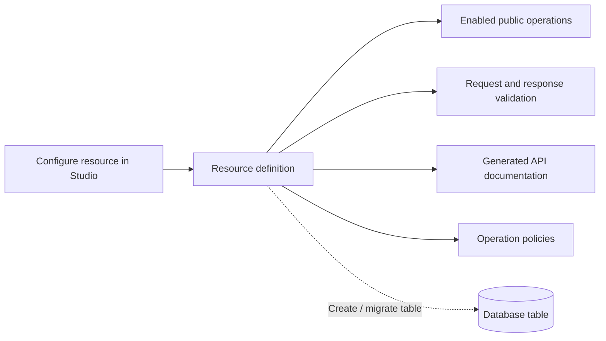

## The mental model

If you have worked with Rails, Django REST Framework, Supabase, Firestore, or a Laravel-style resource layer, a Pawabase resource will feel familiar. A resource describes application data and the supported operations around it: fields, validation, relations, access policies, events, caching, and realtime publication.

You can use a resource to create a new table or deliberately map it to an existing table. In both cases, clients see the public resource name and its enabled operations. They do not need to know the underlying table name or how Pawabase serves the route.

For example, an `orders` resource can expose public catalog-style reads to customers, owner-scoped reads for an order history, staff-only updates, an `orders.created` event for fulfillment, and realtime status changes for a tracking screen. Those behaviors belong to one cohesive product surface rather than several unrelated route handlers.

Configure resources in Studio. Application clients then call the generated public routes through the gateway. Studio's management traffic is private control-plane behavior and is not part of the application integration contract.



A Resource definition has five groups of settings, all of which this page (and its companion pages) cover in full:

| Group | Keys | What they control |
| --- | --- | --- |
| Identity | `name`, `description`, `table`, `primary_key`, `id_type` | The URL segment, the database table, the id format |
| Shape | `fields` | Validation, serialization, and (on migrate) column types |
| Access | `operations` | Which of the five HTTP methods exist at all, and who may call each one |
| Graph | `relations` | `belongs_to` / `has_many` semantics and `?expand=` behavior — see [Relations](/data/relations) |
| Behaviour | `owner_field`, `timestamps`, `events`, `realtime`, `transformer`, `cache_ttl`, `rate_limit`, `tags` | Side effects, performance, and observability |

The rest of this page follows the workflow a builder uses: configure the resource in Studio, create or migrate the table, call the public API, verify its access rules, and connect changes to automation or realtime behavior.

## Create a resource in Studio

Open the project environment you want to change, then go to **Build → Resources** and choose **New resource**.

Studio divides the editor into five sections:

| Studio section | Decisions you make |
| --- | --- |
| Details | Public name, table mapping, primary key, ID type, description |
| Fields | Stored values, types, requirements, defaults, and constraints |
| Access | Which CRUD endpoints exist and the policy for each endpoint |
| Relations | Named `belongs to` and `has many` expansions |
| Behaviour | Events, realtime, timestamps, ownership, transforms, caching, rate limits, tags |

### Details

The **Name** becomes the public path segment. A resource named `support_tickets` is served under `/rest/v1/support_tickets`.

Choose a lower-case name that starts with a letter and uses letters, numbers, and underscores. Treat it as a public API contract: changing it later changes every endpoint that clients call.

The **Table** field is optional. Leave it empty for a new resource so the table uses the resource name. Set it only when mapping a different table name, such as exposing a legacy `crm_case_records` table as the friendlier `cases` API.

The **Primary key** defaults to `id`. For a new table, keep that default unless you have a clear compatibility requirement. For an existing table, enter the actual primary-key column.

The **ID type** controls how Pawabase creates and parses new identifiers:

| Studio choice | Use when |
| --- | --- |
| Auto-increment | Compact sequential identifiers are acceptable |
| UUID | Records need non-sequential, globally unique identifiers |

Choose the identifier strategy before creating the table. Changing it later is a database migration project, not a harmless display setting.

Write a description that explains what one row represents. `Customer support conversations opened by signed-in customers` is more useful than `Tickets table`.

### Fields

Add only the fields that belong to the resource's public contract. Pawabase adds the primary key automatically and adds `created_at` and `updated_at` while timestamps are enabled.

For every field, decide:

1. what the value means;
2. which type accurately represents it;
3. whether create requests must provide it;
4. whether a safe default exists;
5. which constraints reject unusable values;
6. whether clients may write it, read it, or both;
7. whether it should be indexed or unique in the database.

Avoid fields that combine several meanings. Instead of a free-form `customer` object, model a `customer_id` relation and explicit snapshot fields only when the product needs a historical snapshot.

See [Field types](/data/field-types) and [Validation](/data/validation) for the complete field editor reference.

### Access

Every operation has an enable switch and policy picker. A disabled operation is not served. An enabled operation with **Secret keys only** is available only to trusted server callers using an appropriate secret key.

A sensible starting point for private user-owned data is:

| Operation | Enabled | Policy |
| --- | --- | --- |
| List | Yes | Record owner |
| Get | Yes | Record owner |
| Create | Yes | Signed-in users |
| Update | Yes | Record owner |
| Delete | Yes | Record owner, or leave disabled |

A public catalog normally uses:

| Operation | Enabled | Policy |
| --- | --- | --- |
| List | Yes | Public |
| Get | Yes | Public |
| Create | Yes | Staff or service-only policy |
| Update | Yes | Staff or service-only policy |
| Delete | Usually no | Staff or service-only policy if required |

Do not enable delete simply because CRUD traditionally includes it. Many products need archival, cancellation, or deactivation instead of physical deletion.

### Relations

Relations give clients named expansions without exposing raw join logic.

For a `belongs to` relation, the current resource contains the foreign-key field. An `orders` resource might have `customer_id` and a relation named `customer` pointing to `customers`.

For a `has many` relation, the target resource contains the foreign-key field. An `orders` resource can expose `items` when `order_items.order_id` points back to the order.

The relation name is the value clients pass to `expand`:

```bash
curl "$PAWABASE_URL/rest/v1/orders/ord_123?expand=customer,items" \
  -H "apikey: $PAWABASE_KEY" \
  -H "Authorization: Bearer $PAWABASE_TOKEN"
```

Relations do not automatically grant access to related data. Design and test the policies on both resources. Read [Relations](/data/relations) before exposing sensitive related records.

### Behaviour

Use **Owner field** when Pawabase should set a field to the authenticated user's id during create. The owner field must exist in the resource's fields.

Keep **Emit events** enabled when flows, subscriptions, webhooks, or integrations should react to creates, updates, and deletes.

Enable **Broadcast changes** only after deciding who may subscribe to the resource channel and whether the full change payload is appropriate for every authorized subscriber.

Keep **Timestamps** enabled for most business data. Server-maintained timestamps are useful for synchronization, audits, support investigations, and ordering.

Choose a **Transformer** when all resource responses need a supported declarative reshape. Do not rely on a transformer as the only protection for a secret field; use field visibility and authorization correctly as well.

Set **Cache responses** only for reads whose staleness and authorization behavior you understand. Start at `0`, measure a real need, and use a short TTL first.

Configure a **Rate limit** for routes that could be abused or that protect expensive database work. A rate limit reduces traffic; it does not replace policies.

Use **Tags** to keep generated API documentation navigable for larger projects.

## Save and create the table

Choose **Create resource**. This saves the definition but does not silently change the application database.

Reopen the resource and choose **Create / migrate table**. Studio reports whether the table was created or which additive changes were applied.

This separation is intentional:

```text
Save resource definition
        ↓
review API and schema intent
        ↓
Create / migrate table
        ↓
test through the public API
```

Run the migration action again after adding fields or supported constraints that must reach the table. Read [Migrations](/data/migrations) before changing a table with existing production data.

## Verify the generated surface

After saving and migrating:

1. open **Build → API Explorer**;
2. find the enabled resource operations;
3. sign in as a representative application user;
4. send a valid create request;
5. send an invalid request to verify validation;
6. list and get the record;
7. test update and delete only if enabled;
8. repeat with a user who should be denied;
9. inspect **Operate → Observability** and **Events & runs**.

The API Explorer and generated documentation reflect the selected environment. Confirm the environment switcher before concluding that an operation is missing.

## The five operations

Every Resource exposes up to five operations under `/rest/v1/<name>`. Each operation is independently enabled and independently governed by its own policy — there is no resource-level "public" or "private" switch. Nothing is reachable by default: an operation does not exist as a route until you explicitly turn it on, and turning it on always requires naming a policy (it defaults to `authenticated` if you don't set one explicitly in Studio, but it is never silently `public`).

| Operation | HTTP verb | Route | Notes |
| --- | --- | --- | --- |
| `list` | `GET` | `/rest/v1/<name>` | Filter, sort, paginate, `select`, `expand` |
| `get` | `GET` | `/rest/v1/<name>/{id}` | Single record. Supports `expand` |
| `create` | `POST` | `/rest/v1/<name>` | Body validated against the create model. Returns `201` |
| `update` | `PATCH` | `/rest/v1/<name>/{id}` | Partial update |
| `delete` | `DELETE` | `/rest/v1/<name>/{id}` | Returns `204 No Content`. Hard delete only |

An operation left disabled is not merely policy-refused: its public route does not exist. Use **Build → API Explorer** or the environment's generated API documentation to confirm which operations are available.

## list — `GET /rest/v1/<name>`

The list operation returns a paginated collection of records matching the caller's filters and the operation's policy. It accepts six query parameters — `page`, `per_page`, `sort`, `select`, `expand`, and any number of `filter[<field>]` parameters. The response always has the shape `{data, page, per_page, total}`.

```bash
curl "$GW/rest/v1/invoices?filter[status]=eq.overdue&sort=-due_on&page=1&per_page=20&expand=payments" \
  -H "apikey: $PK" -H "Authorization: Bearer $TOKEN"
```

```json
{
  "data": [
    {
      "id": 44,
      "invoice_no": "INV-202600001",
      "student_id": 12,
      "amount": 210000,
      "balance": 60000,
      "status": "overdue",
      "due_on": "2026-09-01",
      "created_at": "2026-08-01T09:00:00+00:00",
      "updated_at": "2026-09-15T11:30:00+00:00",
      "payments": [
        {"id": 91, "amount": 150000, "paid_on": "2026-08-20"}
      ]
    }
  ],
  "page": 1,
  "per_page": 20,
  "total": 7
}
```

| Parameter | Default | Meaning | Limits |
| --- | --- | --- | --- |
| `page` | `1` | 1-indexed page number | `>= 1` |
| `per_page` | `20` | Rows per page | `1`–`200` |
| `sort` | Primary key ascending | Comma-separated fields, `-` prefix for descending | Must reference a declared field or `400` |
| `select` | Every declared field | Comma-separated column projection; the primary key is always added back | — |
| `expand` | none | Comma-separated relation names | One level deep; unknown name returns `400` |
| `filter[<field>]` | none | Any number of filter parameters, ANDed | See [Filtering](/data/filtering) |

An empty result set is not an error — `{"data": [], "page": 1, "per_page": 20, "total": 0}` is a perfectly normal response for a filter that matches nothing.

`total` counts rows matching both your filters and the policy's SQL-level conditions. It comes back `null`, specifically, only when the policy could not be pushed all the way into the `WHERE` clause and had to fall back to evaluating each row individually after fetching the page — see [What "residual" means for total](#what-residual-means-for-total) below. Do not treat a `null` total as an error state in your client code; it is an expected, documented value for policies with row-level conditions the database cannot express directly.

### An unauthenticated or under-scoped caller on `list`

If the operation's policy refuses the caller outright (no row could ever satisfy it — for example, a policy requiring a specific role the caller's token doesn't carry), the request never reaches the database. It fails at the gate with `401 Unauthorized` if the caller isn't authenticated at all, or `403 Forbidden` if they are authenticated but the policy still refuses:

```json
{"error": "forbidden", "message": "policy 'school_admin' refused"}
```

## get — `GET /rest/v1/<name>/{id}`

Returns a single record with `200 OK`.

```bash
curl "$GW/rest/v1/invoices/44?expand=payments" \
  -H "apikey: $PK" -H "Authorization: Bearer $TOKEN"
```

```json
{
  "id": 44,
  "invoice_no": "INV-202600001",
  "student_id": 12,
  "amount": 210000,
  "balance": 60000,
  "status": "overdue",
  "due_on": "2026-09-01",
  "payments": [{"id": 91, "amount": 150000, "paid_on": "2026-08-20"}]
}
```

Returns `404 Not Found` — never `403` — both when the record genuinely does not exist and when the caller's `get` policy refuses it:

```json
{"error": "not_found", "message": "Not found"}
```

This is deliberate: distinguishing "you can't see this" from "this doesn't exist" would let a caller probe for the existence of records they aren't allowed to read (a guardian could learn another family's invoice numbers exist, even without seeing their contents). Refused and missing are indistinguishable on purpose.

With `id_type: "integer"`, a path segment that doesn't parse as digits (`/rest/v1/invoices/abc`) also returns `404`, not `400` — the id is coerced before the lookup, and a value that can't be coerced is treated the same as "no record has this id."

## create — `POST /rest/v1/<name>`

```bash
curl -X POST "$GW/rest/v1/invoices" \
  -H "apikey: $PK" -H "Authorization: Bearer $TOKEN" -H "Content-Type: application/json" \
  -d '{"student_id": 12, "amount": 210000, "due_on": "2026-10-01", "status": "pending"}'
```

```json
{
  "id": 57,
  "invoice_no": null,
  "student_id": 12,
  "amount": 210000,
  "balance": null,
  "status": "pending",
  "due_on": "2026-10-01",
  "created_at": "2026-09-30T08:12:04+00:00",
  "updated_at": "2026-09-30T08:12:04+00:00"
}
```

`201 Created` on success. Pawabase validates the body against the resource fields before executing the write. Unknown fields, missing required fields, and constraint violations are rejected with `422`; see [Validation](/data/validation) for the error shape and supported constraints.

**Defaults count as values.** A field with a `default` that the client omits is treated as if the client had sent the default — it participates in the created record and in the policy check that follows, not as an absent value filled in silently afterward. An *optional* field with no default that the client simply doesn't send stays absent (not `null`, not present) unless the column itself defaults something at the database layer.

**`owner_field` is stamped after validation, before the policy check.** If the resource declares `owner_field: "created_by"`, the caller's authenticated identity overwrites whatever the client sent for that field — a client cannot create a record and claim to be someone else. If the resource has an `owner_field` and the caller is not authenticated (no `user` in scope) *and* is not a service credential, the request is refused with `401` before the policy ever runs, because there is no identity to stamp:

```json
{"error": "unauthenticated", "message": "Authentication required"}
```

Because the stamp happens before the policy check, a `create` policy can safely reference `$input.created_by` (or whatever the owner field is named) and trust that it is the caller's own id, never a spoofed one.

## update — `PATCH /rest/v1/<name>/{id}`

```bash
curl -X PATCH "$GW/rest/v1/invoices/57" \
  -H "apikey: $PK" -H "Authorization: Bearer $TOKEN" -H "Content-Type: application/json" \
  -d '{"status": "paid", "balance": 0}'
```

```json
{
  "id": 57,
  "invoice_no": null,
  "student_id": 12,
  "amount": 210000,
  "balance": 0,
  "status": "paid",
  "due_on": "2026-10-01",
  "created_at": "2026-09-30T08:12:04+00:00",
  "updated_at": "2026-09-30T09:05:11+00:00"
}
```

`PATCH` is a partial update: only fields present in the body are validated and written. An explicit `null` requests a null value when the field permits it; an omitted key is left unchanged. Every field is optional in a patch even when it is required during create.

If `owner_field` is set, the client cannot change it through an update — the incoming value for that field is dropped from the patch before it reaches the policy or the database, regardless of what was sent.

**The 404/403 split.** If the record does not exist at all, the response is `404` immediately, before the policy runs (there is nothing to check a policy against). If the record exists but the policy refuses the update, the status code depends on whether the caller is authenticated:

- Authenticated caller, policy refuses → `403 Forbidden`
- Unauthenticated caller (no `user` in scope), policy refuses → `404 Not Found`

```json
{"error": "not_found", "message": "policy 'family_access' refused"}
```

The reasoning mirrors `get`: an anonymous caller shouldn't be able to distinguish "exists but you can't touch it" from "doesn't exist," while a signed-in caller who is refused gets the more informative `403` because they're already identified — there's no anonymity to protect by hiding existence from them.

The policy for `update` receives both `record` (the row as it existed *before* the change) and `input` (the submitted patch), which makes transition-aware policies possible — for example, refusing a patch that tries to move `status` from `"paid"` back to `"pending"`.

## delete — `DELETE /rest/v1/<name>/{id}`

```bash
curl -X DELETE "$GW/rest/v1/invoices/57" \
  -H "apikey: $PK" -H "Authorization: Bearer $TOKEN"
```

`204 No Content` on success — no response body. The same 404-before-policy, then 403/404-split-by-authentication logic as `update` applies: missing record is always `404`; a policy refusal is `403` for an authenticated caller and `404` for an anonymous one. Deletes are hard deletes — there is no soft-delete flag built into the platform. Model soft delete yourself with a `status` or `deleted_at` field and a policy that filters on it.

## Example Studio configuration: invoices

For a school billing product, configure an `invoices` resource in Studio with these details:

| Setting | Value |
| --- | --- |
| Name | `invoices` |
| Description | `Tuition invoices raised against a student` |
| Primary key | `id` |
| ID type | Auto-increment |
| Timestamps | Enabled |
| Emit events | Enabled |
| Broadcast changes | Disabled initially |

Add `student_id`, `invoice_no`, `amount`, `balance`, `status`, and `due_on` through the field editor. Use allowed values for status and non-negative minimums for monetary amounts stored in minor units.

Enable list and get with the family-access policy. Enable create and update for school administrators. Leave delete disabled if invoices must be retained for audit, and model cancellation with status instead.

Add a `student` belongs-to relation through `student_id` and a `payments` has-many relation through the target resource's `invoice_id` field.

## id_type: integer or uuid

Exactly two options exist, enforced at the request-model level with `Literal["integer", "uuid"]` — anything else is refused when you save the definition, with `422 Unprocessable Entity`, before it is ever stored. There is no third option and no custom id strategy; if you need something else (a slug, a composite key, an externally-assigned id), declare it as an ordinary field and set your own `primary_key` to point at it instead of relying on `id_type`.

| | `integer` (default) | `uuid` |
| --- | --- | --- |
| How ids are assigned | Database auto-increment | Server generates a v4 UUID on insert |
| Shape in URLs | `44` | `a1b2c3d4-...` |
| Sequential / guessable | Yes | No |
| Column type on migrate | `INTEGER` / `BIGINT` | `UUID` (Postgres) or `VARCHAR(36)` |
| Client may set the id on create | No — server-assigned always | No — server-generated always, even if the client sends one |

Switching `id_type` on an existing Resource does not retroactively convert the column or existing rows — it only changes what new inserts do and how the platform coerces path parameters. Changing it on a Resource with existing data of the other type will produce a broken table; treat `id_type` as fixed at Resource creation time.

## table and primary_key

`table` defaults to `name` and only needs setting when you want the API name and the database table name to differ — the standard technique for [exposing an existing table](#exposing-an-existing-table) under a friendlier API name. `primary_key` defaults to `id`. Both are validated against `^[A-Za-z_][A-Za-z0-9_]{0,62}$` and are **never exposed to API clients** — a client interacting with `/rest/v1/invoices` has no way to discover, from the API alone, that the underlying table is actually called `tbl_invoices_legacy`, nor that the primary key column is `invoice_pk`.

## Exposing an existing table

Three steps:

1. Set `table` to the existing table's name and `primary_key` to its key column.
2. Add `fields` matching the columns you want to expose — declare only the columns you want visible; anything you don't declare is invisible to API clients even though it exists in the database.
3. Skip `migrate` — that operation is for creating or extending tables the platform owns; a table with a schema managed by another process should never be handed to it.

This is the standard way to give an API surface to tables populated by ETL jobs, legacy applications, or data-warehouse exports, without duplicating or transforming the underlying data. Because `table` and `primary_key` are hidden from clients, you can also rename the underlying table later (a maintenance operation) without breaking any API consumer, as long as you update the definition to point at the new name in the same deploy.

## Behaviour flags

| Flag | Default | Effect |
| --- | --- | --- |
| `owner_field` | `null` | Stamps the caller's identity onto this column on every `create`; stripped from client input on `update` |
| `timestamps` | `true` | Maintains `created_at` and `updated_at`, both server-set, never client-writable |
| `events` | `true` | Emits `<name>.created` / `.updated` / `.deleted` — see [Resource events](/data/resource-events) |
| `realtime` | `false` | Publishes the same changes to the `resource:<name>` channel |
| `transformer` | `null` | Reshapes every response — see [Transformers](/data/transformers) |
| `cache_ttl` | `0` (off) | Caches `list` and `get` responses — see [Caching](/data/caching) |
| `rate_limit` | `{}` (off) | Caps requests per caller per window |
| `tags` | `[]` | OpenAPI grouping only; no runtime effect |

## What "residual" means for total

Every enabled operation's policy is evaluated in two parts. Conditions that don't depend on the specific row being read (role checks, scope checks, static claims) are decided once, before any query runs, and — where the policy engine can express them as SQL — pushed into the `WHERE` clause alongside your filters. Conditions that genuinely depend on the row's own data in a way the engine can't translate to SQL are left as a **residual**: a per-row check applied in the application after the page is fetched from the database.

When a residual is active on `list`, the platform fetches the page, evaluates the residual against each row, drops the ones that fail, and — because that filtering happens after the count query already ran — sets `total: null` rather than reporting a number that would be wrong for anyone using it to compute a page count. This is not a bug or a missing feature; it's the honest answer when an exact total can't be computed without evaluating every row in the table.

## What you get for free

Validation before policies and before SQL. Typed responses and automatic OpenAPI entries for every enabled operation. Server-maintained timestamps. Events carrying the full post-write record. Cache invalidation on every write, scoped by tag. Realtime publication when enabled. Rate limiting enforced consistently across every API instance (backed by Redis when configured). Consistent, machine-parseable error shapes for every failure mode. Policy pushdown into SQL wherever the condition allows it. None of this is opt-in boilerplate you assemble — it is simply what defining a Resource means.

## Resources vs. custom routes

Resources cover CRUD-with-rules: a client sends a row (or asks for rows), the system validates it, checks a policy, and reads or writes exactly one table. [Custom routes](/data/custom-routes) cover workflows: reading or writing more than one table in a single request, calling external services, walking decision trees, or returning a response shaped nothing like a record. If your operation's honest one-line description is "a client sends a row, the system stores it, the system returns it," it's a Resource operation. If it needs "and then," it's a custom route.

## Resources vs. the database console

Studio's database console is an operator-only, read-only inspection tool. It does not become an application endpoint and does not replace resource operations. Use it to investigate records and query behavior; make supported application changes through the resource API, flows, or a deliberate migration so validation, policies, events, and operational records remain coherent.

## Complete worked example: school fees

A `students` / `invoices` / `payments` trio demonstrating `belongs_to` and `has_many` relationships, an owner-scoped read policy, and a write-restricted admin policy. A guardian can list and read only their own children's invoices; a bursar can do everything.

In Studio, create `students` with `first_name`, `last_name`, `class_id`, and `guardian_id` fields. Make the name fields required short text with an appropriate maximum length. Use integer fields for the related class and guardian identifiers when those resources use auto-incrementing ids.

Enable list and get with the named `family_access` policy. Enable create and update with `school_admin`. Decide whether deletion is permitted by the school's retention obligations instead of enabling it by default.

Add an `invoices` has-many relation. Choose `invoices` as the target resource and `student_id` as the foreign key on that target.

Create `invoices` with `student_id`, `amount`, `balance`, `status`, and `due_on`. Store monetary values in minor integer units. Give status the allowed values `pending`, `overdue`, and `paid`, with `pending` as its default.

Add a `student` belongs-to relation using the invoice's `student_id`, and a `payments` has-many relation using the payment resource's `invoice_id`.

Apply `family_access` to list and get, and `school_admin` to write operations. Enable events. Enable realtime only after designing a channel rule appropriate for financial records.

Create and migrate each resource in dependency order, then test as a guardian from one family, a guardian from another family, and a bursar. A guardian must never receive another family's invoice through direct reads, lists, or relation expansion.

## Complete worked example: commerce catalog

A `products` / `product_variants` pair demonstrating a `has_many` relation, a `write_only` internal cost field that a shopper's response never contains, and a transformer that reshapes the public response — full field-by-field transformer coverage is in [Transformers](/data/transformers).

In Studio, create `products` with UUID identifiers. Add required `title` and unique `slug` fields, a long-text description, non-negative `price_cents`, write-only `cost_cents`, and an `active` boolean that defaults to true.

Enable list and get with the public policy. Use a staff policy for create and update. Prefer deactivation to deletion when orders or analytics refer to historical products.

Create `product_variants` with a required `product_id` and the option fields your catalog uses, such as SKU, size, color, price override, and stock status. Add a `variants` has-many relation on products using the target's `product_id` field.

Marking `cost_cents` write-only keeps it out of resource responses. A transformer can additionally convert response keys to the client application's desired case, but it is not the authorization boundary.

Start without caching. After measuring catalog traffic and confirming how quickly price and availability changes must appear, configure a short cache TTL and test invalidation after writes.

## Definition versions and promotion

Saving a resource creates a new environment definition version. Check the environment overview for definition problems, then test through the public gateway.

When the resource is ready, use the project **Promote…** workflow to copy selected definitions to staging. Promotion does not migrate the target table or copy records, users, keys, or secrets. Open the resource in staging, run **Create / migrate table**, and repeat the authorization and compatibility tests before promoting to production.

## Complete workflow: marketplace orders

This example shows how a resource participates in a larger backend without trying to make one CRUD operation do everything.

The product requirements are:

- a buyer creates an order;
- the buyer can read their own orders;
- support staff can read orders for investigations;
- only trusted fulfillment behavior changes operational status;
- creating an order starts asynchronous fulfillment;
- the buyer sees live status changes;
- payment and warehouse credentials never reach the client.

### Model the order

Create an `orders` resource in **Build → Resources**.

Use a UUID identifier because order ids appear in browser URLs, email links, and partner systems. Enable timestamps and events.

Add fields:

| Field | Type | Required | Default | Purpose |
| --- | --- | --- | --- | --- |
| `buyer_id` | Short text | No | — | Server-controlled owner field |
| `status` | Short text | No | `pending` | Order lifecycle |
| `currency` | Short text | Yes | — | ISO-style currency code |
| `subtotal_minor` | Integer | Yes | — | Subtotal in minor units |
| `shipping_minor` | Integer | Yes | `0` | Shipping amount in minor units |
| `tax_minor` | Integer | Yes | `0` | Tax amount in minor units |
| `total_minor` | Integer | Yes | — | Final total in minor units |
| `shipping_address` | Object or schema reference | Yes | — | Delivery destination snapshot |
| `payment_reference` | Short text | No | — | Provider reference, not raw payment data |
| `failure_reason` | Long text | No | — | Operator-facing failure explanation |

Configure allowed status values that match the product's actual lifecycle, for example:

```text
pending
payment_processing
paid
fulfillment_queued
shipped
delivered
cancelled
failed
```

Do not store card numbers, security codes, or raw provider credentials in an order resource. Store only the provider reference and business state needed by your application.

### Establish ownership

Choose `buyer_id` as **Owner field**.

Enable create for **Signed-in users**. Pawabase stamps the authenticated user's id into `buyer_id`, replacing any value the client attempts to send.

Create or select a named policy for reads that allows either:

- the record owner; or
- a user with the support permission.

Use that policy for list and get.

For update, avoid giving buyers unrestricted owner updates if fields such as `status`, `total_minor`, or `payment_reference` must be controlled by trusted backend work. Safer choices include:

- leave the general update operation secret-key-only;
- expose a narrowly validated custom route for buyer cancellation;
- use a flow to check the current status before applying a transition;
- keep address edits in a separate route with a clear cutoff.

Leave delete disabled. Orders normally need retention for support, finance, and audit. Model cancellation as a status transition.

### Model line items

Create an `order_items` resource with:

| Field | Type | Required | Purpose |
| --- | --- | --- | --- |
| `order_id` | UUID | Yes | Parent order |
| `product_id` | UUID | Yes | Product reference |
| `product_name` | Short text | Yes | Historical display snapshot |
| `quantity` | Integer | Yes | Units purchased |
| `unit_price_minor` | Integer | Yes | Historical unit price |
| `line_total_minor` | Integer | Yes | Quantity times price |

Add an `items` has-many relation to `orders`, using `order_items.order_id` as the foreign key on the target resource.

Add an `order` belongs-to relation to `order_items`, using its own `order_id` field.

Apply ownership or a policy that checks the related order's tenancy through data designed for efficient authorization. If line items need the same buyer boundary frequently, storing `buyer_id` on line items as a deliberate denormalization can make authorization simpler and faster, provided trusted backend behavior maintains it.

### Create through a business route

A production checkout normally needs more than inserting one order row:

```text
POST /rest/v1/checkout
      ↓
validate cart and address
      ↓
load current product prices
      ↓
calculate subtotal, tax, shipping, total
      ↓
create order and line items
      ↓
emit order.created
      ↓
queue payment or fulfillment
      ↓
return accepted order
```

Implement that behavior with a [custom route](/data/custom-routes) backed by a flow. Keep the resource's direct create operation disabled if clients must never supply calculated totals themselves.

This illustrates an important design rule:

> Use a resource operation for a direct, validated record operation. Use a custom route and flow when the server must coordinate several records, calculations, or external systems.

### Read from the application

Fetch the buyer's newest orders:

```bash
curl "$PAWABASE_URL/rest/v1/orders?sort=-created_at&page=1&per_page=20" \
  -H "apikey: $PAWABASE_KEY" \
  -H "Authorization: Bearer $ACCESS_TOKEN"
```

Fetch one order with items:

```bash
curl "$PAWABASE_URL/rest/v1/orders/$ORDER_ID?expand=items" \
  -H "apikey: $PAWABASE_KEY" \
  -H "Authorization: Bearer $ACCESS_TOKEN"
```

The response should include only data the buyer is allowed to read. Use read-only fields, write-only fields, and transformers for supported shape control, but keep the policy as the authorization boundary.

### React to creation

With **Emit events** enabled, a successful create emits `orders.created`.

Subscribe a fulfillment flow to the event:

```text
orders.created
      ↓
reserve inventory
      ↓
queue payment processing
      ↓
update order state
      ↓
send confirmation
      ↓
notify warehouse webhook
```

Design every side effect to tolerate retries. Use stable business identifiers when calling payment or fulfillment providers, and record provider results on the order or a related attempt resource.

### Publish status safely

Enable **Broadcast changes** only after designing the realtime boundary.

The shared `resource:orders` channel may be too broad for private buyer data. Review [Resource change broadcasts](/realtime/resource-changes) and [Channel rules](/realtime/channel-rules). Depending on the application, publish a smaller status message to a user- or organization-specific channel from a flow instead of broadcasting full order records to one shared resource channel.

### Test the order boundary

Test at least these actors:

| Actor | Expected result |
| --- | --- |
| Anonymous caller | Cannot create or read orders |
| Buyer A | Can read Buyer A's orders |
| Buyer B | Cannot discover Buyer A's order |
| Support agent | Can read orders when the named support policy permits it |
| Browser using publishable key only | Policies still apply |
| Trusted server with secret key | Can perform explicitly intended privileged work |

Test these states:

- empty order list;
- order with one item;
- order with many items;
- invalid currency;
- negative amount;
- status value outside the allowed list;
- invalid relation id;
- attempt to forge `buyer_id`;
- attempt to update a protected status;
- missing related record during expansion;
- repeated checkout request;
- payment provider timeout;
- fulfillment job retry;
- buyer reconnecting after missing realtime messages.

### Observe and operate

Use **Operate → Events & runs** to trace the order event and flow. Use **Jobs & queues** for queued payment or fulfillment work. Use **Observability** for request failures and latency. Keep an explicit business state on the order so support can distinguish `pending`, `processing`, `failed`, and `completed` without interpreting infrastructure logs.

## Complete workflow: internal approval requests

Resources also work for internal company systems. Consider a purchase-request application in which employees submit requests, managers approve within a threshold, and finance reviews larger purchases.

Create `purchase_requests` with:

| Field | Type | Required | Notes |
| --- | --- | --- | --- |
| `requester_id` | Short text | No | Owner field |
| `department_id` | Short text | Yes | Tenant or department boundary |
| `description` | Long text | Yes | Business justification |
| `amount_minor` | Integer | Yes | Store currency amounts in minor units |
| `currency` | Short text | Yes | Currency code |
| `status` | Short text | No | Default `draft` |
| `submitted_at` | Date and time | No | Set during submission workflow |
| `approved_by` | Short text | No | Trusted workflow output |
| `approved_at` | Date and time | No | Trusted workflow output |
| `rejection_reason` | Long text | No | Required by rejection route or flow |

Choose `requester_id` as the owner field.

Do not expose one unrestricted update operation for every lifecycle action. A draft edit, submission, approval, and rejection have different actors, validation, and allowed transitions.

Use the resource update operation for safe draft edits if appropriate. Add custom routes such as:

```text
POST /rest/v1/purchase-requests/{id}/submit
POST /rest/v1/purchase-requests/{id}/approve
POST /rest/v1/purchase-requests/{id}/reject
```

Back each route with a policy and flow that understands the action.

An approval flow might be:

```text
load purchase request
      ↓
require current status = submitted
      ↓
check caller's department and approval permission
      ↓
branch on amount threshold
      ├── manager approval sufficient
      └── finance approval required
      ↓
update approved_by, approved_at, status
      ↓
emit purchase_request.approved
      ↓
notify requester
```

The durable resource row gives every participant one authoritative state. The custom routes and flows enforce how that state may change.

## Complete workflow: support tickets

For a support system, create `tickets` with an owner field, customer-visible content, internal assignment fields, priority, and state.

Separate customer messages from the ticket record in a `ticket_messages` resource. This avoids repeatedly rewriting a growing array and lets each message carry its own author, timestamp, and visibility.

Suggested policies:

| Operation | Tickets | Ticket messages |
| --- | --- | --- |
| List | Customer owner or support role | Customer owner or support role |
| Get | Customer owner or support role | Customer owner or support role |
| Create | Signed-in customer | Signed-in participant through a route |
| Update | Support role, with a separate customer-close route | Usually disabled for immutable messages |
| Delete | Disabled | Disabled |

Use events to assign queues, notify agents, calculate service-level deadlines, and send outbound updates. Use a schedule to find tickets nearing a deadline. Use realtime to update an agent console, but authorize its channel separately.

The ticket resource remains the source of truth even when notifications fail. A customer can reload the ticket and see its actual status instead of relying on the last email or realtime message.

## Client integration patterns

### Centralize request construction

Create one small client wrapper that always sends the gateway URL, publishable key, bearer token when present, and JSON headers.

```js
export async function pawabase(path, { token, method = "GET", body, signal } = {}) {
  const response = await fetch(`${PAWABASE_URL}${path}`, {
    method,
    signal,
    headers: {
      apikey: PAWABASE_PUBLISHABLE_KEY,
      ...(token ? { Authorization: `Bearer ${token}` } : {}),
      ...(body === undefined ? {} : { "Content-Type": "application/json" }),
    },
    body: body === undefined ? undefined : JSON.stringify(body),
  });

  const result = response.status === 204 ? null : await response.json();
  if (!response.ok) {
    const error = new Error(result?.detail?.message ?? result?.detail ?? "Request failed");
    error.status = response.status;
    error.body = result;
    throw error;
  }
  return result;
}
```

Use it for resource calls:

```js
const page = await pawabase("/rest/v1/tasks?sort=-created_at&per_page=20", {
  token: session.access_token,
});

const created = await pawabase("/rest/v1/tasks", {
  token: session.access_token,
  method: "POST",
  body: { title: "Prepare launch checklist" },
});

const updated = await pawabase(`/rest/v1/tasks/${created.id}`, {
  token: session.access_token,
  method: "PATCH",
  body: { completed: true },
});
```

### Do not hide authorization errors

Handle status codes according to their meaning:

| Status | Client behavior |
| --- | --- |
| `400` | Correct query syntax or unsupported filter/sort/relation |
| `401` | Re-establish or refresh the user session; verify environment key |
| `403` | Show an access-aware message; do not retry unchanged credentials |
| `404` | Show not found without revealing whether a private record exists |
| `409` | Resolve uniqueness or state conflict |
| `422` | Map validation details to the form |
| `429` | Respect retry guidance and slow down |
| `5xx` | Retry safe reads with backoff; reconcile uncertain writes |

Never turn every failure into `Something went wrong`. Validation and authorization errors are part of the product contract and deserve deliberate user experiences.

### Keep list state in the URL

For dashboards and internal tools, store page, sort, and filters in the browser URL. This makes views shareable and prevents a refresh from losing the user's place.

```js
const query = new URLSearchParams({
  page: String(page),
  per_page: "50",
  sort: "-updated_at",
});
query.set("filter[status]", "eq.open");

const tickets = await pawabase(`/rest/v1/tickets?${query}`, { token });
```

Allowlist sort and filter controls in the client rather than passing arbitrary user-generated field names to the API.

### Reconcile after realtime messages

A realtime resource message is a signal that state changed. It is not a replacement for the resource API.

When a message arrives:

1. verify the message belongs to the current screen or tenant;
2. update a cached row only when the payload contract is sufficient;
3. otherwise refetch the affected record or page;
4. refetch after reconnect because offline messages may have been missed;
5. continue enforcing policies on every resource request.

## Production design checklist

### Data contract

- Each field has one clear meaning.
- Currency uses minor integer units where precision matters.
- Time fields have a documented timezone and lifecycle meaning.
- Status values represent real product states.
- Required fields are truly available at create time.
- Defaults are safe for every caller.
- Read-only and write-only choices are intentional.
- Unique constraints match business uniqueness.
- Indexed fields match common filters, sorts, relations, and policy boundaries.
- Large unbounded arrays are modeled as related resources when appropriate.

### Access

- Every enabled operation has a reviewed policy.
- Anonymous, authenticated, owner, staff, and service callers were tested separately.
- Owner fields are server-controlled.
- Tenant or organization boundaries are represented in data that policies can evaluate.
- Delete is disabled unless physical deletion is a real requirement.
- Secret keys are absent from browsers, mobile apps, and client logs.
- Related resources cannot be reached through expansion as an authorization side door.
- Realtime channel access was reviewed independently from REST access.

### Lifecycle

- Complex transitions use routes and flows instead of unrestricted patch calls.
- Side effects are event-driven where decoupling is useful.
- Queued work is safe to retry.
- External provider identifiers are stored for reconciliation.
- Failed and in-progress states are visible in durable business data.
- Events do not contain secrets or unnecessary personal data.
- Realtime is treated as a notification path, not the sole source of truth.

### Performance

- Default page sizes are reasonable.
- Clients never request unbounded lists.
- Common filters and sorts are indexed.
- Expansions are limited to what the screen needs.
- Caching is enabled only with an explicit staleness decision.
- Rate limits reflect route cost and abuse risk.
- Residual policy behavior and nullable totals are understood.
- Production-like data volume is tested in staging.

### Change management

- Schema changes start in development.
- Existing records were considered before adding required fields.
- Additive compatibility is preferred for deployed clients.
- The target environment's table migration is a separate checklist step.
- Promotion selection includes every referenced policy, schema, transformer, and relation target.
- Production keys, users, secrets, and records are never assumed to move with definitions.
- Rollback or forward-fix steps are documented.
- Important reads and writes are smoke-tested after promotion.

## Operational runbook

When resource requests begin failing in production, work from the public boundary inward:

1. confirm the gateway health check;
2. confirm the application is using the production URL;
3. identify the API-key prefix and verify it is active;
4. capture the request id if the response provides one;
5. check whether failures affect one user, one role, or everyone;
6. separate `401`, `403`, `404`, `422`, `429`, and `5xx` responses;
7. reproduce with a safe test account in API Explorer;
8. inspect the active resource definition and operation policy;
9. confirm the table migration exists in this environment;
10. inspect Observability and related event or flow records;
11. compare the current definition version with the last known good release;
12. avoid weakening the policy merely to restore traffic.

For a validation spike, compare rejected fields with a recently promoted schema change. For empty lists, check environment selection and policy filtering before assuming records were deleted. For latency, remove unnecessary expansions and inspect query shapes before enabling a large cache TTL.

## Resource design patterns

The following patterns are starting points.

Adapt names, policies, and lifecycles to your product.

### Personal workspace data

Use this pattern for notes, saved searches, drafts, preferences, and private lists.

Create an owner field such as `user_id`.

Configure it as the resource's **Owner field**.

Enable create for signed-in users.

Use the owner policy for list, get, update, and delete.

Test with two users.

Confirm the second user receives no rows from list.

Confirm the second user cannot fetch a known id.

Confirm the client cannot forge `user_id` during create.

Confirm the client cannot transfer ownership during update.

Consider disabling delete when retention matters.

Use a status or archive timestamp when recovery matters.

### Organization-scoped SaaS data

Use this pattern for projects, tasks, documents, invoices, and settings shared by a customer organization.

Add an `organization_id` field.

Populate it through trusted onboarding or a controlled route.

Write a policy that compares the record organization with the authenticated organization context.

Combine the organization boundary with roles or permissions for write actions.

Keep the organization field indexed.

Do not trust an arbitrary organization id sent by the browser.

Test organization switching through session refresh if the application supports it.

Test a user who belongs to two organizations.

Test a user removed from the organization.

Test stale access tokens according to the session model.

Test list totals and pagination within one organization.

Test relations for cross-organization leakage.

### Public catalog with protected administration

Use this pattern for products, published articles, public locations, and service directories.

Enable list and get with the public policy.

Require a staff permission for create and update.

Leave delete disabled unless the product truly removes public records.

Add an `active` or `publication_status` field.

Use policy conditions to expose only published records.

Index publication status and common sort fields.

Do not expose internal cost, review notes, or supplier credentials.

Use read-only or write-only behavior as appropriate.

Use a transformer only for supported response shaping.

Use short caching only after verifying invalidation and staleness requirements.

Test as anonymous, customer, editor, and administrator.

### Append-only business records

Use this pattern for ledger entries, audit-like business events, immutable messages, and finalized submissions.

Enable create through a trusted route or service.

Enable list and get with narrow policies.

Disable update.

Disable delete.

Store correction entries rather than rewriting history.

Include a stable external id for reconciliation.

Use a unique constraint to prevent duplicate imports.

Store the actor and event time explicitly when they differ from record creation time.

Document ordering guarantees.

Test retry and duplicate delivery behavior.

### Moderated content

Use this pattern for posts, listings, comments, and community submissions.

Store an owner field.

Store a moderation status.

Allow owners to create drafts.

Allow owners to edit only permitted states.

Use a custom submit route for draft-to-review transition.

Use a staff-only approve or reject route.

Expose published reads through a public policy.

Keep internal moderation notes off the public response.

Emit an event when content enters review.

Queue slow external moderation work.

Keep a durable failed state for moderation errors.

Test owner edits after approval according to the product rules.

### Operational state machine

Use this pattern for shipments, payments, claims, applications, and approvals.

Store the current business status.

Store timestamps for important transitions.

Store provider references.

Do not expose unrestricted status patches to the browser.

Create action-specific routes.

Validate the current state before each transition.

Make transitions idempotent.

Emit domain events after successful transitions.

Use queued work for external calls.

Record failure reasons safe for operators.

Separate customer-visible messages from sensitive provider errors.

Test every allowed transition.

Test every forbidden transition.

Test a repeated request.

Test an external timeout.

Test recovery after a partial failure.

### Imported reference data

Use this pattern for exchange rates, location directories, provider catalogs, and data synchronized from another system.

Map the resource to the maintained table only when the schema is compatible.

Expose only declared fields.

Keep public operations read-only.

Use service credentials for the importer.

Store a source identifier.

Store source update time separately from Pawabase timestamps when needed.

Use unique constraints for source keys.

Define what happens when the source removes an item.

Avoid automatic destructive migration of externally managed tables.

Test a representative import before enabling public traffic.

## Operation test catalog

Run these tests for each enabled operation.

Automate the important cases in your application test suite.

### List tests

- No records returns an empty page.

- One record returns one item and the correct total.

- Default page is `1`.

- Default `per_page` is `20`.

- `per_page=1` returns at most one row.

- `per_page=200` is accepted.

- A value above the maximum is rejected.

- `page=0` is rejected.

- Ascending sort is stable enough for the interface.

- Descending sort uses the `-` prefix.

- Multiple sort fields behave as intended.

- Unknown sort fields are rejected.

- Equality filters return expected rows.

- Range filters respect field types.

- Null filters distinguish null from absent input.

- Multiple filters combine with AND semantics.

- `select` returns the requested fields and primary key.

- Unknown selected fields are rejected.

- Named expansions return authorized related records.

- Unknown expansions are rejected.

- Related read policies are enforced.

- Anonymous callers see only public rows.

- Owners see only their rows.

- Organization members see only their organization's rows.

- Staff access matches the named policy.

- A scoped key cannot exceed its routes or scopes.

- A residual policy produces the documented nullable total.

- Cached results never cross caller boundaries.

### Get tests

- Existing authorized id returns `200`.

- Missing id returns `404`.

- Unauthorized id does not reveal private existence.

- Invalid integer id returns `404`.

- UUID ids round-trip unchanged.

- Expansion enforces target-resource access.

- Transformer output matches the public contract.

- Write-only fields are absent.

- Timestamps have the expected format.

- The response works with the oldest supported client.

### Create tests

- Minimal valid input returns `201`.

- Complete valid input returns `201`.

- Missing required input returns `422`.

- Unknown input returns `422`.

- Wrong scalar type returns `422`.

- Invalid nested object returns `422`.

- Invalid array item returns `422`.

- Too-short text returns `422`.

- Too-long text returns `422`.

- Pattern mismatch returns `422`.

- Number below minimum returns `422`.

- Number above maximum returns `422`.

- Value outside the allowed list returns `422`.

- Invalid email returns `422`.

- Invalid URL returns `422`.

- Invalid date returns `422`.

- Invalid datetime returns `422`.

- Invalid UUID returns `422`.

- Read-only input is rejected or ignored according to the documented contract.

- Default values appear as expected.

- Owner id is server-assigned.

- Primary key is server-assigned.

- Timestamps are server-assigned.

- Duplicate unique value returns a conflict-style error.

- Create policy rejects the wrong actor.

- Successful create emits the expected event when enabled.

- Successful create broadcasts only when realtime is enabled.

- A repeated business request does not produce unwanted duplicates.

### Update tests

- One-field patch changes only that field.

- Omitted fields remain unchanged.

- Explicit null works only for nullable fields.

- Unknown input returns `422`.

- Invalid field value returns `422`.

- Primary key cannot be changed.

- Owner field cannot be transferred by the client.

- Timestamps cannot be forged.

- Update policy sees the existing record.

- Update policy sees submitted input where supported.

- Forbidden state transition is rejected.

- Authorized state transition succeeds.

- Missing record returns `404`.

- Non-owner cannot update an owner's record.

- Successful update changes `updated_at`.

- Successful update emits an event when enabled.

- Successful update invalidates affected cached reads.

- Successful update publishes the expected realtime change when enabled.

### Delete tests

- Authorized delete returns `204`.

- The response has no JSON body.

- Missing record returns `404`.

- Unauthorized caller cannot confirm private existence.

- Related-record behavior matches the database design.

- Required retention rules are not bypassed.

- Delete event is emitted when enabled.

- Cached reads are invalidated.

- Realtime change is published when enabled.

- A second delete receives the expected missing response.

## API review worksheet

Complete this worksheet before exposing a new resource.

### Identity

- Public resource name:

- Human-readable description:

- Underlying table:

- Primary key field:

- Identifier type:

- Owning team:

- Data classification:

- Retention requirement:

### Fields

- Required at create:

- Optional at create:

- Server-maintained:

- Read-only:

- Write-only:

- Unique:

- Indexed:

- Personally identifiable:

- Financially sensitive:

- Derived rather than stored:

### Operations

- List enabled:

- List policy:

- Get enabled:

- Get policy:

- Create enabled:

- Create policy:

- Update enabled:

- Update policy:

- Delete enabled:

- Delete policy:

### Relationships

- Belongs-to relations:

- Has-many relations:

- Target read policies reviewed:

- Cross-tenant expansion tested:

- Expected maximum child count:

### Behavior

- Owner field:

- Timestamps:

- Events:

- Realtime:

- Transformer:

- Cache TTL:

- Rate limit:

- API tags:

### Operations and release

- Development migration complete:

- Staging migration complete:

- Representative data seeded:

- Negative authorization tests complete:

- Old client compatibility checked:

- Observability checked:

- Event consumers checked:

- Realtime rules checked:

- Rollback or forward-fix documented:

- Production owner identified:

## Common resource mistakes

### Using a public policy during development

A public policy can hide missing authentication work.

Use the intended production boundary from the beginning.

Create test users instead of temporarily publishing private data.

### Treating validation as authorization

Validation decides whether input has an acceptable shape.

It does not decide whether the caller may act.

Use operation policies for authorization.

### Treating a transformer as authorization

A transformer changes supported response fields.

It is not the primary record-access boundary.

Use policies to prevent unauthorized reads.

### Sending a secret key from a browser

Secret keys bypass policies.

They belong only in trusted server environments.

Use a publishable key plus a user session in browsers and mobile apps.

### Allowing direct status patches

Complex state changes often need transition validation and side effects.

Use action-specific routes and flows.

### Adding a required field without a migration plan

Existing rows do not automatically acquire a meaningful value.

Prefer an additive nullable field, backfill, then tighten the contract.

### Assuming promotion migrates tables

Promotion copies definitions.

Run **Create / migrate table** in the target environment.

### Assuming promotion copies data or credentials

Users, records, keys, and secrets stay environment-specific.

Configure and test them separately.

### Overusing expansions

Large relation expansions can produce expensive responses.

Request only what the screen needs.

Paginate child collections separately when they can grow without bound.

### Relying on realtime as durable state

Clients disconnect.

Messages can be missed.

Refetch resources after reconnect and for authoritative state.

### Hiding every backend error

Clients need distinct handling for authentication, authorization, validation, throttling, and availability.

Preserve status and structured error details in the application client layer.

### Modeling unrelated concepts in one resource

A resource should represent one durable business concept.

Split unrelated lifecycles into related resources.

### Creating one resource per customer

Multi-tenant products usually need one shared resource with a tenant field and policy.

Use separate projects only for a real isolation or operational requirement.

### Deleting instead of archiving

Physical deletion may break audits, finance, support, or relations.

Choose archival or cancellation when the business record must remain explainable.

## Troubleshooting

<AccordionGroup>
<Accordion title="A route returns 404 from the router itself, not a policy 404">
Check that the operation is enabled. A disabled operation has no public route. Confirm the path in **Build → API Explorer** for the same environment your key selects.
</Accordion>
<Accordion title="The API still behaves like the old definition right after a save">
Confirm the save succeeded, the environment overview shows no definition problem, and the request uses that environment's key. If response caching is enabled, see [Caching](/data/caching).
</Accordion>
<Accordion title="create returns 201 but a field I sent is missing from the response">
Either the field isn't declared in `fields` at all (check for a typo), or it's `write_only: true` and is intentionally excluded from every read model.
</Accordion>
<Accordion title="total is null on a list response">
A residual policy is active for this caller — see [What residual means for total](#what-residual-means-for-total). This is expected behavior, not an error.
</Accordion>
<Accordion title="A field I marked required is being accepted as missing">
required only applies in create mode. On update every field is optional by design (PATCH is a partial update); required has no effect there.
</Accordion>
<Accordion title="An update to a nonexistent record returns 404 even though I have full admin rights">
Correct — the existence check runs before the policy check on both update and delete. There is no record to evaluate a policy against, so it's always 404 regardless of who's asking.
</Accordion>
</AccordionGroup>

## FAQ

<AccordionGroup>
<Accordion title="Can a resource have more than five operations?">
No — `list`, `get`, `create`, `update`, `delete` is the complete, fixed set. Anything else is a custom route.
</Accordion>
<Accordion title="Can I rename a resource in place?">
Not in place. Create a new resource with `table` pointing at the existing table if you want to keep the data under a new API name.
</Accordion>
<Accordion title="Does deleting a resource definition delete the table?">
No. The table and its rows are left untouched; only the definition (and therefore the API surface) disappears.
</Accordion>
<Accordion title="Do resources support soft delete as a built-in flag?">
No. Model it yourself with a `status` or `deleted_at` field, an `update` operation that sets it, and a policy that filters records where it's set.
</Accordion>
</AccordionGroup>

<CardGroup cols={2}>
  <Card title="Filtering" icon="filter" href="/data/filtering" />
  <Card title="Sorting and pagination" icon="sort" href="/data/sorting-pagination" />
  <Card title="Relations" icon="link" href="/data/relations" />
  <Card title="Validation" icon="badge-check" href="/data/validation" />
</CardGroup>
