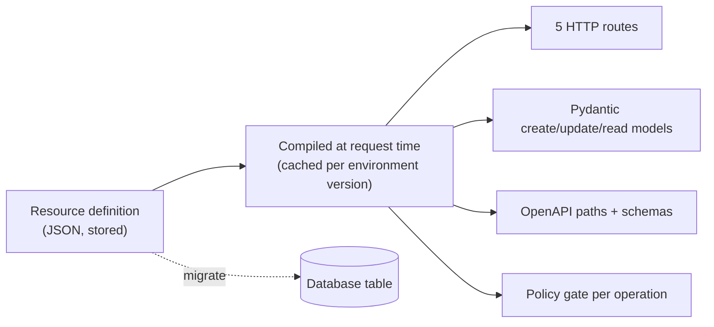

A **resource** is an application entity and its behaviour, defined once:

<CardGroup cols={3}>
  <Card title="Shape" icon="shapes">Fields with types and constraints, compiled to request/response models.</Card>
  <Card title="API" icon="plug">Up to five operations under `/rest/v1/<name>`, each switched on explicitly.</Card>
  <Card title="Access" icon="shield">A policy per operation, pushed into SQL for lists.</Card>
  <Card title="Relations" icon="link">`belongs_to` / `has_many`, fetched with `?expand=`.</Card>
  <Card title="Behaviour" icon="settings-2">Owner field, timestamps, events, realtime, transformer, cache, rate limit.</Card>
  <Card title="Docs" icon="book-open">Appears in the environment's OpenAPI document automatically.</Card>
</CardGroup>

This page is the complete mental model for resources: what they are, exactly what request touches what code, and every knob that changes their behaviour at runtime. [Defining resources](/data/defining-resources) walks through creating one step by step; this page explains what each piece *does*.

## The mental model

If you've used Rails, Django REST Framework, Supabase or Firestore, a Pawabase resource will feel familiar, with one important difference: **nothing is inferred from your database schema**. A resource is a definition you write — fields, operations, policies — and the platform compiles it into routes, validation models and (optionally) database columns. The table follows the definition, not the other way around.

| If you know… | The Pawabase equivalent |
| --- | --- |
| A Rails/DRF model + serializer + controller + routes | One resource definition |
| A Supabase table + RLS policies + PostgREST | One resource definition, but the "table" and the "policies" are two separate concerns you can point at existing infrastructure |
| A Firestore collection + security rules | One resource definition, minus the client-side query shape constraints Firestore imposes |
| An OpenAPI-generated CRUD scaffold | The scaffold *is* the resource; there's no separate spec to keep in sync |

The definition is stored as data (a row in Pawabase's own control-plane database, under your project and environment), which is what lets Studio edit it with forms, the platform API create it with `curl`, and [promotion](/operate/environments-and-promotion) copy it between environments without regenerating code.



The definition and the table are related but independent: editing the definition never touches the table, and the table can pre-exist and be adopted (see [exposing an existing table](#exposing-an-existing-table) below).

## The five operations

| Operation | Route | Notes |
| --- | --- | --- |
| `list` | `GET /rest/v1/<name>` | Filters, sort, pagination, `select`, `expand` |
| `get` | `GET /rest/v1/<name>/{id}` | `expand` |
| `create` | `POST /rest/v1/<name>` | Body validated against the *create* model |
| `update` | `PATCH /rest/v1/<name>/{id}` | Partial; validated against the *update* model |
| `delete` | `DELETE /rest/v1/<name>/{id}` | `204` |

**Nothing is public by default.** An operation doesn't exist until it's enabled, and every enabled operation is governed by a policy (default `authenticated` if you pass `null`). Disabled operations aren't served at all — not "served and refused", genuinely absent: the route isn't registered, `OPTIONS` doesn't list the method, and the OpenAPI document has no entry for it. A `DELETE` against a disabled `delete` operation returns a plain `404 Not Found` from the router, indistinguishable from a URL that was never valid.

<Tip>
This is a deliberate asymmetry with most frameworks, where "no delete route" and "delete route that always refuses" look almost the same from outside. In Pawabase they're genuinely different: disabling an operation removes API surface; enabling it with a strict policy keeps the surface (discoverable in the docs) but locks it down.
</Tip>

### `list` — `GET /rest/v1/<name>`

```bash
curl "$GW/rest/v1/invoices?filter[status]=overdue&sort=-due_on&page=1&per_page=20&expand=payments" \
  -H "apikey: $PK" -H "Authorization: Bearer $TOKEN"
```

```json
{
  "data": [
    { "id": 44, "invoice_no": "INV-202600001", "student_id": 12, "amount": 210000, "balance": 60000,
      "status": "overdue", "due_on": "2026-09-01",
      "payments": [{ "id": 91, "amount": 150000, "paid_on": "2026-08-20" }] }
  ],
  "page": 1,
  "per_page": 20,
  "total": 7
}
```

`list` accepts five query parameters, all optional:

| Parameter | Default | Meaning |
| --- | --- | --- |
| `page` | `1` | 1-indexed page number |
| `per_page` | `20` | Rows per page, `1`–`200` |
| `sort` | primary key ascending | Comma-separated fields, `-` prefix for descending. See [filtering](/data/filtering) |
| `select` | every field | Comma-separated fields to return (the primary key is always included) |
| `expand` | none | Comma-separated relation names. See [relations](/data/relations) |
| `filter[<field>]` | none | Any number of these. See [filtering](/data/filtering) |

`total` is the count matching your filters *and* whatever the policy pushed into `WHERE`, so pagination UIs stay accurate. There is one situation where `total` comes back `null`: when the policy for `list` has a **residual** condition that can't be expressed in SQL (an `any` across record fields, for instance) — the platform reads a page, filters it row by row, and can no longer report an exact database-level total. See [policies → pushdown](/policies/pushdown) for exactly when that happens and how to avoid it on large tables.

If the resource has a `transformer`, the response shape can differ from `{data, page, per_page, total}` — the transformer runs on the whole page and decides what comes back. See [transformers](/data/transformers).

### `get` — `GET /rest/v1/<name>/{id}`

```bash
curl "$GW/rest/v1/invoices/44?expand=payments" -H "apikey: $PK" -H "Authorization: Bearer $TOKEN"
```

Returns the record (`200`), or `404 Not found` if it doesn't exist **or** if the caller's `get` policy refuses it — the two cases are deliberately indistinguishable so that a policy refusal never confirms a record's existence to someone who shouldn't know. `id_type: "integer"` ids that don't parse as digits also come back `404` rather than `400`, for the same reason: a malformed id and a nonexistent one look the same from outside.

### `create` — `POST /rest/v1/<name>`

```bash
curl -X POST "$GW/rest/v1/invoices" -H "apikey: $PK" -H "Authorization: Bearer $STAFF" \
  -H "content-type: application/json" \
  -d '{"invoice_no": "INV-202600045", "student_id": 12, "amount": 180000}'
```

The body is validated against the resource's **create** model before the policy or the database ever run — see [validation](/data/validation) for exactly what that model enforces (`required`, `read_only` rejection, defaults, unknown-field rejection). If `owner_field` is set, it's stamped onto the record from the caller's identity, overwriting anything the client sent, *after* validation and *before* the policy check — so a `create` policy can see and reason about the final owner. Successful creates return `201` with the created record, including server-assigned fields (`id`, `created_at`, `updated_at`).

### `update` — `PATCH /rest/v1/<name>/{id}`

```bash
curl -X PATCH "$GW/rest/v1/invoices/44" -H "apikey: $PK" -H "Authorization: Bearer $STAFF" \
  -H "content-type: application/json" -d '{"status": "paid"}'
```

`PATCH` is a **partial** update: only the fields present in the body are validated and written; everything else on the row is untouched. `PUT` is also registered as an alias with the same handler (for HTTP clients that insist on it), but it's excluded from the OpenAPI document, is not partial in any special way (Pawabase doesn't distinguish "replace" semantics — it's the same partial-update handler either way), and isn't the documented, supported spelling. Use `PATCH`.

The policy sees `record` as the row **before** the change and `input` as the submitted patch, which lets update policies reason about transitions (see the blog example in [policies](/policies/overview#a-complete-worked-example-a-blog)). If `owner_field` is set, the client can't move ownership by including it in the patch — the server strips it from the input before anything else runs.

Refusals for a signed-in caller come back `403`; for an anonymous caller, `404` (again, so an anonymous request can't use the error code to fingerprint which records exist).

### `delete` — `DELETE /rest/v1/<name>/{id}`

```bash
curl -X DELETE "$GW/rest/v1/invoices/44" -H "apikey: $PK" -H "Authorization: Bearer $ADMIN"
```

`204 No Content` on success, `404` if the row doesn't exist, `403`/`404` on policy refusal following the same signed-in/anonymous split as `update`. Deletes are hard deletes — there's no soft-delete flag baked into the platform. Model "archived" as a `status` field with an `enum` and gate real deletion behind an admin-only policy if you want a recoverable trash state.

## Anatomy of a definition

```json
{
  "name": "invoices",
  "description": "Fee invoices per student per term.",
  "table": null,
  "primary_key": "id",
  "id_type": "integer",
  "fields": [
    { "name": "invoice_no", "type": "string", "required": true, "pattern": "^INV-[A-Za-z0-9]+$" },
    { "name": "student_id", "type": "integer", "required": true },
    { "name": "amount", "type": "number", "required": true, "minimum": 0 },
    { "name": "status", "type": "string", "enum": ["issued", "partially_paid", "paid", "overdue", "void"], "default": "issued" }
  ],
  "operations": {
    "list":   { "enabled": true, "policy": "family_access" },
    "get":    { "enabled": true, "policy": "family_access" },
    "create": { "enabled": true, "policy": "finance_staff" },
    "update": { "enabled": true, "policy": "finance_staff" },
    "delete": { "enabled": true, "policy": "school_admin" }
  },
  "relations": [{ "name": "payments", "type": "has_many", "resource": "payments", "field": "invoice_id" }],
  "owner_field": null,
  "timestamps": true,
  "events": true,
  "realtime": false,
  "transformer": null,
  "cache_ttl": 0,
  "rate_limit": {},
  "tags": ["Finance"]
}
```

Every key, with its exact type and default, is documented field by field in [Defining resources](/data/defining-resources). The short version:

| Group | Keys |
| --- | --- |
| Identity | `name`, `description`, `table`, `primary_key`, `id_type` |
| Shape | `fields` |
| Access | `operations` |
| Graph | `relations` |
| Behaviour | `owner_field`, `timestamps`, `events`, `realtime`, `transformer`, `cache_ttl`, `rate_limit`, `tags` |

## `id_type`: `integer` or `uuid`

Exactly two options, enforced by the platform API's request model (`Literal["integer", "uuid"]` — anything else is refused at save time with a `422`):

| | `integer` (default) | `uuid` |
| --- | --- | --- |
| How ids are assigned | The database auto-increments them on insert | The server generates a v4 UUID and inserts it explicitly |
| Shape in URLs and JSON | `44` | `"9b1e1c1a-6b1d-4b7a-8c2e-2a6a2f9c6a10"` |
| Sequential / guessable | Yes — an attacker who sees `44` can try `43`, `45`, … | No — 122 bits of randomness |
| Sortable by creation without a timestamp | Yes (mostly — see caveat below) | No |
| Column type on migrate | `INTEGER`/`BIGINT`, primary key, auto-increment | `UUID` (Postgres) or `VARCHAR(36)` (SQLite/MySQL), primary key |
| Malformed id in a URL | `404` immediately (non-digit paths are rejected before touching the database) | Passed through to the query; a row that doesn't exist is also `404` |

Pick `uuid` whenever ids appear somewhere a stranger can see them and shouldn't be able to enumerate the resource by walking integers — order confirmation links, invite tokens, publicly shared record URLs, anything in a `carts`-style flow addressed by an unguessable token. Pick `integer` for internal, staff-only, or genuinely public-but-fine-to-enumerate resources (a blog's `posts`, a catalog's `products`) where smaller, sortable, human-readable ids are more convenient.

<Warning>
`id_type` can't be changed after rows exist without a manual migration (rewriting the primary key column and every foreign key that references it) — it isn't something `migrate` does for you. Decide it when you create the resource.
</Warning>

<Note>
Auto-increment integer ids are *usually* monotonic with creation order but that isn't a database guarantee across all backends and isn't something Pawabase promises — sort by `created_at` (present whenever `timestamps` is on) if creation order actually matters, rather than relying on id order.
</Note>

## `table` and `primary_key`

`table` defaults to `name` and only needs to be set when you want the API name and the underlying table name to differ — most commonly when [exposing an existing table](#exposing-an-existing-table) under a friendlier API name, or when two environments' tables happen to be named differently for historical reasons. `primary_key` defaults to `id` and only needs to change when adopting a table whose key column is called something else (`uuid`, `order_id`, …).

Both are plain identifiers, validated with the same pattern as column names (`^[A-Za-z_][A-Za-z0-9_]{0,62}$`), and neither is ever exposed to API clients — a client interacts with `/rest/v1/<name>/{id}`, never with the table name.

## Exposing an existing table

To put a resource API on a table that already exists — one you inherited, one a migration tool manages, one another service writes to:

<Steps>
  <Step title="Point at it">Set `table` to the existing table's name and `primary_key` to its key column.</Step>
  <Step title="Declare only the columns you want the API to touch">Add a `fields` entry per column you want readable or writable. Columns you leave out are completely invisible to the API — not read, not written, not even mentioned in errors.</Step>
  <Step title="Skip migrate, or run it deliberately">If the schema is managed elsewhere (Alembic, Prisma, a DBA), don't run `migrate` at all. If you only want Pawabase to add a couple of Pawabase-specific columns (say, `owner_field` or `timestamps` columns that don't exist yet) on top of an externally managed table, running `migrate` will add exactly those missing columns and nothing else — it never drops or retypes anything (see [Editing safely](/data/defining-resources#editing-safely)).</Step>
</Steps>

This is the same technique used to give an API to a table populated by an ETL job, a legacy app's database, or a table that a data warehouse export lands in nightly — the resource layer becomes a read (and optionally write) API over data nothing in Pawabase produced.

## `owner_field`, `timestamps`, `events`, `realtime`, `cache_ttl`, `rate_limit`

These are covered in full in [Defining resources → Behaviour](/data/defining-resources#behaviour). The short version, because they matter for understanding what a resource *is*:

- **`owner_field`** turns `create` into "this row belongs to whoever creates it" and makes `{"owner": "<field>"}` a one-line policy for "only the creator" reads/writes.
- **`timestamps`** (default `true`) adds and maintains `created_at`/`updated_at` — client-submitted values for these are ignored; the server always sets them.
- **`events`** (default `true`) emits `<name>.created` / `<name>.updated` / `<name>.deleted` on every write, each carrying the full record, for [event subscriptions](/events/overview), audit trails, and downstream flows.
- **`realtime`** (default `false`) additionally publishes every change on the `resource:<name>` [realtime channel](/realtime/overview) so subscribed clients see writes as they happen, without polling.
- **`cache_ttl`** (default `0`, meaning off) caches `list` and `get` responses per caller for up to `86400` seconds; any write to the resource invalidates every cached response for it immediately, across instances.
- **`rate_limit`** (default `{}`, meaning none) caps requests per caller per time window, counted across instances via Redis when configured.

## What you get for free

- **Validation** of every body before policies or SQL run: types, required, lengths, ranges, patterns, allowed values, read-only fields. See [validation](/data/validation) for the exact error shape.
- **Typed responses** and an **OpenAPI** entry per enabled operation, rendered by Atlas (Pawabase's docs UI) and consumable by any OpenAPI-aware client generator.
- **Timestamps**: `created_at` and `updated_at`, maintained by the server, immune to client tampering.
- **Events**: `<name>.created|updated|deleted` with `{resource, change, record}`, ready for subscriptions, webhooks and flows.
- **Cache invalidation** of anything tagged with the resource on every write — you never hand-roll a cache-busting step.
- **Realtime** publication on `resource:<name>` when broadcasting is on, with no extra wiring.
- **Rate limiting** counted consistently across every API instance, not per-process.
- **Consistent error shapes** (`401`/`403`/`404`/`422`) across every resource, so client code doesn't special-case each endpoint.

None of this is opt-in boilerplate you write per resource — it's what defining a resource *means*. The only per-resource work is deciding field shapes and policies.

## Resources vs. custom routes

Resources give you CRUD with rules: read a row, write a row, delete a row, each independently gated. When an operation is really a **workflow** that does more than write one row — "admit a student" (creates a `students` row, a `guardians` link, and an `invoices` row, and sends a welcome email), "record a payment" (writes a `payments` row *and* updates the parent `invoices.balance` *and* emits a receipt) — model it as a [custom route](/data/custom-routes) backed by a [flow](/flows/overview) or [function](/functions/overview), and keep the underlying resource's own `create`/`update` restricted or disabled so the workflow is the only door in.

| | A resource operation | A custom route |
| --- | --- | --- |
| Good for | "Read/write one row, plain rules" | "Multiple rows, external calls, business rules, side effects" |
| Request/response shape | Fixed: the resource's fields | Whatever `input_schema`/`response_schema` you declare |
| Access control | One policy per operation | One policy on the route |
| Implementation | Generated | A flow's nodes, or a Python function |
| Appears in OpenAPI | Yes, automatically | Yes, if you set `tags`/`description` |

<CardGroup cols={2}>
  <Card title="Define your first resource" icon="plus" href="/data/defining-resources" />
  <Card title="Query it" icon="search" href="/data/filtering" />
</CardGroup>

## Resources vs. the database console

Studio's database console (and the platform API's `/database/query` endpoint) runs SQL directly against the environment's database with operator rights — it bypasses resource definitions, validation and policies entirely. Use it for one-off inspection, backfills and debugging, never as a way to serve an API: anything meant to be called repeatedly by an application or client should be a resource operation or a custom route, both of which get validation, access control, docs and consistent errors. A raw query gets none of that.

## A complete worked example: two related resources

A small "school fees" slice, showing a `belongs_to`/`has_many` pair, an owner field, and every behaviour flag in use at once.

<CodeGroup>
```json students
{
  "name": "students",
  "description": "Enrolled students.",
  "id_type": "integer",
  "fields": [
    { "name": "first_name", "type": "string", "required": true, "max_length": 80 },
    { "name": "last_name", "type": "string", "required": true, "max_length": 80 },
    { "name": "class_id", "type": "integer", "required": true },
    { "name": "guardian_user_ids", "type": "array", "items": { "type": "string" }, "default": [] }
  ],
  "operations": {
    "list":   { "enabled": true, "policy": "family_access" },
    "get":    { "enabled": true, "policy": "family_access" },
    "create": { "enabled": true, "policy": "school_admin" },
    "update": { "enabled": true, "policy": "school_admin" },
    "delete": { "enabled": true, "policy": "school_admin" }
  },
  "relations": [{ "name": "invoices", "type": "has_many", "resource": "invoices", "field": "student_id" }],
  "owner_field": null,
  "timestamps": true,
  "events": true,
  "realtime": false,
  "cache_ttl": 0,
  "tags": ["Students"]
}
```
```json invoices
{
  "name": "invoices",
  "description": "Fee invoices per student per term.",
  "id_type": "integer",
  "fields": [
    { "name": "invoice_no", "type": "string", "required": true, "pattern": "^INV-[A-Za-z0-9]+$" },
    { "name": "student_id", "type": "integer", "required": true },
    { "name": "amount", "type": "number", "required": true, "minimum": 0 },
    { "name": "status", "type": "string", "enum": ["issued", "partially_paid", "paid", "overdue", "void"], "default": "issued" }
  ],
  "operations": {
    "list":   { "enabled": true, "policy": "family_access" },
    "get":    { "enabled": true, "policy": "family_access" },
    "create": { "enabled": true, "policy": "finance_staff" },
    "update": { "enabled": true, "policy": "finance_staff" },
    "delete": { "enabled": true, "policy": "school_admin" }
  },
  "relations": [{ "name": "student", "type": "belongs_to", "resource": "students", "field": "student_id" }],
  "owner_field": null,
  "timestamps": true,
  "events": true,
  "realtime": true,
  "cache_ttl": 30,
  "tags": ["Finance"]
}
```
</CodeGroup>

```bash
# a guardian sees only their child, with the child's outstanding invoices
curl "$GW/rest/v1/students/12?expand=invoices" -H "apikey: $PK" -H "Authorization: Bearer $GUARDIAN"
```

## A commerce-shaped example

Resources compose into much larger graphs than a two-table pair. This is a trimmed slice of a real storefront (`products` / `product_variants`), showing `has_many`, a computed-looking `price_from_minor` field kept in sync by a flow rather than by the database, `realtime` for live stock counts, and a `transformer` hiding cost data from shoppers:

```json
{
  "name": "product_variants",
  "description": "Purchasable variants with price and stock.",
  "id_type": "integer",
  "fields": [
    { "name": "product_id", "type": "integer", "required": true },
    { "name": "title", "type": "string", "required": true, "max_length": 120, "description": "e.g. Large / Blue" },
    { "name": "sku", "type": "string", "max_length": 64 },
    { "name": "price_minor", "type": "integer", "required": true, "minimum": 0 },
    { "name": "cost_minor", "type": "integer", "minimum": 0, "write_only": true },
    { "name": "stock", "type": "integer", "default": 0 },
    { "name": "track_inventory", "type": "boolean", "default": true }
  ],
  "operations": {
    "list":   { "enabled": true, "policy": "public" },
    "get":    { "enabled": true, "policy": "public" },
    "create": { "enabled": true, "policy": "role:editor" },
    "update": { "enabled": true, "policy": "role:editor" },
    "delete": { "enabled": true, "policy": "role:owner" }
  },
  "relations": [{ "name": "product", "type": "belongs_to", "resource": "products", "field": "product_id" }],
  "transformer": "public_variant",
  "realtime": true,
  "cache_ttl": 0,
  "tags": ["Catalog"]
}
```

`cost_minor` is `write_only`: staff can set it, but it never appears in a `GET` — the exact shape used across the codebase's [commerce blueprint](https://github.com) for keeping margin data internal without a separate resource. See [validation → read-only and write-only fields](/data/validation#read-only-and-write-only-fields).

## Troubleshooting

<AccordionGroup>
  <Accordion title="A route I expect to exist returns 404 from the router, not a policy 404">
    Check that the operation is `enabled: true` — a disabled operation isn't a route at all, and the router's own 404 looks identical to a policy-hidden record's 404. `GET …/resources/<name>/openapi` (operator-only) shows exactly which routes are compiled for a resource right now.
  </Accordion>
  <Accordion title="I changed a field but the API still behaves like the old definition">
    Compiled state is cached per environment version. Saving a definition bumps the version and the next request recompiles; if you're testing against a long-lived connection or a client with its own cache, retry with a fresh request. Studio's editor always reads the current definition.
  </Accordion>
  <Accordion title="create returns 201 but a field I sent is missing from the response">
    Either the field isn't declared in `fields` (unknown fields are silently dropped from what's returned, and also rejected on write with `extra="forbid"` — check for a 422 first), or it's `write_only` and intentionally never returned. See [validation](/data/validation#read-only-and-write-only-fields).
  </Accordion>
  <Accordion title="total is null on a list response">
    A residual (row-by-row) policy is active for this caller on this operation. See [policies → pushdown](/policies/pushdown) for what causes a residual and how to restructure the policy so equalities push into SQL instead.
  </Accordion>
  <Accordion title="I need a resource to write to two tables at once">
    A single resource is one table. Model the second write as a related resource with its own `create`, or move the whole operation to a [custom route](/data/custom-routes) backed by a flow that writes both rows in sequence (or transactionally, via `db.query` nodes).
  </Accordion>
</AccordionGroup>

## FAQ

<AccordionGroup>
  <Accordion title="Can a resource have more than five operations?">
    No — `list`, `get`, `create`, `update`, `delete` is the whole set. Anything else (a bulk import, a "publish" action, a computed report) is a [custom route](/data/custom-routes).
  </Accordion>
  <Accordion title="Can I rename a resource?">
    Not in place. Create a new resource with `table` pointing at the old table (and the same `fields`/`primary_key`), then retire the old definition. The URL segment (`name`) is fixed once created specifically to avoid silently breaking every client pointed at the old path.
  </Accordion>
  <Accordion title="Does deleting a resource definition delete the table?">
    No. Removing the definition only removes the API; the table and its data are untouched. Drop the table yourself via the database console or your migration tooling if you actually want the data gone.
  </Accordion>
  <Accordion title="Do resources support soft delete?">
    Not as a built-in flag. Model it with a `status` field (`enum: ["active", "archived"]`) and a policy that filters on it, or route real deletes through a flow that marks-then-schedules a hard delete later.
  </Accordion>
  <Accordion title="Is there a limit on how many fields a resource can have?">
    No hard platform limit, but very wide tables are usually a sign that a resource is trying to be two things — consider splitting into a parent/`has_many` pair, which is also friendlier to `select=` and to policies that only need to reason about a subset of fields.
  </Accordion>
</AccordionGroup>

## Next

<CardGroup cols={2}>
  <Card title="Defining resources" icon="table-properties" href="/data/defining-resources">Every setting, step by step, with Studio and API workflows.</Card>
  <Card title="Field types" icon="type" href="/data/field-types">The fourteen field types and their options.</Card>
  <Card title="Validation" icon="badge-check" href="/data/validation">Constraints, the 422 shape, read-only vs write-only.</Card>
  <Card title="Relations and expand" icon="link" href="/data/relations">belongs_to, has_many, and how expand respects policies.</Card>
  <Card title="Filtering" icon="filter" href="/data/filtering">The filter[field]=value query syntax.</Card>
  <Card title="Policies" icon="shield-check" href="/policies/overview">The access-control engine behind every operation.</Card>
</CardGroup>
