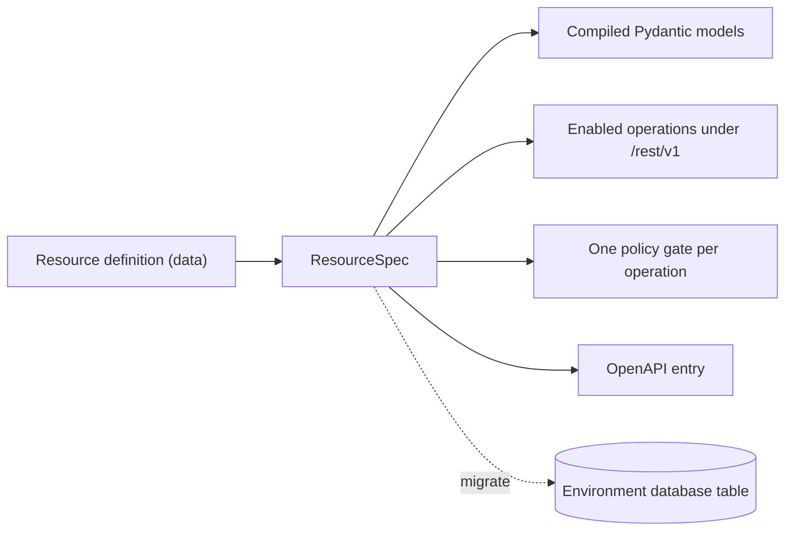
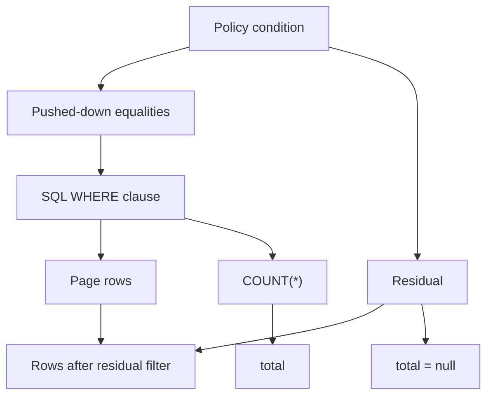
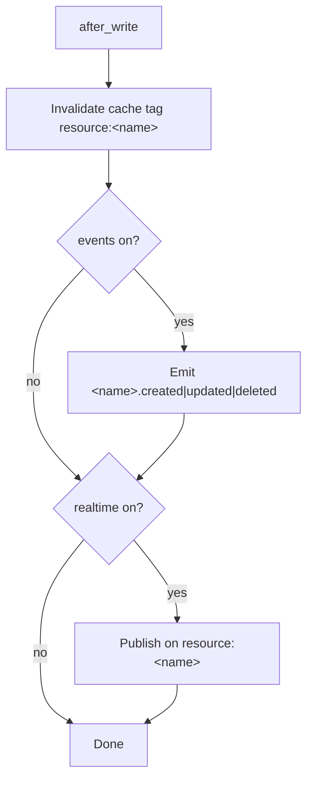
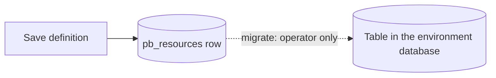
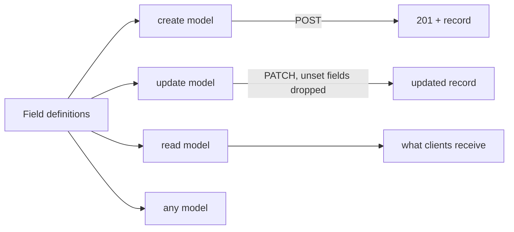
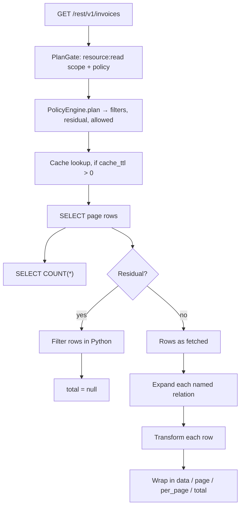

A resource is three things at once, and separating them before looking at any setting will make everything else easier.

The first is an **entity**: a table in the environment's database plus a declaration of what a row in that table contains. The second is a **set of REST operations** — `list`, `get`, `create`, `update`, `delete` — of which any subset may exist. The third is a **policy per operation**: a separate access rule attached to each of those operations, so reading and writing are authorized independently.

None of this is code. A resource is a row in the platform's own database (`pb_resources`) holding a JSON body. Pawabase reads that row, compiles a request model, a response model, a route and a policy gate for each enabled operation, and mounts the result under `/rest/v1/<name>`. Saving a definition changes the environment's next compiled state; there is no build artefact and no deploy.



<CardGroup cols={3}>
  <Card title="An entity" icon="table">A table, a primary key, and a typed field list. That field list is simultaneously the validation rule, the JSON shape, and the migration plan.</Card>
  <Card title="An operation set" icon="list-checks">Five possible operations. Each exists only if you switch it on, and each is registered independently of the others.</Card>
  <Card title="A policy per operation" icon="shield-check">Not one rule for the resource — one rule per operation. `get` and `list` can disagree. `create` and `update` can disagree.</Card>
</CardGroup>

## Definitions as data

Most backend frameworks make a resource an artefact of a code review: a model class, a migration, a serializer, a view, a permission class. Pawabase inverts that. The definition is data, and the same data drives the validator, the SQL builder, the OpenAPI document, and the access gate.

The consequences of that inversion are worth stating plainly, because they change how you work:

| Because a definition is data… | you get… |
| --- | --- |
| It can be edited without a deploy | Saving in Studio changes the next compiled state of the environment |
| It can be diffed and promoted | `staging → production` copies the definition itself, not the table |
| It can be validated as a whole | A reserved name, a bad field name, a bad policy reference or a bad transformer is refused at save time with `422` |
| It can be inspected as raw JSON | The **JSON** tab shows exactly the body the platform stores; there is no second source of truth |
| It can be backed out of | Removing a field stops exposing it through the API; it does not drop the column |

<Note>
Promotion copies the definition. It does not run the migration on the target environment. Run the migration on the target yourself, exactly as you would have on the source. See [Migrations](/data/migrations).
</Note>

## The URL surface

Every resource contributes the same small, predictable set of paths. There is no per-resource path configuration; the name *is* the path.

| Method | Path | Operation |
| --- | --- | --- |
| `GET` | `/rest/v1/<name>` | `list` |
| `GET` | `/rest/v1/<name>/{id}` | `get` |
| `POST` | `/rest/v1/<name>` | `create` |
| `PATCH` | `/rest/v1/<name>/{id}` | `update` |
| `DELETE` | `/rest/v1/<name>/{id}` | `delete` |

`PUT` is also registered on the item path and behaves identically to `PATCH`, but it is excluded from the published schema, so PATCH is the documented partial update. A client generated from the OpenAPI document will only ever see `PATCH`.

<Info>
The version segment is real but shallow. The data-plane prefix matches `/rest/(?P<version>v[1-9][0-9]*)`, so `v1`, `v2` and so on are syntactically valid. Resources are served under `v1`.
</Info>

Because the name is the path, renaming a resource is a breaking change for every client. Studio enforces that for you: the **Name** input is disabled once the resource exists, with the hint "Fixed once created; other definitions refer to it by name." Relations, event subscriptions and flow blocks all reference resources by name, and those references are resolved by name when the environment is compiled.

### Naming rules

| Thing | Pattern | What happens if you break it |
| --- | --- | --- |
| Resource `name` | `^[a-z][a-z0-9_]{0,62}$` | Refused with `422` |
| `table` | `^[A-Za-z_][A-Za-z0-9_]{0,62}$` | Refused with `422` |
| `primary_key` | `^[A-Za-z_][A-Za-z0-9_]{0,62}$` | Refused with `422` |
| `owner_field` | `^[A-Za-z_][A-Za-z0-9_]{0,62}$` | Refused with `422` |
| Field `name` | `^[A-Za-z_][A-Za-z0-9_]{0,62}$` | `validate_fields` fails; the save is refused with `422` |

Resource names are lower-case letters, digits and underscores, starting with a letter — so `orders`, `invoice_lines` and `v2_reports` are fine, while `Orders`, `order-lines` and `2fa_codes` are not. Table names, primary key names and owner field names use the wider SQL identifier rule, so they may start with an underscore or an upper-case letter. Field names follow that same wider rule.

Every identifier that reaches SQL passes through `check_identifier()`, and every query is parameterised: values never enter SQL by string formatting. That is a guarantee about safety rather than naming, but it is why the patterns above exist at all.

### Reserved names

```text
docs, openapi.json, x, rpc, health, internal, platform
```

Pawabase's own routes sit at the top level of `/rest/v1`, so a resource sharing one of those names would collide with them. Saving a resource called `health` is refused with `'health' is reserved`. Nothing else is reserved — `users`, `resources` and `spaces` are ordinary names you are free to use.

## The five operations, and why they start off

`OPERATIONS = ("list", "get", "create", "update", "delete")`. An operation is registered only when its `enabled` setting is truthy. There is no default-on behaviour and no inheritance: a brand-new resource serves no endpoints at all until you switch something on.

| Operation | Serves | Default | What is missing while it is off |
| --- | --- | --- | --- |
| `list` | `GET /rest/v1/<name>` | Off | Collections: pagination, sorting, filtering, `select` |
| `get` | `GET /rest/v1/<name>/{id}` | Off | Single-record reads by id |
| `create` | `POST /rest/v1/<name>` | Off | Client-side inserts |
| `update` | `PATCH /rest/v1/<name>/{id}` | Off | Partial updates |
| `delete` | `DELETE /rest/v1/<name>/{id>` | Off | Removal |

This default is deliberate and it is the most useful thing to internalise. A resource is a *description* of an entity; turning an operation on is a separate, explicit statement that this entity has become part of your public surface.

A `support_tickets` resource with only `list` and `get` enabled is a read-only catalogue: no client can mutate it, no client can enumerate it more broadly than the `list` policy allows, and there is no accidental write path to reason about later. It also makes staging safer than enabling everything and locking it down afterwards — you can define the full shape of an entity, migrate the table, seed it, build the read side, and only then decide who may write, with the write operations still physically absent from the routes.

<Warning>
Turning an operation off does not undo writes that already happened. It stops future calls. Rows created while `create` was enabled stay in the table.
</Warning>

Operations that are off are also absent from the OpenAPI document. A client generated from the spec will not offer a `delete` method for a resource whose `delete` is off, which means the surface your SDK sees is the surface you actually enabled.

### List query parameters

`list` accepts exactly these query parameters, with these bounds:

<ResponseField name="page" type="int" default="1">
Page number, from 1. `ge=1`. A `page` below 1 is a `422`.
</ResponseField>

<ResponseField name="per_page" type="int" default="20">
Records per page. `ge=1`, `le=200`. The ceiling is `MAX_PAGE_SIZE = 200`; asking for more is a `422`.
</ResponseField>

<ResponseField name="sort" type="string">
Comma-separated fields; prefix with `-` for descending. Whitespace around each name is stripped.
</ResponseField>

<ResponseField name="select" type="string">
Comma-separated fields to return. If the primary key is not in your list it is appended for you, because identity and expansion both depend on it.
</ResponseField>

<ResponseField name="expand" type="string">
Comma-separated relations to include. See [Relations](/data/relations).
</ResponseField>

Plus any number of `filter[<field>]=<operator>.<value>` parameters, described in full in [Filtering](/data/filtering).

`get` takes exactly one query parameter, `expand`. `create` and `update` take a JSON body validated against the compiled model. `delete` takes nothing and returns `204 No Content`.

<Note>
Pagination is offset-based: `offset = (page - 1) * per_page`. There is no cursor pagination, so deep offsets get slower as the table grows and page numbers can shift under concurrent writes. If you need stable traversal over a large table, sort by a monotonic column explicitly — the default ordering is primary key ascending, which is stable but not business-meaningful.
</Note>

<Info>
Every `list` request costs two queries, not one: the page itself, plus a separate `COUNT(*)` over the same `WHERE` clause to fill `total`. The exception is the case described below, where a policy residual makes an exact count impossible.
</Info>

## Resource field reference

Every key below is part of the stored definition. Defaults are the API defaults; Studio writes the same values into the body.

| Key | Type | Default | What it controls |
| --- | --- | --- | --- |
| `name` | varchar(128) | — | The API name and the `/rest/v1/<name>` path segment |
| `description` | text | `""` | The route summary shown in OpenAPI |
| `table` | varchar(128) | `name` | The table in the environment database; stored as `body.table or body.name` |
| `primary_key` | varchar(64) | `id` | The column that identifies a record |
| `id_type` | varchar(16) | `integer` | `integer` or `uuid`; affects id coercion and column DDL |
| `fields` | JSON | `[]` | The field definitions, stored in the database column `fields_` |
| `operations` | JSON | `{}` | Per operation, `{"enabled": bool, "policy": ref}` |
| `relations` | JSON | `[]` | `[{"name", "resource", "field", "type"}]` |
| `transformer` | JSON | `null` | A transformer name (string), an inline definition (dict), or `null` |
| `cache_ttl` | int | `0` | Response cache lifetime in seconds; `0` means off. Studio accepts 0–86400 |
| `rate_limit` | JSON | `{}` | `{"limit": n, "window": s}`, or `{}` for no limit |
| `events` | bool | `true` | Publish `<resource>.created`, `.updated`, `.deleted` |
| `realtime` | bool | `false` | Publish to the `resource:<name>` channel |
| `timestamps` | bool | `true` | Maintain `created_at` and `updated_at` |
| `owner_field` | varchar(64) | `null` | A column set to the caller's user id on create |
| `tags` | JSON | `[]` | Extra OpenAPI tags, so the resource groups with related endpoints |

A resource is unique per `(environment, name)`. Two resources in one environment cannot share a name, because the name is the URL.

### How the definition groups

| Group | Keys | The question it answers |
| --- | --- | --- |
| Identity | `name`, `description`, `table`, `primary_key`, `id_type` | What is this thing, and where does it live? |
| Shape | `fields` | What is in a row, and what counts as a valid row? |
| Access | `operations` | Which endpoints exist, and who may call each? |
| Graph | `relations` | What may be pulled in with `?expand=`? |
| Behaviour | `owner_field`, `timestamps`, `events`, `realtime`, `transformer`, `cache_ttl`, `rate_limit`, `tags` | What happens around the read and the write? |

`transformer` is the one key with three legal shapes: a reference to a stored transformer by name, an inline definition dict, or `null`. A dict is validated at save time — unknown step names, a non-list `omit` or `pick`, a non-object `set` or `rename`, and a `case` that is neither `camel` nor `snake` are all refused. See [Transformers](/data/transformers).

## The Studio panel, end to end

Resources live under **Build → Resources**. The list shows three columns — **name**, **table**, **description** — under a section described as "Tables exposed as REST at /rest/v1/`<name>`, guarded per operation by policies." When an environment has none, the empty state reads **No resources yet** with a **Create the first one** call to action. The button that opens the editor is **New resource**.

The editor is one form with six sections, in this order: **Details**, **Fields**, **Access**, **Relations**, **Caching & limits**, **Events & realtime**.

<Info>
Section headings have been renamed between releases. What has not changed is the meaning or the order: identity, then shape, then access, then graph, then the behaviour toggles. If your Studio shows **Access** where this page says **Operations**, they are the same section.
</Info>

### Details

| Control | Setting | Notes in the UI |
| --- | --- | --- |
| **Name** | `name` | Monospace input, autofocused while new, hint "Served at /rest/v1/`<name>`". Disabled once created |
| **Table** | `table` | Optional; "Defaults to the name" |
| **Primary key** | `primary_key` | Defaults to `id` |
| **ID type** | `id_type` | A two-way choice: **Auto-increment** (`integer`) or **UUID** (`uuid`) |
| **Description** | `description` | Optional; placeholder "What rows live here?" |

The **Description** is not decoration. It becomes the route summary in OpenAPI, and it is the first thing a colleague integrating against your API reads.

### Fields

The **Fields** section is a row editor. Its own description reads "Compiled to a Pydantic model and published in OpenAPI", and a second line tells you what you do not have to declare: "The primary key and created_at / updated_at are added for you." When **Timestamps** is off, that sentence becomes "The primary key is added for you."

Each row is one field: reorder chevrons, a coloured type dot, a monospace name input with placeholder `field_name`, a type dropdown, a **Required** checkbox, a **More options** disclosure, and a trash button that removes the row. **Add field** appends a new row. [Defining resources](/data/defining-resources) walks every control on the row.

### Access

**Access** is described in the UI as "Which endpoints exist, and who may call each." It opens with a **Which operations are public?** switch that flips all five at once, then one row per operation carrying:

- an **On/Off** switch,
- the HTTP method, colour-coded by verb,
- the operation name — **List**, **Get one**, **Create**, **Update**, **Delete**,
- a **Who may** policy picker listing the environment's policies.

While a switch is off, the row shows the reason instead of a picker: "Off: the endpoint is not served."

### Relations

Described as "Include related rows with `?expand=name`." Each relation is a small card with **Name**, a **Kind** choice between **Belongs to** and **Has many**, a **Resource** picker, and a foreign-key picker whose label changes with the kind: **Foreign key here** for `belongs_to`, **Foreign key on `<target>`** for `has_many`. **Add relation** appends a card; the trash button labelled **Remove relation** deletes one. [Relations](/data/relations) covers what these do at request time.

### Caching & limits

| Control | Setting | Behaviour |
| --- | --- | --- |
| **Cache responses** | `cache_ttl` | Seconds, 0 to 86400. "0 turns caching off. Up to a day" |
| **Rate limit** | `rate_limit` | A switch. Switched on, it reveals "requests per / seconds" number inputs seeded with 60 and 60. Hint: "Per caller, counted across all gateway instances" |

The rate-limit namespace is scoped per project, per environment, per resource — `rl:<project>:<env>:<resource>` — so two resources never share a bucket, and the same resource name in two environments never shares one either.

### Events & realtime

| Control | Setting | Default | Effect |
| --- | --- | --- | --- |
| **Emit events on change** | `events` | On | Publishes `<name>.created`, `<name>.updated`, `<name>.deleted` |
| **Publish changes to realtime** | `realtime` | Off | Publishes the same payload on the `resource:<name>` channel |

Both run off the same hook with the same payload, so a resource that emits events and one that broadcasts realtime differ only in where the message goes.

Two more controls sit on the same form, above the sections, because they are about the identity of a row rather than about a section of behaviour.

| Control | Setting | What it does |
| --- | --- | --- |
| **Owner field** | `owner_field` | A field picker over your declared fields. "Set this field to the signed-in user's id on create" |
| **Timestamps** | `timestamps` | Maintains `created_at` and `updated_at` |

### The JSON tab

The editor sheet carries a **JSON** tab beside the form, and it is the *same body* the API stores. This removes a whole category of confusion: there is no translation layer between what the form shows and what the platform holds. If the form and the JSON ever appear to disagree, one of them is stale — re-open the other.

The JSON tab is also the escape hatch for anything the form does not surface, and the fastest way to copy a working definition into a new resource.

```json
{
  "name": "invoices",
  "description": "Customer invoices.",
  "table": null,
  "primary_key": "id",
  "id_type": "integer",
  "fields": [
    {"name": "customer_id", "type": "integer", "required": true, "indexed": true},
    {"name": "amount_cents", "type": "integer", "required": true, "minimum": 0},
    {"name": "status", "type": "string", "enum": ["draft", "sent", "paid"], "default": "draft"}
  ],
  "operations": {
    "list": {"enabled": true, "policy": "own_rows"},
    "get": {"enabled": true, "policy": "own_rows"},
    "create": {"enabled": true, "policy": "authenticated"},
    "update": {"enabled": false, "policy": null},
    "delete": {"enabled": false, "policy": null}
  },
  "relations": [
    {"name": "customer", "resource": "customers", "field": "customer_id", "type": "belongs_to"}
  ],
  "transformer": null,
  "cache_ttl": 0,
  "rate_limit": {},
  "events": true,
  "realtime": false,
  "timestamps": true,
  "owner_field": "user_id",
  "tags": ["billing"]
}
```

Read that body as five independent decisions rather than one blob: the resource is `invoices` over a table of the same name, identified by an auto-increment `id` with timestamps; three fields including a required integer foreign key, a non-negative amount and a defaulted status; reads owner-scoped and writes limited to signed-in callers; one `belongs_to` relation named `customer`; and no caching, no rate limit, events on, realtime off.

## Operations, policies, and key scopes

Each operation has exactly two settings: whether it is `enabled`, and which `policy` guards it.

```json
"operations": {
  "list":   { "enabled": true,  "policy": "own_rows" },
  "get":    { "enabled": true,  "policy": "own_rows" },
  "create": { "enabled": true,  "policy": "authenticated" },
  "update": { "enabled": true,  "policy": "own_rows" },
  "delete": { "enabled": false, "policy": null }
}
```

If an operation is enabled but carries no policy, the gate falls back to the default policy `authenticated`. If it is disabled, its `policy` is not consulted at all — the route does not exist.

<Warning>
A policy reference is validated at save time. Every `operations.<op>.policy` is checked against the environment's policy set, so a typo like `"own_rows "` or a reference to a policy that has since been deleted is refused with `422` rather than silently becoming a deny.
</Warning>

### The API key scope, on top of the policy

The policy decides what a *caller* may do. Separately, the API key itself must carry a scope, checked by a plan gate that wraps each operation:

| Operation | Required key scope |
| --- | --- |
| `list` | `resource:read` |
| `get` | `resource:read` |
| `create` | `resource:write` |
| `update` | `resource:write` |
| `delete` | `resource:write` |

A key without the required scope gets `403` before the policy is ever evaluated. This is the coarse, project-level control; the policy is the fine, row-level one. A read-only publishable key can hold `resource:read` and be refused on every write operation in the project at once, without touching a single resource definition.

<Note>
The two checks compose. A key with `resource:read` calling `list` still has to pass the `list` policy. A publishable key in the browser is not a bypass of anything; it is a credential with fewer scopes.
</Note>

## `id_type`: integer or uuid

`id_type` is a two-way choice in Studio — **Auto-increment** or **UUID** — and it has consequences at three different layers.

| Layer | `integer` | `uuid` |
| --- | --- | --- |
| Value at create | Assigned by the database | Generated with `uuid.uuid4()` in Python |
| sqlite column | `INTEGER PRIMARY KEY AUTOINCREMENT` | `TEXT` |
| postgres column | `BIGSERIAL PRIMARY KEY` | `UUID` |
| mysql column | `BIGINT AUTO_INCREMENT PRIMARY KEY` | `CHAR(36)` |
| Value in JSON | a number | a string |

The last row matters more than it looks. A uuid primary key serializes as a string in every response, on every database. Clients that assume numeric ids — arithmetic on ids, zero-padded formatting, integer-keyed local caches — will misbehave against a uuid resource with no error raised anywhere.

Choose `uuid` when records are created in more than one place, when ids appear in URLs that will be shared or indexed, or when merging data from another system makes collisions conceivable. Choose `integer` when the ids are internal, when you want the cheapest possible primary key, and when sequential ids are acceptable to you.

### The 404-on-non-digit rule

When `id_type` is `integer`, the id from the URL is coerced before anything else happens:

```python
def _coerce_id(spec, raw):
    if spec.id_type == "integer":
        if not raw.isdigit():
            raise HTTPException(status_code=404, detail="Not found")
        return int(raw)
    return raw
```

So `GET /rest/v1/invoices/abc` on an integer-id resource is a **404**, not a 422. That is deliberate: reporting "your id was malformed" to a caller probing for existing records tells them more about your system than "no such record" does. Do not build a client that treats a 404 here as evidence of a type bug.

For `uuid`, the raw string is passed through untouched and the database does the matching.

<Warning>
`id_type` is chosen before the first migration, and changing it afterwards is a manual operation. Migrate is additive only: it never drops and never retypes a column. Converting an existing table from `integer` to `uuid` means writing the DDL yourself in the Database console. See [Migrations](/data/migrations).
</Warning>

### Primary key

`primary_key` names the identifying column and defaults to `id`. It is included in the `field_map` whether or not you declare it as a field, which means it is always filterable, sortable and selectable, and it is always appended to `select` even if you omit it.

<Note>
A field with `unique: true` gets `UNIQUE` appended to its column definition, so uniqueness is enforced by the database as well as by your `create` policy. See [Defining resources](/data/defining-resources).
</Note>

## Timestamps

`timestamps` defaults to `true` and maintains two columns, `created_at` on insert and `updated_at` on every write. They join the `field_map` automatically, which means they are filterable, sortable and selectable without being declared as fields:

```bash
curl "$GW/rest/v1/invoices?sort=-created_at&filter[status]=eq.overdue" \
  -H "apikey: $PK" -H "Authorization: Bearer $TOKEN"
```

Turn it off for tables with no meaningful notion of when they changed — a static lookup table of currencies, a configuration table, a pure join table whose only columns are two foreign keys. There is a real cost to leaving it on: every update writes an extra column, every recency sort is a sort on a timestamp rather than on an integer key, and an `updated_at` nobody reads is still a value you have to reason about when a migration goes wrong.

<Warning>
Timestamps are not a database default. They are written by the platform on the way in and on the way out. Rows inserted by raw SQL in the Database console do not get them, and such rows sort unpredictably against rows the API created.
</Warning>

## Owner field

`owner_field` names a column the server sets to the caller's user id on create. It is null by default, and it is a single setting rather than a policy — but it changes the security properties of a resource in three ways at once.

```json
"owner_field": "user_id",
"operations": {
  "create": {"enabled": true, "policy": "authenticated"},
  "list":   {"enabled": true, "policy": "owner:user_id"},
  "get":    {"enabled": true, "policy": "owner:user_id"},
  "update": {"enabled": true, "policy": "owner:user_id"},
  "delete": {"enabled": true, "policy": "owner:user_id"}
}
```

| What it does | Why it matters |
| --- | --- |
| On `create`, overwrites `owner_field` with the caller's user id | A client can never forge ownership of a new row by sending someone else's id |
| On `update`, removes `owner_field` from the patch entirely | A client can never transfer a row to another user by PATCHing it |
| The column is indexed by migrate | Owner-scoped list queries do not table-scan |

The first row is why this is a setting rather than a convenience inside a policy. A policy saying "the record's `user_id` must equal the caller's" is only half the guarantee: it stops them *reading* someone else's row, but nothing stops them *writing* a row that claims to belong to someone else. The owner field closes that hole at the only place it can be closed — on the way into the database.

The reference `"owner:user_id"` above is shorthand for `{"owner": "user_id"}`, which expands to the authenticated-and-equal rule. See [Shorthands](/policies/shorthands).

<Info>
Because the owner field comes from the authenticated identity, a `create` on a resource with an `owner_field` by a caller with no session is a `401` — "Authentication required". Service credentials are exempt.
</Info>

## Tags

`tags` is a list of extra OpenAPI tags. The resource's own name is always the first tag, so `GET /rest/v1/invoices` appears under `invoices` in the generated document whatever you put here; `tags` adds the rest.

This is purely an organisation concern for the published document, and it is cheap to use well. Grouping `invoices`, `payments` and `subscriptions` under a shared `billing` tag turns the OpenAPI page from a flat list of unrelated endpoints into something a new integrator can navigate.

## Rate limits

`rate_limit` is `{}` — no limit — or `{"limit": n, "window": s}`. In Studio it is a **Rate limit** switch that, once on, exposes two number inputs reading "requests per / seconds". Switching it on seeds the default `{limit: 60, window: 60}`.

| Property | Value |
| --- | --- |
| Counting basis | Per caller, counted across all gateway instances |
| Namespace | `rl:<project ref>:<environment>:<resource name>` |
| Exhausted result | `429` |
| Validation | A non-empty `rate_limit` must contain a `limit`, or the save is refused |

The namespace is per resource, not per project. That is the right granularity for the common case — a search-heavy resource can have a tighter bucket than a lookup table — but it also means a client that fans out across twenty resources can issue twenty times your intended ceiling. If you are protecting a database rather than an endpoint, put the tightest limit on the resources that are actually expensive.

<Warning>
`rate_limit` on a resource does not cover custom routes. Routes carry their own `rate_limit` with their own namespace. See [Custom routes](/data/custom-routes).
</Warning>

## Response caching

`cache_ttl` is a whole number of seconds, `0` meaning off, and Studio accepts 0 to 86400 — up to a day.

The cache keys are per resource, per shape, and **always include the caller's identity**:

| Operation | Key |
| --- | --- |
| `get` | `res:<resource>:get:<sha256 of [identity, key role, id, expand]>` |
| `list` | `res:<resource>:list:<sha256 of [identity, role, sorted query params]>` |

Identity is the caller's `user.identity`, or the literal string `anon` when there is no user. The key's role is folded in as well. That is deliberate: cached reads never cross users, so there is no class of bug where one account sees another's page because their filters happened to hash the same.

Invalidation is by tag. Every cached entry for a resource is stored under the tag `resource:<name>`, and **any** write to that resource invalidates the whole tag — regardless of which field changed. A one-character edit to a single row drops the entire cached read surface for that resource.

<Note>
The cache is Sillo's cache. It is backed by Redis when `PAWABASE_REDIS_URL` is set; otherwise it is an in-process store, which means each API process keeps its own copy and a multi-process deployment serves different cache states per process until a write propagates.
</Note>

Writes performed as raw SQL in Studio's Database console are the exception: they invalidate **every** resource's cache tag, not just one, because the console cannot know for certain which resource a table belongs to.

## Request and response shapes

Every operation below is described by exactly what goes in, what comes out, and what can go wrong. Field names in the examples are illustrative; substitute your own.

### `list`

```bash
curl "$GW/rest/v1/invoices?filter[status]=eq.overdue&sort=-due_on&page=1&per_page=20" \
  -H "apikey: $PK" -H "Authorization: Bearer $TOKEN"
```

<ResponseField name="data" type="array">
The rows, each shaped by the read model. With a transformer, each row is the transformer's output instead.
</ResponseField>

<ResponseField name="page" type="int">
Echoes back the page that was served, so a client can confirm what it got.
</ResponseField>

<ResponseField name="per_page" type="int">
Echoes back the page size that was served.
</ResponseField>

<ResponseField name="total" type="integer | null">
The number of matching rows, or `null` when an exact count is not computable. See below.
</ResponseField>

```json
{
  "data": [
    {
      "id": 44,
      "customer_id": 12,
      "amount_cents": 210000,
      "status": "overdue",
      "due_on": "2026-03-01",
      "created_at": "2026-02-01T09:14:00+00:00",
      "updated_at": "2026-02-14T16:03:11+00:00"
    }
  ],
  "page": 1,
  "per_page": 20,
  "total": 7
}
```

An empty result set is not an error. `{"data": [], "page": 1, "per_page": 20, "total": 0}` is a perfectly normal answer to a filter that matched nothing.

The `id` column is always present even if you ask for `?select=amount_cents` — the primary key is appended to the selection for you, because identity and expansion both depend on it.

### Why `total` can be `null`

`total` is filled by a separate `COUNT(*)` over the same `WHERE` clause as the page query. That count is only honest if the policy's conditions are fully expressible in SQL.

Pawabase's policy engine splits a condition into two parts. Equalities between a record field and a known value — `{"eq": ["$record.owner_id", "$auth.user_id"]}` — are **pushed down** into `WHERE`, and the count is correct. Anything else that depends on the record is a **residual**, checked row by row in Python after the page has been fetched.



When a residual is active, the database count includes rows the residual would have removed, so reporting it would be reporting a number that is wrong for this caller. Pawabase sets `total` to `null` instead. This is not a failure and not a missing feature; it is the honest answer when an exact total cannot be produced without evaluating every row in the table.

<Tip>
Design policies so that their record-level conditions are equalities against caller identity. `{"owner": "user_id"}` and `{"eq": ["$record.account_id", "$auth.account_id"]}` both push down cleanly and keep pagination and `total` correct. See [Policy pushdown](/policies/pushdown).
</Tip>

`get` re-checks the plan against the loaded record rather than trusting the query. If the record does not exist, or if the plan's pushed-down filters do not match it, or if the residual refuses it, the answer is **404** — for every caller, authenticated or not. A `get` never returns `403`, because refusing to show a record's existence is the stronger privacy position and it costs nothing here.

### `get`

```bash
curl "$GW/rest/v1/invoices/44" \
  -H "apikey: $PK" -H "Authorization: Bearer $TOKEN"
```

```json
{
  "id": 44,
  "customer_id": 12,
  "amount_cents": 210000,
  "status": "overdue",
  "due_on": "2026-03-01",
  "created_at": "2026-02-01T09:14:00+00:00",
  "updated_at": "2026-02-14T16:03:11+00:00"
}
```

One record, one object, no envelope. The only query parameter is `expand`.

### `create`

```bash
curl -X POST "$GW/rest/v1/invoices" \
  -H "apikey: $PK" -H "Authorization: Bearer $TOKEN" \
  -H "Content-Type: application/json" \
  -d '{"customer_id": 12, "amount_cents": 210000, "due_on": "2026-03-01"}'
```

```json
{
  "id": 51,
  "customer_id": 12,
  "amount_cents": 210000,
  "status": "draft",
  "due_on": "2026-03-01",
  "created_at": "2026-02-14T16:03:11+00:00",
  "updated_at": "2026-02-14T16:03:11+00:00"
}
```

Success is **201**, and the body is the created record, read model and all — so the response includes the primary key the database assigned and the defaults the platform filled in. You do not need a follow-up `get` to learn the id.

Two behaviours are worth knowing because they are not visible in the request:

- **Unknown fields are refused.** The create model is compiled with `extra="forbid"`, so a typo'd key is a validation error rather than a silently ignored value.
- **Defaults are applied, and they are applied server-side.** Unset fields with a `default` come back filled in, so `status` above is `draft` even though the body never mentioned it.

<Note>
`read_only` fields are dropped from the create model, so sending `id` or `created_at` does not set them — they are not accepted and not honoured. See [Defining resources](/data/defining-resources).
</Note>

### `update`

```bash
curl -X PATCH "$GW/rest/v1/invoices/44" \
  -H "apikey: $PK" -H "Authorization: Bearer $TOKEN" \
  -H "Content-Type: application/json" \
  -d '{"status": "sent"}'
```

```json
{
  "id": 44,
  "customer_id": 12,
  "amount_cents": 210000,
  "status": "sent",
  "due_on": "2026-03-01",
  "created_at": "2026-02-01T09:14:00+00:00",
  "updated_at": "2026-02-14T16:05:40+00:00"
}
```

`PATCH` is genuinely partial, and the mechanism is worth knowing: the update model is compiled with every field optional, and the payload is dumped with `exclude_unset=True`. Only keys present in the request reach the database. Sending `{"status": "sent"}` does not null out `amount_cents` — it never appears in the patch.

To deliberately clear a value, send it as `null`. That is different from omitting it, and the difference is the whole point of a partial update.

`owner_field`, if set, is popped from the patch before the policy runs, so ownership cannot be reassigned this way.

### `delete`

```bash
curl -X DELETE "$GW/rest/v1/invoices/44" \
  -H "apikey: $PK" -H "Authorization: Bearer $TOKEN"
```

**204 No Content**, no body. A client must not attempt to parse a response here; treat it as null.

Deletion is a hard delete. There is no soft-delete flag anywhere in the resource model. If you need recoverable deletion, model it yourself: a `status` field with a `deleted_at`, or a `deleted` boolean, and a policy that refuses to return rows where it is set. That is more work, and it is the only way to get the behaviour.

<Warning>
On `update` and `delete`, a missing record is `404` before the policy is evaluated at all. A policy refusal is `404` for an anonymous caller and `403` for an authenticated one — someone who already knows the row exists gets told they may not touch it. Write both assertions into your tests, because the distinction is easy to get wrong by accident.
</Warning>

## How a transformer changes the envelope

A transformer reshapes records on their way out. When a resource has one, the shape of the response is the transformer's shape rather than the field list's shape.

For single-record operations — `get`, `create`, `update` — the body *is* the transformed object. Whatever the transformer produced is what you receive, with no envelope and no fixed keys.

For `list` there is a subtlety worth being precise about: the envelope keys are still present, because they are built by the route, but the items inside `data` are transformed, and the generated page model is dropped so OpenAPI does not claim a fixed record schema.

```json
{
  "data": [
    {"reference": "INV-2026-0044", "total": {"amount": "2100.00", "currency": "GBP"}, "state": "overdue"}
  ],
  "page": 1,
  "per_page": 20,
  "total": 7
}
```

The practical consequences for a client:

| Without a transformer | With a transformer |
| --- | --- |
| Response fields are known from the field list | Response fields are whatever the transformer emits |
| Generated SDKs have typed response models | Generated SDKs see an untyped or `any` response |
| Field-level documentation in OpenAPI is accurate | OpenAPI cannot describe the record body |
| `select`, `filter` and `sort` line up with what you receive | `select` still chooses database columns; what you receive may be a different set |

That last row is the one that bites. A transformer runs *after* the row is read, so `?select=author_id` narrows what is fetched from the database and then a transformer may still add `author` from context or drop keys entirely. Filtering and sorting always address database columns; a transformer renames things after the fact, so a `sort=total` that matches a transformed output key will be a `400`.

<Warning>
A transformer named in a resource must resolve at request time. Resolution order is: a Python transformer registered in the process under `@transformer("name")` wins first; then a stored transformer of that name in the environment; otherwise you get a `TransformerError` — "unknown transformer 'name'". A resource can therefore break at read time if a process-level transformer disappears on a deploy.
</Warning>

Steps always run in a fixed order regardless of how they are written in the JSON: `omit`, `pick`, `set`, `rename`, `case`. Writing them in a different order in the definition does not change the result, which is worth knowing before you spend time debugging a pipeline. See [Transformers](/data/transformers).

## Error responses

Resource errors do **not** use the platform's `{message, code}` envelope. The data plane returns the exception's `detail` verbatim as the JSON body, so the shapes are much flatter than you may expect elsewhere in Pawabase.

| Status | Body shape | Example |
| --- | --- | --- |
| `400`, `401`, `403`, `404` | A bare JSON string | `"Not found"` |
| `422` | A bare JSON array, one entry per invalid field | see below |
| `429` | A bare JSON string | `"rate limit exceeded"` |

```json
[
  {
    "type": "greater_than_equal",
    "loc": ["amount_cents"],
    "msg": "Input should be greater than or equal to 0",
    "input": -5,
    "url": "https://errors.pydantic.dev/2.x/v/greater_than_equal"
  }
]
```

That `422` body is Pydantic's own error list, not a Pawabase shape. Each entry names the failure `type`, the `loc` path to the field, a human `msg`, the offending `input`, and a documentation `url`.

<Warning>
Write the client's error handling against these bare shapes, not against `{message}`. A client written for the control plane's envelope will render every resource error as `undefined`. See [Errors](/reference/errors) for the platform-wide reference and for which of the two you are looking at.
</Warning>

Because errors are bare strings, a client that wants to distinguish "no such record" from "you may not see it" has nothing to branch on: both are `404` with the body `"Not found"`. That is intentional. If your application needs to tell those apart for a user-facing message, decide it in a custom route where you control the response, not by scraping the message here.

### What each operation can return

| Status | `list` | `get` | `create` | `update` | `delete` |
| --- | --- | --- | --- | --- | --- |
| `200` | Yes, the page envelope | Yes, the record | — | Yes, the record | — |
| `201` | — | — | Yes, the created record | — | — |
| `204` | — | — | — | — | Yes, no body |
| `400` | Unknown filter field, unknown sort field | Unknown `expand` name | Malformed query values | Unknown `expand` name | Non-digit id on an integer resource |
| `401` | Missing or invalid credentials | Same | Same, and required when an `owner_field` is set | Same | Same |
| `403` | Key lacks `resource:read`, or the policy refuses | Key lacks `resource:read` | Key lacks `resource:write`, or the policy refuses | Key lacks `resource:write`, or an authenticated caller is refused | Key lacks `resource:write`, or an authenticated caller is refused |
| `404` | — | No such record, or the policy hides it | — | No such record | No such record |
| `422` | `page` below 1, or `per_page` above 200 | — | Field validation failed | Field validation failed | — |
| `429` | `rate_limit` exhausted | Same | Same | Same | Same |

The `400` cases are worth spelling out, because they are `SqlError` messages from the store rather than validation:

| Message | Cause |
| --- | --- |
| `"cannot filter on unknown field 'status'"` | The name is not in the `field_map` — the primary key, declared fields, timestamp columns and `owner_field` are the whole list |
| `"cannot sort on unknown field 'total'"` | Same check on `sort`. Common when a transformer renames an output key |
| `"is/isnot take null, true or false"` | `?filter[x]=is.something` — the `is` and `isnot` operators accept only those three literals |

A `422` from `list` is about parameter bounds, not about fields. Unknown fields are `400`.

<Note>
Filtering can only address declared fields. That includes `id`, `created_at` and `updated_at` when timestamps are on, and `owner_field` whether or not you declared it as a field — so `?filter[created_at]=gte.2026-01-01` works on a resource where `created_at` appears nowhere in the field list.
</Note>

### Status codes are not uniform, on purpose

`get` answers `404` for every refusal. `update` and `delete` answer `404` for a missing record and `403` for an authenticated caller's policy refusal. `create` answers `403` for a policy refusal with no existence to hide.

| Operation | Record does not exist | Policy refuses on that record | Policy refuses outright |
| --- | --- | --- | --- |
| `get` | `404` | `404` | `403` |
| `update` | `404` | `403` signed in, `404` anonymous | `403` |
| `delete` | `404` | `403` signed in, `404` anonymous | `403` |
| `create` | — | — | `403`, or `401` when an `owner_field` is set and there is no session |

There is a third column because policies fail in two distinct ways. A condition with no record in it — a role gate, say — refuses *outright*, and the gate answers `403` before any query runs. A condition that compares a record field to the caller can only be decided against a specific row, so it produces `404` on a read and `403` or `404` on a write depending on whether the caller is authenticated.

The reasoning behind the asymmetry: a caller already holding an id has shown they know the record exists, so hiding it buys nothing and makes their debugging worse. A caller probing ids learns nothing either way, so `404` is the safe answer there.

<Warning>
There is no `409` on the resource write path. A uniqueness violation surfaces as whatever your database driver raises, so do not build a client that branches on `409` for `create` — catch it at the storage layer instead, or better, prevent it with an `enum`-constrained field or a `unique: true` field you have actually migrated.
</Warning>


## What happens after a write

Every write to a resource — REST, a flow's `resource.*` block, a function, a `db.transaction`, or Studio's own record editor — runs the same `after_write` hook, in this order:



| Step | Condition | What happens |
| --- | --- | --- |
| 1. Cache invalidation | Always | Drops the whole `resource:<name>` tag, whichever field changed |
| 2. Event emission | `events` is true (default) | Emits `<name>.created`, `.updated` or `.deleted` |
| 3. Realtime publish | `realtime` is true (default false) | Publishes the same payload on `resource:<name>` |

The event payload is the same object in both cases:

```json
{
  "resource": "invoices",
  "change": "updated",
  "record": {"id": 44, "customer_id": 12, "amount_cents": 210000, "status": "sent"}
}
```

It is delivered along with the actor and the request id, so a flow reacting to `invoices.updated` can tell *who* changed the row and correlate it with the request that did it.

<Note>
Realtime is best-effort. A publish failure is logged as a warning and the write still stands. If a realtime message is load-bearing for your application, drive it from an event and a flow instead.
</Note>

### `updated` fires on every write, not only on real change

`after_write` is called after the SQL runs, not after a comparison. A `PATCH` that sets `status` to the value it already held still emits `invoices.updated`. If your flow triggers expensive work on that event, either compare before you write in a flow, or make the flow's own condition check the value it cares about.

### Deletes emit the pre-delete record

The `deleted` event carries the record as it looked immediately before removal, not `null`. That is deliberate — a flow reacting to `subscription.deleted` usually wants to know *what* was cancelled, and a payload of `null` would force it to query a row that no longer exists.

## Studio's own record editor is not a side door

Operators can browse and edit rows directly from Studio, and those writes bypass the resource's policies — they run with service rights. They do **not** bypass the side effects: the same `after_write` path runs, so cache invalidation, events and realtime are identical to a public API write.

The practical implication is that a row edited by an administrator in Studio will fire `invoices.updated` at your flows, with the operator as the actor. If a flow assumes every `updated` event came from a customer, that assumption is wrong.

## Resources versus custom routes

A resource and a custom route are both served under `/rest/v1`, both can carry a policy, and both can have a transformer, a rate limit, cache and tags. The difference is not decoration.

| | Resource | Custom route |
| --- | --- | --- |
| Path | Fixed: `/<name>` and `/<name>/{id}` | Yours: `/orders/{id}/pay` |
| Shape | Your field list | A named schema, an inline field list, or nothing |
| Operations | Five, individually switched | One method and path |
| Policy | One per operation | One per route |
| Handler | The platform's store | A flow or a Python function |
| Validation | Compiled from fields | Compiled from the input schema or fields |
| Request validation | Field constraints, enums, types | Whatever the schema says |
| Side effects | Cache, events, realtime, after_write | Cache and rate limit; events only if your handler writes |
| Collision rule | — | A path that would shadow `/<resource>` or `/<resource>/{id}` is refused with `422` |

### Which to reach for

Use a **resource** when the thing you are modelling is a row with an identity, a lifecycle, and fields the client genuinely needs to read or write. You get validation, filtering, sorting, pagination, expansion, caching, events and OpenAPI for free, and every one of those is a feature you would otherwise have to build.

Use a **custom route** when the request is an *action* rather than a *state*: submit an order, refund a payment, close a ticket, recalculate a total. These have a shape that does not fit a generic `update` — they check the current status, they may change several rows atomically, they emit a different event, and they are authorized by a role rather than by ownership.

The mistake to avoid is modelling an action as a writable field. A `status` column that clients PATCH from `draft` to `approved` means the transition rules live in every client and in the `update` policy, where they cannot be tested in one place. A `POST /purchase-requests/{id}/approve` route backed by a flow puts the rules in the flow, where the run history records who approved what and what the flow decided.

<Warning>
A route path that shadows a resource's own routes is rejected at save time — `/orders` or `/orders/{id}` when a resource called `orders` exists. This is a `422`, not a silent override.
</Warning>

<CardGroup cols={2}>
  <Card title="Defining resources" icon="plus" href="/data/defining-resources" />
  <Card title="Field types" icon="type" href="/data/field-types" />
  <Card title="Filtering" icon="filter" href="/data/filtering" />
  <Card title="Sorting and pagination" icon="sort" href="/data/sorting-pagination" />
  <Card title="Relations" icon="link" href="/data/relations" />
  <Card title="Custom routes" icon="route" href="/data/custom-routes" />
  <Card title="Transformers" icon="wand" href="/data/transformers" />
  <Card title="Migrations" icon="arrow-right" href="/data/migrations" />
</CardGroup>

## A worked definition, and how it was reasoned out

The fastest way to understand which setting answers which question is to watch one real resource get built. Take an invoicing product with three resources and one action. Customers place orders; an invoice belongs to a customer and has lines. The interesting constraints are commercial rather than technical: a customer sees only their own invoices, an internal user sees all of them, nobody edits an issued invoice by PATCHing it, and totals are computed rather than trusted.

### `customers`

```json
{
  "name": "customers",
  "description": "People and companies that can be invoiced.",
  "primary_key": "id",
  "id_type": "uuid",
  "fields": [
    {"name": "name", "type": "string", "required": true, "max_length": 200},
    {"name": "email", "type": "email", "required": true, "unique": true},
    {"name": "payment_terms_days", "type": "integer", "default": 30, "minimum": 0}
  ],
  "operations": {
    "list": {"enabled": true, "policy": "staff_only"},
    "get": {"enabled": true, "policy": "staff_only"},
    "create": {"enabled": true, "policy": "staff_only"},
    "update": {"enabled": true, "policy": "staff_only"},
    "delete": {"enabled": false, "policy": null}
  },
  "transformer": null,
  "cache_ttl": 60,
  "rate_limit": {"limit": 120, "window": 60},
  "events": true,
  "realtime": false,
  "timestamps": true,
  "owner_field": null,
  "tags": ["billing"]
}
```

`id_type` is `uuid` because customers get created from an import as well as from the app, and because customer ids end up in emailed invoice links where sequential integers leak volume information.

`list` and `get` are both `staff_only` — a role gate with no record conditions. Because it has nothing to do with a row, it pushes nothing down and refuses outright with `403` for everyone else, before any query runs.

`delete` is off. Customers are archived by a route in this product, never deleted; leaving `delete` registered would mean one careless client call could remove a customer with twenty years of invoice history.

`email` carries `unique: true`, so migrate creates a unique index. Until that migration has actually run, the constraint is only documentation.

`cache_ttl` is 60 because a customer record changes rarely and is read on every invoice screen.

`owner_field` is null. The owner of an invoice is the account that owes it, not the staff member who typed it, so ownership belongs in an `account_id` column and a policy rather than in this setting.

### `invoices`

```json
{
  "name": "invoices",
  "description": "Customer invoices. Totals are computed server-side.",
  "primary_key": "id",
  "id_type": "integer",
  "fields": [
    {"name": "customer_id", "type": "uuid", "required": true, "indexed": true},
    {"name": "status", "type": "string", "enum": ["draft", "issued", "paid", "void"], "default": "draft"},
    {"name": "total_cents", "type": "integer", "required": true, "minimum": 0},
    {"name": "due_on", "type": "date"},
    {"name": "notes", "type": "text", "max_length": 2000}
  ],
  "operations": {
    "list": {"enabled": true, "policy": "own_invoices"},
    "get": {"enabled": true, "policy": "own_invoices"},
    "create": {"enabled": false, "policy": null},
    "update": {"enabled": false, "policy": null},
    "delete": {"enabled": false, "policy": null}
  },
  "relations": [
    {"name": "customer", "resource": "customers", "field": "customer_id", "type": "belongs_to"},
    {"name": "lines", "resource": "invoice_lines", "field": "invoice_id", "type": "has_many"}
  ],
  "transformer": "invoice_summary",
  "cache_ttl": 0,
  "rate_limit": {},
  "events": true,
  "realtime": true,
  "timestamps": true,
  "owner_field": "user_id",
  "tags": ["billing"]
}
```

`customer_id` is a `uuid` field even though `invoices` has an integer primary key. Field types and the primary key type are independent, and a foreign key has to match the type of the row it points at — which on postgres means a real `UUID` column compared against a `UUID` column.

`status` is an `enum`, and an `enum` overrides the declared type entirely at compile time: the field becomes a `Literal` of exactly those four values. The database column is still a string; the validation is what narrows it.

`create`, `update` and `delete` are all off, and that is the most consequential decision in the definition. An invoice is issued by a flow, not by a client, because issuing one involves computing a total, writing lines, applying payment terms and emitting `invoices.issued`. Turning `create` on would mean every one of those rules has to survive being bypassed.

`owner_field` is `user_id` even though `create` is off, because a flow's `resource.*` block and Studio's record editor both run through the same create path — a draft created in Studio still needs an owner.

`transformer` is a named transformer rather than an inline one, because the same shaping is also needed on the issuing route's response.

`realtime` is on here and off on `customers`: an invoice status change is something a customer watching a payment screen wants pushed, while a customer's own name is not.

### `invoice_lines`

```json
{
  "name": "invoice_lines",
  "description": "One line of an invoice.",
  "fields": [
    {"name": "invoice_id", "type": "integer", "required": true, "indexed": true},
    {"name": "description", "type": "string", "required": true, "max_length": 500},
    {"name": "quantity", "type": "integer", "required": true, "minimum": 1},
    {"name": "unit_price_cents", "type": "integer", "required": true, "minimum": 0}
  ],
  "operations": {
    "list": {"enabled": true, "policy": "own_invoices"},
    "get": {"enabled": false, "policy": null},
    "create": {"enabled": false, "policy": null},
    "update": {"enabled": false, "policy": null},
    "delete": {"enabled": false, "policy": null}
  },
  "events": true,
  "timestamps": false,
  "tags": ["billing"]
}
```

Lines are read through the invoice — `GET /rest/v1/invoices/44?expand=lines` — and written by the issuing flow. Exposing `list` on lines directly is a convenience for the finance team's reporting queries; exposing `get`, `create`, `update` and `delete` would let a client edit an issued invoice's contents one line at a time, which is precisely the invariant the issuing flow exists to protect.

`timestamps` is off here. A line has no lifecycle of its own — its meaning comes from the invoice around it — and two timestamp columns per line is two columns maintained on every write for no reader.

<Note>
Both `belongs_to` and `has_many` are declared on `invoices`, pointing in opposite directions: `customer_id` is a foreign key here, `invoice_id` is a foreign key on `invoice_lines`. Getting the direction wrong produces an expansion that is always empty, or a query against a column that does not exist. [Relations](/data/relations) explains how to tell which is which from the shape alone.
</Note>

### The action that is not a resource update

With `invoices.create` off, issuing an invoice needs an entry point. It is a custom route:

```text
POST /rest/v1/invoices/{id}/issue
```

Its policy is a role gate rather than an ownership check, because issuing is a staff action. Its handler is a flow, and the flow's shape is what makes the invariant hold:

```text
load the invoice with its lines
      ↓
require status is draft            → else 409, nothing is written
      ↓
require the caller is staff         → else 403
      ↓
compute total from the lines
      ↓
write total_cents and due_on
      ↓
set status to issued
      ↓
emit invoices.issued
      ↓
return {"data": {"id": ..., "status": "issued", "total_cents": ...}}
```

The point of the route is that no row in the database is ever in a state the flow did not put it in. A client cannot PATCH `status` to `issued` because `update` is not served. A client cannot create an invoice with a forged `total_cents` because `create` is not served. Every state change to an invoice goes through a flow whose run history records who did it and why.

That is the difference between a resource and an action, stated as an invariant rather than as a feature list.

## When to reach for a resource rather than something else

It is worth being explicit about the cases where a resource is the wrong tool, because reaching for one anyway is a common and expensive mistake.

| If the thing you are modelling… | Use |
| --- | --- |
| Has an identity, a set of fields, and independent read/write access rules | A resource |
| Is an action with side effects, not a state | A [custom route](/data/custom-routes) backed by a flow |
| Has computed fields derived from other fields | A flow that writes them, with the write operations off |
| Changes over time in response to an event | A [flow](/flows/overview) triggered by that event |
| Is not yours — it belongs to another system | An integration, not a resource |
| Is a file | A storage bucket |

### Computed fields are the most common trap

A `total_cents` on an invoice is derivable from its lines. Declaring it and letting clients write it creates a resource where the stored value and the lines can disagree, and nothing in the system will notice.

There are three ways out, in increasing order of control:

| Approach | What it looks like | What it costs |
| --- | --- | --- |
| Let clients write it | `total_cents` on the resource, `create` and `update` on | Nothing, and the invariant is unenforceable |
| Make it write-only, compute in a flow before writing | Field declared, write operations off, flow writes it | The field still exists in the read model |
| Do not store it | No field; the transformer or the route computes it at read time | Every read recomputes; you cannot filter or sort on it |

The middle option is the pragmatic one for most products. The third is worth considering when the value is genuinely derivable and you never need to query by it — but note that a `json` field or a `set` step in a transformer is the only way to have it in the response at all, because a transformer is the only place that can compute a value that is not a column.

<Warning>
If you do store a computed value and want to filter on it, it must be a real column. A value produced by a transformer or a `set` step does not exist at query time, so `?filter[total_cents]=gt.10000` is a `400` even though `total_cents` is plainly visible in every response.
</Warning>

## The table, and where it comes from

Saving a definition writes a row to the platform database. It does not touch your data. The table appears only when you run the resource's migration, which is a separate, explicit, operator-only action audited as `resource.migrated`.



Migrate is additive only, and it behaves differently depending on whether the table is there:

| Situation | What migrate does |
| --- | --- |
| The table does not exist | `CREATE TABLE IF NOT EXISTS` with the primary key, every declared field, the timestamp columns, then the indexes |
| The table exists | For each declared field not present in the live table, `ALTER TABLE ... ADD COLUMN` |
| A field was removed from the definition | Nothing. The column stays |
| A field's type changed | Nothing. The column is not retyped |
| A field was renamed | Nothing. You get the old column plus a new one |
| Any `indexed` or `unique` field | `CREATE INDEX` / `CREATE UNIQUE INDEX`, named `ix_<table>_<column>` truncated to 60 characters |

The design decision is explicit in the code that does it: changing a column's type, dropping a column or renaming one is a decision for a person reading a migration diff, not a button.

That has a direct consequence for how you sequence work on a live resource. Saving a definition is safe and immediate — existing traffic against the resource's other fields is unaffected, because nothing in the database changed yet. Running the migration is the part that touches production data. Between the two, the API accepts writes against the new definition while the database does not yet have the column.

<Warning>
Adding a `required` field with no default to a live resource creates a window where existing rows have no value for it and new creates must supply one. Migrate adds the column as nullable; `required` is enforced on create, never retroactively against rows already in the table. Give the field a `default`, or backfill it in a flow, before you make it required.
</Warning>

`field_map` — the set of names Pawabase will accept in `filter[...]`, `sort=` and `select=` — includes the primary key, the timestamp columns when timestamps are on, and `owner_field`, whether or not you declared them as fields.

### The environment database is separate from Pawabase's own

Your resource tables live in the environment's data database, reached through the URL in **Settings → Infrastructure**. Pawabase's own platform database — projects, environments, keys, definitions, audit, observability — is a different database entirely. Nothing you do to a resource table can corrupt the definitions; nothing you do to a definition is a data migration.

If the environment has no `database_url` configured, resources land in the platform default, and Studio's **Build → Database** page will say "platform default" rather than "your database". See [Your database](/data/your-database).

## Choosing settings you will not regret

A few decisions have consequences that are hard to walk back. These are the ones worth a deliberate pause.

| Decision | Reversible? | What to think about |
| --- | --- | --- |
| Resource `name` | No — the field is disabled once created | It is a permanent URL segment referenced by relations, events and flows |
| `id_type` | Only by manual DDL after the table exists | It determines your column type, your JSON id type, and whether a malformed id is a 404 |
| `primary_key` | Only by manual DDL | It is in every response, every `select`, every expansion |
| `table` | Yes, in the definition | Repointing it at a different table changes what the resource reads entirely |
| Turning an operation off | Yes | Safe, and it does not undo past writes |
| Turning an operation on | Yes | **Not** safe if the policy is wrong; this is the moment data starts being written |
| `owner_field` | Yes | Adding it later leaves existing rows with a null owner, which no `owner` policy will match |
| `cache_ttl` | Yes | Cheap to change; the cost is a cache stampede on the first request after raising it |
| `transformer` | Yes | It changes the response contract, so it is a breaking change for clients even though it is a one-field edit |

The pattern to notice: **everything about the shape of a record is expensive to change, and everything about who may touch it is cheap.** That is the right way round, because shape changes are visible to clients and access changes are not.

### A note on `table`

`table` defaults to the resource name, and it exists so you can expose a table that already exists. That is the migration path for a database you did not create with Pawabase: point `table` at the existing table, declare the fields you want to expose, run migrate (which adds only what is missing), and enable the operations you want. You get filtering, policies and OpenAPI over a table whose contents came from somewhere else.

The field list is then a *view* over that table, not a claim about all of it. A column present in the database but absent from the field list is invisible to the API, unfilterable, and unsortable — but still there, and still readable by raw SQL in the console.

## Reading the compiled result

Every resource contributes to one OpenAPI document, and you can read it without guessing whether the compilation did what you meant.

| Scope | What it returns |
| --- | --- |
| The whole environment | `GET .../openapi` — every compiled path in the environment |
| One resource | `GET .../resources/<name>/openapi` — only that resource's paths |

Operators may read both regardless of whether public docs are enabled for the environment.

Reading the generated document is the fastest way to confirm three things that are otherwise invisible:

1. **The operations you enabled are the operations that exist.** An operation you switched off produces no path at all — not a path that 403s, not a path that 404s. No path.
2. **The scopes and status codes in the document match what you expect.** Each route registers the responses it can actually produce, so a `create` documents `201` alongside `401`, `403` and `422`, and a `get` documents `404`.
3. **The read model matches your field list**, including `read_only` and `write_only` fields — which is the quickest way to confirm that a `password_hash` is genuinely absent from responses.

<Info>
`create` documents `201` through the `responses` mapping rather than through a response model, because a response model is always published under `200`. The result is the same in the document; it took a different route to get there.
</Info>

## What goes wrong, and what it looks like

The failures below are the ones that actually happen, collected with the symptom you will observe.

<AccordionGroup>
<Accordion title="I saved the resource but every route 404s">
The route exists only if the environment recompiled after the save, and only for operations that are `enabled`. Check that the operation's switch is on — a definition with all five off serves nothing under any circumstance. If the switch is on and the path is still missing, the name you are requesting is not the name you saved: names are lower-case only.
</Accordion>
<Accordion title="The response is 404 for an id I know exists">
Three different causes produce the same status. The record may not exist. The policy may be refusing it — `get` hides existence with `404`. Or the id may not be digits on an `integer` resource, which is coerced to `404` before the query runs. Check the policy first, then the id type.
</Accordion>
<Accordion title="total is null on a list response">
A policy residual is active for this caller: the policy has a condition that could not be pushed into SQL, so rows were filtered in Python after the count ran. This is expected, not an error. See [Policy pushdown](/policies/pushdown) for how to design conditions that push down.
</Accordion>
<Accordion title="filter[...]= on a field returns 400">
Only declared fields, the primary key, the timestamp columns and `owner_field` are filterable. A column that exists in the database but is not in the field list is invisible to the API entirely.
</Accordion>
<Accordion title="sort= on a field that appears in every response returns 400">
A transformer renamed it. Filtering and sorting address database columns, and the transformer's output is not a column. Sort by the field's name in the definition, not the name in the response.
</Accordion>
<Accordion title="My PATCH nulled a field I did not send">
It cannot — the update model drops unset fields. If a field is being nulled, it was sent as `null` explicitly, or it has a `default` that is being re-applied, or you are looking at a different resource than you think.
</Accordion>
<Accordion title="Events are not firing after a write">
Check `events` is true, and check that your subscription's event pattern matches. A pattern like `todos.*` and a specific name like `user.created` both work. If the write came from Studio's record editor or a flow's `resource.*` block, the event still fires — but if the write came from raw SQL in the Database console, no resource write path ran at all.
</Accordion>
<Accordion title="Realtime subscribers see nothing after a write">
`realtime` is false by default. Beyond that, publishes are best-effort: a failure is logged as a warning and the write stands, so a subscriber can miss a message with no error anywhere in the response.
</Accordion>
</AccordionGroup>

<Warning>
A relation that names a resource or a field that does not exist saves without complaint. Validation only checks that `name`, `resource` and `field` are present and that `type` is one of the two legal values — not that the target exists. The failure surfaces as a `400` or an always-`null` expansion the first time somebody uses `?expand=`. See [Relations](/data/relations).
</Warning>

## Integration patterns worth deciding early

A handful of choices at the resource level determine how awkward your client code will be for the life of the API. None of them are expensive to get right and awkward to change later.

### Put the envelope handling in one place

The list envelope has four keys and `total` may be `null`. Write that once.

```js
export async function pawabase(path, { token, method = "GET", body, signal } = {}) {
  const response = await fetch(`${PAWABASE_URL}${path}`, {
    method,
    signal,
    headers: {
      apikey: PAWABASE_PUBLISHABLE_KEY,
      ...(token ? { Authorization: `Bearer ${token}` } : {}),
      ...(body === undefined ? {} : { "Content-Type": "application/json" }),
    },
    body: body === undefined ? undefined : JSON.stringify(body),
  });

  if (response.status === 204) return null;

  // Data-plane errors are a bare string, or a bare array of Pydantic items.
  const payload = await response.json();
  if (!response.ok) {
    const message =
      typeof payload === "string"
        ? payload
        : Array.isArray(payload) && payload[0]
          ? payload[0].msg
          : `Request failed (${response.status})`;
    const error = new Error(message);
    error.status = response.status;
    error.details = payload;
    throw error;
  }
  return payload;
}
```

The `204` check and the bare-string error handling are the two things a client written against the control plane's envelope gets wrong.

### Do not cache list responses in the browser

A list response for a signed-in user is per-user by construction, and the server-side cache key includes the caller's identity for exactly this reason. A client-side cache that ignores the identity will show one user's page to another on a shared device. Key any client cache by user id, or do not build one.

### Treat `total: null` as a first-class case

Three-state logic — there are results, there are provably no results, there are results but we cannot say how many — is the honest model of a paginated list under a row-level policy. A client that renders "0 results" when `total` is `null` will tell a user they have nothing when they have nine items on the page in front of them.

```js
const page = await pawabase("/rest/v1/invoices?sort=-created_at&per_page=20", { token });
if (page.data.length === 0) {
  renderEmpty();
} else if (page.total === null) {
  renderPage(page.data);          // count unknown
} else if (page.data.length < page.total) {
  renderPager(page.data.length, page.total);
} else {
  renderPage(page.data);
}
```

### Prefer `select` on wide tables, and remember what it costs

`select` is a genuine projection — the unselected columns are not read. On a table with a large `json` column or a long `text` body, `?select=id,title,status` is the difference between reading a few kilobytes per row and reading megabytes. The primary key is appended for you, so identity and expansion keep working.

### Do not page deep

`offset = (page - 1) * per_page` means page 5000 of a table with two million rows asks the database to produce and discard five million rows. If your UI needs a page number that far out, it needs a cursor or a different query, and neither exists on `list`. The workaround is to filter down to something small first — which is usually what the user wanted anyway.

## A checklist that reflects the mental model

Rather than a build order, these are the questions whose answers should be written down before the resource is created.

| Question | If the answer is unclear |
| --- | --- |
| Does this row have an identity and a lifecycle, or is it an action? | An action belongs in a [custom route](/data/custom-routes) |
| Which of the five operations exist, and why is each one on or off? | An operation you cannot justify being on should be off |
| Who may `list`, and who may `get`? Are they the same people? | If they differ, that is a real requirement, not an accident |
| Is there an owner field, and does ownership mean the user or the account? | Get this right now; a null owner on existing rows cannot be backfilled by a policy |
| Which fields are computed, and who computes them? | Computed fields clients can write are invariants you cannot enforce |
| Which fields must never leave the server? | Mark them `write_only` and confirm in the generated OpenAPI |
| Is this table yours or pre-existing? | A pre-existing table needs `table` set, and a careful look at which columns to expose |
| Will this be read in a list with expansion? | Expansion costs a query per relation and obeys the *target's* policy |
| Does anything need to happen when a row changes? | That is `events`, not a webhook inside a flow |
| Does a human need to watch this change live? | That is `realtime`, and it needs its own authorization decision |

<Note>
One save, one migration, one promotion. The definition is cheap to change and cheap to promote; the data is neither. Keep them separate in your process and the resource stays easy to evolve.
</Note>

## How field types reach the wire

The type you declare in Studio decides three separate things: how the value is validated on the way in, what column it becomes in the table, and what JSON you get back. They are related but not identical, and the differences are where the surprises live.

### Validation and storage, side by side

| Type | Validated as | sqlite | postgres | mysql |
| --- | --- | --- | --- | --- |
| `string` | `str` | TEXT | VARCHAR(n) | VARCHAR(n) |
| `text` | `str` | TEXT | TEXT | TEXT |
| `email` | `str` | TEXT | VARCHAR(320) | VARCHAR(320) |
| `url` | `str` | TEXT | TEXT | TEXT |
| `integer` | `int` | INTEGER | BIGINT | BIGINT |
| `number` | `float` | REAL | DOUBLE PRECISION | DOUBLE |
| `boolean` | `bool` | INTEGER | BOOLEAN | BOOLEAN |
| `datetime` | `datetime` | TEXT | TIMESTAMPTZ | DATETIME(6) |
| `date` | `date` | TEXT | DATE | DATE |
| `uuid` | `UUID` | TEXT | UUID | CHAR(36) |
| `json`, `array`, `object`, `ref` | `Any` | TEXT | JSONB | JSON |

All four JSON-shaped types collapse to the same database column type. `array`, `object` and `ref` are validated structures in Python that happen to be stored as JSON.

### The width of `string`

A `string` field with no `max_length` still gets a width: the compiled model applies a default of `255`, and that same number becomes `VARCHAR(255)` on postgres and mysql. It is a real limit, not a placeholder — a longer value is a `422` on the way in.

This is worth internalising because it is the one constraint you can get for free. A `string` field for something you know is short — a status code, a currency, a country — will not let you store a paragraph, and that is usually the right outcome.

`text` has no such limit and maps to TEXT everywhere, which is the right choice for anything genuinely long-form.

### `email` and `url` bring their own pattern

An `email` field with no explicit `pattern` is validated against `^[^@\s]+@[^@\s]+\.[^@\s]+$`. A `url` field with no explicit `pattern` is validated against `^https?://[^\s]+$`. Setting your own `pattern` replaces that.

The `url` pattern is http and https only. A field declared `url` will refuse `ftp://` and `mailto:` links, and if you need to store those, `string` or `text` is the correct type rather than a looser pattern on `url`.

<Info>
A pattern that will not compile as a regular expression is rejected at save time, not at request time. You find out while editing the definition rather than in production.
</Info>

### `enum` overrides the type

Declaring `enum` on a field turns it into a `Literal` of exactly those values, whatever the declared type is. An `enum` on a `string` is the ordinary case; an `enum` on an `integer` makes it accept only those integers. The database column type follows the declared type, not the enum.

This is why `status` fields in the worked example above are safe to expose for `create`: the client cannot invent a fifth status, and cannot send a status at all if it is not one of the four.

### Reading values back out

The decode side has its own dialect differences, and they show up in JSON:

| Type | sqlite | postgres | mysql |
| --- | --- | --- | --- |
| `boolean` | Stored as an integer, decoded with `bool()` | A real boolean | A real boolean |
| `datetime` | ISO-8601 text | A timezone-aware datetime | Converted to UTC, timezone **dropped** |
| `date` | ISO text | A date | A date |
| `uuid` | A string | A real `UUID`, serialized as a string | A string |
| `number` | `float()` | `float()` | A driver `Decimal` decoded to `float` |
| `json` and friends | `json.loads`, falling back to the raw string if it does not parse | same | same |

The mysql row is the one that surprises people: a `datetime` written with an offset comes back without one. If your client parses timestamps and assumes an offset is present, it will misread every mysql timestamp. Store UTC and format on the client.

On the way *in*, a naive datetime is assumed to be UTC rather than local time, and a trailing `Z` is normalised. So a client sending `"2026-03-01T09:00:00"` means 09:00 UTC, and one sending `"2026-03-01T09:00:00Z"` means the same thing.

### No array columns, no composite columns

There is no native array column type and no composite or row column anywhere in the storage mapping. An `array` field is validated as a list in Python and stored as JSON text or JSONB. You cannot index into it, filter inside it, or sort by it — filters cannot reach inside a `json`, `array` or `object` column at all.

## The four compiled models

Every resource field list is compiled four times, once per mode, and each mode answers a different question. Understanding which mode does what turns a pile of confusing validation behaviour into four simple rules.

| Mode | Used for | `required` | `read_only` | `write_only` | Unknown keys |
| --- | --- | --- | --- | --- | --- |
| `create` | `POST` | Enforced | Dropped | Kept | **Rejected** |
| `update` | `PATCH` / `PUT` | Ignored | Dropped | Kept | Rejected |
| `read` | Responses | n/a | Kept | **Dropped** | Allowed |
| `any` | Types only | Ignored | — | — | — |



### `create`: strict, and deliberately so

The create model rejects unknown keys. A typo — `amountCent` instead of `amount_cents` — is a `422` naming the offending field, not a row that silently lacks the value you meant to set. For a write path this is the right trade: the caller is creating something that does not exist yet, so there is no legitimate reason to accept a field you did not declare.

`read_only` fields are dropped, so sending `id` or `created_at` neither sets them nor errors.

### `update`: everything optional, nothing unset applied

Every field is optional in the update model, and the payload is dumped with `exclude_unset=True`. That is the whole mechanism behind PATCH semantics: only keys actually present in the request reach the database.

The distinction that matters to a client:

| Request body | Effect |
| --- | --- |
| `{"status": "sent"}` | Only `status` is written |
| `{"status": null}` | `status` is explicitly set to null |
| `{}` | Nothing is written, but the update still runs and still fires `updated` |

That last row is a small trap: an empty PATCH is a no-op write, not a no-op request.

### `read`: what clients are allowed to see

The read model drops `write_only` fields and allows extra keys. A `password_hash` marked `write_only` is accepted on the way in and absent from every response, which is the correct way to handle a secret hash in a row you also need to read.

It also includes the primary key as a `read_only` field, whether or not you declared it, which is why `id` always appears in responses and in the OpenAPI schema.

### Nullability follows from required

On `create`, a field is nullable unless it is required — `spec.get("nullable", not required)`. On `update`, `read` and `any`, nullable is forced true, because a partial update can always legitimately omit something and a response can legitimately contain a column that is null in the database.

That is why a non-required field accepts `null` on create and why a required one does not, and why the rule stops applying the moment you switch to PATCH.

<Warning>
A `required` field with no `default` is required on create. A `required` field *with* a `default` is not, because a default satisfies it — the requiredness only bites when there is nothing to fall back on. Set defaults deliberately: they are applied server-side on every create, including creates from flows and Studio, and not only from REST.
</Warning>

## How the read model and the response are built

The read model is compiled from your fields plus the primary key, and it is what OpenAPI publishes for `get`, `update` and `create`'s `201`. Two consequences follow.

**The response can contain more than your fields suggest.** The primary key and the timestamp columns are in there whether you declared them or not, and any column present in the database but absent from the field list is *not* — the model drops unknown keys on the way out, so the response is a projection of the definition, not of the table.

**`read_only` and `write_only` are the two levers you have over that projection.** There is no "private column" concept beyond them: a field that is neither appears in requests and in responses.

| Field marking | Accepted on create/update | Present in responses |
| --- | --- | --- |
| Neither | Yes | Yes |
| `read_only` | No | Yes |
| `write_only` | Yes | No |

The primary key is implicitly `read_only`. That is why sending `id` in a create body does not let you choose your own primary key value, even on a uuid resource where you might expect to.

## A note on reading data back

The resource you are building is a definition over a table, and the table is the authority. Every read you make through the API is a projection of the definition; every read you make through **Build → Database** is a look at the table itself. The two disagreeing is not a bug, and knowing which one you are looking at explains most surprises.

Studio's database browser shows each column as a `name: type` badge with a key on the primary key and a row count in the card title. Rows are decoded without field-type knowledge, which means a JSON column may come back as its raw string rather than as a parsed object — a display artefact of the console, not a sign that the stored value is wrong.

## Frequently asked questions

<AccordionGroup>
<Accordion title="Can a resource have zero fields?">
Yes. A resource always has an implicit primary key and, unless `timestamps` is false, `created_at` and `updated_at`, so an empty field list still produces a real table once migrated. It is a legitimate starting point for a resource whose shape you have not decided yet — define the key, migrate, add fields, migrate again.
</Accordion>
<Accordion title="Can I rename a resource?">
Not in place. The **Name** input is disabled once created. Create a new resource with the desired name and point its `table` at the existing table, so no data moves. Then turn the old one's operations off. The window in which both exist is the only period in which both names resolve.
</Accordion>
<Accordion title="What happens if I edit a field's constraints, say by adding minimum?">
Nothing to existing data, immediately. Constraints are enforced by the compiled model on the *next* request, not retroactively against rows already in the table. A row that would now fail validation stays exactly as it is in the database; it cannot be written back through the API until it satisfies the new rule. Adding `required` is the exception that matters: it applies to new creates only, and says nothing about existing rows.
</Accordion>
<Accordion title="Why is there no 409 for a duplicate?">
Because uniqueness is the database's job on this path, and a constraint violation surfaces as the driver's own error rather than as a mapped status. If you need a clean answer, enforce it in a `create` policy that checks for an existing row, or put `unique: true` on the field and handle the driver error in your client.
</Accordion>
<Accordion title="Can two resources share one table?">
Nothing prevents it. Two definitions with the same `table` and different `fields` produce two different views over the same rows, each with its own policies and its own operations. This is occasionally useful for exposing a private view and a public one of the same data. It is also a good way to end up with two caches that invalidate independently and a stale read on one of them.
</Accordion>
<Accordion title="Does the resource name have to match the table name?">
No. `table` defaults to `name` and exists precisely so it need not. Remember that a custom route cannot shadow `/<resource>` or `/<resource>/{id}`, so a table-backed view and a route on the same table need different paths.
</Accordion>
<Accordion title="Do I need to run migrate before the API works?">
For a table Pawabase created, yes — saving the definition compiles the models and routes, but the columns do not exist until migrate has run. For a pre-existing table with the columns already there, migrate is how you add anything missing and create the indexes; without it, `indexed` and `unique` are declarations with no effect.
</Accordion>
<Accordion title="Can I promote a single resource?">
Promotion copies definitions as a set — resources, schemas, policies and the rest. The environment's version counter is bumped either way. If you want one resource to differ between staging and production, that is a design signal: either the difference is environment configuration, or the two environments have outgrown having the same shape.
</Accordion>
</AccordionGroup>

## Where to go next

<CardGroup cols={2}>
  <Card title="Defining resources" icon="plus" href="/data/defining-resources" />
  <Card title="Field types" icon="type" href="/data/field-types" />
  <Card title="Relations" icon="link" href="/data/relations" />
  <Card title="Filtering" icon="filter" href="/data/filtering" />
  <Card title="Sorting and pagination" icon="sort" href="/data/sorting-pagination" />
  <Card title="Transformers" icon="wand" href="/data/transformers" />
  <Card title="Custom routes" icon="route" href="/data/custom-routes" />
  <Card title="Migrations" icon="arrow-right" href="/data/migrations" />
  <Card title="Policies" icon="shield-check" href="/policies/overview" />
  <Card title="Resource events" icon="zap" href="/data/resource-events" />
  <Card title="Caching" icon="database" href="/data/caching" />
  <Card title="Validation" icon="check" href="/data/validation" />
</CardGroup>

## The shape of a list request, end to end

Putting the pieces together, a single `GET /rest/v1/invoices` with filters, sorting, a selection, an expansion and pagination does the following:



Four things about that diagram are worth internalising because they each have a cost:

**The policy runs before the query, not after.** `plan()` splits the condition into pushed-down filters and a residual, and the filters join the `WHERE` clause. A policy that is entirely push-down-eligible costs nothing beyond the filter it adds; a policy with a residual costs a Python evaluation per row on the page.

**The count is a separate statement.** Two round trips for every list, not one. There is no configuration that changes this; it is what makes `total` possible.

**Expansion is a query per relation, after the page.** Not a join. The number of queries for `?expand=a,b` on a list of 50 rows is three, regardless of how many rows there are — which is the good news — and it is still three more than you paid for.

**Transformation is per row.** On a list it runs over the page's rows; on `get` over the single record. A transformer that is expensive in Python is expensive on every read.

## Keeping the read side honest

A few habits make a resource's read surface predictable, which matters more as the number of resources grows.

**Declare only fields you mean to expose.** Every declared field is a filter target, a sort target and a column in the published schema. A field you added for a one-off flow and never removed is now part of your public contract and part of every list query's cost.

**Mark secrets `write_only`.** A password hash, a provider token, an internal risk score. The field is still stored, still validated, still indexable if you need it — it never appears in a response. Confirm it once in the generated OpenAPI and you never have to think about it again.

**Mark server-maintained columns `read_only`.** Computed totals, denormalised counters, fields a background job owns. `read_only` keeps them out of the create and update models, so no client can write them even if a policy is too loose to stop them.

**Give every list a default sort that means something.** The default ordering is primary key ascending. That is stable and it is meaningless. If a resource is going to be listed more than once in a product, decide now whether it sorts by `-created_at` or by a domain field, and put that in the client — or expose the resource through a route if the sort needs to be dynamic.

**Decide the id type before the first row exists.** Everything downstream — URLs your users bookmark, foreign keys pointing at it, cache keys, exports — assumes one or the other, and the conversion is manual DDL.

## Where a resource stops being the answer

The boundary is worth stating positively, because resources are so much cheaper to build that it is easy to keep pushing work into them.

A resource is the right tool while the question is "what are the rows matching this filter, and may this caller see them?" It stops being the right tool when the question acquires any of these words: *and then*, *only if*, *atomically*, *and notify*, *and charge*, *calculated*.

| The question contains | Reach for |
| --- | --- |
| and then | A [flow](/flows/overview) with a `resource.*` block |
| only if | A policy, or a route whose flow checks before writing |
| atomically | A `db.transaction` inside a flow |
| and notify | An [event](/data/resource-events) and a flow |
| and charge | A flow calling an integration |
| calculated | A flow writing it, or a transformer producing it |

Nothing on the right-hand list is a criticism of resources. It is the boundary of what a definition over a table can express, and knowing where it falls is most of what makes resource design feel predictable.

## The vocabulary, precisely

A few terms are used throughout this section in a specific sense, and drifting from them causes most of the confusion in this area.

**Resource** — the stored definition. One row in `pb_resources`, unique per environment and name.

**ResourceSpec** — the compiled form of that definition: the field list resolved into a `field_map`, a primary key, an id type and a table name. This is what the routes and the store actually use.

**Operation** — one of the five names. An operation is *registered* if and only if its `enabled` setting is truthy, and a registered operation becomes a route.

**Field** — one entry in the field list. A field is simultaneously a validation rule, a response key, a filter and sort target, and a migration instruction. Those five roles are why field editing feels consequential: changing one field can change all five.

**Relation** — a declared navigation hint for `?expand=`. Not a constraint, not a join, not a filter path. [Relations](/data/relations).

**Transformer** — a reshaping step applied to records on the way out. It changes the response contract without changing storage or validation.

**Migration** — the operator action that makes the table match the definition. Additive only.

**Policy** — a stored condition evaluated against the caller, the record and the request. Referenced per operation. [Policies](/policies/overview).

**Owner field** — a column the server sets from the caller's identity on create and removes from the patch on update.

Each of those has a specific behaviour at request time, and each is worth reading about at the point where you use it rather than at the point where you define it.

<Note>
The [mental model](/concepts/mental-model) page places resources in the wider picture — which question they answer, and how they relate to policies, flows, events and realtime. This page is the reference for what a resource does once you have decided it is the right tool.
</Note>
