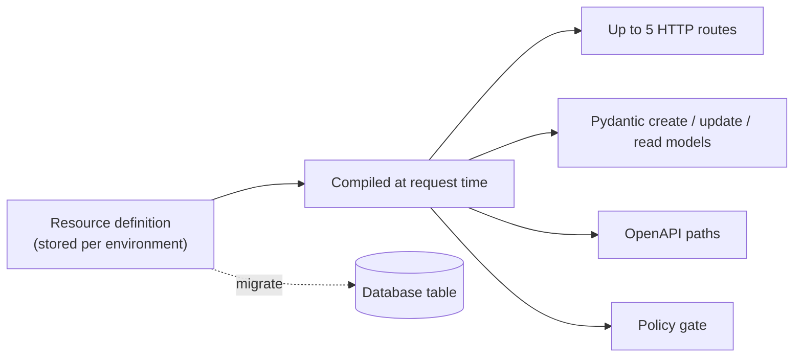

## The mental model

If you have worked with Rails, Django REST Framework, Supabase, Firestore, or any Laravel-style resource layer, a Pawabase Resource will feel familiar with one fundamental architectural difference: nothing is inferred from the database schema. A Resource is a declaration you write — fields, operations, policies — and the platform compiles it into HTTP routes, validation models, and (optionally) database columns. The table follows the definition, not the other way around.

This means you can prototype an API against a fresh database and later point the same Resource definition at a production table that already has a schema from a legacy system, an ETL pipeline, or a data warehouse export, without changing a single line of the definition. The separation of the definition layer from the storage layer is the thing that makes Pawabase feel like a product rather than a framework you have to wire up yourself.

If you know Rails, the Pawabase equivalent of a Resource is one definition replacing a model, a serializer, a controller, and a routes file. If you know Supabase, the equivalent is one definition where the table and the row-level policies are separate concerns edited in the same place. If you know Firestore, the equivalent is one definition minus the client-driven query-shape constraints — the server, not the client SDK, decides what a query can do.

The definition is stored as data — a row in Pawabase's own control-plane database, scoped to your project and environment. That is what lets Studio edit it with forms, the platform API create it with a JSON body, and environment promotion copy it from `staging` to `production` without regenerating or redeploying any code. Editing a Resource in Studio and clicking Save is the same operation, underneath, as `PUT /platform/v1/projects/{ref}/envs/{env}/resources/{name}` — Studio is a client of that same platform API.



A Resource definition has five groups of settings, all of which this page (and its companion pages) cover in full:

| Group | Keys | What they control |
| --- | --- | --- |
| Identity | `name`, `description`, `table`, `primary_key`, `id_type` | The URL segment, the database table, the id format |
| Shape | `fields` | Validation, serialization, and (on migrate) column types |
| Access | `operations` | Which of the five HTTP methods exist at all, and who may call each one |
| Graph | `relations` | `belongs_to` / `has_many` semantics and `?expand=` behavior — see [Relations](/data/relations) |
| Behaviour | `owner_field`, `timestamps`, `events`, `realtime`, `transformer`, `cache_ttl`, `rate_limit`, `tags` | Side effects, performance, and observability |

Everything in this page is verified directly against the compiler that turns a definition into routes (`app/compiler/resources.py`), the data layer that turns a definition into SQL (`app/data/store.py`), and the request models Studio's save button validates against (`routes/platform/definitions.py`).

## The five operations

Every Resource exposes up to five operations under `/rest/v1/<name>`. Each operation is independently enabled and independently governed by its own policy — there is no resource-level "public" or "private" switch. Nothing is reachable by default: an operation does not exist as a route until you explicitly turn it on, and turning it on always requires naming a policy (it defaults to `authenticated` if you don't set one explicitly in Studio, but it is never silently `public`).

| Operation | HTTP verb | Route | Notes |
| --- | --- | --- | --- |
| `list` | `GET` | `/rest/v1/<name>` | Filter, sort, paginate, `select`, `expand` |
| `get` | `GET` | `/rest/v1/<name>/{id}` | Single record. Supports `expand` |
| `create` | `POST` | `/rest/v1/<name>` | Body validated against the create model. Returns `201` |
| `update` | `PATCH` | `/rest/v1/<name>/{id}` | Partial update. `PUT` is registered as an undocumented alias |
| `delete` | `DELETE` | `/rest/v1/<name>/{id}` | Returns `204 No Content`. Hard delete only |

An operation left disabled is not merely policy-refused — the route is not registered at all. `GET .../resources/<name>/openapi` from the platform API (or the compiled-routes view in Studio) shows exactly which routes exist for a given Resource, which is the fastest way to confirm whether an operation you expected is actually live.

## list — `GET /rest/v1/<name>`

The list operation returns a paginated collection of records matching the caller's filters and the operation's policy. It accepts six query parameters — `page`, `per_page`, `sort`, `select`, `expand`, and any number of `filter[<field>]` parameters. The response always has the shape `{data, page, per_page, total}`.

```bash
curl "$GW/rest/v1/invoices?filter[status]=eq.overdue&sort=-due_on&page=1&per_page=20&expand=payments" \
  -H "apikey: $PK" -H "Authorization: Bearer $TOKEN"
```

```json
{
  "data": [
    {
      "id": 44,
      "invoice_no": "INV-202600001",
      "student_id": 12,
      "amount": 210000,
      "balance": 60000,
      "status": "overdue",
      "due_on": "2026-09-01",
      "created_at": "2026-08-01T09:00:00+00:00",
      "updated_at": "2026-09-15T11:30:00+00:00",
      "payments": [
        {"id": 91, "amount": 150000, "paid_on": "2026-08-20"}
      ]
    }
  ],
  "page": 1,
  "per_page": 20,
  "total": 7
}
```

| Parameter | Default | Meaning | Limits |
| --- | --- | --- | --- |
| `page` | `1` | 1-indexed page number | `>= 1` |
| `per_page` | `20` | Rows per page | `1`–`200` |
| `sort` | Primary key ascending | Comma-separated fields, `-` prefix for descending | Must reference a declared field or `400` |
| `select` | Every declared field | Comma-separated column projection; the primary key is always added back | — |
| `expand` | none | Comma-separated relation names | One level deep; unknown name returns `400` |
| `filter[<field>]` | none | Any number of filter parameters, ANDed | See [Filtering](/data/filtering) |

An empty result set is not an error — `{"data": [], "page": 1, "per_page": 20, "total": 0}` is a perfectly normal response for a filter that matches nothing.

`total` counts rows matching both your filters and the policy's SQL-level conditions. It comes back `null`, specifically, only when the policy could not be pushed all the way into the `WHERE` clause and had to fall back to evaluating each row individually after fetching the page — see [What "residual" means for total](#what-residual-means-for-total) below. Do not treat a `null` total as an error state in your client code; it is an expected, documented value for policies with row-level conditions the database cannot express directly.

### An unauthenticated or under-scoped caller on `list`

If the operation's policy refuses the caller outright (no row could ever satisfy it — for example, a policy requiring a specific role the caller's token doesn't carry), the request never reaches the database. It fails at the gate with `401 Unauthorized` if the caller isn't authenticated at all, or `403 Forbidden` if they are authenticated but the policy still refuses:

```json
{"error": "forbidden", "message": "policy 'school_admin' refused"}
```

## get — `GET /rest/v1/<name>/{id}`

Returns a single record with `200 OK`.

```bash
curl "$GW/rest/v1/invoices/44?expand=payments" \
  -H "apikey: $PK" -H "Authorization: Bearer $TOKEN"
```

```json
{
  "id": 44,
  "invoice_no": "INV-202600001",
  "student_id": 12,
  "amount": 210000,
  "balance": 60000,
  "status": "overdue",
  "due_on": "2026-09-01",
  "payments": [{"id": 91, "amount": 150000, "paid_on": "2026-08-20"}]
}
```

Returns `404 Not Found` — never `403` — both when the record genuinely does not exist and when the caller's `get` policy refuses it:

```json
{"error": "not_found", "message": "Not found"}
```

This is deliberate: distinguishing "you can't see this" from "this doesn't exist" would let a caller probe for the existence of records they aren't allowed to read (a guardian could learn another family's invoice numbers exist, even without seeing their contents). Refused and missing are indistinguishable on purpose.

With `id_type: "integer"`, a path segment that doesn't parse as digits (`/rest/v1/invoices/abc`) also returns `404`, not `400` — the id is coerced before the lookup, and a value that can't be coerced is treated the same as "no record has this id."

## create — `POST /rest/v1/<name>`

```bash
curl -X POST "$GW/rest/v1/invoices" \
  -H "apikey: $PK" -H "Authorization: Bearer $TOKEN" -H "Content-Type: application/json" \
  -d '{"student_id": 12, "amount": 210000, "due_on": "2026-10-01", "status": "pending"}'
```

```json
{
  "id": 57,
  "invoice_no": null,
  "student_id": 12,
  "amount": 210000,
  "balance": null,
  "status": "pending",
  "due_on": "2026-10-01",
  "created_at": "2026-09-30T08:12:04+00:00",
  "updated_at": "2026-09-30T08:12:04+00:00"
}
```

`201 Created` on success. The body is validated against the resource's compiled create model — built from `fields` with `mode="create"` — before the policy or the database ever run. Unknown fields, missing required fields, and constraint violations are all rejected with `422` at this stage; see [Validation](/data/validation) for the exact error shape and the complete constraint set.

**Defaults count as values.** A field with a `default` that the client omits is treated as if the client had sent the default — it participates in the created record and in the policy check that follows, not as an absent value filled in silently afterward. An *optional* field with no default that the client simply doesn't send stays absent (not `null`, not present) unless the column itself defaults something at the database layer.

**`owner_field` is stamped after validation, before the policy check.** If the resource declares `owner_field: "created_by"`, the caller's authenticated identity overwrites whatever the client sent for that field — a client cannot create a record and claim to be someone else. If the resource has an `owner_field` and the caller is not authenticated (no `user` in scope) *and* is not a service credential, the request is refused with `401` before the policy ever runs, because there is no identity to stamp:

```json
{"error": "unauthenticated", "message": "Authentication required"}
```

Because the stamp happens before the policy check, a `create` policy can safely reference `$input.created_by` (or whatever the owner field is named) and trust that it is the caller's own id, never a spoofed one.

## update — `PATCH /rest/v1/<name>/{id}`

```bash
curl -X PATCH "$GW/rest/v1/invoices/57" \
  -H "apikey: $PK" -H "Authorization: Bearer $TOKEN" -H "Content-Type: application/json" \
  -d '{"status": "paid", "balance": 0}'
```

```json
{
  "id": 57,
  "invoice_no": null,
  "student_id": 12,
  "amount": 210000,
  "balance": 0,
  "status": "paid",
  "due_on": "2026-10-01",
  "created_at": "2026-09-30T08:12:04+00:00",
  "updated_at": "2026-09-30T09:05:11+00:00"
}
```

`PATCH` is a partial update: only the fields present in the body are validated and written (`exclude_unset` on the compiled update model, so an explicit `null` is written as `null` but an omitted key is left untouched). Every field is optional on the update model regardless of `required: true` on the field definition — `required` only governs `create`.

`PUT` is also registered, as a byte-for-byte alias of the same handler, but it is intentionally excluded from the generated OpenAPI document (`exclude_from_schema=True`) — it exists for HTTP clients and libraries that assume PUT for whole-resource updates, but `PATCH` is the one Pawabase documents and the one Studio's API explorer shows.

If `owner_field` is set, the client cannot change it through an update — the incoming value for that field is dropped from the patch before it reaches the policy or the database, regardless of what was sent.

**The 404/403 split.** If the record does not exist at all, the response is `404` immediately, before the policy runs (there is nothing to check a policy against). If the record exists but the policy refuses the update, the status code depends on whether the caller is authenticated:

- Authenticated caller, policy refuses → `403 Forbidden`
- Unauthenticated caller (no `user` in scope), policy refuses → `404 Not Found`

```json
{"error": "not_found", "message": "policy 'family_access' refused"}
```

The reasoning mirrors `get`: an anonymous caller shouldn't be able to distinguish "exists but you can't touch it" from "doesn't exist," while a signed-in caller who is refused gets the more informative `403` because they're already identified — there's no anonymity to protect by hiding existence from them.

The policy for `update` receives both `record` (the row as it existed *before* the change) and `input` (the submitted patch), which makes transition-aware policies possible — for example, refusing a patch that tries to move `status` from `"paid"` back to `"pending"`.

## delete — `DELETE /rest/v1/<name>/{id}`

```bash
curl -X DELETE "$GW/rest/v1/invoices/57" \
  -H "apikey: $PK" -H "Authorization: Bearer $TOKEN"
```

`204 No Content` on success — no response body. The same 404-before-policy, then 403/404-split-by-authentication logic as `update` applies: missing record is always `404`; a policy refusal is `403` for an authenticated caller and `404` for an anonymous one. Deletes are hard deletes — there is no soft-delete flag built into the platform. Model soft delete yourself with a `status` or `deleted_at` field and a policy that filters on it.

## Anatomy of a definition

```json
{
  "name": "invoices",
  "description": "Tuition invoices raised against a student.",
  "table": "invoices",
  "primary_key": "id",
  "id_type": "integer",
  "fields": [
    {"name": "student_id", "type": "integer", "required": true},
    {"name": "invoice_no", "type": "string", "max_length": 32},
    {"name": "amount", "type": "integer", "required": true, "minimum": 0},
    {"name": "balance", "type": "integer", "minimum": 0},
    {"name": "status", "type": "string", "enum": ["pending", "overdue", "paid"], "default": "pending"},
    {"name": "due_on", "type": "date", "required": true}
  ],
  "operations": {
    "list": {"enabled": true, "policy": "family_access"},
    "get": {"enabled": true, "policy": "family_access"},
    "create": {"enabled": true, "policy": "school_admin"},
    "update": {"enabled": true, "policy": "school_admin"},
    "delete": {"enabled": true, "policy": "school_admin"}
  },
  "relations": [
    {"name": "student", "resource": "students", "field": "student_id", "type": "belongs_to"},
    {"name": "payments", "resource": "payments", "field": "invoice_id", "type": "has_many"}
  ],
  "owner_field": null,
  "timestamps": true,
  "events": true,
  "realtime": false,
  "cache_ttl": 0,
  "rate_limit": {},
  "tags": ["Invoices"]
}
```

## id_type: integer or uuid

Exactly two options exist, enforced at the request-model level with `Literal["integer", "uuid"]` — anything else is refused when you save the definition, with `422 Unprocessable Entity`, before it is ever stored. There is no third option and no custom id strategy; if you need something else (a slug, a composite key, an externally-assigned id), declare it as an ordinary field and set your own `primary_key` to point at it instead of relying on `id_type`.

| | `integer` (default) | `uuid` |
| --- | --- | --- |
| How ids are assigned | Database auto-increment | Server generates a v4 UUID on insert |
| Shape in URLs | `44` | `a1b2c3d4-...` |
| Sequential / guessable | Yes | No |
| Column type on migrate | `INTEGER` / `BIGINT` | `UUID` (Postgres) or `VARCHAR(36)` |
| Client may set the id on create | No — server-assigned always | No — server-generated always, even if the client sends one |

Switching `id_type` on an existing Resource does not retroactively convert the column or existing rows — it only changes what new inserts do and how the platform coerces path parameters. Changing it on a Resource with existing data of the other type will produce a broken table; treat `id_type` as fixed at Resource creation time.

## table and primary_key

`table` defaults to `name` and only needs setting when you want the API name and the database table name to differ — the standard technique for [exposing an existing table](#exposing-an-existing-table) under a friendlier API name. `primary_key` defaults to `id`. Both are validated against `^[A-Za-z_][A-Za-z0-9_]{0,62}$` and are **never exposed to API clients** — a client interacting with `/rest/v1/invoices` has no way to discover, from the API alone, that the underlying table is actually called `tbl_invoices_legacy`, nor that the primary key column is `invoice_pk`.

## Exposing an existing table

Three steps:

1. Set `table` to the existing table's name and `primary_key` to its key column.
2. Add `fields` matching the columns you want to expose — declare only the columns you want visible; anything you don't declare is invisible to API clients even though it exists in the database.
3. Skip `migrate` — that operation is for creating or extending tables the platform owns; a table with a schema managed by another process should never be handed to it.

This is the standard way to give an API surface to tables populated by ETL jobs, legacy applications, or data-warehouse exports, without duplicating or transforming the underlying data. Because `table` and `primary_key` are hidden from clients, you can also rename the underlying table later (a maintenance operation) without breaking any API consumer, as long as you update the definition to point at the new name in the same deploy.

## Behaviour flags

| Flag | Default | Effect |
| --- | --- | --- |
| `owner_field` | `null` | Stamps the caller's identity onto this column on every `create`; stripped from client input on `update` |
| `timestamps` | `true` | Maintains `created_at` and `updated_at`, both server-set, never client-writable |
| `events` | `true` | Emits `<name>.created` / `.updated` / `.deleted` — see [Resource events](/data/resource-events) |
| `realtime` | `false` | Publishes the same changes to the `resource:<name>` channel |
| `transformer` | `null` | Reshapes every response — see [Transformers](/data/transformers) |
| `cache_ttl` | `0` (off) | Caches `list` and `get` responses — see [Caching](/data/caching) |
| `rate_limit` | `{}` (off) | Caps requests per caller per window |
| `tags` | `[]` | OpenAPI grouping only; no runtime effect |

## What "residual" means for total

Every enabled operation's policy is evaluated in two parts. Conditions that don't depend on the specific row being read (role checks, scope checks, static claims) are decided once, before any query runs, and — where the policy engine can express them as SQL — pushed into the `WHERE` clause alongside your filters. Conditions that genuinely depend on the row's own data in a way the engine can't translate to SQL are left as a **residual**: a per-row check applied in the application after the page is fetched from the database.

When a residual is active on `list`, the platform fetches the page, evaluates the residual against each row, drops the ones that fail, and — because that filtering happens after the count query already ran — sets `total: null` rather than reporting a number that would be wrong for anyone using it to compute a page count. This is not a bug or a missing feature; it's the honest answer when an exact total can't be computed without evaluating every row in the table.

## What you get for free

Validation before policies and before SQL. Typed responses and automatic OpenAPI entries for every enabled operation. Server-maintained timestamps. Events carrying the full post-write record. Cache invalidation on every write, scoped by tag. Realtime publication when enabled. Rate limiting enforced consistently across every API instance (backed by Redis when configured). Consistent, machine-parseable error shapes for every failure mode. Policy pushdown into SQL wherever the condition allows it. None of this is opt-in boilerplate you assemble — it is simply what defining a Resource means.

## Resources vs. custom routes

Resources cover CRUD-with-rules: a client sends a row (or asks for rows), the system validates it, checks a policy, and reads or writes exactly one table. [Custom routes](/data/custom-routes) cover workflows: reading or writing more than one table in a single request, calling external services, walking decision trees, or returning a response shaped nothing like a record. If your operation's honest one-line description is "a client sends a row, the system stores it, the system returns it," it's a Resource operation. If it needs "and then," it's a custom route.

## Resources vs. the database console

Studio's database console runs SQL directly against the environment's database, entirely bypassing Resource definitions, validation, and policies. It has its own audit trail and is scoped to operator credentials — it is never reachable by an API client. Use it for one-off inspection, backfills, and debugging schema drift; never build application behavior on top of it, since none of the guarantees this page describes (validation, policy enforcement, event emission, cache invalidation) apply to writes made through the console. Studio's record-browsing UI for a specific Resource, by contrast, goes through `after_write` the same way the public API does — cache invalidation, events, and realtime all fire from Studio edits exactly as they would from a client's `PATCH`.

## Complete worked example: school fees

A `students` / `invoices` / `payments` trio demonstrating `belongs_to` and `has_many` relationships, an owner-scoped read policy, and a write-restricted admin policy. A guardian can list and read only their own children's invoices; a bursar can do everything.

```json
{
  "name": "students",
  "id_type": "integer",
  "fields": [
    {"name": "first_name", "type": "string", "required": true, "max_length": 80},
    {"name": "last_name", "type": "string", "required": true, "max_length": 80},
    {"name": "class_id", "type": "integer", "required": true},
    {"name": "guardian_id", "type": "integer", "required": true}
  ],
  "operations": {
    "list": {"enabled": true, "policy": "family_access"},
    "get": {"enabled": true, "policy": "family_access"},
    "create": {"enabled": true, "policy": "school_admin"},
    "update": {"enabled": true, "policy": "school_admin"},
    "delete": {"enabled": true, "policy": "school_admin"}
  },
  "relations": [
    {"name": "invoices", "type": "has_many", "resource": "invoices", "field": "student_id"}
  ],
  "owner_field": null,
  "timestamps": true,
  "events": true,
  "realtime": false,
  "cache_ttl": 0,
  "tags": ["Students"]
}
```

```json
{
  "name": "invoices",
  "id_type": "integer",
  "fields": [
    {"name": "student_id", "type": "integer", "required": true},
    {"name": "amount", "type": "integer", "required": true, "minimum": 0},
    {"name": "balance", "type": "integer", "minimum": 0},
    {"name": "status", "type": "string", "enum": ["pending", "overdue", "paid"], "default": "pending"},
    {"name": "due_on", "type": "date", "required": true}
  ],
  "operations": {
    "list": {"enabled": true, "policy": "family_access"},
    "get": {"enabled": true, "policy": "family_access"},
    "create": {"enabled": true, "policy": "school_admin"},
    "update": {"enabled": true, "policy": "school_admin"},
    "delete": {"enabled": true, "policy": "school_admin"}
  },
  "relations": [
    {"name": "student", "type": "belongs_to", "resource": "students", "field": "student_id"},
    {"name": "payments", "type": "has_many", "resource": "payments", "field": "invoice_id"}
  ],
  "cache_ttl": 30,
  "events": true,
  "realtime": true,
  "tags": ["Invoices"]
}
```

`family_access` is a policy resolved by name against the environment's policy definitions — see the policies documentation for how a condition like `{"eq": ["$record.guardian_id", "$auth.user_id"]}` is written and how it pushes down into SQL.

## Complete worked example: commerce catalog

A `products` / `product_variants` pair demonstrating a `has_many` relation, a `write_only` internal cost field that a shopper's response never contains, and a transformer that reshapes the public response — full field-by-field transformer coverage is in [Transformers](/data/transformers).

```json
{
  "name": "products",
  "id_type": "uuid",
  "fields": [
    {"name": "title", "type": "string", "required": true, "max_length": 200},
    {"name": "slug", "type": "string", "required": true, "unique": true},
    {"name": "description", "type": "text"},
    {"name": "price_cents", "type": "integer", "required": true, "minimum": 0},
    {"name": "cost_cents", "type": "integer", "write_only": true},
    {"name": "active", "type": "boolean", "default": true}
  ],
  "operations": {
    "list": {"enabled": true, "policy": "public"},
    "get": {"enabled": true, "policy": "public"},
    "create": {"enabled": true, "policy": "staff"},
    "update": {"enabled": true, "policy": "staff"},
    "delete": {"enabled": true, "policy": "staff"}
  },
  "relations": [
    {"name": "variants", "type": "has_many", "resource": "product_variants", "field": "product_id"}
  ],
  "transformer": {"omit": ["cost_cents"], "case": "camel"},
  "cache_ttl": 60,
  "realtime": true,
  "tags": ["Catalog"]
}
```

`cost_cents` never reaches the read model at all because it is `write_only` — the `omit` in the transformer is belt-and-suspenders for a field that is also referenced by `create`/`update`, making the intent explicit even though the read model already excludes it structurally.

## Versioning and compiled state

Every definition save bumps the environment's version counter. Compiled state — the routes, the Pydantic models, the OpenAPI document — is cached per version, not recompiled on every request. The very next request after a save is served against a fresh compile for the new version; there is no propagation delay to wait out, but if you're testing immediately after a save and see stale behavior, it usually means the request that "still looks old" was actually issued a moment before the save committed, not that the platform is slow to notice. Promotion between environments (`POST .../promote`) copies definitions and gives the target environment its own new version, compiled independently of the source environment's version.

## Troubleshooting

<AccordionGroup>
<Accordion title="A route returns 404 from the router itself, not a policy 404">
Check that the operation's `enabled` flag is `true`. A disabled operation registers no route at all — the 404 you're seeing is Sillo's router saying the path doesn't exist, not the resource's own not-found handling. `GET .../resources/<name>/openapi` shows exactly which routes are compiled for that resource.
</Accordion>
<Accordion title="The API still behaves like the old definition right after a save">
Compiled state is cached per environment version; a save bumps the version, and the very next request compiles fresh. If you're testing against a cached response from `cache_ttl`, that's a different cache — see [Caching](/data/caching).
</Accordion>
<Accordion title="create returns 201 but a field I sent is missing from the response">
Either the field isn't declared in `fields` at all (check for a typo), or it's `write_only: true` and is intentionally excluded from every read model.
</Accordion>
<Accordion title="total is null on a list response">
A residual policy is active for this caller — see [What residual means for total](#what-residual-means-for-total). This is expected behavior, not an error.
</Accordion>
<Accordion title="A field I marked required is being accepted as missing">
required only applies in create mode. On update every field is optional by design (PATCH is a partial update); required has no effect there.
</Accordion>
<Accordion title="An update to a nonexistent record returns 404 even though I have full admin rights">
Correct — the existence check runs before the policy check on both update and delete. There is no record to evaluate a policy against, so it's always 404 regardless of who's asking.
</Accordion>
</AccordionGroup>

## FAQ

<AccordionGroup>
<Accordion title="Can a resource have more than five operations?">
No — `list`, `get`, `create`, `update`, `delete` is the complete, fixed set. Anything else is a custom route.
</Accordion>
<Accordion title="Can I rename a resource in place?">
Not in place. Create a new resource with `table` pointing at the existing table if you want to keep the data under a new API name.
</Accordion>
<Accordion title="Does deleting a resource definition delete the table?">
No. The table and its rows are left untouched; only the definition (and therefore the API surface) disappears.
</Accordion>
<Accordion title="Do resources support soft delete as a built-in flag?">
No. Model it yourself with a `status` or `deleted_at` field, an `update` operation that sets it, and a policy that filters records where it's set.
</Accordion>
<Accordion title="Can PUT be used instead of PATCH for updates?">
It works — it's registered as an identical handler — but it is undocumented and excluded from the OpenAPI schema. PATCH is the supported, documented spelling.
</Accordion>
</AccordionGroup>

<CardGroup cols={2}>
  <Card title="Filtering" icon="filter" href="/data/filtering" />
  <Card title="Sorting and pagination" icon="sort" href="/data/sorting-pagination" />
  <Card title="Relations" icon="link" href="/data/relations" />
  <Card title="Validation" icon="badge-check" href="/data/validation" />
</CardGroup>
