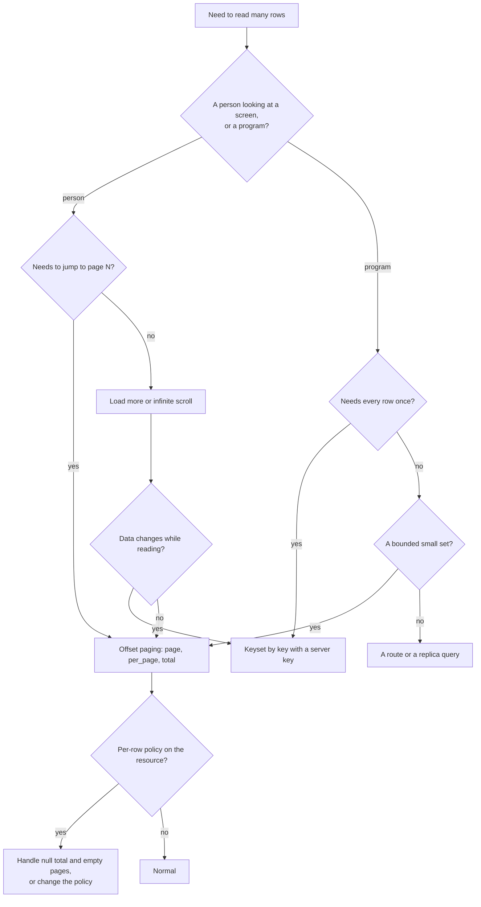

## The mental model: an ordered list, cut into numbered slices

A resource list can be long, so the data API never returns all of it. It returns one **page**: a slice of the rows that match the request, in an order the request chose. Three parameters decide the slice, and a fourth value in the response says how big the whole set was.

| Parameter or value | What it controls | Default | Limits |
| --- | --- | --- | --- |
| `sort` | The order of the matching rows | The key, ascending | Field names, comma-separated, `-` for descending |
| `per_page` | How many rows are in a page | `20` | From `1` to `200` |
| `page` | Which slice, counting from `1` | `1` | `1` or more |
| `total` in the response | How many rows matched, across all pages | Computed | `null` when a per-row policy applies |

A page is not a position in a stable list. It is "skip `(page - 1) × per_page` rows, then take `per_page`", evaluated again on every request against whatever the table holds at that moment. That one fact explains most of what goes wrong with paging: rows can repeat across pages, a deep page can cost a lot, and an empty page does not always mean the end. The rest of this page works through each of those with the requests and numbers that show them.

<Note>
Everything here was run against a Pawabase API. Timings come from an in-process SQLite database on a laptop with 200,000 rows, so treat them as relative, and expect other databases to differ in the details and agree in the shape. The page on [Filtering](/data/filtering) covers the `filter[...]` parameters that narrow the rows before they are sorted and cut.
</Note>

## The response

Every list request answers with the same envelope:

```json
GET /rest/v1/rows?per_page=3&page=2&sort=-id

{
  "data": [ {...}, {...}, {...} ],
  "page": 2,
  "per_page": 3,
  "total": 8
}
```

| Field | Meaning |
| --- | --- |
| `data` | The rows of this page, at most `per_page` of them. Empty when `page` is past the end |
| `page` | The page that was served, echoing the request, or `1` by default |
| `per_page` | The page size that was used |
| `total` | The number of rows that match the filters, across all pages. `null` when a per-row policy makes the database's count unreliable |

There is no `next` link, no `has_more` flag and no cursor in the envelope. A client works out whether another page exists from `page`, `per_page` and `total`: another page exists when `page × per_page < total`. When `total` is `null`, that arithmetic is not available, and the section on per-row policies explains what to do instead.

## `sort`

### The syntax

`sort` is a comma-separated list of field names. A leading `-` means descending, and a bare name means ascending:

```text
sort=price                 ascending by price
sort=-created_at           newest first
sort=status,-created_at    by status, then newest first within each status
```

Fields are applied left to right as `ORDER BY` terms, so the first is the primary order and each later field breaks ties among the rows the earlier ones left equal. These results come from eight rows with a text `grp` (two of them unset) and an integer `v`:

| Request | Order of rows (as `id, grp, v`) |
| --- | --- |
| `sort=grp` | 3 (null), 6 (null), 2 a, 5 a, 8 a, 1 b, 4 b, 7 c |
| `sort=-grp` | 7 c, 1 b, 4 b, 2 a, 5 a, 8 a, 3 (null), 6 (null) |
| `sort=grp,-v` | 6 (null, 5), 3 (null, 2), 5 a 3, 8 a 2, 2 a 1, 1 b 3, 4 b 1, 7 c 2 |

The third row shows the tiebreak working: within each group the rows are ordered by `v` descending.

### Which fields can be sorted

Any field the resource declares, its primary key, `created_at` and `updated_at` (when timestamps are on) and its **Owner field**. A name that is none of those is refused:

```text
GET /rest/v1/rows?sort=nope   ->  400  {"error": "bad_request", "message": "cannot sort on unknown field 'nope'"}
GET /rest/v1/rows?sort=-     ->  400  "cannot sort on unknown field ''"
```

A field of a structured type (`json`, `array`, `object`, `ref`) can be named, and sorting by it compares the stored text, which has no useful meaning.

### Forgiving details

The parser is lenient about punctuation, and each leniency was tested:

| Input | Result |
| --- | --- |
| `sort=` (empty) | Ignored, the default order |
| `sort=id,` or `sort=id,,v` | Empty pieces are ignored |
| `sort=-id,-id` | Accepted, the repeated term is harmless |
| `sort=+v` or `sort=%2Bv` | Ascending. A literal `+` is also the `%2B` form, and either way the plus is dropped |
| `sort=v&sort=-v` | The parameter was sent twice and **the last one wins**, so descending |
| `SORT=v` | Ignored. Parameter names are case-sensitive, so the default order is used |

The last two are the ones that cause quiet bugs: a client that appends a `sort` to a URL that already has one changes nothing about the first, and a misspelled parameter name is not an error. Set `sort` once, in lowercase, and check that the order you asked for is the order you got.

### The default order

When no `sort` is given, rows are ordered by the primary key, ascending. That is a deliberate choice, since it gives a stable order for plain paging, and it is also the cheapest order for the database to produce. Two practical consequences: a plain `GET /rest/v1/things` returns the oldest rows first for an auto-increment key, and a UUID key sorts as text, which has no relation to creation time. If a list should show the newest first, say `sort=-created_at` or, for an auto-increment key, `sort=-id`.

### Ties

When two rows are equal on every sort field, the database may return them in any order, and the order can differ between runs and between pages. SQLite happened to return ties in key order, and PostgreSQL and MySQL do not promise one. A page boundary that falls in the middle of a run of ties can therefore repeat a row or skip one. The fix is to end every `sort` with a field that is unique, which is the key:

```text
sort=status,-created_at,id        a total order: no two rows are equal
```

Add `id` (or whatever the primary key is called) as the last term whenever the other fields are not unique. It costs nothing in the common case and removes a class of paging bugs that are hard to reproduce.

### `NULL` placement

Where unset values go is the database's choice, and the three databases differ. On SQLite, `NULL` came first in an ascending sort and last in a descending one, as the table above shows. MySQL does the same. PostgreSQL does the opposite, placing `NULL` last in ascending order and first in descending. Pawabase adds no `NULLS FIRST` or `NULLS LAST` clause. If a screen depends on where unset values appear, give the field a default so it is never `NULL`, or filter with `isnot.null` before sorting.

| Sort | SQLite | MySQL | PostgreSQL |
| --- | --- | --- | --- |
| `sort=grp` (ascending) | `NULL` first | `NULL` first | `NULL` last |
| `sort=-grp` (descending) | `NULL` last | `NULL` last | `NULL` first |

### Text, numbers and time

The comparison follows the column's type. Numbers sort numerically, dates sort chronologically, and text sorts by the database's collation. On SQLite text is compared by bytes, so uppercase letters sort before lowercase ones (`B` before `a`). On PostgreSQL and MySQL the collation usually sorts case-insensitively and by locale. A `datetime` sorts chronologically on PostgreSQL and MySQL. On SQLite it sorts as text, which is chronological only while every value uses the same offset, so write timestamps in UTC. See [Field types](/data/field-types) for how each type is stored.

## `page` and `per_page`

### Defaults and limits

`per_page` defaults to `20` and cannot exceed `200`. `page` starts at `1`. Both are checked as query parameters, before the resource's own handler, and a value outside the range is a `422` with the framework's `detail` envelope, not a `400`:

| Request | Result |
| --- | --- |
| `per_page=200` | `200`, up to two hundred rows |
| `per_page=201` | `422`, "Input should be less than or equal to 200" |
| `per_page=0` | `422`, "Input should be greater than or equal to 1" |
| `per_page=2.5`, `per_page=abc`, `per_page=` | `422`, "Input should be a valid integer" |
| `page=0`, `page=-1` | `422`, "Input should be greater than or equal to 1" |
| `page=1.0` | `200`, accepted as `1` |
| `page=2.5`, `page=`, `page=abc` | `422` |
| `PAGE=2` | Ignored. The names are case-sensitive, so page 1 is served |
| `page=99` (past the end) | `200` with an empty `data` and the real `total` |

The shape of the `422` is the one for typed query parameters: `{"detail": [{"loc": ["query", "per_page"], "msg": "...", "type": "...", "input": "201"}]}`, which differs from the bare array that a bad request body returns. See [Validation](/data/validation) for every error shape. The ceiling of 200 is a platform limit and is not configurable per resource.

### A page past the end is not an error

Asking for a page that does not exist returns `200`, an empty `data`, and the true `total`:

```text
GET /rest/v1/rows?per_page=5&page=41   ->  200  {"data": [], "page": 41, "per_page": 5, "total": 200}
```

That is useful: the response itself says how big the set is, so a client that overshot can recompute the last page. It also means an empty page is not a signal on its own. With an exact `total`, an empty page past the end means "done". With a per-row policy it can mean something else, as described below.

## `total`

### What it counts

`total` is the number of rows that match the request's filters, and the policy's conditions, across every page. It does not depend on `page`, `per_page` or `sort`. A request for the fortieth page of 200 rows says `total: 200`, the same as the first.

```text
GET /rest/v1/things?filter[qty]=gte.150&per_page=1   ->  total: 51,  data: [one row]
GET /rest/v1/things?filter[qty]=lt.0&per_page=1      ->  total: 0,   data: []
```

The second line is the standard way to get a count without the rows: ask for one row and read `total`.

### How it is computed

Every list request runs two statements. One fetches the page with `LIMIT` and `OFFSET`. The other counts the matching rows with the same `WHERE` clause. Both were captured for a request with two filters and a policy condition:

```text
SELECT "title","stock","id" FROM "products"
  WHERE "status"=? AND "stock">=? AND "owner_id"=?
  ORDER BY "created_at" DESC LIMIT ? OFFSET ?

SELECT COUNT(*) "total" FROM "products"
  WHERE "status"=? AND "stock">=? AND "owner_id"=?
```

A client cannot switch the count off, so every list pays for it. On a small table it is invisible. On a very large one, counting rows that match a non-indexed filter can cost as much as the page itself, which is one reason to filter on indexed fields, see [Filtering](/data/filtering).

### When it is `null`

A policy condition that cannot be turned into SQL is checked row by row after the page is fetched, and then the database's count is no longer the count of rows the caller may see. In that case Pawabase does not report one, and `total` is `null`:

```json
{"data": [ ... ], "page": 2, "per_page": 2, "total": null}
```

Clients must handle a `null` `total`, and the next section explains why that is more than a display issue.

## Paging with a per-row policy

Most list policies are decided in SQL. An `owner` policy becomes `"owner_id" = ?` in the `WHERE` clause, the database does the filtering, and paging behaves exactly as described so far. A policy that needs the row itself, such as `{"gt": ["$record.qty", 2]}` or an `any` of two different tests, is a **residual**: the database cannot apply it, so Pawabase reads a page and then removes the rows the policy refuses. That order of events changes what a page means.

With a resource of seven rows whose list policy refuses rows with `qty` of 2 or less, these were the results:

```text
GET /rest/v1/bigs                      ->  200  total: null   rows b3 b4 b5 b6 b7
GET /rest/v1/bigs?per_page=2&page=1    ->  200  total: null   data: []             <- rows 1 and 2 were read, then refused
GET /rest/v1/bigs?per_page=2&page=2    ->  200  total: null   rows b3 b4
```

The first page is **empty**, and more rows exist. The page was filled with rows 1 and 2 by the database, and then both were removed. The second page holds rows 3 and 4, and the page after it would hold 5 and 6. A page can also be **short**, with some rows removed and others kept.

| Effect | What it means for a client |
| --- | --- |
| `total` is `null` | The "page X of N" arithmetic is unavailable |
| A page can be empty or short while more rows exist | An empty page is not the end |
| The rows a caller sees per page vary | Pages are not the size `per_page` says |
| `select` changes the result | A residual policy reads only the **selected** columns of each row. Leave out a column it reads and it can drop every row, **or let rows through that it should have refused**. See [SQL pushdown](/policies/pushdown#a-select-can-walk-around-a-residual) |

### A residual walk, page by page

The same seven-row resource, read two at a time with a policy that refuses rows with `qty` of 2 or less. `select=title,qty` is included so the policy can see the column it reads. The rows are `b1` to `b7`, with `qty` equal to their number:

| Request | `data` | `total` |
| --- | --- | --- |
| `page=1` | empty | `null` |
| `page=2` | `b3`, `b4` | `null` |
| `page=3` | `b5`, `b6` | `null` |
| `page=4` | `b7` | `null` |
| `page=5` | empty | `null` |

The page that is empty at the start and the page that is empty at the end look the same. A client that stops at the first empty page reads nothing, and a client that stops at the first short page reads four rows. The only correct rule here is one that tolerates empty pages in the middle and decides to stop some other way: a bounded run of them, or keyset paging from a known key.

### Paging safely when `total` is `null`

An empty page cannot be the stopping rule, and a short page cannot either. Two rules work:

**Stop when the database has no more rows, not when the caller has no more visible rows.** The only signal that the table is exhausted is that a request returned **no rows from the database**, and the response does not say. The practical stand-in is to continue until a fixed number of consecutive empty pages, or to move to keyset paging, which skips the problem:

```text
GET /rest/v1/bigs?sort=id&per_page=50&filter[id]=gt.<last id seen>
```

With a key filter the next request starts after the last row the caller saw, so a stretch of refused rows is skipped over by the key and not by the page number. If the next page is empty, there may still be rows after a gap of refused ones, so keep going from the highest **key the database returned**. The response does not expose that key for refused rows, which is the limitation: a client can only advance past rows it has seen. For a large table with a sparse residual policy, the clean answer is to change the policy to one the database can apply (for example by adding an equality condition), or to list through a route that runs the query itself.

A reasonable rule for the common case of a small residual set is a bounded loop:

```typescript
export async function fetchAll(url: (page: number) => string, maxEmpty = 3) {
  const rows: any[] = [];
  let empty = 0;
  for (let page = 1; empty < maxEmpty; page++) {
    const res = await fetch(url(page), { headers: { apikey: KEY } });
    const body = await res.json();
    if (body.total !== null && rows.length >= body.total) break;     // exact total: stop at it
    if (body.data.length === 0) { empty++; continue; }
    empty = 0;
    rows.push(...body.data);
    if (body.total !== null && page * body.per_page >= body.total) break;
  }
  return rows;
}
```

This stops at the exact total when there is one, and otherwise after three empty pages in a row, which tolerates a gap. It is a heuristic. If a gap of refused rows can be longer than three pages, raise `maxEmpty`, or fix the policy.

## Paging while the data changes

Offset paging reads a fresh slice on every request. If rows are inserted or deleted between two requests, the slices shift. This is reproduced easily:

```text
GET /rest/v1/rows?per_page=3&page=1&sort=-id&select=id      ->  ids 8, 7, 6
(another client inserts one row, id 9)
GET /rest/v1/rows?per_page=3&page=2&sort=-id&select=id      ->  ids 6, 5, 4
```

Row 6 was the last on page 1 and is the first on page 2, because the new row pushed everything down by one. A client that collects pages into a list now holds row 6 twice. If a row had been deleted instead, one would have been skipped. The effect is proportional to how fast the data changes, and it is invisible in testing where nothing else writes.

| Situation | Effect |
| --- | --- |
| A row is inserted before the current position | Rows shift later, so the next page repeats one |
| A row is deleted before the current position | Rows shift earlier, so the next page skips one |
| A row changes its sort value | It may appear on two pages, or on none |
| Newest-first with new rows arriving | Every page boundary moves with each arrival |

Three ways to live with it: de-duplicate by key on the client, which hides repeats and cannot recover skips; read from a snapshot (a read replica or an export); or page by key, which does not have this problem for the common orderings.

## Paging by key

A **keyset** page does not say "skip N rows". It says "give me the rows after this key". The key of the last row of one page becomes the lower bound of the next. Because the key is filterable and sortable, the data API can do this with a filter and a sort, and no extra feature:

```text
GET /rest/v1/things?sort=id&per_page=3                      ->  ids 1, 2, 3      total 200
GET /rest/v1/things?sort=id&per_page=3&filter[id]=gt.3      ->  ids 4, 5, 6      total 197
GET /rest/v1/things?sort=id&per_page=3&filter[id]=gt.6      ->  ids 7, 8, 9      total 194
GET /rest/v1/things?sort=-id&per_page=3&filter[id]=lt.198   ->  ids 197, 196, 195
```

Each request is independent. A new row cannot move the lower bound, so nothing repeats, and a deleted row is simply not there. `page` stays at `1` throughout. The `total` in each response counts the rows **remaining** after the bound, which is what "how many more" should mean, and the page is complete when `total` falls to `per_page` or less.

### What it costs, and what it costs less

Keyset paging replaces `OFFSET` with a condition the index can use. On a table of 200,000 rows:

| Request | Time |
| --- | --- |
| `per_page=20`, page 1, default order | 6 ms |
| `per_page=20`, page 9999 (offset about 200,000), default order | 17 ms |
| `per_page=20`, page 9999, `sort=-id` | 15 ms |
| `per_page=20`, `filter[id]=gt.199980`, `sort=id` | 5 ms |
| `per_page=20`, page 1, `sort=score` (not indexed) | 27 ms |
| `per_page=20`, page 5000, `sort=score` (not indexed) | **1,366 ms** |

Two results deserve a note. A deep offset on the **key** is cheap on SQLite, because walking the key in order is how it stores the table, and a deep offset on an **unindexed** sort field is not: page 5000 of a sort by `score` took fifty times as long as page 1, because the database sorted two hundred thousand rows to find where page 5000 starts. That is the shape of the problem on every database. The cost of `OFFSET` is proportional to the offset when the order cannot come from an index, which is why a "last page" button on a large table is slow and a first-page request never is.

Other facts from the same run: `per_page=200` took 9 ms against `per_page=20`'s 6 ms, so a bigger page is cheap relative to a second request, and `select=id` brought that to 7 ms. A count-only request (`per_page=1`) took 6 ms.

### Keyset on something other than the key

A key is the one column that is unique, so it is the natural cursor. Other columns work with a caveat, and one pattern does not work at all.

| Order | Cursor | Works? |
| --- | --- | --- |
| By the key, ascending or descending | The last key | Yes |
| By `created_at` | The last `created_at` | Almost: two rows with the same timestamp can be skipped at a page boundary. Use the key when it grows with time |
| By one non-unique field (price) | The last price | No: rows with the same price are skipped or repeated |
| By two fields (`status`, then `created_at`) | Both of the last row's values | No. The condition is "status after X, or status equal and created later", which needs an `OR` that filters cannot express |

The last row is the limit. A composite cursor needs a condition combining two columns with `OR`, and the filter syntax is `AND`-only, as [Filtering](/data/filtering) explains. For an order that is not the key, the choices are offset paging, a route that writes the comparison in SQL, or sorting by the key and treating the other field as a filter.

### Cursor pagination in a client

```typescript
export async function* walk(base: string, key: string, resource: string, pageSize = 100) {
  let last: number | string | null = null;
  while (true) {
    const params = new URLSearchParams({ sort: "id", per_page: String(pageSize) });
    if (last !== null) params.set("filter[id]", `gt.${last}`);
    const res = await fetch(`${base}/rest/v1/${resource}?${params}`, { headers: { apikey: key } });
    if (!res.ok) throw new Error(`HTTP ${res.status}`);
    const { data } = await res.json();
    if (data.length === 0) return;
    yield* data;
    last = data[data.length - 1].id;
    if (data.length < pageSize) return;     // a short page means the table is exhausted
  }
}

// for await (const row of walk(BASE, KEY, "orders")) { ... }
```

A short page ends the walk, which is correct here because the only filter is on the key and no policy removes rows. With a residual policy, a short page is not the end, see above. Use a secret key from a server when you need every row, since a publishable key sees only what its policy allows. The same loop in Python is `export` in the filtering page's recipes.

## Page-numbered, load-more and infinite scroll

The three common interface patterns map onto the parameters differently, and each has a mismatch to plan for.

| Pattern | Uses | Watch for |
| --- | --- | --- |
| Numbered pages with "page 3 of 12" | `page`, `per_page` and an exact `total` | `total` can be `null` with a per-row policy. The last page is slow on large unindexed sorts. Rows repeat or skip as data changes |
| "Load more" | Offset or keyset | With offset, a new row repeats the last visible one. Keyset avoids it |
| Infinite scroll | Keyset, with the last key as the cursor | A residual policy can make a request return nothing while more rows exist. Keep requesting until a bounded run of empty responses |
| Jump to a specific row | Neither | Fetch the row by key and show it, then page around it |
| "Showing 1 to 20 of 214" | `total` | `null` total: show "20 shown" and a load-more button |

For numbered pages, compute the last page from `total` and `per_page` with a ceiling: `Math.ceil(total / per_page)`, and clamp the requested page into `1..last`, so a user who deletes the last row of the last page lands on the new last page and not an empty one.

```typescript
export function pageInfo(total: number | null, page: number, perPage: number) {
  if (total === null) return { known: false, page, hasPrev: page > 1 };
  const last = Math.max(1, Math.ceil(total / perPage));
  const clamped = Math.min(Math.max(1, page), last);
  return {
    known: true, page: clamped, last,
    hasPrev: clamped > 1, hasNext: clamped < last,
    from: total === 0 ? 0 : (clamped - 1) * perPage + 1,
    to: Math.min(clamped * perPage, total),
  };
}
```

## A walk through eight rows

Before the cases that go wrong, here is a complete walk through a small set with nothing unusual about it: eight rows with a text `grp` and an integer `v`, read three at a time. The responses are exactly what the API returned.

```json
GET /rest/v1/rows?per_page=3&page=1

{"data": [{"grp": "b", "v": 3, "id": 1}, {"grp": "a", "v": 1, "id": 2}, {"grp": null, "v": 2, "id": 3}],
 "page": 1, "per_page": 3, "total": 8}
```

```json
GET /rest/v1/rows?per_page=3&page=2

{"data": [{"grp": "b", "v": 1, "id": 4}, {"grp": "a", "v": 3, "id": 5}, {"grp": null, "v": 5, "id": 6}],
 "page": 2, "per_page": 3, "total": 8}
```

```json
GET /rest/v1/rows?per_page=3&page=3

{"data": [{"grp": "c", "v": 2, "id": 7}, {"grp": "a", "v": 2, "id": 8}],
 "page": 3, "per_page": 3, "total": 8}
```

```json
GET /rest/v1/rows?per_page=3&page=4

{"data": [], "page": 4, "per_page": 3, "total": 8}
```

Four things are visible. The rows came back in key order, because no `sort` was given. The third page was short, with two rows, which is how a client can tell it was the last: `3 × 3 = 9` is at least `total`, so there is no page 4 worth asking for. The fourth request, which a client would not make if it computed that, returned an empty page with the real total and no error. And `total` was `8` in every response.

The same rows ordered by `v` descending, with the key as the tiebreak, page two:

```json
GET /rest/v1/rows?per_page=3&page=2&sort=-v,id

{"data": [{"grp": null, "v": 2, "id": 3}, {"grp": "c", "v": 2, "id": 7}, {"grp": "a", "v": 2, "id": 8}],
 "page": 2, "per_page": 3, "total": 8}
```

Three rows share `v` of 2, and the key orders them `3, 7, 8`. Without `id` in the sort their order would be the database's choice, and a page boundary falling between them would be a coin toss on some databases. With it, the order is the same whatever the page size.

## Newest first: `-id` or `-created_at`

"Newest first" is the most common sort there is, and the two ways to ask for it are not equal. Every resource has a `created_at` column when timestamps are on, and **it is not indexed**: the generated table has an index only on the key, and on the fields and owner column that were marked. So `sort=-created_at` is a sort on an unindexed column, and the plan shows it:

```text
EXPLAIN QUERY PLAN SELECT * FROM logs ORDER BY id DESC LIMIT 20
  ->  SCAN logs

EXPLAIN QUERY PLAN SELECT * FROM logs ORDER BY created_at DESC LIMIT 20
  ->  SCAN logs, USE TEMP B-TREE FOR ORDER BY
```

On a table of 200,000 rows with distinct timestamps, the same list took:

| Request | Without an index on `created_at` | With an index |
| --- | --- | --- |
| `sort=-id`, page 1 | 7 to 12 ms | 7 to 12 ms, unchanged |
| `sort=-created_at`, page 1 | 120 ms | 8 ms |
| `sort=-created_at`, page 5000 | 472 ms | 13 ms |
| `sort=-created_at,id`, page 1 | 121 ms | 8 ms |

The index is a single statement in the **Database** console, with **allow writes** ticked:

```sql
CREATE INDEX IF NOT EXISTS ix_logs_created_at ON logs (created_at);
```

After it, the plan reads `SCAN logs USING INDEX ix_logs_created_at`, the deep page that took half a second takes thirteen milliseconds, and adding the key as a tiebreak (`-created_at,id`) still used the index, with a small sort only within runs of equal timestamps. Two practical rules follow.

**For an auto-increment key, `sort=-id` is newest first and costs nothing.** The key grows with insertion, so descending key order is descending creation order, with no index to create and no ties. It is the right default for feeds and activity lists. It is not available for a **UUID** key, which has no time order, and for a resource whose rows are inserted out of time order (an import, a backfill), where `id` and `created_at` disagree.

**For any other case, index `created_at` before the table grows.** An unindexed sort costs the same on every page and is invisible on a small table, which is why it is found in production. The index is not part of the resource's definition, so create it in each environment that serves the resource, and keep a note of it next to the definition. See [Migrations](/data/migrations).

## Paging together with `expand`

`expand` attaches related rows to each row of the page, and its limit is not the page's. A `has_many` expansion fetches the children of **all the parents on the page in one query**, and that query returns at most 200 rows in total. When the children outnumber that, the parents later in the page receive fewer, and the response says nothing. Five parents, each with sixty children, read in one page:

```text
GET /rest/v1/parents?expand=kids&per_page=5&sort=id
  ->  P1 kids: 60,  P2 kids: 60,  P3 kids: 60,  P4 kids: 20,  P5 kids: 0

GET /rest/v1/parents?expand=kids&per_page=2&page=2&sort=id
  ->  P3 kids: 60,  P4 kids: 60
```

The first request is silently incomplete: `P4` has sixty children and is shown twenty, and `P5` has sixty and is shown none, because the 200-row budget ran out. The second request, with fewer parents on the page, is complete. The cap is on children per request, so the safe page size for an expanded list is `200 ÷ (the largest number of children a parent can have)`, rounded down, and a resource whose parents can have more than 200 children cannot be expanded at all. Check the expansion against the real data before relying on it, and see [Relations](/data/relations) for the details of the cap. A `belongs_to` expansion has a similar bound on the number of distinct parents.

| If the children per parent are | A safe `per_page` with `expand` |
| --- | --- |
| Up to 5 | 40 |
| Up to 20 | 10 |
| Up to 60 | 3 |
| Up to 200 | 1 |
| More than 200 | Do not expand. Fetch the children with their own filter and paging |

The last row is the general answer to a large child set: page the children as a list of their own, with `filter[parent_id]=eq.7` and keyset paging, and page the parents separately.

## UUID keys and key order

A resource whose **ID type** is **UUID** can be paged by key in the same way. The UUID is compared as text, so `filter[id]=gt.<last>` with `sort=id` walks the table once, each row exactly once:

```text
GET /rest/v1/tags?sort=id&per_page=3&select=label
GET /rest/v1/tags?sort=id&per_page=3&select=label&filter[id]=gt.<last id>
  ... until a page is empty.   Seen: t4, t0, t3, t6, t2, t1, t5   (7 rows, none repeated)
```

What does not carry over is the meaning of the order. Seven tags created in the order `t0` to `t6` came back in the order `t4, t0, t3, t6, t2, t1, t5`, because a version 4 UUID is random and the key order is the order of those random values. A UUID-keyed resource therefore has no "oldest first" or "newest first" in its default order, and `sort=-id` is not "newest first". Sort by `created_at`, with the key as the tiebreak (`sort=-created_at,id`), and index `created_at`, as in the section above. Keyset paging by key is still correct for walking everything, and it is the right tool for an export, as long as you do not expect the rows to arrive in creation order.

## Very large page numbers

The offset is computed from the page number, and a number large enough to overflow a 64-bit integer is not caught by the `page` parameter's validation, which only checks the minimum:

```text
GET /rest/v1/tags?page=999999999&per_page=200                   ->  200  data: [], total: 7
GET /rest/v1/tags?page=9223372036854775807&per_page=200         ->  500  Internal Server Error
GET /rest/v1/tags?page=99999999999999999999&per_page=200        ->  500
```

A page number in the hundreds of millions is harmless. One above about `9 × 10^18 ÷ per_page` overflows when multiplied into an offset, and the database refuses it. A client that takes the page number from user input (a URL, a form) should clamp it to the last page it knows about, which also prevents the empty-page flash that follows a deleted last row.

## Sorting and indexes

An `ORDER BY` is cheap when the database can read rows already in that order from an index, and costs a sort when it cannot. Which one happens is visible in the query plan, and the **Database** console allows `EXPLAIN QUERY PLAN` as a read-only statement, so you can check on your own data. These plans were captured on SQLite for a table of 50,000 rows with `kind` and `stamp` indexed and `score` not:

| Query | Plan | What it means |
| --- | --- | --- |
| `ORDER BY "stamp" LIMIT 20 OFFSET 40000` | `SCAN events USING INDEX ix_events_stamp` | The index delivers rows in order. A deep offset is a walk, with no sort |
| `ORDER BY "score" LIMIT 20 OFFSET 40000` | `SCAN events`, `USE TEMP B-TREE FOR ORDER BY` | Every row is read and sorted before the offset can be applied |
| `WHERE "kind"='k3' ORDER BY "id" LIMIT 20 OFFSET 2000` | `SEARCH events USING INDEX ix_events_kind` | The filter uses its index, and the key order comes along with it |
| `WHERE "kind"='k3' ORDER BY "stamp" LIMIT 20` | `SEARCH ... ix_events_kind`, `USE TEMP B-TREE FOR ORDER BY` | The filter's index finds the rows, but they are then sorted separately |
| `ORDER BY "score", "id" LIMIT 20` | `SCAN events`, `USE TEMP B-TREE FOR ORDER BY` | Adding the key as a tiebreak did not make the sort cheaper |

The pattern is the one to carry away. A sort on an indexed field is read from the index. A sort on a field with no index is computed, and the cost of computing it is paid on every page, including page 1. A filter and a sort on **different** fields cannot share one single-column index, so a screen that lists "the `k3` events by `stamp`" uses one index and then sorts.

### What to index for a list screen

| Screen | Index that helps | How to get it |
| --- | --- | --- |
| Newest first, no filter | `created_at`, or the key if it grows with time | Order by `-id`, which needs no new index |
| Sorted by a field the user picks | One index per sortable column | Mark `indexed` on those fields |
| Filtered by status, newest first | A composite index on `(status, created_at)` | Create it by hand in the **Database** console |
| Filtered by owner, newest first | A composite index on `(owner_id, created_at)` | The owner field is indexed on its own, and the composite is by hand |
| A column that every list sorts by | `indexed` | The field editor's JSON tab |

The field editor can mark one column `indexed` and cannot create a composite index. When a screen needs one, the **Database** console can, with **allow writes** ticked:

```sql
CREATE INDEX IF NOT EXISTS ix_orders_status_created ON orders (status, created_at);
```

An index you create this way is not in the resource's definition, so it is not recreated by **Create / migrate table** in another environment. Record it in your own migration notes and apply it wherever the resource exists. Confirm that it is used with `EXPLAIN` before and after. See [Database console](/data/database-console) and [Migrations](/data/migrations).

## How big a page should be

A larger `per_page` means fewer requests and a larger response, and the response size is easy to predict from the rows. These sizes are for a resource of four small fields:

| `per_page` | Response size | Per row |
| --- | --- | --- |
| 20 | about 3.1 KB | 153 bytes |
| 100 | about 15.3 KB | 152 bytes |
| 200 | about 30.8 KB | 153 bytes |
| 200, with `select=id` | about 12.1 KB | 61 bytes |

The size is linear in the number of rows, and the work in the database is almost flat: fetching 200 rows took 9 ms against 6 ms for 20. So a page size of a hundred or two hundred is the efficient choice for anything a program consumes, and twenty is a choice for what a person reads.

`select` shrinks the response by dropping the values of the columns you do not choose, but it does not drop their keys. The declared fields you did not select come back as `null`, so `select=id` still returned a row of the form `{"kind": null, "score": null, ..., "id": 7}`. The saving was 60 percent, and not the 90 that the single column suggests. A [transformer](/data/transformers) with `pick` removes the keys entirely.

## Paging inside a flow or a function

A flow reads a resource with the `resource.list` block, which takes `limit` and `offset` directly and not `page`:

```json
{"block": "resource.list",
 "config": {"resource": "events", "filters": {"kind": "k3"}, "sort": "id", "limit": 200, "offset": 0}}
```

The block's output is `{"data": [...], "total": N, "limit": 200, "offset": 0}`. Three rules apply, taken from the data layer. The page size is capped at **200** here too: a larger `limit` is accepted and the store reads at most 200 rows, while the output still shows the `limit` you asked for. `total` is exact, because a flow is trusted and no per-row policy applies. And `filters` are equalities only. A loop over a large table in a flow therefore walks `offset` in steps of 200, with the same cost profile as the HTTP API, and for a big export a loop with a `control.while` block and `filters` on the key is a keyset walk. In a function, `ctx.runtime.resource_list(resource, filters=..., sort=..., limit=..., offset=...)` does the same. Prefer a `db.query` with a key condition when the table is large, since it can use any index and is not limited to equality.

## Exports and reports

A full export has different needs from a screen: it must see every row exactly once, tolerate writes happening meanwhile, and not hold the database busy. These choices follow from the sections above.

| Need | Method |
| --- | --- |
| Every row, once, while writes continue | Keyset by key, with a server key, 100 to 200 rows per request |
| A consistent point-in-time copy | Not available through the data API. Use the database's own tools on a replica or a backup, see [Backups](/self-hosting/backups) |
| A report with aggregates | A route with `db.query`, or a query in the **Database** console. The data API has no aggregate operators |
| Rows matching a filter, once | The same keyset walk with the filters added. The `total` of the first response is the count at that moment |
| A very large table, rarely | A scheduled flow that walks the table and writes the result to a bucket, see [Schedules](/jobs/schedules) |

A keyset export tolerates inserts, because new rows have larger keys and are picked up at the end, and tolerates deletes, because a missing row is simply absent. It does not see updates to rows it has already passed, so the export reflects each row as of the moment it was read, not as of a single instant.

## Lists that update while the user looks at them

A screen that shows page 1 of "newest first" and receives new rows through a [realtime](/realtime/resource-changes) subscription has a design question: what happens to the page when a row arrives. Pagination and live updates fight each other, and the options are few.

| Approach | Behavior | Cost |
| --- | --- | --- |
| Re-fetch the current page on every event | Always consistent with the server | A request per event, and a flicker unless handled |
| Insert the new row at the top when the sort and filters match | Instant, no request | The client must apply the same sort and filter logic, and the page grows past `per_page` |
| Show "N new rows" and let the user apply | Stable view, user in control | One extra control |
| Page by key and prepend new keys above the first | Consistent without a re-fetch | Only for sorts that follow the key |

The third is the least surprising for users reading a list: the rows they are looking at do not move. The event payload carries the record, so the client can count new rows and only fetch when asked. See [Resource events](/data/resource-events) for the payload and [Realtime](/realtime/overview) for the channel.

## Designing the sort for each screen

A list screen has a default order and perhaps a few user choices. Decide them from what the screen is for, then make sure each has an index.

| Screen | Default sort | Offer | Index |
| --- | --- | --- | --- |
| Activity feed | `-id` or `-created_at` | Nothing | The key |
| Orders table | `-created_at,id` | Status, total, customer | `created_at`, plus the others as `indexed` |
| Directory of people | `name,id` | Name, newest | `name` |
| Leaderboard | `-score,id` | Nothing | `score` |
| Search results | The database's relevance, in a route | Nothing | Not applicable |
| Admin table over everything | `id` | Any column | Accept scans, small tables only |

For every row, the sort ends in the key so ties cannot reorder between pages. A `-created_at,id` sort has descending time and ascending key for ties, which is a total order.

## How the envelope compares with other APIs

If you are building a client library or porting one, the parts of this envelope to compare are these:

| API style | Pagination | Pawabase |
| --- | --- | --- |
| Offset (`page`, `per_page`) | Page numbers and a total | The native mode, with `total` and the caveats above |
| Cursor (`starting_after`, `has_more`) | An opaque cursor, a boolean | Not provided. Use `filter[id]=gt.<last>` and a short page as "no more" |
| Link headers (`rel="next"`) | URLs in a header | Not provided. Build the next URL yourself |
| `Range` and `Content-Range` | A range header | Not provided |
| GraphQL connections (`edges`, `pageInfo`) | A cursor per edge | Not provided |

A thin wrapper that turns Pawabase's envelope into the shape your application expects (a `nextCursor`, a `hasMore`) is a few lines, and it is the right place to hide the per-row policy caveats from the rest of the code. A wrapper should return `hasMore` as unknown when `total` is `null` and the page was empty, and let the caller decide.

## Measuring paging on your own data

Numbers from another table are a guide and not an answer. This script times a handful of the requests that matter against your own resource, from a server, with a secret key, so that you can see where the cliff is before users do:

```python
import os, statistics, time
import httpx

BASE, KEY = os.environ["PAWABASE_URL"], os.environ["PAWABASE_SECRET_KEY"]
H = {"apikey": KEY}

def timed(params, runs=5):
    samples = []
    for _ in range(runs):
        t = time.perf_counter()
        r = httpx.get(f"{BASE}/rest/v1/events", params=params, headers=H)
        r.raise_for_status()
        samples.append((time.perf_counter() - t) * 1000)
    return statistics.median(samples), r.json().get("total")

total = httpx.get(f"{BASE}/rest/v1/events", params={"per_page": 1}, headers=H).json()["total"]
last_page = max(1, total // 20)

for label, params in [
    ("first page, default order",         {"per_page": 20}),
    ("middle page, default order",        {"per_page": 20, "page": last_page // 2}),
    ("last page, default order",          {"per_page": 20, "page": last_page}),
    ("first page, sort=score",            {"per_page": 20, "sort": "score,id"}),
    ("last page, sort=score",             {"per_page": 20, "sort": "score,id", "page": last_page}),
    ("keyset near the end",               {"per_page": 20, "sort": "id", "filter[id]": f"gt.{total - 20}"}),
]:
    ms, t = timed(params)
    print(f"{label:34s} {ms:8.1f} ms")
```

Read the output as a ratio. If the last page of an unindexed sort costs ten or fifty times the first, the sort needs an index, or that screen needs keyset paging. Run it against a copy of production data when you can, since an empty development database hides every one of these costs. A table that is fast at ten thousand rows can be slow at ten million, and the sort that causes it is rarely the one anyone was watching.

## Sorting recipes

The sort is the database's order of a column, and several orders people want are not that. Each of these was checked against a resource of six rows named `item2`, `item10`, `Item1`, `apple`, `Banana` and `cherry`.

### Text does not sort the way a person sorts it

```text
GET /rest/v1/items?sort=name
  ->  Banana, Item1, apple, cherry, item10, item2
```

On SQLite the comparison is by bytes, so every uppercase name comes before every lowercase one, and `item10` comes before `item2` because `1` sorts before `2` as a character. Neither case-insensitive nor natural ordering is available as a `sort` option. The answers are the same as for searching: store a normalized copy and sort on it.

| Wanted order | Store | Sort by |
| --- | --- | --- |
| Case-insensitive | `name_lower`, the name in lowercase | `sort=name_lower,id` |
| Ignoring accents | `name_sort`, lowercase with accents removed | `sort=name_sort,id` |
| Natural (`item2` before `item10`) | `name_key`, the name with digit runs zero-padded (`item0002`, `item0010`) | `sort=name_key,id` |
| By locale rules | The database's collation, set on the column | Not controllable through the field editor |

The copy has to be written by whatever writes the row (a route, a flow, a trigger), and kept in step when the name changes. Index it if the list is long. PostgreSQL and MySQL collations often make the first two unnecessary, which is another place where development on SQLite and production on PostgreSQL behave differently.

### An enum sorts alphabetically, not by workflow

```text
GET /rest/v1/items?sort=status   ->  closed, new, open, solved   (alphabetical)
```

A status field with the values `new`, `open`, `solved` and `closed` sorts as `closed, new, open, solved`, which is rarely the order a workflow has. Give the status a numeric **rank** and sort on that, keeping the text for display:

```json
{"name": "status", "type": "string", "enum": ["new", "open", "solved", "closed"]}
{"name": "status_rank", "type": "integer", "enum": [1, 2, 3, 4]}
```

```text
GET /rest/v1/items?sort=status_rank,name
```

The two fields have to agree, so set both from one place, a route or a flow that maps the status to its rank. If the order is the only reason for the number, a policy cannot enforce the agreement, and a mismatch is a data bug that no validation will catch.

### Numbers and signs

Numbers sort numerically, including negatives and fractions, and `NULL` goes where the database puts it:

```text
GET /rest/v1/items?sort=score    ->  -2, -0.5, 0.5, 1.5, 10.25, 100
GET /rest/v1/items?sort=-score   ->  100, 10.25, 1.5, 0.5, -0.5, -2
```

### Sort by several columns, deterministically

A multi-column sort is a list, and its last term should be the key. This is the shape for a table with a primary and a secondary order:

```text
sort=status_rank,-created_at,id
```

A client that supports clicking column headers should keep a list of `(field, direction)` pairs, append the key at the end, and put the clicked column first. This helper builds the parameter from that list and toggles direction when the same column is clicked again:

```typescript
type SortTerm = { field: string; desc: boolean };

export function toggleSort(current: SortTerm[], field: string, additive = false): SortTerm[] {
  const existing = current.find((t) => t.field === field);
  const next: SortTerm = { field, desc: existing ? !existing.desc : false };
  const others = current.filter((t) => t.field !== field);
  return additive ? [...others, next] : [next];        // shift-click keeps the others
}

export function sortParam(terms: SortTerm[], key = "id"): string {
  const seen = new Set<string>();
  const parts: string[] = [];
  for (const t of terms) {
    if (seen.has(t.field)) continue;                    // a repeated field adds nothing
    seen.add(t.field);
    parts.push(`${t.desc ? "-" : ""}${t.field}`);
  }
  if (!seen.has(key)) parts.push(key);                  // end in the key: a total order
  return parts.join(",");
}

// sortParam(toggleSort([], "status")) -> "status,id"
// sortParam(toggleSort([{ field: "status", desc: false }], "created_at", true)) -> "status,created_at,id"
```

Because `sort` is a single parameter and the last repeated parameter wins, build it once as a comma-separated string and never append to a URL that already has one.

## Paging in your own routes

A resource endpoint pages for you. A [custom route](/data/custom-routes) does not: it returns whatever its flow returns, so a route that lists rows has to implement `page`, `per_page` and `total` itself. This route does, with two `db.query` blocks, one for the rows and one for the count. The page size and offset arrive as query values, which are text, and `| int` converts them:

```json
{
  "name": "paged",
  "definition": {
    "nodes": [
      {"id": "start", "data": {"block": "trigger.http", "config": {"method": "GET", "path": "/things/paged"}}},
      {"id": "rows", "data": {"block": "db.query", "config": {
        "sql": "SELECT id, name, qty FROM things ORDER BY id LIMIT ? OFFSET ?",
        "params": ["{{ input.query.per_page | int }}", "{{ input.query.offset | int }}"]}}},
      {"id": "count", "data": {"block": "db.query", "config": {
        "sql": "SELECT COUNT(*) AS n FROM things"}}},
      {"id": "r", "data": {"block": "response.return", "config": {
        "status": 200, "body": {"data": "{{ steps.rows.output }}", "total": "{{ steps.count.output }}"}}}}
    ],
    "edges": [
      {"id": "e1", "source": "start", "target": "rows"},
      {"id": "e2", "source": "rows", "target": "count"},
      {"id": "e3", "source": "count", "target": "r"}
    ]
  }
}
```

Called with `per_page=3` and an offset:

```text
GET /rest/v1/things/paged?per_page=3&offset=3
  ->  200  {"data": [{"id": 4, ...}, {"id": 5, ...}, {"id": 6, ...}], "total": [{"n": 10}]}

GET /rest/v1/things/paged?per_page=3&offset=9
  ->  200  {"data": [{"id": 10, ...}], "total": [{"n": 10}]}

GET /rest/v1/things/paged?per_page=abc&offset=0
  ->  500  {"error": "block_failed", "message": "datatype mismatch"}
```

Four things to note. The `db.query` block returns a **list of rows**, so the count arrives as `[{"n": 10}]` and a client or a later block has to unwrap it. Template expressions support filters such as `| int` and not arithmetic, so computing `offset = (page - 1) × per_page` has to happen in the client (send `offset`), in SQL (`OFFSET (? - 1) * ?`), or in a function. A non-numeric value is a `500` from the database, so validate the inputs in the flow, with `validate.schema` over `input.query` or a `control.if`, if the route is public. And the route is trusted: it reads the table directly and applies no resource policy, so it needs its own access rule. Cap the page size in the SQL (`LIMIT MIN(?, 200)` on SQLite, `LEAST` on PostgreSQL and MySQL) so a client cannot ask for the whole table.

## What the generated reference says

The list operation's parameters are documented in the API reference, which is what **API Explorer** and the public docs page render, and they carry the limits you have seen on this page:

```json
{"name": "page",     "in": "query", "required": false,
 "schema": {"title": "Page", "type": "integer", "minimum": 1, "default": 1, "description": "Page number, from 1"}}
{"name": "per_page", "in": "query", "required": false,
 "schema": {"title": "Per Page", "type": "integer", "minimum": 1, "maximum": 200, "default": 20, "description": "Records per page"}}
{"name": "sort",     "in": "query", "required": false,
 "schema": {"title": "Sort", "type": "string", "description": "Comma-separated fields; prefix with - for descending"}}
{"name": "select",   "in": "query", "required": false,
 "schema": {"title": "Select", "type": "string", "description": "Comma-separated fields to return"}}
{"name": "expand",   "in": "query", "required": false,
 "schema": {"title": "Expand", "type": "string", "description": "Comma-separated relations to include"}}
```

The response is documented as a page object with a `data` list of the resource's rows and the three bookkeeping fields. `total` is the only one of them that is not required, and it is nullable:

```json
{
  "title": "ProductsPage",
  "type": "object",
  "required": ["data", "page", "per_page"],
  "properties": {
    "data": {"type": "array", "items": {"$ref": "#/components/schemas/Products"}},
    "page": {"type": "integer"},
    "per_page": {"type": "integer"},
    "total": {"anyOf": [{"type": "integer"}, {"type": "null"}]}
  }
}
```

A generated client therefore has `total: number | null`, which is the honest type, and the document lists a `422` for out-of-range values and a `400` shape only through the generic error component. When a resource has a **Transformer**, the response is not documented as a page at all, because the transformer decides the shape of the rows and the document omits it. See [Transformers](/data/transformers).

## Retrying a page request

A paging loop makes many requests, and some will fail. The rules that make a retry safe come from what each status means:

| Status | Retry? | Notes |
| --- | --- | --- |
| `200` | Not needed | A page, possibly empty |
| `400`, `422` | No | The same request will fail the same way |
| `401`, `403` | No | Fix credentials or access first |
| `429` | Yes, after `Retry-After` | The body has `retry_after` in seconds. Resume with the same page |
| `500` | Carefully | Often a bad parameter, such as an overflowing page. A transient failure is rare, so cap retries at one or two |
| `503` | Yes, with backoff | The environment's database could not be reached |

Because a list request changes nothing, repeating it is always safe, and a keyset walk can resume from the last key it processed, which is its great advantage for long jobs: a crash loses nothing, and the loop restarts from a number you stored. A `page`-numbered loop that crashes at page 4000 has to start again or trust that the data has not shifted.

## `total` and the data it describes

The count and the page come from two statements, and under concurrent writes they can disagree by a few rows. A page can hold rows that the `total` did not count, or the count can include a row that was deleted a moment before the page was read. For a screen, this is invisible. For a job that asserts "I read `total` rows", it is not: collect until the pages run out and compare with the count as a sanity check with a tolerance, not as an equality.

## Pages and the cache

When a resource has a cache time, each combination of parameters is cached under its own key, and the key is built from the query parameters sorted by name. That has three effects for paging:

| Effect | Detail |
| --- | --- |
| Each page is its own entry | Page 1 and page 2 are cached separately, and a miss on one does not warm the other |
| Parameter order does not matter | `sort=id&page=2` and `page=2&sort=id` hit the same entry |
| Every write clears them all | A create, update or delete invalidates every cached list for the resource, whichever page or sort it was |

Cached pages inherit the staleness of the cache time, so a cached page can repeat or skip rows relative to a fresh one for up to that many seconds. A keyset client that walks quickly sees consistent pages even so, since each page is a function of the key. See [Caching](/data/caching).

## Where to see and test paging in Studio

| Place | What it shows |
| --- | --- |
| **API Explorer** | The list operation's **Query parameters** card shows `page` (default 1, minimum 1), `per_page` (default 20, maximum 200), `sort`, `select` and `expand`. Send the request and read `data`, `page`, `per_page` and `total` in the **Response** card |
| **Resources**, a resource, **Records** | The **Records** tab loads the first twenty records, with **Refresh**, and has no pager. It is a window onto the table, not a browser of it |
| **Database**, a table | Shows fifty rows at a time with **Prev** and **Next** buttons and a row count in the header. This pages the raw table with `limit` and `offset`, and ignores the resource's policy, filters and sort |
| **Database**, **SQL** | The query builder has **Order by**, a direction and **Limit** (100 by default), and writes `ORDER BY ... LIMIT n` for you |
| **Observability** | Shows a request's status, duration and caller, and does not record the query string, so the page that was asked for is not shown |

The **Records** tab is the one that surprises people: a resource with a thousand records shows twenty, and there is no way to reach the rest from that tab. Use **Database** to browse the whole table, or the API with `page` for what a client sees.

## What goes wrong, as the API reports it

| Request | Status and body | Cause |
| --- | --- | --- |
| `?per_page=201` | `422` `{"detail": [{"loc": ["query", "per_page"], ...}]}` | Above the limit of 200 |
| `?per_page=0`, `?page=0` | `422`, "Input should be greater than or equal to 1" | Below the minimum |
| `?page=abc`, `?page=2.5`, `?page=` | `422`, "Input should be a valid integer" | Not an integer |
| `?sort=nope` | `400` `{"error": "bad_request", "message": "cannot sort on unknown field 'nope'"}` | An undeclared field |
| `?sort=-` | `400`, "cannot sort on unknown field ''" | A direction with no field |
| `?page=99` | `200`, empty `data`, true `total` | Past the end, which is not an error |
| `?PAGE=2`, `?SORT=v` | `200`, page 1, default order | Parameter names are case-sensitive |
| `?sort=v&sort=-v` | `200`, descending | The last repeated parameter wins |
| `?per_page=2&page=1` with a residual policy | `200`, `data` empty, `total` null | The page was cut, then every row was refused |
| A deep `page` on an unindexed sort of a large table | `200`, slow | `OFFSET` cost grows with the offset |

## Testing pagination

Paging bugs hide in the gaps between pages, so a test walks the whole set and checks what came out:

```python
import os
import httpx

BASE = os.environ["PAWABASE_URL"]
KEY = os.environ["PAWABASE_SECRET_KEY"]
HEADERS = {"apikey": KEY}


def walk_offset(resource, per_page=3, sort="id"):
    rows, page = [], 1
    while True:
        r = httpx.get(f"{BASE}/rest/v1/{resource}", params={"page": page, "per_page": per_page, "sort": sort}, headers=HEADERS)
        r.raise_for_status()
        body = r.json()
        if not body["data"]:
            return rows
        rows += body["data"]
        page += 1


def walk_keyset(resource, per_page=3):
    rows, last = [], None
    while True:
        params = {"sort": "id", "per_page": per_page}
        if last is not None:
            params["filter[id]"] = f"gt.{last}"
        r = httpx.get(f"{BASE}/rest/v1/{resource}", params=params, headers=HEADERS)
        r.raise_for_status()
        data = r.json()["data"]
        if not data:
            return rows
        rows += data
        last = data[-1]["id"]


def test_pages_cover_the_table_exactly_once():
    ids = [row["id"] for row in walk_offset("rows")]
    assert ids == sorted(set(ids))                       # no repeats, in order
    assert len(ids) == httpx.get(f"{BASE}/rest/v1/rows?per_page=1", headers=HEADERS).json()["total"]


def test_keyset_matches_offset_when_nothing_changes():
    assert [r["id"] for r in walk_keyset("rows")] == [r["id"] for r in walk_offset("rows")]


def test_a_sort_ending_in_the_key_is_total():
    rows = walk_offset("rows", sort="grp,-v,id")
    assert [r["id"] for r in rows] == [r["id"] for r in walk_offset("rows", per_page=5, sort="grp,-v,id")]
    # the same order whatever the page size: no ties are left to the database
```

The last test is the one for ties: if the order depends on `per_page`, some rows were equal on every sort field and the database broke the tie differently for each page size. Ending the sort in the key removes it.

## Three list policies, and what each does to paging

The effect of a policy on paging depends on whether the database can apply it. Three resources, each with five to eight rows, show the range. In each, user `1` (ada) lists with a page size that makes the effect visible.

| Policy | How it is applied | `total` | Paging |
| --- | --- | --- | --- |
| `owner` (the row belongs to the caller) | Pushed down: `AND "owner_id" = ?` | Exact | Normal. Pages are full and an empty page is the end |
| `authenticated`, a role, `service` | Decided before the query, from the token | Exact | Normal |
| `any` of "live" or "mine" (a condition on two things) | Residual: checked per row after the page is read | `null` | Pages can be short or empty |
| A comparison on a record field (`qty > 2`) | Residual | `null` | Pages can be short or empty |

The residual cases deserve a look at real output. A `notes` resource whose list policy is "the status is live, or the caller owns the row", with eight rows (four owned by `ada`, four by `bob`, alternating live and draft), read by ada with all columns selected:

```text
GET /rest/v1/mixed?sort=id&per_page=50
  ->  ada-1, ada-2, ada-3, ada-4, bob-1, bob-3        total: null
```

Her own four, plus the two of bob's that are live. The policy is correct, and the response carries no count. A page size of three would cut this into pages whose contents depend on where the refused rows fall, and a client that waits for a full page to decide whether there is a next one would stop early. With `select=title`, which omits the `status` and `owner_id` columns the policy reads, the same request returns nothing at all.

The practical rule for the people who write policies is that **a list policy should be pushdown-able if the resource is large or is paged**. A condition that is an equality between a record field and a known value, or an `all` of such conditions, is pushed down. An `any` over two columns, or a comparison, is not. If a resource needs an `OR` of two ownership cases, consider two resources, a flag column that the policy tests with an equality, or a route. See [Pushdown](/policies/pushdown) for exactly which shapes qualify.

## Putting your own cursor in front of the API

If your application sits between the browser and Pawabase, you may want to hide the paging mechanics and present an opaque cursor, which is what most public APIs do. A cursor encodes the last key (and the sort) so that the client cannot construct one, and your server turns it back into `filter[id]=gt.<last>`:

```typescript
import { createHmac } from "node:crypto";

const SECRET = process.env.CURSOR_SECRET!;

export function encodeCursor(last: string | number): string {
  const body = Buffer.from(JSON.stringify({ k: last })).toString("base64url");
  const mac = createHmac("sha256", SECRET).update(body).digest("base64url").slice(0, 16);
  return `${body}.${mac}`;
}

export function decodeCursor(cursor: string): string | number {
  const [body, mac] = cursor.split(".");
  const expected = createHmac("sha256", SECRET).update(body).digest("base64url").slice(0, 16);
  if (mac !== expected) throw new Error("invalid cursor");
  return JSON.parse(Buffer.from(body, "base64url").toString()).k;
}

// GET /my-api/orders?limit=50&cursor=...
export async function listOrders(limit: number, cursor?: string) {
  const params = new URLSearchParams({ sort: "id", per_page: String(limit + 1) });   // one extra row
  if (cursor) params.set("filter[id]", `gt.${decodeCursor(cursor)}`);
  const res = await fetch(`${PAWABASE}/rest/v1/orders?${params}`, { headers: { apikey: SECRET_KEY } });
  const { data } = await res.json();
  const hasMore = data.length > limit;
  const items = hasMore ? data.slice(0, limit) : data;
  return { items, hasMore, nextCursor: hasMore ? encodeCursor(items[items.length - 1].id) : null };
}
```

Reading one more row than the page needs is the standard trick for `hasMore` without a count: if the extra row came back, there is more, and it is dropped before returning. It works here because the sort is the key and no residual policy is in effect, and it avoids the per-request count cost for clients that never show a total.

## "Recently updated" lists move under you

A list ordered by `-updated_at` shows what changed last, and it has a property that `-created_at` does not: the order itself is changed by the edits people make. Every update, including `PATCH {}`, sets `updated_at` to now, so the row that was edited jumps to the top.

For an offset-paged screen, that is the repeat-and-skip problem at its worst, since the data does not merely grow at one end but rearranges. A user on page 2 who edits a row there sees it vanish from page 2, and a later load of page 1 shows it first. A row can be seen twice, or missed, as other users edit. Three ways to cope:

| Approach | Behavior |
| --- | --- |
| Accept it for a "what's new" view | A feed of recent changes is meant to move. Show a "refresh" affordance and do not promise stable pages |
| Order by `created_at` and show an "updated" badge | A stable order, with the change as information on the row |
| Page by a version you control | Add a field that your own code increments, and which an edit does not change for the purpose of ordering |

Empty `PATCH` bodies make this worse, because they count as updates. A client that saves a form on blur, whether or not anything changed, moves its own row to the top of every "recently updated" list. See [Validation](/data/validation) for why an empty update is an update.

## Manual ordering

Drag-and-drop lists need a stored order, and a `sort` on a `position` field gives it. The design question is how to keep positions unique and cheap to change.

| Scheme | How | Cost |
| --- | --- | --- |
| Dense integers | `position` 1, 2, 3 | Inserting or moving a row renumbers every row after it, which is many writes |
| Gapped integers | `position` 1000, 2000, 3000 | A move picks the midpoint of its neighbors, and rebalancing is needed only when the gap runs out |
| Fractional numbers | `position` 1.0, 2.0, then 1.5 between them | One write per move. A `number` is a float, so repeated halving eventually runs out of precision |
| A text rank | A string that sorts between its neighbors | One write per move, no precision limit, and a rule for generating the string |

The gapped scheme is the simplest to reason about. The list is read with:

```text
GET /rest/v1/tasks?filter[list_id]=eq.7&sort=position,id
```

A move is a single `PATCH` to the moved row, with the midpoint of the rows it now sits between:

```text
PATCH /rest/v1/tasks/42  {"position": 1500}
```

The sort ends in `id` so two rows that ever receive the same position still have a fixed order. Concurrent moves of the same row are last-write-wins, and two users inserting at the same place can compute the same midpoint, which the tiebreak absorbs. Index `position` (together with the list column, by hand, if the table is large), and add a periodic renumbering for lists that have exhausted a gap. Because `sort=position` is a sort on one field, it pages normally, and keyset paging works too if the cursor is `(position, id)`, which needs a route, since the filter syntax cannot express the two-column condition.

## Putting it together: a server-paged table

A table that sorts, filters and pages on the server touches every part of this page. This component keeps its whole state in the URL, builds the request from it with the helpers above, and handles a `null` total and an empty page:

```typescript
import { useEffect, useState } from "react";
import { buildFilters } from "./filters";            // from the filtering page
import { sortParam, toggleSort, type SortTerm } from "./sort";
import { pageInfo } from "./pageInfo";

type State = { status: string | null; q: string; sort: SortTerm[]; page: number; perPage: number };

export function useTable(base: string, key: string, resource: string, state: State) {
  const [result, setResult] = useState<{ rows: any[]; total: number | null; error?: string; loading: boolean }>(
    { rows: [], total: 0, loading: true });

  useEffect(() => {
    const filters: Record<string, any> = {};
    if (state.status) filters.status = state.status;
    if (state.q.trim()) filters.title = ["ilike", `*${state.q.trim()}*`];

    const query = [
      buildFilters(filters),
      `sort=${encodeURIComponent(sortParam(state.sort))}`,
      `page=${state.page}`,
      `per_page=${state.perPage}`,
    ].filter(Boolean).join("&");

    const controller = new AbortController();
    const timer = setTimeout(async () => {
      try {
        const res = await fetch(`${base}/rest/v1/${resource}?${query}`, { headers: { apikey: key }, signal: controller.signal });
        const body = await res.json();
        if (!res.ok) throw new Error(typeof body === "string" ? body : body.message ?? `HTTP ${res.status}`);
        setResult({ rows: body.data, total: body.total, loading: false });
      } catch (e: any) {
        if (e.name !== "AbortError") setResult((r) => ({ ...r, loading: false, error: e.message }));
      }
    }, 200);
    return () => { clearTimeout(timer); controller.abort(); };
  }, [base, key, resource, state.status, state.q, state.page, state.perPage, JSON.stringify(state.sort)]);

  return result;
}

export function footer(total: number | null, rows: number, state: { page: number; perPage: number }) {
  const info = pageInfo(total, state.page, state.perPage);
  if (!info.known) {
    // A per-row policy applies: no total. Offer paging without a count.
    return { label: `${rows} shown`, canPrev: state.page > 1, canNext: rows > 0 };
  }
  return { label: `${info.from}–${info.to} of ${total}`, canPrev: !!info.hasPrev, canNext: !!info.hasNext };
}
```

The choices that matter: the sort always ends in the key, so columns that tie do not reorder; the filter and sort come from state and nothing else, so reload and share work; `page` is reset to 1 where a filter or sort changes (in the code that updates `state`); an unknown `total` falls back to "N shown" with a next button that stays enabled while the current page is non-empty, which tolerates empty pages in the middle at the cost of a possible empty last click; and the request is debounced and aborted so fast typing cannot show an old result.

## Showing a page with an unknown total

A `null` total changes the interface. The usual page-number control cannot be drawn, and these are the alternatives, in order of how little they promise:

| Control | Shows | When it is right |
| --- | --- | --- |
| "Previous" and "Next" | No numbers | The residual case, with a bounded number of rows |
| "Load more" | A growing list | Feeds, where position does not matter |
| "N shown" with a next button | The count so far | A table the user scans |
| A numbered control from a second request | Numbers | Not possible without a count. If the number matters, change the policy |

A number of pages that is a guess is worse than no number: it will be wrong exactly when the policy removes rows, which is the case where it is `null`. Do not estimate.

## Questions about ordering, transformers and expansion

<AccordionGroup>
  <Accordion title="Does a transformer change the envelope?">
    No. A resource with a transformer returns the same `data`, `page`, `per_page` and `total`, with each row reshaped. The generated document stops describing the rows, but the paging fields are the same.
  </Accordion>
  <Accordion title="Can I page through expand results?">
    Only by paging the parents. The children of a page are limited to 200 in total. To page the children themselves, request them as their own list with a filter on the parent key.
  </Accordion>
  <Accordion title="Why is per_page capped at 200 and not configurable?">
    It is a platform limit on rows per request, enforced in the query parameter and again in the data layer, so a flow's `resource.list` is capped as well.
  </Accordion>
  <Accordion title="Is there a way to ask for all the rows?">
    No. Page through them with keyset paging and a secret key. The loop is a few lines and survives restarts.
  </Accordion>
  <Accordion title="Does sorting by a field I did not select work?">
    Yes. Sorting happens in the database over all columns, and `select` only limits what is returned. You can sort by `created_at` and select only `title`.
  </Accordion>
  <Accordion title="Do page and per_page apply to the Records tab?">
    No. The tab always loads the first twenty records and has no pager. Use **Database** to browse a table, or the API for what clients see.
  </Accordion>
  <Accordion title="Why does the same page return different rows a minute later?">
    The list is read fresh on each request, so writes between them change the slices, unless the response was served from the cache, in which case it can be older. A write clears the cached pages.
  </Accordion>
  <Accordion title="Can I use sort and filter on fields of type array or json?">
    A `json` or `array` field can be named in `sort`, and it compares the stored text, which has no useful meaning. It can be filtered only with `is.null`. See [Field types](/data/field-types).
  </Accordion>
  <Accordion title="How do I count rows by group, or sum a column?">
    The data API has no aggregates. Use a route with `db.query` (`GROUP BY`, `SUM`) or a query in the **Database** console.
  </Accordion>
</AccordionGroup>

## The SQL for each parameter

The statements the data layer sends make every rule above visible. These were captured for a `products` resource, one request each:

```text
GET /rest/v1/products
  SELECT * FROM "products" ORDER BY "id" ASC LIMIT ? OFFSET ?                 params: [20, 0]
  SELECT COUNT(*) "total" FROM "products"

GET /rest/v1/products?sort=-price
  SELECT * FROM "products" ORDER BY "price" DESC LIMIT ? OFFSET ?             params: [20, 0]

GET /rest/v1/products?sort=title,-stock
  SELECT * FROM "products" ORDER BY "title" ASC,"stock" DESC LIMIT ? OFFSET ? params: [20, 0]

GET /rest/v1/products?sort=price&page=3&per_page=5
  SELECT * FROM "products" ORDER BY "price" ASC LIMIT ? OFFSET ?              params: [5, 10]

GET /rest/v1/products?select=title&sort=-created_at,id
  SELECT "title","id" FROM "products" ORDER BY "created_at" DESC,"id" ASC LIMIT ? OFFSET ?

GET /rest/v1/products?page=2&per_page=1&filter[stock]=gte.1
  SELECT * FROM "products" WHERE "stock">=? ORDER BY "id" ASC LIMIT ? OFFSET ?   params: [1, 1, 1]
  SELECT COUNT(*) "total" FROM "products" WHERE "stock">=?                      params: [1]
```

| Observation | Meaning |
| --- | --- |
| With no `sort`, the order is `ORDER BY "id" ASC` | The default is the key |
| With a `sort`, **only** the named fields are ordered | The key is not added as a tiebreak. `sort=-price` is `ORDER BY "price" DESC` and nothing more, so ties are the database's to break |
| `page=3, per_page=5` is `LIMIT 5 OFFSET 10` | The offset is `(page - 1) × per_page` |
| The count has the same `WHERE` and no `ORDER BY` | It is cheaper than the page for a large unindexed sort, and it is a separate pass over the filtered rows |
| `select` adds the key to the column list | The key is always returned |
| Everything is a bound parameter | Page size and offset are values, never text in the statement |

The second row is the one to act on. A client that always sends `sort` with a non-unique field and no key at the end is relying on the database's tie order, which is the same query plan most days and a different one after a statistics update or an index change. Make the key the last term in your own client's `sort`, as a rule.

## Client library pitfalls

HTTP libraries build query strings from maps and lists, and a list value becomes a repeated parameter. For `sort` that is wrong, because a repeated parameter keeps only the last. These are the forms that work and the ones that do not.

| In the library | Produces | Result |
| --- | --- | --- |
| `params={"sort": "status,-created_at,id"}` | `sort=status%2C-created_at%2Cid` | Correct: one parameter, comma-separated |
| `params={"sort": ["status", "-created_at"]}` | `sort=status&sort=-created_at` | **Only `-created_at` applies** |
| `new URLSearchParams({ sort: "a,b" })` | `sort=a%2Cb` | Correct |
| `searchParams.append("sort", "a"); searchParams.append("sort", "b")` | `sort=a&sort=b` | **Only `b` applies** |
| `params={"per_page": 20, "page": 2}` | `per_page=20&page=2` | Correct |
| `params={"filter[id]": "gt.5"}` | `filter%5Bid%5D=gt.5` | Correct: encoded brackets are accepted |

When a value is a list, join it with commas yourself. The same advice applies to `select` and `expand`, which are comma-separated by definition, and to `filter[...]` lists for `in`.

## Choosing a paging method



The decision is mostly about who reads and whether the data changes. A person who needs "page 7" needs offset paging and accepts its drift. A program that needs every row once needs keyset paging. And the per-row policy question applies to every branch that ends in offset paging.

## Watching list performance in Studio

**Observability** records the duration of every request, and a slow list shows up there before users complain. The request table has a **Duration** column, a status filter, and a **Search path** box, and the **Request trace** for a row shows the duration and the caller. The query string is not recorded, so the slow request's `page` and `sort` are not visible. Three habits make a slow list findable:

| Habit | Why |
| --- | --- |
| Look at durations by path, newest first | A path whose durations grow over weeks is a sort or a filter that has stopped scaling |
| Reproduce a slow request in **API Explorer** with the same `sort` and `page` | The **Response** card shows the status and body, and the elapsed time is on the row in **Observability** |
| Check the plan with `EXPLAIN` in the **Database** console | It shows whether the sort used an index, and what to add |

The cost of an unindexed sort rises with the size of the table and with the page number. A rule of thumb from the measurements above: when a list endpoint's median duration is more than ten times its first-page duration for the deepest page a user can reach, the sort needs an index or the list needs keyset paging.

## How large a table can offset paging serve

The measurements give a sense of where each method stops being comfortable, on one machine with SQLite and 200,000 rows, so scale the numbers to your own database and hardware.

| Workload | At 200,000 rows | What to do as it grows |
| --- | --- | --- |
| Page 1 of anything on an indexed or key order | 5 to 12 ms | Nothing, this does not degrade |
| Deep page on the key | About 17 ms | Nothing until the offset reaches many millions |
| Page 1 of an unindexed sort | 27 to 120 ms | Index it before the table passes about 100,000 rows |
| Deep page of an unindexed sort | 470 to 1,400 ms | Index it, or stop offering deep pages |
| Keyset by key | 5 ms at any depth | Nothing |
| A count of a filtered set | 6 ms with an index | Index the filtered column |

The numbers move with the machine and the database, and their ratios hold. A page-1 request on a good order is flat as the table grows, and every other cost grows with rows or with the page number. The two fixes that matter are an index on the sorted column and a switch to keyset paging for programs.

## A debugging session: a row that appears twice

A support report: "the orders list shows the same order on pages 1 and 2". The screen reads newest first, three at a time, and the report comes from a busy shop. This is the investigation, using only what this page describes.

**First, confirm it is the data and not the client.** Reproducing the two requests by hand, with the same parameters, shows whether the API returns the row twice:

```text
GET /rest/v1/orders?per_page=3&page=1&sort=-id&select=id    ->  ids 8, 7, 6
GET /rest/v1/orders?per_page=3&page=2&sort=-id&select=id    ->  ids 5, 4, 3
```

Both pages are clean when nothing changes between them. The report says it happens sometimes, which suggests timing.

**Second, ask what changes between two page requests.** A shop receives orders continuously. With one new order arriving between the two requests, the same two requests return:

```text
GET /rest/v1/orders?per_page=3&page=1&sort=-id&select=id    ->  ids 8, 7, 6
(order 9 is created)
GET /rest/v1/orders?per_page=3&page=2&sort=-id&select=id    ->  ids 6, 5, 4
```

Row 6 is on both pages. The new row took position 1, so everything moved down by one, and the boundary between page 1 and page 2 now falls one row earlier. That is offset paging doing what it does, and no request was wrong.

**Third, decide whether it matters and what to change.** For a screen that a person reads, a row repeating across a page boundary is usually acceptable, and a client that de-duplicates by id hides it. For a job that processes every order exactly once, it is a bug, and the fix is to page by the key, which the new row cannot disturb:

```text
GET /rest/v1/orders?per_page=3&sort=-id                    ->  ids 8, 7, 6
(order 9 is created)
GET /rest/v1/orders?per_page=3&sort=-id&filter[id]=lt.6    ->  ids 5, 4, 3
```

The second request starts after row 6, wherever row 6 now sits, so it returns 5, 4, 3 and nothing repeats. The new order is not in this walk, and the next walk will have it. The investigation took three questions: does the API return it twice with nothing changing, what changes in between, and does the consumer need exactly-once or only roughly-once. The answer to the third decides whether to leave the code alone.

## Choosing defaults for a resource

The author of a resource decides what a list does when the caller says nothing, and the defaults they leave are the ones most clients live with.

| Decision | Recommendation |
| --- | --- |
| The default order | The key, which is cheap, stable and deterministic. Leave it, and have clients ask for `-id` or `-created_at` |
| The primary key type | Auto-increment where creation order is useful. UUID where ids must not be guessable, and expect to sort by `created_at` |
| Index for "newest first" | `sort=-id` needs none. `sort=-created_at` needs an index on `created_at`, created by hand |
| Fields clients sort by | Mark `indexed` on each one a screen sorts by |
| The list policy | A pushdown-able one (an equality on the owner field) wherever the resource may be large |
| Cache time | A few seconds for a hot list, so repeated page 1 requests are served without a query |
| The resource's **Description** | Name the sortable fields and say to end the sort in `id` |

A note in the description is worth the line. The generated reference documents `sort` as "Comma-separated fields; prefix with - for descending" and does not list which fields are indexed or that ties are unordered, and a developer integrating against it has no other way to learn.

## What to remember

- A page is `(page - 1) × per_page` rows skipped and `per_page` taken, evaluated fresh on every request. Nothing about it is stable.
- `per_page` is 1 to 200, defaults to 20, and a bad value is a `422`. A page past the end is an empty `200` with the real `total`.
- With no `sort`, the order is the key ascending. A `sort` orders only the fields it names, so end it in the key.
- A list runs two statements, so `total` costs a count. It is `null` when a per-row policy applies.
- A per-row policy makes pages short or empty, removes the count, and breaks when `select` omits the columns it reads.
- Writes between requests make offset paging repeat or skip rows. Keyset paging, `sort=id` with `filter[id]=gt.<last>`, does not.
- An unindexed sort pays its full cost on every page, and deep offsets make it worse. `created_at` is not indexed by default, so `sort=-id` is the cheap way to ask for the newest.
- `expand` children are capped at 200 per request across the page, silently.
- Repeated `sort` parameters keep the last one, so join lists with commas, and parameter names are case-sensitive.
- A very large `page` overflows into a `500`. Clamp it.

## Related reading

- [Filtering](/data/filtering) for the conditions that narrow rows before they are sorted and cut, and for keyset paging's `gt` and `lt` filters.
- [Relations](/data/relations) for `expand` and the cap on children.
- [Caching](/data/caching) for how pages are cached and cleared.
- [Policies](/policies/overview) and [Pushdown](/policies/pushdown) for which list conditions the database can apply.
- [Database console](/data/database-console) for `EXPLAIN` and for adding the index a sort needs.
- [Field types](/data/field-types) for how each type compares and sorts.
- [REST conventions](/clients/rest-conventions) for the envelope as seen from a client.

## A catalog of requests and results

A table of requests with the rows each returned is the quickest way to check a client's understanding, and to regression-test your own. Eight rows, shown as `id (grp, v)`: 1 (b, 3), 2 (a, 1), 3 (null, 2), 4 (b, 1), 5 (a, 3), 6 (null, 5), 7 (c, 2), 8 (a, 2). The columns are the ids in the order returned, and `total`.

| Request | Ids returned | `total` |
| --- | --- | --- |
| *(none)* | 1, 2, 3, 4, 5, 6, 7, 8 | 8 |
| `sort=v` | 2, 4, 3, 7, 8, 1, 5, 6 | 8 |
| `sort=-v` | 6, 1, 5, 3, 7, 8, 2, 4 | 8 |
| `sort=v,id` | 2, 4, 3, 7, 8, 1, 5, 6 | 8 |
| `sort=-v,-id` | 6, 5, 1, 8, 7, 3, 4, 2 | 8 |
| `sort=grp,v` | 3, 6, 2, 8, 5, 4, 1, 7 | 8 |
| `sort=grp,-v,id` | 6, 3, 5, 8, 2, 1, 4, 7 | 8 |
| `sort=-grp,id` | 7, 1, 4, 2, 5, 8, 3, 6 | 8 |
| `per_page=5` | 1, 2, 3, 4, 5 | 8 |
| `per_page=5&page=2` | 6, 7, 8 | 8 |
| `per_page=5&page=2&sort=-id` | 3, 2, 1 | 8 |
| `filter[v]=gte.2&sort=-v,id` | 6, 1, 5, 3, 7, 8 | 6 |
| `filter[grp]=is.null&sort=id` | 3, 6 | 2 |
| `filter[grp]=in.a,b&sort=v,id&per_page=4&page=1` | 2, 4, 8, 1 | 5 |
| `filter[grp]=in.a,b&sort=v,id&per_page=4&page=2` | 5 | 5 |
| `filter[v]=gt.10` | *(none)* | 0 |
| `sort=id&per_page=2&filter[id]=gt.6` | 7, 8 | 2 |
| `sort=-id&per_page=2&filter[id]=lt.3` | 2, 1 | 2 |

Read down a few of them. `sort=v` and `sort=v,id` returned the same order here, because SQLite breaks ties in key order, and that is exactly why the missing `id` goes unnoticed on SQLite and bites on another database. `sort=grp,v` puts the two unset `grp` rows first, with `NULL` ahead of every letter, and `sort=-grp,id` puts them last. The filtered rows have a `total` that counts the matches, not the table, and the last two requests are keyset pages whose `total` is the number of rows left after the bound.

## Operator endpoints in Studio's bridge

Studio's own **Records** tab and the **Database** page read through operator endpoints, which page differently from the data API. They are useful to know when you script against the Platform API.

| Endpoint | Paging | Default and limit |
| --- | --- | --- |
| `GET …/resources/{name}/records` | `page`, `per_page`, `sort`, filters | `per_page` defaults to 50 and is capped at 200. Studio's **Records** tab asks for 20 |
| `GET …/database/tables/{table}/rows` | `limit`, `offset` | `limit` defaults to 50 and is capped at 500 |
| `POST …/database/query` | Whatever the SQL says | The result is cut at 5,000 rows and reports `truncated` |

The records endpoint is the data layer's list with operator rights: it returns `{"data", "page", "per_page", "total"}`, accepts the same `filter[...]` and `sort` syntax, and does not apply the resource's policy. The table-rows endpoint is raw SQL paging with a bigger cap, and has no filters or sorting. Neither adds anything to the data API's rules, and both are subject to the same cost of an unindexed sort.

## A design case: an audit table that will reach millions of rows

An `audit_events` resource records who did what. It starts small, the admin screen lists it newest first with a filter on the actor, and in a year it holds several million rows. These are the decisions that keep that screen fast, in the order the table grows into them.

**At first nothing needs doing.** The key is the default order, `sort=-id` is newest first, and a filter on `actor` uses its index if the field was marked `indexed`. Every request is in single-digit milliseconds, which is the state in which the problems below stay invisible.

**The first problem is the sort column.** Someone adds a date range filter and a "sort by time" control, and `sort=-created_at` appears. `created_at` is not indexed, and the first page now sorts the whole table. The fix is a single statement from the **Database** console:

```sql
CREATE INDEX IF NOT EXISTS ix_audit_events_created_at ON audit_events (created_at);
```

**The second problem is the combination.** The admin filters by actor and sorts by time, and two single-column indexes cannot serve both: the plan uses the actor index and then sorts that actor's rows. For a prolific actor that is a large sort. A composite index serves the combination:

```sql
CREATE INDEX IF NOT EXISTS ix_audit_events_actor_created ON audit_events (actor, created_at);
```

**The third problem is the count.** The footer shows "1–20 of 4,812,339", and the count of a broad filter is a pass over millions of index entries on every request. Show a count only when a filter makes it small, or drop the exact number for "20 shown" and a next button. A count of the whole table is not worth showing.

**The fourth problem is the last page.** Someone adds a "last page" button, and offset 4,800,000 on a sorted column is slow. Remove the button, or implement "last page" as `sort=id` descending, `per_page=20`, with the rows reversed on the client. Keyset paging needs no last-page jump.

**The fifth is the export.** The compliance team wants everything for a quarter. It is a keyset walk by key with a server key and a date filter, written to a bucket by a scheduled flow, and it never touches offset paging:

```text
GET /rest/v1/audit_events?sort=id&per_page=200&filter[created_at]=gte.2026-07-01&filter[id]=gt.<last>
```

A range with both ends is the two-sided case that the filter syntax cannot write for one field, so the export bounds the quarter's start with `created_at` and detects its end in the client, by stopping when a row's `created_at` passes the quarter end. Since ids grow with time, that stop is reached once, and the walk ends.

**The last is retention.** A table that only grows eventually needs old rows removed or moved. A scheduled flow that deletes rows older than the retention period in batches keeps the table, and so every index, from growing without bound. See [Schedules](/jobs/schedules).

Each step is a response to a measurable symptom, and none needed a change to Pawabase. They needed the right index, the right paging method, and a screen that does not promise a count it cannot afford, which is what the rest of this page describes.

## A checklist before you ship a list screen

Run through these before a list goes in front of users. Each one maps to a behavior verified earlier on this page.

1. **Is the sort column indexed?** The key always is. `created_at` is not. If the screen sorts by anything else, check that the column has `indexed` on, or create the index in the **Database** console.
2. **Is the order total?** If the sort column can hold equal values, add `id` as the last key (`sort=-created_at,-id`) so that rows never swap between pages.
3. **Does the screen need an exact count?** If not, ignore `total`. If the resource has a residual policy, `total` is `null` anyway, so the screen must not depend on it.
4. **Does a user reach deep pages?** If they can, switch to keyset paging with `filter[id]=lt.<last>`. Offset cost grows with the page number, and offsets repeat rows under concurrent inserts.
5. **Is `per_page` bounded in the client?** The server clamps it, but a screen that asks for an absurd page size should be corrected where it is written.
6. **Does `select` keep the policy's columns?** A residual policy that reads `owner_id` breaks when `select` omits it. Keep the column in `select` or let the policy's field default stay.
7. **Does the screen expand a `has_many`?** The 200-child cap is shared by the whole page. A page of 50 parents with 10 children each is fine; 50 parents with 20 each loses rows silently.
8. **Do you handle an empty page that is not the end?** With a residual policy, an empty page does not prove the list has ended. Continue until a short page or a null cursor says so.

A list that passes all eight needs nothing more from this page. A list that fails one has a known fix, listed above.

## Reading a paging response defensively

A client that reads a page should assume as little as the response guarantees. Four habits cover it:

- **Treat `total` as optional.** It can be `null`, so any arithmetic on it needs a guard. A screen that computes a page count from `total` should hide the page count when it is `null`.
- **Stop on a short page, not on an empty one.** A page shorter than `per_page` ends the list for resources without a residual policy. For resources with one, keep going until the server returns a cursor-less short page twice, or switch to keyset paging.
- **Never reuse an offset across a mutation.** After a create or delete, restart from page 1, or the page boundary has moved under the reader.
- **Send an explicit `sort` every time.** The default order is the key order today, and an explicit sort documents that the screen depends on it.

These habits cost a few lines in the client and remove the whole class of "the list showed a row twice" reports.

A short example of the first two together:

```js
const page = await res.json()
const hasMore = page.total == null ? page.items.length > 0 : page.page * page.per_page < page.total
```

## Behavior reference

| Behavior | Detail |
| --- | --- |
| Default order | The primary key, ascending |
| Sort syntax | Comma-separated fields, `-` prefix for descending, empty terms ignored |
| Sortable fields | Declared fields, the key, timestamps (when on), the owner field |
| Sort ties | Order is the database's, so end the sort in the key |
| Repeated `sort` parameter | The last one wins |
| Parameter names | Case-sensitive, a misspelled name is silently ignored |
| `per_page` | Default 20, minimum 1, maximum 200, integer |
| `page` | Default 1, minimum 1, integer, past the end returns an empty page |
| `total` | Rows matching filters and pushed-down policy, `null` for a residual policy |
| Statements per list | Two: the page and the count (the count is skipped for a residual policy) |
| Envelope | `data`, `page`, `per_page`, `total`. No links, no cursor, no `has_more` |
| Offset cost | Cheap on the key or an indexed sort, proportional to the offset on an unindexed sort |
| Keyset | `sort=id` with `filter[id]=gt.<last>`, one bound, no composite cursors |
| Flows | `resource.list` takes `limit` (capped at 200) and `offset`, equality filters only |
| `expand` | Children limited to 200 per request across the page |
| Cache | One entry per distinct parameter set, order of parameters irrelevant, any write clears all |
| Overflowing page | `page` above about `9 × 10^18 ÷ per_page` returns `500` |

## Troubleshooting paging

| Symptom | Likely cause | What to do |
| --- | --- | --- |
| The same row appears on two pages | Rows were inserted between requests, or the sort has ties | End the sort in the key, de-duplicate by key, or page by key |
| A row is never shown | Rows were deleted between requests, or a boundary fell in a run of ties | The same |
| The first page is empty and later pages have rows | A residual policy refused the rows of the first page | Page by key, or change the policy to one that pushes down |
| `total` is `null` | A residual policy | Expected. Do not show "of N" |
| The last page is slow | An offset on an unindexed sort | Index the sorted column, or page by key |
| Page 1 is slow on a large table | The sort is on an unindexed column such as `created_at` | Index it, or sort by `-id` |
| The list is empty only when `select` is used | A residual policy needs a column the selection dropped | Include the policy's columns in `select` |
| `422` on `per_page` | Above 200, below 1, or not an integer | Clamp on the client |
| `500` on a very large `page` | An overflowing offset | Clamp `page` to the last page |
| Different order in production than in development | Collation and `NULL` placement differ by database | End sorts in the key, give fields defaults, test on the production database |
| `expand` returns fewer children than exist | The 200-row cap across the page | Lower `per_page`, or page the children separately |
| A keyset walk repeats a row | The cursor column is not unique | Use the key as the cursor |

## Questions that come up

<AccordionGroup>
  <Accordion title="Why is my last page slow?">
    An offset of N makes the database produce and discard N rows. When the order comes from an index (the key, or an indexed field) that is cheap, and when it must be computed (an unindexed sort) the cost grows with the offset. Sort by an indexed field, or page by key.
  </Accordion>
  <Accordion title="Can I get more than 200 rows in one request?">
    No. `per_page` is capped at 200. Page through, with keyset paging for a full export.
  </Accordion>
  <Accordion title="Why did the same row appear on two pages?">
    Rows were inserted between your requests and pushed it across the boundary, or two rows tied on the sort fields and the database ordered them differently each time. De-duplicate by key, end the sort with the key, or page by key.
  </Accordion>
  <Accordion title="Why is total null?">
    The list policy has a condition that cannot be turned into SQL, so it is checked row by row and the database's count would be wrong. See the section on per-row policies.
  </Accordion>
  <Accordion title="Why is the first page empty when there are rows?">
    A per-row policy removed every row that the database returned for that page. Later pages may have rows. Page by key, or change the policy so the database can apply it.
  </Accordion>
  <Accordion title="How do I get the last page?">
    Compute it from `total`: `Math.ceil(total / per_page)`. A sort descending on the same field gives the same rows in reverse, which is a way to get the "last" few without an offset: `sort=-id&per_page=20`.
  </Accordion>
  <Accordion title="Can I sort by a related resource's field?">
    No. `sort` takes the resource's own fields. Sort by a field you copy onto the resource, or use a route.
  </Accordion>
  <Accordion title="Can I sort case-insensitively?">
    Not directly. The order is the database's collation. A stored lowercase copy of the field (`name_lower`) sorts case-insensitively on every database.
  </Accordion>
  <Accordion title="Is the sort stable between requests?">
    Only if it ends in a unique field. Without one, rows that tie may swap places between requests.
  </Accordion>
  <Accordion title="Do cached pages change when I write?">
    Every write clears every cached list for the resource. A page is then recomputed on its next request.
  </Accordion>
</AccordionGroup>

## Terms used on this page

| Term | Meaning here |
| --- | --- |
| Page | A slice of the sorted, filtered rows: `per_page` rows after skipping `(page - 1) × per_page` |
| Offset paging | Paging by skipping a number of rows, which is what `page` does |
| Keyset paging | Paging by "after this key", with a filter on the key and a sort on the key |
| Total | The count of rows matching the filters, `null` when a per-row policy applies |
| Residual | A policy condition checked per row after the query, which can empty a page |
| Tie | Two rows equal on every sort field, whose relative order the database does not promise |
| Cursor | The value, usually the last key seen, that marks where the next page starts |

<CardGroup cols={3}>
  <Card title="Filtering" icon="filter" href="/data/filtering">
    The `filter[...]` parameters that narrow the rows before they are sorted and cut into pages.
  </Card>
  <Card title="Caching" icon="clock" href="/data/caching">
    How each page is cached, and why every write clears all of them.
  </Card>
  <Card title="Relations" icon="link" href="/data/relations">
    `expand` and its cap on children, which is a limit on a different kind of page.
  </Card>
</CardGroup>

