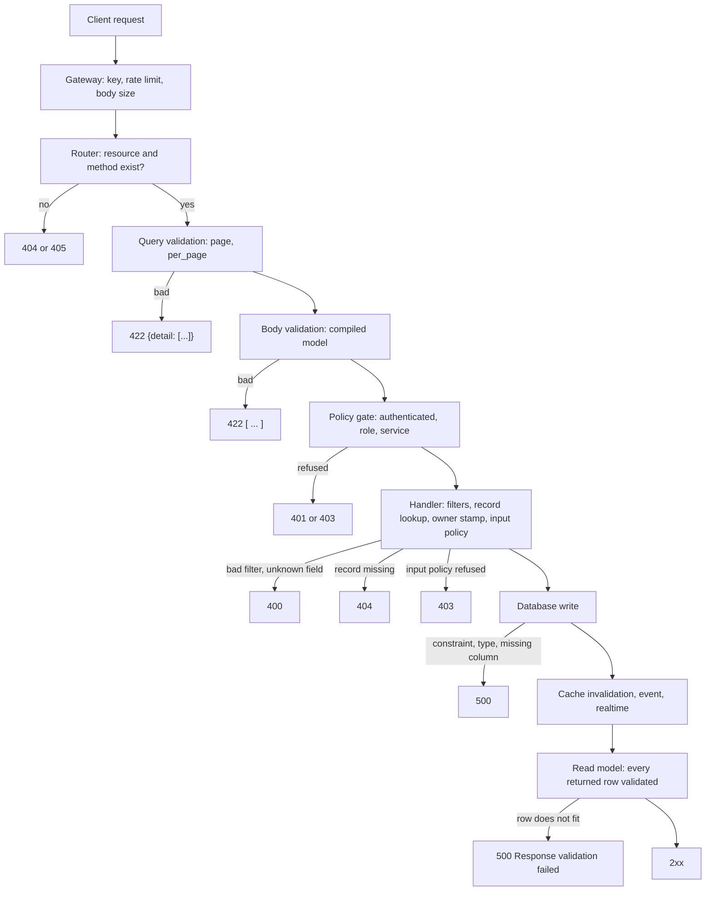

## The mental model: validation is a gate at the HTTP edge, and only there

Validation in Pawabase is the compiled field list standing between an HTTP request body and your handler. When you define a resource under **Resources** in Studio, Pawabase compiles its fields into request models, one for creating a record and one for updating it, and hands them to the web framework as the shape each route accepts. A body that does not fit never reaches your policy's record-level checks, the database or your flows. It is answered with `422` and a list of what was wrong.

Three consequences follow, and the rest of this page is a detailed account of them.

| Consequence | What it means in practice |
| --- | --- |
| The gate is built from the **definition**, so validation is only as strict as the fields you declared | A constraint you did not write (a maximum, an enum, a pattern) does not exist, and no default catches it |
| The gate sits on **HTTP requests**, so it is bypassed by anything that writes without one | Flows, functions, the **Records** tab and SQL in the **Database** console reach the table without it |
| The gate checks **shape and value**, and has no opinion about **who** or **whether it will fit in the database** | A valid body can still be refused by a policy, and can still be refused by the database with a `500` |

Validation is also not authorization. A request that passes validation has only proved it is well formed. Whether the caller may do it is decided by [policies](/policies/overview), and the two interact in an order you should know before designing an API, because it determines what an unauthenticated caller can learn.

<Note>
Every response body, status code and ordering claim on this page was observed against a running Pawabase API by sending the request and recording the answer. Where this page and an older description of the same behavior disagree, this page reflects what the API did.
</Note>

## The order of checks

A request to a resource endpoint passes through a fixed sequence. The sequence explains which error you get when more than one thing is wrong, and that matters for clients that show a single message.

| Stage | Where it runs | Fails with | What it decides |
| --- | --- | --- | --- |
| 1. Project key | The gateway, before the API sees the request | `401` `{"error": "missing_api_key", ...}` or `invalid_api_key` | Which project and environment the request belongs to |
| 2. Rate limit | The gateway, then the resource's own limit | `429` `{"error": "rate_limit_exceeded", ...}` | Whether this caller has used up its allowance |
| 3. Route match | The compiled application | `404` generic page, or `405` | Whether the resource and the operation exist |
| 4. Query and path validation | The framework, for typed query parameters | `422` `{"detail": [...]}` | `page`, `per_page` and the other typed query parameters |
| 5. Body validation | The framework, with the compiled request model | `422` bare array | JSON syntax, types, constraints, unknown keys |
| 6. Authentication and policy plan | The policy gate | `401` `"Authentication required"`, `403` `"policy '…' refused"` | Whether the caller may attempt the operation at all |
| 7. Handler | The operation | `400`, `404`, `500` | Filters, sort, select, expand, record lookup, input policy |
| 8. Database | The resource store | `500` | Constraints and column types the database enforces |
| 9. Response validation | The framework, with the read model | `500` `"Response validation failed"` | That the stored row fits the field list |

The table is in the order things happen, with one important detail: **body validation (stage 5) runs before the policy gate (stage 6)**. Four requests against a `tasks` resource whose `create` policy is `authenticated` show it:

```text
POST /rest/v1/tasks   anonymous,   body {"nope": 1}    ->  422  (missing title, unknown key nope)
POST /rest/v1/tasks   anonymous,   body {"title": "t"} ->  401  "Authentication required"
POST /rest/v1/tasks   signed in,   body {"nope": 1}    ->  422  (the same two errors)
PATCH /rest/v1/tasks/99  anonymous, body {"title": "t"} ->  401  "Authentication required"
```

An anonymous caller with a valid project key gets a `422` for a malformed body and a `401` for a well-formed one. The second is the response you want them to see. The first, though, tells the caller what the resource expects, which leads to the next section.

### What an unauthenticated caller can learn from validation errors

A `422` response names the field paths that are required (`missing`), the keys that are not allowed (`extra_forbidden`) and the constraints on the ones that were tried (`string_too_long` with `ctx.max_length`). A caller holding only a publishable key, which ships inside every browser and mobile app, can send deliberately wrong bodies to a protected endpoint and read the model back from the errors, even though the same caller will always receive `401` for a valid body.

| Information in the `422` | Whether it is already public |
| --- | --- |
| Field names and which are required | Yes, if you publish the API docs under **Settings**, **API documentation**. The generated document lists every field |
| Types, lengths, patterns and enums | Yes, in the same document |
| Resource names | Yes, in the URL. An unknown resource returns `404` |

If the generated documentation is private and the field names themselves are sensitive, the validation errors are a way around that. For most applications the model is not secret, and the useful rule is that the project key is not a credential for data, it identifies the project. See [API keys](/operate/api-keys). If the model must stay private, put the endpoint behind a [custom route](/data/custom-routes) whose policy rejects the caller before the body is read, and do not publish the docs.

### Why the body is checked before the record exists

`PATCH` shows the other effect of the order. The record lookup is a handler step (stage 7), after validation:

```text
PATCH /rest/v1/p/999   body {"qty": -1}   ->  422  (the body is invalid)
PATCH /rest/v1/p/999   body {"qty": 1}    ->  404  "Not found"
```

When both the body and the record id are wrong, you see the validation error first. A client that retries on `404` but surfaces `422` therefore handles these two cases differently, and a client that wants to know whether a record exists should use `GET`, not infer it from an update error.

## Every failure shape the data API returns

A single resource endpoint can answer with several different bodies, because different layers produce them. This is the complete list for the data plane, and it is the reason a client cannot assume one error envelope.

| Status | Body | Produced by | Example trigger |
| --- | --- | --- | --- |
| `401` | `{"error": "missing_api_key", "message": "Send a project API key in the apikey header."}` | Gateway | No `apikey` header |
| `401` | `"Authentication required"` (a bare JSON string) | Policy gate | A policy needs a signed-in user and the request has none |
| `403` | `"policy 'owner' refused"` | Policy | A signed-in caller is refused on update, delete or an input condition |
| `404` | `"Not found"` | Handler | The record id does not exist, or the policy hides it, or the id is malformed |
| `404` | `{"status": 404, "error": "Not Found", "message": "The page you are looking for does not exist."}` | Router | The resource or operation is not enabled, or a trailing slash was sent |
| `405` | `{"detail": "Method Not Allowed"}` | Router | The path exists, but not for that method |
| `400` | `{"error": "bad_request", "message": "cannot filter on unknown field 'nope'"}` | Handler | Unknown field in `filter`, `sort` or `select` |
| `400` | `"products has no relation 'nope'"` (a bare string) | Handler | An unknown or nested `expand` |
| `422` | `[{"type": "...", "loc": [...], "msg": "...", "input": ..., "ctx": {...}, "url": "..."}]` | Body validation | Any failure in the request body |
| `422` | `{"detail": [{"loc": ["query", "per_page"], "msg": "...", "type": "...", "input": "500"}]}` | Query validation | `page` or `per_page` out of range or not a number |
| `422` | `{"error": "invalid", "message": "validation failed", "details": [...]}` | A flow's `validate.schema` block | A flow validation that fails |
| `429` | `{"error": "rate_limit_exceeded", "message": "Too many requests. Slow down and retry later.", "retry_after": 15}` | Rate limit | The per-caller limit |
| `500` | `"Internal Server Error"` (plain text) | Unhandled exception | A database constraint, an unmigrated table, an out-of-range value |
| `500` | `{"error": "Internal Server Error", "detail": "Response validation failed"}` | Response validation | A stored row that does not fit the field list |
| `503` | `{"error": "database_unavailable", "message": "…"}` | Data source | The environment's database cannot be reached |

Four things in that table affect how a client is written.

**The `422` for a body is a bare array, with no envelope.** There is no `error` or `message` wrapper. The array is the body. A client that expects `{"error": ..., "message": ...}` on every failure will not find a `message` on this one, and `response.json().detail` is not there either.

**Bad query parameters use a different `422`.** Typed query parameters (`page`, `per_page`) are checked by the framework before the compiled model, and its answer is an object with a `detail` array whose entries have `loc: ["query", "per_page"]`. Body errors have no `"body"` prefix on `loc`; query errors have `"query"`.

**Several errors are bare JSON strings.** `401`, `403` and `404` from the policy gate and handler are JSON-encoded strings (`"Not found"`, with the quotes), not objects. A client should read the response as JSON and handle both strings and objects.

**A `500` is not always an error in your code.** The plain-text `500` and the `"Response validation failed"` `500` are produced by data the validation could not cover: values the database refused, and rows that do not fit the definition. Both are described below.

<Tip>
Branch on the HTTP status first, then on the body's type. For `422`, check whether the body is an array (body validation) or an object with `detail` (query validation) or an object with `error: "invalid"` (a flow). A small function that normalizes all three into one list of `{field, code, message}` entries is worth writing once. A version is in the client section below.
</Tip>

### Real response bodies

Each of these was returned by the API for the request shown.

A body that is missing a required field and carries an extra key:

```json
POST /rest/v1/tasks
{"nope": 1}

422
[
  {
    "type": "missing",
    "loc": ["title"],
    "msg": "Field required",
    "input": {"nope": 1},
    "url": "https://errors.pydantic.dev/2.13/v/missing"
  },
  {
    "type": "extra_forbidden",
    "loc": ["nope"],
    "msg": "Extra inputs are not permitted",
    "input": 1,
    "url": "https://errors.pydantic.dev/2.13/v/extra_forbidden"
  }
]
```

A body that is not JSON at all:

```json
POST /rest/v1/p
(empty body, or {bad, or a trailing comma)

422
[{"loc": ["body"], "msg": "Request body is not valid JSON", "type": "json_invalid"}]
```

A body that is JSON but not an object:

```json
POST /rest/v1/p
[{"title": "x"}]

422
[
  {
    "type": "model_type",
    "loc": [],
    "msg": "Input should be a valid dictionary or instance of PCreate",
    "input": [{"title": "x"}],
    "ctx": {"class_name": "PCreate"},
    "url": "https://errors.pydantic.dev/2.13/v/model_type"
  }
]
```

A page size over the limit:

```json
GET /rest/v1/products?per_page=500

422
{"detail": [{"loc": ["query", "per_page"], "msg": "Input should be less than or equal to 200",
             "type": "less_than_equal", "input": "500"}]}
```

A filter on a field that does not exist:

```json
GET /rest/v1/products?filter[nope]=1

400
{"error": "bad_request", "message": "cannot filter on unknown field 'nope'"}
```

<Info>
The `msg` for a body that is not an object names an internal class: `PCreate` here is the compiled create model for a resource called `p`. The name is the resource name in PascalCase followed by `Create` (or `Update` on `PATCH`). Do not display it to users and do not branch on it. The `type` (`model_type`) and the empty `loc` are the stable parts.
</Info>

## Body validation in detail

Everything in this section concerns the request body of `POST`, `PATCH` and `PUT`. The types and constraints themselves are on [Field types](/data/field-types), and this page takes the point of view of the request: what the models accept, what they leave out, and what happens to the data after it passes.

### Two models, built from the same field list

A resource's field list is compiled twice for writes. The create model backs `POST`, the update model backs `PATCH` and `PUT`. A third model, the read model, describes what comes back and is covered later on this page.

| Behavior | Create model (`POST`) | Update model (`PATCH`, `PUT`) |
| --- | --- | --- |
| `required` | Enforced. A missing key is `missing`, "Field required" | Ignored. Every field is optional |
| `nullable` | A required field rejects `null` unless `nullable: true`. A non-required field accepts `null` unless `nullable: false` | Everything accepts `null`, including required and non-nullable fields |
| `default` | Used when the key is missing | Never used |
| `read_only` fields | Not in the model, so sending one is `extra_forbidden` | Not in the model, same |
| Unknown keys | `extra_forbidden` | `extra_forbidden` |
| The primary key, `created_at`, `updated_at` | Not in the model, so sending them is `extra_forbidden` | Same |
| Empty body `{}` | Valid only if nothing is required | Valid, and counts as an update |

`PUT` is accepted as a second spelling of `PATCH`. It runs the same update model, does not replace the whole record, and is not listed in the generated API document. Write clients against `PATCH`.

### What happens to a create after it passes

The model's output is not written to the table as is. The create handler does four more things with it, and the order matters for owner fields and policies.

| Stage | What it does |
| --- | --- |
| Build the data | Keeps every key the client sent (including an explicit `null`) and every key whose value is not `null` after defaults were applied. A field that was omitted and has no default is left out of the `INSERT` entirely, so the column stays `NULL` |
| Stamp the owner | If the resource has an **Owner field**, a signed-in caller's identity overwrites whatever the client sent. A caller with no user and no service key is refused with `401` here |
| Check the policy | The `create` policy is evaluated with `record` and `input` both set to the data. This is where conditions on `$input` and `$record` run |
| Write | The store inserts the row, applying any default the model did not already supply, then runs cache invalidation, the event and the realtime publish |

Owner stamping is a validation concern because it changes what the client's body means. A `POST` that includes `owner_id: "99"` does not fail, the value is replaced:

```text
signed in as user 1:   POST /rest/v1/notes  {"body": "mine", "owner_id": "99"}
                       ->  201  {"id": 1, "body": "mine", "owner_id": "1", ...}

service key, no user:  POST /rest/v1/notes  {"body": "svc note", "owner_id": "zed"}
                       ->  201  {"id": 2, "body": "svc note", "owner_id": "zed", ...}

service key, no user:  POST /rest/v1/notes  {"body": "svc note 2"}
                       ->  201  {"id": 3, "body": "svc note 2", "owner_id": null, ...}
```

A server credential acts on behalf of no user, so it keeps the value it was given. That is the intended way to import records for a known owner, and it is why a secret key must never reach a browser.

### What happens to an update after it passes

An update starts with only the keys the client sent. Two handler steps change it.

| Stage | What it does |
| --- | --- |
| Build the data | Takes only the keys present in the body. Omitted fields are untouched |
| Drop the owner field | If the resource has an **Owner field**, that key is removed from the update, silently, for every caller including a secret key |
| Load the record | `404` `"Not found"` if there is no such row |
| Check the policy | The `update` policy is evaluated with `record` set to the existing row and `input` set to the data |
| Write | The store updates the row and sets `updated_at`, then invalidates the cache and emits the event |

The owner field cannot be changed through the REST API at all. In testing, a signed-in owner sending `{"body": "edited", "owner_id": "2"}` got `200` with the body edited and `owner_id` still `"1"`, and a secret key sending `{"owner_id": "2"}` also got `200` with no change. If ownership must be transferable, do it from a flow with the `resource.update` block, which is trusted and does not drop the key, behind a route whose policy decides who may do it. See [Custom routes](/data/custom-routes).

### Unknown keys are rejected, including the ones you did not declare

Both write models reject any key they do not declare. That covers four groups of keys.

| Group | Example | Why it is not accepted |
| --- | --- | --- |
| A typo | `{"titel": "x"}` | Not a field |
| A `read_only` field | `{"internal_note": "x"}` | Left out of the write models by definition |
| The generated columns | `{"id": 99}`, `{"created_at": "…"}`, `{"updated_at": "…"}` | Set by Pawabase |
| A column that exists in the table but is not in the definition | `{"legacy_col": 1}` | The model is built from the definition, not from the table |

The rule that unknown keys fail is the one that makes the API stable: a client that sends a key the server does not know learns immediately instead of having it dropped. It is also why adding a field to a definition is a compatible change for old clients (they do not send it) while removing one is not (they still do).

### The same body, validated under each operation

One body, `{"sku": "A-1", "title": "M", "price": "abc"}`, against a `products` resource whose `title` needs two characters and whose `price` is a number, shows how the create and update models differ:

```text
POST  /rest/v1/products  {"sku": "A-1", "title": "M", "price": "abc"}
  422  string_too_short  loc ["title"]
       float_parsing     loc ["price"]

PATCH /rest/v1/products/1  {"title": "M", "price": "abc"}
  422  string_too_short  loc ["title"]
       float_parsing     loc ["price"]

PATCH /rest/v1/products/1  {"title": null}
  200  title set to NULL (even though title is required on create)
```

The last line is worth rereading. An update model that makes every field optional also makes every field nullable, so the guarantee that a required field is present is only a guarantee about creation.

## Query and path validation

Not everything a client sends is a body. The parameters in the URL are validated too, by two different mechanisms, and the difference is visible in the error shape.

### Typed query parameters

Five query parameters of a list request are typed in the route definition: `page`, `per_page`, `sort`, `select` and `expand`, where the last three are plain strings. The two numeric ones carry limits, and a violation produces the `{"detail": [...]}` object.

| Request | Result |
| --- | --- |
| `?page=0` | `422`, `loc: ["query", "page"]`, "Input should be greater than or equal to 1" |
| `?per_page=0` | `422`, `loc: ["query", "per_page"]`, "Input should be greater than or equal to 1" |
| `?per_page=500` | `422`, "Input should be less than or equal to 200" |
| `?per_page=x` | `422`, "Input should be a valid integer, unable to parse string as an integer" |
| `?page=99` | `200` with an empty `data` list and the real `total`. A page past the end is not an error |

The limit of 200 is a hard ceiling set by the platform. A client that wants everything pages through, and the pagination page explains how to do it safely, see [Sorting and pagination](/data/sorting-pagination).

### Untyped parameters: `filter`, `sort`, `select`, `expand`

`filter[<field>]` is not declared as a parameter at all, because the field names vary by resource. The handler reads every query key that looks like `filter[...]`. The unknown-field checks happen there, in the handler (stage 7), and produce the `400` shapes:

| Request | Result |
| --- | --- |
| `?filter[nope]=1` | `400` `{"error": "bad_request", "message": "cannot filter on unknown field 'nope'"}` |
| `?sort=nope` | `400` `{"error": "bad_request", "message": "cannot sort on unknown field 'nope'"}` |
| `?sort=-` | `400`, "cannot sort on unknown field ''" |
| `?select=nope` | `400` `{"error": "bad_request", "message": "products has no field 'nope'"}` |
| `?expand=nope` | `400` `"products has no relation 'nope'"`, a bare string |
| `?expand=parent.kids` | `400`, nested expansion is not supported |

`400` is the right class here: the request is understood and rejected for a reason the client can fix. But the field name is in the message and the body is not an array, so a client that handles `422` generically will not handle these.

Values are a different matter. A value is converted to the field's type after the field is accepted, and **a value that cannot be converted is not caught as a validation error**:

| Request | Result |
| --- | --- |
| `?filter[stock]=gte.abc` (integer field) | `500` |
| `?filter[stock]=in.1,x` | `500` |
| `?filter[stock]=eq.` (empty value) | `500` |
| `?filter[released]=eq.2026-01-01T00:00:00` (date field, timestamp value) | `500` |
| `?filter[stock]=1.0` | `500` |

A bad filter value is a client error that surfaces as a server error. Validate filter values before building a URL, especially numbers and dates that come from user input. The operators and what each accepts are on [Filtering](/data/filtering).

### Path parameters

The record id is the last path segment. It is validated against the resource's **ID type**, and every failure is the same `404`, because "not a valid id" and "no such record" are not distinguished.

| Request | Result |
| --- | --- |
| `GET /rest/v1/products/1` | The record, or `404` |
| `GET /rest/v1/products/abc` (integer ids) | `404` `"Not found"` |
| `GET /rest/v1/products/1.5` | `404` |
| `GET /rest/v1/products/-1` | `404` |
| `GET /rest/v1/authors/not-a-uuid` (UUID ids) | `404` |
| `GET /rest/v1/products/99999999999999999999999` | `500`, the number overflows the column |

The last row is another place where a value that looks like input validation fails at the database.

## Malformed requests, one by one

A bad request does not have to be a bad value. These are the ways a request can be broken before any field is looked at, again each from a real run against a resource `p` with a required `title` (maximum length 5) and an integer `qty` (minimum 0).

| Request | Result | Notes |
| --- | --- | --- |
| An empty body | `422` `json_invalid`, `loc: ["body"]` | Same for `{bad`, a trailing comma and unquoted keys |
| A JSON body that is `null`, an array, a string or a number | `422` `model_type`, `loc: []` | The body must be an object |
| A form-encoded body (`title=x`) | `422` `json_invalid` | Only JSON is read, whatever the content type says |
| A JSON body sent as `text/plain` | `201`, accepted | The `Content-Type` header is not checked. The body is parsed as JSON regardless |
| A JSON body with no `Content-Type` | `201`, accepted | Same |
| A body in UTF-16 with a matching charset | `201`, accepted | The charset parameter is honored |
| A body with a UTF-8 byte-order mark | `201`, accepted | The mark is tolerated |
| Duplicate keys: `{"title": "a", "title": "bb"}` | `201`, stored as `bb` | The last one wins. Do not rely on it, and do not build bodies with repeated keys |
| The literal `NaN` in a number position | `500` | Not valid JSON, and not caught as `json_invalid` |
| A body above the gateway limit | `413` from the gateway | Never reaches the API. See [Limits](/reference/limits) |

Do not use the `Content-Type` header to decide whether a request is well formed. Send `application/json` anyway, for the browser's sake and for any proxy in front of the gateway that treats types differently.

## Method and path errors

Two more categories are answered before any validation runs, by the router.

| Request | Result | Why |
| --- | --- | --- |
| `GET /rest/v1/p/` (trailing slash) | `404`, the generic page | The path with a slash is a different path. Resources have no trailing-slash alias |
| `OPTIONS /rest/v1/p` | `405` `{"detail": "Method Not Allowed"}` from the API itself | The API has no `OPTIONS` handler. Browser preflight is a gateway concern, see [Rate limits and CORS](/operate/rate-limits-and-cors) |
| `DELETE /rest/v1/p` (collection) | `405` | The collection path serves `GET` and `POST` only |
| `POST /rest/v1/p/1` | `405` | The item path serves `GET`, `PATCH`, `PUT` and `DELETE` |
| `GET /rest/v1/ghosts/1` when only `list` and `create` are enabled | `404`, the generic page | An operation that is off is not served at all |
| `HEAD /rest/v1/p` | `200` with no body | `HEAD` is answered for any path that serves `GET` |

The difference between `404` and `405` for a disabled operation comes from the route table. When some other operation is enabled on the same path, the path exists and the answer is `405`; when nothing is enabled on it, the answer is `404`. A client that wants to know whether an operation is enabled should read the generated document, not probe.

## Reading validation errors in a client

A client that shows field-level messages needs to turn three different failure shapes into one list. The status code selects the shape, so the logic is short.

```typescript
type FieldProblem = { field: string; code: string; message: string; limit?: unknown };

// Turns any data-plane error response into a list of field problems.
// `body` is the parsed JSON, which may be an array, an object or a string.
export function problemsFrom(status: number, body: unknown): FieldProblem[] {
  // Body validation: a bare array of entries.
  if (status === 422 && Array.isArray(body)) {
    return body.map((e: any) => ({
      field: (e.loc ?? []).join("."),          // ["specs", "w"] becomes "specs.w", ["tags", 0] becomes "tags.0"
      code: e.type,                             // "missing", "string_too_long", ...
      message: e.msg,
      limit: e.ctx && Object.values(e.ctx)[0],  // 4, "^[A-Z]+$", ...
    }));
  }
  // Query validation: an object with a detail array, where loc starts with "query".
  if (status === 422 && body && typeof body === "object" && "detail" in (body as any)) {
    return (body as any).detail.map((e: any) => ({
      field: (e.loc ?? []).slice(1).join("."),
      code: e.type,
      message: e.msg,
    }));
  }
  // A flow's validate.schema: an object with error "invalid" and a details array.
  if (status === 422 && body && typeof body === "object" && (body as any).error === "invalid") {
    return ((body as any).details ?? []).map((e: any) => ({
      field: (e.loc ?? []).join("."),
      code: e.type,
      message: e.msg,
    }));
  }
  // Everything else has no field: a message for the form as a whole.
  const message =
    typeof body === "string" ? body :
    body && typeof body === "object" && "message" in (body as any) ? String((body as any).message) :
    `Request failed (${status})`;
  return [{ field: "", code: String(status), message }];
}
```

```python
def problems_from(status: int, body) -> list[dict]:
    """Normalize any data-plane error response into field problems."""
    def entry(e, drop=0):
        return {
            "field": ".".join(str(part) for part in e.get("loc", [])[drop:]),
            "code": e.get("type"),
            "message": e.get("msg"),
        }

    if status == 422 and isinstance(body, list):
        return [entry(e) for e in body]
    if status == 422 and isinstance(body, dict) and "detail" in body:
        return [entry(e, drop=1) for e in body["detail"]]
    if status == 422 and isinstance(body, dict) and body.get("error") == "invalid":
        return [entry(e) for e in body.get("details", [])]
    message = body if isinstance(body, str) else (body or {}).get("message", f"Request failed ({status})")
    return [{"field": "", "code": str(status), "message": message}]
```

A few conventions make the result easier to use.

| Convention | Why |
| --- | --- |
| Join `loc` with dots | The path `["specs", "w"]` maps to a nested form field, and `["lines", 0, "qty"]` to the first line item's quantity |
| Keep `type` as the code and show your own text | `msg` is English and can change. `type` is stable, and `ctx` carries the numbers a message needs ("at most 4 characters") |
| Treat an empty `field` as a form-level message | `404`, `403`, `401`, `429` and `500` have no field |
| Do not retry a `422`, `400`, `401` or `403` | The same request will fail the same way. A `429` carries `retry_after` in the body and a `Retry-After` header |
| Retry a `500` or `503` carefully | A `500` for a duplicate key will fail again. A `503` for an unreachable database may recover |

## Validation and authorization are different questions

A policy is a condition over the caller, the record and the input. Validation is a check on the body's shape. They overlap in one place, the `$input` path in a policy, and the interaction is worth understanding.

| Question | Answered by | When it runs | Status on failure |
| --- | --- | --- | --- |
| Is the body well formed and within the declared limits? | Validation | Before the policy gate | `422` |
| May this kind of caller attempt this operation at all? | The policy plan (for example `authenticated`, a role, `service`) | After validation, before the handler | `401` or `403` |
| May this caller write this value? | A policy condition on `$input` | In the handler, after the body is built | `403` |
| May this caller touch this record? | A policy condition on `$record` | In the handler, after the record is loaded | `403`, `404` when the caller is not signed in |

Everything that depends on the values in the body belongs in the third row, so the policy and the validation do not repeat each other: the field's constraints say what a legal value looks like for anyone, and the policy says what a particular caller may do with it. A quantity limit for a customer is a policy:

```json
{
  "name": "small_qty",
  "condition": {"lte": ["$input.qty", 10]}
}
```

Assigned as the `create` policy of a resource, the condition is evaluated after the body passes validation. These are the real results with `qty` of 5, 50 and absent:

```text
POST /rest/v1/items  {"title": "a", "qty": 5}   ->  201
POST /rest/v1/items  {"title": "a", "qty": 50}  ->  403  "policy 'small_qty' refused"
POST /rest/v1/items  {"title": "a"}             ->  403  "policy 'small_qty' refused"   (qty is absent, the comparison is false)
```

Two details to notice. A refusal from an input condition is `403` even for an anonymous caller, where a refusal at the gate would have been `401`: the gate only sees what can be decided before the body is read, and `$input` conditions are decided afterwards. And an absent value makes a comparison false, so a rule that should only apply when a field is present has to say so, with `exists` or `any`, see [Conditions](/policies/conditions).

<Warning>
Do not use a policy to repeat what a field definition already says. A `maximum` on the field returns a `422` with the limit in `ctx`, which a client can show. A policy that refuses the same value returns a `403` with no detail. Use a policy for rules that vary by caller, and the field for rules that do not.
</Warning>

### Routes check the body at the gate too

A custom route with `input_fields` or `input_schema` validates its body with the same compiler and the same error shape. The gate runs the plan phase before the handler reads the body, and conditions on `$input` are checked after:

```text
POST /rest/v1/echo  {"n": "3"}                  ->  200  {"n": 3, "tag": null}     (the string was converted)
POST /rest/v1/echo  {"n": 0, "tag": "z"}        ->  422  [greater_than_equal at ["n"], literal_error at ["tag"]]
POST /rest/v1/echo  {}                          ->  422  [missing at ["n"]]
POST /rest/v1/echo  {"n": 1, "zzz": 1}          ->  422  [extra_forbidden at ["zzz"]]
POST /rest/v1/echo  {bad                        ->  422  [json_invalid at ["body"]]
```

The handler receives the cleaned value: `"3"` arrived as the number `3`, and the optional `tag` is present as `null`. Only the body is validated. Path parameters and query values reach a route's handler as strings, so convert them in the flow or the function. See [Custom routes](/data/custom-routes).

## What validation cannot catch: the database

Some values are fine to the field list and are refused one step later, by the database. Pawabase does not translate those refusals. They surface as `500` with the plain-text body `Internal Server Error`, which is the same body as a bug in your own code. These are the cases that were reproduced.

| Situation | What you see | Why validation did not stop it |
| --- | --- | --- |
| A duplicate value in a `unique` field | `500` | Uniqueness is an index. The field list cannot know what other rows hold |
| An integer that does not fit 64 bits (`2^70`) | `500` | `integer` has no built-in maximum |
| The value `"inf"` for a `number` | `500` | The type accepts it, the column refuses it |
| A `PATCH` or `GET` with an id of 22 digits | `500` | The id is a number that overflows the key column |
| A filter value of the wrong type (`filter[stock]=gte.abc`) | `500` | Filter values are converted after the field is accepted |
| A create when the table does not exist yet | `500` | Nothing checks that you ran **Create / migrate table** |
| A create that sends a field added to the definition before the column exists | `500` | The same, for a column |
| A value too wide for a `VARCHAR(n)` column (PostgreSQL, MySQL) | `500` | `max_length` was raised after the column was created |
| A violation of a constraint you added by hand (a `NOT NULL`, a foreign key, a `CHECK`) | `500` | Pawabase does not read your constraints |
| An unreachable database | `503` `database_unavailable` | The one database failure that has its own status |

A `500` is the correct signal that something is wrong on the server, but for the unique case it is the wrong signal for a client, because the caller did something that can be fixed. There are two ways to give clients a better answer.

**Check first.** Before creating, look for the value with a filter: `GET /rest/v1/products?filter[sku]=A-1&select=id&per_page=1`. A non-empty `data` means the value is taken. This is race-prone (two callers can both pass the check), so it improves the message and does not replace the index.

**Move the write behind a custom route.** A flow can validate, check, and answer with a status you choose. This route is a verified example. The resource has only `list` enabled, so the only way to create a product is through the route:

```json
{
  "name": "create_product",
  "definition": {
    "nodes": [
      {"id": "start", "data": {"block": "trigger.http",
        "config": {"method": "POST", "path": "/products/create"}}},
      {"id": "valid", "data": {"block": "validate.schema",
        "config": {"value": "{{ input.body }}", "fields": [
          {"name": "sku", "type": "string", "required": true, "max_length": 20},
          {"name": "title", "type": "string", "required": true, "max_length": 60}]}}},
      {"id": "dupe", "data": {"block": "resource.list",
        "config": {"resource": "products", "filters": {"sku": "{{ steps.valid.output.sku }}"}, "limit": 1}}},
      {"id": "exists", "data": {"block": "control.if",
        "config": {"condition": {"gt": ["$steps.dupe.output.total", 0]}}}},
      {"id": "conflict", "data": {"block": "error.raise",
        "config": {"status": 409, "message": "a product with this sku already exists", "code": "sku_taken"}}},
      {"id": "create", "data": {"block": "resource.create",
        "config": {"resource": "products", "data": "{{ steps.valid.output }}"}}},
      {"id": "done", "data": {"block": "response.return",
        "config": {"status": 201, "body": "{{ steps.create.output }}"}}}
    ],
    "edges": [
      {"id": "e1", "source": "start", "target": "valid"},
      {"id": "e2", "source": "valid", "target": "dupe"},
      {"id": "e3", "source": "dupe", "target": "exists"},
      {"id": "e4", "source": "exists", "target": "conflict", "sourceHandle": "true"},
      {"id": "e5", "source": "exists", "target": "create", "sourceHandle": "false"},
      {"id": "e6", "source": "create", "target": "done"}
    ]
  }
}
```

The node positions that Studio's flow editor stores are left out for brevity. The route is saved under **Routes** with method `POST`, path `/products/create`, handler type flow, handler `create_product` and policy `authenticated`. The results from a running API:

```text
POST /rest/v1/products/create  {"sku": "A-1", "title": "Mug"}      ->  201  {"id": 1, "sku": "A-1", "title": "Mug", ...}
POST /rest/v1/products/create  {"sku": "A-1", "title": "Other"}    ->  409  {"error": "sku_taken", "message": "a product with this sku already exists"}
POST /rest/v1/products/create  {"sku": "", "title": "xxxxxxxx…70"}  ->  422  {"error": "invalid", "message": "validation failed", "details": [string_too_long at ["title"]]}
POST /rest/v1/products/create  {"sku": "B", "title": "x", "bogus": 1} ->  422  {"error": "invalid", ..., "details": [extra_forbidden at ["bogus"]]}
```

The third result shows a limit of this recipe: an empty `sku` passed, because the field has no `min_length`. The route is only as strict as the field list it validates against, so give `sku` a `min_length` of 1 or a `pattern`. The envelope of the `422` also differs from the resource endpoint's: it is `{"error": "invalid", ...}` with a `details` array, not a bare array. Clients that call both the resource endpoints and a route like this one need the normalizer above.

### Constraints you add by hand

Anything you add to a table outside Pawabase (a `NOT NULL`, a foreign key, a `CHECK`) is enforced by the database and invisible to Pawabase. That is a legitimate way to guard data that must never be wrong, because it holds for every writer, including flows and the **Database** console. The cost is the `500`. Pair each such constraint with a field-level rule or a route-level check that gives the client a readable `422` or `409` first, so the constraint is the last line of defense and not the user interface.

## Response validation: when a stored row does not fit

The request side is half of the story. Every read response is checked as well, with a read model compiled from the same field list, and a row that fails is not skipped: it fails the response. Two rules from [Field types](/data/field-types) matter here: the read model applies the same `enum`, length and range constraints as the create model, and every property in it is nullable.

The failure has one body, whatever the cause:

```json
500
{"error": "Internal Server Error", "detail": "Response validation failed"}
```

It is returned for a list when any row on that page fails, and for a get when the row fails. The body names neither the row nor the field. These are the three ways such a row comes to exist, all reproduced.

| Origin of the bad row | Example | How it got there |
| --- | --- | --- |
| The definition changed under existing data | An `enum` of `a` and `b` was changed to `b` and `c`, and a row still holds `a` | A schema edit. Nothing re-checks stored rows |
| A write that skipped validation | A flow or the **Records** tab stored `title` as ten characters in a field limited to five, an `enum` value that does not exist, a negative `qty` under a minimum of 0 | A trusted path, see the next section |
| A table you did not create | A `TEXT` column mapped to an `integer` field that holds `abc` | The definition describes the column optimistically |

Because the check runs over the rows selected for the page, one failing row fails the whole page, and it fails for every caller whose page contains it.

### Finding the bad rows

The error does not say which row, so you find it. The **Database** console is the tool, and the queries are the ones that look for what the definition forbids. For a field with `enum: ["b", "c"]`:

```sql
SELECT id, st FROM en WHERE st IS NOT NULL AND st NOT IN ('b', 'c');
```

For a length limit, a range, or a type that was mapped onto a looser column:

```sql
SELECT id FROM items WHERE length(title) > 5;
SELECT id FROM items WHERE qty < 0;
SELECT cust_no, price FROM legacy WHERE price GLOB '*[^0-9]*';   -- SQLite: non-numeric text in a numeric field
```

Repair them in place with an `UPDATE`, which the console runs after you tick **allow writes**. See [Database console](/data/database-console). Once the rows fit, the page returns `200` again.

Two details help while you diagnose. A **get** of a single row that fails tells you which id is bad, so bisecting a failing page is a few requests with `?per_page=1&page=N`. And `?select=` limits the columns that are selected, so a request that selects only fields the bad rows do not break returns `200`, which isolates the field.

### Transformers and the read model

A resource with a **Transformer** has no response model. The generated document omits the response schema, and the read model is not applied, so the bad-row failure above does not occur for it. The same transformer removes the documentation for the shape, so the trade is validation for a hand-maintained contract. See [Transformers](/data/transformers).

## The paths that skip validation

The models run on HTTP request bodies, and nothing else is checked by them. A table can receive a row from five other places, and each of those writes without the constraints. They are trusted by design, because they are your own server-side code and operator tools. The consequence is that the field list is a promise about requests and not a promise about the table.

| Path | Who uses it | Constraints checked | What to do instead |
| --- | --- | --- | --- |
| `resource.create` and `resource.update` in a flow | Your flows | None | Put `validate.schema` before the block, in `fail` mode (a `422`) or `branch` mode (your own response) |
| `resource_create` and `resource_update` in a Python function | Your functions | None | Validate with the same field list first, see below |
| The **Records** tab | Operators, in Studio | None | Use it for repair and inspection, not for loading data |
| `POST …/records` on the Platform API | Scripts that call it | None | Use the data API with a secret key, which runs the models |
| SQL in the **Database** console, or any direct connection | Operators, jobs, migrations of your own | None, and no cache or event side effects except cache invalidation in the console | Use `UPDATE` to repair, and run a request through the API afterward to confirm reads |

### Validating inside a flow

The `validate.schema` block takes a value and a field list and validates in create mode, so required fields are enforced and unknown keys are rejected. In `fail` mode it stops the run with a `422`; in `branch` mode it follows the `invalid` handle with the errors, so the flow can respond in its own shape. Both were exercised through a route:

```text
fail mode,   {"title": "waytoolong", "qty": -1}
  ->  422  {"error": "invalid", "message": "validation failed",
            "details": [{"type": "string_too_long", "loc": ["title"], ...},
                        {"type": "greater_than_equal", "loc": ["qty"], ...}]}

branch mode, the same body, with the invalid handle wired to a response block
  ->  400  {"problems": [{"type": "string_too_long", "loc": ["title"], ...},
                         {"type": "greater_than_equal", "loc": ["qty"], ...}]}
```

Use `fail` when the caller should see a `422` whose shape you do not mind, and `branch` when you need to shape the answer, for example to return the `409` in the previous section. The block's output on success is the cleaned value, so wire the next block to `steps.<id>.output`, not to the raw input: conversions the model made (a string `"3"` to the number `3`, `null` fill-ins for optional fields) are in the output and not in the input.

The block takes its field list inline, and it cannot resolve a `ref` to a stored schema. A list that contains one fails the run with `500` `{"error": "block_failed", "message": "field 'home' refers to unknown schema 'Address'"}`. Paste the schema's fields into the block, as nested `object` fields, and keep the two copies in step by hand. A function's `input_fields` is validated the same way, without the schema registry, so the same limit applies. See [Schemas](/data/schemas) for what a reference does and does not enforce.

### Validating inside a function

A Python function calls the runtime directly, and the runtime is as trusted as a flow block, so `resource_create` does not check constraints. A function can validate in two ways, and which to use depends on where the data comes from.

When the data is the function's own **input**, declare `input_fields` on the decorator. The platform validates the input with the compiler before the function body runs, in create mode, and refuses a bad input with a `422` in the flow envelope: `{"error": "invalid", "message": "invalid function input", "details": [...]}`.

```python
from pawabase_core.functions import function

PRODUCT = [
    {"name": "sku", "type": "string", "required": True, "max_length": 20},
    {"name": "title", "type": "string", "required": True, "max_length": 60},
    {"name": "price_minor", "type": "integer", "required": True, "minimum": 0},
]

@function("import_product", policy="service", input_fields=PRODUCT)
async def import_product(ctx):
    # ctx.input has already been validated and converted.
    record = await ctx.runtime.resource_create("products", ctx.input)
    return {"id": record["id"]}
```

When the data is **derived** inside the function (read from a file, fetched from another service, assembled from several inputs), validate it explicitly with the function the API itself uses, `validate_payload`, before it reaches the runtime:

```python
from pawabase_core.schemas import validate_payload
from pydantic import ValidationError

@function("sync_catalog", policy="service")
async def sync_catalog(ctx):
    imported, rejected = 0, []
    for row in await fetch_rows():          # your own code
        try:
            clean = validate_payload(PRODUCT, row, mode="create")
        except ValidationError as exc:
            rejected.append({"row": row, "errors": exc.errors(include_url=False)})
            continue
        await ctx.runtime.resource_create("products", clean)
        imported += 1
    return {"imported": imported, "rejected": rejected}
```

`validate_payload` returns the cleaned data in the form the API would have stored, so the record that reaches `resource_create` has been through the same conversions as one that came through `POST`. A loop like this one skips the rows that fail and reports them, which is usually what a sync wants and which a `POST` per row could not do cheaply. See [Python extensions](/code/python-extensions) for registering functions.

### Loading data in bulk

If you need to load many rows, the REST API with a secret key is the path that validates. It is slower than SQL, and that is the point: each row runs the models, fires the event, and invalidates the cache. For one-time migrations from another system, load into a staging table with SQL, run the queries above to find rows that would fail, repair them, and only then point a resource at the table. See [Migrating from Supabase](/migrate/from-supabase) and [from Firebase](/migrate/from-firebase).

## Validation of the definitions themselves

Everything so far checks data. Pawabase also checks the definitions that describe the data, and it does so at two moments with two different results.

### On save: refused with a message

When you click **Save changes** or **Create resource**, the Platform API validates the definition before storing it, and refuses with a `422` whose body is a plain message. Studio shows the message as an error toast. These are the messages returned for the mistakes that were tried.

| What was saved | Message |
| --- | --- |
| A name that is not lowercase letters, digits and underscores starting with a letter | A pattern error naming `name` and `^[a-z][a-z0-9_]{0,62}$` |
| A reserved name: `docs`, `openapi.json`, `x`, `rpc`, `health`, `internal`, `platform` | `'docs' is reserved` |
| A field name with a space, hyphen or leading digit | `fields[0]: name must be a letter or underscore followed by letters, digits or underscores` |
| An unknown field type | `fields[0]: unknown type 'decimal'` |
| The same field name twice | `fields[1]: duplicate field 'a'` |
| A `ref` field with no `schema` | `fields[0]: a ref field names a schema` |
| A `pattern` that is not a valid regular expression | `fields[0]: invalid pattern: missing ), unterminated subpattern at position 0` |
| A relation missing `name`, `resource` or `field` | `relations[0] needs name, resource and field` |
| A relation whose type is not `belongs_to` or `has_many` | `relations[0].type is belongs_to or has_many` |
| A rate limit with no `limit` | `rate_limit needs a limit` |
| An operation policy that does not exist | `operations.list.policy: unknown policy 'nope'` |
| A `cache_ttl` above 86400, or negative | A range error naming `cache_ttl` and `86400` |
| An inline transformer with an unknown step | `transformer: unknown transformer step 'x'; expected one of omit, pick, set, rename, case` |
| A route path that is not valid | `path must look like /orders/{id}/pay` |
| A route path that would replace a resource's own routes | `the path would shadow a resource's own routes (/<resource> or /<resource>/{id})` |
| A route input schema that does not exist | `input_schema: no schema 'nope'` |

Notice what is not on that list. The save does not check that a `default` fits its field, that an `enum` default is in the list, that a named transformer exists (only an inline one is checked), that a relation's `resource` and `field` exist, that a `ref` points at a real schema, or that the table has been created. Those are discovered later, either by the compile step below or by the first request.

The form catches the cheapest mistakes before the request is sent. The footer shows a hint beside the disabled **Create resource** button (`Add a name.` or `Every field needs a name.`), the name input of a field row turns red as you type an invalid name, and the **JSON** tab reports `The JSON has an error. Fix it on the JSON tab.` for text that does not parse. The server's checks are the authoritative ones, and the same list applies to a definition written to the Platform API directly.

### On compile: reported as a problem

A definition that saved can still fail to compile into routes. The compiled application is rebuilt lazily, the next time a request arrives after a definition changed, and a failure there does not stop the environment. The broken part is skipped and a message is recorded. These are listed on **Overview** under **Definitions with problems**.

| Cause | Problem text | Effect |
| --- | --- | --- |
| A `ref` to a schema that does not exist | `schema Dangling: field 'x' refers to unknown schema 'Nope'` | The schema is left out |
| A resource that uses such a schema | `resource uses_dangling: field 'l' refers to unknown schema 'Dangling'` | That resource's routes return `404`. Other resources keep working |
| A field named like the primary key | `resource sp1: fields[2]: duplicate field 'id'` | The resource's routes return `404` |
| A route that would shadow a resource | `route GET /orders: shadows a resource route` | The route is not registered |
| A route that cannot compile | `route POST /x: …` followed by the reason | The route is not registered |

A problem is a quiet failure. The save succeeded, the Studio sheet closed, and the only sign is a resource that answers `404`. Open **Overview** after any change that touches `ref` fields, relations or names, and read the list.

<Warning>
A schema that refers to itself, directly or through other schemas, is not a problem entry. It is a failure of the whole environment. Saving a schema `Loop` with a field `{"type": "ref", "schema": "Loop"}` made every request to that environment return `500`, including requests to resources that have nothing to do with it, and **Overview** itself returned `500` while it was in place. Deleting the schema from **Schemas** restores the environment. A cycle of two schemas that refer to each other behaves the same way. See [Schemas](/data/schemas).
</Warning>

## Where validation shows up in Studio

Validation is not a screen. It is a property of the field list, so it appears wherever a field list is edited or exercised.

| Where in Studio | What you do there | What it tells you about validation |
| --- | --- | --- |
| **Resources**, then a resource, **Configure**, **Fields** | Declare types and constraints | This is the definition of the gate. The **Required** checkbox and **More options** write the keys |
| The same sheet, **JSON** tab | Edit the stored definition directly | The only place to set `unique`, `indexed`, defaults for JSON types and any key the form does not offer |
| **API Explorer** | Send a real request with the generated body | The quickest way to see a real `422`. Edit the starting body to break one rule at a time |
| The same, **Response** card | Read the status, headers and body | Shows the exact error shape, including `loc`, `type` and `ctx` |
| **Resources**, **Records** tab | Create and edit rows | Skips the models. The only checks are the database's own and unknown keys |
| **Overview**, **Definitions with problems** | Read the list | Compile-time failures that the save did not catch |
| **Observability** | Read request logs | A `422` is a client error. A rising rate of `500` on writes points at database refusals |
| **Database** | Run SQL | Find and repair rows that no longer fit the definition |

The loop for working on a constraint is short: change the field under **Fields**, **Save changes**, open **API Explorer**, send a request that breaks the rule, and read the body. Because the compiled application rebuilds on the next request after a change, the new rule is in effect immediately.

## Validation under load: what a bad request costs

A request that fails validation is still a request. It reaches the gateway, passes the key check, and is counted by the resource's rate limit before the body is read. With a limit of three requests per window on a resource, three invalid bodies were each answered `422` and the fourth was answered `429`:

```text
invalid body #1  ->  422
invalid body #2  ->  422
invalid body #3  ->  422
invalid body #4  ->  429  {"error": "rate_limit_exceeded", "message": "Too many requests. Slow down and retry later.", "retry_after": 20}
```

Two practical points follow. A client that retries a `422` in a loop will exhaust its allowance on requests that cannot succeed, and then be refused for valid ones, so it should not retry client errors. And the per-caller limit protects the platform from a single noisy caller, but a public endpoint that anyone can call anonymously is limited per caller identity, so a script that fans out over many addresses is not stopped by it. The limit, how it is counted and the headers it sends are in [Rate limits and CORS](/operate/rate-limits-and-cors).

In **Observability**, a rising count of `422` responses on a write endpoint is a signal about clients (a bad deploy, a form that sends the wrong type), while a rising count of `500` on the same endpoint is a signal about data or the database (a unique violation, an unmigrated column). Reading the two apart is the main reason to keep the distinction between "refused by validation" and "refused by the database" visible, which is what the custom-route pattern earlier on this page does.

## Layering rules: where each kind of rule belongs

Validation is one layer in a stack, and rules placed in the wrong layer are either unenforced or unreadable. This table places the common rules. Each of the policy recipes in it was run against a real resource.

| Rule | Belongs in | Why |
| --- | --- | --- |
| A value is a string, number, date | The field's `type` | The cheapest check, and it documents the API |
| A value is within a fixed range or length, or from a fixed list | `minimum`, `maximum`, `min_length`, `max_length`, `enum` | A `422` that names the limit |
| A value has a shape | `pattern` | A `422` with the pattern in `ctx` |
| A field must be present on create | `required` | `missing` on create |
| A field must stay non-null on update | An update policy, or a database `NOT NULL` | `PATCH` accepts `null` for everything |
| A field must not change after create | An update policy comparing `$input` to `$record` | See the recipe below |
| A value is limited for some callers and not others | A policy on `$input` and a role | See the recipe below |
| A field is required only when another has a value | A policy on `$input` | The field list cannot express a condition |
| Two fields must relate (`min` less than or equal to `max`) | A policy on `$input` | The same |
| A value must be unique | A `unique` field, plus a check in a route for a `409` | The index is the guarantee and the route is the message |
| A value must be normalized (lowercase, trimmed) | A route or a flow, before the write | Models validate and do not transform |
| A write is allowed only in some states | A route that runs the check and the write together | A policy sees one request, not the history |

### Recipes, from the verified runs

The policies below are real conditions that were saved under **Policies** and assigned to the operations named. Each result is from a request.

**A limit for most callers, none for staff.** The `create` policy:

```json
{"any": [{"role": "staff"}, {"lte": ["$input.qty", 10]}]}
```

```text
signed in, qty 5      ->  201
signed in, qty 50     ->  403  "policy 'qty_cap' refused"
role staff, qty 50    ->  201
```

**A field that cannot change after create.** The `update` policy passes when the key is not in the body, or when it equals the stored value:

```json
{"any": [
  {"not": {"exists": "$input.sku"}},
  {"eq": ["$input.sku", "$record.sku"]}
]}
```

```text
PATCH {"sku": "A", "qty": 6}   (unchanged)  ->  200
PATCH {"sku": "Z"}             (changed)    ->  403  "policy 'immutable_sku' refused"
PATCH {"qty": 7}               (no sku)     ->  200
```

**A field required only in some states.** The `create` policy requires `tracking` whenever `status` is `shipped`:

```json
{"any": [
  {"ne": ["$input.status", "shipped"]},
  {"exists": "$input.tracking"}
]}
```

```text
{"sku": "s", "status": "shipped"}                        ->  403
{"sku": "s", "status": "shipped", "tracking": "T1"}      ->  201
{"sku": "s"}                                             ->  201   (status absent, the first branch is true)
```

**Two fields that must be ordered.** The `create` policy:

```json
{"lte": ["$input.min", "$input.max"]}
```

```text
{"sku": "r", "min": 1, "max": 5}   ->  201
{"sku": "r", "min": 9, "max": 5}   ->  403
{"sku": "r"}                       ->  403   (both absent, so the comparison is false)
```

The last result is the trap in every cross-field rule: a missing value makes a comparison false. If the pair is optional, add a branch for absence, `{"any": [{"not": {"exists": "$input.min"}}, {"lte": [...]}]}`.

Every one of these returns `403` with the policy's name, and none tells the client which field was the problem. That is the cost of putting a rule in a policy: the reason is a policy name. If the client needs to point at a field, put the check in a route and answer with a `422` or a `409` that names it, as in the unique-value route earlier. See [Policies](/policies/overview), [Conditions](/policies/conditions) and [Recipes](/policies/recipes) for the full language.

### Normalization is not validation

A model checks a value and never rewrites it, apart from the conversions that come with the type (`"5"` to `5`, a UUID to lowercase, a date to its canonical form). Trimming, lowercasing an email, stripping a phone number to digits and collapsing whitespace are normalizations, and none of them happens in a resource. If you need them, the options are the client, a flow behind a route (`transform.map` before `resource.create`), or a function. Do it before the write, because a `unique` index on a column compares exactly what is stored.

## How the layers fit together



Read the diagram as a list of places where an answer can be produced. A single bad request is answered at the first place it fails, which is why the same body can be a `422` for an anonymous caller and a `201` for a signed-in one only when the body is the same and the policy differs, never the other way around. Everything the diagram marks as a `500` is a case that an earlier layer could have caught, and each is a prompt to add a check at the layer before it.

### One create, traced through every layer

A signed-in caller, user `1`, creates a note in a resource with an **Owner field** and a `create` policy of `authenticated`. This is what each layer does with `POST /rest/v1/notes {"body": "mine", "owner_id": "99"}`, in order:

```text
gateway          key resolves to project acme, environment development; rate limit counted
router           POST /rest/v1/notes exists
query            nothing typed to check
body model       {"body": "mine", "owner_id": "99"} fits the create model       (owner_id is declared and writable)
policy gate      authenticated: the bearer token is valid                         (no record yet, so decided now)
handler          data = {"body": "mine", "owner_id": "99"}
                 owner stamping: owner_id replaced with "1"                       (the caller's identity wins)
                 create policy re-checked with record and input = data           (passes)
store            INSERT INTO notes (body, owner_id, created_at, updated_at) ...
side effects     cached lists for notes invalidated; notes.created emitted; realtime if enabled
response         201 {"id": 1, "body": "mine", "owner_id": "1", ...}
```

The request log for this call records `notes: {"api_version": "v1", "policy": "authenticated", "events": ["notes.created"], "resource": "notes.created"}`. The same call with a body that breaks a rule stops at the **body model** line, and its log row has only `api_version`, which is how the two are told apart in **Observability**.

## Testing validation

Constraints that are not tested drift. A resource's field list is data, so it is easy to change in Studio without noticing what the change allows. A small suite that runs against a development environment catches that. This one uses `pytest` and `httpx`, with a publishable key and the project reference.

```python
import os
import httpx
import pytest

BASE = os.environ["PAWABASE_URL"]            # the gateway, e.g. http://localhost:8080
KEY = os.environ["PAWABASE_PUBLISHABLE_KEY"]
HEADERS = {"apikey": KEY, "Content-Type": "application/json"}


def create(body):
    return httpx.post(f"{BASE}/rest/v1/products", json=body, headers=HEADERS)


def codes(response):
    """The set of (field, error type) pairs in a body-validation 422."""
    return {(".".join(map(str, e["loc"])), e["type"]) for e in response.json()}


VALID = {"sku": "TEST-1", "title": "Test mug", "price_minor": 1250}


@pytest.mark.parametrize("body, expected", [
    ({"title": "x"},                            {("sku", "missing"), ("price_minor", "missing")}),
    ({**VALID, "sku": "has space"},             {("sku", "string_pattern_mismatch")}),
    ({**VALID, "title": "x"},                   {("title", "string_too_short")}),
    ({**VALID, "price_minor": -1},              {("price_minor", "greater_than_equal")}),
    ({**VALID, "price_minor": 12.5},            {("price_minor", "int_from_float")}),
    ({**VALID, "currency": "XXX"},              {("currency", "literal_error")}),
    ({**VALID, "bogus": 1},                     {("bogus", "extra_forbidden")}),
    ({**VALID, "specs": {"weight_g": -5}},      {("specs.weight_g", "greater_than_equal")}),
])
def test_rejects(body, expected):
    response = create(body)
    assert response.status_code == 422
    assert expected <= codes(response)


def test_accepts_the_minimum():
    response = create({**VALID, "sku": "TEST-MIN"})
    assert response.status_code == 201
    record = response.json()
    assert record["currency"] == "USD"      # the default
    assert record["status"] == "draft"
    assert record["tags"] == []


def test_patch_cannot_unset_via_validation():
    # Documents the known behavior: PATCH accepts null for a required field.
    created = create({**VALID, "sku": "TEST-PATCH"}).json()
    response = httpx.patch(f"{BASE}/rest/v1/products/{created['id']}",
                           json={"title": None}, headers=HEADERS)
    assert response.status_code == 200
```

Four habits keep such a suite useful.

| Habit | Reason |
| --- | --- |
| Assert on `(field, type)` pairs, not on messages | Messages are English text and can change. Types and locations are the contract |
| Include a test that documents a behavior you rely on and dislike (the `PATCH` null above) | When Pawabase or your definition changes it, the test fails and tells you |
| Run a list and a get at the end of the suite | A suite that only writes will not notice a row that breaks reads |
| Clean up with a secret key | A publishable key may not be allowed to delete, and a leftover row can fail later runs through a `unique` index |

For a quick check without a test runner, three requests with `curl` against a development environment cover the common failures:

```bash
# A missing required field and an unknown key: expect 422 and two entries
curl -s -X POST "$GATEWAY/rest/v1/products" \
  -H "apikey: $PUBLISHABLE_KEY" -H "Content-Type: application/json" \
  -d '{"nope": 1}'

# A value over a limit: expect 422 with ctx.max_length
curl -s -X POST "$GATEWAY/rest/v1/products" \
  -H "apikey: $PUBLISHABLE_KEY" -H "Content-Type: application/json" \
  -d '{"sku": "A-1", "title": "'"$(printf 'x%.0s' {1..130})"'", "price_minor": 1}'

# A bad page size: expect 422 in the detail envelope
curl -s "$GATEWAY/rest/v1/products?per_page=500" -H "apikey: $PUBLISHABLE_KEY"
```

## Choosing how strict to be

A tight definition rejects more, documents more and breaks fewer downstream consumers. A loose one accepts more and moves the work to every reader of the data. There is no single answer, but the costs are asymmetric in a way that suggests a default.

| Decision | Tight | Loose | Suggested default |
| --- | --- | --- | --- |
| Length limits on strings | Set `max_length` on every `string` | Leave unbounded | Tight. An unbounded string is an unbounded row, and the column width on PostgreSQL and MySQL needs a number anyway |
| Numeric ranges | `minimum` and `maximum` on every number a client can set | None | Tight for anything that is summed, compared or used as a limit |
| Enums | `enum` for closed sets | A free `string` | Tight when the set is stable. Loose when values are added often, because shrinking is a data migration |
| Required fields | Everything the business needs is `required` | Only keys that identify the row | Tight on create, knowing `PATCH` can still null them |
| Unknown keys | Rejected, which is automatic | Not available | Automatic. Do not look for a way around it. Use `json` for open-ended data |
| Patterns | Anchor and use for codes, slugs and ids | Free text | Tight for identifiers, loose for names, because real names defeat tight patterns |

One more rule of thumb: add a constraint when the first bad value appears, not before, but keep an `enum` and a `max_length` from the start. Both are cheap to relax and expensive to add later, because adding them after the fact means finding the rows that already break them.

## A worked example: tightening a resource that already has data

Constraints are easiest to add on day one, and most resources do not get that. This walk-through is a real run, and it shows the two things that go wrong when you tighten a resource that already holds rows: the new rules apply only to new writes, and the old rows can then break reads.

The resource is `tickets`, first defined with types only:

```json
[
  {"name": "subject", "type": "string"},
  {"name": "priority", "type": "integer"},
  {"name": "email", "type": "string"},
  {"name": "status", "type": "string"}
]
```

With no constraints, everything of the right type is accepted, including nonsense:

```text
POST {"subject": "xxxx…(3000 characters)", "priority": 99, "email": "nope", "status": "banana"}   ->  201
POST {"subject": "ok", "priority": -4, "email": "a@b.co", "status": "open"}                        ->  201
POST {}                                                                                            ->  201   (every column NULL)
GET  /rest/v1/tickets                                                                              ->  200   total 3
```

The definition is then tightened: a required `subject` of at most 100 characters, a `priority` from 1 to 3, an `email` field, and a `status` enum with a default.

```json
[
  {"name": "subject", "type": "string", "required": true, "max_length": 100},
  {"name": "priority", "type": "integer", "minimum": 1, "maximum": 3},
  {"name": "email", "type": "email"},
  {"name": "status", "type": "string", "enum": ["open", "pending", "solved"], "default": "open"}
]
```

New writes are now held to the rules, and every one of the earlier bodies is refused with a list that names each problem and the limit that was broken:

```text
POST {"subject": "x…3000", "priority": 99, "email": "nope", "status": "banana"}
  ->  422  string_too_long        ["subject"]   {"max_length": 100}
           less_than_equal        ["priority"]  {"le": 3}
           string_pattern_mismatch ["email"]    {"pattern": "^[^@\\s]+@[^@\\s]+\\.[^@\\s]+$"}
           literal_error          ["status"]    {"expected": "'open', 'pending' or 'solved'"}

POST {"subject": "ok", "priority": -4, "email": "a@b.co", "status": "open"}
  ->  422  greater_than_equal     ["priority"]  {"ge": 1}

POST {}
  ->  422  missing                ["subject"]
```

The old rows are untouched, and now they do not satisfy the definition. Every read that includes one of them fails:

```text
GET /rest/v1/tickets      ->  500  {"error": "Internal Server Error", "detail": "Response validation failed"}
GET /rest/v1/tickets/1    ->  500   (the 3000-character row)
GET /rest/v1/tickets/3    ->  200   (the all-NULL row: every constraint allows NULL)
GET /rest/v1/tickets/4    ->  200   (the valid row written after the change)
```

Two details are worth stopping on. The row of all `NULL` values is fine: a constraint on a value says nothing about a missing one, and the fields that were not `required` at the time are nullable on read. And the `500` is on the list endpoint, which is where it hurts, because one bad row takes the whole page down.

### Finding and repairing the rows

The **Database** console finds them. The query has to cover every rule that was added, and the first attempt at this one missed a rule:

```sql
SELECT id, length(subject) AS len, priority, status
FROM tickets
WHERE length(subject) > 100
   OR priority NOT BETWEEN 1 AND 3
   OR status NOT IN ('open', 'pending', 'solved');
```

```text
id  len   priority  status
1   3000  99        banana
2   2     -4        open
```

Repairing those two rows, with **allow writes** ticked, took four statements, one per rule:

```sql
UPDATE tickets SET subject  = substr(subject, 1, 100) WHERE length(subject) > 100;
UPDATE tickets SET priority = 3 WHERE priority > 3;
UPDATE tickets SET priority = 1 WHERE priority < 1;
UPDATE tickets SET status   = 'open' WHERE status IS NOT NULL AND status NOT IN ('open', 'pending', 'solved');
```

The list still returned `500`. The finder had no condition for the `email` rule, and row 1 still held `nope` in `email`. A `pattern`, and the built-in patterns of `email` and `url`, are constraints like any other, and they are the ones that are easiest to leave out of a hand-written query. After that column was repaired too:

```sql
UPDATE tickets SET email = NULL WHERE email IS NOT NULL AND email NOT LIKE '%_@_%._%';
```

```text
GET /rest/v1/tickets  ->  200  {"data": [ ...4 rows... ], "page": 1, "per_page": 20, "total": 4}
```

The lesson generalizes. Tightening a live resource is a data migration with a read-side failure mode, and a safe order exists: write the finder query for every rule you are adding, run it, repair or accept the rows it returns, and only then save the stricter definition. If you save first, reads fail until the repair is done. Because the failure names no row, keep the finder query next to the definition change.

## Locating errors in nested structures

The `loc` array is a path from the body's root to the offending value, with strings for keys and integers for list positions. It is the same for objects, lists and references, so a client can use one function for any depth. A real run against an `orders` resource that has a list of `Line` references, a nested object two levels deep, and a body that breaks three rules:

```json
POST /rest/v1/orders
{
  "lines": [{"sku": "a", "qty": 1}, {"qty": 0}, {"sku": "b", "qty": 2, "x": 1}],
  "ship": {"to": {"zip": "12"}}
}
```

| `type` | `loc` | Meaning |
| --- | --- | --- |
| `greater_than_equal` | `["lines", 1, "qty"]` | The second line's `qty` is below the schema's minimum of 1 |
| `extra_forbidden` | `["lines", 2, "x"]` | The third line carries a key the `Line` schema does not declare |
| `string_pattern_mismatch` | `["ship", "to", "zip"]` | The nested `zip` does not match its pattern |

The second line also lacks `sku`, which the schema requires, and that is reported as well in the full response. Each entry carries only the path to its own problem, and a client that renders errors beside inputs can address any of them by joining the path. Paths for lists use the zero-based index, so a form that shows rows from one needs to add one for display.

## What `ctx` carries

Each entry may carry a `ctx` object with the numbers or patterns behind the message, so a client can render its own text. These are the shapes seen across the constraints:

| Error `type` | `ctx` | From the field setting |
| --- | --- | --- |
| `string_too_long` | `{"max_length": 100}` | `max_length` |
| `string_too_short` | `{"min_length": 2}` | `min_length` |
| `string_pattern_mismatch` | `{"pattern": "^[A-Z0-9-]+$"}` | `pattern`, or the built-in email and url patterns |
| `greater_than_equal` | `{"ge": 1}` for an integer, `{"ge": 0.0}` for a number | `minimum` |
| `less_than_equal` | `{"le": 3}` | `maximum` |
| `literal_error` | `{"expected": "'open', 'pending' or 'solved'"}` | `enum`, already formatted as text |
| `model_type` | `{"class_name": "PCreate"}` | The compiled model, an internal name |
| `date_from_datetime_parsing`, `uuid_parsing` | `{"error": "…"}` | The parser's own explanation |
| `missing`, `extra_forbidden`, `string_type`, `int_parsing`, `float_parsing`, `bool_parsing`, `list_type` | none | Nothing to add |

`ctx` is absent when there is nothing to say, so read it defensively. The `input` field echoes the value that failed, which is useful for debugging and a concern for privacy: a rejected password or token comes back in the response body. Do not log whole `422` bodies from forms that carry secrets.

## Showing your own messages

Because `type` and `ctx` are stable, a client can map them to its own wording and its own language without parsing the English `msg`:

```typescript
const messages: Record<string, (ctx: any) => string> = {
  missing:                 () => "This field is required.",
  string_too_long:         (c) => `Use at most ${c.max_length} characters.`,
  string_too_short:        (c) => `Use at least ${c.min_length} characters.`,
  string_pattern_mismatch: () => "That doesn't look right.",
  greater_than_equal:      (c) => `Must be at least ${c.ge}.`,
  less_than_equal:         (c) => `Must be at most ${c.le}.`,
  literal_error:           () => "Choose one of the listed options.",
  int_parsing:             () => "Enter a whole number.",
  float_parsing:           () => "Enter a number.",
  bool_parsing:            () => "Choose yes or no.",
  uuid_parsing:            () => "Enter a valid identifier.",
  extra_forbidden:         () => "This field can't be set.",
};

export function messageFor(p: { code: string; limit?: unknown; message: string }): string {
  const make = messages[p.code];
  // Fall back to the server's text for any code you haven't mapped.
  return make ? make({ max_length: p.limit, min_length: p.limit, ge: p.limit, le: p.limit }) : p.message;
}
```

Keep the fallback. New constraint kinds and new error codes will appear, and showing the server's English text for an unmapped code is better than showing nothing.

## Finding validation failures in Studio

**Observability** records every request that reaches the API, and a validation failure leaves a recognizable mark. The table has filters at the top, **Search path**, **Exact request id**, and a status menu with **every status**, **2xx success**, **4xx client error** and **5xx server error**. Choosing **4xx client error** and searching for the path of a resource lists its rejected requests, and each row shows when, the method, the path, the status, the duration and the caller.

Opening a row shows the **Request trace**. For a validation failure the **HTTP request** card is worth a close look, because its `notes` differ between the two kinds of `4xx` that look alike. Three requests to one resource, side by side:

| Request | Status | `notes` recorded | What it tells you |
| --- | --- | --- | --- |
| A body that fails validation | `422` | `{"api_version": "v1"}` | No `policy` note: the request was refused before the policy gate ran |
| A well-formed body the policy refuses | `403` | `{"api_version": "v1", "policy": "small_qty"}` | The gate ran, and the note names the policy that decided |
| A well-formed body that hits a database refusal | `500` | `{"api_version": "v1", "policy": "public"}` | The policy passed and the failure came later |

The absence of a `policy` note is how you tell a validation failure from a policy failure when two `4xx` responses look similar in a log. The body itself is not stored, so the trace does not show which field failed. To see that, reproduce the request in **API Explorer** and read the response. The **error** line of the card is empty for these cases, since a `422` is a normal outcome and not an exception.

A burst of `422` on one path is worth a look at the callers behind it: the **Caller** column shows the user or the key role, so a bad deploy of one client shows up as one caller. A burst of `500` on the same path is a different problem, and the table's **5xx server error** filter finds it. See [Observability](/operate/observability) for the rest of the page.

## Generating validators from the document

The generated OpenAPI document is the machine-readable form of the field list, so a client can derive its validation from it and avoid keeping a second copy. Studio serves it per environment (the same document **API Explorer** reads), and the public docs page serves it when **Publish generated API docs** is on. It is accurate for requests, with three limitations that matter if you generate code from it.

| Limitation | Why | What to do |
| --- | --- | --- |
| Every response property is nullable | A column can hold `NULL` whatever the definition says | Generate response types as optional, and apply defaults at the edge |
| `write_only` fields are missing from responses, though the runtime still returns them | The document describes the intended shape | Ignore extra properties in the generated deserializer |
| The response object allows additional properties | Undeclared columns are returned | Configure the generator not to forbid unknown fields on responses |
| Query parameters `project_id` and `environment` appear as required | The gateway reads them, or the `X-Project-Id` and `X-Environment` headers, to scope key resolution | A generated client will ask for them. Pass them alongside the key, see [REST conventions](/clients/rest-conventions) |

Request bodies are the strict part. A create schema lists its required fields and sets `additionalProperties` to `false`, so a generated request type that mirrors it will reject unknown keys on the client side the same way the server does.

## Every status a client should expect, by operation

A client that handles each operation's outcomes explicitly is easier to reason about than one with a single catch-all. This is the set of statuses seen for each operation across the runs on this page, and what each one means in that operation.

| Operation | Status | Meaning |
| --- | --- | --- |
| **list** (`GET /<name>`) | `200` | A page of rows. `total` may be `null` when a per-row policy applies |
| | `400` | Unknown field in `filter`, `sort` or `select`, or a bad `expand` |
| | `401` | The policy needs a signed-in caller |
| | `403` | The policy refuses the caller |
| | `422` | `page` or `per_page` out of range, in the `detail` envelope |
| | `429` | Rate limited |
| | `500` | A filter value that cannot be converted, an unmigrated table, or a row that fails the read model |
| | `503` | The environment's database is unreachable |
| **get** (`GET /<name>/{id}`) | `200` | The record |
| | `404` | No such record, a malformed id, or a policy that hides the row |
| | `500` | The row fails the read model, or an id too large for the column |
| **create** (`POST /<name>`) | `201` | The created record, with defaults and the owner filled in |
| | `401` | Not signed in, where the policy or the owner field requires it |
| | `403` | An input condition refused the body |
| | `422` | The body failed validation, as a bare array |
| | `500` | A unique violation, an unmigrated column, a value the column cannot hold |
| **update** (`PATCH /<name>/{id}`) | `200` | The updated record |
| | `403` | The policy refuses a signed-in caller, with the policy's name |
| | `404` | No such record, or the caller is not signed in and the policy refuses |
| | `422` | The body failed validation, checked before the record is looked up |
| **delete** (`DELETE /<name>/{id}`) | `204` | Deleted, with no body |
| | `403`, `404` | As for update. A second delete of the same id is `404` |

Two of these are worth singling out. On `get`, a missing record and a record the policy hides both return `404` with `"Not found"`, which is deliberate: the caller learns nothing about rows they may not see. On `delete`, the status depends on who is asking. A signed-in caller refused by the `owner` policy gets `403` with `"policy 'owner' refused"`, and a caller with no user gets `404` with that same text. And `204` has no body, so a client that always parses JSON has to check the status first.

## Side effects of accepted and rejected requests

A rejected request does nothing, and an accepted one does several things, some of which are easy to forget when a client treats a successful write as a plain row change.

| Outcome | Row written | Event emitted | Cached lists invalidated | Realtime message | `updated_at` |
| --- | --- | --- | --- | --- | --- |
| `422` validation failure | No | No | No | No | Unchanged |
| `403` policy refusal | No | No | No | No | Unchanged |
| `500` database refusal | No | No | No | No | Unchanged |
| `201` create | Yes | `<resource>.created`, when **Emit events** is on | Yes | When **Broadcast changes** is on | Set |
| `200` update with changes | Yes | `<resource>.updated` | Yes | When **Broadcast changes** is on | Set to now |
| `200` update with an empty body `{}` | No change to data | `<resource>.updated` | Yes | When **Broadcast changes** is on | Set to now |
| `200` update that sends the same values | The same data | `<resource>.updated` | Yes | When **Broadcast changes** is on | Set to now |
| `204` delete | Removed | `<resource>.deleted` | Yes | When **Broadcast changes** is on | Not applicable |

The fifth and sixth rows are the ones to design around. Pawabase does not compare an update with the stored row to decide whether anything changed. Any update that passes validation counts as a change: it moves `updated_at`, clears the cached lists and emits an event that subscribers will act on. A client that saves a form on every keystroke, or on blur whether or not a value changed, therefore sends events and invalidates caches for no change, and a flow subscribed to `<resource>.updated` runs for each. If that matters, send updates only when a value differs, on the client, or have the subscribed flow compare the new record with what it already knows. The events are described on [Resource events](/data/resource-events), and the cache behavior on [Caching](/data/caching).

## What a validation failure does not do

It does not change the record, even in part. A request that fails validation is rejected whole, with every problem listed, so a client can fix all of them in one round trip. It does not count against anything except the rate limit. It does not show up in **Events & runs**, since no event was emitted, and it leaves no flow run. It does not reveal anything that the generated reference would not, apart from the point made earlier about unauthenticated callers reading the shape of a protected resource. And it does not tell you which row is bad on a read, which is the reason the finder queries on this page exist.

## Choosing the tool for a validation need

| You need | Use | Where it lives |
| --- | --- | --- |
| A value to be a type, within limits, or from a list, for every caller | Field constraints | **Resources**, **Fields** |
| The same shape reused across resources and routes | A reusable schema and a `ref` field | **Schemas** |
| A rule that depends on who is calling | A policy on `$auth` and `$input` | **Policies** |
| A rule that depends on the record's current state | An update policy on `$record` and `$input` | **Policies** |
| A rule across fields of one body | A policy on `$input` | **Policies** |
| A specific status and message for a conflict | A route with `validate.schema` and `error.raise` | **Routes**, **Flows** |
| A guarantee that holds for every writer, including flows | A database constraint | **Database** |
| A check on data a flow or function produced | `validate.schema`, or `validate_payload` in Python | **Flows**, **Functions** |
| A way to find rows that no longer fit | A query in the console | **Database** |
| Proof that the rules still hold after a change | A test suite against a development environment | Your repository |

The first row does most of the work, and the later rows exist for what the first cannot say. Reaching for a route or a constraint before you have set the field's own limits is the usual mistake: the limits are the cheapest, the most readable and the only layer that shows up in the API document.

## A short checklist for client authors

| Area | Practice |
| --- | --- |
| Reading responses | Parse the body as JSON for every status except `204`. Expect an array, an object or a string |
| Validation errors | Branch on `type`, locate with `loc`, format with `ctx`. Never parse `msg` |
| Retries | Never retry `400`, `401`, `403`, `404` or `422`. Honor `Retry-After` on `429`. Retry `503` with backoff. Treat a `500` on a write as unknown and check before repeating |
| Writes | Send only declared, writable fields. A key the server does not know is a `422`, not an ignored key |
| Nulls | Treat every field in a response as possibly `null`, whatever the definition says |
| Updates | Send only the fields that changed. An empty body is a valid update and emits an event |
| Filters | Validate numeric and date values before building the URL. A bad value is a `500` |
| Booleans | Filter with `is.true` and `is.false`, not with `true` and `false` |
| Pagination | Do not stop at an empty page when the resource has a per-row policy. Use `total`, and see [Sorting and pagination](/data/sorting-pagination) |

## Which definition changes are safe for existing clients and data

A change to a field list affects two populations at once: clients that send requests shaped by the old definition, and rows stored under it. This table sorts the common changes by what each population experiences. "Reads" means the list and get endpoints, which validate every returned row.

| Change | Old clients | Stored rows and reads | Verdict |
| --- | --- | --- | --- |
| Add an optional field | Unaffected, they do not send it | Old rows read the field as `null` | Safe |
| Add a required field | Their creates fail with `missing`. Their updates still pass | Old rows read `null`, which the read model allows | Breaking for creates |
| Add a field with a `default` | Creates still pass | Old rows read `null`, the default is not backfilled | Safe, with `null` for old rows |
| Remove a field | A client that still sends it gets `extra_forbidden` | The column stays and is still returned | Breaking for writers |
| Make a field `required` | Creates that omit it fail | Old rows with `NULL` still read fine | Breaking for creates |
| Add a constraint (`max_length`, `minimum`, `pattern`) | Bodies that broke it now fail | Old rows that break it make reads return `500` | Breaking for reads, once such rows exist |
| Relax a constraint | Everything that passed still passes | Reads still pass | Safe for validation. On PostgreSQL and MySQL a wider `max_length` needs the column altered |
| Add a value to an `enum` | Unaffected | Reads still pass | Safe |
| Remove a value from an `enum` | Bodies that use it fail | Rows holding it make reads return `500` | Breaking for reads |
| Change a type | Bodies of the old type may fail | Rows that do not convert make reads return `500` | Breaking, see [Field types](/data/field-types) |
| Rename a field | Clients using the old name get `extra_forbidden` | The old column stays and is still returned; the new column is added | Breaking, treat as add and remove |
| Turn **Emit events** or **Broadcast changes** off | No change to requests | Subscribers stop receiving | A behavior change, not a validation change |

Reading down the middle column, nearly every breaking change shares one cause: validation is applied at write time to new data, and at read time to all data. Anything that makes old rows invalid under the new definition turns a write-side change into a read-side outage. The safe pattern is the one in the worked example above: find and repair the rows first, then tighten. When you cannot repair them, keep the old rule on an older **API version** while clients move, see [Releases and API versions](/operate/releases-and-api-versions).

### What a release's compatibility check catches

When you prepare a **Release** from the **History** sheet, Pawabase compares the new revision with the previous one and reports compatibility as `compatible` or `breaking`, with the findings listed under **Compatibility**. The check is conservative and narrow, and it overlaps only partly with the table above.

| Change | Flagged | As |
| --- | --- | --- |
| A resource was removed | Yes | breaking |
| A field was removed from a resource | Yes | breaking |
| A field changed `type` | Yes | breaking |
| A field became `required` | Yes | breaking |
| A new field is `required` and has no `default` | Yes | breaking |
| A new field that is optional or has a default | Yes | listed as a change |
| An operation's policies changed | Yes | warning |
| A route was removed | Yes | breaking |
| A constraint was tightened (`max_length`, `minimum`, `pattern`) | No | not reported |
| An `enum` value was removed | No | not reported |
| A reusable schema changed | No | not reported |
| A `default` was changed or removed | No | not reported |

The rows at the bottom are the ones that make reads fail on existing data, and the check does not see them. A release marked `compatible` can still introduce a `500` on a list endpoint if it tightens a constraint that stored rows violate. Treat the compatibility result as a check on the **shape** of the API and run the finder queries for the **content**. See [Releases and API versions](/operate/releases-and-api-versions).

## What to take from this page

- Validation is the compiled field list, applied to HTTP request bodies. It does not apply to flows, functions, the **Records** tab or SQL.
- Body validation runs before the policy gate. A malformed body is a `422` even for a caller who could not have done the operation.
- The `422` for a body is a bare array. Query validation and flow validation use different shapes, and a client needs to normalize three of them.
- Update validation is looser than create validation: every field is optional and nullable, whatever the definition says.
- The database is a second line of validation that Pawabase does not translate. Unique violations, overflows and unmigrated columns are plain `500`s.
- Reads are validated too. A row that does not fit the definition fails the whole page, so tightening a resource with data is a migration.
- Rules that depend on the caller or on other fields belong in policies or routes. They return less detail, so use the field's own limits wherever they can say the same thing.
- Test constraints against a development environment, and keep a finder query beside every constraint you add.

## Relations are not validated

A relation is a convenience for `?expand=`, and it adds no check on writes. A field that points at another resource is an ordinary field with an ordinary type, so the only thing validated about it is that the value fits the type. Nothing confirms that the row it names exists, and the table has no foreign-key constraint, because migration never creates one. Real results with `comments.post_id` pointing at `posts`:

```text
POST   /rest/v1/comments  {"post_id": 9999, "text": "orphan"}   ->  201   (there is no post 9999)
GET    /rest/v1/comments/1?expand=post                          ->  200   {"post_id": 9999, ..., "post": null}
DELETE /rest/v1/posts/1   (post 1 has comments)                 ->  204
GET    /rest/v1/comments                                         ->  both comments are still there
GET    /rest/v1/comments/2?expand=post                          ->  200   {"post_id": 1, ..., "post": null}
POST   /rest/v1/comments  {"post_id": "1", "text": "coerced"}   ->  201   (the string became the number 1)
POST   /rest/v1/comments  {"post_id": null, "text": "nopost"}   ->  201
```

Three things stand out. A write can create an orphan, a delete can leave orphans behind, and an expansion of an orphan is `null`, with no error, so a client sees the symptom and not the cause. If a child must have a parent, enforce it where you can see the whole picture: check in a [custom route](/data/custom-routes) that the parent exists before creating the child (the same shape as the unique check above), mark the field `required` so a child cannot be created without one, and add a foreign key in the database by hand if you want the database to refuse the orphan, accepting that a violation then arrives as a `500`. For deletes, either block the delete of a parent with children in a route, or delete the children in the same flow with `db.transaction`. See [Relations](/data/relations).

## Validation and SQL safety

Validation is also what lets Pawabase build SQL from request input without string formatting. Every query on a resource is built with a query builder, with parameters bound and never interpolated, and every identifier that reaches it has passed a membership check first.

| Input | What is checked | Result for something unexpected |
| --- | --- | --- |
| A field name in `filter[...]`, `sort`, `select` | It must be one of the resource's declared fields, the key, the timestamps or the owner field | `400` `bad_request`, and the name never reaches the query |
| A filter operator | It must be one of the twelve known operators, otherwise the whole value is read as an `eq` value | Treated as data |
| A filter value | Converted to the column's type and bound as a parameter | A bad conversion is a `500`, never an injection |
| A table or column in a definition | Must match the identifier pattern (letters, digits, underscore) | `422` on save |
| An id in the path | Converted to the key's type | `404` for a bad id |

The result is that a string such as `1; DROP TABLE x` in a filter value is bound as a single parameter and compared, and a field name such as `title" OR "1"="1` is rejected as unknown. That safety belongs to the resource API. The **Database** console is the opposite: it runs the SQL an operator types, with read-only detection as a guard and **allow writes** as the switch, see [Database console](/data/database-console). And the `db.query` flow block takes SQL you write, so bind values as parameters there and never build the statement from request data.

## Validation across API versions

Definitions can exist in more than one place, and validation follows the one that is serving the request. The live environment and a prepared release are the two that serve requests.

| Context | Which field list validates | What to know |
| --- | --- | --- |
| The live environment, `/rest/v1` with no release prepared | The current definitions | Edits apply on the next request |
| A prepared **Release** bound to an **API version** such as `v2` | The definitions captured in that release | A release is a snapshot, so the same table can be served under two versions with different constraints |

When you tighten a constraint, a release lets old clients keep the old rule on the old version while new clients get the new one on the new version, over one table. When you loosen one, the reverse. The mechanics are in [Releases and API versions](/operate/releases-and-api-versions), and the environment-level view is in [Environments and promotion](/operate/environments-and-promotion). One interaction to remember: the data is shared between versions, so a row written under a loose version can fail the read model of a tighter one, with the `500` described above.

## A review checklist for a resource's validation

Run through this before exposing a resource to clients, and again after changing its fields.

| Area | Question | Where to look |
| --- | --- | --- |
| Types | Does every field have the type a client would expect, and is money an `integer`? | **Fields**, [Field types](/data/field-types) |
| Limits | Does every `string` have a `max_length` and every number a range? | **More options** on each field |
| Required | Is everything the business needs `required`, with `nullable` set where `null` is meaningful? | **Required** and **Nullable** |
| Updates | If a field must never be null or must never change, is there an update policy or a constraint? | **Policies**, the database |
| Enums | Is each `enum` stable, and is there a plan for shrinking it? | **Allowed values** |
| Defaults | Has each default been exercised with a create that omits the field? | **API Explorer** |
| Unique values | Is each `unique` field protected by a route that returns `409`, or is a `500` acceptable? | **Routes** |
| Relations | Can a child be created without a parent, or outlive one? | [Relations](/data/relations) |
| Trusted paths | Does any flow, function or import write to this resource without `validate.schema`? | **Flows**, **Functions** |
| Reads | Does a list and a get return `200` after the last definition change, with real data? | **API Explorer**, **Overview** |
| Problems | Is **Definitions with problems** empty? | **Overview** |
| Docs | Is the generated reference what you want an outsider to see, given the errors reveal it anyway? | **Settings**, **API documentation** |

## Six failed requests, read closely

The sections above describe behavior by category. These six requests, each from a real run, show how to read a failure from the response alone, which is the skill that saves the most time.

**1. A body that fails four rules at once.**

```json
POST /rest/v1/products   {"sku": "a b", "title": "M", "price": "abc", "status": "nope"}

422
[
  {"type": "string_pattern_mismatch", "loc": ["sku"],    "ctx": {"pattern": "^[A-Z0-9-]+$"}, ...},
  {"type": "string_too_short",        "loc": ["title"],  "ctx": {"min_length": 2}, ...},
  {"type": "float_parsing",           "loc": ["price"],  "input": "abc", ...},
  {"type": "literal_error",           "loc": ["status"], "ctx": {"expected": "'draft' or 'live'"}, ...}
]
```

Four entries mean four independent problems, and the order follows the order of the fields in the definition. Nothing was written, and no event was emitted.

**2. A list that fails on one row.**

```json
GET /rest/v1/en

500
{"error": "Internal Server Error", "detail": "Response validation failed"}
```

The request was valid and the policy allowed it. The `500` and the exact `detail` text say that the response model rejected a row. Check recent definition changes (an `enum`, a length, a type), then rows written by flows or the **Records** tab.

**3. A create that is refused after validation.**

```text
POST /rest/v1/items  {"title": "a", "qty": 50}   ->  403  "policy 'small_qty' refused"
```

A `403` with a bare string and a policy name is never a validation problem. The body passed. The refusal came from a condition on `$input`, and the name tells you which policy to open under **Policies**.

**4. A duplicate.**

```text
POST /rest/v1/products  {"sku": "A-1", "title": "Dup", "price_minor": 1}   ->  500  "Internal Server Error"
```

A plain-text `500` on a create with a `unique` field is almost always a duplicate. Confirm by filtering for the value. If the answer is yes, this is the case for a route that returns `409`.

**5. A filter that looks right.**

```text
GET /rest/v1/products?filter[stock]=gte.abc   ->  500  "Internal Server Error"
GET /rest/v1/products?filter[stock]=gte.5     ->  200
```

The field name was accepted and the value was not convertible. A client error that reads as a server error: check the value's type before concluding that the server is broken.

**6. An update to a record that is not there.**

```text
PATCH /rest/v1/p/999  {"qty": -1}   ->  422   (the body is checked first)
PATCH /rest/v1/p/999  {"qty": 1}    ->  404   "Not found"
```

The same record id produces two different answers, and neither says whether the record exists until the body is valid. When a client needs to know if a record exists, ask with a `GET`.

## Terms used on this page

| Term | Meaning here |
| --- | --- |
| Compiled model | The request or response model built from a field list. A resource has a create model, an update model and a read model |
| Create mode, update mode, read mode | The three ways the same field list is compiled, with different rules for `required`, `nullable`, `default`, `read_only` and `write_only` |
| Body validation | The check of a request body against the create or update model. Fails with a bare-array `422` |
| Query validation | The check of typed query parameters such as `page` and `per_page`. Fails with a `422` object that has a `detail` array |
| Gate | The policy check that runs before the handler and decides what it can without a record |
| Input condition | A policy condition on `$input`, evaluated in the handler after the body is validated |
| Read model | The model every returned row is checked against. A failure is `500` "Response validation failed" |
| Trusted path | A way to write that skips the models: a flow block, a function, the **Records** tab, SQL |
| Envelope | The object wrapped around an error. The data API's body validation has none, flows and query validation have different ones |
| Finder query | A SQL query that returns the rows that no longer satisfy a definition |
| Residual | The part of a policy that cannot be pushed into SQL and is checked per row, which makes `total` `null` on lists |

## Questions that come up

<AccordionGroup>
  <Accordion title="Why does my anonymous request get 422 instead of 401?">
    Body validation runs before the policy gate, so a malformed body is answered first. A well-formed body from the same caller gets the `401`. If the response must not reveal the shape of the model, send callers to a custom route with a policy that rejects them before reading the body.
  </Accordion>
  <Accordion title="Why is the 422 body an array and not an object with a message?">
    The body of a validation failure is the list of problems, with no wrapper, and every item has a `type`, `loc`, `msg`, `input` and often `ctx`. Bad query parameters and flow validation use objects instead, so normalize on the client. The function earlier on this page shows how.
  </Accordion>
  <Accordion title="Can I change the error messages?">
    Not on the resource endpoints. The `msg` text is fixed English. Translate by `type` and `ctx` on the client, which is the reason to branch on `type`. A route that validates with `validate.schema` in `branch` mode can shape its own answer.
  </Accordion>
  <Accordion title="Do I need to validate on the client too?">
    For user experience, yes: the client can catch a bad value before the request, and the server's `422` is the backstop. For safety, no. The server's check is the one that counts and cannot be bypassed on the REST API.
  </Accordion>
  <Accordion title="Does validation apply to values read from the database?">
    Yes, in the form of the read model. A row that does not fit its definition fails the response with `500` "Response validation failed". It does not repair or skip the row.
  </Accordion>
  <Accordion title="Why did a value I stored with the Records tab break my list endpoint?">
    The **Records** tab writes without the models, and the list endpoint reads with them. A value that violates a constraint (a length, a range, an enum) is accepted by the first and refused by the second. Repair the row in the **Database** console.
  </Accordion>
  <Accordion title="Is there a way to validate a whole batch atomically?">
    Not on the resource endpoints, which take one record per request. A flow with the `db.transaction` block can write several records atomically, and a `validate.schema` block before it can check each one first. See [Flow platform blocks](/flows/platform-blocks).
  </Accordion>
  <Accordion title="What happens if I send a field the definition removed?">
    A `422` with `extra_forbidden`. Removing a field from a definition is a breaking change for any client that still sends it, even though the column stays in the table. Remove it from clients first, then from the definition.
  </Accordion>
  <Accordion title="Why does a PATCH with required: true still accept null?">
    The update model is built with every field optional and nullable, whatever the definition says. Guard it with an update policy or a database constraint. This is the most common surprise in this area.
  </Accordion>
  <Accordion title="Can a policy return a message about which field failed?">
    No. A refusal returns the policy's name. If the client needs a field-level message, check in a route and respond with a `422` from `validate.schema`, or a `409` from `error.raise`, whose message you write.
  </Accordion>
</AccordionGroup>

<CardGroup cols={3}>
  <Card title="Field types" icon="type" href="/data/field-types">
    What each type accepts, how it is stored, and the places where the type does less than you might expect.
  </Card>
  <Card title="Schemas" icon="code-2" href="/data/schemas">
    Reusable field lists, `ref` fields, and the cycle that takes an environment down.
  </Card>
  <Card title="Custom routes" icon="route" href="/data/custom-routes">
    Put validation, uniqueness checks and your own error statuses in front of a write.
  </Card>
</CardGroup>
