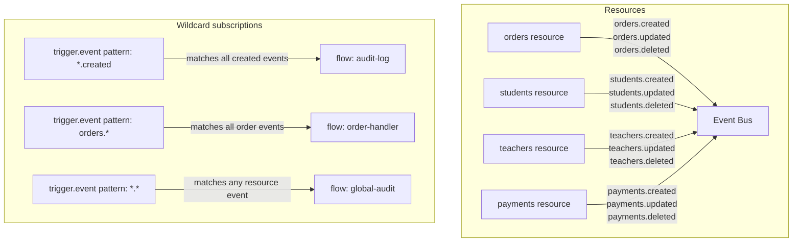

Pawabase emits events from many sources — resource writes, auth actions, flow executions, schedules, and manual `event.emit` calls. This page catalogues every event name, what triggers it, and what the payload contains. The event names follow a `domain.action` convention, and each event type has a well-defined payload shape. Understanding the complete event catalog is essential for building event-driven architectures — every event name, payload shape, and trigger condition is documented here.

<CardGroup cols={3}>
  <Card title="Resource events" icon="database">`<resource>.created`, `.updated`, `.deleted`.</Card>
  <Card title="Auth events" icon="key">`user.signed_up`, `user.signed_in`, `user.email_verified`.</Card>
  <Card title="System events" icon="server">Scheduler, queue, mail, and platform events.</Card>
</CardGroup>

## Resource events

Every resource emits three events — one per write operation. The resource name matches the `name` field of the resource definition (the same name used in `/rest/v1/<resource>` URL segments). When a resource is created, updated, or deleted, the corresponding event is emitted by the store layer's `after_write` hooks inside the same transaction as the write itself.

| Event name | Triggered by | Payload |
| --- | --- | --- |
| `<resource>.created` | `resource.create` | The created record (all fields plus `id`) |
| `<resource>.updated` | `resource.update` | The updated record (all fields plus `id`) |
| `<resource>.deleted` | `resource.delete` | The record before deletion (all fields plus `id`) |

The resource events are emitted by the `after_write` function in `services/api/app/runtime.py`. The `after_write` function calls `platform.emit`, which delegates to `EventBus.emit`. The `after_write` hooks run inside the same transaction as the write itself, so the event is guaranteed to exist if the write succeeds. The `after_write` function is called from three places in `ApiRuntime`: `resource_create`, `resource_update`, and `resource_delete`. For `db_transaction`, `after_write` is called for each operation after the transaction commits.

```python
# services/api/app/runtime.py
async def resource_create(self, resource, data):
    store = await self.state.store(resource)
    record = await store.create(dict(data))
    await after_write(
        self.platform,
        self.state,
        resource,
        "created",
        record,
        actor=self.auth.get("user_id"),
        request_id=self.request_id,
    )
    return record
```

The `after_write` function:

```python
async def after_write(self, resource, operation, record):
    await platform.emit(f"{resource}.{operation}", record)
```

### Example: `orders.created`

When a flow calls `resource.create` on the `orders` resource:

```json
{
  "event": "orders.created",
  "payload": {
    "id": "order_42",
    "store_id": "acme",
    "total_minor": 2999,
    "customer_id": "cust_001",
    "status": "pending",
    "currency": "usd",
    "items": [
      {"product_id": "prod_123", "quantity": 2, "unit_price": 1499},
      {"product_id": "prod_456", "quantity": 1, "unit_price": 5999}
    ],
    "shipping_address": {"street": "123 Main", "city": "San Francisco", "state": "CA", "zip": "94105"},
    "billing_address": {"street": "123 Main", "city": "San Francisco", "state": "CA", "zip": "94105"},
    "created_at": "2026-09-28T10:00:00+00:00",
    "updated_at": "2026-09-28T10:00:00+00:00"
  },
  "id": "evt_abc123",
  "published_at": "2026-09-28T10:00:00+00:00",
  "actor": "system",
  "project": "acme",
  "env": "production"
}
```

A subscription to `orders.created` in another flow, function, or webhook endpoint receives this exact payload. The payload includes every column defined in the resource schema, plus the `id` field. For relational resources, the payload includes the foreign key values and any embedded related records.

### Payload shape for resource events

The payload for resource events is the full record as it exists after the write (for `created` and `updated`) or as it existed before the deletion (for `deleted`). Fields include every column defined in the resource schema, plus the `id` field. For relational resources, the payload includes the foreign key values. The payload structure mirrors the resource's schema definition exactly.

```json
{
  "event": "students.updated",
  "payload": {
    "id": "stu_001",
    "name": "Ada Lovelace",
    "email": "ada@example.com",
    "grade": 12,
    "enrollment_date": "2024-09-01",
    "parent_email": "parent@example.com",
    "emergency_contact": "+1-555-0199",
    "medical_notes": "Allergic to peanuts",
    "updated_at": "2026-09-28T10:00:00+00:00"
  }
}
```

### Multiple resources, one pattern

If your project defines resources named `orders`, `students`, and `teachers`, you get three event namespaces: `orders.*`, `students.*`, and `teachers.*`. Each follows the same `<resource>.<action>` pattern. There is no way to subscribe to all resources at once — use a wildcard `trigger.event` pattern like `*.*` if your subscriber needs to react to any resource event.



<Note>
Resource events are emitted by the store layer's `after_write` hooks, which run inside the same transaction as the write itself. The event is recorded to the event log before the write commits, ensuring durability — if the process crashes immediately after, the event is still recoverable.
</Note>

## Auth events

Auth events are triggered by identity lifecycle events. All auth events include the `user_id` in their payload, making them easy to filter by user. Auth events are emitted by the `pawabase_kit` auth layer and the Akountz service. Every auth event is tagged with the `actor` field set to `"system"` and includes the project and environment context.

| Event name | Triggered by | Payload |
| --- | --- | --- |
| `user.signed_up` | New account created | `{ email, user_id, email_verified }` |
| `user.signed_in` | Successful sign-in | `{ user_id, method, ip }` |
| `user.email_verified` | Email verification completed | `{ user_id, email }` |
| `user.password_changed` | Password changed | `{ user_id }` |
| `user.signed_out` | Session terminated | `{ user_id, method }` |
| `user.updated` | Profile updated | `{ user_id, fields }` |

### Sign-in methods

The `method` field in `user.signed_in` tells you how the user authenticated:

| Method value | Meaning |
| --- | --- |
| `password` | Email/password grant |
| `magic_link` | Magic link click-through |
| `oauth` | OAuth/OIDC provider |
| `totp` | TOTP MFA challenge |
| `recovery_code` | Recovery code fallback |

The `method` field is set by the Akountz authentication service based on the authentication flow that was used. Each method corresponds to a different authentication provider or mechanism configured in the project.

### Example: `user.signed_up`

```json
{
  "event": "user.signed_up",
  "payload": {
    "email": "ada@example.com",
    "user_id": "usr_abc123",
    "email_verified": false,
    "name": "Ada Lovelace",
    "role": "student"
  },
  "id": "evt_def456",
  "published_at": "2026-09-28T10:00:00+00:00",
  "actor": "system",
  "project": "acme",
  "env": "production"
}
```

### Example: `user.signed_in`

```json
{
  "event": "user.signed_in",
  "payload": {
    "user_id": "usr_abc123",
    "method": "password",
    "ip": "203.0.113.1",
    "user_agent": "Mozilla/5.0...",
    "email": "ada@example.com"
  },
  "id": "evt_ghi789",
  "published_at": "2026-09-28T10:00:00+00:00",
  "actor": "system",
  "project": "acme",
  "env": "production"
}
```

### Example: `user.updated`

```json
{
  "event": "user.updated",
  "payload": {
    "user_id": "usr_abc123",
    "fields": ["email", "name", "grade"],
    "old_values": {"email": "old@example.com", "name": "Ada Old"},
    "new_values": {"email": "ada@example.com", "name": "Ada Lovelace"}
  },
  "id": "evt_jkl012",
  "published_at": "2026-09-28T10:00:00+00:00",
  "actor": "usr_abc123",
  "project": "acme",
  "env": "production"
}
```

## Flow and schedule events

| Event name | Triggered by | Payload |
| --- | --- | --- |
| `scheduler.fired.<flow>` | A schedule fires a flow | `{ flow, node, scheduled_at }` |
| `flow.completed.<flow>` | A flow finishes successfully | `{ flow, run_id, result }` |
| `flow.failed.<flow>` | A flow fails | `{ flow, run_id, error }` |
| `job.dispatched.<flow>` | `queue.flow` dispatches a flow | `{ flow, job_id, input }` |
| `job.dispatched.<function>` | `queue.function` dispatches a function | `{ function, job_id, input }` |
| `job.completed.<job_id>` | A background job finishes | `{ job_id, status, result }` |
| `job.failed.<job_id>` | A background job fails | `{ job_id, error }` |

### Scheduler-fired events

When a `trigger.schedule` node fires, the scheduler emits a `scheduler.fired.<flow>` event. This is distinct from the `job.dispatched.<flow>` event that happens when the scheduler queues the flow — the fired event confirms the schedule triggered, while the dispatched event confirms the worker picked it up.

The `PlatformScheduler.fire` method in `services/api/app/scheduler.py` dispatches the flow:

```python
async def fire(self, spec: dict[str, Any]) -> None:
    if spec["kind"] == "flow":
        await platform.dispatch(
            RunFlowJob,
            project=project,
            env=env,
            target=spec["flow"],
            source="schedule",
            flow=spec["flow"],
            input={"scheduled_at": _now()},
            trigger="schedule",
            entry=spec["node"],
            auth={"authenticated": False, "kind": "system"},
        )
```

The `_key` function in the scheduler generates a unique key for each schedule based on the kind, project, env, cron, every, id, target_type, target, flow, node, and payload:

```python
def _key(spec: dict[str, Any]) -> str:
    parts = [
        spec["kind"],
        spec["project"],
        spec["env"],
        str(spec.get("cron")),
        str(spec.get("every")),
    ]
    parts += [str(spec.get(k)) for k in ("id", "target_type", "target", "flow", "node")]
    parts.append(repr(spec.get("payload")))
    return "|".join(parts)
```

### Example: `scheduler.fired.daily-digest`

```json
{
  "event": "scheduler.fired.daily-digest",
  "payload": {
    "flow": "daily-digest",
    "node": "start",
    "scheduled_at": "2026-09-28T08:00:00+00:00",
    "cron": "0 8 * * *",
    "project": "acme",
    "env": "production"
  },
  "id": "evt_ghi789",
  "published_at": "2026-09-28T08:00:00+00:00",
  "actor": "scheduler",
  "project": "acme",
  "env": "production"
}
```

### Example: `flow.completed.daily-digest`

```json
{
  "event": "flow.completed.daily-digest",
  "payload": {
    "flow": "daily-digest",
    "run_id": "run_abc123",
    "result": {
      "status": "succeeded",
      "output": {"emails_sent": 150, "report_generated": true}
    },
    "duration_ms": 12500,
    "project": "acme",
    "env": "production"
  },
  "id": "evt_jkl012",
  "published_at": "2026-09-28T08:02:15+00:00",
  "actor": "system",
  "project": "acme",
  "env": "production"
}
```

### Example: `job.failed.<job_id>`

```json
{
  "event": "job.failed.run_abc123",
  "payload": {
    "job_id": "run_abc123",
    "error": "Connection refused: smtp.example.com:587",
    "job_class": "SendMailJob",
    "queue": "mail",
    "project": "acme",
    "env": "production"
  },
  "id": "evt_mno345",
  "published_at": "2026-09-28T10:05:00+00:00",
  "actor": "system",
  "project": "acme",
  "env": "production"
}
```

## System events

| Event name | Triggered by | Payload |
| --- | --- | --- |
| `mail.sent` | An email is sent successfully | `{ to, subject, message_id }` |
| `mail.failed` | An email delivery fails | `{ to, subject, error }` |
| `webhook.delivered` | A webhook delivery succeeds | `{ endpoint, event, status }` |
| `webhook.failed` | A webhook delivery fails | `{ endpoint, event, error }` |

### Mail events

Mail events are emitted after a `SendMailJob` completes. The `MailManager.send` method in `services/api/app/mail.py` creates a `MailLog` record and determines the event based on the result:

```python
await MailLog.create(
    project=state.project_ref,
    env=state.env_name,
    to=to,
    subject=subject,
    template=template,
    status="suppressed" if suppressed else ("sent" if result.success else "failed"),
    message_id=result.message_id,
    error=result.error,
    source=source,
)
```

If the delivery is successful, the status is `"sent"` and a `mail.sent` event is implied. If the delivery fails, the status is `"failed"` and a `mail.failed` event is implied. If suppression is active, the status is `"suppressed"`.

### Webhook delivery events

Webhook delivery events are emitted by `DeliverWebhookJob` in `services/api/app/jobs/webhooks.py`. Each delivery attempt is tracked in the `WebhookDelivery` table:

```python
delivery.status, delivery.error = "delivered", None
delivery.delivered_at = datetime.now(UTC)
await delivery.save()
```

If the endpoint returns a 2xx status, the delivery is marked as `"delivered"`. If the endpoint returns a non-2xx status or the request fails, the delivery is marked as `"retrying"` and the job raises `DeliveryFailed` to trigger retry logic. After 5 failed attempts, the delivery is marked as `"failed"`.

## Custom events

Any event name starting with a custom prefix (e.g., `order.*`, `payment.*`) can be emitted via `event.emit`. There is no predefined list — the event name is whatever the emitter chooses. Custom events follow the same durable-queue, at-least-once delivery guarantees as all other events.

```json
{
  "event": "payment.processed",
  "payload": {
    "charge_id": "ch_123",
    "amount": 2999,
    "currency": "usd",
    "status": "succeeded",
    "card_last_four": "4242",
    "customer_id": "cust_001",
    "receipt_url": "https://receipts.example.com/ch_123"
  },
  "id": "evt_def456",
  "published_at": "2026-09-28T10:05:00+00:00",
  "actor": "system",
  "project": "acme",
  "env": "production"
}
```

Custom events can be subscribed to via `trigger.event` in flows, function subscriptions, outbound webhooks, or realtime channels. The `event.emit` block in flows supports any event name and any JSON-serializable payload.

<Warning>
Custom event names should use a reverse-domain prefix (e.g., `com.acme.order.paid`) to avoid collisions with system events. The platform reserves all lowercase dot-separated names without a dot in the first segment (e.g., `order.paid`, `user.signed_up`).
</Warning>

## Webhook-received events

When an inbound webhook is received, the event processor creates an event with the webhook's slug as the event name prefix. The event name follows the pattern `<slug>:<action>` or simply `<slug>` depending on the webhook configuration:

```json
{
  "event": "github:issues",
  "payload": {
    "action": "opened",
    "issue": {
      "number": 42,
      "title": "Bug report",
      "body": "The login button doesn't work",
      "state": "open",
      "labels": ["bug", "priority-high"]
    }
  },
  "id": "evt_webhook_001",
  "published_at": "2026-09-28T10:00:00+00:00",
  "actor": "system",
  "source": "webhook",
  "project": "acme",
  "env": "production"
}
```

Flows with a `trigger.webhook` block whose `hook` config matches the webhook slug are invoked. The event is routed through the same `EventProcessor` as all other events. The `endpoint_matches` function in `services/api/app/webhooks.py` checks whether the event name matches any of the webhook endpoint's subscribed patterns.

## Platform event categories

Events in Pawabase fall into four broad categories, each with different characteristics:

### Write events

Triggered by resource mutations (`resource.create`, `resource.update`, `resource.delete`). These events are emitted inside the write transaction, so the event is guaranteed to exist if the write succeeds. Write events are the foundation of event-driven architectures — they let you react to data changes without polling. The `after_write` hooks in the store layer emit these events synchronously as part of the write operation. Every resource in the project generates three write events.

### Auth events

Triggered by identity lifecycle events (sign-up, sign-in, verification, password changes). Auth events contain the user's identity information and are used by flows to implement welcome sequences, access control, and audit logging. All auth events include the `user_id` in their payload, making them easy to filter by user. Auth events are emitted by the `pawabase_kit` auth layer and the Akountz service. The `method` field distinguishes between different authentication mechanisms.

### Scheduled and job events

Triggered by the scheduler and the job queue (scheduler firings, job dispatches, completions, and failures). These events are useful for monitoring and for building dependent workflows — for example, a flow could listen for `job.completed.<job_id>` and then send a notification. The `PlatformScheduler` reconciles schedules every 15 seconds and fires them via `RunFlowJob` or `RunFunctionJob`. Job events track the entire lifecycle from dispatch to completion or failure.

### Platform and system events

Triggered by internal platform operations (mail delivery, webhook delivery, flow completion). These events are emitted by the platform itself and are useful for building observability dashboards and audit trails. Examples include `mail.sent`, `mail.failed`, `webhook.delivered`, `webhook.failed`. These events are emitted by the platform infrastructure rather than by user-defined flows or resources.

### Custom events

Any event name can be emitted via `event.emit` from within a flow. Custom events are not predefined — the event name is whatever the emitter chooses. They follow the same durable-queue, at-least-once delivery guarantees as all other events. Custom events are the most flexible event type and are used for application-specific logic.

## Event naming conventions

All event names follow the `domain.action` convention. Understanding the naming conventions helps you choose event names that are consistent, discoverable, and free of collisions:

| Pattern | Domain | Action | Example |
| --- | --- | --- | --- |
| `<resource>.<action>` | Resource name | `created`, `updated`, `deleted` | `orders.created` |
| `user.<action>` | `user` | `signed_up`, `signed_in`, etc. | `user.signed_up` |
| `scheduler.fired.<flow>` | `scheduler` | `fired` | `scheduler.fired.daily-digest` |
| `flow.<status>.<flow>` | `flow` | `completed`, `failed` | `flow.completed.daily-digest` |
| `job.<status>.<id>` | `job` | `dispatched`, `completed`, `failed` | `job.completed.run_abc` |
| `mail.<status>` | `mail` | `sent`, `failed` | `mail.sent` |
| `webhook.<status>` | `webhook` | `delivered`, `failed` | `webhook.delivered` |
| `<slug>:<action>` | Webhook slug | Action from external service | `github:issues` |
| `<prefix>.<action>` | Custom prefix | Any action | `payment.processed` |

## Event log retention

Every event is permanently recorded in the `EventLog` table. The event log includes:

| Field | Description |
| --- | --- |
| `event_id` | Unique event identifier (UUID) |
| `name` | The event name |
| `payload` | The event data (any JSON) |
| `actor` | Who or what caused the event |
| `source` | Which process emitted the event |
| `project` | The project reference |
| `env` | The environment name |
| `occurred_at` | When the event was published |
| `consumers` | Which subscribers processed the event and their outcomes |
| `request_id` | The HTTP request that caused the event |

Studio surfaces the event log in the **Observability → Events** dashboard, where you can filter by event name, project, environment, and time range. Event logs are retained indefinitely — there is no automatic expiry.

<Note>
For high-volume projects (thousands of events per second), consider using the `EventLog` retention settings to archive old events to a separate storage backend. The event log is stored in the platform database, so very large event volumes can increase the size of the platform database over time.
</Note>

## Complete system event reference

### Authentication events reference

```
user.signed_up       — New account created
user.signed_in       — Successful sign-in
user.email_verified  — Email verification completed
user.password_changed — Password changed
user.signed_out      — Session terminated
user.updated         — Profile updated
```

### Resource events reference

```
<resource>.created    — Record created (all fields + id)
<resource>.updated    — Record updated (all fields + id)
<resource>.deleted    — Record before deletion (all fields + id)
```

### Scheduler and job events reference

```
scheduler.fired.<flow>  — Schedule fired a flow
flow.completed.<flow>   — Flow finished successfully
flow.failed.<flow>      — Flow failed
job.dispatched.<flow>   — Flow job queued
job.dispatched.<function> — Function job queued
job.completed.<job_id>  — Background job finished
job.failed.<job_id>     — Background job failed
```

### Platform system events reference

```
mail.sent      — Email sent successfully
mail.failed    — Email delivery failed
webhook.delivered — Webhook delivery succeeded
webhook.failed   — Webhook delivery failed
```

### Custom events reference

```
Any <domain>.<action> name emitted via event.emit
Examples: order.paid, payment.processed, invoice.overdue
```

## Subscribing to events

Events are subscribed to via `trigger.event` in flows, function subscriptions, outbound webhooks, or realtime channels. See [Events → Subscriptions](/events/subscriptions) for the full subscription mechanics.

<CardGroup cols={2}>
  <Card title="Emitting" icon="plus" href="/events/emitting">How to publish events.</Card>
  <Card title="Subscriptions" icon="link" href="/events/subscriptions">How to subscribe to events.</Card>
  <Card title="Inbound webhooks" icon="link" href="/webhooks/inbound">Receiving webhooks from external services.</Card>
  <Card title="Outbound webhooks" icon="link" href="/webhooks/outbound">Delivering events to external endpoints.</Card>
</CardGroup>

## Summary

Pawabase's event system provides a comprehensive catalog of events covering every subsystem. Resource events (`<resource>.created|updated|deleted`) fire on every write. Auth events (`user.signed_up`, `user.signed_in`, etc.) track identity lifecycle changes. Flow and schedule events (`scheduler.fired.*`, `flow.completed.*`, `job.*`) track execution lifecycle. System events (`mail.sent`, `mail.failed`, `webhook.delivered`, `webhook.failed`) track platform operations. Custom events can be emitted via `event.emit` for any application-specific needs. Every event is recorded in the `EventLog` with full payload, actor, and consumer tracking. See [Emitting](/events/emitting) to learn how to publish events, [Subscriptions](/events/subscriptions) for all subscription mechanisms, and [Inbound Webhooks](/webhooks/inbound) for receiving external webhooks.
## Event processing pipeline details

### The complete event processing pipeline

Every event goes through this complete pipeline:

1. **Event creation** — The `PlatformEvent` is created with a unique ID, timestamp, and all metadata
2. **Publishing** — The event is published to the Redis channel via `EventBus.publish`
3. **Redis persistence** — The event is persisted in the Redis stream for durability
4. **Consumer notification** — The `EventProcessor.handle` method is called
5. **Deduplication** — The `EventLog` table is checked for the event ID
6. **EventLog creation** — A new `EventLog` row is created
7. **Routing** — The `route` method finds all matching consumers
8. **Job dispatch** — Each consumer gets a queued job
9. **EventLog update** — The `consumers` array is saved to the `EventLog`
10. **Worker execution** — Workers process the queued jobs asynchronously

### Event log schema

The `EventLog` model stores all events:

```python
class EventLog(Model):
    event_id = UUIDField(primary_key=True)
    name = CharField()
    payload = JSONField()
    actor = CharField(null=True)
    source = CharField(default="unknown")
    project = CharField()
    env = CharField()
    occurred_at = DateTimeField()
    consumers = JSONField(default=list)
    request_id = UUIDField(null=True)
```

The `consumers` field stores an array of consumer entries:

```json
[
  {"type": "flow", "target": "send-welcome-email", "status": "queued", "ref": "job_abc123"},
  {"type": "webhook", "target": "endpoints", "status": "queued", "ref": null}
]
```

## Event system performance characteristics

### Throughput considerations

The event system throughput is limited by:

1. **EventProcessor speed** — Single-threaded per (project, env) pair
2. **Redis throughput** — Redis stream write speed
3. **Job queue throughput** — Queue push speed
4. **Worker processing speed** — Number of concurrent workers
5. **Database write speed** — EventLog insert speed

For high-throughput scenarios:

- Run multiple API instances
- Use Redis Cluster for the event bus
- Use dedicated worker nodes
- Optimize database indexes
- Use batch processing where possible

### Latency characteristics

Event processing latency depends on:

- **Network latency** — Redis round-trip time
- **EventProcessor queue** — Events waiting to be processed
- **Job dispatch latency** — Time to push jobs to the queue
- **Worker queue depth** — Jobs waiting to be executed

Typical latency: < 100ms for event emission to job queue push. < 1s for job dispatch to worker pickup.

## Event system scalability

### Horizontal scaling

The event system scales horizontally by adding more API instances and workers:

- Each API instance runs its own `EventProcessor`
- The `EnvironmentCache` is per-instance, so states are cached locally
- Redis handles the coordination between instances
- Workers can be scaled independently based on queue depth

### Vertical scaling

For single-instance scaling:

- Increase Redis memory for larger event backlogs
- Optimize database performance for EventLog queries
- Increase worker concurrency (PAWABASE_WORKER_CONCURRENCY)
- Tune Redis stream max length

### Scaling limits

- **EventProcessor**: Single-threaded per (project, env) — bottleneck for high-volume single environments
- **Redis**: Limited by Redis instance capacity
- **Database**: Limited by Postgres write speed for EventLog inserts
- **Workers**: Limited by available memory and CPU

## Event system security

### Event data protection

- Events contain payload data that may be sensitive
- The `EventLog` table stores event payloads in the database
- Events are accessible via Studio and the Platform API
- Access to events should be controlled through the project's authorization system

### Event privacy

- Event payloads may contain PII (personally identifiable information)
- Consider masking sensitive data in event payloads
- The `EventLog` retention policy should be reviewed for compliance
- Events are retained indefinitely by default

### Event integrity

- Events are immutable once created
- The `EventLog` table provides a tamper-evident audit trail
- Events are signed by the source service
- The `EventProcessor` validates event structure before processing

## Event system observability

### Studio observability

Studio provides comprehensive observability for the event system:

- **Observability → Events**: Event log viewer with filtering
- **Status dashboard**: EventProcessor.processed counter
- **Worker dashboard**: Queue depths and processing rates
- **Flow execution**: Individual flow run traces
- **Job dashboard**: Job status and failure tracking

### API observability endpoints

The platform provides observability endpoints:

- **Event metrics**: Total events published, processed, failed
- **Queue metrics**: Queue depths, processing rates
- **Consumer metrics**: Success/failure rates per consumer type
- **Latency metrics**: Event processing latency

### Custom observability

You can add custom observability by listening to events:

```python
from pawabase_kit.events import EventBus

bus = EventBus.from_url(settings.redis_url, source="my-app")

async def handle_event(event):
    # Custom observability logic
    print(f"Event: {event.name}, Payload: {event.payload}")

bus.subscribe(handle_event)
```

