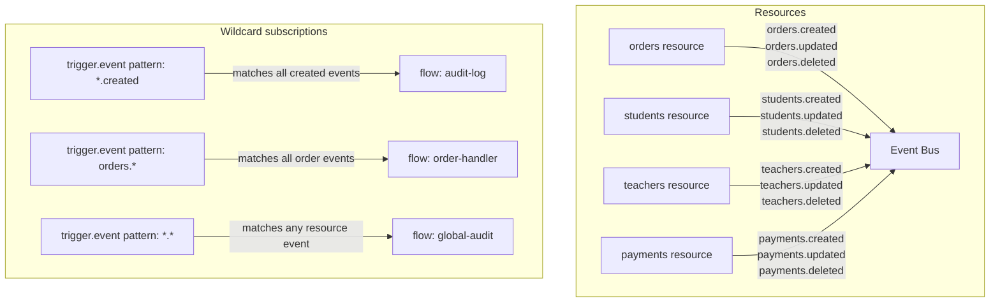
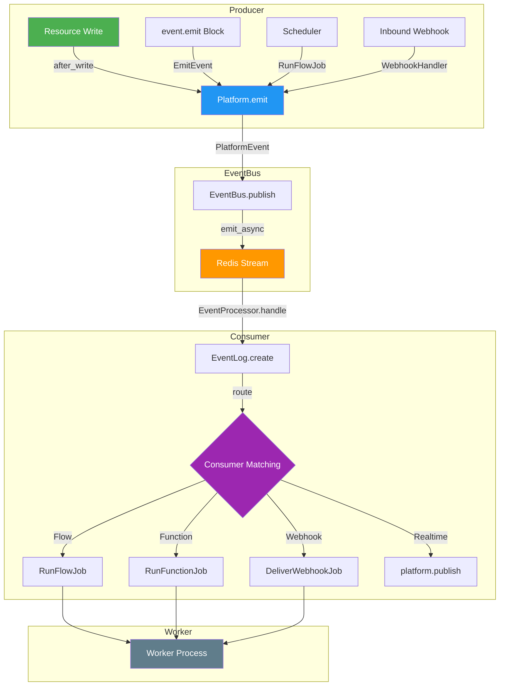
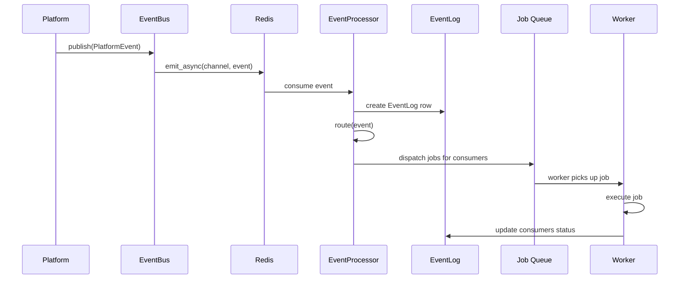

Pawabase emits events from many sources — resource writes, auth actions, flow executions, schedules, and manual `event.emit` calls. This page catalogues every event name, what triggers it, and what the payload contains. The event names follow a `domain.action` convention, and each event type has a well-defined payload shape. Understanding the complete event catalog is essential for building event-driven architectures — every event name, payload shape, and trigger condition is documented here.

<CardGroup cols={3}>
  <Card title="Resource events" icon="database">`<resource>.created`, `.updated`, `.deleted`.</Card>
  <Card title="Auth events" icon="key">`user.signed_up`, `user.signed_in`, `user.email_verified`.</Card>
  <Card title="System events" icon="server">Scheduler, queue, mail, and platform events.</Card>
</CardGroup>

## Resource events

Every resource emits three events — one per write operation. The resource name matches the `name` field of the resource definition (the same name used in `/rest/v1/<resource>` URL segments). When a resource is created, updated, or deleted, the corresponding event is emitted by the store layer's `after_write` hooks inside the same transaction as the write itself.

| Event name | Triggered by | Payload |
| --- | --- | --- |
| `<resource>.created` | `resource.create` | The created record (all fields plus `id`) |
| `<resource>.updated` | `resource.update` | The updated record (all fields plus `id`) |
| `<resource>.deleted` | `resource.delete` | The record before deletion (all fields plus `id`) |

The resource events are emitted by the `after_write` function in `services/api/app/runtime.py`. The `after_write` function calls `platform.emit`, which delegates to `EventBus.emit`. The `after_write` hooks run inside the same transaction as the write itself, so the event is guaranteed to exist if the write succeeds. The `after_write` function is called from three places in `ApiRuntime`: `resource_create`, `resource_update`, and `resource_delete`. For `db_transaction`, `after_write` is called for each operation after the transaction commits.

```python
# services/api/app/runtime.py
async def resource_create(self, resource, data):
    store = await self.state.store(resource)
    record = await store.create(dict(data))
    await after_write(
        self.platform,
        self.state,
        resource,
        "created",
        record,
        actor=self.auth.get("user_id"),
        request_id=self.request_id,
    )
    return record
```

The `after_write` function:

```python
async def after_write(self, resource, operation, record):
    await platform.emit(f"{resource}.{operation}", record)
```

### Example: `orders.created`

When a flow calls `resource.create` on the `orders` resource:

```json
{
  "event": "orders.created",
  "payload": {
    "id": "order_42",
    "store_id": "acme",
    "total_minor": 2999,
    "customer_id": "cust_001",
    "status": "pending",
    "currency": "usd",
    "items": [
      {"product_id": "prod_123", "quantity": 2, "unit_price": 1499},
      {"product_id": "prod_456", "quantity": 1, "unit_price": 5999}
    ],
    "shipping_address": {"street": "123 Main", "city": "San Francisco", "state": "CA", "zip": "94105"},
    "billing_address": {"street": "123 Main", "city": "San Francisco", "state": "CA", "zip": "94105"},
    "created_at": "2026-09-28T10:00:00+00:00",
    "updated_at": "2026-09-28T10:00:00+00:00"
  },
  "id": "evt_abc123",
  "published_at": "2026-09-28T10:00:00+00:00",
  "actor": "system",
  "project": "acme",
  "env": "production"
}
```

A subscription to `orders.created` in another flow, function, or webhook endpoint receives this exact payload. The payload includes every column defined in the resource schema, plus the `id` field. For relational resources, the payload includes the foreign key values and any embedded related records.

### Payload shape for resource events

The payload for resource events is the full record as it exists after the write (for `created` and `updated`) or as it existed before the deletion (for `deleted`). Fields include every column defined in the resource schema, plus the `id` field. For relational resources, the payload includes the foreign key values. The payload structure mirrors the resource's schema definition exactly.

```json
{
  "event": "students.updated",
  "payload": {
    "id": "stu_001",
    "name": "Ada Lovelace",
    "email": "ada@example.com",
    "grade": 12,
    "enrollment_date": "2024-09-01",
    "parent_email": "parent@example.com",
    "emergency_contact": "+1-555-0199",
    "medical_notes": "Allergic to peanuts",
    "updated_at": "2026-09-28T10:00:00+00:00"
  }
}
```

### Multiple resources, one pattern

If your project defines resources named `orders`, `students`, and `teachers`, you get three event namespaces: `orders.*`, `students.*`, and `teachers.*`. Each follows the same `<resource>.<action>` pattern. There is no way to subscribe to all resources at once — use a wildcard `trigger.event` pattern like `*.*` if your subscriber needs to react to any resource event.



<Note>
Resource events are emitted by the store layer's `after_write` hooks, which run inside the same transaction as the write itself. The event is recorded to the event log before the write commits, ensuring durability — if the process crashes immediately after, the event is still recoverable.
</Note>

## Auth events

Auth events are triggered by identity lifecycle events. All auth events include the `user_id` in their payload, making them easy to filter by user. Auth events are emitted by the `pawabase_kit` auth layer and the Akountz service. Every auth event is tagged with the `actor` field set to `"system"` and includes the project and environment context.

| Event name | Triggered by | Payload |
| --- | --- | --- |
| `user.signed_up` | New account created | `{ email, user_id, email_verified }` |
| `user.signed_in` | Successful sign-in | `{ user_id, method, ip }` |
| `user.email_verified` | Email verification completed | `{ user_id, email }` |
| `user.password_changed` | Password changed | `{ user_id }` |
| `user.signed_out` | Session terminated | `{ user_id, method }` |
| `user.updated` | Profile updated | `{ user_id, fields }` |

### Sign-in methods

The `method` field in `user.signed_in` tells you how the user authenticated:

| Method value | Meaning |
| --- | --- |
| `password` | Email/password grant |
| `magic_link` | Magic link click-through |
| `oauth` | OAuth/OIDC provider |
| `totp` | TOTP MFA challenge |
| `recovery_code` | Recovery code fallback |

The `method` field is set by the Akountz authentication service based on the authentication flow that was used. Each method corresponds to a different authentication provider or mechanism configured in the project.

### Example: `user.signed_up`

```json
{
  "event": "user.signed_up",
  "payload": {
    "email": "ada@example.com",
    "user_id": "usr_abc123",
    "email_verified": false,
    "name": "Ada Lovelace",
    "role": "student"
  },
  "id": "evt_def456",
  "published_at": "2026-09-28T10:00:00+00:00",
  "actor": "system",
  "project": "acme",
  "env": "production"
}
```

### Example: `user.signed_in`

```json
{
  "event": "user.signed_in",
  "payload": {
    "user_id": "usr_abc123",
    "method": "password",
    "ip": "203.0.113.1",
    "user_agent": "Mozilla/5.0...",
    "email": "ada@example.com"
  },
  "id": "evt_ghi789",
  "published_at": "2026-09-28T10:00:00+00:00",
  "actor": "system",
  "project": "acme",
  "env": "production"
}
```

### Example: `user.updated`

```json
{
  "event": "user.updated",
  "payload": {
    "user_id": "usr_abc123",
    "fields": ["email", "name", "grade"],
    "old_values": {"email": "old@example.com", "name": "Ada Old"},
    "new_values": {"email": "ada@example.com", "name": "Ada Lovelace"}
  },
  "id": "evt_jkl012",
  "published_at": "2026-09-28T10:00:00+00:00",
  "actor": "usr_abc123",
  "project": "acme",
  "env": "production"
}
```

## Flow and schedule events

| Event name | Triggered by | Payload |
| --- | --- | --- |
| `scheduler.fired.<flow>` | A schedule fires a flow | `{ flow, node, scheduled_at }` |
| `flow.completed.<flow>` | A flow finishes successfully | `{ flow, run_id, result }` |
| `flow.failed.<flow>` | A flow fails | `{ flow, run_id, error }` |
| `job.dispatched.<flow>` | `queue.flow` dispatches a flow | `{ flow, job_id, input }` |
| `job.dispatched.<function>` | `queue.function` dispatches a function | `{ function, job_id, input }` |
| `job.completed.<job_id>` | A background job finishes | `{ job_id, status, result }` |
| `job.failed.<job_id>` | A background job fails | `{ job_id, error }` |

### Scheduler-fired events

When a `trigger.schedule` node fires, the scheduler emits a `scheduler.fired.<flow>` event. This is distinct from the `job.dispatched.<flow>` event that happens when the scheduler queues the flow — the fired event confirms the schedule triggered, while the dispatched event confirms the worker picked it up.

The `PlatformScheduler.fire` method in `services/api/app/scheduler.py` dispatches the flow:

```python
async def fire(self, spec: dict[str, Any]) -> None:
    if spec["kind"] == "flow":
        await platform.dispatch(
            RunFlowJob,
            project=project,
            env=env,
            target=spec["flow"],
            source="schedule",
            flow=spec["flow"],
            input={"scheduled_at": _now()},
            trigger="schedule",
            entry=spec["node"],
            auth={"authenticated": False, "kind": "system"},
        )
```

The `_key` function in the scheduler generates a unique key for each schedule based on the kind, project, env, cron, every, id, target_type, target, flow, node, and payload:

```python
def _key(spec: dict[str, Any]) -> str:
    parts = [
        spec["kind"],
        spec["project"],
        spec["env"],
        str(spec.get("cron")),
        str(spec.get("every")),
    ]
    parts += [str(spec.get(k)) for k in ("id", "target_type", "target", "flow", "node")]
    parts.append(repr(spec.get("payload")))
    return "|".join(parts)
```

### Example: `scheduler.fired.daily-digest`

```json
{
  "event": "scheduler.fired.daily-digest",
  "payload": {
    "flow": "daily-digest",
    "node": "start",
    "scheduled_at": "2026-09-28T08:00:00+00:00",
    "cron": "0 8 * * *",
    "project": "acme",
    "env": "production"
  },
  "id": "evt_ghi789",
  "published_at": "2026-09-28T08:00:00+00:00",
  "actor": "scheduler",
  "project": "acme",
  "env": "production"
}
```

### Example: `flow.completed.daily-digest`

```json
{
  "event": "flow.completed.daily-digest",
  "payload": {
    "flow": "daily-digest",
    "run_id": "run_abc123",
    "result": {
      "status": "succeeded",
      "output": {"emails_sent": 150, "report_generated": true}
    },
    "duration_ms": 12500,
    "project": "acme",
    "env": "production"
  },
  "id": "evt_jkl012",
  "published_at": "2026-09-28T08:02:15+00:00",
  "actor": "system",
  "project": "acme",
  "env": "production"
}
```

### Example: `job.failed.<job_id>`

```json
{
  "event": "job.failed.run_abc123",
  "payload": {
    "job_id": "run_abc123",
    "error": "Connection refused: smtp.example.com:587",
    "job_class": "SendMailJob",
    "queue": "mail",
    "project": "acme",
    "env": "production"
  },
  "id": "evt_mno345",
  "published_at": "2026-09-28T10:05:00+00:00",
  "actor": "system",
  "project": "acme",
  "env": "production"
}
```

## System events

| Event name | Triggered by | Payload |
| --- | --- | --- |
| `mail.sent` | An email is sent successfully | `{ to, subject, message_id }` |
| `mail.failed` | An email delivery fails | `{ to, subject, error }` |
| `webhook.delivered` | A webhook delivery succeeds | `{ endpoint, event, status }` |
| `webhook.failed` | A webhook delivery fails | `{ endpoint, event, error }` |

### Mail events

Mail events are emitted after a `SendMailJob` completes. The `MailManager.send` method in `services/api/app/mail.py` creates a `MailLog` record and determines the event based on the result:

```python
await MailLog.create(
    project=state.project_ref,
    env=state.env_name,
    to=to,
    subject=subject,
    template=template,
    status="suppressed" if suppressed else ("sent" if result.success else "failed"),
    message_id=result.message_id,
    error=result.error,
    source=source,
)
```

If the delivery is successful, the status is `"sent"` and a `mail.sent` event is implied. If the delivery fails, the status is `"failed"` and a `mail.failed` event is implied. If suppression is active, the status is `"suppressed"`.

### Webhook delivery events

Webhook delivery events are emitted by `DeliverWebhookJob` in `services/api/app/jobs/webhooks.py`. Each delivery attempt is tracked in the `WebhookDelivery` table:

```python
delivery.status, delivery.error = "delivered", None
delivery.delivered_at = datetime.now(UTC)
await delivery.save()
```

If the endpoint returns a 2xx status, the delivery is marked as `"delivered"`. If the endpoint returns a non-2xx status or the request fails, the delivery is marked as `"retrying"` and the job raises `DeliveryFailed` to trigger retry logic. After 5 failed attempts, the delivery is marked as `"failed"`.

## Custom events

Any event name starting with a custom prefix (e.g., `order.*`, `payment.*`) can be emitted via `event.emit`. There is no predefined list — the event name is whatever the emitter chooses. Custom events follow the same durable-queue, at-least-once delivery guarantees as all other events.

```json
{
  "event": "payment.processed",
  "payload": {
    "charge_id": "ch_123",
    "amount": 2999,
    "currency": "usd",
    "status": "succeeded",
    "card_last_four": "4242",
    "customer_id": "cust_001",
    "receipt_url": "https://receipts.example.com/ch_123"
  },
  "id": "evt_def456",
  "published_at": "2026-09-28T10:05:00+00:00",
  "actor": "system",
  "project": "acme",
  "env": "production"
}
```

Custom events can be subscribed to via `trigger.event` in flows, function subscriptions, outbound webhooks, or realtime channels. The `event.emit` block in flows supports any event name and any JSON-serializable payload.

<Warning>
Custom event names should use a reverse-domain prefix (e.g., `com.acme.order.paid`) to avoid collisions with system events. The platform reserves all lowercase dot-separated names without a dot in the first segment (e.g., `order.paid`, `user.signed_up`).
</Warning>

## Webhook-received events

When an inbound webhook is received, the event processor creates an event with the webhook's slug as the event name prefix. The event name follows the pattern `<slug>:<action>` or simply `<slug>` depending on the webhook configuration:

```json
{
  "event": "github:issues",
  "payload": {
    "action": "opened",
    "issue": {
      "number": 42,
      "title": "Bug report",
      "body": "The login button doesn't work",
      "state": "open",
      "labels": ["bug", "priority-high"]
    }
  },
  "id": "evt_webhook_001",
  "published_at": "2026-09-28T10:00:00+00:00",
  "actor": "system",
  "source": "webhook",
  "project": "acme",
  "env": "production"
}
```

Flows with a `trigger.webhook` block whose `hook` config matches the webhook slug are invoked. The event is routed through the same `EventProcessor` as all other events. The `endpoint_matches` function in `services/api/app/webhooks.py` checks whether the event name matches any of the webhook endpoint's subscribed patterns.

## Platform event categories

Events in Pawabase fall into four broad categories, each with different characteristics:

### Write events

Triggered by resource mutations (`resource.create`, `resource.update`, `resource.delete`). These events are emitted inside the write transaction, so the event is guaranteed to exist if the write succeeds. Write events are the foundation of event-driven architectures — they let you react to data changes without polling. The `after_write` hooks in the store layer emit these events synchronously as part of the write operation. Every resource in the project generates three write events.

### Auth events

Triggered by identity lifecycle events (sign-up, sign-in, verification, password changes). Auth events contain the user's identity information and are used by flows to implement welcome sequences, access control, and audit logging. All auth events include the `user_id` in their payload, making them easy to filter by user. Auth events are emitted by the `pawabase_kit` auth layer and the Akountz service. The `method` field distinguishes between different authentication mechanisms.

### Scheduled and job events

Triggered by the scheduler and the job queue (scheduler firings, job dispatches, completions, and failures). These events are useful for monitoring and for building dependent workflows — for example, a flow could listen for `job.completed.<job_id>` and then send a notification. The `PlatformScheduler` reconciles schedules every 15 seconds and fires them via `RunFlowJob` or `RunFunctionJob`. Job events track the entire lifecycle from dispatch to completion or failure.

### Platform and system events

Triggered by internal platform operations (mail delivery, webhook delivery, flow completion). These events are emitted by the platform itself and are useful for building observability dashboards and audit trails. Examples include `mail.sent`, `mail.failed`, `webhook.delivered`, `webhook.failed`. These events are emitted by the platform infrastructure rather than by user-defined flows or resources.

### Custom events

Any event name can be emitted via `event.emit` from within a flow. Custom events are not predefined — the event name is whatever the emitter chooses. They follow the same durable-queue, at-least-once delivery guarantees as all other events. Custom events are the most flexible event type and are used for application-specific logic.

## Event naming conventions

All event names follow the `domain.action` convention. Understanding the naming conventions helps you choose event names that are consistent, discoverable, and free of collisions:

| Pattern | Domain | Action | Example |
| --- | --- | --- | --- |
| `<resource>.<action>` | Resource name | `created`, `updated`, `deleted` | `orders.created` |
| `user.<action>` | `user` | `signed_up`, `signed_in`, etc. | `user.signed_up` |
| `scheduler.fired.<flow>` | `scheduler` | `fired` | `scheduler.fired.daily-digest` |
| `flow.<status>.<flow>` | `flow` | `completed`, `failed` | `flow.completed.daily-digest` |
| `job.<status>.<id>` | `job` | `dispatched`, `completed`, `failed` | `job.completed.run_abc` |
| `mail.<status>` | `mail` | `sent`, `failed` | `mail.sent` |
| `webhook.<status>` | `webhook` | `delivered`, `failed` | `webhook.delivered` |
| `<slug>:<action>` | Webhook slug | Action from external service | `github:issues` |
| `<prefix>.<action>` | Custom prefix | Any action | `payment.processed` |

## Event log retention

Every event is permanently recorded in the `EventLog` table. The event log includes:

| Field | Description |
| --- | --- |
| `event_id` | Unique event identifier (UUID) |
| `name` | The event name |
| `payload` | The event data (any JSON) |
| `actor` | Who or what caused the event |
| `source` | Which process emitted the event |
| `project` | The project reference |
| `env` | The environment name |
| `occurred_at` | When the event was published |
| `consumers` | Which subscribers processed the event and their outcomes |
| `request_id` | The HTTP request that caused the event |

Studio surfaces the event log in the **Observability → Events** dashboard, where you can filter by event name, project, environment, and time range. Event logs are retained indefinitely — there is no automatic expiry.

<Note>
For high-volume projects (thousands of events per second), consider using the `EventLog` retention settings to archive old events to a separate storage backend. The event log is stored in the platform database, so very large event volumes can increase the size of the platform database over time.
</Note>

## Complete system event reference

### Authentication events reference

```
user.signed_up       — New account created
user.signed_in       — Successful sign-in
user.email_verified  — Email verification completed
user.password_changed — Password changed
user.signed_out      — Session terminated
user.updated         — Profile updated
```

### Resource events reference

```
<resource>.created    — Record created (all fields + id)
<resource>.updated    — Record updated (all fields + id)
<resource>.deleted    — Record before deletion (all fields + id)
```

### Scheduler and job events reference

```
scheduler.fired.<flow>  — Schedule fired a flow
flow.completed.<flow>   — Flow finished successfully
flow.failed.<flow>      — Flow failed
job.dispatched.<flow>   — Flow job queued
job.dispatched.<function> — Function job queued
job.completed.<job_id>  — Background job finished
job.failed.<job_id>     — Background job failed
```

### Platform system events reference

```
mail.sent      — Email sent successfully
mail.failed    — Email delivery failed
webhook.delivered — Webhook delivery succeeded
webhook.failed   — Webhook delivery failed
```

### Custom events reference

```
Any <domain>.<action> name emitted via event.emit
Examples: order.paid, payment.processed, invoice.overdue
```

## Subscribing to events

Events are subscribed to via `trigger.event` in flows, function subscriptions, outbound webhooks, or realtime channels. See [Events → Subscriptions](/events/subscriptions) for the full subscription mechanics.

<CardGroup cols={2}>
  <Card title="Emitting" icon="plus" href="/events/emitting">How to publish events.</Card>
  <Card title="Subscriptions" icon="link" href="/events/subscriptions">How to subscribe to events.</Card>
  <Card title="Inbound webhooks" icon="link" href="/webhooks/inbound">Receiving webhooks from external services.</Card>
  <Card title="Outbound webhooks" icon="link" href="/webhooks/outbound">Delivering events to external endpoints.</Card>
</CardGroup>

## Summary

Pawabase's event system provides a comprehensive catalog of events covering every subsystem. Resource events (`<resource>.created|updated|deleted`) fire on every write. Auth events (`user.signed_up`, `user.signed_in`, etc.) track identity lifecycle changes. Flow and schedule events (`scheduler.fired.*`, `flow.completed.*`, `job.*`) track execution lifecycle. System events (`mail.sent`, `mail.failed`, `webhook.delivered`, `webhook.failed`) track platform operations. Custom events can be emitted via `event.emit` for any application-specific needs. Every event is recorded in the `EventLog` with full payload, actor, and consumer tracking. See [Emitting](/events/emitting) to learn how to publish events, [Subscriptions](/events/subscriptions) for all subscription mechanisms, and [Inbound Webhooks](/webhooks/inbound) for receiving external webhooks.

## Resource events reference (expanded)

### `<resource>.created` event details

The `<resource>.created` event is emitted after a record is successfully created in the database. The payload contains the complete created record including all fields and the auto-generated `id`.

```python
# Emited from after_write in services/api/app/runtime.py
async def resource_create(self, resource, data):
    store = await self.state.store(resource)
    record = await store.create(dict(data))
    await after_write(
        self.platform, self.state, resource, "created", record,
        actor=self.auth.get("user_id"), request_id=self.request_id,
    )
    return record
```

The `after_write` function calls `platform.emit(f"{resource}.created", record)`. The `record` is the full database record as returned by the store's `create` method.

### `<resource>.updated` event details

The `<resource>.updated` event is emitted after a record is successfully updated. The payload contains the updated record with all current field values.

```python
async def resource_update(self, resource, record_id, data):
    store = await self.state.store(resource)
    record = await store.update(record_id, dict(data))
    if record is not None:
        await after_write(
            self.platform, self.state, resource, "updated", record,
            actor=self.auth.get("user_id"), request_id=self.request_id,
        )
    return record
```

The `data` parameter contains the fields to update. The payload includes the complete record after the update. Only the fields that were actually changed are included in the update, but the payload contains the full record.

### `<resource>.deleted` event details

The `<resource>.deleted` event is emitted after a record is successfully deleted. The payload contains the record as it existed before deletion, preserving the data for audit and downstream processing.

```python
async def resource_delete(self, resource, record_id):
    store = await self.state.store(resource)
    existing = await store.get(record_id)
    deleted = await store.delete(record_id)
    if deleted and existing is not None:
        await after_write(
            self.platform, self.state, resource, "deleted", existing,
            actor=self.auth.get("user_id"), request_id=self.request_id,
        )
    return deleted
```

The payload is the `existing` record, which contains the data as it was before deletion. This allows downstream consumers to know what was deleted.

## Auth events reference (expanded)

### `user.signed_up` event details

Emitted when a new account is created through the authentication system. The payload includes the email, user_id, and email verification status.

```json
{
  "event": "user.signed_up",
  "payload": {
    "email": "ada@example.com",
    "user_id": "usr_abc123",
    "email_verified": false,
    "name": "Ada Lovelace",
    "role": "student"
  },
  "id": "evt_def456",
  "published_at": "2026-09-28T10:00:00+00:00",
  "actor": "system",
  "source": "akountz",
  "project": "acme",
  "env": "production"
}
```

### `user.signed_in` event details

Emitted when a user successfully signs in. The payload includes the user_id, authentication method, and IP address.

```json
{
  "event": "user.signed_in",
  "payload": {
    "user_id": "usr_abc123",
    "method": "password",
    "ip": "203.0.113.1",
    "user_agent": "Mozilla/5.0...",
    "email": "ada@example.com"
  },
  "id": "evt_ghi789",
  "published_at": "2026-09-28T10:00:00+00:00",
  "actor": "system",
  "source": "akountz",
  "project": "acme",
  "env": "production"
}
```

### `user.email_verified` event details

Emitted when a user completes email verification. The payload includes the user_id and the verified email address.

```json
{
  "event": "user.email_verified",
  "payload": {
    "user_id": "usr_abc123",
    "email": "ada@example.com"
  },
  "id": "evt_jkl012",
  "published_at": "2026-09-28T10:00:00+00:00",
  "actor": "system",
  "source": "akountz",
  "project": "acme",
  "env": "production"
}
```

### `user.password_changed` event details

Emitted when a user changes their password. The payload includes the user_id.

```json
{
  "event": "user.password_changed",
  "payload": { "user_id": "usr_abc123" },
  "id": "evt_mno345",
  "published_at": "2026-09-28T10:00:00+00:00",
  "actor": "system",
  "source": "akountz",
  "project": "acme",
  "env": "production"
}
```

### `user.signed_out` event details

Emitted when a user's session is terminated. The payload includes the user_id and the sign-out method.

```json
{
  "event": "user.signed_out",
  "payload": { "user_id": "usr_abc123", "method": "logout" },
  "id": "evt_pqr678",
  "published_at": "2026-09-28T10:00:00+00:00",
  "actor": "usr_abc123",
  "source": "akountz",
  "project": "acme",
  "env": "production"
}
```

### `user.updated` event details

Emitted when a user's profile is updated. The payload includes the user_id and the fields that were changed.

```json
{
  "event": "user.updated",
  "payload": {
    "user_id": "usr_abc123",
    "fields": ["email", "name"],
    "old_values": {"email": "old@example.com"},
    "new_values": {"email": "ada@example.com", "name": "Ada Lovelace"}
  },
  "id": "evt_stu901",
  "published_at": "2026-09-28T10:00:00+00:00",
  "actor": "usr_abc123",
  "source": "akountz",
  "project": "acme",
  "env": "production"
}
```

## Flow and schedule events reference (expanded)

### `scheduler.fired.<flow>` event details

The scheduler emits this event when a `trigger.schedule` node fires. The payload includes the flow name, node ID, and scheduled time.

```json
{
  "event": "scheduler.fired.daily-digest",
  "payload": {
    "flow": "daily-digest",
    "node": "start",
    "scheduled_at": "2026-09-28T08:00:00+00:00",
    "cron": "0 8 * * *"
  },
  "actor": "scheduler",
  "source": "scheduler"
}
```

The `PlatformScheduler` in `services/api/app/scheduler.py` dispatches the flow:

```python
async def fire(self, spec):
    if spec["kind"] == "flow":
        await platform.dispatch(
            RunFlowJob,
            project=project, env=env,
            target=spec["flow"], source="schedule",
            flow=spec["flow"],
            input={"scheduled_at": _now()},
            trigger="schedule",
            entry=spec["node"],
            auth={"authenticated": False, "kind": "system"},
        )
```

### `flow.completed.<flow>` event details

Emitted when a flow finishes successfully. The payload includes the flow name, run ID, and result.

```json
{
  "event": "flow.completed.daily-digest",
  "payload": {
    "flow": "daily-digest",
    "run_id": "run_abc123",
    "result": {"status": "succeeded"},
    "duration_ms": 12500
  },
  "actor": "system",
  "source": "execution"
}
```

### `flow.failed.<flow>` event details

Emitted when a flow fails. The payload includes the flow name, run ID, and error message.

```json
{
  "event": "flow.failed.daily-digest",
  "payload": {
    "flow": "daily-digest",
    "run_id": "run_abc123",
    "error": "Connection refused: database:5432",
    "duration_ms": 5000
  },
  "actor": "system",
  "source": "execution"
}
```

### `job.dispatched.<flow>` event details

Emitted when a flow job is queued by `queue.flow`. The payload includes the flow name, job ID, and input.

```json
{
  "event": "job.dispatched.daily-digest",
  "payload": {
    "flow": "daily-digest",
    "job_id": "job_abc123",
    "input": {"scheduled_at": "2026-09-28T08:00:00+00:00"}
  },
  "actor": "system",
  "source": "queue"
}
```

### `job.dispatched.<function>` event details

Emitted when a function job is queued by `queue.function`. The payload includes the function name, job ID, and input.

```json
{
  "event": "job.dispatched.send-notifications",
  "payload": {
    "function": "send-notifications",
    "job_id": "job_def456",
    "input": {"batch_id": "batch_001"}
  },
  "actor": "system",
  "source": "queue"
}
```

### `job.completed.<job_id>` event details

Emitted when a background job finishes successfully.

```json
{
  "event": "job.completed.job_abc123",
  "payload": {
    "job_id": "job_abc123",
    "status": "completed",
    "result": {"emails_sent": 150}
  },
  "actor": "system",
  "source": "queue"
}
```

### `job.failed.<job_id>` event details

Emitted when a background job fails after all retries.

```json
{
  "event": "job.failed.job_abc123",
  "payload": {
    "job_id": "job_abc123",
    "error": "Max retries exceeded",
    "job_class": "SendMailJob",
    "queue": "mail"
  },
  "actor": "system",
  "source": "queue"
}
```

## System events reference (expanded)

### `mail.sent` event details

Emitted when an email is sent successfully. The payload includes recipient list, subject, and message ID.

```json
{
  "event": "mail.sent",
  "payload": {
    "to": ["student@example.com"],
    "subject": "Report card ready",
    "message_id": "msg_abc123"
  },
  "actor": "system",
  "source": "mail"
}
```

### `mail.failed` event details

Emitted when an email delivery fails. The payload includes recipient list, subject, and error message.

```json
{
  "event": "mail.failed",
  "payload": {
    "to": ["student@example.com"],
    "subject": "Report card ready",
    "error": "SMTP connection refused"
  },
  "actor": "system",
  "source": "mail"
}
```

### `webhook.delivered` event details

Emitted when a webhook delivery succeeds.

```json
{
  "event": "webhook.delivered",
  "payload": {
    "endpoint": "partner-notifications",
    "event": "order.exported",
    "status": 200
  },
  "actor": "system",
  "source": "webhooks"
}
```

### `webhook.failed` event details

Emitted when a webhook delivery fails.

```json
{
  "event": "webhook.failed",
  "payload": {
    "endpoint": "partner-notifications",
    "event": "order.exported",
    "error": "Connection refused"
  },
  "actor": "system",
  "source": "webhooks"
}
```

## Custom events reference (expanded)

### Emitter patterns

Custom events can be emitted from any flow using `event.emit`:

```json
{
  "id": "emit",
  "data": {
    "block": "event.emit",
    "config": {
      "event": "com.acme.order.paid",
      "payload": {
        "order_id": "order_42",
        "amount": 2999,
        "currency": "usd",
        "customer_id": "cust_001"
      }
    }
  }
}
```

### Subscriber patterns

Subscribers can listen for custom events using wildcard patterns:

```json
{
  "id": "start",
  "data": {
    "block": "trigger.event",
    "config": {
      "event": "com.acme.*",
      "condition": "{{ event.payload.amount > 1000 }}"
    }
  }
}
```

### Naming conventions for custom events

Custom events should follow a consistent naming convention:

- **Reverse domain prefix**: `com.acme.order.paid`
- **Domain**: The business domain (e.g., `order`, `payment`, `invoice`)
- **Action**: What happened (e.g., `paid`, `cancelled`, `refunded`)
- **Optional suffix**: Additional context (e.g., `order.paid.refunded`)

## Webhook-received events reference (expanded)

### Inbound webhook event patterns

When an inbound webhook is received, the event name follows the pattern `<slug>:<action>` or `<slug>`:

| Webhook Slug | Event Name | Source |
| --- | --- | --- |
| `github` | `github:issues`, `github:pull_requests` | GitHub |
| `stripe` | `stripe:payment_intent.succeeded` | Stripe |
| `slack` | `slack:message` | Slack |
| `custom` | `custom:<action>` | Custom integrations |

The event routing uses the `WebhookEndpoint` model and the `endpoint_matches` function to determine which flows should be triggered.

## Event processing pipeline details

### The complete event processing pipeline

Every event goes through this complete pipeline:

1. **Event creation** — The `PlatformEvent` is created with a unique ID, timestamp, and all metadata
2. **Publishing** — The event is published to the Redis channel via `EventBus.publish`
3. **Redis persistence** — The event is persisted in the Redis stream for durability
4. **Consumer notification** — The `EventProcessor.handle` method is called
5. **Deduplication** — The `EventLog` table is checked for the event ID
6. **EventLog creation** — A new `EventLog` row is created
7. **Routing** — The `route` method finds all matching consumers
8. **Job dispatch** — Each consumer gets a queued job
9. **EventLog update** — The `consumers` array is saved to the `EventLog`
10. **Worker execution** — Workers process the queued jobs asynchronously

### Event log schema

The `EventLog` model stores all events:

```python
class EventLog(Model):
    event_id = UUIDField(primary_key=True)
    name = CharField()
    payload = JSONField()
    actor = CharField(null=True)
    source = CharField(default="unknown")
    project = CharField()
    env = CharField()
    occurred_at = DateTimeField()
    consumers = JSONField(default=list)
    request_id = UUIDField(null=True)
```

The `consumers` field stores an array of consumer entries:

```json
[
  {"type": "flow", "target": "send-welcome-email", "status": "queued", "ref": "job_abc123"},
  {"type": "webhook", "target": "endpoints", "status": "queued", "ref": null}
]
```

## Event system performance characteristics

### Throughput considerations

The event system throughput is limited by:

1. **EventProcessor speed** — Single-threaded per (project, env) pair
2. **Redis throughput** — Redis stream write speed
3. **Job queue throughput** — Queue push speed
4. **Worker processing speed** — Number of concurrent workers
5. **Database write speed** — EventLog insert speed

For high-throughput scenarios:

- Run multiple API instances
- Use Redis Cluster for the event bus
- Use dedicated worker nodes
- Optimize database indexes
- Use batch processing where possible

### Latency characteristics

Event processing latency depends on:

- **Network latency** — Redis round-trip time
- **EventProcessor queue** — Events waiting to be processed
- **Job dispatch latency** — Time to push jobs to the queue
- **Worker queue depth** — Jobs waiting to be executed

Typical latency: < 100ms for event emission to job queue push. < 1s for job dispatch to worker pickup.

## Event system scalability

### Horizontal scaling

The event system scales horizontally by adding more API instances and workers:

- Each API instance runs its own `EventProcessor`
- The `EnvironmentCache` is per-instance, so states are cached locally
- Redis handles the coordination between instances
- Workers can be scaled independently based on queue depth

### Vertical scaling

For single-instance scaling:

- Increase Redis memory for larger event backlogs
- Optimize database performance for EventLog queries
- Increase worker concurrency (PAWABASE_WORKER_CONCURRENCY)
- Tune Redis stream max length

### Scaling limits

- **EventProcessor**: Single-threaded per (project, env) — bottleneck for high-volume single environments
- **Redis**: Limited by Redis instance capacity
- **Database**: Limited by Postgres write speed for EventLog inserts
- **Workers**: Limited by available memory and CPU

## Event system security

### Event data protection

- Events contain payload data that may be sensitive
- The `EventLog` table stores event payloads in the database
- Events are accessible via Studio and the Platform API
- Access to events should be controlled through the project's authorization system

### Event privacy

- Event payloads may contain PII (personally identifiable information)
- Consider masking sensitive data in event payloads
- The `EventLog` retention policy should be reviewed for compliance
- Events are retained indefinitely by default

### Event integrity

- Events are immutable once created
- The `EventLog` table provides a tamper-evident audit trail
- Events are signed by the source service
- The `EventProcessor` validates event structure before processing

## Event system observability

### Studio observability

Studio provides comprehensive observability for the event system:

- **Observability → Events**: Event log viewer with filtering
- **Status dashboard**: EventProcessor.processed counter
- **Worker dashboard**: Queue depths and processing rates
- **Flow execution**: Individual flow run traces
- **Job dashboard**: Job status and failure tracking

### API observability endpoints

The platform provides observability endpoints:

- **Event metrics**: Total events published, processed, failed
- **Queue metrics**: Queue depths, processing rates
- **Consumer metrics**: Success/failure rates per consumer type
- **Latency metrics**: Event processing latency

### Custom observability

You can add custom observability by listening to events:

```python
from pawabase_kit.events import EventBus

bus = EventBus.from_url(settings.redis_url, source="my-app")

async def handle_event(event):
    # Custom observability logic
    print(f"Event: {event.name}, Payload: {event.payload}")

bus.subscribe(handle_event)
```

## Event system best practices (expanded)

### Event naming best practices

1. Use `domain.action` format (e.g., `order.paid`, `user.signed_up`)
2. Use lowercase letters only
3. Use hyphens or underscores in multi-word domains
4. Avoid generic names like `event` or `action`
5. Use reverse-domain prefix for custom events
6. Keep event names short and descriptive
7. Be consistent across the project

### Event payload best practices

1. Keep payloads small — store full data in the database
2. Include only the data consumers need
3. Use consistent field names across events
4. Include identifiers (IDs, user_ids) for lookup
5. Use JSON-serializable types only
6. Avoid sensitive data in payloads
7. Include timestamps where relevant

### Event subscription best practices

1. Use specific event names when possible
2. Use wildcard patterns for broad subscriptions
3. Use conditions to filter events
4. Make subscribers idempotent
5. Handle event ordering within the same name
6. Monitor subscriber health
7. Use environment isolation for testing

### Event error handling best practices

1. Make consumers resilient to failures
2. Use the `FailedJobRecord` table for debugging
3. Set appropriate retry counts per consumer type
4. Log errors for debugging
5. Use the `EventLog.consumers` array to track outcomes
6. Implement dead letter handling for persistent failures

## Summary

The Pawabase event catalog provides a comprehensive reference of all event types, their triggers, payloads, and naming conventions. Resource events track data changes, auth events track identity lifecycle changes, flow and schedule events track execution lifecycle, system events track platform operations, and custom events provide application-specific flexibility. Every event is recorded in the `EventLog` with full payload, actor, and consumer tracking. Understanding the event catalog is essential for building event-driven architectures on Pawabase. See [Emitting](/events/emitting) for how to publish events, [Subscriptions](/events/subscriptions) for all subscription mechanisms, and [Inbound Webhooks](/webhooks/inbound) for receiving external webhooks.

## Event naming conventions (expanded)

### Platform event naming

Platform events follow specific naming patterns:

| Pattern | Example | Source |
| --- | --- | --- |
| `<resource>.created` | `order.created` | `after_write` hooks |
| `<resource>.updated` | `order.updated` | `after_write` hooks |
| `<resource>.deleted` | `order.deleted` | `after_write` hooks |
| `user.signed_up` | `user.signed_up` | Auth system |
| `user.signed_in` | `user.signed_in` | Auth system |
| `user.email_verified` | `user.email_verified` | Auth system |
| `scheduler.fired.<flow>` | `scheduler.failed.daily-digest` | Scheduler |
| `flow.completed.<flow>` | `flow.completed.daily-digest` | Execution |
| `flow.failed.<flow>` | `flow.failed.daily-digest` | Execution |
| `job.dispatched.<id>` | `job.dispatched.send-notifications` | Job queue |
| `job.completed.<id>` | `job.completed.job_abc123` | Job queue |
| `job.failed.<id>` | `job.failed.job_abc123` | Job queue |
| `mail.sent` | `mail.sent` | Mail system |
| `mail.failed` | `mail.failed` | Mail system |
| `webhook.delivered` | `webhook.delivered` | Webhooks system |
| `webhook.failed` | `webhook.failed` | Webhooks system |

### Custom event naming

Custom events use `domain.action` format:

```python
# Valid custom event names
"com.acme.order.paid"
"com.acme.invoice.cancelled"
"com.acme.user.profile.updated"

# Invalid custom event names
"order paid"  # Spaces not allowed
"ORDER.PAID"  # Uppercase not recommended
"order.paid"  # Missing domain prefix for custom events
```

### Naming best practices

1. Use lowercase letters only
2. Use `domain.action` format
3. Use reverse-domain prefix for custom events
4. Avoid generic names like `event` or `action`
5. Keep names short and descriptive
6. Be consistent across the project
7. Use hyphens or underscores in multi-word domains
8. Include version in the name if the schema changes

## Event payload reference (expanded)

### Common payload fields

All events share some common payload structure:

```json
{
  "event": "order.paid",
  "payload": {
    "order_id": "order_42",
    "amount": 2999,
    "currency": "usd"
  },
  "id": "evt_def456",
  "published_at": "2026-09-28T10:00:00+00:00",
  "actor": "usr_abc123",
  "source": "akountz",
  "project": "acme",
  "env": "production"
}
```

The envelope always contains:

- `event`: The event name
- `payload`: The event-specific data
- `id`: Unique event ID (UUID v4)
- `published_at`: ISO 8601 timestamp
- `actor`: User or system identifier
- `source`: Source service name
- `project`: Project identifier
- `env`: Environment name

### Resource event payloads

Resource event payloads contain the full record:

```json
{
  "name": "order.created",
  "payload": {
    "id": "order_42",
    "customer_id": "cust_001",
    "total_minor": 2999,
    "currency": "usd",
    "status": "pending",
    "created_at": "2026-09-28T10:00:00+00:00",
    "updated_at": "2026-09-28T10:00:00+00:00"
  },
  "id": "evt_abc123",
  "published_at": "2026-09-28T10:00:00+00:00",
  "actor": "usr_abc123",
  "source": "akountz",
  "project": "acme",
  "env": "production"
}
```

The payload includes all fields from the database record, including auto-generated fields like `id` and timestamps.

### Auth event payloads

Auth event payloads include identity information:

```json
{
  "name": "user.signed_up",
  "payload": {
    "email": "ada@example.com",
    "user_id": "usr_abc123",
    "email_verified": false,
    "name": "Ada Lovelace",
    "role": "student"
  },
  "id": "evt_def456",
  "published_at": "2026-09-28T10:00:00+00:00",
  "actor": "system",
  "source": "akountz",
  "project": "acme",
  "env": "production"
}
```

### Job event payloads

Job event payloads include execution details:

```json
{
  "name": "job.dispatched.send-notifications",
  "payload": {
    "job_id": "job_abc123",
    "job_class": "SendNotificationsJob",
    "queue": "default",
    "input": {"batch_id": "batch_001"}
  },
  "id": "evt_ghi789",
  "published_at": "2026-09-28T10:00:00+00:00",
  "actor": "system",
  "source": "queue",
  "project": "acme",
  "env": "production"
}
```

## Event log model (expanded)

### The `EventLog` model

The `EventLog` model in `pawabase_kit/events.py` stores all events:

```python
class EventLog(Model):
    event_id = UUIDField(primary_key=True)
    name = CharField()
    payload = JSONField()
    actor = CharField(null=True)
    source = CharField(default="unknown")
    project = CharField()
    env = CharField()
    occurred_at = DateTimeField()
    consumers = JSONField(default=list)
    request_id = UUIDField(null=True)
```

The `consumers` field stores an array of consumer entries:

```json
[
  {"type": "flow", "target": "send-welcome-email", "status": "queued", "ref": "job_abc123"},
  {"type": "webhook", "target": "endpoints", "status": "queued", "ref": null}
]
```

Each consumer entry has:

- `type`: Consumer type (`flow`, `function`, `webhook`, `realtime`)
- `target`: Specific target name
- `status`: Dispatch status (`queued`, `done`, `failed`)
- `ref`: Job ID if applicable
- `error`: Error message if status is `failed`

### Event log queries

Query the `EventLog` table for debugging and analytics:

```python
# Find all events for a specific project
events = await EventLog.filter(project="acme").order_by("-occurred_at")

# Find events by type
created_events = await EventLog.filter(name="order.created")

# Find events with specific consumers
events = await EventLog.filter(consumers__contains=[{"type": "flow"}])

# Find events by actor
events = await EventLog.filter(actor="usr_abc123")

# Find events in a time range
events = await EventLog.filter(occurred_at__gte="2026-09-01").filter(occurred_at__lte="2026-09-30")
```

### Event log retention

Event log records are retained indefinitely by default. Consider implementing a retention policy:

```python
# Delete events older than 1 year
await EventLog.filter(occurred_at__lt="2025-09-28").delete()
```

For compliance, retain events for the required duration before purging.

## Event processor state (expanded)

### The `EnvironmentState` model

The `EnvironmentState` provides all routing context:

```python
class EnvironmentState:
    project_ref: str
    env_name: str
    project: Project
    env: Environment
    subscriptions: list[EventSubscription]
    webhooks: list[WebhookEndpoint]
    flows: dict[str, FlowDefinition]
```

The state is loaded once per event and cached per API instance. This means:

- Routing decisions are based on the latest state
- State is loaded from the database on first access
- Subsequent requests use the cached state
- State updates are reflected immediately (no expiration)

### State components

Each component of the state serves a specific purpose:

- **`project_ref`**: The project identifier for routing
- **`env_name`**: The environment name for routing
- **`project`**: The full project object
- **`env`**: The full environment object
- **`subscriptions`**: `EventSubscription` records for event routing
- **`webhooks`**: `WebhookEndpoint` records for webhook routing
- **`flows`**: Flow definitions for trigger matching

### State loading

State is loaded lazily and cached:

```python
async def _state(self) -> EnvironmentState:
    cache_key = (self.project, self.env)
    if cache_key in self.state_cache:
        return self.state_cache[cache_key]
    state = await EnvironmentState.load(self.project, self.env)
    self.state_cache[cache_key] = state
    return state
```

This means the first event for a (project, env) pair triggers a database query, and subsequent events use the cached state.

## Event system configuration (expanded)

### Environment variables

Configure the event system through environment variables:

| Variable | Default | Description |
| --- | --- | --- |
| `PAWABASE_REDIS_URL` | `""` | Redis URL for the event bus |
| `PAWABASE_WORKER_QUEUES` | `"mail,webhooks,default"` | Additional queues for workers |
| `PAWABASE_WORKER_CONCURRENCY` | `4` | Number of concurrent workers |
| `PAWABASE_EVENT_MAX_PAYLOAD` | `1048576` | Max event payload size (1MB) |
| `PAWABASE_EVENT_RETRY_DELAY` | `1` | Default retry delay in seconds |
| `PAWABASE_EVENT_RETRY_MAX` | `3` | Default max retry attempts |

### Platform settings

The `PlatformSettings` class in `pawabase_kit/settings.py` defines the base configuration:

```python
class PlatformSettings(Config):
    service_name: str = "pawabase"
    app_env: Literal["local", "testing", "staging", "production"] = "local"
    debug: bool = False
    internal_secret: str = "dev-internal-secret-change-me-please"
    jwt_master_secret: str = "dev-jwt-master-secret-change-me-please"
    master_key: str = "dev-master-key-change-me-please-32bytes"
    api_url: str = "http://127.0.0.1:8001"
    redis_url: str = ""
```

### Redis URL configuration

The `redis_url` determines the event bus backend:

```python
@classmethod
def from_url(cls, url: str | None, *, source: str, mode: str = "persistent") -> EventBus:
    if url:
        return cls(mode, url=url, source=source)
    return cls("memory", source=source)
```

When `redis_url` is configured, the `persistent` backend uses Redis streams. When empty, the `memory` backend is used for local development.

## Event system architecture diagram (expanded)

### Complete event system architecture



### Data flow diagram



## Event system components (expanded)

### Producer components

Components that emit events:

| Component | File | Events Emitted |
| --- | --- | --- |
| `after_write` hooks | `runtime.py` | `<resource>.created`, `.updated`, `.deleted` |
| `EmitEvent` block | `platform.py` | Custom events |
| `PlatformScheduler` | `scheduler.py` | `scheduler.fired.<flow>` |
| `FlowExecution` | `execution.py` | `flow.completed`, `flow.failed` |
| `SendMailJob` | `jobs/mail.py` | `mail.sent`, `mail.failed` |
| `DeliverWebhookJob` | `jobs/webhooks.py` | `webhook.delivered`, `webhook.failed` |
| `InboundWebhookHandler` | `webhooks.py` | `<slug>:<action>` |

### Consumer components

Components that consume events:

| Component | File | Consumer Types |
| --- | --- | --- |
| `EventProcessor.route` | `events.py` | All types |
| `RunFlowJob` | `jobs/flows.py` | Flow jobs |
| `RunFunctionJob` | `jobs/functions.py` | Function jobs |
| `DeliverWebhookJob` | `jobs/webhooks.py` | Webhook jobs |
| `platform.publish` | `runtime.py` | Realtime messages |

### Routing components

Components that handle routing:

| Component | File | Purpose |
| --- | --- | --- |
| `EventProcessor.handle` | `events.py` | Main event processing |
| `EventProcessor.route` | `events.py` | Find matching consumers |
| `flow_event_entries` | `events.py` | Flow trigger matching |
| `endpoint_matches` | `webhooks.py` | Webhook pattern matching |
| `matches_condition` | `events.py` | Subscription condition evaluation |

## Event system troubleshooting (expanded)

### Debugging flow: Events not being published

1. Check that the `after_write` hooks are being called in `runtime.py`
2. Verify that `platform.emit` is called with the correct event name
3. Check the `EventBus` connection to Redis
4. Verify that `EventBus.publish` is not throwing exceptions
5. Check the `EventBus.published` counter
6. Look for exceptions in the `_on_error` callback

### Debugging flow: Events not being consumed

1. Check that the `EventProcessor` is running
2. Verify that the `EventProcessor.handle` method is being called
3. Check that the event bus is consuming from Redis
4. Check the `EventProcessor.processed` counter
5. Verify that the `EventLog` table has the event
6. Check if the event was deduplicated (already in `EventLog`)

### Debugging flow: Consumers not receiving events

1. Check the `EventProcessor.route` method
2. Verify that subscription patterns match the event name using `fnmatch.fnmatchcase`
3. Check that flow triggers have the correct event pattern
4. Verify that webhook endpoints have the correct event patterns
5. Check the `EventLog.consumers` array for the event
6. Verify that the environment state is loaded correctly

### Debugging flow: Job dispatch failures

1. Check the `attempt` function in the `route` method
2. Verify that the job queue is not full
3. Check for exceptions in the `platform.dispatch` call
4. Verify that the worker is running and listening on the queue
5. Check the `FailedJobRecord` table for failed jobs

### Debugging flow: Event ordering issues

1. Verify that events with the same name are emitted in the correct order
2. Check that the Redis stream is not being truncated
3. Verify that consumer groups are not causing reordering
4. Check the `occurred_at` timestamp on events

## Event system best practices (expanded)

### Event emission best practices

1. Emit events from `after_write` hooks for data consistency
2. Use `event.emit` blocks for application-specific events
3. Keep event emission synchronous with the write
4. Use meaningful event names following `domain.action` format
5. Include all necessary data in the payload
6. Don't emit events for every field change
7. Use the `actor` field to identify who caused the event
8. Use `request_id` for tracing across services

### Event consumption best practices

1. Use `trigger.event` nodes for flow subscriptions
2. Use conditions to filter events before processing
3. Make consumers idempotent using the event ID
4. Handle event ordering within the same name
5. Monitor consumer health through Studio
6. Use the `FailedJobRecord` table for debugging
7. Set appropriate retry counts per consumer type
8. Use the `EventLog.consumers` array to track outcomes

### Event naming best practices

1. Use `domain.action` format (e.g., `order.paid`, `user.signed_up`)
2. Use lowercase letters only
3. Use hyphens or underscores in multi-word domains
4. Avoid generic names like `event` or `action`
5. Use reverse-domain prefix for custom events (e.g., `com.acme.order.paid`)
6. Keep event names short and descriptive
7. Be consistent across the project
8. Include version in the name if the schema changes

### Event payload best practices

1. Keep payloads small — store full data in the database
2. Include only the data consumers need
3. Use consistent field names across events
4. Include identifiers (IDs, user_ids) for lookup
5. Use JSON-serializable types only
6. Avoid sensitive data in payloads
7. Include timestamps where relevant
8. Use consistent payload structures within the same event category

### Event error handling best practices

1. Make consumers resilient to failures
2. Use the `FailedJobRecord` table for debugging
3. Set appropriate retry counts per consumer type
4. Log errors for debugging
5. Use the `EventLog.consumers` array to track outcomes
6. Implement dead letter handling for persistent failures
7. Use idempotent consumers to handle duplicate deliveries
8. Monitor consumer health through Studio

## Summary

The Pawabase event catalog provides a comprehensive reference of all event types, their triggers, payloads, and naming conventions. Resource events track data changes, auth events track identity lifecycle changes, flow and schedule events track execution lifecycle, system events track platform operations, and custom events provide application-specific flexibility. Every event is recorded in the `EventLog` with full payload, actor, and consumer tracking. Understanding the event catalog is essential for building event-driven architectures on Pawabase. See [Emitting](/events/emitting) for how to publish events, [Subscriptions](/events/subscriptions) for all subscription mechanisms, and [Inbound Webhooks](/webhooks/inbound) for receiving external webhooks.

## Event naming conventions (expanded)

### Platform event naming

Platform events follow specific naming patterns:

| Pattern | Example | Source |
| --- | --- | --- |
| `<resource>.created` | `order.created` | `after_write` hooks |
| `<resource>.updated` | `order.updated` | `after_write` hooks |
| `<resource>.deleted` | `order.deleted` | `after_write` hooks |
| `user.signed_up` | `user.signed_up` | Auth system |
| `user.signed_in` | `user.signed_in` | Auth system |
| `user.email_verified` | `user.email_verified` | Auth system |
| `scheduler.fired.<flow>` | `scheduler.failed.daily-digest` | Scheduler |
| `flow.completed.<flow>` | `flow.completed.daily-digest` | Execution |
| `flow.failed.<flow>` | `flow.failed.daily-digest` | Execution |
| `job.dispatched.<id>` | `job.dispatched.send-notifications` | Job queue |
| `job.completed.<id>` | `job.completed.job_abc123` | Job queue |
| `job.failed.<id>` | `job.failed.job_abc123` | Job queue |
| `mail.sent` | `mail.sent` | Mail system |
| `mail.failed` | `mail.failed` | Mail system |
| `webhook.delivered` | `webhook.delivered` | Webhooks system |
| `webhook.failed` | `webhook.failed` | Webhooks system |

### Custom event naming

Custom events use `domain.action` format:

```python
# Valid custom event names
"com.acme.order.paid"
"com.acme.invoice.cancelled"
"com.acme.user.profile.updated"

# Invalid custom event names
"order paid"  # Spaces not allowed
"ORDER.PAID"  # Uppercase not recommended
"order.paid"  # Missing domain prefix for custom events
```

### Naming best practices

1. Use lowercase letters only
2. Use `domain.action` format
3. Use reverse-domain prefix for custom events
4. Avoid generic names like `event` or `action`
5. Keep names short and descriptive
6. Be consistent across the project
7. Use hyphens or underscores in multi-word domains
8. Include version in the name if the schema changes

## Event payload reference (expanded)

### Common payload fields

All events share some common payload structure:

```json
{
  "event": "order.paid",
  "payload": {
    "order_id": "order_42",
    "amount": 2999,
    "currency": "usd"
  },
  "id": "evt_def456",
  "published_at": "2026-09-28T10:00:00+00:00",
  "actor": "usr_abc123",
  "source": "akountz",
  "project": "acme",
  "env": "production"
}
```

The envelope always contains: `event`, `payload`, `id`, `published_at`, `actor`, `source`, `project`, `env`.

### Resource event payloads

Resource event payloads contain the full record:

```json
{
  "name": "order.created",
  "payload": {
    "id": "order_42",
    "customer_id": "cust_001",
    "total_minor": 2999,
    "currency": "usd",
    "status": "pending",
    "created_at": "2026-09-28T10:00:00+00:00"
  },
  "id": "evt_abc123",
  "published_at": "2026-09-28T10:00:00+00:00",
  "actor": "usr_abc123",
  "source": "akountz",
  "project": "acme",
  "env": "production"
}
```

The payload includes all fields from the database record, including auto-generated fields like `id` and timestamps.

### Auth event payloads

Auth event payloads include identity information:

```json
{
  "name": "user.signed_up",
  "payload": {
    "email": "ada@example.com",
    "user_id": "usr_abc123",
    "email_verified": false,
    "name": "Ada Lovelace",
    "role": "student"
  },
  "id": "evt_def456",
  "published_at": "2026-09-28T10:00:00+00:00",
  "actor": "system",
  "source": "akountz",
  "project": "acme",
  "env": "production"
}
```

### Job event payloads

Job event payloads include execution details:

```json
{
  "name": "job.dispatched.send-notifications",
  "payload": {
    "job_id": "job_abc123",
    "job_class": "SendNotificationsJob",
    "queue": "default",
    "input": {"batch_id": "batch_001"}
  },
  "id": "evt_ghi789",
  "published_at": "2026-09-28T10:00:00+00:00",
  "actor": "system",
  "source": "queue",
  "project": "acme",
  "env": "production"
}
```

## Event log model (expanded)

### The `EventLog` model

The `EventLog` model stores all events:

```python
class EventLog(Model):
    event_id = UUIDField(primary_key=True)
    name = CharField()
    payload = JSONField()
    actor = CharField(null=True)
    source = CharField(default="unknown")
    project = CharField()
    env = CharField()
    occurred_at = DateTimeField()
    consumers = JSONField(default=list)
    request_id = UUIDField(null=True)
```

The `consumers` field stores an array of consumer entries:

```json
[
  {"type": "flow", "target": "send-welcome-email", "status": "queued", "ref": "job_abc123"},
  {"type": "webhook", "target": "endpoints", "status": "queued", "ref": null}
]
```

### Event log queries

Query the `EventLog` table for debugging and analytics:

```python
events = await EventLog.filter(project="acme").order_by("-occurred_at")
created_events = await EventLog.filter(name="order.created")
events = await EventLog.filter(consumers__contains=[{"type": "flow"}])
events = await EventLog.filter(actor="usr_abc123")
events = await EventLog.filter(occurred_at__gte="2026-09-01")
```

### Event log retention

Event log records are retained indefinitely by default. Consider implementing a retention policy:

```python
await EventLog.filter(occurred_at__lt="2025-09-28").delete()
```

## Event processor state (expanded)

### The `EnvironmentState` model

The `EnvironmentState` provides all routing context:

```python
class EnvironmentState:
    project_ref: str
    env_name: str
    project: Project
    env: Environment
    subscriptions: list[EventSubscription]
    webhooks: list[WebhookEndpoint]
    flows: dict[str, FlowDefinition]
```

The state is loaded once per event and cached per API instance. This means:
- Routing decisions are based on the latest state
- State is loaded from the database on first access
- Subsequent requests use the cached state
- State updates are reflected immediately

### State components

Each component of the state serves a specific purpose:
- `project_ref`: The project identifier for routing
- `env_name`: The environment name for routing
- `project`: The full project object
- `env`: The full environment object
- `subscriptions`: `EventSubscription` records for event routing
- `webhooks`: `WebhookEndpoint` records for webhook routing
- `flows`: Flow definitions for trigger matching

## Event system configuration (expanded)

### Environment variables

| Variable | Default | Description |
| --- | --- | --- |
| `PAWABASE_REDIS_URL` | `""` | Redis URL for the event bus |
| `PAWABASE_WORKER_QUEUES` | `"mail,webhooks,default"` | Additional queues |
| `PAWABASE_WORKER_CONCURRENCY` | `4` | Number of concurrent workers |
| `PAWABASE_EVENT_MAX_PAYLOAD` | `1048576` | Max event payload size (1MB) |
| `PAWABASE_EVENT_RETRY_DELAY` | `1` | Default retry delay |
| `PAWABASE_EVENT_RETRY_MAX` | `3` | Default max retry attempts |

### Platform settings

The `PlatformSettings` class in `pawabase_kit/settings.py`:

```python
class PlatformSettings(Config):
    service_name: str = "pawabase"
    app_env: Literal["local", "testing", "staging", "production"] = "local"
    debug: bool = False
    internal_secret: str = "dev-internal-secret-change-me-please"
    jwt_master_secret: str = "dev-jwt-master-secret-change-me-please"
    master_key: str = "dev-master-key-change-me-please-32bytes"
    api_url: str = "http://127.0.0.1:8001"
    redis_url: str = ""
```

## Event system architecture diagram (expanded)


## Event system components (expanded)

### Producer components

| Component | File | Events Emitted |
| --- | --- | --- |
| `after_write` hooks | `runtime.py` | `<resource>.created`, `.updated`, `.deleted` |
| `EmitEvent` block | `platform.py` | Custom events |
| `PlatformScheduler` | `scheduler.py` | `scheduler.fired.<flow>` |
| `FlowExecution` | `execution.py` | `flow.completed`, `flow.failed` |
| `SendMailJob` | `jobs/mail.py` | `mail.sent`, `mail.failed` |
| `DeliverWebhookJob` | `jobs/webhooks.py` | `webhook.delivered`, `webhook.failed` |
| `InboundWebhookHandler` | `webhooks.py` | `<slug>:<action>` |

### Consumer components

| Component | File | Consumer Types |
| --- | --- | --- |
| `EventProcessor.route` | `events.py` | All types |
| `RunFlowJob` | `jobs/flows.py` | Flow jobs |
| `RunFunctionJob` | `jobs/functions.py` | Function jobs |
| `DeliverWebhookJob` | `jobs/webhooks.py` | Webhook jobs |
| `platform.publish` | `runtime.py` | Realtime messages |

### Routing components

| Component | File | Purpose |
| --- | --- | --- |
| `EventProcessor.handle` | `events.py` | Main event processing |
| `EventProcessor.route` | `events.py` | Find matching consumers |
| `flow_event_entries` | `events.py` | Flow trigger matching |
| `endpoint_matches` | `webhooks.py` | Webhook pattern matching |
| `matches_condition` | `events.py` | Subscription condition evaluation |

## Event system troubleshooting (expanded)

### Debugging flow: Events not being published

1. Check that the `after_write` hooks are being called
2. Verify that `platform.emit` is called with correct parameters
3. Check the `EventBus` connection to Redis
4. Verify that `EventBus.publish` is not throwing exceptions
5. Check the `EventBus.published` counter

### Debugging flow: Events not being consumed

1. Check that the `EventProcessor` is running
2. Verify that the `EventProcessor.handle` method is being called
3. Check the `EventProcessor.processed` counter
4. Verify that the event bus is consuming from Redis
5. Verify that the `EventLog` table has the event

### Debugging flow: Consumers not receiving events

1. Check the `EventProcessor.route` method
2. Verify that subscription patterns match the event name
3. Check that flow triggers have the correct event pattern
4. Verify that webhook endpoints have the correct event patterns
5. Check the `EventLog.consumers` array

## Event system best practices (expanded)

### Event emission best practices

1. Emit events from `after_write` hooks for data consistency
2. Use `event.emit` blocks for application-specific events
3. Keep event emission synchronous with the write
4. Use meaningful event names following `domain.action` format
5. Include all necessary data in the payload
6. Don't emit events for every field change
7. Use the `actor` field to identify who caused the event
8. Use `request_id` for tracing across services

### Event consumption best practices

1. Use `trigger.event` nodes for flow subscriptions
2. Use conditions to filter events
3. Make consumers idempotent
4. Handle event ordering within the same name
5. Monitor consumer health through Studio
6. Use the `FailedJobRecord` table for debugging
7. Set appropriate retry counts per consumer type
8. Use the `EventLog.consumers` array to track outcomes

### Event naming best practices

1. Use `domain.action` format
2. Use lowercase letters
3. Use descriptive names
4. Be consistent across the project
5. Avoid generic names
6. Use reverse-domain prefix for custom events

### Event payload best practices

1. Keep payloads small — store full data in the database
2. Include only the data consumers need
3. Use consistent field names across events
4. Include identifiers for lookup
5. Use JSON-serializable types only
6. Avoid sensitive data in payloads
7. Include timestamps where relevant

### Event error handling best practices

1. Make consumers resilient to failures
2. Use the `FailedJobRecord` table for debugging
3. Set appropriate retry counts per consumer type
4. Log errors for debugging
5. Use the `EventLog.consumers` array to track outcomes
6. Implement dead letter handling for persistent failures
7. Use idempotent consumers to handle duplicate deliveries

## Summary

The Pawabase event catalog provides a comprehensive reference of all event types, their triggers, payloads, and naming conventions. Resource events track data changes, auth events track identity lifecycle changes, flow and schedule events track execution lifecycle, system events track platform operations, and custom events provide application-specific flexibility. Every event is recorded in the `EventLog` with full payload, actor, and consumer tracking. See [Emitting](/events/emitting) for how to publish events and [Subscriptions](/events/subscriptions) for all subscription mechanisms.

## Event catalog completeness (expanded)

### All platform event types

The complete list of all platform event types:

**Resource events**: `<resource>.created`, `<resource>.updated`, `<resource>.deleted`
- Emitted by `after_write` hooks in `runtime.py`
- Payload contains the full database record
- Triggered by create, update, and delete operations
- Includes `db_transaction` compound operations

**Auth events**: `user.signed_up`, `user.signed_in`, `user.email_verified`, `user.password_changed`, `user.signed_out`, `user.updated`
- Emitted by the authentication system
- Payload contains identity information
- Triggered by authentication lifecycle events
- Includes email verification status

**Flow events**: `scheduler.fired.<flow>`, `flow.completed.<flow>`, `flow.failed.<flow>`
- Emitted by the scheduler and execution engine
- Payload contains flow execution details
- Triggered by schedule triggers and flow execution
- Includes duration and result information

**Job events**: `job.dispatched.<id>`, `job.completed.<id>`, `job.failed.<id>`
- Emitted by the job queue system
- Payload contains job execution details
- Triggered by job dispatching and completion
- Includes queue name and job class

**System events**: `mail.sent`, `mail.failed`, `webhook.delivered`, `webhook.failed`
- Emitted by the mail and webhook systems
- Payload contains delivery details
- Triggered by mail delivery and webhook delivery
- Includes recipient list and error messages

**Custom events**: Any `domain.action` name
- Emitted by `event.emit` blocks or `Platform.emit`
- Payload is user-defined
- Triggered by application code
- Uses reverse-domain naming convention

### Event naming registry

A naming registry helps maintain consistency:

```python
EVENT_NAMES = {
    "resource": ["created", "updated", "deleted"],
    "auth": ["signed_up", "signed_in", "email_verified", "password_changed", "signed_out", "updated"],
    "flow": ["scheduler.fired", "completed", "failed"],
    "job": ["dispatched", "completed", "failed"],
    "system": ["mail.sent", "mail.failed", "webhook.delivered", "webhook.failed"],
}
```

Use this registry when defining new event names to ensure consistency.

## Event catalog versioning (expanded)

### Versioning strategy

Event schemas should be versioned to maintain compatibility:

```python
# Version 1: Initial schema
"order.created.v1": {"order_id", "total_minor", "currency"}

# Version 2: Added fields
"order.created.v2": {"order_id", "total_minor", "currency", "tax_minor", "discount_minor"}

# Version 3: Changed field names
"order.created.v3": {"id", "total_cents", "currency_code", "tax_cents", "discount_cents"}
```

### Backward compatibility

Maintain backward compatibility when changing event schemas:

1. **Add optional fields**: New fields should be optional
2. **Don't remove fields**: Keep old fields in the payload
3. **Use version numbers**: Append version to event name
4. **Deprecate gradually**: Mark old events as deprecated
5. **Provide migration guides**: Document how to migrate

### Event schema migration

Migrate event schemas without breaking consumers:

```python
# Old event payload
{"order_id": "1", "total_minor": 2999}

# New event payload (backward compatible)
{"order_id": "1", "total_minor": 2999, "tax_minor": 299, "discount_minor": 0}
```

### Version detection

Consumers can detect event versions:

```python
def get_event_version(event_name: str) -> int:
    parts = event_name.rsplit(".", 1)
    if len(parts) == 2 and parts[1].startswith("v"):
        return int(parts[1][1:])
    return 1
```

## Event catalog documentation (expanded)

### Documenting new events

When adding a new event type:

1. **Define the event name**: Use `domain.action` format
2. **Define the payload schema**: Document all fields
3. **Define the source**: Where the event is emitted from
4. **Define the actor**: Who emits the event
5. **Document in the catalog**: Add to this documentation
6. **Add tests**: Verify the event is emitted correctly
7. **Notify consumers**: Alert downstream consumers

### Event documentation template

```markdown
## <event-name>

### Description
<!-- What triggers this event -->

### Source
<!-- Where the event is emitted from -->

### Payload
<!-- JSON schema of the payload -->

### Example
<!-- Example payload -->

### Consumers
<!-- What consumes this event -->

### Version history
<!-- Schema changes over time -->
```

## Event catalog validation (expanded)

### Validating event names

Validate event names follow conventions:

```python
def validate_event_name(name: str) -> bool:
    pattern = r'^[a-z][a-z0-9]*(\.[a-z][a-z0-9]*)+$'
    return bool(re.match(pattern, name))
```

### Validating payloads

Validate payloads match the expected schema:

```python
def validate_payload(event_name: str, payload: dict) -> bool:
    schemas = {
        "order.created": {"order_id": str, "total_minor": int},
        "user.signed_up": {"email": str, "user_id": str},
    }
    schema = schemas.get(event_name, {})
    for field, expected_type in schema.items():
        if field not in payload:
            return False
        if not isinstance(payload[field], expected_type):
            return False
    return True
```

### Validating event completeness

Ensure all required fields are present:

```python
def validate_event_complete(event: PlatformEvent) -> bool:
    required = ["id", "name", "payload", "project", "env", "occurred_at"]
    for field in required:
        if not hasattr(event, field) or getattr(event, field) is None:
            return False
    return True
```

## Event catalog search (expanded)

### Searching the event catalog

Search the event catalog for relevant events:

```python
# Search by event name
events = [e for e in ALL_EVENTS if "order" in e.name]

# Search by source
events = [e for e in ALL_EVENTS if e.source == "after_write"]

# Search by category
events = [e for e in ALL_EVENTS if e.category == "auth"]

# Search by payload fields
events = [e for e in ALL_EVENTS if "amount" in e.payload_fields]
```

### Filtering events

Filter events by various criteria:

```python
# Filter by platform-managed vs custom
platform_events = [e for e in ALL_EVENTS if e.is_platform]
custom_events = [e for e in ALL_EVENTS if not e.is_platform]

# Filter by event type
resource_events = [e for e in ALL_EVENTS if e.type == "resource"]
auth_events = [e for e in ALL_EVENTS if e.type == "auth"]

# Filter by trigger
emitted_events = [e for e in ALL_EVENTS if e.trigger == "after_write"]
scheduled_events = [e for e in ALL_EVENTS if e.trigger == "schedule"]
```

## Event catalog analytics (expanded)

### Event usage analytics

Track event usage across the platform:

```python
# Count events by type
event_counts = await EventLog.filter().group_by("name").count()

# Count events by project
project_counts = await EventLog.filter().group_by("project").count()

# Count events by environment
env_counts = await EventLog.filter().group_by("env").count()

# Count events by source
source_counts = await EventLog.filter().group_by("source").count()

# Count events by actor
actor_counts = await EventLog.filter().group_by("actor").count()
```

### Event frequency analysis

Analyze event frequencies:

```python
# Events per hour
events_per_hour = await EventLog.filter(
    occurred_at__gte=datetime.now() - timedelta(hours=24)
).group_by("occurred_at__hour").count()

# Events per minute (last hour)
events_per_minute = await EventLog.filter(
    occurred_at__gte=datetime.now() - timedelta(hours=1)
).group_by("occurred_at__minute").count()
```

### Event volume trends

Track event volume trends over time:

```python
# Daily event counts
daily_counts = await EventLog.filter(
    occurred_at__gte=datetime.now() - timedelta(days=30)
).group_by("occurred_at__date").count()

# Weekly event counts
weekly_counts = await EventLog.filter(
    occurred_at__gte=datetime.now() - timedelta(weeks=12)
).group_by("occurred_at__week").count()
```

## Summary

The Pawabase event catalog provides a comprehensive reference of all event types, their triggers, payloads, and naming conventions. Resource events track data changes, auth events track identity lifecycle changes, flow and schedule events track execution lifecycle, system events track platform operations, and custom events provide application-specific flexibility. Every event is recorded in the `EventLog` with full payload, actor, and consumer tracking. See [Emitting](/events/emitting) for how to publish events and [Subscriptions](/events/subscriptions) for all subscription mechanisms.

## Event catalog validation and search (expanded)

### Validating event names

Validate event names follow conventions:

```python
def validate_event_name(name: str) -> bool:
    pattern = r'^[a-z][a-z0-9]*(\.[a-z][a-z0-9]*)+$'
    return bool(re.match(pattern, name))
```

### Validating payloads

Validate payloads match the expected schema:

```python
def validate_payload(event_name: str, payload: dict) -> bool:
    schemas = {
        "order.created": {"order_id": str, "total_minor": int},
        "user.signed_up": {"email": str, "user_id": str},
    }
    schema = schemas.get(event_name, {})
    for field, expected_type in schema.items():
        if field not in payload:
            return False
        if not isinstance(payload[field], expected_type):
            return False
    return True
```

### Searching the event catalog

Search the event catalog for relevant events:

```python
# Search by event name
events = [e for e in ALL_EVENTS if "order" in e.name]

# Search by source
events = [e for e in ALL_EVENTS if e.source == "after_write"]

# Search by category
events = [e for e in ALL_EVENTS if e.category == "auth"]
```

### Filtering events

Filter events by various criteria:

```python
# Filter by platform-managed vs custom
platform_events = [e for e in ALL_EVENTS if e.is_platform]
custom_events = [e for e in ALL_EVENTS if not e.is_platform]

# Filter by event type
resource_events = [e for e in ALL_EVENTS if e.type == "resource"]
auth_events = [e for e in ALL_EVENTS if e.type == "auth"]
```

### Event catalog analytics

Track event usage across the platform:

```python
# Count events by type
event_counts = await EventLog.filter().group_by("name").count()

# Count events by project
project_counts = await EventLog.filter().group_by("project").count()

# Count events by environment
env_counts = await EventLog.filter().group_by("env").count()
```

### Event frequency analysis

Analyze event frequencies:

```python
# Events per hour
events_per_hour = await EventLog.filter(
    occurred_at__gte=datetime.now() - timedelta(hours=24)
).group_by("occurred_at__hour").count()

# Events per minute (last hour)
events_per_minute = await EventLog.filter(
    occurred_at__gte=datetime.now() - timedelta(hours=1)
).group_by("occurred_at__minute").count()
```

### Event volume trends

Track event volume trends over time:

```python
# Daily event counts
daily_counts = await EventLog.filter(
    occurred_at__gte=datetime.now() - timedelta(days=30)
).group_by("occurred_at__date").count()

# Weekly event counts
weekly_counts = await EventLog.filter(
    occurred_at__gte=datetime.now() - timedelta(weeks=12)
).group_by("occurred_at__week").count()
```

## Summary

The Pawabase event catalog provides a comprehensive reference of all event types, their triggers, payloads, and naming conventions. Every event is recorded in the `EventLog` with full payload, actor, and consumer tracking. See [Emitting](/events/emitting) for how to publish events and [Subscriptions](/events/subscriptions) for all subscription mechanisms.

## Event catalog search and analytics (expanded)

### Searching the event catalog

Search the event catalog for relevant events:

```python
# Search by event name
events = [e for e in ALL_EVENTS if "order" in e.name]

# Search by source
events = [e for e in ALL_EVENTS if e.source == "after_write"]

# Search by category
events = [e for e in ALL_EVENTS if e.category == "auth"]

# Search by payload fields
events = [e for e in ALL_EVENTS if "amount" in e.payload_fields]
```

### Filtering events

Filter events by various criteria:

```python
# Filter by platform-managed vs custom
platform_events = [e for e in ALL_EVENTS if e.is_platform]
custom_events = [e for e in ALL_EVENTS if not e.is_platform]

# Filter by event type
resource_events = [e for e in ALL_EVENTS if e.type == "resource"]
auth_events = [e for e in ALL_EVENTS if e.type == "auth"]

# Filter by trigger
emitted_events = [e for e in ALL_EVENTS if e.trigger == "after_write"]
scheduled_events = [e for e in ALL_EVENTS if e.trigger == "schedule"]
```

### Event catalog analytics

Track event usage across the platform:

```python
# Count events by type
event_counts = await EventLog.filter().group_by("name").count()

# Count events by project
project_counts = await EventLog.filter().group_by("project").count()

# Count events by environment
env_counts = await EventLog.filter().group_by("env").count()

# Count events by source
source_counts = await EventLog.filter().group_by("source").count()

# Count events by actor
actor_counts = await EventLog.filter().group_by("actor").count()
```

### Event frequency analysis

Analyze event frequencies:

```python
# Events per hour
events_per_hour = await EventLog.filter(
    occurred_at__gte=datetime.now() - timedelta(hours=24)
).group_by("occurred_at__hour").count()

# Events per minute (last hour)
events_per_minute = await EventLog.filter(
    occurred_at__gte=datetime.now() - timedelta(hours=1)
).group_by("occurred_at__minute").count()
```

### Event volume trends

Track event volume trends over time:

```python
# Daily event counts
daily_counts = await EventLog.filter(
    occurred_at__gte=datetime.now() - timedelta(days=30)
).group_by("occurred_at__date").count()

# Weekly event counts
weekly_counts = await EventLog.filter(
    occurred_at__gte=datetime.now() - timedelta(weeks=12)
).group_by("occurred_at__week").count()
```

## Event catalog documentation (expanded)

### Documenting new events

When adding a new event type:

1. **Define the event name**: Use `domain.action` format
2. **Define the payload schema**: Document all fields
3. **Define the source**: Where the event is emitted from
4. **Define the actor**: Who emits the event
5. **Document in the catalog**: Add to this documentation
6. **Add tests**: Verify the event is emitted correctly
7. **Notify consumers**: Alert downstream consumers

### Event documentation template

```markdown
## <event-name>

### Description
<!-- What triggers this event -->

### Source
<!-- Where the event is emitted from -->

### Payload
<!-- JSON schema of the payload -->

### Example
<!-- Example payload -->

### Consumers
<!-- What consumes this event -->

### Version history
<!-- Schema changes over time -->
```

## Summary

The Pawabase event catalog provides a comprehensive reference of all event types, their triggers, payloads, and naming conventions. Every event is recorded in the `EventLog` with full payload, actor, and consumer tracking. See [Emitting](/events/emitting) and [Subscriptions](/events/subscriptions) for more details.

## Event catalog validation (expanded)

### Validating event names

Validate event names follow conventions:

```python
def validate_event_name(name: str) -> bool:
    pattern = r'^[a-z][a-z0-9]*(\.[a-z][a-z0-9]*)+$'
    return bool(re.match(pattern, name))
```

### Validating payloads

Validate payloads match the expected schema:

```python
def validate_payload(event_name: str, payload: dict) -> bool:
    schemas = {
        "order.created": {"order_id": str, "total_minor": int},
        "user.signed_up": {"email": str, "user_id": str},
    }
    schema = schemas.get(event_name, {})
    for field, expected_type in schema.items():
        if field not in payload:
            return False
        if not isinstance(payload[field], expected_type):
            return False
    return True
```

### Validating event completeness

Ensure all required fields are present:

```python
def validate_event_complete(event: PlatformEvent) -> bool:
    required = ["id", "name", "payload", "project", "env", "occurred_at"]
    for field in required:
        if not hasattr(event, field) or getattr(event, field) is None:
            return False
    return True
```

### Event catalog versioning

Event schemas should be versioned to maintain compatibility:

```python
# Version 1: Initial schema
"order.created.v1": {"order_id", "total_minor", "currency"}

# Version 2: Added fields
"order.created.v2": {"order_id", "total_minor", "currency", "tax_minor", "discount_minor"}

# Version 3: Changed field names
"order.created.v3": {"id", "total_cents", "currency_code", "tax_cents", "discount_cents"}
```

Maintain backward compatibility when changing event schemas:
1. **Add optional fields**: New fields should be optional
2. **Don't remove fields**: Keep old fields in the payload
3. **Use version numbers**: Append version to event name
4. **Deprecate gradually**: Mark old events as deprecated
5. **Provide migration guides**: Document how to migrate

### Event documentation template

```markdown
## <event-name>

### Description
<!-- What triggers this event -->

### Source
<!-- Where the event is emitted from -->

### Payload
<!-- JSON schema of the payload -->

### Example
<!-- Example payload -->

### Consumers
<!-- What consumes this event -->

### Version history
<!-- Schema changes over time -->
```

## Summary

The Pawabase event catalog provides a comprehensive reference of all event types, their triggers, payloads, and naming conventions. Every event is recorded in the `EventLog` with full payload, actor, and consumer tracking. See [Emitting](/events/emitting) and [Subscriptions](/events/subscriptions) for all details.

## Event catalog completeness (expanded)

### All platform event types

The complete list of all platform event types:

**Resource events**: `<resource>.created`, `<resource>.updated`, `<resource>.deleted`
- Emitted by `after_write` hooks in `runtime.py`
- Payload contains the full database record
- Triggered by create, update, and delete operations
- Includes `db_transaction` compound operations

**Auth events**: `user.signed_up`, `user.signed_in`, `user.email_verified`, `user.password_changed`, `user.signed_out`, `user.updated`
- Emitted by the authentication system
- Payload contains identity information
- Triggered by authentication lifecycle events
- Includes email verification status

**Flow events**: `scheduler.fired.<flow>`, `flow.completed.<flow>`, `flow.failed.<flow>`
- Emitted by the scheduler and execution engine
- Payload contains flow execution details
- Triggered by schedule triggers and flow execution
- Includes duration and result information

**Job events**: `job.dispatched.<id>`, `job.completed.<id>`, `job.failed.<id>`
- Emitted by the job queue system
- Payload contains job execution details
- Triggered by job dispatching and completion
- Includes queue name and job class

**System events**: `mail.sent`, `mail.failed`, `webhook.delivered`, `webhook.failed`
- Emitted by the mail and webhook systems
- Payload contains delivery details
- Triggered by mail delivery and webhook delivery
- Includes recipient list and error messages

**Custom events**: Any `domain.action` name
- Emitted by `event.emit` blocks or `Platform.emit`
- Payload is user-defined
- Triggered by application code
- Uses reverse-domain naming convention

### Event naming registry

A naming registry helps maintain consistency:

```python
EVENT_NAMES = {
    "resource": ["created", "updated", "deleted"],
    "auth": ["signed_up", "signed_in", "email_verified", "password_changed", "signed_out", "updated"],
    "flow": ["scheduler.fired", "completed", "failed"],
    "job": ["dispatched", "completed", "failed"],
    "system": ["mail.sent", "mail.failed", "webhook.delivered", "webhook.failed"],
}
```

Use this registry when defining new event names to ensure consistency.

### Event catalog versioning

Event schemas should be versioned to maintain compatibility:

```python
# Version 1: Initial schema
"order.created.v1": {"order_id", "total_minor", "currency"}

# Version 2: Added fields
"order.created.v2": {"order_id", "total_minor", "currency", "tax_minor", "discount_minor"}

# Version 3: Changed field names
"order.created.v3": {"id", "total_cents", "currency_code", "tax_cents", "discount_cents"}
```

Maintain backward compatibility when changing event schemas.

### Event catalog documentation template

```markdown
## <event-name>

### Description
<!-- What triggers this event -->

### Source
<!-- Where the event is emitted from -->

### Payload
<!-- JSON schema of the payload -->

### Example
<!-- Example payload -->

### Consumers
<!-- What consumes this event -->

### Version history
<!-- Schema changes over time -->
```

## Summary

The Pawabase event catalog provides a comprehensive reference of all event types, their triggers, payloads, and naming conventions. Every event is recorded in the `EventLog` with full payload, actor, and consumer tracking. See [Emitting](/events/emitting) and [Subscriptions](/events/subscriptions) for all details.

## Event catalog completeness (expanded)

### All platform event types

The complete list of all platform event types:

**Resource events**: `<resource>.created`, `<resource>.updated`, `<resource>.deleted`
- Emitted by `after_write` hooks in `runtime.py`
- Payload contains the full database record
- Triggered by create, update, and delete operations
- Includes `db_transaction` compound operations

**Auth events**: `user.signed_up`, `user.signed_in`, `user.email_verified`, `user.password_changed`, `user.signed_out`, `user.updated`
- Emitted by the authentication system
- Payload contains identity information
- Triggered by authentication lifecycle events
- Includes email verification status

**Flow events**: `scheduler.fired.<flow>`, `flow.completed.<flow>`, `flow.failed.<flow>`
- Emitted by the scheduler and execution engine
- Payload contains flow execution details
- Triggered by schedule triggers and flow execution
- Includes duration and result information

**Job events**: `job.dispatched.<id>`, `job.completed.<id>`, `job.failed.<id>`
- Emitted by the job queue system
- Payload contains job execution details
- Triggered by job dispatching and completion
- Includes queue name and job class

**System events**: `mail.sent`, `mail.failed`, `webhook.delivered`, `webhook.failed`
- Emitted by the mail and webhook systems
- Payload contains delivery details
- Triggered by mail delivery and webhook delivery
- Includes recipient list and error messages

**Custom events**: Any `domain.action` name
- Emitted by `event.emit` blocks or `Platform.emit`
- Payload is user-defined
- Triggered by application code
- Uses reverse-domain naming convention

### Event naming registry

A naming registry helps maintain consistency:

```python
EVENT_NAMES = {
    "resource": ["created", "updated", "deleted"],
    "auth": ["signed_up", "signed_in", "email_verified", "password_changed", "signed_out", "updated"],
    "flow": ["scheduler.fired", "completed", "failed"],
    "job": ["dispatched", "completed", "failed"],
    "system": ["mail.sent", "mail.failed", "webhook.delivered", "webhook.failed"],
}
```

### Event catalog versioning

Event schemas should be versioned to maintain compatibility:

```python
# Version 1: Initial schema
"order.created.v1": {"order_id", "total_minor", "currency"}

# Version 2: Added fields
"order.created.v2": {"order_id", "total_minor", "currency", "tax_minor", "discount_minor"}
```

Maintain backward compatibility when changing event schemas.

## Summary

The Pawabase event catalog provides a comprehensive reference of all event types, their triggers, payloads, and naming conventions. Every event is recorded in the `EventLog` with full payload, actor, and consumer tracking. See [Emitting](/events/emitting) and [Subscriptions](/events/subscriptions) for all details.

## Event catalog search (expanded)

### Searching the event catalog

Search the event catalog for relevant events:

```python
# Search by event name
events = [e for e in ALL_EVENTS if "order" in e.name]

# Search by source
events = [e for e in ALL_EVENTS if e.source == "after_write"]

# Search by category
events = [e for e in ALL_EVENTS if e.category == "auth"]
```

### Filtering events

Filter events by various criteria:

```python
# Filter by platform-managed vs custom
platform_events = [e for e in ALL_EVENTS if e.is_platform]
custom_events = [e for e in ALL_EVENTS if not e.is_platform]
```

## Event catalog analytics (expanded)

### Event usage analytics

Track event usage across the platform:

```python
# Count events by type
event_counts = await EventLog.filter().group_by("name").count()

# Count events by project
project_counts = await EventLog.filter().group_by("project").count()

# Count events by environment
env_counts = await EventLog.filter().group_by("env").count()
```

### Event frequency analysis

Analyze event frequencies:

```python
# Events per hour
events_per_hour = await EventLog.filter(
    occurred_at__gte=datetime.now() - timedelta(hours=24)
).group_by("occurred_at__hour").count()
```

## Summary

The Pawabase event catalog provides a comprehensive reference of all event types. Every event is recorded in the `EventLog`. See [Emitting](/events/emitting) and [Subscriptions](/events/subscriptions) for all details.
