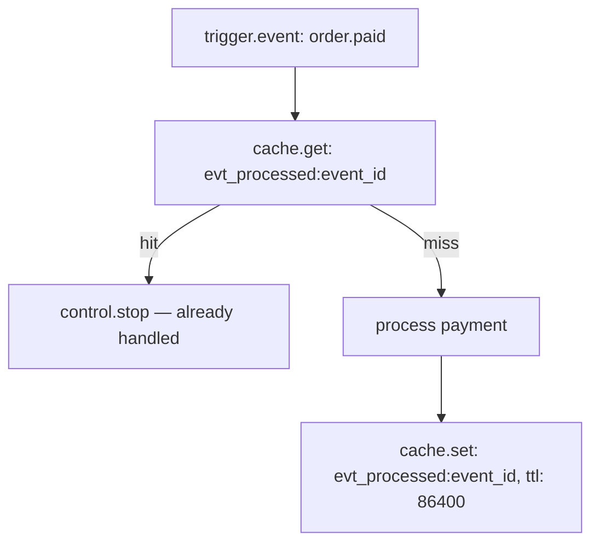

Events in Pawabase are emitted automatically from several platform sources, and you can emit custom events from any flow. You don't call a special function to emit most of them — they fire as a natural consequence of platform operations.

This page covers what emits events, when they fire, and how to emit custom events from a flow using the `event.emit` block.

## Sources of events

| Source | Events emitted | When it fires |
| --- | --- | --- |
| Resource writes | `<resource>.created`, `<resource>.updated`, `<resource>.deleted` | After the write commits to the database |
| `event.emit` block | Any event name you choose | When the block runs in a flow |
| Authentication actions | `user.signed_up`, `user.signed_in`, `user.signed_out`, `user.email_verified`, `user.password_changed`, `user.mfa_enabled` | After the action succeeds in Akountz |

## Resource events

Every resource automatically emits three events after a successful write. For a resource named `orders`:

- `orders.created` — fires after every `POST /rest/v1/orders` that commits.
- `orders.updated` — fires after every `PATCH /rest/v1/orders/{id}` that commits.
- `orders.deleted` — fires after every `DELETE /rest/v1/orders/{id}` that commits.

The event payload is the full record — all fields, including `id`, `created_at`, and `updated_at`. The record payload appears under `input.event.payload.record` in a subscribing flow (nested inside the event envelope — see [the event envelope](/events/overview#the-event-envelope)).

A resource must have `events: true` (the default) in its definition for these events to fire. Setting `events: false` on a resource disables all three.

## Emitting events from a flow

Use the `event.emit` block to publish a custom event from any flow. It appears in the **Platform** block category in Studio.

| Config field | Type | Required | Description |
| --- | --- | --- | --- |
| `event` | string | Yes | The event name, e.g. `order.paid`. Use the `domain.action` convention. |
| `payload` | JSON object | No | The data to carry with the event. Can use `{{ }}` expressions. |

```json
{
  "id": "announce_payment",
  "data": {
    "block": "event.emit",
    "config": {
      "event": "order.paid",
      "payload": {
        "order_id": "{{ steps.load_order.output.id }}",
        "amount_cents": "{{ steps.load_order.output.total_cents }}",
        "customer_id": "{{ steps.load_order.output.customer_id }}"
      }
    }
  }
}
```

The `event.emit` block always outputs `{ "event": "<name>", "id": "<generated_id>" }` — the event name you configured and the new event's unique id. This output can be used by downstream steps if you need to reference the event id.

### What happens immediately after emit

The block publishes the event to the durable event queue and continues immediately. The flow does not wait for any consumer to finish. The event is:

1. Recorded in the `EventLog` with its full envelope.
2. Queued for delivery to every matching subscriber.
3. Each subscriber runs as an independent background job.

The emitting flow continues to its next block without any awareness of how many subscribers will react or what they'll do.

### Payload expressions

The `payload` field resolves `{{ }}` expressions against the current flow state. A missing path resolves to `null`. Build the payload from whatever data the flow has produced:

```json
{
  "event": "customer.tier_changed",
  "payload": {
    "customer_id": "{{ steps.load_customer.output.id }}",
    "old_tier": "{{ vars.previous_tier }}",
    "new_tier": "{{ steps.calculate_tier.output.tier }}",
    "changed_at": "{{ time.now }}"
  }
}
```

## The event envelope

When a subscriber receives an event, it arrives as the complete envelope, not just the payload. The envelope is always nested under `input.event` in a subscribing flow:

```json
{
  "event": {
    "name": "order.paid",
    "payload": { "order_id": "ord_9f2", "amount_cents": 4900, "customer_id": "cus_abc" },
    "id": "evt_3b8f1c2a4d5e6f",
    "source": "flows",
    "actor": "usr_abc",
    "occurred_at": "2026-09-30T14:02:11.342Z",
    "request_id": "req_7e9a1c"
  }
}
```

- `input.event.name` — the event name.
- `input.event.payload` — the payload you configured.
- `input.event.id` — the unique event id. Use this for idempotency checks.
- `input.event.occurred_at` — when the event was emitted (UTC ISO-8601). This field is `occurred_at`, not `published_at` or `timestamp`.
- `input.event.actor` — the user id who caused it, or `null` for background events.

## Idempotency

Because delivery is at-least-once, a subscriber may receive the same event id more than once. Use the event id to detect and skip duplicates:

```json
{
  "id": "check_duplicate",
  "data": {
    "block": "cache.get",
    "config": { "key": "evt_processed:{{ input.event.id }}" }
  }
}
```



Mark the event as processed only after the work completes successfully — not before. That way, a crash before completion means the event will be reprocessed on the next delivery, which is correct.

## Debugging emitted events

In Studio, open **Observability → Events** to:

- Browse all events by name, time range, project, and environment.
- Click any event to see its full payload.
- See which subscribers received the event and whether each succeeded or failed.
- Find related flow runs and webhook deliveries by following the `request_id`.

## Common patterns

### Decouple an order creation from its downstream effects

An order-creation flow does one job: validate and create the record. It emits `order.created` and returns immediately. Every downstream effect — inventory reservation, confirmation email, warehouse notification — is a separate subscription.

```text
Flow: create_order
  validate input
  resource.create: orders
  event.emit: order.created { order_id, items, customer_id }
  response.return: 201 Created

Subscriptions to order.created:
  Flow: reserve_inventory
  Flow: send_confirmation_email
  Webhook: warehouse_notification
```

Adding a new subscription (a loyalty-points flow, a CRM sync) never requires touching `create_order`.

### Chain events through decoupled stages

```text
order.created  → flow: validate_order  → order.validated
order.validated → flow: fulfill_order  → order.fulfilled
order.fulfilled → flow: notify_customer
```

Each flow is a separate deployment concern. If `fulfill_order` is down, `order.validated` events queue up and process when it recovers, without any impact on validation throughput.

<CardGroup cols={2}>
  <Card title="Subscriptions" icon="link" href="/events/subscriptions">How to connect flows, functions, webhooks, and realtime channels to events.</Card>
  <Card title="Event catalog" icon="book-open" href="/events/catalog">All platform-emitted event names.</Card>
</CardGroup>
