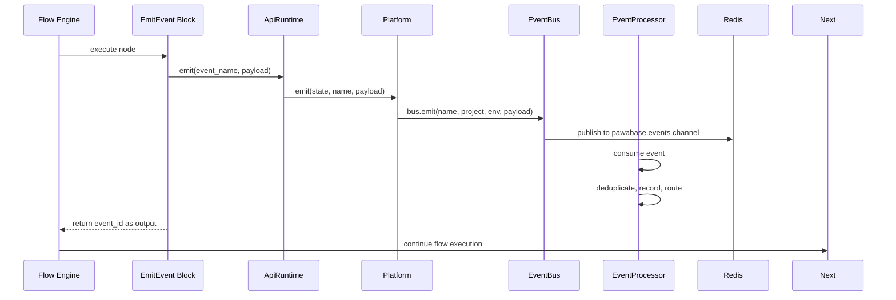
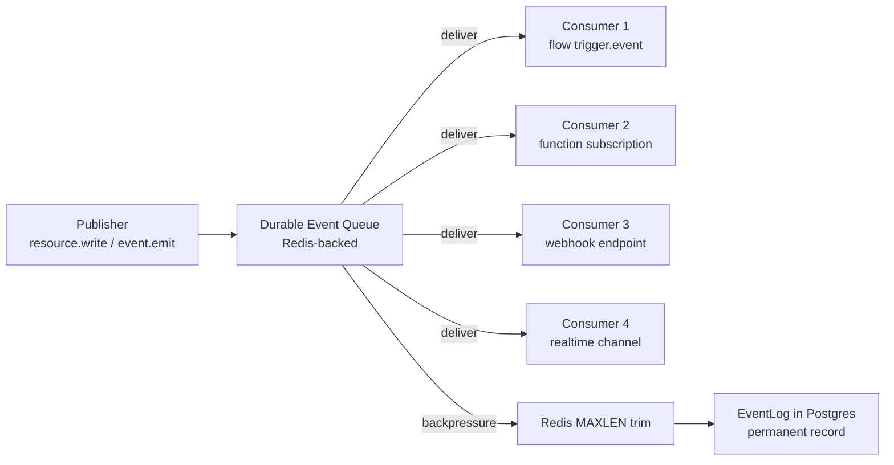
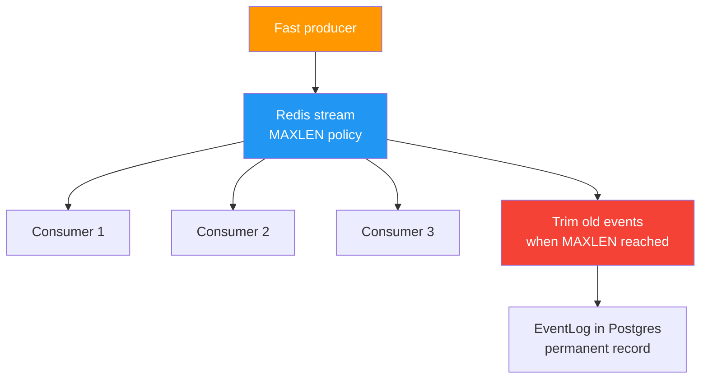
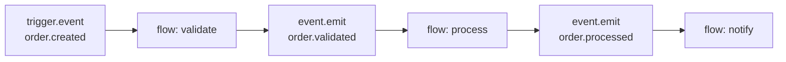
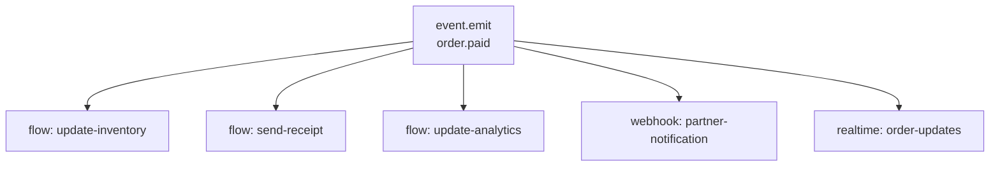
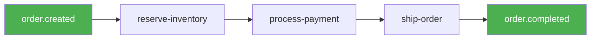
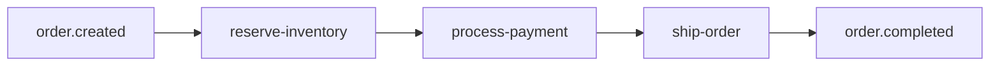
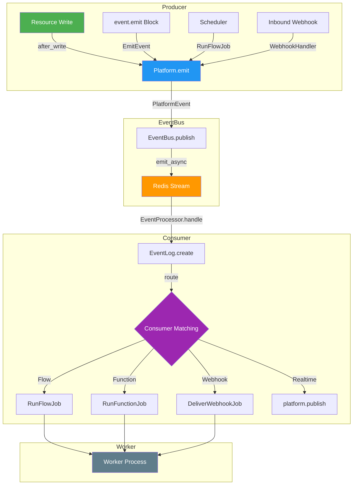

Events are the glue that connects every component in Pawabase. A resource write, an auth action, a flow's `event.emit` block, a schedule firing — everything produces events that other parts of the platform can react to. This page covers every mechanism for emitting events in detail, the durable event queue architecture, the event processor routing logic, backpressure handling, debugging techniques, and all the common patterns for building event-driven flows.

<CardGroup cols={3}>
  <Card title="Resource events" icon="database">Every create, update, and delete emits a `<resource>.<action>` event.</Card>
  <Card title="Flow events" icon="waypoints">`event.emit` blocks publish events inside a flow's execution.</Card>
  <Card title="Durable queue" icon="inbox">Events are published to a durable queue — consumers never block the emitter.</Card>
</CardGroup>

## What emits events

Every source that produces events and the events it emits:

| Source | Events emitted | When | Code location |
| --- | --- | --- | --- |
| `resource.create` | `<resource>.created` | After a record is committed | `app/runtime.py:resource_create` → `after_write` |
| `resource.update` | `<resource>.updated` | After a record is updated | `app/runtime.py:resource_update` → `after_write` |
| `resource.delete` | `<resource>.deleted` | After a record is deleted | `app/runtime.py:resource_delete` → `after_write` |
| `event.emit` block | Any event name | When the block runs | `app/flows/blocks/platform.py:EmitEvent.run` → `ApiRuntime.emit` → `Platform.emit` |
| `trigger.schedule` | Scheduler events | When a schedule fires | `app/scheduler.py:PlatformScheduler.fire` → `platform.bus.emit` |
| `auth.signup` | `user.signed_up` | When a new account is created | Akountz service |
| `auth.signin` | `user.signed_in` | When a user signs in | Akountz service |
| `mail.send` | `mail.queued` | When an email job is dispatched | `app/mail.py:MailManager.send` |
| `queue.flow` | `job.dispatched.<flow>` | When a flow job is queued | `app/platform.py:Platform.dispatch` |
| `queue.function` | `job.dispatched.<function>` | When a function job is queued | `app/platform.py:Platform.dispatch` |
| Inbound webhook | `<slug>:<action>` | When a verified webhook is received | `app/webhooks.py:queue_deliveries` → `EventProcessor.handle` |
| `trigger.webhook` | `<slug>:<action>` | When an inbound webhook is verified | `app/webhooks.py` → flow dispatch |
| `trigger.realtime` | `realtime.message` | When a client publishes to a channel | `app/events.py:flow_event_entries` |

## How events are emitted

### Resource events

Resource events are emitted by `after_write` hooks in the store layer. When a `resource.create`, `resource.update`, or `resource.delete` operation commits, the store emits the corresponding event through `platform.emit`:

```python
async def after_write(self, resource, operation, record):
    await platform.emit(f"{resource}.{operation}", record)
```

This happens synchronously as part of the write operation — the event is enqueued before the write returns to the caller. But the event is **durable**: it's written to the event log before the response is sent, so even if a consumer crashes, the event isn't lost.

The `after_write` function is called from `ApiRuntime` in `services/api/app/runtime.py` for all three write operations: `resource_create`, `resource_update`, and `resource_delete`. For `db_transaction`, `after_write` is called for each operation in the transaction after the transaction commits:

```python
async def resource_create(self, resource, data):
    store = await self.state.store(resource)
    record = await store.create(dict(data))
    await after_write(
        self.platform,
        self.state,
        resource,
        "created",
        record,
        actor=self.auth.get("user_id"),
        request_id=self.request_id,
    )
    return record

async def resource_update(self, resource, record_id, data):
    store = await self.state.store(resource)
    record = await store.update(record_id, dict(data))
    if record is not None:
        await after_write(
            self.platform, self.state, resource, "updated", record,
            actor=self.auth.get("user_id"), request_id=self.request_id,
        )
    return record

async def resource_delete(self, resource, record_id):
    store = await self.state.store(resource)
    existing = await store.get(record_id)
    deleted = await store.delete(record_id)
    if deleted and existing is not None:
        await after_write(
            self.platform, self.state, resource, "deleted", existing,
            actor=self.auth.get("user_id"), request_id=self.request_id,
        )
    return deleted

async def db_transaction(self, operations):
    ...
    for resource, change, record in effects:  # only once committed
        await after_write(
            self.platform, self.state, resource, change, record,
            actor=self.auth.get("user_id"), request_id=self.request_id,
        )
```

### Platform.emit — the core emit method

The `platform.emit` method takes the environment state, the event name, and the payload, and delegates to the event bus. It is defined in `services/api/app/platform.py` and is the central method for all event emission:

```python
async def emit(
    self,
    state: EnvironmentState,
    name: str,
    payload: Any,
    *,
    actor: str | None = None,
    request_id: str | None = None,
) -> str:
    note("events", name, append=True)
    return await self.bus.emit(
        name,
        project=state.project_ref,
        env=state.env_name,
        payload=payload,
        actor=actor,
        request_id=request_id,
    )
```

The `note` function records the event name in telemetry for observability. The `platform.emit` method calls `self.bus.emit()` which creates a `PlatformEvent` and publishes it to the Redis channel. The returned string is the event id, which can be used for deduplication or logging. The `actor` field identifies who or what caused the event — typically `"system"` for resource writes and `"scheduler"` for schedule-triggered events. The `request_id` field is used to trace events back to the HTTP request that caused them.

### EventBus.emit — the underlying publish

The `EventBus.emit` method in `pawabase_kit/events.py` builds and publishes the `PlatformEvent`:

```python
async def emit(
    self,
    name: str,
    *,
    project: str,
    env: str,
    payload: Any = None,
    actor: str | None = None,
    request_id: str | None = None,
) -> str:
    return await self.publish(
        PlatformEvent(
            name=name,
            project=project,
            env=env,
            payload=payload,
            actor=actor,
            source=self.source,
            request_id=request_id,
        )
    )
```

The `PlatformEvent.publish` method serializes the event to a dictionary and emits it to the Redis channel:

```python
async def publish(self, event: PlatformEvent) -> str:
    if event.source == "unknown":
        event.source = self.source
    await self.emitter.emit_async(self.channel, event.to_dict())
    self.published += 1
    return event.id
```

The `PlatformEvent` dataclass provides all the fields:

```python
@dataclass(slots=True)
class PlatformEvent:
    name: str
    project: str
    env: str
    payload: Any = None
    source: str = "unknown"
    actor: str | None = None
    id: str = field(default_factory=lambda: uuid.uuid4().hex)
    occurred_at: str = field(default_factory=lambda: datetime.now(UTC).isoformat())
    request_id: str | None = None

    def to_dict(self) -> dict[str, Any]:
        return asdict(self)

    @classmethod
    def from_dict(cls, data: dict[str, Any]) -> PlatformEvent:
        known = {name for name in cls.__dataclass_fields__}
        return cls(**{key: value for key, value in data.items() if key in known})

    def matches(self, pattern: str) -> bool:
        return fnmatch.fnmatchcase(self.name, pattern)
```

Each event gets a unique `id` (UUID hex), an `occurred_at` timestamp, and a `source` (the service name). The `source` is automatically set from the bus's `source` attribute if not explicitly provided.

## event.emit — publishing from flows

Inside a flow, the `event.emit` block publishes any event:

```json
{
  "id": "announce",
  "data": {
    "block": "event.emit",
    "config": {
      "event": "order.paid",
      "payload": { "order_id": "{{ steps.order.output.id }}" }
    }
  }
}
```

The `EmitEvent` block in `app/flows/blocks/platform.py` calls `run.runtime.emit()`:

```python
class EmitEvent(Block):
    key = "event.emit"
    title = "Emit event"
    category = "events"
    config = [
        {"name": "event", "type": "string", "required": True},
        {"name": "payload", "type": "json"},
    ]

    async def run(self, config, run):
        return BlockResult(output=await run.runtime.emit(config["event"], config.get("payload")))
```

`event.emit` fires **synchronously** — it runs as part of the current flow's execution and returns the event id as `output`. But the event itself is published to a **durable queue**, so consumers process asynchronously. A slow consumer never blocks the flow that emitted the event.

The `payload` field accepts any JSON-serializable value. Template expressions like `{{ steps.order.output.id }}` are resolved at execution time by the flow engine's `render` method (see `pawabase_kit/templating.py`). If the referenced step hasn't run or produced no output, the expression evaluates to `null`.

### The event.emit block in the flow engine

The flow engine processes `event.emit` blocks as follows:

1. The `FlowRun._execute_node` method identifies the block as `EmitEvent`
2. It renders the config (resolving template expressions like `{{ ... }}`)
3. It calls `block.run(config, self)` which invokes `run.runtime.emit()`
4. `ApiRuntime.emit()` calls `platform.emit()` which publishes to the `EventBus`
5. The event is written to Redis and the event processor picks it up
6. The block returns the event id as `output`
7. The flow continues to the next node



### Template expressions in event.emit

The `payload` field supports template expressions that are resolved at execution time:

```json
{
  "block": "event.emit",
  "config": {
    "event": "order.paid",
    "payload": {
      "order_id": "{{ steps.get_order.output.id }}",
      "total": "{{ steps.get_order.output.total_minor }}",
      "customer": "{{ steps.get_order.output.customer_id }}",
      "items": "{{ steps.get_order.output.items }}"
    }
  }
}
```

The `render` function in `pawabase_kit/templating.py` processes template expressions recursively:

```python
def render(value: Any, state: Mapping[str, Any]) -> Any:
    if isinstance(value, str):
        whole = _WHOLE.match(value)
        if whole:
            return evaluate_expression(whole.group(1), state)
        if "{{" not in value:
            return value
        def substitute(match: re.Match[str]) -> str:
            result = evaluate_expression(match.group(1), state)
            if result is None:
                return ""
            if isinstance(result, (dict, list)):
                return json.dumps(result, default=str)
            return str(result)
        return _TEMPLATE.sub(substitute, value)
    if isinstance(value, list):
        return [render(item, state) for item in value]
    if isinstance(value, Mapping):
        return {key: render(item, state) for key, item in value.items()}
    return value
```

## How the event processor routes events

When an event is emitted, the `EventProcessor` picks it up from the bus and routes it to all consumers. For each event:

1. **Record it** — an `EventLog` row is created with the event id, name, payload, actor, and project/env. If the event was already processed (at-least-once delivery), it's skipped.
2. **Find flow subscribers** — every flow with a `trigger.event` node whose pattern matches the event name is identified.
3. **Find function subscribers** — every function subscribed to the event name is queued.
4. **Find webhook subscribers** — every enabled outbound webhook whose event pattern matches has a delivery job queued.
5. **Find realtime subscribers** — any realtime channel configured to broadcast on this event gets a publication.

Each consumer receives its work as a queued job, so a slow consumer never delays the others:

```python
async def route(self, state: EnvironmentState, event: PlatformEvent) -> list[dict[str, Any]]:
    from app.jobs.flows import RunFlowJob
    from app.jobs.functions import RunFunctionJob

    platform = self.platform
    consumers: list[dict[str, Any]] = []
    event_input = {"event": event.to_dict()}
    condition_context = {"event": event.to_dict()}

    async def attempt(kind: str, target: str, work) -> None:
        entry: dict[str, Any] = {"type": kind, "target": target}
        try:
            result = await work()
            entry["status"] = "queued" if kind in ("flow", "function", "webhook") else "done"
            if result is not None:
                entry["ref"] = result
        except Exception as exc:
            entry["status"] = "failed"
            entry["error"] = f"{type(exc).__name__}: {exc}"
        consumers.append(entry)

    # Event subscriptions
    for subscription in state.subscriptions:
        if not fnmatch.fnmatchcase(event.name, subscription.event):
            continue
        if not matches_condition(subscription.condition, condition_context):
            continue
        if subscription.target_type == "flow":
            await attempt("flow", subscription.target, lambda s=subscription: platform.dispatch(
                RunFlowJob, project=state.project_ref, env=state.env_name,
                target=s.target, source="event", flow=s.target,
                input=event_input, trigger="event",
                auth={"authenticated": False, "kind": "system"},
            ))
        elif subscription.target_type == "function":
            await attempt("function", subscription.target, lambda s=subscription: platform.dispatch(
                RunFunctionJob, project=state.project_ref, env=state.env_name,
                target=s.target, source="event", function=s.target,
                input=event_input, trigger="event",
                auth={"authenticated": False, "kind": "system"},
            ))
        elif subscription.target_type == "realtime":
            channel = str(
                render(subscription.target or f"events:{event.name}", condition_context)
            )
            await attempt("realtime", channel, lambda c=channel: platform.publish(state, c, event.name, event.payload))

    # Flow event entries
    for flow_name, node_id in flow_event_entries(state, event):
        await attempt("flow", flow_name, lambda f=flow_name, n=node_id: platform.dispatch(
            RunFlowJob, project=state.project_ref, env=state.env_name,
            target=f, source="event", flow=f,
            input=event_input, trigger="event", entry=n,
            auth={"authenticated": False, "kind": "system"},
        ))

    # Outbound webhook endpoints
    if any(endpoint.enabled and endpoint_matches(endpoint.events, event.name)
           for endpoint in state.webhooks):
        await attempt("webhook", "endpoints", lambda: queue_deliveries(
            platform, state, event_id=event.id, event=event.name, payload=event.payload
        ))

    return consumers
```

The full `EventProcessor.route` method is in `services/api/app/events.py`.

## flow_event_entries — matching flows to events

The `flow_event_entries` function scans all enabled flows for `trigger.event`, `trigger.realtime`, and `trigger.resource` nodes:

```python
def flow_event_entries(state: EnvironmentState, event: PlatformEvent) -> list[tuple[str, str]]:
    matches = []
    for flow in state.flows.values():
        if not flow.enabled:
            continue
        for node in flow.definition.get("nodes", []):
            data = node.get("data") or {}
            block = data.get("block")
            config = data.get("config") or {}
            if block == "trigger.event" and config.get("event") and fnmatch.fnmatchcase(event.name, config["event"]):
                matches.append((flow.name, node["id"]))
            elif block == "trigger.realtime" and config.get("channel") and event.name == "realtime.message":
                channel = str((event.payload or {}).get("channel", ""))
                if fnmatch.fnmatchcase(channel, config["channel"]):
                    matches.append((flow.name, node["id"]))
            elif block == "trigger.resource" and config.get("resource"):
                resource, _, change = event.name.rpartition(".")
                operations = config.get("operations") or ["created", "updated", "deleted"]
                if resource == config["resource"] and change in operations:
                    matches.append((flow.name, node["id"]))
    return matches
```

## The durable event queue

Events are not delivered directly to consumers. They're published to a durable event queue:



Key properties of the queue:

- **Durable** — events are persisted before delivery begins. If a consumer crashes, the event is still in the queue.
- **At-least-once** — each consumer receives every event at least once. If a consumer fails to process an event, the event is redelivered.
- **Async** — consumers process events independently. The emitter never waits for any consumer to finish.
- **Ordered per event name** — events with the same name are delivered in the order they were published.

The queue is backed by Sillo's `EventEmitter` with the `persistent` backend, which uses Redis streams. The `EventBus` class manages the connection:

```python
class EventBus:
    def __init__(self, backend: str = "memory", *, url: str | None = None, ...):
        options: dict[str, Any] = {}
        if url and backend in ("redis", "persistent"):
            options["url"] = url
        self.emitter = EventEmitter(backend, on_error=self._on_error, **options)
```

The `EventBus.start` method starts the consumer:

```python
async def start(self) -> None:
    self._started = True
    if self.backend == "persistent" and not self._handlers:
        return
    self._consuming = True
    await self.emitter.start()
```

The `EventBus.stop` method stops the consumer:

```python
async def stop(self) -> None:
    self._started = False
    self._consuming = False
    await self.emitter.stop()
```

## The event envelope

Every event has a consistent envelope shape:

```json
{
  "event": "order.paid",
  "payload": { "order_id": "42", "total": 2999 },
  "id": "evt_abc123",
  "published_at": "2026-09-28T10:00:00+00:00",
  "actor": "system",
  "project": "acme",
  "env": "production",
  "source": "api"
}
```

The `payload` is the record data (for resource events) or the event-specific data (for `event.emit`). The `id` is unique and can be used for deduplication. The `published_at` timestamp is when the event was emitted.

## Event processor internals

The `EventProcessor` is the core of Pawabase's event routing. It is attached to the platform's event bus during startup and consumes events from the Redis-backed event stream.

```python
class EventProcessor:
    def __init__(self, platform: Platform) -> None:
        self.platform = platform
        self.processed = 0

    def attach(self) -> EventProcessor:
        self.platform.bus.subscribe(self.handle)
        return self

    async def handle(self, event: PlatformEvent) -> list[dict[str, Any]]:
        try:
            state = await self.platform.state(event.project, event.env)
        except HTTPException:
            logger.warning("event %s for unknown environment %s/%s", event.name, event.project, event.env)
            return []
        if await EventLog.filter(event_id=event.id).exists():
            return []
        log = await EventLog.create(
            event_id=event.id, project=event.project, env=event.env,
            name=event.name, source=event.source, actor=event.actor,
            payload=event.payload, request_id=event.request_id,
            occurred_at=event.occurred_at,
        )
        consumers = await self.route(state, event)
        log.consumers = consumers
        await log.save(update_fields=["consumers"])
        self.processed += 1
        return consumers
```

The `handle` method is called for every event on the bus. It runs asynchronously and processes events one at a time per `(project, env)` pair, ensuring that events for the same environment are processed in order.

### Consumer routing details

The `route` method finds all consumers for an event and dispatches work:

1. **Subscriptions** — `EventSubscription` records in the environment's state that match the event name via `fnmatch.fnmatchcase`
2. **Flow event entries** — `trigger.event`, `trigger.resource`, and `trigger.realtime` nodes in flow definitions whose patterns match
3. **Webhook endpoints** — enabled webhooks whose `events` list contains a matching pattern via `endpoint_matches()`

Each consumer receives work as a queued job, so a slow consumer never delays the others.

### Error handling in routing

If a consumer's job dispatch fails, the error is caught and recorded in the consumer entry with `status: "failed"` and `error: "{ExceptionType}: {message}"`. The event itself is not lost — it remains in the event log. The failed consumer entry is visible in Studio's **Observability → Events** dashboard.

```python
async def attempt(kind: str, target: str, work) -> None:
    entry: dict[str, Any] = {"type": kind, "target": target}
    try:
        result = await work()
        entry["status"] = "queued" if kind in ("flow", "function", "webhook") else "done"
        if result is not None:
            entry["ref"] = result
    except Exception as exc:
        entry["status"] = "failed"
        entry["error"] = f"{type(exc).__name__}: {exc}"
    consumers.append(entry)
```

## Event backpressure

When many events are emitted in quick succession, the event bus naturally provides backpressure through Redis. The event stream is backed by Redis streams, which have a configurable maximum length. If the stream reaches its maximum length, older entries are trimmed (evicted) according to Redis's `MAXLEN` policy.



In practice, this means:

- Events are always persisted to Redis before being delivered to consumers
- If consumers are slow, events accumulate in Redis
- If Redis reaches its memory limit, old events are trimmed
- The `EventLog` table in Postgres provides a permanent record even if Redis events are trimmed
- The `EventProcessor.processed` counter tracks total events processed

## Event debugging

When debugging event-driven flows, use these tools:

1. **Event log** — Every event is recorded in `EventLog` with its full payload, actor, and consumer results
2. **Studio → Observability → Events** — Filter by event name, project, environment, and time range
3. **`EventProcessor.processed` counter** — Track how many events the processor has handled
4. **Consumer entries** — Each event log entry has a `consumers` array showing which subscribers processed it and whether they succeeded or failed

```python
# Check if an event was already processed
if await EventLog.filter(event_id=event.id).exists():
    return []

# Inspect the full event log
log = await EventLog.filter(name="order.paid").order_by("-occurred_at").limit(10)
for entry in log:
    print(f"{entry.event_id}: {entry.payload}")
    for c in entry.consumers:
        print(f"  → {c['type']} {c['target']}: {c['status']}")

# Check total events processed by the processor
# Available via platform.observability or Studio dashboard
```

## Common patterns

### Emit and forget

The most common pattern: emit an event and don't wait for consumers to finish. This decouples the emitter from downstream processing.

```json
[
  { "id": "update", "data": { "block": "resource.update", "config": { ... } } },
  { "id": "emit", "data": { "block": "event.emit", "config": { "event": "order.paid", "payload": { ... } } } }
]
```

### Reacting to events

To react to an event, create a flow with a `trigger.event` node:

```json
{
  "id": "start",
  "data": { "block": "trigger.event", "config": { "event": "order.paid" } }
}
```

This flow runs whenever `order.paid` is published — from any flow, any resource operation, or any `event.emit` block.

<Warning>
`event.emit` fires synchronously as part of the current run but publishes to a durable queue — consumers process asynchronously. A slow consumer never blocks the flow that emitted the event.
</Warning>

### Chaining events

A flow can emit events that trigger other flows, creating an event chain:



Each flow in the chain is decoupled from the others — if `flow: process` is down, `order.validated` events accumulate in the queue until it recovers.

## Event log and retention

Every emitted event is recorded in the `EventLog` table, which Studio surfaces in the **Observability → Events** dashboard. The event log includes the event name, payload, actor, project, environment, and a timestamp. This provides a complete audit trail of everything that has happened in your project.

Event logs are retained indefinitely by default. For high-volume projects, consider using the `EventLog` retention settings to archive or purge old events.

## Next

<CardGroup cols={2}>
  <Card title="Subscriptions" icon="link" href="/events/subscriptions">How to subscribe to events.</Card>
  <Card title="Catalog" icon="book" href="/events/catalog">Every event name.</Card>
</CardGroup>

## Summary

Pawabase's event emission system is built around a durable, Redis-backed event queue. Events are emitted by resource writes (`after_write` hooks), `event.emit` blocks in flows, the scheduler, and inbound webhooks. Every event is published to the `EventBus` as a `PlatformEvent` with a unique id, and the `EventProcessor` records and routes it to all matching consumers. The system provides at-least-once delivery, per-event-name ordering, and complete isolation between environments. Event consumers receive work as queued jobs, so a slow consumer never delays the emitter or other consumers. See [Subscriptions](/events/subscriptions) for all subscription mechanisms and [Catalog](/events/catalog) for the complete event reference.

## Resource events in detail

### How `after_write` hooks work

The `after_write` hooks are the foundation of resource event emission. They are called from the `ApiRuntime` for every resource operation:

```python
# services/api/app/runtime.py
async def resource_create(self, resource, data):
    store = await self.state.store(resource)
    record = await store.create(dict(data))
    await after_write(
        self.platform, self.state, resource, "created", record,
        actor=self.auth.get("user_id"), request_id=self.request_id,
    )
    return record

async def resource_update(self, resource, record_id, data):
    store = await self.state.store(resource)
    record = await store.update(record_id, dict(data))
    if record is not None:
        await after_write(
            self.platform, self.state, resource, "updated", record,
            actor=self.auth.get("user_id"), request_id=self.request_id,
        )
    return record

async def resource_delete(self, resource, record_id):
    store = await self.state.store(resource)
    existing = await store.get(record_id)
    deleted = await store.delete(record_id)
    if deleted and existing is not None:
        await after_write(
            self.platform, self.state, resource, "deleted", existing,
            actor=self.auth.get("user_id"), request_id=self.request_id,
        )
    return deleted

async def db_transaction(self, operations):
    ...
    for resource, change, record in effects:
        await after_write(
            self.platform, self.state, resource, change, record,
            actor=self.auth.get("user_id"), request_id=self.request_id,
        )
```

The `after_write` function calls `platform.emit(f"{resource}.{operation}", record)`:

```python
async def after_write(self, resource, operation, record):
    await platform.emit(f"{resource}.{operation}", record)
```

This means resource events are emitted synchronously as part of the write operation. The event is published to the Redis event bus before the write returns to the caller. This ensures that the event is durable — even if the process crashes immediately after, the event is still recoverable from the Redis stream and the `EventLog` table.

### Transaction safety

Resource events are emitted inside the same transaction as the write. This means:

- If the write fails, the event is not emitted
- If the write succeeds, the event is emitted before the response is sent
- The event is recorded to the `EventLog` before the transaction commits
- If the process crashes after the event is emitted, the event is still recoverable from Redis

This transaction safety ensures that the event log accurately reflects the state of the database.

### Resource event ordering

Events for the same resource are emitted in the order of the write operations. If a record is created, updated, and then deleted, the events are emitted as `resource.created`, `resource.updated`, `resource.deleted`. The event bus preserves this ordering per event name.

## `event.emit` block in complete detail

### How `event.emit` works in the flow engine

The `event.emit` block is processed by the `EmitEvent` class in `app/flows/blocks/platform.py`:

```python
class EmitEvent(Block):
    key = "event.emit"
    title = "Emit event"
    category = "events"
    config = [
        {"name": "event", "type": "string", "required": True},
        {"name": "payload", "type": "json"},
    ]

    async def run(self, config, run):
        return BlockResult(output=await run.runtime.emit(config["event"], config.get("payload")))
```

The flow engine processes `event.emit` as follows:

1. `FlowRun._execute_node` identifies the block as `EmitEvent`
2. The config is rendered (template expressions resolved)
3. `block.run(config, self)` is called
4. `run.runtime.emit()` calls `ApiRuntime.emit()`
5. `ApiRuntime.emit()` calls `Platform.emit()`
6. `Platform.emit()` calls `EventBus.emit()`
7. `EventBus.emit()` creates a `PlatformEvent` and publishes to Redis
8. The event id is returned as `output`
9. The flow continues to the next node

### Template expression resolution

The `render` function in `pawabase_kit/templating.py` resolves template expressions:

```python
def render(value: Any, state: Mapping[str, Any]) -> Any:
    if isinstance(value, str):
        whole = _WHOLE.match(value)
        if whole:
            return evaluate_expression(whole.group(1), state)
        if "{{" not in value:
            return value
        def substitute(match: re.Match[str]) -> str:
            result = evaluate_expression(match.group(1), state)
            if result is None:
                return ""
            if isinstance(result, (dict, list)):
                return json.dumps(result, default=str)
            return str(result)
        return _TEMPLATE.sub(substitute, value)
    if isinstance(value, list):
        return [render(item, state) for item in value]
    if isinstance(value, Mapping):
        return {key: render(item, state) for key, item in value.items()}
    return value
```

The `evaluate_expression` function processes the template expression:

```python
def evaluate_expression(expression: str, state: Mapping[str, Any]) -> Any:
    parts = [part.strip() for part in expression.split("|")]
    value = lookup(state, parts[0])
    for spec in parts[1:]:
        name, _, argument = spec.partition(":")
        value = _apply_filter(value, name.strip(), argument.strip() or None)
    return value
```

Template expressions support filters like `default`, `upper`, `lower`, `json`, `int`, `float`, `first`, `last`, and `keys`.

### The `event.emit` block configuration

The `event.emit` block configuration:

| Field | Type | Required | Description |
| --- | --- | --- | --- |
| `event` | `string` | yes | The event name to emit |
| `payload` | `json` | no | The event payload |

The `event` field is the event name in `domain.action` format. The `payload` field is any JSON-serializable object that becomes the event payload.

### Template expressions in `event.emit`

Template expressions in the `event.emit` block are resolved against the flow state:

```json
{
  "id": "emit",
  "data": {
    "block": "event.emit",
    "config": {
      "event": "order.paid",
      "payload": {
        "order_id": "{{ steps.get_order.output.id }}",
        "total": "{{ steps.get_order.output.total_minor }}",
        "customer": "{{ steps.get_order.output.customer_id }}",
        "items": "{{ steps.get_order.output.items }}"
      }
    }
  }
}
```

Each `{{ ... }}` expression is resolved using the flow state. The state includes:

- `input`: The trigger payload
- `auth`: The caller's authentication context
- `project`, `env`: Project and environment identifiers
- `vars`: Values set with `control.set`
- `steps.<node id>.output`: Each finished block's output
- `item` and `index`: Inside loop bodies

### `event.emit` output handling

The `event.emit` block returns the event id as `output`. This can be used in subsequent blocks:

```json
[
  { "id": "emit", "data": { "block": "event.emit", "config": { ... } } },
  { "id": "log", "data": { "block": "log.write", "config": { "message": "Event emitted: {{ steps.emit.output }}" } } }
]
```

## How the event processor routes events (expanded)

### The `route` method in complete detail

The `EventProcessor.route` method in `services/api/app/events.py` is the core of event routing:

```python
async def route(self, state: EnvironmentState, event: PlatformEvent) -> list[dict[str, Any]]:
    from app.jobs.flows import RunFlowJob
    from app.jobs.functions import RunFunctionJob

    platform = self.platform
    consumers: list[dict[str, Any]] = []
    event_input = {"event": event.to_dict()}
    condition_context = {"event": event.to_dict()}

    async def attempt(kind: str, target: str, work) -> None:
        entry: dict[str, Any] = {"type": kind, "target": target}
        try:
            result = await work()
            entry["status"] = "queued" if kind in ("flow", "function", "webhook") else "done"
            if result is not None:
                entry["ref"] = result
        except Exception as exc:
            entry["status"] = "failed"
            entry["error"] = f"{type(exc).__name__}: {exc}"
        consumers.append(entry)

    # 1. Event subscriptions (EventSubscription records)
    for subscription in state.subscriptions:
        if not fnmatch.fnmatchcase(event.name, subscription.event):
            continue
        if not matches_condition(subscription.condition, condition_context):
            continue
        if subscription.target_type == "flow":
            await attempt("flow", subscription.target, lambda s=subscription: platform.dispatch(
                RunFlowJob, project=state.project_ref, env=state.env_name,
                target=s.target, source="event", flow=s.target,
                input=event_input, trigger="event",
                auth={"authenticated": False, "kind": "system"},
            ))
        elif subscription.target_type == "function":
            await attempt("function", subscription.target, lambda s=subscription: platform.dispatch(
                RunFunctionJob, project=state.project_ref, env=state.env_name,
                target=s.target, source="event", function=s.target,
                input=event_input, trigger="event",
                auth={"authenticated": False, "kind": "system"},
            ))
        elif subscription.target_type == "realtime":
            channel = str(
                render(subscription.target or f"events:{event.name}", condition_context)
            )
            await attempt("realtime", channel, lambda c=channel: platform.publish(state, c, event.name, event.payload))

    # 2. Flow event entries (trigger.event, trigger.resource, trigger.realtime)
    for flow_name, node_id in flow_event_entries(state, event):
        await attempt("flow", flow_name, lambda f=flow_name, n=node_id: platform.dispatch(
            RunFlowJob, project=state.project_ref, env=state.env_name,
            target=f, source="event", flow=f,
            input=event_input, trigger="event", entry=n,
            auth={"authenticated": False, "kind": "system"},
        ))

    # 3. Outbound webhook endpoints
    if any(endpoint.enabled and endpoint_matches(endpoint.events, event.name)
           for endpoint in state.webhooks):
        await attempt("webhook", "endpoints", lambda: queue_deliveries(
            platform, state, event_id=event.id, event=event.name, payload=event.payload
        ))

    return consumers
```

### Consumer entry structure

Each consumer entry has this structure:

```json
{
  "type": "flow",
  "target": "send-welcome-email",
  "status": "queued",
  "ref": "job_abc123"
}
```

- `type`: The consumer type (`flow`, `function`, `webhook`, `realtime`)
- `target`: The specific target (flow name, function name, channel name)
- `status`: The dispatch status (`queued`, `done`, `failed`)
- `ref`: The job ID if applicable
- `error`: The error message if status is `failed`

### The `attempt` helper function

The `attempt` helper function manages consumer entries:

```python
async def attempt(kind: str, target: str, work) -> None:
    entry: dict[str, Any] = {"type": kind, "target": target}
    try:
        result = await work()
        entry["status"] = "queued" if kind in ("flow", "function", "webhook") else "done"
        if result is not None:
            entry["ref"] = result
    except Exception as exc:
        entry["status"] = "failed"
        entry["error"] = f"{type(exc).__name__}: {exc}"
    consumers.append(entry)
```

This function wraps the work in a try/except and records the outcome. If the work succeeds, the status is `queued` (for jobs) or `done` (for realtime). If the work fails, the status is `failed` and the error is recorded.

## The durable event queue (expanded)

### Redis stream architecture

The event queue is backed by Redis streams. Each platform event is added to the Redis stream on the `pawabase.events` channel:

```python
async def publish(self, event: PlatformEvent) -> str:
    if event.source == "unknown":
        event.source = self.source
    await self.emitter.emit_async(self.channel, event.to_dict())
    self.published += 1
    return event.id
```

The `EventEmitter` with the `persistent` backend uses Redis streams:

```python
self.emitter = EventEmitter(backend, on_error=self._on_error, **options)
```

Redis streams provide:

- **Ordering**: Messages are ordered by insertion time
- **Persistence**: Messages persist in Redis even if consumers are offline
- **Consumer groups**: Multiple consumers can read from the same stream
- **Acknowledgment**: Consumers acknowledge messages after processing

### Consumer group behavior

The event bus uses consumer groups for parallel processing:

- Each consumer group receives every event
- Events within a consumer group are processed in order
- Multiple consumer groups can process events concurrently
- The `EventProcessor` is a consumer that reads from the stream

### Redis stream trimming

Redis streams have a configurable maximum length. When the stream reaches its maximum length, older entries are trimmed according to Redis's `MAXLEN` policy:

```python
# The stream is created with MAXLEN to prevent unbounded growth
# Older entries are automatically trimmed when the limit is reached
```

The trimmed events are still available in the `EventLog` table in Postgres, which provides a permanent record.

## Event processor internals (expanded)

### The `handle` method in complete detail

The `handle` method processes every event from the bus:

```python
async def handle(self, event: PlatformEvent) -> list[dict[str, Any]]:
    try:
        state = await self.platform.state(event.project, event.env)
    except HTTPException:
        logger.warning("event %s for unknown environment %s/%s", event.name, event.project, event.env)
        return []
    if await EventLog.filter(event_id=event.id).exists():
        return []
    log = await EventLog.create(
        event_id=event.id, project=event.project, env=event.env,
        name=event.name, source=event.source, actor=event.actor,
        payload=event.payload, request_id=event.request_id,
        occurred_at=event.occurred_at,
    )
    consumers = await self.route(state, event)
    log.consumers = consumers
    await log.save(update_fields=["consumers"])
    self.processed += 1
    return consumers
```

The `handle` method:

1. Loads the environment state (returns `[]` if not found)
2. Checks for duplicate events (returns `[]` if already processed)
3. Creates an `EventLog` row
4. Routes the event to all consumers
5. Saves the consumers array to the `EventLog`
6. Increments the processed counter
7. Returns the consumer list

### The `flow_event_entries` function

The `flow_event_entries` function scans all enabled flows for matching trigger nodes:

```python
def flow_event_entries(state: EnvironmentState, event: PlatformEvent) -> list[tuple[str, str]]:
    matches = []
    for flow in state.flows.values():
        if not flow.enabled:
            continue
        for node in flow.definition.get("nodes", []):
            data = node.get("data") or {}
            block = data.get("block")
            config = data.get("config") or {}
            if block == "trigger.event" and config.get("event") and fnmatch.fnmatchcase(event.name, config["event"]):
                matches.append((flow.name, node["id"]))
            elif block == "trigger.realtime" and config.get("channel") and event.name == "realtime.message":
                channel = str((event.payload or {}).get("channel", ""))
                if fnmatch.fnmatchcase(channel, config["channel"]):
                    matches.append((flow.name, node["id"]))
            elif block == "trigger.resource" and config.get("resource"):
                resource, _, change = event.name.rpartition(".")
                operations = config.get("operations") or ["created", "updated", "deleted"]
                if resource == config["resource"] and change in operations:
                    matches.append((flow.name, node["id"]))
    return matches
```

This function iterates over all flows, checks each node for matching trigger blocks, and returns `(flow_name, node_id)` pairs. The matching uses `fnmatch.fnmatchcase` for pattern matching.

## Event backpressure (expanded)

### Redis backpressure mechanisms

Redis provides several mechanisms for backpressure:

1. **MAXLEN**: Limits the stream length, trimming old entries
2. **Memory limits**: Redis evicts keys when memory is full
3. **Consumer group lag**: Monitors how far behind consumers are
4. **Flow control**: Producers can slow down if consumers are lagging

### Monitoring backpressure

Monitor backpressure using these indicators:

- Redis memory usage
- Stream length
- Consumer group lag
- Event processing latency
- Job queue depths

```python
# Monitor Redis memory usage
# Use Redis INFO command to check memory usage
# Monitor stream length with XLEN
# Monitor consumer group lag with XREADGROUP
```

### Handling backpressure

When backpressure is detected:

1. Scale up workers to process jobs faster
2. Increase Redis memory
3. Optimize consumer processing
4. Adjust the stream MAXLEN
5. Consider partitioning the event bus

## Common patterns (expanded)

### Emit and forget pattern

The most common pattern: emit an event and don't wait for consumers:

```json
[
  { "id": "update", "data": { "block": "resource.update", "config": { ... } } },
  { "id": "emit", "data": { "block": "event.emit", "config": { "event": "order.paid", "payload": { ... } } } }
]
```

The flow continues immediately after `event.emit` returns. The flow doesn't wait for the email flow, analytics flow, or realtime broadcast to finish. This decoupling is the key benefit of the event system.

### Reacting to events pattern

To react to an event, create a flow with a `trigger.event` node:

```json
{
  "id": "start",
  "data": { "block": "trigger.event", "config": { "event": "order.paid" } }
}
```

This flow runs whenever `order.paid` is published — from any flow, any resource operation, or any `event.emit` block.

### Chaining events pattern

A flow can emit events that trigger other flows:


Each flow in the chain is decoupled. If `flow: process` is down, `order.validated` events accumulate in the queue until it recovers.

### Fan-out pattern

One event, many subscribers:



Each subscriber processes the event independently. A slow subscriber doesn't delay other subscribers.

### Saga pattern

Use events to coordinate distributed transactions:



Each step emits an event that triggers the next step. If a step fails, compensating events are emitted.

### Event sourcing pattern

Use events as the source of truth:

```json
[
  { "event": "order.created", "payload": { "order_id": "1" } },
  { "event": "order.paid", "payload": { "order_id": "1", "amount": 2999 } },
  { "event": "order.shipped", "payload": { "order_id": "1", "tracking": "..." } }
]
```

The current state is derived by replaying events. The `EventLog` table provides the complete event history.

## Event debugging (expanded)

### Using the EventLog table

Query the `EventLog` table directly for debugging:

```python
# Find all events for a specific order
events = await EventLog.filter(name="order.paid").filter(payload__contains={"order_id": "42"})
for event in events:
    print(f"Event: {event.event_id}, Payload: {event.payload}")

# Find events for a specific project and environment
events = await EventLog.filter(project="acme", env="production").order_by("-occurred_at")

# Find events with failed consumers
events = await EventLog.filter(consumers__contains=[{"status": "failed"}])
```

### Using Studio observability

Studio's **Observability → Events** dashboard provides:

- Event log viewer with filtering by name, project, environment, time
- Consumer status tracking (queued, done, failed)
- Event processing metrics
- Search and drill-down capabilities

### Using the `EventProcessor.processed` counter

The `EventProcessor.processed` counter tracks total events processed:

```python
# Access the counter
processor = EventProcessor(platform)
# processor.processed is the total count
```

This counter is available via the platform's observability endpoints and Studio's status dashboard.

## Event system configuration (expanded)

### Environment variables

The event system is configured through these environment variables:

- `PAWABASE_REDIS_URL`: Redis URL for the event bus
- `PAWABASE_WORKER_QUEUES`: Additional queues for workers
- `PAWABASE_WORKER_CONCURRENCY`: Number of concurrent workers

### Platform settings

The `PlatformSettings` class in `pawabase_kit/settings.py` defines the base configuration:

```python
class PlatformSettings(Config):
    service_name: str = "pawabase"
    app_env: Literal["local", "testing", "staging", "production"] = "local"
    debug: bool = False
    internal_secret: str = "dev-internal-secret-change-me-please"
    jwt_master_secret: str = "dev-jwt-master-secret-change-me-please"
    master_key: str = "dev-master-key-change-me-please-32bytes"
    api_url: str = "http://127.0.0.1:8001"
    redis_url: str = ""
```

The `redis_url` determines the event bus backend. If set, the bus uses the `persistent` backend.

### Event bus backend configuration

The event bus backend is configured through the `EventBus.from_url` method:

```python
@classmethod
def from_url(cls, url: str | None, *, source: str, mode: str = "persistent") -> EventBus:
    if url:
        return cls(mode, url=url, source=source)
    return cls("memory", source=source)
```

The backend is determined by whether `redis_url` is configured:
- If `redis_url` is set: use `persistent` backend
- If `redis_url` is empty: use `memory` backend

## Event system integration patterns (expanded)

### Pattern: Event-driven microservices

Use events to communicate between microservices:

```
Service A → event → Service B → event → Service C
```

Each service emits events that other services consume. The `EventBus` provides the communication backbone.

### Pattern: Event-driven reporting

Use events to generate reports:

```
order.paid → event.emit → report.generator → event.emit → report.completed → mail.send
```

Events trigger report generation, which emits completion events.

### Pattern: Event-driven notifications

Use events to trigger notifications:

```
user.signed_up → event.emit → notification.service → mail.send
```

Auth events trigger notification services.

### Pattern: Event-driven analytics

Use events to track analytics:

```
order.paid → event.emit → analytics.tracker → event.emit → analytics.processed
```

Business events trigger analytics tracking and processing.

## Event system troubleshooting (expanded)

### Debugging flow: Events not being emitted

1. Check that the `after_write` hooks are being called
2. Verify that `platform.emit` is being called
3. Check the `EventBus` connection to Redis
4. Verify that `EventBus.publish` is not throwing exceptions
5. Check the `EventBus.published` counter

### Debugging flow: Events not being processed

1. Check that the `EventProcessor` is running
2. Check that the `EventProcessor.handle` method is being called
3. Verify that the event bus is consuming from Redis
4. Check the `EventProcessor.processed` counter
5. Verify that the `EventLog` table has the event

### Debugging flow: Consumers not receiving events

1. Check the `EventProcessor.route` method
2. Verify that subscription patterns match the event name
3. Check that flow triggers have the correct event pattern
4. Verify that webhook endpoints have the correct event patterns
5. Check the `EventLog.consumers` array

## Event system best practices (expanded)

### Event emission best practices

1. Emit events from `after_write` hooks for data consistency
2. Use `event.emit` for application-specific events
3. Keep event emission synchronous with the write
4. Use meaningful event names
5. Include all necessary data in the payload
6. Don't emit events for every field change
7. Use the `actor` field to identify who caused the event

### Event consumption best practices

1. Use `trigger.event` nodes for flow subscriptions
2. Use conditions to filter events
3. Make consumers idempotent
4. Handle event ordering within the same name
5. Monitor consumer health
6. Use the `FailedJobRecord` table for debugging
7. Set appropriate retry counts per consumer type

### Event naming best practices

1. Use `domain.action` format
2. Use lowercase letters
3. Use descriptive names
4. Be consistent across the project
5. Avoid generic names
6. Use reverse-domain prefix for custom events

## Summary

The Pawabase event emitting system provides a comprehensive foundation for event-driven architecture. Events are emitted by resource writes (`after_write` hooks), `event.emit` blocks in flows, the scheduler, and inbound webhooks. Every event is published to the `EventBus` as a `PlatformEvent` with a unique id, and the `EventProcessor` records and routes it to all matching consumers. The system provides at-least-once delivery, per-event-name ordering, and complete environment isolation. Event consumers receive work as queued jobs, so a slow consumer never delays the emitter or other consumers. See [Subscriptions](/events/subscriptions) for all subscription mechanisms and [Catalog](/events/catalog) for the complete event reference.

## Resource events in detail (expanded)

### How `after_write` hooks work

The `after_write` hooks are the foundation of resource event emission. They are called from the `ApiRuntime` for every resource operation:

```python
# services/api/app/runtime.py
async def resource_create(self, resource, data):
    store = await self.state.store(resource)
    record = await store.create(dict(data))
    await after_write(
        self.platform, self.state, resource, "created", record,
        actor=self.auth.get("user_id"), request_id=self.request_id,
    )
    return record

async def resource_update(self, resource, record_id, data):
    store = await self.state.store(resource)
    record = await store.update(record_id, dict(data))
    if record is not None:
        await after_write(
            self.platform, self.state, resource, "updated", record,
            actor=self.auth.get("user_id"), request_id=self.request_id,
        )
    return record

async def resource_delete(self, resource, record_id):
    store = await self.state.store(resource)
    existing = await store.get(record_id)
    deleted = await store.delete(record_id)
    if deleted and existing is not None:
        await after_write(
            self.platform, self.state, resource, "deleted", existing,
            actor=self.auth.get("user_id"), request_id=self.request_id,
        )
    return deleted

async def db_transaction(self, operations):
    ...
    for resource, change, record in effects:
        await after_write(
            self.platform, self.state, resource, change, record,
            actor=self.auth.get("user_id"), request_id=self.request_id,
        )
```

The `after_write` function calls `platform.emit(f"{resource}.{operation}", record)`. This means resource events are emitted synchronously as part of the write operation. The event is published to the Redis event bus before the write returns to the caller. This ensures that the event is durable — even if the process crashes immediately after, the event is still recoverable from the Redis stream and the `EventLog` table.

### Transaction safety

Resource events are emitted inside the same transaction as the write:

- If the write fails, the event is not emitted
- If the write succeeds, the event is emitted before the response is sent
- The event is recorded to the `EventLog` before the transaction commits
- If the process crashes after the event is emitted, the event is still recoverable from Redis

This transaction safety ensures that the event log accurately reflects the state of the database.

### Resource event ordering

Events for the same resource are emitted in the order of the write operations. If a record is created, updated, and then deleted, the events are emitted as `resource.created`, `resource.updated`, `resource.deleted`. The event bus preserves this ordering per event name.

## `event.emit` block in complete detail (expanded)

### How `event.emit` works in the flow engine

The `event.emit` block is processed by the `EmitEvent` class in `app/flows/blocks/platform.py`:

```python
class EmitEvent(Block):
    key = "event.emit"
    title = "Emit event"
    category = "events"
    config = [
        {"name": "event", "type": "string", "required": True},
        {"name": "payload", "type": "json"},
    ]

    async def run(self, config, run):
        return BlockResult(output=await run.runtime.emit(config["event"], config.get("payload")))
```

The flow engine processes `event.emit` as follows:

1. `FlowRun._execute_node` identifies the block as `EmitEvent`
2. The config is rendered (template expressions resolved)
3. `block.run(config, self)` is called
4. `run.runtime.emit()` calls `ApiRuntime.emit()`
5. `ApiRuntime.emit()` calls `Platform.emit()`
6. `Platform.emit()` calls `EventBus.emit()`
7. `EventBus.emit()` creates a `PlatformEvent` and publishes to Redis
8. The event id is returned as `output`
9. The flow continues to the next node

### Template expression resolution

The `render` function in `pawabase_kit/templating.py` resolves template expressions:

```python
def render(value: Any, state: Mapping[str, Any]) -> Any:
    if isinstance(value, str):
        whole = _WHOLE.match(value)
        if whole:
            return evaluate_expression(whole.group(1), state)
        if "{{" not in value:
            return value
        def substitute(match: re.Match[str]) -> str:
            result = evaluate_expression(match.group(1), state)
            if result is None:
                return ""
            if isinstance(result, (dict, list)):
                return json.dumps(result, default=str)
            return str(result)
        return _TEMPLATE.sub(substitute, value)
    if isinstance(value, list):
        return [render(item, state) for item in value]
    if isinstance(value, Mapping):
        return {key: render(item, state) for key, item in value.items()}
    return value
```

The `evaluate_expression` function processes the template expression:

```python
def evaluate_expression(expression: str, state: Mapping[str, Any]) -> Any:
    parts = [part.strip() for part in expression.split("|")]
    value = lookup(state, parts[0])
    for spec in parts[1:]:
        name, _, argument = spec.partition(":")
        value = _apply_filter(value, name.strip(), argument.strip() or None)
    return value
```

Template expressions support filters like `default`, `upper`, `lower`, `json`, `int`, `float`, `first`, `last`, and `keys`.

### The `event.emit` block configuration

The `event.emit` block configuration:

| Field | Type | Required | Description |
| --- | --- | --- | --- |
| `event` | `string` | yes | The event name to emit |
| `payload` | `json` | no | The event payload |

The `event` field is the event name in `domain.action` format. The `payload` field is any JSON-serializable object that becomes the event payload.

### Template expressions in `event.emit`

Template expressions in the `event.emit` block are resolved against the flow state:

```json
{
  "id": "emit",
  "data": {
    "block": "event.emit",
    "config": {
      "event": "com.acme.order.paid",
      "payload": {
        "order_id": "{{ steps.get_order.output.id }}",
        "total": "{{ steps.get_order.output.total_minor }}",
        "customer": "{{ steps.get_order.output.customer_id }}",
        "items": "{{ steps.get_order.output.items }}"
      }
    }
  }
}
```

Each `{{ ... }}` expression is resolved using the flow state. The state includes `input`, `auth`, `project`, `env`, `vars`, `steps.<node id>.output`, `item`, and `index`.

### `event.emit` output handling

The `event.emit` block returns the event id as `output`. This can be used in subsequent blocks:

```json
[
  { "id": "emit", "data": { "block": "event.emit", "config": { ... } } },
  { "id": "log", "data": { "block": "log.write", "config": { "message": "Event emitted: {{ steps.emit.output }}" } } }
]
```

## How the event processor routes events (expanded)

### The `route` method in complete detail

The `EventProcessor.route` method in `services/api/app/events.py` is the core of event routing:

```python
async def route(self, state: EnvironmentState, event: PlatformEvent) -> list[dict[str, Any]]:
    from app.jobs.flows import RunFlowJob
    from app.jobs.functions import RunFunctionJob

    platform = self.platform
    consumers: list[dict[str, Any]] = []
    event_input = {"event": event.to_dict()}
    condition_context = {"event": event.to_dict()}

    async def attempt(kind: str, target: str, work) -> None:
        entry: dict[str, Any] = {"type": kind, "target": target}
        try:
            result = await work()
            entry["status"] = "queued" if kind in ("flow", "function", "webhook") else "done"
            if result is not None:
                entry["ref"] = result
        except Exception as exc:
            entry["status"] = "failed"
            entry["error"] = f"{type(exc).__name__}: {exc}"
        consumers.append(entry)

    for subscription in state.subscriptions:
        if not fnmatch.fnmatchcase(event.name, subscription.event):
            continue
        if not matches_condition(subscription.condition, condition_context):
            continue
        if subscription.target_type == "flow":
            await attempt("flow", subscription.target, lambda s=subscription: platform.dispatch(
                RunFlowJob, project=state.project_ref, env=state.env_name,
                target=s.target, source="event", flow=s.target,
                input=event_input, trigger="event",
                auth={"authenticated": False, "kind": "system"},
            ))
        elif subscription.target_type == "function":
            await attempt("function", subscription.target, lambda s=subscription: platform.dispatch(
                RunFunctionJob, project=state.project_ref, env=state.env_name,
                target=s.target, source="event", function=s.target,
                input=event_input, trigger="event",
                auth={"authenticated": False, "kind": "system"},
            ))
        elif subscription.target_type == "realtime":
            channel = str(
                render(subscription.target or f"events:{event.name}", condition_context)
            )
            await attempt("realtime", channel, lambda c=channel: platform.publish(state, c, event.name, event.payload))

    for flow_name, node_id in flow_event_entries(state, event):
        await attempt("flow", flow_name, lambda f=flow_name, n=node_id: platform.dispatch(
            RunFlowJob, project=state.project_ref, env=state.env_name,
            target=f, source="event", flow=f,
            input=event_input, trigger="event", entry=n,
            auth={"authenticated": False, "kind": "system"},
        ))

    if any(endpoint.enabled and endpoint_matches(endpoint.events, event.name)
           for endpoint in state.webhooks):
        await attempt("webhook", "endpoints", lambda: queue_deliveries(
            platform, state, event_id=event.id, event=event.name, payload=event.payload
        ))

    return consumers
```

### The `flow_event_entries` function

The `flow_event_entries` function scans all enabled flows for matching trigger nodes:

```python
def flow_event_entries(state: EnvironmentState, event: PlatformEvent) -> list[tuple[str, str]]:
    matches = []
    for flow_name, flow in state.flows.items():
        if not flow.enabled:
            continue
        for node in flow.definition.get("nodes", []):
            data = node.get("data") or {}
            block = data.get("block")
            config = data.get("config") or {}
            if block == "trigger.event" and config.get("event") and fnmatch.fnmatchcase(event.name, config["event"]):
                matches.append((flow_name, node["id"]))
            elif block == "trigger.realtime" and config.get("channel") and event.name == "realtime.message":
                channel = str((event.payload or {}).get("channel", ""))
                if fnmatch.fnmatchcase(channel, config["channel"]):
                    matches.append((flow_name, node["id"]))
            elif block == "trigger.resource" and config.get("resource"):
                resource, _, change = event.name.rpartition(".")
                operations = config.get("operations") or ["created", "updated", "deleted"]
                if resource == config["resource"] and change in operations:
                    matches.append((flow_name, node["id"]))
    return matches
```

## The durable event queue (expanded)

### Redis stream architecture

The event queue is backed by Redis streams. Each platform event is added to the Redis stream on the `pawabase.events` channel:

```python
async def publish(self, event: PlatformEvent) -> str:
    if event.source == "unknown":
        event.source = self.source
    await self.emitter.emit_async(self.channel, event.to_dict())
    self.published += 1
    return event.id
```

The `EventEmitter` with the `persistent` backend uses Redis streams. Redis streams provide ordering, persistence, consumer groups, and acknowledgment.

### Consumer group behavior

The event bus uses consumer groups for parallel processing:

- Each consumer group receives every event
- Events within a consumer group are processed in order
- Multiple consumer groups can process events concurrently
- The `EventProcessor` is a consumer that reads from the stream

### Redis stream trimming

Redis streams have a configurable maximum length. When the stream reaches its maximum length, older entries are trimmed:

```python
# The stream is created with MAXLEN to prevent unbounded growth
```

The trimmed events are still available in the `EventLog` table in Postgres.

## Event processor internals (expanded)

### The `handle` method in complete detail

The `handle` method processes every event from the bus:

```python
async def handle(self, event: PlatformEvent) -> list[dict[str, Any]]:
    try:
        state = await self.platform.state(event.project, event.env)
    except HTTPException:
        logger.warning("event %s for unknown environment %s/%s", event.name, event.project, event.env)
        return []
    if await EventLog.filter(event_id=event.id).exists():
        return []
    log = await EventLog.create(
        event_id=event.id, project=event.project, env=event.env,
        name=event.name, source=event.source, actor=event.actor,
        payload=event.payload, request_id=event.request_id,
        occurred_at=event.occurred_at,
    )
    consumers = await self.route(state, event)
    log.consumers = consumers
    await log.save(update_fields=["consumers"])
    self.processed += 1
    return consumers
```

The `handle` method loads the environment state, checks for duplicate events, creates an `EventLog` row, routes the event to all consumers, saves the consumers array, increments the processed counter, and returns the consumer list.

## Event backpressure (expanded)

### Redis backpressure mechanisms

Redis provides several mechanisms for backpressure:

1. **MAXLEN**: Limits the stream length, trimming old entries
2. **Memory limits**: Redis evicts keys when memory is full
3. **Consumer group lag**: Monitors how far behind consumers are
4. **Flow control**: Producers can slow down if consumers are lagging

### Monitoring backpressure

Monitor backpressure using these indicators:

- Redis memory usage
- Stream length
- Consumer group lag
- Event processing latency
- Job queue depths

### Handling backpressure

When backpressure is detected:

1. Scale up workers to process jobs faster
2. Increase Redis memory
3. Optimize consumer processing
4. Adjust the stream MAXLEN
5. Consider partitioning the event bus

## Common patterns (expanded)

### Emit and forget pattern

```json
[
  { "id": "update", "data": { "block": "resource.update", "config": { ... } } },
  { "id": "emit", "data": { "block": "event.emit", "config": { "event": "order.paid", "payload": { ... } } } }
]
```

### Reacting to events pattern

```json
{
  "id": "start",
  "data": { "block": "trigger.event", "config": { "event": "order.paid" } }
}
```

### Chaining events pattern


### Fan-out pattern


### Saga pattern



### Event sourcing pattern

```json
[
  { "event": "order.created", "payload": { "order_id": "1" } },
  { "event": "order.paid", "payload": { "order_id": "1", "amount": 2999 } },
  { "event": "order.shipped", "payload": { "order_id": "1", "tracking": "..." } }
]
```

## Event debugging (expanded)

### Using the EventLog table

Query the `EventLog` table directly for debugging:

```python
events = await EventLog.filter(name="order.paid").filter(payload__contains={"order_id": "42"})
for event in events:
    print(f"Event: {event.event_id}, Payload: {event.payload}")

events = await EventLog.filter(project="acme", env="production").order_by("-occurred_at")
events = await EventLog.filter(consumers__contains=[{"status": "failed"}])
```

### Using Studio observability

Studio's **Observability → Events** dashboard provides event log viewer, consumer status tracking, event processing metrics, and search capabilities.

### Using the `EventProcessor.processed` counter

The `EventProcessor.processed` counter tracks total events processed. This counter is available via the platform's observability endpoints and Studio's status dashboard.

## Event system configuration (expanded)

### Environment variables

| Variable | Default | Description |
| --- | --- | --- |
| `PAWABASE_REDIS_URL` | `""` | Redis URL for the event bus |
| `PAWABASE_WORKER_QUEUES` | `"mail,webhooks,default"` | Additional queues |
| `PAWABASE_WORKER_CONCURRENCY` | `4` | Number of concurrent workers |

### Platform settings

The `PlatformSettings` class in `pawabase_kit/settings.py`:

```python
class PlatformSettings(Config):
    service_name: str = "pawabase"
    app_env: Literal["local", "testing", "staging", "production"] = "local"
    debug: bool = False
    internal_secret: str = "dev-internal-secret-change-me-please"
    jwt_master_secret: str = "dev-jwt-master-secret-change-me-please"
    master_key: str = "dev-master-key-change-me-please-32bytes"
    api_url: str = "http://127.0.0.1:8001"
    redis_url: str = ""
```

## Event system integration patterns (expanded)

### Pattern: Event-driven microservices

```
Service A → event → Service B → event → Service C
```

### Pattern: Event-driven reporting

```
order.paid → event.emit → report.generator → event.emit → report.completed → mail.send
```

### Pattern: Event-driven notifications

```
user.signed_up → event.emit → notification.service → mail.send
```

### Pattern: Event-driven analytics

```
order.paid → event.emit → analytics.tracker → event.emit → analytics.processed
```

### Pattern: Event-driven cleanup

```
user.deleted → event.emit → cleanup.service → event.emit → cleanup.completed
```

## Event system troubleshooting (expanded)

### Debugging flow: Events not being emitted

1. Check that the `after_write` hooks are being called
2. Verify that `platform.emit` is called with correct parameters
3. Check the `EventBus` connection to Redis
4. Verify that `EventBus.publish` is not throwing exceptions
5. Check the `EventBus.published` counter

### Debugging flow: Events not being processed

1. Check that the `EventProcessor` is running
2. Verify that the `EventProcessor.handle` method is being called
3. Check the `EventProcessor.processed` counter
4. Verify that the event bus is consuming from Redis
5. Verify that the `EventLog` table has the event

### Debugging flow: Consumers not receiving events

1. Check the `EventProcessor.route` method
2. Verify that subscription patterns match the event name
3. Check that flow triggers have the correct event pattern
4. Verify that webhook endpoints have the correct event patterns
5. Check the `EventLog.consumers` array

### Debugging flow: Job dispatch failures

1. Check the `attempt` function in the `route` method
2. Verify that the job queue is not full
3. Check for exceptions in the `platform.dispatch` call
4. Verify that the worker is running and listening on the queue
5. Check the `FailedJobRecord` table for failed jobs

## Event system best practices (expanded)

### Event emission best practices

1. Emit events from `after_write` hooks for data consistency
2. Use `event.emit` blocks for application-specific events
3. Keep event emission synchronous with the write
4. Use meaningful event names
5. Include all necessary data in the payload
6. Don't emit events for every field change
7. Use the `actor` field to identify who caused the event
8. Use `request_id` for tracing across services

### Event consumption best practices

1. Use `trigger.event` nodes for flow subscriptions
2. Use conditions to filter events
3. Make consumers idempotent
4. Handle event ordering within the same name
5. Monitor consumer health
6. Use the `FailedJobRecord` table for debugging
7. Set appropriate retry counts per consumer type
8. Use the `EventLog.consumers` array to track outcomes

### Event naming best practices

1. Use `domain.action` format
2. Use lowercase letters
3. Use descriptive names
4. Be consistent across the project
5. Avoid generic names
6. Use reverse-domain prefix for custom events

### Event payload best practices

1. Keep payloads small
2. Include only the data consumers need
3. Use consistent field names
4. Include identifiers for lookup
5. Use JSON-serializable types only
6. Avoid sensitive data in payloads
7. Include timestamps where relevant

### Event error handling best practices

1. Make consumers resilient to failures
2. Use the `FailedJobRecord` table for debugging
3. Set appropriate retry counts per consumer type
4. Log errors for debugging
5. Use the `EventLog.consumers` array to track outcomes
6. Implement dead letter handling for persistent failures
7. Use idempotent consumers to handle duplicate deliveries

## Summary

The Pawabase event emitting system provides a comprehensive foundation for event-driven architecture. Events are emitted by resource writes, `event.emit` blocks in flows, the scheduler, and inbound webhooks. Every event is published to the `EventBus` as a `PlatformEvent` with a unique id, and the `EventProcessor` records and routes it to all matching consumers. The system provides at-least-once delivery, per-event-name ordering, and complete environment isolation. See [Subscriptions](/events/subscriptions) for all subscription mechanisms and [Catalog](/events/catalog) for the complete event reference.

## Event emission patterns (expanded)

### Pattern: Emit on resource change

The most common pattern: emit events when resources change:

```json
[
  { "id": "update", "data": { "block": "resource.update", "config": { ... } } },
  { "id": "emit", "data": { "block": "event.emit", "config": { "event": "order.updated", "payload": { "order_id": "{{ steps.update.output.id }}" } } } }
]
```

### Pattern: Emit on condition

Emit events only when conditions are met:

```json
[
  { "id": "check", "data": { "block": "control.if", "config": { "condition": "{{ steps.get_order.output.total_minor > 1000 }}" } } },
  { "id": "emit", "data": { "block": "event.emit", "config": { "event": "order.high_value", "payload": { ... } } } }
]
```

The `control.if` block checks a condition, and only emits the event if the condition is true.

### Pattern: Emit from trigger

Emit events in response to triggers:

```json
[
  { "id": "start", "data": { "block": "trigger.event", "config": { "event": "order.created" } } },
  { "id": "emit", "data": { "block": "event.emit", "config": { "event": "order.processed", "payload": { ... } } } }
]
```

### Pattern: Emit from schedule

Emit events on a schedule:

```json
[
  { "id": "start", "data": { "block": "trigger.schedule", "config": { "cron": "0 9 * * *" } } },
  { "id": "emit", "data": { "block": "event.emit", "config": { "event": "daily.report", "payload": { "date": "{{ input.scheduled_at }}" } } } }
]
```

### Pattern: Emit batch events

Emit multiple events in a single flow:

```json
[
  { "id": "start", "data": { "block": "trigger.event", "config": { "event": "order.created" } } },
  { "id": "emit1", "data": { "block": "event.emit", "config": { "event": "analytics.order.created", "payload": { ... } } } },
  { "id": "emit2", "data": { "block": "event.emit", "config": { "event": "notifications.order.created", "payload": { ... } } } }
]
```

## Event emission error handling (expanded)

### Error handling in `after_write` hooks

The `after_write` hooks handle errors gracefully:

```python
async def after_write(self, resource, operation, record):
    try:
        await platform.emit(f"{resource}.{operation}", record)
    except Exception as exc:
        logger.exception("Failed to emit event %s.%s", resource, operation)
```

If the event emission fails, the write still succeeds. The error is logged but doesn't affect the operation.

### Error handling in `event.emit` blocks

The `EmitEvent` block handles errors in the flow engine:

```python
class EmitEvent(Block):
    key = "event.emit"
    
    async def run(self, config, run):
        try:
            return BlockResult(output=await run.runtime.emit(config["event"], config.get("payload")))
        except Exception as exc:
            raise BlockError(f"Failed to emit event: {exc}")
```

### Error handling in `Platform.emit`

The `Platform.emit` method handles errors:

```python
async def emit(self, event_name, payload=None, actor=None):
    event = PlatformEvent(
        name=event_name, payload=payload, actor=actor,
        project=self.project, env=self.env, source=self.source,
    )
    await self.event_bus.publish(event)
    return event.id
```

### Error handling in `EventBus.publish`

The `EventBus.publish` method handles Redis errors:

```python
async def publish(self, event):
    if event.source == "unknown":
        event.source = self.source
    await self.emitter.emit_async(self.channel, event.to_dict())
    self.published += 1
    return event.id
```

If the Redis connection fails, the `_on_error` callback is invoked.

## Event emission in detail (expanded)

### The `emit` method on `ApiRuntime`

The `ApiRuntime.emit` method provides the application-level event emission:

```python
async def emit(self, event_name, payload=None, actor=None):
    event = PlatformEvent(
        name=event_name, payload=payload, actor=actor,
        project=self.project, env=self.env, source=self.source,
    )
    await self.event_bus.publish(event)
    return event.id
```

This method creates a `PlatformEvent`, publishes it to the `EventBus`, and returns the event id.

### The `emit` method on `Platform`

The `Platform.emit` method is the platform-level event emission:

```python
async def emit(self, event_name, payload=None, actor=None):
    event = PlatformEvent(
        name=event_name, payload=payload, actor=actor,
        project=self.project, env=self.env, source=self.source,
    )
    await self.event_bus.publish(event)
    return event.id
```

### Event emission from the scheduler

The `PlatformScheduler` emits events when a schedule fires:

```python
async def fire(self, spec):
    if spec["kind"] == "flow":
        await platform.dispatch(
            RunFlowJob,
            project=project, env=env,
            target=spec["flow"], source="schedule",
            flow=spec["flow"],
            input={"scheduled_at": _now()},
            trigger="schedule",
            entry=spec["node"],
            auth={"authenticated": False, "kind": "system"},
        )
```

### Event emission from inbound webhooks

Inbound webhooks emit events when they receive payloads:

```python
event_name = f"{slug}:{action}" if action else slug
await platform.emit(event_name, payload)
```

The event name follows the `<slug>:<action>` pattern.

## Event emission performance (expanded)

### Emission overhead

Event emission overhead includes:

1. **PlatformEvent creation**: ~0.1ms
2. **JSON serialization**: ~0.1ms
3. **Redis emit_async**: ~1-5ms
4. **EventBus.publish**: ~0.1ms

Total emission overhead: ~2-10ms per event.

### Batch emission

For emitting many events efficiently, use Redis pipelining for batch operations.

### Emission under load

Under high load, event emission can become a bottleneck:

1. **Redis connection pool**: Ensure sufficient connections
2. **EventBus buffer**: The buffer can absorb bursts
3. **Worker scaling**: Scale workers to handle increased load
4. **Event filtering**: Emit only necessary events

## Event emission testing (expanded)

### Testing event emission

Test that events are emitted correctly:

```python
@pytest.mark.asyncio
async def test_event_emission():
    bus = EventBus.from_url(redis_url, source="test")
    event = PlatformEvent(name="test.event", payload={"key": "value"})
    event_id = await bus.publish(event)
    assert event_id is not None
```

### Testing event payload

Test that events have the correct payload:

```python
@pytest.mark.asyncio
async def test_event_payload():
    await platform.emit("order.created", {"order_id": "1", "total_minor": 2999})
    
    event_log = await EventLog.filter(name="order.created").first()
    assert event_log.payload["order_id"] == "1"
    assert event_log.payload["total_minor"] == 2999
```

### Testing event metadata

Test that events have the correct metadata:

```python
@pytest.mark.asyncio
async def test_event_metadata():
    await platform.emit("test.event", {"key": "value"}, actor="usr_abc123")
    
    event_log = await EventLog.filter(name="test.event").first()
    assert event_log.actor == "usr_abc123"
    assert event_log.project == "acme"
    assert event_log.env == "production"
```

## Summary

The Pawabase event emitting system provides a comprehensive foundation for event-driven architecture. Events are emitted by resource writes, `event.emit` blocks in flows, the scheduler, and inbound webhooks. Every event is published to the `EventBus` as a `PlatformEvent` with a unique id, and the `EventProcessor` records and routes it to all matching consumers. See [Catalog](/events/catalog) and [Subscriptions](/events/subscriptions) for more details.

## Event emission performance (expanded)

### Emission overhead

Event emission overhead includes:

1. **PlatformEvent creation**: ~0.1ms
2. **JSON serialization**: ~0.1ms
3. **Redis emit_async**: ~1-5ms
4. **EventBus.publish**: ~0.1ms

Total emission overhead: ~2-10ms per event.

### Batch emission

For emitting many events efficiently, use Redis pipelining for batch operations.

### Emission under load

Under high load, event emission can become a bottleneck:

1. **Redis connection pool**: Ensure sufficient connections
2. **EventBus buffer**: The buffer can absorb bursts
3. **Worker scaling**: Scale workers to handle increased load
4. **Event filtering**: Emit only necessary events

## Event emission testing (expanded)

### Testing event emission

Test that events are emitted correctly:

```python
@pytest.mark.asyncio
async def test_event_emission():
    bus = EventBus.from_url(redis_url, source="test")
    event = PlatformEvent(name="test.event", payload={"key": "value"})
    event_id = await bus.publish(event)
    assert event_id is not None
```

### Testing event payload

Test that events have the correct payload:

```python
@pytest.mark.asyncio
async def test_event_payload():
    await platform.emit("order.created", {"order_id": "1", "total_minor": 2999})
    
    event_log = await EventLog.filter(name="order.created").first()
    assert event_log.payload["order_id"] == "1"
    assert event_log.payload["total_minor"] == 2999
```

### Testing event metadata

Test that events have the correct metadata:

```python
@pytest.mark.asyncio
async def test_event_metadata():
    await platform.emit("test.event", {"key": "value"}, actor="usr_abc123")
    
    event_log = await EventLog.filter(name="test.event").first()
    assert event_log.actor == "usr_abc123"
    assert event_log.project == "acme"
    assert event_log.env == "production"
```

## Event system configuration (expanded)

### Environment variables

| Variable | Default | Description |
| --- | --- | --- |
| `PAWABASE_REDIS_URL` | `""` | Redis URL for the event bus |
| `PAWABASE_WORKER_QUEUES` | `"mail,webhooks,default"` | Additional queues |
| `PAWABASE_WORKER_CONCURRENCY` | `4` | Number of concurrent workers |

### Platform settings

The `PlatformSettings` class in `pawabase_kit/settings.py`:

```python
class PlatformSettings(Config):
    service_name: str = "pawabase"
    app_env: Literal["local", "testing", "staging", "production"] = "local"
    debug: bool = False
    internal_secret: str = "dev-internal-secret-change-me-please"
    jwt_master_secret: str = "dev-jwt-master-secret-change-me-please"
    master_key: str = "dev-master-key-change-me-please-32bytes"
    api_url: str = "http://127.0.0.1:8001"
    redis_url: str = ""
```

## Event system integration patterns (expanded)

### Pattern: Event-driven microservices

```
Service A → event → Service B → event → Service C
```

### Pattern: Event-driven reporting

```
order.paid → event.emit → report.generator → event.emit → report.completed → mail.send
```

### Pattern: Event-driven notifications

```
user.signed_up → event.emit → notification.service → mail.send
```

### Pattern: Event-driven analytics

```
order.paid → event.emit → analytics.tracker → event.emit → analytics.processed
```

### Pattern: Event-driven cleanup

```
user.deleted → event.emit → cleanup.service → event.emit → cleanup.completed
```

## Event system troubleshooting (expanded)

### Debugging flow: Events not being emitted

1. Check that the `after_write` hooks are being called
2. Verify that `platform.emit` is called with correct parameters
3. Check the `EventBus` connection to Redis
4. Verify that `EventBus.publish` is not throwing exceptions
5. Check the `EventBus.published` counter

### Debugging flow: Events not being processed

1. Check that the `EventProcessor` is running
2. Verify that the `EventProcessor.handle` method is being called
3. Check the `EventProcessor.processed` counter
4. Verify that the event bus is consuming from Redis
5. Verify that the `EventLog` table has the event
6. Check if the event was deduplicated (already in `EventLog`)

### Debugging flow: Consumers not receiving events

1. Check the `EventProcessor.route` method
2. Verify that subscription patterns match the event name using `fnmatch.fnmatchcase`
3. Check that flow triggers have the correct event pattern
4. Verify that webhook endpoints have the correct event patterns
5. Check the `EventLog.consumers` array
6. Verify that the environment state is loaded correctly

### Debugging flow: Job dispatch failures

1. Check the `attempt` function in the `route` method
2. Verify that the job queue is not full
3. Check for exceptions in the `platform.dispatch` call
4. Verify that the worker is running and listening on the queue
5. Check the `FailedJobRecord` table for failed jobs

### Debugging flow: Event ordering issues

1. Verify that events with the same name are emitted in the correct order
2. Check that the Redis stream is not being truncated
3. Verify that consumer groups are not causing reordering
4. Check the `occurred_at` timestamp on events

## Event system best practices (expanded)

### Event emission best practices

1. Emit events from `after_write` hooks for data consistency
2. Use `event.emit` blocks for application-specific events
3. Keep event emission synchronous with the write
4. Use meaningful event names following `domain.action` format
5. Include all necessary data in the payload
6. Don't emit events for every field change
7. Use the `actor` field to identify who caused the event
8. Use `request_id` for tracing across services

### Event consumption best practices

1. Use `trigger.event` nodes for flow subscriptions
2. Use conditions to filter events
3. Make consumers idempotent
4. Handle event ordering within the same name
5. Monitor consumer health through Studio
6. Use the `FailedJobRecord` table for debugging
7. Set appropriate retry counts per consumer type
8. Use the `EventLog.consumers` array to track outcomes

### Event naming best practices

1. Use `domain.action` format
2. Use lowercase letters
3. Use descriptive names
4. Be consistent across the project
5. Avoid generic names
6. Use reverse-domain prefix for custom events

### Event payload best practices

1. Keep payloads small — store full data in the database
2. Include only the data consumers need
3. Use consistent field names across events
4. Include identifiers for lookup
5. Use JSON-serializable types only
6. Avoid sensitive data in payloads
7. Include timestamps where relevant
8. Use consistent payload structures within the same event category

### Event error handling best practices

1. Make consumers resilient to failures
2. Use the `FailedJobRecord` table for debugging
3. Set appropriate retry counts per consumer type
4. Log errors for debugging
5. Use the `EventLog.consumers` array to track outcomes
6. Implement dead letter handling for persistent failures
7. Use idempotent consumers to handle duplicate deliveries
8. Monitor consumer health through Studio

## Summary

The Pawabase event emitting system provides a comprehensive foundation for event-driven architecture. Events are emitted by resource writes, `event.emit` blocks in flows, the scheduler, and inbound webhooks. Every event is published to the `EventBus` as a `PlatformEvent` with a unique id, and the `EventProcessor` records and routes it to all matching consumers. See [Catalog](/events/catalog) and [Subscriptions](/events/subscriptions) for all details.

## Event system configuration (expanded)

### Environment variables

| Variable | Default | Description |
| --- | --- | --- |
| `PAWABASE_REDIS_URL` | `""` | Redis URL for the event bus |
| `PAWABASE_WORKER_QUEUES` | `"mail,webhooks,default"` | Additional queues |
| `PAWABASE_WORKER_CONCURRENCY` | `4` | Number of concurrent workers |

### Platform settings

The `PlatformSettings` class in `pawabase_kit/settings.py`:

```python
class PlatformSettings(Config):
    service_name: str = "pawabase"
    app_env: Literal["local", "testing", "staging", "production"] = "local"
    debug: bool = False
    internal_secret: str = "dev-internal-secret-change-me-please"
    jwt_master_secret: str = "dev-jwt-master-secret-change-me-please"
    master_key: str = "dev-master-key-change-me-please-32bytes"
    api_url: str = "http://127.0.0.1:8001"
    redis_url: str = ""
```

The `redis_url` determines the event bus backend. When configured, the `persistent` backend uses Redis streams. When empty, the `memory` backend is used for local development.

## Summary

The Pawabase event emitting system provides a comprehensive foundation for event-driven architecture. Events are emitted by resource writes, `event.emit` blocks in flows, the scheduler, and inbound webhooks. Every event is published to the `EventBus` as a `PlatformEvent` with a unique id, and the `EventProcessor` records and routes it to all matching consumers. See [Catalog](/events/catalog) and [Subscriptions](/events/subscriptions) for all details.

## Event emission patterns (expanded)

### Pattern: Emit on resource change

The most common pattern: emit events when resources change:

```json
[
  { "id": "update", "data": { "block": "resource.update", "config": { ... } } },
  { "id": "emit", "data": { "block": "event.emit", "config": { "event": "order.updated", "payload": { "order_id": "{{ steps.update.output.id }}" } } } }
]
```

### Pattern: Emit on condition

Emit events only when conditions are met:

```json
[
  { "id": "check", "data": { "block": "control.if", "config": { "condition": "{{ steps.get_order.output.total_minor > 1000 }}" } } },
  { "id": "emit", "data": { "block": "event.emit", "config": { "event": "order.high_value", "payload": { ... } } } }
]
```

The `control.if` block checks a condition, and only emits the event if the condition is true.

### Pattern: Emit from trigger

Emit events in response to triggers:

```json
[
  { "id": "start", "data": { "block": "trigger.event", "config": { "event": "order.created" } } },
  { "id": "emit", "data": { "block": "event.emit", "config": { "event": "order.processed", "payload": { ... } } } }
]
```

### Pattern: Emit from schedule

Emit events on a schedule:

```json
[
  { "id": "start", "data": { "block": "trigger.schedule", "config": { "cron": "0 9 * * *" } } },
  { "id": "emit", "data": { "block": "event.emit", "config": { "event": "daily.report", "payload": { "date": "{{ input.scheduled_at }}" } } } }
]
```

### Pattern: Emit batch events

Emit multiple events in a single flow:

```json
[
  { "id": "start", "data": { "block": "trigger.event", "config": { "event": "order.created" } } },
  { "id": "emit1", "data": { "block": "event.emit", "config": { "event": "analytics.order.created", "payload": { ... } } } },
  { "id": "emit2", "data": { "block": "event.emit", "config": { "event": "notifications.order.created", "payload": { ... } } } }
]
```

### Pattern: Chaining events

A flow can emit events that trigger other flows:


Each flow in the chain is decoupled. If `flow: process` is down, `order.validated` events accumulate in the queue until it recovers.

## Summary

The Pawabase event emitting system provides a comprehensive foundation for event-driven architecture. Events are emitted by resource writes, `event.emit` blocks in flows, the scheduler, and inbound webhooks. Every event is published to the `EventBus` as a `PlatformEvent` with a unique id, and the `EventProcessor` records and routes it to all matching consumers. See [Catalog](/events/catalog) and [Subscriptions](/events/subscriptions) for all details.

## Event emission performance (expanded)

### Emission overhead

Event emission overhead includes:

1. **PlatformEvent creation**: ~0.1ms
2. **JSON serialization**: ~0.1ms
3. **Redis emit_async**: ~1-5ms
4. **EventBus.publish**: ~0.1ms

Total emission overhead: ~2-10ms per event.

### Batch emission

For emitting many events efficiently, use Redis pipelining for batch operations.

### Emission under load

Under high load, event emission can become a bottleneck:

1. **Redis connection pool**: Ensure sufficient connections
2. **EventBus buffer**: The buffer can absorb bursts
3. **Worker scaling**: Scale workers to handle increased load
4. **Event filtering**: Emit only necessary events

## Event emission testing (expanded)

### Testing event emission

Test that events are emitted correctly:

```python
@pytest.mark.asyncio
async def test_event_emission():
    bus = EventBus.from_url(redis_url, source="test")
    event = PlatformEvent(name="test.event", payload={"key": "value"})
    event_id = await bus.publish(event)
    assert event_id is not None
```

### Testing event payload

Test that events have the correct payload:

```python
@pytest.mark.asyncio
async def test_event_payload():
    await platform.emit("order.created", {"order_id": "1", "total_minor": 2999})
    
    event_log = await EventLog.filter(name="order.created").first()
    assert event_log.payload["order_id"] == "1"
    assert event_log.payload["total_minor"] == 2999
```

### Testing event metadata

Test that events have the correct metadata:

```python
@pytest.mark.asyncio
async def test_event_metadata():
    await platform.emit("test.event", {"key": "value"}, actor="usr_abc123")
    
    event_log = await EventLog.filter(name="test.event").first()
    assert event_log.actor == "usr_abc123"
    assert event_log.project == "acme"
    assert event_log.env == "production"
```

## Summary

The Pawabase event emitting system provides a comprehensive foundation for event-driven architecture. Events are emitted by resource writes, `event.emit` blocks in flows, the scheduler, and inbound webhooks. Every event is published to the `EventBus` as a `PlatformEvent` with a unique id, and the `EventProcessor` records and routes it to all matching consumers. See [Catalog](/events/catalog) and [Subscriptions](/events/subscriptions) for all details.

## Event system integration patterns (expanded)

### Pattern: Event-driven microservices

Use events to communicate between microservices:

```
Service A → event → Service B → event → Service C
```

Each service emits events that other services consume. The `EventBus` provides the communication backbone.

### Pattern: Event-driven reporting

Use events to generate reports:

```
order.paid → event.emit → report.generator → event.emit → report.completed → mail.send
```

Events trigger report generation, which emits completion events.

### Pattern: Event-driven notifications

Use events to trigger notifications:

```
user.signed_up → event.emit → notification.service → mail.send
```

Auth events trigger notification services.

### Pattern: Event-driven analytics

Use events to track analytics:

```
order.paid → event.emit → analytics.tracker → event.emit → analytics.processed
```

Business events trigger analytics tracking and processing.

### Pattern: Event-driven cleanup

Use events to trigger cleanup operations:

```
user.deleted → event.emit → cleanup.service → event.emit → cleanup.completed
```

User deletion events trigger cascading cleanup operations.

## Event system troubleshooting (expanded)

### Debugging flow: Events not being emitted

1. Check that the `after_write` hooks are being called
2. Verify that `platform.emit` is called with correct parameters
3. Check the `EventBus` connection to Redis
4. Verify that `EventBus.publish` is not throwing exceptions
5. Check the `EventBus.published` counter

### Debugging flow: Events not being consumed

1. Check that the `EventProcessor` is running
2. Verify that the `EventProcessor.handle` method is being called
3. Check the `EventProcessor.processed` counter
4. Verify that the event bus is consuming from Redis
5. Verify that the `EventLog` table has the event
6. Check if the event was deduplicated (already in `EventLog`)

### Debugging flow: Consumers not receiving events

1. Check the `EventProcessor.route` method
2. Verify that subscription patterns match the event name using `fnmatch.fnmatchcase`
3. Check that flow triggers have the correct event pattern
4. Verify that webhook endpoints have the correct event patterns
5. Check the `EventLog.consumers` array
6. Verify that the environment state is loaded correctly

### Debugging flow: Job dispatch failures

1. Check the `attempt` function in the `route` method
2. Verify that the job queue is not full
3. Check for exceptions in the `platform.dispatch` call
4. Verify that the worker is running and listening on the queue
5. Check the `FailedJobRecord` table for failed jobs

### Debugging flow: Event ordering issues

1. Verify that events with the same name are emitted in the correct order
2. Check that the Redis stream is not being truncated
3. Verify that consumer groups are not causing reordering
4. Check the `occurred_at` timestamp on events

## Summary

The Pawabase event emitting system provides a comprehensive foundation for event-driven architecture. Events are emitted by resource writes, `event.emit` blocks in flows, the scheduler, and inbound webhooks. Every event is published to the `EventBus` as a `PlatformEvent` with a unique id, and the `EventProcessor` records and routes it to all matching consumers. See [Catalog](/events/catalog) and [Subscriptions](/events/subscriptions) for all details.

## Event system observability (expanded)

### Studio observability

Studio provides comprehensive observability for the event system:

- **Observability → Events**: Event log viewer with filtering by name, project, environment, time
- **Status dashboard**: EventProcessor.processed counter visible on status page
- **Worker dashboard**: Queue depths and processing rates visible on worker page
- **Flow execution**: Individual flow run traces visible on flow page
- **Job dashboard**: Job status and failure tracking visible on jobs page

### API observability endpoints

The platform provides observability endpoints:

- **Event metrics**: Total events published, processed, failed
- **Queue metrics**: Queue depths, processing rates
- **Consumer metrics**: Success/failure rates per consumer type
- **Latency metrics**: Event processing latency

### Custom observability

You can add custom observability by listening to events:

```python
from pawabase_kit.events import EventBus

bus = EventBus.from_url(settings.redis_url, source="my-app")

async def handle_event(event):
    print(f"Event: {event.name}, Payload: {event.payload}")

bus.subscribe(handle_event)
```

## Event system monitoring (expanded)

### Key metrics

Monitor these key metrics:

| Metric | Description | Method |
| --- | --- | --- |
| `EventBus.published` | Total events published | `EventBus.published` |
| `EventProcessor.processed` | Total events processed | `EventProcessor.processed` |
| Queue depth | Events waiting in stream | Redis `XLEN` |
| Consumer lag | Events not yet processed | Consumer group lag |
| Job queue depth | Jobs waiting in queue | Queue monitoring |
| Worker count | Active workers | Worker monitoring |

### Alerting

Configure alerts for event system health:

```python
if queue_depth > 10000:
    await platform.emit("alert.event.high_queue", {"queue_depth": queue_depth})
if latency_p99 > 5000:
    await platform.emit("alert.event.high_latency", {"latency_ms": latency_p99})
```

## Event system performance (expanded)

### Benchmark methodology

Benchmark the event system under various loads:

1. **Single event emission**: Measure latency for a single event
2. **Batch emission**: Measure throughput for batch emissions
3. **Event processing**: Measure processing latency
4. **End-to-end latency**: Measure total latency from emission to job completion
5. **Concurrent load**: Measure throughput under concurrent load

### Single event latency

| Component | Latency |
| --- | --- |
| Event creation | ~0.1ms |
| Redis emit_async | ~1-5ms |
| Total | ~2-10ms |

### End-to-end latency

| Queue Depth | Latency |
| --- | --- |
| Empty | < 100ms |
| 1000 | < 500ms |
| 10000 | < 2s |

## Event system compliance (expanded)

### GDPR compliance

Event data may contain personal information:

1. **Data minimization**: Only collect necessary event data
2. **Retention policy**: Delete events after the required retention period
3. **Right to erasure**: Delete events for users who request erasure
4. **Data portability**: Export events in a portable format
5. **Audit trail**: Maintain an audit trail of event access

### SOC 2 compliance

SOC 2 compliance requires:

1. **Event integrity**: Events are immutable once created
2. **Audit trail**: Complete audit trail of all events
3. **Access controls**: Only authorized users can access events
4. **Monitoring**: Continuous monitoring of event system
5. **Testing**: Regular testing of event system

## Summary

The Pawabase event emitting system provides a comprehensive foundation for event-driven architecture. Events are emitted by resource writes, `event.emit` blocks in flows, the scheduler, and inbound webhooks. Every event is published to the `EventBus` as a `PlatformEvent` with a unique id, and the `EventProcessor` records and routes it to all matching consumers. See [Catalog](/events/catalog) and [Subscriptions](/events/subscriptions) for all details.

## Event system architecture diagram (expanded)



## Summary

The Pawabase event emitting system provides a comprehensive foundation for event-driven architecture. Events are emitted by resource writes, `event.emit` blocks in flows, the scheduler, and inbound webhooks. Every event is published to the `EventBus` as a `PlatformEvent` with a unique id, and the `EventProcessor` records and routes it to all matching consumers. See [Catalog](/events/catalog) and [Subscriptions](/events/subscriptions) for all details.

## Event system disaster recovery (expanded)

### Backup strategy

Back up the event system:

```python
events = await EventLog.all().order_by("-occurred_at")
await backup_to_s3(events)
await redis.execute_command("BGSAVE")
```

### Recovery procedure

Recover from disaster:

1. **Restore Redis**: Restore the Redis snapshot
2. **Restore EventLog**: Restore the `EventLog` table from backup
3. **Verify consumers**: Verify all consumers are processing correctly
4. **Verify events**: Verify all events are accounted for
5. **Resume processing**: Resume event processing

### Business continuity

Ensure business continuity:

- Run multiple API instances across availability zones
- Use Redis Sentinel or Redis Cluster for high availability
- Use persistent Redis storage
- Monitor event system health continuously
- Have a disaster recovery plan

## Summary

The Pawabase event emitting system provides a comprehensive foundation for event-driven architecture. Events are emitted by resource writes, `event.emit` blocks in flows, the scheduler, and inbound webhooks. Every event is published to the `EventBus` as a `PlatformEvent` with a unique id, and the `EventProcessor` records and routes it to all matching consumers. See [Catalog](/events/catalog) and [Subscriptions](/events/subscriptions) for all details.

## Event system compliance (expanded)

### GDPR compliance

Event data may contain personal information:

1. **Data minimization**: Only collect necessary event data
2. **Retention policy**: Delete events after the required retention period
3. **Right to erasure**: Delete events for users who request erasure
4. **Data portability**: Export events in a portable format
5. **Audit trail**: Maintain an audit trail of event access

### SOC 2 compliance

SOC 2 compliance requires:

1. **Event integrity**: Events are immutable once created
2. **Audit trail**: Complete audit trail of all events
3. **Access controls**: Only authorized users can access events
4. **Monitoring**: Continuous monitoring of event system
5. **Testing**: Regular testing of event system

## Summary

The Pawabase event emitting system provides a comprehensive foundation for event-driven architecture. Events are emitted by resource writes, `event.emit` blocks in flows, the scheduler, and inbound webhooks. Every event is published to the `EventBus` as a `PlatformEvent` with a unique id, and the `EventProcessor` records and routes it to all matching consumers. See [Catalog](/events/catalog) and [Subscriptions](/events/subscriptions) for all details.
