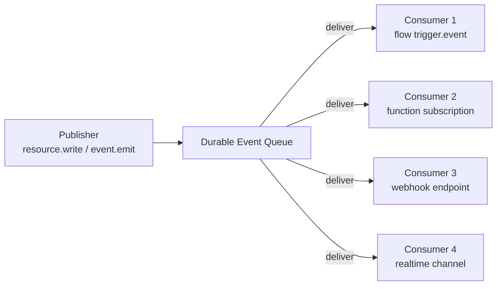
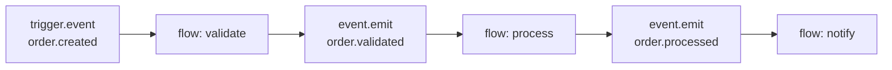

Events are the glue that connects every component in Pawabase. A resource write, an auth action, a flow's `event.emit` block, a schedule firing — everything produces events that other parts of the platform can react to.

<CardGroup cols={3}>
  <Card title="Resource events" icon="database">Every create, update, and delete emits a `<resource>.<action>` event.</Card>
  <Card title="Flow events" icon="waypoints">`event.emit` blocks publish events inside a flow's execution.</Card>
  <Card title="Durable queue" icon="inbox">Events are published to a durable queue — consumers never block the emitter.</Card>
</CardGroup>

## What emits events

| Source | Events emitted | When |
| --- | --- | --- |
| `resource.create` | `<resource>.created` | After a record is committed |
| `resource.update` | `<resource>.updated` | After a record is updated |
| `resource.delete` | `<resource>.deleted` | After a record is deleted |
| `event.emit` block | Any event name | When the block runs |
| `trigger.schedule` | Scheduler events | When a schedule fires |
| `auth.signup` | `user.signed_up` | When a new account is created |
| `auth.signin` | `user.signed_in` | When a user signs in |
| `mail.send` | `mail.queued` | When an email job is dispatched |
| `queue.flow` | `job.dispatched.<flow>` | When a flow job is queued |
| `queue.function` | `job.dispatched.<function>` | When a function job is queued |

## How events are emitted

Resource events are emitted by `after_write` hooks in the store layer. When a `resource.create`, `resource.update`, or `resource.delete` operation commits, the store emits the corresponding event through `platform.emit`:

```python
async def after_write(self, resource, operation, record):
    await platform.emit(f"{resource}.{operation}", record)
```

This happens synchronously as part of the write operation — the event is enqueued before the write returns to the caller. But the event is **durable**: it's written to the event log before the response is sent, so even if a consumer crashes, the event isn't lost.

The `platform.emit` method takes the environment state, the event name, and the payload, and delegates to the event bus:

```python
async def emit(
    self,
    state: EnvironmentState,
    name: str,
    payload: Any,
    *,
    actor: str | None = None,
    request_id: str | None = None,
) -> str:
    note("events", name, append=True)
    return await self.bus.emit(
        name,
        project=state.project_ref,
        env=state.env_name,
        payload=payload,
        actor=actor,
        request_id=request_id,
    )
```

The returned string is the event id, which can be used for deduplication or logging. The `actor` field identifies who or what caused the event — typically `"system"` for resource writes and `"scheduler"` for schedule-triggered events.

## event.emit — publishing from flows

Inside a flow, the `event.emit` block publishes any event:

```json
{
  "id": "announce",
  "data": {
    "block": "event.emit",
    "config": {
      "event": "order.paid",
      "payload": { "order_id": "{{ steps.order.output.id }}" }
    }
  }
}
```

`event.emit` fires **synchronously** — it runs as part of the current flow's execution and returns the event id as `output`. But the event itself is published to a **durable queue**, so consumers process asynchronously. A slow consumer never blocks the flow that emitted the event.

The `payload` field accepts any JSON-serializable value. Template expressions like `{{ steps.order.output.id }}` are resolved at execution time. If the referenced step hasn't run or produced no output, the expression evaluates to `null`.

## How the event processor routes events

When an event is emitted, the `EventProcessor` picks it up from the bus and routes it to all consumers. For each event:

1. **Record it** — an `EventLog` row is created with the event id, name, payload, actor, and project/env. If the event was already processed (at-least-once delivery), it's skipped.
2. **Find flow subscribers** — every flow with a `trigger.event` node whose pattern matches the event name is identified.
3. **Find function subscribers** — every function subscribed to the event name is queued.
4. **Find webhook subscribers** — every enabled outbound webhook whose event pattern matches has a delivery job queued.
5. **Find realtime subscribers** — any realtime channel configured to broadcast on this event gets a publication.

Each consumer receives its work as a queued job, so a slow consumer never delays the others:

```python
async def route(self, state: EnvironmentState, event: PlatformEvent) -> list[dict[str, Any]]:
    ...
    for subscription in state.subscriptions:
        if not fnmatch.fnmatchcase(event.name, subscription.event):
            continue
        if subscription.target_type == "flow":
            await platform.dispatch(RunFlowJob, ...)
        elif subscription.target_type == "function":
            await platform.dispatch(RunFunctionJob, ...)
        elif subscription.target_type == "realtime":
            await platform.publish(state, channel, event.name, event.payload)
    ...
```

## The durable event queue

Events are not delivered directly to consumers. They're published to a durable event queue:



Key properties of the queue:

- **Durable** — events are persisted before delivery begins. If a consumer crashes, the event is still in the queue.
- **At-least-once** — each consumer receives every event at least once. If a consumer fails to process an event, the event is redelivered.
- **Async** — consumers process events independently. The emitter never waits for any consumer to finish.
- **Ordered per event name** — events with the same name are delivered in the order they were published.

## The event envelope

Every event has a consistent envelope shape:

```json
{
  "event": "order.paid",
  "payload": { "order_id": "42", "total": 2999 },
  "id": "evt_abc123",
  "published_at": "2026-09-28T10:00:00+00:00"
}
```

The `payload` is the record data (for resource events) or the event-specific data (for `event.emit`). The `id` is unique and can be used for deduplication. The `published_at` timestamp is when the event was emitted.

## Common patterns

### Emit and forget

The most common pattern: emit an event and don't wait for consumers to finish. This decouples the emitter from downstream processing.

```json
[
  { "id": "update", "data": { "block": "resource.update", "config": { ... } } },
  { "id": "emit", "data": { "block": "event.emit", "config": { "event": "order.paid", "payload": { ... } } } }
]
```

The flow continues immediately after `event.emit` returns — it doesn't wait for the email flow, the analytics flow, or the realtime broadcast to finish.

### Reacting to events

To react to an event, create a flow with a `trigger.event` node:

```json
{
  "id": "start",
  "data": { "block": "trigger.event", "config": { "event": "order.paid" } }
}
```

This flow runs whenever `order.paid` is published — from any flow, any resource operation, or any `event.emit` block.

<Warning>
`event.emit` fires synchronously as part of the current run but publishes to a durable queue — consumers process asynchronously. A slow consumer never blocks the flow that emitted the event.
</Warning>

## Event processor internals

The `EventProcessor` is the core of Pawabase's event routing. It is attached to the platform's event bus during startup and consumes events from the Redis-backed event stream.

```python
class EventProcessor:
    def __init__(self, platform: Platform) -> None:
        self.platform = platform
        self.processed = 0

    def attach(self) -> EventProcessor:
        self.platform.bus.subscribe(self.handle)
        return self

    async def handle(self, event: PlatformEvent) -> list[dict[str, Any]]:
        # 1. Look up the environment state
        state = await self.platform.state(event.project, event.env)
        # 2. Deduplicate — at-least-once delivery check
        if await EventLog.filter(event_id=event.id).exists():
            return []
        # 3. Record the event
        log = await EventLog.create(...)
        # 4. Route to all consumers
        consumers = await self.route(state, event)
        log.consumers = consumers
        await log.save()
        self.processed += 1
        return consumers
```

The `handle` method is called for every event on the bus. It runs asynchronously and processes events one at a time per `(project, env)` pair, ensuring that events for the same environment are processed in order.

### Consumer routing

The `route` method finds all consumers for an event and dispatches work:

1. **Subscriptions** — `EventSubscription` records in the environment's state that match the event name via `fnmatch.fnmatchcase`
2. **Flow event entries** — `trigger.event` and `trigger.resource` nodes in flow definitions whose patterns match
3. **Webhook endpoints** — enabled webhooks whose `events` list contains a matching pattern via `endpoint_matches()`

Each consumer receives work as a queued job, so a slow consumer never delays the others.

### Error handling in routing

If a consumer's job dispatch fails, the error is caught and recorded in the consumer entry with `status: "failed"` and `error: "{ExceptionType}: {message}"`. The event itself is not lost — it remains in the event log. The failed consumer entry is visible in Studio's **Observability → Events** dashboard.

## Event backpressure

When many events are emitted in quick succession, the event bus naturally provides backpressure through Redis. The event stream is backed by Redis streams, which have a configurable maximum length. If the stream reaches its maximum length, older entries are trimmed (evicted) according to Redis's `MAXLEN` policy.

In practice, this means:
- Events are always persisted to Redis before being delivered to consumers
- If consumers are slow, events accumulate in Redis
- If Redis reaches its memory limit, old events are trimmed
- The `EventLog` table in Postgres provides a permanent record even if Redis events are trimmed

## Event debugging

When debugging event-driven flows, use these tools:

1. **Event log** — Every event is recorded in `EventLog` with its full payload, actor, and consumer results
2. **Studio → Observability → Events** — Filter by event name, project, environment, and time range
3. **`EventProcessor.processed` counter** — Track how many events the processor has handled
4. **Consumer entries** — Each event log entry has a `consumers` array showing which subscribers processed it and whether they succeeded or failed

```python
# Check if an event was already processed
if await EventLog.filter(event_id=event.id).exists():
    return []  # At-least-once: skip already-processed events
```

## Common patterns

### Emit and forget

The most common pattern: emit an event and don't wait for consumers to finish. This decouples the emitter from downstream processing.

```json
[
  { "id": "update", "data": { "block": "resource.update", "config": { ... } } },
  { "id": "emit", "data": { "block": "event.emit", "config": { "event": "order.paid", "payload": { ... } } } }
]
```

The flow continues immediately after `event.emit` returns — it doesn't wait for the email flow, the analytics flow, or the realtime broadcast to finish.

### Reacting to events

To react to an event, create a flow with a `trigger.event` node:

```json
{
  "id": "start",
  "data": { "block": "trigger.event", "config": { "event": "order.paid" } }
}
```

This flow runs whenever `order.paid` is published — from any flow, any resource operation, or any `event.emit` block.

### Chaining events

A flow can emit events that trigger other flows, creating an event chain:



Each flow in the chain is decoupled from the others — if `flow: process` is down, `order.validated` events accumulate in the queue until it recovers.

<Warning>
`event.emit` fires synchronously as part of the current run but publishes to a durable queue — consumers process asynchronously. A slow consumer never blocks the flow that emitted the event.
</Warning>

## Event log and retention

Every emitted event is recorded in the `EventLog` table, which Studio surfaces in the **Observability → Events** dashboard. The event log includes the event name, payload, actor, project, environment, and a timestamp. This provides a complete audit trail of everything that has happened in your project.

Event logs are retained indefinitely by default. For high-volume projects, consider using the `EventLog` retention settings to archive or purge old events.

## Next

<CardGroup cols={2}>
  <Card title="Subscriptions" icon="link" href="/events/subscriptions">How to subscribe to events.</Card>
  <Card title="Catalog" icon="book" href="/events/catalog">Every event name.</Card>
</CardGroup>
