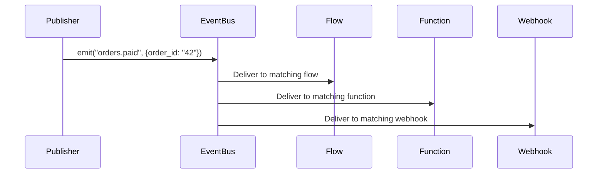
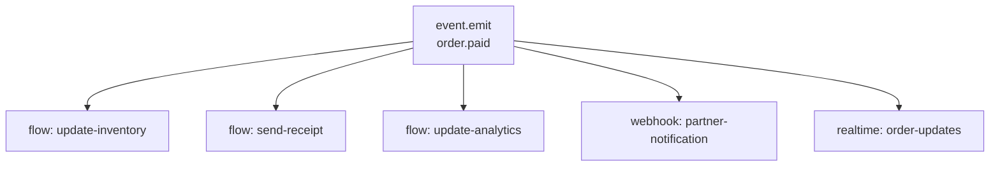
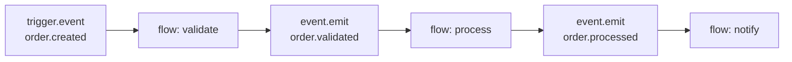

<Events icon="bolt" />

**Events** are how Pawabase's subsystems communicate with each other. When a record is created, a user signs in, or a schedule fires, an event is emitted. Any flow, function, webhook, or realtime channel can subscribe to that event and react — without the emitter knowing who's listening.

Events are the connective tissue behind every automated flow, background job, and real-time update in Pawabase.

<CardGroup cols={3}>
  <Card title="Emitting" icon="plus" href="/events/emitting">How to publish events from flows, resources, and schedules.</Card>
  <Card title="Subscriptions" icon="link" href="/events/subscriptions">How flows, functions, and webhooks subscribe to events.</Card>
  <Card title="Catalog" icon="book" href="/events/catalog">Every event name in Pawabase.</Card>
</CardGroup>

## How events work

An event has four parts:

| Part | What it is | Example |
| --- | --- | --- |
| **Name** | A dot-separated identifier | `orders.created` |
| **Payload** | The data carried by the event | `{ "order_id": "42", "total": 2999 }` |
| **ID** | A unique identifier per event | `evt_abc123def456` |
| **Context** | Project, environment, actor, and timestamps | `project: "acme", env: "production"` |



The key principle: **publishers don't know about subscribers.** A resource write emits `orders.created` without knowing whether a flow, function, or webhook is listening. This decoupling means you can add new subscribers without modifying the publisher.

## Event names

Event names follow the `domain.action` convention:

```
orders.created
user.signed_in
invoice.overdue
payment.succeeded
```

### Wildcard matching

Subscribers can match events using the `*` wildcard, which matches exactly one dot-separated segment:

| Pattern | Matches | Does not match |
| --- | --- | --- |
| `orders.*` | `orders.created`, `orders.updated` | `orders.us.updated` |
| `*.created` | `orders.created`, `users.created` | `orders.updated` |
| `*` | Every event | (nothing — matches all) |

Matching is **case-sensitive**: `Orders.Created` does not match `orders.created`.

### System event names

Pawabase emits events for these system actions:

| Source | Event names |
| --- | --- |
| Resource writes | `<resource>.created`, `<resource>.updated`, `<resource>.deleted` |
| Auth actions | `user.signed_up`, `user.signed_in`, `user.signed_out`, `user.email_verified` |
| Schedule fires | `scheduler.fired.<schedule_name>` |
| Flow executions | `flow.started`, `flow.completed`, `flow.failed` |
| Mail delivery | `mail.sent`, `mail.failed` |
| Webhook delivery | `webhook.delivered`, `webhook.failed` |

See the [Event catalog](/events/catalog) for the complete reference.

## Event delivery guarantees

| Guarantee | What it means |
| --- | --- |
| **At-least-once** | Every event is delivered at least once. If a consumer fails, the event may be redelivered. Consumers must be idempotent. |
| **Per-name ordering** | Events with the same name are delivered in the order they were published. Two different event types (`order.paid` and `invoice.overdue`) may arrive out of order. |
| **Durability** | Events are persisted before delivery. If the consumer is down, events wait in the queue. |
| **Isolation** | Events from `acme/production` never reach subscribers in `acme/development`. |
| **Async delivery** | The emitting operation is never blocked by slow consumers. Events are queued and processed in the background. |

<Warning>
If you need exactly-once processing (e.g., financial transactions), design your consumer to be idempotent. Use the event `id` to detect and skip duplicates.
</Warning>

## Event subscriptions

Events reach consumers through **subscriptions** — rules that say "when event X happens, run flow Y" or "when event X happens, POST to URL Z." There are four ways to subscribe:

| Subscriber type | How to configure | Use case |
| --- | --- | --- |
| **Flow trigger** | In the flow editor, add a `trigger.event` block | Run a flow when an event fires |
| **Function** | Use the event subscriber configuration | Run Python code when an event fires |
| **Outbound webhook** | Configure a webhook to subscribe to the event | Send to an external HTTP endpoint |
| **Realtime channel** | Configure a channel rule to broadcast the event | Push to connected browser/mobile clients |

### Subscribing from a flow

The most common way to subscribe to events is the **Event trigger** block in a flow:

1. Open a flow in Studio.
2. Click the trigger block → **Event**.
3. Enter the event name or pattern: `orders.created` or `orders.*`.
4. Optionally add a **condition** to filter which events trigger the flow.

The flow receives the full event envelope at `$input`:

```text
$input.event     → "orders.created"
$input.payload   → { "id": "ord_42", "total": 2999, ... }
$input.id        → "evt_abc123"
$input.actor     → "usr_001" (the user who caused the event)
$input.published_at → "2026-09-28T10:00:00+00:00"
```

### Condition-based subscriptions

You can filter which events trigger a subscription using a condition expression. Only events where the condition evaluates to truthy will trigger the subscriber.

Example: only process orders over $100:

```json
{ "gt": ["{{ input.payload.total }}", 10000] }
```

See [Expressions](/concepts/expressions) for the full condition syntax.

## Event emission vs realtime vs webhooks

Three mechanisms for broadcasting data, each with different characteristics:

| Mechanism | Delivery | Audience | Best for |
| --- | --- | --- | --- |
| **Events** | Durable queue, at-least-once | Flows, functions, webhooks | Backend-to-backend automation |
| **Realtime** | WebSocket push, immediate | Browser and mobile clients | Live UI updates |
| **Webhooks** | HTTP POST, delivery records | External systems | Integration with third parties |

Often you'll use all three together: a resource write emits an event → a flow processes it → publishes a realtime update to connected clients → fires a webhook to an external system.

## Event-driven architecture patterns

### Fan-out

One event, multiple subscribers. A payment flow emits `order.paid`, and separate flows handle inventory, analytics, and notifications independently:



### Event chaining

A flow can emit events that trigger other flows, creating a chain:



Each flow in the chain is decoupled — if the processing flow is down, `order.validated` events accumulate in the queue until it recovers.

### Outbox pattern

Emit an event as part of a resource write — the event and the write happen atomically:

```text
resource.create (orders)
   ↓
Event emitted: orders.created
   ↓
Flow triggered: validate-order
   ↓
Event emitted: order.validated
```

## Inspecting events in Studio

Studio provides three tools for event observability:

1. **Events dashboard** (Observability → Events) — Browse, filter, and search all events by name, project, environment, and time range. Click into any event to see its full payload and which consumers processed it.

2. **Flow execution traces** — When an event triggers a flow, the execution trace shows the event as the trigger input. Expand any step to see what data was available at that point.

3. **Delivery logs** — For outbound webhooks, see every delivery attempt, response code, and error message in the Webhooks → Deliveries tab.

## Environment isolation

Events are scoped to a project and environment. A flow in `acme/development` only receives events emitted in that environment. Events from `acme/production` never leak into `development`.

This isolation means you can safely test event-driven flows in a development environment without affecting production subscribers, and vice versa.

## Next steps

<Callout>
- **Emitting events** — Learn how to publish events from flows, resources, and functions: [Emitting](/events/emitting)
- **Subscribing** — Learn how flows, functions, webhooks, and realtime channels subscribe to events: [Subscriptions](/events/subscriptions)
- **Full catalog** — See every event name in Pawabase: [Catalog](/events/catalog)
- **Real-time updates** — Push events to connected clients: [Realtime](/realtime/overview)
</Callout>
