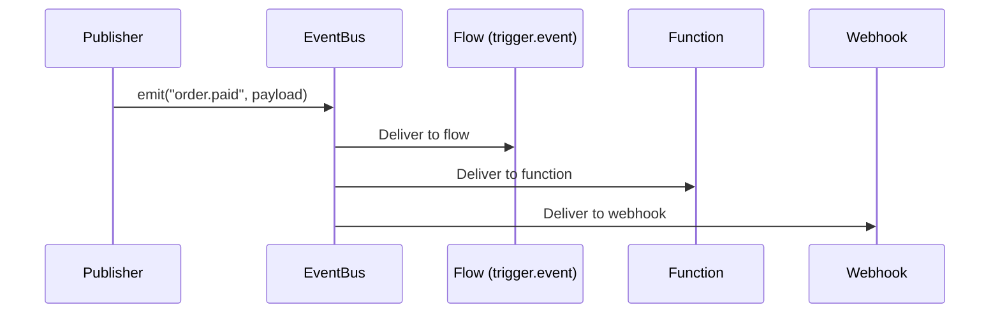
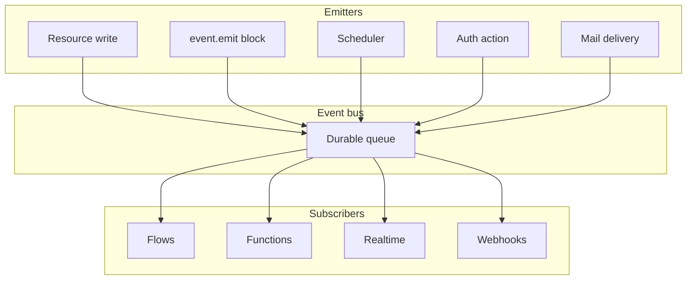
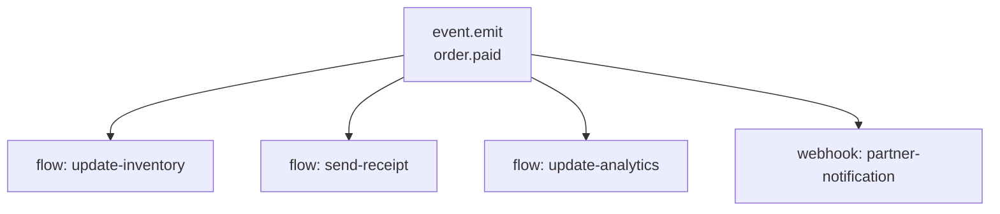
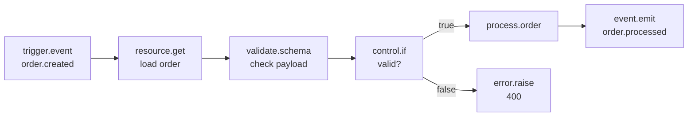

**Events** are the mechanism by which parts of the Pawabase platform communicate with each other. When something happens — a record is created, a payment succeeds, a schedule fires — an event is emitted. Other parts of the platform can subscribe to that event and react independently.

<CardGroup cols={3}>
  <Card title="Emitting" icon="plus">Publish events with event.emit or from resource writes.</Card>
  <Card title="Subscriptions" icon="link">Flows, functions, realtime channels, and webhooks all subscribe.</Card>
  <Card title="Catalog" icon="book">Every event name in one place.</Card>
</CardGroup>

## How events work

An event has a **name**, a **payload**, and an **id**. Events are published to a durable queue, which fans them out to all subscribers:



The key architectural principle: **publishers don't know about subscribers**. A flow emits `order.paid` without any knowledge of what (if anything) subscribes. This decoupling means you can add new subscribers without modifying the publisher.

## Event names

Every event has a name in the format `domain.action` (e.g., `order.paid`, `user.created`, `invoice.overdue`). Events can also use wildcard patterns (`order.*`) for triggers that match multiple events.

See [Event names](/reference/event-names) for the complete catalogue of system event names and naming conventions.

## How events relate to everything

Events connect the platform's subsystems:

| Publisher | Event emitted | Subscribers |
| --- | --- | --- |
| Resource writes | `resource.<name>.created`, `updated`, `deleted` | Flows (`trigger.event`), functions, realtime, webhooks |
| Auth actions | `user.created`, `user.updated`, `user.deleted` | Flows, functions |
| `event.emit` block | Any custom event name | Flows, functions, realtime, webhooks |
| Scheduler | Custom event targets | Flows, functions |
| Mail delivery | `mail.sent`, `mail.failed` | Flows (for retry logic) |



## Event emission vs realtime vs webhooks

Three mechanisms for broadcasting data, each with different characteristics:

| Mechanism | Delivery | Persistence | Audience |
| --- | --- | --- | --- |
| **Events** | Durable queue, at-least-once | Event log | Flows, functions, webhooks |
| **Realtime** | WebSocket push, immediate | Channel history | Connected clients |
| **Webhooks** | HTTP POST, delivery records | Delivery log | External endpoints |

Events are for **backend-to-backend** communication. Realtime is for **server-to-client** communication. Webhooks are for **Pawabase-to-external-system** communication. Often you'll use all three together: a resource write emits an event, triggers a flow that publishes to a realtime channel and fires a webhook.

## The event envelope

Every event has a standard envelope shape:

```json
{
  "event": "order.paid",
  "payload": {"order_id": "42", "total_minor": 1000},
  "id": "evt_abc123def456",
  "published_at": "2026-09-28T10:00:00.123456+00:00",
  "actor": "system"
}
```

- `event`: The event name
- `payload`: The event data (any JSON)
- `id`: A unique event id (UUID)
- `published_at`: When the event was published
- `actor`: Who or what caused the event (`"system"`, `"scheduler"`, or a user id)

## Ordering and delivery guarantees

Events are delivered with **at-least-once** semantics — each event is delivered at least once, but in the event of a subscriber failure, the event may be delivered again. Events are delivered in **per-event-name order** — all events for `order.paid` are delivered in the order they were published.

<Note>
Events are **not** delivered in globally strict order. Two different event types (`order.paid` and `invoice.overdue`) may be delivered out of order. If your system requires strict cross-event ordering, model the dependency explicitly (e.g., have one flow emit an event that triggers another flow).
</Note>

## Common patterns

### Emit and forget

The most common pattern: emit an event and don't wait for consumers. The flow continues, and downstream systems react independently.

```json
{"id": "emit", "data": {"block": "event.emit", "config": {"event": "order.paid", "payload": {...}}}}
```

### Fan-out to multiple systems

One event, many subscribers: a payment flow emits `order.paid`, and separate flows handle inventory, analytics, and notifications.



### Event-driven flows

A flow entirely driven by events — triggered by `trigger.event`, performing some work, and emitting more events downstream.



## Next

<CardGroup cols={2}>
  <Card title="Emitting" icon="plus" href="/events/emitting">How to publish events.</Card>
  <Card title="Subscriptions" icon="link" href="/events/subscriptions">How to subscribe to events.</Card>
  <Card title="Catalog" icon="book" href="/events/catalog">Every event name.</Card>
  <Card title="Realtime" icon="signal" href="/realtime/overview">Realtime channels for client updates.</Card>
</CardGroup>
