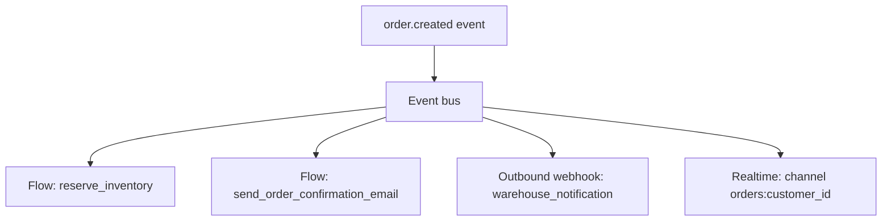
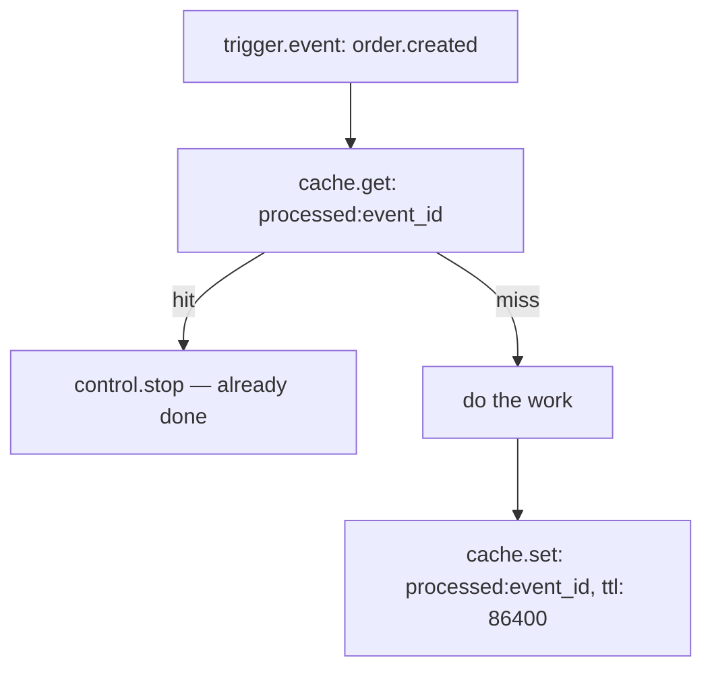

**Events** are the connective tissue between Pawabase's subsystems. When a record is created, a user signs in, a schedule fires, or a flow emits a custom event, a named event is published on the platform's event bus. Any flow, function, outbound webhook, or realtime channel can subscribe to that event and react — without the publisher needing to know who's listening.

Events make it possible to add new reactions to something that already happens, without modifying the code or flow that causes it. The order-creation flow doesn't change when a new loyalty-points flow starts reacting to `order.created`. The producer and its consumers are decoupled.

<CardGroup cols={3}>
  <Card title="At-least-once delivery" icon="repeat">Every event reaches every matching subscriber at least once. Consumers must be idempotent.</Card>
  <Card title="Environment isolation" icon="layers">Events from `acme/production` never reach subscribers in `acme/development`, even with the same event name.</Card>
  <Card title="Fan-out" icon="split">One event, many consumers — flows, functions, webhooks, and realtime channels all subscribe independently.</Card>
</CardGroup>

## The event bus

The event bus is the transport layer behind every event in Pawabase. When any part of the platform — a resource write, an auth action, a flow's `event.emit` block, or a schedule — produces an event, it goes to the bus. The bus records the event, then fans it out asynchronously to every matching subscriber.

The bus is **persistent** in production deployments (backed by Redis when configured), meaning an event published while a worker is temporarily down doesn't disappear — it waits until the worker is available. In development without Redis configured, the bus is in-process and events are delivered synchronously, which is convenient for local testing but not a model to design around in production.

**Delivery is at-least-once.** An event may be delivered more than once in unusual circumstances — a worker crash between receiving the event and committing the result, a network failure, an explicit retry. Design every event consumer to be idempotent: use the event's `id` to detect and skip a duplicate before acting on it.

## The event envelope

Every event, regardless of source, has the same envelope shape. This is what a flow with a `trigger.event` trigger receives as `input.event`:

```json
{
  "name": "order.created",
  "payload": { "order_id": "ord_9f2", "total_cents": 4900, "customer_id": "cus_abc" },
  "id": "evt_3b8f1c2a",
  "source": "resources",
  "actor": "usr_abc",
  "occurred_at": "2026-09-30T14:02:11.342Z",
  "request_id": "req_7e9a1c"
}
```

| Field | Meaning |
| --- | --- |
| `name` | The event name, dot-separated. Always present. |
| `payload` | The event's data. Shape depends entirely on what emitted the event. |
| `id` | A unique identifier for this event instance. Use this to detect duplicates. |
| `source` | Which platform component emitted it — `resources`, `flows`, `akountz`, `scheduler`, and so on. |
| `actor` | The authenticated user id who caused the event, when one can be determined. `null` for background events. |
| `occurred_at` | When the event was emitted, in UTC ISO-8601. This field is `occurred_at`, not `published_at` or `timestamp`. |
| `request_id` | The request id from the originating HTTP request, when the event was triggered by a request. `null` for background events. |

The entire envelope is available in a flow under `input.event`. The event's data is at `input.event.payload`. The event's name is at `input.event.name`. When a flow uses a wildcard pattern like `order.*` and you need to know which specific event fired, read `input.event.name`.

<Warning>
The timestamp field is `occurred_at`, not `published_at` and not `timestamp`. Any example or reference using `input.event.published_at` or `input.event.timestamp` is incorrect — those fields do not exist on the event envelope.
</Warning>

## Event names and wildcard matching

Event names follow a dot-separated convention: `domain.action`, like `order.created`, `user.signed_in`, or `invoice.overdue`. The domain identifies the source; the action describes what happened.

Subscribers can use glob patterns to match multiple events. Pawabase uses Python's `fnmatch.fnmatchcase` for matching, which means `*` matches any sequence of characters **including dots**:

| Pattern | Matches | Notes |
| --- | --- | --- |
| `order.created` | `order.created` only | Exact match |
| `order.*` | `order.created`, `order.updated`, `order.line_item.added` | `*` crosses dots — it matches everything after `order.` |
| `*.created` | `order.created`, `user.created`, `invoice.line.created` | Same — `*` crosses dots |
| `*` | Every event | Matches everything |

<Warning>
`*` in a Pawabase event pattern crosses dot boundaries. `order.*` matches both `order.created` (one segment after the dot) and `order.line_item.added` (two segments). This is different from some other systems where `*` only matches one segment. If you want to match only `order.something` but not `order.something.else`, there is no single-segment wildcard available — use exact names or check `input.event.name` inside the flow with a `control.if`.
</Warning>

Matching is case-sensitive. `Order.Created` does not match `order.created`.

## Platform-emitted events

Pawabase emits events automatically for several platform actions. The full catalog is in [Event catalog](/events/catalog). The most commonly used:

| Source | Event names |
| --- | --- |
| Resource writes | `<resource_name>.created`, `<resource_name>.updated`, `<resource_name>.deleted` — e.g. `orders.created` |
| Auth actions | `user.signed_up`, `user.signed_in`, `user.signed_out`, `user.email_verified`, `user.password_changed`, `user.mfa_enabled` |
| Scheduler | The scheduler fires flows directly; it does not emit a separate scheduler event for each run |

<Note>
Platform lifecycle events like `flow.started` and `flow.completed` are **not** emitted by Pawabase. Do not design subscribers expecting those event names. If you need to react to a flow's completion, have the flow emit a custom event at its end with `event.emit`.
</Note>

## Event delivery: from emit to subscriber

When an event is emitted, this is what happens:

1. The event is written to the persistent event store (a Redis list in production).
2. The event processor — a background worker — reads it and records an `EventLog` row with the full envelope and a list of every consumer the event will be dispatched to.
3. The event processor fans out to every matching subscription, dispatching each as an independent job:
   - **Flow subscriptions** are queued as background jobs on the `flows` queue.
   - **Function subscriptions** are queued on the `functions` queue.
   - **Outbound webhook subscriptions** are queued on the `webhooks` queue.
   - **Realtime subscriptions** publish a message to the configured channel immediately.
4. Each consumer runs independently. A slow or failing consumer does not block or delay any other consumer.
5. Delivery outcomes are recorded per consumer in the `EventLog.consumers` list, visible in Studio's event inspector.

The original action that emitted the event — the REST request that created the order, the flow that ran — never waits for any consumer to finish. Event delivery is fully asynchronous relative to the emitter.

## Event subscriptions: four ways to consume

| Consumer type | How to configure | What happens |
| --- | --- | --- |
| **Flow** | Add a `trigger.event` node to a flow | The flow runs as a background job, receiving the full event envelope as `input.event` |
| **Function** | Configure an event subscription targeting the function in Studio | The function runs as a background job |
| **Outbound webhook** | Configure a webhook subscription targeting an external URL | Pawabase POSTs the event envelope to that URL |
| **Realtime channel** | Configure a realtime event subscription | The event is published to the specified channel as a message |

Configuring subscriptions is covered in detail on [Subscriptions](/events/subscriptions).

## Fan-out: one event, multiple consumers

Multiple subscriptions can react to the same event. Each runs independently.



The `order.created` emitter — whether that's the resource layer after a `POST /rest/v1/orders` or a flow's `event.emit` block — publishes once. Every subscriber listed above runs independently, in its own job, with its own retry budget.

Adding a new consumer (a new subscription) never requires changing the emitter. This is the key operational benefit: as the system grows, new behaviors can be attached to existing events without modifying or redeploying anything already working.

## Events vs. direct flow calls vs. queued jobs

| Mechanism | Producer knows consumer? | Multiple consumers? | Immediate response needed? |
| --- | --- | --- | --- |
| Event subscription | No — fully decoupled | Yes | No — always async |
| Direct flow invocation (HTTP trigger) | Yes — you name the flow | One | Yes — caller waits |
| `queue.flow` block | Yes — you name the flow | One | No — dispatched to background |

Use events when:
- More than one thing should react to the same occurrence.
- You want to add new reactions without modifying existing flows.
- The emitter shouldn't need to know or care who's listening.

Use direct flow invocation (`POST /flows/v1/<name>` or a route) when a caller needs a synchronous response from a specific flow.

Use `queue.flow` when you want to hand off work to a specific named flow as a background job, with full control over the input.

## Idempotency

Because delivery is at-least-once, a subscriber may receive the same event more than once in unusual circumstances. Every consumer should handle duplicates safely:

```json
{
  "id": "check_already_processed",
  "data": {
    "block": "cache.get",
    "config": { "key": "processed:{{ input.event.id }}" }
  }
}
```



Set the dedup key once the work is safely complete, not before — a crash after the check but before the work means the event gets reprocessed on the retry, which is the correct behavior.

## Inspecting events in Studio

Studio's **Observability → Events** view shows:

- A filterable, paginated list of events by name, project, environment, and time range.
- The full event envelope for any event.
- The list of consumers that were dispatched for each event, with their outcomes.
- Links to the associated flow run, job, or webhook delivery record for each consumer.

The `request_id` on an event links it back to the REST request or flow run that caused it. Following that request id through the request inspector shows the full chain: the originating request, the event it emitted, the consumers it dispatched, and every downstream result.

## Security and environment isolation

Events are fully scoped to a `(project, env)` pair. An event emitted in `acme/production` is never delivered to a subscriber in `acme/development`. Events are also never visible to other projects, even ones in the same organization.

Event payload data is stored in `EventLog` rows in Pawabase's own database. Design payloads accordingly: include the identifiers consumers need to do their work (a record id, a status), but avoid including sensitive data (full card details, passwords, tokens) that doesn't need to be in an event record.

## Related documentation

<CardGroup cols={2}>
  <Card title="Emitting events" icon="radio-tower" href="/events/emitting">How to emit custom events from flows and functions.</Card>
  <Card title="Subscriptions" icon="link" href="/events/subscriptions">How to configure flow, function, webhook, and realtime subscriptions.</Card>
  <Card title="Event catalog" icon="book-open" href="/events/catalog">All platform-emitted event names and their payload shapes.</Card>
  <Card title="Flows: trigger.event" icon="waypoints" href="/flows/triggers#trigger-event">The flow trigger that subscribes to an event.</Card>
</CardGroup>
