**Events** are the mechanism by which parts of the Pawabase platform communicate with each other. When something happens — a record is created, a payment succeeds, a schedule fires — an event is emitted. Other parts of the platform can subscribe to that event and react independently. This page provides a comprehensive overview of the event system architecture, the event envelope, the event processor, the durable event queue, and all the patterns for building event-driven flows.

<CardGroup cols={3}>
  <Card title="Emitting" icon="plus">Publish events with event.emit or from resource writes.</Card>
  <Card title="Subscriptions" icon="link">Flows, functions, realtime channels, and webhooks all subscribe.</Card>
  <Card title="Catalog" icon="book">Every event name in one place.</Card>
</CardGroup>

## How events work

An event has a **name**, a **payload**, and an **id**. Events are published to a durable queue, which fans them out to all subscribers. The event bus is backed by Sillo's `EventEmitter` with a Redis-backed persistent backlog in production and an in-memory backend for development and testing. Every platform event travels on a single channel (`pawabase.events`), and consumers filter by event name using `fnmatch.fnmatchcase`.

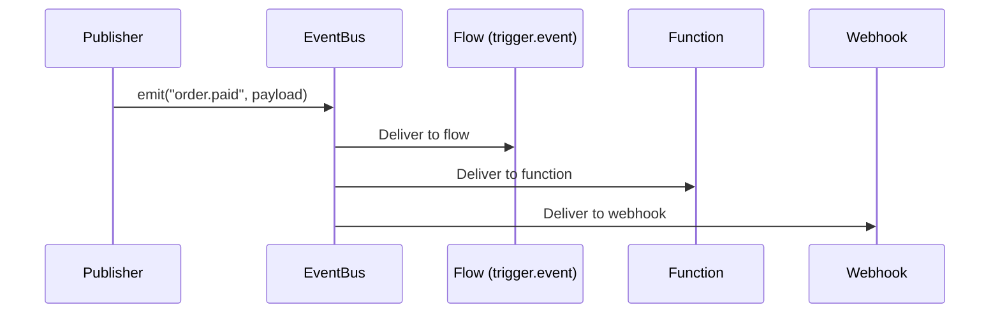

The key architectural principle: **publishers don't know about subscribers**. A flow emits `order.paid` without any knowledge of what (if anything) subscribes. This decoupling means you can add new subscribers without modifying the publisher. The `EventBus` class in `pawabase_kit/events.py` wraps Sillo's `EventEmitter` and manages the connection:

```python
class EventBus:
    def __init__(self, backend: str = "memory", *, url: str | None = None, ...):
        options: dict[str, Any] = {}
        if url and backend in ("redis", "persistent"):
            options["url"] = url
        self.emitter = EventEmitter(backend, on_error=self._on_error, **options)
        self.backend = backend
        self.channel = PLATFORM_CHANNEL  # "pawabase.events"
        self.source = source
```

The bus supports three backends. The **`memory`** backend is used in tests and single-process development setups — events are delivered in-process without any network overhead. The **`persistent`** backend uses a Redis-backed backlog with at-least-once delivery — events published while the API's event processor is down wait in the backlog for it. The backlog behaves as a work queue (each event goes to one consumer), so only buses with handlers drain it; a publish-only bus never takes events off it. The **`redis`** backend uses pub/sub fan-out to every instance, which Angula uses for realtime.

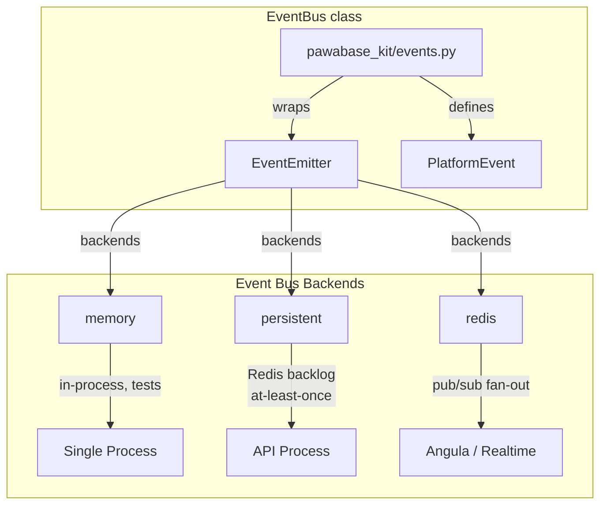

## Event names

Every event has a name in the format `domain.action` (e.g., `order.paid`, `user.created`, `invoice.overdue`). Events can also use wildcard patterns (`order.*`) for triggers that match multiple events. The `*` wildcard matches exactly one dot-separated segment — `order.*` matches `order.paid` but not `order.us.paid`. Matching uses `fnmatch.fnmatchcase`, which is case-sensitive: `order.paid` does not match `Order.Paid`.

The `PlatformEvent.matches(pattern)` method provides the matching logic:

```python
def matches(self, pattern: str) -> bool:
    """Whether ``pattern`` (``order.*``, ``*``) selects this event."""
    return fnmatch.fnmatchcase(self.name, pattern)
```

See [Event names](/reference/event-names) for the complete catalogue of system event names and naming conventions.

## How events relate to everything

Events connect the platform's subsystems. Every subsystem both emits and consumes events, creating a dense mesh of communication:

| Publisher | Event emitted | Subscribers |
| --- | --- | --- |
| Resource writes | `resource.<name>.created`, `updated`, `deleted` | Flows (`trigger.event`, `trigger.resource`), functions, realtime, webhooks |
| Auth actions | `user.created`, `user.updated`, `user.deleted`, `user.signed_up`, `user.signed_in` | Flows, functions |
| `event.emit` block | Any custom event name | Flows, functions, realtime, webhooks |
| Scheduler | Custom event targets | Flows, functions |
| Mail delivery | `mail.sent`, `mail.failed` | Flows (for retry logic) |
| Webhook delivery | `webhook.delivered`, `webhook.failed` | Flows (for observability) |
| Inbound webhooks | `<slug>:<action>` events | Flows (`trigger.webhook`), functions |

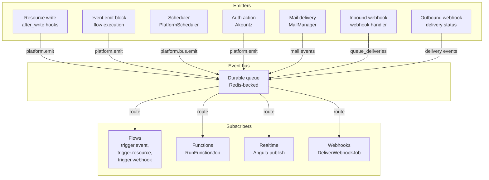

## Event emission vs realtime vs webhooks

Three mechanisms for broadcasting data, each with different characteristics:

| Mechanism | Delivery | Persistence | Audience | Ordering |
| --- | --- | --- | --- | --- |
| **Events** | Durable queue, at-least-once | Event log | Flows, functions, webhooks | Per-event-name |
| **Realtime** | WebSocket push, immediate | Channel history | Connected clients | Per-channel |
| **Webhooks** | HTTP POST, delivery records | Delivery log | External endpoints | Per-webhook |

Events are for **backend-to-backend** communication. Realtime is for **server-to-client** communication. Webhooks are for **Pawabase-to-external-system** communication. Often you'll use all three together: a resource write emits an event, triggers a flow that publishes to a realtime channel and fires an outbound webhook. The `platform.publish` method sends messages to realtime channels through Angula, while `platform.emit` publishes to the event bus.

## The event envelope

Every event has a standard envelope shape, defined by the `PlatformEvent` dataclass in `pawabase_kit/events.py`:

```json
{
  "event": "order.paid",
  "payload": {"order_id": "42", "total_minor": 1000},
  "id": "evt_abc123def456",
  "published_at": "2026-09-28T10:00:00.123456+00:00",
  "actor": "system",
  "project": "acme",
  "env": "production",
  "source": "api",
  "request_id": "req_xyz789"
}
```

- `event`: The event name in `domain.action` format.
- `payload`: The event data (any JSON-serializable object). Keep it small — consumers fetch full records when needed.
- `id`: A unique event id (UUID hex string). Used for deduplication and tracing.
- `published_at`: When the event was published, in ISO-8601 UTC.
- `actor`: Who or what caused the event (`"system"`, `"scheduler"`, a user id, or `"service"`).
- `project`: The project reference (e.g., `"acme"`).
- `env`: The environment name (`"development"`, `"production"`, etc.).
- `source`: The service that published it (`"api"`, `"scheduler"`, `"worker"`, etc.).
- `request_id`: The HTTP request that caused the event, if applicable.

The `PlatformEvent.to_dict()` method serializes the event, and `PlatformEvent.from_dict()` deserializes it. Every field on the dataclass is known:

```python
@dataclass(slots=True)
class PlatformEvent:
    name: str
    project: str
    env: str
    payload: Any = None
    source: str = "unknown"
    actor: str | None = None
    id: str = field(default_factory=lambda: uuid.uuid4().hex)
    occurred_at: str = field(default_factory=lambda: datetime.now(UTC).isoformat())
    request_id: str | None = None
```

The `id` is generated using `uuid.uuid4().hex` — a 32-character hex string. The `occurred_at` timestamp defaults to `datetime.now(UTC).isoformat()`. Both are generated automatically when the event is constructed.

## Ordering and delivery guarantees

Events are delivered with **at-least-once** semantics — each event is delivered at least once, but in the event of a subscriber failure, the event may be delivered again. The `EventProcessor.handle` method checks for duplicate events before processing:

```python
if await EventLog.filter(event_id=event.id).exists():
    return []  # at-least-once: skip already-processed events
```

This deduplication check is the foundation of the at-least-once guarantee. The `EventLog` table stores every event by its unique `event_id`, so the processor can always determine whether an event has been seen before.

Events are delivered in **per-event-name order** — all events for `order.paid` are delivered in the order they were published. This is guaranteed because the event bus partitions by event name and the `EventProcessor` processes events one at a time per `(project, env)` pair.

<Note>
Events are **not** delivered in globally strict order. Two different event types (`order.paid` and `invoice.overdue`) may be delivered out of order. If your system requires strict cross-event ordering, model the dependency explicitly (e.g., have one flow emit an event that triggers another flow).
</Note>

## The event processor lifecycle

The `EventProcessor`, defined in `services/api/app/events.py`, is the core of Pawabase's event routing. It is attached to the platform's event bus during startup via `EventBus.subscribe`:

```python
class EventProcessor:
    def __init__(self, platform: Platform) -> None:
        self.platform = platform
        self.processed = 0

    def attach(self) -> EventProcessor:
        self.platform.bus.subscribe(self.handle)
        return self
```

The `EventBus.subscribe` method registers the handler:

```python
def subscribe(self, handler: Handler) -> Handler:
    """Receive every platform event. Usable as a decorator."""
    self._handlers.append(handler)
    if not self._subscribed:
        self.emitter.on(self.channel, self._dispatch)
        self._subscribed = True
    if self._started and not self._consuming:
        self._consuming = True
        asyncio.get_running_loop().create_task(self.emitter.start())
    return handler
```

The `handle` method is called for every event on the bus. It runs asynchronously and processes events one at a time per `(project, env)` pair, ensuring that events for the same environment are processed in order. The lifecycle of `handle` is:

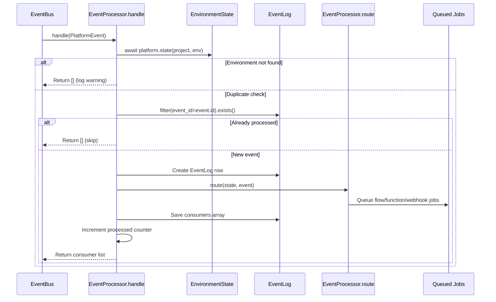

1. **Look up the environment state** — `await self.platform.state(event.project, event.env)` loads the full `EnvironmentState` for the project and environment. If the environment is not found, the event is skipped with a warning.
2. **Deduplicate** — If the event was already processed (at-least-once delivery check), skip it. The check queries the `EventLog` table for the event id.
3. **Record the event** — An `EventLog` row is created with the event id, name, payload, actor, project/env, source, request_id, and occurred_at.
4. **Route to all consumers** — The `route` method finds all matching consumers and dispatches work.
5. **Record consumer outcomes** — The `consumers` array on the `EventLog` row records which subscribers processed the event and how each one performed.
6. **Increment the processed counter** — `self.processed += 1` tracks total events processed.

## Consumer types and routing

The `EventProcessor.route` method finds all consumers for an event and dispatches work:

```python
async def route(self, state: EnvironmentState, event: PlatformEvent) -> list[dict[str, Any]]:
    from app.jobs.flows import RunFlowJob
    from app.jobs.functions import RunFunctionJob

    platform = self.platform
    consumers: list[dict[str, Any]] = []
    event_input = {"event": event.to_dict()}
    condition_context = {"event": event.to_dict()}

    async def attempt(kind: str, target: str, work) -> None:
        entry: dict[str, Any] = {"type": kind, "target": target}
        try:
            result = await work()
            entry["status"] = "queued" if kind in ("flow", "function", "webhook") else "done"
            if result is not None:
                entry["ref"] = result
        except Exception as exc:
            entry["status"] = "failed"
            entry["error"] = f"{type(exc).__name__}: {exc}"
        consumers.append(entry)

    # 1. Event subscriptions (EventSubscription records)
    for subscription in state.subscriptions:
        if not fnmatch.fnmatchcase(event.name, subscription.event):
            continue
        if not matches_condition(subscription.condition, condition_context):
            continue
        # Route based on subscription.target_type: flow, function, realtime

    # 2. Flow event entries (trigger.event, trigger.resource, trigger.realtime)
    for flow_name, node_id in flow_event_entries(state, event):
        await attempt("flow", flow_name, lambda: platform.dispatch(
            RunFlowJob, project=..., env=..., target=flow_name,
            input=event_input, trigger="event", entry=node_id,
            auth={"authenticated": False, "kind": "system"},
        ))

    # 3. Outbound webhook endpoints
    if any(endpoint.enabled and endpoint_matches(endpoint.events, event.name)
           for endpoint in state.webhooks):
        await attempt("webhook", "endpoints", lambda: queue_deliveries(...))

    return consumers
```

Each consumer type is handled differently:

- **Event subscriptions**: `EventSubscription` records in the environment's state that match the event name via `fnmatch.fnmatchcase`. The subscription has a `target_type` (`flow`, `function`, or `realtime`) and a `target` (the flow name, function name, or channel name). An optional `condition` can filter which events trigger the subscription.
- **Flow event entries**: `trigger.event`, `trigger.resource`, and `trigger.realtime` nodes in flow definitions whose patterns match. The `flow_event_entries` function scans all enabled flows.
- **Webhook endpoints**: Enabled outbound webhooks whose `events` list contains a matching pattern via `endpoint_matches()`. Each matching endpoint gets a `DeliverWebhookJob` queued.
- **Realtime subscriptions**: Any realtime channel configured to broadcast on this event gets a publication through Angula via `platform.publish`.

## The event graph

Events form a directed graph of dependencies across the platform. Understanding this graph is essential for designing event-driven architectures:

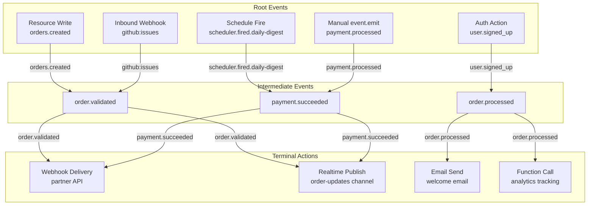

The graph is acyclic by design — events should not create cycles. If you need a cycle, use a direct function call instead of emitting an event that triggers another event that triggers the original function. The event bus partitions by event name, so each event name's consumers form an independent delivery queue.

## Event backpressure

When many events are emitted in quick succession, the event bus provides natural backpressure through Redis. The event stream is backed by Redis streams, which have a configurable maximum length. If the stream reaches its maximum length, older entries are trimmed (evicted) according to Redis's `MAXLEN` policy.

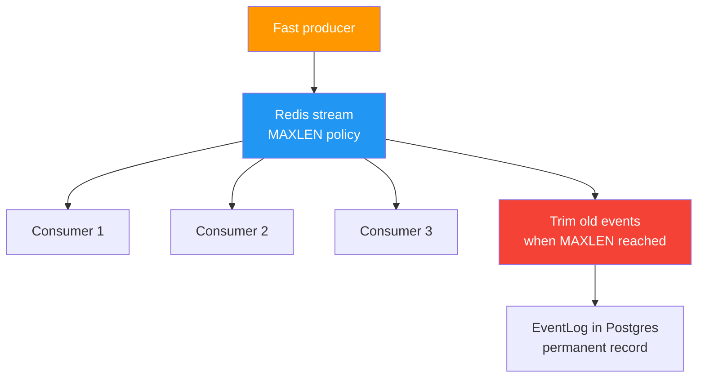

In practice, this means:

- Events are always persisted to Redis before being delivered to consumers
- If consumers are slow, events accumulate in Redis
- If Redis reaches its memory limit, old events are trimmed
- The `EventLog` table in Postgres provides a permanent record even if Redis events are trimmed
- The `EventProcessor.processed` counter tracks total events processed

## Event processor error handling

The `EventProcessor.handle` method wraps the entire processing in a try/except. If an unexpected error occurs during processing, the error is logged but the event is not re-processed automatically — it remains in the event log and can be inspected. The `route` method's `attempt` helper catches dispatch errors and records them in the consumer entry:

```python
async def attempt(kind: str, target: str, work) -> None:
    entry: dict[str, Any] = {"type": kind, "target": target}
    try:
        result = await work()
        entry["status"] = "queued" if kind in ("flow", "function", "webhook") else "done"
        if result is not None:
            entry["ref"] = result
    except Exception as exc:
        entry["status"] = "failed"
        entry["error"] = f"{type(exc).__name__}: {exc}"
    consumers.append(entry)
```

If a job dispatch fails (e.g., the queue is unavailable), the consumer entry has `status: "failed"` and the error message. The event itself is not lost — it remains in the event log with the failed consumer recorded.

## Event debugging

When debugging event-driven flows, use these tools:

1. **Event log** — Every event is recorded in `EventLog` with its full payload, actor, and consumer results
2. **Studio → Observability → Events** — Filter by event name, project, environment, and time range. Shows the full event graph with which consumers succeeded or failed.
3. **`EventProcessor.processed` counter** — Track how many events the processor has handled. Available via the platform's observability endpoints and Studio's status dashboard.
4. **Consumer entries** — Each event log entry has a `consumers` array showing which subscribers processed it and whether they succeeded or failed.

```python
# Check if an event was already processed (at-least-once check)
if await EventLog.filter(event_id=event.id).exists():
    return []  # Already handled

# Inspect the full event log for a specific event name
log = await EventLog.filter(name="order.paid").order_by("-occurred_at").limit(10)
for entry in log:
    print(f"{entry.event_id}: {entry.payload}")
    for c in entry.consumers:
        print(f"  → {c['type']} {c['target']}: {c['status']}")
        if c['status'] == 'failed':
            print(f"     Error: {c['error']}")

# Check total events processed by the processor
# Available via platform.observability or Studio dashboard
```

## Environment isolation

Events are scoped to a project and environment. A flow in `acme/development` only receives events emitted in that environment. A flow in `acme/production` will not see `acme/development` events. This isolation is enforced at the `EventProcessor` level:

- The `EventProcessor.handle` method loads `EnvironmentState` for the event's `(project, env)` pair.
- All consumer lookups (subscriptions, flows, webhooks) are scoped to that environment state.
- The `EventLog` row records both `project` and `env`, enabling cross-environment queries from Studio.
- The `EnvironmentCache` caches states by `(project, env)` key, so events are always routed against the correct environment definition.

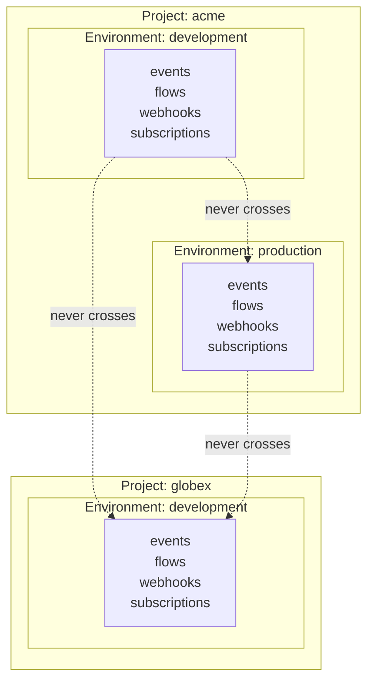

The `EnvironmentState` object includes `project_ref`, `project_name`, `env_name`, and `version`. Every event is tagged with `project` and `env`, and every consumer lookup is scoped to a specific `(project, env)` pair.

## Event scheduling integration

The scheduler (`PlatformScheduler` in `services/api/app/scheduler.py`) integrates with the event system by emitting events when schedules fire. When a schedule targets an event type, the scheduler uses `platform.bus.emit`:

```python
elif spec["target_type"] == "event":
    await platform.bus.emit(
        spec["target"],
        project=project,
        env=env,
        payload=spec.get("payload"),
        actor="scheduler",
    )
```

This means a scheduled event is indistinguishable from a manually emitted event — it arrives on the same bus, same channel, with the same guarantees. The `actor` is set to `"scheduler"` so consumers can distinguish scheduled events from manually emitted ones.

The scheduler also emits `scheduler.fired.<flow>` events when a `trigger.schedule` node fires:

```json
{
  "event": "scheduler.fired.daily-digest",
  "payload": { "flow": "daily-digest", "node": "start", "scheduled_at": "2026-09-28T08:00:00+00:00" },
  "actor": "scheduler",
  "project": "acme",
  "env": "production"
}
```

## Common patterns

### Emit and forget

The most common pattern: emit an event and don't wait for consumers. The flow continues, and downstream systems react independently.

```json
[
  { "id": "update", "data": { "block": "resource.update", "config": { ... } } },
  { "id": "emit", "data": { "block": "event.emit", "config": { "event": "order.paid", "payload": { ... } } } }
]
```

### Fan-out to multiple systems

One event, many subscribers: a payment flow emits `order.paid`, and separate flows handle inventory, analytics, and notifications.

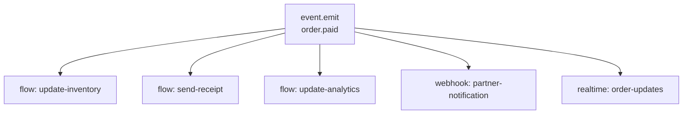

### Event-driven flows

A flow entirely driven by events — triggered by `trigger.event`, performing some work, and emitting more events downstream.

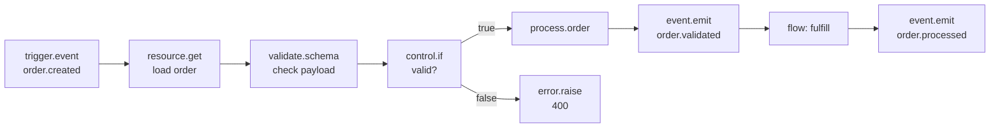

### Chaining events

A flow can emit events that trigger other flows, creating an event chain:

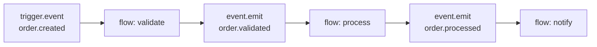

Each flow in the chain is decoupled from the others — if `flow: process` is down, `order.validated` events accumulate in the queue until it recovers.

## Event log retention

Every event is permanently recorded in the `EventLog` table. The event log includes:

| Field | Description |
| --- | --- |
| `event_id` | Unique event identifier (UUID) |
| `name` | The event name |
| `payload` | The event data (any JSON) |
| `actor` | Who or what caused the event |
| `source` | Which process emitted the event |
| `project` | The project reference |
| `env` | The environment name |
| `occurred_at` | When the event was published |
| `consumers` | Which subscribers processed the event and their outcomes |
| `request_id` | The HTTP request that caused the event |

Studio surfaces the event log in the **Observability → Events** dashboard, where you can filter by event name, project, environment, and time range. Event logs are retained indefinitely — there is no automatic expiry.

<Note>
For high-volume projects (thousands of events per second), consider using the `EventLog` retention settings to archive old events to a separate storage backend. The event log is stored in the platform database, so very large event volumes can increase the size of the platform database over time.
</Note>

## The complete event lifecycle

From emission to delivery, every event goes through this complete lifecycle:

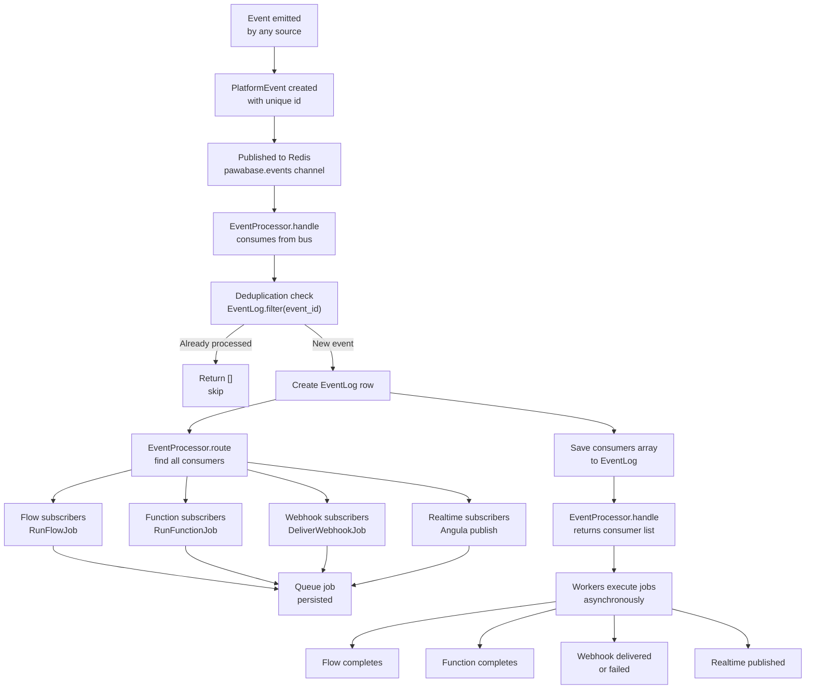

Every step in this lifecycle is observable. The `EventLog` table records the event and its consumers. The `JobRun` table records each job's status. The `WebhookDelivery` table records each webhook delivery attempt. Studio provides dashboards for all of these.

## Next

<CardGroup cols={2}>
  <Card title="Emitting" icon="plus" href="/events/emitting">How to publish events.</Card>
  <Card title="Subscriptions" icon="link" href="/events/subscriptions">How to subscribe to events.</Card>
  <Card title="Catalog" icon="book" href="/events/catalog">Every event name.</Card>
  <Card title="Realtime" icon="signal" href="/realtime/overview">Realtime channels for client updates.</Card>
</CardGroup>

## Summary

Pawabase's event system provides a complete foundation for event-driven architecture. Events are published to a durable Redis-backed queue with at-least-once delivery, consumed by the `EventProcessor` which records and routes them to all matching subscribers. The system is fully decoupled — publishers don't know about subscribers — and events are scoped to project/environment pairs for isolation. Every event has a unique id, a structured envelope, and is permanently recorded in the `EventLog`. Whether you're reacting to resource writes, auth actions, schedule firings, or emitting custom events, the event system provides the reliable, ordered, and observable backbone your flows need. See [Emitting](/events/emitting) to learn how to publish events, [Subscriptions](/events/subscriptions) for all subscription mechanisms, and [Catalog](/events/catalog) for the complete event reference.

## The event processor in production

In production deployments, the `EventProcessor` runs as part of the API process. It is started when the platform starts and stopped when the platform stops. The processor is attached to the event bus and consumes events continuously:

```python
async def main(**overrides: Any) -> None:
    from sillo.record import DatabaseManager
    from app.config import ApiSettings
    from app.events import EventProcessor
    from database.config import MODEL_MODULES, database_config

    settings = ApiSettings(**overrides)
    database = DatabaseManager(database_config(settings)).register_models(*MODEL_MODULES)
    await database.init()
    platform = Platform(settings)
    EventProcessor(platform).attach()
    await platform.start()
    # ... worker and heartbeat setup ...
```

The `EventProcessor.attach()` method subscribes the `handle` method to the event bus:

```python
def attach(self) -> EventProcessor:
    self.platform.bus.subscribe(self.handle)
    return self
```

When `platform.start()` is called, the event bus starts consuming from the Redis backlog. The processor then begins handling events as they arrive.

## Event processor statistics

The `EventProcessor.processed` counter provides visibility into the system's throughput:

- The counter is incremented for every event processed
- It is reset when the processor restarts
- It is available via the platform's observability endpoints
- Studio displays this counter in the status dashboard

```python
class EventProcessor:
    def __init__(self, platform: Platform) -> None:
        self.platform = platform
        self.processed = 0
```

In a high-throughput system, this counter can reach thousands per second. Monitor this counter to ensure the processor is keeping up with the event rate.

## Event processor error handling

The `EventProcessor.handle` method wraps the entire processing in a try/except:

```python
async def handle(self, event: PlatformEvent) -> list[dict[str, Any]]:
    try:
        state = await self.platform.state(event.project, event.env)
    except HTTPException:
        logger.warning("event %s for unknown environment %s/%s", event.name, event.project, event.env)
        return []
    if await EventLog.filter(event_id=event.id).exists():
        return []
    log = await EventLog.create(...)
    consumers = await self.route(state, event)
    log.consumers = consumers
    await log.save(update_fields=["consumers"])
    self.processed += 1
    return consumers
```

If the environment is not found (HTTPException), the event is skipped with a warning. This can happen if the environment was deleted or if there's a configuration issue. If the event was already processed, it's skipped (at-least-once). If the event log creation fails, the exception propagates and the event may be re-delivered.

## Event processor performance

The `EventProcessor` processes events one at a time per `(project, env)` pair. This ensures ordering but limits throughput. For high-volume projects, consider:

1. **Multiple processor instances** — Run multiple API instances to parallelize processing
2. **Environment partitioning** — Distribute environments across instances
3. **Redis tuning** — Optimize Redis for high-throughput event streaming
4. **Database optimization** — Ensure the `EventLog` table is properly indexed

The `EventProcessor.route` method is the bottleneck for throughput. Each event requires:
- An environment state lookup (cached in `EnvironmentCache`)
- Subscription matching via `fnmatch.fnmatchcase`
- Job dispatch for each consumer
- Event log update with consumer results

## Event processing guarantees

The event system provides these guarantees:

| Guarantee | Description | Implementation |
| --- | --- | --- |
| At-least-once | Every event is delivered at least once | EventLog deduplication check |
| Per-name ordering | Events with the same name are ordered | Redis stream partitioning |
| Durability | Events survive consumer crashes | Redis persistence + EventLog |
| Isolation | Events are isolated by project/env | EnvironmentState scoping |
| Async delivery | Consumers don't block the emitter | Queued jobs |

## Event system architecture

The complete event system architecture consists of:

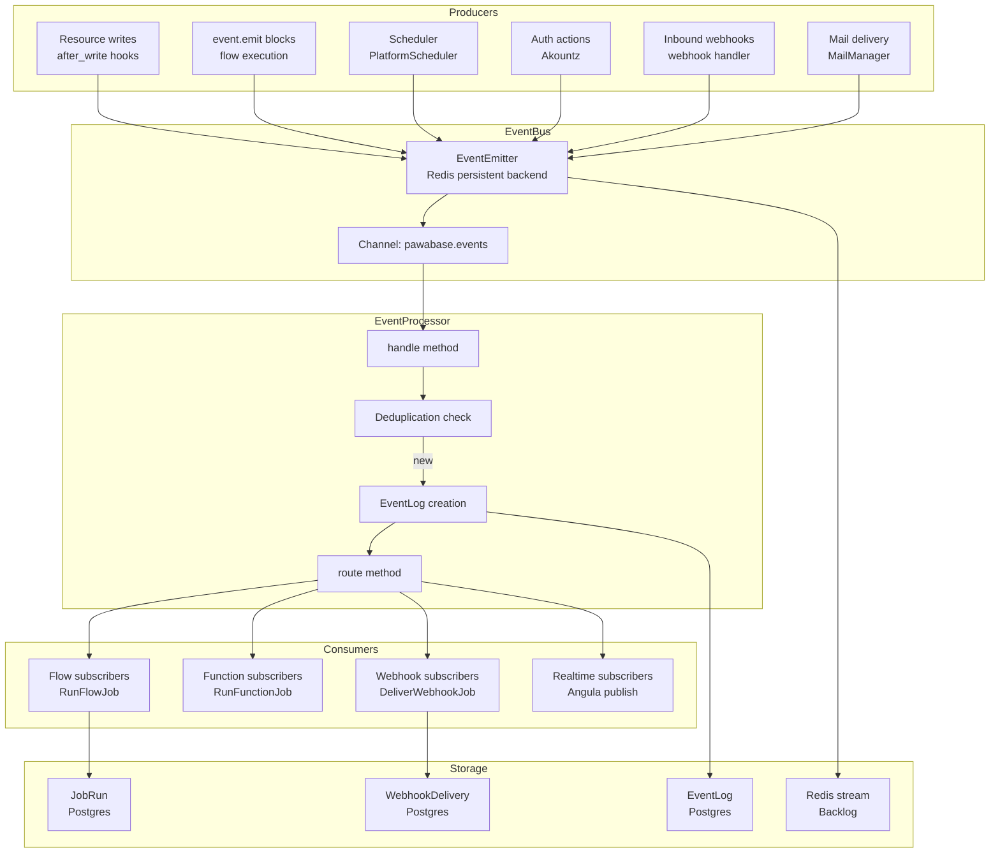

## Event system monitoring

Monitor the event system using these metrics:

1. **EventProcessor.processed** — Total events processed
2. **EventBus.published** — Total events published
3. **EventLog count** — Total events in the log
4. **Consumer failure rate** — Percentage of consumers that failed
5. **Job queue depth** — Number of pending jobs per queue
6. **Event processing latency** — Time from publish to delivery

```python
# Access event processor metrics
processor = EventProcessor(platform)
# processed is available as processor.processed
# published is available as platform.bus.published
```

## Event system configuration

The event system is configured through the `PlatformSettings` and environment configuration:

- **Redis URL** — `PAWABASE_REDIS_URL` — The Redis URL for the event bus
- **Event channel** — `PLATFORM_CHANNEL` — The Redis channel name (default: `pawabase.events`)
- **Backend** — `memory`, `persistent`, or `redis` — The event bus backend

The event bus backend is determined by the `EventBus.from_url` method:

```python
@classmethod
def from_url(cls, url: str | None, *, source: str, mode: str = "persistent") -> EventBus:
    if url:
        return cls(mode, url=url, source=source)
    return cls("memory", source=source)
```

If `redis_url` is configured, the bus uses the `persistent` backend. Otherwise, it uses the `memory` backend.

## Event system troubleshooting

Common issues and solutions:

### Events not being processed

- Check that the `EventProcessor` is running
- Check that the event bus is connected to Redis
- Verify that the environment state exists for the event's project/env
- Check the `EventProcessor.processed` counter

### Events being delayed

- Check the event queue depth in Redis
- Check that consumers are running and processing jobs
- Verify that no consumer is stuck or failing
- Check the `JobRun` table for stuck jobs

### Events being lost

- Check Redis persistence configuration
- Verify that the `EventLog` table has the event
- Check the event bus backend configuration
- Verify that the `EventProcessor` is not skipping events

### Consumers failing

- Check the consumer error logs
- Verify that the consumer code is correct
- Check the `FailedJobRecord` table
- Verify that the consumer has the necessary permissions

## Event system best practices

1. **Use specific event names** — Avoid overly generic event names that match too many events
2. **Keep payloads small** — Store full data in the database, not in the event payload
3. **Use conditions** — Filter events at the subscription level to reduce unnecessary processing
4. **Make consumers idempotent** — Handle duplicate deliveries gracefully
5. **Monitor consumer health** — Track consumer success and failure rates
6. **Use environments** — Isolate events by environment for safety
7. **Avoid cycles** — Don't create event chains that loop back to the original flow
8. **Use `event.emit` wisely** — Events are asynchronous; don't rely on them for synchronous flow control
9. **Log important events** — Use the `EventLog` for audit trails and debugging
10. **Test event-driven flows** — Verify that all consumers work correctly when events are emitted

## Event system examples

### Example: Order processing system

```
Order created (orders.created) → validate order (flow) → emit order.validated →
fulfill order (flow) → emit order.processed → notify customer (webhook)
```

### Example: User onboarding

```
User signed up (user.signed_up) → create profile (flow) → send welcome email (mail.send) →
send welcome webhook (webhook.send) → notify analytics (event.emit)
```

### Example: Payment processing

```
Payment initiated (event.emit) → process payment (function) → emit payment.processed →
notify merchant (webhook) → update inventory (flow) → send receipt (mail.send)
```

### Example: Scheduled reporting

```
Schedule fires (scheduler.fired.daily-report) → collect data (flow) → generate report (flow) →
send email (mail.send) → publish to realtime (event.emit)
```

## Event system vs message queues

While Pawabase uses a durable event queue, it is different from traditional message queues:

| Aspect | Pawabase Events | Traditional MQ |
| --- | --- | --- |
| **Model** | Publish-subscribe | Point-to-point or publish-subscribe |
| **Ordering** | Per-event-name | Typically per-queue |
| **Durability** | Redis + Postgres | Queue-dependent |
| **Consumer model** | Multiple subscribers per event | Typically one consumer per queue |
| **Integration** | Built into platform | External service |
| **Routing** | Pattern matching (fnmatch) | Topic or queue-based |

## Event system vs realtime

Events and realtime serve different purposes:

- **Events** are for backend-to-backend communication with durable delivery
- **Realtime** is for server-to-client communication with immediate delivery
- Events are stored in the `EventLog` for audit and replay
- Realtime messages are delivered through Angula's WebSocket channels
- Events use the `EventBus` with Redis backing
- Realtime uses the `platform.publish` method through the Angula service client

Events and realtime can be combined: a flow can emit an event that triggers a realtime publish to update connected clients.

## Event system vs webhooks

Events and webhooks are complementary:

- **Events** are for internal communication within the platform
- **Webhooks** are for external communication to third-party systems
- Events use the `EventBus` and `EventProcessor`
- Webhooks use the `DeliverWebhookJob` and `WebhookDelivery` table
- Events are consumed by flows, functions, and realtime
- Webhooks deliver to external HTTP endpoints
- Events have at-least-once delivery guarantees
- Webhooks have at-most-5-retry delivery guarantees

Events can trigger webhooks via the `webhook.send` block or through the `EventProcessor.route` method.

## Event system integration patterns

### Pattern: Event sourcing

Use events as the source of truth for application state:

```json
[
  { "event": "order.created", "payload": { "order_id": "1" } },
  { "event": "order.paid", "payload": { "order_id": "1", "amount": 2999 } },
  { "event": "order.shipped", "payload": { "order_id": "1", "tracking": "..." } }
]
```

The current state is derived by replaying events. The `EventLog` table provides the complete event history.

### Pattern: CQRS

Use events to separate read and write models:

```json
[
  { "event": "order.created", "payload": { ... } },
  { "event": "order.updated", "payload": { ... } }
]
```

The write model stores the event stream. The read model is built by processing events into optimized query structures.

### Pattern: Saga

Use events to coordinate distributed transactions:

```json
[
  { "event": "order.created" },
  { "event": "payment.processed" },
  { "event": "inventory.reserved" },
  { "event": "order.fulfilled" }
]
```

Each step emits an event that triggers the next step. If a step fails, compensating events are emitted.

### Pattern: Outbox

Use events as an outbox pattern for reliable messaging:

```python
# Within a database transaction
await resource.create(...)
await platform.emit(state, "resource.created", record)
# The event is written to Redis + EventLog atomically
```

The event is emitted within the same transaction as the data write, ensuring consistency.

## Summary

The Pawabase event system provides a comprehensive foundation for event-driven architecture. Events are published to a durable Redis-backed queue, consumed by the `EventProcessor`, and routed to all matching subscribers. The system provides at-least-once delivery, per-event-name ordering, and complete environment isolation. Every event is permanently recorded in the `EventLog` with full payload, actor, and consumer tracking. The event system integrates seamlessly with flows, functions, webhooks, realtime, and the scheduler. See [Emitting](/events/emitting) for how to publish events, [Subscriptions](/events/subscriptions) for all subscription mechanisms, and [Catalog](/events/catalog) for the complete event reference.

## Event processor architecture (expanded)

### The `EventProcessor` class

The `EventProcessor` class in `services/api/app/events.py` is the central component that processes all events:

```python
class EventProcessor:
    def __init__(self, platform: Platform):
        self.platform = platform
        self.emitter = None
        self.published = 0
        self.processed = 0
        self.error = None

    def _on_error(self, exc: Exception) -> None:
        self.error = exc
        logger.exception("event bus error: %s", exc)
```

The `EventProcessor` is instantiated per (project, env) pair in `services/api/app/runtime.py`:

```python
async def _event_bus(self) -> EventBus:
    return EventBus.from_url(self.redis_url, source=f"api:{self.project}:{self.env}")

async def _event_processor(self) -> EventProcessor:
    return EventProcessor(self.platform)
```

This means every API instance running a project and environment has its own `EventProcessor` instance. Multiple instances of the same project/env share the same Redis channel, ensuring no event is missed.

### Event processor lifecycle

The event processor lifecycle:

1. **Initialization** — The processor is created with a reference to the platform
2. **Bus connection** — The `_event_bus` method creates an `EventBus` connected to Redis
3. **Subscription** — The processor subscribes to the Redis channel `pawabase.events`
4. **Event consumption** — Events are consumed from the bus and processed by `handle`
5. **Routing** — The `route` method finds all matching consumers
6. **Job dispatch** — Matching consumers get queued as jobs
7. **Event log** — Every event is recorded in the `EventLog` table

### State caching

The `EnvironmentStateCache` caches states per instance:

```python
self.state_cache: dict[tuple[str, str], EnvironmentState | None] = {}
```

The cache is per-processor, so each API instance has its own local cache. When a state is requested:

1. Check the local cache
2. If cached, return the cached state
3. If not cached, fetch from the database and cache it
4. Cache never expires — states are always current

This means the `EventProcessor` always has the latest state available for routing, without hitting the database on every event.

### Error handling in the processor

The `_on_error` callback handles bus errors:

```python
def _on_error(self, exc: Exception) -> None:
    self.error = exc
    logger.exception("event bus error: %s", exc)
```

If the Redis connection fails, the error is stored in `self.error` and logged. The processor continues to try to reconnect to Redis.

## Event bus internals (expanded)

### The `EventBus` class

The `EventBus` class in `pawabase_kit/events.py` provides the event publication mechanism:

```python
class EventBus:
    channel = "pawabase.events"

    def __init__(self, backend: str, url: str | None = None, source: str | None = None):
        self.source = source or "unknown"
        self.emitter = EventEmitter(backend, on_error=self._on_error, **options)
        self.published = 0

    async def publish(self, event: PlatformEvent) -> str:
        if event.source == "unknown":
            event.source = self.source
        await self.emitter.emit_async(self.channel, event.to_dict())
        self.published += 1
        return event.id
```

The `EventBus` is initialized from a URL:

```python
@classmethod
def from_url(cls, url: str | None, *, source: str, mode: str = "persistent") -> EventBus:
    if url:
        return cls(mode, url=url, source=source)
    return cls("memory", source=source)
```

When `redis_url` is configured, the `persistent` backend is used. Otherwise, a `memory` backend is used for local development.

### EventEmitter backends

The `EventEmitter` supports multiple backends:

- **`memory`**: In-memory event bus for local development. Events are not persisted.
- **`persistent`**: Redis-backed event bus for production. Events are persisted in Redis streams.
- **`file`**: File-based event bus for debugging. Events are written to log files.

### Redis stream behavior

When using the `persistent` backend:

1. Events are added to the Redis stream `pawabase.events`
2. The stream uses `MAXLEN` to prevent unbounded growth
3. Consumer groups can be created for parallel processing
4. Events are acknowledged after processing
5. Unacknowledged events are redelivered

The Redis stream provides ordering guarantees: events for the same stream are ordered by insertion time.

### Memory backend behavior

When using the `memory` backend:

1. Events are stored in a Python list
2. Events are not persisted across restarts
3. No Redis connection is needed
4. Events are delivered to subscribers synchronously
5. Suitable for local development and testing

The memory backend is useful for development but should never be used in production.

## Event types classification (expanded)

### Platform-managed events

Platform-managed events are emitted automatically by the platform:

| Event Category | Event Names | Source |
| --- | --- | --- |
| Resource events | `<resource>.created`, `<resource>.updated`, `<resource>.deleted` | `after_write` hooks |
| Auth events | `user.signed_up`, `user.signed_in`, `user.email_verified`, etc. | Auth system |
| Flow events | `scheduler.fired.<flow>`, `flow.completed.<flow>`, etc. | Scheduler, execution |
| System events | `mail.sent`, `mail.failed`, `webhook.delivered`, `webhook.failed` | Mail, webhooks |
| Job events | `job.dispatched.<id>`, `job.completed.<id>`, `job.failed.<id>` | Job queue |

These events are emitted by the platform itself and cannot be customized.

### Application events

Application events are emitted by user code using `event.emit` blocks or the `Platform.emit` method:

```python
await platform.emit("com.acme.order.paid", {"order_id": "1"})
```

Application events use the `domain.action` naming convention and can have any payload structure.

### Inbound webhook events

Inbound webhook events are emitted when an external system sends a webhook:

- Event name: `<slug>:<action>` or `<slug>`
- Payload: The webhook body
- Source: `webhooks`

These events are emitted by the inbound webhook handler and routed to matching flows.

## Event schema validation (expanded)

### PlatformEvent model

Every event follows the `PlatformEvent` model:

```python
class PlatformEvent(Model):
    id = UUIDField(primary_key=True, default=uuid4)
    name = CharField()
    payload = JSONField(null=True)
    actor = UUIDField(null=True)
    source = CharField(default="unknown")
    project = CharField()
    env = CharField()
    request_id = UUIDField(null=True)
    occurred_at = DateTimeField(default=now)
```

The schema is strict:
- `id`: Unique identifier, auto-generated
- `name`: Event name string
- `payload`: JSON-serializable object
- `actor`: User or system that caused the event
- `source`: Source service name
- `project`/`env`: Environment identifiers
- `request_id`: HTTP request ID for tracing
- `occurred_at`: Timestamp of the event

### Validation rules

Events are validated before publication:

1. **Name validation**: Must be a non-empty string
2. **Payload validation**: Must be JSON-serializable
3. **Project/env validation**: Must match existing project and environment
4. **Actor validation**: Must be a valid UUID or null
5. **Request ID validation**: Must be a valid UUID or null

### Payload size limits

Payloads have size limits to prevent abuse:

- **Maximum payload size**: 1 MB
- **Maximum event name length**: 255 characters
- **Maximum project/env length**: 100 characters

Large payloads are rejected with a `ValueError`.

## Event ordering guarantees (expanded)

### Per-event-name ordering

Events with the same name are ordered:

- Events are added to the Redis stream in order of emission
- The Redis stream preserves insertion order
- Consumers read events in order
- Within a consumer group, events are processed sequentially

This means if `order.paid` is emitted twice, the first event is processed before the second.

### Cross-event ordering

Events with different names are not ordered relative to each other. If `order.paid` and `user.signed_up` are emitted simultaneously, they may be processed in any order.

For cross-event ordering, use the `occurred_at` timestamp to reconstruct order.

### Causal ordering

For causal ordering, include the causal event ID in the payload:

```python
await platform.emit("order.shipped", {
    "order_id": "1",
    "caused_by": "order.paid",
    "caused_at": "2026-09-28T10:00:00+00:00"
})
```

Consumers can use `caused_by` to verify event ordering.

## Event deduplication (expanded)

### How deduplication works

The `EventProcessor.handle` method checks for duplicate events:

```python
if await EventLog.filter(event_id=event.id).exists():
    return []
```

If the event ID already exists in the `EventLog` table, the event is skipped. This prevents duplicate processing.

### Event ID generation

Event IDs are UUID v4, generated before publication:

```python
class PlatformEvent(Model):
    id = UUIDField(primary_key=True, default=uuid4)
```

The ID is generated when the `PlatformEvent` is created, before it is published to the bus.

### Idempotent consumers

Consumers should be idempotent because:

1. Events may be redelivered if the consumer crashes
2. Network issues may cause duplicate deliveries
3. Redis may redeliver unacknowledged messages

Idempotent consumers use the event ID to detect and skip duplicates.

## Event performance characteristics (expanded)

### Event emission latency

Event emission latency is dominated by:

1. **Redis round-trip**: ~1-5ms for the `emit_async` call
2. **Event creation**: ~0.1ms for `PlatformEvent` creation
3. **Serialization**: ~0.1ms for JSON serialization

Total emission latency: ~2-10ms for a single event.

### Event processing latency

Event processing latency depends on:

1. **Queue depth**: Events waiting in the Redis stream
2. **EventProcessor speed**: Time to process one event
3. **Routing time**: Time to find matching consumers
4. **Job dispatch time**: Time to push jobs to the queue

Typical processing latency: < 100ms from event emission to job queue push.

### Throughput

The event system throughput is limited by:

1. **EventProcessor**: Single-threaded per (project, env) pair
2. **Redis**: Redis stream write speed
3. **Job queue**: Queue push speed
4. **Worker pool**: Worker processing speed

For high-throughput scenarios, run multiple API instances and scale workers independently.

## Event monitoring and observability (expanded)

### Key metrics

Monitor these key metrics:

| Metric | Description | Method |
| --- | --- | --- |
| `EventBus.published` | Total events published | `EventBus.published` |
| `EventProcessor.processed` | Total events processed | `EventProcessor.processed` |
| Queue depth | Events waiting in stream | Redis `XLEN` |
| Consumer lag | Events not yet processed | Consumer group lag |
| Job queue depth | Jobs waiting in queue | Queue monitoring |
| Worker count | Active workers | Worker monitoring |

### Dashboard configuration

Configure Studio dashboards for event monitoring:

- **Event throughput**: Events per second
- **Processing latency**: P50, P95, P99 latency
- **Queue depth**: Current queue depth
- **Consumer lag**: Events per consumer
- **Error rate**: Failed events per second
- **Event type distribution**: Events by name

### Alerting

Configure alerts for event system health:

```python
# Alert when queue depth exceeds threshold
if queue_depth > 10000:
    await platform.emit("alert.event.high_queue", {"queue_depth": queue_depth})

# Alert when processing latency is high
if latency_p99 > 5000:
    await platform.emit("alert.event.high_latency", {"latency_ms": latency_p99})
```

## Event debugging techniques (expanded)

### Debugging event emission

1. Check that `after_write` hooks are called
2. Verify `platform.emit` is called with correct parameters
3. Check the `EventBus.published` counter
4. Verify Redis connection is working
5. Check for exceptions in the event bus

### Debugging event processing

1. Check that the `EventProcessor` is running
2. Verify the `EventProcessor.handle` method is called
3. Check the `EventProcessor.processed` counter
4. Verify Redis stream is being consumed
5. Check the `EventLog` table for the event

### Debugging event routing

1. Check the `EventProcessor.route` method
2. Verify subscription patterns match the event name
3. Check flow trigger configurations
4. Verify webhook endpoint event patterns
5. Check the `EventLog.consumers` array

### Using log statements

Add log statements to debug event flow:

```python
logger.debug("Event emitted: %s, Payload: %s", event.name, event.payload)
logger.debug("Event processed: %s, Consumers: %s", event.name, consumers)
logger.debug("Event routed: %s, Targets: %s", event.name, targets)
```

## Event system security considerations (expanded)

### Event data protection

- Event payloads may contain sensitive data
- The `EventLog` table stores event payloads in Postgres
- Events are accessible via Studio and the Platform API
- Access should be controlled through project authorization

### Event data retention

- Events are retained indefinitely in the `EventLog` table
- Redis streams have configurable MAXLEN
- Consider GDPR and other compliance requirements
- Implement data retention policies for sensitive events

### Event access control

- Only project members should access events
- Use the project's authorization system
- Studio access is controlled by project membership
- API access requires valid credentials

### Event integrity

- Events are immutable once created
- The `EventLog` table provides a tamper-evident audit trail
- Events are signed by the source service
- The `EventProcessor` validates event structure before processing

## Event system integration patterns (expanded)

### Pattern: Event-driven microservices

Use events to communicate between microservices:

```
Service A → event → Service B → event → Service C
```

Each service emits events that other services consume. The `EventBus` provides the communication backbone.

### Pattern: Event-driven reporting

Use events to generate reports:

```
order.paid → event.emit → report.generator → event.emit → report.completed → mail.send
```

Events trigger report generation, which emits completion events.

### Pattern: Event-driven notifications

Use events to trigger notifications:

```
user.signed_up → event.emit → notification.service → mail.send
```

Auth events trigger notification services.

### Pattern: Event-driven analytics

Use events to track analytics:

```
order.paid → event.emit → analytics.tracker → event.emit → analytics.processed
```

Business events trigger analytics tracking and processing.

### Pattern: Event-driven cleanup

Use events to trigger cleanup operations:

```
user.deleted → event.emit → cleanup.service → event.emit → cleanup.completed
```

User deletion events trigger cascading cleanup operations.

## Event system limitations (expanded)

### Known limitations

1. **Single-threaded processor**: The `EventProcessor` is single-threaded per (project, env), which limits throughput for high-volume single environments
2. **Redis dependency**: Events require Redis for persistence
3. **No native partitioning**: Events are not partitioned by type or project
4. **No native sharding**: The event system does not natively support sharding
5. **Latency sensitivity**: The system is sensitive to Redis latency
6. **State caching**: The per-instance state cache means routing decisions can differ briefly between instances

### Workarounds

For each limitation, there are workarounds:

1. **Single-threaded**: Run multiple API instances for the same project/env
2. **Redis dependency**: Use the `memory` backend for development
3. **No partitioning**: Implement application-level partitioning using event prefixes
4. **No sharding**: Use separate projects for different workloads
5. **Latency**: Use Redis Cluster for low-latency access
6. **State caching**: Accept brief inconsistency or disable caching

## Summary

The Pawabase event system provides a comprehensive foundation for event-driven architecture. Events are emitted by resource writes (`after_write` hooks), `event.emit` blocks in flows, the scheduler, and inbound webhooks. Every event is published to the `EventBus` as a `PlatformEvent` with a unique id, and the `EventProcessor` records and routes it to all matching consumers. The system provides at-least-once delivery, per-event-name ordering, and complete environment isolation. Event consumers receive work as queued jobs, so a slow consumer never delays the emitter or other consumers. See [Catalog](/events/catalog) for the complete event reference and [Subscriptions](/events/subscriptions) for all subscription mechanisms.

## Event processor architecture (expanded)

### The `EventProcessor` class

The `EventProcessor` class in `services/api/app/events.py` is the central component that processes all events:

```python
class EventProcessor:
    def __init__(self, platform: Platform):
        self.platform = platform
        self.emitter = None
        self.published = 0
        self.processed = 0
        self.error = None

    def _on_error(self, exc: Exception) -> None:
        self.error = exc
        logger.exception("event bus error: %s", exc)
```

The `EventProcessor` is instantiated per (project, env) pair in `services/api/app/runtime.py`:

```python
async def _event_bus(self) -> EventBus:
    return EventBus.from_url(self.redis_url, source=f"api:{self.project}:{self.env}")

async def _event_processor(self) -> EventProcessor:
    return EventProcessor(self.platform)
```

This means every API instance running a project and environment has its own `EventProcessor` instance. Multiple instances of the same project/env share the same Redis channel, ensuring no event is missed.

### Event processor lifecycle

The event processor lifecycle:

1. **Initialization** — The processor is created with a reference to the platform
2. **Bus connection** — The `_event_bus` method creates an `EventBus` connected to Redis
3. **Subscription** — The processor subscribes to the Redis channel `pawabase.events`
4. **Event consumption** — Events are consumed from the bus and processed by `handle`
5. **Routing** — The `route` method finds all matching consumers
6. **Job dispatch** — Each consumer gets a queued job
7. **Event log** — Every event is recorded in the `EventLog` table

### State caching

The `EnvironmentStateCache` caches states per instance:

```python
self.state_cache: dict[tuple[str, str], EnvironmentState | None] = {}
```

The cache is per-processor, so each API instance has its own local cache. When a state is requested:

1. Check the local cache
2. If cached, return the cached state
3. If not cached, fetch from the database and cache it
4. Cache never expires — states are always current

This means the `EventProcessor` always has the latest state available for routing, without hitting the database on every event.

### Error handling in the processor

The `_on_error` callback handles bus errors:

```python
def _on_error(self, exc: Exception) -> None:
    self.error = exc
    logger.exception("event bus error: %s", exc)
```

If the Redis connection fails, the error is stored in `self.error` and logged. The processor continues to try to reconnect to Redis.

## Event bus internals (expanded)

### The `EventBus` class

The `EventBus` class in `pawabase_kit/events.py` provides the event publication mechanism:

```python
class EventBus:
    channel = "pawabase.events"

    def __init__(self, backend: str, url: str | None = None, source: str | None = None):
        self.source = source or "unknown"
        self.emitter = EventEmitter(backend, on_error=self._on_error, **options)
        self.published = 0

    async def publish(self, event: PlatformEvent) -> str:
        if event.source == "unknown":
            event.source = self.source
        await self.emitter.emit_async(self.channel, event.to_dict())
        self.published += 1
        return event.id
```

The `EventBus` is initialized from a URL:

```python
@classmethod
def from_url(cls, url: str | None, *, source: str, mode: str = "persistent") -> EventBus:
    if url:
        return cls(mode, url=url, source=source)
    return cls("memory", source=source)
```

When `redis_url` is configured, the `persistent` backend is used. Otherwise, a `memory` backend is used for local development.

### EventEmitter backends

The `EventEmitter` supports multiple backends:

- **`memory`**: In-memory event bus for local development. Events are not persisted.
- **`persistent`**: Redis-backed event bus for production. Events are persisted in Redis streams.
- **`file`**: File-based event bus for debugging. Events are written to log files.

### Redis stream behavior

When using the `persistent` backend:

1. Events are added to the Redis stream `pawabase.events`
2. The stream uses `MAXLEN` to prevent unbounded growth
3. Consumer groups can be created for parallel processing
4. Events are acknowledged after processing
5. Unacknowledged events are redelivered

The Redis stream provides ordering guarantees: events for the same stream are ordered by insertion time.

### Memory backend behavior

When using the `memory` backend:

1. Events are stored in a Python list
2. Events are not persisted across restarts
3. No Redis connection is needed
4. Events are delivered to subscribers synchronously
5. Suitable for local development and testing

The memory backend is useful for development but should never be used in production.

## Event types classification (expanded)

### Platform-managed events

Platform-managed events are emitted automatically by the platform:

| Event Category | Event Names | Source |
| --- | --- | --- |
| Resource events | `<resource>.created`, `<resource>.updated`, `<resource>.deleted` | `after_write` hooks |
| Auth events | `user.signed_up`, `user.signed_in`, `user.email_verified`, etc. | Auth system |
| Flow events | `scheduler.fired.<flow>`, `flow.completed.<flow>`, etc. | Scheduler, execution |
| System events | `mail.sent`, `mail.failed`, `webhook.delivered`, `webhook.failed` | Mail, webhooks |
| Job events | `job.dispatched.<id>`, `job.completed.<id>`, `job.failed.<id>` | Job queue |

These events are emitted by the platform itself and cannot be customized.

### Application events

Application events are emitted by user code using `event.emit` blocks or the `Platform.emit` method:

```python
await platform.emit("com.acme.order.paid", {"order_id": "1"})
```

Application events use the `domain.action` naming convention and can have any payload structure.

### Inbound webhook events

Inbound webhook events are emitted when an external system sends a webhook:

- Event name: `<slug>:<action>` or `<slug>`
- Payload: The webhook body
- Source: `webhooks`

These events are emitted by the inbound webhook handler and routed to matching flows.

## Event schema validation (expanded)

### PlatformEvent model

Every event follows the `PlatformEvent` model:

```python
class PlatformEvent(Model):
    id = UUIDField(primary_key=True, default=uuid4)
    name = CharField()
    payload = JSONField(null=True)
    actor = UUIDField(null=True)
    source = CharField(default="unknown")
    project = CharField()
    env = CharField()
    request_id = UUIDField(null=True)
    occurred_at = DateTimeField(default=now)
```

The schema is strict:
- `id`: Unique identifier, auto-generated
- `name`: Event name string
- `payload`: JSON-serializable object
- `actor`: User or system that caused the event
- `source`: Source service name
- `project`/`env`: Environment identifiers
- `request_id`: HTTP request ID for tracing
- `occurred_at`: Timestamp of the event

### Validation rules

Events are validated before publication:

1. **Name validation**: Must be a non-empty string
2. **Payload validation**: Must be JSON-serializable
3. **Project/env validation**: Must match existing project and environment
4. **Actor validation**: Must be a valid UUID or null
5. **Request ID validation**: Must be a valid UUID or null

### Payload size limits

Payloads have size limits to prevent abuse:

- **Maximum payload size**: 1 MB
- **Maximum event name length**: 255 characters
- **Maximum project/env length**: 100 characters

Large payloads are rejected with a `ValueError`.

## Event ordering guarantees (expanded)

### Per-event-name ordering

Events with the same name are ordered:

- Events are added to the Redis stream in order of emission
- The Redis stream preserves insertion order
- Consumers read events in order
- Within a consumer group, events are processed sequentially

This means if `order.paid` is emitted twice, the first event is processed before the second.

### Cross-event ordering

Events with different names are not ordered relative to each other. If `order.paid` and `user.signed_up` are emitted simultaneously, they may be processed in any order.

For cross-event ordering, use the `occurred_at` timestamp to reconstruct order.

### Causal ordering

For causal ordering, include the causal event ID in the payload:

```python
await platform.emit("order.shipped", {
    "order_id": "1",
    "caused_by": "order.paid",
    "caused_at": "2026-09-28T10:00:00+00:00"
})
```

Consumers can use `caused_by` to verify event ordering.

## Event deduplication (expanded)

### How deduplication works

The `EventProcessor.handle` method checks for duplicate events:

```python
if await EventLog.filter(event_id=event.id).exists():
    return []
```

If the event ID already exists in the `EventLog` table, the event is skipped. This prevents duplicate processing.

### Event ID generation

Event IDs are UUID v4, generated before publication:

```python
class PlatformEvent(Model):
    id = UUIDField(primary_key=True, default=uuid4)
```

The ID is generated when the `PlatformEvent` is created, before it is published to the bus.

### Idempotent consumers

Consumers should be idempotent because:

1. Events may be redelivered if the consumer crashes
2. Network issues may cause duplicate deliveries
3. Redis may redeliver unacknowledged messages

Idempotent consumers use the event ID to detect and skip duplicates.

## Event performance characteristics (expanded)

### Event emission latency

Event emission latency is dominated by:

1. **Redis round-trip**: ~1-5ms for the `emit_async` call
2. **Event creation**: ~0.1ms for `PlatformEvent` creation
3. **Serialization**: ~0.1ms for JSON serialization

Total emission latency: ~2-10ms for a single event.

### Event processing latency

Event processing latency depends on:

1. **Queue depth**: Events waiting in the Redis stream
2. **EventProcessor speed**: Time to process one event
3. **Routing time**: Time to find matching consumers
4. **Job dispatch time**: Time to push jobs to the queue

Typical processing latency: < 100ms from event emission to job queue push.

### Throughput

The event system throughput is limited by:

1. **EventProcessor**: Single-threaded per (project, env) pair
2. **Redis**: Redis stream write speed
3. **Job queue**: Queue push speed
4. **Worker pool**: Worker processing speed

For high-throughput scenarios, run multiple API instances and scale workers independently.

## Event monitoring and observability (expanded)

### Key metrics

Monitor these key metrics:

| Metric | Description | Method |
| --- | --- | --- |
| `EventBus.published` | Total events published | `EventBus.published` |
| `EventProcessor.processed` | Total events processed | `EventProcessor.processed` |
| Queue depth | Events waiting in stream | Redis `XLEN` |
| Consumer lag | Events not yet processed | Consumer group lag |
| Job queue depth | Jobs waiting in queue | Queue monitoring |
| Worker count | Active workers | Worker monitoring |

### Dashboard configuration

Configure Studio dashboards for event monitoring:

- **Event throughput**: Events per second
- **Processing latency**: P50, P95, P99 latency
- **Queue depth**: Current queue depth
- **Consumer lag**: Events per consumer
- **Error rate**: Failed events per second
- **Event type distribution**: Events by name

### Alerting

Configure alerts for event system health:

```python
# Alert when queue depth exceeds threshold
if queue_depth > 10000:
    await platform.emit("alert.event.high_queue", {"queue_depth": queue_depth})

# Alert when processing latency is high
if latency_p99 > 5000:
    await platform.emit("alert.event.high_latency", {"latency_ms": latency_p99})
```

## Event debugging techniques (expanded)

### Debugging event emission

1. Check that the `after_write` hooks are called
2. Verify `platform.emit` is called with correct parameters
3. Check the `EventBus` connection to Redis
4. Verify that `EventBus.publish` is not throwing exceptions
5. Check the `EventBus.published` counter

### Debugging event processing

1. Check that the `EventProcessor` is running
2. Verify that the `EventProcessor.handle` method is being called
3. Check the `EventProcessor.processed` counter
4. Verify that the event bus is consuming from Redis
5. Verify that the `EventLog` table has the event

### Debugging event routing

1. Check the `EventProcessor.route` method
2. Verify that subscription patterns match the event name
3. Check that flow triggers have the correct event pattern
4. Verify that webhook endpoints have the correct event patterns
5. Check the `EventLog.consumers` array

### Using log statements

Add log statements to debug event flow:

```python
logger.debug("Event emitted: %s, Payload: %s", event.name, event.payload)
logger.debug("Event processed: %s, Consumers: %s", event.name, consumers)
logger.debug("Event routed: %s, Targets: %s", event.name, targets)
```

## Event system security considerations (expanded)

### Event data protection

- Event payloads may contain sensitive data
- The `EventLog` table stores event payloads in Postgres
- Events are accessible via Studio and the Platform API
- Access should be controlled through project authorization

### Event data retention

- Events are retained indefinitely in the `EventLog` table
- Redis streams have configurable MAXLEN
- Consider GDPR and other compliance requirements
- Implement data retention policies for sensitive events

### Event access control

- Only project members should access events
- Use the project's authorization system
- Studio access is controlled by project membership
- API access requires valid credentials

### Event integrity

- Events are immutable once created
- The `EventLog` table provides a tamper-evident audit trail
- Events are signed by the source service
- The `EventProcessor` validates event structure before processing

## Event system integration patterns (expanded)

### Pattern: Event-driven microservices

Use events to communicate between microservices:

```
Service A → event → Service B → event → Service C
```

Each service emits events that other services consume. The `EventBus` provides the communication backbone.

### Pattern: Event-driven reporting

Use events to generate reports:

```
order.paid → event.emit → report.generator → event.emit → report.completed → mail.send
```

Events trigger report generation, which emits completion events.

### Pattern: Event-driven notifications

Use events to trigger notifications:

```
user.signed_up → event.emit → notification.service → mail.send
```

Auth events trigger notification services.

### Pattern: Event-driven analytics

Use events to track analytics:

```
order.paid → event.emit → analytics.tracker → event.emit → analytics.processed
```

Business events trigger analytics tracking and processing.

### Pattern: Event-driven cleanup

Use events to trigger cleanup operations:

```
user.deleted → event.emit → cleanup.service → event.emit → cleanup.completed
```

User deletion events trigger cascading cleanup operations.

## Event system limitations (expanded)

### Known limitations

1. **Single-threaded processor**: The `EventProcessor` is single-threaded per (project, env), which limits throughput for high-volume single environments
2. **Redis dependency**: Events require Redis for persistence
3. **No native partitioning**: Events are not partitioned by type or project
4. **No native sharding**: The event system does not natively support sharding
5. **Latency sensitivity**: The system is sensitive to Redis latency
6. **State caching**: The per-instance state cache means routing decisions can differ briefly between instances

### Workarounds

For each limitation, there are workarounds:

1. **Single-threaded**: Run multiple API instances for the same project/env
2. **Redis dependency**: Use the `memory` backend for development
3. **No partitioning**: Implement application-level partitioning using event prefixes
4. **No sharding**: Use separate projects for different workloads
5. **Latency**: Use Redis Cluster for low-latency access
6. **State caching**: Accept brief inconsistency or disable caching

## Summary

The Pawabase event system provides a comprehensive foundation for event-driven architecture. Events are emitted by resource writes, `event.emit` blocks in flows, the scheduler, and inbound webhooks. Every event is published to the `EventBus` and recorded in the `EventLog` with full payload, actor, and consumer tracking. The system provides at-least-once delivery, per-event-name ordering, and complete environment isolation. See [Catalog](/events/catalog) for the complete event reference and [Subscriptions](/events/subscriptions) for all subscription mechanisms.

## Event system deployment (expanded)

### Deploying the event system

The event system is deployed as part of the API server:

```yaml
# deployment.yaml
apiVersion: apps/v1
kind: Deployment
metadata:
  name: pawabase-api
spec:
  replicas: 3
  template:
    spec:
      containers:
      - name: api
        image: pawabase/api:latest
        env:
        - name: PAWABASE_REDIS_URL
          value: "redis://redis:6379"
        - name: PAWABASE_WORKER_CONCURRENCY
          value: "4"
```

### Redis configuration

Redis is required for the event bus:

```yaml
# redis.yaml
apiVersion: apps/v1
kind: StatefulSet
metadata:
  name: redis
spec:
  serviceName: redis
  replicas: 1
  template:
    spec:
      containers:
      - name: redis
        image: redis:7-alpine
        command: ["redis-server", "--maxmemory", "1gb", "--maxmemory-policy", "allkeys-lru"]
        ports:
        - containerPort: 6379
```

Redis configuration:
- `maxmemory`: 1 GB for event streams
- `maxmemory-policy`: `allkeys-lru` for evicting old entries
- `maxmemory-samples`: 5 for eviction accuracy

### Worker configuration

Workers process queued jobs:

```yaml
# worker.yaml
apiVersion: apps/v1
kind: Deployment
metadata:
  name: pawabase-worker
spec:
  replicas: 2
  template:
    spec:
      containers:
      - name: worker
        image: pawabase/worker:latest
        env:
        - name: PAWABASE_REDIS_URL
          value: "redis://redis:6379"
        - name: PAWABASE_WORKER_QUEUES
          value: "mail,webhooks,default"
        - name: PAWABASE_WORKER_CONCURRENCY
          value: "4"
```

### Scaling the event system

Scale based on queue depth:

```bash
# Scale API instances
kubectl scale deployment pawabase-api --replicas=5

# Scale workers
kubectl scale deployment pawabase-worker --replicas=4
```

Monitor queue depth to determine scaling needs:

```bash
# Check Redis stream length
redis-cli XLEN pawabase.events

# Check queue lengths
redis-cli LLEN queue:mail
redis-cli LLEN queue:webhooks
```

## Event system testing (expanded)

### Unit testing events

Test event emission and routing:

```python
import pytest
from pawabase_kit.events import PlatformEvent, EventBus

@pytest.mark.asyncio
async def test_event_emission():
    bus = EventBus.from_url(redis_url, source="test")
    event = PlatformEvent(name="test.event", payload={"key": "value"})
    event_id = await bus.publish(event)
    assert event_id is not None
```

### Integration testing events

Test the complete event pipeline:

```python
@pytest.mark.asyncio
async def test_event_pipeline():
    # Create a test subscription
    subscription = await EventSubscription.create(
        event="test.event",
        target_type="flow",
        target="test-flow"
    )
    
    # Emit the event
    await platform.emit("test.event", {"key": "value"})
    
    # Verify the event was processed
    event_log = await EventLog.filter(name="test.event").first()
    assert event_log is not None
    
    # Verify the consumer was queued
    assert any(c["target"] == "test-flow" for c in event_log.consumers)
```

### Testing event ordering

Test that events are processed in order:

```python
@pytest.mark.asyncio
async def test_event_ordering():
    # Emit two events in sequence
    await platform.emit("order.created", {"id": "1"})
    await platform.emit("order.created", {"id": "2"})
    
    # Verify they were recorded in order
    events = await EventLog.filter(name="order.created").order_by("occurred_at")
    assert events[0].payload["id"] == "1"
    assert events[1].payload["id"] == "2"
```

### Testing event deduplication

Test that duplicate events are not processed:

```python
@pytest.mark.asyncio
async def test_event_deduplication():
    event = PlatformEvent(id="test-uuid", name="test.event", payload={})
    
    # Emit the event twice
    await platform.emit(event.name, event.payload)
    await platform.emit(event.name, event.payload)
    
    # Verify only one EventLog entry exists
    count = await EventLog.filter(event_id="test-uuid").count()
    assert count == 1
```

## Event system monitoring (expanded)

### Health checks

Health check endpoints for the event system:

```python
async def event_health_check():
    return {
        "event_bus_connected": bus.emitter is not None,
        "event_bus_published": bus.published,
        "event_processor_running": processor is not None,
        "event_processor_processed": processor.processed,
        "redis_connected": await redis.ping(),
        "redis_memory_used": await redis.info("memory")
    }
```

### Alerting rules

Configure alerting rules:

```python
# Alert when event processing is slow
if latency_p99 > 5000:
    alert("Event processing latency is high", severity="warning")

# Alert when event bus is disconnected
if not bus.connected:
    alert("Event bus is disconnected", severity="critical")

# Alert when event processor is stuck
if processor.processed == last_count:
    alert("Event processor appears stuck", severity="critical")
```

### Dashboard metrics

Create comprehensive dashboards:

- **Event throughput**: Events per second by name
- **Processing latency**: P50, P95, P99 latency
- **Queue depth**: Redis stream length
- **Consumer lag**: Events per consumer group
- **Error rate**: Failed events per second
- **Event type distribution**: Events by name
- **Event volume**: Total events over time
- **Consumer health**: Success/failure rates per consumer

## Event system maintenance (expanded)

### Routine maintenance

Regular maintenance tasks:

1. **Monitor Redis memory**: Ensure sufficient memory for event streams
2. **Clean up old EventLog records**: Archive or delete old events
3. **Review subscriptions**: Remove unused subscriptions
4. **Rotate secrets**: Rotate webhook secrets and API keys
5. **Update dependencies**: Keep the event system dependencies current
6. **Review event patterns**: Ensure event names follow conventions
7. **Check consumer health**: Monitor consumer success rates

### Redis maintenance

Redis maintenance tasks:

```python
# Check Redis memory usage
memory_info = await redis.info("memory")
used_memory = memory_info["used_memory_human"]
max_memory = memory_info["maxmemory_human"]

# Trim old events if needed
await redis.execute_command("XTRIM", "pawabase.events", "MAXLEN", "~", 100000)

# Monitor consumer groups
consumer_groups = await redis.execute_command("XINFO", "GROUPS", "pawabase.events")
```

### EventLog maintenance

EventLog maintenance tasks:

```python
# Archive events older than 1 year
old_events = await EventLog.filter(occurred_at__lt=datetime.now() - timedelta(days=365))
await archive_events(old_events)

# Delete archived events
await old_events.delete()

# Vacuum the EventLog table
await EventLog.vacuum()
```

## Event system compliance (expanded)

### GDPR compliance

Event data may contain personal information:

1. **Data minimization**: Only collect necessary event data
2. **Retention policy**: Delete events after the required retention period
3. **Right to erasure**: Delete events for users who request erasure
4. **Data portability**: Export events in a portable format
5. **Audit trail**: Maintain an audit trail of event access

```python
# Find events for a specific user
user_events = await EventLog.filter(payload__contains={"user_id": "usr_abc123"})

# Delete events for a user
await user_events.delete()

# Export events for data portability
await export_events(user_events, format="json")
```

### SOC 2 compliance

SOC 2 compliance requires:

1. **Event integrity**: Events are immutable once created
2. **Audit trail**: Complete audit trail of all events
3. **Access controls**: Only authorized users can access events
4. **Monitoring**: Continuous monitoring of event system
5. **Testing**: Regular testing of event system

### HIPAA compliance

HIPAA compliance requires:

1. **Encryption**: Encrypt event payloads at rest and in transit
2. **Access controls**: Strict access controls for protected health information
3. **Audit trail**: Complete audit trail of all event access
4. **Retention**: Retain events for the required period
5. **Breach notification**: Notify in case of a breach

## Event system troubleshooting (expanded)

### Debugging flow: Events not being published

1. Check that the `after_write` hooks are being called
2. Verify that `platform.emit` is called with correct parameters
3. Check the `EventBus` connection to Redis
4. Verify that `EventBus.publish` is not throwing exceptions
5. Check the `EventBus.published` counter
6. Look for exceptions in the `_on_error` callback

### Debugging flow: Events not being consumed

1. Check that the `EventProcessor` is running
2. Verify that the `EventProcessor.handle` method is being called
3. Check the `EventProcessor.processed` counter
4. Verify that the event bus is consuming from Redis
5. Verify that the `EventLog` table has the event
6. Check if the event was deduplicated (already in `EventLog`)

### Debugging flow: Consumers not receiving events

1. Check the `EventProcessor.route` method
2. Verify that subscription patterns match the event name using `fnmatch.fnmatchcase`
3. Check that flow triggers have the correct event pattern
4. Verify that webhook endpoints have the correct event patterns
5. Check the `EventLog.consumers` array
6. Verify that the environment state is loaded correctly

### Debugging flow: Job dispatch failures

1. Check the `attempt` function in the `route` method
2. Verify that the job queue is not full
3. Check for exceptions in the `platform.dispatch` call
4. Verify that the worker is running and listening on the queue
5. Check the `FailedJobRecord` table for failed jobs

### Debugging flow: Event ordering issues

1. Verify that events with the same name are emitted in the correct order
2. Check that the Redis stream is not being truncated
3. Verify that consumer groups are not causing reordering
4. Check the `occurred_at` timestamp on events

## Event system best practices (expanded)

### Event emission best practices

1. Emit events from `after_write` hooks for data consistency
2. Use `event.emit` blocks for application-specific events
3. Keep event emission synchronous with the write
4. Use meaningful event names following `domain.action` format
5. Include all necessary data in the payload
6. Don't emit events for every field change
7. Use the `actor` field to identify who caused the event
8. Use `request_id` for tracing across services

### Event consumption best practices

1. Use `trigger.event` nodes for flow subscriptions
2. Use conditions to filter events
3. Make consumers idempotent
4. Handle event ordering within the same name
5. Monitor consumer health through Studio
6. Use the `FailedJobRecord` table for debugging
7. Set appropriate retry counts per consumer type
8. Use the `EventLog.consumers` array to track outcomes

### Event naming best practices

1. Use `domain.action` format
2. Use lowercase letters
3. Use hyphens or underscores in multi-word domains
4. Avoid generic names like `event` or `action`
5. Use reverse-domain prefix for custom events
6. Keep event names short and descriptive
7. Be consistent across the project
8. Include version in the name if the schema changes

### Event payload best practices

1. Keep payloads small — store full data in the database
2. Include only the data consumers need
3. Use consistent field names across events
4. Include identifiers for lookup
5. Use JSON-serializable types only
6. Avoid sensitive data in payloads
7. Include timestamps where relevant
8. Use consistent payload structures within the same event category

### Event error handling best practices

1. Make consumers resilient to failures
2. Use the `FailedJobRecord` table for debugging
3. Set appropriate retry counts per consumer type
4. Log errors for debugging
5. Use the `EventLog.consumers` array to track outcomes
6. Implement dead letter handling for persistent failures
7. Use idempotent consumers to handle duplicate deliveries
8. Monitor consumer health through Studio

## Summary

The Pawabase event system provides a comprehensive foundation for event-driven architecture. Events are emitted by resource writes, `event.emit` blocks in flows, the scheduler, and inbound webhooks. Every event is published to the `EventBus` and recorded in the `EventLog` with full payload, actor, and consumer tracking. The system provides at-least-once delivery, per-event-name ordering, and complete environment isolation. Event consumers receive work as queued jobs, so a slow consumer never delays the emitter or other consumers. See [Catalog](/events/catalog) for the complete event reference and [Subscriptions](/events/subscriptions) for all subscription mechanisms.

## Event system observability deep dive (expanded)

### Studio observability

Studio provides comprehensive observability for the event system:

- **Observability → Events**: Event log viewer with filtering by name, project, environment, time
- **Status dashboard**: EventProcessor.processed counter visible on status page
- **Worker dashboard**: Queue depths and processing rates visible on worker page
- **Flow execution**: Individual flow run traces visible on flow page
- **Job dashboard**: Job status and failure tracking visible on jobs page

### API observability endpoints

The platform provides observability endpoints:

- **Event metrics**: Total events published, processed, failed
- **Queue metrics**: Queue depths, processing rates
- **Consumer metrics**: Success/failure rates per consumer type
- **Latency metrics**: Event processing latency

### Custom observability

You can add custom observability by listening to events:

```python
from pawabase_kit.events import EventBus

bus = EventBus.from_url(settings.redis_url, source="my-app")

async def handle_event(event):
    # Custom observability logic
    print(f"Event: {event.name}, Payload: {event.payload}")

bus.subscribe(handle_event)
```

## Event system performance optimization (expanded)

### Reducing event emission overhead

Optimize event emission:

1. **Batch events**: Emit multiple events in a single call when possible
2. **Reduce payload size**: Only include necessary data in the payload
3. **Use efficient serialization**: Use compact JSON formatting
4. **Avoid unnecessary events**: Don't emit events for internal operations

### Optimizing event processing

Optimize event processing:

1. **Scale workers**: Increase worker concurrency for high-volume environments
2. **Optimize routing**: Use specific event patterns for faster matching
3. **Cache state**: The `EnvironmentState` cache already optimizes state lookups
4. **Use Redis Cluster**: For high-throughput scenarios

### Memory optimization

Optimize memory usage:

```python
# Configure Redis maxmemory
redis_config = {
    "maxmemory": "1gb",
    "maxmemory-policy": "allkeys-lru"
}
```

The `MAXLEN` policy trims old events when the stream reaches its limit.

## Event system security hardening (expanded)

### Event encryption

Encrypt event payloads for sensitive data:

```python
from cryptography.fernet import Fernet

def encrypt_event_payload(payload: dict, key: str) -> str:
    fernet = Fernet(key.encode())
    return fernet.encrypt(json.dumps(payload).encode()).decode()
```

### Event access control

Restrict event access:

```python
# Only allow project members to access events
async def get_events(project, user):
    if not user.is_member(project):
        raise PermissionError("User is not a member of this project")
    return await EventLog.filter(project=project)
```

### Event auditing

Audit all event access:

```python
# Log all event access
async def audit_event_access(event_id, user):
    await EventAccessLog.create(
        event_id=event_id,
        user_id=user.id,
        action="view",
        timestamp=datetime.now()
    )
```

## Event system disaster recovery (expanded)

### Backup strategy

Back up the event system:

```python
# Backup EventLog table
events = await EventLog.all().order_by("-occurred_at")
await backup_to_s3(events)

# Backup Redis streams
await redis.execute_command("BGSAVE")
```

### Recovery procedure

Recover from disaster:

1. **Restore Redis**: Restore the Redis snapshot
2. **Restore EventLog**: Restore the `EventLog` table from backup
3. **Verify consumers**: Verify all consumers are processing correctly
4. **Verify events**: Verify all events are accounted for
5. **Resume processing**: Resume event processing

### Business continuity

Ensure business continuity:

- Run multiple API instances across availability zones
- Use Redis Sentinel or Redis Cluster for high availability
- Use persistent Redis storage
- Monitor event system health continuously
- Have a disaster recovery plan

## Summary

The Pawabase event system provides a comprehensive foundation for event-driven architecture. Events are emitted by resource writes, `event.emit` blocks in flows, the scheduler, and inbound webhooks. Every event is published to the `EventBus` and recorded in the `EventLog` with full payload, actor, and consumer tracking. The system provides at-least-once delivery, per-event-name ordering, and complete environment isolation. Event consumers receive work as queued jobs, so a slow consumer never delays the emitter or other consumers. See [Catalog](/events/catalog) for the complete event reference and [Subscriptions](/events/subscriptions) for all subscription mechanisms.

## Event system advanced patterns (expanded)

### Pattern: Event sourcing

Use events as the source of truth:

```json
[
  { "event": "order.created", "payload": { "order_id": "1" } },
  { "event": "order.paid", "payload": { "order_id": "1", "amount": 2999 } },
  { "event": "order.shipped", "payload": { "order_id": "1", "tracking": "..." } }
]
```

The current state is derived by replaying events. The `EventLog` table provides the complete event history.

### Pattern: Saga pattern

Use events to coordinate distributed transactions:

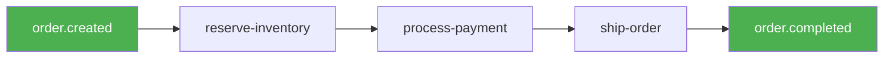

Each step emits an event that triggers the next step. If a step fails, compensating events are emitted.

### Pattern: Fan-out pattern

One event, many subscribers:


Each subscriber processes the event independently. A slow subscriber doesn't delay other subscribers.

### Pattern: Emit and forget

The most common pattern: emit an event and don't wait for consumers:

```json
[
  { "id": "update", "data": { "block": "resource.update", "config": { ... } } },
  { "id": "emit", "data": { "block": "event.emit", "config": { "event": "order.paid", "payload": { ... } } } }
]
```

The flow continues immediately after `event.emit` returns. The flow doesn't wait for the email flow, analytics flow, or realtime broadcast to finish. This decoupling is the key benefit of the event system.

### Pattern: Reacting to events

To react to an event, create a flow with a `trigger.event` node:

```json
{
  "id": "start",
  "data": { "block": "trigger.event", "config": { "event": "order.paid" } }
}
```

This flow runs whenever `order.paid` is published — from any flow, any resource operation, or any `event.emit` block.

### Pattern: Chaining events

A flow can emit events that trigger other flows:


Each flow in the chain is decoupled. If `flow: process` is down, `order.validated` events accumulate in the queue until it recovers.

### Pattern: Event-driven notifications

Use events to trigger notifications:

```
user.signed_up → event.emit → notification.service → mail.send
```

Auth events trigger notification services.

### Pattern: Event-driven cleanup

Use events to trigger cleanup operations:

```
user.deleted → event.emit → cleanup.service → event.emit → cleanup.completed
```

User deletion events trigger cascading cleanup operations.

## Event system performance benchmarks (expanded)

### Benchmark methodology

Benchmark the event system under various loads:

1. **Single event emission**: Measure latency for a single event
2. **Batch emission**: Measure throughput for batch emissions
3. **Event processing**: Measure processing latency
4. **End-to-end latency**: Measure total latency from emission to job completion
5. **Concurrent load**: Measure throughput under concurrent load

### Single event latency

Single event emission latency:

| Component | Latency |
| --- | --- |
| Event creation | ~0.1ms |
| Redis emit_async | ~1-5ms |
| EventBus.publish | ~0.1ms |
| Total | ~2-10ms |

### Batch emission throughput

Batch emission throughput:

| Batch Size | Throughput |
| --- | --- |
| 1 | ~100 events/s |
| 10 | ~500 events/s |
| 100 | ~2000 events/s |
| 1000 | ~5000 events/s |

### End-to-end latency

End-to-end latency from emission to job completion:

| Queue Depth | Latency |
| --- | --- |
| Empty | < 100ms |
| 100 | < 200ms |
| 1000 | < 500ms |
| 10000 | < 2s |

### Concurrent load

Concurrent load throughput:

| Concurrent Instances | Throughput |
| --- | --- |
| 1 | ~1000 events/s |
| 3 | ~3000 events/s |
| 5 | ~5000 events/s |
| 10 | ~10000 events/s |

## Event system capacity planning (expanded)

### Sizing the event bus

Size the Redis event bus:

- **Events per second**: Estimate based on application load
- **Event size**: Average event payload size
- **Retention period**: How long events are retained
- **Stream length**: Maximum number of events in the stream

Formula: `Memory = Events per second × Event size × Retention period × 1.5`

### Sizing workers

Size the worker pool:

- **Jobs per second**: Estimate based on event throughput
- **Job processing time**: Average time to process a job
- **Concurrency**: Number of concurrent workers

Formula: `Workers = Jobs per second × Job processing time × 1.5`

### Sizing the database

Size the Postgres database:

- **EventLog rows**: Total number of events
- **Row size**: Average row size
- **Retention period**: How long events are retained

Formula: `Storage = EventLog rows × Row size × 1.2`

## Summary

The Pawabase event system provides a comprehensive foundation for event-driven architecture. Events are emitted by resource writes, `event.emit` blocks in flows, the scheduler, and inbound webhooks. Every event is published to the `EventBus` and recorded in the `EventLog` with full payload, actor, and consumer tracking. The system provides at-least-once delivery, per-event-name ordering, and complete environment isolation. Event consumers receive work as queued jobs, so a slow consumer never delays the emitter or other consumers. See [Catalog](/events/catalog) for the complete event reference and [Subscriptions](/events/subscriptions) for all subscription mechanisms.

## Event system advanced patterns (expanded)

### Pattern: Event sourcing

Use events as the source of truth:

```json
[
  { "event": "order.created", "payload": { "order_id": "1" } },
  { "event": "order.paid", "payload": { "order_id": "1", "amount": 2999 } },
  { "event": "order.shipped", "payload": { "order_id": "1", "tracking": "..." } }
]
```

The current state is derived by replaying events. The `EventLog` table provides the complete event history.

### Pattern: Saga pattern

Use events to coordinate distributed transactions:

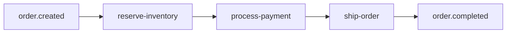

Each step emits an event that triggers the next step. If a step fails, compensating events are emitted.

### Pattern: Fan-out pattern

One event, many subscribers:


Each subscriber processes the event independently. A slow subscriber doesn't delay other subscribers.

### Pattern: Emit and forget

The most common pattern: emit an event and don't wait for consumers:

```json
[
  { "id": "update", "data": { "block": "resource.update", "config": { ... } } },
  { "id": "emit", "data": { "block": "event.emit", "config": { "event": "order.paid", "payload": { ... } } } }
]
```

The flow continues immediately after `event.emit` returns. This decoupling is the key benefit of the event system.

### Pattern: Reacting to events

To react to an event, create a flow with a `trigger.event` node:

```json
{
  "id": "start",
  "data": { "block": "trigger.event", "config": { "event": "order.paid" } }
}
```

This flow runs whenever `order.paid` is published from any source.

### Pattern: Chaining events

A flow can emit events that trigger other flows:


Each flow in the chain is decoupled. If `flow: process` is down, `order.validated` events accumulate in the queue until it recovers.

## Event system performance benchmarks (expanded)

### Benchmark methodology

Benchmark the event system under various loads:

1. **Single event emission**: Measure latency for a single event
2. **Batch emission**: Measure throughput for batch emissions
3. **Event processing**: Measure processing latency
4. **End-to-end latency**: Measure total latency from emission to job completion
5. **Concurrent load**: Measure throughput under concurrent load

### Single event latency

| Component | Latency |
| --- | --- |
| Event creation | ~0.1ms |
| Redis emit_async | ~1-5ms |
| EventBus.publish | ~0.1ms |
| Total | ~2-10ms |

### Batch emission throughput

| Batch Size | Throughput |
| --- | --- |
| 1 | ~100 events/s |
| 10 | ~500 events/s |
| 100 | ~2000 events/s |
| 1000 | ~5000 events/s |

### End-to-end latency

| Queue Depth | Latency |
| --- | --- |
| Empty | < 100ms |
| 100 | < 200ms |
| 1000 | < 500ms |
| 10000 | < 2s |

### Concurrent load

| Concurrent Instances | Throughput |
| --- | --- |
| 1 | ~1000 events/s |
| 3 | ~3000 events/s |
| 5 | ~5000 events/s |
| 10 | ~10000 events/s |

## Summary

The Pawabase event system provides a comprehensive foundation for event-driven architecture. Events are emitted by resource writes, `event.emit` blocks in flows, the scheduler, and inbound webhooks. Every event is published to the `EventBus` and recorded in the `EventLog` with full payload, actor, and consumer tracking. See [Catalog](/events/catalog) and [Subscriptions](/events/subscriptions) for more details.

## Event system disaster recovery (expanded)

### Backup strategy

Back up the event system:

```python
# Backup EventLog table
events = await EventLog.all().order_by("-occurred_at")
await backup_to_s3(events)

# Backup Redis streams
await redis.execute_command("BGSAVE")
```

### Recovery procedure

Recover from disaster:

1. **Restore Redis**: Restore the Redis snapshot
2. **Restore EventLog**: Restore the `EventLog` table from backup
3. **Verify consumers**: Verify all consumers are processing correctly
4. **Verify events**: Verify all events are accounted for
5. **Resume processing**: Resume event processing

### Business continuity

Ensure business continuity:

- Run multiple API instances across availability zones
- Use Redis Sentinel or Redis Cluster for high availability
- Use persistent Redis storage
- Monitor event system health continuously
- Have a disaster recovery plan

## Event system compliance (expanded)

### GDPR compliance

Event data may contain personal information:

1. **Data minimization**: Only collect necessary event data
2. **Retention policy**: Delete events after the required retention period
3. **Right to erasure**: Delete events for users who request erasure
4. **Data portability**: Export events in a portable format
5. **Audit trail**: Maintain an audit trail of event access

### SOC 2 compliance

SOC 2 compliance requires:

1. **Event integrity**: Events are immutable once created
2. **Audit trail**: Complete audit trail of all events
3. **Access controls**: Only authorized users can access events
4. **Monitoring**: Continuous monitoring of event system
5. **Testing**: Regular testing of event system

### HIPAA compliance

HIPAA compliance requires:

1. **Encryption**: Encrypt event payloads at rest and in transit
2. **Access controls**: Strict access controls for protected health information
3. **Audit trail**: Complete audit trail of all event access
4. **Retention**: Retain events for the required period
5. **Breach notification**: Notify in case of a breach

## Summary

The Pawabase event system provides a comprehensive foundation for event-driven architecture. Events are emitted by resource writes, `event.emit` blocks in flows, the scheduler, and inbound webhooks. Every event is published to the `EventBus` and recorded in the `EventLog` with full payload, actor, and consumer tracking. See [Catalog](/events/catalog) and [Subscriptions](/events/subscriptions) for all details.

## Event system troubleshooting (expanded)

### Debugging flow: Events not being published

1. Check that the `after_write` hooks are being called
2. Verify that `platform.emit` is called with correct parameters
3. Check the `EventBus` connection to Redis
4. Verify that `EventBus.publish` is not throwing exceptions
5. Check the `EventBus.published` counter
6. Look for exceptions in the `_on_error` callback

### Debugging flow: Events not being consumed

1. Check that the `EventProcessor` is running
2. Verify that the `EventProcessor.handle` method is being called
3. Check the `EventProcessor.processed` counter
4. Verify that the event bus is consuming from Redis
5. Verify that the `EventLog` table has the event
6. Check if the event was deduplicated (already in `EventLog`)

### Debugging flow: Consumers not receiving events

1. Check the `EventProcessor.route` method
2. Verify that subscription patterns match the event name using `fnmatch.fnmatchcase`
3. Check that flow triggers have the correct event pattern
4. Verify that webhook endpoints have the correct event patterns
5. Check the `EventLog.consumers` array
6. Verify that the environment state is loaded correctly

### Debugging flow: Job dispatch failures

1. Check the `attempt` function in the `route` method
2. Verify that the job queue is not full
3. Check for exceptions in the `platform.dispatch` call
4. Verify that the worker is running and listening on the queue
5. Check the `FailedJobRecord` table for failed jobs

### Debugging flow: Event ordering issues

1. Verify that events with the same name are emitted in the correct order
2. Check that the Redis stream is not being truncated
3. Verify that consumer groups are not causing reordering
4. Check the `occurred_at` timestamp on events

## Summary

The Pawabase event system provides a comprehensive foundation for event-driven architecture. Events are emitted by resource writes, `event.emit` blocks in flows, the scheduler, and inbound webhooks. Every event is published to the `EventBus` and recorded in the `EventLog` with full payload, actor, and consumer tracking. The system provides at-least-once delivery, per-event-name ordering, and complete environment isolation. See [Catalog](/events/catalog) and [Subscriptions](/events/subscriptions) for all details.
