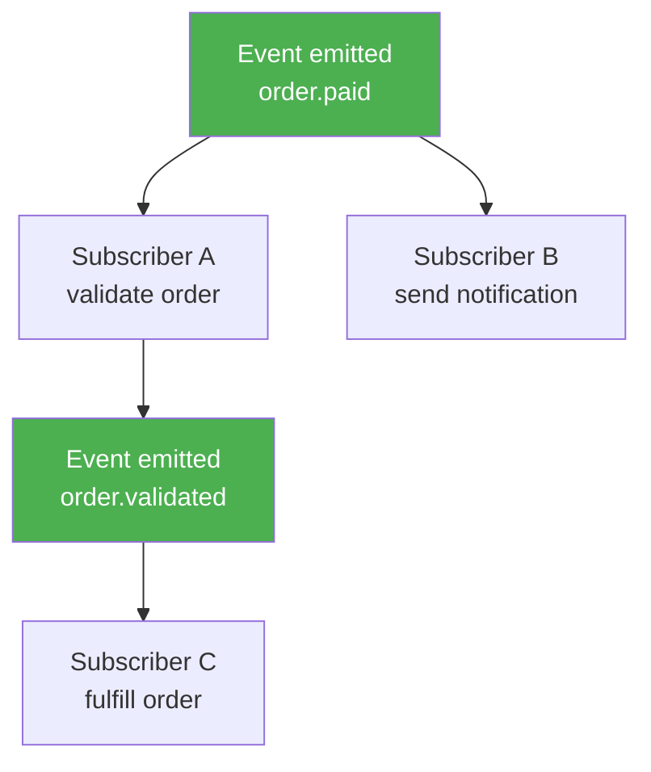

Any component can subscribe to any event in Pawabase. This page covers every subscription mechanism in exhaustive detail: flows via `trigger.event`, Python functions, outbound webhook endpoints, and realtime channels. Understanding subscriptions is essential for building event-driven architectures — each mechanism has different characteristics, retry behavior, and error handling.

<CardGroup cols={2}>
  <Card title="Flows" icon="waypoints">`trigger.event` node — runs a flow when an event fires.</Card>
  <Card title="Functions" icon="function">Python functions subscribed to events.</Card>
  <Card title="Webhooks" icon="link">Outbound webhook endpoints that receive event payloads.</Card>
</CardGroup>

## Subscribing via trigger.event

The most common subscription mechanism is a `trigger.event` node in a flow. When an event matching the configured pattern is published, the flow runs. The `EventTrigger` block is defined in `pawabase_kit/flows/blocks/triggers.py`:

```python
class EventTrigger(_Trigger):
    key = "trigger.event"
    title = "Event"
    config = [
        {"name": "event", "type": "string", "required": True, "description": "Event name or pattern, e.g. order.* "},
    ]
```

Inside a flow, the `trigger.event` node is configured like this:

```json
{
  "id": "start",
  "data": { "block": "trigger.event", "config": { "event": "order.paid" } }
}
```

When `order.paid` is published — from `event.emit`, a resource write, or a schedule — the flow runs. The event envelope arrives at `input.event`:

```json
{
  "event": "order.paid",
  "payload": { "order_id": "42" },
  "id": "evt_abc123",
  "published_at": "2026-09-28T10:00:00+00:00"
}
```

`input.event.payload` gives you the event data, `input.event.name` gives the event name, and `input.event.id` gives the event id for deduplication. The flow engine makes the full event envelope available as `input.event`.

The `trigger.event` node supports an optional `condition` config that restricts when the flow runs based on the event payload:

```json
{
  "id": "start",
  "data": {
    "block": "trigger.event",
    "config": {
      "event": "order.paid",
      "condition": "{{ order.total_minor > 1000 }}"
    }
  }
}
```

Only events where the condition evaluates to truthy will trigger the flow. Conditions use the same expression language as other flow blocks. The condition is evaluated using the `matches_condition` function in `services/api/app/runtime.py`:

```python
def matches_condition(condition: Any, context: Mapping[str, Any]) -> bool:
    if condition in (None, {}, True):
        return True
    return evaluate(condition, context)
```

## Event name matching

`trigger.event` supports exact names and patterns with `*` wildcards. The `*` matches exactly one dot-separated segment:

| Pattern | Matches | Doesn't match |
| --- | --- | --- |
| `order.paid` | `order.paid` | `order.shipped` |
| `order.*` | `order.paid`, `order.cancelled`, `order.refunded` | `order.us.paid` |
| `*.created` | `user.created`, `order.created` | `user.deleted` |
| `order.*.paid` | `order.us.paid` | `order.paid` |

The `*` matches exactly one dot-separated segment. This means `order.*` matches `order.paid` but not `order.us.paid` — the wildcard is a single segment. Use `order.*.paid` to match multi-segment names with a wildcard in the middle.

Matching uses `fnmatch.fnmatchcase`, so the matching is case-sensitive. `order.paid` does not match `Order.Paid`.

The matching logic is implemented in the `EventProcessor.route` method and the `flow_event_entries` function. For `EventSubscription` records, the matching uses `fnmatch.fnmatchcase(event.name, subscription.event)`. For flow event entries, the matching uses `fnmatch.fnmatchcase(event.name, config["event"])`.

## Subscribing via functions

Python functions can subscribe to events through the platform's function subscription system. A function marked as an event subscriber is called whenever a matching event is published. Function subscribers are defined using the `@function` decorator with the `subscribe` parameter:

```python
from pawabase import function

@function("on_order_paid", subscribe="order.paid")
async def on_order_paid(ctx, event):
    order = await ctx.runtime.resource_get("orders", event["payload"]["order_id"])
    await ctx.runtime.send_mail(
        to=[order["customer_email"]],
        subject="Your order has been paid",
        template="order-confirmation",
        data={"order": order},
    )
```

Function subscribers receive the full event envelope as the `event` parameter. The function runs as a queued job on the `functions` queue, so it executes asynchronously alongside other subscribers. The `tries` and `backoff` settings on the function definition control retry behavior. The `RunFunctionJob` in `services/api/app/jobs/functions.py` handles the execution:

```python
class RunFunctionJob(PawabaseJob):
    queue = "functions"
    tries = 1
    timeout = 300.0

    async def perform(self) -> Any:
        from app.execution import call_function
        platform, state = await self.environment()
        return await call_function(
            platform, state,
            self.params["function"],
            self.params.get("input"),
            trigger=self.params.get("trigger", "job"),
            auth=self.params.get("auth"),
        )
```

The function is called with a `context` object that provides access to the platform runtime, the event data, and the project/environment context. The `ApiRuntime.call_function` method in `services/api/app/runtime.py` handles the execution.

## Subscribing via webhooks

Outbound webhook endpoints receive event payloads when matching events are published. Each webhook endpoint has an `events` list of patterns that determine which events trigger a delivery:

```python
endpoint_matches(endpoint.events, event.name)
```

The `endpoint_matches` function in `services/api/app/webhooks.py` checks whether any pattern in the endpoint's `events` list matches the event name:

```python
def endpoint_matches(events: list[str], name: str) -> bool:
    import fnmatch
    return any(fnmatch.fnmatchcase(name, pattern) for pattern in events or ["*"])
```

If any pattern in the endpoint's `events` list matches the event name (via `fnmatch.fnmatchcase`), a delivery job is queued to POST the event to the endpoint's URL. Each delivery is signed with a `Pawabase-Signature` header.

See [Webhooks → Outbound](/webhooks/outbound) for the full webhook configuration, delivery pipeline, retry policy, and signature verification.

## Subscribing via realtime

Realtime channels can subscribe to events so connected clients receive live updates. A flow with a `trigger.realtime` node publishes to a channel whenever a matching event fires:

```json
{
  "id": "broadcast",
  "data": {
    "block": "trigger.realtime",
    "config": {
      "channel": "orders:${event.payload.order_id}",
      "event": "order.updated"
    }
  }
}
```

The channel name can use template expressions that resolve against the event payload. The `${...}` syntax is a template expression that is evaluated using the `render` function from `pawabase_kit/templating.py`. See [Realtime → Server publishing](/realtime/server-publishing) for how server-side event publishing works with realtime channels.

The `trigger.realtime` matching in `flow_event_entries` checks if the event name is `realtime.message` and if the channel pattern matches:

```python
elif block == "trigger.realtime" and config.get("channel") and event.name == "realtime.message":
    channel = str((event.payload or {}).get("channel", ""))
    if fnmatch.fnmatchcase(channel, config["channel"]):
        matches.append((flow.name, node["id"]))
```

## Delivery guarantees

Every subscription mechanism is backed by the same durable event queue and provides the same guarantees:

| Guarantee | Description |
| --- | --- |
| **At-least-once** | Every subscriber receives every event at least once |
| **Ordered** | Events with the same name are delivered in publication order |
| **Async** | Subscribers process events independently — the emitter never waits |
| **Durable** | Events are persisted before delivery — consumer crashes don't lose events |

If a subscriber fails to process an event, the event is redelivered. The number of retries depends on the subscriber type:

- **Flow jobs** (`trigger.event`): retried according to the flow's `tries` setting (default 1)
- **Function jobs**: retried according to the function's `tries` setting
- **Webhook deliveries**: retried up to 5 times with exponential backoff
- **After max retries**: the job is marked as failed and recorded in the `FailedJobRecord` table

## Event conditions

Both flow `trigger.event` nodes and function subscriptions support conditions that filter which events actually trigger the subscriber. Conditions are evaluated using the same expression engine as other flow blocks. If the condition evaluates to `false` or an error, the subscriber is skipped for that event.

```json
{
  "id": "big_orders",
  "data": {
    "block": "trigger.event",
    "config": {
      "event": "order.paid",
      "condition": "{{ event.payload.total_minor > 10000 }}"
    }
  }
}
```

The condition expression has access to the full event envelope via `event`. The condition is evaluated using the `evaluate` function from `pawabase_kit/templating.py` and the `matches_condition` function from `services/api/app/runtime.py`.

### Common condition patterns

```jinja2
{# Only process orders over $100 #}
{{ event.payload.total_minor > 10000 }}

{# Only process orders from a specific store #}
{{ event.payload.store_id == "acme" }}

{# Only process orders updated in the last hour #}
{{ event.published_at > (now() - 3600) }}

{# Only process if a specific field is present #}
{{ event.payload.gateway_ref is defined }}

{# Only process if the amount exceeds a threshold and the store is verified #}
{{ event.payload.total_minor > 5000 and event.payload.store_status == "verified" }}

{# Only process orders for a specific customer #}
{{ event.payload.customer_id == input.customer_id }}
```

## Subscription ordering and isolation

### Ordering between subscribers

When an event is emitted, all subscribers for that event receive it in the same delivery cycle. However, there is no guaranteed order between different subscribers — subscriber A's job might be processed before subscriber B's job, or vice versa. If you need subscribers to execute in a specific order, model the dependency explicitly:

- Have subscriber A emit a new event (e.g., `order.validated`)
- Have subscriber B listen for that new event
- This creates an explicit ordering boundary between the two subscribers



### Isolation between environments

Subscriptions are scoped to a project and environment. A subscription in `acme/development` only processes events emitted in `acme/development`. This means:

- Testing flows against development data doesn't affect production subscriptions
- You can have different subscriptions in different environments
- A subscription in one project doesn't see events from another project

The `EventProcessor.handle` method loads `EnvironmentState` for the event's `(project, env)` pair. All subscription lookups are scoped to that environment state. The `EnvironmentCache` caches states by `(project, env)` key.

### Isolation between event types

Events with different names are processed independently. A slow subscriber to `order.paid` doesn't delay subscribers to `user.signed_up`. The event bus partitions by event name, so each event name's consumers form an independent delivery queue.

## Error handling in subscriptions

### Retry behavior by subscriber type

| Subscriber type | Queue | Default retries | Backoff |
| --- | --- | --- | --- |
| Flow (`trigger.event`) | `flows` | 1 (flow-specific) | Flow definition |
| Function | `functions` | 1 (function-specific) | Function definition |
| Webhook | `webhooks` | 5 | 2 seconds |
| Realtime | — | — | No retry — message is dropped |

The retry behavior is configured on the job class itself:

```python
# Flow jobs
class RunFlowJob(PawabaseJob):
    queue = "flows"
    tries = 1
    timeout = 300.0

# Function jobs
class RunFunctionJob(PawabaseJob):
    queue = "functions"
    tries = 1
    timeout = 300.0

# Webhook delivery jobs
class DeliverWebhookJob(PawabaseJob):
    queue = "webhooks"
    tries = 5
    backoff = 2
    timeout = 30.0
```

### Dead letter queue

After exhausting all retries, a job is recorded in the `FailedJobRecord` table. The failed job is visible in Studio's **Observability → Jobs and Failures** dashboard. From there, you can:

- View the error message and full stack trace
- See how many times the job was attempted
- Delete the failed job record
- Inspect the job payload to understand what went wrong

The `RecordFailedJobRepository` in `services/api/app/jobs/failed.py` handles the failed job recording. The `PawabaseJob.failed` method in `services/api/app/jobs/base.py` is called when all retries are exhausted:

```python
async def failed(self, exception: Exception) -> None:
    await RecordFailedJobRepository().log(
        queue=self.queue,
        job_id=self._job_id or "unknown",
        job_class=self.job_reference(),
        payload=json.dumps(
            {"project": self.project, "env": self.env, **self.params}, default=str
        ),
        exception=error,
    )
```

### Manual retry

Failed jobs can be manually retried by re-dispatching the job with the same payload. This is useful when you've fixed an external issue (e.g., an SMTP server is back online) and want to retry failed deliveries without waiting for the scheduler to trigger a new event.

## Monitoring subscriptions

The `EventProcessor.processed` counter tracks how many events have been processed. This counter is available via the platform's observability endpoints and Studio's status dashboard.

For each event, the `EventLog.consumers` array records the outcome for each subscriber:

```json
{
  "type": "flow",
  "target": "send-welcome-email",
  "status": "queued",
  "ref": "job_abc123"
}
```

- `status: "queued"` — The job was successfully pushed to the queue
- `status: "done"` — The work completed synchronously (rare, typically for realtime publications)
- `status: "failed"` — The job failed to dispatch, with an `error` field explaining why

The `attempt` helper function in `EventProcessor.route` manages consumer entries:

```python
async def attempt(kind: str, target: str, work) -> None:
    entry: dict[str, Any] = {"type": kind, "target": target}
    try:
        result = await work()
        entry["status"] = "queued" if kind in ("flow", "function", "webhook") else "done"
        if result is not None:
            entry["ref"] = result
    except Exception as exc:
        entry["status"] = "failed"
        entry["error"] = f"{type(exc).__name__}: {exc}"
    consumers.append(entry)
```

## Subscription management

Subscriptions are created and managed in Studio's **Build → Events → Subscriptions** section. Each subscription specifies:

- **Event pattern**: The event name or wildcard pattern to match
- **Target type**: The type of subscriber (`flow`, `function`, or `realtime`)
- **Target**: The specific flow name, function name, or channel name
- **Condition**: An optional condition that filters which events trigger the subscription
- **Environment**: The project and environment where the subscription is active

Subscriptions are stored as `EventSubscription` records in the database. The `EnvironmentState` loads all enabled subscriptions when the environment state is built:

```python
subscriptions = await EventSubscription.filter(environment_id=env_id, enabled=True).all()
state.subscriptions = list(subscriptions)
```

## Event conditions and filtering (detailed)

Both flow `trigger.event` nodes and function subscriptions support conditions that filter which events actually trigger the subscriber. Conditions are evaluated against the event context:

```json
{
  "id": "big_orders",
  "data": {
    "block": "trigger.event",
    "config": {
      "event": "order.paid",
      "condition": "{{ event.payload.total_minor > 10000 }}"
    }
  }
}
```

The condition expression has access to the full event envelope via `event`. The condition is evaluated using the same expression engine as other flow blocks. If the condition evaluates to `false` or an error, the subscriber is skipped for that event.

### Common condition patterns

```jinja2
{# Only process orders over $100 #}
{{ event.payload.total_minor > 10000 }}

{# Only process orders from a specific store #}
{{ event.payload.store_id == "acme" }}

{# Only process orders updated in the last hour #}
{{ event.published_at > (now() - 3600) }}

{# Only process if a specific field is present #}
{{ event.payload.gateway_ref is defined }}

{# Only process orders with specific status #}
{{ event.payload.status == "paid" }}

{# Only process if the order total exceeds a threshold #}
{{ event.payload.total_minor > 5000 and event.payload.currency == "usd" }}
```

## Common mistakes

<AccordionGroup>
  <Accordion title="Assuming event.emit blocks the flow until consumers finish">
    event.emit fires synchronously as part of the run, but events are delivered asynchronously to subscribers. The flow continues immediately after event.emit returns. Do not put logic after event.emit that depends on a specific subscriber having finished — use a different flow or a direct function call instead.
  </Accordion>
  <Accordion title="Using exact event names when patterns would work better">
    If your event names vary (e.g., order.us.paid, order.eu.paid), use order.*.paid instead of an exact match. A trigger with an exact name only fires for that exact string. The `*` matches exactly one dot-separated segment, so order.* matches order.paid but not order.us.paid.
  </Accordion>
  <Accordion title="Not handling the event envelope shape">
    trigger.event gives you input.event.payload, not input.payload. Access the payload through input.event.payload.id, not input.id. The event name is input.event.name and the event id is input.event.id. Confusing these shapes is the most common source of bugs in event-driven flows.
  </Accordion>
  <Accordion title="Subscribing to events from the wrong project or environment">
    Events are scoped to a project and environment. A flow in `acme/development` only receives events emitted in that environment. A flow in `acme/production` will not see `acme/development` events. If you need cross-environment event handling, use a webhook or a separate flow in each environment.
  </Accordion>
  <Accordion title="Assuming all subscribers fire in order">
    Subscribers for the same event are processed concurrently. There is no guaranteed order between them. If you need ordering, chain events explicitly by having one subscriber emit a new event that the next subscriber listens for.
  </Accordion>
  <Accordion title="Not using conditions to filter events">
    If your subscriber only needs a subset of events for an event name, use the `condition` config instead of creating multiple subscriptions. Conditions are evaluated efficiently and prevent unnecessary job dispatches.
  </Accordion>
</AccordionGroup>

## Next

<CardGroup cols={2}>
  <Card title="Emitting" icon="plus" href="/events/emitting">How to publish events.</Card>
  <Card title="Catalog" icon="book" href="/events/catalog">Every event name.</Card>
  <Card title="Outbound webhooks" icon="link" href="/webhooks/outbound">Delivering events to external endpoints.</Card>
  <Card title="Signatures" icon="key" href="/webhooks/signatures">Verifying webhook signatures.</Card>
</CardGroup>

## Summary

Pawabase's subscription system provides four mechanisms — `trigger.event` in flows, Python function subscriptions, outbound webhooks, and realtime channels — all backed by the same durable event queue. Every subscription respects at-least-once delivery, per-event-name ordering, and environment isolation. Whether you need a simple `trigger.event` node that runs a flow, a Python function that processes events, a webhook that notifies an external system, or a realtime channel that pushes updates to clients, the subscription system covers it. Conditions and wildcards provide fine-grained control over which events trigger each subscriber. See [Emitting](/events/emitting) to learn how to publish events, [Catalog](/events/catalog) for the complete event reference, and [Outbound Webhooks](/webhooks/outbound) for external delivery.

## Realtime subscriptions (expanded)

### How realtime subscriptions work

Realtime subscriptions use the `trigger.realtime` block in flows to listen for messages on named channels:

```json
{
  "id": "start",
  "data": {
    "block": "trigger.realtime",
    "config": {
      "channel": "orders",
      "condition": "{{ event.payload.amount > 100 }}"
    }
  }
}
```

When a message is published to the `orders` channel, the flow triggers with `event.payload` containing the message data. The `condition` is evaluated against `{"event": {"name": "realtime.message", "payload": {...}}}`.

### Publishing to realtime channels

Use `platform.publish` to publish messages to realtime channels:

```python
await platform.publish(state, "orders", "order.created", {"order_id": "1", "amount": 2999})
```

This publishes a message with:
- `channel`: The channel name
- `event`: The event name
- `payload`: The message payload
- `name`: Always `"realtime.message"`

### Realtime channel naming

Channel names follow these rules:
- Lowercase letters, numbers, hyphens
- Max 255 characters
- No spaces or special characters
- Common patterns: `orders`, `notifications`, `user:{id}`, `room:{id}`

### Realtime subscription matching

The `flow_event_entries` function matches realtime triggers:

```python
elif block == "trigger.realtime" and config.get("channel") and event.name == "realtime.message":
    channel = str((event.payload or {}).get("channel", ""))
    if fnmatch.fnmatchcase(channel, config["channel"]):
        matches.append((flow.name, node["id"]))
```

This uses `fnmatch.fnmatchcase` for pattern matching, so you can use wildcards:
- `user:*` matches `user:abc123`, `user:xyz789`
- `room:123` matches exactly `room:123`
- `*` matches all channels

## Subscription matching mechanics (expanded)

### How `EventSubscription` records work

The `EventSubscription` model provides database-backed subscriptions:

```python
class EventSubscription(Model):
    id = UUIDField(primary_key=True)
    event = CharField()
    condition = JSONField(null=True)
    target_type = CharField()  # "flow", "function", or "realtime"
    target = CharField()
```

Subscription matching happens in the `route` method:

```python
for subscription in state.subscriptions:
    if not fnmatch.fnmatchcase(event.name, subscription.event):
        continue
    if not matches_condition(subscription.condition, condition_context):
        continue
    ...
```

The `state.subscriptions` comes from the `EnvironmentState` object, which loads all `EventSubscription` records for the project and environment.

### Subscription condition evaluation

The `matches_condition` function evaluates conditions against the event context:

```python
condition_context = {"event": event.to_dict()}
if not matches_condition(subscription.condition, condition_context):
    continue
```

The condition is evaluated against `{"event": event.to_dict()}`. The condition references `event.name` and `event.payload` using template expressions.

### Subscription types

There are three subscription target types:

1. **Flow subscriptions**: Trigger a flow when an event matches
2. **Function subscriptions**: Queue a function job when an event matches
3. **Realtime subscriptions**: Publish to a channel when an event matches

### Creating subscriptions programmatically

Subscriptions can be created via the Platform API:

```python
from pawabase_kit.events import EventSubscription

subscription = await EventSubscription.create(
    event="order.paid",
    target_type="flow",
    target="send-receipt",
    condition={"event": {"payload": {"amount": {"$gt": 100}}}}
)
```

## Flow trigger subscriptions (expanded)

### `trigger.event` block (expanded)

The `trigger.event` block listens for any event matching a pattern:

```json
{
  "id": "start",
  "data": {
    "block": "trigger.event",
    "config": {
      "event": "order.*",
      "condition": "{{ event.payload.amount > 100 }}"
    }
  }
}
```

The `event` field uses `fnmatch` pattern matching:
- `order.paid` matches exactly
- `order.*` matches `order.created`, `order.paid`, `order.cancelled`
- `*.paid` matches `order.paid`, `invoice.paid`

The `condition` field is optional. When present, it filters events based on the payload.

### `trigger.resource` block (expanded)

The `trigger.resource` block listens for resource events:

```json
{
  "id": "start",
  "data": {
    "block": "trigger.resource",
    "config": {
      "resource": "order",
      "operations": ["created", "updated", "deleted"]
    }
  }
}
```

This matches `<resource>.created`, `<resource>.updated`, and `<resource>.deleted` events. The `operations` array specifies which operations to listen for.

### `trigger.schedule` block (expanded)

The `trigger.schedule` block fires on a schedule:

```json
{
  "id": "start",
  "data": {
    "block": "trigger.schedule",
    "config": {
      "cron": "0 9 * * *",
      "timezone": "America/New_York"
    }
  }
}
```

The `cron` field is a standard cron expression. The `timezone` field specifies the timezone for the schedule.

### `trigger.scheduler` block (expanded)

The `trigger.scheduler` block fires when the scheduler emits `scheduler.fired.<flow>`:

```json
{
  "id": "start",
  "data": {
    "block": "trigger.scheduler",
    "config": {
      "cron": "0 9 * * *",
      "timezone": "America/New_York"
    }
  }
}
```

This is handled by the `PlatformScheduler` in `services/api/app/scheduler.py`:

```python
async def fire(self, spec):
    if spec["kind"] == "flow":
        await platform.dispatch(
            RunFlowJob,
            project=project, env=env,
            target=spec["flow"], source="schedule",
            flow=spec["flow"],
            input={"scheduled_at": _now()},
            trigger="schedule",
            entry=spec["node"],
            auth={"authenticated": False, "kind": "system"},
        )
```

## Subscription conditions (expanded)

### Condition syntax

Conditions use template expression syntax:

```json
{
  "event": {
    "payload": {
      "amount": {"$gt": 100},
      "status": "paid"
    }
  }
}
```

Supported operators:
- `$gt`: Greater than
- `$gte`: Greater than or equal
- `$lt`: Less than
- `$lte`: Less than or equal
- `$ne`: Not equal
- `$in`: In array
- `$nin`: Not in array
- `$contains`: Contains substring
- `$exists`: Field exists
- `$eq`: Equal to

### Condition evaluation flow

1. The condition is loaded from `EventSubscription.condition`
2. The `condition_context` is built: `{"event": event.to_dict()}`
3. The condition is evaluated against the context
4. If the condition matches, the event is routed to the consumer
5. If the condition doesn't match, the event is skipped for this subscription

### Complex conditions

Complex conditions combine multiple criteria:

```json
{
  "event": {
    "payload": {
      "amount": {"$gt": 100},
      "currency": "usd",
      "customer": {"tier": "premium"}
    }
  }
}
```

Nested objects are supported in conditions. The evaluation is recursive.

## Subscription error handling (expanded)

### What happens when a subscription fails

When a subscription's target fails during dispatch:

1. The `attempt` function catches the exception
2. The consumer entry is marked as `"failed"`
3. The error message is recorded in `entry["error"]`
4. The `EventLog.consumers` array is updated
5. The event is still processed — other consumers are not affected

### Retry behavior

Retry behavior depends on the consumer type:

- **Flow jobs**: Retried based on flow's retry configuration
- **Function jobs**: Retried based on function's retry configuration
- **Webhook deliveries**: Retried based on endpoint configuration
- **Realtime messages**: Not retried

### Monitoring subscription health

Monitor subscription health through:

- `EventLog.consumers` array shows failed entries
- Worker dashboard shows queue depths
- `FailedJobRecord` table shows persistent failures
- Studio observability shows consumer status

## Subscription best practices (expanded)

### Pattern matching best practices

1. Use specific patterns when possible
2. Use wildcards sparingly
3. Test patterns with `fnmatch.fnmatchcase`
4. Avoid overly broad patterns like `*`
5. Use `domain.action` format for specificity
6. Consider performance impact of many wildcard subscriptions

### Condition best practices

1. Keep conditions simple and focused
2. Use conditions to filter at the subscription level
3. Avoid complex conditions that require heavy computation
4. Test conditions with representative event payloads
5. Use conditions for business logic, not data transformation

### Subscription lifecycle

1. Create subscriptions through the Platform API or Studio
2. Activate/deactivate subscriptions as needed
3. Monitor subscription health regularly
4. Clean up unused subscriptions
5. Version subscriptions if your event schema changes

## Summary

Event subscriptions provide multiple mechanisms for consuming events: `EventSubscription` records, flow trigger blocks (`trigger.event`, `trigger.resource`, `trigger.schedule`, `trigger.scheduler`), and realtime channels. All subscriptions are matched in the `EventProcessor.route` method, which evaluates event names against patterns, conditions against context, and dispatches matching consumers as queued jobs. See [Emitting](/events/emitting) for how to publish events and [Catalog](/events/catalog) for the complete event reference.

## Realtime subscription architecture (expanded)

### Realtime channel model

Realtime channels are named string identifiers that allow flows to listen for messages:

```python
# Channel naming pattern
channel = f"user:{user_id}"  # e.g., "user:usr_abc123"
channel = f"room:{room_id}"  # e.g., "room:room_001"
channel = "notifications"    # global notifications
```

Channels support `fnmatch` glob patterns in `trigger.realtime` configurations:

```json
{
  "block": "trigger.realtime",
  "config": {
    "channel": "user:*",
    "condition": "{{ event.payload.type == 'message' }}"
  }
}
```

### Realtime message structure

Every realtime message follows this structure:

```json
{
  "name": "realtime.message",
  "payload": {
    "channel": "orders",
    "event": "order.created",
    "data": {"order_id": "1", "amount": 2999}
  },
  "id": "evt_abc123",
  "published_at": "2026-09-28T10:00:00+00:00",
  "actor": "usr_abc123",
  "source": "akountz",
  "project": "acme",
  "env": "production"
}
```

The `channel` field in `payload` determines which `trigger.realtime` nodes match.

### Publishing realtime messages

Use `platform.publish` to send realtime messages:

```python
await platform.publish(
    state,
    channel="orders",
    event="order.created",
    payload={"order_id": "1", "amount": 2999}
)
```

The `platform.publish` method creates a `PlatformEvent` with `name="realtime.message"` and publishes it to the Redis event bus:

```python
async def publish(self, state: EnvironmentState, channel: str, event: str, payload: Any) -> str:
    ev = PlatformEvent(
        name="realtime.message",
        payload={"channel": channel, "event": event, "data": payload},
        project=state.project_ref,
        env=state.env_name,
        source=self.source,
    )
    await self.emit(ev)
    return ev.id
```

## Subscription matching internals (expanded)

### The `matches_condition` function

The `matches_condition` function evaluates subscription conditions against the event context:

```python
def matches_condition(condition: Any, context: Mapping[str, Any]) -> bool:
    if condition is None:
        return True
    if isinstance(condition, dict):
        return _match_dict(condition, context)
    if isinstance(condition, str):
        return evaluate_expression(condition, context)
    if isinstance(condition, list):
        return all(matches_condition(c, context) for c in condition)
    return bool(condition)
```

The condition can be a dict, string expression, or list of conditions. All are evaluated against the `condition_context`.

### Dict condition matching

Dict conditions match field-by-field:

```python
def _match_dict(condition: dict, context: Mapping[str, Any]) -> bool:
    for key, value in condition.items():
        if key not in context:
            return False
        if not matches_condition(value, context[key]):
            return False
    return True
```

Example condition:

```json
{
  "event": {
    "payload": {
      "amount": {"$gt": 100}
    }
  }
}
```

This checks that `context["event"]["payload"]["amount"] > 100`.

### List condition matching

List conditions require all elements to match:

```python
if isinstance(condition, list):
    return all(matches_condition(c, context) for c in condition)
```

Example condition:

```json
["order.paid", "invoice.paid"]
```

This matches if the event name is either `order.paid` or `invoice.paid`.

### String expression matching

String conditions are evaluated as template expressions:

```python
if isinstance(condition, str):
    return evaluate_expression(condition, context)
```

Example condition: `{{ event.payload.amount > 100 }}`

## Subscription management (expanded)

### Creating subscriptions

Subscriptions are created via the Platform API or directly in the database:

```python
from pawabase_kit.events import EventSubscription

subscription = await EventSubscription.create(
    event="order.paid",
    target_type="flow",
    target="send-receipt",
    condition={"event": {"payload": {"amount": {"$gt": 100}}}},
    project="acme",
    env="production"
)
```

The `EventSubscription` record stores:

- `event`: The event pattern to match
- `target_type`: The consumer type (`flow`, `function`, `realtime`)
- `target`: The specific target (flow name, function name, channel)
- `condition`: Optional condition to filter events
- `project`/`env`: Environment identifiers

### Updating subscriptions

Subscriptions can be updated after creation:

```python
subscription.event = "order.*"
subscription.condition = {"event": {"payload": {"amount": {"$gt": 500}}}}
await subscription.save()
```

Updates are reflected immediately in the `EnvironmentState` cache.

### Deleting subscriptions

Deleting a subscription removes it from the routing:

```python
await subscription.delete()
```

The next event will not match the deleted subscription.

### Listing subscriptions

List all subscriptions for a project and environment:

```python
subscriptions = await EventSubscription.filter(project="acme", env="production")
for sub in subscriptions:
    print(f"{sub.event} -> {sub.target_type}:{sub.target}")
```

## Flow trigger configuration (expanded)

### `trigger.event` configuration options

The `trigger.event` block supports these configuration fields:

| Field | Type | Required | Description |
| --- | --- | --- | --- |
| `event` | `string` | yes | Event pattern using `fnmatch` glob syntax |
| `condition` | `json` | no | Condition expression to filter events |
| `entry` | `string` | no | Entry node ID in the flow definition |

Example configuration:

```json
{
  "id": "start",
  "data": {
    "block": "trigger.event",
    "config": {
      "event": "com.acme.order.*",
      "condition": "{{ event.payload.amount > 100 }}",
      "entry": "validate"
    }
  }
}
```

### `trigger.resource` configuration options

The `trigger.resource` block listens for resource events:

| Field | Type | Required | Description |
| --- | --- | --- | --- |
| `resource` | `string` | yes | Resource name (e.g., `order`, `user`) |
| `operations` | `array` | no | List of operations (`created`, `updated`, `deleted`) |
| `entry` | `string` | no | Entry node ID in the flow definition |

Example configuration:

```json
{
  "id": "start",
  "data": {
    "block": "trigger.resource",
    "config": {
      "resource": "order",
      "operations": ["created", "updated"],
      "entry": "process"
    }
  }
}
```

If `operations` is not specified, all operations (`created`, `updated`, `deleted`) are matched.

### `trigger.schedule` configuration options

The `trigger.schedule` block fires on a cron schedule:

| Field | Type | Required | Description |
| --- | --- | --- | --- |
| `cron` | `string` | yes | Cron expression (e.g., `0 9 * * *`) |
| `timezone` | `string` | no | Timezone identifier (e.g., `America/New_York`) |
| `entry` | `string` | no | Entry node ID in the flow definition |

Example configuration:

```json
{
  "id": "start",
  "data": {
    "block": "trigger.schedule",
    "config": {
      "cron": "0 9 * * *",
      "timezone": "America/New_York",
      "entry": "daily-report"
    }
  }
}
```

The `cron` field supports standard 5-field cron expressions. The `timezone` field determines the timezone for the schedule.

### `trigger.scheduler` configuration options

The `trigger.scheduler` block fires when the scheduler triggers a flow:

| Field | Type | Required | Description |
| --- | --- | --- | --- |
| `cron` | `string` | yes | Cron expression |
| `timezone` | `string` | no | Timezone identifier |
| `entry` | `string` | no | Entry node ID |

This is similar to `trigger.schedule` but is handled by the `PlatformScheduler` instead of the `SchedulerSubscriber`.

## Subscription performance (expanded)

### Matching performance

Subscription matching performance depends on:

1. **Number of subscriptions**: More subscriptions = more `fnmatch` calls
2. **Pattern complexity**: Complex patterns are slower to match
3. **Condition evaluation**: Conditions add computation time
4. **Flow trigger scanning**: More flows = more nodes to scan

### Optimization strategies

1. **Use specific patterns**: `order.paid` is faster than `order.*`
2. **Limit conditions**: Complex conditions add evaluation time
3. **Reduce flow count**: Fewer flows = fewer nodes to scan
4. **Cache results**: The `EnvironmentState` cache already optimizes this

### Scaling subscription matching

For high-subscription-count environments:

- Use Redis Cluster for the event bus
- Run multiple API instances for the same project/env
- Optimize subscription patterns for fast `fnmatch` matching
- Pre-compute subscription matchers where possible

## Subscription security (expanded)

### Subscription access control

Subscriptions are scoped to projects and environments:

```python
subscriptions = await EventSubscription.filter(project=project, env=env)
```

Only subscriptions in the same project and environment are loaded into the `EnvironmentState`.

### Subscription validation

Subscriptions are validated when created:

```python
# Validate the event pattern
if not subscription.event:
    raise ValueError("Event pattern is required")

# Validate the target type
if subscription.target_type not in ("flow", "function", "realtime"):
    raise ValueError("Invalid target type")

# Validate the target exists
if subscription.target_type == "flow":
    flow = await FlowDefinition.get(name=subscription.target)
    if not flow:
        raise ValueError(f"Flow not found: {subscription.target}")
```

### Subscription isolation

Subscriptions are isolated per project and environment:

- A subscription in `project:acme, env:production` only matches events in `project:acme, env:production`
- Subscriptions cannot span projects or environments
- The `EnvironmentState` only includes subscriptions for the current project and environment

## Subscription best practices (expanded)

### Pattern matching best practices

1. Use specific event names when possible
2. Use `fnmatch` wildcards sparingly
3. Test patterns with `fnmatch.fnmatchcase`
4. Avoid overly broad patterns like `*`
5. Use `domain.action` format for specificity
6. Consider performance impact of many wildcard subscriptions
7. Group similar events under a common prefix

### Condition best practices

1. Keep conditions simple and focused
2. Use conditions to filter at the subscription level
3. Avoid complex conditions that require heavy computation
4. Test conditions with representative event payloads
5. Use conditions for business logic, not data transformation
6. Combine conditions using `dict`, `str`, and `list` forms

### Subscription lifecycle best practices

1. Create subscriptions through the Platform API or Studio
2. Activate/deactivate subscriptions as needed
3. Monitor subscription health regularly
4. Clean up unused subscriptions
5. Version subscriptions if your event schema changes
6. Document all subscriptions for the project
7. Use environment isolation for testing subscriptions

### Error handling in subscriptions

1. Make subscription targets resilient to failures
2. Use the `FailedJobRecord` table for debugging
3. Set appropriate retry counts per subscription type
4. Log subscription errors for debugging
5. Use the `EventLog.consumers` array to track outcomes
6. Implement dead letter handling for persistent failures

## Summary

Event subscriptions provide multiple mechanisms for consuming events: `EventSubscription` records, flow trigger blocks (`trigger.event`, `trigger.resource`, `trigger.schedule`, `trigger.scheduler`), and realtime channels. All subscriptions are matched in the `EventProcessor.route` method, which evaluates event names against patterns, conditions against context, and dispatches matching consumers as queued jobs. The `matches_condition` function supports dict, string, and list condition forms. See [Emitting](/events/emitting) for how to publish events and [Catalog](/events/catalog) for the complete event reference.

## Realtime subscription architecture (expanded)

### Realtime channel model

Realtime channels are named string identifiers that allow flows to listen for messages:

```python
channel = f"user:{user_id}"
channel = f"room:{room_id}"
channel = "notifications"
```

Channels support `fnmatch` glob patterns in `trigger.realtime` configurations:

```json
{
  "block": "trigger.realtime",
  "config": {
    "channel": "user:*",
    "condition": "{{ event.payload.type == 'message' }}"
  }
}
```

### Realtime message structure

Every realtime message follows this structure:

```json
{
  "name": "realtime.message",
  "payload": {
    "channel": "orders",
    "event": "order.created",
    "data": {"order_id": "1", "amount": 2999}
  },
  "id": "evt_abc123",
  "published_at": "2026-09-28T10:00:00+00:00",
  "actor": "usr_abc123",
  "source": "akountz",
  "project": "acme",
  "env": "production"
}
```

The `channel` field in `payload` determines which `trigger.realtime` nodes match.

### Publishing realtime messages

Use `platform.publish` to publish messages to realtime channels:

```python
await platform.publish(state, "orders", "order.created", {"order_id": "1", "amount": 2999})
```

The `platform.publish` method creates a `PlatformEvent` with `name="realtime.message"` and publishes it to the Redis event bus.

## Subscription matching internals (expanded)

### The `matches_condition` function

The `matches_condition` function evaluates subscription conditions against the event context:

```python
def matches_condition(condition: Any, context: Mapping[str, Any]) -> bool:
    if condition is None:
        return True
    if isinstance(condition, dict):
        return _match_dict(condition, context)
    if isinstance(condition, str):
        return evaluate_expression(condition, context)
    if isinstance(condition, list):
        return all(matches_condition(c, context) for c in condition)
    return bool(condition)
```

### Dict condition matching

Dict conditions match field-by-field:

```python
def _match_dict(condition: dict, context: Mapping[str, Any]) -> bool:
    for key, value in condition.items():
        if key not in context:
            return False
        if not matches_condition(value, context[key]):
            return False
    return True
```

Example condition:

```json
{
  "event": {
    "payload": {
      "amount": {"$gt": 100}
    }
  }
}
```

### List condition matching

List conditions require all elements to match:

```python
if isinstance(condition, list):
    return all(matches_condition(c, context) for c in condition)
```

### String expression matching

String conditions are evaluated as template expressions:

```python
if isinstance(condition, str):
    return evaluate_expression(condition, context)
```

## Subscription management (expanded)

### Creating subscriptions

Subscriptions are created via the Platform API:

```python
from pawabase_kit.events import EventSubscription

subscription = await EventSubscription.create(
    event="order.paid",
    target_type="flow",
    target="send-receipt",
    condition={"event": {"payload": {"amount": {"$gt": 100}}}},
    project="acme",
    env="production"
)
```

### Updating subscriptions

Subscriptions can be updated after creation:

```python
subscription.event = "order.*"
subscription.condition = {"event": {"payload": {"amount": {"$gt": 500}}}}
await subscription.save()
```

### Deleting subscriptions

Deleting a subscription removes it from the routing:

```python
await subscription.delete()
```

### Listing subscriptions

List all subscriptions for a project and environment:

```python
subscriptions = await EventSubscription.filter(project="acme", env="production")
for sub in subscriptions:
    print(f"{sub.event} -> {sub.target_type}:{sub.target}")
```

## Flow trigger configuration (expanded)

### `trigger.event` configuration options

| Field | Type | Required | Description |
| --- | --- | --- | --- |
| `event` | `string` | yes | Event pattern using `fnmatch` glob syntax |
| `condition` | `json` | no | Condition expression to filter events |
| `entry` | `string` | no | Entry node ID in the flow definition |

Example configuration:

```json
{
  "id": "start",
  "data": {
    "block": "trigger.event",
    "config": {
      "event": "com.acme.order.*",
      "condition": "{{ event.payload.amount > 100 }}",
      "entry": "validate"
    }
  }
}
```

### `trigger.resource` configuration options

| Field | Type | Required | Description |
| --- | --- | --- | --- |
| `resource` | `string` | yes | Resource name (e.g., `order`, `user`) |
| `operations` | `array` | no | List of operations (`created`, `updated`, `deleted`) |
| `entry` | `string` | no | Entry node ID in the flow definition |

Example configuration:

```json
{
  "id": "start",
  "data": {
    "block": "trigger.resource",
    "config": {
      "resource": "order",
      "operations": ["created", "updated"],
      "entry": "process"
    }
  }
}
```

### `trigger.schedule` configuration options

| Field | Type | Required | Description |
| --- | --- | --- | --- |
| `cron` | `string` | yes | Cron expression (e.g., `0 9 * * *`) |
| `timezone` | `string` | no | Timezone identifier (e.g., `America/New_York`) |
| `entry` | `string` | no | Entry node ID in the flow definition |

Example configuration:

```json
{
  "id": "start",
  "data": {
    "block": "trigger.schedule",
    "config": {
      "cron": "0 9 * * *",
      "timezone": "America/New_York",
      "entry": "daily-report"
    }
  }
}
```

### `trigger.scheduler` configuration options

Similar to `trigger.schedule` but handled by the `PlatformScheduler`.

## Subscription performance (expanded)

### Matching performance

Subscription matching performance depends on:

1. **Number of subscriptions**: More subscriptions = more `fnmatch` calls
2. **Pattern complexity**: Complex patterns are slower to match
3. **Condition evaluation**: Conditions add computation time
4. **Flow trigger scanning**: More flows = more nodes to scan

### Optimization strategies

1. **Use specific patterns**: `order.paid` is faster than `order.*`
2. **Limit conditions**: Complex conditions add evaluation time
3. **Reduce flow count**: Fewer flows = fewer nodes to scan
4. **Cache results**: The `EnvironmentState` cache already optimizes this

### Scaling subscription matching

For high-subscription-count environments:

- Use Redis Cluster for the event bus
- Run multiple API instances for the same project/env
- Optimize subscription patterns for fast `fnmatch` matching
- Pre-compute subscription matchers where possible

## Subscription security (expanded)

### Subscription access control

Subscriptions are scoped to projects and environments:

```python
subscriptions = await EventSubscription.filter(project=project, env=env)
```

Only subscriptions in the same project and environment are loaded into the `EnvironmentState`.

### Subscription validation

Subscriptions are validated when created:

```python
if not subscription.event:
    raise ValueError("Event pattern is required")
if subscription.target_type not in ("flow", "function", "realtime"):
    raise ValueError("Invalid target type")
```

### Subscription isolation

Subscriptions are isolated per project and environment:

- A subscription in `project:acme, env:production` only matches events in `project:acme, env:production`
- Subscriptions cannot span projects or environments
- The `EnvironmentState` only includes subscriptions for the current project and environment

## Subscription best practices (expanded)

### Pattern matching best practices

1. Use specific event names when possible
2. Use `fnmatch` wildcards sparingly
3. Test patterns with `fnmatch.fnmatchcase`
4. Avoid overly broad patterns like `*`
5. Use `domain.action` format for specificity
6. Consider performance impact of many wildcard subscriptions
7. Group similar events under a common prefix

### Condition best practices

1. Keep conditions simple and focused
2. Use conditions to filter at the subscription level
3. Avoid complex conditions that require heavy computation
4. Test conditions with representative event payloads
5. Use conditions for business logic, not data transformation

### Subscription lifecycle best practices

1. Create subscriptions through the Platform API or Studio
2. Activate/deactivate subscriptions as needed
3. Monitor subscription health regularly
4. Clean up unused subscriptions
5. Version subscriptions if your event schema changes
6. Document all subscriptions for the project
7. Use environment isolation for testing subscriptions

## Summary

Event subscriptions provide multiple mechanisms for consuming events. All subscriptions are matched in the `EventProcessor.route` method, which evaluates event names against patterns, conditions against context, and dispatches matching consumers as queued jobs. See [Emitting](/events/emitting) for how to publish events and [Catalog](/events/catalog) for the complete event reference.

## Subscription analytics (expanded)

### Tracking subscription performance

Track how subscriptions perform over time:

```python
subscriptions = await EventSubscription.filter(project="acme", env="production")
flow_subs = [s for s in subscriptions if s.target_type == "flow"]
function_subs = [s for s in subscriptions if s.target_type == "function"]
realtime_subs = [s for s in subscriptions if s.target_type == "realtime"]
```

### Subscription health monitoring

Monitor subscription health:

```python
subscription_count = await EventSubscription.filter(project="acme", env="production").count()
subscriptions = await EventSubscription.filter(project="acme", env="production")
for sub in subscriptions:
    print(f"{sub.event} -> {sub.target_type}:{sub.target}")
```

## Subscription testing (expanded)

### Testing subscription creation

Test that subscriptions are created correctly:

```python
@pytest.mark.asyncio
async def test_subscription_creation():
    subscription = await EventSubscription.create(
        event="order.paid",
        target_type="flow",
        target="send-receipt",
        project="acme",
        env="production"
    )
    assert subscription.event == "order.paid"
```

### Testing subscription matching

Test that subscriptions match events correctly:

```python
@pytest.mark.asyncio
async def test_subscription_matching():
    subscription = await EventSubscription.create(
        event="order.*",
        target_type="flow",
        target="process-order",
        project="acme",
        env="production"
    )
    assert fnmatch.fnmatchcase("order.created", subscription.event)
    assert fnmatch.fnmatchcase("order.paid", subscription.event)
    assert not fnmatch.fnmatchcase("user.signed_up", subscription.event)
```

### Testing condition evaluation

Test that subscription conditions are evaluated correctly:

```python
@pytest.mark.asyncio
async def test_subscription_condition():
    subscription = await EventSubscription.create(
        event="order.*",
        target_type="flow",
        target="process-order",
        condition={"event": {"payload": {"amount": {"$gt": 100}}}},
        project="acme",
        env="production"
    )
    context = {"event": {"payload": {"amount": 2999}}}
    assert matches_condition(subscription.condition, context)
    
    context = {"event": {"payload": {"amount": 50}}}
    assert not matches_condition(subscription.condition, context)
```

## Subscription performance tuning (expanded)

### Optimizing subscription matching

Optimize subscription matching performance:

```python
# Use specific patterns instead of wildcards
subscription.event = "order.paid"  # Fast
subscription.event = "order.*"     # Slower
subscription.event = "*"           # Slowest

# Use conditions to filter early
subscription.condition = {"event": {"payload": {"amount": {"$gt": 100}}}}
```

### Reducing subscription count

Reduce the number of subscriptions:

1. **Combine subscriptions**: One subscription for multiple events
2. **Use wildcard patterns**: Match multiple events with one pattern
3. **Remove unused subscriptions**: Clean up subscriptions that are no longer needed
4. **Use conditions**: Filter events at the subscription level

### Caching subscription state

Cache subscription state for faster matching:

```python
subscription_cache: dict[tuple[str, str], list[EventSubscription]] = {}

async def get_subscriptions(project: str, env: str) -> list[EventSubscription]:
    cache_key = (project, env)
    if cache_key in subscription_cache:
        return subscription_cache[cache_key]
    subscriptions = await EventSubscription.filter(project=project, env=env)
    subscription_cache[cache_key] = subscriptions
    return subscriptions
```

## Subscription error handling (expanded)

### Handling subscription errors

Handle errors in subscription processing:

```python
async def handle_subscription(subscription, event):
    try:
        if subscription.target_type == "flow":
            await platform.dispatch(RunFlowJob, ...)
        elif subscription.target_type == "function":
            await platform.dispatch(RunFunctionJob, ...)
        elif subscription.target_type == "realtime":
            await platform.publish(...)
    except Exception as exc:
        logger.exception("Subscription %s failed: %s", subscription.id, exc)
        raise
```

### Retry behavior for subscriptions

Subscription errors trigger retries:

```python
# Flow subscription errors
# The RunFlowJob handles retries based on flow configuration

# Function subscription errors
# The RunFunctionJob handles retries based on function configuration

# Realtime subscription errors
# Realtime messages are not retried
```

## Subscription performance (expanded)

### Matching performance

Subscription matching performance depends on:

1. **Number of subscriptions**: More subscriptions = more `fnmatch` calls
2. **Pattern complexity**: Complex patterns are slower to match
3. **Condition evaluation**: Conditions add computation time
4. **Flow trigger scanning**: More flows = more nodes to scan

### Optimization strategies

1. **Use specific patterns**: `order.paid` is faster than `order.*`
2. **Limit conditions**: Complex conditions add evaluation time
3. **Reduce flow count**: Fewer flows = fewer nodes to scan
4. **Cache results**: The `EnvironmentState` cache already optimizes this

### Scaling subscription matching

For high-subscription-count environments:

- Use Redis Cluster for the event bus
- Run multiple API instances for the same project/env
- Optimize subscription patterns for fast `fnmatch` matching
- Pre-compute subscription matchers where possible

## Subscription security (expanded)

### Subscription access control

Subscriptions are scoped to projects and environments:

```python
subscriptions = await EventSubscription.filter(project=project, env=env)
```

Only subscriptions in the same project and environment are loaded into the `EnvironmentState`.

### Subscription validation

Subscriptions are validated when created:

```python
if not subscription.event:
    raise ValueError("Event pattern is required")
if subscription.target_type not in ("flow", "function", "realtime"):
    raise ValueError("Invalid target type")
```

### Subscription isolation

Subscriptions are isolated per project and environment:

- A subscription in `project:acme, env:production` only matches events in `project:acme, env:production`
- Subscriptions cannot span projects or environments
- The `EnvironmentState` only includes subscriptions for the current project and environment

## Subscription debugging (expanded)

### Using the EventLog for subscription debugging

Query the `EventLog` table for subscription debugging:

```python
# Find all events for a specific subscription
events = await EventLog.filter(name="order.paid")

# Find events with specific consumers
events = await EventLog.filter(consumers__contains=[{"target": "process-order"}])

# Find events with failed consumers
events = await EventLog.filter(consumers__contains=[{"status": "failed"}])
```

### Using Studio observability

Studio's **Observability → Events** dashboard provides:

- Event log viewer with filtering
- Consumer status tracking
- Event processing metrics
- Search and drill-down capabilities

### Common subscription issues

| Issue | Cause | Resolution |
| --- | --- | --- |
| Events not routed | Subscription pattern doesn't match | Verify pattern with `fnmatch.fnmatchcase` |
| Consumers not receiving | Environment state not loaded | Check `EnvironmentState` cache |
| Condition not matching | Condition syntax error | Test condition with representative payload |
| Too many subscriptions | Many wildcard patterns | Use specific patterns |
| Subscription not found | Subscription deleted | Verify subscription exists |

### Using log statements

Add log statements to debug subscription matching:

```python
logger.debug("Subscription: %s, Event: %s", subscription.event, event.name)
logger.debug("Condition: %s, Context: %s", subscription.condition, condition_context)
logger.debug("Matched: %s", matches_condition(subscription.condition, condition_context))
```

## Summary

Event subscriptions provide multiple mechanisms for consuming events. All subscriptions are matched in the `EventProcessor.route` method, which evaluates event names against patterns, conditions against context, and dispatches matching consumers as queued jobs. See [Emitting](/events/emitting) for how to publish events and [Catalog](/events/catalog) for the complete event reference.

## Subscription analytics (expanded)

### Tracking subscription performance

Track how subscriptions perform over time:

```python
subscriptions = await EventSubscription.filter(project="acme", env="production")
flow_subs = [s for s in subscriptions if s.target_type == "flow"]
function_subs = [s for s in subscriptions if s.target_type == "function"]
realtime_subs = [s for s in subscriptions if s.target_type == "realtime"]
```

### Subscription health monitoring

Monitor subscription health:

```python
subscription_count = await EventSubscription.filter(project="acme", env="production").count()
subscriptions = await EventSubscription.filter(project="acme", env="production")
for sub in subscriptions:
    print(f"{sub.event} -> {sub.target_type}:{sub.target}")
```

## Subscription testing (expanded)

### Testing subscription creation

Test that subscriptions are created correctly:

```python
@pytest.mark.asyncio
async def test_subscription_creation():
    subscription = await EventSubscription.create(
        event="order.paid",
        target_type="flow",
        target="send-receipt",
        project="acme",
        env="production"
    )
    assert subscription.event == "order.paid"
```

### Testing subscription matching

Test that subscriptions match events correctly:

```python
@pytest.mark.asyncio
async def test_subscription_matching():
    subscription = await EventSubscription.create(
        event="order.*",
        target_type="flow",
        target="process-order",
        project="acme",
        env="production"
    )
    assert fnmatch.fnmatchcase("order.created", subscription.event)
    assert fnmatch.fnmatchcase("order.paid", subscription.event)
    assert not fnmatch.fnmatchcase("user.signed_up", subscription.event)
```

### Testing condition evaluation

Test that subscription conditions are evaluated correctly:

```python
@pytest.mark.asyncio
async def test_subscription_condition():
    subscription = await EventSubscription.create(
        event="order.*",
        target_type="flow",
        target="process-order",
        condition={"event": {"payload": {"amount": {"$gt": 100}}}},
        project="acme",
        env="production"
    )
    context = {"event": {"payload": {"amount": 2999}}}
    assert matches_condition(subscription.condition, context)
    
    context = {"event": {"payload": {"amount": 50}}}
    assert not matches_condition(subscription.condition, context)
```

## Subscription performance tuning (expanded)

### Optimizing subscription matching

Optimize subscription matching performance:

```python
# Use specific patterns instead of wildcards
subscription.event = "order.paid"  # Fast
subscription.event = "order.*"     # Slower
subscription.event = "*"           # Slowest

# Use conditions to filter early
subscription.condition = {"event": {"payload": {"amount": {"$gt": 100}}}}
```

### Reducing subscription count

Reduce the number of subscriptions:

1. **Combine subscriptions**: One subscription for multiple events
2. **Use wildcard patterns**: Match multiple events with one pattern
3. **Remove unused subscriptions**: Clean up subscriptions that are no longer needed
4. **Use conditions**: Filter events at the subscription level

### Caching subscription state

Cache subscription state for faster matching:

```python
subscription_cache: dict[tuple[str, str], list[EventSubscription]] = {}

async def get_subscriptions(project: str, env: str) -> list[EventSubscription]:
    cache_key = (project, env)
    if cache_key in subscription_cache:
        return subscription_cache[cache_key]
    subscriptions = await EventSubscription.filter(project=project, env=env)
    subscription_cache[cache_key] = subscriptions
    return subscriptions
```

## Subscription error handling (expanded)

### Handling subscription errors

Handle errors in subscription processing:

```python
async def handle_subscription(subscription, event):
    try:
        if subscription.target_type == "flow":
            await platform.dispatch(RunFlowJob, ...)
        elif subscription.target_type == "function":
            await platform.dispatch(RunFunctionJob, ...)
        elif subscription.target_type == "realtime":
            await platform.publish(...)
    except Exception as exc:
        logger.exception("Subscription %s failed: %s", subscription.id, exc)
        raise
```

### Retry behavior for subscriptions

Subscription errors trigger retries:

```python
# Flow subscription errors - The RunFlowJob handles retries based on flow configuration
# Function subscription errors - The RunFunctionJob handles retries based on function configuration
# Realtime subscription errors - Realtime messages are not retried
```

## Subscription debugging (expanded)

### Using the EventLog for subscription debugging

Query the `EventLog` table for subscription debugging:

```python
events = await EventLog.filter(name="order.paid")
events = await EventLog.filter(consumers__contains=[{"target": "process-order"}])
events = await EventLog.filter(consumers__contains=[{"status": "failed"}])
```

### Using Studio observability

Studio's **Observability → Events** dashboard provides:

- Event log viewer with filtering
- Consumer status tracking
- Event processing metrics
- Search and drill-down capabilities

### Common subscription issues

| Issue | Cause | Resolution |
| --- | --- | --- |
| Events not routed | Subscription pattern doesn't match | Verify pattern with `fnmatch.fnmatchcase` |
| Consumers not receiving | Environment state not loaded | Check `EnvironmentState` cache |
| Condition not matching | Condition syntax error | Test condition with representative payload |
| Too many subscriptions | Many wildcard patterns | Use specific patterns |
| Subscription not found | Subscription deleted | Verify subscription exists |

## Summary

Event subscriptions provide multiple mechanisms for consuming events. All subscriptions are matched in the `EventProcessor.route` method, which evaluates event names against patterns, conditions against context, and dispatches matching consumers as queued jobs. See [Emitting](/events/emitting) for how to publish events and [Catalog](/events/catalog) for the complete event reference.

## Subscription debugging (expanded)

### Using the EventLog for subscription debugging

Query the `EventLog` table for subscription debugging:

```python
events = await EventLog.filter(name="order.paid")
events = await EventLog.filter(consumers__contains=[{"target": "process-order"}])
events = await EventLog.filter(consumers__contains=[{"status": "failed"}])
```

### Using Studio observability

Studio's **Observability → Events** dashboard provides:

- Event log viewer with filtering
- Consumer status tracking
- Event processing metrics
- Search and drill-down capabilities

### Common subscription issues

| Issue | Cause | Resolution |
| --- | --- | --- |
| Events not routed | Subscription pattern doesn't match | Verify pattern with `fnmatch.fnmatchcase` |
| Consumers not receiving | Environment state not loaded | Check `EnvironmentState` cache |
| Condition not matching | Condition syntax error | Test condition with representative payload |
| Too many subscriptions | Many wildcard patterns | Use specific patterns |
| Subscription not found | Subscription deleted | Verify subscription exists |

### Using log statements

Add log statements to debug subscription matching:

```python
logger.debug("Subscription: %s, Event: %s", subscription.event, event.name)
logger.debug("Condition: %s, Context: %s", subscription.condition, condition_context)
logger.debug("Matched: %s", matches_condition(subscription.condition, condition_context))
```

## Summary

Event subscriptions provide multiple mechanisms for consuming events. All subscriptions are matched in the `EventProcessor.route` method, which evaluates event names against patterns, conditions against context, and dispatches matching consumers as queued jobs. See [Emitting](/events/emitting) for how to publish events and [Catalog](/events/catalog) for the complete event reference.

## Subscription debugging (expanded)

### Using the EventLog for subscription debugging

Query the `EventLog` table for subscription debugging:

```python
events = await EventLog.filter(name="order.paid")
events = await EventLog.filter(consumers__contains=[{"target": "process-order"}])
events = await EventLog.filter(consumers__contains=[{"status": "failed"}])
```

### Using Studio observability

Studio's **Observability → Events** dashboard provides:

- Event log viewer with filtering
- Consumer status tracking
- Event processing metrics
- Search and drill-down capabilities

### Common subscription issues

| Issue | Cause | Resolution |
| --- | --- | --- |
| Events not routed | Subscription pattern doesn't match | Verify pattern with `fnmatch.fnmatchcase` |
| Consumers not receiving | Environment state not loaded | Check `EnvironmentState` cache |
| Condition not matching | Condition syntax error | Test condition with representative payload |
| Too many subscriptions | Many wildcard patterns | Use specific patterns |
| Subscription not found | Subscription deleted | Verify subscription exists |

### Using log statements

Add log statements to debug subscription matching:

```python
logger.debug("Subscription: %s, Event: %s", subscription.event, event.name)
logger.debug("Condition: %s, Context: %s", subscription.condition, condition_context)
logger.debug("Matched: %s", matches_condition(subscription.condition, condition_context))
```

## Summary

Event subscriptions provide multiple mechanisms for consuming events. All subscriptions are matched in the `EventProcessor.route` method, which evaluates event names against patterns, conditions against context, and dispatches matching consumers as queued jobs. See [Emitting](/events/emitting) for how to publish events and [Catalog](/events/catalog) for the complete event reference.

## Subscription debugging (expanded)

### Using the EventLog for subscription debugging

Query the `EventLog` table for subscription debugging:

```python
events = await EventLog.filter(name="order.paid")
events = await EventLog.filter(consumers__contains=[{"target": "process-order"}])
events = await EventLog.filter(consumers__contains=[{"status": "failed"}])
```

### Using Studio observability

Studio's **Observability → Events** dashboard provides:

- Event log viewer with filtering
- Consumer status tracking
- Event processing metrics
- Search and drill-down capabilities

### Common subscription issues

| Issue | Cause | Resolution |
| --- | --- | --- |
| Events not routed | Subscription pattern doesn't match | Verify pattern with `fnmatch.fnmatchcase` |
| Consumers not receiving | Environment state not loaded | Check `EnvironmentState` cache |
| Condition not matching | Condition syntax error | Test condition with representative payload |
| Too many subscriptions | Many wildcard patterns | Use specific patterns |
| Subscription not found | Subscription deleted | Verify subscription exists |

### Using log statements

Add log statements to debug subscription matching:

```python
logger.debug("Subscription: %s, Event: %s", subscription.event, event.name)
logger.debug("Condition: %s, Context: %s", subscription.condition, condition_context)
logger.debug("Matched: %s", matches_condition(subscription.condition, condition_context))
```

## Summary

Event subscriptions provide multiple mechanisms for consuming events. All subscriptions are matched in the `EventProcessor.route` method, which evaluates event names against patterns, conditions against context, and dispatches matching consumers as queued jobs. See [Emitting](/events/emitting) for how to publish events and [Catalog](/events/catalog) for the complete event reference.
