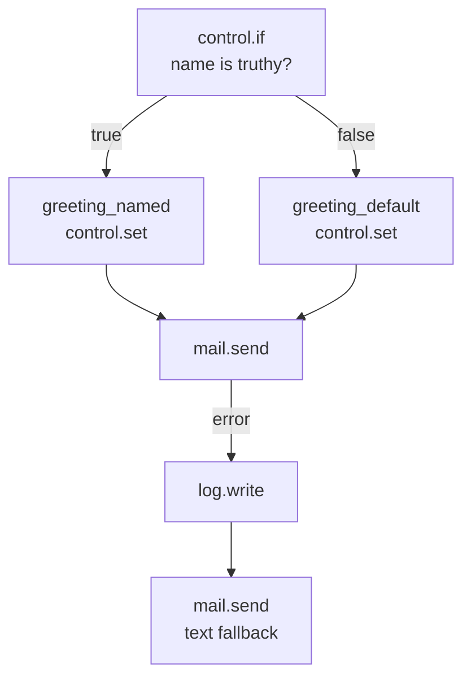
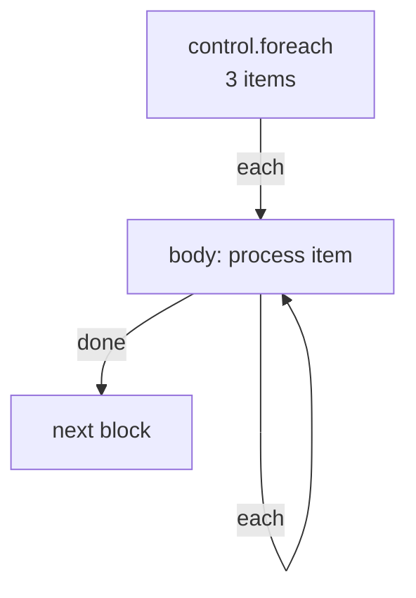

A flow is only as expressive as its blocks. Pawabase ships roughly fifty blocks out of the box, every one a thin, typed wrapper around a platform capability. Blocks are registered through the `pawabase.blocks` entry point group, so installed packages can add blocks without touching Pawabase itself.

All blocks are defined in `pawabase_kit.flows.blocks` and registered in `pawabase_kit.flows.registry.BlockRegistry`. Each block is a class with a `key`, `title`, `category`, `config` schema, `handles` list, `trigger` flag, and an async `run()` method.

<Note>
Block categories map to the tabs in Studio's visual editor palette. The block catalogue below is organized by category. Each block's exact configuration keys, output shape, and full behavior is documented on its dedicated page (linked where available).
</Note>

## Triggers

Triggers start a run. Every trigger extends `_Trigger` from `pawabase_kit.flows.blocks.triggers`, sets `trigger = True`, and its `run()` returns `BlockResult(output=run.state["input"])` — the trigger's job is purely to declare when a run should start.

| Key | Title | Handles | Description |
| --- | --- | --- | --- |
| `trigger.http` | HTTP request | — | A request to a compiled route |
| `trigger.event` | Event | — | A matching platform event |
| `trigger.schedule` | Schedule | — | A cron expression or interval |
| `trigger.resource` | Resource change | `next` | A resource create/update/delete |
| `trigger.webhook` | Inbound webhook | `next` | A verified inbound webhook |
| `trigger.realtime` | Realtime message | `next` | A client publish to a channel |
| `trigger.job` | Background job | `next` | Dispatched via `queue.flow` |
| `trigger.manual` | Manual run | `next` | Started from Studio or the API |

Every trigger inherits from `_Trigger`, which is defined in `pawabase_kit/flows/blocks/triggers.py`. The base class sets `trigger = True` and `category = "triggers"` on the class. At runtime, a trigger's `run()` method simply returns the run's input unchanged — a trigger never transforms the payload, it only declares *that* a run should start and hands back `input` as `steps.<trigger>.output`.

```python
class _Trigger(Block):
    category = "triggers"
    trigger = True

    async def run(self, config, run):
        return BlockResult(output=run.state["input"])
```

The configuration each trigger accepts is read by the **host** — the API compiles `trigger.http` nodes into actual HTTP routes, the scheduler picks up `trigger.schedule` nodes and registers cron/interval jobs, the event processor watches `trigger.event` nodes for matching publications, and so on. The trigger block itself knows nothing about routes or cron expressions; it only declares its shape in `config`.

## Control

Control blocks decide the flow's path, manage variables, and control timing.

| Key | Title | Handles | Description |
| --- | --- | --- | --- |
| `control.if` | Branch | `true`, `false` | Condition evaluation |
| `control.switch` | Switch | one per case + `default` | Multi-way branching |
| `control.foreach` | For each | `each`, `done` | Sequential loop (max 10,000 items) |
| `control.set` | Set variables | `next` | Set `vars.<name>` |
| `control.merge` | Merge | `next` | Merge objects (later wins) |
| `control.delay` | Delay | `next` | Pause up to 300s |
| `control.stop` | Stop | none | End the run without a response |
| `control.retry` | Retry | `next`, `error` | Retry sub-graph with backoff (1–10) |

Every control block is registered under the `control` category in `pawabase_kit.flows.blocks.control` and declared in the block catalogue on [Block reference](/flows/block-reference). Control blocks never talk to your database, send emails, or call external APIs — they decide *which path* the run takes, *how many times* a body repeats, and *when* the run ends.

### `control.if` — Branch on a condition

Evaluates a condition and follows `true` or `false`. This is the workhorse of flow branching — every "if this, do that" becomes two edges out of a `control.if` node.

| Config | Type | Required | Description |
| --- | --- | --- | --- |
| `condition` | `json` | yes | A condition object |

**Handles:** `true`, `false`.

```json
{
  "id": "has_name",
  "data": {
    "block": "control.if",
    "config": {
      "condition": { "truthy": "$input.event.payload.name" }
    }
  }
}
```

#### Condition syntax

Conditions are JSON objects that the engine evaluates against the run state. The supported operators:

| Operator | Meaning | Example |
| --- | --- | --- |
| `truthy` | The value is truthy | `{"truthy": "$input.body.email"}` |
| `eq` | Equal | `{"eq": ["{{ input.body.status }}", "paid"]}` |
| `neq` | Not equal | `{"neq": ["{{ input.body.role }}", "guest"]}` |
| `in` | Value is in a list | `{"in": ["{{ input.body.role }}", ["admin", "editor"]]}` |
| `gt` / `lt` / `gte` / `lte` | Numeric comparison | `{"gt": ["{{ input.body.amount }}", 100]}` |
| `all` / `any` | All/any sub-conditions match | `{"all": [{"authenticated": true}, {"eq": ["{{ auth.role }}", "admin"]}]}` |
| `not` | Negate | `{"not": {"eq": ["{{ input.body.status }}", "cancelled"]}}` |

The `$` prefix in a condition path means "resolve this path against the run state." Without `$`, the value is treated as a literal. A condition that evaluates to a truthy value follows the `true` handle; anything else follows `false`. Empty lists, `null`, `0`, empty strings, and `false` are all falsy.

#### Two branches, two endings



Both branches can converge on the same next node — `greeting_named` and `greeting_default` both have edges into `mail.send`. A node doesn't need exactly one incoming edge.

#### Setting variables with control.if

A common pattern: use `control.if` to decide between two `control.set` values, then have both branches write to the same variable name so downstream blocks can reference one name:

```json
[
  { "id": "has_name", "data": { "block": "control.if", "config": { "condition": { "truthy": "$input.event.payload.name" } } } },
  { "id": "greeting_named", "data": { "block": "control.set", "config": { "values": { "greeting": "Hi {{ input.event.payload.name }}," } } } },
  { "id": "greeting_default", "data": { "block": "control.set", "config": { "values": { "greeting": "Hi there," } } } }
]
```

```json
[
  { "id": "has_name", "source": "start", "target": "has_name" },
  { "id": "has_name-named", "source": "has_name", "target": "greeting_named", "sourceHandle": "true" },
  { "id": "has_name-default", "source": "has_name", "target": "greeting_default", "sourceHandle": "false" },
  { "id": "named-send", "source": "greeting_named", "target": "send" },
  { "id": "default-send", "source": "greeting_default", "target": "send" }
]
```

### `control.switch` — Branch on a value

Like `control.if` but for multi-way branching: follow a handle named by a value, or `default`.

| Config | Type | Required | Description |
| --- | --- | --- | --- |
| `condition` | `json` | yes | A condition that evaluates to a value |

**Handles:** one per case, plus `default`.

```json
{
  "id": "route_order",
  "data": {
    "block": "control.switch",
    "config": {
      "condition": { "eq": ["{{ input.body.priority }}", "high"] }
    }
  }
}
```

`control.switch` is useful when you have more than two branches — routing an order to different fulfilment workflows based on its `priority` field, or branching on a status string. Each case is a handle name; the default handle catches anything that doesn't match.

`control.switch` declares `handles: ["*"]` in its schema — a wildcard meaning "the actual handles depend on this block's own configuration." The canvas resolves this live: if the node's `cases` config is an array, one handle is rendered per case value plus a trailing `default`; if `cases` is an object, one handle per key plus `default`. Configure the switch's cases first, and its handles on the canvas update immediately to match.

### `control.set` — Set variables

Sets one or more values in the run's `vars` dictionary, readable as `{{ vars.<name> }}` from any later block in the same run.

| Config | Type | Required | Description |
| --- | --- | --- | --- |
| `values` | `json` | yes | A dictionary of variable names to values (which may be templates) |

**Handles:** `next`.

```json
{
  "id": "set_greeting",
  "data": {
    "block": "control.set",
    "config": {
      "values": {
        "greeting": "Hi {{ input.event.payload.name }},",
        "now": "{{ time.now.output }}"
      }
    }
  }
}
```

After this node, `{{ vars.greeting }}` and `{{ vars.now }}` are available to every subsequent block. This is the primary mechanism for sharing computed values between branches that converge.

<Tip>
`control.set` is the idiomatic way to make branches converge on a single variable name rather than downstream blocks having to conditionally reference `steps.branch_a.output` vs. `steps.branch_b.output`.
</Tip>

`control.set` can also be used to build up complex objects incrementally — each call merges into the existing `vars` object, so you can build up an object piece by piece across multiple steps.

### `control.merge` — Merge objects

Merges several objects into one, with later keys winning. Useful for building a request body from multiple sources.

| Config | Type | Required | Description |
| --- | --- | --- | --- |
| `values` | `json` | yes | A list of objects to merge |

**Handles:** `next`.

```json
{
  "id": "merge",
  "data": {
    "block": "control.merge",
    "config": {
      "values": [
        { "store_id": "{{ auth.org }}" },
        { "status": "processed" },
        "{{ steps.metadata.output }}"
      ]
    }
  }
}
```

The output is a single merged object. Later entries in the list override earlier ones for the same key. This is particularly useful when you have assembled parts of an object across different branches and need to combine them into a single payload before writing.

### `control.foreach` — Loop over items

Runs a body once per item in a list, **sequentially** (concurrency is always fixed at 1). The body has `item` and `index` in scope.

| Config | Type | Required | Description |
| --- | --- | --- | --- |
| `collection` | `json` | yes | A list to iterate over (may be a template) |
| `item` | `string` | no | Name for each item (default `"item"`) |
| `index` | `string` | no | Name for the index (default `"index"`) |

**Handles:** `each` (enters the loop body for each item), `done` (fires once after the last item).

```json
{
  "id": "loop",
  "data": {
    "block": "control.foreach",
    "config": {
      "collection": "{{ steps.orders.output }}",
      "item": "order",
      "index": "i"
    }
  }
}
```

Inside the loop body, `{{ item }}` is the current element and `{{ index }}` is its position (0-based).

#### Limits and behavior

- **Maximum 10,000 items.** A `control.foreach` over a list longer than 10,000 items raises `too_many_items`.
- **Always sequential.** The `concurrency` field on `control.foreach` caps at `maximum: 1` — there is no way to run loop iterations in parallel inside a flow. If you need parallelism, dispatch multiple jobs with `queue.flow` instead.
- **The `each` handle re-enters the body** for each item. The `done` handle fires once, after all items are processed.



#### Building dynamic operation lists for db.transaction

Since `db.transaction`'s `operations` is a static JSON list, you can't branch or loop inside it. Build the list first with `control.foreach` + `control.set`, then pass it to `db.transaction`:

```json
[
  { "id": "loop", "data": { "block": "control.foreach", "config": { "collection": "{{ steps.items.output }}", "item": "item" } } },
  { "id": "collect", "data": { "block": "control.set", "config": { "values": { "ops": "{{ control.foreach.output }}" } } } },
  { "id": "txn", "data": { "block": "db.transaction", "config": { "operations": "{{ vars.ops }}" } } }
]
```

### `control.delay` — Wait

Pauses the running flow for up to 300 seconds.

| Config | Type | Required | Default | Description |
| --- | --- | --- | --- | --- |
| `seconds` | `integer` | yes | — | Seconds to wait (0–300) |

**Handles:** `next`.

```json
{ "id": "wait", "data": { "block": "control.delay", "config": { "seconds": 30 } } }
```

<Warning>
`control.delay` only delays the *current run* — it doesn't pause a run and resume it later. For delays longer than 300 seconds, use a delayed `queue.flow` or `queue.function` dispatch instead.
</Warning>

### `control.stop` — End the run

Ends the run without producing an HTTP response. Use this when a non-HTTP flow (event-triggered, schedule-triggered) needs to terminate early.

**Handles:** none — like `response.return` and `error.raise`, nothing follows `control.stop`.

```json
{ "id": "abort", "data": { "block": "control.stop" } }
```

<Note>
A flow triggered by HTTP that contains a `control.stop` node will still answer with an empty `200` once the run finishes. `control.stop` is for flows that don't need to return anything.
</Note>

### `control.retry` — Retry a body

Re-runs a sub-graph with exponential backoff until it succeeds. The retry body is the set of nodes reachable from the `control.retry` node through its `next` handle.

| Config | Type | Required | Default | Description |
| --- | --- | --- | --- | --- |
| `attempts` | `integer` | no | `3` | Number of retry attempts (1–10) |
| `delay` | `integer` | no | `1` | Initial delay in seconds |

**Handles:** `next` (succeeded), `error` (all retries exhausted).

```json
{
  "id": "retry",
  "data": {
    "block": "control.retry",
    "config": { "attempts": 5, "delay": 2 }
  }
}
```

`control.retry` wraps the nodes reachable through its `next` handle and retries them as a group. This is distinct from `http.request`'s built-in `retries` config (which retries a single HTTP call) and from a `control.delay` + `queue.flow` pattern. Use `control.retry` when the retry should also redo steps *before* the failing step — for example, re-fetching a token that might have expired before retrying the API call.

### Common mistakes

<AccordionGroup>
  <Accordion title="Using control.foreach expecting parallel execution">
    `control.foreach` is always sequential — concurrency is fixed at 1. If you need to process items in parallel, dispatch them as separate jobs with `queue.flow`.
  </Accordion>
  <Accordion title="Assuming control.delay pauses a run indefinitely">
    `control.delay` is capped at 300 seconds and only delays the *current* run. For longer waits, use a delayed `queue.flow` dispatch.
  </Accordion>
  <Accordion title="Drawing edges out of control.stop or response.return">
    Both blocks have no outgoing handles. Any edge drawn from them in Studio is unreachable — the run always stops there.
  </Accordion>
  <Accordion title="Using control.if for a condition that should be a control.switch">
    If you have three or more branches based on a value, `control.switch` is cleaner than nesting `control.if` nodes.
  </Accordion>
  <Accordion title="Forgetting that control.set modifies vars globally">
    `control.set` writes to `state["vars"]`, which is shared across the entire run — including across loop iterations and branches.
  </Accordion>
</AccordionGroup>

## Data

Data blocks transform, validate, and compute values.

| Key | Title | Handles | Description |
| --- | --- | --- | --- |
| `transform.map` | Transform | `next` | Apply a transformer |
| `transform.template` | Template | `next` | Build a value from a template |
| `transform.pick` | Pick fields | `next` | Keep named keys |
| `validate.schema` | Validate | `next`, `invalid` | Validate against field definitions |
| `json.parse` | Parse JSON | `next` | Parse JSON text |
| `json.stringify` | Stringify JSON | `next` | Serialize to JSON text |
| `math.calculate` | Calculate | `next` | Arithmetic on numbers |
| `util.id` | Generate id | `next` | UUID4 or random token |
| `crypto.hash` | Hash | `next` | SHA-256, SHA-512, HMAC-SHA256 |
| `time.now` | Current time | `next` | UTC time in iso/date/unix |
| `db.query` | SQL query | `next` | Read-only SQL statement |
| `db.transaction` | Transaction | `next` | Atomic resource writes |

## Resources

The five resource operations and the raw database.

| Key | Title | Handles | Description |
| --- | --- | --- | --- |
| `resource.list` | List | `next` | Query resources with filters |
| `resource.get` | Get | `next`, `missing` | Get a single record |
| `resource.create` | Create | `next` | Create a record |
| `resource.update` | Update | `next`, `missing` | Update a record |
| `resource.delete` | Delete | `next`, `missing` | Delete a record |

### Resource blocks run with service rights

Resource blocks run with **service rights**. They do not re-evaluate the resource's own [policies](/policies/overview) — a `resource.get` on `invoices` inside a flow can read every invoice regardless of who triggered the run. This is deliberate: flows are your server-side code, trusted the same way a secret key is trusted. Guard the *entry* to the flow if a caller's rights should limit what the flow is allowed to do.

Each one calls straight into the same `store` object a generated `/rest/v1/<resource>` route uses. A `resource.create` node inside a flow validates fields, applies defaults, and fires `resource.*` events and invalidates caches exactly like a client `POST` would.

## Platform

Auth, cache, events, jobs, realtime, storage, mail, outbound HTTP, code, observability, and responses.

### Auth and policy

| Key | Title | Handles | Description |
| --- | --- | --- | --- |
| `auth.require` | Require sign-in | `next` | Fail with 401/403 if not authenticated |
| `auth.user` | Current user | `next`, `anonymous` | Load caller's profile from Akountz |
| `auth.lookup` | Look up user | `next`, `missing` | Load any user by id |
| `policy.check` | Check policy | `allowed`, `denied` | Evaluate a policy against a context |

### Cache

| Key | Title | Handles | Description |
| --- | --- | --- | --- |
| `cache.get` | Cache get | `hit`, `miss` | Read a cached value |
| `cache.set` | Cache set | `next` | Write a cached value with TTL |
| `cache.delete` | Cache delete | `next` | Remove a cached value |
| `cache.invalidate` | Invalidate tags | `next` | Remove entries by tag |

### Events, jobs, and realtime

| Key | Title | Handles | Description |
| --- | --- | --- | --- |
| `event.emit` | Emit event | `next` | Publish a platform event |
| `queue.flow` | Queue flow | `next` | Dispatch another flow as a job |
| `queue.function` | Queue function | `next` | Dispatch a Python function as a job |
| `realtime.publish` | Publish to channel | `next` | Send to a realtime channel |

### Storage and mail

| Key | Title | Handles | Description |
| --- | --- | --- | --- |
| `storage.put` | Store file | `next` | Write text or JSON to a bucket |
| `storage.read` | Read file | `next` | Read a small file as text |
| `storage.signed_url` | Signed URL | `next` | Create a time-limited signed URL |
| `storage.delete` | Delete file | `next` | Remove a file from a bucket |
| `mail.send` | Send email | `next` | Send an email via template or text |

### Outbound and code

| Key | Title | Handles | Description |
| --- | --- | --- | --- |
| `http.request` | HTTP request | `next`, `failed` | Call an external HTTP API |
| `webhook.send` | Send webhook | `next` | Deliver to subscribed webhook endpoints |
| `secret.get` | Read secret | `next` | Load a secret into vars |
| `function.call` | Call function | `next` | Call a Python function inline |

### Observability

| Key | Title | Handles | Description |
| --- | --- | --- | --- |
| `log.write` | Log | `next` | Write a structured log line |
| `metric.increment` | Metric | `next` | Increment a named metric |

### Responses and errors

| Key | Title | Handles | Description |
| --- | --- | --- | --- |
| `response.return` | Respond | none | End the run and answer the HTTP request |
| `error.raise` | Fail | none | Fail the run with a chosen status and message |

## The Runtime protocol

Every block's `run()` receives its rendered `config` and the `FlowRun` instance (through which it reaches `run.runtime`, `run.state`). Blocks never import a database driver, a cache client, or an SMTP library — they only call methods on a `Runtime`, an interface defined in `pawabase_kit.flows.runtime`:

```python
class Runtime(Protocol):
    async def resource_list(self, resource, *, filters=None, sort=None, limit=50, offset=0) -> dict: ...
    async def resource_get(self, resource, record_id) -> dict | None: ...
    async def resource_create(self, resource, data) -> dict: ...
    async def resource_update(self, resource, record_id, data) -> dict | None: ...
    async def resource_delete(self, resource, record_id) -> bool: ...
    async def db_query(self, sql, params=None) -> list[dict]: ...
    async def db_transaction(self, operations) -> list: ...
    async def cache_get(self, key) -> Any: ...
    async def cache_set(self, key, value, ttl=None, tags=None) -> None: ...
    async def emit(self, name, payload) -> str: ...
    async def dispatch_flow(self, flow, input, *, delay=0, queue=None) -> str: ...
    async def publish(self, channel, event, payload) -> dict: ...
    async def storage_put(self, bucket, key, content, content_type="") -> dict: ...
    async def storage_read(self, bucket, key, limit=1_048_576) -> bytes: ...
    async def storage_signed_url(self, bucket, key, method="GET", expires_in=300) -> str: ...
    async def storage_delete(self, bucket, key) -> bool: ...
    async def send_mail(self, to, subject, *, text=None, html=None, template=None, data=None) -> dict: ...
    async def http_request(self, method, url, *, headers=None, json=None, params=None, timeout=30, retries=0) -> dict: ...
    async def webhook_send(self, event, payload) -> int: ...
    async def secret(self, name) -> str | None: ...
    async def call_function(self, name, input) -> Any: ...
    async def identity_user(self, user_id) -> dict | None: ...
    async def check_policy(self, ref, context) -> bool: ...
    async def log(self, level, message, data=None) -> None: ...
    async def metric(self, name, value=1.0, tags=None) -> None: ...
```

In the API this is implemented by `ApiRuntime` (`services/api/app/runtime.py`). In tests, a fake `Runtime` stands in.

<Note>
`BaseRuntime.__getattr__` returns an async function that raises `NotAvailable(f"{name} is not available in this runtime")` for anything unimplemented — a runtime that doesn't provide some capability doesn't crash with an `AttributeError`, it fails with a clear message naming exactly what's missing.
</Note>

## Custom blocks

Blocks can be added from installed packages via the `pawabase.blocks` entry point group. See [Custom blocks](/flows/custom-blocks) for how to create and register them.

## Block categories and Studio palette ordering

Blocks are grouped by their `category` and sorted into a fixed order in Studio's palette:

```
triggers → control → resources → responses → auth → data →
code → events → jobs → mail → storage → realtime → cache →
integrations → observability
```

Any category not in that list (from a third-party block package) sorts after all of these, alphabetically. Within a category, blocks are sorted alphabetically by key.

## How to find a block's implementation

Every block is a Python class. To find its source, start from `pawabase_kit.flows.blocks` and look for the submodule matching the block's category: `blocks.triggers`, `blocks.control`, `blocks.data`, `blocks.platform`, `blocks.resources`. Each module contains the class definitions. The `BlockRegistry` in `pawabase_kit.flows.registry` maps block keys to classes. The `default_registry()` function loads built-in blocks plus all `pawabase.blocks` entry points on first use.

## Next

<CardGroup cols={2}>
  <Card title="Triggers" icon="waypoints" href="/flows/triggers">Every trigger type, configured end to end.</Card>
  <Card title="Control flow" icon="git-branch" href="/flows/control-flow">Branching, looping, variables, timing.</Card>
  <Card title="Data blocks" icon="shapes" href="/flows/data-blocks">Transform, validate, compute, and query.</Card>
  <Card title="Platform blocks" icon="plug" href="/flows/platform-blocks">Auth, cache, events, storage, mail, and more.</Card>
</CardGroup>
