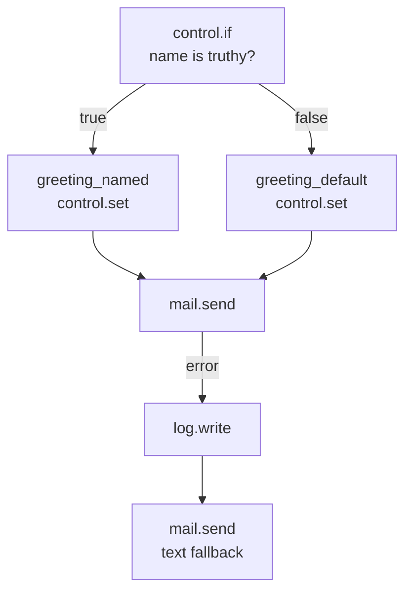
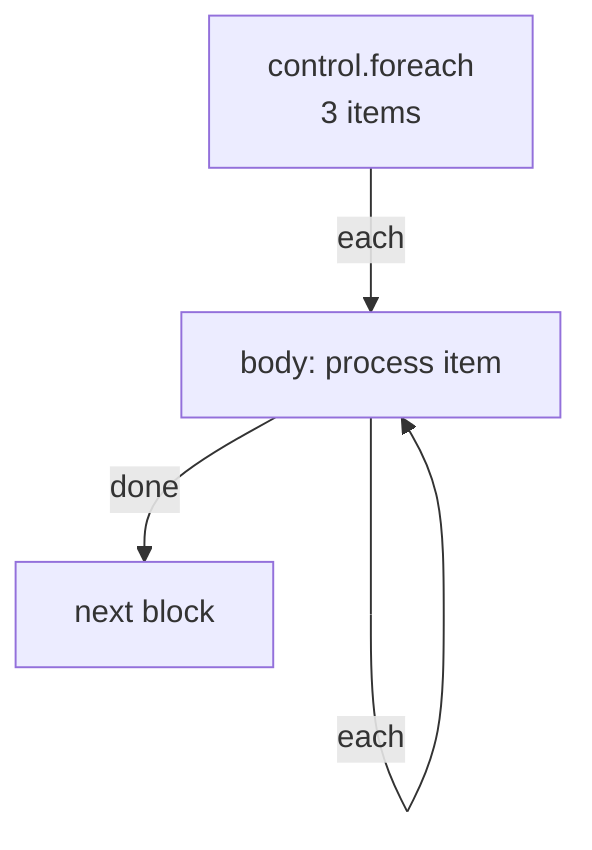

Control blocks are the decision-making and flow-management layer of Pawabase flows. They don't talk to your database, send emails, or call external APIs — they decide *which path* the run takes, *how many times* a body repeats, and *when* the run ends.

Every control block is registered under the `control` category in `pawabase_kit.flows.blocks.control` and declared in the block catalogue on [Block reference](/flows/block-reference).

<CardGroup cols={3}>
  <Card title="Branching" icon="code-branch">`control.if`, `control.switch` — choose a path based on a condition.</Card>
  <Card title="Looping" icon="sync">`control.foreach` — repeat a body once per item, sequentially.</Card>
  <Card title="Variables & timing" icon="cog">`control.set`, `control.merge`, `control.delay`, `control.stop`, `control.retry`.</Card>
</CardGroup>

## control.if — Branch on a condition

Evaluates a condition and follows `true` or `false`. This is the workhorse of flow branching — every "if this, do that" becomes two edges out of a `control.if` node.

| Config | Type | Required | Description |
| --- | --- | --- | --- |
| `condition` | `json` | yes | A condition object (see below) |

**Handles:** `true`, `false`.

```json
{
  "id": "has_name",
  "data": {
    "block": "control.if",
    "config": {
      "condition": { "truthy": "$input.event.payload.name" }
    }
  }
}
```

### Condition syntax

Conditions are JSON objects that the engine evaluates against the run state. The supported operators:

| Operator | Meaning | Example |
| --- | --- | --- |
| `truthy` | The value is truthy (not null, not empty, not false) | `{"truthy": "$input.body.email"}` |
| `eq` | Equal | `{"eq": ["{{ input.body.status }}", "paid"]}` |
| `neq` | Not equal | `{"neq": ["{{ input.body.role }}", "guest"]}` |
| `in` | Value is in a list | `{"in": ["{{ input.body.role }}", ["admin", "editor"]]}` |
| `gt` / `lt` / `gte` / `lte` | Numeric comparison | `{"gt": ["{{ input.body.amount }}", 100]}` |
| `all` / `any` | All/any sub-conditions match | `{"all": [{"authenticated": true}, {"eq": ["{{ auth.role }}", "admin"]}]}` |
| `not` | Negate | `{"not": {"eq": ["{{ input.body.status }}", "cancelled"]}}` |

The `$` prefix in a condition path (like `$input.body.email`) means "resolve this path against the run state." Without `$`, the value is treated as a literal.

A condition that evaluates to a truthy value follows the `true` handle; anything else follows `false`. Empty lists, `null`, `0`, empty strings, and `false` are all falsy.

### Two branches, two endings



Both branches can converge on the same next node — `greeting_named` and `greeting_default` both have edges into `mail.send`. A node doesn't need exactly one incoming edge.

### Setting variables with control.if

A common pattern: use `control.if` to decide between two `control.set` values, then have both branches write to the same variable name so downstream blocks can reference one name:

```json
[
  { "id": "has_name", "data": { "block": "control.if", "config": { "condition": { "truthy": "$input.event.payload.name" } } } },
  { "id": "greeting_named", "data": { "block": "control.set", "config": { "values": { "greeting": "Hi {{ input.event.payload.name }}," } } } },
  { "id": "greeting_default", "data": { "block": "control.set", "config": { "values": { "greeting": "Hi there," } } } }
]
```

```json
[
  { "id": "has_name", "source": "start", "target": "has_name" },
  { "id": "has_name-named", "source": "has_name", "target": "greeting_named", "sourceHandle": "true" },
  { "id": "has_name-default", "source": "has_name", "target": "greeting_default", "sourceHandle": "false" },
  { "id": "named-send", "source": "greeting_named", "target": "send" },
  { "id": "default-send", "source": "greeting_default", "target": "send" }
]
```

## control.switch — Branch on a value

Like `control.if` but for multi-way branching: follow a handle named by a value, or `default`.

| Config | Type | Required | Description |
| --- | --- | --- | --- |
| `condition` | `json` | yes | A condition that evaluates to a value |

**Handles:** one per case, plus `default`.

```json
{
  "id": "route_order",
  "data": {
    "block": "control.switch",
    "config": {
      "condition": { "eq": ["{{ input.body.priority }}", "high"] }
    }
  }
}
```

`control.switch` is useful when you have more than two branches — for example, routing an order to different fulfilment workflows based on its `priority` field, or branching on a status string. Each case is a handle name; the default handle catches anything that doesn't match.

## control.set — Set variables

Sets one or more values in the run's `vars` dictionary, readable as `{{ vars.<name> }}` from any later block in the same run.

| Config | Type | Required | Description |
| --- | --- | --- | --- |
| `values` | `json` | yes | A dictionary of variable names to values (which may be templates) |

**Handles:** `next`.

```json
{
  "id": "set_greeting",
  "data": {
    "block": "control.set",
    "config": {
      "values": {
        "greeting": "Hi {{ input.event.payload.name }},",
        "now": "{{ time.now.output }}"
      }
    }
  }
}
```

After this node, `{{ vars.greeting }}` and `{{ vars.now }}` are available to every subsequent block. This is the primary mechanism for sharing computed values between branches that converge.

<Tip>
`control.set` is the idiomatic way to make branches converge on a single variable name rather than downstream blocks having to conditionally reference `steps.branch_a.output` vs. `steps.branch_b.output`.
</Tip>

`control.set` can also be used to build up complex objects incrementally:

```json
[
  { "id": "set_part1", "data": { "block": "control.set", "config": { "values": { "payload": {"id": "{{ steps.order.output.id }}"} } } } },
  { "id": "set_part2", "data": { "block": "control.set", "config": { "values": { "payload.total": "{{ steps.order.output.total }}" } } } }
]
```

Each `control.set` merges into the existing `vars` object, so you can build up an object piece by piece.

## control.merge — Merge objects

Merges several objects into one, with later keys winning. Useful for building a request body from multiple sources.

| Config | Type | Required | Description |
| --- | --- | --- | --- |
| `values` | `json` | yes | A list of objects to merge |

**Handles:** `next`.

```json
{
  "id": "merge",
  "data": {
    "block": "control.merge",
    "config": {
      "values": [
        { "store_id": "{{ auth.org }}" },
        { "status": "processed" },
        "{{ steps.metadata.output }}"
      ]
    }
  }
}
```

The output is a single merged object. Later entries in the list override earlier ones for the same key.

## control.foreach — Loop over items

Runs a body once per item in a list, **sequentially** (concurrency is always fixed at 1). The body has `item` and `index` in scope.

| Config | Type | Required | Description |
| --- | --- | --- | --- |
| `collection` | `json` | yes | A list to iterate over (may be a template) |
| `item` | `string` | no | Name for each item (default `"item"`) |
| `index` | `string` | no | Name for the index (default `"index"`) |

**Handles:** `each` (enters the loop body for each item), `done` (fires once after the last item).

```json
{
  "id": "loop",
  "data": {
    "block": "control.foreach",
    "config": {
      "collection": "{{ steps.orders.output }}",
      "item": "order",
      "index": "i"
    }
  }
}
```

Inside the loop body, `{{ item }}` is the current element and `{{ index }}` is its position (0-based):

```json
{
  "id": "process_each",
  "data": {
    "block": "mail.send",
    "config": {
      "to": "{{ item.email }}",
      "subject": "Order {{ item.number }} processed"
    }
  }
}
```

### Limits and behavior

- **Maximum 10,000 items.** A `control.foreach` over a list longer than 10,000 items raises `too_many_items`.
- **Always sequential.** The `concurrency` field on `control.foreach` caps at `maximum: 1` — there is no way to run loop iterations in parallel inside a flow. If you need parallelism, dispatch multiple jobs with `queue.flow` instead.
- **The `each` handle re-enters the body** for each item. The `done` handle fires once, after all items are processed. Edges from `foreach` follow `each` into the loop body and `done` out the other side.



### Building dynamic operation lists for db.transaction

Since `db.transaction`'s `operations` is a static JSON list, you can't branch or loop inside it. Build the list first with `control.foreach` + `control.set`, then pass it to `db.transaction`:

```json
[
  { "id": "loop", "data": { "block": "control.foreach", "config": { "collection": "{{ steps.items.output }}", "item": "item" } } },
  { "id": "collect", "data": { "block": "control.set", "config": { "values": { "ops": "{{ control.foreach.output }}" } } } },
  { "id": "txn", "data": { "block": "db.transaction", "config": { "operations": "{{ vars.ops }}" } } }
]
```

## control.delay — Wait

Pauses the running flow for up to 300 seconds.

| Config | Type | Required | Default | Description |
| --- | --- | --- | --- | --- |
| `seconds` | `integer` | yes | — | Seconds to wait (0–300) |

**Handles:** `next`.

```json
{ "id": "wait", "data": { "block": "control.delay", "config": { "seconds": 30 } } }
```

<Warning>
`control.delay` only delays the *current run* — it doesn't pause a run and resume it later. For delays longer than 300 seconds, use a delayed `queue.flow` or `queue.function` dispatch instead. The block's own documentation says exactly this: "long waits belong in a delayed job instead."
</Warning>

## control.stop — End the run

Ends the run without producing an HTTP response. Use this when a non-HTTP flow (event-triggered, schedule-triggered) needs to terminate early.

**Handles:** none — like `response.return` and `error.raise`, nothing follows `control.stop`.

```json
{ "id": "abort", "data": { "block": "control.stop" } }
```

<Note>
A flow triggered by HTTP that contains a `control.stop` node will still answer with an empty `200` once the run finishes. `control.stop` is for flows that don't need to return anything — it's not a substitute for `response.return` on HTTP-triggered flows.
</Note>

## control.retry — Retry a body

Re-runs a sub-graph with exponential backoff until it succeeds. The retry body is the set of nodes reachable from the `control.retry` node through its `next` handle.

| Config | Type | Required | Default | Description |
| --- | --- | --- | --- | --- |
| `attempts` | `integer` | no | `3` | Number of retry attempts (1–10) |
| `delay` | `integer` | no | `1` | Initial delay in seconds |

**Handles:** `next` (succeeded), `error` (all retries exhausted).

```json
{
  "id": "retry",
  "data": {
    "block": "control.retry",
    "config": { "attempts": 5, "delay": 2 }
  }
}
```

`control.retry` wraps the nodes reachable through its `next` handle and retries them as a group. This is distinct from `http.request`'s built-in `retries` config (which retries a single HTTP call) and from a `control.delay` + `queue.flow` pattern (which dispatches a separate job). Use `control.retry` when the retry should also redo steps *before* the failing step — for example, re-fetching a token that might have expired before retrying the API call.

## Common mistakes

<AccordionGroup>
  <Accordion title="Using control.foreach expecting parallel execution">
    `control.foreach` is always sequential — concurrency is fixed at 1. If you need to process items in parallel, dispatch them as separate jobs with `queue.flow`.
  </Accordion>
  <Accordion title="Assuming control.delay pauses a run indefinitely">
    `control.delay` is capped at 300 seconds and only delays the *current* run. For longer waits, use a delayed `queue.flow` dispatch.
  </Accordion>
  <Accordion title="Drawing edges out of control.stop or response.return">
    Both blocks have no outgoing handles. Any edge drawn from them in Studio is unreachable — the run always stops there.
  </Accordion>
  <Accordion title="Using control.if for a condition that should be a control.switch">
    If you have three or more branches based on a value, `control.switch` is cleaner than nesting `control.if` nodes.
  </Accordion>
  <Accordion title="Forgetting that control.set modifies vars globally">
    `control.set` writes to `state["vars"]`, which is shared across the entire run — including across loop iterations and branches. A `control.set` inside a `control.foreach` body affects `vars` for the rest of the run, not just the current iteration.
  </Accordion>
</AccordionGroup>

## Next

<CardGroup cols={2}>
  <Card title="State" icon="database" href="/flows/state">What blocks can see: input, auth, vars, and steps.</Card>
  <Card title="Errors and retries" icon="triangle-alert" href="/flows/errors-and-retries">What happens when a block fails.</Card>
  <Card title="Platform blocks" icon="plug" href="/flows/platform-blocks">The runtime capabilities blocks call.</Card>
  <Card title="Block reference" icon="list" href="/flows/block-reference">Every block, every config key, in one page.</Card>
</CardGroup>
