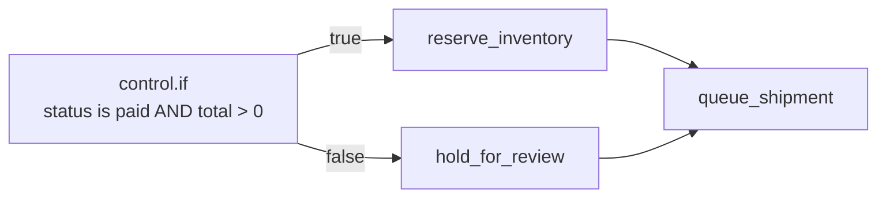
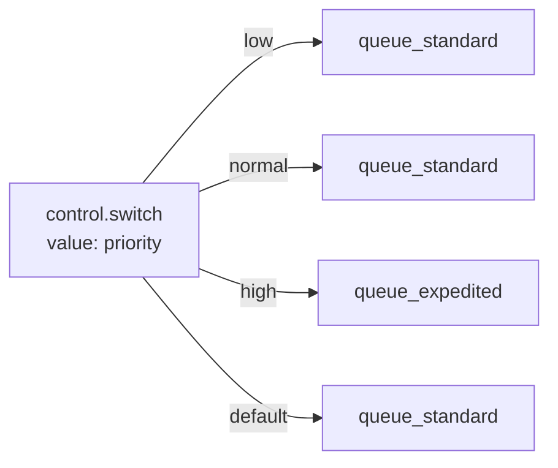
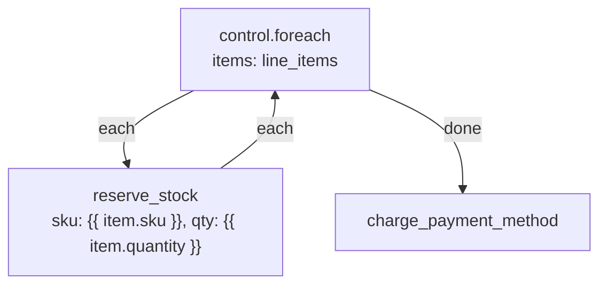
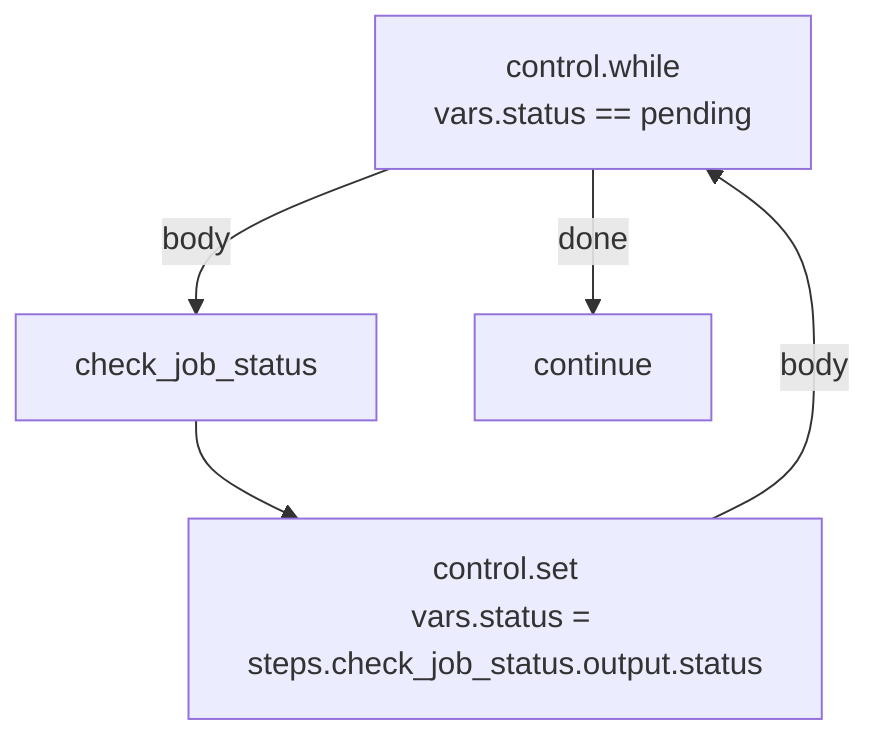
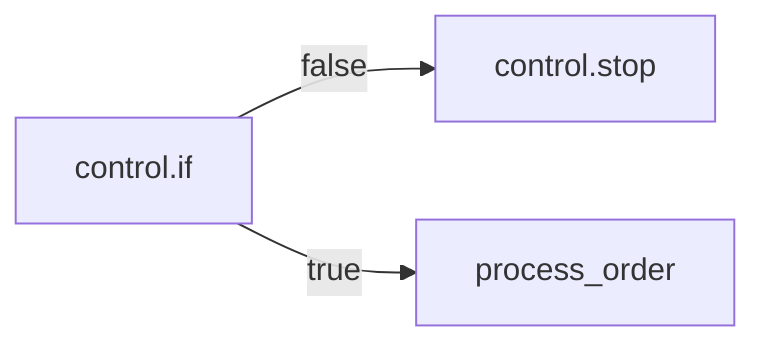
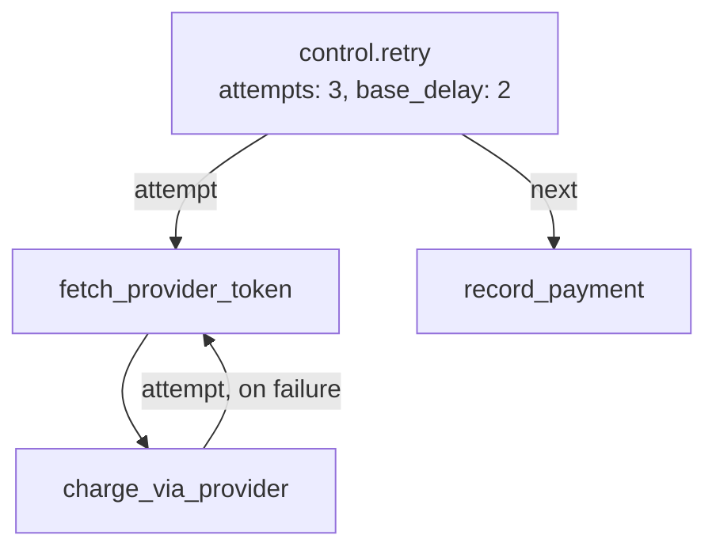
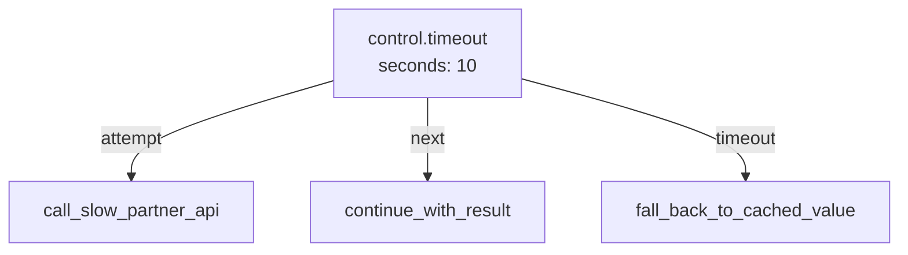
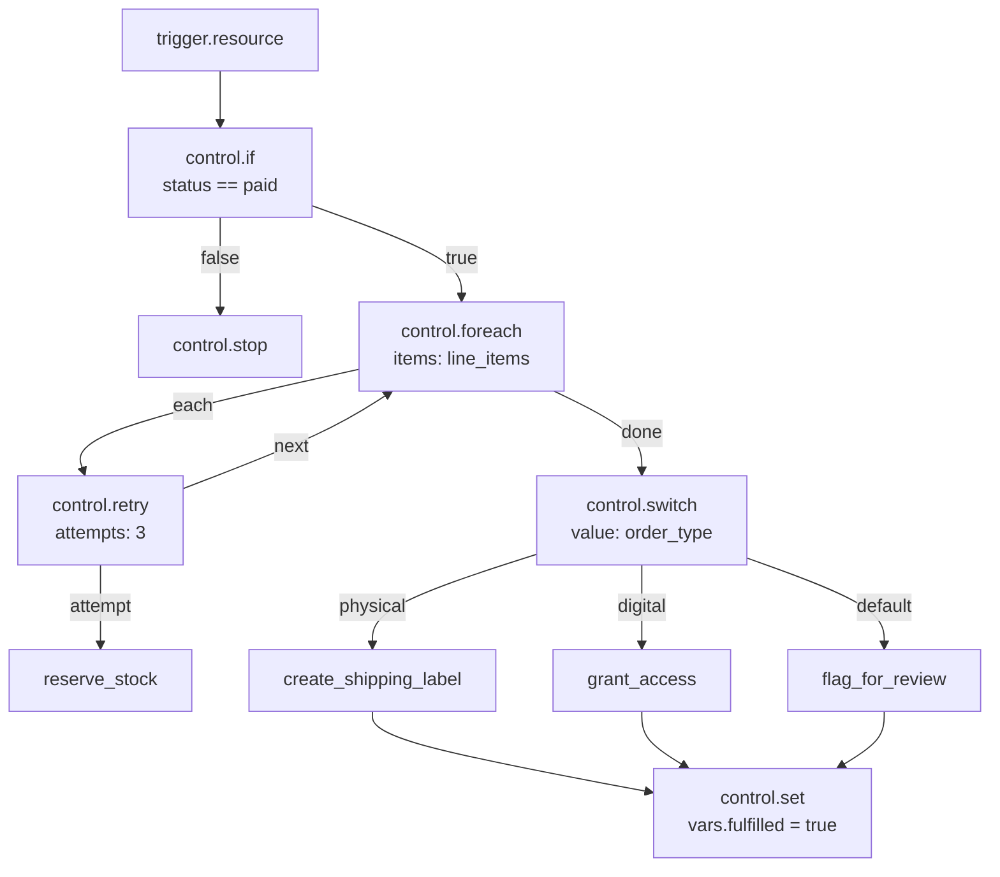

Control blocks don't talk to your database, send mail, or call an external API. They decide **which path** a run takes, **how many times** a Branch repeats, and **when** a run ends. Every other kind of block — data, mail, HTTP, storage — does work; control blocks decide whether and how often that work happens.

In Studio, control blocks live in the **Control** category of the block palette. A Flow is built by wiring a Trigger to a sequence of Steps, and control blocks are the Steps that fork that sequence into more than one path (`control.if`, `control.switch`), repeat a path (`control.foreach`, `control.while`), or end it early (`control.stop`).

<CardGroup cols={3}>
  <Card title="Branching" icon="code-branch">`control.if`, `control.switch` — choose a path.</Card>
  <Card title="Looping" icon="rotate">`control.foreach`, `control.while` — repeat a Branch.</Card>
  <Card title="Data & timing" icon="sliders">`control.set`, `control.merge`, `control.delay`, `control.stop`, `control.retry`, `control.timeout`.</Card>
</CardGroup>

## Mental model: the run's state

Every Flow run carries one piece of state that every Step can read and that Studio's field pickers browse:

| Key | What it holds |
| --- | --- |
| `input` | The payload the Trigger produced. Shape depends on which Trigger fired — see [Triggers](/flows/triggers). |
| `vars` | Whatever `control.set` has written so far. Empty until the first `control.set` runs. |
| `steps` | Every Step's own output and handle, keyed by the Step's name — `steps.<step>.output`, `steps.<step>.handle`. |
| `auth` | The caller's identity: `auth.authenticated`, `auth.user_id`, `auth.roles`, and so on. |
| `run` | `run.id` and `run.flow` — metadata about this execution, not your data. |
| `error` | Set only after a Step fails into an **error** Branch (see below). Holds `error.message`, `error.type`, `error.node`. |

Control blocks are the only blocks that write to this state directly (`control.set` writes `vars`) or read it to make a decision (`control.if`, `control.switch`, `control.while`). Every other block reads and writes through its own inputs and outputs.

## Two ways to reference state: Expressions and Conditions

Studio gives you two related but distinct syntaxes, and mixing them up is the single most common mistake on this page.

### Expressions — `{{ path }}`

Most fields — a path string, a list of items, an object of values — take an **Expression**: a double-curly-brace lookup into the run's state, with optional filters.

```
{{ input.body.email }}
{{ steps.fetch_order.output.total }}
{{ vars.greeting }}
{{ input.body.amount | default:0 }}
```

A field value that is *entirely* one Expression (nothing before or after the `{{ }}`) returns the looked-up value itself — a list stays a list, an object stays an object. A field value with text around an Expression is rendered as a string, with the Expression's value spliced in and lists/objects turned into JSON text.

Supported filters, applied left to right with `|`:

| Filter | Effect |
| --- | --- |
| `default:<value>` | Substitutes `<value>` when the looked-up value is `null` or `""` |
| `upper` / `lower` | Uppercases / lowercases a string |
| `json` | Serializes the value as a JSON string |
| `length` | The length of a string, list, or object |
| `int` / `float` / `str` / `bool` | Type coercion |
| `first` / `last` | The first / last element of a list |
| `keys` | The keys of an object, as a list |

Example: `{{ input.body.amount | default:0 | float }}`.

### Conditions — JSON with `$path` operands

`control.if` and `control.while` don't take an Expression for their condition — they take a **Condition**: a JSON object built from one operator. A Condition is evaluated directly against the run's state; operands starting with `$` are paths into that state, everything else is a literal.

```json
{ "eq": ["$input.body.status", "paid"] }
```

```json
{
  "all": [
    { "authenticated": true },
    { "gt": ["$input.body.total", 100] }
  ]
}
```

| Kind | Operators |
| --- | --- |
| Comparison | `eq`, `ne`, `gt`, `gte`, `lt`, `lte`, `in`, `not_in`, `contains`, `starts_with`, `ends_with`, `matches` |
| Combinators | `all`, `any`, `not` |
| Unary | `exists`, `truthy`, `empty` |
| Shorthands | `authenticated`, `role`, `permission`, `owner`, `service`, `kind`, `scope`, `aal` |

<Warning>
Condition operators are `ne` and `not_in` — not `neq` or `nin`. Combinators are `all` / `any` / `not` — there is no `and` or `or` operator. A Condition typed with the wrong operator name is refused when you save the Flow.
</Warning>

A comparison takes exactly two operands, `[left, right]`. `all` and `any` take a list of Conditions. `not` takes one Condition. `exists`, `truthy`, and `empty` take a single operand — `{"truthy": "$input.body.name"}` is true when that path resolves to a non-empty, non-zero, non-false value.

The shorthands expand to a full Condition using `$auth` and `$record` paths — for example `{"role": "admin"}` expands to checking `$auth.roles` contains `"admin"`. They exist for policies (who may call an endpoint) as much as for `control.if`, so you'll see the same vocabulary in [Policies](/policies/overview).

<Tip>
Rule of thumb: Studio's **condition** widget (the one with an operator dropdown) wants `$input.foo`. A plain text field wants `{{ input.foo }}`. If a field shows a "Condition" builder UI rather than a text box, it's the JSON form.
</Tip>

## `control.if` — Branch on a condition

**Purpose.** The workhorse of branching: evaluate one Condition, take one of two paths.

**Mental model.** A fork in the road with exactly two exits. Draw one Branch from the `true` exit and one from the `false` exit; both are optional, and both may reconverge on the same later Step.

**When to use.** Any binary decision: "is this order paid?", "does this user have a role?", "is the field present?". When you need more than two outcomes from a single value, use `control.switch` instead — chaining several `control.if` blocks to test the same field against different values works but reads worse and is harder to change.

**When not to use.** Don't use `control.if` to validate input and produce an error response — that belongs in a policy or a schema on the Trigger, evaluated before the Flow runs at all. Reserve `control.if` for decisions that depend on data only the Flow itself computes (a previous Step's output, a computed total).

### Studio configuration

| Field | Type | Required | Default | Description |
| --- | --- | --- | --- | --- |
| `condition` | Condition | Yes | — | The Condition to evaluate against the run's state |

### Inputs, outputs, handles

- **Reads:** the run's entire state (`input`, `vars`, `steps`, `auth`), through whatever paths the Condition names.
- **Output:** the boolean result of the Condition.
- **Handles:** `true`, `false`. Exactly one fires per run.

### Execution behavior

The Condition is evaluated once, synchronously, against the state as it exists when this Step runs — not against a snapshot taken earlier in the Flow. `null`, `0`, `""`, `false`, and empty lists/objects are all falsy for `truthy`/`empty`; everything else is truthy.

### Examples

Simple — gate a Step on whether a field was supplied:

```json
{ "condition": { "truthy": "$input.body.email" } }
```

Realistic — order fulfillment, branch on payment status before shipping:

```json
{
  "condition": {
    "all": [
      { "eq": ["$input.body.status", "paid"] },
      { "gt": ["$input.body.total", 0] }
    ]
  }
}
```



Both branches reconverging on `queue_shipment` is normal — a Step can have any number of incoming Branches.

### A common pattern: converging on one variable name

Rather than have downstream Steps conditionally reference `steps.branch_a.output` in one case and `steps.branch_b.output` in the other, have both branches of a `control.if` write to the same `vars` key with `control.set`, then have the downstream Step read `{{ vars.greeting }}` regardless of which branch ran:

```
true  branch → control.set { "values": { "greeting": "Hi {{ input.body.name }}," } }
false branch → control.set { "values": { "greeting": "Hi there," } }
                    ↓ both converge on →
              mail.send { "body": "{{ vars.greeting }}" }
```

### Errors

`control.if` itself doesn't raise — a malformed Condition (unknown operator, wrong operand count) is refused when you save the Flow in Studio, not at run time. The only run-time failure is a Condition that references a path that doesn't exist, which simply resolves to `null` (falsy), not an error.

### Troubleshooting

<AccordionGroup>
  <Accordion title="The condition always takes the false branch">
    Check whether you used `{{ input.foo }}` (an Expression) instead of `$input.foo` (a Condition path) inside the `condition` field. A literal string `"{{ input.foo }}"` compared with `eq` will never equal your expected value, because it isn't being resolved as a path.
  </Accordion>
  <Accordion title="Comparing a number field always fails">
    Values arriving from an HTTP body are already the right JSON type (numbers stay numbers), but values built from other Expressions can end up as strings. Compare with `eq` (which normalizes ids) for identity checks, or coerce first with a `control.set` step using the `int`/`float` filter.
  </Accordion>
</AccordionGroup>

## `control.switch` — Branch on a value

**Purpose.** Multi-way branching: evaluate one value, follow the Branch whose name matches it, or fall through to `default`.

**Mental model.** A dispatcher. `value` is rendered to a value, and Studio wires up one Branch per expected case plus a `default` Branch for anything else.

**When to use.** Routing on a status string, a priority level, a plan tier, or any field with a small, known set of values. Prefer this over stacking `control.if` blocks once you have three or more outcomes for the same field.

**When not to use.** When the set of outcomes is genuinely just two, `control.if` is more direct — a two-armed switch adds a `default` Branch with nothing to catch.

### Studio configuration

| Field | Type | Required | Default | Description |
| --- | --- | --- | --- | --- |
| `value` | Expression (string) | Yes | — | Rendered once; its result picks the Branch |
| `cases` | array of strings | No | — | The expected values. Each becomes a named Branch in Studio |

### Inputs, outputs, handles

- **Output:** the rendered value of `value`.
- **Handles:** one per entry in `cases`, plus `default`. If `cases` is left empty, the Branch taken is named by the rendered value itself, whatever it is — useful when the possible values aren't known ahead of time and you only care about a couple of them (wire those, and let everything else flow into `default`).

### Execution behavior

`value` is rendered, then compared as a string against each entry of `cases`. The first (and only) match wins; ties can't happen because `cases` names distinct Branches. Anything that matches no listed case follows `default`.

### Examples

Simple — route by priority:

```json
{ "value": "{{ input.body.priority }}", "cases": ["low", "normal", "high"] }
```



Realistic — order fulfillment, route to a fulfillment path by order type:

```json
{ "value": "{{ input.body.order_type }}", "cases": ["digital", "physical", "subscription"] }
```

- `digital` → grant access immediately, skip shipping entirely
- `physical` → reserve inventory, create a shipping label
- `subscription` → enroll in the billing schedule
- `default` → flag for manual review — an order type Studio doesn't recognize shouldn't silently take one of the known paths

### Related blocks

`control.if` for two-way decisions; `control.foreach` when you need to process a *list* of values rather than branch once on a single one.

### Troubleshooting

<AccordionGroup>
  <Accordion title="Every case falls through to default">
    `cases` holds strings, and `value` is compared as a string. A numeric `input.body.priority` of `1` won't match a case string `"1"` unless you coerce it — wrap `value` with the `str` filter: `{{ input.body.priority | str }}`.
  </Accordion>
  <Accordion title="Adding a new case doesn't create a new Branch automatically">
    Add the value to `cases` first, save, then wire the new Branch in the graph — Studio only offers a Branch handle for entries present in `cases` (or the fallthrough behavior when `cases` is empty).
  </Accordion>
</AccordionGroup>

## `control.foreach` — Loop over a list

**Purpose.** Run a Branch once for every item in a list, in order.

**Mental model.** A `for` loop. `items` is a list; the `each` Branch runs once per element with that element in scope, then `done` fires once, after the last iteration.

**When to use.** Processing every line item in an order, every recipient in a batch, every record a previous Step fetched.

**When not to use.** Don't reach for `control.foreach` to run something in parallel — see Execution behavior below, it is always sequential. For true concurrency, dispatch one background job per item with a queue block instead of looping inside one run.

### Studio configuration

| Field | Type | Required | Default | Description |
| --- | --- | --- | --- | --- |
| `items` | Expression resolving to a list | Yes | — | The collection to iterate |
| `concurrency` | integer | No | `1` | Reserved; fixed at `1` today (see below) |

### Inputs, outputs, handles

- Inside the `each` Branch, two variables are in scope automatically — **you don't configure their names**: `item` (the current element) and `index` (its zero-based position). Reference them as `{{ item }}` and `{{ index }}`, not `{{ vars.item }}`.
- **Output:** a list of the `each` Branch's last Step's output, one entry per iteration.
- **Handles:** `each` (re-entered once per item), `done` (fires once, after the loop finishes).

### Execution behavior

`items` must render to a list; if it renders to an object, `control.foreach` iterates its `[key, value]` pairs (so `item.0` is the key, `item.1` the value) — but a list is the common and clearer case. A list longer than 10,000 items raises `too_many_items` and the run fails; a `control.foreach` over an unbounded collection should page it first.

The `concurrency` field exists in the schema but is capped at a maximum of `1` — every iteration finishes before the next starts. This is not a rate limit you can raise; there is currently no parallel `control.foreach`.

### Examples

Simple — log each item:

```json
{ "items": "{{ input.body.tags }}" }
```

Realistic — order fulfillment, reserve inventory for each line item before charging:

```json
{ "items": "{{ input.body.line_items }}" }
```



If `reserve_stock` fails for one line item partway through, the loop stops there (see Errors) — the earlier reservations already made are not automatically rolled back. A fulfillment flow that must be all-or-nothing should wrap the `each` Branch in a compensating action, or collect reservations and commit them together once the loop's `done` Branch is reached.

### Building a list for another block

Several blocks (transactional writes, bulk inserts) take a static list rather than looping internally. Build that list first with `control.foreach` + `control.set`, writing into an accumulating `vars` entry inside the loop, then read the finished list from `vars` after `done`:

```
control.foreach (items: {{ input.body.line_items }})
  each → control.set { "values": { "ops": "{{ vars.ops | default:[] }}" } }   # placeholder pattern; see note below
  done → next Step reads {{ vars.ops }}
```

<Note>
`control.set` replaces the named keys with whatever `values` computes — it doesn't append to a list for you. To accumulate across iterations, compute the whole next-state expression yourself (for example, build the full merged list in one Expression using `steps.<node>.output`, which is already the list of the loop's per-iteration outputs) rather than expecting `vars.ops` to grow item by item.
</Note>

### Errors

An exception inside the `each` Branch stops the loop at that iteration (the engine's normal error handling applies — see [Errors and retries](/flows/errors-and-retries)); it does not roll back completed iterations and does not continue to remaining items unless the failing Step itself has an **error** Branch that returns the loop to a safe continuation point.

### Troubleshooting

<AccordionGroup>
  <Accordion title="`items` isn't a list error">
    `control.foreach` needs a real list at run time. `{{ steps.fetch.output }}` needs the previous Step to actually return a list — check its output shape, not just that the field exists.
  </Accordion>
  <Accordion title="`{{ item.name }}` is empty inside the loop">
    Confirm each element of `items` is an object with a `name` key, not a bare string or number. `control.foreach` doesn't reshape elements — `item` is exactly whatever was in the list.
  </Accordion>
  <Accordion title="Expecting concurrency to speed up a large loop">
    It won't — `concurrency` is fixed at `1`. A loop over thousands of items runs one at a time; for throughput, dispatch a job per item instead of looping in one run.
  </Accordion>
</AccordionGroup>

## `control.while` — Loop while a condition holds

**Purpose.** Run a `body` Branch repeatedly for as long as a Condition is true, evaluated fresh before every iteration.

**Mental model.** A `while` loop. Unlike `control.foreach`, there's no fixed collection — the loop keeps going until something inside the body (typically a `control.set`) changes the state so the Condition stops being true.

**When to use.** Polling for a status to change, paginating through an API until there's no next page, retrying a computation until a threshold is reached. Anywhere the number of iterations isn't known ahead of time.

**When not to use.** If you already have the full list to process, `control.foreach` is simpler and safer — it can't loop forever. Reach for `control.while` only when the stopping condition is genuinely data-dependent.

### Studio configuration

| Field | Type | Required | Default | Description |
| --- | --- | --- | --- | --- |
| `condition` | Condition | Yes | — | Re-evaluated before every iteration |
| `max_iterations` | integer | No | `1000` | Safety limit, 1–10,000 |

### Inputs, outputs, handles

- **Output:** a list of the `body` Branch's last Step's output, one per iteration.
- **Handles:** `body` (re-entered while the Condition is true), `done` (fires once the Condition is false, or the loop stops).

### Execution behavior

Before each iteration, the Condition is evaluated against the *current* state — so a `control.set` inside `body` that changes the value the Condition reads is what normally ends the loop. If the loop reaches `max_iterations` without the Condition going false, the run fails with `too_many_iterations` — this is a safety net against an infinite loop, not a normal exit path. Set `max_iterations` deliberately low while you're building a `control.while` so a bug fails fast in testing rather than burning 1,000 iterations first.

### Examples

Simple — poll until a flag flips (paired with `control.delay` so it doesn't spin):

```json
{ "condition": { "eq": ["$vars.status", "pending"] }, "max_iterations": 20 }
```



Realistic — order fulfillment, paginate a supplier API until all pages are fetched:

```json
{ "condition": { "truthy": "$vars.next_page" }, "max_iterations": 50 }
```

### Errors

`too_many_iterations` fails the run like any other error — give the `control.while` Step an **error** Branch if a stalled loop should be handled gracefully (notify someone, mark the record for manual follow-up) rather than failing the whole Flow.

### Related blocks

`control.foreach` for a known collection; `control.delay` inside the body to avoid a tight polling loop; `control.retry` when the thing that might need repeating is "this one Step failed," not "this condition hasn't changed yet."

## `control.set` — Set variables

**Purpose.** Write one or more values into `vars`, readable by every later Step in the same run — including Steps in a different Branch than the one that set them.

**Mental model.** The only way data crosses from one Branch to another without threading `steps.<name>.output` references through every downstream field. It's also how two branches of a `control.if` or `control.switch` converge on one variable name.

**When to use.** Sharing a computed value across branches; giving a value a stable, readable name instead of a long `steps.*` path; building up a value across a loop's iterations.

### Studio configuration

| Field | Type | Required | Default | Description |
| --- | --- | --- | --- | --- |
| `values` | Expression object | Yes | — | A map of variable name → value. Each value may itself be an Expression |

### Inputs, outputs, handles

- **Output:** the rendered `values` object.
- **Handles:** none declared — `control.set` has a single default continuation, like any block with no branching.

### Execution behavior

`values` is rendered and merged into `vars` — existing keys not named in `values` are untouched; keys named in `values` are replaced outright, not appended to or deep-merged.

### Examples

Simple:

```json
{ "values": { "greeting": "Hi {{ input.body.name }}," } }
```

Realistic — order fulfillment, stash a computed total for every later Step to reuse:

```json
{ "values": { "grand_total": "{{ steps.compute_totals.output.subtotal }}", "currency": "USD" } }
```

<Tip>
`control.set` is the idiomatic way to make two branches of a `control.if` converge on one variable name, rather than a downstream Step conditionally reading `steps.branch_a.output` in one case and `steps.branch_b.output` in the other.
</Tip>

### Troubleshooting

<AccordionGroup>
  <Accordion title="A variable set inside a loop or branch doesn't have the value I expect afterward">
    `vars` is shared, run-wide state — the last write wins across the whole run, in execution order, not per-branch. If two branches both write `vars.status`, whichever one runs last (or, in a loop, whichever iteration runs last) is what later Steps see.
  </Accordion>
  <Accordion title="Expected values to accumulate into a list">
    They don't automatically — see the `control.foreach` section above. `control.set` replaces the key each time it runs; build the full desired value in one Expression instead of relying on incremental writes.
  </Accordion>
</AccordionGroup>

## `control.merge` — Merge objects

**Purpose.** Combine several objects into one, later entries winning on key collisions.

**Mental model.** `Object.assign` across a list — useful for assembling one request body or one record from data that lives in several Steps' outputs.

**When to use.** Building a payload for an outbound HTTP call or a write, where the pieces come from different upstream Steps (metadata from one, computed fields from another, a constant from a third).

### Studio configuration

| Field | Type | Required | Default | Description |
| --- | --- | --- | --- | --- |
| `objects` | Expression (array of objects) | Yes | — | Objects to merge, left to right |

### Inputs, outputs, handles

- **Output:** the merged object.
- **Handles:** none declared.

### Execution behavior

Each entry of `objects` is rendered; non-object entries (a rendered value that isn't a JSON object) are skipped rather than raising. Keys from later entries overwrite the same key from earlier entries.

### Examples

```json
{
  "objects": [
    { "org_id": "{{ auth.org }}" },
    { "status": "processed" },
    "{{ steps.metadata.output }}"
  ]
}
```

Realistic — order fulfillment, assemble a shipping label request from three sources:

```json
{
  "objects": [
    "{{ steps.fetch_order.output.shipping_address }}",
    { "carrier": "{{ vars.selected_carrier }}" },
    { "reference": "{{ input.body.order_id }}" }
  ]
}
```

### Related blocks

`control.set` when you only need to name one value, not combine several; `control.foreach` output is already a list, and is a common `objects` source when you want the merged result of every iteration's Step.

## `control.delay` — Wait

**Purpose.** Pause the run for a fixed number of seconds before continuing.

**Mental model.** A short, in-run pause — not a way to schedule work for later. The run (and, for an HTTP-triggered Flow, the request holding it open) is genuinely waiting the whole time.

**When to use.** Short waits inside a Flow: backing off between polling attempts in a `control.while` body, giving an external system a moment to settle.

**When not to use.** Anything longer than a few seconds, or anything triggered by an HTTP request where the caller shouldn't be kept waiting — dispatch a delayed background job instead of blocking the run.

### Studio configuration

| Field | Type | Required | Default | Description |
| --- | --- | --- | --- | --- |
| `seconds` | number | Yes | — | How long to wait, `0`–`300` |

### Inputs, outputs, handles

- **Output:** the number of seconds waited.
- **Handles:** none declared.

### Execution behavior

The run sleeps for exactly `seconds`. A value above `300` is refused at run time with `delay_too_long` — this is a hard ceiling, not a soft default.

### Examples

```json
{ "seconds": 2 }
```

<Warning>
`control.delay` blocks the current run for its full duration. For an HTTP-triggered Flow, that means the caller's connection stays open the whole time — a `control.delay` inside a request-serving path is rarely what you want. For anything longer than a few seconds, or anything that shouldn't hold a request open, dispatch a delayed background job instead.
</Warning>

## `control.stop` — End the run

**Purpose.** Terminate the run immediately, at this Step, with nothing after it ever executing.

**Mental model.** A dead end, drawn deliberately. Unlike every other control block, `control.stop` has no outgoing Branch at all — Studio won't let you wire anything after it.

**When to use.** Ending a non-HTTP Flow early once its work is done, or once a `control.if` determines there's nothing left to do.

### Studio configuration

`control.stop` takes no configuration fields.

### Inputs, outputs, handles

- **Output:** `null`.
- **Handles:** none. This is the one control block where that's a hard rule enforced by the block itself, not just a convention — draw no edges out of it.

### Execution behavior

The run stops at this Step. If the Flow was triggered over HTTP and no `response.return` Step ran before `control.stop`, the request still receives a response — an empty `200` — because the HTTP layer answers once the run finishes, with whatever the last Step produced (here, `null`).

### Examples



### Troubleshooting

<AccordionGroup>
  <Accordion title="Trying to draw an edge out of control.stop">
    Not possible by design — `control.stop` declares no handles. If you need conditional continuation, put the `control.if` before the point where you'd otherwise stop, and only route the "stop" branch into `control.stop`.
  </Accordion>
</AccordionGroup>

## `control.retry` — Retry a Branch

**Purpose.** Re-run a Branch from the top, with backoff between attempts, until it succeeds or the attempt budget runs out.

**Mental model.** Unlike a single block's own retry option (some HTTP or data blocks retry themselves), `control.retry` retries **everything reachable through its `attempt` Branch** — so it's the right tool when the thing that needs redoing spans more than one Step, such as re-fetching a token before retrying the call that used it.

**When to use.** A multi-step sequence where an early Step's result (a token, a lock, a computed value) might be stale by the time a later Step in the same sequence fails, so simply retrying the last Step isn't enough.

**When not to use.** If only one Step can fail and retrying just that Step is sufficient, check whether that block has its own built-in retry option first — it's simpler than wrapping it in `control.retry`.

### Studio configuration

| Field | Type | Required | Default | Description |
| --- | --- | --- | --- | --- |
| `attempts` | integer | No | `3` | Maximum attempts, 1–10 |
| `base_delay` | number | No | `0.5` | Seconds before the first retry; doubles (with jitter) after that, capped at 30s |

### Inputs, outputs, handles

- **Output:** the `attempt` Branch's last Step's output, from whichever attempt succeeded.
- **Handles:** `attempt` (the Branch that gets retried), `next` (fires once, after a successful attempt).

<Warning>
The handles are `attempt` and `next` — not `next`/`error`. There is no separate `error` handle declared by `control.retry` itself; if every attempt fails, the failure propagates as a normal Step failure at the `control.retry` node, which you can catch with an **error** Branch drawn from that node the same way you would for any other Step (see [Errors and retries](/flows/errors-and-retries)).
</Warning>

### Execution behavior

`control.retry` runs the `attempt` Branch. If it raises, the block waits `base_delay` seconds (doubling, with jitter, on each subsequent attempt, up to a 30-second cap) and runs the whole `attempt` Branch again from its first Step — not just the Step that failed. This continues until an attempt succeeds or `attempts` is exhausted.

### Examples

Simple:

```json
{ "attempts": 5, "base_delay": 1 }
```

Realistic — order fulfillment, re-authenticate and retry a call to a payment provider whose token can expire mid-flow:

```json
{ "attempts": 3, "base_delay": 2 }
```



### Related blocks

`control.timeout`, which bounds how *long* a Branch may run rather than how many *times* it may be retried — the two are often combined, with `control.timeout` wrapping a single attempt and `control.retry` wrapping the timeout.

## `control.timeout` — Bound a Branch's duration

**Purpose.** Run an `attempt` Branch with a deadline; if it doesn't finish in time, follow `timeout` instead of waiting indefinitely.

**Mental model.** A stopwatch on a sub-graph. Unlike `control.delay`, which pauses the run, `control.timeout` races the `attempt` Branch against a clock and takes whichever finishes first.

**When to use.** Any Branch that calls out to something whose latency you don't fully control and where a slow response is worse than a fast, known failure — an external API call, a Branch that itself loops.

### Studio configuration

| Field | Type | Required | Default | Description |
| --- | --- | --- | --- | --- |
| `seconds` | number | Yes | — | Deadline for the `attempt` Branch, `0.001`–`300` |

### Inputs, outputs, handles

- **Output:** on success, the `attempt` Branch's last Step's output. On timeout, `{"timeout_seconds": <seconds>}`.
- **Handles:** `attempt` (the timed Branch), `next` (fires on success), `timeout` (fires if the deadline passes first).

### Execution behavior

If the `attempt` Branch raises an exception for a reason other than timing out, that exception propagates as a normal Step failure at the `control.timeout` node — `timeout` only fires when the deadline itself is what stopped the Branch, not when the Branch fails for some other reason.

### Examples

```json
{ "seconds": 10 }
```



### Related blocks

`control.retry` for repeating a failed attempt rather than bounding a slow one; the two combine well — a `control.retry` whose `attempt` Branch is itself a `control.timeout` gives you both a deadline per try and a retry budget across tries.

## Error Branches: a general mechanism, not a control block

Every Step in a Flow — not just control blocks — can have an outgoing **error** Branch drawn in Studio. When a Step raises and an error Branch exists for it, the run continues down that Branch instead of failing outright; `error.message`, `error.type`, and `error.node` become readable from Step state. When no error Branch exists, the failure propagates and the run fails. This applies to `control.foreach`'s `too_many_items`, `control.while`'s `too_many_iterations`, `control.retry` exhausting its attempts, and any data or platform block's own failures alike. Full details, including how errors interact with `control.retry` and `control.timeout` specifically, are covered in [Errors and retries](/flows/errors-and-retries) — this page only establishes that the mechanism exists and applies uniformly.

## Putting it together: order fulfillment

A realistic Flow combining most of the blocks on this page — triggered by `orders.updated` firing when an order's status changes to `paid` (see [Triggers](/flows/triggers)):



Reading this graph: the trigger fires on every update to an order, but `control.if` stops the run immediately for anything that isn't a payment transition. Each line item is reserved with its own retry budget, so a transient stock-service blip doesn't fail the whole order. Once every item is reserved, `control.switch` routes to the right fulfillment path by order type, and all three paths converge on one `control.set` so anything after this Flow can check `vars.fulfilled` without knowing which path ran.

## Common mistakes

<AccordionGroup>
  <Accordion title="Using {{ }} inside a condition field, or $ inside an Expression field">
    They're different systems. `control.if` and `control.while`'s `condition` field takes `$input.foo`; every other field (`items`, `values`, `objects`, `value`, `seconds`) takes `{{ input.foo }}`.
  </Accordion>
  <Accordion title="Writing neq or nin">
    The operators are `ne` and `not_in`. `neq` and `nin` are not recognized and the Condition is refused when you save.
  </Accordion>
  <Accordion title="Expecting control.foreach to run in parallel">
    It's always sequential; `concurrency` is fixed at `1`. Dispatch a job per item for real parallelism.
  </Accordion>
  <Accordion title="Expecting control.retry's handles to be next/error">
    They're `attempt` and `next`. There's no dedicated `error` handle on the block itself — draw a normal error Branch from the `control.retry` node if you want to catch exhausted retries.
  </Accordion>
  <Accordion title="Drawing an edge out of control.stop">
    It has no handles by design. Route into it, never out of it.
  </Accordion>
  <Accordion title="Expecting control.set to accumulate a list across loop iterations">
    It replaces the named key each time it runs. Build the full value you want in one Expression rather than relying on incremental appends.
  </Accordion>
  <Accordion title="Setting control.while's max_iterations very high while still debugging">
    A stuck loop with `max_iterations: 10000` burns all 10,000 iterations before failing. Keep the limit low during development and raise it once you trust the stopping condition.
  </Accordion>
</AccordionGroup>

## Next

<CardGroup cols={2}>
  <Card title="Triggers" icon="waypoints" href="/flows/triggers">How a Flow starts, and what lands in `input` for each Trigger.</Card>
  <Card title="Errors and retries" icon="triangle-alert" href="/flows/errors-and-retries">The error Branch mechanism, in full, including block-level retry options.</Card>
  <Card title="State" icon="database" href="/flows/state">Everything a Step can read: `input`, `vars`, `steps`, `auth`, `run`.</Card>
  <Card title="Platform blocks" icon="plug" href="/flows/platform-blocks">The blocks that do work — data, mail, HTTP, storage, queues.</Card>
</CardGroup>
