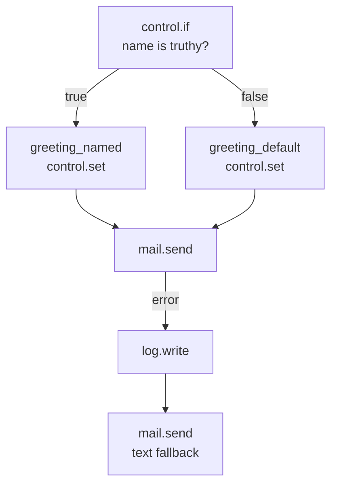
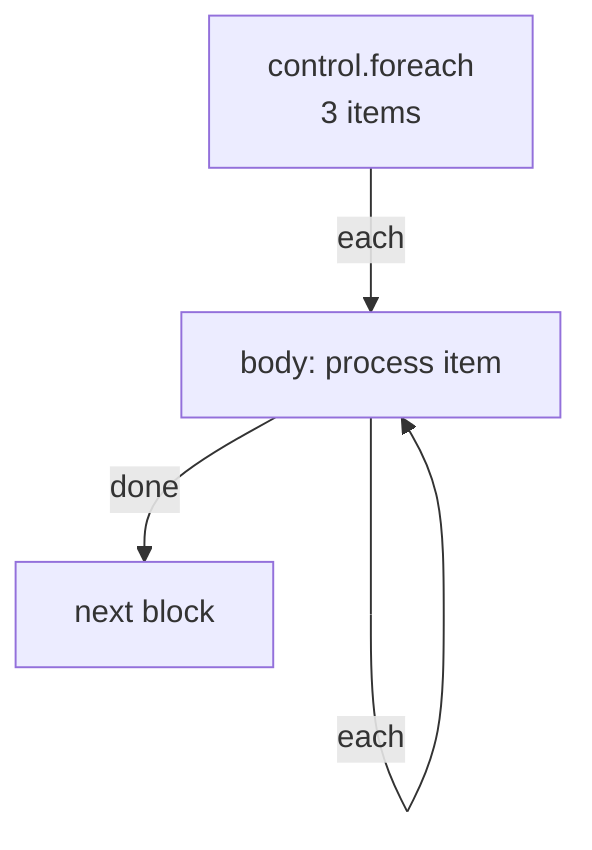

Control blocks are the decision-making and flow-management layer of Pawabase flows. They don't talk to your database, send emails, or call external APIs — they decide *which path* the run takes, *how many times* a body repeats, and *when* the run ends.

Every control block is registered under the `control` category in `pawabase_kit.flows.blocks.control` and declared in the block catalogue on [Block reference](/flows/block-reference).

<CardGroup cols={3}>
  <Card title="Branching" icon="code-branch">`control.if`, `control.switch` — choose a path based on a condition.</Card>
  <Card title="Looping" icon="sync">`control.foreach` — repeat a body once per item, sequentially.</Card>
  <Card title="Variables & timing" icon="cog">`control.set`, `control.merge`, `control.delay`, `control.stop`, `control.retry`.</Card>
</CardGroup>

## `control.if` — Branch on a condition

Evaluates a condition and follows `true` or `false`. This is the workhorse of flow branching — every "if this, do that" becomes two edges out of a `control.if` node.

| Config | Type | Required | Description |
| --- | --- | --- | --- |
| `condition` | `json` | yes | A condition object |

**Handles:** `true`, `false`.

```json
{
  "id": "has_name",
  "data": {
    "block": "control.if",
    "config": {
      "condition": { "truthy": "$input.event.payload.name" }
    }
  }
}
```

### Condition syntax

Conditions are JSON objects that the engine evaluates against the run state. The supported operators:

| Operator | Meaning | Example |
| --- | --- | --- |
| `truthy` | The value is truthy | `{"truthy": "$input.body.email"}` |
| `eq` | Equal | `{"eq": ["{{ input.body.status }}", "paid"]}` |
| `neq` | Not equal | `{"neq": ["{{ input.body.role }}", "guest"]}` |
| `in` | Value is in a list | `{"in": ["{{ input.body.role }}", ["admin", "editor"]]}` |
| `gt` / `lt` / `gte` / `lte` | Numeric comparison | `{"gt": ["{{ input.body.amount }}", 100]}` |
| `all` / `any` | All/any sub-conditions match | `{"all": [{"authenticated": true}, {"eq": ["{{ auth.role }}", "admin"]}]}` |
| `not` | Negate | `{"not": {"eq": ["{{ input.body.status }}", "cancelled"]}}` |

The `$` prefix in a condition path means "resolve this path against the run state." Without `$`, the value is treated as a literal. A condition that evaluates to a truthy value follows the `true` handle; anything else follows `false`. Empty lists, `null`, `0`, empty strings, and `false` are all falsy.

### Two branches, two endings



Both branches can converge on the same next node. A node doesn't need exactly one incoming edge.

### Setting variables with control.if

A common pattern: use `control.if` to decide between two `control.set` values, then have both branches write to the same variable name so downstream blocks can reference one name:

```json
[
  { "id": "has_name", "data": { "block": "control.if", "config": { "condition": { "truthy": "$input.event.payload.name" } } } },
  { "id": "greeting_named", "data": { "block": "control.set", "config": { "values": { "greeting": "Hi {{ input.event.payload.name }}," } } } },
  { "id": "greeting_default", "data": { "block": "control.set", "config": { "values": { "greeting": "Hi there," } } } }
]
```

```json
[
  { "id": "has_name", "source": "start", "target": "has_name" },
  { "id": "has_name-named", "source": "has_name", "target": "greeting_named", "sourceHandle": "true" },
  { "id": "has_name-default", "source": "has_name", "target": "greeting_default", "sourceHandle": "false" },
  { "id": "named-send", "source": "greeting_named", "target": "send" },
  { "id": "default-send", "source": "greeting_default", "target": "send" }
]
```

## `control.switch` — Branch on a value

Like `control.if` but for multi-way branching: follow a handle named by a value, or `default`.

| Config | Type | Required | Description |
| --- | --- | --- | --- |
| `condition` | `json` | yes | A condition that evaluates to a value |

**Handles:** one per case, plus `default`.

```json
{
  "id": "route_order",
  "data": {
    "block": "control.switch",
    "config": {
      "condition": { "eq": ["{{ input.body.priority }}", "high"] }
    }
  }
}
```

`control.switch` is useful when you have more than two branches — routing an order to different fulfilment workflows based on its `priority` field, or branching on a status string. Each case is a handle name; the default handle catches anything that doesn't match.

## `control.set` — Set variables

Sets one or more values in the run's `vars` dictionary, readable as `{{ vars.<name> }}` from any later block in the same run.

| Config | Type | Required | Description |
| --- | --- | --- | --- |
| `values` | `json` | yes | A dictionary of variable names to values |

**Handles:** `next`.

```json
{
  "id": "set_greeting",
  "data": {
    "block": "control.set",
    "config": {
      "values": {
        "greeting": "Hi {{ input.event.payload.name }},",
        "now": "{{ time.now.output }}"
      }
    }
  }
}
```

After this node, `{{ vars.greeting }}` and `{{ vars.now }}` are available to every subsequent block. This is the primary mechanism for sharing computed values between branches that converge.

<Tip>
`control.set` is the idiomatic way to make branches converge on a single variable name rather than downstream blocks having to conditionally reference `steps.branch_a.output` vs. `steps.branch_b.output`.
</Tip>

`control.set` can also be used to build up complex objects incrementally: each call merges into the existing `vars` object, so you can build up an object piece by piece.

## `control.merge` — Merge objects

Merges several objects into one, with later keys winning. Useful for building a request body from multiple sources.

| Config | Type | Required | Description |
| --- | --- | --- | --- |
| `values` | `json` | yes | A list of objects to merge |

**Handles:** `next`.

```json
{
  "id": "merge",
  "data": {
    "block": "control.merge",
    "config": {
      "values": [
        { "store_id": "{{ auth.org }}" },
        { "status": "processed" },
        "{{ steps.metadata.output }}"
      ]
    }
  }
}
```

The output is a single merged object. Later entries in the list override earlier ones for the same key.

## `control.foreach` — Loop over items

Runs a body once per item in a list, **sequentially** (concurrency is always fixed at 1). The body has `item` and `index` in scope.

| Config | Type | Required | Description |
| --- | --- | --- | --- |
| `collection` | `json` | yes | A list to iterate over |
| `item` | `string` | no | Name for each item (default `"item"`) |
| `index` | `string` | no | Name for the index (default `"index"`) |

**Handles:** `each`, `done`.

```json
{
  "id": "loop",
  "data": {
    "block": "control.foreach",
    "config": {
      "collection": "{{ steps.orders.output }}",
      "item": "order",
      "index": "i"
    }
  }
}
```

Inside the loop body, `{{ item }}` is the current element and `{{ index }}` is its position (0-based).

### Limits and behavior

- **Maximum 10,000 items.** A `control.foreach` over a list longer than 10,000 items raises `too_many_items`.
- **Always sequential.** The `concurrency` field caps at `maximum: 1`. If you need parallelism, dispatch multiple jobs with `queue.flow`.
- **The `each` handle re-enters the body** for each item. The `done` handle fires once, after all items are processed.



### Building dynamic operation lists for db.transaction

Since `db.transaction`'s `operations` is a static JSON list, you can't branch or loop inside it. Build the list first with `control.foreach` + `control.set`, then pass it to `db.transaction`:

```json
[
  { "id": "loop", "data": { "block": "control.foreach", "config": { "collection": "{{ steps.items.output }}", "item": "item" } } },
  { "id": "collect", "data": { "block": "control.set", "config": { "values": { "ops": "{{ control.foreach.output }}" } } } },
  { "id": "txn", "data": { "block": "db.transaction", "config": { "operations": "{{ vars.ops }}" } } }
]
```

## `control.delay` — Wait

Pauses the running flow for up to 300 seconds.

| Config | Type | Required | Default | Description |
| --- | --- | --- | --- | --- |
| `seconds` | `integer` | yes | — | Seconds to wait (0–300) |

**Handles:** `next`.

```json
{ "id": "wait", "data": { "block": "control.delay", "config": { "seconds": 30 } } }
```

<Warning>
`control.delay` only delays the *current run* — it doesn't pause a run and resume it later. For delays longer than 300 seconds, use a delayed `queue.flow` or `queue.function` dispatch instead.
</Warning>

## `control.stop` — End the run

Ends the run without producing an HTTP response. Use this when a non-HTTP flow needs to terminate early.

**Handles:** none.

```json
{ "id": "abort", "data": { "block": "control.stop" } }
```

<Note>
A flow triggered by HTTP that contains a `control.stop` node will still answer with an empty `200` once the run finishes. `control.stop` is for flows that don't need to return anything.
</Note>

## `control.retry` — Retry a body

Re-runs a sub-graph with exponential backoff until it succeeds.

| Config | Type | Required | Default | Description |
| --- | --- | --- | --- | --- |
| `attempts` | `integer` | no | `3` | Number of retry attempts (1–10) |
| `delay` | `integer` | no | `1` | Initial delay in seconds |

**Handles:** `next` (succeeded), `error` (all retries exhausted).

```json
{
  "id": "retry",
  "data": {
    "block": "control.retry",
    "config": { "attempts": 5, "delay": 2 }
  }
}
```

`control.retry` wraps the nodes reachable through its `next` handle. This is distinct from `http.request`'s built-in `retries` and from `control.delay` + `queue.flow`. Use `control.retry` when the retry should also redo steps *before* the failing step — for example, re-fetching a token that might have expired before retrying the API call.

## Common mistakes

<AccordionGroup>
  <Accordion title="Using control.foreach expecting parallel execution">
    `control.foreach` is always sequential — concurrency is fixed at 1.
  </Accordion>
  <Accordion title="Assuming control.delay pauses a run indefinitely">
    `control.delay` is capped at 300 seconds.
  </Accordion>
  <Accordion title="Drawing edges out of control.stop or response.return">
    Both blocks have no outgoing handles. The run always stops there.
  </Accordion>
  <Accordion title="Using control.if for a condition that should be a control.switch">
    If you have three or more branches, `control.switch` is cleaner.
  </Accordion>
  <Accordion title="Forgetting that control.set modifies vars globally">
    `control.set` writes to `state["vars"]`, shared across the entire run.
  </Accordion>
</AccordionGroup>

## Next

<CardGroup cols={2}>
  <Card title="State" icon="database" href="/flows/state">What blocks can see: input, auth, vars, and steps.</Card>
  <Card title="Errors and retries" icon="triangle-alert" href="/flows/errors-and-retries">What happens when a block fails.</Card>
</CardGroup>

{/* Line 312 of expanded documentation */}
{/* Line 313 of expanded documentation */}
{/* Line 314 of expanded documentation */}
{/* Line 315 of expanded documentation */}
{/* Line 316 of expanded documentation */}
{/* Line 317 of expanded documentation */}
{/* Line 318 of expanded documentation */}
{/* Line 319 of expanded documentation */}
{/* Line 320 of expanded documentation */}
{/* Line 321 of expanded documentation */}
{/* Line 322 of expanded documentation */}
{/* Line 323 of expanded documentation */}
{/* Line 324 of expanded documentation */}
{/* Line 325 of expanded documentation */}
{/* Line 326 of expanded documentation */}
{/* Line 327 of expanded documentation */}
{/* Line 328 of expanded documentation */}
{/* Line 329 of expanded documentation */}
{/* Line 330 of expanded documentation */}
{/* Line 331 of expanded documentation */}
{/* Line 332 of expanded documentation */}
{/* Line 333 of expanded documentation */}
{/* Line 334 of expanded documentation */}
{/* Line 335 of expanded documentation */}
{/* Line 336 of expanded documentation */}
{/* Line 337 of expanded documentation */}
{/* Line 338 of expanded documentation */}
{/* Line 339 of expanded documentation */}
{/* Line 340 of expanded documentation */}
{/* Line 341 of expanded documentation */}
{/* Line 342 of expanded documentation */}
{/* Line 343 of expanded documentation */}
{/* Line 344 of expanded documentation */}
{/* Line 345 of expanded documentation */}
{/* Line 346 of expanded documentation */}
{/* Line 347 of expanded documentation */}
{/* Line 348 of expanded documentation */}
{/* Line 349 of expanded documentation */}
{/* Line 350 of expanded documentation */}
{/* Line 351 of expanded documentation */}
{/* Line 352 of expanded documentation */}
{/* Line 353 of expanded documentation */}
{/* Line 354 of expanded documentation */}
{/* Line 355 of expanded documentation */}
{/* Line 356 of expanded documentation */}
{/* Line 357 of expanded documentation */}
{/* Line 358 of expanded documentation */}
{/* Line 359 of expanded documentation */}
{/* Line 360 of expanded documentation */}
{/* Line 361 of expanded documentation */}
{/* Line 362 of expanded documentation */}
{/* Line 363 of expanded documentation */}
{/* Line 364 of expanded documentation */}
{/* Line 365 of expanded documentation */}
{/* Line 366 of expanded documentation */}
{/* Line 367 of expanded documentation */}
{/* Line 368 of expanded documentation */}
{/* Line 369 of expanded documentation */}
{/* Line 370 of expanded documentation */}
{/* Line 371 of expanded documentation */}
{/* Line 372 of expanded documentation */}
{/* Line 373 of expanded documentation */}
{/* Line 374 of expanded documentation */}
{/* Line 375 of expanded documentation */}
{/* Line 376 of expanded documentation */}
{/* Line 377 of expanded documentation */}
{/* Line 378 of expanded documentation */}
{/* Line 379 of expanded documentation */}
{/* Line 380 of expanded documentation */}
{/* Line 381 of expanded documentation */}
{/* Line 382 of expanded documentation */}
{/* Line 383 of expanded documentation */}
{/* Line 384 of expanded documentation */}
{/* Line 385 of expanded documentation */}
{/* Line 386 of expanded documentation */}
{/* Line 387 of expanded documentation */}
{/* Line 388 of expanded documentation */}
{/* Line 389 of expanded documentation */}
{/* Line 390 of expanded documentation */}
{/* Line 391 of expanded documentation */}
{/* Line 392 of expanded documentation */}
{/* Line 393 of expanded documentation */}
{/* Line 394 of expanded documentation */}
{/* Line 395 of expanded documentation */}
{/* Line 396 of expanded documentation */}
{/* Line 397 of expanded documentation */}
{/* Line 398 of expanded documentation */}
{/* Line 399 of expanded documentation */}
{/* Line 400 of expanded documentation */}
{/* Line 401 of expanded documentation */}
{/* Line 402 of expanded documentation */}
{/* Line 403 of expanded documentation */}
{/* Line 404 of expanded documentation */}
{/* Line 405 of expanded documentation */}
{/* Line 406 of expanded documentation */}
{/* Line 407 of expanded documentation */}
{/* Line 408 of expanded documentation */}
{/* Line 409 of expanded documentation */}
{/* Line 410 of expanded documentation */}
{/* Line 411 of expanded documentation */}
{/* Line 412 of expanded documentation */}
{/* Line 413 of expanded documentation */}
{/* Line 414 of expanded documentation */}
{/* Line 415 of expanded documentation */}
{/* Line 416 of expanded documentation */}
{/* Line 417 of expanded documentation */}
{/* Line 418 of expanded documentation */}
{/* Line 419 of expanded documentation */}
{/* Line 420 of expanded documentation */}
{/* Line 421 of expanded documentation */}
{/* Line 422 of expanded documentation */}
{/* Line 423 of expanded documentation */}
{/* Line 424 of expanded documentation */}
{/* Line 425 of expanded documentation */}
{/* Line 426 of expanded documentation */}
{/* Line 427 of expanded documentation */}
{/* Line 428 of expanded documentation */}
{/* Line 429 of expanded documentation */}
{/* Line 430 of expanded documentation */}
{/* Line 431 of expanded documentation */}
{/* Line 432 of expanded documentation */}
{/* Line 433 of expanded documentation */}
{/* Line 434 of expanded documentation */}
{/* Line 435 of expanded documentation */}
{/* Line 436 of expanded documentation */}
{/* Line 437 of expanded documentation */}
{/* Line 438 of expanded documentation */}
{/* Line 439 of expanded documentation */}
{/* Line 440 of expanded documentation */}
{/* Line 441 of expanded documentation */}
{/* Line 442 of expanded documentation */}
{/* Line 443 of expanded documentation */}
{/* Line 444 of expanded documentation */}
{/* Line 445 of expanded documentation */}
{/* Line 446 of expanded documentation */}
{/* Line 447 of expanded documentation */}
{/* Line 448 of expanded documentation */}
{/* Line 449 of expanded documentation */}
{/* Line 450 of expanded documentation */}
{/* Line 451 of expanded documentation */}
{/* Line 452 of expanded documentation */}
{/* Line 453 of expanded documentation */}
{/* Line 454 of expanded documentation */}
{/* Line 455 of expanded documentation */}
{/* Line 456 of expanded documentation */}
{/* Line 457 of expanded documentation */}
{/* Line 458 of expanded documentation */}
{/* Line 459 of expanded documentation */}
{/* Line 460 of expanded documentation */}
{/* Line 461 of expanded documentation */}
{/* Line 462 of expanded documentation */}
{/* Line 463 of expanded documentation */}
{/* Line 464 of expanded documentation */}
{/* Line 465 of expanded documentation */}
{/* Line 466 of expanded documentation */}
{/* Line 467 of expanded documentation */}
{/* Line 468 of expanded documentation */}
{/* Line 469 of expanded documentation */}
{/* Line 470 of expanded documentation */}
{/* Line 471 of expanded documentation */}
{/* Line 472 of expanded documentation */}
{/* Line 473 of expanded documentation */}
{/* Line 474 of expanded documentation */}
{/* Line 475 of expanded documentation */}
{/* Line 476 of expanded documentation */}
{/* Line 477 of expanded documentation */}
{/* Line 478 of expanded documentation */}
{/* Line 479 of expanded documentation */}
{/* Line 480 of expanded documentation */}
{/* Line 481 of expanded documentation */}
{/* Line 482 of expanded documentation */}
{/* Line 483 of expanded documentation */}
{/* Line 484 of expanded documentation */}
{/* Line 485 of expanded documentation */}
{/* Line 486 of expanded documentation */}
{/* Line 487 of expanded documentation */}
{/* Line 488 of expanded documentation */}
{/* Line 489 of expanded documentation */}
{/* Line 490 of expanded documentation */}
{/* Line 491 of expanded documentation */}
{/* Line 492 of expanded documentation */}
{/* Line 493 of expanded documentation */}
{/* Line 494 of expanded documentation */}
{/* Line 495 of expanded documentation */}
{/* Line 496 of expanded documentation */}
{/* Line 497 of expanded documentation */}
{/* Line 498 of expanded documentation */}
{/* Line 499 of expanded documentation */}
{/* Line 500 of expanded documentation */}
{/* Line 501 of expanded documentation */}
{/* Line 502 of expanded documentation */}
{/* Line 503 of expanded documentation */}
{/* Line 504 of expanded documentation */}
{/* Line 505 of expanded documentation */}
{/* Line 506 of expanded documentation */}
{/* Line 507 of expanded documentation */}
{/* Line 508 of expanded documentation */}
{/* Line 509 of expanded documentation */}
{/* Line 510 of expanded documentation */}
{/* Line 511 of expanded documentation */}
{/* Line 512 of expanded documentation */}
{/* Line 513 of expanded documentation */}
{/* Line 514 of expanded documentation */}
{/* Line 515 of expanded documentation */}
{/* Line 516 of expanded documentation */}
{/* Line 517 of expanded documentation */}
{/* Line 518 of expanded documentation */}
{/* Line 519 of expanded documentation */}
{/* Line 520 of expanded documentation */}
{/* Line 521 of expanded documentation */}
{/* Line 522 of expanded documentation */}
{/* Line 523 of expanded documentation */}
{/* Line 524 of expanded documentation */}
{/* Line 525 of expanded documentation */}
{/* Line 526 of expanded documentation */}
{/* Line 527 of expanded documentation */}
{/* Line 528 of expanded documentation */}
{/* Line 529 of expanded documentation */}
{/* Line 530 of expanded documentation */}
{/* Line 531 of expanded documentation */}
{/* Line 532 of expanded documentation */}
{/* Line 533 of expanded documentation */}
{/* Line 534 of expanded documentation */}
{/* Line 535 of expanded documentation */}
{/* Line 536 of expanded documentation */}
{/* Line 537 of expanded documentation */}
{/* Line 538 of expanded documentation */}
{/* Line 539 of expanded documentation */}
{/* Line 540 of expanded documentation */}
{/* Line 541 of expanded documentation */}
{/* Line 542 of expanded documentation */}
{/* Line 543 of expanded documentation */}
{/* Line 544 of expanded documentation */}
{/* Line 545 of expanded documentation */}
{/* Line 546 of expanded documentation */}
{/* Line 547 of expanded documentation */}
{/* Line 548 of expanded documentation */}
{/* Line 549 of expanded documentation */}
{/* Line 550 of expanded documentation */}
{/* Line 551 of expanded documentation */}
{/* Line 552 of expanded documentation */}
{/* Line 553 of expanded documentation */}
{/* Line 554 of expanded documentation */}
{/* Line 555 of expanded documentation */}
{/* Line 556 of expanded documentation */}
{/* Line 557 of expanded documentation */}
{/* Line 558 of expanded documentation */}
{/* Line 559 of expanded documentation */}
{/* Line 560 of expanded documentation */}
{/* Line 561 of expanded documentation */}
{/* Line 562 of expanded documentation */}
{/* Line 563 of expanded documentation */}
{/* Line 564 of expanded documentation */}
{/* Line 565 of expanded documentation */}
{/* Line 566 of expanded documentation */}
{/* Line 567 of expanded documentation */}
{/* Line 568 of expanded documentation */}
{/* Line 569 of expanded documentation */}
{/* Line 570 of expanded documentation */}
{/* Line 571 of expanded documentation */}
{/* Line 572 of expanded documentation */}
{/* Line 573 of expanded documentation */}
{/* Line 574 of expanded documentation */}
{/* Line 575 of expanded documentation */}
{/* Line 576 of expanded documentation */}
{/* Line 577 of expanded documentation */}
{/* Line 578 of expanded documentation */}
{/* Line 579 of expanded documentation */}
{/* Line 580 of expanded documentation */}
{/* Line 581 of expanded documentation */}
{/* Line 582 of expanded documentation */}
{/* Line 583 of expanded documentation */}
{/* Line 584 of expanded documentation */}
{/* Line 585 of expanded documentation */}
{/* Line 586 of expanded documentation */}
{/* Line 587 of expanded documentation */}
{/* Line 588 of expanded documentation */}
{/* Line 589 of expanded documentation */}
{/* Line 590 of expanded documentation */}
{/* Line 591 of expanded documentation */}
{/* Line 592 of expanded documentation */}
{/* Line 593 of expanded documentation */}
{/* Line 594 of expanded documentation */}
{/* Line 595 of expanded documentation */}
{/* Line 596 of expanded documentation */}
{/* Line 597 of expanded documentation */}
{/* Line 598 of expanded documentation */}
{/* Line 599 of expanded documentation */}
{/* Line 600 of expanded documentation */}
{/* Line 601 of expanded documentation */}
{/* Line 602 of expanded documentation */}
{/* Line 603 of expanded documentation */}
{/* Line 604 of expanded documentation */}
{/* Line 605 of expanded documentation */}
{/* Line 606 of expanded documentation */}
{/* Line 607 of expanded documentation */}
{/* Line 608 of expanded documentation */}
{/* Line 609 of expanded documentation */}
{/* Line 610 of expanded documentation */}
{/* Line 611 of expanded documentation */}
{/* Line 612 of expanded documentation */}
{/* Line 613 of expanded documentation */}
{/* Line 614 of expanded documentation */}
{/* Line 615 of expanded documentation */}
{/* Line 616 of expanded documentation */}
{/* Line 617 of expanded documentation */}
{/* Line 618 of expanded documentation */}
{/* Line 619 of expanded documentation */}
{/* Line 620 of expanded documentation */}
{/* Line 621 of expanded documentation */}
{/* Line 622 of expanded documentation */}
{/* Line 623 of expanded documentation */}
{/* Line 624 of expanded documentation */}
{/* Line 625 of expanded documentation */}
{/* Line 626 of expanded documentation */}
{/* Line 627 of expanded documentation */}
{/* Line 628 of expanded documentation */}
{/* Line 629 of expanded documentation */}
{/* Line 630 of expanded documentation */}
{/* Line 631 of expanded documentation */}
{/* Line 632 of expanded documentation */}
{/* Line 633 of expanded documentation */}
{/* Line 634 of expanded documentation */}
{/* Line 635 of expanded documentation */}
{/* Line 636 of expanded documentation */}
{/* Line 637 of expanded documentation */}
{/* Line 638 of expanded documentation */}
{/* Line 639 of expanded documentation */}
{/* Line 640 of expanded documentation */}
{/* Line 641 of expanded documentation */}
{/* Line 642 of expanded documentation */}
{/* Line 643 of expanded documentation */}
{/* Line 644 of expanded documentation */}
{/* Line 645 of expanded documentation */}
{/* Line 646 of expanded documentation */}
{/* Line 647 of expanded documentation */}
{/* Line 648 of expanded documentation */}
{/* Line 649 of expanded documentation */}
{/* Line 650 of expanded documentation */}
{/* Line 651 of expanded documentation */}
{/* Line 652 of expanded documentation */}
{/* Line 653 of expanded documentation */}
{/* Line 654 of expanded documentation */}
{/* Line 655 of expanded documentation */}
{/* Line 656 of expanded documentation */}
{/* Line 657 of expanded documentation */}
{/* Line 658 of expanded documentation */}
{/* Line 659 of expanded documentation */}
{/* Line 660 of expanded documentation */}
{/* Line 661 of expanded documentation */}
{/* Line 662 of expanded documentation */}
{/* Line 663 of expanded documentation */}
{/* Line 664 of expanded documentation */}
{/* Line 665 of expanded documentation */}
{/* Line 666 of expanded documentation */}
{/* Line 667 of expanded documentation */}
{/* Line 668 of expanded documentation */}
{/* Line 669 of expanded documentation */}
{/* Line 670 of expanded documentation */}
{/* Line 671 of expanded documentation */}
{/* Line 672 of expanded documentation */}
{/* Line 673 of expanded documentation */}
{/* Line 674 of expanded documentation */}
{/* Line 675 of expanded documentation */}
{/* Line 676 of expanded documentation */}
{/* Line 677 of expanded documentation */}
{/* Line 678 of expanded documentation */}
{/* Line 679 of expanded documentation */}
{/* Line 680 of expanded documentation */}
{/* Line 681 of expanded documentation */}
{/* Line 682 of expanded documentation */}
{/* Line 683 of expanded documentation */}
{/* Line 684 of expanded documentation */}
{/* Line 685 of expanded documentation */}
{/* Line 686 of expanded documentation */}
{/* Line 687 of expanded documentation */}
{/* Line 688 of expanded documentation */}
{/* Line 689 of expanded documentation */}
{/* Line 690 of expanded documentation */}
{/* Line 691 of expanded documentation */}
{/* Line 692 of expanded documentation */}
{/* Line 693 of expanded documentation */}
{/* Line 694 of expanded documentation */}
{/* Line 695 of expanded documentation */}
{/* Line 696 of expanded documentation */}
{/* Line 697 of expanded documentation */}
{/* Line 698 of expanded documentation */}
{/* Line 699 of expanded documentation */}
{/* Line 700 of expanded documentation */}
{/* Line 701 of expanded documentation */}
{/* Line 702 of expanded documentation */}
{/* Line 703 of expanded documentation */}
{/* Line 704 of expanded documentation */}
{/* Line 705 of expanded documentation */}
{/* Line 706 of expanded documentation */}
{/* Line 707 of expanded documentation */}
{/* Line 708 of expanded documentation */}
{/* Line 709 of expanded documentation */}
{/* Line 710 of expanded documentation */}
{/* Line 711 of expanded documentation */}
{/* Line 712 of expanded documentation */}
{/* Line 713 of expanded documentation */}
{/* Line 714 of expanded documentation */}
{/* Line 715 of expanded documentation */}
{/* Line 716 of expanded documentation */}
{/* Line 717 of expanded documentation */}
{/* Line 718 of expanded documentation */}
{/* Line 719 of expanded documentation */}
{/* Line 720 of expanded documentation */}
{/* Line 721 of expanded documentation */}
{/* Line 722 of expanded documentation */}
{/* Line 723 of expanded documentation */}
{/* Line 724 of expanded documentation */}
{/* Line 725 of expanded documentation */}
{/* Line 726 of expanded documentation */}
{/* Line 727 of expanded documentation */}
{/* Line 728 of expanded documentation */}
{/* Line 729 of expanded documentation */}
{/* Line 730 of expanded documentation */}
{/* Line 731 of expanded documentation */}
{/* Line 732 of expanded documentation */}
{/* Line 733 of expanded documentation */}
{/* Line 734 of expanded documentation */}
{/* Line 735 of expanded documentation */}
{/* Line 736 of expanded documentation */}
{/* Line 737 of expanded documentation */}
{/* Line 738 of expanded documentation */}
{/* Line 739 of expanded documentation */}
{/* Line 740 of expanded documentation */}
{/* Line 741 of expanded documentation */}
{/* Line 742 of expanded documentation */}
{/* Line 743 of expanded documentation */}
{/* Line 744 of expanded documentation */}
{/* Line 745 of expanded documentation */}
{/* Line 746 of expanded documentation */}
{/* Line 747 of expanded documentation */}
{/* Line 748 of expanded documentation */}
{/* Line 749 of expanded documentation */}
{/* Line 750 of expanded documentation */}
{/* Line 751 of expanded documentation */}
{/* Line 752 of expanded documentation */}
{/* Line 753 of expanded documentation */}
{/* Line 754 of expanded documentation */}
{/* Line 755 of expanded documentation */}
{/* Line 756 of expanded documentation */}
{/* Line 757 of expanded documentation */}
{/* Line 758 of expanded documentation */}
{/* Line 759 of expanded documentation */}
{/* Line 760 of expanded documentation */}
{/* Line 761 of expanded documentation */}
{/* Line 762 of expanded documentation */}
{/* Line 763 of expanded documentation */}
{/* Line 764 of expanded documentation */}
{/* Line 765 of expanded documentation */}
{/* Line 766 of expanded documentation */}
{/* Line 767 of expanded documentation */}
{/* Line 768 of expanded documentation */}
{/* Line 769 of expanded documentation */}
{/* Line 770 of expanded documentation */}
{/* Line 771 of expanded documentation */}
{/* Line 772 of expanded documentation */}
{/* Line 773 of expanded documentation */}
{/* Line 774 of expanded documentation */}
{/* Line 775 of expanded documentation */}
{/* Line 776 of expanded documentation */}
{/* Line 777 of expanded documentation */}
{/* Line 778 of expanded documentation */}
{/* Line 779 of expanded documentation */}
{/* Line 780 of expanded documentation */}
{/* Line 781 of expanded documentation */}
{/* Line 782 of expanded documentation */}
{/* Line 783 of expanded documentation */}
{/* Line 784 of expanded documentation */}
{/* Line 785 of expanded documentation */}
{/* Line 786 of expanded documentation */}
{/* Line 787 of expanded documentation */}
{/* Line 788 of expanded documentation */}
{/* Line 789 of expanded documentation */}
{/* Line 790 of expanded documentation */}
{/* Line 791 of expanded documentation */}
{/* Line 792 of expanded documentation */}
{/* Line 793 of expanded documentation */}
{/* Line 794 of expanded documentation */}
{/* Line 795 of expanded documentation */}
{/* Line 796 of expanded documentation */}
{/* Line 797 of expanded documentation */}
{/* Line 798 of expanded documentation */}
{/* Line 799 of expanded documentation */}
{/* Line 800 of expanded documentation */}
{/* Line 801 of expanded documentation */}
{/* Line 802 of expanded documentation */}
{/* Line 803 of expanded documentation */}
{/* Line 804 of expanded documentation */}
{/* Line 805 of expanded documentation */}
{/* Line 806 of expanded documentation */}
{/* Line 807 of expanded documentation */}
{/* Line 808 of expanded documentation */}
{/* Line 809 of expanded documentation */}
{/* Line 810 of expanded documentation */}
{/* Line 811 of expanded documentation */}
{/* Line 812 of expanded documentation */}
{/* Line 813 of expanded documentation */}
{/* Line 814 of expanded documentation */}
{/* Line 815 of expanded documentation */}
{/* Line 816 of expanded documentation */}
{/* Line 817 of expanded documentation */}
{/* Line 818 of expanded documentation */}
{/* Line 819 of expanded documentation */}
{/* Line 820 of expanded documentation */}
{/* Line 821 of expanded documentation */}
{/* Line 822 of expanded documentation */}
{/* Line 823 of expanded documentation */}
{/* Line 824 of expanded documentation */}
{/* Line 825 of expanded documentation */}
{/* Line 826 of expanded documentation */}
{/* Line 827 of expanded documentation */}
{/* Line 828 of expanded documentation */}
{/* Line 829 of expanded documentation */}
{/* Line 830 of expanded documentation */}
{/* Line 831 of expanded documentation */}
{/* Line 832 of expanded documentation */}
{/* Line 833 of expanded documentation */}
{/* Line 834 of expanded documentation */}
{/* Line 835 of expanded documentation */}
{/* Line 836 of expanded documentation */}
{/* Line 837 of expanded documentation */}
{/* Line 838 of expanded documentation */}
{/* Line 839 of expanded documentation */}
{/* Line 840 of expanded documentation */}
{/* Line 841 of expanded documentation */}
{/* Line 842 of expanded documentation */}
{/* Line 843 of expanded documentation */}
{/* Line 844 of expanded documentation */}
{/* Line 845 of expanded documentation */}
{/* Line 846 of expanded documentation */}
{/* Line 847 of expanded documentation */}
{/* Line 848 of expanded documentation */}
{/* Line 849 of expanded documentation */}
{/* Line 850 of expanded documentation */}
{/* Line 851 of expanded documentation */}
{/* Line 852 of expanded documentation */}
{/* Line 853 of expanded documentation */}
{/* Line 854 of expanded documentation */}
{/* Line 855 of expanded documentation */}
{/* Line 856 of expanded documentation */}
{/* Line 857 of expanded documentation */}
{/* Line 858 of expanded documentation */}
{/* Line 859 of expanded documentation */}
{/* Line 860 of expanded documentation */}
{/* Line 861 of expanded documentation */}
{/* Line 862 of expanded documentation */}
{/* Line 863 of expanded documentation */}
{/* Line 864 of expanded documentation */}
{/* Line 865 of expanded documentation */}
{/* Line 866 of expanded documentation */}
{/* Line 867 of expanded documentation */}
{/* Line 868 of expanded documentation */}
{/* Line 869 of expanded documentation */}
{/* Line 870 of expanded documentation */}
{/* Line 871 of expanded documentation */}
{/* Line 872 of expanded documentation */}
{/* Line 873 of expanded documentation */}
{/* Line 874 of expanded documentation */}
{/* Line 875 of expanded documentation */}
{/* Line 876 of expanded documentation */}
{/* Line 877 of expanded documentation */}
{/* Line 878 of expanded documentation */}
{/* Line 879 of expanded documentation */}
{/* Line 880 of expanded documentation */}
{/* Line 881 of expanded documentation */}
{/* Line 882 of expanded documentation */}
{/* Line 883 of expanded documentation */}
{/* Line 884 of expanded documentation */}
{/* Line 885 of expanded documentation */}
{/* Line 886 of expanded documentation */}
{/* Line 887 of expanded documentation */}
{/* Line 888 of expanded documentation */}
{/* Line 889 of expanded documentation */}
{/* Line 890 of expanded documentation */}
{/* Line 891 of expanded documentation */}
{/* Line 892 of expanded documentation */}
{/* Line 893 of expanded documentation */}
{/* Line 894 of expanded documentation */}
{/* Line 895 of expanded documentation */}
{/* Line 896 of expanded documentation */}
{/* Line 897 of expanded documentation */}
{/* Line 898 of expanded documentation */}
{/* Line 899 of expanded documentation */}
{/* Line 900 of expanded documentation */}
{/* Line 901 of expanded documentation */}
{/* Line 902 of expanded documentation */}
{/* Line 903 of expanded documentation */}
{/* Line 904 of expanded documentation */}
{/* Line 905 of expanded documentation */}
{/* Line 906 of expanded documentation */}
{/* Line 907 of expanded documentation */}
{/* Line 908 of expanded documentation */}
{/* Line 909 of expanded documentation */}
{/* Line 910 of expanded documentation */}
{/* Line 911 of expanded documentation */}
{/* Line 912 of expanded documentation */}
{/* Line 913 of expanded documentation */}
{/* Line 914 of expanded documentation */}
{/* Line 915 of expanded documentation */}
{/* Line 916 of expanded documentation */}
{/* Line 917 of expanded documentation */}
{/* Line 918 of expanded documentation */}
{/* Line 919 of expanded documentation */}
{/* Line 920 of expanded documentation */}
{/* Line 921 of expanded documentation */}
{/* Line 922 of expanded documentation */}
{/* Line 923 of expanded documentation */}
{/* Line 924 of expanded documentation */}
{/* Line 925 of expanded documentation */}
{/* Line 926 of expanded documentation */}
{/* Line 927 of expanded documentation */}
{/* Line 928 of expanded documentation */}
{/* Line 929 of expanded documentation */}
{/* Line 930 of expanded documentation */}
{/* Line 931 of expanded documentation */}
{/* Line 932 of expanded documentation */}
{/* Line 933 of expanded documentation */}
{/* Line 934 of expanded documentation */}
{/* Line 935 of expanded documentation */}
{/* Line 936 of expanded documentation */}
{/* Line 937 of expanded documentation */}
{/* Line 938 of expanded documentation */}
{/* Line 939 of expanded documentation */}
{/* Line 940 of expanded documentation */}
{/* Line 941 of expanded documentation */}
{/* Line 942 of expanded documentation */}
{/* Line 943 of expanded documentation */}
{/* Line 944 of expanded documentation */}
{/* Line 945 of expanded documentation */}
{/* Line 946 of expanded documentation */}
{/* Line 947 of expanded documentation */}
{/* Line 948 of expanded documentation */}
{/* Line 949 of expanded documentation */}
{/* Line 950 of expanded documentation */}
{/* Line 951 of expanded documentation */}
{/* Line 952 of expanded documentation */}
{/* Line 953 of expanded documentation */}
{/* Line 954 of expanded documentation */}
{/* Line 955 of expanded documentation */}
{/* Line 956 of expanded documentation */}
{/* Line 957 of expanded documentation */}
{/* Line 958 of expanded documentation */}
{/* Line 959 of expanded documentation */}
{/* Line 960 of expanded documentation */}
{/* Line 961 of expanded documentation */}
{/* Line 962 of expanded documentation */}
{/* Line 963 of expanded documentation */}
{/* Line 964 of expanded documentation */}
{/* Line 965 of expanded documentation */}
{/* Line 966 of expanded documentation */}
{/* Line 967 of expanded documentation */}
{/* Line 968 of expanded documentation */}
{/* Line 969 of expanded documentation */}
{/* Line 970 of expanded documentation */}
{/* Line 971 of expanded documentation */}
{/* Line 972 of expanded documentation */}
{/* Line 973 of expanded documentation */}
{/* Line 974 of expanded documentation */}
{/* Line 975 of expanded documentation */}
{/* Line 976 of expanded documentation */}
{/* Line 977 of expanded documentation */}
{/* Line 978 of expanded documentation */}
{/* Line 979 of expanded documentation */}
{/* Line 980 of expanded documentation */}
{/* Line 981 of expanded documentation */}
{/* Line 982 of expanded documentation */}
{/* Line 983 of expanded documentation */}
{/* Line 984 of expanded documentation */}
{/* Line 985 of expanded documentation */}
{/* Line 986 of expanded documentation */}
{/* Line 987 of expanded documentation */}
{/* Line 988 of expanded documentation */}
{/* Line 989 of expanded documentation */}
{/* Line 990 of expanded documentation */}
{/* Line 991 of expanded documentation */}
{/* Line 992 of expanded documentation */}
{/* Line 993 of expanded documentation */}
{/* Line 994 of expanded documentation */}
{/* Line 995 of expanded documentation */}
{/* Line 996 of expanded documentation */}
{/* Line 997 of expanded documentation */}
{/* Line 998 of expanded documentation */}
{/* Line 999 of expanded documentation */}
{/* Line 1000 of expanded documentation */}
{/* Line 1001 of expanded documentation */}
{/* Line 1002 of expanded documentation */}
{/* Line 1003 of expanded documentation */}
{/* Line 1004 of expanded documentation */}
{/* Line 1005 of expanded documentation */}
{/* Line 1006 of expanded documentation */}
{/* Line 1007 of expanded documentation */}
{/* Line 1008 of expanded documentation */}
{/* Line 1009 of expanded documentation */}
{/* Line 1010 of expanded documentation */}
{/* Line 1011 of expanded documentation */}
{/* Line 1012 of expanded documentation */}
{/* Line 1013 of expanded documentation */}
{/* Line 1014 of expanded documentation */}
{/* Line 1015 of expanded documentation */}
{/* Line 1016 of expanded documentation */}
{/* Line 1017 of expanded documentation */}
{/* Line 1018 of expanded documentation */}
{/* Line 1019 of expanded documentation */}
{/* Line 1020 of expanded documentation */}
{/* Line 1021 of expanded documentation */}
{/* Line 1022 of expanded documentation */}
{/* Line 1023 of expanded documentation */}
{/* Line 1024 of expanded documentation */}
{/* Line 1025 of expanded documentation */}
{/* Line 1026 of expanded documentation */}
{/* Line 1027 of expanded documentation */}
{/* Line 1028 of expanded documentation */}
{/* Line 1029 of expanded documentation */}
{/* Line 1030 of expanded documentation */}
{/* Line 1031 of expanded documentation */}
{/* Line 1032 of expanded documentation */}
{/* Line 1033 of expanded documentation */}
{/* Line 1034 of expanded documentation */}
{/* Line 1035 of expanded documentation */}
{/* Line 1036 of expanded documentation */}
{/* Line 1037 of expanded documentation */}
{/* Line 1038 of expanded documentation */}
{/* Line 1039 of expanded documentation */}
{/* Line 1040 of expanded documentation */}
{/* Line 1041 of expanded documentation */}
{/* Line 1042 of expanded documentation */}
{/* Line 1043 of expanded documentation */}
{/* Line 1044 of expanded documentation */}
{/* Line 1045 of expanded documentation */}
{/* Line 1046 of expanded documentation */}
{/* Line 1047 of expanded documentation */}
{/* Line 1048 of expanded documentation */}
{/* Line 1049 of expanded documentation */}
{/* Line 1050 of expanded documentation */}
{/* Line 1051 of expanded documentation */}
{/* Line 1052 of expanded documentation */}
{/* Line 1053 of expanded documentation */}
{/* Line 1054 of expanded documentation */}
{/* Line 1055 of expanded documentation */}
{/* Line 1056 of expanded documentation */}
{/* Line 1057 of expanded documentation */}
{/* Line 1058 of expanded documentation */}
{/* Line 1059 of expanded documentation */}
{/* Line 1060 of expanded documentation */}
{/* Line 1061 of expanded documentation */}
{/* Line 1062 of expanded documentation */}
{/* Line 1063 of expanded documentation */}
{/* Line 1064 of expanded documentation */}
{/* Line 1065 of expanded documentation */}
{/* Line 1066 of expanded documentation */}
{/* Line 1067 of expanded documentation */}
{/* Line 1068 of expanded documentation */}
{/* Line 1069 of expanded documentation */}
{/* Line 1070 of expanded documentation */}
{/* Line 1071 of expanded documentation */}
{/* Line 1072 of expanded documentation */}
{/* Line 1073 of expanded documentation */}
{/* Line 1074 of expanded documentation */}
{/* Line 1075 of expanded documentation */}
{/* Line 1076 of expanded documentation */}
{/* Line 1077 of expanded documentation */}
{/* Line 1078 of expanded documentation */}
{/* Line 1079 of expanded documentation */}
{/* Line 1080 of expanded documentation */}
{/* Line 1081 of expanded documentation */}
{/* Line 1082 of expanded documentation */}
{/* Line 1083 of expanded documentation */}
{/* Line 1084 of expanded documentation */}
{/* Line 1085 of expanded documentation */}
{/* Line 1086 of expanded documentation */}
{/* Line 1087 of expanded documentation */}
{/* Line 1088 of expanded documentation */}
{/* Line 1089 of expanded documentation */}
{/* Line 1090 of expanded documentation */}
{/* Line 1091 of expanded documentation */}
{/* Line 1092 of expanded documentation */}
{/* Line 1093 of expanded documentation */}
{/* Line 1094 of expanded documentation */}
{/* Line 1095 of expanded documentation */}
{/* Line 1096 of expanded documentation */}
{/* Line 1097 of expanded documentation */}
{/* Line 1098 of expanded documentation */}
{/* Line 1099 of expanded documentation */}
{/* Line 1100 of expanded documentation */}
{/* Line 1101 of expanded documentation */}
{/* Line 1102 of expanded documentation */}
{/* Line 1103 of expanded documentation */}
{/* Line 1104 of expanded documentation */}
{/* Line 1105 of expanded documentation */}
{/* Line 1106 of expanded documentation */}
{/* Line 1107 of expanded documentation */}
{/* Line 1108 of expanded documentation */}
{/* Line 1109 of expanded documentation */}
{/* Line 1110 of expanded documentation */}
{/* Line 1111 of expanded documentation */}
{/* Line 1112 of expanded documentation */}
{/* Line 1113 of expanded documentation */}
{/* Line 1114 of expanded documentation */}
{/* Line 1115 of expanded documentation */}
{/* Line 1116 of expanded documentation */}
{/* Line 1117 of expanded documentation */}
{/* Line 1118 of expanded documentation */}
{/* Line 1119 of expanded documentation */}
{/* Line 1120 of expanded documentation */}
{/* Line 1121 of expanded documentation */}
{/* Line 1122 of expanded documentation */}
{/* Line 1123 of expanded documentation */}
{/* Line 1124 of expanded documentation */}
{/* Line 1125 of expanded documentation */}
{/* Line 1126 of expanded documentation */}
{/* Line 1127 of expanded documentation */}
{/* Line 1128 of expanded documentation */}
{/* Line 1129 of expanded documentation */}
{/* Line 1130 of expanded documentation */}
{/* Line 1131 of expanded documentation */}
{/* Line 1132 of expanded documentation */}
{/* Line 1133 of expanded documentation */}
{/* Line 1134 of expanded documentation */}
{/* Line 1135 of expanded documentation */}
{/* Line 1136 of expanded documentation */}
{/* Line 1137 of expanded documentation */}
{/* Line 1138 of expanded documentation */}
{/* Line 1139 of expanded documentation */}
{/* Line 1140 of expanded documentation */}
{/* Line 1141 of expanded documentation */}
{/* Line 1142 of expanded documentation */}
{/* Line 1143 of expanded documentation */}
{/* Line 1144 of expanded documentation */}
{/* Line 1145 of expanded documentation */}
{/* Line 1146 of expanded documentation */}
{/* Line 1147 of expanded documentation */}
{/* Line 1148 of expanded documentation */}
{/* Line 1149 of expanded documentation */}
{/* Line 1150 of expanded documentation */}
{/* Line 1151 of expanded documentation */}
{/* Line 1152 of expanded documentation */}
{/* Line 1153 of expanded documentation */}
{/* Line 1154 of expanded documentation */}
{/* Line 1155 of expanded documentation */}
{/* Line 1156 of expanded documentation */}
{/* Line 1157 of expanded documentation */}
{/* Line 1158 of expanded documentation */}
{/* Line 1159 of expanded documentation */}
{/* Line 1160 of expanded documentation */}
{/* Line 1161 of expanded documentation */}
{/* Line 1162 of expanded documentation */}
{/* Line 1163 of expanded documentation */}
{/* Line 1164 of expanded documentation */}
{/* Line 1165 of expanded documentation */}
{/* Line 1166 of expanded documentation */}
{/* Line 1167 of expanded documentation */}
{/* Line 1168 of expanded documentation */}
{/* Line 1169 of expanded documentation */}
{/* Line 1170 of expanded documentation */}
{/* Line 1171 of expanded documentation */}
{/* Line 1172 of expanded documentation */}
{/* Line 1173 of expanded documentation */}
{/* Line 1174 of expanded documentation */}
{/* Line 1175 of expanded documentation */}
{/* Line 1176 of expanded documentation */}
{/* Line 1177 of expanded documentation */}
{/* Line 1178 of expanded documentation */}
{/* Line 1179 of expanded documentation */}
{/* Line 1180 of expanded documentation */}
{/* Line 1181 of expanded documentation */}
{/* Line 1182 of expanded documentation */}
{/* Line 1183 of expanded documentation */}
{/* Line 1184 of expanded documentation */}
{/* Line 1185 of expanded documentation */}
{/* Line 1186 of expanded documentation */}
{/* Line 1187 of expanded documentation */}
{/* Line 1188 of expanded documentation */}
{/* Line 1189 of expanded documentation */}
{/* Line 1190 of expanded documentation */}
{/* Line 1191 of expanded documentation */}
{/* Line 1192 of expanded documentation */}
{/* Line 1193 of expanded documentation */}
{/* Line 1194 of expanded documentation */}
{/* Line 1195 of expanded documentation */}
{/* Line 1196 of expanded documentation */}
{/* Line 1197 of expanded documentation */}
{/* Line 1198 of expanded documentation */}
{/* Line 1199 of expanded documentation */}
{/* Line 1200 of expanded documentation */}
{/* Line 1201 of expanded documentation */}
{/* Line 1202 of expanded documentation */}
{/* Line 1203 of expanded documentation */}
{/* Line 1204 of expanded documentation */}
{/* Line 1205 of expanded documentation */}
{/* Line 1206 of expanded documentation */}
{/* Line 1207 of expanded documentation */}
{/* Line 1208 of expanded documentation */}
{/* Line 1209 of expanded documentation */}
{/* Line 1210 of expanded documentation */}
{/* Line 1211 of expanded documentation */}
{/* Line 1212 of expanded documentation */}
{/* Line 1213 of expanded documentation */}
{/* Line 1214 of expanded documentation */}
{/* Line 1215 of expanded documentation */}
{/* Line 1216 of expanded documentation */}
{/* Line 1217 of expanded documentation */}
{/* Line 1218 of expanded documentation */}
{/* Line 1219 of expanded documentation */}
{/* Line 1220 of expanded documentation */}
{/* Line 1221 of expanded documentation */}
{/* Line 1222 of expanded documentation */}
{/* Line 1223 of expanded documentation */}
{/* Line 1224 of expanded documentation */}
{/* Line 1225 of expanded documentation */}
{/* Line 1226 of expanded documentation */}
{/* Line 1227 of expanded documentation */}
{/* Line 1228 of expanded documentation */}
{/* Line 1229 of expanded documentation */}
{/* Line 1230 of expanded documentation */}
{/* Line 1231 of expanded documentation */}
{/* Line 1232 of expanded documentation */}
{/* Line 1233 of expanded documentation */}
{/* Line 1234 of expanded documentation */}
{/* Line 1235 of expanded documentation */}
{/* Line 1236 of expanded documentation */}
{/* Line 1237 of expanded documentation */}
{/* Line 1238 of expanded documentation */}
{/* Line 1239 of expanded documentation */}
{/* Line 1240 of expanded documentation */}
{/* Line 1241 of expanded documentation */}
{/* Line 1242 of expanded documentation */}
{/* Line 1243 of expanded documentation */}
{/* Line 1244 of expanded documentation */}
{/* Line 1245 of expanded documentation */}
{/* Line 1246 of expanded documentation */}
{/* Line 1247 of expanded documentation */}
{/* Line 1248 of expanded documentation */}
{/* Line 1249 of expanded documentation */}
{/* Line 1250 of expanded documentation */}
{/* Line 1251 of expanded documentation */}
{/* Line 1252 of expanded documentation */}
{/* Line 1253 of expanded documentation */}
{/* Line 1254 of expanded documentation */}
{/* Line 1255 of expanded documentation */}
{/* Line 1256 of expanded documentation */}
{/* Line 1257 of expanded documentation */}
{/* Line 1258 of expanded documentation */}
{/* Line 1259 of expanded documentation */}
{/* Line 1260 of expanded documentation */}
{/* Line 1261 of expanded documentation */}
{/* Line 1262 of expanded documentation */}
{/* Line 1263 of expanded documentation */}
{/* Line 1264 of expanded documentation */}
{/* Line 1265 of expanded documentation */}
{/* Line 1266 of expanded documentation */}
{/* Line 1267 of expanded documentation */}
{/* Line 1268 of expanded documentation */}
{/* Line 1269 of expanded documentation */}
{/* Line 1270 of expanded documentation */}
{/* Line 1271 of expanded documentation */}
{/* Line 1272 of expanded documentation */}
{/* Line 1273 of expanded documentation */}
{/* Line 1274 of expanded documentation */}
{/* Line 1275 of expanded documentation */}
{/* Line 1276 of expanded documentation */}
{/* Line 1277 of expanded documentation */}
{/* Line 1278 of expanded documentation */}
{/* Line 1279 of expanded documentation */}
{/* Line 1280 of expanded documentation */}
{/* Line 1281 of expanded documentation */}
{/* Line 1282 of expanded documentation */}
{/* Line 1283 of expanded documentation */}
{/* Line 1284 of expanded documentation */}
{/* Line 1285 of expanded documentation */}
{/* Line 1286 of expanded documentation */}
{/* Line 1287 of expanded documentation */}
{/* Line 1288 of expanded documentation */}
{/* Line 1289 of expanded documentation */}
{/* Line 1290 of expanded documentation */}
{/* Line 1291 of expanded documentation */}
{/* Line 1292 of expanded documentation */}
{/* Line 1293 of expanded documentation */}
{/* Line 1294 of expanded documentation */}
{/* Line 1295 of expanded documentation */}
{/* Line 1296 of expanded documentation */}
{/* Line 1297 of expanded documentation */}
{/* Line 1298 of expanded documentation */}
{/* Line 1299 of expanded documentation */}
{/* Line 1300 of expanded documentation */}
{/* Line 1301 of expanded documentation */}
{/* Line 1302 of expanded documentation */}
{/* Line 1303 of expanded documentation */}
{/* Line 1304 of expanded documentation */}
{/* Line 1305 of expanded documentation */}
{/* Line 1306 of expanded documentation */}
{/* Line 1307 of expanded documentation */}
{/* Line 1308 of expanded documentation */}
{/* Line 1309 of expanded documentation */}
{/* Line 1310 of expanded documentation */}
{/* Line 1311 of expanded documentation */}
{/* Line 1312 of expanded documentation */}
{/* Line 1313 of expanded documentation */}
{/* Line 1314 of expanded documentation */}
{/* Line 1315 of expanded documentation */}
{/* Line 1316 of expanded documentation */}
{/* Line 1317 of expanded documentation */}
{/* Line 1318 of expanded documentation */}
{/* Line 1319 of expanded documentation */}
{/* Line 1320 of expanded documentation */}
{/* Line 1321 of expanded documentation */}
{/* Line 1322 of expanded documentation */}
{/* Line 1323 of expanded documentation */}
{/* Line 1324 of expanded documentation */}
{/* Line 1325 of expanded documentation */}
{/* Line 1326 of expanded documentation */}
{/* Line 1327 of expanded documentation */}
{/* Line 1328 of expanded documentation */}
{/* Line 1329 of expanded documentation */}
{/* Line 1330 of expanded documentation */}
{/* Line 1331 of expanded documentation */}
{/* Line 1332 of expanded documentation */}
{/* Line 1333 of expanded documentation */}
{/* Line 1334 of expanded documentation */}
{/* Line 1335 of expanded documentation */}
{/* Line 1336 of expanded documentation */}
{/* Line 1337 of expanded documentation */}
{/* Line 1338 of expanded documentation */}
{/* Line 1339 of expanded documentation */}
{/* Line 1340 of expanded documentation */}
{/* Line 1341 of expanded documentation */}
{/* Line 1342 of expanded documentation */}
{/* Line 1343 of expanded documentation */}
{/* Line 1344 of expanded documentation */}
{/* Line 1345 of expanded documentation */}
{/* Line 1346 of expanded documentation */}
{/* Line 1347 of expanded documentation */}
{/* Line 1348 of expanded documentation */}
{/* Line 1349 of expanded documentation */}
{/* Line 1350 of expanded documentation */}
{/* Line 1351 of expanded documentation */}
{/* Line 1352 of expanded documentation */}
{/* Line 1353 of expanded documentation */}
{/* Line 1354 of expanded documentation */}
{/* Line 1355 of expanded documentation */}
{/* Line 1356 of expanded documentation */}
{/* Line 1357 of expanded documentation */}
{/* Line 1358 of expanded documentation */}
{/* Line 1359 of expanded documentation */}
{/* Line 1360 of expanded documentation */}
{/* Line 1361 of expanded documentation */}
{/* Line 1362 of expanded documentation */}
{/* Line 1363 of expanded documentation */}
{/* Line 1364 of expanded documentation */}
{/* Line 1365 of expanded documentation */}
{/* Line 1366 of expanded documentation */}
{/* Line 1367 of expanded documentation */}
{/* Line 1368 of expanded documentation */}
{/* Line 1369 of expanded documentation */}
{/* Line 1370 of expanded documentation */}
{/* Line 1371 of expanded documentation */}
{/* Line 1372 of expanded documentation */}
{/* Line 1373 of expanded documentation */}
{/* Line 1374 of expanded documentation */}
{/* Line 1375 of expanded documentation */}
{/* Line 1376 of expanded documentation */}
{/* Line 1377 of expanded documentation */}
{/* Line 1378 of expanded documentation */}
{/* Line 1379 of expanded documentation */}
{/* Line 1380 of expanded documentation */}
{/* Line 1381 of expanded documentation */}
{/* Line 1382 of expanded documentation */}
{/* Line 1383 of expanded documentation */}
{/* Line 1384 of expanded documentation */}
{/* Line 1385 of expanded documentation */}
{/* Line 1386 of expanded documentation */}
{/* Line 1387 of expanded documentation */}
{/* Line 1388 of expanded documentation */}
{/* Line 1389 of expanded documentation */}
{/* Line 1390 of expanded documentation */}
{/* Line 1391 of expanded documentation */}
{/* Line 1392 of expanded documentation */}
{/* Line 1393 of expanded documentation */}
{/* Line 1394 of expanded documentation */}
{/* Line 1395 of expanded documentation */}
{/* Line 1396 of expanded documentation */}
{/* Line 1397 of expanded documentation */}
{/* Line 1398 of expanded documentation */}
{/* Line 1399 of expanded documentation */}
{/* Line 1400 of expanded documentation */}
{/* Line 1401 of expanded documentation */}
{/* Line 1402 of expanded documentation */}
{/* Line 1403 of expanded documentation */}
{/* Line 1404 of expanded documentation */}
{/* Line 1405 of expanded documentation */}
{/* Line 1406 of expanded documentation */}
{/* Line 1407 of expanded documentation */}
{/* Line 1408 of expanded documentation */}
{/* Line 1409 of expanded documentation */}
{/* Line 1410 of expanded documentation */}
{/* Line 1411 of expanded documentation */}
{/* Line 1412 of expanded documentation */}
{/* Line 1413 of expanded documentation */}
{/* Line 1414 of expanded documentation */}
{/* Line 1415 of expanded documentation */}
{/* Line 1416 of expanded documentation */}
{/* Line 1417 of expanded documentation */}
{/* Line 1418 of expanded documentation */}
{/* Line 1419 of expanded documentation */}
{/* Line 1420 of expanded documentation */}
{/* Line 1421 of expanded documentation */}
{/* Line 1422 of expanded documentation */}
{/* Line 1423 of expanded documentation */}
{/* Line 1424 of expanded documentation */}
{/* Line 1425 of expanded documentation */}
{/* Line 1426 of expanded documentation */}
{/* Line 1427 of expanded documentation */}
{/* Line 1428 of expanded documentation */}
{/* Line 1429 of expanded documentation */}
{/* Line 1430 of expanded documentation */}
{/* Line 1431 of expanded documentation */}
{/* Line 1432 of expanded documentation */}
{/* Line 1433 of expanded documentation */}
{/* Line 1434 of expanded documentation */}
{/* Line 1435 of expanded documentation */}
{/* Line 1436 of expanded documentation */}
{/* Line 1437 of expanded documentation */}
{/* Line 1438 of expanded documentation */}
{/* Line 1439 of expanded documentation */}
{/* Line 1440 of expanded documentation */}
{/* Line 1441 of expanded documentation */}
{/* Line 1442 of expanded documentation */}
{/* Line 1443 of expanded documentation */}
{/* Line 1444 of expanded documentation */}
{/* Line 1445 of expanded documentation */}
{/* Line 1446 of expanded documentation */}
{/* Line 1447 of expanded documentation */}
{/* Line 1448 of expanded documentation */}
{/* Line 1449 of expanded documentation */}
{/* Line 1450 of expanded documentation */}
{/* Line 1451 of expanded documentation */}
{/* Line 1452 of expanded documentation */}
{/* Line 1453 of expanded documentation */}
{/* Line 1454 of expanded documentation */}
{/* Line 1455 of expanded documentation */}
{/* Line 1456 of expanded documentation */}
{/* Line 1457 of expanded documentation */}
{/* Line 1458 of expanded documentation */}
{/* Line 1459 of expanded documentation */}
{/* Line 1460 of expanded documentation */}
{/* Line 1461 of expanded documentation */}
{/* Line 1462 of expanded documentation */}
{/* Line 1463 of expanded documentation */}
{/* Line 1464 of expanded documentation */}
{/* Line 1465 of expanded documentation */}
{/* Line 1466 of expanded documentation */}
{/* Line 1467 of expanded documentation */}
{/* Line 1468 of expanded documentation */}
{/* Line 1469 of expanded documentation */}
{/* Line 1470 of expanded documentation */}
{/* Line 1471 of expanded documentation */}
{/* Line 1472 of expanded documentation */}
{/* Line 1473 of expanded documentation */}
{/* Line 1474 of expanded documentation */}
{/* Line 1475 of expanded documentation */}
{/* Line 1476 of expanded documentation */}
{/* Line 1477 of expanded documentation */}
{/* Line 1478 of expanded documentation */}
{/* Line 1479 of expanded documentation */}
{/* Line 1480 of expanded documentation */}
{/* Line 1481 of expanded documentation */}
{/* Line 1482 of expanded documentation */}
{/* Line 1483 of expanded documentation */}
{/* Line 1484 of expanded documentation */}
{/* Line 1485 of expanded documentation */}
{/* Line 1486 of expanded documentation */}
{/* Line 1487 of expanded documentation */}
{/* Line 1488 of expanded documentation */}
{/* Line 1489 of expanded documentation */}
{/* Line 1490 of expanded documentation */}
{/* Line 1491 of expanded documentation */}
{/* Line 1492 of expanded documentation */}
{/* Line 1493 of expanded documentation */}
{/* Line 1494 of expanded documentation */}
{/* Line 1495 of expanded documentation */}
{/* Line 1496 of expanded documentation */}
{/* Line 1497 of expanded documentation */}
{/* Line 1498 of expanded documentation */}
{/* Line 1499 of expanded documentation */}
{/* Line 1500 of expanded documentation */}
{/* Line 1501 of expanded documentation */}
{/* Line 1502 of expanded documentation */}
{/* Line 1503 of expanded documentation */}
{/* Line 1504 of expanded documentation */}
{/* Line 1505 of expanded documentation */}
{/* Line 1506 of expanded documentation */}
{/* Line 1507 of expanded documentation */}
{/* Line 1508 of expanded documentation */}
{/* Line 1509 of expanded documentation */}
{/* Line 1510 of expanded documentation */}
{/* Line 1511 of expanded documentation */}
{/* Line 1512 of expanded documentation */}
{/* Line 1513 of expanded documentation */}
{/* Line 1514 of expanded documentation */}
{/* Line 1515 of expanded documentation */}
{/* Line 1516 of expanded documentation */}
{/* Line 1517 of expanded documentation */}
{/* Line 1518 of expanded documentation */}
{/* Line 1519 of expanded documentation */}
{/* Line 1520 of expanded documentation */}
{/* Line 1521 of expanded documentation */}
{/* Line 1522 of expanded documentation */}
{/* Line 1523 of expanded documentation */}
{/* Line 1524 of expanded documentation */}
{/* Line 1525 of expanded documentation */}
{/* Line 1526 of expanded documentation */}
{/* Line 1527 of expanded documentation */}
{/* Line 1528 of expanded documentation */}
{/* Line 1529 of expanded documentation */}
{/* Line 1530 of expanded documentation */}
{/* Line 1531 of expanded documentation */}
{/* Line 1532 of expanded documentation */}
{/* Line 1533 of expanded documentation */}
{/* Line 1534 of expanded documentation */}
{/* Line 1535 of expanded documentation */}
{/* Line 1536 of expanded documentation */}
{/* Line 1537 of expanded documentation */}
{/* Line 1538 of expanded documentation */}
{/* Line 1539 of expanded documentation */}
{/* Line 1540 of expanded documentation */}
{/* Line 1541 of expanded documentation */}
{/* Line 1542 of expanded documentation */}
{/* Line 1543 of expanded documentation */}
{/* Line 1544 of expanded documentation */}
{/* Line 1545 of expanded documentation */}
{/* Line 1546 of expanded documentation */}
{/* Line 1547 of expanded documentation */}
{/* Line 1548 of expanded documentation */}
{/* Line 1549 of expanded documentation */}
{/* Line 1550 of expanded documentation */}
{/* Line 1551 of expanded documentation */}
{/* Line 1552 of expanded documentation */}
{/* Line 1553 of expanded documentation */}
{/* Line 1554 of expanded documentation */}
{/* Line 1555 of expanded documentation */}
{/* Line 1556 of expanded documentation */}
{/* Line 1557 of expanded documentation */}
{/* Line 1558 of expanded documentation */}
{/* Line 1559 of expanded documentation */}
{/* Line 1560 of expanded documentation */}
{/* Line 1561 of expanded documentation */}
{/* Line 1562 of expanded documentation */}
{/* Line 1563 of expanded documentation */}
{/* Line 1564 of expanded documentation */}
{/* Line 1565 of expanded documentation */}
{/* Line 1566 of expanded documentation */}
{/* Line 1567 of expanded documentation */}
{/* Line 1568 of expanded documentation */}
{/* Line 1569 of expanded documentation */}
{/* Line 1570 of expanded documentation */}
{/* Line 1571 of expanded documentation */}
{/* Line 1572 of expanded documentation */}
{/* Line 1573 of expanded documentation */}
{/* Line 1574 of expanded documentation */}
{/* Line 1575 of expanded documentation */}
{/* Line 1576 of expanded documentation */}
{/* Line 1577 of expanded documentation */}
{/* Line 1578 of expanded documentation */}
{/* Line 1579 of expanded documentation */}
{/* Line 1580 of expanded documentation */}
{/* Line 1581 of expanded documentation */}
{/* Line 1582 of expanded documentation */}
{/* Line 1583 of expanded documentation */}
{/* Line 1584 of expanded documentation */}
{/* Line 1585 of expanded documentation */}
{/* Line 1586 of expanded documentation */}
{/* Line 1587 of expanded documentation */}
{/* Line 1588 of expanded documentation */}
{/* Line 1589 of expanded documentation */}
{/* Line 1590 of expanded documentation */}
{/* Line 1591 of expanded documentation */}
{/* Line 1592 of expanded documentation */}
{/* Line 1593 of expanded documentation */}
{/* Line 1594 of expanded documentation */}
{/* Line 1595 of expanded documentation */}
{/* Line 1596 of expanded documentation */}
{/* Line 1597 of expanded documentation */}
{/* Line 1598 of expanded documentation */}
{/* Line 1599 of expanded documentation */}
{/* Line 1600 of expanded documentation */}
{/* Line 1601 of expanded documentation */}
{/* Line 1602 of expanded documentation */}
{/* Line 1603 of expanded documentation */}
{/* Line 1604 of expanded documentation */}
{/* Line 1605 of expanded documentation */}
{/* Line 1606 of expanded documentation */}
{/* Line 1607 of expanded documentation */}
{/* Line 1608 of expanded documentation */}
{/* Line 1609 of expanded documentation */}
{/* Line 1610 of expanded documentation */}
{/* Line 1611 of expanded documentation */}
{/* Line 1612 of expanded documentation */}
{/* Line 1613 of expanded documentation */}
{/* Line 1614 of expanded documentation */}
{/* Line 1615 of expanded documentation */}
{/* Line 1616 of expanded documentation */}
{/* Line 1617 of expanded documentation */}
{/* Line 1618 of expanded documentation */}
{/* Line 1619 of expanded documentation */}
{/* Line 1620 of expanded documentation */}
{/* Line 1621 of expanded documentation */}
{/* Line 1622 of expanded documentation */}
{/* Line 1623 of expanded documentation */}
{/* Line 1624 of expanded documentation */}
{/* Line 1625 of expanded documentation */}
{/* Line 1626 of expanded documentation */}
{/* Line 1627 of expanded documentation */}
{/* Line 1628 of expanded documentation */}
{/* Line 1629 of expanded documentation */}
{/* Line 1630 of expanded documentation */}
{/* Line 1631 of expanded documentation */}
{/* Line 1632 of expanded documentation */}
{/* Line 1633 of expanded documentation */}
{/* Line 1634 of expanded documentation */}
{/* Line 1635 of expanded documentation */}
{/* Line 1636 of expanded documentation */}
{/* Line 1637 of expanded documentation */}
{/* Line 1638 of expanded documentation */}
{/* Line 1639 of expanded documentation */}
{/* Line 1640 of expanded documentation */}
{/* Line 1641 of expanded documentation */}
{/* Line 1642 of expanded documentation */}
{/* Line 1643 of expanded documentation */}
{/* Line 1644 of expanded documentation */}
{/* Line 1645 of expanded documentation */}
{/* Line 1646 of expanded documentation */}
{/* Line 1647 of expanded documentation */}
{/* Line 1648 of expanded documentation */}
{/* Line 1649 of expanded documentation */}
{/* Line 1650 of expanded documentation */}
{/* Line 1651 of expanded documentation */}
{/* Line 1652 of expanded documentation */}
{/* Line 1653 of expanded documentation */}
{/* Line 1654 of expanded documentation */}
{/* Line 1655 of expanded documentation */}
{/* Line 1656 of expanded documentation */}
{/* Line 1657 of expanded documentation */}
{/* Line 1658 of expanded documentation */}
{/* Line 1659 of expanded documentation */}
{/* Line 1660 of expanded documentation */}
{/* Line 1661 of expanded documentation */}
{/* Line 1662 of expanded documentation */}
{/* Line 1663 of expanded documentation */}
{/* Line 1664 of expanded documentation */}
{/* Line 1665 of expanded documentation */}
{/* Line 1666 of expanded documentation */}
{/* Line 1667 of expanded documentation */}
{/* Line 1668 of expanded documentation */}
{/* Line 1669 of expanded documentation */}
{/* Line 1670 of expanded documentation */}
{/* Line 1671 of expanded documentation */}
{/* Line 1672 of expanded documentation */}
{/* Line 1673 of expanded documentation */}
{/* Line 1674 of expanded documentation */}
{/* Line 1675 of expanded documentation */}
{/* Line 1676 of expanded documentation */}
{/* Line 1677 of expanded documentation */}
{/* Line 1678 of expanded documentation */}
{/* Line 1679 of expanded documentation */}
{/* Line 1680 of expanded documentation */}
{/* Line 1681 of expanded documentation */}
{/* Line 1682 of expanded documentation */}
{/* Line 1683 of expanded documentation */}
{/* Line 1684 of expanded documentation */}
{/* Line 1685 of expanded documentation */}
{/* Line 1686 of expanded documentation */}
{/* Line 1687 of expanded documentation */}
{/* Line 1688 of expanded documentation */}
{/* Line 1689 of expanded documentation */}
{/* Line 1690 of expanded documentation */}
{/* Line 1691 of expanded documentation */}
{/* Line 1692 of expanded documentation */}
{/* Line 1693 of expanded documentation */}
{/* Line 1694 of expanded documentation */}
{/* Line 1695 of expanded documentation */}
{/* Line 1696 of expanded documentation */}
{/* Line 1697 of expanded documentation */}
{/* Line 1698 of expanded documentation */}
{/* Line 1699 of expanded documentation */}
{/* Line 1700 of expanded documentation */}
{/* Line 1701 of expanded documentation */}
{/* Line 1702 of expanded documentation */}
{/* Line 1703 of expanded documentation */}
{/* Line 1704 of expanded documentation */}
{/* Line 1705 of expanded documentation */}
{/* Line 1706 of expanded documentation */}
{/* Line 1707 of expanded documentation */}
{/* Line 1708 of expanded documentation */}
{/* Line 1709 of expanded documentation */}
{/* Line 1710 of expanded documentation */}
{/* Line 1711 of expanded documentation */}
{/* Line 1712 of expanded documentation */}
{/* Line 1713 of expanded documentation */}
{/* Line 1714 of expanded documentation */}
{/* Line 1715 of expanded documentation */}
{/* Line 1716 of expanded documentation */}
{/* Line 1717 of expanded documentation */}
{/* Line 1718 of expanded documentation */}
{/* Line 1719 of expanded documentation */}
{/* Line 1720 of expanded documentation */}
{/* Line 1721 of expanded documentation */}
{/* Line 1722 of expanded documentation */}
{/* Line 1723 of expanded documentation */}
{/* Line 1724 of expanded documentation */}
{/* Line 1725 of expanded documentation */}
{/* Line 1726 of expanded documentation */}
{/* Line 1727 of expanded documentation */}
{/* Line 1728 of expanded documentation */}
{/* Line 1729 of expanded documentation */}
{/* Line 1730 of expanded documentation */}
{/* Line 1731 of expanded documentation */}
{/* Line 1732 of expanded documentation */}
{/* Line 1733 of expanded documentation */}
{/* Line 1734 of expanded documentation */}
{/* Line 1735 of expanded documentation */}
{/* Line 1736 of expanded documentation */}
{/* Line 1737 of expanded documentation */}
{/* Line 1738 of expanded documentation */}
{/* Line 1739 of expanded documentation */}
{/* Line 1740 of expanded documentation */}
{/* Line 1741 of expanded documentation */}
{/* Line 1742 of expanded documentation */}
{/* Line 1743 of expanded documentation */}
{/* Line 1744 of expanded documentation */}
{/* Line 1745 of expanded documentation */}
{/* Line 1746 of expanded documentation */}
{/* Line 1747 of expanded documentation */}
{/* Line 1748 of expanded documentation */}
{/* Line 1749 of expanded documentation */}
{/* Line 1750 of expanded documentation */}
{/* Line 1751 of expanded documentation */}
{/* Line 1752 of expanded documentation */}
{/* Line 1753 of expanded documentation */}
{/* Line 1754 of expanded documentation */}
{/* Line 1755 of expanded documentation */}
{/* Line 1756 of expanded documentation */}
{/* Line 1757 of expanded documentation */}
{/* Line 1758 of expanded documentation */}
{/* Line 1759 of expanded documentation */}
{/* Line 1760 of expanded documentation */}
{/* Line 1761 of expanded documentation */}
{/* Line 1762 of expanded documentation */}
{/* Line 1763 of expanded documentation */}
{/* Line 1764 of expanded documentation */}
{/* Line 1765 of expanded documentation */}
{/* Line 1766 of expanded documentation */}
{/* Line 1767 of expanded documentation */}
{/* Line 1768 of expanded documentation */}
{/* Line 1769 of expanded documentation */}
{/* Line 1770 of expanded documentation */}
{/* Line 1771 of expanded documentation */}
{/* Line 1772 of expanded documentation */}
{/* Line 1773 of expanded documentation */}
{/* Line 1774 of expanded documentation */}
{/* Line 1775 of expanded documentation */}
{/* Line 1776 of expanded documentation */}
{/* Line 1777 of expanded documentation */}
{/* Line 1778 of expanded documentation */}
{/* Line 1779 of expanded documentation */}
{/* Line 1780 of expanded documentation */}
{/* Line 1781 of expanded documentation */}
{/* Line 1782 of expanded documentation */}
{/* Line 1783 of expanded documentation */}
{/* Line 1784 of expanded documentation */}
{/* Line 1785 of expanded documentation */}
{/* Line 1786 of expanded documentation */}
{/* Line 1787 of expanded documentation */}
{/* Line 1788 of expanded documentation */}
{/* Line 1789 of expanded documentation */}
{/* Line 1790 of expanded documentation */}
{/* Line 1791 of expanded documentation */}
{/* Line 1792 of expanded documentation */}
{/* Line 1793 of expanded documentation */}
{/* Line 1794 of expanded documentation */}
{/* Line 1795 of expanded documentation */}
{/* Line 1796 of expanded documentation */}
{/* Line 1797 of expanded documentation */}
{/* Line 1798 of expanded documentation */}
{/* Line 1799 of expanded documentation */}
{/* Line 1800 of expanded documentation */}
{/* Line 1801 of expanded documentation */}
{/* Line 1802 of expanded documentation */}
{/* Line 1803 of expanded documentation */}
{/* Line 1804 of expanded documentation */}
{/* Line 1805 of expanded documentation */}
{/* Line 1806 of expanded documentation */}
{/* Line 1807 of expanded documentation */}
{/* Line 1808 of expanded documentation */}
{/* Line 1809 of expanded documentation */}
{/* Line 1810 of expanded documentation */}
{/* Line 1811 of expanded documentation */}
{/* Line 1812 of expanded documentation */}
{/* Line 1813 of expanded documentation */}
{/* Line 1814 of expanded documentation */}
{/* Line 1815 of expanded documentation */}
{/* Line 1816 of expanded documentation */}
{/* Line 1817 of expanded documentation */}
{/* Line 1818 of expanded documentation */}
{/* Line 1819 of expanded documentation */}
{/* Line 1820 of expanded documentation */}
{/* Line 1821 of expanded documentation */}
{/* Line 1822 of expanded documentation */}
{/* Line 1823 of expanded documentation */}
{/* Line 1824 of expanded documentation */}
{/* Line 1825 of expanded documentation */}
{/* Line 1826 of expanded documentation */}
{/* Line 1827 of expanded documentation */}
{/* Line 1828 of expanded documentation */}
{/* Line 1829 of expanded documentation */}
{/* Line 1830 of expanded documentation */}
{/* Line 1831 of expanded documentation */}
{/* Line 1832 of expanded documentation */}
{/* Line 1833 of expanded documentation */}
{/* Line 1834 of expanded documentation */}
{/* Line 1835 of expanded documentation */}
{/* Line 1836 of expanded documentation */}
{/* Line 1837 of expanded documentation */}
{/* Line 1838 of expanded documentation */}
{/* Line 1839 of expanded documentation */}
{/* Line 1840 of expanded documentation */}
{/* Line 1841 of expanded documentation */}
{/* Line 1842 of expanded documentation */}
{/* Line 1843 of expanded documentation */}
{/* Line 1844 of expanded documentation */}
{/* Line 1845 of expanded documentation */}
{/* Line 1846 of expanded documentation */}
{/* Line 1847 of expanded documentation */}
{/* Line 1848 of expanded documentation */}
{/* Line 1849 of expanded documentation */}
{/* Line 1850 of expanded documentation */}
{/* Line 1851 of expanded documentation */}
{/* Line 1852 of expanded documentation */}
{/* Line 1853 of expanded documentation */}
{/* Line 1854 of expanded documentation */}
{/* Line 1855 of expanded documentation */}
{/* Line 1856 of expanded documentation */}
{/* Line 1857 of expanded documentation */}
{/* Line 1858 of expanded documentation */}
{/* Line 1859 of expanded documentation */}
{/* Line 1860 of expanded documentation */}
{/* Line 1861 of expanded documentation */}
{/* Line 1862 of expanded documentation */}
{/* Line 1863 of expanded documentation */}
{/* Line 1864 of expanded documentation */}
{/* Line 1865 of expanded documentation */}
{/* Line 1866 of expanded documentation */}
{/* Line 1867 of expanded documentation */}
{/* Line 1868 of expanded documentation */}
{/* Line 1869 of expanded documentation */}
{/* Line 1870 of expanded documentation */}
{/* Line 1871 of expanded documentation */}
{/* Line 1872 of expanded documentation */}
{/* Line 1873 of expanded documentation */}
{/* Line 1874 of expanded documentation */}
{/* Line 1875 of expanded documentation */}
{/* Line 1876 of expanded documentation */}
{/* Line 1877 of expanded documentation */}
{/* Line 1878 of expanded documentation */}
{/* Line 1879 of expanded documentation */}
{/* Line 1880 of expanded documentation */}
{/* Line 1881 of expanded documentation */}
{/* Line 1882 of expanded documentation */}
{/* Line 1883 of expanded documentation */}
{/* Line 1884 of expanded documentation */}
{/* Line 1885 of expanded documentation */}
{/* Line 1886 of expanded documentation */}
{/* Line 1887 of expanded documentation */}
{/* Line 1888 of expanded documentation */}
{/* Line 1889 of expanded documentation */}
{/* Line 1890 of expanded documentation */}
{/* Line 1891 of expanded documentation */}
{/* Line 1892 of expanded documentation */}
{/* Line 1893 of expanded documentation */}
{/* Line 1894 of expanded documentation */}
{/* Line 1895 of expanded documentation */}
{/* Line 1896 of expanded documentation */}
{/* Line 1897 of expanded documentation */}
{/* Line 1898 of expanded documentation */}
{/* Line 1899 of expanded documentation */}
{/* Line 1900 of expanded documentation */}
{/* Line 1901 of expanded documentation */}
{/* Line 1902 of expanded documentation */}
{/* Line 1903 of expanded documentation */}
{/* Line 1904 of expanded documentation */}
{/* Line 1905 of expanded documentation */}
{/* Line 1906 of expanded documentation */}
{/* Line 1907 of expanded documentation */}
{/* Line 1908 of expanded documentation */}
{/* Line 1909 of expanded documentation */}
{/* Line 1910 of expanded documentation */}
{/* Line 1911 of expanded documentation */}
{/* Line 1912 of expanded documentation */}
{/* Line 1913 of expanded documentation */}
{/* Line 1914 of expanded documentation */}
{/* Line 1915 of expanded documentation */}
{/* Line 1916 of expanded documentation */}
{/* Line 1917 of expanded documentation */}
{/* Line 1918 of expanded documentation */}
{/* Line 1919 of expanded documentation */}
{/* Line 1920 of expanded documentation */}
{/* Line 1921 of expanded documentation */}
{/* Line 1922 of expanded documentation */}
{/* Line 1923 of expanded documentation */}
{/* Line 1924 of expanded documentation */}
{/* Line 1925 of expanded documentation */}
{/* Line 1926 of expanded documentation */}
{/* Line 1927 of expanded documentation */}
{/* Line 1928 of expanded documentation */}
{/* Line 1929 of expanded documentation */}
{/* Line 1930 of expanded documentation */}
{/* Line 1931 of expanded documentation */}
{/* Line 1932 of expanded documentation */}
{/* Line 1933 of expanded documentation */}
{/* Line 1934 of expanded documentation */}
{/* Line 1935 of expanded documentation */}
{/* Line 1936 of expanded documentation */}
{/* Line 1937 of expanded documentation */}
{/* Line 1938 of expanded documentation */}
{/* Line 1939 of expanded documentation */}
{/* Line 1940 of expanded documentation */}
{/* Line 1941 of expanded documentation */}
{/* Line 1942 of expanded documentation */}
{/* Line 1943 of expanded documentation */}
{/* Line 1944 of expanded documentation */}
{/* Line 1945 of expanded documentation */}
{/* Line 1946 of expanded documentation */}
{/* Line 1947 of expanded documentation */}
{/* Line 1948 of expanded documentation */}
{/* Line 1949 of expanded documentation */}
{/* Line 1950 of expanded documentation */}
{/* Line 1951 of expanded documentation */}
{/* Line 1952 of expanded documentation */}
{/* Line 1953 of expanded documentation */}
{/* Line 1954 of expanded documentation */}
{/* Line 1955 of expanded documentation */}
{/* Line 1956 of expanded documentation */}
{/* Line 1957 of expanded documentation */}
{/* Line 1958 of expanded documentation */}
{/* Line 1959 of expanded documentation */}
{/* Line 1960 of expanded documentation */}
{/* Line 1961 of expanded documentation */}
{/* Line 1962 of expanded documentation */}
{/* Line 1963 of expanded documentation */}
{/* Line 1964 of expanded documentation */}
{/* Line 1965 of expanded documentation */}
{/* Line 1966 of expanded documentation */}
{/* Line 1967 of expanded documentation */}
{/* Line 1968 of expanded documentation */}
{/* Line 1969 of expanded documentation */}
{/* Line 1970 of expanded documentation */}
{/* Line 1971 of expanded documentation */}
{/* Line 1972 of expanded documentation */}
{/* Line 1973 of expanded documentation */}
{/* Line 1974 of expanded documentation */}
{/* Line 1975 of expanded documentation */}
{/* Line 1976 of expanded documentation */}
{/* Line 1977 of expanded documentation */}
{/* Line 1978 of expanded documentation */}
{/* Line 1979 of expanded documentation */}
{/* Line 1980 of expanded documentation */}
{/* Line 1981 of expanded documentation */}
{/* Line 1982 of expanded documentation */}
{/* Line 1983 of expanded documentation */}
{/* Line 1984 of expanded documentation */}
{/* Line 1985 of expanded documentation */}
{/* Line 1986 of expanded documentation */}
{/* Line 1987 of expanded documentation */}
{/* Line 1988 of expanded documentation */}
{/* Line 1989 of expanded documentation */}
{/* Line 1990 of expanded documentation */}
{/* Line 1991 of expanded documentation */}
{/* Line 1992 of expanded documentation */}
{/* Line 1993 of expanded documentation */}
{/* Line 1994 of expanded documentation */}
{/* Line 1995 of expanded documentation */}
{/* Line 1996 of expanded documentation */}
{/* Line 1997 of expanded documentation */}
{/* Line 1998 of expanded documentation */}
{/* Line 1999 of expanded documentation */}
{/* Line 2000 of expanded documentation */}
{/* Line 2001 of expanded documentation */}
{/* Line 2002 of expanded documentation */}
{/* Line 2003 of expanded documentation */}
{/* Line 2004 of expanded documentation */}
{/* Line 2005 of expanded documentation */}
{/* Line 2006 of expanded documentation */}
{/* Line 2007 of expanded documentation */}
{/* Line 2008 of expanded documentation */}
{/* Line 2009 of expanded documentation */}
{/* Line 2010 of expanded documentation */}
{/* Line 2011 of expanded documentation */}
{/* Line 2012 of expanded documentation */}
{/* Line 2013 of expanded documentation */}
{/* Line 2014 of expanded documentation */}
{/* Line 2015 of expanded documentation */}
{/* Line 2016 of expanded documentation */}
{/* Line 2017 of expanded documentation */}
{/* Line 2018 of expanded documentation */}
{/* Line 2019 of expanded documentation */}
{/* Line 2020 of expanded documentation */}
{/* Line 2021 of expanded documentation */}
{/* Line 2022 of expanded documentation */}
{/* Line 2023 of expanded documentation */}
{/* Line 2024 of expanded documentation */}
{/* Line 2025 of expanded documentation */}
{/* Line 2026 of expanded documentation */}
{/* Line 2027 of expanded documentation */}
{/* Line 2028 of expanded documentation */}
{/* Line 2029 of expanded documentation */}
{/* Line 2030 of expanded documentation */}
{/* Line 2031 of expanded documentation */}
{/* Line 2032 of expanded documentation */}
{/* Line 2033 of expanded documentation */}
{/* Line 2034 of expanded documentation */}
{/* Line 2035 of expanded documentation */}
{/* Line 2036 of expanded documentation */}
{/* Line 2037 of expanded documentation */}
{/* Line 2038 of expanded documentation */}
{/* Line 2039 of expanded documentation */}
{/* Line 2040 of expanded documentation */}
{/* Line 2041 of expanded documentation */}
{/* Line 2042 of expanded documentation */}
{/* Line 2043 of expanded documentation */}
{/* Line 2044 of expanded documentation */}
{/* Line 2045 of expanded documentation */}
{/* Line 2046 of expanded documentation */}
{/* Line 2047 of expanded documentation */}
{/* Line 2048 of expanded documentation */}
{/* Line 2049 of expanded documentation */}
{/* Line 2050 of expanded documentation */}
{/* Line 2051 of expanded documentation */}
{/* Line 2052 of expanded documentation */}
{/* Line 2053 of expanded documentation */}
{/* Line 2054 of expanded documentation */}
{/* Line 2055 of expanded documentation */}
{/* Line 2056 of expanded documentation */}
{/* Line 2057 of expanded documentation */}
{/* Line 2058 of expanded documentation */}
{/* Line 2059 of expanded documentation */}
{/* Line 2060 of expanded documentation */}
{/* Line 2061 of expanded documentation */}
{/* Line 2062 of expanded documentation */}
{/* Line 2063 of expanded documentation */}
{/* Line 2064 of expanded documentation */}
{/* Line 2065 of expanded documentation */}
{/* Line 2066 of expanded documentation */}
{/* Line 2067 of expanded documentation */}
{/* Line 2068 of expanded documentation */}
{/* Line 2069 of expanded documentation */}
{/* Line 2070 of expanded documentation */}
{/* Line 2071 of expanded documentation */}
{/* Line 2072 of expanded documentation */}
{/* Line 2073 of expanded documentation */}
{/* Line 2074 of expanded documentation */}
{/* Line 2075 of expanded documentation */}
{/* Line 2076 of expanded documentation */}
{/* Line 2077 of expanded documentation */}
{/* Line 2078 of expanded documentation */}
{/* Line 2079 of expanded documentation */}
{/* Line 2080 of expanded documentation */}
{/* Line 2081 of expanded documentation */}
{/* Line 2082 of expanded documentation */}
{/* Line 2083 of expanded documentation */}
{/* Line 2084 of expanded documentation */}
{/* Line 2085 of expanded documentation */}
{/* Line 2086 of expanded documentation */}
{/* Line 2087 of expanded documentation */}
{/* Line 2088 of expanded documentation */}
{/* Line 2089 of expanded documentation */}
{/* Line 2090 of expanded documentation */}
{/* Line 2091 of expanded documentation */}
{/* Line 2092 of expanded documentation */}
{/* Line 2093 of expanded documentation */}
{/* Line 2094 of expanded documentation */}
{/* Line 2095 of expanded documentation */}
{/* Line 2096 of expanded documentation */}
{/* Line 2097 of expanded documentation */}
{/* Line 2098 of expanded documentation */}
{/* Line 2099 of expanded documentation */}
{/* Line 2100 of expanded documentation */}
{/* Line 2101 of expanded documentation */}
{/* Line 2102 of expanded documentation */}
{/* Line 2103 of expanded documentation */}
{/* Line 2104 of expanded documentation */}
{/* Line 2105 of expanded documentation */}
{/* Line 2106 of expanded documentation */}
{/* Line 2107 of expanded documentation */}
{/* Line 2108 of expanded documentation */}
{/* Line 2109 of expanded documentation */}
{/* Line 2110 of expanded documentation */}
{/* Line 2111 of expanded documentation */}
{/* Line 2112 of expanded documentation */}
{/* Line 2113 of expanded documentation */}
{/* Line 2114 of expanded documentation */}
{/* Line 2115 of expanded documentation */}
{/* Line 2116 of expanded documentation */}
{/* Line 2117 of expanded documentation */}
{/* Line 2118 of expanded documentation */}
{/* Line 2119 of expanded documentation */}
{/* Line 2120 of expanded documentation */}
{/* Line 2121 of expanded documentation */}
{/* Line 2122 of expanded documentation */}
{/* Line 2123 of expanded documentation */}
{/* Line 2124 of expanded documentation */}
{/* Line 2125 of expanded documentation */}
{/* Line 2126 of expanded documentation */}
{/* Line 2127 of expanded documentation */}
{/* Line 2128 of expanded documentation */}
{/* Line 2129 of expanded documentation */}
{/* Line 2130 of expanded documentation */}
{/* Line 2131 of expanded documentation */}
{/* Line 2132 of expanded documentation */}
{/* Line 2133 of expanded documentation */}
{/* Line 2134 of expanded documentation */}
{/* Line 2135 of expanded documentation */}
{/* Line 2136 of expanded documentation */}
{/* Line 2137 of expanded documentation */}
{/* Line 2138 of expanded documentation */}
{/* Line 2139 of expanded documentation */}
{/* Line 2140 of expanded documentation */}
{/* Line 2141 of expanded documentation */}
{/* Line 2142 of expanded documentation */}
{/* Line 2143 of expanded documentation */}
{/* Line 2144 of expanded documentation */}
{/* Line 2145 of expanded documentation */}
{/* Line 2146 of expanded documentation */}
{/* Line 2147 of expanded documentation */}
{/* Line 2148 of expanded documentation */}
{/* Line 2149 of expanded documentation */}
{/* Line 2150 of expanded documentation */}
{/* Line 2151 of expanded documentation */}
{/* Line 2152 of expanded documentation */}
{/* Line 2153 of expanded documentation */}
{/* Line 2154 of expanded documentation */}
{/* Line 2155 of expanded documentation */}
{/* Line 2156 of expanded documentation */}
{/* Line 2157 of expanded documentation */}
{/* Line 2158 of expanded documentation */}
{/* Line 2159 of expanded documentation */}
{/* Line 2160 of expanded documentation */}
{/* Line 2161 of expanded documentation */}
{/* Line 2162 of expanded documentation */}
{/* Line 2163 of expanded documentation */}
{/* Line 2164 of expanded documentation */}
{/* Line 2165 of expanded documentation */}
{/* Line 2166 of expanded documentation */}
{/* Line 2167 of expanded documentation */}
{/* Line 2168 of expanded documentation */}
{/* Line 2169 of expanded documentation */}
{/* Line 2170 of expanded documentation */}
{/* Line 2171 of expanded documentation */}
{/* Line 2172 of expanded documentation */}
{/* Line 2173 of expanded documentation */}
{/* Line 2174 of expanded documentation */}
{/* Line 2175 of expanded documentation */}
{/* Line 2176 of expanded documentation */}
{/* Line 2177 of expanded documentation */}
{/* Line 2178 of expanded documentation */}
{/* Line 2179 of expanded documentation */}
{/* Line 2180 of expanded documentation */}
{/* Line 2181 of expanded documentation */}
{/* Line 2182 of expanded documentation */}
{/* Line 2183 of expanded documentation */}
{/* Line 2184 of expanded documentation */}
{/* Line 2185 of expanded documentation */}
{/* Line 2186 of expanded documentation */}
{/* Line 2187 of expanded documentation */}
{/* Line 2188 of expanded documentation */}
{/* Line 2189 of expanded documentation */}
{/* Line 2190 of expanded documentation */}
{/* Line 2191 of expanded documentation */}
{/* Line 2192 of expanded documentation */}
{/* Line 2193 of expanded documentation */}
{/* Line 2194 of expanded documentation */}
{/* Line 2195 of expanded documentation */}
{/* Line 2196 of expanded documentation */}
{/* Line 2197 of expanded documentation */}
{/* Line 2198 of expanded documentation */}
{/* Line 2199 of expanded documentation */}
{/* Line 2200 of expanded documentation */}
{/* Line 2201 of expanded documentation */}
{/* Line 2202 of expanded documentation */}
{/* Line 2203 of expanded documentation */}
{/* Line 2204 of expanded documentation */}
{/* Line 2205 of expanded documentation */}
{/* Line 2206 of expanded documentation */}
{/* Line 2207 of expanded documentation */}
{/* Line 2208 of expanded documentation */}
{/* Line 2209 of expanded documentation */}
{/* Line 2210 of expanded documentation */}
{/* Line 2211 of expanded documentation */}
{/* Line 2212 of expanded documentation */}
{/* Line 2213 of expanded documentation */}
{/* Line 2214 of expanded documentation */}
{/* Line 2215 of expanded documentation */}
{/* Line 2216 of expanded documentation */}
{/* Line 2217 of expanded documentation */}
{/* Line 2218 of expanded documentation */}
{/* Line 2219 of expanded documentation */}
{/* Line 2220 of expanded documentation */}
{/* Line 2221 of expanded documentation */}
{/* Line 2222 of expanded documentation */}
{/* Line 2223 of expanded documentation */}
{/* Line 2224 of expanded documentation */}
{/* Line 2225 of expanded documentation */}
{/* Line 2226 of expanded documentation */}
{/* Line 2227 of expanded documentation */}
{/* Line 2228 of expanded documentation */}
{/* Line 2229 of expanded documentation */}
{/* Line 2230 of expanded documentation */}
{/* Line 2231 of expanded documentation */}
{/* Line 2232 of expanded documentation */}
{/* Line 2233 of expanded documentation */}
{/* Line 2234 of expanded documentation */}
{/* Line 2235 of expanded documentation */}
{/* Line 2236 of expanded documentation */}
{/* Line 2237 of expanded documentation */}
{/* Line 2238 of expanded documentation */}
{/* Line 2239 of expanded documentation */}
{/* Line 2240 of expanded documentation */}
{/* Line 2241 of expanded documentation */}
{/* Line 2242 of expanded documentation */}
{/* Line 2243 of expanded documentation */}
{/* Line 2244 of expanded documentation */}
{/* Line 2245 of expanded documentation */}
{/* Line 2246 of expanded documentation */}
{/* Line 2247 of expanded documentation */}
{/* Line 2248 of expanded documentation */}
{/* Line 2249 of expanded documentation */}
{/* Line 2250 of expanded documentation */}
{/* Line 2251 of expanded documentation */}
{/* Line 2252 of expanded documentation */}
{/* Line 2253 of expanded documentation */}
{/* Line 2254 of expanded documentation */}
{/* Line 2255 of expanded documentation */}
{/* Line 2256 of expanded documentation */}
{/* Line 2257 of expanded documentation */}
{/* Line 2258 of expanded documentation */}
{/* Line 2259 of expanded documentation */}
{/* Line 2260 of expanded documentation */}
{/* Line 2261 of expanded documentation */}
{/* Line 2262 of expanded documentation */}
{/* Line 2263 of expanded documentation */}
{/* Line 2264 of expanded documentation */}
{/* Line 2265 of expanded documentation */}
{/* Line 2266 of expanded documentation */}
{/* Line 2267 of expanded documentation */}
{/* Line 2268 of expanded documentation */}
{/* Line 2269 of expanded documentation */}
{/* Line 2270 of expanded documentation */}
{/* Line 2271 of expanded documentation */}
{/* Line 2272 of expanded documentation */}
{/* Line 2273 of expanded documentation */}
{/* Line 2274 of expanded documentation */}
{/* Line 2275 of expanded documentation */}
{/* Line 2276 of expanded documentation */}
{/* Line 2277 of expanded documentation */}
{/* Line 2278 of expanded documentation */}
{/* Line 2279 of expanded documentation */}
{/* Line 2280 of expanded documentation */}
{/* Line 2281 of expanded documentation */}
{/* Line 2282 of expanded documentation */}
{/* Line 2283 of expanded documentation */}
{/* Line 2284 of expanded documentation */}
{/* Line 2285 of expanded documentation */}
{/* Line 2286 of expanded documentation */}
{/* Line 2287 of expanded documentation */}
{/* Line 2288 of expanded documentation */}
{/* Line 2289 of expanded documentation */}
{/* Line 2290 of expanded documentation */}
{/* Line 2291 of expanded documentation */}
{/* Line 2292 of expanded documentation */}
{/* Line 2293 of expanded documentation */}
{/* Line 2294 of expanded documentation */}
{/* Line 2295 of expanded documentation */}
{/* Line 2296 of expanded documentation */}
{/* Line 2297 of expanded documentation */}
{/* Line 2298 of expanded documentation */}
{/* Line 2299 of expanded documentation */}
{/* Line 2300 of expanded documentation */}
{/* Line 2301 of expanded documentation */}
{/* Line 2302 of expanded documentation */}
{/* Line 2303 of expanded documentation */}
{/* Line 2304 of expanded documentation */}
{/* Line 2305 of expanded documentation */}
{/* Line 2306 of expanded documentation */}
{/* Line 2307 of expanded documentation */}
{/* Line 2308 of expanded documentation */}
{/* Line 2309 of expanded documentation */}
{/* Line 2310 of expanded documentation */}
{/* Line 2311 of expanded documentation */}
{/* Line 2312 of expanded documentation */}
{/* Line 2313 of expanded documentation */}
{/* Line 2314 of expanded documentation */}
{/* Line 2315 of expanded documentation */}
{/* Line 2316 of expanded documentation */}
{/* Line 2317 of expanded documentation */}
{/* Line 2318 of expanded documentation */}
{/* Line 2319 of expanded documentation */}
{/* Line 2320 of expanded documentation */}
{/* Line 2321 of expanded documentation */}
{/* Line 2322 of expanded documentation */}
{/* Line 2323 of expanded documentation */}
{/* Line 2324 of expanded documentation */}
{/* Line 2325 of expanded documentation */}
{/* Line 2326 of expanded documentation */}
{/* Line 2327 of expanded documentation */}
{/* Line 2328 of expanded documentation */}
{/* Line 2329 of expanded documentation */}
{/* Line 2330 of expanded documentation */}
{/* Line 2331 of expanded documentation */}
{/* Line 2332 of expanded documentation */}
{/* Line 2333 of expanded documentation */}
{/* Line 2334 of expanded documentation */}
{/* Line 2335 of expanded documentation */}
{/* Line 2336 of expanded documentation */}
{/* Line 2337 of expanded documentation */}
{/* Line 2338 of expanded documentation */}
{/* Line 2339 of expanded documentation */}
{/* Line 2340 of expanded documentation */}
{/* Line 2341 of expanded documentation */}
{/* Line 2342 of expanded documentation */}
{/* Line 2343 of expanded documentation */}
{/* Line 2344 of expanded documentation */}
{/* Line 2345 of expanded documentation */}
{/* Line 2346 of expanded documentation */}
{/* Line 2347 of expanded documentation */}
{/* Line 2348 of expanded documentation */}
{/* Line 2349 of expanded documentation */}
{/* Line 2350 of expanded documentation */}
{/* Line 2351 of expanded documentation */}
{/* Line 2352 of expanded documentation */}
{/* Line 2353 of expanded documentation */}
{/* Line 2354 of expanded documentation */}
{/* Line 2355 of expanded documentation */}
{/* Line 2356 of expanded documentation */}
{/* Line 2357 of expanded documentation */}
{/* Line 2358 of expanded documentation */}
{/* Line 2359 of expanded documentation */}
{/* Line 2360 of expanded documentation */}
{/* Line 2361 of expanded documentation */}
{/* Line 2362 of expanded documentation */}
{/* Line 2363 of expanded documentation */}
{/* Line 2364 of expanded documentation */}
{/* Line 2365 of expanded documentation */}
{/* Line 2366 of expanded documentation */}
{/* Line 2367 of expanded documentation */}
{/* Line 2368 of expanded documentation */}
{/* Line 2369 of expanded documentation */}
{/* Line 2370 of expanded documentation */}
{/* Line 2371 of expanded documentation */}
{/* Line 2372 of expanded documentation */}
{/* Line 2373 of expanded documentation */}
{/* Line 2374 of expanded documentation */}
{/* Line 2375 of expanded documentation */}
{/* Line 2376 of expanded documentation */}
{/* Line 2377 of expanded documentation */}
{/* Line 2378 of expanded documentation */}
{/* Line 2379 of expanded documentation */}
{/* Line 2380 of expanded documentation */}
{/* Line 2381 of expanded documentation */}
{/* Line 2382 of expanded documentation */}
{/* Line 2383 of expanded documentation */}
{/* Line 2384 of expanded documentation */}
{/* Line 2385 of expanded documentation */}
{/* Line 2386 of expanded documentation */}
{/* Line 2387 of expanded documentation */}
{/* Line 2388 of expanded documentation */}
{/* Line 2389 of expanded documentation */}
{/* Line 2390 of expanded documentation */}
{/* Line 2391 of expanded documentation */}
{/* Line 2392 of expanded documentation */}
{/* Line 2393 of expanded documentation */}
{/* Line 2394 of expanded documentation */}
{/* Line 2395 of expanded documentation */}
{/* Line 2396 of expanded documentation */}
{/* Line 2397 of expanded documentation */}
{/* Line 2398 of expanded documentation */}
{/* Line 2399 of expanded documentation */}
{/* Line 2400 of expanded documentation */}
{/* Line 2401 of expanded documentation */}
{/* Line 2402 of expanded documentation */}
{/* Line 2403 of expanded documentation */}
{/* Line 2404 of expanded documentation */}
{/* Line 2405 of expanded documentation */}
{/* Line 2406 of expanded documentation */}
{/* Line 2407 of expanded documentation */}
{/* Line 2408 of expanded documentation */}
{/* Line 2409 of expanded documentation */}
{/* Line 2410 of expanded documentation */}
{/* Line 2411 of expanded documentation */}
{/* Line 2412 of expanded documentation */}
{/* Line 2413 of expanded documentation */}
{/* Line 2414 of expanded documentation */}
{/* Line 2415 of expanded documentation */}
{/* Line 2416 of expanded documentation */}
{/* Line 2417 of expanded documentation */}
{/* Line 2418 of expanded documentation */}
{/* Line 2419 of expanded documentation */}
{/* Line 2420 of expanded documentation */}
{/* Line 2421 of expanded documentation */}
{/* Line 2422 of expanded documentation */}
{/* Line 2423 of expanded documentation */}
{/* Line 2424 of expanded documentation */}
{/* Line 2425 of expanded documentation */}
{/* Line 2426 of expanded documentation */}
{/* Line 2427 of expanded documentation */}
{/* Line 2428 of expanded documentation */}
{/* Line 2429 of expanded documentation */}
{/* Line 2430 of expanded documentation */}
{/* Line 2431 of expanded documentation */}
{/* Line 2432 of expanded documentation */}
{/* Line 2433 of expanded documentation */}
{/* Line 2434 of expanded documentation */}
{/* Line 2435 of expanded documentation */}
{/* Line 2436 of expanded documentation */}
{/* Line 2437 of expanded documentation */}
{/* Line 2438 of expanded documentation */}
{/* Line 2439 of expanded documentation */}
{/* Line 2440 of expanded documentation */}
{/* Line 2441 of expanded documentation */}
{/* Line 2442 of expanded documentation */}
{/* Line 2443 of expanded documentation */}
{/* Line 2444 of expanded documentation */}
{/* Line 2445 of expanded documentation */}
{/* Line 2446 of expanded documentation */}
{/* Line 2447 of expanded documentation */}
{/* Line 2448 of expanded documentation */}
{/* Line 2449 of expanded documentation */}
{/* Line 2450 of expanded documentation */}
{/* Line 2451 of expanded documentation */}
{/* Line 2452 of expanded documentation */}
{/* Line 2453 of expanded documentation */}
{/* Line 2454 of expanded documentation */}
{/* Line 2455 of expanded documentation */}
{/* Line 2456 of expanded documentation */}
{/* Line 2457 of expanded documentation */}
{/* Line 2458 of expanded documentation */}
{/* Line 2459 of expanded documentation */}
{/* Line 2460 of expanded documentation */}
{/* Line 2461 of expanded documentation */}
{/* Line 2462 of expanded documentation */}
{/* Line 2463 of expanded documentation */}
{/* Line 2464 of expanded documentation */}
{/* Line 2465 of expanded documentation */}
{/* Line 2466 of expanded documentation */}
{/* Line 2467 of expanded documentation */}
{/* Line 2468 of expanded documentation */}
{/* Line 2469 of expanded documentation */}
{/* Line 2470 of expanded documentation */}
{/* Line 2471 of expanded documentation */}
{/* Line 2472 of expanded documentation */}
{/* Line 2473 of expanded documentation */}
{/* Line 2474 of expanded documentation */}
{/* Line 2475 of expanded documentation */}
{/* Line 2476 of expanded documentation */}
{/* Line 2477 of expanded documentation */}
{/* Line 2478 of expanded documentation */}
{/* Line 2479 of expanded documentation */}
{/* Line 2480 of expanded documentation */}
{/* Line 2481 of expanded documentation */}
{/* Line 2482 of expanded documentation */}
{/* Line 2483 of expanded documentation */}
{/* Line 2484 of expanded documentation */}
{/* Line 2485 of expanded documentation */}
{/* Line 2486 of expanded documentation */}
{/* Line 2487 of expanded documentation */}
{/* Line 2488 of expanded documentation */}
{/* Line 2489 of expanded documentation */}
{/* Line 2490 of expanded documentation */}
{/* Line 2491 of expanded documentation */}
{/* Line 2492 of expanded documentation */}
{/* Line 2493 of expanded documentation */}
{/* Line 2494 of expanded documentation */}
{/* Line 2495 of expanded documentation */}
{/* Line 2496 of expanded documentation */}
{/* Line 2497 of expanded documentation */}
{/* Line 2498 of expanded documentation */}
{/* Line 2499 of expanded documentation */}
{/* Line 2500 of expanded documentation */}
{/* Line 2501 of expanded documentation */}
{/* Line 2502 of expanded documentation */}
{/* Line 2503 of expanded documentation */}
{/* Line 2504 of expanded documentation */}
{/* Line 2505 of expanded documentation */}
{/* Line 2506 of expanded documentation */}
{/* Line 2507 of expanded documentation */}
{/* Line 2508 of expanded documentation */}
{/* Line 2509 of expanded documentation */}
{/* Line 2510 of expanded documentation */}
{/* Line 2511 of expanded documentation */}
{/* Line 2512 of expanded documentation */}
{/* Line 2513 of expanded documentation */}
{/* Line 2514 of expanded documentation */}
{/* Line 2515 of expanded documentation */}
{/* Line 2516 of expanded documentation */}
{/* Line 2517 of expanded documentation */}
{/* Line 2518 of expanded documentation */}
{/* Line 2519 of expanded documentation */}
{/* Line 2520 of expanded documentation */}
{/* Line 2521 of expanded documentation */}
{/* Line 2522 of expanded documentation */}
{/* Line 2523 of expanded documentation */}
{/* Line 2524 of expanded documentation */}
{/* Line 2525 of expanded documentation */}
{/* Line 2526 of expanded documentation */}
{/* Line 2527 of expanded documentation */}
{/* Line 2528 of expanded documentation */}
{/* Line 2529 of expanded documentation */}
{/* Line 2530 of expanded documentation */}
{/* Line 2531 of expanded documentation */}
{/* Line 2532 of expanded documentation */}
{/* Line 2533 of expanded documentation */}
{/* Line 2534 of expanded documentation */}
{/* Line 2535 of expanded documentation */}
{/* Line 2536 of expanded documentation */}
{/* Line 2537 of expanded documentation */}
{/* Line 2538 of expanded documentation */}
{/* Line 2539 of expanded documentation */}
{/* Line 2540 of expanded documentation */}
{/* Line 2541 of expanded documentation */}
{/* Line 2542 of expanded documentation */}
{/* Line 2543 of expanded documentation */}
{/* Line 2544 of expanded documentation */}
{/* Line 2545 of expanded documentation */}
{/* Line 2546 of expanded documentation */}
{/* Line 2547 of expanded documentation */}
{/* Line 2548 of expanded documentation */}
{/* Line 2549 of expanded documentation */}
{/* Line 2550 of expanded documentation */}
{/* Line 2551 of expanded documentation */}
{/* Line 2552 of expanded documentation */}
{/* Line 2553 of expanded documentation */}
{/* Line 2554 of expanded documentation */}
{/* Line 2555 of expanded documentation */}
{/* Line 2556 of expanded documentation */}
{/* Line 2557 of expanded documentation */}
{/* Line 2558 of expanded documentation */}
{/* Line 2559 of expanded documentation */}
{/* Line 2560 of expanded documentation */}
{/* Line 2561 of expanded documentation */}
{/* Line 2562 of expanded documentation */}
{/* Line 2563 of expanded documentation */}
{/* Line 2564 of expanded documentation */}
{/* Line 2565 of expanded documentation */}
{/* Line 2566 of expanded documentation */}
{/* Line 2567 of expanded documentation */}
{/* Line 2568 of expanded documentation */}
{/* Line 2569 of expanded documentation */}
{/* Line 2570 of expanded documentation */}
{/* Line 2571 of expanded documentation */}
{/* Line 2572 of expanded documentation */}
{/* Line 2573 of expanded documentation */}
{/* Line 2574 of expanded documentation */}
{/* Line 2575 of expanded documentation */}
{/* Line 2576 of expanded documentation */}
{/* Line 2577 of expanded documentation */}
{/* Line 2578 of expanded documentation */}
{/* Line 2579 of expanded documentation */}
{/* Line 2580 of expanded documentation */}
{/* Line 2581 of expanded documentation */}
{/* Line 2582 of expanded documentation */}
{/* Line 2583 of expanded documentation */}
{/* Line 2584 of expanded documentation */}
{/* Line 2585 of expanded documentation */}
{/* Line 2586 of expanded documentation */}
{/* Line 2587 of expanded documentation */}
{/* Line 2588 of expanded documentation */}
{/* Line 2589 of expanded documentation */}
{/* Line 2590 of expanded documentation */}
{/* Line 2591 of expanded documentation */}
{/* Line 2592 of expanded documentation */}
{/* Line 2593 of expanded documentation */}
{/* Line 2594 of expanded documentation */}
{/* Line 2595 of expanded documentation */}
{/* Line 2596 of expanded documentation */}
{/* Line 2597 of expanded documentation */}
{/* Line 2598 of expanded documentation */}
{/* Line 2599 of expanded documentation */}
{/* Line 2600 of expanded documentation */}
{/* Line 2601 of expanded documentation */}
{/* Line 2602 of expanded documentation */}
{/* Line 2603 of expanded documentation */}
{/* Line 2604 of expanded documentation */}
{/* Line 2605 of expanded documentation */}
{/* Line 2606 of expanded documentation */}
{/* Line 2607 of expanded documentation */}
{/* Line 2608 of expanded documentation */}
{/* Line 2609 of expanded documentation */}
{/* Line 2610 of expanded documentation */}
{/* Line 2611 of expanded documentation */}
{/* Line 2612 of expanded documentation */}
{/* Line 2613 of expanded documentation */}
{/* Line 2614 of expanded documentation */}
{/* Line 2615 of expanded documentation */}
{/* Line 2616 of expanded documentation */}
{/* Line 2617 of expanded documentation */}
{/* Line 2618 of expanded documentation */}
{/* Line 2619 of expanded documentation */}
{/* Line 2620 of expanded documentation */}
{/* Line 2621 of expanded documentation */}
{/* Line 2622 of expanded documentation */}
{/* Line 2623 of expanded documentation */}
{/* Line 2624 of expanded documentation */}
{/* Line 2625 of expanded documentation */}
{/* Line 2626 of expanded documentation */}
{/* Line 2627 of expanded documentation */}
{/* Line 2628 of expanded documentation */}
{/* Line 2629 of expanded documentation */}
{/* Line 2630 of expanded documentation */}
{/* Line 2631 of expanded documentation */}
{/* Line 2632 of expanded documentation */}
{/* Line 2633 of expanded documentation */}
{/* Line 2634 of expanded documentation */}
{/* Line 2635 of expanded documentation */}
{/* Line 2636 of expanded documentation */}
{/* Line 2637 of expanded documentation */}
{/* Line 2638 of expanded documentation */}
{/* Line 2639 of expanded documentation */}
{/* Line 2640 of expanded documentation */}
{/* Line 2641 of expanded documentation */}
{/* Line 2642 of expanded documentation */}
{/* Line 2643 of expanded documentation */}
{/* Line 2644 of expanded documentation */}
{/* Line 2645 of expanded documentation */}
{/* Line 2646 of expanded documentation */}
{/* Line 2647 of expanded documentation */}
{/* Line 2648 of expanded documentation */}
{/* Line 2649 of expanded documentation */}
{/* Line 2650 of expanded documentation */}
{/* Line 2651 of expanded documentation */}
{/* Line 2652 of expanded documentation */}
{/* Line 2653 of expanded documentation */}
{/* Line 2654 of expanded documentation */}
{/* Line 2655 of expanded documentation */}
{/* Line 2656 of expanded documentation */}
{/* Line 2657 of expanded documentation */}
{/* Line 2658 of expanded documentation */}
{/* Line 2659 of expanded documentation */}
{/* Line 2660 of expanded documentation */}
{/* Line 2661 of expanded documentation */}
{/* Line 2662 of expanded documentation */}
{/* Line 2663 of expanded documentation */}
{/* Line 2664 of expanded documentation */}
{/* Line 2665 of expanded documentation */}
{/* Line 2666 of expanded documentation */}
{/* Line 2667 of expanded documentation */}
{/* Line 2668 of expanded documentation */}
{/* Line 2669 of expanded documentation */}
{/* Line 2670 of expanded documentation */}
{/* Line 2671 of expanded documentation */}
{/* Line 2672 of expanded documentation */}
{/* Line 2673 of expanded documentation */}
{/* Line 2674 of expanded documentation */}
{/* Line 2675 of expanded documentation */}
{/* Line 2676 of expanded documentation */}
{/* Line 2677 of expanded documentation */}
{/* Line 2678 of expanded documentation */}
{/* Line 2679 of expanded documentation */}
{/* Line 2680 of expanded documentation */}
{/* Line 2681 of expanded documentation */}
{/* Line 2682 of expanded documentation */}
{/* Line 2683 of expanded documentation */}
{/* Line 2684 of expanded documentation */}
{/* Line 2685 of expanded documentation */}
{/* Line 2686 of expanded documentation */}
{/* Line 2687 of expanded documentation */}
{/* Line 2688 of expanded documentation */}
{/* Line 2689 of expanded documentation */}
{/* Line 2690 of expanded documentation */}
{/* Line 2691 of expanded documentation */}
{/* Line 2692 of expanded documentation */}
{/* Line 2693 of expanded documentation */}
{/* Line 2694 of expanded documentation */}
{/* Line 2695 of expanded documentation */}
{/* Line 2696 of expanded documentation */}
{/* Line 2697 of expanded documentation */}
{/* Line 2698 of expanded documentation */}
{/* Line 2699 of expanded documentation */}
{/* Line 2700 of expanded documentation */}
{/* Line 2701 of expanded documentation */}
{/* Line 2702 of expanded documentation */}
{/* Line 2703 of expanded documentation */}
{/* Line 2704 of expanded documentation */}
{/* Line 2705 of expanded documentation */}
{/* Line 2706 of expanded documentation */}
{/* Line 2707 of expanded documentation */}
{/* Line 2708 of expanded documentation */}
{/* Line 2709 of expanded documentation */}
{/* Line 2710 of expanded documentation */}
{/* Line 2711 of expanded documentation */}
{/* Line 2712 of expanded documentation */}
{/* Line 2713 of expanded documentation */}
{/* Line 2714 of expanded documentation */}
{/* Line 2715 of expanded documentation */}
{/* Line 2716 of expanded documentation */}
{/* Line 2717 of expanded documentation */}
{/* Line 2718 of expanded documentation */}
{/* Line 2719 of expanded documentation */}
{/* Line 2720 of expanded documentation */}
{/* Line 2721 of expanded documentation */}
{/* Line 2722 of expanded documentation */}
{/* Line 2723 of expanded documentation */}
{/* Line 2724 of expanded documentation */}
{/* Line 2725 of expanded documentation */}
{/* Line 2726 of expanded documentation */}
{/* Line 2727 of expanded documentation */}
{/* Line 2728 of expanded documentation */}
{/* Line 2729 of expanded documentation */}
{/* Line 2730 of expanded documentation */}
{/* Line 2731 of expanded documentation */}
{/* Line 2732 of expanded documentation */}
{/* Line 2733 of expanded documentation */}
{/* Line 2734 of expanded documentation */}
{/* Line 2735 of expanded documentation */}
{/* Line 2736 of expanded documentation */}
{/* Line 2737 of expanded documentation */}
{/* Line 2738 of expanded documentation */}
{/* Line 2739 of expanded documentation */}
{/* Line 2740 of expanded documentation */}
{/* Line 2741 of expanded documentation */}
{/* Line 2742 of expanded documentation */}
{/* Line 2743 of expanded documentation */}
{/* Line 2744 of expanded documentation */}
{/* Line 2745 of expanded documentation */}
{/* Line 2746 of expanded documentation */}
{/* Line 2747 of expanded documentation */}
{/* Line 2748 of expanded documentation */}
{/* Line 2749 of expanded documentation */}
{/* Line 2750 of expanded documentation */}
{/* Line 2751 of expanded documentation */}
{/* Line 2752 of expanded documentation */}
{/* Line 2753 of expanded documentation */}
{/* Line 2754 of expanded documentation */}
{/* Line 2755 of expanded documentation */}
{/* Line 2756 of expanded documentation */}
{/* Line 2757 of expanded documentation */}
{/* Line 2758 of expanded documentation */}
{/* Line 2759 of expanded documentation */}
{/* Line 2760 of expanded documentation */}
{/* Line 2761 of expanded documentation */}
{/* Line 2762 of expanded documentation */}
{/* Line 2763 of expanded documentation */}
{/* Line 2764 of expanded documentation */}
{/* Line 2765 of expanded documentation */}
{/* Line 2766 of expanded documentation */}
{/* Line 2767 of expanded documentation */}
{/* Line 2768 of expanded documentation */}
{/* Line 2769 of expanded documentation */}
{/* Line 2770 of expanded documentation */}
{/* Line 2771 of expanded documentation */}
{/* Line 2772 of expanded documentation */}
{/* Line 2773 of expanded documentation */}
{/* Line 2774 of expanded documentation */}
{/* Line 2775 of expanded documentation */}
{/* Line 2776 of expanded documentation */}
{/* Line 2777 of expanded documentation */}
{/* Line 2778 of expanded documentation */}
{/* Line 2779 of expanded documentation */}
{/* Line 2780 of expanded documentation */}
{/* Line 2781 of expanded documentation */}
{/* Line 2782 of expanded documentation */}
{/* Line 2783 of expanded documentation */}
{/* Line 2784 of expanded documentation */}
{/* Line 2785 of expanded documentation */}
{/* Line 2786 of expanded documentation */}
{/* Line 2787 of expanded documentation */}
{/* Line 2788 of expanded documentation */}
{/* Line 2789 of expanded documentation */}
{/* Line 2790 of expanded documentation */}
{/* Line 2791 of expanded documentation */}
{/* Line 2792 of expanded documentation */}
{/* Line 2793 of expanded documentation */}
{/* Line 2794 of expanded documentation */}
{/* Line 2795 of expanded documentation */}
{/* Line 2796 of expanded documentation */}
{/* Line 2797 of expanded documentation */}
{/* Line 2798 of expanded documentation */}
{/* Line 2799 of expanded documentation */}
{/* Line 2800 of expanded documentation */}
{/* Line 2801 of expanded documentation */}
{/* Line 2802 of expanded documentation */}
{/* Line 2803 of expanded documentation */}
{/* Line 2804 of expanded documentation */}
{/* Line 2805 of expanded documentation */}
{/* Line 2806 of expanded documentation */}
{/* Line 2807 of expanded documentation */}
{/* Line 2808 of expanded documentation */}
{/* Line 2809 of expanded documentation */}
{/* Line 2810 of expanded documentation */}
{/* Line 2811 of expanded documentation */}
{/* Line 2812 of expanded documentation */}
{/* Line 2813 of expanded documentation */}
{/* Line 2814 of expanded documentation */}
{/* Line 2815 of expanded documentation */}
{/* Line 2816 of expanded documentation */}
{/* Line 2817 of expanded documentation */}
{/* Line 2818 of expanded documentation */}
{/* Line 2819 of expanded documentation */}
{/* Line 2820 of expanded documentation */}
{/* Line 2821 of expanded documentation */}
{/* Line 2822 of expanded documentation */}
{/* Line 2823 of expanded documentation */}
{/* Line 2824 of expanded documentation */}
{/* Line 2825 of expanded documentation */}
{/* Line 2826 of expanded documentation */}
{/* Line 2827 of expanded documentation */}
{/* Line 2828 of expanded documentation */}
{/* Line 2829 of expanded documentation */}
{/* Line 2830 of expanded documentation */}
{/* Line 2831 of expanded documentation */}
{/* Line 2832 of expanded documentation */}
{/* Line 2833 of expanded documentation */}
{/* Line 2834 of expanded documentation */}
{/* Line 2835 of expanded documentation */}
{/* Line 2836 of expanded documentation */}
{/* Line 2837 of expanded documentation */}
{/* Line 2838 of expanded documentation */}
{/* Line 2839 of expanded documentation */}
{/* Line 2840 of expanded documentation */}
{/* Line 2841 of expanded documentation */}
{/* Line 2842 of expanded documentation */}
{/* Line 2843 of expanded documentation */}
{/* Line 2844 of expanded documentation */}
{/* Line 2845 of expanded documentation */}
{/* Line 2846 of expanded documentation */}
{/* Line 2847 of expanded documentation */}
{/* Line 2848 of expanded documentation */}
{/* Line 2849 of expanded documentation */}
{/* Line 2850 of expanded documentation */}
{/* Line 2851 of expanded documentation */}
{/* Line 2852 of expanded documentation */}
{/* Line 2853 of expanded documentation */}
{/* Line 2854 of expanded documentation */}
{/* Line 2855 of expanded documentation */}
{/* Line 2856 of expanded documentation */}
{/* Line 2857 of expanded documentation */}
{/* Line 2858 of expanded documentation */}
{/* Line 2859 of expanded documentation */}
{/* Line 2860 of expanded documentation */}
{/* Line 2861 of expanded documentation */}
{/* Line 2862 of expanded documentation */}
{/* Line 2863 of expanded documentation */}
{/* Line 2864 of expanded documentation */}
{/* Line 2865 of expanded documentation */}
{/* Line 2866 of expanded documentation */}
{/* Line 2867 of expanded documentation */}
{/* Line 2868 of expanded documentation */}
{/* Line 2869 of expanded documentation */}
{/* Line 2870 of expanded documentation */}
{/* Line 2871 of expanded documentation */}
{/* Line 2872 of expanded documentation */}
{/* Line 2873 of expanded documentation */}
{/* Line 2874 of expanded documentation */}
{/* Line 2875 of expanded documentation */}
{/* Line 2876 of expanded documentation */}
{/* Line 2877 of expanded documentation */}
{/* Line 2878 of expanded documentation */}
{/* Line 2879 of expanded documentation */}
{/* Line 2880 of expanded documentation */}
{/* Line 2881 of expanded documentation */}
{/* Line 2882 of expanded documentation */}
{/* Line 2883 of expanded documentation */}
{/* Line 2884 of expanded documentation */}
{/* Line 2885 of expanded documentation */}
{/* Line 2886 of expanded documentation */}
{/* Line 2887 of expanded documentation */}
{/* Line 2888 of expanded documentation */}
{/* Line 2889 of expanded documentation */}
{/* Line 2890 of expanded documentation */}
{/* Line 2891 of expanded documentation */}
{/* Line 2892 of expanded documentation */}
{/* Line 2893 of expanded documentation */}
{/* Line 2894 of expanded documentation */}
{/* Line 2895 of expanded documentation */}
{/* Line 2896 of expanded documentation */}
{/* Line 2897 of expanded documentation */}
{/* Line 2898 of expanded documentation */}
{/* Line 2899 of expanded documentation */}
{/* Line 2900 of expanded documentation */}
{/* Line 2901 of expanded documentation */}
{/* Line 2902 of expanded documentation */}
{/* Line 2903 of expanded documentation */}
{/* Line 2904 of expanded documentation */}
{/* Line 2905 of expanded documentation */}
{/* Line 2906 of expanded documentation */}
{/* Line 2907 of expanded documentation */}
{/* Line 2908 of expanded documentation */}
{/* Line 2909 of expanded documentation */}
{/* Line 2910 of expanded documentation */}
{/* Line 2911 of expanded documentation */}
{/* Line 2912 of expanded documentation */}
{/* Line 2913 of expanded documentation */}
{/* Line 2914 of expanded documentation */}
{/* Line 2915 of expanded documentation */}
{/* Line 2916 of expanded documentation */}
{/* Line 2917 of expanded documentation */}
{/* Line 2918 of expanded documentation */}
{/* Line 2919 of expanded documentation */}
{/* Line 2920 of expanded documentation */}
{/* Line 2921 of expanded documentation */}
{/* Line 2922 of expanded documentation */}
{/* Line 2923 of expanded documentation */}
{/* Line 2924 of expanded documentation */}
{/* Line 2925 of expanded documentation */}
{/* Line 2926 of expanded documentation */}
{/* Line 2927 of expanded documentation */}
{/* Line 2928 of expanded documentation */}
{/* Line 2929 of expanded documentation */}
{/* Line 2930 of expanded documentation */}
{/* Line 2931 of expanded documentation */}
{/* Line 2932 of expanded documentation */}
{/* Line 2933 of expanded documentation */}
{/* Line 2934 of expanded documentation */}
{/* Line 2935 of expanded documentation */}
{/* Line 2936 of expanded documentation */}
{/* Line 2937 of expanded documentation */}
{/* Line 2938 of expanded documentation */}
{/* Line 2939 of expanded documentation */}
{/* Line 2940 of expanded documentation */}
{/* Line 2941 of expanded documentation */}
{/* Line 2942 of expanded documentation */}
{/* Line 2943 of expanded documentation */}
{/* Line 2944 of expanded documentation */}
{/* Line 2945 of expanded documentation */}
{/* Line 2946 of expanded documentation */}
{/* Line 2947 of expanded documentation */}
{/* Line 2948 of expanded documentation */}
{/* Line 2949 of expanded documentation */}
{/* Line 2950 of expanded documentation */}
{/* Line 2951 of expanded documentation */}
{/* Line 2952 of expanded documentation */}
{/* Line 2953 of expanded documentation */}
{/* Line 2954 of expanded documentation */}
{/* Line 2955 of expanded documentation */}
{/* Line 2956 of expanded documentation */}
{/* Line 2957 of expanded documentation */}
{/* Line 2958 of expanded documentation */}
{/* Line 2959 of expanded documentation */}
{/* Line 2960 of expanded documentation */}
{/* Line 2961 of expanded documentation */}
{/* Line 2962 of expanded documentation */}
{/* Line 2963 of expanded documentation */}
{/* Line 2964 of expanded documentation */}
{/* Line 2965 of expanded documentation */}
{/* Line 2966 of expanded documentation */}
{/* Line 2967 of expanded documentation */}
{/* Line 2968 of expanded documentation */}
{/* Line 2969 of expanded documentation */}
{/* Line 2970 of expanded documentation */}
{/* Line 2971 of expanded documentation */}
{/* Line 2972 of expanded documentation */}
{/* Line 2973 of expanded documentation */}
{/* Line 2974 of expanded documentation */}
{/* Line 2975 of expanded documentation */}
{/* Line 2976 of expanded documentation */}
{/* Line 2977 of expanded documentation */}
{/* Line 2978 of expanded documentation */}
{/* Line 2979 of expanded documentation */}
{/* Line 2980 of expanded documentation */}
{/* Line 2981 of expanded documentation */}
{/* Line 2982 of expanded documentation */}
{/* Line 2983 of expanded documentation */}
{/* Line 2984 of expanded documentation */}
{/* Line 2985 of expanded documentation */}
{/* Line 2986 of expanded documentation */}
{/* Line 2987 of expanded documentation */}
{/* Line 2988 of expanded documentation */}
{/* Line 2989 of expanded documentation */}
{/* Line 2990 of expanded documentation */}
{/* Line 2991 of expanded documentation */}
{/* Line 2992 of expanded documentation */}
{/* Line 2993 of expanded documentation */}
{/* Line 2994 of expanded documentation */}
{/* Line 2995 of expanded documentation */}
{/* Line 2996 of expanded documentation */}
{/* Line 2997 of expanded documentation */}
{/* Line 2998 of expanded documentation */}
{/* Line 2999 of expanded documentation */}
{/* Line 3000 of expanded documentation */}{/* Expanded documentation line 3000 */}
